## Diagnostic Criteria, Diagnostic Algorithm and Investigation Modalities for Dizziness

---

### 1. Overarching Diagnostic Philosophy

There is **no single diagnostic criterion for "dizziness"** — because dizziness is a symptom, not a disease. Instead, the diagnostic approach has **two sequential goals**:

1. **Subcategorise the symptom** (vertigo vs presyncope vs disequilibrium vs non-specific) — this is done by history
2. **Diagnose the underlying cause** within that subcategory — this requires specific diagnostic criteria and investigations for each candidate diagnosis

The implication is that you need to know the **diagnostic criteria for the individual conditions** that cause dizziness. I'll cover the most important ones below, followed by the overall diagnostic algorithm and a comprehensive review of investigation modalities.

---

### 2. Diagnostic Criteria for Key Causes of Dizziness

#### 2.1 Benign Paroxysmal Positional Vertigo (BPPV)

BPPV is a **clinical diagnosis** — no blood test or imaging is needed. The diagnostic gold standard is the **Dix-Hallpike manoeuvre** (for posterior canal BPPV, which accounts for ~80% of cases) and the **supine roll test** (for horizontal canal BPPV).

**Dix-Hallpike Manoeuvre — Diagnostic Criteria for Posterior Canal BPPV:**

| Feature | Description | Why this feature occurs |
|---|---|---|
| **Latency** | Nystagmus begins 2–5 seconds after achieving the test position | Time for otoconia to settle under gravity and deflect the cupula |
| **Direction** | Upbeating + geotropic torsional (top pole of eye beating towards the ground) | Excitatory stimulation of the posterior canal → specific nystagmus pattern dictated by the plane of the posterior SCC |
| **Duration** | Nystagmus lasts < 60 seconds (typically 10–30s) | Otoconia settle → cupula returns to neutral → signal ceases |
| **Vertigo** | Patient reports spinning during nystagmus | Cupular deflection generates false rotational signal |
| **Fatigability** | Repeated testing → diminishing response | Otoconia disperse with repeated repositioning |
| **Reversibility** | Nystagmus reverses direction when patient sits back up | Otoconia flow in opposite direction on return to upright |

A ***positive Hallpike manoeuvre*** [1] with these characteristic features **confirms** posterior canal BPPV. No further investigation is needed.

<Callout title="Exam Pitfall — Atypical Dix-Hallpike" type="error">
If the Dix-Hallpike produces **no latency** (immediate onset), **does not fatigue**, is **purely downbeating** or **direction-changing**, or lasts > 60 seconds — think **central positional vertigo** (e.g., posterior fossa tumour, Chiari malformation). This mandates urgent neuroimaging.
</Callout>

#### 2.2 Vestibular Neuritis (Acute Vestibulopathy)

Vestibular neuritis is also a **clinical diagnosis**. The key bedside tool is the **HINTS exam** (Head Impulse, Nystagmus, Test of Skew), used specifically in the context of an **acute vestibular syndrome** (acute onset continuous vertigo + nausea/vomiting + nystagmus + gait unsteadiness lasting > 24h).

**HINTS Criteria — Peripheral (Vestibular Neuritis) vs Central (Stroke):**

| HINTS component | Peripheral pattern (vestibular neuritis) | Central pattern (stroke) | Why |
|---|---|---|---|
| **Head Impulse** | **Positive** (abnormal): catch-up saccade when head turned towards affected ear | **Negative** (normal): no saccade, eyes stay on target | Peripheral: VOR arc disrupted at labyrinth/nerve → eyes lag behind. Central: VOR arc intact (lesion in brainstem/cerebellum, not at nerve level) |
| **Nystagmus** | **Unidirectional**, horizontal-torsional, beating away from lesion; **suppressed** by visual fixation | **Direction-changing** (gaze-evoked), or purely **vertical/torsional**; **NOT suppressed** by fixation | Peripheral: tonic asymmetry → unidirectional drift. Central: gaze-holding dysfunction → direction-changing patterns |
| **Test of Skew** | **Absent** (no vertical misalignment) | **Present** (skew deviation — one eye higher) | Skew deviation = disruption of otolithic–ocular pathways that cross in the brainstem → indicates brainstem lesion |

**Rule**: If **any ONE** component is "central," the pattern is considered dangerous → treat as stroke until proven otherwise.

> The HINTS exam, when performed by a trained clinician in acute vestibular syndrome, has **sensitivity > 98% and specificity ~96%** for posterior circulation stroke — **superior to MRI-DWI within the first 24–48 hours** (DWI can be falsely negative early in posterior fossa strokes due to susceptibility artefact from adjacent bone).

#### 2.3 Ménière's Disease

**AAO-HNS 2020 Diagnostic Criteria for Definite Ménière's Disease:**

| Criterion | Detail |
|---|---|
| **A** | ≥ 2 spontaneous episodes of vertigo, each lasting **20 minutes to 12 hours** |
| **B** | Audiometrically documented **low- to mid-frequency sensorineural hearing loss** in the affected ear on at least one occasion before, during, or after one of the episodes of vertigo |
| **C** | Fluctuating aural symptoms (hearing, tinnitus, or fullness) in the affected ear |
| **D** | Not better accounted for by another vestibular diagnosis |

- ***Meniere syndrome is overdiagnosed*** [1] — the key requirement that many clinicians miss is **criterion B**: you need **audiometric documentation** of low-frequency SNHL. Without it, many of these patients actually have vestibular migraine.

#### 2.4 Vestibular Migraine

**ICHD-3 / Bárány Society Diagnostic Criteria (2012):**

| Criterion | Detail |
|---|---|
| **A** | ≥ 5 episodes of vestibular symptoms of **moderate or severe intensity**, lasting **5 minutes to 72 hours** |
| **B** | Current or previous history of **migraine** (with or without aura) per ICHD criteria |
| **C** | ≥ 1 migraine feature with ≥ 50% of vestibular episodes: (1) headache with ≥ 2 of: unilateral, pulsating, moderate-severe, aggravated by routine physical activity; (2) photophobia and phonophobia; (3) visual aura |
| **D** | Not better accounted for by another vestibular or ICHD diagnosis |

#### 2.5 Orthostatic Hypotension

**Consensus Definition (AAS/AHA/ESH):**

| Criterion | Value |
|---|---|
| **SBP drop** | ≥ 20 mmHg |
| **OR DBP drop** | ≥ 10 mmHg |
| **Timing** | Within **3 minutes** of standing from supine |

*Why these thresholds?* They represent the point at which cerebral autoregulation becomes insufficient to maintain adequate perfusion in most individuals, correlating with symptom onset.

**Measurement protocol**: Supine BP after 5 minutes of rest → standing BP at 1 minute and 3 minutes.

#### 2.6 Syncope Workup — European Society of Cardiology (ESC 2018) Risk Stratification

Syncope itself is diagnosed clinically (transient LOC + loss of postural tone + spontaneous recovery). The critical question is **cardiac vs non-cardiac cause**:

| Feature | High risk (admit/investigate urgently) | Low risk (may discharge) |
|---|---|---|
| **History** | Syncope during exertion or supine; new-onset chest pain/SOB/abdominal pain before syncope; FHx of sudden cardiac death < 40y; palpitation preceding syncope | Classic vasovagal prodrome; specific situational trigger; young patient; known long-standing recurrent episodes with same features |
| **Examination** | New murmur; unexplained low SBP; rectal exam suggesting GI bleed; persistent bradycardia < 40 bpm | Normal cardiovascular exam |
| **ECG** | Acute ischaemia; new bundle branch block; Brugada pattern; long QT (QTc > 460ms); SVT/VT; high-degree AV block; pacemaker malfunction | Normal ECG |

***Cardiac syncope carries ~30% mortality*** [2][3] — always actively look for cardiac red flags.

#### 2.7 Posterior Circulation Stroke

No specific "diagnostic criteria" exist in the way that BPPV has the Dix-Hallpike. Instead, the diagnosis rests on:

1. **Clinical presentation**: acute vestibular syndrome + central HINTS pattern ± brainstem signs
2. **Neuroimaging**: ***MRI with DWI*** is the gold standard (sensitivity 80–95% after 24h; lower in first 24h for posterior fossa) [15][16]; ***CT brain*** is primarily to **rule out haemorrhage** (sensitivity for ischaemic stroke < 50% in first 24h) [15]
3. **Vascular imaging**: ***CT angiography*** or ***MR angiography*** to identify site of vascular occlusion/stenosis [17]

---

### 3. Overall Diagnostic Algorithm

This algorithm integrates history, examination, bedside tests, and investigations into a practical flow. The philosophy is: **history first → bedside tests → targeted investigations**.

```mermaid
graph TD
    A["Patient presents with 'Dizziness'"] --> B{"Step 1: Subcategorise\nby History"}

    B -->|"Spinning/room moving"| C["VERTIGO"]
    B -->|"About to faint / LOC"| D["PRESYNCOPE / SYNCOPE"]
    B -->|"Off-balance / unsteady"| E["DISEQUILIBRIUM"]
    B -->|"Vague / floaty"| F["NON-SPECIFIC"]

    %% VERTIGO ARM
    C --> C1{"Step 2: Timing pattern?"}
    C1 -->|"Seconds, positional"| C2["Dix-Hallpike manoeuvre"]
    C2 -->|"Classic +ve:\nlatency, upbeat-torsional,\n< 60s, fatigable"| C3["BPPV confirmed\nNo further Ix needed"]
    C2 -->|"Atypical or -ve"| C4["Consider horizontal canal BPPV\nSupine roll test\nOR central positional vertigo\nMRI brain"]

    C1 -->|"Minutes-hours,\nepisodic"| C5{"Hearing symptoms?"}
    C5 -->|"Yes: fluctuating HL,\ntinnitus, aural fullness"| C6["Audiometry"]
    C6 -->|"Low-freq SNHL"| C7["Meniere disease"]
    C6 -->|"Normal or\nnon-diagnostic"| C8["Consider vestibular migraine"]
    C5 -->|"No"| C9{"Migraine history\nor features?"}
    C9 -->|"Yes"| C8
    C9 -->|"No + vascular RFs"| C10["VBI / TIA\nMRI + CTA"]

    C1 -->|"Days, continuous\n= Acute Vestibular Syndrome"| C11["HINTS exam"]
    C11 -->|"Peripheral pattern:\n+ve HIT, unidirectional\nnystagmus, no skew"| C12["Vestibular neuritis\nClinical dx\nMRI only if atypical"]
    C11 -->|"Central pattern:\n-ve HIT OR direction-\nchanging nyst OR skew"| C13["POSTERIOR CIRCULATION STROKE\nUrgent MRI-DWI + CTA\nIf -ve and high suspicion:\nrepeat MRI in 3-5 days"]

    C1 -->|"Chronic, progressive"| C14["MRI with gadolinium"]
    C14 --> C15["Acoustic neuroma,\nposterior fossa tumour,\nMS, bilateral vestibulopathy"]

    %% PRESYNCOPE / SYNCOPE ARM
    D --> D1["Step 2: Lying-standing BP\n+ ECG"]
    D1 -->|"Orthostatic drop\nSBP >= 20 or DBP >= 10"| D2["Orthostatic hypotension\nReview drugs, assess\nautonomy, volume status"]
    D1 -->|"Normal BP but\nabnormal ECG"| D3["Cardiac syncope\nHolter / loop recorder\nEchocardiogram\nCardiology referral"]
    D1 -->|"Normal BP,\nnormal ECG,\ntypical prodrome"| D4["Vasovagal / Neurocardiogenic\nTilt-table test\nif recurrent or atypical"]
    D1 -->|"Unexplained"| D5["Blood glucose,\nFBE, TFT, electrolytes\n+/- carotid sinus massage\n+/- tilt-table test"]

    %% DISEQUILIBRIUM ARM
    E --> E1["Step 2: Neurological exam\nRomberg, cerebellar exam,\ngait assessment"]
    E1 -->|"Romberg +ve"| E2["Sensory ataxia\nNCS/EMG, B12, glucose,\nMRI spine"]
    E1 -->|"Cerebellar signs"| E3["MRI brain\nCerebellar pathology"]
    E1 -->|"Parkinsonian features"| E4["Dopaminergic imaging\nClinical PD criteria"]
    E1 -->|"Multifactorial in elderly"| E5["Comprehensive:\nFBE, glucose, TFTs,\nB12, lying-standing BP,\ndrug review, vision,\naudiometry"]

    %% NON-SPECIFIC ARM
    F --> F1["Step 2: Forced hyperventilation\ntest, psych screen,\ndrug Hx, bloods"]
    F1 -->|"Reproduces symptoms"| F2["Anxiety / Hyperventilation"]
    F1 -->|"Psychiatric features"| F3["Depression, GAD,\nPanic disorder, SSD, PPPD"]
    F1 -->|"Metabolic abnormality"| F4["Correct underlying cause:\nhypoglycaemia, anaemia,\nthyroid, hypoNa"]
    F1 -->|"Drug-related"| F5["Medication review\nand adjustment"]
```

---

### 4. Investigation Modalities — Comprehensive Guide

Here we systematically cover every investigation relevant to dizziness, organised from bedside tests through bloods to advanced imaging. For each, I explain **what it tests, the key findings, and the interpretation** — i.e., *why* each test is ordered and *what the result tells you*.

#### 4.1 Bedside Tests (No Equipment Needed)

These are your **first-line** tools and often the most powerful. A careful bedside assessment can diagnose BPPV, vestibular neuritis, and even rule out posterior circulation stroke with greater accuracy than early MRI.

| Test | How to perform | Positive finding | Interpretation | Condition diagnosed |
|---|---|---|---|---|
| ***Hallpike (Dix-Hallpike) manoeuvre*** [1] | Patient sits → rapidly laid supine with head hanging 30° below table edge, turned 45° to one side. Observe eyes for 30s. Repeat to other side | Upbeating torsional nystagmus with 2-5s latency, < 60s, with vertigo; fatigable on repetition | Displaced otoconia in posterior SCC stimulated by gravity → pathognomonic | **Posterior canal BPPV** |
| **Supine roll test** | Patient supine → rapidly turn head to one side, then the other | Horizontal nystagmus; geotropic (towards ground) or apogeotropic (away from ground) | Canalithiasis (geotropic, stronger to affected side) vs cupulolithiasis (apogeotropic, stronger to unaffected side) | **Horizontal canal BPPV** |
| **Head impulse test (HIT)** | Patient fixates on examiner's nose → examiner delivers rapid, small-amplitude, unpredictable head rotations to each side | Corrective saccade (eyes lag then "catch up") when head turned towards affected side | VOR deficit on that side → peripheral vestibular lesion; **normal HIT in acute vertigo = red flag for central cause** | Peripheral vs central vestibular lesion |
| **Test of skew (alternate cover test)** | Cover one eye, then quickly switch cover to other eye. Observe for vertical refixation movement | Vertical correction (one eye higher than the other) | Brainstem otolithic pathway disruption → central sign | Central vestibular lesion (stroke) |
| **Nystagmus assessment** | Observe eyes in primary gaze, then eccentric gaze. Use Frenzel goggles (remove fixation) if available | Characterise: direction, suppression by fixation, gaze-dependence | Unidirectional + fixation-suppressed = peripheral; Direction-changing or not fixation-suppressed = central | Peripheral vs central |
| ***Forced hyperventilation test*** [1] | Ask patient to breathe rapidly and deeply for 2–3 minutes | Reproduces the patient's dizziness and associated symptoms (paraesthesia, lightheadedness) | ↓PaCO₂ → cerebral vasoconstriction → symptoms; confirms anxiety/hyperventilation as cause | **Hyperventilation syndrome** |
| **Romberg test** | Stand with feet together, eyes open → then eyes closed | Falls or significant sway with eyes closed but stable with eyes open | Removing visual compensation unmasks proprioceptive deficit → positive = sensory ataxia. Negative with wide-based gait = cerebellar ataxia | Sensory ataxia vs cerebellar ataxia |
| **Unterberger/Fukuda stepping test** | March in place with eyes closed for 50 steps | Rotation > 45° to one side | Vestibulospinal asymmetry → the patient rotates towards the weaker (hypoactive) vestibular side | Unilateral vestibular hypofunction |
| **Lying-standing BP** | Supine BP after 5 min rest → standing BP at 1 min and 3 min | ↓SBP ≥ 20 or ↓DBP ≥ 10 within 3 min | Impaired baroreceptor reflex / hypovolaemia / drug-induced | **Orthostatic hypotension** |
| ***Gait assessment*** [1] | Observe walking, turning, tandem (heel-to-toe) walk | Wide-based, unsteady, veering, high-stepping, shuffling, etc. | Pattern identifies aetiology: wide-based = cerebellar; shuffling = PD; high-stepping = foot drop/sensory; veering = unilateral vestibular | Multiple conditions |

<Callout title="High Yield — Frenzel Goggles">
Frenzel goggles (high-dioptre lenses that blur the patient's vision while allowing the examiner to observe the eyes under magnification) are invaluable because they **remove visual fixation**. Peripheral nystagmus is *suppressed* by fixation, so Frenzel goggles make it *more* visible. Central nystagmus is *not* suppressed, so it's equally visible with or without goggles. If goggles aren't available, having the patient close their eyes then quickly open them, or using an ophthalmoscope to observe one eye while the other is covered, can serve as a rough substitute.
</Callout>

---

#### 4.2 Laboratory Investigations

> ***Key investigations: FBE, blood glucose, audiometry, ECG, ?Holter monitor. Other tests according to history and examination.*** [1]

| Investigation | What it tests | Key findings | Interpretation / Why order it |
|---|---|---|---|
| ***FBE (Full Blood Examination / CBC)*** [1] | Red cells, white cells, platelets | ↓Hb: anaemia; ↑Hb/Hct: polycythaemia [14]; ↑MCV: B12/folate def, alcohol, MDS [18]; ↑WCC: infection | Anaemia → ↓O₂ delivery → dizziness/presyncope [19]. Polycythaemia vera → hyperviscosity → dizziness [14]. Must-do in every dizzy patient as it catches the "masquerade" of anaemia |
| ***Blood glucose*** [1] | Plasma glucose | ↓glucose (< 3.9 mmol/L in diabetics, < 2.8 mmol/L in non-diabetics): hypoglycaemia; ↑glucose: DM → osmotic diuresis → dehydration | Hypoglycaemia → neuroglycopenia → dizziness, confusion [20]. Hyperglycaemia → dehydration/autonomic neuropathy → orthostatic dizziness |
| **U&E (Urea, Creatinine, Electrolytes)** | Renal function, Na⁺, K⁺ | ↓Na⁺ (hyponatraemia): confusion, dizziness, seizures; ↑K⁺: arrhythmia risk [21]; ↑urea/Cr: renal failure → uraemic encephalopathy | Hyponatraemia is a common cause of non-specific dizziness, especially in elderly on thiazides. K⁺ and Mg²⁺ abnormalities predispose to arrhythmia |
| **Calcium (Ca²⁺)** | Total and ionised Ca²⁺ | ↑Ca²⁺ (hypercalcaemia): lethargy, confusion, dizziness, polyuria; ↓Ca²⁺: paraesthesia, tetany, dizziness | Hypercalcaemia → CNS depression + dehydration → dizziness |
| **TFTs (Thyroid Function Tests)** | TSH, fT4 | ↑TSH ↓fT4: hypothyroidism → ↓CO, ↓metabolic rate; ↓TSH ↑fT4: hyperthyroidism → AF, anxiety | ***Thyroid disorder*** is a Murtagh masquerade [1]. Hypothyroidism → sluggish circulation → dizziness. Hyperthyroidism → AF → palpitations + dizziness; also causes anxiety-type symptoms |
| **HbA1c** | Glycaemic control over 2–3 months | ≥ 6.5% (48 mmol/mol): DM | Identifies undiagnosed DM → leads to investigation for autonomic neuropathy as cause of orthostatic dizziness [9] |
| **Vitamin B12 / Folate** | Nutritional status, haematopoiesis | ↓B12: macrocytic anaemia + subacute combined degeneration (posterior + lateral column) → sensory ataxia + disequilibrium | B12 deficiency → demyelination of dorsal columns → proprioceptive loss → disequilibrium (Romberg +ve) |
| **ESR / CRP** | Inflammatory markers | ↑↑ESR (> 50 mm/h): GCA; ↑CRP: infection, inflammation | ESR > 50 in elderly patient with new headache + dizziness → must exclude GCA (temporal arteritis) urgently [22]; also screens for infection |
| **Iron studies (Ferritin, TIBC, serum Fe)** | Iron deficiency | ↓ferritin, ↑TIBC, ↓serum iron: IDA | Chronic iron deficiency anaemia is the most common cause of anaemia worldwide → dizziness on exertion |
| **Cortisol / ACTH** | Adrenal function | ↓cortisol ± ↑ACTH (primary) or ↓ACTH (secondary): adrenal insufficiency | ***Addison disease*** [1] is a rare but dangerous cause of dizziness → hypotension, hypovolaemia, hyponatraemia [20] |

---

#### 4.3 Cardiac Investigations

| Investigation | What it tests | Key findings | Interpretation / When to order |
|---|---|---|---|
| ***ECG*** [1] | Cardiac rhythm and conduction | ***Arrhythmias*** (AF, VT, SVT, heart block), ischaemic changes (ST depression/elevation), long QT (QTc > 460ms), Brugada pattern, RBBB, S₁Q₃T₃ (PE), LVH (hypertensive heart disease, HCM/AS) | **First-line** in any patient with presyncope/syncope or palpitations. ***Cardiac syncope carries ~30% mortality*** [2][3] — the ECG is your screening tool |
| ***Holter monitor (ambulatory ECG)*** [1] | Paroxysmal arrhythmias over 24–72h or 7 days | Captures intermittent arrhythmia not seen on single ECG: paroxysmal AF, intermittent heart block, non-sustained VT | Order when history suggests ***arrhythmia*** [1] but resting ECG is normal. Symptom-rhythm correlation is the goal [2][23] |
| **External loop recorder** | Longer-term rhythm monitoring (weeks) | Patient-activated recording at time of symptoms | When events are too infrequent for Holter. Provides symptom-rhythm correlation over weeks [2][23] |
| **Implantable loop recorder (ILR)** | Very long-term monitoring (18–36 months) | Automatically detects and records arrhythmias | ***Unexplained recurrent syncope*** after initial workup is non-diagnostic. Battery lasts 18–36 months [2][23] |
| **Echocardiography** | Structural heart disease | ***Aortic stenosis*** (calcified AV, ↓AVA, ↑gradient), HCM (asymmetric septal hypertrophy, SAM), DCMP (↓EF), valvular disease, RV strain (PE) | Order when murmur detected, exertional syncope, or suspicion of structural cardiac disease [2][23] |
| **Tilt-table test** | Neurocardiogenic reflex | ***Positive*** = reproduction of syncope with ↓HR (cardioinhibitory) and/or ↓BP (vasodepressor) during 70° head-up tilt for 30–40 min ± isoproterenol/sublingual GTN provocation [2][3] | Indicated for **recurrent unexplained syncope** after cardiac causes excluded. Confirms predisposition to vasovagal syncope. Important: ***"suggestive of tendency/predisposition to reflex syncope only"*** [3] — result must be interpreted in clinical context |
| **Carotid sinus massage** | Carotid sinus hypersensitivity | ***Positive*** = sinus pause > 3 seconds (cardioinhibitory) and/or ↓SBP > 50 mmHg (vasodepressor) [2][3] | Recommended for ***undiagnosed syncope > 40y*** [3]. ***C/I: MI, TIA, stroke in past 3 months, carotid bruit*** [3] |
| **Electrophysiological study (EPS)** | Inducible arrhythmias | Inducible VT, abnormal AV conduction, accessory pathway | Reserved for ***high suspicion of malignant arrhythmia***: CAD with LV dysfunction, cardiomyopathy, BBB, suspected WPW [2][23] |

---

#### 4.4 Audiological Investigations

| Investigation | What it tests | Key findings | Interpretation / When to order |
|---|---|---|---|
| ***Audiometry (pure tone audiogram)*** [1] | Hearing thresholds at different frequencies | **Low-frequency SNHL** (characteristic trough at 250–1000 Hz): Ménière's disease. **Asymmetric high-frequency SNHL**: acoustic neuroma. **Conductive hearing loss**: otosclerosis, cerumen impaction | ***Audiometry*** [1] is essential when aural symptoms (hearing loss, tinnitus, aural fullness) accompany dizziness. Mandatory for Ménière's diagnosis (criterion B requires audiometric documentation) |
| **Tympanometry** | Middle ear function | Type B (flat): middle ear effusion/cerumen. Type C: eustachian tube dysfunction. Type As: otosclerosis (reduced compliance) | Helps distinguish conductive from sensorineural causes of hearing loss |
| **Otoacoustic emissions (OAE)** | Outer hair cell function | Absent in cochlear damage, present in retrocochlear (neural) lesion | Helps differentiate cochlear (Ménière's) from retrocochlear (acoustic neuroma) pathology |
| **Auditory brainstem response (ABR)** | CN VIII and brainstem auditory pathway integrity | Prolonged wave I–V interpeak latency or absent waves: retrocochlear lesion (acoustic neuroma, MS) | Screening test for acoustic neuroma; largely superseded by MRI but still used when MRI is contraindicated |

---

#### 4.5 Vestibular Function Tests

These are **specialised tests** usually performed in ENT/neurology vestibular clinics.

| Investigation | What it tests | Key findings | Interpretation |
|---|---|---|---|
| **Videonystagmography (VNG) / Electronystagmography (ENG)** | Records eye movements during various tasks (spontaneous nystagmus, positional, caloric, smooth pursuit, saccades) | Spontaneous nystagmus direction/amplitude; positional nystagmus; gaze-evoked nystagmus; saccade abnormalities | Comprehensive vestibular and oculomotor assessment; identifies peripheral vs central patterns; documents nystagmus objectively |
| **Caloric testing** | Individual horizontal SCC function by thermal stimulation | Reduced response on one side (canal paresis > 25%): unilateral vestibular hypofunction; bilateral absence: bilateral vestibulopathy | The **only test that stimulates each labyrinth independently** — "COWS" mnemonic: Cold = Opposite, Warm = Same (direction of fast-phase nystagmus). Absent bilateral caloric response + oscillopsia → bilateral vestibulopathy (e.g., aminoglycoside toxicity) |
| **Video head impulse test (vHIT)** | VOR function across all 6 SCCs | Reduced VOR gain (< 0.8) + overt/covert saccades on head impulse towards affected side | Quantitative version of bedside HIT; can test all 6 canal planes; detects covert saccades invisible to naked eye |
| **Vestibular evoked myogenic potentials (VEMPs)** | Otolith organ function | **cVEMP** (cervical): saccule function via inferior vestibular nerve. **oVEMP** (ocular): utricle function via superior vestibular nerve. Absent or reduced amplitude = otolith dysfunction; ↓threshold = superior SCC dehiscence | Useful for: vestibular neuritis (localise superior vs inferior nerve), Ménière's, superior canal dehiscence syndrome |
| **Rotatory chair testing** | VOR function across a range of frequencies | Reduced gain at low frequencies: bilateral vestibular hypofunction | Most useful for confirming bilateral vestibulopathy |

---

#### 4.6 Neuroimaging

> ***"Consider MRI, especially if acoustic neuroma or other tumour suspected"*** [1]

| Modality | What it shows | Key findings for dizziness | When to order |
|---|---|---|---|
| ***CT brain (non-contrast)*** | Haemorrhage, large mass lesions, bone | **Hyperdense lesion**: acute haemorrhage (ICH, SAH, cerebellar haemorrhage). **Hypodense lesion**: established infarct (but ***sensitivity for ischaemic stroke < 50% in first 24h*** [15]). Normal CT does NOT exclude ischaemic stroke | **First-line** in acute vestibular syndrome if MRI unavailable; primary role is to **exclude haemorrhage** [15] |
| ***MRI brain (with gadolinium)*** [1] | Soft tissue detail — infarction, demyelination, tumours | **DWI restriction**: acute ischaemic stroke (bright on DWI, dark on ADC). **Enhancing CPA mass**: acoustic neuroma [1]. **Periventricular/juxtacortical T2 lesions**: MS (Dawson's fingers) [24]. **Posterior fossa mass**: tumour, metastasis [1] | ***"Consider MRI, especially if acoustic neuroma or other tumour suspected"*** [1]. Also for: central vestibular syndrome (stroke), progressive unilateral SNHL, chronic unexplained vertigo, MS suspicion |
| **MRI DWI (diffusion-weighted imaging)** | Cytotoxic oedema from acute ischaemia | **Restricted diffusion** (bright DWI + dark ADC map) within minutes of onset — ***"very sensitive for small and early infarcts"*** [16] | Acute vestibular syndrome with central HINTS → urgent DWI to confirm posterior circulation stroke. **Caveat**: ***sensitivity in posterior fossa may be lower in first 24h*** due to susceptibility artefact from bone → if negative but high clinical suspicion, **repeat MRI in 3–5 days** |
| ***CT angiography (CTA)*** | Vascular anatomy — stenosis, occlusion, dissection, aneurysm | Vertebral/basilar artery stenosis or occlusion: VBI or posterior circulation stroke. Carotid stenosis. Dissection (intimal flap, luminal narrowing) [17] | Acute stroke workup; suspected VBI; suspected arterial dissection (neck pain + vertigo + Horner's) |
| **MR angiography (MRA)** | Same as CTA but without radiation or iodinated contrast | Same as CTA | Alternative to CTA; preferred for follow-up or when contrast is contraindicated |
| **CT temporal bone (high-resolution)** | Temporal bone anatomy | SCC dehiscence (superior canal dehiscence syndrome); cholesteatoma; otosclerosis; mastoiditis; temporal bone fracture | Suspected perilymphatic fistula, superior SCC dehiscence, chronic ear disease |
| **MR venography (MRV)** | Cerebral venous sinuses | Venous sinus thrombosis (absent flow signal in affected sinus) | Headache + papilloedema + dizziness → exclude cerebral venous sinus thrombosis (CVST) as cause of ↑ICP [25] |

<Callout title="MRI Sensitivity for Posterior Fossa Stroke — A Critical Caveat" type="error">
MRI-DWI is excellent for supratentorial strokes (sensitivity > 99%) but its **sensitivity for posterior fossa strokes is lower in the first 24–48 hours** (~80–85%), largely due to susceptibility artefact from the petrous bone. This means a **negative MRI does NOT definitively exclude a posterior fossa stroke** in the acute setting. If clinical suspicion remains high (central HINTS pattern, vascular risk factors), **repeat MRI in 3–5 days**. This is why HINTS at the bedside can paradoxically be *more* sensitive than early imaging.
</Callout>

---

#### 4.7 Other Special Investigations

| Investigation | Indication | Findings |
|---|---|---|
| **Lumbar puncture** | Suspected CNS infection (meningitis, encephalitis), IIH, neurosyphilis, MS (oligoclonal bands) | ↑opening pressure (IIH [25]); ↑WCC + protein (infection); oligoclonal bands + ↑IgG (MS [24]); positive VDRL/FTA-ABS (neurosyphilis) |
| **EEG (Electroencephalogram)** | Differentiating seizure from syncope when history is unclear | Epileptiform discharges (seizure); normal between episodes (syncope) |
| **Nerve conduction studies / EMG** | Suspected peripheral neuropathy causing disequilibrium | ↓conduction velocity (demyelinating neuropathy); ↓amplitude (axonal neuropathy) → identifies cause of proprioceptive loss |
| **Dopaminergic SPECT/PET** | Suspected Parkinson's disease with dizziness from autonomic dysfunction | ↓dopamine transporter uptake in basal ganglia → confirms Parkinsonism (does not distinguish IPD from MSA/PSP) [22] |
| **Temporal artery biopsy** | Suspected GCA (elderly, new headache, ↑↑ESR, jaw claudication + dizziness) | Granulomatous inflammation with giant cells → diagnostic. ***Must order urgently (< 24–48h)*** [22]; can be falsely negative due to skip lesions |

---

### 5. Key Findings Summary Table — "What Result Points Where?"

| Finding | Points towards |
|---|---|
| **Dix-Hallpike: classic upbeat-torsional nystagmus with latency** | BPPV (posterior canal) |
| **HINTS: +ve HIT, unidirectional nystagmus, no skew** | Vestibular neuritis (peripheral) |
| **HINTS: -ve HIT, direction-changing nystagmus, OR skew** | Posterior circulation stroke (central) |
| **Orthostatic BP drop ≥ 20/10** | Orthostatic hypotension |
| **ECG: AF, long QT, heart block, Brugada** | Cardiac syncope |
| **Audiometry: low-frequency SNHL** | Ménière's disease |
| **Audiometry: asymmetric high-frequency SNHL** | Acoustic neuroma |
| **MRI: CPA enhancing mass** | Vestibular schwannoma (acoustic neuroma) |
| **MRI-DWI: restricted diffusion in posterior fossa** | Posterior circulation ischaemic stroke |
| **MRI: periventricular T2 lesions (Dawson's fingers)** | Multiple sclerosis |
| **CT: hyperdense lesion in cerebellum/brainstem** | Cerebellar/brainstem haemorrhage |
| **FBE: ↓Hb** | Anaemia → dizziness from ↓O₂ delivery |
| **FBE: ↑Hb/Hct** | Polycythaemia → hyperviscosity → dizziness |
| **Blood glucose < 3.9** | Hypoglycaemia → neuroglycopenia |
| **ESR > 50 in elderly with headache** | GCA → urgent temporal artery biopsy |
| **Forced hyperventilation test: reproduces symptoms** | Anxiety / hyperventilation syndrome |
| **Tilt-table: ↓HR and/or ↓BP with syncope** | Vasovagal (neurocardiogenic) syncope |

---

<Callout title="High Yield Summary — Diagnosis of Dizziness">

1. **BPPV**: Diagnosed by ***Dix-Hallpike manoeuvre*** [1] — no imaging needed if classic. Atypical features → MRI to exclude central cause.

2. **Vestibular neuritis vs stroke**: **HINTS exam** in acute vestibular syndrome is > 98% sensitive for posterior circulation stroke — **better than early MRI**. Peripheral = +ve HIT, unidirectional nystagmus, no skew. Central = any one central sign → urgent MRI + CTA.

3. **Ménière's disease**: Requires audiometric documentation of **low-frequency SNHL** (AAO-HNS 2020). Without it, consider vestibular migraine. ***Meniere syndrome is overdiagnosed*** [1].

4. **Orthostatic hypotension**: Lying-standing BP with ≥ 20/10 drop within 3 minutes.

5. **Cardiac syncope**: ***ECG*** [1] is first-line. ***Holter monitor*** [1] for paroxysmal arrhythmias. Echocardiogram if structural disease suspected. Tilt-table for recurrent unexplained syncope. ***Cardiac syncope carries ~30% mortality*** [2][3].

6. **First-line bloods**: ***FBE, blood glucose*** [1], plus U&E, Ca²⁺, TFTs, B12 to screen for metabolic masquerades.

7. **Neuroimaging**: ***MRI with gadolinium*** [1] when suspecting acoustic neuroma, posterior fossa tumour, MS, or stroke. CT brain for acute haemorrhage exclusion. CTA for vascular pathology.

8. **Key bedside tests**: Dix-Hallpike, HINTS, forced hyperventilation test, lying-standing BP, Romberg, gait — these often give you the diagnosis before any lab or imaging result.
</Callout>

---

<ActiveRecallQuiz
  title="Active Recall - Diagnostic Criteria, Algorithm and Investigations for Dizziness"
  items={[
    {
      question: "Describe the six features of a classic positive Dix-Hallpike manoeuvre that confirm posterior canal BPPV.",
      markscheme: "1) Latency of 2-5 seconds before nystagmus onset. 2) Upbeating and geotropic torsional nystagmus direction. 3) Duration less than 60 seconds. 4) Associated vertigo during nystagmus. 5) Fatigability on repeated testing. 6) Reversal of nystagmus direction when returning to sitting position. These features occur because gravity moves dislodged otoconia in the posterior SCC, deflecting the cupula transiently."
    },
    {
      question: "A patient with acute vestibular syndrome has a normal (negative) head impulse test and the MRI-DWI done at 12 hours is normal. Can you safely exclude posterior circulation stroke? Explain why or why not.",
      markscheme: "No, you cannot safely exclude it. MRI-DWI sensitivity for posterior fossa strokes in the first 24-48 hours is only about 80-85% due to susceptibility artefact from petrous bone. A negative HIT (central pattern) in acute vestibular syndrome is strongly suggestive of stroke regardless of MRI result. Should repeat MRI in 3-5 days if clinical suspicion persists. The HINTS exam at the bedside is actually more sensitive (greater than 98%) than early MRI for posterior circulation stroke."
    },
    {
      question: "List Murtagh's key investigations for dizziness and explain the rationale for each.",
      markscheme: "1) FBE: screens for anaemia (reduced O2 delivery causes dizziness) and polycythaemia (hyperviscosity). 2) Blood glucose: screens for hypoglycaemia (neuroglycopenia) and diabetes (autonomic neuropathy, dehydration). 3) Audiometry: detects SNHL in Meniere disease and acoustic neuroma. 4) ECG: screens for arrhythmias, ischaemia, conduction abnormalities (cardiac syncope carries 30% mortality). 5) Holter monitor: captures paroxysmal arrhythmias missed by single ECG. 6) MRI: if acoustic neuroma or other tumour suspected."
    },
    {
      question: "What are the AAO-HNS 2020 criteria for definite Meniere disease? Why does Murtagh say it is overdiagnosed?",
      markscheme: "Criteria: A) Two or more spontaneous episodes of vertigo lasting 20 min to 12 hours. B) Audiometrically documented low- to mid-frequency SNHL in the affected ear on at least one occasion. C) Fluctuating aural symptoms (hearing, tinnitus, fullness) in affected ear. D) Not better explained by another diagnosis. Overdiagnosed because many clinicians diagnose Meniere without audiometric confirmation of hearing loss (criterion B). Many of these patients actually have vestibular migraine, which is more common and presents with episodic vertigo without hearing loss."
    },
    {
      question: "A 42-year-old woman presents with recurrent syncope during prolonged standing. ECG and echocardiogram are normal. What investigation would you order next, how is it performed, and what constitutes a positive result?",
      markscheme: "Tilt-table test. Procedure: patient tilted from supine to 70 degrees head-up for 30-40 minutes, with optional provocation using low-dose isoproterenol or sublingual GTN. Positive result: reproduction of syncope with either cardioinhibitory response (bradycardia / sinus pause) and/or vasodepressor response (significant BP drop). This confirms predisposition to neurocardiogenic (vasovagal) syncope. Note: it only shows tendency/predisposition, not a definitive diagnosis, so must be interpreted in clinical context."
    },
    {
      question: "Explain what caloric testing assesses, the COWS mnemonic, and what a unilaterally absent caloric response means.",
      markscheme: "Caloric testing assesses individual horizontal semicircular canal function by irrigating warm or cold water/air into the external ear canal. The temperature change induces convection currents in the endolymph, deflecting the cupula. COWS: Cold water causes nystagmus fast-phase to the Opposite side; Warm causes nystagmus to the Same side. A unilaterally absent or significantly reduced response (canal paresis greater than 25%) indicates unilateral vestibular hypofunction on that side (e.g., vestibular neuritis or acoustic neuroma). Bilateral absence indicates bilateral vestibulopathy (e.g., aminoglycoside ototoxicity)."
    }
  ]}
/>

## References

[1] Lecture slides: murtagh merge.pdf (Dizziness/vertigo section, pp. 35–37)
[2] Senior notes: Ryan Ho Cardiology.pdf (Section 2.4 Syncope, pp. 62–66)
[3] Senior notes: Ryan Ho Fundamentals.pdf (Section 3.1.4 Syncope, pp. 207–211)
[9] Senior notes: Ryan Ho Endocrine.pdf (Diabetic autonomic neuropathy, p. 98)
[14] Senior notes: Ryan Ho Haemtology.pdf (Polycythaemia Vera, p. 76)
[15] Senior notes: Ryan Ho Diagnostic Radiology.pdf (CT in stroke, p. 40)
[16] Senior notes: Ryan Ho Diagnostic Radiology.pdf (MRI in acute stroke, p. 50)
[17] Senior notes: Ryan Ho Diagnostic Radiology.pdf (CT Angiography, p. 43)
[18] Senior notes: Ryan Ho Haemtology.pdf (MDS, p. 82)
[19] Senior notes: Ryan Ho Haemtology.pdf (Approach to Anaemia, p. 10)
[20] Senior notes: Ryan Ho Endocrine.pdf (Hypoglycaemia, p. 94; Adrenal insufficiency, p. 71)
[21] Senior notes: Ryan Ho Chemical Path.pdf (Hyperkalaemia, p. 14)
[22] Senior notes: Ryan Ho Neurology.pdf (GCA, p. 65; PD diagnosis, p. 122)
[23] Senior notes: Ryan Ho Fundamentals.pdf (Palpitations workup, p. 207)
[24] Senior notes: Ryan Ho Neurology.pdf (MS investigations, p. 136)
[25] Senior notes: Ryan Ho Neurology.pdf (IIH, p. 158)
