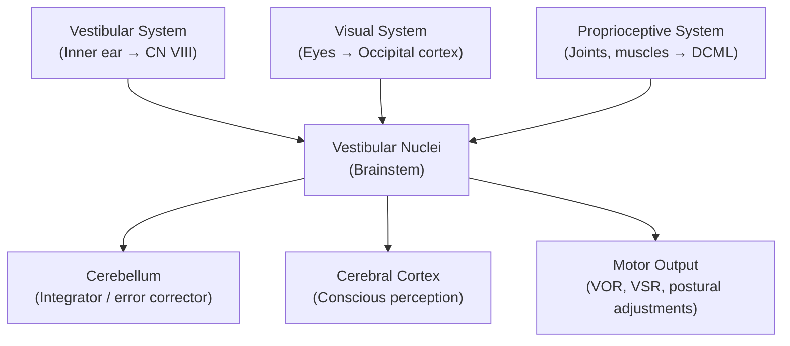

# Dizziness — Definition, Epidemiology, Risk Factors, Anatomy, Aetiology, Pathophysiology, Classification and Clinical Features

## 1. Definition and Terminology

"Dizziness" is one of the most imprecise words in medicine. Patients use it to describe at least four fundamentally different sensations, and your first job is to **figure out which one they mean**. Getting this wrong sends you down the completely wrong diagnostic pathway.

> **Dizziness** = a non-specific umbrella term for any subjective sensation of disturbed spatial orientation or impaired stability. It is **not** a diagnosis — it is a symptom that must be subcategorised before any meaningful workup can begin.

The word itself comes from Old English *dysig* = "foolish, stupid" — originally describing a muddled mental state.

### 1.1 The Four Subtypes of "Dizziness"

| Subtype | Patient's description | What it actually is | Key mechanism |
|---|---|---|---|
| **Vertigo** | "The room is spinning" / "I'm spinning" | ***An illusion of rotational or linear movement*** | Asymmetric vestibular input (peripheral or central) |
| **Presyncope / Lightheadedness** | "I feel faint, like I'm about to pass out" | ***Impending loss of consciousness*** | ↓ global cerebral perfusion (↓CO, ↓BP, hypoglycaemia) |
| **Disequilibrium** | "I feel off-balance, unsteady on my feet" | ***Impaired balance without head sensation*** | Sensory (proprioceptive / visual / vestibular) or motor (cerebellar / extrapyramidal) deficit |
| **Non-specific / psychogenic dizziness** | "I feel light-headed, weird, floaty, spaced out" | ***Ill-defined sensation, often chronic*** | Anxiety, hyperventilation, somatisation, depression, PPPD |

***Careful history to determine if the problem is vertigo or pseudovertigo (giddiness, faintness or disequilibrium)*** [1].

<Callout title="Clinical Pearl" type="idea">
The single most important question in dizziness is: **"What exactly do you mean by dizzy?"** Ask the patient to describe the sensation *without* using the word "dizzy." Offer prompts: "Do you feel the room spinning? Do you feel like you're about to faint? Do you feel off-balance when you walk?" This one question determines the entire diagnostic direction.
</Callout>

<Callout title="Common Exam Mistake" type="error">
Students often conflate "vertigo" with "dizziness." **Vertigo is a subset of dizziness** — specifically, an illusion of movement (usually rotational). Not all dizziness is vertigo, and not all vertigo is peripheral. Always subcategorise first.
</Callout>

---

## 2. Epidemiology

### 2.1 Prevalence and Incidence

- **Dizziness** is one of the most common presenting complaints in primary care and emergency medicine [2]:
  - Lifetime prevalence: ~20–30% of the general population
  - Accounts for **~5% of all primary care visits** and **~4% of Emergency Department presentations**
  - Prevalence increases markedly with age: ~30% of those > 65 years have experienced significant dizziness
- **Vertigo** specifically:
  - 1-year prevalence: ~5% in the general population
  - BPPV alone affects ~2.4% of the population at some point in their lives
  - Vestibular neuritis / acute vestibulopathy: incidence ~3.5/100k/year

### 2.2 Demographics

- **Sex**: Female > Male for most vestibular causes (~2:1 for BPPV, Ménière's disease)
  - *Why?* Hormonal factors (oestrogen affects inner ear fluid homeostasis), higher prevalence of migraine in women, and possibly different otoconia composition
- **Age**:
  - Young adults: ***anxiety–hyperventilation***, vestibular neuritis, vestibular migraine, BPPV
  - Middle-aged: Ménière's disease (peak 40–60y), vestibular migraine
  - Elderly: ***postural hypotension***, BPPV (most common single cause in the elderly), cerebrovascular disease, ***multifactorial dizziness*** [1]
    - ***"Dizziness is often multifactorial, especially in the elderly"*** [1]

### 2.3 Hong Kong Context

- Ageing population → rising prevalence of multifactorial dizziness, postural hypotension, polypharmacy-related dizziness
- High prevalence of cerebrovascular risk factors (hypertension, DM, smoking) → vertebrobasilar insufficiency is an important consideration
- Stroke is the **2nd–3rd leading cause of death in HK** [3] — always consider posterior circulation stroke in acute vestibular syndrome

---

## 3. Anatomy and Physiology of Balance

Understanding the anatomy is **essential** because the clinical approach to dizziness is fundamentally anatomical — you are localizing where the problem is.

### 3.1 The Three Sensory Inputs for Balance

The brain maintains spatial orientation and postural stability by integrating information from **three sensory systems**. A mismatch between these systems is what produces the sensation of dizziness.

#### 3.1.1 The Vestibular System (Inner Ear)

This is the **primary system for detecting head movement and position relative to gravity**.

**Peripheral vestibular apparatus** (located in the petrous temporal bone):

| Structure | What it detects | How |
|---|---|---|
| **3 Semicircular canals** (horizontal/anterior/posterior) | Angular (rotational) acceleration of the head | Endolymph flow deflects the cupula in the ampulla → bends hair cells → changes firing rate of CN VIII |
| **Utricle** | Linear acceleration + static head tilt in the horizontal plane | Otoconia (calcium carbonate crystals) on gelatinous membrane exert shearing force on hair cells |
| **Saccule** | Linear acceleration + static head tilt in the vertical plane | Same otolithic mechanism as utricle |

- The vestibular nerve (part of CN VIII = **vestibulocochlear** nerve; "vestibulo" = balance, "cochlear" = hearing) projects to the **vestibular nuclei** in the brainstem (at the pontomedullary junction).

**Key reflexes mediated by the vestibular system:**
- **Vestibulo-ocular reflex (VOR)**: stabilises gaze during head movement → eyes move equal and opposite to head. *This is what the head impulse test tests.*
- **Vestibulo-spinal reflex (VSR)**: maintains upright posture and balance

**Central vestibular pathways:**
- Vestibular nuclei → cerebellum (vestibulocerebellum = **flocculonodular lobe**) → modulates vestibular reflexes [4]
- Vestibular nuclei → thalamus → cortex (temporo-parietal junction) → conscious perception of movement
- Vestibular nuclei → medial longitudinal fasciculus (MLF) → CN III, IV, VI nuclei → coordinated eye movements

#### 3.1.2 The Visual System

- Provides spatial reference frame — tells the brain "this is up, this is the horizon"
- Visual–vestibular mismatch → motion sickness, visual vertigo

#### 3.1.3 The Proprioceptive System

- Joint position sensors (especially cervical spine, ankles) and muscle spindles
- Travels via the dorsal column–medial lemniscal (DCML) pathway
- Loss → **sensory ataxia** (positive Romberg sign, because removing visual compensation unmasks the proprioceptive deficit)

### 3.2 The Cerebellum as Integrator

The cerebellum, particularly the **vestibulocerebellum (flocculonodular lobe)** and the **spinocerebellum (vermis)**, integrates all three inputs and calibrates motor output [4].

- **Midline (vermis/flocculonodular) lesions** → nystagmus, truncal ataxia, gait disturbance
- **Hemispheric lesions** → limb ataxia, dysmetria, intention tremor, dysdiadochokinesia

### 3.3 Cerebral Blood Flow and Syncope

- The brain requires ~50 mL/100g/min of blood flow
- ***LOC occurs ≤10 seconds of hypoperfusion to the reticular activating system (RAS) in the midbrain*** [2][5]
- This is why cardiac causes of dizziness can kill — they cut off perfusion to the RAS

### 3.4 The Cervical Spine

- Cervical proprioceptors contribute to spatial orientation
- ***Cervical dysfunction/spondylosis*** is listed as a probability diagnosis [1] — cervicogenic dizziness arises from abnormal proprioceptive input from degenerative cervical joints/muscles

---

## 4. Risk Factors

Risk factors vary by the underlying cause but can be broadly grouped:

### 4.1 General Risk Factors for Dizziness

| Category | Specific Factors | Mechanism |
|---|---|---|
| **Age** | Elderly (> 65y) | Multisensory decline (vestibular hair cell loss, ↓proprioception, ↓visual acuity), postural hypotension, polypharmacy, cerebrovascular disease |
| **Medications** | ***Antihypertensives, antidepressants, aspirin/salicylates, glyceryl trinitrate, benzodiazepines, major tranquillisers, antiepileptics, antibiotics (aminoglycosides)*** [1] | Postural hypotension (antihypertensives, GTN), vestibulotoxicity (aminoglycosides), CNS depression (BZD, neuroleptics), cerebellar toxicity (phenytoin, carbamazepine) |
| **Cardiovascular** | HTN, AF, aortic stenosis, heart failure | ↓CO → ↓cerebral perfusion, or embolic events |
| **Cerebrovascular** | DM, smoking, dyslipidaemia, previous stroke/TIA | ***Vertebrobasilar insufficiency***, posterior circulation stroke [1][3] |
| **Psychiatric** | Anxiety, depression, panic disorder | Hyperventilation → ↓PaCO₂ → cerebral vasoconstriction; somatisation |
| **Recent infection** | ***Recent URTI*** [1] | Post-viral vestibular neuritis / acute vestibulopathy |
| **Head injury** | ***Post head injury*** [1] | Post-traumatic BPPV (otoconia displacement), labyrinthine concussion, postconcussion syndrome |
| **Metabolic** | Anaemia, hypoglycaemia, dehydration | ↓O₂ delivery, ↓cerebral perfusion |
| **Vestibular risk factors** | Migraine history, motion sickness susceptibility, prior vestibular episode | Vestibular migraine, recurrent BPPV |

<Callout title="High Yield – Drug-Induced Dizziness">
***"Commonly prescribed drugs, especially antihypertensives, antidepressants, aspirin and salicylates, glyceryl trinitrate, benzodiazepines, major tranquillisers, antiepileptics and antibiotics, can cause dizziness."*** [1]

Always take a thorough drug history in any dizzy patient. In the elderly, polypharmacy is the **single most correctable** cause of dizziness.
</Callout>

---

## 5. Aetiology (with Pathophysiology)

This is the core of the clinical approach. Organised by Murtagh's framework and supplemented with senior notes [1][2][5].

### 5.1 Probability Diagnoses (Common Causes)

These are what you should think of **first** in a dizzy patient:

> ***Probability diagnosis:*** [1]
> - ***Anxiety–hyperventilation***
> - ***Postural hypotension***
> - ***Simple faint — vasovagal***
> - ***Acute vestibulopathy (V) — viral illness***
> - ***Benign paroxysmal positional vertigo (V)***
> - ***Motion sickness (V)***
> - ***Post head injury (V)***
> - ***Cervical dysfunction/spondylosis***
>
> ***Note: V = vertigo***

#### 5.1.1 Anxiety–Hyperventilation

- **Pathophysiology**: Anxiety triggers sympathetic activation → rapid, shallow breathing → "hyperventilation" → excessive CO₂ blowing off → **↓PaCO₂ (respiratory alkalosis)** → **cerebral vasoconstriction** (CO₂ is a potent cerebral vasodilator, so ↓CO₂ = ↓cerebral blood flow) → lightheadedness, paraesthesia (perioral, fingertips), chest tightness, palpitations
  - Alkalosis also causes ↑protein-bound Ca²⁺ → ↓ionised Ca²⁺ → neuromuscular excitability → tetany, carpopedal spasm
- **Clinical picture**: chronic / episodic non-specific dizziness ("floaty, spaced out"), often with associated panic symptoms; resolves with slow breathing / paper bag rebreathing
- **Context**: very common in young adults, F > M, often with known anxiety/panic disorder

#### 5.1.2 Postural (Orthostatic) Hypotension

- **Definition**: ↓SBP ≥ 20 mmHg or ↓DBP ≥ 10 mmHg within 3 minutes of standing from supine
- **Pathophysiology**: On standing, ~500–1000 mL of blood pools in the lower extremities and splanchnic bed due to gravity → normally compensated by baroreceptor reflex → ↑sympathetic tone → vasoconstriction + ↑HR → maintains BP. If this reflex is impaired → ↓cerebral perfusion → presyncope/syncope
- **Causes**:
  - ***Drugs*** (most common correctable cause): antihypertensives, diuretics, α-blockers, vasodilators, TCAs, phenothiazines, antiparkinsonian drugs
  - **Autonomic neuropathy**: diabetes (commonest cause of autonomic neuropathy — ***postural tachycardia with lightheadedness, dizziness, presyncope*** [6]), Parkinson's disease, MSA, amyloidosis
  - **Hypovolaemia**: dehydration, haemorrhage, adrenal insufficiency
  - **Prolonged bed rest / deconditioning**: especially in elderly hospitalised patients

#### 5.1.3 Vasovagal Syncope (Simple Faint) — ***"Neurocardiogenic Syncope (60%)"*** [2][5]

- **Pathophysiology**: An exaggerated autonomic (Bezold-Jarisch) reflex:
  1. Trigger (prolonged standing, emotional stress, pain, heat) → venous pooling → ↓venous return → ↓stroke volume
  2. Heart contracts vigorously on an under-filled ventricle → mechanoreceptors in LV wall are activated
  3. Paradoxical vagal activation ("vasovagal") → **↓HR (cardioinhibitory)** and/or **↓SVR (vasodepressor)** → ↓BP → ↓cerebral perfusion → presyncope or syncope
- **Prodrome** (vagal activation): ***nausea, lightheadedness, sweating***, pallor, tunnel vision [2][5]
- **Episode**: ***usually when standing, associated with situational trigger (cough, eating, drinking cold liquid, urination…), usually brief (in minutes), pallor*** [2][5]
- **Recovery**: relatively rapid with recumbency, no postictal confusion (cf. seizures)

#### 5.1.4 Acute Vestibulopathy (Vestibular Neuritis / Labyrinthitis)

- The name tells you: "vestibular" = balance system, "neuritis" = nerve inflammation, "labyrinthitis" = inner ear labyrinth inflammation
- **Pathophysiology**: Viral infection (often preceded by ***recent URTI*** [1]) → inflammation and damage to the vestibular nerve (usually the superior division) or labyrinth → **sudden unilateral loss of vestibular input** → asymmetric tonic vestibular firing → brain interprets the mismatch as rotation → **severe acute vertigo**
  - The intact side has a higher baseline firing rate → the brain perceives rotation *towards* the intact side
  - Commonly attributed to HSV-1 reactivation (analogous to Bell's palsy)
- **Vestibular neuritis** = vertigo only (vestibular nerve affected, cochlea spared)
- **Labyrinthitis** = vertigo + hearing loss ± tinnitus (labyrinth involved → both vestibular and cochlear components)
- ***"A sudden attack of vertigo in a young person after a recent URTI suggests vestibular neuronitis"*** [1]

#### 5.1.5 Benign Paroxysmal Positional Vertigo (BPPV)

- Break down the name: ***"benign"*** = not dangerous, ***"paroxysmal"*** = sudden attacks, ***"positional"*** = triggered by head position, ***"vertigo"*** = spinning sensation
- **Pathophysiology — Canalithiasis theory** (the accepted mechanism):
  - **Otoconia** (calcium carbonate crystals) dislodge from the utricle (due to degeneration, trauma, or idiopathic reasons) and migrate into one of the **semicircular canals** (most commonly the **posterior canal**, ~80%)
  - With certain head movements (rolling over in bed, looking up, bending forward), the displaced otoconia move within the canal due to gravity → this deflects the cupula → generates an **abnormal signal of rotation** → brief but intense vertigo
  - Because the otoconia settle within seconds, the vertigo is **brief (< 60 seconds per episode)** and **fatigable** (repeated positioning → diminishing response, because the otoconia gradually disperse)
- **Clinical pattern**: paroxysmal, positional, brief, fatigable — the name IS the clinical description
- **Epidemiology**: most common cause of vertigo overall; incidence increases with age, F > M; associated with head trauma, prior vestibular neuritis, osteoporosis (↑otoconia degeneration)

#### 5.1.6 Motion Sickness

- **Pathophysiology**: Sensory conflict theory — the vestibular system signals movement (e.g., on a boat), but visual input says "not moving" (e.g., reading below deck) → **sensory mismatch** → the brain interprets this as possible neurotoxin ingestion (an evolutionary protective mechanism) → triggers nausea and vomiting via the chemoreceptor trigger zone (CTZ) and vomiting centre
  - Key receptors involved: H₁ (histamine) and mACh (muscarinic) in the vestibular nuclei [7]
- **Treatment targets these receptors**: antihistamines (cinnarizine, dimenhydrinate), anticholinergics (hyoscine/scopolamine)

#### 5.1.7 Post-Head Injury Vertigo

- **Mechanism**: Trauma → dislodges otoconia → **post-traumatic BPPV** (most common); or labyrinthine concussion, perilymphatic fistula, temporal bone fracture → direct vestibular damage
- Part of the **post-concussion syndrome**: dizziness + headache + cognitive difficulties + fatigue lasting weeks to months after mild TBI

#### 5.1.8 Cervical Dysfunction / Spondylosis

- **Pathophysiology**: Cervical proprioceptors (especially C1-C3 facet joints and deep neck muscles) provide important input to the vestibular nuclei. Degenerative changes, muscle spasm, or injury to the cervical spine → **abnormal proprioceptive signalling** → mismatch with vestibular and visual input → vague dizziness/unsteadiness (not true vertigo)
- Typically in middle-aged to elderly patients with cervical osteoarthritis
- Dizziness is often associated with neck pain and movement

---

### 5.2 Serious Disorders Not to Be Missed

> ***Serious disorders not to be missed:*** [1]
> - ***Neoplasia/cancer:***
>   - ***Acoustic neuroma***
>   - ***Posterior fossa tumour***
>   - ***Other brain tumours, primary or secondary***
> - ***Intracerebral infection (e.g. abscess)***
> - ***Cardiovascular:***
>   - ***Arrhythmias***
>   - ***Myocardial infarction***
>   - ***Aortic stenosis***
> - ***Cerebrovascular:***
>   - ***Vertebrobasilar insufficiency***
>   - ***Brain stem infarct (e.g. PICA thrombosis)***
> - ***Multiple sclerosis***

#### 5.2.1 Acoustic Neuroma (Vestibular Schwannoma)

- "Acoustic" = hearing nerve (misnomer — actually arises from vestibular portion of CN VIII), "neuroma" = nerve tumour; more correctly called **vestibular schwannoma** ("Schwann" cells = cells that myelinate peripheral nerves)
- **Pathophysiology**: Benign tumour of Schwann cells on the vestibular portion of CN VIII → grows slowly in the **cerebellopontine angle (CPA)** → progressive unilateral vestibular dysfunction
  - Because it grows slowly, the brain compensates for the gradual vestibular asymmetry → patients rarely get acute vertigo; instead they get **progressive unilateral hearing loss (sensorineural)** + tinnitus + mild unsteadiness
  - As it enlarges: compresses CN V (facial numbness), CN VII (facial weakness), cerebellum (ataxia), brainstem (↑ICP signs)
- **Association**: NF2 (bilateral vestibular schwannomas) [8]
- ***Consider MRI, especially if acoustic neuroma or other tumour suspected*** [1]

#### 5.2.2 Posterior Fossa / Brain Tumours

- Any tumour in the posterior fossa (cerebellum, brainstem, CPA) can cause vertigo/disequilibrium [1][8]
- **Mechanism**: direct compression or infiltration of vestibular nuclei, cerebellar peduncles, or vestibular nerve; ± obstructive hydrocephalus (4th ventricle obstruction) → ↑ICP → headache, N/V, papilloedema [9]
- Metastatic brain tumours (lung, breast, melanoma most common) [8] may present with dizziness as part of posterior fossa involvement

#### 5.2.3 Intracerebral Infection (e.g. Abscess)

- **Mechanism**: Space-occupying lesion → mass effect + surrounding oedema + ↑ICP → dizziness, headache, focal deficits, ± fever
- Posterior fossa abscess → direct vestibular/cerebellar dysfunction

#### 5.2.4 Cardiovascular Causes

These cause dizziness via **↓cardiac output → ↓cerebral perfusion → presyncope/syncope** [2][5]:

| Cause | Mechanism | Key features |
|---|---|---|
| ***Arrhythmias*** | Tachy- or bradyarrhythmia → ↓effective CO → ↓cerebral perfusion | Palpitations, sudden onset, may occur in any position, brief |
| ***Myocardial infarction*** | ↓LV function → ↓CO; or arrhythmia as complication | Chest pain, diaphoresis, SOB, risk factors for IHD |
| ***Aortic stenosis*** | Fixed obstruction to LVOT → cannot ↑CO with exertion → **exertional syncope** | Exertional dizziness/syncope, crescendo-decrescendo murmur, narrow pulse pressure |

- ***Cardiac syncope accounts for ~15% of syncope cases*** but carries **30% mortality if cardiac cause** [2][5] — this is why you must **not miss it**.

#### 5.2.5 Cerebrovascular Causes

| Cause | Mechanism | Key features |
|---|---|---|
| ***Vertebrobasilar insufficiency (VBI)*** | Atherosclerosis of vertebral/basilar arteries → ↓posterior circulation blood flow → transient ischaemia of brainstem, cerebellum, occipital cortex | Episodes of vertigo + other posterior circulation symptoms (diplopia, dysarthria, dysphagia, drop attacks, visual field defects) — the "5 D's" |
| ***Brainstem infarct (e.g. PICA thrombosis)*** | PICA (posterior inferior cerebellar artery) supplies the lateral medulla → occlusion = **lateral medullary syndrome (Wallenberg)** | Acute vertigo, nystagmus, ipsilateral facial pain/numbness, Horner's syndrome, contralateral body pain/temperature loss, dysphagia, hoarseness |

- **Why PICA stroke is a mimicker of vestibular neuritis**: Both present with acute vertigo + nausea + nystagmus. The key differences are: (a) central signs like skew deviation, direction-changing nystagmus, inability to walk, other brainstem signs; (b) **HINTS exam** (Head Impulse, Nystagmus, Test of Skew) — peripheral causes have a **positive head impulse test** (catch-up saccade), while central causes have a **negative head impulse test** (VOR intact because the lesion is central, not at the vestibular nerve/labyrinth).

<Callout title="Must Know for Exams — PICA Stroke vs Vestibular Neuritis" type="error">
An acute vestibular syndrome (sudden vertigo + nausea + nystagmus + unsteadiness) has only TWO major diagnoses:
1. **Vestibular neuritis** (peripheral — safe)
2. **Posterior circulation stroke** (central — dangerous)

The **HINTS exam** at the bedside is **more sensitive than early MRI** (within 24–48h) for distinguishing these. A **normal (negative) head impulse test** in acute vestibular syndrome is **concerning for stroke**, not reassuring.
</Callout>

#### 5.2.6 Multiple Sclerosis

- **Pathophysiology**: Autoimmune demyelination of CNS white matter → lesions in brainstem (vestibular nuclei, MLF), cerebellar peduncles, or vestibular nerve root entry zone → vertigo/disequilibrium
- Vertigo is a presenting symptom in ~5–10% of MS; occurs at some point in ~30–50%
- **Internuclear ophthalmoplegia (INO)** — a classic MS finding — arises from an MLF lesion and causes impaired adduction on the side of the lesion + nystagmus of the abducting eye; this is a *central* oculomotor sign
- Typically young adult (20–40y), F > M, relapsing-remitting course

---

### 5.3 Other Important Aetiologies (Not in Murtagh's List but Clinically Important)

#### 5.3.1 Ménière's Disease

- "Ménière" = Prosper Ménière, French physician who first described it
- **Pathophysiology**: **Endolymphatic hydrops** — excess endolymph accumulates in the membranous labyrinth (cochlea and vestibular apparatus) → distension → disrupts normal hair cell function → episodic vertigo + fluctuating hearing loss + tinnitus + aural fullness
  - The episodes are thought to occur when the distended Reissner's membrane ruptures → mixing of endolymph (high K⁺) and perilymph (high Na⁺) → potassium-mediated depolarisation and then paralysis of hair cells → acute vertigo + hearing loss
- **Clinical triad** (classic): episodic vertigo (20 min to hours) + fluctuating low-frequency sensorineural hearing loss + tinnitus (± aural fullness)
- Unilateral initially (becomes bilateral in ~30% over time)

#### 5.3.2 Vestibular Migraine

- The **second most common cause of episodic vertigo** (after BPPV); increasingly recognised
- **Pathophysiology**: Migraine-associated cortical spreading depression and trigeminal-vascular activation may modulate vestibular nuclei processing → episodic vertigo with or without headache
- **Key features**: recurrent episodic vertigo (5 min to 72h) in a patient with migraine history; may have migrainous features (photophobia, phonophobia, visual aura) during attacks; headache may or may not accompany the vertigo
- Often overlaps with Ménière's disease clinically; important to consider in young/middle-aged women with episodic vertigo and a migraine history

#### 5.3.3 Drug-Induced Dizziness and Vestibulotoxicity

- ***"Commonly prescribed drugs, especially antihypertensives, antidepressants, aspirin and salicylates, glyceryl trinitrate, benzodiazepines, major tranquillisers, antiepileptics and antibiotics, can cause dizziness"*** [1]
- **Aminoglycosides** (gentamicin, streptomycin): directly toxic to vestibular hair cells → bilateral vestibulopathy → **oscillopsia** (visual blurring with head movement because VOR is lost bilaterally) + chronic disequilibrium
- **Phenytoin, carbamazepine**: cerebellar toxicity → nystagmus, ataxia, slurred speech [4]
- **Loop diuretics** (furosemide): ototoxicity at high doses, especially with concurrent aminoglycosides

#### 5.3.4 Persistent Postural-Perceptual Dizziness (PPPD)

- The modern terminology for what was previously called "chronic subjective dizziness" or "phobic postural vertigo"
- **Pathophysiology**: After an initial vestibular insult (e.g., BPPV episode, vestibular neuritis), maladaptive central processing persists even after the peripheral lesion has resolved → chronic non-specific dizziness worsened by upright posture, active/passive motion, and complex visual stimuli
- Essentially a **functional disorder of vestibular processing** — the hardware has recovered but the software hasn't recalibrated
- Important because it's very common and treatable (with vestibular rehabilitation ± SSRIs)

#### 5.3.5 Anaemia and Metabolic Causes

- **Anaemia**: ↓O₂ carrying capacity → ↓O₂ delivery to brain → dizziness, especially with exertion or postural change [10]
  - ***"Acute/severe: SOB (esp on exertion), palpitation, dizziness/syncope (may be postural)"*** [10]
- **Hypoglycaemia**: glucose is the brain's primary fuel → ↓glucose → neuroglycopenia → dizziness, confusion, tremor, sweating (adrenergic response)
- **Dehydration / hypovolaemia**: ↓circulating volume → ↓preload → ↓CO → ↓cerebral perfusion

#### 5.3.6 Diabetic Autonomic Neuropathy

- ***"Orthostatic hypotension due to central/peripheral sympathetic denervation"*** and ***"Postural tachycardia with lightheadedness, dizziness, presyncope"*** are manifestations of diabetic autonomic neuropathy [6]
- Mechanism: chronic hyperglycaemia → metabolic/osmotic neurotoxicity → damage to autonomic nerve fibres → impaired baroreceptor reflex → postural hypotension

#### 5.3.7 Polycythaemia Vera (PV)

- ***Hyperviscosity-related symptoms: headache, dizziness, blackouts*** [11]
- Mechanism: ↑RBC mass → ↑blood viscosity → ↓cerebral blood flow and ↓oxygen delivery despite polycythaemia → dizziness

---

## 6. Classification

Dizziness can be classified in multiple ways. The most clinically useful frameworks:

### 6.1 By Symptom Type (as above)

| Type | Examples |
|---|---|
| **Vertigo** | BPPV, vestibular neuritis, Ménière's, vestibular migraine, central causes |
| **Presyncope/Syncope** | Vasovagal, cardiac arrhythmia, aortic stenosis, orthostatic hypotension |
| **Disequilibrium** | Peripheral neuropathy, cerebellar disease, Parkinson's disease, bilateral vestibulopathy |
| **Non-specific** | Anxiety/hyperventilation, depression, PPPD, polypharmacy, metabolic |

### 6.2 Vertigo: Peripheral vs Central

This is the **single most important clinical distinction** within vertigo:

| Feature | Peripheral Vertigo | Central Vertigo |
|---|---|---|
| **Lesion site** | Inner ear or CN VIII | Brainstem, cerebellum, vestibular nuclei |
| **Onset** | Sudden, often severe | May be sudden or gradual |
| **Nystagmus** | Unidirectional, horizontal-torsional; suppressed by visual fixation | Direction-changing or purely vertical/torsional; NOT suppressed by fixation |
| **Hearing loss / tinnitus** | May be present (labyrinthitis, Ménière's) | Usually absent (unless AICA stroke) |
| **Brainstem signs** | Absent | Present (diplopia, dysarthria, dysphagia, crossed sensory/motor deficits, Horner's) |
| **Head impulse test** | Positive (abnormal) — catch-up saccade | Negative (normal) — VOR intact |
| **Severity of vertigo** | Often very severe | May be moderate; sometimes imbalance > vertigo |
| **Examples** | BPPV, vestibular neuritis, Ménière's, labyrinthitis | Posterior circulation stroke, MS, cerebellar tumour, vestibular migraine |

### 6.3 Timing-Based Classification of Vertigo

| Timing pattern | Duration | Causes |
|---|---|---|
| **Episodic, seconds** | < 1 min | **BPPV** (positional trigger) |
| **Episodic, minutes to hours** | Minutes to 24h | **Ménière's disease**, **vestibular migraine**, TIA |
| **Acute, persistent** | Days to weeks | **Vestibular neuritis**, posterior circulation stroke, MS relapse |
| **Chronic** | Weeks to months | PPPD, bilateral vestibulopathy, acoustic neuroma (progressive unsteadiness), cerebellar degeneration |

### 6.4 By Mechanism (Syncope Classification) [2][5]

| Mechanism | Proportion | Examples |
|---|---|---|
| ***Cardiac syncope*** | ***15%*** | ***Arrhythmic (10%): tachy/bradyarrhythmia; Structural (5%): AS, HCM, PE*** |
| ***Neurocardiogenic syncope*** | ***60%*** | ***Vasovagal, situational (micturition, cough, defaecation, carotid sinus hypersensitivity)*** |
| ***Postural hypotension*** | ***15%*** | ***Drugs, autonomic neuropathy, hypovolaemia*** |
| ***Unexplained*** | ***~10%*** | |

---

## 7. Clinical Features

### 7.1 History — The Key Questions

***"Careful history to determine if the problem is vertigo or pseudovertigo (giddiness, faintness or disequilibrium). Check for neurological symptoms, aural symptoms and visual symptoms. Recent history of respiratory infection or head injury. Drug history including illicit drugs and alcohol (?acute intoxication)."*** [1]

The approach should be systematic:

#### Step 1: What type of dizziness?
- "Describe the sensation without using the word 'dizzy'"
- Spinning → vertigo
- About to faint → presyncope
- Off-balance → disequilibrium
- Vague/floaty → non-specific

#### Step 2: Timing
- **Episodic or continuous?**
- **Duration of each episode**: seconds (BPPV), minutes-hours (Ménière's, vestibular migraine), days (vestibular neuritis, stroke), chronic (PPPD, acoustic neuroma)
- **First episode or recurrent?**

#### Step 3: Triggers
- **Positional**: turning head, rolling in bed, looking up → BPPV
- **Exertional**: suggests cardiac cause (aortic stenosis, HCM) or cardiac arrhythmia
- **Standing up**: orthostatic hypotension
- **Situational**: coughing, micturition, swallowing → situational syncope
- **Emotional stress, prolonged standing, hot environment**: vasovagal
- **Head movement (any)**: cervicogenic, bilateral vestibulopathy
- **Valsalva / loud noise**: superior semicircular canal dehiscence (Tullio phenomenon)

#### Step 4: Associated symptoms

| Symptom category | Symptoms | Suggests |
|---|---|---|
| ***Aural*** | Hearing loss, tinnitus, aural fullness | Ménière's disease, labyrinthitis, acoustic neuroma |
| ***Neurological*** | ***Diplopia, dysarthria, dysphagia, limb weakness, numbness, facial droop*** | ***Central cause: stroke, MS, posterior fossa tumour*** [1] |
| ***Cardiac*** | Palpitations, chest pain, exertional component | Arrhythmia, MI, aortic stenosis |
| ***Autonomic*** | Nausea, sweating, pallor before episode | Vasovagal (prodrome) |
| ***Psychiatric*** | Anxiety, hyperventilation, panic, depersonalisation | Anxiety/hyperventilation, PPPD |
| ***Headache*** | Migraine features (photophobia, phonophobia, aura) | Vestibular migraine |
| ***Preceding URTI*** | Fever, rhinorrhoea, cough 1–2 weeks prior | ***Vestibular neuritis*** [1] |

#### Step 5: Drug History — ALWAYS ask

***Antihypertensives, antidepressants, aspirin/salicylates, GTN, benzodiazepines, major tranquillisers, antiepileptics, antibiotics*** [1], plus alcohol and illicit drugs

### 7.2 Symptoms by Aetiology with Pathophysiological Basis

#### 7.2.1 BPPV Symptoms
| Symptom | Pathophysiological basis |
|---|---|
| Brief (< 60s) spinning vertigo | Displaced otoconia deflect cupula on positional change → abnormal rotational signal → brain perceives movement that isn't happening |
| Triggered by specific positions (rolling over, looking up, bending down) | Gravity moves the otoconia within the canal only in specific head orientations relative to gravity |
| Nausea (± vomiting) | Vestibular input to CTZ and vomiting centre via vestibular nuclei |
| **No hearing loss** | Cochlea is not involved — otoconia are in the semicircular canals |
| Fatigability (repeated positioning → less vertigo) | Otoconia disperse with repeated movement, reducing the abnormal cupular deflection |

#### 7.2.2 Vestibular Neuritis Symptoms
| Symptom | Pathophysiological basis |
|---|---|
| Sudden severe rotational vertigo, constant for hours to days | Acute unilateral loss of vestibular nerve function → tonic firing asymmetry → perception of rotation |
| Nausea, vomiting (often severe) | Vestibular nuclear connections to CTZ and vomiting centre |
| Spontaneous horizontal-torsional nystagmus (beating away from lesion) | Intact side has higher firing → drives slow phase towards lesion; fast phase (nystagmus direction) towards intact side |
| Imbalance (falls/leans towards affected side) | Loss of vestibulospinal reflex on affected side → reduced postural tone ipsilaterally |
| Worsened by head movement | Any movement accentuates the asymmetric vestibular input |
| **No hearing loss** (vs labyrinthitis) | Vestibular nerve is affected, but cochlear nerve is spared |

#### 7.2.3 Ménière's Disease Symptoms
| Symptom | Pathophysiological basis |
|---|---|
| Episodic vertigo (20 min – hours) | Endolymphatic hydrops → distortion and periodic rupture of Reissner's membrane → K⁺ intoxication of hair cells → acute vestibular dysfunction |
| Fluctuating low-frequency hearing loss | Hydrops initially affects the cochlear apex (which transduces low frequencies) → distortion of basilar membrane mechanics |
| Tinnitus (roaring quality) | Abnormal hair cell stimulation from endolymphatic pressure changes |
| Aural fullness | Increased endolymphatic pressure → mechanical distension felt as "blocked ear" sensation |
| Nausea/vomiting during attacks | Vestibular → CTZ pathway |

#### 7.2.4 Vasovagal Presyncope/Syncope Symptoms
| Symptom | Pathophysiological basis |
|---|---|
| ***Lightheadedness, feeling "about to faint"*** | ↓cerebral perfusion (↓BP and/or ↓HR) → insufficient blood to RAS |
| ***Nausea, sweating, pallor*** (prodrome) [2][5] | Vagal activation: parasympathetic stimulation → ↑GI motility (nausea), cholinergic sweating; ↓sympathetic → peripheral vasodilatation → pallor |
| Tunnel vision, "greying out" | Retinal ischaemia (retinal cells very sensitive to hypoperfusion) |
| ***LOC if complete syncope, spontaneous recovery*** | RAS hypoperfusion → LOC; recumbency restores cerebral perfusion → consciousness returns |

#### 7.2.5 Cardiac Syncope Symptoms
| Symptom | Pathophysiological basis |
|---|---|
| ***Sudden onset, in any position*** [2][5] | Arrhythmia or obstruction occurs regardless of posture (cf. vasovagal which needs standing) |
| ***± preceded by palpitation, chest pain*** [2][5] | Palpitation = awareness of arrhythmia; chest pain = myocardial ischaemia |
| ***Usually brief (< 1 min)*** [2][5] | If the arrhythmia self-terminates, perfusion returns quickly |
| ***Extreme "death-like" pallor*** [2][5] | Profound ↓CO → maximal sympathetic vasoconstriction to redirect blood centrally → extreme cutaneous pallor |
| ***± associated with exertion (esp LVOT obstruction)*** [2][5] | Aortic stenosis/HCM: fixed obstruction cannot accommodate ↑CO demand during exercise → exertional syncope |

#### 7.2.6 Posterior Circulation Stroke/VBI Symptoms
| Symptom | Pathophysiological basis |
|---|---|
| Acute vertigo | Ischaemia of vestibular nuclei (brainstem) or cerebellum |
| Diplopia | CN III, IV, or VI nuclei ischaemia (all in brainstem) |
| Dysarthria | Ischaemia of lower cranial nerve nuclei (CN IX, X, XII) or cerebellar connections |
| Dysphagia | CN IX, X nuclei ischaemia |
| Drop attacks (sudden falls without LOC) | Reticular formation or vestibulospinal tract ischaemia |
| Crossed deficits (ipsilateral face, contralateral body) | Classic brainstem lesion pattern — cranial nerve nuclei (ipsilateral) + long tracts (contralateral, as they cross below) |

### 7.3 Signs with Pathophysiological Basis

***"Key examination: General examination including gait; Cardiovascular, auditory and neurological examinations; Hallpike manoeuvre and Epley test; Forced hyperventilation test"*** [1]

#### 7.3.1 General Examination
| Sign | What it suggests | Why |
|---|---|---|
| **Postural hypotension** (↓SBP ≥ 20 / ↓DBP ≥ 10 on standing) | Orthostatic hypotension | Impaired baroreceptor reflex → insufficient vasoconstriction on standing |
| **Pallor** | Anaemia, vasovagal | ↓Hb → pale conjunctivae/palmar creases; sympathetic vasoconstriction → pallor |
| **Irregular pulse** | Arrhythmia (eg AF) | Irregular ventricular response → variable stroke volume → intermittent ↓CO |

#### 7.3.2 Cardiovascular Examination
| Sign | What it suggests | Why |
|---|---|---|
| **Ejection systolic murmur** (crescendo-decrescendo, RUSB, radiating to carotids) | ***Aortic stenosis*** | Fixed LVOT obstruction → turbulent flow across narrowed valve |
| **Slow-rising pulse, narrow pulse pressure** | Aortic stenosis | Prolonged ejection time, reduced stroke volume |
| **Irregular pulse** | AF, other arrhythmias | Irregular atrial impulses → variable R-R interval |

#### 7.3.3 Auditory Examination
| Sign | What it suggests | Why |
|---|---|---|
| **Unilateral sensorineural hearing loss** | Acoustic neuroma, Ménière's, labyrinthitis | Damage to cochlear nerve (schwannoma), cochlear hair cells (hydrops, inflammation) |
| **Tuning fork tests**: Rinne +ve (AC > BC) but Weber lateralises to good ear | SNHL on affected side | Damage to cochlea/cochlear nerve → reduced ability to transduce sound on that side |

#### 7.3.4 Neurological / Vestibular Examination

| Test / Sign | Positive finding | What it means | Pathophysiological basis |
|---|---|---|---|
| ***Hallpike (Dix-Hallpike) manoeuvre*** [1] | Upbeating torsional nystagmus with latency (~2-5s), lasting < 60s, with vertigo, fatigable on repetition | **BPPV (posterior canal)** | Gravity moves otoconia in posterior canal → deflects cupula → excitatory signal → characteristic nystagmus pattern |
| **Head impulse test (HIT)** | Corrective saccade (catch-up eye movement after rapid head turn towards affected side) | **Peripheral vestibular lesion** (vestibular neuritis) | VOR is impaired on the affected side → eyes cannot stay on target during head turn → must make a catch-up saccade |
| **Head impulse test — Normal** (no saccade) | In context of acute vestibular syndrome | **Central cause (stroke!)** | VOR pathway passes through brainstem; if lesion is central (not at nerve/labyrinth), the VOR arc may be intact → normal HIT despite vertigo |
| **Spontaneous nystagmus** — unidirectional, horizontal-torsional, suppressed by fixation | Present | **Peripheral vestibular lesion** | Tonic asymmetry → slow drift towards lesion, fast corrective phase away |
| **Spontaneous nystagmus** — direction-changing, purely vertical, or not suppressed by fixation | Present | **Central cause** | Central processing abnormality → gaze-evoked or direction-changing patterns |
| **Test of skew** | Vertical skew deviation (one eye higher than the other) | **Central cause (brainstem)** | Disruption of otolithic-ocular pathways (utriculo-ocular projections cross in brainstem) → vertical misalignment |
| **Romberg test — positive** | Falls with eyes closed | **Sensory ataxia** (proprioceptive loss) | Removing visual compensation unmasks reliance on damaged proprioceptive input |
| **Romberg test — negative** but wide-based ataxic gait | Gait ataxia without worsening on eye closure | **Cerebellar ataxia** | Cerebellum coordinates motor output; it doesn't depend on visual input in the way the proprioceptive system does |
| **Unterberger/Fukuda stepping test** | Rotation > 45° towards one side while marching in place | Peripheral vestibular hypofunction on that side | Vestibulospinal asymmetry → deviation towards the weaker side |
| ***Forced hyperventilation test*** [1] | Reproduces the patient's dizziness | **Hyperventilation / anxiety** | Hyperventilation → ↓PaCO₂ → cerebral vasoconstriction → dizziness |
| **Cerebellar signs** (DANISH: Dysdiadochokinesia, Ataxia, Nystagmus, Intention tremor, Scanning dysarthria, Hypotonia) | Present | **Cerebellar lesion** | Loss of cerebellar error correction → incoordination, overshooting, inability to perform rapid alternating movements |

<Callout title="The HINTS Exam — High Yield for Acute Vestibular Syndrome">
**H**ead **I**mpulse, **N**ystagmus, **T**est of **S**kew

In acute vestibular syndrome (sudden vertigo + nystagmus + N/V + unsteadiness), a **"benign" HINTS** pattern (positive head impulse + unidirectional nystagmus + no skew deviation) = **peripheral** (vestibular neuritis).

A **"dangerous" HINTS** pattern (normal head impulse + direction-changing nystagmus OR skew deviation) = **central** (stroke!).

HINTS performed by an experienced clinician is **> 98% sensitive** for posterior circulation stroke — **better than MRI in the first 24-48 hours** (MRI can be falsely negative early in posterior fossa strokes due to DWI artefact).
</Callout>

---

## 8. Key Investigations (Overview)

***"Key investigations: FBE, blood glucose, audiometry, ECG, ?Holter monitor. Other tests according to history and examination. Consider MRI, especially if acoustic neuroma or other tumour suspected."*** [1]

| Investigation | What it screens for | Rationale |
|---|---|---|
| ***FBE (Full Blood Examination / CBC)*** | Anaemia (↓Hb → dizziness from ↓O₂ delivery), polycythaemia (↑viscosity → dizziness) | |
| ***Blood glucose*** | Hypoglycaemia (neuroglycopenia → dizziness, confusion) | |
| ***Audiometry*** | Sensorineural hearing loss (Ménière's, acoustic neuroma, labyrinthitis) | |
| ***ECG*** | Arrhythmias (AF, heart block, long QT, Brugada), ischaemia (ST changes) | |
| ***Holter monitor*** | Paroxysmal arrhythmias not captured on single ECG | |
| ***MRI brain (with gadolinium)*** | Acoustic neuroma, posterior fossa tumour, MS plaques, stroke | ***"Consider MRI, especially if acoustic neuroma or other tumour suspected"*** [1] |
| **Lying-standing BP** | Orthostatic hypotension | |
| **CT brain** | Acute haemorrhagic stroke, mass lesion (if MRI not immediately available) | |
| **CT/MR angiography** | Vertebrobasilar stenosis, dissection | |
| **Vestibular function tests** (calorics, VEMP, videonystagmography) | Peripheral vs central vestibular lesion | |
| **Blood tests**: U&E, Ca²⁺, TFTs, B12, ESR/CRP | Metabolic causes (hyponatraemia, hypercalcaemia, hypothyroidism, B12 deficiency, GCA) | |
| **Tilt table test** | Vasovagal syncope (confirm neurocardiogenic mechanism) | |
| **Echocardiography** | Structural heart disease (aortic stenosis, HCM, valvular disease) | |

---

<Callout title="High Yield Summary">

**Definition**: Dizziness is a non-specific symptom that must be subcategorised into **vertigo** (illusion of movement), **presyncope** (feeling faint), **disequilibrium** (off-balance), or **non-specific dizziness** (floaty, vague). The first step is always to clarify what the patient means.

**Probability diagnoses** (Murtagh) [1]: ***Anxiety–hyperventilation, postural hypotension, vasovagal, acute vestibulopathy (vestibular neuritis), BPPV, motion sickness, post-head injury, cervical dysfunction/spondylosis***

**Serious not to miss** [1]: ***Acoustic neuroma, posterior fossa tumour, brain tumours, intracerebral infection (abscess), arrhythmias, MI, aortic stenosis, vertebrobasilar insufficiency, brainstem infarct (PICA thrombosis), multiple sclerosis***

**Peripheral vs Central vertigo**: Peripheral = unidirectional nystagmus suppressed by fixation, positive HIT, ± hearing loss. Central = direction-changing/vertical nystagmus not suppressed, negative HIT, brainstem signs, skew deviation. Use **HINTS** in acute vestibular syndrome.

**Key exam manoeuvres** [1]: ***Hallpike manoeuvre, Epley test, forced hyperventilation test***, plus cardiovascular, auditory, and neurological exams.

**Key investigations** [1]: ***FBE, blood glucose, audiometry, ECG, ?Holter monitor, consider MRI***

**Always check drug history** — polypharmacy is the most correctable cause in the elderly.

**Syncope classification** [2][5]: Cardiac (15%) — most dangerous (30% mortality), Neurocardiogenic (60%) — most common, Postural hypotension (15%), Unexplained (10%).

**Red flags** for central cause: sudden onset with brainstem symptoms (5 D's), direction-changing nystagmus, negative HIT, skew deviation, inability to walk, new headache, cardiovascular risk factors for stroke.
</Callout>

---

<ActiveRecallQuiz
  title="Active Recall - Dizziness: Definition, Epidemiology, Aetiology and Clinical Features"
  items={[
    {
      question: "A patient presents with acute vertigo after a recent URTI. Head impulse test shows a corrective saccade. Nystagmus is horizontal-torsional, unidirectional, and suppressed by fixation. No skew deviation. What is the most likely diagnosis and why is the HINTS pattern reassuring?",
      markscheme: "Vestibular neuritis (acute vestibulopathy). HINTS pattern is 'benign': positive head impulse test (peripheral VOR deficit), unidirectional nystagmus (tonic asymmetry from unilateral vestibular loss), no skew (otolithic pathways intact). This pattern rules out posterior circulation stroke with greater than 98% sensitivity, even better than early MRI."
    },
    {
      question: "Name the four subtypes of dizziness and give one example cause for each.",
      markscheme: "1) Vertigo (illusion of movement) - e.g. BPPV. 2) Presyncope/lightheadedness (feeling faint) - e.g. vasovagal syncope. 3) Disequilibrium (unsteadiness) - e.g. cerebellar disease or peripheral neuropathy. 4) Non-specific dizziness (vague, floaty) - e.g. anxiety/hyperventilation."
    },
    {
      question: "Explain the pathophysiology of BPPV. Why is the vertigo brief and positional?",
      markscheme: "Otoconia (CaCO3 crystals) dislodge from utricle and migrate into a semicircular canal (usually posterior). Gravity-dependent movement of otoconia with head position changes deflects the cupula, sending false rotational signal. Brief because otoconia settle within seconds. Positional because gravity only moves them in specific orientations. Fatigable because repeated movement disperses the otoconia."
    },
    {
      question: "Why does a normal (negative) head impulse test in acute vestibular syndrome suggest a central rather than peripheral cause?",
      markscheme: "The HIT tests the VOR arc: labyrinth to vestibular nerve to vestibular nuclei to CN VI/III nuclei to eye muscles. In peripheral lesions (vestibular nerve/labyrinth), VOR is disrupted so eyes cannot keep up with head turn, requiring a corrective saccade (positive HIT). In central lesions (brainstem/cerebellum), the peripheral VOR arc is intact so the eyes track normally (negative HIT) despite vertigo from central processing dysfunction. Therefore negative HIT plus vertigo = red flag for stroke."
    },
    {
      question: "List Murtagh's 'serious disorders not to be missed' in dizziness.",
      markscheme: "Neoplasia: acoustic neuroma, posterior fossa tumour, other brain tumours. Intracerebral infection (e.g. abscess). Cardiovascular: arrhythmias, MI, aortic stenosis. Cerebrovascular: vertebrobasilar insufficiency, brainstem infarct (e.g. PICA thrombosis). Multiple sclerosis."
    },
    {
      question: "How does anxiety-hyperventilation cause dizziness? What investigation can reproduce the symptoms at the bedside?",
      markscheme: "Hyperventilation blows off CO2, causing respiratory alkalosis and reduced PaCO2. CO2 is a cerebral vasodilator, so low PaCO2 causes cerebral vasoconstriction and reduced cerebral blood flow, producing lightheadedness. Also causes reduced ionised calcium (increased protein binding in alkalosis) leading to paraesthesia and tetany. The forced hyperventilation test reproduces the dizziness at the bedside, confirming the diagnosis."
    }
  ]}
/>

---

## References

[1] Lecture slides: murtagh merge.pdf (Dizziness/vertigo section, pp. 35–37)
[2] Senior notes: Ryan Ho Cardiology.pdf (Section 2.4 Syncope, p. 63)
[3] Senior notes: Ryan Ho Neurology.pdf (Section 3.2 Cerebrovascular Diseases, p. 74)
[4] Senior notes: Ryan Ho Neurology.pdf (Section 5.1.3 Cerebellar Syndrome, p. 117) and Ryan Ho Fundamentals.pdf (Section 3.4.8, p. 333)
[5] Senior notes: Ryan Ho Fundamentals.pdf (Section 3.1.4 Syncope, p. 208)
[6] Senior notes: Ryan Ho Endocrine.pdf (Diabetic autonomic neuropathy, p. 98)
[7] Senior notes: maxim.md (PONV pathophysiology, section 622)
[8] Senior notes: maxim.md (Brain tumours, section 771)
[9] Senior notes: Ryan Ho Opthalmology.pdf (Papilloedema, p. 90)
[10] Senior notes: Ryan Ho Haemtology.pdf (Approach to Anaemia, p. 10)
[11] Senior notes: Ryan Ho Haemtology.pdf (Polycythaemia Vera, p. 76)
