## Management of Dizziness — Algorithm and Treatment Modalities

---

### 1. Guiding Principles

The management of dizziness is **cause-specific** — there is no single "dizziness pill." Once you have subcategorised the symptom and identified the underlying aetiology (as discussed in previous sections), treatment follows logically. The overall strategy can be summarised in three tiers:

1. **Emergency stabilisation** — ABC, recognise and treat life-threatening causes (stroke, cardiac syncope, arrhythmia)
2. **Definitive treatment of the specific cause** — canalith repositioning for BPPV, thrombolysis for stroke, pacemaker for heart block, etc.
3. **Symptom control and rehabilitation** — vestibular suppressants (short-term only), vestibular rehabilitation therapy (long-term), lifestyle modifications

<Callout title="Golden Rule of Dizziness Management" type="idea">
Vestibular suppressant drugs (antihistamines, benzodiazepines, anticholinergics) should be used **only for acute symptom relief in the first 48–72 hours**. Prolonged use **delays** central vestibular compensation and converts an acute problem into a chronic one. The brain *needs* the mismatch signal to recalibrate — if you suppress it, it never learns.
</Callout>

---

### 2. Overall Management Algorithm

```mermaid
graph TD
    A["Patient with Dizziness"] --> B{"Life-threatening cause?"}
    
    B -->|"Yes"| C["EMERGENCY Mx"]
    C --> C1["Posterior circulation stroke:\nActivate stroke pathway\nThrombolysis/thrombectomy\nif within window"]
    C --> C2["Cardiac arrhythmia:\nACLS protocol\nAtropine / pacing / cardioversion"]
    C --> C3["MI / Aortic stenosis:\nACS protocol / Cardiology referral"]
    C --> C4["Cerebellar haemorrhage:\nUrgent neurosurgery\nEVD / suboccipital craniectomy"]
    
    B -->|"No"| D{"Subcategorise"}
    
    D -->|"VERTIGO"| E{"Specific cause?"}
    E -->|"BPPV"| E1["Canalith repositioning\nmanoeuvre\n+ Brandt-Daroff exercises"]
    E -->|"Vestibular neuritis"| E2["Short-term vestibular\nsuppressants + steroids\n+ early vestibular rehab"]
    E -->|"Meniere disease"| E3["Dietary salt restriction\nDiuretics\nIntratympanic therapy\nif refractory"]
    E -->|"Vestibular migraine"| E4["Migraine prophylaxis\n+ lifestyle modification\n+ acute abortive Tx"]
    E -->|"Central cause"| E5["Treat underlying\npathology\nNeurology / Neurosurgery"]
    
    D -->|"PRESYNCOPE / SYNCOPE"| F{"Specific cause?"}
    F -->|"Vasovagal"| F1["Education + triggers\navoidance\nPhysical counterpressure\n+/- midodrine / fludrocortisone"]
    F -->|"Orthostatic hypotension"| F2["Drug review\nFluid / salt loading\nCompression stockings\nMidodrine / fludrocortisone"]
    F -->|"Cardiac"| F3["Treat arrhythmia / structure\nPacing / ICD / surgery"]
    
    D -->|"DISEQUILIBRIUM"| G{"Specific cause?"}
    G -->|"Sensory ataxia"| G1["Treat underlying neuropathy\nPhysiotherapy\nWalking aids"]
    G -->|"Cerebellar"| G2["Treat underlying cause\nPhysiotherapy\nBalance training"]
    G -->|"Multifactorial in elderly"| G3["Medication review\nFalls prevention\nVestibular rehab\nCorrect sensory deficits"]
    
    D -->|"NON-SPECIFIC"| H{"Specific cause?"}
    H -->|"Anxiety / hyperventilation"| H1["Reassurance + breathing\nretraining + CBT\n+/- SSRI"]
    H -->|"Depression"| H2["Antidepressant\n+ psychotherapy"]
    H -->|"Drug-induced"| H3["Medication review\nDose adjust / switch / stop"]
    H -->|"PPPD"| H4["Vestibular rehab\n+ CBT + SSRI/SNRI"]
    H -->|"Metabolic"| H5["Correct underlying:\nanaemia, hypoGly, thyroid,\nhypoNa, B12 deficiency"]
```

---

### 3. Treatment of Specific Causes

#### 3.1 BPPV — Canalith Repositioning Manoeuvres

BPPV is the most satisfying condition in dizziness management because it has a **bedside cure** with ~80% success rate in a single session.

##### 3.1.1 ***Epley Manoeuvre*** [1] (for Posterior Canal BPPV)

- **Principle**: Use gravity-assisted sequential head positioning to guide the displaced otoconia out of the posterior semicircular canal back into the utricle (where they can be reabsorbed or remain harmlessly)
- **Procedure**: 5 sequential positions, each held for 30–60 seconds:
  1. Dix-Hallpike position (head turned 45° to affected side, lying back)
  2. Turn head 90° to opposite side
  3. Roll body to face the floor (nose pointing down)
  4. Sit up slowly with head still turned
  5. Return head to neutral
- **Success rate**: ~80% after single treatment; ~95% after 2–3 treatments
- **Post-manoeuvre**: traditionally patients were told to sleep upright for 48 hours — this is **no longer recommended** (no evidence of benefit)
- **Contraindications**: severe cervical spine disease, carotid stenosis, unstable cardiac disease, high-grade vertebrobasilar stenosis

##### 3.1.2 Brandt-Daroff Exercises (Home Exercises)

- **Principle**: Repeated positional changes to habituate the vestibular system and disperse otoconia
- **Procedure**: Patient sits → rapidly lies on one side → holds 30s (or until dizziness resolves) → sits up → lies on opposite side. Repeat 5× each side, 3× daily
- **Indication**: Adjunct to or alternative if Epley is unsuccessful or not tolerated; also useful for self-treatment of recurrences

##### 3.1.3 Horizontal Canal BPPV

- **Lempert (BBQ roll) manoeuvre**: 360° sequential head rotation towards the unaffected ear while supine → guides otoconia out of the horizontal canal
- **Gufoni manoeuvre**: alternative for horizontal canal BPPV

<Callout title="Key Point — No Role for Medication in BPPV">
Vestibular suppressant drugs (betahistine, meclizine, etc.) are **NOT effective** for BPPV and should not be used as primary treatment. Canalith repositioning is the **definitive treatment**. The only role for a short-acting suppressant might be to reduce nausea enough to allow the manoeuvre to be performed, but this should be the exception not the rule.
</Callout>

---

#### 3.2 Vestibular Neuritis (Acute Vestibulopathy)

Management has three phases: acute symptom control → early mobilisation → vestibular rehabilitation.

| Phase | Timing | Treatment | Rationale |
|---|---|---|---|
| **Acute symptom control** | First 24–72h only | **Vestibular suppressants** (see Section 4 below): prochlorperazine 5–10 mg PO/IM TDS or dimenhydrinate 50 mg PO TDS or meclizine 25 mg PO TDS. Anti-emetics for nausea/vomiting. IV fluids if dehydrated | Reduce the severity of vertigo and vomiting in the most distressing acute phase. Must be **stopped after 48–72h** to allow central compensation |
| **Corticosteroids** | Start within 72h of onset | Methylprednisolone tapering course (100 mg/d → taper over 3 weeks) or prednisolone 1 mg/kg/d × 5 days then taper | Evidence is mixed but some studies show improved vestibular function recovery if started early. *Why?* If viral inflammation of vestibular nerve, steroids ↓inflammation → ↓nerve damage. Not universally recommended but commonly given in practice |
| **Vestibular rehabilitation therapy (VRT)** | Start as soon as acute symptoms allow (ideally within 1 week) | Gaze stabilisation exercises (VOR adaptation), balance training, habituation exercises, supervised by physiotherapist | **The most important treatment**. Central vestibular compensation requires neural plasticity — the brain must recalibrate to function with asymmetric vestibular input. VRT provides the graded sensory mismatch stimuli that drive this adaptation |

<Callout title="Why Must Vestibular Suppressants Be Stopped Early?" type="error">
Vestibular suppressants work by **dampening the vestibular signal mismatch** that reaches the cortex (via H₁, mACh, and GABA receptors). This provides symptom relief but **prevents the very mismatch signal that the brain needs to recalibrate**. Prolonged suppressant use → delayed central compensation → chronic dizziness → the patient ends up with PPPD (persistent postural-perceptual dizziness). **Maximum 48–72 hours**, then stop and start rehabilitation.
</Callout>

---

#### 3.3 Ménière's Disease

Management follows a stepwise approach from conservative to interventional:

| Step | Treatment | Mechanism / Rationale | Evidence / Notes |
|---|---|---|---|
| **Step 1: Lifestyle** | **Dietary sodium restriction** (< 1.5–2 g/day), adequate hydration, **avoid caffeine, alcohol, tobacco** | ↓Na intake → ↓endolymphatic volume → ↓hydrops. Caffeine and alcohol are vestibulotoxic and can trigger attacks | First-line. Up to 60% of patients improve with lifestyle measures alone |
| **Step 2: Diuretics** | **Betahistine** 16–48 mg TDS (most commonly used; not available in US). Alternatively, **hydrochlorothiazide** 25 mg or **acetazolamide** | Betahistine: H₁ agonist + H₃ antagonist → ↑cochlear blood flow + ↓endolymph production. Thiazides: ↓total body fluid → ↓endolymph. Acetazolamide: CA inhibitor → ↓endolymph secretion | Betahistine widely used in HK/Europe though evidence from Cochrane is equivocal. Thiazides have moderate evidence. Often tried for 3–6 months |
| **Step 3: Intratympanic therapy** | **Intratympanic dexamethasone** (if refractory) or **Intratympanic gentamicin** (if very refractory) | Dexamethasone: anti-inflammatory, modulates ion transport in inner ear. Gentamicin: vestibulotoxic — selectively ablates vestibular hair cells → eliminates vertigo but risks hearing loss | Gentamicin is very effective for vertigo control (~80–90%) but carries ~30% risk of further hearing loss. Reserved for severe refractory cases with poor hearing |
| **Step 4: Surgery** | **Endolymphatic sac decompression** (hearing-preserving) or **Vestibular neurectomy** (selective CN VIII section) or **Labyrinthectomy** (destroys all inner ear function) | Sac decompression: ↓endolymphatic pressure. Neurectomy: eliminates vestibular input while preserving cochlear function. Labyrinthectomy: total vestibular ablation (only if hearing already lost) | Surgery is last resort. Labyrinthectomy is definitive but results in total unilateral deafness |
| **Acute attacks** | **Vestibular suppressants** (prochlorperazine, dimenhydrinate) + anti-emetics + bed rest | Symptom relief during the acute episode | Short courses only; same principle as vestibular neuritis — don't use chronically |

---

#### 3.4 Vestibular Migraine

Treatment follows the same principles as migraine management [26][27]:

| Modality | Treatment | Details |
|---|---|---|
| **Trigger avoidance** | ***Dietary*** (alcohol, chocolate, tyramine, caffeine), ***hormonal*** (OCP, menstrual), ***emotional*** (stress), ***sleep*** (irregular), ***others*** (weather, fluorescent lights) [27] | Diary to identify personal triggers |
| **Acute (abortive) treatment** | ***Simple analgesics*** (paracetamol, NSAIDs) for mild attacks. ***Triptans*** (sumatriptan, zolmitriptan) for moderate-severe. ***Anti-emetics*** (metoclopramide, domperidone — D₂ blockers that also help headache) [27] | Triptans: 5HT₁B/₁D agonists → vasoconstriction + ↓trigeminal neurotransmission. **C/I**: IHD, stroke, CAD, uncontrolled HTN [27] |
| **Prophylaxis** (if frequent: ≥ 2 attacks/month or very disabling) | ***β-blockers*** (propranolol, metoprolol). ***Antidepressants*** (amitriptyline, venlafaxine). ***Anticonvulsants*** (topiramate, valproate). ***CCB*** (verapamil, flunarizine). ***CGRP antagonists*** (erenumab, fremanezumab) [27] | No specific RCTs for vestibular migraine prophylaxis — extrapolated from migraine guidelines. Propranolol and amitriptyline are most commonly used first-line |
| **Vestibular rehabilitation** | Balance training, habituation exercises | Useful as adjunct, particularly for inter-ictal unsteadiness and to prevent PPPD |

---

#### 3.5 Orthostatic Hypotension

Treatment targets the underlying mechanism — improving venous return, expanding blood volume, or enhancing vasoconstrictor tone:

| Approach | Treatment | Mechanism | Notes |
|---|---|---|---|
| ***Drug review*** [1] | ***Reduce/stop offending drugs*** (antihypertensives, diuretics, α-blockers, TCAs, vasodilators) | Remove the iatrogenic cause of impaired vasoconstriction / volume depletion | **First and most important step**. ***"Commonly prescribed drugs… can cause dizziness"*** [1]. Always reassess the risk-benefit of each medication |
| **Volume expansion** | ↑oral fluid intake (2–3 L/day), ↑dietary salt (6–10 g/day unless HF/CKD) | ↑intravascular volume → ↑preload → ↑CO → maintains BP on standing | C/I in heart failure and severe renal disease |
| **Physical measures** | Compression stockings (thigh-high, 30–40 mmHg), abdominal binder; sleep with head of bed elevated 10–15°; rise slowly; physical counterpressure manoeuvres (crossing legs, squatting) | Compression: ↓venous pooling in lower extremities and splanchnic bed. Head elevation: stimulates RAAS overnight → ↑plasma volume. Counterpressure: manually ↑venous return | Non-pharmacological measures should always be tried first |
| **Fludrocortisone** | 0.1–0.3 mg PO daily | Mineralocorticoid → ↑renal Na⁺ and water retention → ↑blood volume + sensitises peripheral α-adrenoceptors to NE | **S/E**: hypokalaemia, supine hypertension, ankle oedema, HF exacerbation. C/I: HF, severe renal impairment |
| **Midodrine** | 2.5–10 mg PO TDS (avoid taking within 4h of bedtime) | α₁-adrenergic agonist → peripheral vasoconstriction → ↑SVR → ↑BP | **S/E**: supine hypertension (must avoid supine position within 4h of dose), piloerection, urinary retention. C/I: severe heart disease, acute renal failure, phaeochromocytoma |
| **Droxidopa** | 100–600 mg TDS | Norepinephrine prodrug → converted to NE → ↑sympathetic vasoconstriction | Used in neurogenic orthostatic hypotension (Parkinson's, MSA, autonomic failure). S/E: headache, dizziness, supine HTN |

---

#### 3.6 Vasovagal (Neurocardiogenic) Syncope

Management is primarily **non-pharmacological** — the key is education and trigger avoidance [2][3]:

| Modality | Treatment | Mechanism / Rationale |
|---|---|---|
| **Education and reassurance** | Explain the benign nature; identify and avoid triggers (prolonged standing, dehydration, heat, alcohol) | Patients are often very anxious after syncope — reassurance is therapeutic |
| **Recognition of prodrome** | Teach patients to recognise early warning signs (lightheadedness, nausea, sweating, visual dimming) and immediately lie down or assume counterpressure position | Early intervention prevents full syncope by maintaining cerebral perfusion |
| **Physical counterpressure manoeuvres** | Leg crossing + tensing, squatting, hand grip (isometric exercises when prodrome begins) | ↑venous return → ↑CO → maintains BP → aborts the faint |
| **Adequate hydration and salt intake** | 2–3 L fluid/day, ↑dietary salt | ↑blood volume → ↑preload → harder to trigger the reflex |
| **Compression garments** | Waist-high compression stockings (30–40 mmHg) | ↓venous pooling → ↑venous return |
| **Tilt training** | Progressive standing against a wall for increasing durations | Desensitisation of the vasovagal reflex over time — evidence is modest but some patients benefit |
| **Pharmacological** (if refractory) | **Midodrine** (α₁-agonist): best evidence among drugs. **Fludrocortisone**: volume expansion. **β-blockers** (controversial, no longer routinely recommended). **SSRIs** (some evidence for ↓recurrence) | Reserved for frequent, recurrent, disabling episodes unresponsive to non-pharmacological measures |
| ***Tilt-table test*** [2][3] | Diagnostic (not treatment), but useful in recurrent unexplained cases | Confirms neurocardiogenic mechanism; guides management |
| **Permanent pacemaker** | Dual-chamber pacing with rate-drop response algorithm | **Only** for highly selected patients with documented **prolonged asystole** (> 3 seconds) during syncope on ILR, and **predominantly cardioinhibitory** pattern. Not effective for vasodepressor-type |

---

#### 3.7 Cardiac Causes

Treatment is cause-specific — this is **cardiology territory** and potentially life-saving:

| Cause | Treatment | Key points |
|---|---|---|
| ***Arrhythmias*** [1] | Bradycardia: ***atropine 0.5 mg IV*** (first-line for acute symptomatic bradycardia; max 3 mg) → temporary pacing (TCP then TVP) → **permanent pacemaker** for 3° HB, Mobitz II [28][29]. Tachycardia: rate/rhythm control per ACLS (amiodarone, cardioversion for unstable VT; adenosine for SVT; rate control for AF) [30] | ***"If haemodynamically unstable, give atropine followed by pacing"*** [28][29]. Pacemaker indications: symptomatic bradycardia, complete heart block, Mobitz II |
| ***Myocardial infarction*** [1] | ACS protocol: dual antiplatelet + anticoagulant + statin + β-blocker + ACEI/ARB. Revascularisation: PCI for STEMI, PCI/CABG for NSTEMI based on risk stratification [30] | Dizziness/syncope may be the presenting complaint of MI, especially in elderly/diabetics (***"angina equivalent"*** [30]) |
| ***Aortic stenosis*** [1] | Symptomatic severe AS → **surgical aortic valve replacement (SAVR)** or **transcatheter aortic valve implantation (TAVI)**. Medical management (diuretics, cautious vasodilators) is temporising only | Exertional syncope in AS = **high-risk** → warrants urgent cardiology referral. Medical therapy alone carries poor prognosis (50% 2-year mortality if symptomatic) |

---

#### 3.8 Posterior Circulation Stroke

This is a **neurological emergency** [1]. Treatment follows the acute ischaemic stroke pathway:

| Phase | Treatment | Details |
|---|---|---|
| **Acute stroke pathway** | **IV thrombolysis** (alteplase 0.9 mg/kg, 10% bolus then 90% over 60 min) if within **4.5 hours** of symptom onset. **Endovascular thrombectomy** if large vessel occlusion within **up to 24 hours** (based on perfusion imaging) | Same eligibility criteria as anterior circulation stroke. BP must be ≤ 185/110 before thrombolysis [26] |
| **General measures** | ABC, maintain SpO₂ > 94%, blood glucose 7.8–10.0 mmol/L, ***permissive hypertension*** (do not lower BP unless > 220/120 in non-thrombolysis patients) [26], fever control | ***BP should be CAREFULLY LOWERED since some degree of elevation may be necessary to maintain cerebral blood flow to ischaemic regions*** [26] |
| **Cerebellar stroke with mass effect** | Urgent neurosurgery: **suboccipital decompressive craniectomy** ± **external ventricular drain (EVD)** for obstructive hydrocephalus | Posterior fossa has very limited space → even a small infarct with oedema can compress the brainstem → fatal if not decompressed |
| **Secondary prevention** | Antiplatelet (aspirin + clopidogrel for 21 days then monotherapy), statin, BP control, glycaemic control, smoking cessation, AF management (anticoagulation if cardioembolic) | Long-term strategy to prevent recurrence |

---

#### 3.9 Acoustic Neuroma / Vestibular Schwannoma

| Approach | Indication | Details |
|---|---|---|
| **Watch and wait (observation with serial MRI)** | Small tumours (< 1–1.5 cm), elderly patients, minimal symptoms | Many vestibular schwannomas grow very slowly (~1–2 mm/year); serial MRI every 6–12 months |
| **Stereotactic radiosurgery (Gamma Knife)** | Small-medium tumours (< 2.5–3 cm), patients unfit for surgery | Focused radiation to arrest growth; ~90–95% tumour control rate; hearing preservation ~50–70% |
| **Microsurgical excision** | Large tumours (> 3 cm), brainstem compression, rapid growth | Definitive removal; risk of facial nerve (CN VII) injury |

---

#### 3.10 Anxiety–Hyperventilation / PPPD / Psychogenic Dizziness

| Condition | Treatment | Rationale |
|---|---|---|
| ***Anxiety–hyperventilation*** [1] | **Reassurance** (the most therapeutic intervention). **Breathing retraining** (slow diaphragmatic breathing). **CBT** (cognitive behavioural therapy). ± **SSRI/SNRI** if GAD or panic disorder diagnosed [31] | Address the underlying anxiety; correct the hyperventilation pattern; SSRIs modulate serotonergic tone in amygdala → ↓anxiety |
| **PPPD** | **Vestibular rehabilitation therapy** (core treatment). **CBT**. **SSRI/SNRI** (sertraline 50–200 mg or venlafaxine 75–225 mg) | PPPD is a maladaptive central processing disorder — VRT retrains the vestibular processing; SSRIs may modulate the serotonergic component of vestibular processing and reduce the associated anxiety |
| ***Depression*** [1] | **Antidepressants + psychotherapy** per depression guidelines. Address underlying dizziness if identifiable organic cause | Depression can present as dizziness (Murtagh masquerade) [1] |
| **Somatic symptom disorder** | Therapeutic alliance, scheduled visits, CBT, ± SSRI [31] | Avoid excessive investigation; validate symptoms; ***"high health care utilization: doctor-shopping"*** [31] |

---

#### 3.11 Metabolic / Masquerade Causes

| Cause | Treatment | Key principle |
|---|---|---|
| ***Anaemia*** [1] | Treat underlying cause (iron supplementation for IDA, B12/folate for megaloblastic, transfusion if acute/severe) | Dizziness resolves as Hb normalises and O₂ delivery improves |
| ***Hypoglycaemia*** [1] | Oral carbohydrates if conscious (15–20 g glucose); IV dextrose (D50 40 mL stat → D10 drip) if unconscious; IM glucagon 1 mg if no IV access [20] | Correct neuroglycopenia → symptoms resolve within minutes |
| ***Thyroid disorder*** [1] | Levothyroxine for hypothyroidism; antithyroid drugs (carbimazole/PTU) or radioactive iodine or surgery for hyperthyroidism | Correct the metabolic derangement |
| ***Drug-induced*** [1] | ***Medication review and adjustment*** — reduce dose, switch to alternative, or stop offending drug | ***"Commonly prescribed drugs… can cause dizziness"*** [1] — this is the **single most correctable** cause of dizziness in the elderly |
| ***Hyponatraemia*** | Fluid restriction (SIADH), saline replacement (hypovolaemic), treat underlying cause | Correct slowly (≤ 8–10 mmol/L per 24h) to avoid osmotic demyelination syndrome |

---

### 4. Vestibular Suppressant Drugs — Pharmacology

These drugs are used for **acute symptomatic relief only** (first 48–72 hours). They target the receptors involved in vestibular signal transmission:

| Drug class | Examples | Mechanism | Indications | Key S/E | C/I |
|---|---|---|---|---|---|
| **Antihistamines (H₁ blockers)** | Meclizine 25 mg TDS, cinnarizine 25 mg TDS, dimenhydrinate 50 mg TDS, promethazine 25 mg TDS | Block H₁ receptors in vestibular nuclei → ↓vestibular signal transmission + anticholinergic properties → also ↓CTZ activation | Acute vertigo, motion sickness | Sedation (anti-H₁ in CNS), dry mouth (anticholinergic), blurred vision, urinary retention | Glaucoma, BPH (anticholinergic effects), elderly (↑falls risk from sedation) |
| **Anticholinergics** | Hyoscine (scopolamine) patch/PO | Block muscarinic (mACh) receptors in vestibular nuclei and vomiting centre → ↓vestibular signal and ↓emesis | Motion sickness (best prophylaxis), acute vertigo | Dry mouth, blurred vision, constipation, urinary retention, sedation, confusion (esp elderly) | Glaucoma, BPH, elderly with dementia |
| **Phenothiazines** | Prochlorperazine (Stemetil) 5–10 mg PO/IM TDS | D₂ antagonist at CTZ + H₁ blocker → anti-emetic + mild vestibular suppression | Acute vertigo with prominent N/V, Ménière's attacks | Extrapyramidal S/E (acute dystonia — especially in young), sedation, postural hypotension | Parkinson's disease (D₂ antagonism worsens PD), children < 10 kg (dystonia risk) |
| **Benzodiazepines** | Diazepam 2–5 mg PO/IV BD-TDS, lorazepam 0.5–1 mg PO/SL BD | GABA_A receptor positive allosteric modulator → ↓vestibular nuclei excitability + anxiolytic + muscle relaxant | Acute severe vertigo (especially if anxious); vestibular neuritis first 48h | Sedation, respiratory depression, dependence, cognitive impairment, ↑falls risk | Respiratory failure, myasthenia gravis, alcohol intoxication, severe hepatic impairment |
| **Betahistine** | Betahistine 16–48 mg TDS | H₁ agonist (↑cochlear blood flow) + H₃ antagonist (↑histamine release in vestibular nuclei — paradoxically aids compensation) | Ménière's disease (long-term), chronic vestibular symptoms | Generally well-tolerated; GI upset, headache | Phaeochromocytoma (histamine release → catecholamine surge), active peptic ulcer |
| **Corticosteroids** | Prednisolone 1 mg/kg/d taper, methylprednisolone IV taper, intratympanic dexamethasone | Anti-inflammatory → ↓vestibular nerve oedema (vestibular neuritis), ↓inner ear inflammation (Ménière's) | Vestibular neuritis (systemic), Ménière's (intratympanic) | Hyperglycaemia, GI upset, insomnia, adrenal suppression (if prolonged), osteoporosis | Active infection (relative), DM (monitor glucose), psychosis |

<Callout title="Drug Breakdown — Betahistine">
"Beta" + "histine" = related to histamine. Betahistine is a **structural analogue of histamine** that acts as an **H₁ agonist** and **H₃ antagonist**:

- H₁ agonism → vasodilation of cochlear vessels → ↑cochlear blood flow → may ↓endolymphatic hydrops
- H₃ antagonism → blocks the autoinhibitory H₃ presynaptic receptor → ↑histamine release in vestibular nuclei → paradoxically helps vestibular compensation (histamine is involved in central vestibular processing)

This is why betahistine is the most commonly prescribed long-term vestibular drug for Ménière's disease, particularly in Europe and Hong Kong. It is **not** a vestibular suppressant in the same way antihistamines are — it is more of a "vestibular modulator."
</Callout>

---

### 5. Vestibular Rehabilitation Therapy (VRT)

VRT is arguably the **single most important treatment modality** across all chronic vestibular conditions. It is evidence-based, non-pharmacological, and addresses the root problem — impaired central compensation.

| Component | Exercises | Mechanism | Indication |
|---|---|---|---|
| **Gaze stabilisation** | VOR adaptation exercises: fixate on a target while moving the head (×1 and ×2 viewing) | Drives neural plasticity in the VOR pathway → recalibrates the VOR gain for the new asymmetric input | Unilateral vestibular loss (vestibular neuritis), bilateral vestibulopathy |
| **Habituation** | Repeated exposure to movements and positions that provoke dizziness (in a graded, controlled manner) | Repeated exposure → ↓central response to the abnormal signal (habituation, a form of neural adaptation) | BPPV (residual), PPPD, chronic dizziness, motion sensitivity |
| **Balance training** | Standing exercises on unstable surfaces, tandem walking, single-leg stance, with/without visual input, eyes open → eyes closed | Challenges the postural control system → promotes sensory reweighting (↑reliance on intact systems, ↓reliance on damaged system) | All vestibular disorders, falls prevention in elderly, sensory ataxia |
| **Walking exercises** | Guided walking with head turns, walking on different surfaces | Integrates vestibular, visual, and proprioceptive input in a real-world functional context | All vestibular disorders |

**Evidence**: Cochrane review shows VRT is **effective and safe** for unilateral peripheral vestibular dysfunction, with moderate-to-strong evidence for reducing symptoms, improving function, and improving quality of life.

---

### 6. Management of Multifactorial Dizziness in the Elderly

***"Dizziness is often multifactorial, especially in the elderly"*** [1]. The approach must address **all contributing factors simultaneously**:

| Factor | Intervention |
|---|---|
| ***Medication review*** [1] | Reduce polypharmacy; stop/reduce antihypertensives, sedatives, anticholinergics where safe |
| **Orthostatic hypotension** | Lying-standing BP; drug review, compression stockings, salt/fluid, ± midodrine/fludrocortisone |
| **Visual impairment** | Ophthalmology referral; correct refractive errors; cataract surgery |
| **Hearing loss** | Hearing aids; audiological rehabilitation |
| **Peripheral neuropathy** | Glycaemic control; B12 supplementation; physiotherapy |
| **Cervical spondylosis** | Physiotherapy; gentle neck exercises; avoid sudden neck movements |
| **Deconditioning** | Graded exercise programme; vestibular rehabilitation |
| **Falls prevention** | Home hazard assessment; walking aids; strength and balance training; hip protectors |
| **Depression/anxiety** | Screen and treat; SSRIs if indicated; CBT; social support |
| **Cognitive impairment** | Assess for dementia; simplify medication regimens; carer support |

---

### 7. Summary Table — Treatment by Cause

| Cause | First-line treatment | Second-line / Refractory | Key drug to remember |
|---|---|---|---|
| **BPPV** | ***Epley manoeuvre*** [1] | Brandt-Daroff exercises; repeat Epley; surgical canal occlusion (very rare) | None (medication NOT first-line) |
| **Vestibular neuritis** | Short-term suppressants + corticosteroids + **early VRT** | Prolonged VRT; ± betahistine | Prednisolone (early); prochlorperazine (acute N/V only) |
| **Ménière's disease** | Salt restriction + betahistine + lifestyle | Diuretics; intratympanic steroids/gentamicin; surgery | Betahistine 16–48 mg TDS |
| **Vestibular migraine** | Trigger avoidance + acute abortive Rx | Prophylaxis: propranolol / amitriptyline / topiramate | Propranolol (prophylaxis); sumatriptan (acute) |
| **Orthostatic hypotension** | ***Drug review*** [1] + fluid/salt + physical measures | Midodrine; fludrocortisone | Midodrine 2.5–10 mg TDS |
| **Vasovagal syncope** | Education + trigger avoidance + counterpressure | Midodrine; pacemaker (if documented asystole) | Midodrine (if pharmacotherapy needed) |
| **Cardiac arrhythmia** | Per ACLS / cardiology guidelines | Permanent pacemaker; ICD; ablation | Atropine (acute bradycardia) [28][29] |
| **Posterior circulation stroke** | Acute stroke pathway: thrombolysis ± thrombectomy | Decompressive surgery if cerebellar mass effect | Alteplase 0.9 mg/kg (within 4.5h) |
| **Acoustic neuroma** | Watch and wait (small) | Gamma Knife radiosurgery; microsurgery (large) | None (surgical management) |
| **Anxiety/hyperventilation** | Reassurance + breathing retraining + CBT | SSRI/SNRI | Sertraline / escitalopram |
| **PPPD** | VRT + CBT + SSRI/SNRI | Prolonged multidisciplinary rehabilitation | Sertraline 50–200 mg |
| **Drug-induced** | ***Medication review*** [1] | Switch/reduce/stop offending agents | — |
| **Multifactorial (elderly)** | Comprehensive multidisciplinary approach | Address each contributing factor | — |

---

<Callout title="High Yield Summary — Management of Dizziness">

1. **BPPV**: ***Epley manoeuvre*** [1] is the definitive treatment (~80% cure in one session). Medications are NOT first-line.

2. **Vestibular neuritis**: Short-term suppressants (≤ 72h only!) → corticosteroids → **early vestibular rehabilitation** (the most important intervention). Prolonged suppressant use delays compensation and causes chronicity.

3. **Ménière's disease**: Stepwise — lifestyle (salt, caffeine, alcohol) → betahistine/diuretics → intratympanic steroids/gentamicin → surgery.

4. **Vestibular migraine**: Same as migraine — trigger avoidance + abortive Tx (triptans) + prophylaxis (propranolol, amitriptyline, topiramate, CGRP antagonists).

5. **Orthostatic hypotension**: ***Drug review first*** [1] → fluids/salt/compression → midodrine/fludrocortisone.

6. **Vasovagal syncope**: Education, trigger avoidance, counterpressure manoeuvres; pharmacotherapy (midodrine) or pacemaker only if refractory with documented asystole.

7. **Cardiac causes**: Treat the underlying arrhythmia/structural disease per cardiology guidelines — potentially life-saving.

8. **Posterior circulation stroke**: **Neurological emergency** — acute stroke pathway (thrombolysis ± thrombectomy).

9. **Anxiety/PPPD**: Reassurance, CBT, SSRI/SNRI, vestibular rehabilitation.

10. **Elderly multifactorial**: Address ALL contributing factors — drug review, vision, hearing, neuropathy, exercise, falls prevention, mood.

11. **Universal principle**: Vestibular rehabilitation therapy is beneficial in almost all chronic vestibular conditions.
</Callout>

---

<ActiveRecallQuiz
  title="Active Recall - Management of Dizziness"
  items={[
    {
      question: "Describe the Epley manoeuvre: what is its purpose, how does it work, and what is its success rate?",
      markscheme: "Purpose: treat posterior canal BPPV by relocating displaced otoconia from the posterior semicircular canal back into the utricle. Mechanism: sequential gravity-assisted head position changes (5 positions, each held 30-60 seconds) guide otoconia through the canal and out into the utricle. Success rate: approximately 80% after a single treatment, 95% after 2-3 treatments. No post-manoeuvre positional restrictions are needed."
    },
    {
      question: "Why must vestibular suppressant drugs be limited to the first 48-72 hours in vestibular neuritis? What happens if they are used for longer?",
      markscheme: "Vestibular suppressants (antihistamines, BZDs, anticholinergics) dampen the vestibular signal mismatch reaching the cortex. The brain needs this mismatch signal to drive neural plasticity and central vestibular compensation (recalibrating to function with asymmetric vestibular input). If suppressants are used beyond 48-72 hours, they prevent central compensation, leading to delayed recovery, chronic dizziness, and potentially PPPD (persistent postural-perceptual dizziness). After 72 hours, the priority is vestibular rehabilitation therapy."
    },
    {
      question: "Outline the stepwise management of Meniere disease from conservative to surgical.",
      markscheme: "Step 1: Lifestyle - dietary sodium restriction (less than 2g/day), avoid caffeine, alcohol, tobacco, adequate hydration. Step 2: Medical - betahistine (H1 agonist + H3 antagonist) 16-48mg TDS; or thiazide diuretic / acetazolamide. Step 3: Intratympanic therapy - intratympanic dexamethasone (anti-inflammatory) or intratympanic gentamicin (vestibulotoxic ablation, 80-90% effective but 30% risk of further hearing loss). Step 4: Surgery - endolymphatic sac decompression (hearing-preserving), vestibular neurectomy (selective CN VIII section), or labyrinthectomy (only if hearing already lost). Acute attacks: short-term vestibular suppressants + anti-emetics."
    },
    {
      question: "A 78-year-old on amlodipine, furosemide, tamsulosin, and amitriptyline presents with recurrent dizziness on standing. What is the most important first step in management?",
      markscheme: "Medication review is the most important first step. All four drugs can cause orthostatic hypotension: amlodipine (vasodilator), furosemide (volume depletion), tamsulosin (alpha-1 blocker causing vasodilation), amitriptyline (anticholinergic and alpha-blocking effects). Reduce or stop offending agents where clinically safe. This is the single most correctable cause of dizziness in the elderly. Additional measures: adequate fluid/salt intake, compression stockings, rise slowly, and if still symptomatic after drug review, consider midodrine or fludrocortisone."
    },
    {
      question: "What is the role of vestibular rehabilitation therapy and what are its four main components?",
      markscheme: "VRT is a physiotherapy-based programme that is the single most important long-term treatment for chronic vestibular conditions. It promotes central vestibular compensation through neural plasticity. Four components: 1) Gaze stabilisation exercises (VOR adaptation - fixate on target while moving head); 2) Habituation exercises (repeated graded exposure to dizziness-provoking movements); 3) Balance training (standing exercises on unstable surfaces, with/without visual input); 4) Walking exercises (walking with head turns, on different surfaces). Evidence: Cochrane review supports effectiveness and safety for unilateral peripheral vestibular dysfunction."
    },
    {
      question: "How does the management of posterior circulation stroke presenting as acute vertigo differ from vestibular neuritis?",
      markscheme: "Posterior circulation stroke is a neurological emergency requiring the acute stroke pathway: IV thrombolysis with alteplase (0.9 mg/kg, within 4.5 hours) and/or endovascular thrombectomy (up to 24 hours for large vessel occlusion). General measures include permissive hypertension (do not lower BP unless greater than 220/120 if not thrombolysed), maintain SpO2 greater than 94%, glucose 7.8-10 mmol/L. If cerebellar infarct with mass effect, urgent neurosurgery (suboccipital craniectomy and/or EVD). This is fundamentally different from vestibular neuritis which is managed conservatively with short-term suppressants, corticosteroids, and vestibular rehabilitation."
    }
  ]}
/>

## References

[1] Lecture slides: murtagh merge.pdf (Dizziness/vertigo section, pp. 35–37)
[2] Senior notes: Ryan Ho Cardiology.pdf (Section 2.4 Syncope and neurocardiogenic syncope, pp. 63–66)
[3] Senior notes: Ryan Ho Fundamentals.pdf (Section 3.1.4 Syncope, pp. 208–211)
[20] Senior notes: Ryan Ho Endocrine.pdf (Hypoglycaemia management, p. 94)
[26] Senior notes: felixlai.md (Ischaemic stroke management, sections 1697–1704)
[27] Senior notes: Ryan Ho Neurology.pdf (Migraine treatment, pp. 59–63)
[28] Senior notes: Ryan Ho Cardiology.pdf (Bradyarrhythmia management, p. 88)
[29] Senior notes: Ryan Ho Critical Care.pdf (Symptomatic bradyarrhythmia management, p. 41)
[30] Senior notes: Ryan Ho Cardiology.pdf (Post-MI arrhythmia management, p. 139)
[31] Senior notes: Ryan Ho Psychiatry.pdf (Anxiolytics and SSD, pp. 60, 202)
