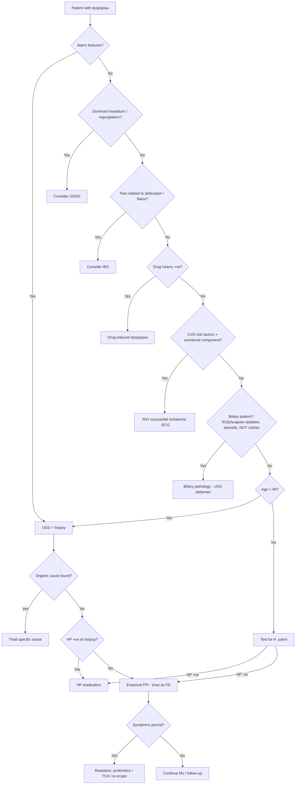

## Differential Diagnosis of Dyspepsia

The entire point of evaluating dyspepsia is **differential diagnosis** — because dyspepsia is a symptom complex, not a disease. Your job at the bedside is to sort through the differentials systematically, pick out the dangerous ones early, and arrive at the right diagnosis. Let's think about this like a clinician on a ward round.

---

### 1. Framework for Thinking About the Differential

There are two complementary ways to organise the differential:

1. **By frequency and danger** — Murtagh's Diagnostic Strategy (probability → serious → pitfalls → rarities → masquerades → psychosocial) [1]
2. **By organ system** — GI organic → Non-GI organic → Functional [2][3]

Both are useful. Murtagh's framework is excellent for the clinical reasoning stations (OSCE); the organ-system approach is more systematic for written exams. We will use **both** below.

---

### 2. Murtagh's Diagnostic Strategy for Dyspepsia [1]

This is a **must-know** framework for clinical exams — it forces you to think about common things first while never forgetting the dangerous ones.

| Category | Differentials | Why It's Here |
|---|---|---|
| ***Probability diagnosis*** | ***Irritable upper GIT (functional dyspepsia)*** | 60–75% of all dyspepsia — by far the commonest cause [3] |
| | ***Gastro-oesophageal reflux*** | Very common; often overlaps with dyspepsia in Chinese populations [2] |
| | ***Gastritis*** | Mucosal inflammation (HP, alcohol, NSAIDs, stress) without ulceration — self-limiting |
| | ***Oesophageal motility disorder (dysmotility)*** | e.g. achalasia, diffuse oesophageal spasm — can present with epigastric discomfort + dysphagia |
| ***Serious disorders not to be missed*** | ***Cancer: stomach, pancreas, oesophagus*** | Must be excluded in any patient with alarm features. ***Triple loss of appetite, weight and colour is a feature of cancer of the stomach*** [1]. |
| | ***Cardiovascular: ischaemic heart disease, congestive cardiac failure*** | ***In particular, care should be taken to consider and perhaps exclude ischaemic heart disease*** [1]. Inferior MI shares T5–T9 afferents with the stomach → referred epigastric pain. CCF → hepatic congestion → RUQ/epigastric discomfort. |
| | ***Pancreatitis*** | Acute or chronic — epigastric pain radiating to back, worsened by eating |
| | ***Peptic ulcer (PU)*** | Serious because of complications: bleeding, perforation, GOO. ***Epigastric pain aggravated by any food and relieved by antacids indicates chronic gastric ulcer. Pain before meals relieved by food indicates chronic duodenal ulcer.*** [1] |
| ***Pitfalls (often missed)*** | ***Myocardial ischaemia*** | The classic "missed diagnosis" — elderly patient with epigastric pain put down to "gastritis" but actually having an inferior STEMI |
| | ***Food allergy (e.g. lactose intolerance)*** | Undigested lactose → bacterial fermentation → gas, bloating, cramping. Easy to miss if you don't ask about dairy |
| | ***Pregnancy (early)*** | hCG → CTZ stimulation → nausea; progesterone → ↓ LES tone + slowed motility. Always check β-hCG in reproductive-age women! |
| | ***Biliary motility disorder*** | Sphincter of Oddi dysfunction — episodic biliary-type pain with normal imaging |
| | ***Other gallbladder disease*** | Cholecystitis, choledocholithiasis — post-prandial RUQ/epigastric pain |
| | ***Post vagotomy*** | Disrupted gastric motility → dumping syndrome, bile reflux gastropathy |
| | ***Duodenitis*** | Inflammation without frank ulceration — often H. pylori or NSAID-related |
| ***Rarities*** | ***Hyperparathyroidism*** | ↑ Ca²⁺ → ↑ gastrin secretion → ↑ acid production; also impairs GI smooth muscle motility |
| | ***Mesenteric ischaemia*** | "Intestinal angina" — post-prandial pain due to inadequate splanchnic blood flow in setting of atherosclerotic disease (coeliac/SMA stenosis) |
| | ***Zollinger–Ellison syndrome*** | Gastrinoma → massive acid hypersecretion → multiple/atypical ulcers, diarrhoea, PPI-resistant symptoms [7] |
| | ***Kidney failure*** | Uraemic toxins → direct mucosal damage; ↑ gastrin (reduced renal clearance) |
| | ***Scleroderma*** | Fibrosis of GI smooth muscle → oesophageal dysmotility, gastroparesis, GERD |
| ***Masquerades checklist*** | ***Depression*** | Somatic presentation of depression → vague epigastric discomfort, LOA |
| | ***Diabetes (rarely)*** | Autonomic neuropathy → gastroparesis → postprandial fullness, nausea, early satiety |
| | ***Drugs, esp. NSAIDs, aspirin*** | ***Drug history and past history is important, especially NSAID use*** [1]. Direct mucosal injury + COX-1 inhibition → ↓ PGE₂ → ↓ mucosal protection |
| ***"Is the patient trying to tell me something?"*** | ***Anxiety and stress are common associations of which patients are often unaware. Consider irritable bowel syndrome.*** [1] | Brain–gut axis: psychological distress → altered visceral perception, abnormal motility. IBS overlaps significantly with FD, especially in Chinese [2]. |

<Callout title="The Pitfall of Pitfalls" type="error">
***Myocardial ischaemia*** is the most dangerous diagnosis to miss. An inferior MI can present purely as epigastric pain (sometimes with nausea and diaphoresis but NO chest pain). In any patient > 50y with risk factors for coronary artery disease presenting with acute epigastric discomfort — get an ECG before reaching for the endoscopy referral form. The shared T5–T9 spinal innervation between the heart and the stomach makes this referral pattern neuroanatomically inevitable [1][9].
</Callout>

---

### 3. Systematic Organ-System Differential Diagnosis

Now let's organise the same differentials by mechanism and organ system, which is more useful when you need to be comprehensive.

#### 3A. Gastrointestinal Causes (Organic)

| Differential | Key Distinguishing Features | Pathophysiological Basis |
|---|---|---|
| **Peptic ulcer disease** | ***Epigastric pain aggravated by food*** (GU) or ***relieved by food*** (DU) [1]; periodicity; night pain; NSAID/HP history; GI bleeding | Mucosal defect extending to muscularis mucosae — acid + pepsin eroding an area where protective mechanisms have failed (HP infection disrupts mucus layer; NSAIDs inhibit COX-1 → ↓ PGE₂) [3][6] |
| **GERD** | ***Heartburn + regurgitation*** — posturally aggravated, worse lying down/bending [2][5]; water brash; chronic cough; NCCP | Incompetent LES → reflux of acid/pepsin/bile into oesophageal squamous epithelium (which lacks the protective mucus-bicarbonate barrier of gastric columnar epithelium) → mucosal inflammation [5] |
| **Gastritis / Duodenitis** | Often indistinguishable from PUD clinically; diagnosed on OGD | Mucosal inflammation without ulcer crater — can be HP-related, chemical (alcohol, bile reflux, NSAIDs), or autoimmune (corpus gastritis with pernicious anaemia) |
| **Gastric cancer** | ***Triple loss of appetite, weight and colour*** [1]; progressive dysphagia (cardia tumour); GOO (distal tumour); early satiety (linitis plastica); palpable mass; Virchow's node [8] | Adenocarcinoma (90%) — intestinal type arises through Correa cascade (HP → chronic atrophic gastritis → intestinal metaplasia → dysplasia → carcinoma); diffuse type (E-cadherin mutation) infiltrates transmurally [8] |
| **Oesophageal cancer** | Progressive dysphagia (solids → liquids), weight loss, odynophagia | Squamous cell CA (upper/middle oesophagus — smoking, alcohol) or adenocarcinoma (lower oesophagus / GOJ — Barrett's oesophagus from chronic GERD) |
| **Pancreatic cancer** | Epigastric pain radiating to back, painless obstructive jaundice (head), new-onset DM, weight loss, Courvoisier sign | Ductal adenocarcinoma (90%) — head tumours obstruct CBD → conjugated hyperbilirubinaemia; body/tail tumours invade coeliac plexus → severe back pain |
| ***Biliary pain*** [2] | ***Episodic constant NON-colicky intense dull pain in RUQ or epigastrium ± radiation to back or scapula; diaphoresis, nausea, vomiting; NOT increased by movement; can be associated with post-prandial discomfort*** [2] | Gallbladder distension against obstructing stone → visceral pain. Fatty meal → CCK release → GB contraction against stone → pain. ***Biliary colic can be associated with post-prandial pain, as eating a fatty meal is a common trigger for GB contraction*** [2]. |
| ***Chronic pancreatitis*** [2][3] | Epigastric pain radiating to back, steatorrhoea, DM (endocrine insufficiency), weight loss; history of alcohol or recurrent acute pancreatitis | Chronic inflammatory destruction of pancreatic parenchyma → fibrosis → loss of exocrine (lipase, amylase) and endocrine (insulin) function |
| ***Infiltrative gastric diseases (e.g. Crohn's disease)*** [2] | Other Crohn's features (mouth ulcers, perianal disease, skip lesions); granulomatous inflammation on biopsy | Transmural inflammation → gastric/duodenal stricture, fistula, ulceration |
| ***Coeliac disease*** [2] | Diarrhoea, steatorrhoea, IDA, dermatitis herpetiformis, bloating; often vague upper abdominal discomfort | Immune-mediated villous atrophy of small bowel (anti-tTG antibodies) → malabsorption of Fe, folate, Ca, fat-soluble vitamins |
| ***Intestinal parasitic infestation*** [2] | Travel history, eosinophilia, diarrhoea | Direct mucosal invasion/irritation by parasites (e.g. Giardia, Strongyloides) |
| ***Bowel ischaemia due to coeliac artery compression*** [2] | Post-prandial pain ("intestinal angina"), weight loss (food fear), abdominal bruit | Median arcuate ligament syndrome — extrinsic compression of coeliac artery → inadequate splanchnic blood flow when demand increases post-prandially |
| ***Other abdominal cancers (HCC, HBP malignancies)*** [2] | Hepatomegaly, jaundice, ascites; HBV/HCV history (HCC); weight loss | Mass effect, capsular stretching of liver, biliary obstruction |
| **Gastroparesis** | Postprandial fullness, nausea, vomiting, bloating, early satiety; DM history | Impaired gastric emptying without mechanical obstruction — vagal neuropathy (DM), drugs (GLP-1 agonists, CCB), post-surgical [4] |
| **Gastric outlet obstruction** | Projectile non-bilious vomiting, succussion splash, weight loss | **Malignant (80%) until proven otherwise** — gastric CA most common cause; benign causes include PUD-related pyloric stenosis [4] |
| **Oesophageal motility disorder** | Dysphagia to solids AND liquids simultaneously (unlike mechanical obstruction which is solids first), chest pain, regurgitation of undigested food | Achalasia: failure of LES relaxation + absent oesophageal peristalsis (loss of inhibitory neurons in myenteric plexus). Diffuse oesophageal spasm: uncoordinated contractions. |

#### 3B. Non-Gastrointestinal Causes

| Differential | Key Distinguishing Features | Pathophysiological Basis |
|---|---|---|
| ***Drug-induced dyspepsia*** [1][2] | Temporal relationship to drug use; ***NSAIDs, steroids, oral antibiotics, iron, digoxin, metronidazole, alendronate, slow K*** [2] | Direct mucosal irritation (iron, alendronate, KCl) or systemic COX inhibition (NSAIDs → ↓ PGE₂). Steroids ↓ epithelial cell turnover. Digoxin stimulates CTZ → nausea. |
| ***Coronary artery disease (basal myocardial ischaemia)*** [1][2] | Exertional, CVD risk factors, associated diaphoresis/dyspnoea; may be relieved by GTN | Inferior wall ischaemia → cardiac afferents travel via T5–T9 → converge on same dorsal horn neurons as gastric afferents → brain misinterprets origin as epigastric [9] |
| ***CCF*** [1] | Peripheral oedema, ↑ JVP, orthopnoea, hepatomegaly | Right heart failure → ↑ hepatic venous pressure → hepatic congestion → capsular distension → RUQ/epigastric pain; also gut wall oedema → dysmotility |
| ***Electrolyte disturbances (hyperCa, hyperK)*** [2][3] | Polyuria, polydipsia (hyperCa); weakness, ECG changes (hyperK) | HyperCa → ↑ gastrin → ↑ acid; ↓ GI smooth muscle contractility → constipation, nausea. HyperK → GI smooth muscle dysfunction |
| ***Thyroid / parathyroid diseases*** [2] | Thyrotoxic features (tremor, weight loss, tachycardia) or hyperparathyroid features (stones, bones, moans, groans) | Hyperthyroidism → ↑ GI motility → discomfort. ***Hyperparathyroidism*** [1] → hypercalcaemia → mechanisms as above |
| ***Chronic renal failure*** [2] | Elevated creatinine, uraemic symptoms (nausea, anorexia, pruritis, metallic taste) | Uraemic toxins → direct gastric mucosal damage (uraemic gastropathy); ↓ renal clearance of gastrin → hypergastrinaemia |
| ***Abdominal wall pain*** [2] | ***Carnett sign: ↑ local tenderness during muscle tensing → indicates abdominal wall origin*** [2] | Nerve entrapment (anterior cutaneous nerve entrapment syndrome — ACNES), muscle strain, hernia. The positive Carnett sign differentiates wall from visceral pain because tensing the rectus sheath compresses the trapped nerve/injured muscle |
| ***Depression*** [1] | Low mood, anhedonia, sleep disturbance, fatigue; somatic symptoms without organic cause | Brain–gut axis: depression → altered serotonin signalling in both CNS and enteric nervous system → abnormal visceral perception + dysmotility |
| ***Diabetes*** [1] | Known DM, signs of peripheral/autonomic neuropathy | Diabetic autonomic neuropathy → vagal dysfunction → gastroparesis |
| ***Early pregnancy*** [1] | Reproductive-age woman, amenorrhoea, breast tenderness | hCG stimulates chemoreceptor trigger zone → nausea/vomiting; progesterone → relaxes LES (reflux) + slows gastric emptying |

#### 3C. Functional Cause

| Differential | Key Features | Pathophysiological Basis |
|---|---|---|
| ***Functional dyspepsia*** [2][3] | Diagnosis of exclusion — ***dyspepsia in the absence of detectable organic diseases*** [2]. Two subtypes: PDS (postprandial fullness, early satiation) and EPS (epigastric pain/burning) | Multifactorial: impaired gastric accommodation, visceral hypersensitivity, altered microbiome, duodenal micro-inflammation, psychological factors [2] |
| **IBS overlap** | Abdominal pain related to defecation (distinguishing feature from dyspepsia); altered bowel habits | ***Considerable overlap with GERD and IBS in Chinese*** [2]. IBS and FD share pathophysiological mechanisms (visceral hypersensitivity, brain–gut axis dysfunction) and commonly coexist |

<Callout title="FD vs IBS: The Key Distinguishing Feature" type="error">
***Symptoms that are relieved by evacuation of feces or gas should generally NOT be considered as part of dyspepsia*** [3]. If abdominal pain is characteristically associated with defecation → think **IBS**. If centred in the epigastrium and related to meals or fasting but NOT to bowel movements → think **FD**. In practice, ~30–50% of FD patients also meet criteria for IBS, so the overlap is huge — but the distinction matters for classification and targeted treatment.
</Callout>

---

### 4. Narrowing the Differential: Clinical Discriminators

The following table summarises how the history and examination help you **move from the broad differential list to the likely diagnosis**. This is the clinical reasoning that examiners want to see.

| Clinical Feature | Points Towards | Points Away From |
|---|---|---|
| ***Epigastric pain aggravated by food, relieved by antacids*** [1] | Gastric ulcer | DU (food relieves DU) |
| ***Pain before meals, relieved by food*** [1] | Duodenal ulcer | GU |
| ***Heartburn + regurgitation*** [2] | GERD | FD (heartburn is NOT a dyspeptic symptom per Rome IV) |
| Pain related to defecation / passage of flatus | IBS | Dyspepsia |
| ***Episodic constant pain, RUQ/epigastric, radiation to scapula, NOT increased by movement*** [2] | Biliary pain | PUD, GERD |
| ***Triple loss of appetite, weight and colour*** [1] | Gastric cancer | FD (no weight loss / anaemia in FD) |
| Exertional pain, CVD risk factors, diaphoresis | Myocardial ischaemia / angina | GI cause |
| Temporal relationship with NSAID use | Drug-induced / PUD | FD |
| ***Positive Carnett sign*** [2] | Abdominal wall pain | Visceral cause |
| Young woman, amenorrhoea, nausea | Early pregnancy | — |
| Multiple atypical ulcers, diarrhoea, PPI-resistant | ***Zollinger–Ellison syndrome*** [1][7] | Simple PUD |
| Known DM + postprandial fullness/vomiting | Gastroparesis | Mechanical GOO |

---

### 5. Differential Diagnosis Decision Flowchart

---

### 6. Special Differential Considerations for Hong Kong

Given the local epidemiology in Hong Kong, certain differentials carry greater weight compared to Western settings [2][5]:

- ***H. pylori*-related PUD**: HP prevalence ~30–40% in HK adults (declining but still significant) — always test for HP
- **Gastric cancer**: Higher incidence in East Asia than the West → lower threshold for OGD (***age > 40*** rather than > 55 used in some Western guidelines) [2]
- **Hepatocellular carcinoma**: HBV carrier rate ~8% in HK → HCC is a relevant differential for epigastric discomfort with hepatomegaly/weight loss
- **GERD overlap**: ***GERD incidence rising in HK*** [5], and Asian patients often present ***atypically*** (more NCCP, more "acid feeling in stomach" rather than classic heartburn) [5] → may be misclassified as dyspepsia
- **Functional dyspepsia**: ***Prevalence 10–20% among Chinese*** [2] with ***considerable overlap with GERD and IBS*** [2]

---

### 7. When to Suspect a Rare but Important Differential

| Clinical Clue | Suspect | Why |
|---|---|---|
| Recurrent ulcers despite adequate HP eradication and NSAID cessation; ulcers in unusual locations (D2, jejunum); diarrhoea + weight loss | ***Zollinger-Ellison syndrome*** [7] | ***Gastrinoma → 4–6× gastric acid output; multiple ulcers at atypical positions, often complicated; PPI-resistant*** [7]. Diagnosed by fasting serum gastrin > 10× ULN while pH < 2 [7]. |
| Epigastric pain after eating in elderly with known atherosclerotic disease, weight loss ("food fear"), abdominal bruit | ***Mesenteric ischaemia*** [1] | Coeliac/SMA stenosis → inadequate post-prandial splanchnic blood flow → "intestinal angina" |
| "Stones, bones, moans, groans" + dyspepsia | ***Hyperparathyroidism*** [1] | ↑ PTH → ↑ Ca²⁺ → ↑ gastrin → ↑ acid; ↓ GI motility |
| Raynaud's, skin tightening, dysphagia + reflux | ***Scleroderma*** [1] | Fibrosis of oesophageal/gastric smooth muscle → dysmotility, GERD, gastroparesis |
| Known MEN1 + recurrent PUD | ZES (gastrinoma) | ***20–30% of gastrinomas are associated with MEN1*** [7] |

<Callout title="High Yield Exam Pearl">
When the question gives you a patient with **recurrent peptic ulcers despite treatment**, **ulcers at unusual locations** (beyond D1), or **diarrhoea with PUD** — think ***Zollinger-Ellison syndrome*** [1][7]. When it gives you **epigastric pain + CVD risk factors + diaphoresis** — do NOT assume it's GI; get an ***ECG to exclude myocardial ischaemia*** [1][9].
</Callout>

---

<Callout title="High Yield Summary">

**Framework**: Use Murtagh's Diagnostic Strategy — probability (FD, GERD, gastritis) → serious (cancer, IHD, CCF, PUD, pancreatitis) → pitfalls (MI, pregnancy, biliary, food allergy) → rarities (ZES, hyperparathyroidism, mesenteric ischaemia, scleroderma, CKD) → masquerades (depression, DM, drugs) → psychosocial (anxiety/IBS).

**Most common cause**: Functional dyspepsia (60–75%), but this is a diagnosis of exclusion.

**Most dangerous to miss**: Myocardial ischaemia (shared T5–T9 innervation), gastric/pancreatic/oesophageal cancer.

**Key discriminators**: Food–pain relationship (GU vs DU), heartburn/regurgitation (GERD), pain with defecation (IBS not dyspepsia), alarm features (cancer), drug history (NSAID), Carnett sign (abdominal wall), biliary pattern (constant, radiation to scapula).

**HK-specific**: Lower OGD age threshold (> 40), high HP prevalence, rising GERD, HBV-related HCC, FD-IBS-GERD overlap in Chinese.

**ZES clues**: Atypical ulcer location, PPI-resistant, multiple ulcers, diarrhoea, fasting gastrin > 10× ULN with pH < 2.

</Callout>

---

<ActiveRecallQuiz
  title="Active Recall - Differential Diagnosis of Dyspepsia"
  items={[
    {
      question: "Using Murtagh's framework, list the 4 'probability diagnoses' for dyspepsia and the 4 'serious disorders not to be missed'.",
      markscheme: "Probability: (1) Functional dyspepsia, (2) GERD, (3) Gastritis, (4) Oesophageal motility disorder. Serious: (1) Cancer (stomach, pancreas, oesophagus), (2) Cardiovascular (IHD, CCF), (3) Pancreatitis, (4) Peptic ulcer."
    },
    {
      question: "A 62-year-old smoker with hypertension presents with acute epigastric pain and diaphoresis. What is the most important differential to exclude and how would you do it?",
      markscheme: "Myocardial ischaemia (inferior MI). Exclude with 12-lead ECG (look for ST elevation in II, III, aVF) and troponin. The shared T5-T9 spinal afferents between heart and stomach cause referred epigastric pain in inferior wall ischaemia."
    },
    {
      question: "Name 3 clinical clues that should make you suspect Zollinger-Ellison syndrome rather than simple peptic ulcer disease.",
      markscheme: "Any 3 of: (1) Multiple ulcers at atypical positions (distal duodenum, jejunum), (2) PPI-resistant ulcers, (3) Recurrent ulcers despite adequate HP eradication and NSAID cessation, (4) Diarrhoea with PUD, (5) Complicated PUD without HP or NSAID history, (6) Associated MEN1 features."
    },
    {
      question: "How do you clinically distinguish functional dyspepsia from IBS when there is significant symptom overlap?",
      markscheme: "Key distinguishing feature: IBS pain is characteristically associated with defecation (relieved or worsened by bowel movement or passage of flatus). Dyspepsia is centred in the epigastrium and related to meals or fasting, NOT to defecation. Rome IV states that symptoms relieved by evacuation of feces or gas should not be considered part of dyspepsia. However, 30-50% of patients have both conditions co-existing."
    },
    {
      question: "List 4 non-GI causes of dyspepsia and briefly explain the pathophysiological mechanism for each.",
      markscheme: "Any 4 of: (1) MI/IHD - shared T5-T9 afferent innervation with stomach. (2) Drugs (NSAIDs) - COX-1 inhibition reduces PGE2 mucosal protection. (3) Hypercalcaemia/hyperparathyroidism - increased gastrin and reduced GI motility. (4) CKD - uraemic mucosal damage and reduced gastrin clearance. (5) Depression - brain-gut axis dysfunction. (6) DM - autonomic neuropathy causes gastroparesis. (7) CCF - hepatic congestion from right heart failure. (8) Early pregnancy - hCG stimulates CTZ, progesterone relaxes LES."
    }
  ]}
/>

## References

[1] Lecture slides: murtagh merge.pdf (Dyspepsia, pp. 38–39)
[2] Senior notes: Ryan Ho GI.pdf (pp. 53–54, Section 2.1.4) and Ryan Ho Fundamentals.pdf (pp. 263–264, Section 3.3.4)
[3] Senior notes: felixlai.md (Dyspepsia section, pp. 490–492)
[4] Senior notes: maxim.md (Gastroparesis, GOO sections, pp. 130–133)
[5] Senior notes: Ryan Ho GI.pdf (pp. 56–57, Section 2.2.1 — GERD)
[6] Senior notes: Ryan Ho GI.pdf (p. 76, Section 2.3.2 — PUD)
[7] Senior notes: Ryan Ho Endocrine.pdf (p. 102, Section 4.2.3 — Gastrinoma/ZES)
[8] Senior notes: Ryan Ho GI.pdf (p. 84 — Gastric cancer clinical features)
[9] Senior notes: Ryan Ho Cardiology.pdf (p. 54, Section 2.1 — Chest Pain/Angina)
