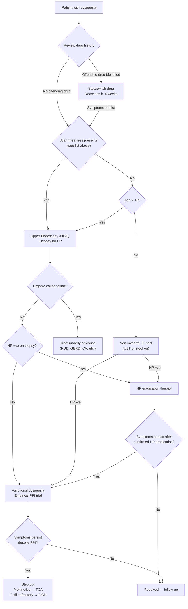
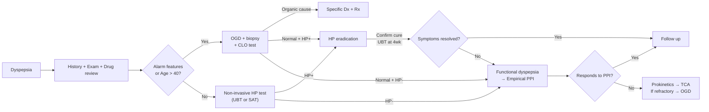

## Diagnostic Criteria, Diagnostic Algorithm and Investigation Modalities for Dyspepsia

---

### 1. Diagnostic Criteria

#### 1A. Defining "Dyspepsia" vs "Functional Dyspepsia" — Why the Distinction Matters

Before we talk about investigations, we need to be crystal clear about **what we are diagnosing**. "Dyspepsia" is a **symptom complex** — it is not a diagnosis in itself. The actual diagnostic task is twofold:

1. **Is there an organic cause?** → If yes, diagnose and treat that cause (PUD, GERD, malignancy, etc.)
2. **Is this functional dyspepsia?** → If no organic cause is found after appropriate investigation, we can apply the Rome IV criteria

This is why ***functional dyspepsia is a diagnosis of exclusion*** [3] — you cannot diagnose it without first ruling out structural disease.

#### 1B. Rome IV Diagnostic Criteria for Functional Dyspepsia [2][3]

The Rome IV criteria (2016, current standard) require **ALL** of the following:

> **≥1 of:**
> 1. ***Bothersome postprandial fullness***
> 2. ***Bothersome early satiation***
> 3. ***Bothersome epigastric pain***
> 4. ***Bothersome epigastric burning***
>
> **AND:** ***No evidence of structural disease*** (including on upper endoscopy) ***that is likely to explain the symptoms***
>
> **Duration:** Criteria fulfilled for the **last 3 months** with **symptom onset ≥ 6 months** before diagnosis [3]

**Subtypes** (important because they guide treatment):

| Subtype | Criteria | Old Name |
|---|---|---|
| **Postprandial Distress Syndrome (PDS)** | ***Bothersome postprandial fullness*** (occurring after ordinary-sized meals, ≥ 3 days/week) AND/OR ***bothersome early satiation*** (preventing finishing a regular meal, ≥ 3 days/week) | "Dysmotility-like" |
| **Epigastric Pain Syndrome (EPS)** | ***Bothersome epigastric pain*** AND/OR ***bothersome epigastric burning*** (severe enough to impact usual activities, ≥ 1 day/week). ***NOT necessarily related to meals. NOT related to defecation/passing flatus*** [2] | "Ulcer-like" |

<Callout title="Supportive Remarks from Rome IV (Examinable)" type="idea">
- ***Postprandial epigastric pain or burning, epigastric bloating, excessive belching and nausea can also be present*** [3]
- ***Pain may be induced by or relieved by ingestion of a meal or may occur while fasting*** [3]
- ***Pain does NOT fulfil biliary pain criteria*** [3]
- ***Vomiting warrants consideration of another disorder*** [3]
- ***Heartburn is NOT a dyspeptic symptom but may often coexist*** [3]
- ***Symptoms relieved by evacuation of feces or gas should generally NOT be considered as part of dyspepsia*** [3] — this feature should prompt you to think about IBS instead
</Callout>

#### 1C. Alarm Features That Override the "Test-and-Treat" Approach

***Alarm features in dyspepsia*** mandate ***upper endoscopy (OGD)*** as the first-line investigation regardless of age [1][2]:

| # | Alarm Feature |
|---|---|
| 1 | ***Age > 40y*** (HK/East Asia practice) ***with new-onset dyspepsia*** [2] |
| 2 | ***Unintentional weight loss*** [2] |
| 3 | ***Dysphagia or odynophagia*** [2] |
| 4 | ***Unexplained iron-deficiency anaemia*** [2] |
| 5 | ***Persistent vomiting*** [2] |
| 6 | ***Upper GI bleeding*** (haematemesis/melaena) [2] |
| 7 | ***Palpable mass or lymphadenopathy*** [2] |
| 8 | ***Family history of upper GI cancers*** [2] |

Additional alarm features from Felix Lai's notes [3]: ***jaundice***, which indicates biliary obstruction or hepatic disease.

<Callout title="Why Age > 40 and Not > 55?" type="error">
Western guidelines (ACG, NICE 2024) use age ≥ 60 as the OGD threshold. However, in **East Asia** including Hong Kong, the incidence of gastric cancer is substantially higher and peaks earlier. ***HKUMed and local practice use age > 40*** as the cut-off for recommending OGD in uninvestigated dyspepsia [2]. For your summative exams, use **> 40**.
</Callout>

---

### 2. Diagnostic Algorithm

The clinical approach to dyspepsia follows a **stepwise algorithm** driven by the presence or absence of alarm features and the patient's age. The ***main aim is to rule out organic causes of dyspepsia*** [2].

#### 2A. The Three-Pathway Approach [2]

The evaluation ***depends on setting and presence of alarm symptoms*** [2]. There are essentially **three pathways**:

| Pathway | Who Gets It | What It Involves | Rationale |
|---|---|---|---|
| ***Upper endoscopy (OGD)*** | ***Age > 40y; unexplained weight loss or anaemia; UGIB, vomiting; dysphagia or odynophagia; FHx +ve for UGI cancers*** [2] | ***Upper endoscopy for any organic disease. H. pylori testing should be done on biopsy sample*** [2]. If organic cause found → treat. If HP +ve on biopsy → eradicate. If both negative → ***treat as functional dyspepsia*** [2]. | Endoscopy is the gold standard for visualising mucosal pathology and obtaining tissue diagnosis. In older patients or those with alarm features, the pre-test probability of organic disease (especially malignancy) is high enough to warrant direct endoscopy. |
| ***H. pylori testing*** ("test-and-treat") | ***Age < 40y and NO alarm features; HP not tested in previous OGD*** [2] | ***Urea breath test or stool antigen test*** [2]. If HP +ve → ***HP eradication therapy*** [2]. If HP -ve → ***treat as functional dyspepsia*** [2]. | In young patients without alarm features, the probability of malignancy is very low. The most treatable organic cause is *H. pylori*-related disease. Testing and treating HP first is cost-effective and avoids unnecessary endoscopy. |
| ***Empirical drug therapy*** (treat as FD) | ***Age < 40y and NO alarm features; persistent symptoms despite documented HP eradication*** [2] | ***Empirical antisecretory therapy: PPI proven to ↓ dyspepsia symptoms. Prokinetics and TCA if fail PPI treatment. Should be reinvestigated by OGD should symptoms persist despite multiple treatments*** [2]. | When HP has been excluded or eradicated and there are no alarm features, the most likely diagnosis is FD. Empirical PPI addresses acid-mediated symptoms; prokinetics address dysmotility; TCAs address visceral hypersensitivity. |

#### 2B. Murtagh's Key Investigation Principles [1]

> ***Do not overinvestigate.*** [1]
>
> ***The investigation of choice is gastroscopy, which is indicated for 'alarm symptoms' such as dysphagia, bleeding and unexplained weight loss.*** [1]
>
> ***Test for Helicobacter pylori.*** [1]

This beautifully summarises the entire approach: **targeted endoscopy for alarm features** + **HP testing for everyone else**.

#### 2C. Mermaid Diagnostic Algorithm

<Callout title="The Logical Flow Explained">
**Step 1**: Always check drug history first — if the patient is on NSAIDs, iron, or other offending drugs, stopping them may resolve everything without any investigation.

**Step 2**: Screen for alarm features. If present → OGD directly, because you need to rule out malignancy and serious pathology. This is non-negotiable.

**Step 3**: If no alarm features, use age to stratify. Age > 40 → OGD (East Asian practice). Age < 40 → non-invasive HP test first (test-and-treat strategy).

**Step 4**: Treat what you find. If nothing found → functional dyspepsia → empirical therapy (PPI → prokinetics → TCA).

**Step 5**: If refractory to multiple treatments → re-scope to ensure nothing was missed.
</Callout>

---

### 3. Investigation Modalities — Detailed Breakdown

Now let's go through each investigation in detail, explaining **what it is, why we do it, what we look for, and how to interpret the findings**.

#### 3A. Bedside Tests

| Test | What It Tells You | Key Findings & Interpretation |
|---|---|---|
| **Urine dipstick + microscopy** | Rule out urological causes of abdominal pain [10][11] | Haematuria → renal/ureteric stones; leucocytes/nitrites → UTI; proteinuria → renal disease |
| **Urine pregnancy test** | Rule out early pregnancy [10][11] | +ve β-hCG → pregnancy (ectopic or early intrauterine) — always check in reproductive-age women with "dyspepsia" + nausea |
| **ECG** | ***Rule out basal MI*** [10][11] | ST elevation in II, III, aVF → inferior STEMI mimicking epigastric pain. ***In particular, care should be taken to consider and perhaps exclude ischaemic heart disease*** [1]. |
| **Capillary blood glucose** | ***Rule out DKA*** [10][11] | DKA can present with severe abdominal pain and vomiting mimicking an acute abdomen |

<Callout title="ECG in Dyspepsia — Don't Forget!" type="error">
This is the single most commonly forgotten bedside test in dyspepsia. If your patient is > 50, has CVD risk factors, or has acute-onset epigastric pain with diaphoresis — ***do an ECG before anything else***. Missing an inferior MI because you assumed it was "gastritis" is a career-defining error.
</Callout>

#### 3B. Blood Tests

| Test | What It Tells You | Key Findings & Interpretation |
|---|---|---|
| ***CBC with differentials*** [3][10] | Chronic bleeding, infection, malignancy | ***Anaemia*** (↓ Hb): microcytic hypochromic → iron deficiency from chronic occult GI bleeding (PUD, malignancy) or malabsorption (coeliac). Note: ***takes 48h for haemodilution to set in after acute bleeding*** [10] — a normal Hb does NOT exclude acute haemorrhage. Leucocytosis → infection/inflammation. Thrombocytosis → reactive to chronic bleeding/inflammation. |
| ***Electrolyte profile*** [3] | Metabolic causes of dyspepsia | ***Hyperkalaemia*** → GI smooth muscle dysfunction, cardiac risk. ***Hypercalcaemia*** [3] → ↑ gastrin → ↑ acid; ↓ GI motility → nausea, constipation. Think ***hyperparathyroidism*** [1]. ***HypoK/hypoCl*** → ***prolonged vomiting*** [10] (loss of HCl in vomitus → metabolic alkalosis with paradoxical aciduria). |
| ***LFT*** [3][10] | Hepatobiliary disease | ↑ ALP + ↑ GGT (obstructive pattern) → biliary obstruction (stones, pancreatic head CA). ↑ ALT/AST (hepatocellular pattern) → hepatitis, drug-induced liver injury. ↑ bilirubin → jaundice (obstructive vs hepatocellular). |
| ***RFT (renal function tests)*** [10] | CKD, hydration status | ↑ Cr/urea → chronic renal failure (uraemic gastropathy). ***HypoK/hypoCa → can cause ileus but can arise from 3rd spacing*** [10]. Also needed to assess suitability for contrast scans. |
| ***Amylase/lipase*** [10][12] | Acute pancreatitis | ***Amylase peaks at 6–24h; > 1000 diagnostic of acute pancreatitis*** [10]. Lipase is more specific and stays elevated longer (preferred in current practice). |
| **Cardiac enzymes (troponin)** [10] | Rule out ACS | ↑ Troponin → myocardial injury. ***± Cardiac enzymes, ECG to rule out basal MI*** [10]. |
| **Iron studies** | Assess iron deficiency | ↓ Ferritin, ↓ serum iron, ↑ TIBC → iron-deficiency anaemia → occult GI blood loss |
| **CRP/ESR** [12] | Inflammation | Non-specific; elevated in pancreatitis, malignancy, IBD, infection |
| **Glucose** [10] | DKA, diabetes | ***± Glucose to rule out DKA*** [10]. Also assess for DM → diabetic gastroparesis |
| **ABG** [10] | Metabolic derangement | ***Metabolic acidosis with ↑ lactate → intestinal ischaemia. Metabolic alkalosis → prolonged vomiting*** [10]. |
| **TFTs** | Thyroid disease | Hyperthyroidism → ↑ GI motility → dyspepsia; hypothyroidism → gastroparesis |
| **Fasting serum gastrin** | ZES screening | > 10× ULN with gastric pH < 2 → diagnostic of gastrinoma [7] |
| **Coeliac screen (anti-tTG IgA)** | Coeliac disease | Positive in coeliac disease → villous atrophy → malabsorption |

<Callout title="Blood Tests — Focused Not Shotgun" type="idea">
***Do not overinvestigate*** [1]. In an otherwise well young patient with no alarm features, you do NOT need a full metabolic work-up. The core bloods for uninvestigated dyspepsia are: **CBC** (anaemia?), **basic metabolic panel** (electrolytes, renal function), and **HP test**. Add LFT if biliary symptoms, amylase if pancreatic symptoms, cardiac enzymes/ECG if cardiac concern, and iron studies/coeliac screen if anaemia.
</Callout>

#### 3C. H. pylori Testing

This is one of the most important investigations in dyspepsia. There are **invasive** (require OGD) and **non-invasive** methods.

##### Non-Invasive Tests [2][3]

| Test | Principle | Sensitivity / Specificity | Key Points |
|---|---|---|---|
| ***Urea breath test (UBT)*** [2][3] | Patient ingests ¹³C- or ¹⁴C-labelled urea. If HP is present, its **urease** enzyme hydrolyses urea → ammonia + labelled CO₂, which is detected in exhaled breath. | ~95% / ~95% | **Gold standard non-invasive test**. Must stop **PPI for ≥ 2 weeks** and **antibiotics for ≥ 4 weeks** before testing (both suppress HP without eradicating it → false negative). Used for both initial diagnosis and **confirmation of eradication** (repeat UBT ≥ 4 weeks after completing eradication therapy) [3]. |
| ***Stool antigen test (SAT)*** [2][3] | Detects HP antigens in stool using monoclonal antibodies | ~95% / ~95% | As accurate as UBT. Useful when UBT is unavailable. Same PPI/antibiotic washout rules apply. Convenient for patients who cannot perform breath test (e.g. children). |
| **Serology (IgG antibodies)** | Detects past or current HP exposure via anti-HP IgG | ~85% / ~80% | **Cannot distinguish active from past infection** — IgG remains positive for months to years after eradication. Therefore **NOT useful for confirming eradication**. May be useful in epidemiological studies or when patient cannot stop PPI. |

##### Invasive Tests (Require OGD with Biopsy) [2][3]

| Test | Principle | Key Points |
|---|---|---|
| **Rapid urease test (CLO test)** | Biopsy specimen placed in urea-containing medium + pH indicator. If HP present, urease hydrolyses urea → ammonia → pH rises → colour change (yellow → pink). | Quick (~1 hour). **First-line invasive test** when OGD is performed. Same PPI/antibiotic washout applies. Take biopsy from **antrum AND corpus** for best yield. |
| **Histology** | Biopsy examined under microscopy (H&E, Giemsa stain). Visualise spiral organisms on surface epithelium. | Allows simultaneous assessment of mucosal pathology (gastritis, intestinal metaplasia, dysplasia, malignancy). **Gold standard for tissue diagnosis**. |
| **Culture** | Biopsy cultured on selective media under microaerophilic conditions | Allows antibiotic sensitivity testing — crucial for **treatment failure** (clarithromycin resistance is rising globally, ~20–30% in HK). Technically difficult; not routine. |

<Callout title="HP Testing: When to Use What">
**First presentation, age < 40, no alarm features** → ***UBT or stool antigen test*** [2] (non-invasive, "test-and-treat" strategy).

**OGD being performed** → ***Rapid urease test (CLO test) on biopsy*** [2] + histology. ***H. pylori testing should be done on biopsy sample*** [2].

**Confirming eradication** → ***UBT ≥ 4 weeks after completing therapy*** [3]. This was demonstrated in the case study: "A urea breath test was performed 1 week earlier (4 weeks after completing her drug therapy course) and was negative" [3].

**Treatment failure / antibiotic resistance** → Culture with sensitivity testing on biopsy.
</Callout>

#### 3D. Upper Endoscopy (OGD — Oesophago-Gastro-Duodenoscopy)

***The investigation of choice is gastroscopy*** [1]. This is the **gold standard** for evaluating organic causes of dyspepsia.

##### Indications for OGD in Dyspepsia [1][2][3]

- ***Alarm symptoms: dysphagia, bleeding, unexplained weight loss*** [1]
- ***Age > 40y with new-onset dyspepsia*** [2]
- ***Unexplained iron-deficiency anaemia*** [2]
- ***Persistent vomiting*** [2]
- ***FHx +ve for UGI cancers*** [2]
- ***Symptoms persist despite multiple treatments*** (refractory FD) [2]
- ***Early upper GI endoscopy should be performed in patients WITH alarming features as the gold standard for establishing the specific cause of upper abdominal pain*** [3]

##### What OGD Can Detect

| Finding | Diagnosis | Key Features |
|---|---|---|
| **Mucosal erythema, oedema, erosions** | Gastritis / duodenitis | Patchy or diffuse; antral predominant in HP; chemical pattern in NSAIDs/bile reflux |
| **Ulcer crater** | PUD (gastric or duodenal) | **Gastric ulcer**: usually lesser curvature / corpus-antrum junction — MUST biopsy (to rule out malignancy). **Duodenal ulcer**: usually D1 — biopsy NOT required (almost never malignant). |
| **Mucosal break in distal oesophagus** | Reflux oesophagitis | Graded by LA classification (A–D) based on extent of mucosal breaks |
| **Mass, ulcerated mass, mucosal irregularity** | Gastric / oesophageal CA | Multiple biopsies needed (at least 6–8 from margin of ulcer/mass). Linitis plastica may show rigid, non-distensible stomach with reduced peristalsis. |
| **Barrett's oesophagus** | Intestinal metaplasia of distal oesophagus | Salmon-pink mucosa extending above GOJ. Prague classification (circumferential + maximal extent). Biopsy for dysplasia grading. |
| **Normal mucosa** | Functional dyspepsia (after HP testing) | If OGD is normal AND HP is negative → diagnosis of FD by exclusion [2] |
| **Mosaic/snakeskin pattern** | Portal hypertensive gastropathy | Friable mucosa with ectatic vessels; context of liver cirrhosis [4] |
| **Submucosal lesion** | GIST, lipoma, carcinoid | Smooth overlying mucosa; may need EUS for further characterisation |

##### Key Points About OGD

- ***Advantage: allows direct visualisation, allows tissue biopsy (especially in malignancy), allows therapeutic interventions (e.g. treat bleeding, stents)*** [6]
- ***Biopsy of stomach should be obtained to rule out H. pylori infection*** [3]
- Biopsies should be taken from **antrum AND corpus** (Sydney protocol) — antral biopsies for HP + inflammation; corpus biopsies for atrophic gastritis + intestinal metaplasia
- **ALL gastric ulcers must be biopsied** (to exclude malignancy) — duodenal ulcers do not require biopsy (DU is almost never malignant)
- ***Should NOT be used if suspecting webs or diverticula (risk of perforation)*** [6]

##### Contraindications to OGD [3]

- ***Known or suspected perforation*** (insufflation of air will worsen pneumoperitoneum) [3]
- ***Recent myocardial infarction (MI)*** [3] — risk of arrhythmia from vagal stimulation
- **Haemodynamic instability** — resuscitate first, scope later (except in acute variceal bleeding where early OGD is therapeutic)
- **Uncooperative patient without consent**
- ***AVOID endoscopy for acute abdomen: sealed-off perforation may open by gas insufflation during endoscopy*** [11]

#### 3E. Imaging Studies

##### Plain Radiography [10]

| Study | Findings | Significance |
|---|---|---|
| ***Erect CXR*** | ***Free gas under diaphragm*** [10] | → ***Perforation*** (e.g. perforated peptic ulcer). Sensitivity ~75% — a normal erect CXR does NOT exclude perforation. |
| ***Supine AXR*** | ***Sentinel loop sign*** (localised dilated bowel loop) [10] | → ***Local inflammation (e.g. pancreatitis)*** [10]. Also look for ***pancreatic calcification → chronic pancreatitis*** [10]. |
| | ***Radio-opaque stones*** | → ***90% urinary stones, only 15% gallstones*** (majority cholesterol stones are radiolucent; ***only pigmented stones are radio-opaque***) [10] |

##### Ultrasound (USS) [10]

| Indication | Findings | Interpretation |
|---|---|---|
| **Biliary pathology** | ***Gallstones: highly sensitive, 95% positive*** [10] | USS is the **gold standard** for detecting gallstones (better than AXR because most gallstones are radiolucent) |
| **Acute cholecystitis** | ***Thickened GB wall ( > 3mm), pericholecystic fluid, stone at neck of HB, sonographic Murphy's sign*** [10] | ***Sonographic Murphy's sign = tenderness is maximal when US probe presses on visualised gallbladder*** [10] |
| **Hepatobiliary** | Dilated CBD ( > 6mm, or > 10mm post-cholecystectomy), liver masses, ascites | Obstruction, HCC, metastatic disease |
| **Pancreas** | Often limited by overlying bowel gas; may show pancreatic mass, pseudocyst, calcification | Consider CT for better pancreatic imaging |
| **Abdominal masses** | Solid vs cystic, size, location | Further characterisation often needs CT |

##### Barium Studies [13]

| Study | Evaluates | Indications in Dyspepsia Context | Key Findings |
|---|---|---|---|
| ***Barium meal*** | ***Stomach, duodenum*** [13] | ***Dyspepsia and epigastric pain; weight loss; assessment for suspected stomach cancer; suspected perforation of peptic ulcer*** [13] | Ulcer niche (barium-filled crater), filling defect (mass), mucosal irregularity, "leather bottle" stomach (linitis plastica) |
| ***Barium swallow*** | ***Hypopharynx, oesophagus*** [13] | Dysphagia workup; OGD-negative suspected mechanical obstruction | ***Bird's beak sign*** (achalasia), ***shouldering*** (smooth if benign, right-angled if malignant stricture), ***corkscrew appearance*** (diffuse oesophageal spasm) [6] |

In modern practice, **barium studies have been largely superseded by OGD** (which allows biopsy) and **CT** (which provides cross-sectional imaging). However, they remain useful when OGD is contraindicated or when assessing motility (e.g. achalasia).

##### CT Abdomen [10]

| Indication | Key Findings |
|---|---|
| Suspected pancreatic pathology | Pancreatic mass, calcification (chronic pancreatitis), peripancreatic fluid (acute pancreatitis), dilated pancreatic duct |
| Suspected malignancy (staging) | Liver metastases, lymphadenopathy, peritoneal deposits, ascites |
| ***Acute mesenteric ischaemia (CTA)*** [10] | Arterial occlusion/thrombus, pneumatosis intestinalis (gas in bowel wall), portal venous gas |
| ***Retroperitoneal structures*** [10] | Leaking AAA, renal stones |
| Suspected GOO | Level and cause of obstruction; gastric dilatation |

##### Scintigraphic Gastric Emptying Study [4]

| Indication | How It Works | Key Points |
|---|---|---|
| **Suspected gastroparesis** | Patient eats a ***low-fat egg-white meal*** (fat slows gastric emptying — so you use low-fat to standardise the test) labelled with ⁹⁹ᵐTc. Serial images taken at 0, 1, 2, 4 hours. | > 10% retention at 4 hours = delayed gastric emptying. Used after ***excluding mechanical obstruction*** (CXR/AXR, CT, OGD) [4]. |

#### 3F. Specialised Tests

| Test | Indication | Principle | Key Findings |
|---|---|---|---|
| **24-hour oesophageal pH monitoring / impedance** | Suspected GERD with negative OGD or atypical symptoms | Thin catheter placed in oesophagus measures acid exposure over 24 hours. Impedance also detects non-acid reflux. | Acid exposure time > 6% = abnormal. DeMeester score > 14.7 = positive. Gold standard for GERD diagnosis. |
| **High-resolution manometry (HRM)** | Suspected oesophageal motility disorder | ***36 circumferential channels each with 12 sensors down oesophagus. Gold standard for assessing oesophageal motility*** [6]. | Achalasia (absent peristalsis + failed LES relaxation), diffuse oesophageal spasm, hypercontractile oesophagus (jackhammer). ***Chicago classification*** [6]. |
| **Fasting serum gastrin + gastric pH** | Suspected ZES | Fasting gastrin level measured when patient is off PPI (PPI falsely elevates gastrin). Gastric pH measured simultaneously. | ***Serum gastrin > 10× ULN while pH < 2 = diagnostic*** [7] of gastrinoma. If equivocal → **secretin stimulation test** (paradoxical rise in gastrin after IV secretin = positive for gastrinoma) [7]. |
| **Coeliac serology (anti-tTG IgA)** | Suspected coeliac disease | IgA antibody against tissue transglutaminase (the autoantigen in coeliac) | Positive → confirm with duodenal biopsy (villous atrophy, crypt hyperplasia, intraepithelial lymphocytes). Check total IgA (IgA deficiency → false negative). |

<Callout title="Important: Stop PPI Before Gastrin Testing" type="error">
***PPI should be stopped before evaluation*** for ZES [7]. PPIs profoundly suppress gastric acid → compensatory hypergastrinaemia (the body tries to make more acid). This creates a **false positive** for ZES. PPIs should be stopped for at least **1 week** (ideally 2 weeks) before measuring fasting gastrin. H2 receptor antagonists can be used as a bridge to manage symptoms during the washout period.
</Callout>

---

### 4. Interpreting the OGD: What to Do Next

The outcome of OGD determines the next steps:

| OGD Finding | Next Step | Rationale |
|---|---|---|
| **Gastric ulcer** | Multiple biopsies (≥ 6 from margin) + CLO test. **Repeat OGD in 6–8 weeks** to confirm healing. | Must exclude malignancy — gastric CA can look exactly like a benign ulcer on gross appearance. Non-healing ulcer at repeat OGD → suspect malignancy → re-biopsy. |
| **Duodenal ulcer** | CLO test + histology for HP. No need to biopsy the ulcer itself. | DU is almost never malignant. Focus is on identifying and eradicating HP. |
| **Oesophagitis** | Grade by LA classification (A–D). If Barrett's suspected → multiple biopsies per Seattle protocol. | Guide GERD treatment intensity and surveillance intervals for Barrett's. |
| **Mass / suspicious lesion** | Multiple biopsies + staging CT (chest/abdomen/pelvis) | Tissue diagnosis essential before planning treatment (surgery, chemo, targeted therapy). |
| ***Normal OGD, HP +ve on biopsy*** | ***HP eradication therapy*** [2] | HP may be causing subclinical mucosal inflammation contributing to symptoms. NNT ~14 for symptom improvement in FD. |
| ***Normal OGD, HP -ve*** | ***Treat as functional dyspepsia*** [2] | Diagnosis of FD by exclusion is now established. |

---

### 5. Summary: Putting It All Together

<Callout title="High Yield Summary">

**Diagnostic criteria for FD (Rome IV)**: ≥ 1 of bothersome postprandial fullness, early satiation, epigastric pain, epigastric burning — with NO structural disease — for ≥ 3 months (onset ≥ 6 months). Two subtypes: PDS (dysmotility-like) and EPS (ulcer-like).

**Alarm features (8 key ones)**: Age > 40 + new onset, weight loss, dysphagia/odynophagia, IDA, persistent vomiting, UGIB, mass/LN, FHx UGI CA → all mandate OGD.

**Algorithm**: Alarm features or age > 40 → OGD. No alarm features + age < 40 → non-invasive HP test (UBT or SAT). HP +ve → eradicate. HP -ve → empirical PPI. Refractory → prokinetics → TCA → re-scope.

**Key investigations**: OGD (gold standard for organic disease), UBT/SAT (gold standard non-invasive HP test), bloods (CBC, electrolytes, LFT, RFT, amylase), USS (biliary), ECG (rule out MI), erect CXR (perforation). Special: gastric emptying study (gastroparesis), fasting gastrin + pH (ZES — stop PPI first), 24h pH monitoring (GERD), manometry (motility disorders).

**HP testing rules**: Stop PPI ≥ 2 weeks and antibiotics ≥ 4 weeks before UBT/SAT. Confirm eradication with UBT ≥ 4 weeks after completing therapy.

**OGD rules**: Biopsy ALL gastric ulcers (rule out CA). Do NOT need to biopsy duodenal ulcers. Always take antrum + corpus biopsies for HP. Repeat OGD for gastric ulcers at 6–8 weeks to confirm healing.

</Callout>

---

<ActiveRecallQuiz
  title="Active Recall - Diagnostic Criteria, Algorithm & Investigations for Dyspepsia"
  items={[
    {
      question: "State the Rome IV criteria for functional dyspepsia, including the time requirement and the two subtypes.",
      markscheme: "Criteria: >=1 of (1) bothersome postprandial fullness, (2) bothersome early satiation, (3) bothersome epigastric pain, (4) bothersome epigastric burning, with NO evidence of structural disease likely to explain symptoms. Duration: criteria fulfilled for last 3 months with symptom onset >=6 months before diagnosis. Subtypes: Postprandial Distress Syndrome (PDS - postprandial fullness + early satiation) and Epigastric Pain Syndrome (EPS - epigastric pain or burning, not related to meals or defecation)."
    },
    {
      question: "A 35-year-old with no alarm features has uninvestigated dyspepsia. Outline the stepwise diagnostic approach.",
      markscheme: "Step 1: Review drug history - stop offending drugs if present. Step 2: No alarm features + age <40 -> non-invasive HP test (UBT or stool antigen test). Step 3: If HP +ve -> eradication therapy, confirm cure with UBT >=4 weeks after therapy. If HP -ve -> empirical PPI trial (treat as FD). Step 4: If symptoms persist despite HP eradication or PPI -> add prokinetics then TCA. Step 5: If refractory to multiple treatments -> OGD to rule out missed organic pathology."
    },
    {
      question: "Why must PPIs be stopped before performing a urea breath test? How long should they be stopped?",
      markscheme: "PPIs suppress H. pylori without eradicating it by raising intragastric pH (HP needs acid environment to maintain urease activity; also PPIs have direct antimicrobial effects). This reduces bacterial load and urease activity -> false negative UBT result. PPIs should be stopped for >=2 weeks before UBT. Antibiotics should be stopped for >=4 weeks."
    },
    {
      question: "Name 3 contraindications to OGD and explain the rationale for each.",
      markscheme: "Any 3 of: (1) Known/suspected perforation - gas insufflation during OGD will worsen pneumoperitoneum. (2) Recent MI - vagal stimulation during OGD can cause arrhythmia. (3) Acute abdomen with suspected sealed-off perforation - insufflation may open a sealed perforation. (4) Haemodynamic instability - resuscitate first (except variceal bleeding). (5) Uncooperative patient without consent."
    },
    {
      question: "A patient undergoes OGD for dyspepsia and a gastric ulcer is found. What are the essential next steps and why?",
      markscheme: "Essential next steps: (1) Multiple biopsies (>=6) from ulcer margin - because gastric ulcers can be malignant and cannot be distinguished from benign ulcers by gross appearance alone. (2) CLO test/histology for H. pylori on separate biopsies (antrum + corpus). (3) Repeat OGD at 6-8 weeks to confirm ulcer healing - a non-healing gastric ulcer raises suspicion for underlying malignancy and requires re-biopsy. Duodenal ulcers do NOT need biopsy as they are almost never malignant."
    },
    {
      question: "What fasting serum gastrin level and gastric pH combination is diagnostic of Zollinger-Ellison syndrome, and what drug must be stopped first?",
      markscheme: "Fasting serum gastrin >10x upper limit of normal (ULN) while gastric pH <2 is diagnostic of ZES/gastrinoma. PPIs must be stopped for >=1-2 weeks before testing because PPIs cause compensatory hypergastrinaemia (by suppressing acid -> loss of negative feedback on G-cells) which gives a false positive result. H2RAs can be used as a bridge."
    }
  ]}
/>

## References

[1] Lecture slides: murtagh merge.pdf (Dyspepsia, pp. 38–39)
[2] Senior notes: Ryan Ho GI.pdf (pp. 53–54, Section 2.1.4) and Ryan Ho Fundamentals.pdf (pp. 263–264, Section 3.3.4)
[3] Senior notes: felixlai.md (Dyspepsia section, pp. 490–495)
[4] Senior notes: maxim.md (Gastroparesis section, p. 133)
[6] Senior notes: Ryan Ho GI.pdf (p. 36, OGD/Barium investigations)
[7] Senior notes: Ryan Ho Endocrine.pdf (p. 102, Section 4.2.3 — Gastrinoma/ZES)
[10] Senior notes: Ryan Ho GI.pdf (p. 105) and Ryan Ho Fundamentals.pdf (p. 279 — Investigations for acute abdomen)
[11] Senior notes: maxim.md (p. 87 — Acute abdomen investigations)
[12] Lecture slides: murtagh merge.pdf (Abdominal pain investigations, p. 13)
[13] Senior notes: Ryan Ho Diagnostic Radiology.pdf (p. 19 — GI Fluoroscopy Studies)
