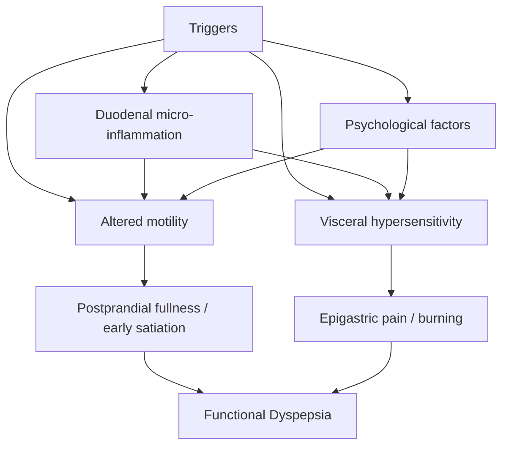
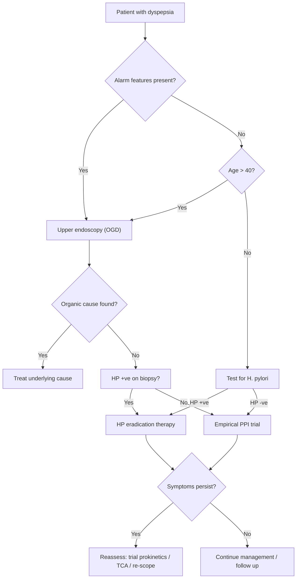

# Dyspepsia — Definition, Epidemiology, Risk Factors, Anatomy, Etiology, Pathophysiology, Classification, and Clinical Features

---

## 1. Definition

Dyspepsia literally comes from the Greek: **dys-** (difficult, bad) + **pepsis** (digestion) — so it means "bad digestion."

***Dyspepsia: chronic or recurrent pain or discomfort centred in the upper abdomen*** [1][2]. This is a **symptom complex**, not a single disease. It is an umbrella term that captures a range of upper gastrointestinal (GI) sensations — think of it as the patient saying "something is wrong in my stomach area."

The **Rome IV criteria** (updated from Rome III) define functional dyspepsia as the presence of **≥1** of the following, in the **absence of structural disease** to explain the symptoms [2][3]:

1. ***Bothersome postprandial fullness***
2. ***Bothersome early satiation*** (inability to finish a normal-sized meal)
3. ***Bothersome epigastric pain***
4. ***Bothersome epigastric burning***

These symptoms must be present for the **last 3 months**, with **symptom onset ≥ 6 months** before diagnosis [3].

<Callout title="Key Conceptual Distinction">
Dyspepsia is a **clinical syndrome** — a collection of symptoms. It is NOT a diagnosis. The job of the clinician is to determine whether there is an **organic cause** (e.g. peptic ulcer, cancer) or whether it is **functional dyspepsia** (no identifiable structural pathology). The main aim of your clinical approach is to **rule out organic causes** [1][2].
</Callout>

<Callout title="GERD ≠ Dyspepsia" type="error">
***Heartburn is not a dyspeptic symptom but may often coexist*** [3]. GERD is frequently overdiagnosed in dyspepsia — ***do NOT conclude as GERD unless with typical symptoms*** (heartburn + regurgitation) [2]. There is, however, ***large overlap between GERD, NCCP (non-cardiac chest pain) and dyspepsia*** [5].
</Callout>

---

## 2. Epidemiology

### 2.1 Global Burden

- ***Extremely common complaint: ~25% prevalence in the West*** [1][2]
- However, ***only ~25% have an organic cause*** — meaning **75% are functional dyspepsia** [1][3]
- Functional dyspepsia is the ***commonest cause of epigastric discomfort*** [2]

### 2.2 Functional Dyspepsia Epidemiology

- ***Prevalence 5–11% worldwide, 10–20% among Chinese*** [2]
- ***Usually young ( < 40y), F > M = 2:1*** [2]
- Considerable ***overlap with GERD and IBS in Chinese*** populations [2]

### 2.3 Hong Kong Context

- The prevalence of GERD (which commonly overlaps with dyspepsia) has been ***rising in HK: 2.5% in 2002 → 3.7% in 2011*** [5]
- *H. pylori* prevalence in Hong Kong is intermediate and declining (estimated ~30–40% in adults, down from ~50% in older cohorts) — this is relevant because *H. pylori* is the leading cause of organic dyspepsia (PUD)
- Gastric cancer remains a significant concern in East Asia; Hong Kong has a higher incidence than the West, making alarm feature recognition critical

### 2.4 Peptic Ulcer Disease (a major organic cause)

- ***Incidence ~1/1,000/year, lifetime risk ~10%, falling steadily*** [6]
- ***M:F = 3:1 for duodenal ulcer, incidence increases with age*** [6]
- The falling trend is attributed to ***reduced H. pylori rates*** (improved hygiene) ***and reduced smoking rates, despite an apparent increase in NSAID usage*** [6]

---

## 3. Anatomy and Functional Considerations

Understanding the anatomy of the upper GI tract is essential because dyspepsia can originate from any structure between the lower oesophagus and the duodenum (and even from extra-GI sources).

### 3.1 Oesophagus

- 25 cm muscular tube connecting pharynx to stomach
- **Lower oesophageal sphincter (LES)**: a zone of high pressure (~10–30 mmHg) at the gastro-oesophageal junction (GOJ) that prevents gastric reflux
  - Normally contracted at rest; relaxes only during swallowing (via vagal-mediated nitric oxide release)
  - Maintained by intrinsic smooth muscle tone + extrinsic compression from the crural diaphragm
  - When the LES is incompetent → GERD → can cause dyspeptic symptoms

### 3.2 Stomach

The stomach is divided into **cardia, fundus, body (corpus), antrum, and pylorus** [3].

#### Arterial Supply [3]
- **Greater curvature**: short gastric arteries, left & right gastro-omental (gastroepiploic) arteries
- **Lesser curvature**: left & right gastric arteries
- Why does this matter? Peptic ulcers erode into these vessels. A **posterior duodenal ulcer** classically erodes into the **gastroduodenal artery** (branch of common hepatic artery) causing massive haemorrhage. A **lesser curvature gastric ulcer** can erode into the **left gastric artery**.

#### Nerve Supply [3]
- **Sympathetic**: greater splanchnic nerve (T5–T9 sympathetic trunk)
- **Parasympathetic**:
  - ***Anterior vagal nerve: Stomach + Pylorus + Liver*** [3]
  - ***Posterior vagal nerve: Stomach + Foregut and midgut down to splenic flexure*** [3]
- The vagus nerve drives gastric acid secretion via direct stimulation of parietal cells (muscarinic M3 receptors) and indirect stimulation through gastrin and histamine release. This is why vagotomy was historically used for PUD.

#### Gastric Secretion Physiology

Understanding gastric acid secretion is fundamental to understanding dyspepsia:

| Cell Type | Location | Secretion | Function |
|-----------|----------|-----------|----------|
| **Parietal cells** | Body/fundus | HCl, intrinsic factor | Acid production via H⁺/K⁺-ATPase (proton pump) |
| **Chief cells** | Body/fundus | Pepsinogen | Converted to pepsin by acid; digests proteins |
| **G cells** | Antrum | Gastrin | Stimulates parietal cells → ↑ acid |
| **D cells** | Antrum/duodenum | Somatostatin | Inhibits gastrin and acid secretion |
| **ECL cells** | Body/fundus | Histamine | Stimulates parietal cells via H2 receptors |
| **Mucous cells** | Throughout | Mucus + HCO₃⁻ | Protective mucosal barrier |

The **mucosal defence system** relies on:
1. **Mucus-bicarbonate barrier** — traps HCO₃⁻ near epithelium to neutralise acid
2. **Prostaglandins** (especially PGE₂) — stimulate mucus/bicarbonate secretion, maintain mucosal blood flow, inhibit acid secretion
3. **Mucosal blood flow** — washes away back-diffusing H⁺ ions, delivers oxygen and nutrients for cell repair
4. **Epithelial cell renewal** — rapid turnover every 3–5 days

> **Why do NSAIDs cause ulcers?** Because COX-1 inhibition → ↓ prostaglandin synthesis → loss of all four protective mechanisms simultaneously [3].

### 3.3 Duodenum

- D1 (first part / duodenal bulb): most common site for duodenal ulcers (75% of all PUD) [6]
- D2: contains the ampulla of Vater — relevant for biliary/pancreatic causes of dyspepsia
- D3: can be compressed by the SMA (SMA syndrome — a rare cause of dyspeptic symptoms) [4]

### 3.4 Biliary System

- Gallbladder pain is frequently confused with dyspepsia
- Fatty meals trigger cholecystokinin (CCK) release from duodenal I-cells → gallbladder contraction → if gallstones are present, this causes **biliary colic** — which can mimic dyspepsia

---

## 4. Etiology and Pathophysiology

The causes of dyspepsia can be divided into **organic** (~25%) and **functional** (~75%). Let us go through each systematically, with their pathophysiology.

### 4.1 Organic Causes

#### A. Gastrointestinal Causes

##### ***Peptic Ulcer Disease (PUD)*** [1][2][3][6]

PUD accounts for the majority of organic dyspepsia. The fundamental mechanism is an **imbalance where aggressive factors overwhelm protective mechanisms** [6].

**Risk Factors and their Pathophysiology:**

| Risk Factor | Pathophysiology |
|---|---|
| ***H. pylori infection (92% DU, 70% GU)*** [6] | *Microaerophilic Gram-negative spiral bacillus*. Strong **urease activity** hydrolyses urea → ammonia → neutralises local acid, creating a protective alkaline cloud for the bacterium [3]. Flagella + mucolytic enzymes help it burrow through the mucus layer. It causes chronic inflammation → disrupts mucosal defences → ↑ acid secretion (in antral-predominant infection) via ↑ gastrin release from G-cells. In corpus-predominant infection → atrophic gastritis → ↓ acid → ↑ gastric cancer risk. |
| ***NSAIDs including aspirin*** [3][6] | Gastric and duodenal mucosa use **COX-1** for prostaglandin (PGE₂) synthesis. PGE₂ protects mucosa by: mucin production, bicarbonate secretion, maintaining mucosal blood flow, inhibiting acid secretion. NSAIDs non-selectively inhibit COX-1 and COX-2 → ↓ PGE₂ → disruption of mucosal barrier → ↑ permeability to H⁺ ions → acid-mediated damage [3]. **COX-2 selective inhibitors** (e.g. celecoxib) preserve GI mucosal protection because COX-1 is left intact. |
| ***Smoking (2× risk)*** [6] | ↓ mucosal blood flow, ↓ bicarbonate secretion, ↑ gastric acid output, impairs ulcer healing |
| ***Stress*** [6] | ***Stress ulcers are due to biliary reflux, uraemic toxins and impaired perfusion to stomach, leading to impairment of mucosal protection*** [6]. Especially in ICU patients on mechanical ventilation or with coagulopathy. |
| ***Zollinger-Ellison syndrome*** [6][7] | Gastrinoma → hypersecretion of gastrin → ***4–6× gastric acid output*** via trophic effect on parietal cells and ECL cells [7]. Features: ***multiple ulcers at atypical positions, often complicated*** (bleeding, stricture, perforation), PPI-resistant ulcers, ulcers in unusual locations (distal duodenum, jejunum) [7]. |
| ***Alcohol*** [6] | Direct mucosal irritant, stimulates acid secretion |
| ***Drugs: antiplatelets, steroids*** [6] | Steroids ↓ mucosal cell turnover; antiplatelets impair platelet plug formation at ulcer sites |

**NSAID ulcer risk factors** [3]:
- Advanced age ( > 75 years)
- Prior history of ulcer disease or complications
- High dose / long duration / relatively toxic NSAIDs
- Concurrent use of corticosteroids or anticoagulants

**PUD Clinical Pattern:**
- ***Epigastric pain aggravated by any food and relieved by antacids indicates chronic gastric ulcer*** [1]
- ***Pain before meals relieved by food indicates chronic duodenal ulcer*** [1]
  - Why? In DU, fasting allows acid to bathe the exposed ulcer; food buffers the acid temporarily. In GU, food stimulates acid secretion and gastric motility, which irritates the ulcer.
- Pain may radiate to the back (atypical — suggests posterior ulcer penetrating into pancreas)
- Associated with ***postprandial belching, epigastric fullness, early satiety, fatty food intolerance, nausea and vomiting*** [3]

##### ***Gastro-oesophageal Reflux Disease (GERD)*** [1][2][5]

GERD is defined as a ***condition which develops when the reflux of stomach contents causes troublesome symptoms and/or complications*** (Montreal definition, 2006) [5].

**Pathophysiology** [5]:
1. **Reflux mechanism**:
   - ***Incompetent LES***: transient lower oesophageal sphincter relaxation (TLOSR) is the main mechanism in early disease; persistent LES weakness in late disease
   - ***Hiatus hernia***: sliding type (Type 1) disrupts the pressure gradient between abdominal and thoracic cavity → the diaphragmatic crura no longer "pinch" the oesophageal hiatus → loss of the oblique angle between oesophagus and cardia (angle of His) → facilitates reflux [3]
   - ***↑ Intra-abdominal pressure***: pregnancy, obesity, chronic cough, constipation [3][5]
   - ***Gastric dysmotility***: delayed gastric emptying → more content available to reflux [5]
   - ***Dietary factors***: fat, chocolate, alcohol, coffee, smoking → relax LES [3]

2. **Acid damage**: mucosal inflammation due to prolonged exposure to acid, pepsin, and bile
   - ***Ineffective oesophageal clearance***: reduced peristaltic activity → prolonged exposure [5]

3. **Chronic inflammation** → oesophagitis → strictures → Barrett's oesophagus → adenocarcinoma

**Risk factors** [3][5]:
- ***↓ LES tone***: genetic, hiatus hernia, diet/environment, ***drugs (NSAIDs, CCB, BB, nitrates, α-blocker, theophylline, anticholinergic)*** [5]
- ***↑ Intra-abdominal pressure***: pregnancy, chronic cough, obesity, constipation [5]

##### ***Gastric / Oesophageal / Pancreatic Cancer*** [1][3]

- ***Triple loss of appetite, weight and colour is a feature of cancer of the stomach*** [1]
- Gastric cancer: 90% adenocarcinoma [4]. Risk factors include *H. pylori* (especially intestinal type via chronic atrophic gastritis → intestinal metaplasia sequence), smoking, smoked/pickled foods, family history (HDGC — hereditary diffuse gastric CA, E-cadherin mutation) [4]
- In Hong Kong, gastric cancer is the **6th most common cancer** — always consider in patients with alarm features
- Pancreatic cancer: presents with epigastric pain radiating to back, weight loss, new-onset diabetes, obstructive jaundice (head of pancreas)

##### ***Biliary Pain*** [2]

- ***Episodic constant NON-colicky intense dull pain in RUQ or epigastrium ± radiation to back or scapula*** [2]
- ***Often associated with diaphoresis, nausea or vomiting*** [2]
- ***NOT increased by movement, not decreased by squatting, bowel movement or passage of flatus*** [2]
- ***Can be associated with post-prandial discomfort*** [2] — because fatty meals trigger CCK → gallbladder contraction against a stone

<Callout title="Biliary 'Colic' is a Misnomer" type="idea">
The pain is actually **constant** (not colicky/waxing-and-waning), lasting 30 minutes to several hours. The term "colic" is misleading. True colic implies rhythmic waves of pain from a hollow viscus trying to push past an obstruction — biliary pain is instead due to sustained distension of the gallbladder wall against a fixed obstruction.
</Callout>

##### Other GI Causes [2]

| Cause | Mechanism |
|---|---|
| ***Chronic pancreatitis*** | Ongoing pancreatic inflammation → epigastric pain radiating to back; fat maldigestion → steatorrhoea |
| ***Infiltrative gastric diseases (e.g. Crohn's disease)*** | Transmural inflammation of gastric/duodenal wall → pain, stricture, GOO |
| ***Coeliac disease*** | Immune-mediated villous atrophy → malabsorption; can cause vague upper abdominal discomfort |
| ***Intestinal parasitic infestation*** | Direct mucosal irritation, inflammation |
| ***Bowel ischaemia due to coeliac artery compression*** | Median arcuate ligament syndrome → post-prandial pain ("intestinal angina") |
| ***Other abdominal cancers (HCC, HBP malignancies)*** | Mass effect, capsular stretching (liver), biliary obstruction |
| ***Gastroparesis*** [4] | Delayed gastric emptying without mechanical obstruction → early satiety, postprandial fullness, N/V, bloating. Causes: DM neuropathy, drugs (CCB, GLP-1 agonists), post-surgical, scleroderma |
| ***Gastric outlet obstruction*** [4] | Mechanical obstruction → epigastric pain, projectile non-bilious vomiting of undigested food, succussion splash. **Malignant (80%)** until proven otherwise |

#### B. Non-Gastrointestinal Causes [1][2]

This is where clinicians get caught out. Dyspepsia is not always from the gut!

| Cause | Mechanism / Explanation |
|---|---|
| ***Drug-induced dyspepsia*** [1][2] | ***NSAIDs, steroids, oral antibiotics, iron, digoxin, metronidazole, alendronate, slow K*** — direct mucosal irritation and/or ↓ mucosal protection. ***Drug history is important, especially NSAID use*** [1]. |
| ***Abdominal wall pain*** [2] | Musculoskeletal origin; detected by **Carnett sign** (↑ local tenderness during abdominal wall muscle tensing — if pain increases with tensing, it is from the wall, not the viscera) [2] |
| ***Electrolyte disturbances (hyperCa, hyperK)*** [2] | Hypercalcaemia → ↑ gastrin secretion → ↑ acid; also impairs GI motility |
| ***Thyroid and parathyroid diseases*** [2] | Hyperthyroidism → ↑ GI motility; ***hyperparathyroidism*** [1] → hypercalcaemia → ↑ gastrin |
| ***Chronic renal failure*** [2] | Uraemic toxins damage gastric mucosa; ↑ gastrin levels (reduced renal clearance) |
| ***Coronary artery disease (basal myocardial ischaemia)*** [1][2] | Inferior MI / ischaemia can present as epigastric pain via shared T5–T9 dermatome innervation with the stomach. ***In particular, care should be taken to consider and perhaps exclude ischaemic heart disease*** [1]. |
| ***Congestive cardiac failure*** [1] | Hepatic congestion from right heart failure → hepatomegaly → RUQ/epigastric discomfort |
| ***Depression*** [1] | Somatic manifestation of depression can present as vague upper abdominal discomfort |
| ***Diabetes*** [1] | Diabetic gastroparesis (autonomic neuropathy → vagal dysfunction → delayed gastric emptying) |
| ***Pregnancy (early)*** [1] | hCG → stimulates the chemoreceptor trigger zone; progesterone → relaxes LES and slows GI motility |

<Callout title="The Masquerades Checklist" type="error">
***Depression, diabetes, drugs (especially NSAIDs/aspirin)*** are listed in Murtagh's "masquerades checklist" [1]. These are conditions that **mimic** other diseases. Always consider them in undifferentiated dyspepsia. ***Anxiety and stress are common associations of which patients are often unaware. Consider irritable bowel syndrome*** [1].
</Callout>

##### Rare Causes [1]

- ***Hyperparathyroidism*** → hypercalcaemia → mechanisms as above
- ***Mesenteric ischaemia*** → "intestinal angina" — post-prandial epigastric pain in patients with atherosclerotic risk factors
- ***Zollinger-Ellison syndrome*** [1][7] — gastrinoma causing hypergastrinaemia
- ***Kidney failure*** [1] — uraemic gastropathy
- ***Scleroderma*** [1] — fibrosis of GI smooth muscle → dysmotility → delayed emptying, GERD

---

### 4.2 Functional Dyspepsia (FD)

***Functional dyspepsia: dyspepsia in the absence of detectable organic diseases*** [2]. This is a **diagnosis of exclusion**.

#### Pathophysiology [2]

FD pathophysiology is ***NOT well understood***, but is postulated to be multifactorial:

| Mechanism | Explanation |
|---|---|
| ***Gastric dysmotility and impaired compliance*** [2] | The fundus normally relaxes (accommodates) to receive food. In FD, impaired **gastric accommodation** → the stomach doesn't expand properly → food causes early distension → **postprandial fullness and early satiation**. Additionally, antral hypomotility → delayed gastric emptying in ~25–35% of FD patients. |
| ***Visceral hypersensitivity*** [2] | ***↓ Threshold for pain when gastric compliance is normal*** — the stomach distends normally but the brain perceives it as painful. This is analogous to allodynia in pain syndromes. Peripheral sensitisation of gastric afferents + central amplification in the brain. |
| ***H. pylori infection*** [2] | ***Evidence weak but HP eradication associated with relief in minority of patients*** — NNT ~14 (i.e. you need to treat 14 patients with HP eradication for 1 to benefit). The mechanism may involve low-grade mucosal inflammation altering sensory nerve function. |
| ***Altered gut microbiome*** [2] | Quantitative and qualitative changes in gut bacteria may alter mucosal immunity and visceral sensation. Duodenal eosinophilia and mast cell infiltration have been demonstrated in FD — these cells release mediators that sensitise sensory neurons. |
| ***Psychological factors*** [2] | ***Multiple studies reveal association between anxiety/depression and FD*** — likely via the brain–gut axis. Stress activates the HPA axis and autonomic nervous system → altered gastric motility and visceral perception. |
| ***Other factors*** [2] | ***Diet, genetics*** — certain foods (high fat, spicy) may trigger symptoms; genetic polymorphisms in GNβ3 (G-protein subunit) have been associated with FD. |
| **Duodenal micro-inflammation** | Emerging evidence (post-2020) suggests that low-grade duodenal inflammation (eosinophilic/mast cell infiltration) may be a key driver, potentially triggered by infections, food antigens, or altered microbiome. This disrupts mucosal barrier → activates submucosal sensory neurons. |
| **Post-infectious FD** | ~10% of FD cases begin after acute gastroenteritis (similar to post-infectious IBS). Salmonella, Campylobacter, and norovirus are implicated. Mechanism: persistent low-grade mucosal inflammation + visceral sensitisation. |

---

## 5. Classification

### 5.1 Broad Classification of Dyspepsia by Cause

| Category | Proportion | Examples |
|---|---|---|
| **Functional dyspepsia** | ***~60–75%*** [3] | No organic cause found |
| **Peptic ulcer disease** | ~15–20% | Gastric ulcer, duodenal ulcer |
| **GERD / oesophagitis** | ~5–15% | Reflux oesophagitis |
| **Malignancy** | ~1–2% | Gastric, oesophageal, pancreatic CA |
| **Other organic** | ~5% | Biliary, pancreatitis, drugs, metabolic |

### 5.2 Functional Dyspepsia Subtypes (Rome IV) [2]

| Subtype | Predominant Symptoms | Old Name | Postulated Mechanism |
|---|---|---|---|
| ***Postprandial distress syndrome (PDS)*** | ***Bothersome postprandial fullness*** + ***bothersome early satiation*** | "Dysmotility-like" | Impaired gastric accommodation + delayed emptying |
| ***Epigastric pain syndrome (EPS)*** | ***Bothersome epigastric pain or burning, NOT necessarily related to meals, NOT related to defecation/passing flatus*** | "Ulcer-like" | Visceral hypersensitivity + acid sensitivity |

<Callout title="Exam Trap: EPS vs IBS" type="error">
***Symptoms relieved by evacuation of feces or gas should generally NOT be considered as part of dyspepsia*** [3]. If abdominal pain is ***characteristically associated with defecation*** — think **IBS**, not dyspepsia [8]. The overlap is real (many patients have both), but the distinction matters for classification.
</Callout>

### 5.3 Murtagh's Diagnostic Strategy Framework [1]

This is a classic clinical reasoning framework — extremely high yield for clinical exams:

| Category | Conditions |
|---|---|
| ***Probability diagnosis*** | ***Irritable upper GIT (functional dyspepsia), gastro-oesophageal reflux, gastritis, oesophageal motility disorder*** [1] |
| ***Serious disorders not to be missed*** | ***Cancer (stomach, pancreas, oesophagus), cardiovascular (IHD, CCF), pancreatitis, peptic ulcer*** [1] |
| ***Pitfalls (often missed)*** | ***Myocardial ischaemia, food allergy (e.g. lactose intolerance), pregnancy (early), biliary motility disorder, other gallbladder disease, post-vagotomy, duodenitis*** [1] |
| ***Rarities*** | ***Hyperparathyroidism, mesenteric ischaemia, Zollinger-Ellison syndrome, kidney failure, scleroderma*** [1] |
| ***Masquerades checklist*** | ***Depression, diabetes (rarely), drugs (esp. NSAIDs, aspirin)*** [1] |
| ***Is the patient trying to tell me something?*** | ***Anxiety and stress are common associations of which patients are often unaware. Consider IBS.*** [1] |

---

## 6. Clinical Features

### 6.1 Alarm Features (Red Flags)

These are ***critical*** — they mandate urgent investigation (usually upper endoscopy) to rule out malignancy and serious pathology.

***Alarming features in dyspepsia*** [1][2][3]:

| Alarm Feature | Pathophysiological Basis |
|---|---|
| ***Age ≥ 55 (some guidelines say > 40) with newly onset dyspepsia*** | ↑ incidence of malignancy with age; gastric CA rare < 40y |
| ***Family history of upper GI cancer*** | Genetic susceptibility (e.g. HDGC, HNPCC, FAP) |
| ***Jaundice*** | Biliary obstruction (pancreatic head CA, cholangioCA, metastatic disease) |
| ***Unintended weight loss*** | Catabolic state from malignancy; also occurs in chronic pancreatitis, coeliac disease |
| ***Dysphagia*** | Oesophageal stricture, oesophageal CA, extrinsic compression |
| ***Odynophagia*** | Oesophageal ulceration, severe oesophagitis, pill oesophagitis, infection (CMV, Candida, HSV in immunocompromised) |
| ***GI bleeding (haematemesis/melaena)*** | Ulcer erosion into vessel, variceal bleeding, malignancy |
| ***Unexplained iron-deficiency anaemia*** | Occult GI blood loss from ulcer or malignancy |
| ***Persistent vomiting*** | GOO from pyloric stenosis (PUD-related or malignant), gastroparesis |
| ***Palpable mass or lymphadenopathy*** | Advanced malignancy (e.g. Virchow's node = left supraclavicular LN = Troisier's sign → gastric CA metastasis) |

<Callout title="High Yield: Age Threshold for Endoscopy">
The lecture slides and senior notes use ***age > 40*** as the cut-off for recommending OGD in uninvestigated dyspepsia [2]. Some Western guidelines (NICE, AGA) use 55–60. **For HKUMed exams, use age > 40** as per the local practice and Ryan Ho's notes [2]. This reflects the higher incidence of gastric CA in East Asia compared to the West.
</Callout>

### 6.2 Symptoms

#### A. Symptoms Suggesting Functional Dyspepsia

| Symptom | Pathophysiological Basis |
|---|---|
| ***Postprandial fullness*** | Impaired gastric accommodation → fundus doesn't relax → early gastric distension → afferent signals to brain perceived as "fullness" |
| ***Early satiation*** (unable to finish a normal-sized meal) | Same mechanism as above; also possible antral hypomotility → food pools in stomach |
| ***Epigastric pain*** | Visceral hypersensitivity — normal gastric distension/acid exposure triggers pain via sensitised vagal afferents → dorsal horn → brain |
| ***Epigastric burning*** | Acid exposure to hypersensitive mucosa; also may indicate H. pylori-related duodenal micro-inflammation |
| ***Morning symptoms characteristic*** [2] | Overnight fasting → acid accumulates in empty stomach → morning pain in EPS subtype |
| ***Nausea, bloating, excessive belching*** [3] | Related to gastric dysmotility, aerophagia, and visceral hypersensitivity |
| ***Psychiatric comorbidities*** | ***± anxiety, depression*** [2] — brain-gut axis dysregulation |

<Callout title="Important Supportive Remarks from Rome IV" type="idea">
- ***Postprandial epigastric pain/burning, bloating, excessive belching and nausea can also be present*** [3]
- ***Pain may be induced or relieved by ingestion of a meal or may occur while fasting*** [3]
- ***Pain does not fulfill biliary pain criteria*** [3]
- ***Vomiting warrants consideration of another disorder*** [3] — persistent vomiting is NOT typical of FD
</Callout>

#### B. Symptoms Suggesting Peptic Ulcer Disease

| Symptom | Pathophysiological Basis |
|---|---|
| **Epigastric pain — gnawing, burning, hunger-like** | Acid bathing the ulcer crater stimulates exposed nerve endings in the submucosa |
| ***Pain before meals relieved by food (DU)*** [1] | Fasting → acid accumulates → exposed ulcer base irritated; food buffers acid temporarily |
| ***Pain aggravated by food (GU)*** [1] | Food → ↑ acid secretion + gastric motility → irritates the gastric ulcer |
| **Night pain (DU)** | Nocturnal acid secretion peaks at ~2 AM (circadian pattern); no food buffer |
| **Pain radiating to back** | Posterior ulcer penetrating into pancreas — pancreatic nerve plexus irritation |
| ***Postprandial belching, fullness, early satiety, fatty food intolerance, N/V*** [3] | Gastric inflammation → impaired motility; fatty foods ↑ CCK → slows gastric emptying |
| **Periodicity** | Symptoms come and go over weeks/months — ulcers heal and recur |

#### C. Symptoms Suggesting GERD

| Symptom | Pathophysiological Basis |
|---|---|
| ***Heartburn*** | Acid contact with oesophageal squamous epithelium (which lacks the protective mucus barrier of gastric columnar epithelium) → mucosal injury → pain via oesophageal nociceptors |
| ***Regurgitation*** | Retrograde flow of gastric content into pharynx — reflux past an incompetent LES |
| ***Water brash*** | ***Reflex salivary gland stimulation as acid enters throat*** [5] — a vagal reflex |
| ***NCCP (non-cardiac chest pain)*** | Shared T1–T5 spinal innervation between oesophagus and heart → referred pain pattern identical to angina |
| ***Posturally aggravated*** | ***Characteristically increased by bending, straining or lying down*** [5] — gravity no longer assists clearance |
| ***Chronic cough, hoarseness, throat tightness*** | ***Laryngo-pharyngeal reflux (LPR)*** [5] — acid reaching larynx/pharynx → chemical irritation of vocal cords and airways |
| ***Asthma*** | ***Correlated with GERD, reason incompletely understood*** [5] — possibly micro-aspiration or vagal reflex bronchoconstriction |
| **Dental erosion** | Acid reaches oral cavity → dissolves enamel (palatal surfaces of upper incisors characteristically affected) |

#### D. Symptoms Suggesting Biliary Pain

| Symptom | Pathophysiological Basis |
|---|---|
| ***Episodic constant pain in RUQ/epigastrium*** [2] | Gallbladder distension against obstructing stone → visceral pain via splanchnic afferents |
| ***Radiation to back or right scapula*** [2] | Phrenic nerve irritation (gallbladder on undersurface of liver near diaphragm) → referred pain to shoulder tip / scapula |
| ***Diaphoresis, nausea, vomiting*** [2] | Vagal stimulation from visceral distension → parasympathetic activation |
| **Post-prandial timing** | Fatty meal → CCK → gallbladder contraction against stone |

#### E. Symptoms Suggesting Malignancy

| Symptom | Pathophysiological Basis |
|---|---|
| ***Triple loss of appetite, weight and colour*** [1] | Cancer-related cachexia (TNF-α, IL-6) → anorexia, muscle wasting, anaemia from chronic disease or occult blood loss |
| **Progressive dysphagia** | Oesophageal CA → progressive luminal narrowing → solids first, then liquids |
| **New-onset dyspepsia in elderly** | High pre-test probability of malignancy |

#### F. Symptoms Suggesting Non-GI Causes

| Symptom Pattern | Think Of | Why |
|---|---|---|
| ***Epigastric pain + exertional, + risk factors for CVD*** | ***Myocardial ischaemia*** [1] | Inferior wall of heart and stomach share T5–T9 afferent innervation → pain referred to epigastrium |
| ***Dyspepsia + peripheral oedema, JVP, hepatomegaly*** | ***CCF*** [1] | Right heart failure → hepatic congestion → capsular distension → RUQ/epigastric pain |
| ***Drug history +ve*** | ***Drug-induced*** [1][2] | NSAID, aspirin, steroids, iron, etc. |
| ***Polyuria, polydipsia, constipation, confusion*** | ***Hyperparathyroidism / hypercalcaemia*** [1] | ↑ Ca²⁺ → ↑ gastrin → ↑ acid; also Ca²⁺ → impaired GI smooth muscle contractility |

### 6.3 Signs

***Physical examination usually normal*** [2] — this is a key teaching point. Dyspepsia is largely a symptom-based diagnosis. However, certain signs are diagnostically valuable:

| Sign | Significance | Pathophysiological Basis |
|---|---|---|
| ***Epigastric tenderness*** | **Non-specific** — ***epigastric discomfort is NOT diagnostically valuable*** [2] | Present in FD, PUD, GERD, pancreatitis, etc. |
| ***Carnett sign*** (+ve) | ***Indicates abdominal wall origin*** [2] — ***↑ local tenderness during muscle tensing*** | If pain increases when the patient tenses their abdominal wall (e.g. by lifting head off pillow), the source is the abdominal wall (e.g. muscle strain, nerve entrapment), NOT the viscera. Visceral pain would be LESS tender with muscle tensing because the tense wall "shields" the viscera from palpation. |
| ***Anaemia*** | Occult GI bleeding (ulcer, CA), coeliac disease, chronic disease | Chronic blood loss → iron depletion; malabsorption → ↓ iron/B12/folate |
| ***Jaundice*** | Biliary obstruction, hepatic disease, pancreatic CA | Obstruction → conjugated hyperbilirubinaemia → yellow sclera/skin |
| ***Wasting / cachexia*** | Malignancy, chronic pancreatitis, coeliac disease | ↑ catabolism, ↓ nutrient absorption |
| ***Abdominal mass*** | Gastric CA, pancreatic CA, hepatomegaly | Advanced tumour growth |
| ***Lymphadenopathy*** | Metastatic disease — **Virchow's node** (left supraclavicular) = classic gastric CA; **Sister Mary Joseph nodule** (periumbilical) = GI malignancy | Lymphatic spread from intra-abdominal malignancy |
| ***Ascites*** | Peritoneal carcinomatosis, hepatic disease | Malignant deposits on peritoneum → exudative ascites; portal hypertension → transudative ascites |
| **Succussion splash** | ***Gastric outlet obstruction*** [4] | Retained fluid in a dilated stomach; splash heard when shaking the patient > 4 hours post-meal |
| **Hepatomegaly** | Liver metastases, CCF, hepatitis | Tumour infiltration or congestion from right heart failure |
| **Courvoisier sign** | Palpable non-tender gallbladder + painless jaundice → pancreatic head CA | Gradual obstruction of CBD → gallbladder distension without inflammation (cf. gallstones cause chronic fibrosis → gallbladder cannot distend) |

---

## 7. Murtagh's Key Clinical Approach Summary [1]

> ***Key history***: ***Clarify the exact nature of the presenting complaint: what the patient means by 'indigestion' or 'heartburn'. Note the relationship of symptoms to eating. Analyse the presenting symptom according to site and radiation, character of discomfort, aggravating and relieving factors and associated symptoms. Drug history and past history is important, especially NSAID use.*** [1]

> ***Key examination***: ***This does not provide the key to the diagnosis, but perform very careful palpation and inspection. Look for evidence of anaemia and jaundice.*** [1]

> ***Key investigations***: ***Do not overinvestigate. The investigation of choice is gastroscopy, which is indicated for 'alarm symptoms' such as dysphagia, bleeding and unexplained weight loss. Test for Helicobacter pylori.*** [1]

---

## 8. Summary Diagram: Clinical Approach to Dyspepsia

---

<Callout title="High Yield Summary">

**Definition**: Dyspepsia = chronic/recurrent upper abdominal pain or discomfort. It is a syndrome, not a diagnosis.

**Rome IV for FD**: ≥1 of postprandial fullness, early satiation, epigastric pain, epigastric burning — with NO structural disease — for ≥ 3 months (onset ≥ 6 months ago).

**Epidemiology**: ~25% population prevalence; ~75% functional, ~25% organic. FD prevalence 10–20% in Chinese.

**Main organic causes**: PUD (HP, NSAIDs), GERD, malignancy, biliary disease, drugs.

**Don't miss**: Myocardial ischaemia, pancreatic CA, drugs, depression, pregnancy.

**Alarm features** (mandate OGD): Age > 40 with new onset, weight loss, dysphagia, GI bleeding, IDA, persistent vomiting, mass/LN, jaundice, FHx UGI CA.

**Clinical patterns**: DU pain = fasting/before meals, relieved by food; GU pain = worse with food; GERD = heartburn + regurgitation, posturally aggravated; Biliary = constant RUQ pain + radiation to back/scapula.

**FD subtypes**: PDS (postprandial distress — dysmotility-like) vs EPS (epigastric pain — ulcer-like).

**Key exam findings**: Usually normal. Look for Carnett sign (abdominal wall pain), anaemia, jaundice, mass, LN (Virchow's node), succussion splash.

**Murtagh's Diagnostic Tips**: Epigastric pain + food aggravation + antacid relief → GU. Pain before meals + food relief → DU. Appetite/weight/colour loss → gastric CA. Always consider IHD.

</Callout>

---

<ActiveRecallQuiz
  title="Active Recall - Dyspepsia: Definition, Epidemiology, Etiology & Clinical Features"
  items={[
    {
      question: "A 35-year-old woman presents with bothersome postprandial fullness and early satiation for 4 months. OGD is normal. What is the diagnosis, and name the two functional dyspepsia subtypes per Rome IV?",
      markscheme: "Functional dyspepsia. Subtypes: (1) Postprandial distress syndrome (PDS) - dysmotility-like - with postprandial fullness and early satiation; (2) Epigastric pain syndrome (EPS) - ulcer-like - with epigastric pain or burning not necessarily related to meals and not related to defecation."
    },
    {
      question: "List 6 alarm features in dyspepsia that mandate upper endoscopy.",
      markscheme: "Any 6 of: age over 40-55 with new onset, unintended weight loss, dysphagia, odynophagia, GI bleeding (haematemesis/melaena), unexplained iron-deficiency anaemia, persistent vomiting, palpable mass or lymphadenopathy, jaundice, family history of UGI cancer."
    },
    {
      question: "Explain the pathophysiology of NSAID-induced peptic ulcer disease.",
      markscheme: "NSAIDs non-selectively inhibit COX-1 and COX-2. Gastric/duodenal mucosa relies on COX-1 for prostaglandin (PGE2) synthesis. PGE2 protects mucosa by: stimulating mucin production, promoting bicarbonate secretion, maintaining mucosal blood flow, and inhibiting acid secretion. Loss of PGE2 disrupts mucosal barrier, increases permeability to H+ ions, leading to acid-mediated mucosal damage."
    },
    {
      question: "A patient has epigastric pain that is worse when fasting, relieved by food, and wakes them at night. What is the most likely diagnosis and why does food relieve the pain?",
      markscheme: "Duodenal ulcer. During fasting, gastric acid bathes the exposed ulcer base in the duodenum, stimulating pain via submucosal nerve endings. Food acts as a buffer, transiently neutralising acid and reducing direct acid contact with the ulcer. Night pain occurs because nocturnal acid secretion peaks around 2 AM without food to buffer it."
    },
    {
      question: "What is the Carnett sign and what does a positive result indicate? Explain the mechanism.",
      markscheme: "Carnett sign: patient tenses abdominal wall muscles (e.g. by lifting head off pillow) while examiner palpates the tender area. Positive = tenderness increases with tensing, indicating abdominal wall origin (e.g. muscle strain, nerve entrapment). Mechanism: if source is visceral, tensing the wall shields viscera from palpation so tenderness decreases; if source is the wall itself, tensing contracts the painful structure so tenderness increases."
    },
    {
      question: "Name 4 non-GI causes of dyspepsia and briefly explain the mechanism for each.",
      markscheme: "Any 4 of: (1) Myocardial ischaemia - shared T5-T9 innervation with stomach causes referred epigastric pain. (2) Drugs (NSAIDs, iron, etc.) - direct mucosal irritation or reduced mucosal protection. (3) Hypercalcaemia/hyperparathyroidism - increased gastrin secretion and impaired GI motility. (4) CKD - uraemic toxins damage gastric mucosa, reduced renal clearance of gastrin. (5) Depression - somatic manifestation via brain-gut axis. (6) Diabetes - autonomic neuropathy causes gastroparesis. (7) CCF - hepatic congestion from RHF causes epigastric discomfort."
    }
  ]}
/>

---

## References

[1] Lecture slides: murtagh merge.pdf (Dyspepsia, pp. 38–39)
[2] Senior notes: Ryan Ho GI.pdf (pp. 53–54, Section 2.1.4) and Ryan Ho Fundamentals.pdf (pp. 263–264, Section 3.3.4)
[3] Senior notes: felixlai.md (Dyspepsia section, pp. 490+; PUD section, pp. 565–566)
[4] Senior notes: maxim.md (Gastroparesis, GOO, Gastric cancer sections, pp. 130–135)
[5] Senior notes: Ryan Ho GI.pdf (pp. 56–57, Section 2.2.1 — GERD)
[6] Senior notes: Ryan Ho GI.pdf (p. 76, Section 2.3.2 — PUD)
[7] Senior notes: Ryan Ho Endocrine.pdf (p. 102, Section 4.2.3 — Gastrinoma/ZES)
[8] Senior notes: Ryan Ho GI.pdf (p. 118, Section 3.2.1 — IBS)
