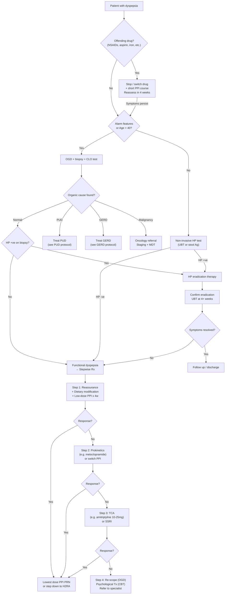

## Management Algorithm and Treatment Modalities for Dyspepsia

---

### 1. Overarching Management Principles

Before diving into specific treatments, let's establish the **logic** behind managing dyspepsia. The management strategy mirrors the diagnostic algorithm — because what you treat depends entirely on what you find (or don't find).

The management of dyspepsia is driven by **three sequential questions**:

1. **Is there an offending drug?** → Stop/switch it.
2. **Is there an identifiable organic cause?** → Treat the specific cause (PUD, GERD, malignancy, biliary, etc.).
3. **Is this functional dyspepsia?** → Stepwise empirical therapy targeting the postulated pathophysiological mechanisms.

> ***Provide education and reassurance that the condition is benign and non-life threatening*** [3] — this is the **first** and most important therapeutic intervention for functional dyspepsia. Many patients with FD are anxious about having cancer; simply telling them that their endoscopy is normal and they do not have a serious disease is itself therapeutic.

---

### 2. Master Management Algorithm

---

### 3. Management by Diagnosis

#### 3A. Drug-Induced Dyspepsia

***Drug history and past history is important, especially NSAID use*** [1].

| Step | Action | Rationale |
|---|---|---|
| 1 | **Stop or switch the offending drug** | Remove the causative agent. If NSAIDs are essential (e.g. for rheumatological disease), ***switch to less ulcerogenic NSAIDs or COX-2 inhibitors*** [3]. COX-2 selective inhibitors (e.g. celecoxib) spare COX-1 → preserve prostaglandin-mediated mucosal protection. |
| 2 | **Short course of PPI** (4 weeks) | Allows mucosal healing while the offending agent is withdrawn. |
| 3 | **Co-prescribe PPI if NSAID cannot be stopped** | Gastroprotection — the PPI suppresses acid, reducing the "aggressive factor" side of the ulcer equation, partially compensating for the loss of prostaglandin protection. |

**Aspirin-specific management** [3]:
- ***Bleeding peptic ulcer: Resume aspirin with PPI treatment once haemostasis is secured to minimise cardiovascular risk*** [3] — the CV risk of stopping aspirin outweighs the GI risk of continuing it under PPI cover
- ***Non-bleeding peptic ulcer: Continue aspirin with PPI treatment*** [3]

---

#### 3B. H. pylori Eradication Therapy

This is the cornerstone of managing HP-positive dyspepsia (whether PUD or FD). The principle: eradicate the bacterium → remove the inflammatory stimulus → allow mucosal healing → reduce ulcer recurrence from ~70% to < 5%.

##### First-Line Regimens

***Triple therapy (PPI-based or bismuth-based)*** [3]:

| Regimen | Components | Duration | Notes |
|---|---|---|---|
| **Standard PPI triple therapy** | PPI (standard dose BD) + **Clarithromycin** 500mg BD + **Amoxicillin** 1g BD | 14 days | First-line where clarithromycin resistance is < 15%. In HK, clarithromycin resistance is ~20–30%, so this regimen is increasingly suboptimal. |
| **Bismuth quadruple therapy** | PPI (standard dose BD) + **Bismuth subsalicylate/subcitrate** QDS + **Metronidazole** 500mg TDS + **Tetracycline** 500mg QDS | 14 days | First-line where clarithromycin resistance is ≥ 15% (i.e. most of East Asia including HK). Bismuth has direct antimicrobial action + forms a protective coat over ulcer base. |
| **Concomitant quadruple therapy** | PPI BD + Clarithromycin 500mg BD + Amoxicillin 1g BD + Metronidazole 500mg BD | 14 days | Alternative non-bismuth quadruple that overcomes some resistance; widely used in current practice. |

**Why 14 days?** Earlier regimens used 7 days, but meta-analyses show 14-day courses achieve ~5–10% higher eradication rates. Given rising antibiotic resistance globally, 14 days is now the standard recommendation (Maastricht VI/Florence 2022 consensus, ACG 2024 guidelines).

**Understanding the drug names:**
- **Clarithro-mycin** → "clari" = clear; "-mycin" = antibiotic from *Streptomyces* (macrolide) — binds 50S ribosomal subunit → inhibits bacterial protein synthesis
- **Amoxicillin** → β-lactam (penicillin class) — inhibits bacterial cell wall synthesis by binding penicillin-binding proteins (PBPs)
- **Metronidazole** → "metro" + "ni" (nitro) + "dazole" (imidazole ring) — prodrug activated by anaerobic organisms' nitroreductase → forms cytotoxic free radicals → damages bacterial DNA
- **Tetracycline** → "tetra" = four, "cycline" = ring — binds 30S ribosomal subunit → inhibits protein synthesis
- **Bismuth** → heavy metal that directly damages bacterial cell membrane, inhibits urease, and forms protective barrier over ulcerated mucosa

##### Second-Line / Rescue Regimens

If first-line fails (documented by positive UBT ≥ 4 weeks after completing therapy):

| Regimen | Components | When to Use |
|---|---|---|
| **Bismuth quadruple** | If PPI triple was first-line | Switch strategy — use different antibiotic backbone |
| **Levofloxacin triple** | PPI BD + Levofloxacin 500mg OD + Amoxicillin 1g BD × 14 days | Second-line option; avoid if fluoroquinolone resistance is high |
| **Culture-guided therapy** | Based on HP culture and sensitivity from biopsy | After two failed eradication attempts — OGD with culture is recommended to guide antibiotic selection |

##### Confirming Eradication

- ***Urea breath test performed ≥ 4 weeks after completing drug therapy*** [3]
- Must have stopped **PPI ≥ 2 weeks** and **antibiotics ≥ 4 weeks** before testing
- If eradication confirmed but symptoms persist → manage as functional dyspepsia [2]

<Callout title="HP Eradication in FD — The NNT Reality" type="idea">
***HP eradication offers symptomatic benefit in a small subgroup of FD patients*** [2]. The NNT is approximately 14 (you need to treat 14 HP-positive FD patients for 1 to have sustained symptom improvement). Despite this modest effect, HP eradication is still recommended because: (1) it removes the risk of future PUD, (2) it reduces gastric cancer risk, and (3) the cost and harm are low relative to the potential benefit.
</Callout>

---

#### 3C. Peptic Ulcer Disease (PUD)

##### Treatment Protocol [2][14]

| Clinical Scenario | Treatment Protocol |
|---|---|
| ***H. pylori-positive PUD*** | ***H. pylori eradication therapy*** [2] + PPI for ulcer healing (DU: 4 weeks; GU: 8 weeks) |
| ***Non-HP, non-NSAID PUD*** | ***Full-dose PPI or H2RA × 4–8 weeks*** [2] |
| ***NSAID-related PUD*** | ***Full-dose PPI or H2RA × 8 weeks*** [2]. ***Withdraw NSAIDs during PPI treatment*** [3]. If NSAIDs essential → switch to COX-2 inhibitor + co-prescribe PPI. |

##### Acid Suppression — PPI vs H2RA

| Drug Class | Mechanism | Potency | Role in Dyspepsia |
|---|---|---|---|
| **Proton pump inhibitors (PPIs)** | Irreversibly bind and inhibit the H⁺/K⁺-ATPase (proton pump) on the luminal surface of parietal cells. This is the **final common pathway** of all acid secretion (regardless of stimulus — histamine, gastrin, or ACh). | Most potent acid suppressant available. ↓ gastric acid by ~95%. | ***Empirical PPI proven to ↓ dyspepsia symptoms*** [2]. First-line for PUD, GERD, and empirical FD therapy. |
| **H2 receptor antagonists (H2RAs)** | Competitively block histamine H2 receptors on parietal cells → ↓ cAMP → ↓ acid secretion. Only blocks the histamine pathway (gastrin and ACh pathways remain active). | Less potent than PPIs. ↓ acid by ~70%. | ***Offer H2RA if inadequate response to PPI*** [2]. Also used as step-down from PPI. |

**Common PPIs** (all are pro-drugs activated in acidic environment): Omeprazole (Losec), Esomeprazole (Nexium), Pantoprazole (Pantozol), Lansoprazole, Rabeprazole.
- **Standard dose**: Omeprazole 20mg OD, Esomeprazole 20mg OD, Pantoprazole 40mg OD, Lansoprazole 30mg OD
- **Take 30 minutes before meals** — the drug needs to be absorbed, reach the parietal cell, and be activated by acid. Proton pumps are most active when stimulated by a meal, so taking PPI before eating ensures maximal inhibition.

**Common H2RAs**: Ranitidine (withdrawn in many countries due to NDMA contamination), Famotidine (Pepcid) — now the main H2RA in use.

##### Long-Term PPI Considerations

Long-term PPI use (> 1 year) is associated with several potential risks:
- ↓ Calcium absorption → ↑ osteoporotic fracture risk (acid-dependent calcium absorption)
- ↓ Magnesium absorption → hypomagnesaemia
- ↑ *Clostridioides difficile* infection risk (acid provides a natural barrier against ingested pathogens)
- ↓ B12 absorption (acid needed to release B12 from food proteins)
- Possible ↑ CKD risk (mechanism unclear)
- **Rebound acid hypersecretion** on abrupt withdrawal → taper rather than stop suddenly

> ***Lowest dose possible PPI/H2RA if symptoms recur after initial treatment*** [2] — always use the minimum effective dose for the shortest duration.

##### Monitoring [3][14]

- ***Gastric ulcer: Follow-up endoscopy necessary till complete healing is confirmed*** [3]
  - Why? To ***avoid missing concomitant gastric cancer due to sampling error*** [3]. ***Healing of ulcers reassures that the lesion is likely to be benign*** [3].
  - Repeat OGD at **6–8 weeks** with re-biopsy if not fully healed
  - ***Failure of gastric ulcer to heal after 12 weeks of medical therapy indicates need for elective surgery even if biopsy is benign*** [3]
- ***Uncomplicated duodenal ulcer: Follow-up endoscopy unnecessary if asymptomatic*** [3] — ***majority of duodenal ulcers are benign*** [3]
- ***Complicated duodenal ulcer: Follow-up endoscopy necessary till complete healing is confirmed*** [3]

##### Surgical Management of PUD [14]

***Rarely required now*** [14] due to the effectiveness of PPI and HP eradication. However, surgery is still indicated for:

- ***Uncomplicated ulcers refractory to medical treatment*** [3][14]
- ***Complicated ulcers — haemorrhage, perforation, GOO*** [14]
- ***Risk of malignancy: non-healing GU > 3 months*** [14]
- ***Zollinger-Ellison syndrome should be excluded before performing elective surgery for PUD*** [3]

| Ulcer Type | Surgical Options | Rationale |
|---|---|---|
| **DU** (aim: ↓ acid) | Highly selective vagotomy; Truncal vagotomy + drainage (pyloroplasty/gastrojejunostomy); Gastrectomy (antrectomy) + reconstruction [14] | Vagotomy reduces acid secretion by removing vagal drive to parietal cells. "Highly selective" preserves nerve of Latarjet (antral motor innervation) so gastric emptying is maintained, but is technically difficult. Truncal vagotomy sacrifices Latarjet → needs drainage procedure to prevent gastric stasis. |
| **GU** (aim: prevent malignancy) | Type I: distal gastrectomy + Billroth II. Type II/III: truncal vagotomy + antrectomy + Billroth II. Type IV: subtotal gastrectomy + Billroth I/II/Roux-en-Y [14] | GU carries malignancy risk → resection needed for definitive histology. Type and extent of resection depend on Johnson classification (ulcer location and acid secretion status). |

---

#### 3D. GERD Management [2]

| Step | Treatment | Details |
|---|---|---|
| 1 | **Lifestyle modifications** | Weight loss (↓ intra-abdominal pressure), head-of-bed elevation (gravity assists oesophageal clearance), avoid late meals (allows gastric emptying before lying down), avoid trigger foods (fat, chocolate, alcohol, coffee, smoking — all ↓ LES tone) |
| 2 | ***Full-dose PPI × 4–8 weeks for healing of oesophagitis*** [2] | Heals ~85% of erosive oesophagitis at 8 weeks |
| 3 | ***Full-dose PPI × 8 weeks or even long-term maintenance if severe oesophagitis*** [2] | LA grade C/D oesophagitis often requires prolonged therapy |
| 4 | ***If severe oesophagitis failed healing, consider double-dose PPI, switch to another PPI at full- or double-dose*** [2] | Different PPIs have varying bioavailability and metabolism (CYP2C19 polymorphisms affect omeprazole more than rabeprazole/esomeprazole) |
| 5 | ***Lowest dose possible PPI if symptoms recur after initial treatment*** [2] | Step-down strategy to minimise long-term PPI exposure |
| 6 | ***Offer H2RA if inadequate response to PPI*** [2] | H2RAs can be added at bedtime (nocturnal acid breakthrough — histamine is the dominant drive for nocturnal acid secretion, so H2RA adds benefit) |
| 7 | **Surgical referral** | ***Young and fit PPI-dependent patients*** (to avoid lifelong PPI); ***GERD/complications unresponsive to medical treatment*** [15]. Laparoscopic fundoplication (Nissen 360° or partial — ***partial preferred in Chinese due to less dysphagia*** [15]). |

---

#### 3E. Functional Dyspepsia — Stepwise Management

This is the **core exam topic** — the systematic, stepwise approach to managing FD when organic causes have been excluded.

***Treatment approach to functional dyspepsia: PPIs (OR) Triple therapy → TCA → Prokinetics*** [3]

| Step | Treatment | Mechanism | Evidence & Notes |
|---|---|---|---|
| **0** | ***Reassurance after ruling out organic pathologies*** [2] | Addresses illness anxiety; breaks the cycle of symptom-hypervigilance-anxiety-worsening symptoms | ***Provide education and reassurance that the condition is benign and non-life threatening*** [3]. This alone improves symptoms in many patients. |
| **1** | ***Dietary changes: avoid known precipitants, low fat diet, ↓ FODMAPs, ↓ lactose*** [2] | Low fat → ↓ CCK release → ↓ slowing of gastric emptying. FODMAPs (Fermentable Oligosaccharides, Disaccharides, Monosaccharides And Polyols) → fermented by gut bacteria → gas, bloating, distension → reducing them ↓ symptom triggers. | Benefit variable; some patients clearly identify dietary triggers |
| **2a** | **HP eradication** (if HP +ve) | Removes mucosal inflammation that may contribute to visceral hypersensitivity; NNT ~14 [2] | ***HP eradication: offer symptomatic benefit in a small subgroup of FD patients*** [2]. Always offer if HP +ve because it also ↓ future PUD/gastric cancer risk. |
| **2b** | ***Empirical PPI*** (if HP -ve or symptoms persist post-eradication) | Suppresses gastric acid → ↓ acid-mediated mucosal stimulation → ↓ visceral nociceptor activation | ***Can offer H2RA or PPI (if failed H2RA) as PRN at lowest dose possible*** [2]. ***Effective in Western populations but effect not demonstrated in Asians*** [2]. ***Effective in ulcer-like or reflux-like dyspepsia but NOT in dysmotility-like or unspecified ones*** [2]. |
| **2c** | ***Simeticone (Mylicon)*** | Anti-foaming agent — reduces surface tension of gas bubbles in GI tract → allows coalescence and easier passage → ↓ bloating, belching | ***Anti-foaming agent for symptoms of belching, commonly used in GOPC*** [2]. Harmless, cheap, OTC — good first step for gas-predominant symptoms. |
| **3** | ***Prokinetics, e.g. metoclopramide*** [2] | Metoclopramide is a **dopamine D2 receptor antagonist** + **5-HT4 agonist** → enhances gastric motility and accelerates gastric emptying → addresses the dysmotility component of FD. Also has central antiemetic action (blocks D2 in CTZ). | ***For refractory cases*** [2]. Use with caution due to extrapyramidal side effects (acute dystonia, tardive dyskinesia — dopamine blockade in basal ganglia). Limit to **≤ 5 days** per European guidelines (EMA) or use at lowest effective dose for short courses. Alternatives: domperidone (peripheral D2 blocker, does not cross BBB as readily → fewer CNS side effects but risk of QT prolongation), itopride (D2 antagonist + AChE inhibitor — available in Asia, fewer side effects). |
| **4** | ***Antidepressants: TCAs (e.g. amitriptyline) and SSRIs (e.g. escitalopram) may be useful*** [2] | TCAs (tricyclic antidepressants) modulate visceral pain perception at sub-antidepressant doses (10–25mg amitriptyline at bedtime). Mechanism: ↓ noradrenaline and serotonin reuptake at spinal dorsal horn → ↓ ascending nociceptive transmission from gut. Also have anticholinergic properties → slow GI transit (helpful in diarrhoea-predominant but potentially harmful in constipation-predominant). SSRIs modulate brain-gut axis serotonergic signalling → ↓ visceral hypersensitivity. | ***Empirical antisecretory therapy → Prokinetics and TCA if fail PPI treatment*** [2]. TCAs are preferred for EPS (pain-dominant). SSRIs may be preferred when comorbid anxiety/depression is prominent. |
| **5** | **Psychological therapy** (CBT, relaxation training) | Addresses the cognitive-behavioural component: catastrophising about symptoms, symptom hypervigilance, illness anxiety. ***Relaxation training, e.g. progressive muscle relaxation, diaphragmatic breathing. CBT: to target underlying health beliefs and expectations*** [16]. | Reserved for refractory cases or those with prominent psychological comorbidity. ***Note that 70–90% decline psychotherapy*** [16] — so framing and patient engagement is crucial. |
| **6** | ***Reinvestigate by OGD should symptoms persist despite multiple treatments*** [2] | Ensures no organic pathology was missed on initial evaluation (sampling error, early malignancy, rare conditions like eosinophilic gastroenteritis) | Safety net — if nothing new is found, reinforces the FD diagnosis and supports ongoing symptom management. |

<Callout title="Matching FD Subtype to Treatment">
- **PDS (postprandial distress / dysmotility-like)**: Dietary modification + prokinetics are more logical (targeting impaired gastric accommodation and delayed emptying). PPI less effective. Fundic relaxants (e.g. acotiamide — approved in Japan/Asia) may help.
- **EPS (epigastric pain / ulcer-like)**: PPI and TCA are more logical (targeting acid sensitivity and visceral hypersensitivity). ***PPI effective in ulcer-like or reflux-like dyspepsia but NOT in dysmotility-like*** [2].
</Callout>

---

#### 3F. NICE 2014 Guidelines Summary Table [2]

This is a **high-yield exam table** — know it cold.

| Condition | Treatment Protocol |
|---|---|
| ***Uninvestigated dyspepsia*** | ***H. pylori testing and eradication (test-and-treat strategy). Empirical full-dose PPI × 4 weeks. Offer H2RA if inadequate response to PPI.*** [2] |
| ***Functional dyspepsia*** | ***H. pylori eradication therapy if H. pylori-positive. Low-dose PPI or H2RA × 4 weeks if symptoms persist after HP excluded. Lowest dose possible PPI/H2RA if symptoms recur after initial treatment.*** [2] |
| ***Peptic ulcer disease*** | ***H. pylori eradication therapy if H. pylori-positive. Full-dose PPI or H2RA × 4–8 weeks for non-HP, non-NSAID PUD. Full-dose PPI or H2RA × 8 weeks for NSAID PUD.*** [2] |
| ***GERD*** | ***Full-dose PPI × 4–8 weeks for healing of oesophagitis. Full-dose PPI × 8 weeks or even long-term maintenance if severe oesophagitis. If severe oesophagitis failed healing, consider double-dose PPI, switch to another PPI at full- or double-dose. Lowest dose possible PPI if symptoms recur after initial treatment. Offer H2RA if inadequate response to PPI.*** [2] |

---

### 4. Specific Drug Summary Table

| Drug | Class | Mechanism | Indication | Key Side Effects / Contraindications |
|---|---|---|---|---|
| **Omeprazole / Esomeprazole / Pantoprazole / Lansoprazole / Rabeprazole** | PPI | Irreversible inhibition of H⁺/K⁺-ATPase (proton pump) on parietal cells — final common pathway of acid secretion | PUD, GERD, FD (empirical), HP eradication (component of regimen), stress ulcer prophylaxis | Long-term: ↑ fracture risk, ↓ Mg²⁺, ↑ *C. difficile*, ↓ B12, rebound hypersecretion. Take 30 min before meals. |
| **Famotidine** | H2RA | Competitive antagonism of histamine H2 receptor on parietal cells | Step-down from PPI; nocturnal acid breakthrough; FD if PPI fails | Generally well tolerated. Less potent than PPI. |
| **Clarithromycin** | Macrolide antibiotic | Binds 50S ribosomal subunit → inhibits protein synthesis | HP eradication (triple/quadruple therapy) | GI upset, metallic taste; QT prolongation; many drug interactions (CYP3A4 inhibitor). Resistance rising (20–30% in HK). |
| **Amoxicillin** | β-lactam (penicillin) | Inhibits bacterial cell wall synthesis | HP eradication | Allergy (rash, anaphylaxis); diarrhoea. CI: penicillin allergy → substitute metronidazole. |
| **Metronidazole** | Nitroimidazole | Prodrug activated in anaerobes → cytotoxic free radicals → DNA damage | HP eradication (bismuth quadruple); substitute for amoxicillin in penicillin-allergic | Disulfiram-like reaction with alcohol; metallic taste; peripheral neuropathy with prolonged use. |
| **Tetracycline** | Tetracycline | Binds 30S ribosomal subunit → inhibits protein synthesis | HP eradication (bismuth quadruple) | Photosensitivity; CI in children < 8 and pregnancy (teeth discolouration, bone growth inhibition). |
| **Bismuth subsalicylate / subcitrate** | Heavy metal compound | Direct antimicrobial against HP; forms protective barrier over ulcer; stimulates mucus/bicarbonate secretion | HP eradication (bismuth quadruple) | Black tongue/stool (harmless); CI: salicylate allergy (subsalicylate form). |
| **Metoclopramide** | Prokinetic (D2 antagonist + 5-HT4 agonist) | ↑ Gastric motility, ↑ gastric emptying, antiemetic (CTZ blockade) | FD (PDS/dysmotility-like); gastroparesis | **Extrapyramidal effects** (acute dystonia, akathisia, tardive dyskinesia — especially in young women). ***Limit duration***. CI: phaeochromocytoma (can cause hypertensive crisis), mechanical bowel obstruction, epilepsy. |
| **Domperidone** | Prokinetic (peripheral D2 antagonist) | Same as metoclopramide but does not cross BBB significantly → fewer CNS side effects | Alternative prokinetic for FD, gastroparesis | **QT prolongation → cardiac arrhythmia**. CI: hepatic impairment, concurrent QT-prolonging drugs. ECG monitoring advised. |
| **Amitriptyline** | TCA | ↓ Noradrenaline + serotonin reuptake → modulates visceral pain at sub-antidepressant doses; anticholinergic → slows GI transit | FD (EPS/pain-dominant); refractory FD | Dry mouth, constipation, urinary retention, drowsiness, weight gain. CI: recent MI, arrhythmia, urinary retention, narrow-angle glaucoma. Start low (10mg nocte), titrate slowly. |
| **Escitalopram** | SSRI | Selective serotonin reuptake inhibition → modulates brain-gut axis serotonin signalling | FD with comorbid anxiety/depression | Nausea (serotonergic), sexual dysfunction, serotonin syndrome (with other serotonergic drugs). CI: concurrent MAOIs. |
| **Simeticone** | Anti-foaming agent | ↓ Surface tension of gas bubbles → coalescence → easier passage | ***Belching, bloating — commonly used in GOPC*** [2] | Essentially no side effects. OTC. |

---

### 5. Managing Specific Complications

| Complication | Immediate Management | Definitive Management |
|---|---|---|
| **Bleeding PUD** | Resuscitation (IV fluids, blood products); ***Post-OGD PPI infusion: pantoprazole/esomeprazole 80mg stat, then 8mg/h for 72h*** [15] (high pH stabilises clot — platelet aggregation is pH-dependent, optimal at pH > 6). Endoscopic therapy: ***dual therapy: adrenaline 1:10,000 injection + heater probe or clips*** [15]. | HP eradication; stop NSAIDs; long-term PPI if ongoing risk factors. ***Surgery: indicated if failed endoscopic haemostasis, rebleeding failing re-scope, ongoing transfusion requirement*** [14][15]. |
| **Perforated PUD** | Resuscitation, IV antibiotics, erect CXR (pneumoperitoneum). | Emergency surgery: omental patch repair (Graham patch) for DU; partial gastrectomy for GU (malignancy risk). |
| **GOO** | NGT decompression, IV fluids, correct metabolic alkalosis (hypokalaemic hypochloraemic from vomiting). | OGD for diagnosis and balloon dilatation (benign); surgical bypass or resection (malignant). |

---

### 6. Lifestyle Modification — The Forgotten Foundation

These apply to **all** causes of dyspepsia and should be part of every management plan:

| Modification | Rationale |
|---|---|
| ***Smoking cessation*** [3] | Smoking ↓ mucosal blood flow, ↓ bicarbonate secretion, ↑ acid output, delays ulcer healing |
| ***Limit alcohol intake*** [3] | Alcohol is a direct mucosal irritant and ↓ LES tone (promoting reflux) |
| **Avoid known dietary triggers** | Fat → ↓ LES tone + ↓ gastric emptying; coffee, chocolate, spicy food — all can worsen symptoms |
| **Weight loss** (if overweight) | ↓ Intra-abdominal pressure → ↓ reflux |
| **Avoid late-night eating** | Allows gastric emptying before lying down → ↓ nocturnal reflux |
| **Head-of-bed elevation** | Gravity assists oesophageal clearance of refluxed material |
| **Stress management** | Brain–gut axis: stress → ↑ visceral hypersensitivity, altered motility |

---

<Callout title="High Yield Summary">

**Management is diagnosis-driven**: Drug-induced → stop drug. HP +ve → eradicate. PUD → HP eradication + PPI (4–8w). GERD → PPI (4–8w). FD → stepwise empirical therapy.

**FD stepwise approach**: (1) Reassurance + dietary changes. (2a) HP eradication if +ve. (2b) Empirical low-dose PPI × 4w. (3) Prokinetics (metoclopramide/domperidone). (4) TCA (amitriptyline 10–25mg) or SSRI. (5) Psychological therapy (CBT). (6) Re-scope if refractory.

**NICE guideline table**: Know the treatment protocols for uninvestigated dyspepsia, FD, PUD, and GERD — they differ in PPI dose and duration.

**HP eradication**: 14-day regimens. First-line in HK: bismuth quadruple (due to high clarithromycin resistance). Confirm eradication with UBT ≥ 4 weeks post-therapy.

**PPIs**: Take 30 min before meals. Use lowest dose for shortest duration. Long-term risks: fractures, hypoMg, C. difficile, B12 deficiency.

**Prokinetics**: Metoclopramide (EPSEs — limit duration), domperidone (QT prolongation). Best for PDS subtype.

**TCAs**: Amitriptyline 10–25mg nocte for EPS/pain-dominant FD. Works via visceral pain modulation, not antidepressant effect.

**Gastric ulcer follow-up**: ALWAYS re-scope at 6–8 weeks to confirm healing and exclude malignancy. Non-healing at 12 weeks → surgery.

**Aspirin rule**: Resume with PPI cover once haemostasis achieved (bleeding PUD) or continue with PPI (non-bleeding PUD).

</Callout>

---

<ActiveRecallQuiz
  title="Active Recall - Management of Dyspepsia"
  items={[
    {
      question: "Outline the stepwise management of functional dyspepsia after organic causes have been excluded.",
      markscheme: "Step 1: Reassurance + education + dietary modification (low fat, avoid triggers, reduce FODMAPs). Step 2a: HP eradication if HP +ve. Step 2b: Empirical low-dose PPI x 4 weeks (more effective in EPS/ulcer-like subtype). Step 2c: Simeticone for bloating/belching. Step 3: Prokinetics (metoclopramide, domperidone) for dysmotility symptoms. Step 4: TCA (amitriptyline 10-25mg nocte) or SSRI for refractory/pain-dominant. Step 5: Psychological therapy (CBT, relaxation). Step 6: Re-scope with OGD if still refractory."
    },
    {
      question: "A patient with H. pylori-positive functional dyspepsia undergoes eradication therapy. Eradication is confirmed by UBT at 4 weeks but symptoms persist. What is the next management step and why?",
      markscheme: "Treat as functional dyspepsia with empirical low-dose PPI or H2RA x 4 weeks. HP eradication only benefits a minority of FD patients (NNT ~14). Persistent symptoms after confirmed eradication suggest the underlying FD mechanism is dysmotility or visceral hypersensitivity rather than HP-driven inflammation. If PPI fails, step up to prokinetics then TCA."
    },
    {
      question: "State the first-line H. pylori eradication regimen recommended in Hong Kong and explain why standard PPI triple therapy may be suboptimal.",
      markscheme: "First-line in HK: Bismuth quadruple therapy (PPI BD + bismuth QDS + metronidazole TDS + tetracycline QDS) x 14 days. Standard PPI triple therapy (PPI + clarithromycin + amoxicillin) is suboptimal because clarithromycin resistance in HK is approximately 20-30%, exceeding the 15% threshold above which triple therapy eradication rates fall unacceptably below 80%."
    },
    {
      question: "According to the NICE guidelines, how does PPI dosing differ between uninvestigated dyspepsia, functional dyspepsia, and GERD?",
      markscheme: "Uninvestigated dyspepsia: full-dose PPI x 4 weeks. Functional dyspepsia: low-dose PPI or H2RA x 4 weeks; step down to lowest dose possible if recurrence. GERD: full-dose PPI x 4-8 weeks (or 8 weeks + long-term for severe oesophagitis); if fails, double-dose or switch PPI; then lowest dose for maintenance."
    },
    {
      question: "A patient on aspirin for secondary prevention of ischaemic stroke develops a bleeding peptic ulcer. After endoscopic haemostasis, what should you do with the aspirin?",
      markscheme: "Resume aspirin with PPI treatment once haemostasis is secured. Rationale: the cardiovascular risk of stopping aspirin (stroke/MI) outweighs the GI risk of rebleeding when protected by PPI. For non-bleeding PUD on aspirin: continue aspirin with PPI cover."
    },
    {
      question: "Why is follow-up OGD mandatory for gastric ulcers but not for uncomplicated duodenal ulcers?",
      markscheme: "Gastric ulcers can be malignant (gastric adenocarcinoma can mimic a benign ulcer), so follow-up OGD at 6-8 weeks is needed to confirm healing and re-biopsy if not healed. Sampling error at initial OGD may miss cancer. Non-healing GU at 12 weeks warrants surgery. Duodenal ulcers are almost never malignant, so follow-up OGD is unnecessary if asymptomatic (but is needed for complicated DU)."
    }
  ]}
/>

## References

[1] Lecture slides: murtagh merge.pdf (Dyspepsia, pp. 38–39)
[2] Senior notes: Ryan Ho GI.pdf (pp. 54–55, Section 2.1.4) and Ryan Ho Fundamentals.pdf (pp. 264–265, Section 3.3.4)
[3] Senior notes: felixlai.md (Dyspepsia section, pp. 490–492; PUD treatment section, pp. 570–571)
[14] Senior notes: maxim.md (PUD surgical management, p. 127)
[15] Senior notes: maxim.md (OGD therapeutic, pp. 101–107; GERD surgical treatment, p. 107)
[16] Senior notes: Ryan Ho Psychiatry.pdf (p. 204 — Somatic symptom disorders management)
