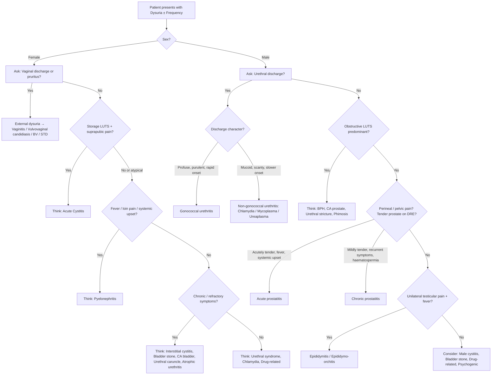

## Differential Diagnosis of Dysuria and Urinary Frequency

### Organising Framework

The differential diagnosis of dysuria and frequency is best organised by asking three sequential questions:

1. **Is this infective or non-infective?** — most cases are infective (UTI, STD, prostatitis).
2. **Where is the pathology?** — lower urinary tract (bladder, urethra, prostate) vs upper tract (kidney, ureter) vs extra-urinary (vagina, pelvis).
3. **Is there a structural or functional abnormality?** — obstruction (BPH, stricture, stone), neurogenic (OAB, neurogenic bladder), or mucosal disease (interstitial cystitis, malignancy, atrophy).

This framework ensures you don't miss anything — from the common to the dangerous.

---

### Master Differential Diagnosis Table

The following table integrates the **Murtagh's diagnostic strategy** [1] with the senior notes differentials [2][3][4][5]:

#### A. Sex-Specific Differential Diagnosis of Dysuria

| ***Female*** | ***Male*** |
|---|---|
| ***UTI (esp. cystitis)*** [1][2] | ***UTI*** [1][2] |
| ***Sexually transmitted diseases: vaginitis, urethritis*** [1][2] | ***Urethritis: due to STD*** [1][2] |
| ***Pelvic inflammatory disease*** [1][2] | ***Acute/chronic prostatitis*** [1][2] |
| ***Interstitial cystitis (painful bladder syndrome)*** [1][2] | ***Bladder stones*** [1][2] |
| ***Bladder stones*** [1][2] | ***Epididymitis*** [2] |

#### B. Murtagh's Diagnostic Strategy for Dysuria [1]

| Category | Differentials | Why it causes dysuria/frequency |
|---|---|---|
| ***Probability diagnosis*** | ***UTI (esp. cystitis)*** | Bacterial invasion of urothelium → inflammation → nociceptor activation during voiding; ↓sensory threshold → frequency |
| | ***Urethritis*** | Urethral mucosal inflammation (gonococcal or non-gonococcal) → pain on urine contact; ***"urethritis causes pain at the onset of micturition"*** [1] |
| | ***Urethral syndrome — abacterial cystitis (female)*** | Irritative urethral/bladder symptoms with sterile cultures; poorly understood — may involve subclinical infection (Chlamydia, Ureaplasma), local inflammation, or pelvic floor dysfunction |
| | ***Vaginitis*** | External dysuria — urine splashes over inflamed vulvar/vaginal mucosa (Candida, Trichomonas, BV); vaginal pruritus and discharge distinguish this from true UTI |
| ***Serious disorders not to be missed*** | ***Neoplasia: bladder, prostate, urethra*** | Tumour erodes urothelium → chronic irritation and inflammation → frequency, dysuria, haematuria. Bladder cancer classically presents with **painless haematuria** but can cause irritative LUTS [4][6] |
| | ***Infection: gonorrhoea, chlamydia/others, genital herpes, prostatitis*** | Direct mucosal infection → inflammation; genital herpes causes vesicular lesions on urethral/vulvar mucosa → exquisite pain on urine contact |
| | ***Reactive arthritis*** | Post-infectious immune-mediated sterile urethritis (typically post-Chlamydia or enteric infection) → dysuria occurs as part of the classic triad: urethritis + conjunctivitis + arthritis |
| | ***Calculi (e.g. bladder)*** | Stone mechanically irritates trigone/bladder mucosa → frequency, urgency, dysuria, terminal haematuria; VUJ stones trigger irritative LUTS by stimulating bladder afferents [3][5] |
| ***Pitfalls (often missed)*** | ***Menopause syndrome*** | Oestrogen deficiency → urethral/vaginal mucosal atrophy → dry, friable tissue → chronic irritation and dysuria; ***"In the menopausal female the cause may be evident from a dry atrophic urethral opening, a urethral caruncle or urethral prolapse"*** [1] |
| | ***Adenovirus urethritis*** | Viral urethritis — particularly in children and immunosuppressed; haemorrhagic cystitis with adenovirus types 11 and 21 |
| | ***Prostatitis*** | Especially **chronic prostatitis** which is subtle — ***"can be subtle, a/w recurrent UTI symptoms, low-grade fever, deep pain (in pelvis, perineum, scrotum, and esp if during ejaculation), haematospermia ± obstructive symptoms"*** [2] |
| | ***Foreign bodies in lower urinary tract*** | Mechanical irritation of urothelium → chronic inflammation → frequency, dysuria; think forgotten stent, retained catheter fragment, deliberate insertion |
| | ***Acidic urine*** | Low urinary pH (dietary: high-dose vitamin C, cranberry juice) → chemical irritation of urothelium |
| | ***Acute fever*** | Concentrated, acidic urine in febrile illness → transient dysuria without true UTI |
| | ***Interstitial cystitis*** | ***Dx of exclusion → chronic, refractory bladder symptoms and pain*** [2]; defective GAG layer → urinary solutes penetrate submucosa → chronic pain |
| | ***Urethral caruncle/diverticuli*** | Caruncle: vascular, polyp-like growth at urethral meatus (postmenopausal women) → tender, bleeds on contact; diverticulum: outpouching of urethra → collects urine → secondary infection → dysuria and post-void dribbling |
| | ***Vaginal prolapse*** | Cystocele → incomplete bladder emptying → stasis → secondary UTI → frequency and dysuria |
| ***Obstruction*** | ***Benign prostatic hyperplasia*** | Static (DHT-mediated stromal compression) + dynamic (α₁-receptor smooth muscle tone) → BOO → stasis → secondary UTI → dysuria; also secondary detrusor overactivity → frequency [5] |
| | ***Urethral stricture*** | Fibrotic narrowing of urethra (post-instrumentation, post-infection, post-trauma) → obstructive symptoms + stasis → secondary infection |
| | ***Phimosis*** | Tight foreskin → partial urethral obstruction + difficult hygiene → ↑bacterial colonization |
| | ***Meatal stenosis*** | Narrowed urethral meatus (post-circumcision in boys, post-catheterisation) → obstructive symptoms |
| ***Masquerades checklist*** | ***Depression*** | Somatisation of psychiatric distress as urinary symptoms |
| | ***Diabetes*** | Glucosuria → osmotic diuresis → polyuria/frequency; also rich growth medium for bacteria → recurrent UTI; autonomic neuropathy → incomplete emptying → stasis |
| | ***Drugs*** | Cyclophosphamide → haemorrhagic cystitis (acrolein metabolite); SGLT2 inhibitors → glucosuria → genital candidiasis; anticholinergics → retention → secondary UTI; α-agonists → ↑sphincter tone → retention |
| | ***UTI*** | Always reconsider UTI as the underlying cause |
| ***Psychosocial*** | ***Psychosexual problems, anxiety, hypochondriasis*** | ***"Is the patient trying to tell me something? Consider psychosexual problems, anxiety and hypochondriasis."*** [1] |

<Callout title="Key Principle" type="idea">
***"It is important to determine whether dysuria is really genitourinary in origin and not attributable to functional disorders, such as psychosexual problems. Disturbances of micturition are uncommon in the young male and if present suggest sexually transmitted infection (STIs)."*** [1]
</Callout>

---

### Expanded Differential of Frequency (with or without dysuria)

When frequency is the **dominant** complaint, broaden the differential beyond infection [3][4][5]:

#### Differential Diagnosis of LUTS [3]

| Category | Differentials | Why |
|---|---|---|
| **Bladder outlet obstruction** (predominantly **voiding** symptoms) | ***BPH, CA prostate***, urethral stricture, bladder neck contracture, bladder stones, bladder cancer, interstitial cystitis, ***ketamine cystitis*** [3] | Physical or dynamic obstruction → incomplete emptying → ↓functional capacity → frequency; stasis → secondary UTI → dysuria |
| **Overactive bladder** (predominantly **storage** symptoms) | **Neurogenic**: stroke, PD, MS, SCI, TBI, NPH [3] | Loss of cortical/pontine inhibition of sacral micturition reflex → uninhibited detrusor contractions |
| | **Non-neurogenic**: idiopathic, secondary to BOO, bladder pathology (cystitis, tumour, stones, FB), drugs [3][2] | Chronic BOO → ↑intravesical pressure → tissue ischaemia → smooth muscle injury and **cholinergic denervation supersensitivity** → detrusor overactivity [2] |
| **Polyuria** | DM (osmotic diuresis), DI (↓ADH or renal insensitivity), polydipsia, hypercalcaemia, CKD (loss of concentrating ability) | Increased urine production → bladder fills faster → frequency with **normal or large** volume per void (unlike "true frequency" where volumes are small) |

#### Differential Diagnosis of Nocturia [3]

| System | Cause | Mechanism |
|---|---|---|
| Respiratory | **Obstructive sleep apnoea** | Difficulty with sleep maintenance + loss of diurnal variation in ADH release → nocturnal polyuria |
| Cardiovascular | **Hypertension, CHF, peripheral oedema** | Supine position → mobilisation of peripheral oedema → ↑venous return → ↑renal perfusion → ↑nocturnal urine output; also ↑ANP release → natriuresis |
| Urological | **UTI, BPH, CA prostate** | Inflammation → ↓bladder capacity; obstruction → incomplete emptying; same mechanisms as above |
| Endocrine | **DM, DI** | DM: osmotic diuresis from glucosuria; DI: loss of diurnal variation or deficiency of vasopressin (ADH) → nocturnal polyuria |

---

### Clinical Pointers to Differentiate — Pattern Recognition

This is critical for exams. When a patient presents with dysuria ± frequency, the **associated features** point you to the diagnosis [1][2][6]:

| Diagnosis | Key Clinical Pointers |
|---|---|
| ***UTI (cystitis)*** | ***Storage LUTS, turbid/bloody urine, suprapubic pain ± loin pain, fever, chills (if upper tract)*** [2]; ***"Suprapubic discomfort is a feature of bladder infection (cystitis)"*** [1]; **cystitis should NOT cause fever/systemic upset** — if present, think pyelonephritis [4] |
| ***STDs (urethritis/vaginitis)*** | ***+ve sexual Hx, urethral/vaginal discharge (esp during morning void)*** [2]; ***"Unexplained dysuria could be a pointer to chlamydia urethritis"*** [1] |
| ***Acute prostatitis*** | ***Systemic disturbance (fever, chills, malaise), deep pelvic/perineal pain ± obstructive symptoms (with acute swollen prostate)*** [2]; DRE: exquisitely tender, boggy prostate |
| ***Chronic prostatitis*** | ***Subtle, a/w recurrent UTI symptoms, low-grade fever, deep pain (in pelvis, perineum, scrotum, and esp if during ejaculation), haematospermia ± obstructive symptoms*** [2] |
| ***Acute epididymitis*** | ***Storage LUTS + unilateral testicular pain + high fever/rigors*** [2] |
| ***Interstitial cystitis*** | ***Dx of exclusion → chronic, refractory bladder symptoms and pain*** [2]; middle-aged women, symptoms worsened by bladder filling and relieved by voiding |
| **Bladder stone** | Frequency, urgency, dysuria with **terminal haematuria**; symptoms worse with movement/exercise (stone shifts and irritates trigone); strangury (painful, frequent small-volume voids with straining) [2][5] |
| **BPH** | ***Typical age 50-80; LUTS with obstructive > > irritative symptoms*** [5]; DRE: smooth enlarged > 3FB, non-tender, median sulcus present |
| **CA prostate** | Obstructive LUTS (late — arises in peripheral zone so doesn't obstruct early); hard, irregular prostate with loss of median sulcus on DRE; ↑PSA; bone pain if metastatic [5][6] |
| **CA bladder** | Painless haematuria (classic); irritative LUTS; constitutional symptoms; risk factors: smoking, occupational exposure, aristolochic acid (TCM) [4][6] |
| **Pyelonephritis** | Systemic upset (high fever > 39°C, rigors), flank pain, renal angle tenderness, Murphy's kidney punch +ve; preceded by irritative urinary symptoms [4][7] |
| **Urolithiasis at VUJ** | Colicky loin-to-groin pain + irritative LUTS (frequency, urgency, dysuria) when stone is at the vesicoureteric junction → stone irritates bladder trigone afferents [3][5] |
| **Atrophic urethritis/vaginitis** | Postmenopausal woman; dry, atrophic urethral opening; ± urethral caruncle; chronic low-grade dysuria and frequency [1] |
| **Colovesical fistula** | Pneumaturia, fecaluria, dysuria (recurrent UTI); history of diverticular disease or colorectal malignancy [7][8] |
| **Gonococcal vs non-gonococcal urethritis** | GC: **profuse, purulent** discharge, dysuria **within 4 days**, greater extent; NGC: **mucoid, scanty** discharge, dysuria **over 1–5 weeks** (peak 2–3 weeks), lesser extent [6] |

<Callout title="Exam Pearl: Gonococcal vs Non-Gonococcal Urethritis" type="idea">
The **character and timing of discharge** is the key differentiator [6]:
- **Gonococcal**: profuse, purulent, rapid onset (within 4 days), more severe dysuria
- **Non-gonococcal (Chlamydia)**: mucoid, scanty, slower onset (1–5 weeks, peak at 2–3 weeks), milder dysuria

Remember: ***"Unexplained dysuria could be a pointer to chlamydia urethritis"*** [1] — Chlamydia is easily missed because the discharge is subtle and the patient may not notice it.
</Callout>

---

### Differential Diagnosis of Urethritis [6]

| Category | Causes |
|---|---|
| **Physiological** | Sexual arousal, prostatorrhoea/spermatorrhoea, phosphaturia |
| **STDs** | Gonorrhoea; Non-gonococcal: Chlamydia trachomatis, Mycoplasma genitalium, Ureaplasma urealyticum, Trichomonas vaginalis, Candida, HSV; or BOTH |
| **Non-STDs** | Bacterial urethritis/prostatitis; phimosis with poor hygiene; catheterisation and instrumentation; allergy (SJS); irritants (alcohol, caffeine, physical trauma); foreign bodies |

---

### Diagnostic Algorithm: Approach to the Patient with Dysuria ± Frequency

---

### Extra-Urinary Causes to Consider

Don't forget causes **outside** the urinary tract that can mimic or cause dysuria/frequency:

| Source | Condition | Mechanism |
|---|---|---|
| **GI tract** | Acute diverticulitis adjacent to bladder | Pericolic inflammation irritates bladder serosa → frequency, urgency, dysuria; if fistula forms (colovesical) → pneumaturia, fecaluria, recurrent UTI [7][8] |
| **GI tract** | Acute appendicitis (pelvic appendix) | Inflamed appendix lying on bladder → referred frequency and dysuria [7] |
| **Gynaecological** | PID, endometriosis | Pelvic inflammation → irritation of bladder peritoneum; endometriotic implants on bladder → cyclical dysuria |
| **Gynaecological** | Ectopic pregnancy | Pelvic haematoma → bladder irritation |
| **Neurological** | MS, spinal cord lesion, stroke | Loss of supraspinal inhibition → neurogenic detrusor overactivity → frequency, urgency |
| **Drug-related** | Cyclophosphamide, ifosfamide | Acrolein metabolite → haemorrhagic cystitis → severe dysuria, frequency, haematuria [4] |
| **Drug-related** | SGLT2 inhibitors | Glucosuria → genital candidiasis → external dysuria; osmotic diuresis → frequency |
| **Radiation** | Post-pelvic RT (cervix, rectum, prostate) | Radiation cystitis → chronic mucosal inflammation and fibrosis → frequency, dysuria, haematuria [4] |

---

### Approach by Age and Sex — Hong Kong Focus

| Patient Profile | Most Likely | Don't Miss |
|---|---|---|
| Young woman (18–35), sexually active | Acute cystitis, vaginitis | Chlamydia urethritis, PID |
| Postmenopausal woman | UTI (recurrent), atrophic urethritis | CA bladder, interstitial cystitis |
| Young man (18–35) | STD urethritis (GC/NGC) | Reactive arthritis, acute prostatitis |
| Older man ( > 50) | BPH with secondary UTI | CA prostate, CA bladder |
| Child | UTI (esp. if febrile without focus) | VUR, posterior urethral valves, neurogenic bladder |
| Immunocompromised/catheterised | Complicated UTI (broad-spectrum organisms) | Fungal UTI (Candida), adenoviral haemorrhagic cystitis |
| History of TCM use (Hong Kong) | UTI | Urothelial carcinoma (aristolochic acid nephropathy) |
| Ketamine user (Hong Kong) | ***Ketamine cystitis*** [3] | Contracted bladder, upper tract damage |

<Callout title="Ketamine Cystitis — Hong Kong-Specific Pitfall" type="error">
Ketamine abuse is a significant problem in Hong Kong. Ketamine and its metabolites (norketamine) are directly toxic to the urothelium → severe chemical cystitis → markedly contracted bladder (capacity may drop to < 50 mL) → extreme frequency (voiding every 15–30 minutes), severe dysuria, haematuria. In advanced cases, upper tract involvement with hydronephrosis and renal impairment occurs. Always ask about recreational drug use in young patients with refractory frequency.
</Callout>

---

### Summary: How to Differentiate at the Bedside

The key **discriminating features** when facing dysuria ± frequency:

| Feature | Think... |
|---|---|
| **Discharge** (urethral/vaginal) | STD / vaginitis |
| **Fever + systemic upset** | Upper tract (pyelonephritis) or prostatitis |
| ***Suprapubic pain, no fever*** | ***Cystitis*** [1] |
| **Loin pain** | Pyelonephritis, ureteric stone |
| **Terminal haematuria + movement-related symptoms** | Bladder stone |
| **Obstructive LUTS** | BPH, CA prostate, urethral stricture |
| **Painless haematuria + irritative LUTS + age > 35** | CA bladder — until proven otherwise |
| **Chronic refractory symptoms, cultures negative** | Interstitial cystitis, TB, ketamine cystitis |
| **Postmenopausal, dry atrophic mucosa** | Atrophic urethritis/vaginitis |
| **Perineal pain, tender prostate** | Prostatitis |
| **Pneumaturia, fecaluria** | Colovesical fistula (diverticular disease/CRC) |
| **Sterile pyuria** | TB of urinary tract, interstitial nephritis, stones, cancer |

<Callout title="Sterile Pyuria — Always Think TB in Hong Kong">
Sterile pyuria (WBCs in urine but negative standard culture) is a classic finding in genitourinary tuberculosis. In Hong Kong, an endemic area, **always send 3 early morning urine specimens for AFB smear and mycobacterial culture** when you see persistent sterile pyuria with frequency/dysuria/haematuria that doesn't respond to standard antibiotics.
</Callout>

---

<Callout title="High Yield Summary">

**Probability diagnoses for dysuria**: UTI (cystitis), urethritis, urethral syndrome, vaginitis.

**Serious disorders not to miss**: CA bladder/prostate/urethra, gonorrhoea, chlamydia, genital herpes, prostatitis, reactive arthritis, calculi.

**Pitfalls**: menopause syndrome, adenovirus urethritis, chronic prostatitis, foreign bodies, acidic urine, acute fever, interstitial cystitis, urethral caruncle, vaginal prolapse.

**Sex-specific DDx**: Female → UTI, vaginitis, PID, interstitial cystitis, stones. Male → UTI, STD urethritis, prostatitis, stones, epididymitis.

**Key clinical discriminators**: Discharge = STD; Fever = upper tract/prostatitis; Suprapubic pain without fever = cystitis; Obstructive LUTS = BPH/prostate cancer/stricture; Chronic refractory + sterile cultures = interstitial cystitis/TB/ketamine cystitis; Painless haematuria + age > 35 = malignancy until proven otherwise.

**Timing of dysuria**: Onset = urethritis; Terminal = cystitis.

**Gonococcal vs NGC**: Profuse purulent rapid = GC; Mucoid scanty slow = NGC (Chlamydia).

**Hong Kong specifics**: Ketamine cystitis in young recreational drug users; genitourinary TB with sterile pyuria; aristolochic acid urothelial CA from TCM; high fluoroquinolone resistance in community E. coli.

</Callout>

---

<ActiveRecallQuiz
  title="Active Recall - Differential Diagnosis of Dysuria and Frequency"
  items={[
    {
      question: "List Murtagh's 4 probability diagnoses for dysuria.",
      markscheme: "1. UTI (esp. cystitis), 2. Urethritis, 3. Urethral syndrome / abacterial cystitis (female), 4. Vaginitis."
    },
    {
      question: "A 70-year-old man presents with frequency, weak stream, hesitancy, and occasional dysuria. He is afebrile. DRE shows smooth enlarged prostate with preserved median sulcus. What is the most likely diagnosis, and what TWO pathophysiological components explain the obstruction?",
      markscheme: "Benign prostatic hyperplasia (BPH). Static component: DHT-mediated stromal hyperplasia compressing urethra. Dynamic component: alpha-1 receptor-mediated smooth muscle contraction increasing urethral resistance. Dysuria is from secondary UTI due to urinary stasis."
    },
    {
      question: "A young woman in Hong Kong has persistent dysuria, frequency, haematuria, and sterile pyuria on multiple urine cultures. Standard antibiotics have failed. Name 3 diagnoses to consider.",
      markscheme: "1. Genitourinary tuberculosis (endemic in HK, sterile pyuria is classic - send 3 early morning urines for AFB). 2. Interstitial cystitis / bladder pain syndrome (diagnosis of exclusion). 3. Ketamine cystitis (if recreational drug use). Also consider: urothelial carcinoma (aristolochic acid from TCM), Chlamydia urethritis, bladder stone."
    },
    {
      question: "A 22-year-old man presents with dysuria and urethral discharge. How do you differentiate gonococcal from non-gonococcal urethritis clinically?",
      markscheme: "Gonococcal: profuse, purulent discharge, rapid onset within 4 days, greater extent of dysuria. Non-gonococcal (e.g. Chlamydia): mucoid, scanty discharge, slower onset over 1-5 weeks (peak 2-3 weeks), lesser extent of dysuria. Confirm with urethral swab Gram stain (intracellular G-negative diplococci = GC) and NAAT for Chlamydia."
    },
    {
      question: "Explain why acute diverticulitis can present with dysuria and frequency, and name the specific complication that causes pneumaturia and fecaluria.",
      markscheme: "An inflamed diverticulum adjacent to the bladder causes pericolic inflammation that irritates the bladder serosa, leading to frequency, urgency, and dysuria. The specific complication is a colovesical fistula - when the diverticulum ruptures into the bladder, causing communication between colon and bladder, leading to pneumaturia (air in urine), fecaluria (fecal matter in urine), and recurrent UTI."
    },
    {
      question: "What are 3 serious disorders not to be missed in a patient presenting with dysuria, according to Murtagh's framework?",
      markscheme: "Neoplasia (bladder cancer, prostate cancer, urethral cancer), Infections (gonorrhoea, chlamydia, genital herpes, prostatitis), Reactive arthritis, Calculi (e.g. bladder stone). Any 3 from these categories acceptable."
    }
  ]}
/>

---

## References

[1] Lecture slides: murtagh merge.pdf (p40–42, Dysuria)
[2] Senior notes: Ryan Ho Fundamentals.pdf (p346, Dysuria; p354–355, LUTS)
[3] Senior notes: felixlai.md (LUTS differential diagnosis, nocturia differential, urolithiasis)
[4] Senior notes: Ryan Ho Urogenital.pdf (p121–128, Dysuria and UTI sections; p130–132, Haematuria approach)
[5] Senior notes: maxim.md (LUTS and BPH section, urolithiasis, irritative LUTS approach)
[6] Senior notes: Ryan Ho Urogenital.pdf (p248, Urethritis differential and approach)
[7] Senior notes: Ryan Ho GI.pdf (p151, Appendicitis DDx; p157, Acute diverticulitis)
[8] Senior notes: felixlai.md (Diverticulitis complications — colovesical fistula)
