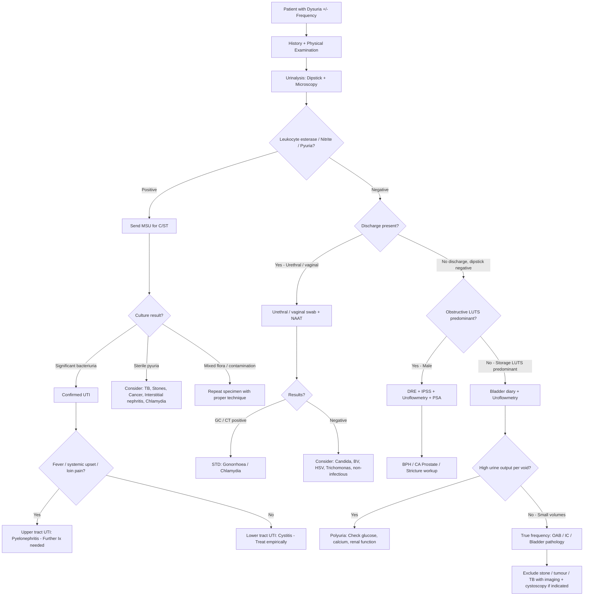

## Diagnostic Criteria

### How is UTI Diagnosed? — First Principles

UTI is fundamentally a **clinical diagnosis supported by laboratory confirmation**. There is no single pathognomonic test. The diagnosis requires the combination of [4][9]:

1. **Clinical symptoms and signs** (dysuria, frequency, urgency, suprapubic pain, ± systemic upset)
2. **Urinalysis** (gross inspection, dipstick, microscopy)
3. **Urine culture and sensitivity (C/ST)** — the definitive confirmatory test

The reason you need all three is that each component alone has limitations:
- Symptoms alone → other conditions mimic UTI (vaginitis, urethritis, interstitial cystitis)
- Positive dipstick alone → can be contamination or asymptomatic bacteriuria
- Positive culture alone → asymptomatic bacteriuria (not UTI unless symptomatic)

### Diagnostic Criteria for Significant Bacteriuria

The threshold for "significant bacteriuria" depends on the **method of urine collection** and the **clinical context** — this is because different collection methods have different contamination risks [3][4]:

| Collection Method | Threshold for Significant Bacteriuria | Rationale |
|---|---|---|
| **Midstream urine (MSU)** — Female | ≥ 10⁵ CFU/mL (≥ 100,000) of a single organism | Higher threshold needed because MSU in females is prone to contamination from vaginal/perineal flora |
| **MSU** — Male | ≥ 10³ CFU/mL (≥ 1,000) | Lower threshold because contamination is less common in males; UTI in males is unusual and warrants attention [4] |
| **Catheter specimen** | ≥ 10² CFU/mL (≥ 100) | Direct bladder sampling reduces contamination risk |
| **Suprapubic aspiration (SPA)** | **Any growth** (even 1 CFU/mL) | SPA bypasses all potential contamination sources — any bacteria found must have come from the bladder [3] |

<Callout title="Why Different Thresholds?" type="idea">
The concept of "significant bacteriuria" was established by Kass in the 1950s. The ≥10⁵ threshold for MSU in women was chosen because it best discriminated true bladder infection from perineal contamination (sensitivity ~95%, specificity ~95% for a single specimen). However, in symptomatic women, as few as 10² CFU/mL may represent true infection — the EAU and IDSA guidelines accept ≥10³ CFU/mL in symptomatic acute uncomplicated cystitis. The key message: **always interpret culture results in the clinical context**.
</Callout>

### Diagnostic Criteria for Pyuria

- **Pyuria** = > 5 WBC per high-power field (HPF) on centrifuged urine microscopy, OR > 10 WBC/mm³ on uncentrifuged urine [4][9]
- Pyuria is present in virtually all symptomatic UTI — **absence of pyuria strongly argues against UTI**
- However, pyuria does NOT equate infection — other causes include stones, cancer, TB, interstitial nephritis, and any urinary tract inflammation [4]

### Diagnostic Criteria for Urethritis [6]

- **Urethral swab Gram stain**: urethritis diagnosed when **≥ 5 PMN per HPF** (examine 5 fields of most PMN under HPF, average the count) [6]
  - ± **Intracellular Gram-negative diplococci** = diagnostic of **gonorrhoea** [6]
- **First-catch urine microscopy**: urethritis diagnosed if **centrifuged sediment > 10 WBC per HPF** [6]
- NAAT for Chlamydia trachomatis and Neisseria gonorrhoeae on first-catch urine or urethral swab is the confirmatory test

### Diagnostic Criteria for OAB / Irritative LUTS [5][2]

Overactive bladder (OAB) is a **clinical diagnosis** made after excluding infection, stones, and tumour [5]:
- **Bladder diary**: frequent voiding of small volumes (typically > 8 voids/day, each < 200 mL)
- Normal prostate on DRE
- Good flow rate on uroflowmetry (excludes BOO as the cause)
- Exclude infection (negative urine C/ST), stone, and tumour

### Diagnostic Criteria for BPH (Clinical + Investigational) [5][2][3]

BPH is diagnosed by a combination of:
- **Clinical**: LUTS (obstructive > > irritative) in a male ***aged 50–80*** [5]
- **DRE**: ***smooth, enlarged > 3 finger-breadths, non-tender, median sulcus present, anal tone intact*** [5]
- ***IPSS***: quantifies severity — ***mild (1–7), moderate (8–19), severe (20–35)*** [2][3]
- ***Uroflowmetry***: ***peak flow rate (Qmax) < 15 mL/sec*** is diagnostic of obstruction; ***< 10 mL/sec*** is prognostic (better outcome after TURP) [5]
- Post-void residual volume: < 150 mL [5]

---

## Diagnostic Algorithm

### Step-by-Step Approach to a Patient with Dysuria ± Frequency

### When to Send Which Investigation — A Practical Framework

| Clinical Scenario | Investigations Needed | Why |
|---|---|---|
| **Uncomplicated cystitis in young woman** | Dipstick ± microscopy; C/ST **optional** (empirical Rx acceptable) | Predictable microbiology (E. coli 75%); short-course antibiotics highly effective; culture reserved for treatment failure or recurrence [4] |
| **Complicated UTI / Male UTI** | Dipstick + microscopy + **C/ST mandatory** | Broader spectrum of organisms, ↑resistance risk; need sensitivity data to guide therapy [4] |
| **Recurrent UTI** | C/ST + imaging (USG ± CT) ± cystoscopy | Must r/o focus of bacterial persistence (stone, diverticulum), obstruction, or anatomical abnormality [4][5] |
| **Suspected STD** | ***Urethral swabs or first-pass urine for STIs*** [1]; NAAT for GC + CT | Urine C/ST will be negative; need specific STD testing |
| **Male with LUTS** | IPSS + voiding diary + DRE + urinalysis + C/ST + uroflowmetry + RFT + PSA | Comprehensive evaluation because LUTS ≠ BPH; must exclude cancer, infection, neurogenic causes [2] |
| **Sterile pyuria** | ***EMU × AFB*** (3 early morning urines for mycobacterial culture), urine cytology, cystoscopy | Must r/o TB (especially in Hong Kong), cancer, interstitial nephritis [9] |
| **Suspected pyelonephritis** | Bloods (CBC, RFT, CRP/ESR, blood cultures), urine C/ST, imaging (USG ± CT) | Assess systemic severity; r/o obstruction (pyonephrosis) which requires urgent drainage |

---

## Investigation Modalities — Detailed

### 1. Urine Dipstick

***Key investigations: dipstick testing of the urine*** [1]

| Parameter | What it Detects | Interpretation | Mechanism of Test |
|---|---|---|---|
| **Leukocyte esterase** | WBCs (pyuria) | Sensitivity ~75–96%, Specificity ~94–98% for UTI | Enzyme released from lysed neutrophils → reacts with substrate on dipstick → colour change |
| **Nitrite** | Gram-negative bacteria (especially Enterobacteriaceae) | Sensitivity ~22–44% (many false negatives!), Specificity ~92–100% | Bacteria reduce dietary nitrate to nitrite; requires ≥4 hours urine dwell time in bladder for conversion; **NOT all organisms produce nitrite** — Enterococcus, S. saprophyticus, and many others do NOT |
| **Blood (haemoglobin)** | RBCs, free haemoglobin, myoglobin | Present in UTI, stones, cancer, glomerular disease | Peroxidase activity of haemoglobin catalyses oxidation of chromogen |
| **Protein** | Albuminuria | If significant → think glomerular disease, not simple UTI | Tetrabromophenol blue indicator |
| **Glucose** | Glucosuria | Suggests diabetes (osmotic diuresis → frequency) | Glucose oxidase reaction |
| **pH** | Urine acidity/alkalinity | Alkaline urine with UTI → think Proteus (urease-producing organism); acidic urine → chemical irritation as cause of dysuria | pH indicator |

<Callout title="Dipstick Pearl" type="error">
A **negative nitrite does NOT exclude UTI**. Nitrite is only produced by Gram-negative bacteria that possess nitrate reductase (e.g. E. coli, Klebsiella, Proteus). Enterococcus, S. saprophyticus, Candida, and Pseudomonas do NOT produce nitrite. Also, if the patient is voiding frequently (urine doesn't dwell ≥4 hours), there is insufficient time for nitrate-to-nitrite conversion → false negative. The most useful dipstick parameter is **leukocyte esterase** — if both LE and nitrite are negative, the negative predictive value for UTI is very high ( > 95%).
</Callout>

### 2. Urine Microscopy

***Key investigations: microscopy or culture (midstream specimen of urine or suprapubic puncture in children)*** [1]

| Finding | Significance | Threshold |
|---|---|---|
| **WBC (pyuria)** | Inflammation/infection of urinary tract | **> 5 WBC/HPF** on centrifuged specimen, or > 10 WBC/mm³ on uncentrifuged [4][9] |
| **RBC** | Haematuria — UTI, stone, cancer, glomerular disease | ≥ 3 RBC/HPF in 2 of 3 properly collected specimens = microscopic haematuria [5] |
| **RBC morphology** | **Dysmorphic RBCs / RBC casts** → glomerular origin; **Isomorphic RBCs** → urological origin (post-renal) | Key discriminator — glomerular bleeding produces deformed RBCs as they pass through damaged GBM [9] |
| **Bacteria** | Bacteriuria — but may be contamination | Should prompt culture |
| **Epithelial cells** | > 5 squamous epithelial cells/HPF → likely contamination | Specimen should be repeated with proper technique |
| **Casts** | WBC casts → pyelonephritis or interstitial nephritis (localises inflammation to renal tubules); RBC casts → glomerulonephritis | Casts form in renal tubules — their presence localises the pathology to the kidney |
| **Crystals** | Calcium oxalate (envelope-shaped), uric acid (rhomboid/rosette), struvite (coffin-lid), cystine (hexagonal) | May suggest underlying stone disease |

### 3. Urine Culture and Sensitivity (C/ST)

This is the **gold-standard confirmatory test** for UTI [3][4].

**Interpretation:**
- **Single organism** at significant colony count (see thresholds above) = significant bacteriuria
- **Mixed flora** (≥ 3 organisms) = contamination → repeat specimen
- **No growth** with pyuria = **sterile pyuria** → consider TB, Chlamydia, stones, cancer, interstitial nephritis, or recent antibiotic use [4][9]

**Sensitivity testing** guides antibiotic choice, critical in:
- Complicated UTI
- Treatment failure
- Recurrent UTI
- Hospital-acquired UTI (↑resistance rates)

### 4. Urine Collection Methods [3]

This is a high-yield topic — **the method of collection determines the validity of the culture result**.

| Method | Technique | Use | Advantages | Disadvantages |
|---|---|---|---|---|
| ***Bag urine*** | Adhesive bag applied to perineum | ***Send for urinalysis ONLY*** (visual + chemical + microscopic) | Non-invasive | ***Do NOT send for culture — prone to contamination*** [3] |
| ***Midstream urine (MSU)*** | Discard initial stream, collect midstream | ***Commonest method; can send for urinalysis AND culture*** | Non-invasive | ***Prone to contamination, especially in females; NOT applicable in young children*** [3] |
| ***Clean-catch urine*** | Voided urine caught mid-void without interruption | Urinalysis and culture | Less contamination than bag | Still some contamination risk |
| ***Urethral catheterisation*** | Sterile catheter passed into bladder | Urinalysis and culture | ↓Contamination | ***NOT indicated unless patient unable to void; risk of iatrogenic UTI*** [3] |
| ***Suprapubic aspiration (SPA)*** | Needle aspiration directly from bladder through abdominal wall | Urinalysis and culture | ***Most accurate method — any growth is significant*** | Invasive; ***requires distended bladder; indicated in paediatric patients and SCI with paraplegia*** [3] |

<Callout title="Paediatric Urine Collection" type="error">
In children [3]:
- **Screening**: bag urine for urinalysis ONLY (never send bag for culture!)
- **Confirmatory** (if screening positive):
  - ***< 12 months***: SPA, clean-catch, or catheterised urine
  - ***> 12 months***: MSU, clean-catch, or catheterised urine
This is a commonly tested point. The reason bag urine cannot be cultured is that the bag sits against the perineum for a prolonged period, allowing perineal flora to contaminate the sample → unacceptably high false positive rate for culture.
</Callout>

### 5. STD-Specific Investigations [1][6]

***Key investigations: urethral swabs or first pass urine for STIs*** [1]

| Test | Specimen | What it Detects | Key Points |
|---|---|---|---|
| **Urethral swab — Gram stain** | Urethral swab (repeat early morning if negative) [6] | PMN count (≥ 5/HPF = urethritis); intracellular G− diplococci (= gonorrhoea) [6] | Rapid, bedside; if negative, repeat with early morning swab (before first void) [6] |
| **GC culture** | Urethral swab | Neisseria gonorrhoeae; also gives sensitivity data | ***Special transport medium and culture medium required*** (chocolate agar, Thayer-Martin medium, CO₂ incubation) [6] |
| **NAAT** | ***First-catch urine (first 20–30 mL of initial stream)*** or urethral swab [6] | Chlamydia trachomatis + Neisseria gonorrhoeae | Gold-standard for Chlamydia detection; highly sensitive and specific; preferred non-invasive test |
| **High vaginal swab (HVS)** | Vaginal swab | Candida, Trichomonas, BV (clue cells, whiff test) | For external dysuria with vaginal discharge |

### 6. Blood Tests

| Test | Purpose | Expected Findings |
|---|---|---|
| **CBC** | Infection, anaemia | **Leukocytosis** with neutrophilia in UTI/pyelonephritis [9]; anaemia if chronic disease |
| **RFT** | Renal impairment from obstructive uropathy or intrinsic renal disease | ***High serum creatinine can result from bladder outlet obstruction or underlying renal disease — should prompt USG*** [3] |
| **CRP / ESR** | Inflammatory markers | ↑ in pyelonephritis, prostatitis, epididymitis; helps differentiate upper from lower tract UTI |
| **Blood cultures** | Bacteraemia/urosepsis | Indicated in febrile UTI, pyelonephritis, suspected urosepsis |
| **Fasting glucose** | Screen for diabetes | ***DM is a risk factor for UTI*** [2] — glucosuria provides bacterial growth medium |
| ***PSA*** | Prostate cancer screening / BPH assessment | ***Prostate-specific but NOT prostate-cancer specific*** [3]; ***PSA > 1.5 ng/mL is a useful marker for prostatic enlargement*** [3]; ***PSA ≥ 4 ng/mL = cutoff for diagnostic biopsy; PSA 4–10 = 20% chance of cancer; PSA ≥ 10 = 50% chance of cancer*** [3] |

<Callout title="Factors Affecting PSA" type="idea">
PSA is organ-specific (made by prostate) but NOT tumour-specific [5]:
- ***↑PSA: CA prostate, BPH, AROU, UTI, vigorous cycling, recent ejaculation < 48h, DRE*** [5]
- ***↓PSA: castration, 5α-reductase inhibitors*** [5]
- ***Do NOT screen if patients have < 10 years of life expectancy*** [3]
- ***EAU recommends: measure PSA if diagnosis of CA prostate will change management*** [2]

Always interpret PSA in context. A mildly elevated PSA in a man with acute UTI should be repeated after treatment — the UTI itself elevates PSA.
</Callout>

### 7. Symptom Scoring — IPSS

***International Prostate Symptom Score (IPSS)***: a standardised, validated questionnaire [2][3][5]

- **Purpose**: ***quantify severity of LUTS, predict treatment response, guide treatment decision, and monitor response to treatment*** [2]
- **Important**: ***NOT a diagnostic tool*** [2] — it quantifies symptoms but does not tell you the cause
- **Components** [2]:
  - ***Voiding symptoms***: incomplete emptying, intermittency, weak stream, straining
  - ***Storage symptoms***: frequency, urgency, nocturia
  - ***Quality of life measure***
- **Interpretation**: ***mild (1–7), moderate (8–19), severe (20–35)*** [2]

### 8. Voiding Diary / Frequency-Volume Chart

***Voiding diary for at least 3 days***, especially if frequency/nocturia is prominent [5][2]

- **Records**: time and volume of each void, fluid intake, episodes of urgency/incontinence
- **Purpose**: differentiates:
  - **Polyuria** (high volume per void → look for DM, DI, polydipsia)
  - **True frequency** (low volume per void → detrusor hypersensitivity, reduced capacity)
  - **Nocturnal polyuria** (> 33% of 24h urine output at night in elderly)

### 9. Uroflowmetry [2][5]

***Uroflowmetry***: ***screening test for BOO (does not rule out detrusor underactivity!)*** [2]

- **How it works**: patient voids into a special toilet with a flow-rate sensor → generates a flow-rate curve
- **Key parameters** [5]:
  - ***Volume voided must be > 150 mL*** to be representative of usual voiding habit
  - ***Peak urine flow rate (Qmax)***:
    - Normal: > 15 mL/sec
    - ***< 15 mL/sec***: diagnostic of obstruction
    - ***< 10 mL/sec***: prognostic — better outcome after TURP [5]
  - ***Abnormal strain pattern (multiple peaks)***: suggests the patient is straining to void rather than having smooth detrusor contraction [5]
  - ***Post-void residual volume***: < 150 mL is acceptable [5]

**Normal flow curve**: bell-shaped, single smooth peak
**Obstructive flow curve**: flattened, low Qmax, prolonged voiding time
**Strain pattern**: multiple irregular peaks (patient using abdominal muscles)

### 10. Urodynamic Studies [2]

***Urodynamics: gold-standard for diagnosis of BOO*** [2]

- **When indicated**: when clinical history and uroflowmetry are equivocal; before invasive treatment (e.g. TURP); to differentiate BOO from detrusor underactivity
- **What it measures**:
  - **Filling cystometry**: bladder sensation, compliance, detrusor overactivity
  - **Pressure-flow study**: simultaneous measurement of detrusor pressure (Pdet) and urinary flow rate
    - ***BOO defined by: high Pdet + low flow rate*** [2]
    - ***Detrusor underactivity: low Pdet + low flow rate***
  - **Leak point pressure**: for incontinence evaluation

### 11. Imaging

| Modality | Indication | Key Findings |
|---|---|---|
| **USG KUB** | First-line in complicated UTI, LUTS, recurrent UTI | Hydronephrosis/hydroureter (obstruction), bladder wall thickening (chronic cystitis/BOO), post-void residual volume, prostate size estimation, renal/bladder stones, renal abscess |
| ***Non-contrast CT KUB*** | ***Gold-standard for urolithiasis*** [5]; suspected renal abscess, obstructive uropathy | ***Detect urinary stone, urinary tract obstruction (dilated system, perinephric stranding), stone density ( > 1000 HU = hard)*** [5] |
| **CT A+P with contrast** | Suspected tumour, complicated pyelonephritis, abscess | Renal/bladder mass, perinephric abscess, ureteric pathology |
| ***TRUS (transrectal ultrasound)*** | ***Assess prostate size (for 5ARI use, surgery planning)*** [5] | Prostate volume measurement; guide prostate biopsy |
| **MCUG** (micturating cystourethrogram) | Suspected VUR (especially paediatric) | Grading of VUR (I–V) |
| **KUB X-ray** | Screening for radio-opaque stones | May miss radiolucent stones (uric acid) and hydronephrosis [5] |

### 12. Cystoscopy [5][9]

- **Indication**: persistent haematuria (to r/o bladder cancer), recurrent UTI (to r/o structural abnormality), suspected interstitial cystitis, suspected bladder tumour
- **Types**:
  - ***Flexible cystoscopy***: performed under **local anaesthesia** — first-line for diagnostic evaluation [5]
  - ***Rigid cystoscopy***: for persistent haematuria (allows washout), therapeutic procedures (biopsy, resection) [5]
- **Findings in bladder cancer**: papillary tumour, flat CIS (erythematous velvety patch), mass
- **Findings in interstitial cystitis**: Hunner's ulcers, glomerulations (petechial haemorrhages on hydrodistension)

### 13. Urine Cytology [9]

- ***Fresh urine required; overall sensitivity = 50%, highest for CA bladder*** [9]
- ***Can detect high-grade transitional cell carcinoma before gross lesion becomes noticeable (i.e. carcinoma-in-situ of bladder)*** [9]
- ***Low detection rate for low-grade cancer*** [9]
- ***Findings: normal, atypical, suspicious, malignant*** [9]
- **Precautions**: as much volume as possible, sent fresh (cells degrade); ***avoid first early morning urine (↑↑epithelial cells) — usually send 2nd void in the morning on 3 consecutive days*** [9]

### 14. Special Tests for Genitourinary TB [10]

In the context of **sterile pyuria** with frequency/dysuria/haematuria not responding to antibiotics, always consider TB (especially in Hong Kong):
- ***EMU (early morning urine) × AFB***: 3 consecutive early morning specimens for acid-fast bacillus smear and mycobacterial culture [9][10]
  - ***Culture sensitivity 10–90%, specificity 100%*** [10]
- **TB-PCR on urine**: ***sensitivity 87–100%, specificity 93–98%*** [10] — rapid result
- **Imaging**: asymmetric caliectasis, calcification, hydronephrosis (from downstream strictures), small fibrotic bladder [10]

---

### Screening vs Confirmatory Approach (Paediatric Context) [3]

| Step | Test | Specimen | Action |
|---|---|---|---|
| **Screening** | Microscopy for pyuria/bacteriuria + Dipstick (LE, nitrite) | ***Bag urine*** | ***ANY positive result → proceed to confirmatory test*** [3] |
| **Confirmatory** | Microscopy + LE + Nitrite + ***C/ST*** | ***< 12 mo: SPA / clean-catch / catheterised; > 12 mo: MSU / clean-catch / catheterised*** [3] | Significant bacteriuria on culture → confirmed UTI |

---

<Callout title="High Yield Summary">

**UTI Diagnosis = Clinical symptoms + Urinalysis (dipstick/microscopy) + Urine C/ST**

**Dipstick**: LE (best single parameter), nitrite (specific but insensitive — negative does NOT exclude UTI), blood, pH

**Microscopy**: pyuria ( > 5 WBC/HPF), bacteriuria, RBC morphology (dysmorphic = glomerular), casts (WBC cast = pyelonephritis), crystals

**Culture thresholds**: MSU female ≥ 10⁵ (but ≥ 10³ acceptable in symptomatic cystitis); MSU male ≥ 10³; catheter ≥ 10²; SPA = any growth

**IPSS**: quantifies LUTS severity (mild 1–7, moderate 8–19, severe 20–35) — NOT a diagnostic tool

**Uroflowmetry**: Qmax < 15 = obstruction, < 10 = surgical benefit; must void > 150 mL; does not r/o detrusor underactivity

**Urodynamics**: gold-standard for BOO (high Pdet + low flow)

**Sterile pyuria**: TB (send 3 EMU for AFB), stones, cancer, Chlamydia, interstitial nephritis

**Urine cytology**: sensitivity 50%, best for high-grade bladder cancer/CIS; send 2nd morning void on 3 consecutive days

**PSA**: prostate-specific not cancer-specific; ≥ 4 = biopsy cutoff; affected by UTI, BPH, recent ejaculation, cycling

**Paediatric**: bag urine for screening ONLY (never culture); SPA is most accurate method; any growth on SPA = significant

</Callout>

---

<ActiveRecallQuiz
  title="Active Recall - Diagnosis of Dysuria and Frequency"
  items={[
    {
      question: "What are the thresholds for significant bacteriuria on urine culture for: MSU in female, MSU in male, catheter specimen, and suprapubic aspiration?",
      markscheme: "MSU female: >= 10^5 CFU/mL (10^3 acceptable in symptomatic cystitis). MSU male: >= 10^3 CFU/mL. Catheter specimen: >= 10^2 CFU/mL. SPA: any growth is significant. Rationale: increasing invasiveness = decreasing contamination risk = lower threshold needed."
    },
    {
      question: "A urine dipstick is negative for nitrite but positive for leukocyte esterase. Can you exclude UTI based on the negative nitrite? Explain why.",
      markscheme: "No, you cannot exclude UTI. Nitrite is only produced by Gram-negative bacteria with nitrate reductase (e.g. E. coli, Klebsiella, Proteus). Enterococcus, S. saprophyticus, Pseudomonas, Candida do NOT produce nitrite. Also requires >= 4 hours urine dwell time for conversion. A negative nitrite with positive LE still warrants culture."
    },
    {
      question: "What is the IPSS, what does it measure, and what are the severity score ranges? Is it a diagnostic tool?",
      markscheme: "International Prostate Symptom Score. Measures voiding symptoms (incomplete emptying, intermittency, weak stream, straining), storage symptoms (frequency, urgency, nocturia), and quality of life. Mild: 1-7, Moderate: 8-19, Severe: 20-35. It is NOT a diagnostic tool - it quantifies severity, predicts treatment response, guides treatment decisions, and monitors response."
    },
    {
      question: "A patient with persistent sterile pyuria, frequency, and haematuria does not respond to standard antibiotics. What 3 investigations should you order, and what is the most important diagnosis to exclude in Hong Kong?",
      markscheme: "1. Three early morning urine specimens for AFB smear and mycobacterial culture (or TB-PCR). 2. Urine cytology x3 (2nd morning void on consecutive days). 3. Cystoscopy. Most important diagnosis to exclude: genitourinary tuberculosis (Hong Kong is endemic). Sterile pyuria is the hallmark of renal/urological TB."
    },
    {
      question: "On uroflowmetry, what does a Qmax of 8 mL/sec with multiple peaks suggest? What minimum voided volume is needed for a valid result?",
      markscheme: "Qmax < 10 mL/sec suggests significant obstruction (prognostic: better outcome after TURP). Multiple peaks indicate an abnormal strain pattern where the patient is using abdominal muscles to void rather than smooth detrusor contraction. Minimum voided volume must be > 150 mL to be representative of usual voiding habit."
    },
    {
      question: "Why should you never send a bag urine specimen for culture in a paediatric patient?",
      markscheme: "Bag urine sits against the perineum for a prolonged period, allowing perineal and periurethral flora to contaminate the sample. This gives an unacceptably high false positive rate for culture. Bag urine should be sent for urinalysis (dipstick/microscopy) ONLY. If screening is positive, confirmatory culture should be obtained by SPA, clean-catch, or catheterised specimen."
    }
  ]}
/>

---

## References

[1] Lecture slides: murtagh merge.pdf (p40–42, Dysuria)
[2] Senior notes: Ryan Ho Fundamentals.pdf (p354–355, LUTS approach and evaluation)
[3] Senior notes: felixlai.md (UTI diagnostic approach, urine collection methods, BPH diagnosis, PSA)
[4] Senior notes: Ryan Ho Urogenital.pdf (p122–126, UTI diagnostic evaluation, collection methods, classification)
[5] Senior notes: maxim.md (BPH investigations, uroflowmetry, urolithiasis investigations, PSA)
[6] Senior notes: Ryan Ho Urogenital.pdf (p248, Urethritis investigations)
[9] Senior notes: Ryan Ho Urogenital.pdf (p133, Investigations for haematuria; p153, Bladder cancer investigations) and Ryan Ho Fundamentals.pdf (p343, Investigations)
[10] Senior notes: Ryan Ho Respiratory.pdf (p78, Genitourinary TB)
