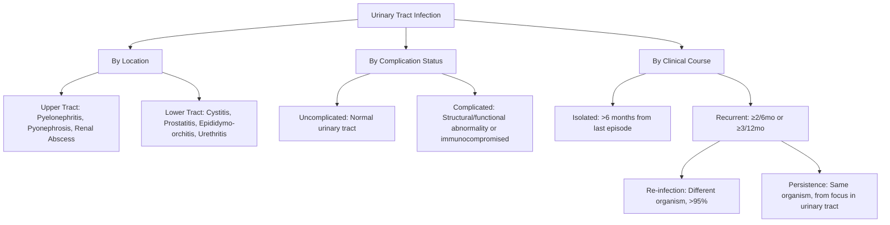

## Definition

**Dysuria** literally means "dys-" (difficult/painful, from Greek) + "-uria" (urination). Clinically, it refers to **painful urination, usually described as burning, scalding, or stinging** [1][2]. It is **often associated with suprapubic pain** and **often associated with other lower urinary tract symptoms (LUTS), e.g. frequency, urgency, incomplete emptying** [2].

**Urinary frequency** means the patient's perception that they are voiding too often during the day (typically > 7 voids/day). It is a **storage (irritative) symptom** and may or may not coexist with dysuria [2][3].

These two symptoms together form one of the most common presenting complaints in primary care and emergency medicine, and their combined presence strongly suggests a **lower urinary tract** process — most commonly **urinary tract infection (UTI)**, but the differential is broader than that [1][2].

<Callout title="Key Conceptual Point">
Dysuria indicates ongoing **infection or inflammation** of the lower urinary tract and is **NOT grouped under obstructive or irritative LUTS headings** — it is a separate, distinct symptom [2]. Meanwhile, urinary frequency IS a storage (irritative) LUTS. Their coexistence narrows the differential to conditions that both irritate the bladder/urethral mucosa AND increase the urge to void.
</Callout>

---

## Epidemiology

### General Epidemiology
- **UTI** (the most common cause of dysuria and frequency) is **one of the commonest bacterial infections**, accounting for **1–3% of GP consultations** [4].
- **30% of women** will have a symptomatic UTI **by age 24**; **50% of women** will have at least one UTI during their lifetime [4].
- **Females >>> Males** — this ratio is approximately 30:1 for bacteriuria in young adults. UTI is rare in males except at the extremes of age: **0–1 years** (boys with urinary tract anomalies) or **> 60 years** (men with BPH causing stasis) [4].
- Incidence **increases with age** — in women, there is a **sharp increase after onset of sexual activity** (hence the classic term ***"honeymoon cystitis"***) [4].
- In Hong Kong specifically, UTI is an extremely common emergency department and outpatient presentation. Antibiotic resistance patterns (especially fluoroquinolone-resistant E. coli) are a significant local concern, with Hong Kong reporting E. coli fluoroquinolone resistance rates exceeding 30% in community-acquired UTI.

### Demographics by Sex

| Feature | Female | Male |
|---|---|---|
| Lifetime UTI risk | ~50% | Much lower (~5%) |
| Peak incidence | Onset of sexual activity, pregnancy, postmenopause | Extremes of age (infancy, > 60y) |
| Common cause of dysuria | UTI, vaginitis, urethral syndrome | UTI, prostatitis, urethritis |
| Anatomical predisposition | Short urethra (~4 cm), close to anus | Longer urethra (~20 cm), prostate acts as barrier (but also source of pathology) |

---

## Risk Factors

### Risk Factors for UTI (the Most Common Cause)

Understanding risk factors requires understanding the **pathogenesis of ascending infection**: bacteria must colonize the periurethral area → ascend the urethra → adhere to bladder urothelium → overcome host defenses. Anything that facilitates any of these steps is a risk factor.

#### Female Sex [3][4]
- **Shorter urethral length** (~4 cm in females vs ~20 cm in males) → shorter distance for bacteria to travel from perineum to bladder.
- **Proximity of urethral meatus to anus** → easier fecal-to-urethral bacterial transfer.

#### Sexual Activity [3][4]
- Mechanical introduction of periurethral bacteria into the bladder during intercourse ("***honeymoon cystitis***" [4]).
- **New sexual partners** → altered vaginal flora.
- ***Use of spermicides and diaphragm*** → spermicides disrupt the normal Lactobacillus-dominant vaginal flora (by killing Lactobacilli, raising vaginal pH, and facilitating E. coli colonization) [4].

#### ***Lack of Circumcision*** [3]
- The **mucosal surface of uncircumcised foreskin** is more likely to bind uropathogenic bacterial species than keratinized skin on a circumcised penis.
- **Partial obstruction** of the urethral meatus by a tight foreskin.

#### Vesicoureteral Reflux (VUR) [3]
- **Retrograde passage of urine from bladder into upper urinary tract** → allows bacteria to ascend to the kidneys.
- Important risk factor for **renal scarring**, especially in children.

#### Urinary Obstruction [3][4]
- **Stagnancy of urine** → bacteria have more time to multiply and adhere.
  - Anatomical: BPH, urethral strictures, posterior urethral valves, ureteropelvic junction obstruction
  - Neurological: neurogenic bladder (e.g. myelomeningocele, spinal cord injury, DM neuropathy)
  - Functional: bladder and bowel dysfunction

#### Urinary Instrumentation [3][4]
- **Bladder catheterization** → direct introduction of bacteria, disruption of mucosal barrier.
- Risk of catheter-associated UTI (CAUTI) increases approximately 3–7% per day of catheterization.

#### Hormonal Factors [3][4]
- **Oestrogen deficiency** (postmenopausal): loss of oestrogen → loss of Lactobacilli → ↑vaginal pH → ↑colonization by uropathogens.
- This is why **topical oestrogen reduces recurrent UTI by ~75% in RCTs** [4].

#### Other Risk Factors
- **Recurrent antimicrobial use** → alteration of normal vaginal flora [3].
- **Diabetes mellitus** → glucosuria provides a rich bacterial growth medium; autonomic neuropathy can impair bladder emptying [5].
- **Pregnancy** → progesterone-mediated ureteral smooth muscle relaxation → ureteral dilatation and stasis; mechanical compression by the gravid uterus.
- **Immunosuppression** → reduced immune clearance.

#### Risk Factors for Recurrent UTI (≥2 per 6 months or ≥3 per 12 months) [3][4]

| Pre-menopausal | Post-menopausal |
|---|---|
| ↑Frequency of sexual intercourse | Oestrogen deficiency |
| New sexual partners | Urinary incontinence |
| Spermicide/diaphragm use | Post-voiding residual urine |
| ↓Urethra-to-anus distance | Presence of cystocele |
| Genetic susceptibility (↑vaginal cell bacterial adherence) | History of UTI before menopause |
| Prior antibiotic use (alters vaginal flora) | Genetic susceptibility |
| ↓Age of first UTI | |
| Family history | |

<Callout title="Why Genetics Matter in Recurrent UTI" type="idea">
The **intrinsic susceptibility of vaginal epithelial cells to bacterial adherence is genetically determined** [4]. Some women express more receptors (e.g. P blood group antigens, Lewis non-secretor phenotype) that allow E. coli to bind more easily. This explains why some women get recurrent UTIs despite perfect hygiene and behaviour — it is fundamentally a host factor, not a hygiene issue.
</Callout>

---

## Anatomy and Function of the Lower Urinary Tract

Understanding dysuria and frequency requires understanding the normal anatomy and physiology of micturition.

### Relevant Anatomy

**Bladder:**
- Hollow muscular organ in the pelvis, lined by **transitional epithelium (urothelium)**.
- Wall composed of the **detrusor muscle** (3 layers of smooth muscle — inner longitudinal, middle circular, outer longitudinal).
- Capacity ~400–600 mL.
- The **trigone** (triangular area between the two ureteral orifices and the internal urethral orifice) is particularly sensitive to inflammation — this is why cystitis causes suprapubic pain and urgency.

**Urethra:**
- **Female**: ~4 cm, straight, opens anterior to the vaginal introitus, close to the anus.
- **Male**: ~20 cm, divided into prostatic, membranous, bulbar, and penile segments. The **prostate** surrounds the prostatic urethra.

**Prostate (Male):**
- Walnut-sized gland surrounding the prostatic urethra, just below the bladder neck.
- Contains the **transitional zone** (where BPH arises) and **peripheral zone** (where prostate cancer arises).
- Enlargement of the transitional zone compresses the urethra → obstructive LUTS.

**Sphincters:**
- **Internal urethral sphincter** (smooth muscle, involuntary, sympathetic α₁-adrenergic control) at the bladder neck.
- **External urethral sphincter** (striated muscle, voluntary, somatic pudendal nerve S2–S4 control) at the membranous urethra.

### Physiology of Micturition (The Micturition Reflex)

Normal voiding involves a coordinated interplay between the **pontine micturition centre (PMC)**, the **sacral micturition centre (S2–S4)**, and the **cortex**:

1. **Storage phase** (sympathetic dominance):
   - Sympathetic (T10–L2, hypogastric nerve):
     - β₃-adrenergic receptors on detrusor → **detrusor relaxation** (bladder fills)
     - α₁-adrenergic receptors on internal sphincter → **sphincter contraction** (continence)
   - Somatic (S2–S4, pudendal nerve): tonic contraction of external sphincter
   - Parasympathetic activity suppressed

2. **Voiding phase** (parasympathetic dominance):
   - When bladder volume reaches ~200–300 mL, stretch receptors fire → signals via pelvic nerve to sacral cord → ascending signals to PMC → PMC activates voiding:
     - Parasympathetic (S2–S4, pelvic nerve): muscarinic M₃ receptors on detrusor → **detrusor contraction**
     - Sympathetic inhibited → internal sphincter relaxes
     - Somatic pudendal nerve inhibited → external sphincter relaxes
     - Coordinated: detrusor contracts while sphincters relax → urine expelled

> **Why does this matter clinically?**
> - Drugs that block **M₃ receptors** (anticholinergics like oxybutynin) → reduce detrusor overactivity → treat urgency/frequency.
> - Drugs that block **α₁ receptors** (like tamsulosin) → relax internal sphincter and prostatic smooth muscle → relieve obstruction in BPH.
> - Drugs that stimulate **β₃ receptors** (like mirabegron) → relax detrusor → treat overactive bladder.

### Why Inflammation Causes Dysuria and Frequency

When the bladder mucosa (urothelium) or urethral mucosa is inflamed (by infection, chemical irritation, or mechanical injury):
- **Dysuria**: inflammatory mediators (prostaglandins, bradykinin, histamine) activate **nociceptors** in the urothelium and submucosal nerve endings → pain signals via pelvic nerve (Aδ and C fibres) to the sacral cord → perceived as burning/stinging during micturition, when the inflamed mucosa is stretched and contacted by urine.
- **Frequency**: inflammation lowers the **sensory threshold** for detrusor afferents → the brain receives "bladder full" signals at much lower volumes → patient voids small volumes frequently. Inflammatory mediators also stimulate local release of ATP and acetylcholine from the urothelium → premature detrusor contractions (detrusor overactivity) → urgency and frequency.

---

## Etiology (Focus on Hong Kong)

### Overview: The Differential Diagnosis of Dysuria

***The probability diagnosis for dysuria is UTI (especially cystitis), urethritis, urethral syndrome (abacterial cystitis in females), and vaginitis.*** [1]

The causes differ between sexes [1][2]:

| ***Female*** | ***Male*** |
|---|---|
| ***UTI (esp. cystitis)*** | ***UTI*** |
| ***Sexually transmitted diseases: vaginitis, urethritis*** | ***Urethritis: due to STD*** |
| ***Pelvic inflammatory disease*** | ***Acute/chronic prostatitis*** |
| ***Interstitial cystitis (painful bladder syndrome)*** | ***Bladder stones*** |
| ***Bladder stones*** | ***Epididymitis*** |

### Serious Disorders Not to Be Missed [1]

***Neoplasia:***
- ***Bladder cancer***
- ***Prostate cancer***
- ***Urethral cancer***

***Infection:***
- ***Gonorrhoea***
- ***Chlamydia/others***
- ***Genital herpes***
- ***Prostatitis***

***Other:***
- ***Reactive arthritis*** (formerly Reiter's syndrome — the classic triad of urethritis + conjunctivitis + arthritis, often following urogenital Chlamydia or enteric infection)
- ***Calculi (e.g. bladder)***

### Pitfalls (Often Missed) [1]

- ***Menopause syndrome*** — atrophic urethritis/vaginitis from oestrogen deficiency
- ***Adenovirus urethritis***
- ***Prostatitis*** (especially chronic prostatitis, which can be very subtle)
- ***Foreign bodies in lower urinary tract***
- ***Acidic urine*** (dietary causes — high-dose vitamin C, cranberry juice)
- ***Acute fever*** (can cause dysuria without UTI)
- ***Interstitial cystitis*** [1]
- ***Urethral caruncle/diverticuli*** [1]
- ***Vaginal prolapse*** [1]

***Obstruction:*** [1]
- ***Benign prostatic hyperplasia***
- ***Urethral stricture***
- ***Phimosis***
- ***Meatal stenosis***

### Masquerades Checklist [1]

- ***Depression***
- ***Diabetes*** (glucosuria → irritation; autonomic neuropathy → incomplete emptying → secondary UTI)
- ***Drugs*** (e.g. cyclophosphamide → haemorrhagic cystitis; SGLT2 inhibitors → glucosuria → genital infections)
- ***UTI***

***Is the patient trying to tell me something?*** [1]
- ***Consider psychosexual problems, anxiety and hypochondriasis.***

<Callout title="Hong Kong Context" type="idea">
In Hong Kong:
- **E. coli** is the predominant uropathogen (~75% of uncomplicated UTI) but fluoroquinolone resistance is > 30% in community isolates — hence empirical fluoroquinolone use is increasingly problematic.
- **ESBL-producing Enterobacteriaceae** are increasingly common in complicated UTI, particularly in institutionalized elderly.
- **Aristolochic acid** exposure from certain traditional Chinese medicines is a recognized cause of chronic urothelial changes and urothelial carcinoma — always ask about TCM use.
- **BPH** is extremely common in the ageing male Hong Kong population and is a leading cause of frequency and secondary UTI.
- **TB of the urinary tract** should always be considered in Hong Kong (endemic area) — sterile pyuria with frequency and haematuria = TB until proven otherwise.
</Callout>

---

## Etiology: Detailed Pathophysiology of Each Major Cause

### 1. Urinary Tract Infection (UTI) — The Most Common Cause

#### Definition
**UTI** = **inflammatory response of the urothelium to invasion by bacteria or other pathogens**, usually associated with **bacteriuria and pyuria** [4].

Important distinctions [4]:

| Term | Meaning | Pitfall |
|---|---|---|
| **Bacteriuria** | Presence of bacteria in urine | Does NOT equate infection — d/dx includes **colonization** and **contamination** |
| **Pyuria** | Presence of WBCs in urine | Indicative of infection/inflammation but does NOT equate infection — d/dx includes **stones, cancer, TB, interstitial nephritis** |

<Callout title="Common Exam Mistake" type="error">
Students often equate bacteriuria with UTI. A positive urine culture alone does NOT mean UTI — you need **clinical symptoms** + **significant bacteriuria** + **pyuria** to diagnose UTI. Asymptomatic bacteriuria should NOT be treated except in **pregnancy** and **before urological procedures**.
</Callout>

#### Microbiology [3][4]

| Uncomplicated UTI | Complicated UTI | Nosocomial UTI |
|---|---|---|
| **E. coli (75%)** | E. coli (65%) | E. coli (50%) |
| S. saprophyticus (6%) | Enterococcus spp (11%) | Pseudomonas spp |
| Klebsiella pneumoniae (6%) | Klebsiella pneumoniae (8%) | Citrobacter, Providencia, Serratia |
| Enterococcus spp (5%) | Candida spp (7%) | Enterobacter spp |
| S. agalactiae (3%) | S. aureus (3%) | CoNS |
| Proteus mirabilis (2%) | S. agalactiae, Proteus (2% each) | Can be **polymicrobial** |
| P. aeruginosa, S. aureus, Candida | P. aeruginosa (2%) | |

Other organisms [3]:
- **Viruses**: Adenovirus (haemorrhagic cystitis, esp. in children and immunosuppressed), Enterovirus, Echovirus, Coxsackievirus
- **Fungi**: Candida (esp. catheterized/diabetic/immunosuppressed), Aspergillus, Cryptococcus neoformans
- **Mycobacteria**: M. tuberculosis (consider in sterile pyuria in Hong Kong!)

#### Pathogenesis: The Ascending Infection Model [4]

**Route of infection:**
- ***Ascending (commonest)***: **rectum → periurethral area → urethra → bladder ± kidney** [4]
  - Facilitated by: indwelling catheter, vesicoureteral reflux, ureteral obstruction
- ***Haematogenous (uncommon)***: extrarenal source of bacteraemia (e.g. S. aureus endocarditis) → secondary infection of kidney [4]
  - Examples: renal abscess from septic emboli, genitourinary TB
- ***Direct extension (unusual)***: spread from neighbouring suppurative infections (e.g. diverticulitis) [4]
  - Uncommon because of the thick Gerota's fascia

**Bacterial virulence factors (using E. coli as the prototype)** [4]:
- **Adhesins (pili/fimbriae)**: critical for mucosal adherence
  - **Type 1 (mannose-sensitive) pili (FimH)**: commonly expressed, found in majority of acute cystitis isolates → bind to mannose residues on bladder urothelium
  - **P pili (mannose-resistant, PapG)**: bind preferentially to upper tract urothelium → found in **80% of acute pyelonephritis isolates** (this explains why some E. coli strains cause cystitis while others cause pyelonephritis)
  - **Type S pili**: both bladder and kidney infection
  - **Dr adhesins**: bind to complement regulatory protein DAF
- **Toxins**: haemolysin (HlyA) → forms pores in host cell membrane and RBC lysis
- **Urease**: breaks down urea → ammonia → alkalinizes urine → promotes struvite stone formation (classic for Proteus)
- **Others**: IgA-inactivating proteins, phasic variation of piliated state (immune evasion), siderophores (iron acquisition)

**Host defense mechanisms** [4]:

| Defense | Mechanism | What disrupts it |
|---|---|---|
| **Normal vaginal flora** (Lactobacilli) | Glycogen → lactic acid → low vaginal pH → hostile to uropathogens | Hypoestrogen, spermicides, antibiotics |
| **Anterograde urine flow** | Physical washout of bacteria | Obstruction, reflux |
| **Urine characteristics** | Normal pH, high osmolality, Tamm-Horsfall protein (saturates mannose-binding sites of type 1 pili) | Alkaline urine, dilute urine |
| **Normal bladder emptying** | Regular emptying prevents bacterial multiplication | BOO, neurogenic bladder, VUR |
| **Urothelial innate immunity** | Urothelial TLR4 recognizes LPS → activates innate immunity → ↑local PMNs, macrophages | Immunosuppression, catheter disruption |
| **Exfoliation of urothelial cells** | Infected superficial cells are shed into urine | Catheter biofilm |

#### Uncomplicated vs Complicated UTI [4]

| Feature | Uncomplicated UTI | Complicated UTI |
|---|---|---|
| Definition | UTI in a host with structurally + functionally **normal** urinary tract | UTI in a structurally/functionally **abnormal** urinary tract ± immunocompromised |
| Organisms | Usual uropathogens (70–95% E. coli) | Broader spectrum, often Rx-resistant |
| Treatment | Standard short-course antibiotics | Longer course, broader spectrum; **must address the complicating factor** |
| Examples of complicating factors | — | Obstruction (BPH, stones), catheter, VUR, neurogenic bladder, renal transplant, pregnancy, immunosuppression, DM |

#### Classification by Clinical Course [4]
- **Isolated UTI**: UTI separated from last episode by > 6 months
- **Recurrent UTI**: ≥2 per 6 months or ≥3 per 12 months, documented by negative culture between episodes
  - **Bacterial re-infection** ( > 95% of recurrent UTIs in women): different organism each time; due to underlying host susceptibility (genetically determined → not amenable to correction)
  - **Bacterial persistence** (rare but important): same organism persisting from a focus within the urinary tract (e.g. infected stone, diverticulum) → potentially correctable by removing the focus

#### Classification by Clinical Syndrome [4]
- **Asymptomatic bacteriuria**
- **Acute bacterial infections:**
  - Upper tract: pyelonephritis, pyonephrosis, renal abscess
  - Lower tract: cystitis, prostatitis, epididymo-orchitis, urethritis/STDs
- **Other infections**: mycobacterial (TB), parasitic (schistosomiasis), fungal

---

### 2. Urethritis and STDs

**Urethritis** = inflammation of the urethra, most commonly caused by sexually transmitted organisms.

- **Gonococcal urethritis** (Neisseria gonorrhoeae): typically causes **purulent urethral discharge** + dysuria 2–5 days after exposure
- **Non-gonococcal urethritis** (Chlamydia trachomatis — most common; also Mycoplasma genitalium, Ureaplasma urealyticum): **mucopurulent or clear discharge** + dysuria, often more subtle
- **Pathophysiology**: organisms directly infect the urethral epithelium → mucosal inflammation → dysuria (pain as urine passes over inflamed mucosa) + discharge (from purulent exudate)

***Diagnostic tip from Murtagh***: ***"Urethritis causes pain at the onset of micturition and cystitis at the end"*** [1]. This is because in urethritis, the inflamed anterior urethra is the first structure contacted by the urine stream; in cystitis, it is the contraction of the inflamed bladder wall at the end of voiding that causes pain.

### 3. Vaginitis

- Causes: Candida albicans (vulvovaginal candidiasis), Trichomonas vaginalis, bacterial vaginosis (Gardnerella vaginalis + anaerobes)
- **External dysuria**: urine passes over inflamed vulvar/vaginal mucosa → burning sensation that is **external** rather than internal (suprapubic)
- Clue: vaginal **pruritus** and **discharge** are prominent; true LUTS (frequency, urgency) are usually absent

### 4. Prostatitis (Male)

- **Acute bacterial prostatitis**: systemic disturbance (fever, chills, malaise), deep **pelvic/perineal pain** ± obstructive symptoms (swollen inflamed prostate compresses urethra). The prostate is **exquisitely tender** on DRE (but vigorous prostatic massage is contraindicated in acute prostatitis → risk of bacteraemia) [2].
- **Chronic bacterial prostatitis**: can be subtle; recurrent UTI symptoms, low-grade fever, deep pain (pelvis, perineum, scrotum, especially during ejaculation), haematospermia ± obstructive symptoms [2].
- **Chronic pelvic pain syndrome (CPPS, formerly "chronic non-bacterial prostatitis")**: the most common form; pelvic pain without proven infection; poorly understood pathophysiology involving possible neurogenic inflammation, pelvic floor dysfunction.

### 5. Interstitial Cystitis / Bladder Pain Syndrome (IC/BPS)

***Interstitial cystitis is a diagnosis of exclusion → chronic, refractory bladder symptoms and pain*** [2].
- Refers to **chronic bladder pain without identifiable aetiology** [2].
- Pathophysiology: poorly understood, likely multifactorial — defective glycosaminoglycan (GAG) layer on urothelium → increased urothelial permeability → urinary solutes (especially potassium) penetrate submucosal nerve endings → chronic pain and frequency.
- Predominantly affects women (9:1 F:M).

### 6. Benign Prostatic Hyperplasia (BPH)

***Definition: proliferation of stromal component in the transitional zone of the prostate*** [5].

***Prostate starts to increase in size at age 40, usually becoming symptomatic at ~50 years old*** [5].

**Pathophysiology** [5]:
- ***Static component***: **stromal hyperplasia** mediated by **dihydrotestosterone (DHT)** via 5α-reductase → physical compression of urethra → obstruction. This is the target of **5α-reductase inhibitors (5ARI, e.g. finasteride, dutasteride)**.
- ***Dynamic component***: **smooth muscle hypertrophy and contraction** via **α₁-adrenergic receptors** → functional narrowing of prostatic urethra. This is the target of **α₁-blockers (e.g. tamsulosin)**.
- ***Irritative component***: detrusor instability/overactive bladder secondary to chronic obstruction (30–60% of BOO patients develop detrusor overactivity, likely due to ↑intravesical pressure → tissue ischaemia → smooth muscle injury and cholinergic denervation supersensitivity [2]).

**Why BPH causes dysuria**: obstruction leads to urinary stasis → ↑risk of secondary UTI → inflammation → dysuria. BPH can also cause mucosal inflammation from chronic distension.

### 7. Bladder/Urethral Stones

Stones sitting in the bladder or lodged at the ureterovesical junction irritate the trigone and bladder mucosa → intense frequency, urgency, and dysuria. Terminal haematuria is classic (stone scrapes the bladder neck during voiding).

### 8. Atrophic Urethritis/Vaginitis (Menopause)

***Menopause syndrome*** is a common pitfall [1]. Loss of oestrogen → **thinning and atrophy of urethral and vaginal mucosa** → **dry, fragile tissue** → chronic irritation and dysuria. On examination: ***dry atrophic urethral opening, possibly a urethral caruncle or urethral prolapse*** [1].

---

## Classification

### Classification of LUTS [2][3][5]

The traditional LUTS mnemonic is ***"FUN DISH"*** [3]:

| Phase | Type | Symptoms | Common Causes |
|---|---|---|---|
| **Storage** | ***Irritative*** | ***Frequency*** (尿频), ***Urgency*** (尿急) ± urge incontinence, ***Nocturia*** (夜尿) | Local: stone, UTI, tumour, post-RT; Regional: detrusor overactivity; Systemic: polyuria (DM, DI), ↑fluid intake |
| **Voiding** | ***Obstructive*** | ***Dribbling*** (尿末滴漏), ***Incomplete emptying*** (尿意未盡), ***Straining*** (谷), ***Hesitancy*** (等尿), Intermittent and weak stream (尿流斷續) | Outflow: **BPH, CA prostate**, urethral stricture; Bladder: hypocontractility (nerve/detrusor) |

<Callout title="The Hald Diagram" type="idea">
Three commonly confused concepts [2]:
- **Bladder outlet obstruction (BOO)**: defined **urodynamically** (high detrusor pressure + low flow rate)
- **LUTS**: defined **clinically** (symptoms above) — can occur in females! LUTS ≠ BPH
- **Benign prostatic enlargement (BPE)**: LUTS + clinically enlarged prostate on DRE

These three overlap but are NOT synonymous. Different treatments target different components. A man with a small prostate can still have BOO, and a man with a large prostate may not have significant symptoms.
</Callout>

### Classification of UTI [4]

---

## Clinical Features

### A. Symptoms (with Pathophysiological Basis)

#### 1. Dysuria (Painful Urination) [1][2]

- **Description**: burning, scalding, or stinging pain during urination
- **Mechanism**: inflammation of the urothelium/urethral mucosa → inflammatory mediators (PGE₂, bradykinin) sensitize submucosal nociceptors (C-fibres, Aδ-fibres) → pain is triggered when urine flow mechanically stretches the inflamed mucosa and/or when acidic/hyperosmolar urine contacts denuded epithelium
- **Timing of pain matters** [1]:
  - ***"Urethritis causes pain at the onset of micturition and cystitis at the end"*** → because in urethritis the inflamed anterior urethra is the first structure contacted; in cystitis, detrusor contraction squeezing the inflamed bladder wall at the end of micturition causes terminal dysuria
- **External dysuria**: in vaginitis, the pain is perceived externally as urine splashes over inflamed vulvar mucosa — patients may describe it as "burning on the outside"

#### 2. Urinary Frequency [2][3]

- **Definition**: patient's perception that they void too often during the day (typically > 7 voids/day)
- **Mechanism in UTI/inflammation**: mucosal inflammation → lowered sensory threshold of bladder afferents → brain receives "bladder full" signals at much smaller volumes → frequent voiding of small volumes. Also: inflammatory mediators stimulate local release of ATP from urothelium → premature detrusor contractions.
- **Mechanism in BPH**: incomplete emptying → large post-void residual → functional capacity reduced → frequent re-filling to sensation threshold. Also secondary detrusor overactivity from chronic obstruction.
- **Mechanism in polyuria (DM/DI)**: increased urine production → bladder fills faster → frequency, but each void is a normal or large volume (distinguish from "true frequency" where each void is a small volume)

#### 3. Urgency

- **Definition**: sudden, compelling desire to pass urine that is difficult to defer
- **Mechanism**: identical to frequency — low threshold for sensory afferents + premature detrusor contractions from inflammation or detrusor overactivity → overwhelming sensation of needing to void immediately
- ± **Urge incontinence**: if detrusor contraction overwhelms sphincter resistance

#### 4. Nocturia [3]

- **Definition**: need to wake at night ≥1 time to void
- **Mechanism**: multifactorial —
  - Nocturnal polyuria (loss of circadian ADH → excessive nocturnal urine production — especially in elderly, OSA, CHF)
  - Reduced nocturnal bladder capacity (detrusor overactivity, BPH)
  - Sleep disturbance (primary insomnia → patient notices bladder sensation)
  - Peripheral oedema redistribution (CHF, venous insufficiency → lying supine → fluid mobilized → ↑renal perfusion → ↑nocturnal urine output)

#### 5. Suprapubic Pain/Discomfort [2]

- ***"Suprapubic discomfort is a feature of bladder infection (cystitis)"*** [1]
- **Mechanism**: inflammation of the bladder wall (especially the trigone) → visceral pain transmitted via pelvic nerve (S2–S4) → referred to the suprapubic region (dermatome overlap)

#### 6. Loin/Flank Pain

- Suggests upper tract involvement (pyelonephritis, ureteric colic)
- **Mechanism**: renal capsule distension from inflammation/obstruction → pain via sympathetic afferents → referred to the T10–L1 dermatomal distribution (loin, flank)

#### 7. Haematuria [2]

- **Mechanism**: inflammation → mucosal hyperaemia and erosion → bleeding from the richly vascularized submucosal plexus
- In BPH: ruptured dilated bladder neck veins [5]
- Gross or microscopic

#### 8. Cloudy, Foul-smelling Urine [4]

- **Mechanism**: cloudiness = pyuria (WBCs) + bacteria; foul smell = bacterial metabolism of urea → ammonia + other volatile compounds

#### 9. Urethral/Vaginal Discharge

- Suggests STD (urethritis) or vaginitis rather than UTI
- ***Clinical pointer: +ve sexual history, discharge especially during morning void*** [2]

#### 10. Systemic Symptoms (Fever, Chills, Rigors, Malaise)

- **Mechanism**: in upper tract UTI (pyelonephritis), bacteria enter the renal parenchyma → activate systemic inflammatory response → cytokine release (IL-1, IL-6, TNF-α) → fever, rigors
- ***Cystitis should NOT cause fever or systemic upset*** — if present, think pyelonephritis, prostatitis, or epididymitis [4]

#### 11. Obstructive Symptoms (Hesitancy, Weak Stream, Straining, Dribbling, Incomplete Emptying)

- Suggest BPH, urethral stricture, or other BOO [2][3][5]
- **Mechanism**: physical or functional narrowing of the urethra → ↑resistance to urine flow → higher detrusor pressure needed → hesitancy, straining, weak stream

#### 12. ***Strangury*** [2]

- "Strangury" = painful, frequent urination of small volumes expelled slowly only by straining despite severe urgency with a feeling of incomplete emptying
- Classic for bladder/urethral stones

---

### B. Signs (with Pathophysiological Basis)

#### General Examination
- **Vital signs**: fever (upper tract UTI, prostatitis, epididymitis), tachycardia (sepsis)
- **General appearance**: well (simple cystitis) vs toxic (pyelonephritis, urosepsis)

#### Abdominal Examination [5]
- **Suprapubic tenderness**: bladder wall inflammation (cystitis) or distended bladder (retention)
- **Palpable bladder**: suggests urinary retention (AROU or CROU)
- **Renal angle/loin tenderness** (Murphy's kidney punch): pyelonephritis, renal abscess, obstructed infected kidney

#### Genital Examination [1][5]
- **Female**:
  - ***Dry atrophic urethral opening*** → atrophic urethritis/vaginitis (menopause) [1]
  - ***Urethral caruncle*** (small, red, fleshy mass at urethral meatus) → can cause dysuria [1]
  - ***Urethral prolapse*** [1]
  - Vaginal discharge → vaginitis/STD
  - Cystocele → prolapse of bladder into vagina → incomplete emptying → recurrent UTI
- **Male**:
  - ***Phimosis*** → tight foreskin → ↑colonization, partial obstruction [1][5]
  - Urethral discharge → urethritis/STD
  - Swollen, tender epididymis → epididymitis
  - Scrotal/testicular swelling → epididymo-orchitis

#### Digital Rectal Examination (DRE) [5]

This is **essential** in any male with LUTS:

| Finding | Suggests |
|---|---|
| ***Smooth, symmetrically enlarged > 3 finger-breadths, non-tender, median sulcus present, anal tone intact*** | BPH [5] |
| **Asymmetrically enlarged, irregular, hard nodule, median sulcus lost** | Prostate cancer [5] |
| **Exquisitely tender, boggy, swollen prostate** | Acute prostatitis (vigorous massage contraindicated) |
| **Mildly tender prostate** | Chronic prostatitis |
| **Normal prostate** | Does not exclude BOO (small prostate can still obstruct) |
| **Reduced anal tone** | Neurogenic cause (cauda equina, sacral nerve lesion) |

---

## Approach to History Taking

***Key history questions*** [1]:

- ***"Could you describe the discomfort?"*** — burning, stinging, external vs internal
- ***"What colour is your urine?"*** — cloudy (pyuria), red/pink (haematuria)
- ***"Does it have a particular odour?"*** — foul-smelling (bacterial UTI)
- ***"Have you noticed a discharge?"*** — urethral/vaginal discharge → STD
- ***"If so, could it be sexually acquired?"***
- ***"Do you find intercourse painful or uncomfortable (women)?"*** — vaginitis, interstitial cystitis
- ***"Have you any fever, sweats or chills?"*** — upper tract infection, prostatitis

Additional important questions:
- **Onset, duration, severity** of symptoms
- **LUTS symptoms**: obstructive (DISH) + irritative (FUN) [2]
- **Previous episodes**: recurrent UTI? Pattern?
- **Sexual history**: new partner, unprotected intercourse, number of partners
- **Menstrual/menopausal status**: atrophic changes in postmenopausal
- **PMHx**: DM, neurological diseases, stones, previous urological surgery
- **Drug history**: anticholinergics, sympathomimetics, recent antibiotics, SGLT2 inhibitors
- **Bladder diary for ≥3 days** if frequency/nocturia is prominent [2][5]

---

## Approach to Examination

***Key examination*** [1]:

- ***General inspection looking for evidence of kidney disease and vital signs***
- ***Abdominal palpation to focus on the loins and suprapubic areas***
- ***The possibility of STIs should be considered and this includes vaginal examination in the female and rectal and genital examination in the male***
- ***In the menopausal female, the cause may be evident from a dry atrophic urethral opening, a urethral caruncle, or urethral prolapse***

---

> **High Yield Diagnostic Tips from Murtagh** [1]:
> - ***"Urethritis causes pain at the onset of micturition and cystitis at the end."***
> - ***"Suprapubic discomfort is a feature of bladder infection (cystitis)."***
> - ***"Unexplained dysuria could be a pointer to chlamydia urethritis."***

---

<Callout title="High Yield Summary">

1. **Dysuria** = painful urination (burning/scalding/stinging); **frequency** = voiding too often. Together they strongly suggest lower urinary tract inflammation, most commonly **UTI (esp. cystitis)**.

2. **Dysuria is NOT grouped under LUTS headings** — it indicates infection/inflammation specifically, while frequency is a **storage (irritative) LUTS**.

3. **UTI is the result of host-pathogen interaction**: ascending route is commonest; **E. coli** causes 75% of uncomplicated UTI; virulence factors (Type 1 pili for cystitis, P pili for pyelonephritis) determine clinical syndrome.

4. ***Probability diagnoses***: UTI, urethritis, urethral syndrome (abacterial cystitis), vaginitis.

5. ***Serious disorders not to be missed***: bladder/prostate/urethral cancer, gonorrhoea, chlamydia, genital herpes, prostatitis, reactive arthritis, calculi.

6. ***Pitfalls***: menopause syndrome, adenovirus urethritis, chronic prostatitis, foreign bodies, acidic urine, interstitial cystitis.

7. **Female vs Male differential**: Female → UTI, vaginitis, PID, interstitial cystitis, stones. Male → UTI, STD urethritis, prostatitis (acute/chronic), stones, epididymitis.

8. **DRE is essential in males**: smooth enlarged prostate = BPH; hard irregular nodule = cancer; tender boggy = acute prostatitis.

9. **BPH pathophysiology**: static (DHT-mediated stromal hyperplasia → 5ARI) + dynamic (α₁-receptor smooth muscle → α₁-blockers) + irritative (secondary detrusor overactivity).

10. **Timing of dysuria**: onset = urethritis; terminal = cystitis. Unexplained dysuria → think Chlamydia.

11. ***Cystitis should NOT cause fever*** — fever with dysuria = think upper tract (pyelonephritis) or prostatitis.

</Callout>

---

<ActiveRecallQuiz
  title="Active Recall - Dysuria and Urinary Frequency"
  items={[
    {
      question: "A 25-year-old sexually active woman presents with dysuria and frequency. What is the most likely diagnosis, and what organism is most commonly responsible?",
      markscheme: "Acute cystitis (uncomplicated UTI). E. coli is the causative organism in approximately 75% of uncomplicated UTIs. The ascending route from rectal flora via the short female urethra is the pathogenesis."
    },
    {
      question: "Explain why urethritis causes pain at the onset of micturition while cystitis causes pain at the end.",
      markscheme: "Urethritis: inflamed anterior urethra is the first structure contacted by the urine stream, so pain occurs at initiation. Cystitis: pain occurs as the inflamed bladder wall contracts during terminal voiding, squeezing the inflamed detrusor and trigone."
    },
    {
      question: "Name the two components of BPH pathophysiology and their respective pharmacological targets.",
      markscheme: "Static component: stromal hyperplasia mediated by DHT via 5-alpha-reductase, targeted by 5-alpha-reductase inhibitors (finasteride/dutasteride). Dynamic component: smooth muscle contraction via alpha-1 adrenergic receptors, targeted by alpha-1 blockers (tamsulosin/alfuzosin)."
    },
    {
      question: "A postmenopausal woman presents with recurrent UTIs. List 4 risk factors specific to postmenopausal women and explain why topical oestrogen helps.",
      markscheme: "Risk factors: oestrogen deficiency, urinary incontinence, post-voiding residual urine, cystocele, history of UTI pre-menopause, genetic susceptibility. Topical oestrogen restores Lactobacillus-dominant vaginal flora by promoting glycogen production, lowering vaginal pH, thereby reducing uropathogen colonization. RCTs show 75% reduction in cystitis."
    },
    {
      question: "Differentiate between bacteriuria, pyuria, and UTI. Why is this distinction clinically important?",
      markscheme: "Bacteriuria: presence of bacteria in urine (may be colonization/contamination, not necessarily infection). Pyuria: presence of WBCs in urine (indicates inflammation, not necessarily infection - also seen in stones, cancer, TB, interstitial nephritis). UTI: inflammatory response of urothelium to bacterial invasion with clinical symptoms plus bacteriuria plus pyuria. Important because asymptomatic bacteriuria should NOT be treated (except in pregnancy and before urological procedures)."
    },
    {
      question: "A male patient presents with dysuria, fever, and perineal pain. DRE shows a tender, boggy prostate. What is the diagnosis? What should you NOT do during examination and why?",
      markscheme: "Acute bacterial prostatitis. Do NOT perform vigorous prostatic massage, as this can cause bacteraemia by forcing bacteria from the inflamed prostate into the bloodstream via the prostatic venous plexus."
    }
  ]}
/>

---

## References

[1] Lecture slides: murtagh merge.pdf (p40–42, Dysuria)
[2] Senior notes: Ryan Ho Urogenital.pdf (p121–126, Dysuria and UTI sections)
[3] Senior notes: felixlai.md (UTI, LUTS, AROU sections)
[4] Senior notes: Ryan Ho Urogenital.pdf (p122–126, UTI pathogenesis, microbiology, classification)
[5] Senior notes: maxim.md (LUTS and BPH section)
