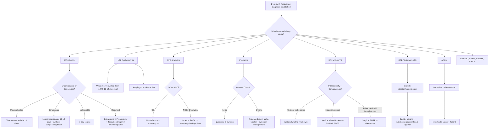
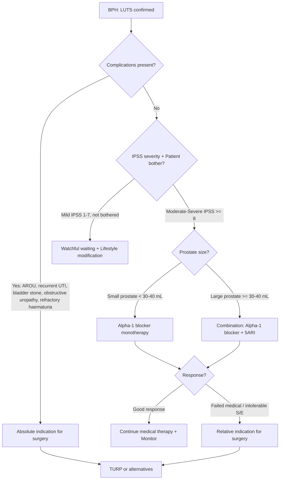

## Management Overview — First Principles

The management of dysuria and urinary frequency is **cause-directed**. There is no single "treatment for dysuria" — you must first identify the underlying aetiology and then treat accordingly. The management framework can be divided into:

1. **Immediate / Acute management** — relieve symptoms, treat infection, decompress if obstructed
2. **Definitive management** — address the underlying cause
3. **Prevention** — particularly for recurrent UTI

Think of it as: **Relieve → Treat → Prevent**.

---

## Master Management Algorithm

---

## A. Management of UTI (The Most Common Cause)

### 1. Acute Uncomplicated Cystitis in Women

**Principle**: Predictable microbiology (E. coli ~75%), low complication rate, short-course empirical antibiotics are sufficient [4].

**General measures**:
- Adequate hydration (aim 2–3 L/day fluid intake) [4]
- Analgesics for dysuria (paracetamol, NSAIDs)
- Urinary alkalinisers (e.g. sodium citrate sachets) may provide symptomatic relief — they raise urine pH, reducing the burning sensation as acidic urine contacts inflamed mucosa

**Empirical antibiotic regimens** (guided by Hong Kong local resistance patterns):

| Drug | Dose | Duration | Mechanism | Notes |
|---|---|---|---|---|
| **Nitrofurantoin** (1st line) | 100 mg BD (modified release) | **5 days** | Reduced by bacterial nitroreductases → reactive intermediates that damage bacterial DNA, ribosomes, and other macromolecules | Excellent for lower UTI; does NOT achieve therapeutic levels in renal parenchyma → **not suitable for pyelonephritis**; C/I in **CrCl < 30 mL/min** (insufficient urinary concentration), **G6PD deficiency** (haemolysis) [3]; avoid in late pregnancy (neonatal haemolysis) |
| **Trimethoprim-sulfamethoxazole** (Co-trimoxazole/Septrin) | 960 mg BD | **3 days** | Inhibits sequential steps in folate synthesis (sulfamethoxazole blocks dihydropteroate synthase; trimethoprim blocks dihydrofolate reductase) → bactericidal synergy | Avoid if local resistance > 20%; C/I in sulfa allergy, G6PD deficiency, pregnancy (1st trimester — teratogenic); check local antibiogram |
| **Fosfomycin** | 3 g single dose PO | **Single dose** | Inhibits MurA (first step in peptidoglycan synthesis) | Convenient single dose; good activity against ESBL-producing E. coli; useful in HK where FQ resistance is high |
| **Amoxicillin-clavulanate** | 625 mg TDS | **5 days** | β-lactam + β-lactamase inhibitor | 2nd line; broader spectrum |

<Callout title="Must Identify G6PD Deficiency" type="error">
***MUST identify underlying G6PD deficiency*** before prescribing nitrofurantoin or co-trimoxazole [3]. Both drugs can trigger oxidative haemolysis in G6PD-deficient patients. G6PD deficiency is common in Hong Kong (prevalence ~4.5% in males). Always check G6PD status or ask about known G6PD status before prescribing.
</Callout>

<Callout title="Hong Kong Antibiotic Resistance Context" type="idea">
In Hong Kong, community E. coli fluoroquinolone resistance exceeds 30%, and ampicillin resistance exceeds 50%. Therefore:
- **Fluoroquinolones (ciprofloxacin, levofloxacin)** should NOT be used as first-line empirical therapy for uncomplicated cystitis
- **Nitrofurantoin** and **fosfomycin** retain excellent activity and are preferred first-line agents
- Always check the local antibiogram and adjust based on C/ST results
</Callout>

### 2. Complicated UTI / Male Cystitis

**Principle**: broader spectrum of organisms, higher resistance rates, need for longer treatment, and must address the complicating factor [4].

- ***Male cystitis generally needs longer (7-day) treatment*** [4]
- Complicated UTI: ***10–14 day*** course; traditionally fluoroquinolone if susceptible, or guided by C/ST [4]
- ***Measures should be made to eradicate the complicating feature*** (e.g. relieve obstruction, remove catheter, treat stones) [4]

### 3. Acute Pyelonephritis

**Principle**: systemic infection requiring more aggressive treatment; must rule out obstruction (obstructed infected kidney = urological emergency requiring drainage) [4].

| Severity | Management |
|---|---|
| **Mild** (able to tolerate PO, non-septic) | Oral fluoroquinolone for 7–10 days (if susceptible) OR oral co-amoxiclav |
| **Moderate-severe** (high fever, vomiting, unable to tolerate PO, haemodynamically unstable) | **IV antibiotics** initially (e.g. IV ceftriaxone, IV co-amoxiclav, IV piperacillin-tazobactam if complicated) → step down to PO when afebrile for 48h; total 10–14 days |
| **Obstructed + infected** (pyonephrosis) | **URGENT drainage** (percutaneous nephrostomy or JJ ureteric stent) + IV antibiotics — this is an emergency because pus under pressure in a closed system leads to rapid sepsis and renal destruction |

**Imaging**: USG kidneys ± CT should be performed in pyelonephritis to **rule out obstruction** (hydronephrosis), abscess, or other complications.

### 4. Asymptomatic Bacteriuria — When NOT to Treat [4]

This is a critical concept. Asymptomatic bacteriuria (ASB) is **NOT equivalent to UTI** and should **NOT be treated** in most populations:

| **Do NOT treat** | **Rationale** |
|---|---|
| Non-pregnant women (pre- or post-menopausal) | Benign natural history; Rx does not ↓risk of symptomatic UTI |
| Men | Same — no benefit |
| Diabetics | Same — no benefit shown |
| Patients with indwelling catheters | Extremely common (100% with long-term catheters); treatment selects for resistant organisms without benefit |
| Patients with nephrostomy tubes / JJ stents | Same principle |
| Spinal cord injury patients | Same principle |

| **TREAT** | **Rationale** |
|---|---|
| ***Pregnant patients*** | ↑Risk of ascending infection due to physiological changes → ↑risk of preterm delivery and low birth weight [4] |
| ***Pending urological procedure where mucosal bleeding is anticipated (e.g. TURP)*** | ***A/w ↑risk of infective post-procedure complications; usually require antibiotic prophylaxis*** [4] |

<Callout title="Common Exam Mistake" type="error">
Students frequently want to treat positive urine cultures in catheterised elderly patients. **Do not treat bacteriuria in catheterised patients unless they are symptomatic** (e.g. new fever, rigors, delirium, haematuria) [4]. Treatment of asymptomatic bacteriuria in catheterised patients only selects for resistant organisms and causes antibiotic-related side effects (e.g. C. difficile colitis).
</Callout>

### 5. Recurrent Cystitis [4]

***20% of women with UTI will recur within 6 months → common, genetically determined*** [4]

Management is stepwise:

**Step 1: Behavioural changes** (first-line, although evidence is limited) [4]:
- ***Avoid use of spermicides and diaphragms → use alternative contraceptive methods***
- ***Observe personal hygiene → wipe from front to back after voiding***
- ***Post-coital voiding***
- ***Hydration to maintain adequate urine output → aim 2–3 L/day fluid intake***
- ***Liberal fluid intake to increase micturition*** [3]

**Step 2: Topical oestrogen for postmenopausal women** [4]:
- ***↓75% incidence of cystitis in RCTs***
- Mechanism: restores Lactobacillus-dominant vaginal flora → ↓vaginal pH → ↓uropathogen colonisation

**Step 3: Antimicrobial prophylaxis in selected cases** [3][4]:
- ***Indication: recurrent symptoms specific for UTI that persist despite non-Rx measures***
- ***Continuous prophylaxis***: if no temporal relation to sexual activity
- ***Post-coital prophylaxis***: if temporally related to sexual activity — ***single post-coital dose may be a more efficient and acceptable method of prevention than continuous prophylaxis*** [3]
- ***Regimen: usually co-trimoxazole or nitrofurantoin*** [4]; can give trial for a few months to assess response first
- ***Intermittent self-treatment***: indicated in women who prefer to minimise antimicrobial intake — patients self-diagnose and self-treat with a pre-prescribed short course [3]

**Paediatric prophylaxis** [3]:
- ***Antibiotic prophylaxis should NOT be routinely prescribed to young children with first episode of UTI***
- ***Prophylactic antibiotics with cotrimoxazole indicated if VUR Grade ≥ 3***

---

## B. Management of STD-Related Urethritis

| Condition | Treatment | Rationale |
|---|---|---|
| **Gonococcal urethritis** | **IM ceftriaxone 500 mg single dose + azithromycin 1 g PO single dose** | Dual therapy to cover potential co-infection with Chlamydia and to combat rising gonococcal resistance (especially to fluoroquinolones, which are no longer recommended for GC in HK) |
| **Non-gonococcal urethritis (Chlamydia)** | **Doxycycline 100 mg BD × 7 days** (preferred) OR **Azithromycin 1 g PO single dose** | Doxycycline preferred per 2021 updated guidelines as it has slightly higher cure rates for Chlamydia; azithromycin useful if compliance is a concern |
| **Mycoplasma genitalium** | Azithromycin 1 g stat → if resistance → moxifloxacin | Macrolide resistance in M. genitalium is rising; resistance-guided therapy preferred |
| **Trichomonas** | Metronidazole 2 g PO single dose or 400 mg BD × 7 days | Metronidazole is the only effective drug against Trichomonas |

**Key principles**:
- **Always treat sexual partners** (contact tracing)
- **Screen for other STDs** (HIV, syphilis, hepatitis B)
- **Abstinence from sexual intercourse** until treatment of both partners is complete

---

## C. Management of Prostatitis

### Acute Bacterial Prostatitis [4]

- ***Empirical antibiotics: prefer quinolone (excellent prostatic penetration) for 2–6 weeks*** [4]
  - Why quinolone? The prostate has a blood-prostate barrier (similar concept to BBB) — only lipophilic drugs with good tissue penetration can achieve therapeutic concentrations in prostatic tissue. Fluoroquinolones (ciprofloxacin, levofloxacin) are lipophilic, have excellent prostatic penetration, and achieve prostatic tissue concentrations exceeding serum levels.
  - Alternative: co-trimoxazole (also penetrates prostate well)
  - Duration: **prolonged** (minimum 2 weeks, often 4–6 weeks) to prevent relapse and development of chronic prostatitis
- Supportive: analgesics, stool softeners (straining worsens perineal pain), adequate hydration
- **Do NOT perform vigorous prostatic massage** — risk of bacteraemia

### Chronic Bacterial Prostatitis

- Prolonged antibiotics (fluoroquinolone 4–6 weeks)
- Alpha-blocker (tamsulosin) for obstructive symptoms — relaxes prostatic smooth muscle
- Chronic pain management

---

## D. Management of BPH

### Treatment Algorithm

### Conservative / Lifestyle [3][5]

***Indications: symptoms do not bother patient*** [5]

- ***Avoid fluids prior to bedtime or before going out*** [3]
- ***Reduce consumption of caffeine and alcohol*** [3]
- ***Double voiding to empty bladder more completely*** [3]
- Timed voiding, bladder training

### Medical Therapy

***Indications for treatment: IPSS moderate or above (≥ 8)*** [5]

#### 1. Alpha-1 Adrenergic Blockers (First-Line, Most Commonly Used) [5]

**Mechanism**: Block α₁-adrenergic receptors on prostatic smooth muscle → ↓dynamic component of obstruction → relaxation of bladder neck and prostatic urethra → improved urine flow. Rapid onset (days to weeks).

| Subtype | Drugs | Side Effects |
|---|---|---|
| ***Non-selective α₁ blockers*** | ***Prazosin (Minipress), Terazosin (Hytrin), Doxazosin (Cardura), Alfuzosin (Xatral)*** | ***More orthostatic hypotension, nasal congestion, dizziness, tiredness*** [5] — because α₁ receptors are also found on vascular smooth muscle |
| ***Selective α₁A blockers*** | ***Tamsulosin (Harnal), Silodosin (Rapaflo)*** | ***More retrograde ejaculation*** [5] — because α₁A receptors are concentrated in the vas deferens and seminal vesicles; blocking them impairs seminal emission |

***To reduce side effects: slow titration, subtype-selective (α₁A), slow-release formulations*** [5]

<Callout title="Why α₁A Selectivity Matters">
The prostate predominantly expresses α₁A receptor subtypes, while blood vessels predominantly express α₁B. Selective α₁A blockers (tamsulosin, silodosin) target the prostate with less vascular effect → less orthostatic hypotension. However, α₁A receptors are also present in the vas deferens → selective blockers cause more retrograde ejaculation. It's a trade-off.
</Callout>

#### 2. 5α-Reductase Inhibitors (5ARI) [3][5]

**Mechanism**: Block the enzyme 5α-reductase that converts testosterone → dihydrotestosterone (DHT). DHT is the primary androgen driving prostatic stromal proliferation. Blocking this → ↓prostate size over time → ↓static component of obstruction. Also ↓vascularity → less bleeding from BPH.

- **Drugs**: ***Finasteride*** (type 2 selective), ***Dutasteride*** (dual type 1 + 2)
- ***2nd line / in combination with α₁-blockers: slow onset (3–6 months for maximum effect)*** [5]
- ***Preferred for larger glands ≥ 30–40 mL (TRUS) / IPSS ≥ 12*** [5]
- ***Side effects: erectile dysfunction (10%), gynaecomastia*** [5]
- ***50% decrease in PSA: multiply PSA by 2 when screening for CA prostate*** [5] — because 5ARIs reduce PSA levels by ~50%, if you need to interpret a PSA while the patient is on 5ARI, you must double the measured value

<Callout title="Combination Therapy: MTOPS and CombAT Trials" type="idea">
The landmark MTOPS and CombAT trials showed that **combination therapy (α₁-blocker + 5ARI)** is superior to either monotherapy for preventing BPH progression (AROU, need for surgery) in men with large prostates and high symptom scores. Combination therapy is now standard for men with moderate-severe LUTS and enlarged prostates.
</Callout>

#### 3. PDE5 Inhibitors [3][5]

- **Drug**: ***Tadalafil (Cialis)*** — the only PDE5i approved for LUTS/BPH
- **Mechanism**: ***PDE5-mediated reduction in smooth muscle and endothelial cell proliferation; increases smooth muscle relaxation and perfusion to prostate and bladder*** [3]. Also increases NO/cGMP signalling → relaxation of bladder neck and prostatic smooth muscle.
- ***Indicated in patients who also have erectile dysfunction*** [3]
- **Side effects**: ***Hypotension, blue/blurred vision (cross-reaction with PDE6 in retina), hearing loss, flushing, headache, dyspepsia*** [3]
- ***Avoid if using nitrate*** [5] — concomitant PDE5i + nitrate → severe hypotension (both increase cGMP-mediated vasodilation)

#### 4. Drugs for OAB Component [5]

When BPH causes secondary detrusor overactivity (irritative LUTS):

- **Anticholinergics**: oxybutynin, solifenacin
  - Mechanism: block muscarinic M₃ receptors on detrusor → ↓uninhibited detrusor contractions → ↓urgency and frequency
  - ***Side effects: dry mouth, dry eye, constipation, cognitive impairment*** [5]
  - ***C/I if post-void residual > 150 mL due to risk of AROU*** [5] — because anticholinergics reduce detrusor contractility; if there is already significant residual urine, further weakening the detrusor → retention

- ***Beta-3 agonist: Mirabegron*** [3][5]
  - Mechanism: ***activates β₃-adrenergic receptors → relaxation of detrusor smooth muscle during urine storage phase*** [3]
  - ***Effective as other anticholinergics in reducing frequency, urgency and incontinence*** [3]
  - ***Does not have the same concern for urinary retention as anticholinergic medications*** [3] — because it relaxes the detrusor during filling but does not impair detrusor contractility during voiding
  - ***Side effects: elevated BP ( > 10%)*** [5]

### Surgical Management of BPH [4][5]

***Indications*** [4][5]:

**Absolute indications** (complications of BPH):
- ***Recurrent acute retention of urine (AROU) — failed a trial without catheter (TWOC)***
- ***Recurrent urinary tract infection***
- ***Recurrent haematuria***
- ***Renal insufficiency secondary to BPH (obstructive uropathy)***
- ***Bladder stones***

**Relative indication**:
- ***Bothersome LUTS refractory to or cannot tolerate medical treatment*** [3][4]

#### Transurethral Resection of Prostate (TURP) — Gold Standard [3][4][5]

**Technique**: ***Resectoscope loaded with monopolar diathermy loop introduced into bladder → strips of prostate tissue resected under direct vision → prostate chips evacuated and bleeding controlled with electrocautery*** [3]

**Monopolar vs Bipolar TURP** [3][5]:

| Feature | Monopolar TURP | Bipolar TURP |
|---|---|---|
| Irrigant | ***Non-conductive glycine solution*** (glycine better than distilled water — less TUR syndrome; ***saline CANNOT be used because it conducts electricity, diffuses power***) [3] | ***Saline can be used → eliminates risk of hyponatraemia / TUR syndrome*** [5] |
| Speed | Faster | ***Slower due to smaller probe*** [4] |
| TUR syndrome risk | Present | ***Eliminated*** [5] |
| Cost | Cheaper | ***More expensive*** [5] |
| Haemostasis | Generally good | ***Poorer haemostasis*** [4] |
| Best for | Smaller to moderate prostates | ***Larger prostates*** [4] |

**Post-operative care**: 3-way Foley catheter post-op for bladder irrigation with NS to prevent clot retention [5]

**Complications of TURP** [3][5]:

| Complication | Mechanism | Incidence |
|---|---|---|
| **Bleeding (haematuria)** | Trauma to prostatic vasculature; ***secondary to trauma or infection (prostatitis)***; ***bleeding requiring transfusion ~1%*** [3] | Common |
| ***TUR syndrome (post-prostatectomy syndrome)*** | ***Hyponatraemia due to systemic absorption of hypotonic irrigating fluid (glycine) in monopolar TURP → dilutional hyponatraemia + fluid overload + glycine toxicity*** [3][5] | ***Risk factors: long OT time, massive prostate*** [5] |
| | ***S/S: nausea (1st symptom), confusion, cerebral oedema, visual disturbance*** [5] | |
| | ***Mx: manage as hyponatraemia (check electrolytes, serum osmolality, volume status), hypertonic saline if severe*** [5] | |
| | ***Prevention: use bipolar (NS irrigant), limit volume < 1 L and irrigation pressure < 60 mmHg*** [5] | |
| ***Retrograde ejaculation*** | ***70–80% due to resection of bladder neck*** [5] — the bladder neck normally closes during ejaculation to direct semen anterogradely; resection destroys this mechanism | Very common |
| ***Urethral stricture*** | ***Urethral instrumentation*** [5] — trauma from passage of resectoscope | |
| ***Incontinence*** | ***1%: urge (early) / stress (late)*** [5] | Rare |
| Perforation | Can form fistula [5] | Rare |

#### Alternative Surgical Techniques [4][5]

| Technique | Description | Advantage |
|---|---|---|
| ***TUIP (transurethral incision of prostate)*** | ***Longitudinal incision in prostate gland → widen bladder neck and prostatic urethra without tissue removal; only for small prostates ≤ 30 g*** [4] | ***↓Morbidity and complication rates*** [4] |
| ***Laser enucleation (HoLEP, ThuLEP)*** | ***Laser to enucleate BPH adenoma → morcellated for removal*** [4] | ***Useful for large prostates; saline can be used; ↓bleeding*** [4] |
| ***Ablative techniques (PVP/Green Laser, RFA, microwave, steam/Rezum)*** | Various energy sources to destroy prostatic tissue | ***Less bleeding, ↓post-op irritative symptoms; BUT no histological specimen and ↓durability compared to TURP*** [4] |
| ***UroLift*** | ***Implants to hold different parts of prostate away from prostatic urethra*** [5] | Preserves ejaculatory function |
| ***Prostatic artery embolisation (PAE)*** | ***Reduce part of blood supply to prostate*** [5] | Minimally invasive; for high-risk surgical patients |
| **Long-term catheterisation** (Foley/SPC/CISC) | Ongoing drainage | ***For very unfit patients not suitable for any intervention*** [5] |
| **Metallic stent** | Temporary stent in prostatic urethra | ***Temporary for very unfit patients*** [5] |

---

## E. Management of AROU (Acute Retention of Urine) [3][4]

### Immediate Management

***Immediate bladder decompression by urethral catheterisation (first-line)*** [4]:

**Procedure** [4]:
1. ***Aseptic technique: clean genital area with hibitane, drape***
2. ***Intraurethral LA: apply xylocaine jelly → milk down urethra → wait 5 minutes***
3. ***Insert 14–18 Fr Foley's catheter using no-touch technique***
4. ***Inflate balloon with 10 mL water → withdraw until resistance***

**Catheter sizing** [3][4]:
- Males: 14–18 Fr
- Females: 12–16 Fr
- If ***enlarged prostate → use thicker (20–22 Fr) catheters*** [4] (the catheter needs to be stiffer to bypass the obstruction)
- If ***urethral stricture → use thinner (10–12 Fr) catheters*** [4]

**Contraindications to urethral catheterisation** [3][4]:
- ***Urethral trauma (blood at urethral meatus, high-riding prostate)*** [5]
- ***Acute prostatitis, radical prostatectomy, urethral reconstruction*** [3]

**If unable to catheterise** → ***Suprapubic catheterisation (SPC)*** [4]:
- ***Indications: failed urethral catheterisation, Hx of urethral trauma, long-term drainage expected ( > 3 weeks)*** [4]
- ***C/I: non-distended bladder, uncorrected bleeding tendency, known/suspected urothelial cancer*** [4]
- ***Complications: bowel perforation, rectal injury, haematuria*** [4]

### Monitoring After Catheterisation [3]

- ***Assess first catheterisation volume*** [3]:
  - ***Volume > 500 mL = genuine AROU***
  - ***Volume > 1000 mL = possible chronic retention***
- Monitor hourly urine output
- ***Look for post-obstructive diuresis*** [3]:
  - ***Defined as diuresis > 200 mL/hr for 2 hours*** (or diuresis persisting after decompression) [3]
  - ***Body attempts to excrete excess fluid retained during obstruction***
  - ***Primarily a problem of chronic but not acute retention*** [3]
  - ***Do NOT remove Foley catheter during diuresis — may lead to hydronephrosis*** [3]
  - ***Patients normally manage by increasing oral fluid intake; IV isotonic saline replacement if unable*** [3]

### Subsequent Management [4]

- ***Investigations: CBC, RFT, catheterised urine C/ST, KUB for stones/faecal loading***
- ***Do NOT take PSA during AROU → causes false elevation (check 4–6 weeks later)*** [4]
- ***Trial without catheter (TWOC)***: catheter placed for 2 days → removed → assess if patient can void [3]
  - If successful → outpatient workup for underlying cause
  - If fails → re-catheterise → plan for definitive surgery (TURP)
- Start alpha-blocker (tamsulosin) before TWOC — improves success rate by relaxing prostatic smooth muscle

---

## F. Management of OAB / Irritative LUTS [5]

***Approach*** [5]:
- ***Establish frequency (daytime symptoms positive) but not pure nocturia***
- ***Perform voiding diary / frequency-volume chart***
  - ***High urine output → look for cause of polyuria***
  - ***Low urine output → true frequency: detrusor hypersensitivity or capacity problem***
- ***Exclude infection / stone / tumour*** [5]

***OAB if no other causes identified*** [5] — Clinical diagnosis by bladder diary:
- ***Frequent voiding of small volumes***
- ***Normal prostate on DRE***
- ***Good flow rate on uroflowmetry***

**Management** [4][5]:

| Step | Treatment | Mechanism |
|---|---|---|
| 1st line | ***Bladder training*** | Timed voiding with progressive increase in intervals; trains cortical inhibition of premature detrusor contractions |
| 2nd line | ***Anticholinergics: oxybutynin / solifenacin*** [5] | Block M₃ receptors on detrusor → ↓involuntary contractions |
| | ***S/E: dry mouth, dry eye, constipation, cognitive impairment*** [5] | |
| Alternative | ***Beta-3 agonist: mirabegron*** [5] | Activate β₃ receptors → detrusor relaxation during storage |
| | ***S/E: elevated BP ( > 10%)*** [5] | |
| 3rd line | **Botox injection** into detrusor | Botulinum toxin blocks ACh release at neuromuscular junction → reduces detrusor contractility for 6–9 months |

---

## G. Management of Atrophic Urethritis/Vaginitis

- **Topical vaginal oestrogen** (estriol cream, estradiol vaginal ring) — restores urogenital mucosa, restores Lactobacilli, ↓pH, ↓uropathogen colonisation
- RCTs show ***↓75% incidence of cystitis*** [4]
- Systemic HRT is NOT necessary; topical application is sufficient and has minimal systemic absorption

---

## H. Catheter Types and Choice (Practical Summary) [3]

| Type | Use | Key Points |
|---|---|---|
| ***Indwelling catheter*** | ***Short-term bladder drainage < 3 weeks*** [3] | Standard 2-way; Latex (yellow) for short-term (max 2 weeks), Silicone (transparent) for longer (max 4 weeks) [3] |
| ***Intermittent catheter (CISC)*** | Removal after each decompression; recatheterise on schedule | ***Reduced complication rate*** [3]; preferred for neurogenic bladder |
| ***Suprapubic catheter*** | ***Long-term bladder drainage*** [3] | ***Prevents urethral trauma/stricture, ↓sphincter dysfunction, ↓CAUTI, allows voiding assessment before removal*** [3] |
| ***Triple-lumen (3-way)*** | ***Hematuria with clot retention; bladder irrigation*** [3] | Additional irrigation channel; used post-TURP [5] |

---

<Callout title="High Yield Summary">

**UTI Management**:
- Uncomplicated cystitis: nitrofurantoin 5d or fosfomycin single dose (1st line in HK due to high FQ resistance); co-trimoxazole 3d (check G6PD!)
- Male cystitis: 7 days. Complicated UTI: 10–14 days + address complicating factor.
- Pyelonephritis: oral FQ if mild; IV Abx if severe; URGENT drainage if obstructed + infected.
- Asymptomatic bacteriuria: ONLY treat in pregnancy and pre-urological procedures.
- Recurrent UTI: behavioural changes → topical oestrogen (postmenopausal) → antimicrobial prophylaxis.

**BPH Management**:
- Conservative: watchful waiting if mild IPSS and not bothered.
- Medical: α₁-blockers (1st line, rapid onset) ± 5ARI (slow onset 3–6 months, for large glands ≥ 30–40 mL). PDE5i if concurrent ED. Anticholinergics/mirabegron for OAB component.
- Surgical indications: refractory AROU, recurrent UTI, bladder stones, obstructive uropathy, refractory haematuria, failed medical therapy.
- TURP gold standard; complications include TUR syndrome (monopolar), retrograde ejaculation (70–80%), urethral stricture.

**AROU**: Immediate catheterisation → TWOC after 2 days ± alpha-blocker → surgery if TWOC fails.

**OAB**: Exclude infection/stone/tumour → bladder training → anticholinergics (C/I if PVR > 150 mL) or mirabegron.

</Callout>

---

<ActiveRecallQuiz
  title="Active Recall - Management of Dysuria and Frequency"
  items={[
    {
      question: "A 28-year-old woman presents with dysuria and frequency for 2 days. No fever, no discharge, no loin pain. What is the most likely diagnosis and your first-line antibiotic choice in Hong Kong? What must you check before prescribing?",
      markscheme: "Acute uncomplicated cystitis. First-line in HK: nitrofurantoin 100 mg BD for 5 days (or fosfomycin 3 g single dose). Avoid fluoroquinolones empirically due to >30% community E. coli FQ resistance. Must check G6PD status before prescribing nitrofurantoin or co-trimoxazole (prevalence ~4.5% in HK males)."
    },
    {
      question: "List the absolute indications for surgical intervention in BPH.",
      markscheme: "1. Recurrent AROU (failed TWOC). 2. Recurrent UTI. 3. Recurrent haematuria. 4. Renal insufficiency secondary to BPH (obstructive uropathy). 5. Bladder stones. These are all complications of BPH that will not resolve with medical therapy alone."
    },
    {
      question: "Explain the mechanism, onset, and key side effect of 5-alpha reductase inhibitors in BPH. Why must you adjust PSA interpretation?",
      markscheme: "Mechanism: block 5-alpha reductase which converts testosterone to DHT; DHT drives prostatic stromal proliferation. Blocking it reduces prostate size (static component) and vascularity. Onset: slow, 3-6 months for maximum effect. Preferred for large glands >= 30-40 mL. Key S/E: erectile dysfunction (10%), gynaecomastia. PSA: 5ARIs reduce PSA by ~50%, so you must multiply measured PSA by 2 when screening for prostate cancer."
    },
    {
      question: "What is TUR syndrome? Explain the pathophysiology, risk factors, symptoms, and how bipolar TURP prevents it.",
      markscheme: "TUR syndrome: dilutional hyponatraemia + fluid overload + glycine toxicity from systemic absorption of hypotonic glycine irrigating fluid during monopolar TURP. Risk factors: long operative time, massive prostate. Symptoms: nausea (first), confusion, cerebral oedema, visual disturbance. Mx: check electrolytes/osmolality/volume, hypertonic saline if severe. Bipolar TURP uses normal saline as irrigant (possible because current passes between two poles on the instrument, not through patient's body), eliminating the risk of hyponatraemia."
    },
    {
      question: "An 80-year-old man with a catheter has a positive urine culture showing E. coli 10^5 CFU/mL but is completely asymptomatic. Should you treat? Why or why not?",
      markscheme: "Do NOT treat. This is asymptomatic bacteriuria in a catheterised patient. 100% of patients with long-term catheters have bacteriuria. Treatment does not reduce risk of symptomatic UTI, complications, or death. Treatment only selects for resistant organisms and causes antibiotic side effects (e.g. C. difficile colitis). Only treat if new symptoms develop (fever, rigors, haematuria, delirium)."
    },
    {
      question: "Explain why anticholinergics are contraindicated if post-void residual volume exceeds 150 mL, and name the alternative drug class.",
      markscheme: "Anticholinergics block M3 muscarinic receptors on the detrusor muscle, reducing detrusor contractility. If there is already significant residual urine (>150 mL indicating incomplete emptying), further weakening detrusor contraction risks precipitating acute urinary retention. Alternative: beta-3 agonist (mirabegron) which relaxes the detrusor during storage phase but does not impair contractility during voiding, so it does not carry the same retention risk."
    }
  ]}
/>

---

## References

[1] Lecture slides: murtagh merge.pdf (p40–42, Dysuria)
[2] Senior notes: Ryan Ho Fundamentals.pdf (p352, AROU diagnosis and acute management; p354–355, LUTS)
[3] Senior notes: felixlai.md (UTI treatment, recurrent UTI prophylaxis, BPH treatment, TURP, catheterisation, AROU management)
[4] Senior notes: Ryan Ho Urogenital.pdf (p125–128, UTI management, asymptomatic bacteriuria, recurrent cystitis, prostatitis; p167, AROU management; p176, BPH surgical management)
[5] Senior notes: maxim.md (BPH management, alpha-blockers, 5ARI, PDE5i, TURP, OAB management, AROU)
