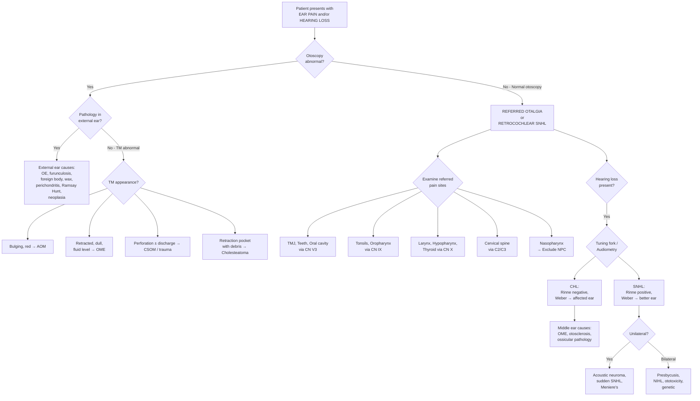

## Differential Diagnosis of Ear Pain and Hearing Loss

The differential diagnosis of ear pain (otalgia) and hearing loss is best approached using a structured framework. Murtagh's diagnostic strategy organises differentials into **probability diagnoses** (common things seen commonly), **serious disorders not to be missed** (the ones that kill or maim), **pitfalls (often missed)**, and the **masquerades checklist** [1]. This is a superb framework for clinical practice and exams because it forces you to think about both the likely and the dangerous.

---

### 1. Murtagh's Diagnostic Strategy for Ear Pain [1]

#### ***Probability Diagnosis*** [1]
These are the diagnoses you will see day in, day out. When a patient walks in with ear pain, one of these is the answer the vast majority of the time.

| Diagnosis | Why It's Common | Key Distinguishing Feature |
|---|---|---|
| ***Otitis media (viral or bacterial)*** [1] | URTI is ubiquitous; Eustachian tube dysfunction is extremely common in children (short, horizontal tube) → middle ear infection/effusion | Deep ear pain, fever, bulging erythematous TM on otoscopy; ***pain may be masked by fever in babies and young children*** [1] |
| ***Otitis externa*** [1] | Warm humid climate (Hong Kong), swimming, cotton bud use → disruption of cerumen barrier → bacterial colonisation of EAC | Pain worse with tragal pressure / pinna traction; swollen, erythematous EAC with debris |
| ***Boils and furuncles of canal*** [1] | Hair follicle infection (*S. aureus*) in the lateral (cartilaginous) EAC — the only part of the canal with hair follicles | Localised, exquisitely tender swelling in the lateral EAC; tragal tenderness |
| ***TMJ arthralgia*** [1] | Extremely common (bruxism, dental malocclusion, stress); anterior wall of EAC is shared with the TMJ → chewing/jaw movement exacerbates pain | Pain on chewing, clicking/crepitus on jaw opening, tenderness over TMJ; **normal otoscopy** (referred pain via CN V3) |
| ***Eustachian tube dysfunction*** [1] | Follows URTI, allergic rhinitis, or anatomical obstruction; negative middle ear pressure → retracted TM, aural fullness, mild pain | Popping/crackling sensation, fullness, mild conductive hearing loss; retracted TM on otoscopy |

> **Why is TMJ arthralgia in the "probability" category?** Because the temporomandibular joint shares its nerve supply (auriculotemporal nerve, CN V3) with the external ear, and the anterior wall of the bony EAC is literally the posterior wall of the TMJ fossa. Jaw clenching/bruxism is extremely prevalent — many patients have referred otalgia from the TMJ without realising it.

#### ***Serious Disorders Not to Be Missed*** [1]
These are the diagnoses that, if delayed, lead to serious morbidity or death. You must actively exclude these.

| Diagnosis | Why It's Serious | Key Features |
|---|---|---|
| ***Neoplasia of external ear*** [1] | SCC of pinna/EAC — can invade temporal bone, parotid, skull base | Non-healing ulcer or mass on pinna/EAC; chronic bloody discharge; pain out of proportion |
| ***Cancer of other sites (e.g. tongue, throat)*** [1] | Head and neck cancers (especially NPC in Hong Kong [2], oropharyngeal, hypopharyngeal, laryngeal carcinoma [4]) cause referred otalgia via CN IX/X; delayed diagnosis = late-stage presentation | Persistent unilateral otalgia with **normal otoscopy** in a smoker/drinker; dysphagia, hoarseness, neck mass; unilateral OME in adult → **must exclude NPC** |
| ***Herpes zoster — Ramsay Hunt syndrome*** [1] | VZV reactivation in geniculate ganglion → CN VII palsy (may be permanent), CN VIII involvement → SNHL, vertigo | Vesicles in concha/EAC (zone of Ramsay Hunt) + ipsilateral LMN facial palsy + severe otalgia ± SNHL/vertigo |
| ***Acute mastoiditis*** [1] | Complication of AOM; can lead to intracranial abscess, meningitis, sigmoid sinus thrombosis | Post-auricular swelling/erythema/tenderness, pinna pushed forward; fever, deep pain; often follows inadequately treated AOM |
| ***Cholesteatoma*** [1] | Erosive — destroys ossicles, erodes into lateral SCC (vertigo), facial nerve canal (palsy), tegmen (intracranial complications) | Foul-smelling discharge, progressive conductive HL, retraction pocket with keratin on otoscopy; NOT a tumour but behaves like one locally |
| ***Necrotising otitis externa*** [1] | Skull base osteomyelitis from *Pseudomonas* in diabetics/immunocompromised; can involve CN VII, IX, X, XI, XII; mortality up to 20% if delayed | Severe disproportionate pain, granulation tissue at bone-cartilage junction, cranial nerve palsies, raised ESR/CRP; ***not "malignant" in the neoplastic sense — the name refers to aggressive destructive behaviour*** |

<Callout title="Do Not Miss in Hong Kong" type="error">
***Cancer of other sites (e.g. tongue, throat)*** [1] — in the Hong Kong context, **nasopharyngeal carcinoma** is the critical "do-not-miss." Any adult with unilateral OME, persistent unilateral otalgia, or conductive hearing loss with a normal EAC must have a **nasopharyngoscopy** to visualise the post-nasal space. NPC is ***endemic in Southern China including Hong Kong*** [2] and frequently presents late because the fossa of Rosenmüller is a clinically occult site.
</Callout>

#### ***Pitfalls (Often Missed)*** [1]
These are the diagnoses that clinicians frequently overlook — leading to unnecessary investigations, repeated consultations, and patient frustration.

| Diagnosis | Why It's Missed | Key Features |
|---|---|---|
| ***Foreign bodies in ear*** [1] | Children don't volunteer history; small objects may not be visible without careful otoscopy | History from child/parent; visible on otoscopy if you look carefully; unilateral discharge |
| ***Hard ear wax*** [1] | Dismissed as trivial, but impacted cerumen causes real pain and hearing loss | Dull ache, fullness, conductive hearing loss; wax visible on otoscopy — simple to treat |
| ***Trauma including barotrauma*** [1] | Patient may not connect recent flight/dive with ear symptoms; cotton bud use not volunteered | History of flying, diving, slap to ear, ***cotton bud use*** [1]; haemotympanum, TM perforation |
| ***Dental abscess*** [1] | Ear pain may be the presenting symptom with no dental complaint initially | Normal otoscopy; dental tenderness on percussion; pain on chewing; jaw/face swelling |
| ***Referred pain: neck, throat (e.g. tonsillitis)*** [1] | Clinician focuses on the ear and forgets to examine the throat and neck | Sore throat, cervical spine tenderness; ***look for causes of referred pain: cervical spine, nose, postnasal space and mouth including teeth*** [1] |
| ***Unerupted wisdom tooth and other dental causes*** [1] | Impacted 3rd molar irritates CN V3 → referred ear pain; patient presents to GP not dentist | Young adult; trismus; tender posterior mandible; normal otoscopy |
| ***TMJ arthralgia*** [1] (also a probability diagnosis) | Listed twice because it is so commonly missed — clinicians forget to ***palpate the TMJ*** [1] | Pain on chewing, clicking, crepitus; tenderness on TMJ palpation; normal otoscopy |
| ***Chondrodermatitis nodularis helicis*** [1] | Small nodule easily overlooked unless you ***check helix for chondrodermatitis nodularis helicis*** [1] | Exquisitely tender small nodule on helix/antihelix; worsened by pressure (sleeping on that ear) |
| ***Facial neuralgias, esp. glossopharyngeal*** [1] | Paroxysmal lancinating pain in ear/throat triggered by swallowing → mistaken for throat/ear pathology | Brief electric-shock-like pain in ear/throat/tonsillar fossa; triggered by swallowing, talking, yawning |
| ***Post-tonsillectomy*** [1]: ***from the wound*** [1] and ***from TMJ due to mouth gag*** [1] | Post-operative referred otalgia is expected but can alarm patients; also the mouth gag used in surgery stresses the TMJ → TMJ-related otalgia | Otalgia after tonsillectomy; no ear pathology on exam; pain from raw tonsillar bed referred via CN IX; TMJ strain from prolonged mouth opening |

#### ***Masquerades Checklist*** [1]

| Masquerade | Mechanism |
|---|---|
| ***Depression*** [1] | Chronic pain syndromes, somatisation — patients with depression can present with persistent otalgia without organic cause; pain perception is amplified by central sensitisation |
| ***Spinal dysfunction (cervical)*** [1] | C2/C3 cervical nerve roots supply the ear via the greater auricular and lesser occipital nerves; cervical spondylosis, disc disease, or facet joint dysfunction → referred otalgia |
| ***"Is the patient trying to tell me something?"*** [1] — ***Unlikely, but always possible with pain. More likely in children. Consider factitious pain.*** [1] | Psychogenic/factitious otalgia; children may use ear pain to express distress or gain attention; in adults, consider secondary gain |

---

### 2. Differential Diagnosis of Hearing Loss

Hearing loss differentials are best organised by **type** (conductive vs. sensorineural) and then by **site of lesion** within each type, because this mirrors the clinical reasoning you'll use when you have audiometry results.

#### 2.1 Conductive Hearing Loss

| Site | Condition | Key Feature |
|---|---|---|
| **External ear** | Cerumen impaction | Most common benign cause; easily seen on otoscopy |
| | Otitis externa (severe, with canal oedema) | Canal swollen shut → sound cannot reach TM |
| | Foreign body | Common in children |
| | Exostoses / osteomata | Bony narrowing of EAC in cold-water swimmers ("surfer's ear") |
| | EAC atresia/stenosis | Congenital (Treacher Collins, etc.) or acquired (post-inflammatory) |
| **Tympanic membrane** | TM perforation | Trauma, AOM, CSOM; degree of HL depends on size and location |
| | Tympanosclerosis | Calcified patches on TM from prior inflammation; usually minimal HL |
| **Middle ear** | AOM / OME | Fluid/pus dampens ossicular vibration |
| | CSOM | Chronic inflammation, possible ossicular erosion |
| | Cholesteatoma | Ossicular erosion (incus long process most vulnerable) |
| | Otosclerosis | Stapes footplate fixation at oval window; progressive CHL; Carhart's notch at 2 kHz |
| | Ossicular discontinuity | Trauma, cholesteatoma; large air-bone gap (~60 dB max) |
| | Haemotympanum | Temporal bone fracture → blood in middle ear |
| | NPC causing OME | ***Unilateral OME in adult → exclude NPC*** [2] |

#### 2.2 Sensorineural Hearing Loss

| Category | Condition | Key Feature |
|---|---|---|
| **Cochlear (sensory)** | ***Noise-induced hearing loss*** [9] | 4 kHz notch on audiogram; occupational/recreational noise exposure |
| | ***Presbycusis (ageing)*** [9] | Bilateral, symmetrical, high-frequency loss; most common cause of SNHL globally |
| | ***Ménière's disease/syndrome*** [9] | Fluctuating low-frequency SNHL + episodic vertigo + tinnitus + aural fullness |
| | ***Ototoxicity*** | Aminoglycosides (irreversible), cisplatin, loop diuretics (usually reversible), high-dose aspirin |
| | Sudden SNHL | ENT emergency; ≥30 dB in ≥3 frequencies within 72 hours; vascular, viral, autoimmune, or idiopathic |
| | ***Viral cochleitis / ear infection*** [9] | Post-viral SNHL; may follow mumps, measles, VZV, CMV |
| | Congenital SNHL | Genetic (connexin 26 mutation, Pendred syndrome, Alport syndrome [3]); TORCH infections |
| | Autoimmune inner ear disease | Bilateral, rapidly progressive SNHL; may be associated with systemic autoimmune disease |
| **Retrocochlear (neural)** | ***Acoustic neuroma (vestibular schwannoma)*** [9] — ***unilateral*** | Unilateral progressive SNHL with poor speech discrimination; tinnitus; can cause CN V/VII involvement if large |
| | CPA tumours (meningioma, epidermoid) | Similar presentation to vestibular schwannoma |
| | Auditory neuropathy spectrum disorder | OAE present but ABR absent/abnormal; speech perception disproportionately poor |
| **Central** | MS, brainstem stroke, tumour | Central auditory processing affected; rare |

#### 2.3 Mixed Hearing Loss

| Condition | Mechanism |
|---|---|
| CSOM with labyrinthine involvement | Chronic infection erodes into inner ear → combined CHL + SNHL |
| Cholesteatoma with inner ear fistula | Erosion into lateral SCC → CHL (ossicular) + SNHL (labyrinthine) |
| Otosclerosis with cochlear extension | "Far-advanced otosclerosis" — spongiotic bone involves cochlear capsule → mixed loss |
| Temporal bone fracture | Ossicular disruption (CHL) + cochlear/CN VIII damage (SNHL) |
| ***Paget's disease of bone*** [10] | ***Skull involvement → hearing loss due to cochlear involvement*** [10]; combined ossicular fixation + cochlear bone changes |

---

### 3. Differential Diagnosis of Tinnitus [9]

Since tinnitus commonly co-exists with ear pain and hearing loss, it is worth considering its differential separately.

#### ***Probability Diagnosis*** [9]

| Condition | Mechanism |
|---|---|
| ***Ear wax or debris*** [9] | Physical contact with TM or altered resonance → perceived sound |
| ***Sensorineural hearing loss (esp. noise-induced)*** [9] | Damaged cochlear hair cells generate spontaneous aberrant neural activity → phantom sound |
| ***Otosclerosis*** [9] | Altered middle ear mechanics + possible cochlear involvement → tinnitus |
| ***Ageing*** [9] | Presbycusis → deafferentation of auditory cortex → central tinnitus generation |
| ***Ear infection (e.g. viral cochleitis)*** [9] | Cochlear inflammation → aberrant neural discharge |
| ***Ménière syndrome*** [9] | Endolymphatic hydrops → cochlear distortion → low-frequency roaring tinnitus |

#### ***Serious Disorders Not to Be Missed*** [9]

| Category | Condition | Key Feature |
|---|---|---|
| ***Vascular*** [9] | ***Arteriovenous malformation, carotidovenous fistula, arterial bruits (esp. carotid), venous hum (jugular)*** [9] | **Pulsatile tinnitus** — synchronous with heartbeat; objective (can be heard by examiner with stethoscope over ear/mastoid) |
| ***Infection*** [9] | ***Suppurative otitis media*** [9] | Middle ear infection → mucosal inflammation near cochlear promontory → tinnitus |
| ***Cancer/tumour*** [9] | ***Acoustic neuroma — unilateral*** [9] | Unilateral tinnitus + progressive unilateral SNHL + poor speech discrimination → MRI with gadolinium |
| ***Other*** [9] | ***Head injury*** [9] | Temporal bone fracture, concussion → cochlear damage or central auditory pathway injury |

#### ***Pitfalls (Often Missed)*** [9]

| Condition | Mechanism |
|---|---|
| ***Impacted wisdom tooth*** [9] | CN V3 irritation → referred perception of tinnitus (somatosensory tinnitus) |
| ***Temporomandibular injury/dysfunction*** [9] | Tensor tympani is innervated by CN V3; TMJ dysfunction can cause reflex tensor tympani spasm → tinnitus |
| ***Alcoholism*** [9] | Direct ototoxic effect of chronic alcohol; also causes peripheral neuropathy and cerebellar degeneration → balance + auditory dysfunction |

<Callout title="Pulsatile vs Non-Pulsatile Tinnitus" type="idea">
**Non-pulsatile tinnitus** is overwhelmingly associated with **cochlear/sensorineural** pathology (NIHL, presbycusis, Ménière's, ototoxicity). The mechanism is deafferentation: damaged hair cells → reduced input to auditory cortex → cortex "turns up the gain" → perceives phantom sound.

**Pulsatile tinnitus** is a vascular symptom and should prompt investigation for: glomus tumour (tympanicum/jugulare), carotid stenosis/bruit, AV malformation, dural AV fistula, ***idiopathic intracranial hypertension*** [7] (young obese female, headache, papilloedema), or benign venous hum (abolished by ipsilateral IJV compression or head turning).
</Callout>

---

### 4. Diagnostic Approach — Algorithmic Framework

The clinical approach to differentiating ear pain and hearing loss can be distilled into a logical algorithm:

### 5. Key Discriminating Features by Presentation Pattern

| Presentation | Top Differentials | Key Distinguishing Investigation/Feature |
|---|---|---|
| **Child + acute ear pain + fever + bulging TM** | AOM | Otoscopy diagnostic; ***pain may be masked by fever in babies*** [1] |
| **Swimmer + itchy painful ear + tragal tenderness** | Otitis externa | Otoscopy: oedematous EAC, debris; tragal/pinna tenderness |
| **Elderly diabetic + severe otalgia + granulation tissue + CN palsy** | Necrotising OE | CT temporal bone, Tc-99m/Ga-67 bone scan; ESR/CRP markedly raised |
| **Adult + unilateral ear pain + normal otoscopy** | Referred otalgia (TMJ, dental, throat, cervical spine, NPC) | ***Examine TMJ, mouth, throat, teeth, cervical spine; nasopharyngoscopy*** [1] |
| **Adult HK male + unilateral OME** | NPC until proven otherwise | Nasopharyngoscopy + biopsy; EBV DNA/VCA IgA [2] |
| **Young female + progressive bilateral CHL + family history** | Otosclerosis | Audiometry: CHL with Carhart's notch at 2 kHz; tympanometry: Type As (reduced compliance) |
| **Sudden unilateral hearing loss** | Sudden SNHL (emergency) | Audiometry confirms ≥30 dB SNHL in ≥3 frequencies; MRI to exclude acoustic neuroma |
| **Unilateral progressive SNHL + tinnitus** | Vestibular schwannoma (acoustic neuroma) | MRI with gadolinium: enhancing CPA mass; ABR: prolonged I-V interpeak latency |
| **Episodic vertigo + fluctuating SNHL + tinnitus + aural fullness** | Ménière's disease | Clinical diagnosis; audiometry shows low-frequency SNHL during attack |
| **Vesicles on pinna + facial palsy + ear pain** | Ramsay Hunt syndrome (herpes zoster oticus) | Clinical diagnosis; vesicles in concha/EAC; can send VZV PCR of vesicle fluid |
| **Foul-smelling discharge + CHL + retraction pocket** | Cholesteatoma | Otoscopy + CT temporal bone (soft tissue mass with bony erosion) |
| **Bilateral high-frequency SNHL in young person + haematuria** | Alport syndrome | Family history, urinalysis (haematuria/proteinuria), renal biopsy (basket-weave GBM), genetic testing [3] |

---

### 6. Red Flags in Ear Pain / Hearing Loss

These warrant **urgent** evaluation:

| Red Flag | Concern |
|---|---|
| Unilateral OME in adult (especially in HK) | NPC [2] |
| Sudden hearing loss (hours to days) | Sudden SNHL — cochlear stroke; ENT emergency |
| Cranial nerve palsies with ear pain/discharge | Necrotising OE (skull base osteomyelitis), cholesteatoma, NPC, malignancy |
| Facial palsy with ear vesicles | Ramsay Hunt — needs urgent antiviral + steroid |
| Post-auricular swelling pushing pinna forward | Acute mastoiditis — risk of intracranial complication |
| Blood-stained discharge from ear after head trauma | Temporal bone fracture → CSF otorrhoea risk |
| Progressive unilateral SNHL with poor speech discrimination | Acoustic neuroma — needs MRI |
| Persistent otalgia with normal otoscopy in a smoker/drinker | H&N malignancy — needs full ENT/H&N examination including nasopharyngoscopy [1][2] |

<Callout title="High Yield Summary">

1. **Murtagh's framework for ear pain** [1]: Probability = AOM, OE, furunculosis, TMJ arthralgia, Eustachian tube dysfunction. Serious = neoplasia (ear, tongue, throat, NPC), Ramsay Hunt, mastoiditis, cholesteatoma, necrotising OE. Pitfalls = foreign body, wax, barotrauma, dental abscess, referred pain, unerupted wisdom tooth, chondrodermatitis nodularis helicis, glossopharyngeal neuralgia, post-tonsillectomy pain. Masquerades = depression, cervical spine dysfunction, factitious pain.

2. **Normal otoscopy + ear pain in adult = REFERRED OTALGIA** — systematically examine TMJ (CN V3), teeth (CN V3), throat/tonsils (CN IX), larynx/hypopharynx (CN X), cervical spine (C2/C3), nasopharynx (NPC).

3. **Unilateral OME in adult in HK = NPC until proven otherwise.**

4. **Hearing loss DDx**: CHL → external/middle ear (wax, OE, OME, AOM, otosclerosis, cholesteatoma); SNHL → cochlear (presbycusis, NIHL, Ménière's, ototoxicity, sudden SNHL) or retrocochlear (acoustic neuroma); Mixed → CSOM with labyrinthine extension, cholesteatoma, otosclerosis with cochlear involvement.

5. **Tinnitus DDx** [9]: Non-pulsatile = cochlear/SNHL pathology. Pulsatile = vascular (glomus tumour, AVM, carotid stenosis) or raised ICP (IIH).

6. **Acoustic neuroma** = unilateral progressive SNHL + tinnitus + poor speech discrimination → MRI with gadolinium.

7. **Sudden SNHL** = ENT emergency → urgent audiometry and steroids; MRI to exclude retrocochlear lesion.

</Callout>

---

<ActiveRecallQuiz
  title="Active Recall - Differential Diagnosis of Ear Pain and Hearing Loss"
  items={[
    {
      question: "List the 5 probability diagnoses for ear pain according to Murtagh's framework.",
      markscheme: "Otitis media (viral or bacterial), otitis externa, boils/furuncles of canal, TMJ arthralgia, Eustachian tube dysfunction."
    },
    {
      question: "Name 6 serious disorders not to be missed in ear pain according to Murtagh's framework.",
      markscheme: "Neoplasia of external ear, cancer of other sites (tongue, throat, NPC), herpes zoster/Ramsay Hunt syndrome, acute mastoiditis, cholesteatoma, necrotising otitis externa."
    },
    {
      question: "A 55-year-old Hong Kong male smoker presents with persistent left-sided otalgia and normal otoscopy. What is your approach and what diagnosis must you exclude?",
      markscheme: "Approach: examine referred pain sites - TMJ, teeth/oral cavity, oropharynx/tonsils, larynx/hypopharynx, cervical spine, and nasopharynx. Must exclude head and neck malignancy, particularly NPC (endemic in HK) via nasopharyngoscopy. Also consider oropharyngeal/hypopharyngeal/laryngeal carcinoma via CN IX/X referral. Check EBV DNA/VCA IgA for NPC."
    },
    {
      question: "Differentiate pulsatile from non-pulsatile tinnitus in terms of mechanism and key differential diagnoses.",
      markscheme: "Non-pulsatile: cochlear/sensorineural origin due to deafferentation from damaged hair cells causing aberrant neural activity. DDx: NIHL, presbycusis, Meniere's, otosclerosis, ototoxicity. Pulsatile: vascular origin, synchronous with heartbeat. DDx: glomus tumour, AV malformation, carotid stenosis, dural AV fistula, idiopathic intracranial hypertension, venous hum."
    },
    {
      question: "A patient presents with sudden unilateral hearing loss over 24 hours. What is the definition of sudden SNHL, why is it an emergency, and what investigation must you arrange beyond audiometry?",
      markscheme: "Definition: 30 dB or greater SNHL in 3 or more contiguous frequencies within 72 hours. Emergency because cochlear blood supply (labyrinthine artery) is an end artery with no collaterals - analogous to cochlear stroke; delay in treatment reduces chance of recovery. Beyond audiometry, must arrange MRI with gadolinium to exclude vestibular schwannoma/retrocochlear pathology."
    },
    {
      question: "Why does post-tonsillectomy ear pain occur? Give two mechanisms from Murtagh's framework.",
      markscheme: "1) Referred pain from the raw tonsillar wound bed via CN IX (glossopharyngeal nerve), which also innervates the medial surface of the tympanic membrane via Jacobson's nerve. 2) TMJ strain from the mouth gag used during surgery, causing TMJ arthralgia referred to the ear via CN V3 (auriculotemporal nerve)."
    }
  ]}
/>

## References

[1] Lecture slides: murtagh merge.pdf (p43–44, "Ear pain")
[2] Senior notes: felixlai.md (Nasopharyngeal cancer section)
[3] Senior notes: Ryan Ho Urogenital.pdf (p60, Alport Syndrome)
[4] Senior notes: felixlai.md (Laryngeal carcinoma section)
[7] Senior notes: Ryan Ho Neurology.pdf (p158, Idiopathic intracranial hypertension)
[9] Lecture slides: murtagh merge.pdf (p96, "Tinnitus")
[10] Senior notes: Ryan Ho Endocrine.pdf (p53, Paget's Disease of Bone)
