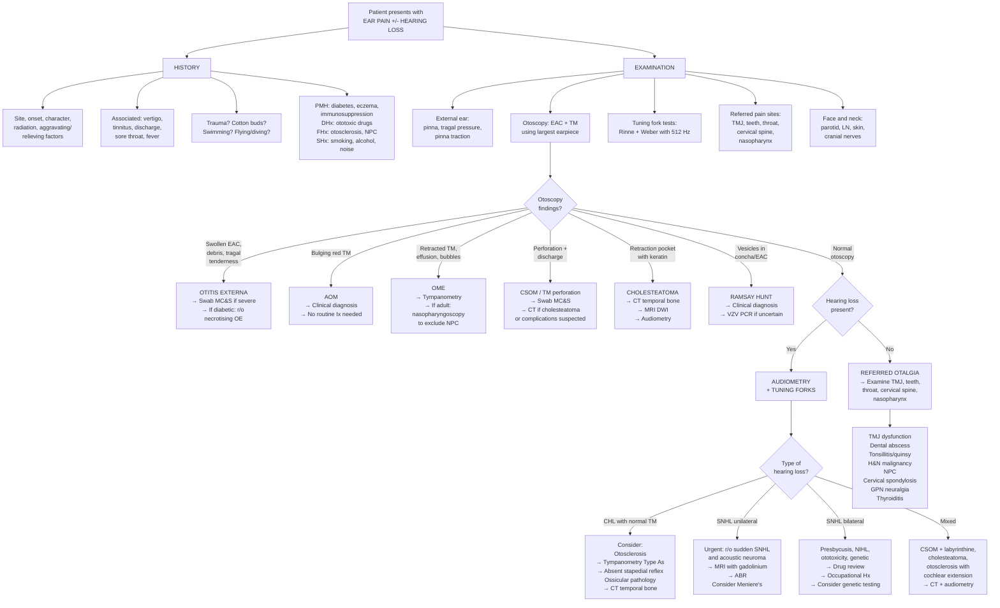

## Diagnostic Criteria, Algorithm and Investigations for Ear Pain and Hearing Loss

Most ear diagnoses are **clinical** — made by careful history and otoscopy. Formal "diagnostic criteria" exist only for select conditions. The key principle is: ***investigations are seldom necessary*** [1]. However, when they are needed, you must know exactly what to order and how to interpret the results.

---

### 1. Diagnostic Criteria for Key Conditions

#### 1.1 Acute Otitis Media (AOM) — AAP/AAFP Guidelines (2013, reaffirmed 2023)

AOM is a **clinical diagnosis**. There is no blood test or imaging that confirms it. The diagnosis rests on three pillars:

**Definite AOM requires ALL of:**
1. **Acute onset** of symptoms (ear pain, irritability in infants, fever)
2. **Middle ear effusion** — evidenced by any of:
   - Bulging TM (best single predictor)
   - Limited or absent TM mobility (pneumatic otoscopy)
   - Air-fluid level or bubbles behind TM
   - Otorrhoea not due to otitis externa
3. **Signs of middle ear inflammation** — evidenced by any of:
   - Distinct erythema of the TM
   - Otalgia (ear pain that interferes with normal activity or sleep)

> **Why does the TM bulge?** Because bacterial infection in the middle ear produces purulent exudate → positive pressure builds up in a closed space (Eustachian tube is already oedematous and blocked) → TM is pushed outward.

<Callout title="Diagnostic Tip" type="idea">
***The pain of otitis media may be masked by fever in babies and young children*** [1]. In pre-verbal children, look for irritability, pulling at the ear, and feeding difficulty rather than relying on a pain history. Otoscopy is essential.
</Callout>

**Distinguishing AOM from Otitis Media with Effusion (OME):**

| Feature | AOM | OME |
|---|---|---|
| Acute symptoms (pain, fever) | Present | Absent or minimal |
| TM appearance | Bulging, erythematous, opaque | Retracted or neutral, dull, amber/grey; air-fluid level or bubbles |
| TM mobility | Reduced or absent | Reduced |
| Middle ear effusion | Yes (purulent) | Yes (serous/mucoid) |
| Treatment | ± Antibiotics | Watchful waiting; exclude NPC in adults |

#### 1.2 Otitis Externa — Clinical Diagnosis

No formal criteria exist. Diagnosis is clinical based on:
- **Rapid onset** (generally within 48 hours) of:
  - Ear canal pain (otalgia), tenderness, fullness
  - **Tragal tenderness and/or pinna traction pain** (distinguishes OE from middle ear pathology — in AOM, tragal pressure does NOT worsen pain because the inflammation is behind the TM, not in the canal)
- **Otoscopic findings**: diffuse EAC oedema, erythema, debris/discharge; TM may be obscured but is normal if visualised
- ± Hearing loss (if canal is significantly oedematous or occluded by debris)

> **Why is tragal tenderness specific to OE?** Pressing the tragus compresses the anterior cartilaginous EAC wall inward against inflamed canal skin. In AOM, the canal skin is normal — it is the TM and middle ear mucosa that are inflamed, which are not affected by tragal pressure.

#### 1.3 Necrotising (Malignant) Otitis Externa — Clinical + Radiological Diagnosis

Suspect when:
1. **Severe, disproportionate otalgia** in an **elderly diabetic or immunocompromised** patient
2. **Granulation tissue** at the bone-cartilage junction of the EAC floor on otoscopy
3. **Failure to respond** to standard OE treatment (topical antibiotics for >1–2 weeks)
4. **Cranial nerve involvement** (CN VII earliest and most common, then IX, X, XI, XII — progressive skull base osteomyelitis)
5. **Elevated inflammatory markers**: ESR > 70 mm/h, raised CRP
6. **Imaging confirmation**: CT temporal bone (bony erosion); Tc-99m bone scan or Ga-67 scan (uptake at skull base); MRI for soft tissue extension

> **Why granulation tissue at the bone-cartilage junction?** This is the fissures of Santorini — natural clefts in the cartilaginous floor of the EAC where soft tissue is in direct contact with the periosteum. *Pseudomonas aeruginosa* uses these gaps to spread from the soft tissue directly into the temporal bone periosteum, initiating osteomyelitis. The granulation tissue represents the body's attempt to wall off this advancing infection.

#### 1.4 Cholesteatoma — Clinical + Radiological Diagnosis

| Feature | Finding |
|---|---|
| **Otoscopy** | Retraction pocket (usually posterosuperior pars flaccida / attic region) filled with white keratinous debris; marginal or attic perforation; foul-smelling discharge |
| **Audiometry** | Conductive hearing loss (ossicular erosion); mixed loss if labyrinthine involvement |
| **CT temporal bone** | Soft tissue mass in middle ear/epitympanum/mastoid with bony erosion (scutum erosion is classic); look for tegmen erosion, lateral SCC fistula, facial canal dehiscence |
| **MRI (DWI)** | Non-echo-planar DWI distinguishes cholesteatoma (restricts diffusion — bright on DWI) from granulation tissue/inflammatory tissue; increasingly used for surgical planning and post-operative surveillance to detect residual/recurrent disease |

#### 1.5 Ménière's Disease — AAO-HNS Diagnostic Criteria (2015)

"Ménière" comes from Prosper Ménière, who first attributed vertigo to the inner ear rather than the brain.

**Definite Ménière's disease:**
1. **Two or more spontaneous episodes of vertigo**, each lasting **20 minutes to 12 hours**
2. **Audiometrically documented low-to-medium frequency sensorineural hearing loss** in the affected ear on at least one occasion before, during, or after one of the episodes of vertigo
3. **Fluctuating aural symptoms** (hearing loss, tinnitus, aural fullness) in the affected ear
4. **Not better accounted for** by another vestibular diagnosis

**Probable Ménière's disease:**
- Two or more episodes of vertigo/dizziness lasting 20 min to 24 hours
- Fluctuating aural symptoms in the affected ear
- Not better accounted for by another diagnosis

> **Why low-to-medium frequency SNHL initially?** Endolymphatic hydrops preferentially distorts the apical cochlea (which transduces low frequencies) because the membranous labyrinth is most distensible there. As disease progresses, higher frequencies are also affected.

#### 1.6 Sudden Sensorineural Hearing Loss (Sudden SNHL) — Definition

- **≥30 dB sensorineural hearing loss** in **≥3 contiguous audiometric frequencies** within **72 hours**
- This is a clinical definition used internationally (AAO-HNS 2019 guideline)
- Treated as an **ENT emergency** — analogous to a "cochlear stroke" because the labyrinthine artery is an end artery

#### 1.7 Otosclerosis — Audiological + Clinical Diagnosis

No formal criteria set, but the diagnosis is made by the constellation of:
1. **Progressive conductive hearing loss** (usually bilateral but asymmetric), young adult (20–40 years), more common in females
2. **Family history** (autosomal dominant with variable penetrance)
3. **Normal otoscopy** (TM and EAC look normal — the pathology is at the stapes footplate, invisible on otoscopy)
4. **Audiometry**: conductive hearing loss with characteristic **Carhart's notch** (dip in bone conduction at 2 kHz)
5. **Tympanometry**: **Type As** (reduced peak compliance / shallow peak) — because the stapes is fixed, the entire ossicular chain is stiffened, reducing TM compliance
6. **Absent stapedial reflex** (the stapes cannot move, so no reflex contraction is recorded)

> **Why Carhart's notch at 2 kHz?** It is NOT true sensorineural loss. The middle ear has a natural resonance around 2 kHz. Stapes fixation disrupts this resonance, causing an artefactual dip in bone conduction thresholds at that frequency. After successful stapes surgery, the notch disappears — confirming it was mechanical, not cochlear.

#### 1.8 Vestibular Schwannoma (Acoustic Neuroma) — Radiological Diagnosis

- **MRI with gadolinium** is the gold standard — shows an enhancing mass at the cerebellopontine angle (CPA) centred on the internal auditory meatus (IAM)
- Suspected when: unilateral progressive SNHL, unilateral tinnitus, disproportionately poor speech discrimination relative to pure-tone thresholds
- **ABR**: prolonged wave I–V interpeak latency (because the tumour compresses CN VIII, slowing neural conduction); sensitivity ~90% for tumours > 1 cm but misses small tumours → MRI preferred

---

### 2. Comprehensive Diagnostic Algorithm

The following algorithm systematises the clinical approach from presentation to diagnosis:

---

### 3. Investigation Modalities — Key Findings and Interpretations

#### 3.1 Bedside Investigations

##### 3.1.1 Otoscopy

***Inspect both empty ear canals and tympanic membrane (TM) with the auroscope using the largest possible earpiece*** [1]

> **Why the largest earpiece?** A larger speculum provides a wider field of view for examining the EAC and TM. It also creates a better seal, which matters if you are using a pneumatic otoscope to assess TM mobility (essential for distinguishing AOM from OME).

| Finding | Interpretation | Underlying Pathophysiology |
|---|---|---|
| Erythematous, oedematous EAC with debris | Otitis externa | Infection/inflammation of canal skin; debris = desquamated epithelium + exudate |
| Granulation tissue at bone-cartilage junction | Necrotising OE | Osteomyelitis at fissures of Santorini; attempted healing with granulation |
| Bulging, erythematous, opaque TM | AOM | Purulent effusion under positive pressure pushing TM outward |
| Retracted TM with fluid level / bubbles behind | OME | Negative middle ear pressure (Eustachian tube dysfunction) → transudation |
| Central perforation with mucopurulent discharge | CSOM (tubotympanic / safe type) | Chronic infection through non-marginal perforation; "safe" because less risk of cholesteatoma |
| Marginal/attic perforation with keratin debris | Cholesteatoma (atticoantral / unsafe type) | Keratinising squamous epithelium in retraction pocket; "unsafe" because erodes bone |
| Vesicles on TM / concha | Ramsay Hunt or bullous myringitis | VZV reactivation (Ramsay Hunt) or viral/Mycoplasma infection (bullous myringitis) |
| Blue/dark TM | Haemotympanum | Blood in middle ear — trauma, basal skull fracture |
| White patches (tympanosclerosis) | Previous inflammation / healed AOM | Hyaline degeneration and calcification of the fibrous layer of TM |
| Normal TM | Does NOT exclude pathology — consider referred otalgia, otosclerosis, inner ear disease, retrocochlear pathology | The TM and EAC are normal in otosclerosis, SNHL, and all causes of referred otalgia |

##### 3.1.2 Pneumatic Otoscopy

- A sealed otoscope with a rubber bulb allows the examiner to apply positive and negative pressure against the TM
- **Normal**: TM moves freely with applied pressure
- **Effusion (AOM/OME)**: TM mobility is **reduced or absent** because fluid behind the TM dampens movement
- **Perforation**: no seal can be maintained; air escapes through the hole
- Considered the **most accurate bedside method** for detecting middle ear effusion (sensitivity ~94% when performed correctly)

##### 3.1.3 Tuning Fork Tests (512 Hz)

Already covered in prior sections but critical to include in the diagnostic algorithm:

| Test | Technique | Normal | CHL | SNHL |
|---|---|---|---|---|
| **Rinne** | Fork on mastoid then beside ear | AC > BC (positive) | BC > AC on affected side (negative) | AC > BC bilaterally (positive) |
| **Weber** | Fork on vertex | Midline | Lateralises to affected ear | Lateralises to better ear |

> **False negative Rinne**: In severe unilateral SNHL ("dead ear"), bone conduction of the affected side is heard by the contralateral (good) cochlea via transcranial transmission → appears as BC > AC (falsely suggesting CHL). Weber test resolves this: lateralisation to the normal ear confirms SNHL, not CHL.

##### 3.1.4 Whispered Voice Test / Free-Field Voice Test

- Stand at arm's length (~60 cm) behind the patient, occlude and mask the non-test ear by rubbing the tragus
- Whisper a combination of numbers and letters; ask patient to repeat
- Normal: can repeat whispered voice at 60 cm (roughly equivalent to ~20–30 dB hearing threshold)
- Sensitivity ~80–90% for detecting moderate hearing loss; limited for mild loss
- Useful as a quick screening tool but NOT a substitute for formal audiometry

#### 3.2 Audiological Investigations

##### 3.2.1 Pure Tone Audiometry (PTA)

***Consider hearing tests, audiometry*** [1]

This is the **gold standard** for quantifying hearing loss and classifying it as conductive, sensorineural, or mixed.

**Principle:**
- Tones of specific frequencies (typically 250 Hz to 8000 Hz) are presented at increasing intensity
- **Air conduction (AC)**: tested with headphones/earphones — sound travels through the whole pathway (external ear → middle ear → cochlea → CN VIII)
- **Bone conduction (BC)**: tested with a bone vibrator on the mastoid process — sound bypasses the external and middle ear, directly stimulating the cochlea through skull bone vibration

**Interpretation:**

| Audiometric Pattern | Diagnosis | Explanation |
|---|---|---|
| **Air-bone gap** (AC thresholds worse than BC) | Conductive hearing loss | The conductive apparatus (EAC/middle ear) is impaired; the cochlea works normally, so BC is normal but AC is elevated |
| **BC and AC both elevated, no air-bone gap** | Sensorineural hearing loss | The cochlea or CN VIII is damaged; both routes deliver sound to the same damaged cochlea |
| **Air-bone gap + elevated BC** | Mixed hearing loss | Both conductive and sensorineural components present |
| **4 kHz notch** (dip at 4 kHz, recovery at 8 kHz) | Noise-induced hearing loss | 4 kHz is the most vulnerable frequency due to EAC resonance amplification (~2.5 kHz) + middle ear transfer function pushing peak energy to 3–4 kHz; hair cells at this tonotopic region are preferentially destroyed |
| **Carhart's notch** (dip in BC at 2 kHz) | Otosclerosis | Artefactual — stapes fixation disrupts middle ear resonance at ~2 kHz; disappears after successful stapes surgery |
| **Low-frequency SNHL** | Ménière's disease (early) | Endolymphatic hydrops distorts the apical cochlea (low-frequency region) first |
| **Bilateral symmetric high-frequency SNHL** with gradual down-sloping | Presbycusis | Progressive loss of basal cochlear hair cells (high-frequency end) |
| **Flat SNHL** | Metabolic presbycusis (stria vascularis atrophy), autoimmune inner ear disease | Uniform cochlear damage |
| **Asymmetric SNHL + poor speech discrimination** | Retrocochlear (vestibular schwannoma) | Neural compression → disproportionate impairment of speech processing (which requires fine temporal coding) |

**Speech Audiometry:**
- Tests the ability to understand words at comfortable listening levels
- **Speech discrimination score (SDS) / word recognition score**: percentage of correctly repeated words
- **Key interpretation**: a disproportionately low SDS relative to the pure-tone average strongly suggests **retrocochlear** pathology (e.g., vestibular schwannoma) — because the tumour disrupts the neural coding needed for speech, beyond what pure-tone loss would predict

##### 3.2.2 Tympanometry (Impedance Audiometry)

**Principle:** Measures the compliance (mobility) of the TM and middle ear system by varying air pressure in the sealed EAC and measuring sound reflected back from the TM. A compliant TM absorbs more sound (less reflection); a stiff TM reflects more.

| Tympanogram Type | Appearance | Interpretation | Pathology |
|---|---|---|---|
| **Type A** | Normal-shaped peak centred at 0 daPa | Normal middle ear function | Normal |
| **Type As** | Shallow/reduced peak height at 0 daPa | Reduced TM/ossicular compliance → stiff system | **Otosclerosis**, tympanosclerosis |
| **Type Ad** | Very tall/sharp peak at 0 daPa | Excessive TM/ossicular compliance → hypermobile system | Ossicular discontinuity, healed TM (thin scar) |
| **Type B** | Flat tracing, no identifiable peak | No TM mobility at any pressure | **Middle ear effusion** (OME, AOM), cerumen against probe, TM perforation (if high canal volume) |
| **Type C** | Peak shifted to negative pressure (< -100 daPa) | Negative middle ear pressure | **Eustachian tube dysfunction** (early OME, retracted TM) |

> **Why does effusion cause a flat (Type B) tympanogram?** Fluid in the middle ear essentially eliminates the air space behind the TM. Without compressible air, the TM cannot vibrate regardless of the pressure applied — hence no compliance peak.

> **How to distinguish perforation from effusion on Type B?** Look at the **ear canal volume**. If the TM is perforated, the probe "sees" the entire middle ear space → abnormally **large** canal volume. If the TM is intact with fluid behind it → **normal or small** canal volume.

##### 3.2.3 Acoustic Reflex Testing (Stapedial Reflex)

**Principle:** Loud sound (70–100 dB above hearing threshold) triggers a bilateral contraction of the stapedius muscle (innervated by CN VII), stiffening the ossicular chain. This reflex is measured as a sudden change in TM impedance.

| Finding | Interpretation |
|---|---|
| Normal reflex thresholds | Normal middle ear and CN VII/VIII function |
| **Absent reflexes** ipsilaterally | Otosclerosis (stapes fixed → cannot move), severe CHL, severe SNHL |
| **Elevated reflex thresholds** | Retrocochlear pathology (acoustic neuroma — reflex decay test shows abnormal adaptation) |
| **Reflex decay** (reflex amplitude drops > 50% within 10 seconds) | Retrocochlear lesion — nerve fatigue from CN VIII compression; highly suggestive of acoustic neuroma |

##### 3.2.4 Otoacoustic Emissions (OAE)

**Principle:** Healthy outer hair cells (OHC) actively amplify sounds within the cochlea. As a byproduct, they generate tiny sounds that travel backward through the middle ear and can be detected by a sensitive microphone in the EAC. These are otoacoustic emissions.

| Type | Method | Clinical Use |
|---|---|---|
| **Transient evoked OAE (TEOAE)** | Brief click stimulus → records OHC response | Neonatal hearing screening (universal newborn screening); quick pass/fail |
| **Distortion product OAE (DPOAE)** | Two tones → records distortion product from OHC nonlinearity | Frequency-specific assessment of OHC function; monitoring ototoxicity |

| Finding | Interpretation |
|---|---|
| **OAE present** | Outer hair cells functional → cochlea likely normal (hearing loss, if present, is conductive or retrocochlear) |
| **OAE absent** | Outer hair cell dysfunction → cochlear SNHL; OR significant conductive loss blocking the emission from reaching the microphone |
| **OAE present + abnormal ABR** | Auditory neuropathy spectrum disorder — cochlea works (OHC intact) but neural transmission is disrupted |

> **Why are OAEs used for neonatal screening?** Neonates cannot cooperate for behavioural audiometry. OAEs are objective, fast (~2 minutes), and non-invasive. If OAEs are absent, the baby is referred for ABR to confirm and characterise the hearing loss.

##### 3.2.5 Auditory Brainstem Response (ABR / BERA)

**Principle:** Clicks or tone bursts are delivered via earphones while surface electrodes on the scalp record electrical activity from the auditory pathway. Five characteristic waves (I–V) are generated from different anatomical stations:

| Wave | Anatomical Generator |
|---|---|
| I | Distal cochlear nerve (near cochlea) |
| II | Proximal cochlear nerve (near brainstem) |
| III | Cochlear nucleus (pons) |
| IV | Superior olivary complex (pons) |
| V | Lateral lemniscus / inferior colliculus (midbrain) |

| Finding | Interpretation |
|---|---|
| **Normal ABR** | Normal auditory pathway from cochlea to midbrain |
| **Prolonged I–III interpeak latency** | Lesion between distal nerve and pons → **CN VIII pathology** (acoustic neuroma) |
| **Prolonged I–V interpeak latency** | Retrocochlear pathology (acoustic neuroma, demyelination) |
| **Absent waves** | Severe SNHL, auditory neuropathy, brainstem death |
| **Normal OAE + absent/abnormal ABR** | Auditory neuropathy spectrum disorder (synaptopathy/neuropathy) |

> **Why is ABR used to screen for acoustic neuroma?** The tumour compresses CN VIII → slows neural conduction → prolonged interpeak latencies. However, MRI is more sensitive for small tumours, so ABR is now primarily used for threshold estimation in infants and for detecting auditory neuropathy, rather than as the primary screening tool for acoustic neuroma.

#### 3.3 Imaging

##### 3.3.1 CT Temporal Bone (HRCT)

**Indication:** Cholesteatoma, mastoiditis, necrotising OE, temporal bone fracture, congenital anomalies, pre-operative planning

| Finding | Diagnosis |
|---|---|
| Soft tissue mass in epitympanum/mastoid with bony erosion (scutum blunting, ossicular erosion) | Cholesteatoma |
| Opacified mastoid air cells with loss of bony septae (coalescence) | Coalescent mastoiditis |
| Bony erosion of EAC floor / skull base | Necrotising OE |
| Fracture line through temporal bone | Temporal bone fracture (longitudinal vs. transverse vs. mixed) |
| Lucency around oval window (halo sign) | Otosclerosis (fenestral type) |

> **Longitudinal vs. transverse temporal bone fracture** — why it matters:
> - **Longitudinal** (~80%): fracture along the long axis of the petrous bone; typically spares the otic capsule → CHL (ossicular disruption, haemotympanum), EAC laceration, possible facial palsy (10–20%, often delayed/incomplete)
> - **Transverse** (~20%): fracture across the petrous bone through the otic capsule → **SNHL** (cochlear damage), vertigo, facial palsy (50%, often immediate/complete), CSF otorrhoea

##### 3.3.2 MRI

**Indication:** Suspected retrocochlear pathology (acoustic neuroma), intracranial complications of ear disease, cholesteatoma surveillance

| Sequence | Finding | Diagnosis |
|---|---|---|
| **T1 + gadolinium** | Enhancing CPA mass in IAM | Vestibular schwannoma |
| **T1 + gadolinium** | Enhancing middle cranial fossa / mastoid mass | Intracranial complication of cholesteatoma/mastoiditis |
| **Non-echo-planar DWI** | Restricted diffusion (bright) in middle ear/mastoid | Cholesteatoma (keratin restricts diffusion); distinguishes from granulation tissue |
| **T2 / CISS sequence** | High-resolution image of IAM and labyrinth; fluid-filled spaces appear bright | Endolymphatic hydrops (dilated endolymphatic space with gadolinium-enhanced MRI in Ménière's); labyrinthine anatomy |

##### 3.3.3 Nuclear Medicine

| Scan | Indication | Finding |
|---|---|---|
| **Tc-99m bone scan** | Necrotising OE | Increased uptake at skull base — sensitive for osteomyelitis but not specific |
| **Ga-67 scan** | Necrotising OE — monitoring treatment response | Normalises with successful treatment (unlike Tc-99m which may remain positive due to ongoing bone remodelling); useful to determine when to stop antibiotics |

#### 3.4 Other Investigations

##### 3.4.1 Ear Swab for Microscopy, Culture and Sensitivity (MC&S)

***Any ear discharge for MC but swabs of no value if the TM is intact*** [1]

> **Why are swabs useless with an intact TM?** If the TM is intact, any swab from the EAC will only culture **normal skin commensals** (coagulase-negative staphylococci, diphtheroids, etc.) — not the causative organism in the middle ear. Swabs are only valuable when there is discharge, i.e., the TM is perforated or there is active OE.

| Scenario | Likely Organisms |
|---|---|
| Otitis externa | *Pseudomonas aeruginosa* (most common), *S. aureus*, fungi (*Aspergillus*, *Candida*) |
| AOM with perforated TM | *S. pneumoniae*, *H. influenzae*, *M. catarrhalis* |
| CSOM | Mixed flora: *Pseudomonas*, *Proteus*, *S. aureus*, anaerobes (*Bacteroides*, *Peptostreptococcus*) |
| Fungal OE (otomycosis) | *Aspergillus niger* (black spores), *Candida* (white/creamy) |

##### 3.4.2 Nasopharyngoscopy

**Indication:** Unilateral OME in an adult (especially in Hong Kong) → ***must exclude NPC*** [2]

- Flexible nasopharyngolaryngoscopy: passed through the nose to visualise the nasopharynx, including the fossa of Rosenmüller, Eustachian tube orifices, and posterior choanae
- Any suspicious mass → biopsy for histology; send **EBV VCA IgA** and **plasma EBV DNA** [2]

##### 3.4.3 Blood Investigations (Guided by Clinical Suspicion)

| Test | When to Order | Interpretation |
|---|---|---|
| **FBG / HbA1c** | Severe OE or suspected necrotising OE | Undiagnosed diabetes; poor glycaemic control predisposes to necrotising OE |
| **ESR / CRP** | Necrotising OE, suspected malignancy, vasculitis | Markedly elevated in necrotising OE and GCA |
| **EBV VCA IgA, plasma EBV DNA** | Suspected NPC [2] | Elevated in NPC; used for screening and monitoring |
| **Syphilis serology (VDRL/RPR, TPHA)** | Unexplained SNHL, especially bilateral | Syphilis (congenital or acquired) can cause SNHL |
| **TFTs** | Unexplained SNHL, especially with goitre | Pendred syndrome (genetic SNHL + goitre due to defective pendrin/iodide transport) |
| **Autoimmune panel (ANA, ESR, anti-68kD Ab)** | Bilateral rapidly progressive SNHL in young patient | Autoimmune inner ear disease |
| ***Pure tone audiometry*** [3] | Alport syndrome suspected | Screen for SNHL; ***bilateral high-frequency SNHL*** [3] |
| **Genetic testing** | Family history of SNHL, Alport syndrome features | COL4A3-5 mutations [3]; connexin 26 (GJB2) for congenital SNHL |

##### 3.4.4 Neonatal Hearing Screening

- **Universal newborn hearing screening (UNHS)** is recommended for all neonates before 1 month of age
- **Two-stage protocol**: OAE screening → if fail, repeat → if fail again, diagnostic ABR by 3 months
- **Goal**: early identification → hearing aid fitting by 6 months → optimise speech/language development during the critical period
- **High-risk factors** for congenital SNHL: family history, NICU stay > 5 days, TORCH infections (especially CMV), hyperbilirubinaemia requiring exchange transfusion, craniofacial anomalies, ototoxic drug exposure

---

### 4. Summary of Investigation Selection by Clinical Scenario

| Clinical Scenario | First-Line Investigation | Additional Investigations |
|---|---|---|
| Suspected AOM | Otoscopy (clinical diagnosis) | None routinely; ***investigations seldom necessary*** [1] |
| Otitis externa | Otoscopy (clinical diagnosis) | Swab MC&S if severe/refractory; FBG if suspect necrotising OE |
| Suspected necrotising OE | CT temporal bone + ESR/CRP + FBG | Tc-99m/Ga-67 bone scan; MRI for soft tissue |
| Unilateral OME in adult | Nasopharyngoscopy | EBV DNA/VCA IgA [2]; audiometry; CT nasopharynx |
| Hearing loss — any type | PTA + tympanometry | Guided by type (see algorithm above) |
| Suspected otosclerosis | PTA (CHL, Carhart's notch) + tympanometry (Type As) | CT temporal bone (fenestral lucency); stapedial reflex (absent) |
| Sudden SNHL | Urgent PTA | MRI with gadolinium (r/o acoustic neuroma); blood tests (FBC, ESR, glucose, syphilis, autoimmune) |
| Suspected acoustic neuroma | MRI with gadolinium | ABR; PTA with speech audiometry |
| Cholesteatoma | CT temporal bone | MRI DWI (residual/recurrent); audiometry |
| Ménière's disease | PTA (low-frequency SNHL) | Gadolinium-enhanced MRI (endolymphatic hydrops); electrocochleography |
| Congenital SNHL | OAE → ABR | Genetic testing (connexin 26, Pendred); TORCH serology; CT/MRI temporal bone |

<Callout title="High Yield Summary">

1. **Most ear diagnoses are clinical** — made by history + otoscopy. ***Investigations are seldom necessary*** [1].

2. **AOM diagnostic pillars**: acute onset + middle ear effusion (bulging TM, reduced mobility) + middle ear inflammation (erythema, otalgia). Pneumatic otoscopy is the most accurate bedside tool for detecting effusion.

3. **Audiometry interpretation**: Air-bone gap = CHL; elevated AC and BC without gap = SNHL; both = mixed. Key patterns: 4 kHz notch (NIHL), Carhart's notch at 2 kHz (otosclerosis), low-frequency SNHL (early Ménière's), asymmetric SNHL with poor speech discrimination (acoustic neuroma).

4. **Tympanometry types**: A = normal; As = stiff (otosclerosis); Ad = hypermobile (ossicular discontinuity); B = flat (effusion or perforation — check canal volume to distinguish); C = negative pressure (Eustachian tube dysfunction).

5. **Swabs: only useful if there is discharge** — ***swabs of no value if the TM is intact*** [1].

6. **Unilateral OME in Hong Kong adult** → nasopharyngoscopy + EBV DNA to exclude NPC [2].

7. **Sudden SNHL**: defined as ≥30 dB in ≥3 frequencies within 72 hours. ENT emergency. Urgent PTA + MRI with gadolinium.

8. **Acoustic neuroma workup**: MRI with gadolinium (gold standard); ABR shows prolonged I–V interpeak latency; PTA shows asymmetric SNHL with disproportionately poor speech discrimination.

9. **Necrotising OE**: CT temporal bone (bony erosion) + Tc-99m/Ga-67 scan + ESR/CRP + blood glucose. Ga-67 scan is used to monitor treatment response.

10. **Neonatal screening**: OAE (outer hair cell function) → if fail → ABR (objective threshold estimation). Goal: identify by 1 month, diagnose by 3 months, intervene by 6 months.

</Callout>

---

<ActiveRecallQuiz
  title="Active Recall - Diagnosis of Ear Pain and Hearing Loss"
  items={[
    {
      question: "What are the three diagnostic pillars for acute otitis media?",
      markscheme: "1) Acute onset of symptoms (otalgia, irritability, fever). 2) Evidence of middle ear effusion (bulging TM, reduced TM mobility on pneumatic otoscopy, air-fluid level, otorrhoea). 3) Signs of middle ear inflammation (erythematous TM, significant otalgia interfering with activity/sleep)."
    },
    {
      question: "A patient has a Type As tympanogram, absent stapedial reflexes, and a Carhart notch at 2 kHz on audiometry. What is the diagnosis and explain each finding.",
      markscheme: "Otosclerosis. Type As (shallow peak) = stiff ossicular chain because stapes footplate is fixed, reducing TM compliance. Absent stapedial reflex = fixed stapes cannot move even with stapedius contraction. Carhart notch at 2 kHz = artefactual dip in bone conduction because stapes fixation disrupts middle ear resonance at 2 kHz; it is not true sensorineural loss and resolves after successful stapes surgery."
    },
    {
      question: "Why are ear swabs of no value if the tympanic membrane is intact?",
      markscheme: "If the TM is intact, swabbing the external ear canal will only culture normal skin commensals (coagulase-negative staph, diphtheroids), not the causative organism in the middle ear, which is a sealed compartment behind the intact TM. Swabs are only useful when there is active discharge from OE or from a perforated TM/CSOM."
    },
    {
      question: "Describe the expected tympanogram in: (a) middle ear effusion with intact TM, (b) TM perforation, (c) Eustachian tube dysfunction.",
      markscheme: "(a) Type B flat tracing with normal or small canal volume - fluid eliminates air space so TM cannot vibrate. (b) Type B flat tracing with large canal volume - probe 'sees' entire middle ear through the perforation. (c) Type C - peak shifted to negative pressure (less than -100 daPa) because negative pressure builds up in middle ear due to inadequate Eustachian tube ventilation."
    },
    {
      question: "A patient presents with sudden unilateral hearing loss. What is the definition of sudden SNHL, what urgent investigations are needed, and what must be excluded?",
      markscheme: "Definition: 30 dB or greater sensorineural hearing loss across 3 or more contiguous frequencies developing within 72 hours. Urgent investigations: pure-tone audiometry to confirm and quantify SNHL; MRI with gadolinium to exclude vestibular schwannoma (retrocochlear lesion). Bloods: FBC, ESR/CRP, glucose, syphilis serology, autoimmune screen. Must exclude acoustic neuroma, which can present as sudden SNHL."
    },
    {
      question: "In ABR testing, what does a prolonged wave I-V interpeak latency suggest and why?",
      markscheme: "A prolonged I-V interpeak latency suggests retrocochlear pathology, most importantly vestibular schwannoma (acoustic neuroma). Wave I is generated at the distal cochlear nerve (near cochlea) and wave V at the lateral lemniscus/inferior colliculus. The tumour compresses CN VIII between these anatomical stations, slowing neural conduction and prolonging the interpeak interval."
    }
  ]}
/>

## References

[1] Lecture slides: murtagh merge.pdf (p43–44, "Ear pain")
[2] Senior notes: felixlai.md (Nasopharyngeal cancer section)
[3] Senior notes: Ryan Ho Urogenital.pdf (p57–60, Alport Syndrome)
