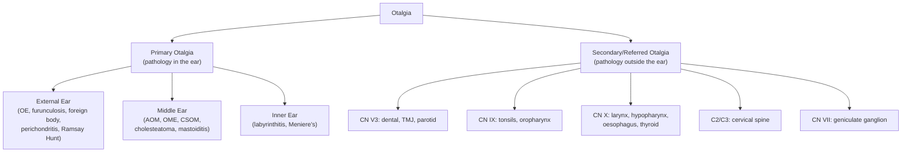

# Ear Pain (Otalgia) and Hearing Loss

## 1. Definition

**Ear pain (otalgia)** refers to pain perceived in or around the ear. It is one of the most common presenting complaints in primary care and ENT clinics. The term derives from the Greek roots: *oto-* = ear, *-algia* = pain.

**Hearing loss** (hypoacusis) is a partial or complete inability to hear sounds in one or both ears. From Greek: *hypo-* = under/reduced, *akousis* = hearing.

Otalgia is broadly divided into two categories:

- **Primary otalgia**: pain originating from pathology within the ear itself (external ear, middle ear, or inner ear).
- **Secondary (referred) otalgia**: pain perceived in the ear but originating from a distant site. This is possible because the ear has one of the richest and most complex sensory nerve supplies of any organ, receiving branches from **five cranial nerves (CN V, VII, IX, X)** and **two cervical nerves (C2, C3)**. Any pathology along the distribution of these nerves can "refer" pain to the ear.

> **Why is referred otalgia so important?** Because in up to 50% of adults presenting with ear pain but a normal otoscopic exam, the cause is referred pain from the teeth, TMJ, cervical spine, throat, or other structures [1].

<Callout title="Clinical Pearl">
***If an adult presents with ear pain but normal auroscopy, examine possible referral sites, namely TMJ, mouth, throat, teeth and cervical spine.*** [1]
</Callout>

Hearing loss is classified into:

- **Conductive hearing loss (CHL)**: impaired sound transmission through the external ear canal, tympanic membrane, or ossicular chain to the oval window.
- **Sensorineural hearing loss (SNHL)**: damage to the cochlea (sensory) or the cochlear nerve/central auditory pathways (neural).
- **Mixed hearing loss**: a combination of both.

---

## 2. Epidemiology

### Ear Pain
- Otalgia is one of the most frequent reasons for GP/paediatric consultations.
- **Acute otitis media (AOM)** is the single most common cause of otalgia in **children**: by age 3, approximately 80% of children will have had at least one episode.
- **Otitis externa** is extremely common, particularly in tropical/subtropical climates like **Hong Kong** (hot, humid summers) and in swimmers ("swimmer's ear").
- In adults, referred otalgia accounts for a significant proportion — studies report 30–50% of adult otalgia is secondary/referred.

### Hearing Loss
- **Global burden**: WHO estimates >1.5 billion people live with some degree of hearing loss (2021 World Report on Hearing).
- **Age-related hearing loss (presbycusis)** is the most common cause of SNHL and the third most common chronic condition in older adults. By age 65, approximately 30% have disabling hearing loss; by age 75, this rises to ~50%.
- In **Hong Kong**, noise-induced hearing loss (NIHL) is a significant occupational hazard, and the ageing population means presbycusis is increasingly prevalent.
- **Congenital SNHL** occurs in approximately 1–3 per 1,000 live births.
- **Nasopharyngeal carcinoma (NPC)**, which is ***endemic in Southern China including Hong Kong*** [2], can present with unilateral conductive hearing loss due to Eustachian tube obstruction — a critical "do not miss" diagnosis.

### Risk Factors

| Category | Ear Pain | Hearing Loss |
|---|---|---|
| **Age** | AOM peaks in children 6–24 months | Presbycusis: progressive >50 years |
| **Environment** | Humid/tropical climate (HK), swimming, water exposure | Occupational noise, recreational noise (concerts, earbuds) |
| **Anatomical** | Narrow ear canals, craniofacial abnormalities, cleft palate | Eustachian tube dysfunction, chronic OM |
| **Infections** | URTI (precedes AOM), immunosuppression | Congenital TORCH, meningitis, chronic OM |
| **Habits** | ***Use of cotton buds to clean the ear*** [1], ear piercing | Prolonged earphone use at high volume |
| **Genetic** | — | Alport syndrome, Pendred syndrome, connexin 26 mutations, otosclerosis (family history) |
| **Drugs (ototoxicity)** | — | Aminoglycosides, loop diuretics, cisplatin, high-dose aspirin |
| **Other** | ***Depression, spinal dysfunction (cervical)*** [1]; dental pathology, TMJ dysfunction | NPC (HK-endemic), cholesteatoma, Ménière's disease, acoustic neuroma |

<Callout title="Hong Kong High Yield" type="idea">
In any Hong Kong patient with **unilateral serous otitis media** (especially an adult male), you MUST exclude **nasopharyngeal carcinoma** with a post-nasal space examination ± nasopharyngoscopy. NPC is endemic here and classically presents late because the nasopharynx is a "clinically occult site" [2].
</Callout>

---

## 3. Anatomy and Physiology of the Ear

Understanding ear anatomy is essential because it directly explains:
- Why certain pathologies cause pain vs. hearing loss vs. both
- Why referred pain patterns exist
- How to localise a lesion based on clinical features

### 3.1 External Ear

**Structure:**
- **Pinna (auricle)**: elastic cartilage covered by skin. Functions as a sound-collecting funnel. The lobule (earlobe) contains no cartilage — just fat and connective tissue.
- **External auditory canal (EAC)**: ~2.5 cm long in adults. The lateral one-third is **cartilaginous** (contains ceruminous glands that produce wax, and hair follicles); the medial two-thirds is **bony** (thin skin directly on periosteum — very sensitive to pain, which is why even minor infections here are exquisitely painful).
- **Tympanic membrane (TM)**: a thin, semi-translucent membrane separating the EAC from the middle ear. It has three layers: outer squamous epithelium, middle fibrous layer, and inner mucosal layer.

**Nerve Supply of the External Ear** — this is the key to understanding referred otalgia:

| Nerve | Origin | Area Supplied | Referred Pain Source |
|---|---|---|---|
| **Auriculotemporal nerve** (V3) | Mandibular division of trigeminal | Anterior EAC, anterosuperior pinna, TM (outer) | Teeth, TMJ, parotid, oral cavity |
| **Greater auricular nerve** (C2, C3) | Cervical plexus | Posterior pinna, lobule, skin over mastoid | Cervical spine pathology |
| **Arnold's nerve** (CN X, vagus) | Vagus nerve (auricular branch) | Posterior EAC, concha, posterior TM | Larynx, pharynx, oesophagus, lung |
| **Nerve of Jacobson** (CN IX) | Glossopharyngeal | TM (medial surface), middle ear mucosa | Oropharynx, tonsils, tongue base |
| **Sensory branch of CN VII** | Facial nerve | Concha, posterior EAC (zone of Ramsay Hunt) | — |

> **Why does throat cancer cause ear pain?** Because the glossopharyngeal nerve (CN IX) supplies both the tonsillar fossa/base of tongue AND the medial surface of the TM. Cancers of the oropharynx or hypopharynx irritate CN IX, and the brain "misinterprets" the signal as coming from the ear.

> **Why does coughing sometimes occur during ear syringing?** Arnold's nerve (vagus) in the posterior EAC can trigger a vagal reflex (Arnold's reflex) causing coughing, and rarely bradycardia or syncope.

### 3.2 Middle Ear

**Structure:**
- An air-filled cavity (tympanic cavity) within the temporal bone, containing the **three ossicles**: malleus, incus, and stapes — the smallest bones in the body.
- The ossicular chain amplifies sound ~22× from TM to oval window (area ratio amplification + lever effect).
- **Eustachian tube (pharyngotympanic tube)**: connects the middle ear to the nasopharynx. In adults, it is ~36 mm long, running inferomedially. Functions: pressure equalization, mucociliary clearance, protection from nasopharyngeal secretions.
  - In **children**, the Eustachian tube is shorter, more horizontal, and floppier → easier for pathogens from the nasopharynx to ascend → explains why AOM is so common in children.
- **Mastoid air cells**: communicate with the middle ear via the aditus ad antrum. Infection can spread here → mastoiditis.

**Important relations:**
- Roof (tegmen tympani) → middle cranial fossa (infection can cause intracranial complications)
- Floor → jugular bulb
- Posterior wall → mastoid air cells
- Medial wall → inner ear (promontory overlying cochlear basal turn; oval window; round window)
- Anterior wall → carotid canal, Eustachian tube

**Nerve running through the middle ear:**
- **Chorda tympani** (branch of CN VII): runs across the medial surface of the TM, between the malleus and incus. Carries taste from the anterior 2/3 of the tongue and parasympathetic fibres to submandibular/sublingual glands. Can be damaged in middle ear surgery or chronic otitis media → loss of taste on ipsilateral anterior tongue.

### 3.3 Inner Ear

The inner ear sits within the petrous part of the temporal bone and contains two functional divisions:

**a) Cochlea (Hearing)**
- A spiral, snail-shaped structure (~2.5 turns) containing the **Organ of Corti** — the sensory transducer for hearing.
- Sound waves transmitted via the stapes to the oval window → perilymph vibrations in the scala vestibuli → endolymph vibrations in the scala media (cochlear duct) → movement of the basilar membrane → shearing of stereocilia on inner and outer hair cells against the tectorial membrane → mechano-electrical transduction → nerve impulses via the cochlear nerve (CN VIII).
- **Tonotopic organization**: high-frequency sounds are detected at the **base** of the cochlea; low-frequency sounds at the **apex**. This is why noise-induced hearing loss and presbycusis (which damage basal hair cells first) initially affect high frequencies.
- The Organ of Corti is connected to the basilar membrane via **type IV collagen (α3-4-5 network)**. In **Alport syndrome**, mutations in COL4A3-5 lead to ***bilateral sensorineural hearing loss, beginning in high frequency range and progress to affect lower frequencies*** due to ***decreased adhesion of Organ of Corti to basilar membrane via defective α-3-4-5 collagen IV fibres*** [3].

**b) Vestibular apparatus (Balance)**
- **3 semicircular canals** (superior, posterior, lateral): detect angular/rotational acceleration.
- **Utricle and saccule** (otolith organs): detect linear acceleration and gravity.
- Vestibular dysfunction causes vertigo, nausea, and nystagmus — which can co-exist with hearing loss and ear pain in certain conditions (e.g., Ménière's disease, labyrinthitis).

### 3.4 The Auditory Pathway

External ear → TM → ossicles → oval window → cochlea (inner ear) → cochlear nerve (CN VIII) → cochlear nuclei (pons) → superior olivary complex → lateral lemniscus → inferior colliculus → medial geniculate body (thalamus) → auditory cortex (Heschl's gyrus, superior temporal gyrus).

Understanding this pathway explains why:
- External/middle ear pathology → **conductive** hearing loss
- Cochlear pathology → **sensorineural** hearing loss (sensory type)
- CN VIII / central pathway pathology → **sensorineural** hearing loss (neural/retrocochlear type)

---

## 4. Etiology (Focus on Hong Kong)

### 4.1 Primary Otalgia — Causes Organized by Anatomical Site

#### 4.1.1 External Ear

| Condition | Key Features | Pathophysiology |
|---|---|---|
| **Otitis externa (OE)** | Most common cause of primary otalgia in adults; pain worse with tragal pressure/pinna traction; ear canal erythema, oedema, discharge | Infection of EAC skin (usually *Pseudomonas aeruginosa* or *S. aureus*); disruption of protective cerumen/epithelial barrier (water exposure, trauma from cotton buds, eczema) → bacterial invasion of skin/soft tissue |
| **Malignant (necrotizing) otitis externa** | Severe OE in elderly diabetics or immunocompromised; granulation tissue at bone-cartilage junction of EAC floor; can involve skull base → CN palsies (VII most common, then IX, X, XI, XII) | *Pseudomonas aeruginosa* invades from soft tissue into periosteum and bone → osteomyelitis of temporal bone and skull base; immunocompromise + microangiopathy in diabetes allows rapid spread |
| **Furunculosis** | Very painful, localized swelling in lateral (cartilaginous) EAC | Infection of a hair follicle (usually *S. aureus*); only occurs in lateral EAC because that is where hair follicles are |
| **Herpes zoster oticus (Ramsay Hunt syndrome)** | Vesicular eruption on pinna/EAC + ipsilateral facial nerve palsy ± SNHL, vertigo, tinnitus | VZV reactivation in the geniculate ganglion of CN VII → inflammation and damage to facial nerve; can spread to CN VIII → cochleovestibular symptoms |
| **Perichondritis** | Painful, red, swollen pinna (spares the lobule, which has no cartilage); can progress to abscess and "cauliflower ear" | Infection of perichondrium (usually *Pseudomonas* or *S. aureus*) after trauma, ear piercing through cartilage, or burns → compromised blood supply to cartilage (avascular, depends on perichondrium) → necrosis |
| ***Chondrodermatitis nodularis helicis*** [1] | Painful, small nodule on the helix or antihelix; exquisitely tender; worsens with pressure (sleeping on that side) | Pressure-induced ischaemic necrosis of cartilage with secondary inflammation and perichondritis; common in older males |
| **Foreign body** | Pain, discharge, hearing loss; common in children | Mechanical irritation, impaction, secondary infection of surrounding skin |
| **Impacted cerumen** | Dull ache, fullness, conductive hearing loss | Excessive/impacted wax presses on sensitive bony EAC skin; complete occlusion blocks sound conduction |
| **Trauma** | Pain after direct blow, barotrauma (diving, flying), or instrumentation (cotton buds) | Direct tissue damage; barotrauma → inability to equalize pressure → TM stretching/rupture |
| **Neoplasia** | SCC of EAC/pinna (most common malignancy); persistent otalgia, bleeding, granulation tissue | Malignant invasion of periosteum and bone → pain via periosteal nociceptors |

#### 4.1.2 Middle Ear

| Condition | Key Features | Pathophysiology |
|---|---|---|
| **Acute otitis media (AOM)** | Most common cause of otalgia in children; severe, deep ear pain; fever; bulging, erythematous TM; ***the pain of otitis media may be masked by fever in babies and young children*** [1] | URTI → Eustachian tube inflammation and oedema → negative middle ear pressure → fluid accumulation → secondary bacterial infection (*S. pneumoniae*, *H. influenzae*, *M. catarrhalis*) → pus under pressure → stretching of TM (highly innervated) → pain |
| **Otitis media with effusion (OME / "glue ear")** | Usually painless or mild discomfort; conductive hearing loss; retracted or dull TM with fluid level/bubbles | Eustachian tube dysfunction → negative middle ear pressure → transudation of fluid into middle ear → "glue-like" mucoid effusion impedes TM and ossicular vibration |
| **Chronic suppurative otitis media (CSOM)** | Chronic (>6 weeks) ear discharge through a persistent TM perforation; usually painless unless complications arise | Chronic mucosal infection/inflammation; pain suggests complication (mastoiditis, cholesteatoma, intracranial extension) |
| **Cholesteatoma** | Foul-smelling discharge, hearing loss, may be painless; retraction pocket or marginal perforation with keratinous debris | Abnormal keratinizing squamous epithelium in middle ear/mastoid; produces collagenases and other enzymes → erosion of ossicles, tegmen, lateral semicircular canal; can erode facial nerve canal → facial palsy |
| **Acute mastoiditis** | Post-auricular swelling, erythema, tenderness; pinna pushed forward and outward; deep ear pain; fever | Spread of AOM to mastoid air cells → suppuration → destruction of bony septae → coalescent mastoiditis; can form subperiosteal abscess; can extend intracranially |
| **Barotrauma** | Sharp ear pain during descent in flying/diving; hearing loss, vertigo | Failure to equalize middle ear pressure via Eustachian tube → relative negative pressure in middle ear → TM retraction → haemotympanum → possible TM rupture |

#### 4.1.3 Inner Ear

Inner ear pathology rarely presents with pain alone — it typically causes hearing loss ± vestibular symptoms. However, when acute, there may be a sense of "deep" ear discomfort.

| Condition | Key Features | Pathophysiology |
|---|---|---|
| **Ménière's disease** | Classic triad: episodic vertigo + fluctuating SNHL + tinnitus (± aural fullness) | Endolymphatic hydrops → distension of the membranous labyrinth → mechanical distortion of hair cells; episodes may be triggered by pressure changes in endolymph |
| **Labyrinthitis** | Acute vertigo + SNHL ± otalgia; follows viral URTI or AOM | Viral or bacterial infection spreading to labyrinth → inflammation of cochlea AND vestibular apparatus |
| **Sudden SNHL** | Sudden unilateral hearing loss (≥30 dB over ≥3 contiguous frequencies within 72 hours); ± tinnitus, aural fullness | Vascular (cochlear artery thrombosis), viral (cochlear neuritis), autoimmune, or idiopathic; treated as a medical emergency |

### 4.2 Secondary (Referred) Otalgia — Organized by Nerve

This is the critical concept: ***if an adult presents with ear pain but normal auroscopy, examine possible referral sites, namely TMJ, mouth, throat, teeth and cervical spine*** [1].

| Nerve Pathway | Source of Referred Pain | Examples |
|---|---|---|
| **CN V (Trigeminal)** — via auriculotemporal nerve (V3) | Teeth, TMJ, oral cavity, parotid | Dental caries, dental abscess, impacted wisdom teeth, TMJ dysfunction, ***parotid glands*** [1] pathology |
| **CN VII (Facial)** — sensory fibres via nervus intermedius | Geniculate ganglion, facial nerve | Ramsay Hunt syndrome (primary), Bell's palsy |
| **CN IX (Glossopharyngeal)** — via Jacobson's nerve | Oropharynx, tonsils, base of tongue | Tonsillitis, peritonsillar abscess (quinsy), tonsillar/base-of-tongue carcinoma, post-tonsillectomy pain, Eagle syndrome (elongated styloid process) |
| **CN X (Vagus)** — via Arnold's nerve | Larynx, hypopharynx, oesophagus, thyroid | ***Laryngeal carcinoma*** [4], hypopharyngeal carcinoma, oesophageal pathology, thyroiditis (***subacute thyroiditis pain may radiate to angle of jaw and ears*** [5]), GORD |
| **C2, C3** — via greater auricular nerve and lesser occipital nerve | Cervical spine, posterior neck | ***Cervical spinal dysfunction*** [1], cervical spondylosis, cervical disc disease, occipital neuralgia |

<Callout title="Must-Know Referred Otalgia Sources" type="error">
The classic exam trap: an adult (especially a male smoker/drinker in Hong Kong > 40 years old) presents with persistent unilateral otalgia but a completely normal ear examination. You **must** think of:
1. **NPC** (endemic in HK — Eustachian tube obstruction → OME; CN involvement → referred pain) [2]
2. **Oropharyngeal/hypopharyngeal/laryngeal carcinoma** (via CN IX, X)
3. **Dental pathology / TMJ** (via CN V3) — the most common cause of referred otalgia overall
4. **Cervical spine** (via C2/C3)

Missing a head and neck malignancy in an otalgia presentation is a serious clinical error.
</Callout>

### 4.3 Etiological Framework — The "Masquerades Checklist" for Ear Pain [1]

***The Murtagh's masquerades checklist for ear pain includes:*** [1]
- ***Depression*** — chronic pain syndromes can manifest as otalgia
- ***Spinal dysfunction (cervical)*** — C2/C3 referred pain
- ***"Is the patient trying to tell me something?"*** — consider factitious pain, particularly in children; more likely in children; consider psychogenic/functional pain [1]

---

## 5. Classification

### 5.1 Classification of Ear Pain

### 5.2 Classification of Hearing Loss

| Type | Site of Lesion | Examples |
|---|---|---|
| **Conductive** | External ear or middle ear | Cerumen impaction, OE, foreign body, TM perforation, OME, AOM, otosclerosis, cholesteatoma, ossicular discontinuity |
| **Sensorineural (Sensory)** | Cochlea | Presbycusis, NIHL, Ménière's, ototoxicity, sudden SNHL, congenital (connexin 26, CMV) |
| **Sensorineural (Neural / Retrocochlear)** | CN VIII or central pathways | Vestibular schwannoma (acoustic neuroma), CPA tumours, auditory neuropathy, MS, brainstem lesion |
| **Mixed** | Combined | Chronic otitis media with labyrinthine involvement, otosclerosis with cochlear extension, temporal bone fracture |

### 5.3 Classification of Hearing Loss by Onset

- **Congenital**: present at birth (genetic syndromes, TORCH infections, prematurity, hyperbilirubinaemia)
- **Acquired**: develops after birth
  - **Sudden** (< 72 hours): sudden SNHL — medical emergency
  - **Gradual/Progressive**: presbycusis, NIHL, otosclerosis, Ménière's, cholesteatoma

### 5.4 Classification of Hearing Loss by Severity (WHO 2021)

| Grade | Hearing Threshold (better ear) |
|---|---|
| Normal | ≤ 20 dB |
| Mild | 21–34 dB |
| Moderate | 35–49 dB |
| Moderately Severe | 50–64 dB |
| Severe | 65–79 dB |
| Profound | 80–94 dB |
| Complete/Total | ≥ 95 dB |

---

## 6. Pathophysiology — Mechanisms of Pain and Hearing Loss

### 6.1 Why Does Ear Pathology Cause Pain?

Pain in the ear arises from stimulation of nociceptors in:

1. **Skin of the EAC** (especially the medial bony portion — very thin skin directly on periosteum → extremely sensitive)
2. **Tympanic membrane** (richly innervated by CN V3, IX, X)
3. **Periosteum** (inflammation, infection, or tumour eroding bone)
4. **Perichondrium** (infection or pressure on cartilage)

The middle ear mucosa and inner ear structures have **limited direct pain innervation** — pain from middle ear disease arises mainly from:
- Stretching of the TM by positive pressure (pus in AOM)
- Mucosal inflammation stimulating CN IX fibres (Jacobson's nerve on promontory)
- Extension to periosteum or dura

### 6.2 Why Does Ear Pathology Cause Hearing Loss?

**Conductive mechanisms:**
- Anything that blocks the passage of sound waves: cerumen, foreign body, EAC oedema (OE), TM perforation (reduces surface area for sound collection), middle ear effusion (dampens ossicular vibration), ossicular erosion (cholesteatoma), ossicular fixation (otosclerosis).

**Sensorineural mechanisms:**
- **Hair cell damage**: these cells do not regenerate in humans. Noise, ototoxins, ageing, and ischaemia preferentially damage outer hair cells (which amplify sound) before inner hair cells (which transduce sound).
  - Presbycusis: progressive loss of hair cells beginning at the cochlear **base** → high-frequency loss first.
  - NIHL: damage at the 4 kHz region of the basilar membrane (due to resonance properties of the EAC and middle ear transfer function).
  - Ototoxicity: aminoglycosides preferentially destroy outer hair cells at the base; cisplatin also targets cochlear hair cells.
- **Endolymphatic hydrops** (Ménière's): distension of endolymphatic space → mechanical disruption of stereocilia and potassium homeostasis → fluctuating SNHL.
- **Vascular compromise**: cochlea supplied by the **labyrinthine artery** (a branch of AICA, occasionally basilar artery directly) — an **end artery** with no collateral supply. Occlusion → sudden SNHL (analogous to a "cochlear stroke").
- **Neural damage**: compression of CN VIII (e.g., vestibular schwannoma) → retrocochlear SNHL; characteristically shows poor speech discrimination out of proportion to pure-tone loss.

### 6.3 Pathophysiology of Specific Conditions

#### Otitis Externa
- Disruption of protective cerumen barrier (water, trauma, cotton buds) → maceration of EAC skin → bacterial colonization → infection → oedema and inflammation of EAC → pain (tragal pressure compresses inflamed canal tissue against bone) → conductive hearing loss if canal swollen shut.

#### Acute Otitis Media
- URTI → mucosal oedema of Eustachian tube → obstruction → negative middle ear pressure → aspiration of nasopharyngeal flora into middle ear → bacterial proliferation → purulent effusion → positive pressure on TM → severe pain; bulging, erythematous TM.
- ***Acute otitis media due to Eustachian tube dysfunction and bacterial translocation from upper respiratory tract*** [6].

#### Otosclerosis
- Abnormal bone remodelling at the **fissula ante fenestram** (anterior to the oval window) → fixation of stapes footplate → impaired sound transmission → progressive conductive hearing loss.
- Often bilateral; typically presents in young adults (20–40), more common in females, worsened by pregnancy (oestrogen effect).
- Can extend to involve the cochlea ("cochlear otosclerosis") → mixed hearing loss.
- **Carhart's notch**: characteristic dip in bone conduction at 2 kHz on audiometry — an artefact of stapes fixation changing middle ear resonance, not true sensorineural loss.

#### Cholesteatoma
- Retraction pocket (usually pars flaccida/attic region) → trapped keratinizing squamous epithelium → accumulation of keratin debris → enzymatic bone erosion (collagenases, osteoclast activation) → progressive destruction of ossicles, tegmen, lateral semicircular canal, facial nerve canal.
- Complications: conductive hearing loss (ossicular erosion), vertigo (lateral SCC fistula), facial palsy (CN VII erosion), intracranial complications (meningitis, brain abscess, sigmoid sinus thrombosis).

#### Presbycusis
- Multi-factorial: loss of hair cells (sensory type), atrophy of stria vascularis (metabolic type, causes flat audiogram), loss of cochlear neurons (neural type), stiffening of basilar membrane (mechanical type).
- Begins with high-frequency loss → difficulty understanding speech, especially in noisy environments ("cocktail party deafness").

#### NPC and Hearing
- NPC typically arises in the ***fossa of Rosenmüller (pharyngeal recess)*** [2] → local invasion or extrinsic compression of the Eustachian tube orifice in the nasopharynx → Eustachian tube obstruction → negative middle ear pressure → OME → unilateral conductive hearing loss.
- Can also cause referred otalgia via CN IX/X involvement.

---

## 7. Clinical Features

### 7.1 Key History — Structured Approach [1]

***Assess the site of pain and radiation, details of the onset of pain, nature of the pain, aggravating or relieving factors and associated features such as vertigo, tinnitus, sore throat and irritation of the external ear. Ask about trauma, especially the use of a cotton bud to clean the ear.*** [1]

| History Element | What to Ask | Clinical Significance |
|---|---|---|
| **Site** | Where exactly is the pain? Point to it. In the ear? Around it? Deep? Superficial? | External ear pathology = superficial; middle ear = deep; referred = may be poorly localised |
| **Onset** | Sudden? Gradual? Duration? | Sudden severe pain → AOM, TM perforation, barotrauma; gradual → OE, OME, referred |
| **Character** | Sharp? Dull? Throbbing? Burning? | Sharp/stabbing → AOM, barotrauma; dull/aching → OME, referred (TMJ, dental); burning → herpes zoster |
| **Radiation** | Does pain spread to jaw, teeth, throat, neck? | Radiation to jaw/teeth → TMJ/dental; to throat → pharyngeal pathology; to neck/occiput → cervical spine |
| **Aggravating factors** | Chewing? Swallowing? Lying down? Head movement? Pressure? | Chewing → TMJ, OE (movement of jaw via EAC anterior wall); swallowing → pharyngeal/Eustachian tube; pressure → chondrodermatitis nodularis helicis |
| **Relieving factors** | — | — |
| **Associated features** | ***Vertigo, tinnitus, sore throat, irritation of the external ear*** [1], hearing loss, discharge, fever, facial weakness | Vertigo → inner ear involvement; discharge → OE, CSOM; facial weakness → cholesteatoma, Ramsay Hunt, malignant OE |
| **Hearing loss** | Uni/bilateral? Sudden/gradual? Fluctuating? | Unilateral sudden → sudden SNHL or AOM; gradual bilateral → presbycusis; fluctuating → Ménière's |
| **Trauma** | ***Especially the use of a cotton bud to clean the ear*** [1]; instrumentation, slap to ear, barotrauma (diving, flying), noise exposure | Cotton bud → EAC abrasion → OE, TM perforation; noise → NIHL; barotrauma → haemotympanum, TM rupture |
| **PMH** | Diabetes (malignant OE), immunosuppression, atopy/eczema (OE), previous ear surgery, recurrent OM | Diabetes + severe OE = think necrotizing OE; eczema → OE |
| **Drug history** | Aminoglycosides, cisplatin, loop diuretics, aspirin, ear drops | Ototoxicity → SNHL |
| **Social history** | Smoking, alcohol (risk for H&N malignancy), occupation (noise), swimming | Smoking + alcohol + otalgia = exclude H&N cancer [4]; swimming → OE |
| **Family history** | Otosclerosis, NPC, Alport syndrome, hereditary hearing loss | Otosclerosis = autosomal dominant with variable penetrance |

### 7.2 Symptoms — With Pathophysiological Basis

#### 7.2.1 Ear Pain (Otalgia)

| Symptom | Pathophysiological Basis |
|---|---|
| **Deep, severe, throbbing ear pain** (AOM) | Pus under positive pressure stretching the richly innervated TM (CN V3, IX, X fibres) |
| **Pain worse with tragal pressure / pinna traction** (OE) | Manipulation compresses inflamed EAC skin against underlying bone/cartilage, stimulating nociceptors |
| **Pain on chewing** | Movement of the mandibular condyle transmits force to the anterior wall of the EAC (cartilaginous portion shares anterior wall with TMJ); also seen in TMJ dysfunction and parotitis |
| **Burning pain with vesicles on pinna** (Ramsay Hunt) | VZV reactivation causes neuroinflammation of the geniculate ganglion and sensory fibres of CN VII → neuropathic (burning) pain |
| **Pain radiating to jaw/teeth** | Shared CN V3 innervation between ear and dental/TMJ structures |
| **Pain on swallowing** (odynophagia with otalgia) | Shared CN IX/X innervation between pharynx and ear; also seen in Eustachian tube inflammation, peritonsillar abscess |
| **Nocturnal pain, relieved by sitting up** | Recumbent position increases venous congestion and middle ear pressure; seen in AOM |
| **Exquisite tenderness of a small nodule on the helix** | ***Chondrodermatitis nodularis helicis*** [1]: pressure ischaemia of cartilage → localized necrosis and inflammation |
| **Post-auricular pain and tenderness** | Mastoiditis: inflammation/suppuration of mastoid air cells → periosteal inflammation |

#### 7.2.2 Hearing Loss

| Symptom | Pathophysiological Basis |
|---|---|
| **Gradual bilateral high-frequency hearing loss** (presbycusis) | Progressive loss of cochlear hair cells and neurons, starting at the base (high frequency end) of the cochlea |
| **Unilateral conductive hearing loss with effusion in adult** | OME — must exclude NPC in Hong Kong (Eustachian tube obstruction by tumour) [2] |
| **Sudden unilateral hearing loss** | Sudden SNHL: vascular occlusion of labyrinthine artery (end artery), viral cochleitis, autoimmune inner ear disease |
| **Fluctuating hearing loss with episodic vertigo and tinnitus** | Ménière's disease: episodic endolymphatic hydrops → variable cochlear distortion |
| **Progressive conductive hearing loss, young female, worsened in pregnancy** | Otosclerosis: oestrogen accelerates abnormal bone remodelling at the oval window → stapes fixation |
| **Hearing loss with foul-smelling discharge** | Cholesteatoma: enzymatic erosion of ossicles by keratinous debris |
| **Bilateral SNHL beginning at high frequencies in a young person with haematuria** | ***Alport syndrome: bilateral sensorineural hearing loss beginning in high frequency range, due to decreased adhesion of Organ of Corti to basilar membrane via defective α-3-4-5 collagen IV fibres*** [3] |
| **Autophony (hearing own voice louder)** | Patulous Eustachian tube (tube stays abnormally open) or SOM/OME (change in middle ear impedance) |

#### 7.2.3 Tinnitus

| Symptom | Pathophysiological Basis |
|---|---|
| **Continuous high-pitched tinnitus** | Usually accompanies cochlear SNHL; damaged hair cells generate spontaneous neural activity interpreted as sound |
| **Pulsatile tinnitus** | Vascular origin: glomus tumour (glomus tympanicum/jugulare), carotid stenosis, AV malformation, ***IIH (pulsatile tinnitus)*** [7]; the patient hears their own pulse transmitted through vascular structures near the ear |
| **Low-pitched roaring tinnitus** | Ménière's disease: low-frequency cochlear distortion from endolymphatic hydrops |

#### 7.2.4 Ear Discharge (Otorrhoea)

| Type | Significance |
|---|---|
| **Watery, clear** | CSF otorrhoea (temporal bone fracture, post-surgical); early OE |
| **Purulent (yellow/green)** | Bacterial OE, AOM with perforated TM, CSOM |
| **Foul-smelling** | Cholesteatoma, chronic infection with anaerobes |
| **Bloody (sanguinous)** | Trauma (TM perforation, skull base fracture), granulation tissue (malignant OE, carcinoma), bullous myringitis |
| **Mucoid ("glue")** | OME (if TM perforated or grommet in situ) |

#### 7.2.5 Vertigo

| Symptom | Pathophysiological Basis |
|---|---|
| **Episodic rotatory vertigo lasting 20 min to hours** | Ménière's disease: episodic endolymphatic hydrops distorts vestibular hair cells |
| **Brief positional vertigo < 1 min** | BPPV: displaced otoconia in semicircular canal (usually posterior) trigger inappropriate cupula deflection during head position changes |
| **Prolonged vertigo with hearing loss after URTI** | Labyrinthitis: viral/bacterial inflammation of both cochlear and vestibular structures |
| **Vertigo + facial palsy + vesicles** | Ramsay Hunt: VZV in CN VII geniculate ganglion spreading to CN VIII |

### 7.3 Signs — With Pathophysiological Basis

***Key examination: The external ear with manipulation of the ear. Check helix for chondrodermatitis nodularis helicis. Palpate the face and neck to include the parotid glands, regional lymph nodes and skin and temporomandibular joint (TMJ). Inspect both empty ear canals and tympanic membrane (TM) with the auroscope using the largest possible earpiece. Look for causes of referred pain: cervical spine, nose, postnasal space and mouth including teeth.*** [1]

#### 7.3.1 Examination of the External Ear

| Sign | What It Means | Pathophysiology |
|---|---|---|
| **Tragal tenderness / Pinna traction pain** | Otitis externa | Inflamed EAC skin compressed against bone/cartilage |
| **Red, swollen, tender pinna (sparing lobule)** | Perichondritis | Cartilage infection → perichondrial inflammation; lobule spared because it has no cartilage |
| **Red, warm, fluctuant pinna pushed forward** | Mastoid subperiosteal abscess | Mastoiditis → pus breaks through mastoid cortex → subperiosteal collection → displaces pinna anteroinferiorly |
| **Vesicles in concha/EAC** | Herpes zoster oticus (Ramsay Hunt syndrome) | VZV eruption in CN VII sensory distribution (zone of Ramsay Hunt) |
| **Small, tender nodule on helix** | ***Chondrodermatitis nodularis helicis*** [1] | Pressure-induced cartilage ischaemia and necrosis |
| **Tophi on helix** | Gout | Monosodium urate crystal deposition in avascular cartilage |

#### 7.3.2 Otoscopic Findings

| Sign | Condition | Pathophysiology |
|---|---|---|
| **Erythematous, oedematous EAC with debris** | Otitis externa | Infection and inflammation of canal skin |
| **Granulation tissue at bone-cartilage junction** | Malignant (necrotizing) OE | Osteomyelitis progressing from soft tissue; granulation = attempted healing at bone margin |
| **Bulging, erythematous TM** | Acute otitis media | Positive middle ear pressure from pus → TM pushed outward |
| **Retracted TM with fluid level/bubbles** | Otitis media with effusion | Negative middle ear pressure → TM sucked inward; fluid visible behind TM |
| **TM perforation** | Acute (trauma, AOM rupture) or chronic (CSOM) | Acute: pressure rupture or direct trauma; chronic: persistent inflammation preventing healing |
| **Retraction pocket (attic) with keratin/debris** | Cholesteatoma | Persistent negative pressure → pars flaccida retraction → trapping of squamous epithelium |
| **White mass behind intact TM (chalk-like patches)** | Tympanosclerosis | Hyaline degeneration and calcification of TM fibrous layer from previous inflammation/infection |
| **Blue/dark TM** | Haemotympanum | Blood in middle ear (temporal bone fracture, barotrauma) |
| **Vesicles/bullae on TM** | Bullous myringitis | Viral (or Mycoplasma) infection → haemorrhagic blistering of TM |

#### 7.3.3 Tuning Fork Tests (Weber and Rinne)

These are bedside tests using a 512 Hz tuning fork to differentiate conductive from sensorineural hearing loss. (256 Hz is too low — gives tactile sensation rather than true hearing; 1024 Hz decays too quickly.)

**Rinne Test:**
- **Technique**: Place vibrating tuning fork on mastoid process (bone conduction, BC). When patient can no longer hear it, move it to beside the ear canal (air conduction, AC). Ask which is louder, or whether they can still hear after it stops on the mastoid.
- **Normal / SNHL**: AC > BC ("Rinne positive") — because the normal ossicular amplification makes air conduction louder. In SNHL, both are reduced proportionally, so AC > BC still holds.
- **Conductive HL**: BC > AC ("Rinne negative") — because the conductive apparatus is impaired, air-conducted sound is attenuated, but bone conduction bypasses the middle ear and stimulates the cochlea directly.

**Weber Test:**
- **Technique**: Place vibrating tuning fork on the vertex (midline forehead or top of skull).
- **Normal**: sound perceived equally in both ears (midline).
- **Conductive HL**: lateralises to the **affected** (worse) ear — because background masking noise is reduced on that side AND bone-conducted sound is trapped (Carhart effect).
- **SNHL**: lateralises to the **better** (unaffected) ear — because the cochlea on the damaged side cannot transduce the sound as effectively.

| Test | Conductive HL | SNHL |
|---|---|---|
| **Rinne** | Negative (BC > AC) on affected side | Positive (AC > BC) bilaterally |
| **Weber** | Lateralises to affected ear | Lateralises to unaffected (better) ear |

<Callout title="Exam Pitfall — False Negative Rinne" type="error">
In **severe unilateral SNHL** (dead ear), a Rinne test on the affected side may appear "negative" because the bone conduction is being heard by the **contralateral** (good) cochlea via cross-conduction through the skull, not by the ipsilateral cochlea. This is a "false negative Rinne." You can confirm this with the Weber test (which will lateralise to the normal ear, confirming SNHL, not conductive loss).
</Callout>

#### 7.3.4 Other Important Signs

| Sign | Condition | Pathophysiology |
|---|---|---|
| **Facial nerve palsy (LMN pattern)** | Cholesteatoma, malignant OE, Ramsay Hunt, temporal bone fracture, Bell's palsy | CN VII runs through the middle ear (horizontal/tympanic segment) and mastoid (vertical segment); erosion, infection, or inflammation damages the nerve |
| **Cranial nerve palsies (VII, IX, X, XI, XII)** | Malignant OE (skull base osteomyelitis) | *Pseudomonas* spreads along skull base → sequential CN involvement |
| **Post-nasal space mass** | NPC | ***Frequently originates from pharyngeal recess (fossa of Rosenmüller)*** [2]; visible on nasopharyngoscopy |
| ***TMJ tenderness, clicking on palpation*** [1] | TMJ dysfunction | Disc displacement or arthritis → referred otalgia via CN V3 |
| ***Lymphadenopathy (regional)*** [1] | Infection, malignancy | Reactive in infection; hard, fixed nodes suggest malignancy (H&N cancer, NPC) |
| **Parotid swelling and tenderness** | ***Parotitis*** [8] | Infection of parotid gland → swelling → pain referred to ear via CN V3 (auriculotemporal nerve runs through/near parotid) |

---

## 8. Key Investigations [1]

***Key investigations: Seldom necessary. Consider hearing tests, audiometry. Any ear discharge for MC [microscopy and culture] but swabs of no value if the TM is intact.*** [1]

| Investigation | When to Use | What It Shows |
|---|---|---|
| **Otoscopy** | All patients | Visualisation of EAC and TM — the single most important examination |
| **Tuning fork tests** (512 Hz) | Bedside assessment of hearing loss | Differentiates CHL from SNHL (see above) |
| **Pure-tone audiometry (PTA)** | Any patient with hearing loss | Gold standard for hearing assessment; plots air and bone conduction thresholds; air-bone gap = conductive component |
| **Tympanometry** | Suspected middle ear pathology | Measures TM compliance; Type A = normal; Type B (flat) = effusion; Type C (negative peak) = Eustachian tube dysfunction; Type As (shallow peak) = otosclerosis/tympanosclerosis |
| **Ear swab MC&S** | Ear discharge present | Identifies causative organism; ***of no value if TM is intact*** [1] (skin commensals confound results) |
| **CT temporal bone** | Cholesteatoma, mastoiditis, malignant OE, trauma, tumours | Bony detail: erosion, opacification, fractures |
| **MRI (with gadolinium)** | Vestibular schwannoma, retrocochlear pathology, intracranial complications | Soft tissue detail; schwannoma enhances with gadolinium |
| **Nasopharyngoscopy** | Unilateral OME in adult (HK: exclude NPC) | Direct visualization of nasopharynx |
| **EBV serology / plasma EBV DNA** | Suspected NPC | ***EBV VCA IgA and EBV DNA*** [2] — screening and monitoring for NPC |
| **Blood tests** | Malignant OE (ESR/CRP, glucose), autoimmune SNHL (ANA, ESR), syphilis (VDRL/RPR) | Guided by clinical suspicion |
| **OAE / ABR** | Neonatal hearing screening, retrocochlear pathology | OAE (otoacoustic emissions) tests outer hair cell function; ABR (auditory brainstem response) tests neural pathway |

---

## 9. Summary and High Yield Points

<Callout title="High Yield Summary">

1. **Otalgia** = primary (pathology in the ear) or secondary/referred (pathology elsewhere, perceived in the ear due to shared sensory innervation from CN V, VII, IX, X, C2/C3).

2. ***If an adult presents with ear pain but normal auroscopy, examine possible referral sites: TMJ, mouth, throat, teeth, cervical spine.*** [1]

3. **Most common causes by age**: Children = AOM; Adults = OE, TMJ dysfunction, dental pathology, referred pain.

4. **Hong Kong critical "do-not-miss"**: Unilateral OME/conductive hearing loss in an adult → **exclude NPC** with nasopharyngoscopy. NPC arises in the fossa of Rosenmüller and obstructs the ipsilateral Eustachian tube.

5. **Hearing loss types**: Conductive (external/middle ear) vs. Sensorineural (cochlea/CN VIII/central). Differentiate at bedside with Rinne and Weber tests.

6. **Weber lateralises to**: the **affected** ear in CHL (reduced masking + trapped bone conduction); the **better** ear in SNHL (damaged cochlea cannot transduce).

7. **Malignant OE**: elderly diabetic + severe OE + granulation tissue at bone-cartilage junction + CN palsies → *Pseudomonas* skull base osteomyelitis. Not a neoplasm despite the name.

8. **Cholesteatoma**: not a tumour — it's trapped keratinizing squamous epithelium that erodes bone. Foul-smelling discharge + retraction pocket + ossicular erosion → CHL.

9. **Sudden SNHL** (≥30 dB in ≥3 frequencies within 72 hours) is an **ENT emergency** — analogous to a "cochlear stroke." Treat with systemic (± intratympanic) corticosteroids.

10. ***Key investigations are seldom necessary. Consider hearing tests, audiometry. Ear discharge for MC but swabs of no value if TM is intact.*** [1]

11. ***Masquerades checklist: depression, cervical spinal dysfunction, factitious pain (especially in children).*** [1]

</Callout>

---

<ActiveRecallQuiz
  title="Active Recall - Ear Pain and Hearing"
  items={[
    {
      question: "An adult presents with unilateral ear pain but completely normal otoscopy. What 5 referred pain sources must you examine, and which cranial nerves mediate the referral?",
      markscheme: "TMJ and teeth (CN V3 auriculotemporal nerve), oropharynx/tonsils (CN IX glossopharyngeal via Jacobson's nerve), larynx/hypopharynx (CN X vagus via Arnold's nerve), cervical spine (C2/C3 greater auricular nerve), and parotid/oral cavity (CN V3). In Hong Kong, must exclude NPC via nasopharyngoscopy."
    },
    {
      question: "Describe the expected Rinne and Weber test results in a patient with left-sided conductive hearing loss.",
      markscheme: "Rinne: negative on the left (BC > AC) because conductive apparatus is impaired so air-conducted sound is attenuated, but bone conduction bypasses middle ear. Weber: lateralises to the left (affected ear) because background masking noise is reduced and bone-conducted sound is trapped on that side."
    },
    {
      question: "Why is an adult in Hong Kong with unilateral serous otitis media a red flag? What is the mechanism of hearing loss?",
      markscheme: "Must exclude nasopharyngeal carcinoma (NPC), which is endemic in Southern China/HK. NPC arises in the fossa of Rosenmuller and can obstruct the ipsilateral Eustachian tube orifice, leading to negative middle ear pressure, fluid accumulation, and unilateral conductive hearing loss."
    },
    {
      question: "What is malignant otitis externa? Who gets it, what organism causes it, and what are the concerning clinical findings?",
      markscheme: "Necrotizing osteomyelitis of the temporal bone and skull base (not a neoplasm). Occurs in elderly diabetics or immunocompromised. Caused by Pseudomonas aeruginosa. Key findings: severe otalgia disproportionate to exam, granulation tissue at the bone-cartilage junction of the EAC floor, and cranial nerve palsies (VII first, then IX, X, XI, XII) indicating skull base spread."
    },
    {
      question: "Explain why presbycusis initially affects high-frequency hearing. What cochlear structure is affected?",
      markscheme: "Presbycusis involves progressive loss of cochlear hair cells beginning at the base of the cochlea, which is tonotopically organised to detect high-frequency sounds. The base is most susceptible to cumulative damage from noise, ischaemia, and oxidative stress. The Organ of Corti on the basilar membrane is the affected structure."
    },
    {
      question: "A patient with Alport syndrome develops bilateral SNHL. Explain the molecular mechanism.",
      markscheme: "Alport syndrome involves mutations in COL4A3, COL4A4, or COL4A5 encoding alpha-3, 4, 5 chains of type IV collagen. These form the collagen IV network in the basement membrane connecting the Organ of Corti to the basilar membrane. Defective collagen leads to decreased adhesion of the Organ of Corti, progressive cochlear dysfunction, and bilateral SNHL starting in high frequencies."
    }
  ]}
/>

---

## References

[1] Lecture slides: murtagh merge.pdf (p44, "Ear pain")
[2] Senior notes: felixlai.md (Nasopharyngeal cancer section)
[3] Senior notes: Ryan Ho Urogenital.pdf (p60, Alport Syndrome)
[4] Senior notes: felixlai.md (Laryngeal carcinoma section)
[5] Senior notes: Ryan Ho Endocrine.pdf (p31, Subacute Thyroiditis)
[6] Senior notes: Ryan Ho Respiratory.pdf (p49, Acute Coryza — complications)
[7] Senior notes: Ryan Ho Neurology.pdf (p158, Idiopathic intracranial hypertension)
[8] Senior notes: felixlai.md (Parotitis section)
