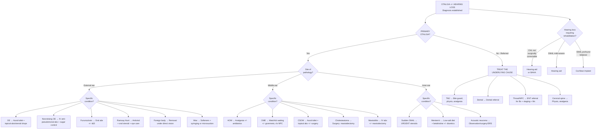

## Management of Ear Pain and Hearing Loss

The overarching management principle is: **treat the underlying cause**. Ear pain and hearing loss are symptoms, not diagnoses. Once you have identified the aetiology through history, otoscopy, and targeted investigations, treatment follows logically. This section systematically covers management of each major condition, organised from the most common to the most serious.

---

### 1. General Principles

1. **Analgesia first** — a patient in pain needs relief regardless of the underlying diagnosis. Simple analgesics (paracetamol, NSAIDs) while working up the cause [6].
2. **Treat the cause** — antibiotics for bacterial infection, surgery for cholesteatoma, steroids for sudden SNHL, etc.
3. **Prevent complications** — e.g., protecting the cornea in facial nerve palsy [11], early intervention for hearing loss in children.
4. **Rehabilitate hearing** — hearing aids, cochlear implants, and communication support where hearing cannot be restored.
5. ***Investigations are seldom necessary*** [1] for straightforward cases — avoid over-investigation.

---

### 2. Management Algorithm — Overview

---

### 3. Condition-Specific Management

#### 3.1 External Ear Conditions

##### 3.1.1 Otitis Externa (OE)

OE is one of the ***probability diagnoses*** [1] — you will see this constantly.

**Principles of management:**

| Step | Treatment | Rationale |
|---|---|---|
| **1. Analgesia** | Paracetamol ± NSAIDs (e.g., ibuprofen) | Pain relief while treating the infection; NSAIDs also reduce canal inflammation |
| **2. Aural toilet** | Microsuction or gentle dry mopping under direct vision (microscope or otoscope) | Removes debris, discharge, and desquamated epithelium → allows topical drops to contact infected skin; debris acts as a biofilm reservoir for bacteria |
| **3. Topical antibiotic ± steroid drops** (1st-line) | Ciprofloxacin 0.3% + dexamethasone 0.1% (e.g., Ciprodex); OR neomycin + polymyxin B + hydrocortisone (e.g., Otosporin) | Topical route delivers high local drug concentration directly to the infection with minimal systemic side effects; steroid component ↓inflammation and oedema → ↓pain and restores canal patency |
| **4. Ear wick** (if canal severely oedematous) | Pope wick or ribbon gauze wick inserted into the swollen EAC | The canal is too swollen for drops to penetrate → the wick draws topical medication deep into the canal by capillary action; removed/replaced after 48–72 hours when oedema subsides |
| **5. Oral antibiotics** (only if spreading cellulitis) | Flucloxacillin (anti-staphylococcal) or ciprofloxacin (anti-pseudomonal) | Systemic antibiotics are NOT routinely needed for uncomplicated OE — the infection is localised to the canal skin; only indicated if there is periauricular cellulitis, fever, or immunocompromise |

**Contraindications and cautions:**
- **Aminoglycoside-containing drops (e.g., gentamicin, neomycin)**: contraindicated if TM perforation is present or suspected → aminoglycosides are ototoxic and can damage cochlear hair cells if they enter the middle ear through a perforation. Use fluoroquinolone drops (ciprofloxacin/ofloxacin) instead, which are non-ototoxic.
- **Avoid oral antibiotics routinely** — promotes resistance without benefit in uncomplicated OE.
- **Water precautions**: advise patient to keep ears dry (cotton ball with petroleum jelly during showering, avoid swimming until resolved). Why? Water re-maceration of the canal skin perpetuates the infection cycle.

<Callout title="Otomycosis" type="idea">
If the discharge looks like wet newspaper with black spores (*Aspergillus niger*) or creamy white debris (*Candida*), the cause is fungal. Treat with **topical antifungal**: clotrimazole 1% solution or acetic acid 2% drops (acidifies the canal, creating a hostile environment for fungi). Antibacterial drops are ineffective and may worsen fungal OE by eliminating competing bacterial flora.
</Callout>

##### 3.1.2 Necrotising (Malignant) Otitis Externa

This is a ***serious disorder not to be missed*** [1]. Management is aggressive and prolonged.

| Step | Treatment | Rationale |
|---|---|---|
| **1. Admit to hospital** | — | Life-threatening skull base osteomyelitis requiring IV therapy and monitoring |
| **2. Glycaemic control** | Optimise blood glucose (insulin sliding scale if needed) | Hyperglycaemia impairs neutrophil function (chemotaxis, phagocytosis, oxidative killing); poor glycaemic control = poor outcomes |
| **3. Prolonged IV anti-pseudomonal antibiotics** | IV ciprofloxacin OR IV piperacillin-tazobactam OR IV ceftazidime + IV ciprofloxacin; minimum **6–8 weeks** total (IV → oral step-down with ciprofloxacin) | *Pseudomonas aeruginosa* is the causative organism in >95% cases; prolonged course needed because osteomyelitis requires weeks of antibiotic penetration into avascular bone |
| **4. Aural toilet** | Regular microsuction under microscope | Removes granulation tissue and debris; improves local drug delivery |
| **5. Monitoring** | Serial ESR/CRP; Ga-67 scan to assess treatment response | ESR normalisation indicates resolution; Ga-67 normalises with successful treatment (unlike Tc-99m which remains positive) → guides duration of therapy |
| **6. Surgical debridement** | Rarely needed; reserved for extensive bony sequestration | Surgery in skull base is hazardous (CN VII, major vessels); prefer medical management |

**Why NOT just oral ciprofloxacin alone?** While ciprofloxacin has excellent oral bioavailability (~70–80%) and good bone penetration, the severity of skull base osteomyelitis with risk of CN palsies and death warrants initial IV therapy to ensure maximum drug levels. Oral step-down can follow once clinically improving.

**Prognosis**: Mortality ~10–20% even with treatment; CN VII palsy recovery is poor once established.

##### 3.1.3 Furunculosis (Boil in EAC)

***Boils and furuncles of canal*** [1] — a probability diagnosis.

| Treatment | Details |
|---|---|
| **Oral antibiotics** | Flucloxacillin 500 mg QDS for 7 days (targets *S. aureus*) |
| **Analgesia** | Paracetamol ± NSAIDs |
| **Incision and drainage** | If fluctuant/pointing abscess — relieves pressure immediately |
| **Topical antibiotic drops** | Adjunctive; same as for OE |

> **Why do furuncles only occur in the lateral EAC?** Because hair follicles are present ONLY in the lateral (cartilaginous) third of the EAC. The medial (bony) two-thirds has no hair follicles and no ceruminous glands → furuncles cannot form there.

##### 3.1.4 Ramsay Hunt Syndrome (Herpes Zoster Oticus)

***Herpes zoster — Ramsay Hunt syndrome*** [1] — a serious disorder not to be missed.

| Treatment | Details | Rationale |
|---|---|---|
| ***Oral antiviral*** | Valaciclovir 1g TDS for 7 days (or aciclovir 800 mg 5x/day for 7 days) | VZV reactivation in geniculate ganglion → antiviral limits viral replication and reduces nerve damage; valaciclovir preferred for better bioavailability |
| ***Oral corticosteroid*** | Prednisolone 1 mg/kg/day (max 60 mg) for 5 days, then taper | Reduces perineural inflammation and oedema within the bony fallopian canal → reduces compression of CN VII → improves chance of facial nerve recovery |
| ***Eye care*** [11] | Artificial tears, lubricating ointment at night, protective glasses/taping eyelid shut | ***Cornea is at risk due to poor eyelid closure and reduced tearing which may result in drying and abrasions*** [11]; CN VII palsy → lagophthalmos (inability to close eye) → corneal exposure |
| **Analgesia** | Paracetamol, NSAIDs; consider gabapentin/pregabalin for neuropathic pain | VZV causes neuropathic pain that may persist as post-herpetic neuralgia (PHN) |

> **Why is Ramsay Hunt worse than Bell's palsy?** VZV directly destroys neural tissue (unlike Bell's palsy where inflammation causes conduction block without axonal destruction in most cases). Ramsay Hunt has a lower rate of complete facial nerve recovery (~50–70%) compared to Bell's palsy (~85–95%).

**Contraindication**: Do NOT give antivirals or steroids as monotherapy — combined treatment is superior. Steroids alone without antiviral cover may theoretically worsen viral replication (though this is debated).

##### 3.1.5 Cerumen Impaction (Hard Ear Wax)

***Hard ear wax*** [1] — a pitfall often missed.

| Method | Details | Contraindications |
|---|---|---|
| **Cerumenolytics** (softening agents) | Olive oil drops, sodium bicarbonate drops, or commercial preparations (e.g., Cerumol) for 3–5 days before removal | None significant; avoid hydrogen peroxide if TM perforation suspected (fizzing in middle ear) |
| **Ear syringing / irrigation** | Warm water (~37°C) irrigated against the posterosuperior canal wall to flush wax out | **Contraindicated** if: (1) known/suspected TM perforation (water enters middle ear → infection), (2) previous ear surgery, (3) only hearing ear (risk of rare complication), (4) grommets in situ |
| **Microsuction** (preferred) | Suction under direct microscopic or otoscopic vision | Safest method; suitable even with perforation; requires equipment and training |
| **Instrumentation** | Jobson-Horne probe, wax hook — manual removal under direct vision | Requires skill; risk of canal trauma if patient moves |

> **Why warm water at body temperature for syringing?** Cold or hot water stimulates the vestibular apparatus via caloric effect (cold water → inhibitory nystagmus toward that ear → vertigo/nausea; hot water → excitatory nystagmus). Water at ~37°C avoids this caloric stimulation.

##### 3.1.6 Foreign Body

***Foreign bodies in ear*** [1] — a pitfall often missed, especially in children.

| Method | Details |
|---|---|
| **Direct removal** | Under otoscopic vision with wax hook, crocodile forceps, or suction. In children, may require general anaesthesia for cooperation |
| **Syringing** | Can be used for non-organic, non-hygroscopic objects. **Avoid** for organic material (e.g., seeds, peas) — they swell with water and become more impacted |
| **Superglue technique** | Blunt probe with cyanoacrylate glue touched to the object, allowed to set, then withdrawn — useful for smooth round objects (beads) |
| **ENT referral** | If impacted, unsuccessful attempts, or button battery (EMERGENCY — tissue necrosis within hours from alkaline leakage) |

<Callout title="Button Battery in Ear — Emergency!" type="error">
A button battery in the EAC is a **time-critical emergency**. The battery generates an electrical current between its poles, creating an alkaline (NaOH) environment → liquefactive necrosis of surrounding tissue within **2 hours**. Must be removed immediately. Do NOT irrigate (worsens alkaline injury). Do NOT delay for imaging.
</Callout>

---

#### 3.2 Middle Ear Conditions

##### 3.2.1 Acute Otitis Media (AOM)

***Otitis media (viral or bacterial)*** [1] — the most common probability diagnosis.

**Key management principle**: AOM is often **self-limiting** (viral or bacterial with spontaneous resolution). The question is: who needs antibiotics?

**Step 1: Analgesia (ALL patients)**

| Drug | Dose (paediatric example) | Notes |
|---|---|---|
| Paracetamol | 15 mg/kg/dose Q4–6H | First-line; safe and effective [6] |
| Ibuprofen | 10 mg/kg/dose Q6–8H | More effective for inflammatory pain; avoid if dehydrated (renal risk), GI issues, or aspirin-sensitive asthma [6] |

> ***The pain of otitis media may be masked by fever in babies and young children*** [1] — so always consider AOM in a febrile, irritable child even without obvious ear-pulling.

**Step 2: Antibiotics — Immediate vs. Watchful Waiting**

| Scenario | Management | Rationale |
|---|---|---|
| **Age < 6 months** | Immediate antibiotics | Immature immune system; higher risk of complications |
| **Age 6 months – 2 years with bilateral AOM** | Immediate antibiotics | Bilateral disease = higher bacterial burden; poor spontaneous resolution |
| **Age 6 months – 2 years with unilateral AOM, mild symptoms** | Watchful waiting for 48–72 hours (safety-net prescription) | ~80% resolve spontaneously; avoid unnecessary antibiotic exposure |
| **Age ≥ 2 years with non-severe symptoms** | Watchful waiting for 48–72 hours | NNT for antibiotics = 20 (i.e., need to treat 20 children to benefit 1); self-resolution is the rule |
| **Any age with severe symptoms** (moderate-severe otalgia, fever ≥39°C, toxic-looking) | Immediate antibiotics | High risk of complications; unacceptable to wait |
| **AOM with TM perforation (otorrhoea)** | Immediate antibiotics (oral ± topical) | Perforation indicates significant middle ear pressure and infection |
| **Recurrent AOM** (≥3 episodes in 6 months or ≥4 in 12 months) | Consider prophylactic measures | Grommets (ventilation tubes); avoid antibiotic prophylaxis (promotes resistance) |

**Antibiotic choices:**

| Line | Drug | Dose | Duration | Notes |
|---|---|---|---|---|
| **1st-line** | **Amoxicillin** | 80–90 mg/kg/day divided BD (high dose) | 5–10 days | Covers *S. pneumoniae* (most important pathogen); high dose overcomes intermediate penicillin resistance |
| **2nd-line** (if no response in 48–72h or recent amoxicillin use) | **Amoxicillin-clavulanate** (Augmentin) | 90 mg/kg/day (amoxicillin component) divided BD | 10 days | Adds β-lactamase inhibitor → covers β-lactamase-producing *H. influenzae* and *M. catarrhalis* |
| **Penicillin allergy (non-anaphylactic)** | Cefuroxime axetil | 30 mg/kg/day divided BD | 10 days | 2nd-generation cephalosporin; ~1–2% cross-reactivity with penicillin allergy |
| **Penicillin anaphylaxis** | Azithromycin | 10 mg/kg day 1, then 5 mg/kg days 2–5 | 5 days | Macrolide; inferior coverage of *S. pneumoniae* but acceptable alternative |

> **Why high-dose amoxicillin?** *S. pneumoniae* with intermediate penicillin resistance (MIC 2–4 μg/mL) can still be overcome by achieving high drug concentrations at the infection site. Standard-dose amoxicillin may not reach these levels in the middle ear fluid, but 80–90 mg/kg/day does. This is NOT full resistance — truly penicillin-resistant pneumococci (MIC ≥ 8) require different agents.

##### 3.2.2 Otitis Media with Effusion (OME / Glue Ear)

***Eustachian tube dysfunction*** [1] is a related probability diagnosis.

| Step | Treatment | Rationale |
|---|---|---|
| **1. Watchful waiting** (3 months) | Observation with serial audiometry | ~90% of OME resolves spontaneously within 3 months; intervention is only needed for persistent effusion with clinically significant hearing loss |
| **2. Autoinflation** | Otovent balloon (blow up a balloon through the nose) | Actively opens the Eustachian tube by generating positive nasopharyngeal pressure; evidence supports modest benefit |
| **3. Grommet insertion** (ventilation tubes / tympanostomy tubes) | Under GA (usually); small tube placed through myringotomy incision in anteroinferior TM quadrant | Bypasses the dysfunctional Eustachian tube → equalises middle ear pressure → allows fluid to drain → restores hearing. Grommets typically extrude spontaneously in 6–12 months |
| **4. Adenoidectomy** (if recurrent OME with adenoid hypertrophy) | Removal of enlarged adenoid pad | Adenoid hypertrophy can mechanically obstruct the Eustachian tube orifice in the nasopharynx AND act as a bacterial reservoir; adenoidectomy reduces OME recurrence |
| **NOT recommended** | Antibiotics, oral/nasal steroids, antihistamines, decongestants | No sustained benefit for OME; antibiotics promote resistance without meaningful long-term resolution |

<Callout title="OME in Adults — Exclude NPC" type="error">
In children, OME is overwhelmingly due to Eustachian tube immaturity and adenoid hypertrophy — benign and self-limiting. In **adults**, especially in **Hong Kong**, unilateral OME must prompt **nasopharyngoscopy to exclude nasopharyngeal carcinoma** [2]. NPC obstructs the Eustachian tube from the nasopharyngeal end. Never just "watch and wait" without examining the post-nasal space in an adult with unilateral effusion.
</Callout>

**Grommet complications:**
- Otorrhoea (~15–25%) — topical antibiotic drops (non-ototoxic, e.g., ciprofloxacin); NOT oral antibiotics
- Premature extrusion or blockage
- Residual perforation after extrusion (~2%)
- Tympanosclerosis (cosmetic, rarely affects hearing)
- Water precautions: surface swimming usually fine; diving and submerging the ear should be avoided (water through the grommet → middle ear infection)

##### 3.2.3 Chronic Suppurative Otitis Media (CSOM)

| Step | Treatment | Rationale |
|---|---|---|
| **1. Aural toilet** | Regular microsuction | Removes purulent discharge and biofilm; prerequisite for topical drops to work |
| **2. Topical antibiotic drops** (non-ototoxic) | Ciprofloxacin 0.3% drops ± dexamethasone | Fluoroquinolone ear drops are first-line; safe with TM perforation (non-ototoxic); covers *Pseudomonas* and Gram-negatives common in CSOM |
| **3. Water precautions** | Keep ear dry | Water carrying bacteria enters middle ear through the perforation → perpetuates infection |
| **4. Surgery** (if refractory or complications) | **Myringoplasty** (TM repair) if dry and safe; **Tympanoplasty** (TM + ossicular reconstruction); **Mastoidectomy** if mastoid involved | Myringoplasty closes the perforation → restores middle ear seal → reduces infection risk and improves hearing |

**Contraindication**: Aminoglycoside drops (gentamicin, neomycin) are **contraindicated** in the presence of TM perforation due to ototoxicity risk — the drops can pass through the perforation → round window membrane → cochlea → hair cell destruction → SNHL.

##### 3.2.4 Cholesteatoma

***Cholesteatoma*** [1] — a serious disorder not to be missed. **Surgery is the definitive treatment** — there is no medical cure.

| Treatment | Details | Rationale |
|---|---|---|
| **Surgical excision** (mainstay) | **Mastoidectomy** (canal wall up or canal wall down) ± **tympanoplasty** | Complete removal of keratinising squamous epithelium is essential; cholesteatoma is locally destructive and will erode bone if left untreated → CN VII palsy, labyrinthine fistula, intracranial complications |
| **Canal wall up (CWU)** mastoidectomy | Posterior canal wall preserved; better cosmesis; requires second-look surgery at 9–12 months | Higher recurrence/residual disease rate (~20–30%) because disease in the attic/posterior tympanum is harder to visualise with canal wall intact |
| **Canal wall down (CWD)** mastoidectomy | Posterior canal wall removed → open mastoid cavity (mastoid bowl) | Lower recurrence (~5–10%); easier surveillance; but requires lifelong aural toilet of the cavity; cannot get ear wet (swimming, bathing) |
| **Ossicular reconstruction** | Prosthesis or autograft (incus interposition) | Cholesteatoma typically erodes the incus long process first → ossicular discontinuity → CHL; reconstruction improves hearing |
| **MRI DWI surveillance** | Non-echo-planar DWI at 12 months post-op (especially after CWU) | Detects residual/recurrent cholesteatoma (restricts diffusion → bright on DWI) without need for re-exploration surgery |

> **Why is surgery mandatory?** Cholesteatoma is not a tumour, but it behaves like one locally. The trapped keratinising squamous epithelium produces collagenases and cytokines that activate osteoclasts → progressive bone erosion. Without surgical removal, it will inevitably erode the ossicles, lateral SCC, facial nerve canal, or tegmen tympani → deafness, vertigo, facial palsy, or intracranial sepsis.

##### 3.2.5 Acute Mastoiditis

***Acute mastoiditis*** [1] — a serious disorder not to be missed.

| Step | Treatment | Rationale |
|---|---|---|
| **1. Admit to hospital** | — | Risk of intracranial complications (meningitis, brain abscess, sigmoid sinus thrombosis) |
| **2. IV antibiotics** | IV amoxicillin-clavulanate or IV ceftriaxone ± metronidazole | Must cover *S. pneumoniae*, *H. influenzae*, *S. pyogenes*, and anaerobes; higher doses and IV route needed for bone/deep infection |
| **3. Myringotomy** | Incision in TM to drain middle ear pus; send for MC&S | Relieves pressure; identifies causative organism for targeted therapy |
| **4. Cortical mastoidectomy** | If subperiosteal abscess, intracranial complication, or failure to improve on IV antibiotics within 48 hours | Drains infected mastoid air cells; removes necrotic bone (coalescent mastoiditis); may be life-saving |
| **5. CT temporal bone** | Pre-operative if complication suspected | Identifies abscess, bone destruction, intracranial extension |

---

#### 3.3 Inner Ear and Sensorineural Conditions

##### 3.3.1 Sudden Sensorineural Hearing Loss (Sudden SNHL) — ENT Emergency

This is a medical emergency. Think of it as a "cochlear stroke."

| Step | Treatment | Evidence / Rationale |
|---|---|---|
| **1. Urgent ENT referral + audiometry** | Within 24–72 hours of onset | Delays > 2 weeks → significantly worse outcomes; time = hearing |
| **2. Systemic corticosteroids** (1st-line) | Oral prednisolone 1 mg/kg/day (max 60 mg) for 10–14 days with taper; OR IV methylprednisolone if severe | Reduces cochlear inflammation and oedema; presumed mechanism: anti-inflammatory + immunomodulatory effect on inner ear; evidence from 2011 SSNHL trial supports steroids vs. placebo |
| **3. Intratympanic steroid injection** | Dexamethasone 10–24 mg/mL injected through TM into middle ear → diffuses through round window membrane into cochlea | Achieves much higher perilymphatic steroid concentrations than systemic route; used as **salvage therapy** if systemic steroids fail (within 2–6 weeks), or as primary therapy if systemic steroids are contraindicated (e.g., diabetes, peptic ulcer, glaucoma) |
| **4. MRI with gadolinium** | To exclude vestibular schwannoma | ~1–3% of sudden SNHL is caused by an acoustic neuroma; must be excluded |
| **5. Address modifiable factors** | Blood glucose optimisation, cardiovascular risk factor management | Vascular aetiology (cochlear artery thrombosis) is one proposed mechanism |

**What NOT to do:**
- Do NOT prescribe antivirals (no proven benefit in idiopathic sudden SNHL despite viral aetiology being suspected)
- Do NOT delay treatment to await investigation results — start steroids immediately
- Hyperbaric oxygen therapy: some evidence supports it as adjunctive therapy within the first 2 weeks, but not widely available

**Contraindications to systemic steroids**: active infection (TB, untreated bacterial infection), uncontrolled diabetes (relative — can use with insulin cover), peptic ulcer disease, psychosis. In these cases → **intratympanic steroids** as primary therapy.

##### 3.3.2 Ménière's Disease

***Ménière syndrome*** [9] — a probability diagnosis for tinnitus and important cause of episodic vertigo.

**Management is stepwise — "escalation ladder":**

| Step | Treatment | Mechanism / Rationale |
|---|---|---|
| **1. Lifestyle modification** | Low-salt diet (< 1.5–2 g sodium/day); avoid caffeine, alcohol, stress; adequate hydration | Reducing sodium intake reduces endolymphatic fluid retention → ↓endolymphatic hydrops; caffeine/alcohol may worsen vestibular symptoms |
| **2. Betahistine** (1st-line pharmacotherapy) | 16–48 mg TDS | Histamine H1 agonist and H3 antagonist → improves inner ear microcirculation → reduces endolymphatic hydrops; reduces frequency and severity of vertigo attacks |
| **3. Thiazide diuretics** | Hydrochlorothiazide 25–50 mg daily | Reduces total body fluid volume → reduces endolymph production; evidence is modest |
| **4. Acute attack management** | Prochlorperazine (vestibular sedative) or dimenhydrinate; short course only | Suppresses vestibular nucleus firing → reduces vertigo and nausea acutely; NOT for chronic use (delays vestibular compensation) |
| **5. Intratympanic corticosteroids** | Dexamethasone injected through TM | Anti-inflammatory effect on inner ear; for refractory cases; preserves hearing |
| **6. Intratympanic gentamicin** (chemical labyrinthectomy) | Low-dose gentamicin injected through TM → selectively destroys vestibular hair cells | Gentamicin is preferentially vestibulotoxic (more toxic to vestibular hair cells than cochlear); ablates vestibular function on that side → eliminates vertigo attacks; risk of SNHL (~20–30%) |
| **7. Endolymphatic sac decompression** | Surgical decompression of endolymphatic sac | Aims to improve endolymph drainage; variable outcomes; hearing-preserving |
| **8. Labyrinthectomy** (last resort) | Surgical destruction of entire labyrinth | Eliminates vertigo but causes total ipsilateral hearing loss → only if hearing already very poor |
| **9. Vestibular neurectomy** | Selective section of vestibular portion of CN VIII | Eliminates vertigo while preserving hearing; major neurosurgical procedure |

> **Why betahistine?** The name breaks down as "beta-histine" — it is a structural analogue of histamine. It acts as an H1 agonist (vasodilation of inner ear blood vessels → improved cochlear blood flow) and an H3 antagonist (H3 receptors are presynaptic autoreceptors on histaminergic neurons; blocking them ↑histamine release → further vasodilation). The net effect is improved inner ear microcirculation and reduced endolymphatic pressure.

##### 3.3.3 Vestibular Schwannoma (Acoustic Neuroma)

***Acoustic neuroma (unilateral)*** [9] — a serious disorder not to be missed for tinnitus.

| Option | Indication | Details |
|---|---|---|
| **Observation ("watch, wait, and scan")** | Small tumours (< 1–1.5 cm), elderly patients, minimal symptoms | Serial MRI every 6–12 months; ~50% of small tumours show no significant growth over 5 years |
| **Microsurgery** | Large tumours (> 2.5–3 cm), brainstem compression, young patients, serviceable hearing | Approaches: translabyrinthine (sacrifices hearing), retrosigmoid/suboccipital (hearing preservation possible), middle fossa (small tumours with good hearing). Risk: CN VII injury (~10–30% depending on tumour size) |
| **Stereotactic radiosurgery (SRS)** | Small-medium tumours (< 2.5–3 cm), elderly/comorbid patients, patient preference | Gamma Knife or CyberKnife; single-fraction high-dose radiation → stops tumour growth in ~90–95%; hearing preservation ~50–70% at 5 years; lower CN VII risk than surgery |

##### 3.3.4 Noise-Induced Hearing Loss (NIHL)

***Sensorineural hearing loss (esp. noise induced)*** [9] — a probability diagnosis for tinnitus.

| Step | Management | Rationale |
|---|---|---|
| **Prevention** (most important) | Hearing protection (earplugs, earmuffs), noise exposure limits (< 85 dB for 8 hours), regular audiometric screening for at-risk workers | Damaged cochlear hair cells do NOT regenerate in humans; prevention is the ONLY way to avoid permanent NIHL |
| **Hearing aids** | For established NIHL with communication difficulty | Amplifies sound to compensate for hair cell loss; modern digital aids can target the 4 kHz region specifically |
| **Occupational health** | Noise surveys, workplace modifications, legal compensation | Hong Kong: employees with NIHL may claim compensation under the Employees' Compensation Ordinance |

##### 3.3.5 Presbycusis

***Ageing*** [9] — a probability diagnosis for tinnitus and the most common cause of SNHL.

| Step | Management | Rationale |
|---|---|---|
| **Hearing aids** (mainstay) | Behind-the-ear (BTE), receiver-in-canal (RIC), or completely-in-canal (CIC) aids | Amplification compensates for hair cell loss; digital aids can be programmed to the patient's audiogram; evidence links untreated hearing loss to cognitive decline, social isolation, and depression |
| **Communication strategies** | Face the speaker, reduce background noise, lip-reading, assistive listening devices | Complements hearing aid use; patients with presbycusis struggle most in noisy environments |
| **Cochlear implant** | If bilateral severe-to-profound SNHL with limited benefit from hearing aids (speech discrimination < 50%) | Bypasses damaged hair cells entirely → directly stimulates spiral ganglion neurons; highly effective even in elderly patients |
| **Aural rehabilitation** | Audiology follow-up, hearing aid adjustment, counselling | Ensures optimal device use; addresses psychosocial impact |

---

#### 3.4 Otosclerosis

| Step | Management | Details |
|---|---|---|
| **1. Observation** | If mild, asymptomatic CHL | Not all patients require intervention |
| **2. Hearing aid** | Non-surgical option for CHL | Amplification overcomes the conductive deficit; appropriate for patients who decline surgery or have surgical contraindications |
| **3. Stapedotomy / Stapedectomy** (definitive) | **Stapedotomy** (preferred): laser fenestration of stapes footplate + prosthesis from incus to oval window; **Stapedectomy**: removal of stapes superstructure + prosthesis | Bypasses the fixed stapes → restores sound transmission to the cochlea; success rate ~90–95% for closing air-bone gap; stapedotomy has lower complication rate than full stapedectomy |
| **4. Sodium fluoride** (controversial) | May slow otosclerotic bone remodelling | Promotes mineralisation of spongiotic bone → may prevent progression; limited evidence; not widely used |

**Surgical complications:**
- SNHL (< 1% — most feared; damage to inner ear during footplate manipulation)
- Vertigo (transient, common; persistent if perilymph fistula)
- Tinnitus (may improve or worsen)
- Facial nerve injury (rare; nerve dehiscence over oval window in some patients)
- Reparative granuloma
- Prosthesis displacement

**Contraindications to surgery:**
- Only hearing ear (relative — risk of total deafness is unacceptable)
- Active middle ear infection
- Patient unable to tolerate general/local anaesthesia

---

#### 3.5 Management of Referred Otalgia

Since referred otalgia accounts for a substantial proportion of adult otalgia [1], management targets the underlying cause:

| Source | Management |
|---|---|
| ***TMJ arthralgia*** [1] | Occlusal splint (bite guard) worn at night → reduces bruxism-related TMJ stress; jaw physiotherapy; soft diet; NSAIDs; referral to oral and maxillofacial surgery if refractory |
| ***Dental abscess / unerupted wisdom tooth*** [1] | Dental referral → extraction, root canal treatment, or incision and drainage as appropriate |
| ***Tonsillitis*** [1] | Penicillin V or amoxicillin for bacterial tonsillitis (Group A Strep); paracetamol/NSAIDs; tonsillectomy if recurrent (≥7 episodes/year, or ≥5/year for 2 years, or ≥3/year for 3 years) |
| ***Nasopharyngeal carcinoma*** [2] | Concurrent chemoradiotherapy (cisplatin-based) — NPC is highly radiosensitive; staging with PET-CT; EBV DNA monitoring; surgical salvage for recurrence |
| ***Laryngeal carcinoma*** [4] | Depends on stage: early glottic (T1–T2) → radiotherapy or laser cordectomy; advanced → surgery (laryngectomy) + adjuvant chemoradiotherapy |
| ***Cervical spine dysfunction*** [1] | Physiotherapy (mobilisation, exercises); NSAIDs; cervical collar (short-term); referral to musculoskeletal specialist if persistent |
| ***Glossopharyngeal neuralgia*** [1] | Carbamazepine or oxcarbazepine (same approach as trigeminal neuralgia — membrane-stabilising antiepileptic drugs that ↓neuronal firing); microvascular decompression if refractory |
| ***Post-tonsillectomy pain*** [1] | Expected; regular paracetamol ± NSAIDs (note: some surgeons avoid NSAIDs post-tonsillectomy due to bleeding risk — this is debated); reassurance |
| ***Depression*** [1] | Antidepressants (SSRIs), CBT, psychological support; address underlying pain amplification |

---

#### 3.6 Hearing Rehabilitation — Summary

| Hearing Loss Type | Mild–Moderate | Severe–Profound |
|---|---|---|
| **CHL** | Hearing aid; treat underlying cause (e.g., grommet for OME, surgery for otosclerosis) | Bone-anchored hearing aid (BAHA) if conventional aid inadequate or canal/ear unsuitable |
| **SNHL** | Hearing aid (standard) | Cochlear implant (CI) — bypasses damaged hair cells; directly stimulates spiral ganglion neurons |
| **Mixed** | Address conductive component first (surgery if possible), then hearing aid for residual SNHL | CI ± middle ear surgery |
| **Unilateral total deafness** | CROS hearing aid (contralateral routing of signal) or BAHA on deaf side → routes sound to the hearing ear | — |
| **Children** | Early intervention: hearing aid fitting by 6 months of age; speech therapy; educational support; cochlear implant by 12 months if profound bilateral SNHL | CI ideally before age 2 (during critical period for auditory cortex development) |

---

### 4. Summary of Key Management Principles by Condition

| Condition | Key Management | Critical Points |
|---|---|---|
| OE | Aural toilet + topical abx/steroid drops | No aminoglycoside drops if perforation; ear wick if swollen; water precautions |
| Necrotising OE | Prolonged IV anti-pseudomonal antibiotics + glycaemic control | Minimum 6–8 weeks; Ga-67 scan for treatment monitoring |
| AOM | Analgesia ± antibiotics (amoxicillin 80–90 mg/kg/day) | Watchful waiting in >2y with mild symptoms; immediate abx if < 6m, bilateral, severe, or perforated |
| OME | Watchful waiting → grommets if persistent > 3 months with hearing impact | Exclude NPC in adults with unilateral OME [2] |
| CSOM | Aural toilet + topical ciprofloxacin drops; surgery if refractory | No aminoglycoside drops (ototoxic through perforation) |
| Cholesteatoma | Surgery (mastoidectomy ± tympanoplasty) — no medical cure | Mandatory surgical removal; MRI DWI for surveillance |
| Mastoiditis | IV antibiotics ± cortical mastoidectomy | Myringotomy for drainage and culture |
| Ramsay Hunt | Valaciclovir + prednisolone + eye care [11] | Worse prognosis than Bell's palsy for facial nerve recovery |
| Sudden SNHL | URGENT systemic steroids ± intratympanic salvage; MRI to r/o acoustic neuroma | ENT emergency; do not delay treatment |
| Ménière's | Stepwise: low-salt diet → betahistine → diuretics → intratympanic therapy → surgery | Betahistine is 1st-line pharmacotherapy; intratympanic gentamicin for refractory cases |
| Acoustic neuroma | Observation / microsurgery / stereotactic radiosurgery | Based on tumour size, patient age, hearing status |
| Otosclerosis | Hearing aid or stapedotomy | Stapedotomy: ~90–95% success; risk of SNHL < 1% |
| Presbycusis / NIHL | Hearing aids; prevention for NIHL | Hair cells do not regenerate; untreated hearing loss → cognitive decline |

<Callout title="High Yield Summary">

1. **OE management**: aural toilet + topical antibiotic-steroid drops (ciprofloxacin/dexamethasone). Use an ear wick if canal is too swollen. **NEVER** use aminoglycoside drops if TM perforation is present or suspected — ototoxic.

2. **AOM antibiotics**: not always needed. Watchful waiting for ≥2 years with mild symptoms. When indicated → high-dose amoxicillin (80–90 mg/kg/day) to overcome intermediate pneumococcal resistance. Augmentin if no response in 48–72h.

3. **Cholesteatoma requires surgery** — no medical cure. Mastoidectomy (CWU vs CWD) ± tympanoplasty. MRI DWI for post-op surveillance.

4. **Sudden SNHL is an ENT emergency**: oral prednisolone 1 mg/kg immediately; intratympanic dexamethasone as salvage; MRI to exclude acoustic neuroma. Do not delay for investigations.

5. **Ménière's disease**: stepwise escalation — diet → betahistine → diuretics → intratympanic steroids → intratympanic gentamicin → surgery.

6. **Betahistine**: H1 agonist + H3 antagonist → improves inner ear microcirculation → reduces endolymphatic hydrops.

7. **Ramsay Hunt**: combined valaciclovir + prednisolone + eye care. Worse prognosis than Bell's palsy (~50–70% vs ~85–95% recovery).

8. **Grommets** for OME: only if persistent > 3 months with hearing impact. In adults, exclude NPC before attributing unilateral OME to benign Eustachian tube dysfunction [2].

9. **Hearing rehabilitation**: hearing aids for mild-severe SNHL; cochlear implant for bilateral profound SNHL (ideally before age 2 in children). BAHA for unilateral deafness or unsuitable ears.

10. **Button battery in ear = emergency removal** — liquefactive necrosis within 2 hours. Do NOT irrigate.

</Callout>

---

<ActiveRecallQuiz
  title="Active Recall - Management of Ear Pain and Hearing Loss"
  items={[
    {
      question: "A 3-year-old child presents with unilateral AOM, mild symptoms, and temperature 38.2C. What is your management and why?",
      markscheme: "Watchful waiting with safety-net prescription for 48-72 hours. Rationale: age over 2 years with unilateral, non-severe AOM has approximately 80% spontaneous resolution rate. NNT for antibiotics is 20. Provide analgesia (paracetamol 15 mg/kg Q4-6H). If no improvement in 48-72h, commence amoxicillin 80-90 mg/kg/day divided BD. Immediate antibiotics if worsening, fever over 39C, or bilateral disease."
    },
    {
      question: "Why are aminoglycoside-containing ear drops contraindicated when the tympanic membrane is perforated? What should you use instead?",
      markscheme: "Aminoglycosides (gentamicin, neomycin) are ototoxic. With TM perforation, drops pass through the perforation into the middle ear and can diffuse through the round window membrane into the cochlea, destroying outer hair cells and causing irreversible sensorineural hearing loss. Use fluoroquinolone drops instead (ciprofloxacin or ofloxacin), which are non-ototoxic and safe with perforation."
    },
    {
      question: "Describe the stepwise management of Meniere's disease from lifestyle to surgical intervention.",
      markscheme: "Step 1: Low-salt diet (less than 2g Na/day), avoid caffeine/alcohol. Step 2: Betahistine (H1 agonist, H3 antagonist - improves inner ear microcirculation). Step 3: Thiazide diuretics. Step 4: Acute attacks - vestibular sedatives (prochlorperazine). Step 5: Intratympanic corticosteroids (hearing-preserving). Step 6: Intratympanic gentamicin (chemical labyrinthectomy - selectively vestibulotoxic). Step 7: Endolymphatic sac decompression. Step 8: Labyrinthectomy or vestibular neurectomy (last resort)."
    },
    {
      question: "A patient presents with sudden unilateral hearing loss 24 hours ago. Audiometry confirms 40 dB SNHL across 4 contiguous frequencies. The patient has poorly controlled diabetes. What is your management approach?",
      markscheme: "This is sudden SNHL - an ENT emergency. Systemic steroids are first-line but this patient has poorly controlled diabetes (relative contraindication to systemic steroids). Option 1: Give systemic prednisolone with insulin sliding scale and close glucose monitoring. Option 2: Use intratympanic dexamethasone injection as primary therapy (achieves higher perilymphatic concentrations without systemic side effects). In either case: optimise glycaemic control, arrange MRI with gadolinium to exclude vestibular schwannoma. Do not delay treatment."
    },
    {
      question: "What is the definitive management of cholesteatoma and why is surgery mandatory?",
      markscheme: "Surgery (mastoidectomy with or without tympanoplasty) is mandatory because cholesteatoma is locally destructive keratinising squamous epithelium that produces collagenases activating osteoclasts, causing progressive bone erosion. Without removal, it will erode ossicles (causing CHL), lateral semicircular canal (vertigo), facial nerve canal (facial palsy), or tegmen tympani (intracranial complications: meningitis, brain abscess). There is no medical cure. Options: canal wall up (better cosmesis, higher recurrence ~20-30%, needs second-look) or canal wall down (lower recurrence ~5-10%, needs lifelong cavity care)."
    },
    {
      question: "A child is brought to ED with a button battery lodged in the right ear canal discovered 30 minutes ago. What is the urgency and specific management?",
      markscheme: "This is a time-critical emergency. Button batteries generate electrical current creating alkaline (NaOH) environment causing liquefactive necrosis of surrounding tissue within 2 hours. Management: immediate removal under direct vision (otoscope with instrumentation or microsuction). Do NOT irrigate (water worsens alkaline injury). Do NOT delay for imaging. If unable to remove in ED, urgent ENT referral for removal under GA. After removal, inspect for tissue damage and arrange follow-up."
    }
  ]}
/>

## References

[1] Lecture slides: murtagh merge.pdf (p43–44, "Ear pain")
[2] Senior notes: felixlai.md (Nasopharyngeal cancer section)
[4] Senior notes: felixlai.md (Laryngeal carcinoma section)
[6] Senior notes: Ryan Ho Respiratory.pdf (p49, Acute Coryza — management of symptomatic treatment)
[9] Lecture slides: murtagh merge.pdf (p96, "Tinnitus")
[11] Senior notes: felixlai.md (Bell's palsy / facial nerve palsy — treatment section)
