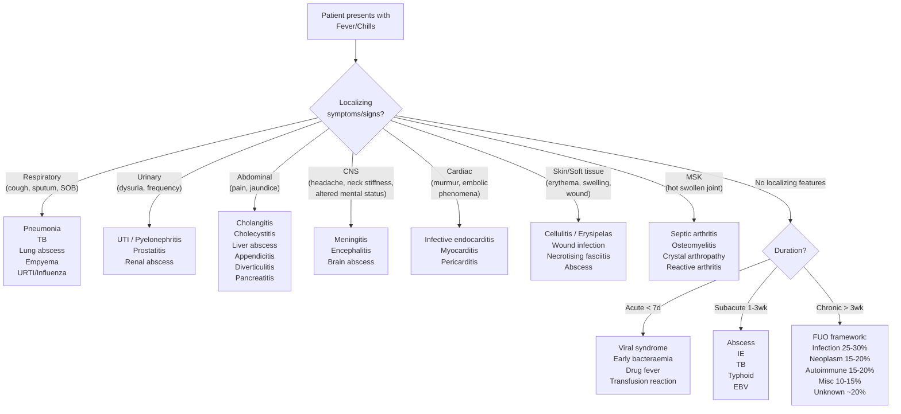

## Differential Diagnosis of Fever/Chills

### The Thinking Framework

Before diving into a list, let's understand *how* to think about differential diagnosis for fever. Fever is a **symptom**, not a disease. It is the body's universal alarm signal — the final common pathway of PGE₂-mediated hypothalamic set-point elevation, triggered by almost any process that releases endogenous pyrogens (IL-1, IL-6, TNF-α). This means the differential is enormous and you need a systematic framework to narrow it down.

The approach hinges on three questions asked in sequence:

1. **What is the clinical context?** (Community-acquired vs hospital-acquired vs post-operative vs immunocompromised vs returned traveller vs paediatric)
2. **What is the duration?** (Acute < 7 days → mostly self-limiting viral or acute bacterial; Subacute 1–3 weeks → abscess, TB, IE; Chronic > 3 weeks → FUO framework)
3. **What are the localizing clues?** (History, examination and basic investigations narrow the enormous list to a handful of possibilities)

> ***"Prolonged fever is usually an uncommon presentation of a common disorder (unless recent travel, especially to the tropics)"*** [3]

> ***"Fever in the elderly is sepsis until proved otherwise (especially lungs and urinary tract)"*** [3]

---

### Murtagh's Diagnostic Strategy for Prolonged Fever

This is the high-yield lecture framework and should be your default structure in exams [3]:

#### ***Probability Diagnoses*** (Common — Think of These First)

| Diagnosis | Why It's Common | Key Discriminating Feature |
|-----------|----------------|--------------------------|
| ***Pyogenic abscess (anywhere, e.g. liver, pelvis)*** [3] | Abscesses are walled-off pockets of infection that the immune system cannot fully clear → persistent antigenic stimulation → continuous cytokine/pyrogen release → ***spiking/swinging fever with chills and rigors*** [4] | Swinging fever pattern, localizing pain (RUQ for liver abscess, pelvic pain for pelvic abscess), ↑CRP/WCC, ***tender hepatomegaly*** for liver abscess. CT shows rim-enhancing collection |
| ***Pneumonia (viral, bacterial, atypical)*** [3] | Lungs have enormous surface area constantly exposed to inhaled pathogens; alveolar macrophages activate → cytokine cascade → fever. ***Accounts for 17.6% of deaths in HK*** [5] | Cough, sputum, pleuritic chest pain, dyspnoea; crackles/bronchial breathing on auscultation; consolidation on CXR |
| ***Epstein–Barr mononucleosis*** [3] | EBV infects B-lymphocytes via CD21 → massive CD8+ T-cell response → cytokine storm → prolonged fever (can last 2–4 weeks). Very common in young adults. | Triad of ***fever + tonsillar pharyngitis + lymphadenopathy*** (posterior cervical) [17]; splenomegaly (50–60%); atypical lymphocytosis on PBS; morbilliform rash after ampicillin |
| ***Viral upper respiratory tract infection*** [3] | The most common communicable disease worldwide; innate immune response to viral replication → interferon and cytokine release → fever (usually low-grade, self-limiting < 7 days) [18] | Rhinorrhoea, sneezing, sore throat, malaise; no consolidation on CXR; WCC normal or ↓ |
| ***Urinary infection (including chronic pyelonephritis)*** [3] | Ascending infection from urethra → bladder → kidney. ***Most common cause of fever in the elderly*** [6], often with atypical/non-specific presentation. | Dysuria, frequency, urgency (cystitis); loin pain, fever with rigors, ***Murphy's kidney punch*** tenderness (pyelonephritis) [19]; positive urine dipstick (nitrites, leukocyte esterase) |

#### ***Serious Disorders Not to Be Missed***

These are the "must-not-miss" diagnoses — either because they are life-threatening if delayed or because they have a narrow treatment window.

**Vascular:**
| Diagnosis | Key Features |
|-----------|-------------|
| ***Vasculitides (polyarteritis nodosa, giant cell arteritis/polymyalgia rheumatica)*** [3] | PAN: systemic necrotizing vasculitis of medium arteries → ***fever, weight loss, tender subcutaneous nodules, mononeuritis multiplex, renal insufficiency*** [20]. GCA/PMR: elderly > 50y, new-onset temporal headache, jaw claudication, ↑↑ESR (often > 100), risk of permanent visual loss from anterior ischaemic optic neuropathy → start steroids immediately if suspected |

**Infection:**
| Diagnosis | Key Features & Why It Matters |
|-----------|------------------------------|
| ***HIV/AIDS*** [3] | Acute seroconversion illness (2–6 weeks post-exposure): fever, pharyngitis, rash, lymphadenopathy, myalgia — mimics EBV. Advanced HIV: opportunistic infections (PCP, CMV, MAC, Cryptococcus, Toxoplasma) cause persistent fever |
| ***Malaria and other tropical diseases*** [3] | *P. falciparum* = medical emergency. Cyclical fevers (tertian/quartan) with rigors. Travel to endemic area within 1 year. Thick/thin blood film is diagnostic |
| ***Zoonoses (e.g. leptospirosis, Q fever, listeriosis)*** [3] | Leptospirosis: rat urine exposure, biphasic fever + conjunctival suffusion + myalgia + jaundice + AKI (Weil's disease). Q fever: *Coxiella burnetii*, farm animal contact → atypical pneumonia, hepatitis, culture-negative endocarditis [9] |
| ***Typhoid/paratyphoid fever*** [3] | *Salmonella typhi/paratyphi*: faecal-oral transmission, travel to South Asia. Step-ladder fever (first week), relative bradycardia, rose spots, hepatosplenomegaly. Blood culture (1st week) or stool culture (2nd week) |
| ***Tuberculosis*** [3] | ***TB should be considered in ALL cases of pyrexia of unknown origin*** [21]. HK prevalence ~60/100k. Pulmonary TB: chronic cough, haemoptysis, night sweats, weight loss, upper lobe cavitary lesion. Extrapulmonary: TB meningitis (***insidious onset, CN palsies, CSF lymphocytic pleocytosis, ↓glucose, ↑↑protein***) [8], miliary TB (diffuse micronodular CXR pattern) [21], cryptic TB in elderly |
| ***Osteomyelitis*** [3] | Haematogenous (children, vertebral bodies) or contiguous spread (diabetic foot). Persistent fever + localized bony pain + ↑ESR/CRP. MRI is gold standard imaging |
| ***Chronic septicaemia/bacteraemia*** [3] | Persistent or intermittent bacteraemia from uncontrolled focus: abscess, infected prosthetic material, endovascular graft infection |
| ***Infective endocarditis*** [3] | ***Persistent fever in susceptible individuals*** (prosthetic valves, structural heart disease, IVDU) [9]. ***Changing murmurs***, Osler nodes, Janeway lesions, splinter haemorrhages, embolic phenomena (stroke, renal infarcts). ***Blood culture + echocardiography*** are key investigations. Diagnosed by ***Modified Duke Criteria*** [9] |
| ***Lyme disease*** [3] | *Borrelia burgdorferi* from tick bite. Erythema migrans (target lesion) → disseminated (CN VII palsy, carditis, polyarthritis) → late (chronic arthritis, encephalopathy). Rare in HK but consider in travellers from endemic areas |
| ***Syphilis (secondary)*** [3] | *Treponema pallidum*. Secondary syphilis: widespread maculopapular rash (including palms/soles — classic!), condylomata lata, mucous patches, fever, lymphadenopathy, 4–10 weeks after primary chancre. Serology: VDRL/RPR screen → confirm with FTA-ABS/TPHA |

**Cancer:**
| Diagnosis | Key Features |
|-----------|-------------|
| ***Lymphoma and leukaemia*** [3] | Lymphoma: B symptoms (fever, night sweats, > 10% weight loss in 6 months), painless lymphadenopathy, hepatosplenomegaly. Leukaemia: ***marrow failure (anaemia, neutropenic infections, bleeding) + organ infiltration*** [22]. ***Fever in leukaemia is usually due to infection (especially in neutropenic fever) rather than tumour fever*** [22] |
| ***Solid cancers (e.g. lung, kidney)*** [3] | Renal cell carcinoma: classic "internist's tumour" with paraneoplastic fever, polycythaemia, hypercalcaemia. HCC: consider in HK given high HBV prevalence. Tumour fever from cytokine release (IL-6, TNF-α) |
| ***Disseminated [malignancy]*** [3] | Widespread metastatic disease → tissue necrosis → DAMP release → cytokine-mediated fever |

**Other:**
| Diagnosis | Key Features |
|-----------|-------------|
| ***Inflammatory bowel disease (e.g. Crohn's disease)*** [3] | Crohn's: fever + abdominal pain + diarrhoea (often bloody) + weight loss. Extra-intestinal manifestations (erythema nodosum, pyoderma gangrenosum, uveitis, arthritis). Can form intra-abdominal abscesses/fistulae → secondary fever |

#### ***Pitfalls (Often Missed)***

These are the diagnoses that clinicians frequently overlook — high yield for exams because they test your breadth of thinking [3]:

| Diagnosis | Why It's Missed | Key Clues |
|-----------|----------------|-----------|
| ***Connective tissue disorder (e.g. rheumatoid arthritis, systemic lupus erythematosus)*** [3] | Fever may precede the classic joint/skin manifestations by weeks. SLE can present as isolated fever (especially in young women). Adult-onset Still's disease: quotidian spiking fever + evanescent salmon rash + arthralgia + sore throat + ferritin ↑↑↑ | ANA, dsDNA, complement levels; ferritin for Still's |
| ***Sarcoidosis*** [3] | Granulomatous inflammation → cytokine release → low-grade fever. Non-caseating granulomas can affect any organ. | Bilateral hilar lymphadenopathy on CXR, ↑ACE, erythema nodosum, uveitis, hypercalcaemia |
| ***Drug idiosyncrasies*** [3] | Patient appears "paradoxically well" for degree of fever. Type IV hypersensitivity → onset 7–10 days after starting drug. Common culprits: antibiotics, anticonvulsants, allopurinol | Temporal relationship to drug initiation; resolves within 48–72h of drug cessation; peripheral eosinophilia in some cases |

#### ***Rarities***

| Diagnosis | Key Features |
|-----------|-------------|
| ***Factitious fever*** [3] | Self-induced or fabricated; suspect in young healthcare workers with atypical fever patterns, no objective cause, temperature discrepancies between sites (e.g. rectal vs tympanic). Pulse-temperature dissociation (no tachycardia despite "high fever"). No diaphoresis during defervescence |

<Callout title="The 20% Rule" type="idea">
***Up to 20% of FUO cases remain unknown*** even after extensive workup [3]. This is important to remember — not every fever will yield a diagnosis, and many of these patients have a benign course with spontaneous resolution.
</Callout>

---

### System-Based Differential Diagnosis Algorithm

The following diagram shows how to narrow the differential based on localizing features from history and examination:

---

### Differential Diagnosis by Clinical Setting

#### Post-Operative Fever

Already covered in the prior section — the **5/7 W's** framework [12]. Key point: **the timing narrows the differential**.

| Days Post-Op | Most Likely | Second-Line Considerations |
|-------------|-------------|---------------------------|
| 0–2 | ***Wind (atelectasis)*** | Malignant hyperthermia, transfusion reaction, pre-existing infection |
| 3–5 | ***Water (UTI), Anastomotic leak*** | Pneumonia (aspiration), CLABSI |
| 5–7 | ***Wound (SSI)*** | C. diff colitis, acalculous cholecystitis |
| 5+ | ***Walking (DVT/PE)*** | — |
| 7–10 | ***Wonder drugs (drug fever)*** | — |
| Any | ***Withdrawal, Wonky glands*** | Infected central line, acute pancreatitis [12] |

#### Neutropenic Fever

***ANC ≤ 0.5 × 10⁹/L + fever > 38.3°C or > 38°C for > 1h*** [2]

The differential is narrowed by the immunosuppressed state:
- **Bacterial** (most common): Gram-negative bacilli (E. coli, Klebsiella, Pseudomonas), Gram-positive cocci (S. aureus, coagulase-negative staph from lines, viridans strep)
- **Fungal** (if prolonged neutropenia > 7 days or refractory fever): Candida spp, Aspergillus spp
- **Viral**: HSV reactivation, CMV
- **No identifiable source** in ~30–50% of cases — but empirical antibiotics are still mandatory

<Callout title="Neutropenic Fever Is a Medical Emergency" type="error">
Classic signs of infection (pus, infiltrate on CXR, localizing signs) may be **absent** because neutrophils are needed to generate these responses. A low threshold for empirical broad-spectrum antibiotics (within 60 minutes) is critical. Even the perianal area must be examined (but avoid rectal thermometers or DRE in severely neutropenic patients due to mucosal disruption risk).
</Callout>

#### Returned Traveller with Fever

| Incubation | Diagnoses to Consider |
|-----------|----------------------|
| Short (< 2 weeks) | Dengue, chikungunya, Zika, influenza, acute HIV, rickettsial disease, leptospirosis, acute hepatitis A/E |
| Medium (2–6 weeks) | ***Malaria*** (can present up to 1 year), typhoid/paratyphoid, acute hepatitis B, acute schistosomiasis (Katayama fever), amoebiasis, brucellosis |
| Long (> 6 weeks) | TB, visceral leishmaniasis, amoebic liver abscess (***onset usually within 8–20 weeks, 95% within 5 months***) [7], chronic hepatitis, HIV |

> The **three mandatory investigations** in a returned traveller with fever: thick and thin blood film for malaria, blood cultures, and dengue serology (if travel to endemic area).

#### Fever in Specific HK-Relevant Settings

| Scenario | Top Differentials |
|----------|------------------|
| **Diabetic patient + spiking fever + RUQ pain** | ***Klebsiella pneumoniae liver abscess*** — must screen for ***endophthalmitis*** and meningitis [4][7][15] |
| **Elderly + non-specific ↓GC + fever** | ***UTI, pneumonia, TB*** (including cryptic/miliary TB) [3][6][21] |
| **Raw pork consumption** | ***Streptococcus suis meningitis*** — classic HK/South China entity [8] |
| **IVDU + fever** | ***Right-sided IE (S. aureus)*** [3][9], skin/soft tissue abscess, hepatitis B/C, septic arthritis |
| **Recent antibiotic course + fever + diarrhoea** | ***Clostridioides difficile colitis*** [12] |
| **Young woman + fever + joint pain + rash** | SLE, adult-onset Still's disease, viral arthritis, disseminated gonococcal infection |

#### Fever in the Paediatric Setting

The lecture slides provide a specific paediatric framework [23]:

***Serious disorders not to be missed in the febrile child*** [23]:
- ***Acute appendicitis***
- ***Tuberculosis***
- ***Rheumatic fever***
- ***Endocarditis***
- ***Tropical infections e.g. malaria***
- ***Atypical infections e.g. zoonoses***
- ***Henoch-Schönlein purpura*** (IgA vasculitis — fever + purpuric rash on buttocks/lower limbs + abdominal pain + arthralgia + renal involvement)
- ***Kawasaki disease (persistent fever)*** — fever ≥ 5 days + ≥ 4 of: bilateral non-exudative conjunctivitis, oral mucous membrane changes, polymorphous rash, extremity changes (erythema/oedema → desquamation), cervical lymphadenopathy. Risk of coronary artery aneurysms if untreated
- ***Heatstroke/hot car***
- ***Neuroblastoma/sarcoma*** [23]
- ***Masquerades checklist: drugs (e.g. penicillin, antihistamines), UTI*** [23]
- ***Is the patient trying to tell me something? → Parental or Munchausen by proxy*** [23]

***Key paediatric history*** [23]: ***detailed account from parents — vomiting, diarrhoea, sweating, cough, wheeze, headache, other pain, cognition, photophobia, urinary symptoms. Ask about immunisation (past and recent), infectious contacts, animal contact and travel. Past history: ?splenectomy***

***Key paediatric examination*** [23]: ***appearance, interaction and level of activity, colour, hydration, chest movement, vital signs including peripheral perfusion. Examine skin for rashes, vesicles and purpura. Examine ears and throat. Basic neurological signs, especially neck stiffness and fontanelles***

---

### Distinguishing Between Key DDx Pairs

Some differential diagnoses are commonly confused. Here is how to tell them apart, explained from first principles:

| DDx Pair | Key Distinguishing Features |
|----------|---------------------------|
| **Pyogenic vs Amoebic liver abscess** | Pyogenic: often polymicrobial, ***multiple abscesses***, blood culture +ve in 50%; Amoebic: single R lobe abscess (90%), ***anchovy paste aspirate***, ***amoebic serology +ve (92–97% at presentation)***, ***travel to endemic area***, ***bloody dysentery in < 1/3*** [7]. Both cannot be distinguished by CT [7] |
| **Bacterial meningitis vs TB meningitis** | Bacterial: ***acute onset*** (hours to 1–2 days), CSF shows ↑↑PMNs, ↓glucose, ↑protein; TB: ***subacute/insidious onset*** (days to weeks), CSF shows ↑lymphocytes, ↓↓glucose, ↑↑↑protein (can be very high 2–6 g/dL) [8][21], CN palsies, basal meningeal enhancement |
| **Pneumonia vs PE** | Both can cause fever, pleuritic chest pain, dyspnoea, CXR changes. PE: ***sudden onset, risk factors for VTE, no consolidation*** (but Hampton hump or Westermark sign possible), tachycardia out of proportion, D-dimer ↑↑, CTPA diagnostic. Pneumonia: productive cough, consolidation on CXR, ↑WCC with neutrophilia |
| **Infective endocarditis vs occult abscess** | Both cause persistent fever. IE: ***changing murmur, embolic phenomena (stroke, Roth spots, Janeway, Osler), +ve blood cultures, vegetation on echo*** [9]. Abscess: localizing pain/tenderness, swinging fever, CT shows collection |
| **Drug fever vs infection** | Drug fever: patient "paradoxically well", onset 7–10 days after drug, may have relative bradycardia, peripheral eosinophilia, resolves 48–72h after drug cessation. Infection: source usually identifiable, localizing signs, WCC/CRP usually ↑↑ |
| **Lymphoma vs infection** | Both can present with fever, night sweats, weight loss, lymphadenopathy. Lymphoma: ***painless, rubbery, non-tender LNs***; alcohol-induced LN pain (rare but pathognomonic for Hodgkin); LN biopsy diagnostic. Infection: tender LNs, ↑WCC, positive cultures |

---

### Summary Table: Full Differential of Prolonged Fever (Murtagh Framework)

| Category | Diagnoses |
|----------|-----------|
| ***Probability diagnoses*** | Pyogenic abscess, pneumonia, EBV mononucleosis, viral URTI, urinary infection [3] |
| ***Vascular*** | Vasculitides (PAN, GCA/PMR) [3] |
| ***Infection*** | HIV/AIDS, malaria/tropical diseases, zoonoses (leptospirosis, Q fever, listeriosis), typhoid/paratyphoid, TB, osteomyelitis, chronic septicaemia, IE, Lyme disease, secondary syphilis [3] |
| ***Cancer*** | Lymphoma/leukaemia, solid cancers (lung, kidney), disseminated malignancy [3] |
| ***Other*** | IBD (Crohn's) [3] |
| ***Pitfalls (often missed)*** | CTD (RA, SLE), sarcoidosis, drug idiosyncrasies [3] |
| ***Rarities*** | Factitious fever [3] |
| ***Unknown*** | Up to 20% of FUO [3] |

<Callout title="High Yield Summary — Differential Diagnosis of Fever/Chills">

**Default framework**: Murtagh's strategy — probability diagnoses first (abscess, pneumonia, EBV, URTI, UTI), then serious-not-to-miss (infections: HIV, malaria, TB, IE, typhoid; cancers: lymphoma, leukaemia, RCC; vascular: vasculitides), then pitfalls (CTD, sarcoidosis, drug fever), then rarities (factitious fever).

**Localizing approach**: Respiratory → pneumonia/TB; Urinary → UTI/pyelonephritis; Abdominal → cholangitis/liver abscess; CNS → meningitis/encephalitis; Cardiac → IE/myocarditis; MSK → septic arthritis/osteomyelitis; Skin → cellulitis/SSI.

**No localizing features**: Use duration — acute (viral), subacute (abscess/IE/TB/typhoid), chronic (FUO framework).

**HK-specific**: TB (all unexplained fever!), Klebsiella liver abscess (DM), S. suis meningitis (raw pork), dengue, high HBV prevalence (HCC).

**Post-op**: 5 W's by timing. **Neutropenic fever**: medical emergency, 60-min door-to-antibiotic.

**Paediatric "must-not-miss"**: Kawasaki disease (persistent fever > 5 days), rheumatic fever, meningitis, appendicitis, HSP.

**Up to 20% of FUO remains unknown** — this is a normal outcome, not a clinical failure.

</Callout>

---

<ActiveRecallQuiz
  title="Active Recall - Differential Diagnosis of Fever/Chills"
  items={[
    {
      question: "List the 5 probability diagnoses for prolonged fever according to Murtagh's diagnostic strategy.",
      markscheme: "1. Pyogenic abscess (anywhere, e.g. liver, pelvis). 2. Pneumonia (viral, bacterial, atypical). 3. Epstein-Barr mononucleosis. 4. Viral upper respiratory tract infection. 5. Urinary infection (including chronic pyelonephritis).",
    },
    {
      question: "Name 3 'pitfall' diagnoses that are often missed in prolonged fever, and explain why each is easily missed.",
      markscheme: "1. Connective tissue disorders (RA, SLE) - fever may precede classic joint/skin manifestations. 2. Sarcoidosis - low-grade fever with non-specific symptoms, granulomatous inflammation may not be suspected. 3. Drug idiosyncrasies - patient appears paradoxically well for degree of fever, temporal relationship to drug may not be recognized. All three are non-infectious mimics of infection.",
    },
    {
      question: "A 60-year-old diabetic man from Hong Kong presents with 5 days of spiking fever, rigors, and RUQ pain. Blood cultures grow Klebsiella pneumoniae. What is your diagnosis, and what two extra-hepatic complications must you urgently screen for?",
      markscheme: "Diagnosis: Klebsiella pneumoniae pyogenic liver abscess (classic in East Asian diabetic patients). Must urgently screen for: 1. Endogenous endophthalmitis (consult ophthalmology urgently if any ocular symptoms - Klebsiella is 60% of cases in East Asia). 2. Meningitis (meningitic-dose ceftriaxone 2g Q12h if suspected). Also consider colonoscopy for underlying colorectal neoplasm.",
    },
    {
      question: "How do you distinguish bacterial meningitis from TB meningitis based on clinical features and CSF findings?",
      markscheme: "Bacterial meningitis: acute onset (hours to 1-2 days), CSF shows high PMNs (neutrophilic), low glucose, moderately raised protein. TB meningitis: subacute/insidious onset (days to weeks), CSF shows lymphocytic predominance, very low glucose, very high protein (can be 2-6 g/dL), often with cranial nerve palsies (esp III, IV, VI, VIII) and basal meningeal enhancement on imaging.",
    },
    {
      question: "In the paediatric setting, name 3 serious conditions presenting with persistent fever that are specific 'must-not-miss' diagnoses and briefly describe one key feature of each.",
      markscheme: "1. Kawasaki disease - persistent fever >= 5 days with mucocutaneous features (conjunctivitis, oral changes, rash, extremity changes, cervical LN); risk of coronary artery aneurysms. 2. Rheumatic fever - follows group A strep pharyngitis; Jones criteria (carditis, polyarthritis, chorea, erythema marginatum, subcutaneous nodules). 3. Meningitis - fever with neck stiffness, photophobia, bulging fontanelle in infants; LP is diagnostic.",
    },
    {
      question: "What is the FUO definition and what percentage of cases remain undiagnosed? Name the four classic categories and their approximate proportions.",
      markscheme: "FUO: fever >= 38.3C for >= 3 weeks without diagnosis after appropriate investigation. Up to 20% remain undiagnosed. Four categories: 1. Infection (25-30%): TB, abscess, IE. 2. Neoplasm (15-20%): lymphoma, leukaemia, RCC. 3. Autoimmune/inflammatory (15-20%): Still's disease, SLE, vasculitis, sarcoidosis. 4. Miscellaneous (10-15%): drug fever, factitious, PE, thyroiditis.",
    },
  ]}
/>

---

## References

[2] Senior notes: Ryan Ho Haemtology.pdf (Neutropenic Fever, p. 70)
[3] Lecture slides: murtagh merge.pdf (Fever that is prolonged, pp. 52–53)
[4] Senior notes: maxim.md (Liver abscess section, p. 258)
[5] Senior notes: Ryan Ho Respiratory.pdf (Pneumonia, p. 61)
[6] Senior notes: Ryan Ho Urogenital.pdf (UTI in elderly, p. 128)
[7] Senior notes: Ryan Ho GI.pdf (Liver Abscess — Pyogenic p. 237, Amoebic p. 239)
[8] Senior notes: Ryan Ho Neurology.pdf (Meningitis, pp. 142, 144)
[9] Senior notes: Ryan Ho Cardiology.pdf (Infective Endocarditis, pp. 148–149)
[12] Senior notes: maxim.md (Post-op fever, pp. 61, 64)
[15] Senior notes: Ryan Ho Opthalmology.pdf (Endophthalmitis, p. 32)
[17] Senior notes: Ryan Ho Respiratory.pdf (Infectious mononucleosis, p. 53)
[18] Senior notes: Ryan Ho Respiratory.pdf (URTI, p. 48)
[19] Senior notes: Ryan Ho Urogenital.pdf (Acute Pyelonephritis, p. 127)
[20] Senior notes: Ryan Ho Rheumatology.pdf (PAN, p. 159)
[21] Senior notes: Ryan Ho Respiratory.pdf (TB — cryptic/miliary, pp. 79, 81)
[22] Senior notes: Ryan Ho Haemtology.pdf (Acute Leukaemia, p. 51)
[23] Lecture slides: murtagh merge.pdf (The febrile child, p. 94)
