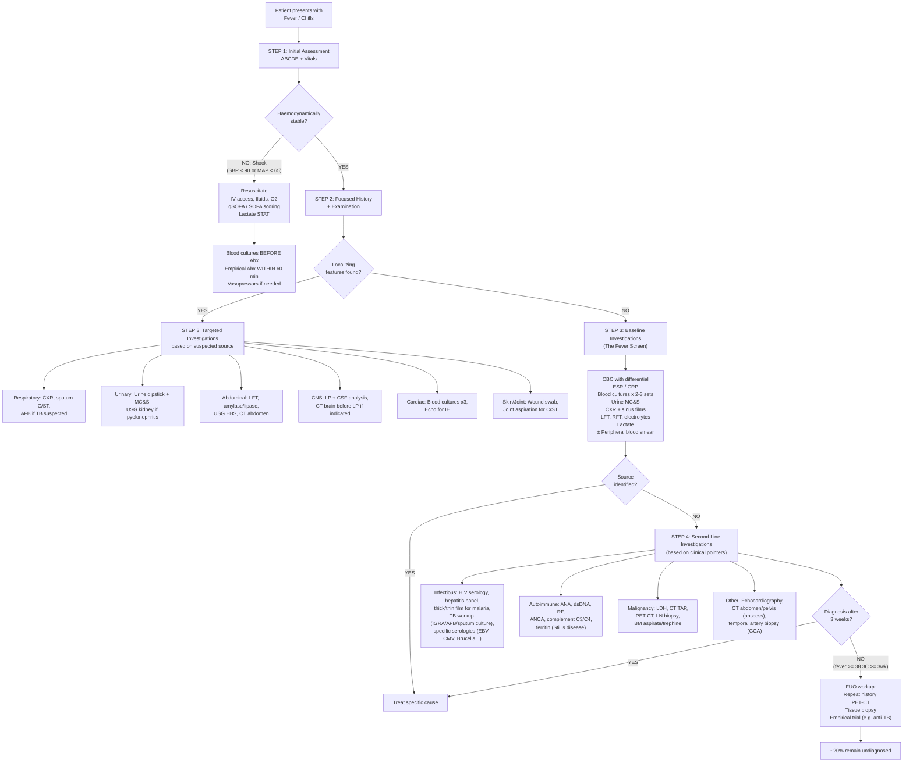

## Diagnostic Criteria, Algorithm and Investigation Modalities for Fever/Chills

### Conceptual Preamble — What Are We Actually Diagnosing?

Here's the crucial distinction: **fever itself is not a diagnosis — it is a sign**. You don't diagnose "fever"; you diagnose the *cause* of the fever. Therefore, the diagnostic workup for fever/chills is fundamentally a **source-seeking exercise**. The investigations you choose are driven by the clinical context and localizing clues, not by the fever itself.

That said, certain specific fever syndromes **do** have formal diagnostic criteria (sepsis, FUO, neutropenic fever, and specific causes like IE, cholangitis, etc.), and understanding these is essential.

---

### Formal Diagnostic Criteria for Key Fever Syndromes

#### 1. Sepsis and Septic Shock (Sepsis-3, 2016)

These criteria identify when fever has crossed the line from "body fighting infection" into "body destroying itself through dysregulated immune response" [14]:

| Term | Criteria | Rationale |
|------|----------|-----------|
| ***Sepsis*** | Suspected/documented infection + acute change in ***SOFA score ≥ 2*** [14] | SOFA assesses 6 organ systems (respiratory, coagulation, liver, cardiovascular, CNS, renal). A rise ≥ 2 indicates new organ dysfunction attributable to infection |
| ***Septic shock*** | Sepsis + ***vasopressor requirement for MAP ≥ 65 mmHg*** + ***serum lactate > 2 mmol/L*** despite adequate fluid resuscitation [14] | Lactate > 2 reflects cellular hypoxia from inadequate O₂ delivery; vasopressor need reflects persistent vasodilation despite volume |
| ***qSOFA*** (screening) | ≥ 2 of: ***RR ≥ 22/min, sBP ≤ 100 mmHg, altered GCS < 15*** [14] | Quick bedside tool for *out-of-ICU* patients; qSOFA ≥ 2 → mortality ≥ 10%, prompts SOFA assessment |

**SOFA Score components** (each scored 0–4, total 0–24):

| System | Parameter | 0 | 1 | 2 | 3 | 4 |
|--------|-----------|---|---|---|---|---|
| Respiratory | PaO₂/FiO₂ | ≥ 400 | < 400 | < 300 | < 200 with vent | < 100 with vent |
| Coagulation | Platelets (×10⁹/L) | ≥ 150 | < 150 | < 100 | < 50 | < 20 |
| Liver | Bilirubin (µmol/L) | < 20 | 20–32 | 33–101 | 102–204 | > 204 |
| Cardiovascular | MAP or vasopressors | MAP ≥ 70 | MAP < 70 | Dopa ≤ 5 or dobutamine | Dopa > 5 or epi ≤ 0.1 or norepi ≤ 0.1 | Dopa > 15 or epi > 0.1 or norepi > 0.1 |
| CNS | GCS | 15 | 13–14 | 10–12 | 6–9 | < 6 |
| Renal | Creatinine (µmol/L) or UO | < 110 | 110–170 | 171–299 | 300–440 or UO < 500mL/d | > 440 or UO < 200mL/d |

<Callout title="SIRS vs Sepsis-3" type="error">
***SIRS criteria are NO LONGER used to define sepsis*** (since 2016) because SIRS criteria are ***present in many hospitalized patients who do not develop infection*** and their ***ability to predict death is poor compared to SOFA*** [1]. However, SIRS is still used for non-infectious systemic inflammation (pancreatitis, burns). The old SIRS criteria:
- ***Temperature > 38°C or < 36°C***
- ***HR > 90 bpm***
- ***RR > 20/min or PaCO₂ < 32 mmHg***
- ***WBC > 12,000 or < 4,000 or > 10% bands*** [1]
</Callout>

#### 2. Fever of Unknown Origin (FUO)

Classic Petersdorf & Beeson definition (modified) [3]:
- ***Fever ≥ 38.3°C***
- ***Duration ≥ 3 weeks***
- ***No diagnosis after appropriate investigation*** (including at least 3 outpatient visits or 3 days in hospital)

Why these specific thresholds? The 38.3°C cutoff excludes low-grade habitual hyperthermia and physiological variation. The 3-week duration ensures self-limiting viral illnesses have resolved. The investigation requirement prevents premature labelling.

***Up to 20% remain unknown*** [3].

#### 3. Neutropenic Fever

***ANC ≤ 0.5 × 10⁹/L*** (or ≤ 1.0 × 10⁹/L with predicted decline to ≤ 0.5 within 24–48h) ***+ pyrexia > 38.3°C or > 38.0°C sustained for > 1 hour*** [2]

Why this matters: neutrophils are your main defence against bacteria and fungi. Below 0.5 × 10⁹/L, the risk of life-threatening infection is very high, and classical signs (pus, consolidation, erythema) may be absent because neutrophils are needed to generate these responses.

#### 4. Diagnostic Criteria for Specific Fever-Causing Conditions

These come into play once clinical features point toward a specific source:

**a. Infective Endocarditis — Modified Duke Criteria** [9]

| Category | Criteria |
|----------|---------|
| ***Pathological (definite)*** | Micro-organisms demonstrated in a vegetation OR IE confirmed by histology |
| ***Clinical — Definite IE*** | ***2 major OR 1 major + 3 minor OR 5 minor*** |
| ***Clinical — Possible IE*** | ***1 major + 1 minor OR 3 minor*** |

***Major criteria:***
1. ***Positive blood culture***: typical organisms in ***2 separate cultures or > 12h apart*** (S. aureus, viridans strep, S. bovis, HACEK, community-acquired enterococci without primary focus) OR organisms more commonly skin contaminants in ***3 or majority of ≥ 4 separate cultures*** (1st and last drawn ≥ 1h apart) OR single positive culture or phase I IgG titre > 1:800 for *Coxiella burnetii* [9]
2. ***Evidence of endocardial involvement***: vegetation, abscess, or prosthetic valve dehiscence on echo OR ***new valvular regurgitation*** (change in pre-existing murmur not sufficient) [9]

***Minor criteria*** (mnemonic: ***Bacterial Endocarditis FIVE PM*** [9]):
- ***Bacteria isolated*** (suggestive but not meeting major criterion)
- ***Endocardial involvement*** — not applicable as minor (covered in major)
- ***Fever ≥ 38.0°C***
- ***Immunological phenomena***: GN, Osler nodes, Roth spots, ↑RF
- ***Vascular phenomena***: embolism, septic PE, mycotic aneurysm, Janeway lesion, conjunctival haemorrhage
- ***Predisposition***: VHD/cardiac conditions or IVDU
- ***Microbiological evidence*** (minor level)

**b. Acute Cholangitis — Tokyo Guidelines 2018 (TG18)** [13][24]

***Suspected diagnosis*** = ONE of (fever/shaking chills OR lab evidence of inflammation: abnormal WBC/↑CRP) ***AND*** ONE of (jaundice OR abnormal liver chemistries: ↑AST/ALT/ALP/GGT) [13]

***Definite diagnosis*** = Suspected criteria met ***PLUS BOTH*** biliary dilation on imaging ***AND*** evidence of aetiology (stone, stricture, stent) [13]

**c. Acute Cholecystitis — Tokyo Guidelines 2013 (TG13)** [24][25]

| Component | Criteria |
|-----------|---------|
| ***A: Local signs*** | ***Murphy's sign*** (Sens 50–65%, Spec 79–96%) OR ***RUQ mass/pain/tenderness*** |
| ***B: Systemic signs*** | ***Fever*** OR ***↑CRP > 3 mg/dL*** OR ***↑WBC*** |
| ***C: Imaging*** | Findings characteristic of acute cholecystitis (thick wall > 3mm, distended GB, pericholecystic fluid) |
| ***Suspected*** | ***1× A + 1× B*** |
| ***Definite*** | ***1× A + 1× B + 1× C*** [24] |

**d. Acute Pancreatitis — Revised Atlanta Classification 2013** [26]

***Diagnosis requires ≥ 2 of 3:***
1. ***Acute onset of persistent, severe epigastric pain often radiating to the back*** (Clinical)
2. ***Serum amylase or lipase ≥ 3× upper limit of normal*** (Biochemical)
3. ***Characteristic imaging findings*** on USG, CT or MRI (Radiological) [26]

---

### The Diagnostic Algorithm — A Systematic Approach

The following algorithm represents the clinical reasoning pathway from "patient with fever" to "specific diagnosis":

---

### Investigation Modalities — Detailed Interpretation

#### Tier 1: The Basic Fever Screen

These should be ordered for **every** patient with significant fever. ***The basics are: FBE, ESR/CRP, CXR and sinus films, urine MC, routine blood chemistry, LFTs, blood culture.*** [3]

| Investigation | What It Measures | Key Findings in Fever | Interpretation from First Principles |
|--------------|-----------------|----------------------|-------------------------------------|
| ***FBE / CBC with differential*** [3] | Cell counts + WBC subtypes | **Leukocytosis with neutrophilia**: bacterial infection. **Left shift** (↑bands/metamyelocytes): marrow mobilizing immature neutrophils under stress — indicates ***severe infection/sepsis*** [27]. **Leukopenia**: overwhelming sepsis (marrow exhaustion), viral, typhoid. **Lymphocytosis**: viral, TB, lymphoma. **Atypical lymphocytes**: ***EBV (prototypical)***, other viral infections — these are activated CD8+ T cells, ***NOT neoplastic*** [27]. **Eosinophilia**: parasites, drug reaction, vasculitis. **Pancytopenia**: marrow infiltration, overwhelming sepsis, aplastic crisis | The differential count tells you *which arm of the immune system* is responding: neutrophils → bacterial; lymphocytes → viral/chronic; eosinophils → parasitic/allergic |
| ***Peripheral blood smear (PBS)*** [27] | Morphology | **Left shift**: band forms, metamyelocytes → severe infection. ***Leukoerythroblastic picture***: left shift + nucleated RBCs ± tear drop cells → ***marrow infiltration*** [27]. **Blasts ≥ 20%**: diagnostic of ***acute leukaemia*** [22]. ***Auer rods***: confirm myeloblasts (AML). **Schistocytes**: microangiopathic haemolysis (DIC, TTP-HUS). **Smudge cells**: CLL. **Malaria parasites**: thick film for detection, thin film for speciation | PBS is the single most information-dense haematological investigation — always correlate with clinical picture |
| ***ESR*** [3] | Rate of RBC sedimentation (mm/h) | ↑ in inflammation (slow to rise, slow to fall). Very ↑ ESR (> 100): myeloma, TB, abscess, lymphoma, GCA, autoimmune disease | ESR rises because acute phase proteins (fibrinogen, immunoglobulins) coat RBCs → ↑rouleaux → faster settling. It is non-specific but very high values narrow the differential |
| ***CRP*** [3] | Hepatic acute phase protein (mg/L) | Rises within 6–8h, peaks at 48h. > 100 mg/L: strongly suggests bacterial rather than viral infection. Very useful for monitoring treatment response (falls rapidly with effective therapy, half-life ~19h) | CRP is produced by hepatocytes in response to IL-6. It opsonizes pathogens and activates complement. More dynamic than ESR — better for acute monitoring |
| ***Blood cultures*** [3] | Identify bacteraemia/fungaemia | Gold standard for bloodstream infection. At least ***2 sets from different sites***, ***before antibiotics*** [9]. Each set = 1 aerobic + 1 anaerobic bottle. For IE: ***3 venous cultures at different sites, separated by ≥ 0.5h*** [9]; +3 more if initially negative. Sensitivity ~70–80% for true bacteraemia | Timing: ideally during spike/rigor (highest bacterial load in bloodstream). Why 2 sites? To distinguish true bacteraemia from contamination. If same organism in 2/2 sets → true; if only 1/2 → likely contaminant (especially CoNS, diphtheroids) |
| ***Urine MC&S*** [3] | Pyuria, bacteriuria, culture | **Dipstick**: nitrites (Gram-neg bacteria reduce urinary nitrates → nitrites; Gram-pos do NOT produce nitrites → can be false-neg), leukocyte esterase (enzyme from WBCs → surrogate for pyuria). **Microscopy**: WBC > 10/mm³ = pyuria. ***Culture**: ≥ 10⁵ CFU/mL (women), ≥ 10³ CFU/mL (men or catheterized)*** [19] | UTI is the most common cause of fever in the elderly [3][6]. A negative dipstick does not exclude UTI in the immunocompromised (may not mount pyuria) |
| ***CXR*** [3] | Lung parenchyma, mediastinum, pleura | **Consolidation** (air bronchograms): lobar pneumonia. **Patchy infiltrates**: bronchopneumonia. **Upper lobe cavitary lesion**: TB, lung abscess. **Bilateral hilar lymphadenopathy**: sarcoidosis, lymphoma. **Micronodular pattern**: miliary TB [21]. ***Right basal collapse/effusion***: liver abscess complication [7]. **Multiple cavitating lesions**: septic PE (right-sided IE) [9]. **Widened mediastinum**: aortic pathology | CXR should be done on every patient with fever and respiratory symptoms. Even without respiratory symptoms, CXR picks up unsuspected pathology ~10% of the time in unexplained fever |
| ***LFTs*** [3] | Hepatocellular and biliary markers | **Cholestatic pattern** (↑ALP, ↑GGT, ↑conjugated bilirubin): biliary obstruction → cholangitis, liver abscess [13]. **Hepatocellular pattern** (↑ALT, ↑AST): hepatitis (viral, drug, autoimmune). ***Hypoalbuminaemia***: negative acute phase reactant + chronic illness [7]. **↑bilirubin + ↑GGT should raise suspicion of CBD obstruction** [25] | The pattern of LFT derangement tells you *where* in the hepatobiliary system the problem is: hepatocyte damage → transaminases; duct obstruction → ALP/GGT/bilirubin |
| ***RFT + electrolytes*** [3] | Renal function, electrolytes | **↑Urea/Cr**: dehydration (pre-renal), sepsis-induced AKI (ATN), obstructive uropathy. **HypoNa**: SIADH (meningitis, pneumonia, malignancy), Addisonian crisis, dilutional. **HyperK**: AKI, Addisonian crisis, rhabdomyolysis | Monitor for sepsis-related organ dysfunction (renal component of SOFA score) |
| ***Lactate*** | Tissue perfusion marker | ***> 2 mmol/L***: indicates tissue hypoperfusion — ***septic shock criterion*** when combined with vasopressor need [14]. ***> 4 mmol/L***: severe tissue hypoxia, associated with high mortality | Lactate is produced when cells switch from aerobic to anaerobic metabolism due to inadequate O₂ delivery. In sepsis, this is multifactorial: ↓perfusion + mitochondrial dysfunction + ↑glycolysis from catecholamine surge. Serial lactate clearance is used to guide resuscitation |

<Callout title="Procalcitonin — The Bacterial vs Viral Discriminator">
**Procalcitonin (PCT)** is increasingly used in clinical practice. It is produced by thyroid C-cells and neuroendocrine cells throughout the body in response to **bacterial endotoxins and pro-inflammatory cytokines**. Crucially, IFN-γ (released during viral infections) **inhibits** PCT production. This means:
- **Bacterial infection**: PCT rises significantly (> 0.5 ng/mL suggestive, > 2 ng/mL strongly suggestive)
- **Viral infection**: PCT remains low (< 0.25 ng/mL)
- **Clinical utility**: Guides antibiotic de-escalation (stop antibiotics when PCT falling by > 80% from peak or < 0.25 ng/mL)
- **Limitations**: Can be elevated in non-infectious conditions (major surgery, burns, cardiogenic shock, severe trauma), and may be falsely low early in infection (< 6h)
</Callout>

#### Tier 2: Targeted Investigations by Suspected Source

***Other tests depend on clinical pointers (e.g. specific organisms, lymph node biopsy, HIV, tuberculosis, connective tissue auto-antibodies)*** [3]

| Suspected Source | Investigation | Key Findings & Interpretation |
|-----------------|---------------|------------------------------|
| **Liver abscess** | ***Blood culture*** (positive in up to 50%) [7]; ***USG abdomen*** (first-line: multiloculated cystic mass, no vascularity, septation, hypoechoic rim) [4][7]; ***CT abdomen with contrast*** (***double-target sign***: rim-enhancing with central hypodensity; ***cluster sign***) [4]; ***Image-guided aspiration for C/ST*** (***anchovy paste-like for amoebic***, pus for pyogenic) [4]; ***Amoebic serology*** (EIA for Ab: 92–97% positive at presentation, may be negative in first 7 days → repeat at 1 week) [7]; Blood glucose (DM screen); ***CXR*** (right basal collapse/effusion) [4][7] | CT ***CANNOT differentiate between pyogenic and amoebic*** liver abscess [7]. For Klebsiella: ***urgent eye consult if symptoms of endophthalmitis, monitor for meningitis, colonoscopy for underlying neoplasm*** [4] |
| **Cholangitis** | CBC (leukocytosis with neutrophilia), LFT (***↑ALP/GGT — cholestatic pattern, ↑conjugated bilirubin***), ***blood/bile culture*** (with sensitivity testing), ***USG HBS*** (dilated CBD > 6mm, ± stone), MRCP/ERCP if obstruction suspected [13] | Diagnosis: TG18 criteria (see above). Positive bile cultures are common with bile duct stones even without clinical cholangitis [13] |
| **Cholecystitis** | ***USG HBS*** (Sens 88%, Spec 80%: gallstones, thick wall > 3mm, distended GB, sonographic Murphy's sign, pericholecystic fluid) [25]; ***CT abdomen*** (Sens 94%, Spec 59%: fat stranding not seen on USG) [25]; ± HIDA scan (if USG equivocal: non-filling of GB = obstructed cystic duct, Sens 90–97%) [25] | TG13 criteria for diagnosis [24]. ***↑Bilirubin/GGT should raise suspicion of CBD obstruction*** [25] |
| **Pneumonia** | ***CXR*** (consolidation ± air bronchograms, parapneumonic effusion) [5]; Blood: CBC, RFT (↑urea = severity marker), LFT, ESR/CRP; ± ***ABG if SaO₂ < 93%*** [5]; Microbiology: sputum Gram stain and C/ST, blood cultures, urinary Legionella/pneumococcal antigen | Diagnosis based on ***clinical S/S + compatible CXR findings*** [5]. Severity assessed by CURB-65 or PSI |
| **UTI / Pyelonephritis** | Urine dipstick + MC&S; Blood cultures (mandatory in pyelonephritis); ***USG kidney*** (mandatory for severe infection to r/o obstruction) [19]; ***NCCT abdomen*** if not improving > 72h (r/o renal abscess, obstruction) [19] | Pyelonephritis: ***classical triad of loin pain + tenderness + fever***, Murphy's kidney punch positive [19] |
| **Meningitis** | ***CT brain*** before LP if: altered consciousness, focal signs, papilloedema, seizure, immunocompromised [8]; ***LP + CSF analysis*** (see table below); ***Blood cultures*** (80% positive in H. influenzae, < 50% in pneumococcus/meningococcus); Blood: CBC, CRP, electrolytes (SIADH), coagulation [8] | ***Empirical Abx within 6h ± dexamethasone — should NOT be delayed for CT brain*** [8]. Take blood culture first → give Abx → then LP |
| **IE** | ***Blood cultures: 3 venous cultures at different sites, separated by ≥ 0.5h***; +3 if initially negative [9]; ***Echocardiography***: TTE as initial screen → ***TEE if prosthetic valve, TTE non-diagnostic but high suspicion, or TTE positive with risk of complications*** [9]; Blood: ↑ESR/CRP, NcNc anaemia, leukocytosis; Urine: proteinuria, microscopic haematuria, pyuria, RBC casts; ECG: AV block (paravalvular extension), ischaemia (coronary embolism); CXR: HF, septic pulmonary emboli [9] | Modified Duke Criteria for diagnosis (see above). ***Mnemonic: Bacterial Endocarditis FIVE PM*** [9] |
| **TB** | Sputum AFB smear and culture (3 early morning samples, ± induced sputum), TB-PCR; IGRA (QuantiFERON/T-SPOT); TST (Mantoux); CXR; ***LP if TBM suspected*** (CSF: ↓glucose, ↑↑↑protein 2–6 g/dL, lymphocytic pleocytosis) [8][21]; MRI brain (basal meningeal enhancement, hydrocephalus); Tissue biopsy (caseating granuloma) | ***TB should be considered in ALL cases of pyrexia of unknown origin*** [21]. ***Majority of miliary TB are sputum smear-negative*** (tubercles in interstitium, not airway) → may need BAL or BM aspirate [21] |
| **Autoimmune** | ANA, anti-dsDNA, complement C3/C4 (SLE); RF, anti-CCP (RA); pANCA, cANCA (vasculitis); ↑↑↑Ferritin > 10,000 (adult-onset Still's disease — characteristically very high); Anti-Ro/La (Sjögren); ESR (↑↑ > 100 in GCA) [28] | ***Common early features of CTD: unexplained fever, mucocutaneous symptoms, vascular phenomena, polyarthritis, sicca symptoms, serositis. Lab: cytopenia, high ESR, reversed A/G ratio, positive ANA*** [28] |
| **Malignancy** | CBC + PBS (blasts → leukaemia); LDH (elevated in lymphoma, metastatic disease — due to high cell turnover); CT TAP (lymphadenopathy, masses, hepatosplenomegaly); PET-CT (metabolically active foci); LN biopsy (architecture, immunohistochemistry); BM aspirate + trephine (if suspected haematological malignancy) [22][27] | ***Key diagnostic finding for acute leukaemia: > 20% blasts in bone marrow or peripheral blood*** [22]. MCICM approach for haematological malignancy: ***Morphology, Cytochemistry, Immunophenotype, Cytogenetics, Molecular genetics*** [22] |
| **Returned traveller** | Thick and thin blood film (malaria — thick for detection, thin for speciation); Dengue NS1 antigen (day 1–5) and IgM/IgG serology (day 4+); Typhidot/Widal (typhoid — blood culture in first week, stool culture in second week); Hepatitis panel; HIV serology; Specific serologies based on travel destination | Three mandatory investigations in returned traveller with fever: **malaria film, blood cultures, dengue serology** (if endemic exposure) |

#### CSF Analysis — Interpretation Table

| Parameter | Normal | ***Bacterial*** | ***Viral*** | ***TB*** | ***Fungal (Cryptococcal)*** |
|-----------|--------|------------|----------|--------|------------------------|
| Appearance | Clear | Turbid/purulent | Clear | Clear/fibrin web | Clear |
| Opening pressure | 6–20 cmH₂O | ↑↑↑ | Normal/mild ↑ | ↑↑ | ↑↑ |
| WCC (cells/mm³) | < 5 | ↑↑↑ (100–10,000) | ↑ (10–500) | ↑ (50–500) | ↑ (20–500) |
| Predominant cell | — | ***Neutrophils*** | ***Lymphocytes*** | ***Lymphocytes*** | ***Lymphocytes*** |
| Protein (g/L) | 0.15–0.45 | ↑↑ (1–5) | Mild ↑ (0.5–1) | ***↑↑↑ (1–6)*** [8] | ↑ (0.5–3) |
| Glucose (CSF:serum) | > 0.6 | ***↓↓ (< 0.4)*** | Normal (> 0.6) | ***↓↓ (< 0.3)*** | ***↓↓*** |
| Special | — | Gram stain, C/ST | ***PCR (HSV, enterovirus)*** [29] | AFB smear/culture, TB-PCR, ADA | ***Indian ink, cryptococcal Ag*** [8] |

> **Why is glucose low in bacterial and TB meningitis but normal in viral?** Bacteria and mycobacteria actively metabolize glucose. The intense neutrophilic/lymphocytic response also consumes glucose via glycolysis. Viruses primarily infect cells without directly consuming CSF glucose, and the inflammatory response is less intense.

> **Why is protein very high in TB meningitis?** The thick basilar exudate characteristic of TBM causes severe disruption of the blood-CSF barrier, allowing massive protein leakage. The chronicity of the inflammation compounds this effect.

#### Tier 3: FUO Workup

When standard investigations fail and fever persists ≥ 3 weeks:

| Investigation | Rationale |
|--------------|-----------|
| ***Repeat the history*** [3] | Travel, exposures, sexual history, animal contact, medications may not have been volunteered initially. ***"The history may need to be repeated"*** [3] |
| **PET-CT** (¹⁸F-FDG) | The single most useful investigation in FUO workup. FDG accumulates in metabolically active cells (infection, inflammation, malignancy). Identifies occult abscesses, vasculitis (aortitis), lymphoma, sarcoidosis. Diagnostic yield 30–60% in FUO |
| **CT chest/abdomen/pelvis** | Identify occult abscess, lymphadenopathy, solid tumours, hepatosplenomegaly |
| **Echocardiography (TEE)** | If any suspicion of IE — TEE > TTE for sensitivity |
| **Temporal artery biopsy** | If ≥ 50y + new headache + ↑ESR → suspect GCA [30]. ***Diagnostic criteria for GCA: ≥ 3 of: onset ≥ 50y, new headache, abnormalities of temporal artery, ↑ESR > 50, abnormal biopsy*** [30]. Must order ***urgently (< 24–48h)*** |
| **Tissue biopsy** | LN biopsy (lymphoma, sarcoid, TB), liver biopsy (granulomatous hepatitis, TB, lymphoma), BM biopsy (haematological malignancy, miliary TB, leishmaniasis) |
| **Empirical therapeutic trial** | Anti-TB therapy (even without definite evidence, can be life-saving in ***cryptic TB*** — ***80% mortality if missed***) [21]; Steroids if vasculitis/autoimmune strongly suspected; Doxycycline if rickettsial/brucellosis suspected |

<Callout title="PET-CT in FUO — The Game-Changer" type="idea">
PET-CT has revolutionized the FUO workup. By detecting areas of ↑glucose metabolism, it can identify foci of infection (abscesses, osteomyelitis, IE vegetations), inflammation (vasculitis, sarcoidosis), and malignancy (lymphoma, metastases) that are invisible on conventional imaging. Current guidelines recommend PET-CT early in the FUO workup (after basic investigations are negative) rather than as a last resort, because it has a diagnostic yield of 30–60% and can direct subsequent targeted biopsies.
</Callout>

---

### Special Investigation Considerations

#### Paediatric Fever

***First line: FBE/ESR, urinalysis, MCU. Consider: CXR, blood culture, lumbar puncture*** [23]

***Fever is regarded as a temperature > 38°C (rectal or tympanic)*** [23]. ***Most fevers in children are caused by viruses and are self-limiting. Distinguish between focal causes (e.g. tonsillitis) and no apparent focus when a more detailed history and examination is required. Be very mindful of septicaemia and endocarditis.*** [23]

Key differences from adults:
- Lower threshold for LP in febrile infants (especially < 3 months — cannot clinically exclude meningitis)
- Urine collection: clean-catch midstream or catheter specimen (bag specimens have high contamination rate)
- MCU (micturating cystourethrogram) considered if UTI confirmed — to assess for vesicoureteric reflux

#### Fever Pattern as a Diagnostic Clue

The fever pattern itself can narrow the differential when not obscured by antipyretics [27]:

| Pattern | Classic Association | Mechanism |
|---------|-------------------|-----------|
| ***Continuous*** | Typhoid, typhus, drug fever, malignant hyperthermia [27] | Sustained antigenic stimulus → continuous pyrogen release |
| ***Remittent*** | Non-specific — most bacterial infections [27] | Fluctuating pyrogen levels but never enough clearance to normalize |
| ***Intermittent*** | ***Pyogenic infections, miliary TB, lymphoma*** [27] | Periodic pyrogen release (e.g. abscess draining then re-accumulating) |
| ***Relapsing*** | ***Malaria*** (tertian: P. vivax/ovale every 48h; quartan: P. malariae every 72h), ***Pel-Ebstein fever of Hodgkin lymphoma*** [27] | Malaria: synchronized erythrocyte lysis releases merozoites + haemozoin → massive pyrogen burst every replication cycle |

---

<Callout title="High Yield Summary — Diagnostics for Fever/Chills">

**Sepsis-3**: Infection + SOFA ≥ 2 = sepsis. Vasopressor for MAP ≥ 65 + lactate > 2 = septic shock. qSOFA (RR ≥ 22, sBP ≤ 100, altered GCS) for screening.

**FUO**: ≥ 38.3°C, ≥ 3 weeks, no diagnosis after appropriate workup. ~20% remain unknown. PET-CT is the game-changer investigation.

**Neutropenic fever**: ANC ≤ 0.5 × 10⁹/L + temp > 38.3°C (or > 38°C for > 1h). Medical emergency — empirical Abx within 60 min.

**Basic fever screen** (every patient): CBC with diff, ESR/CRP, blood cultures (≥ 2 sets before Abx), urine MC&S, CXR, LFT, RFT, lactate.

**IE**: Modified Duke Criteria — 2 major, or 1 major + 3 minor, or 5 minor. Blood cultures ×3 from different sites. TEE if prosthetic valve or TTE negative with high suspicion.

**Cholangitis**: TG18 — (fever/chills OR ↑inflammatory markers) + (jaundice OR abnormal liver chemistries). Definite if + biliary dilation + aetiology on imaging.

**CSF interpretation**: Bacterial = neutrophils, ↓glucose, ↑protein. Viral = lymphocytes, normal glucose. TB = lymphocytes, very ↓glucose, very ↑↑↑protein. Crypto = lymphocytes, Indian ink +, cryptococcal Ag +.

**PBS clues**: Left shift = severe infection/sepsis. Atypical lymphocytes = EBV. Blasts ≥ 20% = acute leukaemia. Schistocytes = DIC/TTP.

**Key principle**: Don't delay empirical antibiotics to complete the workup. Blood cultures BEFORE antibiotics → give antibiotics → then do LP/imaging.

</Callout>

---

<ActiveRecallQuiz
  title="Active Recall - Diagnostic Criteria & Investigations for Fever/Chills"
  items={[
    {
      question: "State the Sepsis-3 definition of sepsis and septic shock. What are the qSOFA criteria and their significance?",
      markscheme: "Sepsis: suspected/documented infection + acute change in SOFA >= 2. Septic shock: sepsis + vasopressor needed for MAP >= 65 mmHg + lactate > 2 mmol/L despite adequate fluids. qSOFA: RR >= 22, sBP <= 100, altered GCS. Score >= 2 means mortality >= 10% and prompts formal SOFA assessment.",
    },
    {
      question: "List the basic fever screen investigations according to Murtagh and explain the rationale for blood cultures being taken before antibiotics.",
      markscheme: "Basic screen: FBE (CBC), ESR/CRP, CXR and sinus films, urine MC, routine blood chemistry, LFTs, blood culture. Blood cultures must be taken before antibiotics because antibiotics suppress bacterial growth in culture bottles, reducing sensitivity. Even a single dose can render cultures negative. If antibiotics have already been given, additional sets should be drawn.",
    },
    {
      question: "Describe the CSF findings that differentiate bacterial meningitis from TB meningitis. Explain why glucose is low in both but protein is particularly high in TB.",
      markscheme: "Bacterial: turbid CSF, high neutrophils (100-10,000), low glucose (CSF:serum < 0.4), raised protein (1-5 g/L). TB: clear/fibrin web, lymphocyte predominant (50-500), very low glucose (< 0.3), very high protein (1-6 g/L). Glucose is low because bacteria/mycobacteria metabolize it and inflammatory cells consume it. Protein is extremely high in TB because the thick basilar exudate causes severe blood-CSF barrier disruption, and chronicity compounds the protein leak.",
    },
    {
      question: "State the Modified Duke Criteria major and minor criteria for infective endocarditis. What is the mnemonic?",
      markscheme: "Definite IE: 2 major OR 1 major + 3 minor OR 5 minor. Major: (1) Positive blood culture with typical organisms in 2 separate cultures, or persistently positive, or single positive for Coxiella; (2) Endocardial involvement on echo (vegetation, abscess, prosthetic dehiscence) or new valvular regurgitation. Minor: (mnemonic FIVE PM) Fever >= 38C, Immunological phenomena (GN, Osler nodes, Roth spots, RF), Vascular phenomena (emboli, Janeway lesions), Predisposition (VHD, IVDU), Microbiological evidence (suggestive but not major).",
    },
    {
      question: "What is the definition of FUO? Name the single most useful investigation in the FUO workup introduced in recent years and explain its diagnostic yield.",
      markscheme: "FUO: fever >= 38.3C for >= 3 weeks without diagnosis after appropriate investigation. PET-CT (18F-FDG) is the most useful investigation. FDG accumulates in metabolically active cells (infection, inflammation, malignancy). It identifies occult abscesses, vasculitis, lymphoma, sarcoidosis invisible on conventional imaging. Diagnostic yield 30-60%. Should be used early in FUO workup rather than as last resort.",
    },
    {
      question: "A 70-year-old woman on chemotherapy for AML presents with temperature 38.5C and ANC 0.3 x 10^9/L. Define this condition, explain why clinical signs may be absent, and state the critical management timeline.",
      markscheme: "Neutropenic fever: ANC <= 0.5 (or <= 1.0 with predicted decline to <= 0.5 in 24-48h) + temp > 38.3C or > 38C for > 1h. Clinical signs (pus, CXR infiltrate, erythema, localizing signs) may be absent because neutrophils are required to generate inflammatory responses (pus formation, tissue infiltration). Critical timeline: empirical broad-spectrum antibiotics within 60 minutes of presentation. This is a medical emergency.",
    },
  ]}
/>

---

## References

[1] Senior notes: felixlai.md (SIRS and sepsis definitions, pp. 34–36)
[2] Senior notes: Ryan Ho Haemtology.pdf (Neutropenic Fever, p. 70)
[3] Lecture slides: murtagh merge.pdf (Fever that is prolonged, pp. 52–53)
[4] Senior notes: maxim.md (Liver abscess, p. 258)
[5] Senior notes: Ryan Ho Respiratory.pdf (Pneumonia diagnosis, p. 63)
[6] Senior notes: Ryan Ho Urogenital.pdf (UTI in elderly, p. 128)
[7] Senior notes: felixlai.md (Liver abscess diagnosis, pp. 437–438); Ryan Ho GI.pdf (Liver abscess, pp. 237, 239)
[8] Senior notes: Ryan Ho Neurology.pdf (Meningitis approach and investigations, pp. 142, 145)
[9] Senior notes: Ryan Ho Cardiology.pdf (IE approach and Modified Duke Criteria, pp. 149)
[13] Senior notes: felixlai.md (Acute cholangitis diagnosis, pp. 521)
[14] Senior notes: Ryan Ho Critical Care.pdf (Sepsis-3 and qSOFA, p. 22)
[19] Senior notes: Ryan Ho Urogenital.pdf (Acute pyelonephritis, p. 127)
[21] Senior notes: Ryan Ho Respiratory.pdf (TB — cryptic/miliary, pp. 79, 81)
[22] Senior notes: Ryan Ho Haemtology.pdf (Acute leukaemia, p. 51)
[23] Lecture slides: murtagh merge.pdf (The febrile child, p. 95)
[24] Senior notes: Ryan Ho GI.pdf (TG13 criteria for acute cholecystitis, p. 248)
[25] Senior notes: Ryan Ho GI.pdf (Cholecystitis clinical and imaging, p. 247); felixlai.md (Tokyo criteria, p. 556)
[26] Senior notes: felixlai.md (Acute pancreatitis diagnostic criteria, p. 581); Ryan Ho GI.pdf (Revised Atlanta, p. 340)
[27] Senior notes: Ryan Ho Fundamentals.pdf (Fever patterns, p. 12; PBS interpretation, p. 390); Ryan Ho Haemtology.pdf (PBS, p. 47)
[28] Senior notes: Ryan Ho Rheumatology.pdf (CTD overview, p. 82; Approach to arthritis, p. 29); Ryan Ho Fundamentals.pdf (Arthritis Ix, p. 410)
[29] Senior notes: Ryan Ho Neurology.pdf (Encephalitis investigations, p. 149)
[30] Senior notes: Ryan Ho Neurology.pdf (GCA diagnostic criteria, p. 65)
