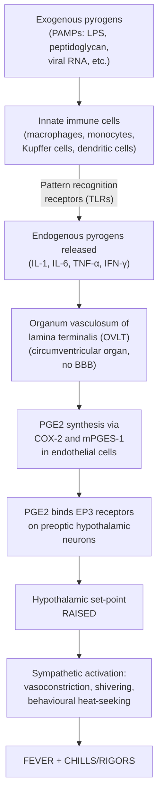

# Fever and Chills

## Definition

Let's start from the basics. **Fever** (pyrexia) is an elevation of body temperature above the normal set-point, mediated by the hypothalamus. It is fundamentally different from hyperthermia.

- **Fever**: The hypothalamic thermoregulatory set-point is *raised* by the action of pyrogens. The body *actively* generates and conserves heat (through vasoconstriction, shivering, behavioural changes) to reach this new, higher set-point. Because the set-point is elevated, the body "thinks" it is cold — hence chills.
- **Hyperthermia**: The set-point is *normal* but heat gain overwhelms heat dissipation (e.g. heat stroke, malignant hyperthermia, neuroleptic malignant syndrome). The thermoregulatory system is *trying* to cool down but failing. Antipyretics do **not** work in hyperthermia because there is no pyrogen-driven set-point change.

**Normal body temperature**: 36.1–37.2°C (oral), with diurnal variation — lowest at ~06:00 (nadir) and highest at ~16:00–18:00 (peak), amplitude ~0.5°C. This is driven by the circadian cortisol rhythm.

**Fever thresholds** (commonly used):
- **> 38.0°C** (oral) — general clinical threshold
- **> 38.3°C** — used in fever of unknown origin (FUO) definition and neutropenic fever definition [1][2]
- **> 38.0°C sustained for > 1 hour** — alternative criterion for neutropenic fever [2]

**Chills** are the subjective sensation of cold accompanied by involuntary muscle contractions (shivering). **Rigors** are severe, uncontrollable shaking episodes. These occur because the thermoregulatory set-point has been acutely raised, creating a gap between the current body temperature and the new set-point — the body responds with vasoconstriction (cold peripheries, pallor) and skeletal muscle contraction (shivering/rigors) to generate heat.

> **Key distinction**: Chills/rigors = set-point has been *raised* → body is actively heating. Night sweats/defervescence = set-point has been *lowered back* → body is actively cooling (vasodilation, sweating) to reach the lower set-point.

<Callout title="Hypothermia as a Warning Sign" type="error">
Temperature **< 36°C** (hypothermia) can also indicate severe infection/sepsis, particularly in the elderly, neonates, immunocompromised, and those with chronic liver or renal disease. Do NOT dismiss a low temperature in a sick patient — it may indicate a *worse* prognosis than fever. [1]
</Callout>

---

## Epidemiology and Significance

Fever is one of the most common presenting complaints across all age groups and clinical settings.

- **Primary care**: Accounts for a substantial proportion of GP visits, particularly in paediatrics (up to 20–30% of paediatric consultations)
- **Emergency department**: One of the top 5 presenting complaints
- **Hospital inpatients**: Post-operative fever is extremely common (see below); nosocomial fever affects 20–30% of ICU patients
- ***Fever in the elderly is sepsis until proved otherwise (especially lungs and urinary tract)*** [3]
- **Hong Kong context**: High population density, subtropical climate, and significant travel hub status mean that tropical infections (dengue, typhoid, malaria from travel), TB (prevalence ~60/100,000 — one of the highest in developed regions), and viral respiratory infections (influenza, COVID-19, RSV) are common causes of fever. Klebsiella pneumoniae liver abscess in diabetic patients is a particularly important East Asian entity [4]

---

## Anatomy and Physiology of Thermoregulation

### Thermoregulatory Centre

The **preoptic area of the anterior hypothalamus** serves as the body's thermostat. It:
1. Receives afferent input from peripheral thermoreceptors (skin, deep tissue) and central thermoreceptors (hypothalamic neurons themselves sensing blood temperature)
2. Compares current body temperature against the set-point
3. Initiates efferent responses:
   - **Too cold (current temp < set-point)**: Sympathetic activation → cutaneous vasoconstriction, piloerection, shivering thermogenesis, behavioural changes (seeking warmth), non-shivering thermogenesis (brown fat, especially in neonates)
   - **Too hot (current temp > set-point)**: Cutaneous vasodilation, sweating, behavioural changes (seeking cool)

### The Pyrogenic Pathway

This is the central mechanism of fever and explains everything about how infection → chills/fever:

**Why this matters clinically:**
- **NSAIDs/Paracetamol** work by inhibiting COX enzymes → ↓PGE2 production → lowering the set-point back to normal → body then vasodilates and sweats to cool down (defervescence). This is why antipyretics are useless in true hyperthermia (no PGE2-mediated set-point elevation).
- **Corticosteroids** are potent antipyretics because they inhibit phospholipase A2 → ↓arachidonic acid release → ↓PGE2. This is why immunosuppressed patients on steroids may **not mount a fever** even with severe infection.

### Why Does the Body "Choose" to Have a Fever?

Fever is an *adaptive* response:
- Many pathogens replicate optimally at 37°C; elevated temperatures reduce their growth
- Higher temperatures enhance immune function: ↑neutrophil migration, ↑phagocytosis, ↑T-cell proliferation, ↑interferon activity
- The metabolic cost is significant (~10–12.5% ↑O₂ consumption per 1°C rise), which is why fever can be detrimental in those with limited cardiac or respiratory reserve

---

## Etiology of Fever/Chills

The causes of fever are vast. A systematic approach is essential. The most practical framework considers the clinical setting.

### A. Infectious Causes (Most Common Overall)

Infection is the **most common cause of fever** across all settings. Virtually any infection can cause fever, but certain patterns are high-yield:

| System | Common Causes | Hong Kong/Regional Considerations |
|--------|--------------|-----------------------------------|
| **Respiratory** | Pneumonia (CAP, HAP), TB, influenza, COVID-19, sinusitis, pharyngitis, lung abscess | TB is highly prevalent in HK (~60/100k). ***Pneumonia accounts for 17.6% of deaths in HK (2nd leading cause)*** [5] |
| **Urinary** | Cystitis, pyelonephritis, prostatitis | Most common cause of fever in elderly; often presents atypically [6] |
| **Abdominal/GI** | Appendicitis, cholecystitis, cholangitis, liver abscess, diverticulitis, peritonitis, gastroenteritis | ***Klebsiella pneumoniae liver abscess in DM patients is a classic East Asian entity*** [4][7]. Amoebic liver abscess from *E. histolytica* — consider travel to endemic areas [7] |
| **CNS** | Meningitis, encephalitis, brain abscess | ***S. suis from raw pork exposure*** in HK/South China [8] |
| **Cardiac** | Infective endocarditis, myocarditis, pericarditis | Viral myocarditis — enterovirus, parvovirus B19, HHV6 [9]. IE: S. viridans (native valve), S. aureus (acute/IVDU) |
| **Skin/Soft tissue** | Cellulitis, erysipelas, necrotising fasciitis, wound infection | ***β-haemolytic strep (commonest for cellulitis/erysipelas), S. aureus*** [10] |
| **Bone/Joint** | Septic arthritis, osteomyelitis | ***S. aureus most common in adults; N. gonorrhoeae in sexually active young adults*** [11] |
| **Specific tropical/travel** | Dengue, malaria, typhoid, scrub typhus, melioidosis | Dengue is endemic in HK (local transmission). Malaria — travel to SE Asia/Africa |
| **Viral** | EBV (infectious mononucleosis), CMV, HIV seroconversion, hepatitis A/B/C/E | Hepatitis B is highly prevalent in HK (~7–8% chronic carriers) |

### B. Non-Infectious Causes

<Callout title="The 'Non-Infectious Fever' Trap" type="error">
Always exclude infection first before attributing fever to a non-infectious cause. A common exam mistake is premature closure — labelling a fever as "drug fever" when there is an underlying abscess.
</Callout>

**1. Autoimmune/Inflammatory**
- **Connective tissue disorders**: SLE, RA, adult-onset Still's disease (classic cause of high spiking quotidian fever with salmon-coloured evanescent rash), vasculitis (GPA, PAN, GCA/PMR)
- ***Connective tissue disorder (e.g. rheumatoid arthritis, systemic lupus erythematosus)*** [3]
- ***Sarcoidosis*** [3]
- **Inflammatory bowel disease**: ***Crohn's disease*** can present with fever [3]
- **Crystal arthropathies**: Gout, pseudogout — acute flares cause fever

**2. Neoplastic**
- **Haematological malignancies**: Lymphoma (Pel-Ebstein fever — cyclical fever in Hodgkin lymphoma, though this is rare), leukaemia, myelodysplastic syndrome
- **Solid tumours**: Renal cell carcinoma (classic), hepatocellular carcinoma, atrial myxoma, colorectal cancer with occult abscess
- Tumour fever is due to cytokine release (IL-1, IL-6, TNF-α) from tumour cells or surrounding immune cells

**3. Drug Fever**
- ***Drug idiosyncrasies*** [3]
- Mechanism: Usually a **type IV hypersensitivity** reaction — takes 7–10 days for sensitization, so typically occurs 7–10 days after starting a new drug
- Common culprits: Antibiotics (β-lactams, sulfonamides, vancomycin), anticonvulsants (phenytoin, carbamazepine), allopurinol, heparin, procainamide
- Patient may appear "paradoxically well" for the degree of fever
- Classically resolves within 48–72 hours of stopping the offending drug

**4. Thromboembolic**
- DVT/PE can cause fever (due to tissue necrosis and inflammatory mediator release)
- ***DVT/PE: first sign may be unexplained tachycardia; 60–80% clinically silent*** [12]

**5. Endocrine**
- **Thyroid storm / thyrotoxicosis**: Excess thyroid hormone → ↑metabolic rate → ↑heat production. This is technically a mix of true fever and hyperthermia.
- **Phaeochromocytoma**: Catecholamine excess → ↑metabolic rate
- **Adrenal crisis (Addisonian crisis)**: Can present with fever, hypotension, and shock
- ***Wonky glands: hyperthyroidism, phaeochromocytoma, Addisonian crisis*** [12]

**6. Other**
- ***Factitious fever***: Self-induced or fabricated; consider in young healthcare workers with atypical fever patterns and no objective cause [3]
- **Transfusion reactions**: Febrile non-haemolytic transfusion reaction (FNHTR) — reaction to donor leukocyte antigens (cytokines accumulate in stored blood products), occurs 30 min–2 hours post-transfusion. Allergic transfusion reaction — reaction to donor plasma antigens, occurs early [12]
- **Tissue necrosis**: MI, rhabdomyolysis, haemolysis, haematoma, pulmonary infarction — all release intracellular contents that act as endogenous pyrogens

### C. Post-Operative Fever (High Yield for Surgery Exams)

***Post-operative fever is defined as temperature > 38°C on 2 consecutive post-operative days OR > 39°C on any 1 post-operative day*** [12]

The classic mnemonic is the **"5 W's"** (or extended "7 W's"), organized by timing:

| Timing | W | Cause | Pathophysiology |
|--------|---|-------|----------------|
| **Day 0–2** | ***Wind*** | ***Atelectasis*** | Post-anaesthesia ↓deep breathing → alveolar collapse → cytokine release from atelectatic lung. Note: the causal link between atelectasis and fever is debated, but this remains the classic teaching [12] |
| **Day 3–5** | ***Water*** | ***UTI*** | Catheter-associated; biofilm formation on catheter surface → ascending infection [12] |
| **Day 3–5** | ***Water*** | ***Anastomotic leak*** | Bowel content spillage → peritonitis → massive inflammatory response [12] |
| **Day 5–7** | ***Wound*** | ***Wound infection / SSI*** | Bacterial contamination during surgery → incubation period → cellulitis/abscess at surgical site [12] |
| **Day 5+** | ***Walking*** | ***DVT/PE*** | Venous stasis + hypercoagulability (Virchow's triad) → thrombus formation → tissue necrosis and inflammation [12] |
| **Day 7–10** | ***Wonder drugs*** | ***Drug fever*** | Type IV hypersensitivity — 7–10 days for antibody formation; ***common agents include antibiotics. Malignant hyperthermia: with FHx, can be delayed up to 24 hours post-op, common agents include suxamethonium. NMS: antiemetic drugs (e.g. metoclopramide)*** [12] |
| Any time | ***Withdrawal*** | ***Alcohol withdrawal*** | Autonomic hyperactivity from abrupt cessation of chronic alcohol use → adrenergic surge |
| Any time | ***Wonky glands*** | ***Adrenal insufficiency, thyrotoxicosis*** | Cortisol deficiency (Addisonian) or excess thyroid hormone [12] |
| Any time | — | ***Easily missed: infected central line, C. diff colitis, acute pancreatitis, acalculous cholecystitis*** [12] | — |

<Callout title="Important Post-Op Fever Points" type="error">
- ***Hyperthermia may not be initiated in immunocompromised patients*** — they may not mount a fever even with severe sepsis [12]
- ***Hypothermia also indicates severe sepsis*** [12]
- ***D-dimer is NOT useful post-operatively*** — it is elevated from surgery anyway [12]
- Prevention of DVT/PE: ***Early mobilisation (general), compression stockings/SCD (mechanical), LMWH (pharmacological, rare)*** [12]
</Callout>

### D. Fever of Unknown Origin (FUO)

***FUO is defined as fever ≥ 38.3°C for at least 3 weeks, without diagnosis after appropriate investigation*** [3]

Classic categories (Petersdorf & Beeson, updated):
1. **Infection** (~25–30%): TB, abscess (hepatic, pelvic, dental), endocarditis, osteomyelitis
2. **Neoplasm** (~15–20%): Lymphoma, leukaemia, RCC, HCC, atrial myxoma
3. **Autoimmune/Inflammatory** (~15–20%): Adult-onset Still's disease, SLE, vasculitis (GCA/PMR in elderly), sarcoidosis
4. **Miscellaneous** (~10–15%): Drug fever, factitious fever, thyroiditis, recurrent PE, Crohn's
5. ***Up to 20% remain unknown*** [3]

> ***"Prolonged fever is usually an uncommon presentation of a common disorder (unless recent travel, especially to the tropics)"*** [3]

---

## Pathophysiology of Fever — Deeper Dive

### The Molecular Cascade (First Principles)

1. **Exogenous pyrogens** are pathogen-associated molecular patterns (PAMPs) — e.g. LPS (Gram-negative), lipoteichoic acid (Gram-positive), peptidoglycan, viral dsRNA, fungal β-glucan — and damage-associated molecular patterns (DAMPs) from tissue injury (e.g. HMGB1, uric acid crystals, heat shock proteins)

2. These are recognized by **pattern recognition receptors (PRRs)** on innate immune cells:
   - **Toll-like receptors (TLRs)**: TLR4 recognizes LPS, TLR2 recognizes lipoteichoic acid
   - **NOD-like receptors (NLRs)**: Intracellular; some form inflammasomes

3. PRR activation triggers **NF-κB signalling** → transcription and release of **endogenous pyrogens** (pro-inflammatory cytokines):
   - **IL-1β** (most potent pyrogen)
   - **IL-6** (also drives acute phase response → ↑CRP, ↑fibrinogen, ↑hepcidin)
   - **TNF-α**
   - **IFN-γ** (especially in viral infections)

4. These cytokines travel via the bloodstream to the **organum vasculosum of the lamina terminalis (OVLT)** — a circumventricular organ that lacks a blood-brain barrier

5. At the OVLT, cytokines induce **COX-2** and **microsomal PGE synthase-1 (mPGES-1)** in endothelial and perivascular cells → synthesis of **PGE₂**

6. PGE₂ diffuses into the hypothalamus and binds **EP3 receptors** on thermoregulatory neurons in the preoptic area → **elevation of the thermoregulatory set-point**

7. This triggers efferent responses:
   - **Vasoconstriction** (sympathetic, cutaneous) → cold, pale peripheries
   - **Shivering** (somatic motor via hypothalamic efferents) → heat generation
   - **Behavioural changes** → seeking warmth, curling up
   - **Non-shivering thermogenesis** (brown fat — mainly neonates/infants; UCP-1 uncouples oxidative phosphorylation → heat instead of ATP)

8. Body temperature rises until it reaches the new set-point → plateau phase. When the pyrogen stimulus is removed or antipyretics are given → set-point falls → **vasodilation + sweating** → defervescence

### The Acute Phase Response

Fever does not occur in isolation. The same cytokines (IL-1, IL-6, TNF-α) that cause fever also drive the **acute phase response**:

| Feature | Mechanism |
|---------|-----------|
| ↑CRP | IL-6 stimulates hepatic CRP synthesis. CRP is an opsonin and activates complement |
| ↑ESR | ↑fibrinogen and immunoglobulins → ↑rouleaux formation → faster erythrocyte sedimentation |
| ↑Ferritin | Acute phase reactant; also ↑hepcidin (from IL-6) → sequesters iron from pathogens |
| Leukocytosis | IL-1 and G-CSF → bone marrow stimulation; cortisol → demargination of neutrophils |
| ↑Platelets | IL-6 → megakaryocyte stimulation (reactive thrombocytosis) |
| ↓Albumin | Negative acute phase reactant — hepatic synthetic priority shifts to CRP/fibrinogen |
| Anorexia/Malaise | TNF-α (formerly called "cachexin") and IL-1 act centrally on hypothalamus |
| Somnolence | IL-1 promotes slow-wave sleep |

---

## Classification of Fever

### By Duration
| Type | Duration | Common Causes |
|------|----------|--------------|
| **Acute** | < 7 days | Viral URTI, influenza, acute bacterial infection |
| **Subacute** | 1–3 weeks | Abscess, TB, IE, typhoid |
| **Chronic** | > 3 weeks | FUO framework (see above) |

### By Pattern

Fever patterns were historically important before the era of antipyretics (which obscure them). They are still taught and occasionally useful:

| Pattern | Description | Classic Association |
|---------|-------------|-------------------|
| **Continuous/Sustained** | Temperature remains above normal with < 1°C fluctuation | Typhoid fever (in first week), pneumonia |
| **Remittent** | Temperature fluctuates > 1°C daily but never returns to normal | Most bacterial infections, IE |
| **Intermittent** | Temperature returns to normal (or below) daily | Abscess, lymphoma, malaria, drug fever |
| **Quotidian** | Daily spikes (every 24h) | *P. falciparum*, adult-onset Still's disease, drug fever |
| **Tertian** | Spikes every 48h (every 3rd day) | *P. vivax*, *P. ovale* ("benign tertian") and *P. falciparum* ("malignant tertian") |
| **Quartan** | Spikes every 72h (every 4th day) | *P. malariae* |
| **Pel-Ebstein** | Cyclical fever (1–2 weeks on, 1–2 weeks off) | Hodgkin lymphoma (rare, likely apocryphal) |
| ***Spiking/Swinging fever*** | **High spikes with dramatic falls** | ***Liver abscess***, septicaemia, empyema [4] |
| **Double quotidian** | Two daily spikes | Kala-azar (visceral leishmaniasis), adult-onset Still's, drug fever, IE |
| **Saddle-back** | Fever resolves then recurs | Dengue, polio, yellow fever |

### By Degree
| Grade | Temperature | Significance |
|-------|------------|--------------|
| Low-grade | 37.5–38.0°C | Viral infections, chronic inflammation |
| Moderate | 38.1–39.0°C | Most bacterial infections |
| High | 39.1–41.0°C | Severe infection, drug reactions, blood transfusion reactions |
| Hyperpyrexia | > 41.0°C | CNS infections, malignant hyperthermia, heat stroke, drug reactions — medical emergency |

---

## Clinical Features

### A. Symptoms (with Pathophysiological Basis)

| Symptom | Pathophysiological Mechanism |
|---------|---------------------------|
| **Fever / feeling hot** | PGE₂-mediated elevation of hypothalamic set-point → once body temperature reaches the new set-point, the patient feels hot and flushed (vasodilation phase) |
| **Chills / feeling cold** | Set-point has been acutely raised but body temperature has not yet reached it → the gap is perceived as "being cold" → triggers heat-conserving mechanisms |
| **Rigors** (severe shaking) | Intense involuntary skeletal muscle contraction to generate heat rapidly (shivering thermogenesis at maximum intensity). Classically associated with **bacteraemia**, particularly Gram-negative sepsis, ***cholangitis***, malaria, transfusion reactions, and abscess rupture |
| **Sweating / night sweats** | Occur during defervescence — set-point returns to normal (pyrogen clearance or antipyretic effect) → current body temperature now *exceeds* set-point → hypothalamus activates cooling: vasodilation + eccrine sweat gland activation. Night sweats classically associated with TB, lymphoma, brucellosis, IE |
| **Malaise / fatigue** | TNF-α and IL-1 act on CNS → sickness behaviour; ↑metabolic demand from fever (↑10–12.5% O₂ consumption per °C) depletes energy stores |
| **Anorexia** | TNF-α (historically called "cachexin") acts on hypothalamic appetite centres → ↓appetite. Evolutionary purpose: to divert metabolic resources away from digestion toward immune function |
| **Myalgia / arthralgia** | Pro-inflammatory cytokines (especially IL-1, IL-6, TNF-α) → sensitize peripheral nociceptors + ↑PGE₂ production in muscle and joint tissues → aching pain. Also: catabolism of skeletal muscle proteins for gluconeogenesis contributes |
| **Headache** | Vasodilation of meningeal vessels (PGE₂-mediated) + cytokine-mediated sensitization of trigeminal nociceptors |
| **Tachycardia** | ↑metabolic rate → ↑O₂ demand → ↑cardiac output (heart rate rises ~8–10 bpm per 1°C rise). Also: sympathetic activation during the chill phase |
| **Tachypnoea** | ↑CO₂ production from ↑metabolism → ↑respiratory drive; also direct central respiratory stimulation by cytokines |
| **Delirium / confusion** | Particularly in the elderly, neonates, and those with baseline cognitive impairment. Mechanism: cytokine-mediated disruption of BBB integrity, altered neurotransmitter metabolism (↑tryptophan → serotonin pathway), cerebral metabolic derangement |
| **Febrile seizures** | In children 6 months–5 years; mechanism not fully understood but likely involves ↑neuronal excitability at elevated temperatures + immature thermoregulatory/seizure threshold + IL-1β acts directly on hippocampal neurons |
| **Decreased urine output** | Insensible fluid losses ↑ with fever (~200–500 mL/day per °C above normal through sweating and ↑respiratory water loss) → dehydration → pre-renal oliguria |

<Callout title="Relative Bradycardia — A Diagnostic Clue">
Normally, heart rate increases ~8–10 bpm for each 1°C rise in temperature. **Relative bradycardia** (pulse-temperature dissociation) — where the heart rate is *inappropriately low* for the degree of fever — is a classic clue pointing to specific aetiologies:

- **Intracellular organisms**: Typhoid (Salmonella typhi), brucellosis, Legionella, Chlamydia psittaci
- **Drug fever**
- **Lymphoma**
- **CNS lesions** (↑ICP — Cushing reflex)
- **Factitious fever**

Also remember that relative bradycardia can be masked by beta-blockers or rate-limiting medications.
</Callout>

### B. Signs (with Pathophysiological Basis)

| Sign | Pathophysiological Mechanism |
|------|---------------------------|
| **Warm, flushed skin** (during plateau/defervescence phase) | Cutaneous vasodilation to dissipate heat once the set-point has been reached or is falling |
| **Cold, pale peripheries, goosebumps** (during chill phase) | Sympathetic-mediated cutaneous vasoconstriction + piloerection (arrector pili muscle contraction — vestigial in humans) to conserve heat while body temperature is rising toward the elevated set-point |
| **Diaphoresis** (sweating) | Active cooling during defervescence (set-point falling back toward normal) |
| **Tachycardia** | ***HR > 90 bpm*** [1] — compensatory ↑cardiac output for ↑metabolic demand |
| **Tachypnoea** | ***RR > 20 breaths/min*** [1] — compensatory for ↑CO₂ production |
| **Hypotension** | If sepsis develops: vasodilation from NO release (iNOS induction by TNF-α/IL-1) + ↑capillary permeability → third-space fluid loss → distributive shock. ***SBP < 90 mmHg or decrease > 40 mmHg from baseline; MAP < 70 mmHg*** [1] |
| **Dry mucous membranes** | Dehydration from insensible losses |
| **Lymphadenopathy** | Reactive hyperplasia of lymphoid tissue in response to local/systemic infection or inflammation |
| **Hepatosplenomegaly** | Reticuloendothelial system activation (macrophage/Kupffer cell hyperplasia) — seen in disseminated infection, malaria, EBV, haematological malignancy |
| **Skin rash** | May indicate specific aetiologies: petechiae/purpura (meningococcaemia, DIC), vesicles (varicella, HSV), maculopapular (viral exanthem, drug reaction), erythema nodosum (TB, sarcoidosis, IBD), erythema migrans (Lyme disease) |
| **Jaundice** | Suggests hepatobiliary source: ***cholangitis (Charcot's triad: fever + RUQ pain + jaundice)***, hepatitis, liver abscess; or haemolysis (malaria) [13] |
| **Altered mental status** | ***CNS dysfunction in sepsis (septic encephalopathy)*** [1]; also direct CNS infection (meningitis, encephalitis) |

### Signs Specific to Sepsis and Organ Dysfunction

When fever progresses to sepsis, look for signs of end-organ hypoperfusion [1]:

| System | Early Signs | Late Signs |
|--------|------------|------------|
| **Cardiovascular** | ***Warm and flushed skin*** (vasodilation phase) → ***bounding pulses*** | ***Cool skin, mottling, cyanosis, ↓capillary refill*** (vasoconstriction, blood redirected to core) [1] |
| **Renal** | ↓Urine output | ***Oliguria or anuria*** [1] |
| **GI** | ↓Appetite, nausea | ***Diminished or absent bowel sounds*** (paralytic ileus from splanchnic hypoperfusion) [1] |
| **CNS** | Restlessness, agitation | ***Altered mental status, obtundation*** [1] |
| **Haematological** | Leukocytosis | ***DIC: bleeding, petechiae, prolonged PT/aPTT*** [1] |

---

## The Clinical Approach to Fever/Chills

***The history may need to be repeated*** for fever cases — important details (travel, exposures, sexual history) may not be volunteered on first questioning [3].

### Key History Points

***Include past history, occupation, travel history, sexual history, IV drug use (leads to endocarditis and abscesses), animal contact, medication and other relevant factors. Enquire about associated symptoms such as pruritus, a skin rash, abdominal pain and diarrhoea, and weight loss. Note the fever pattern.*** [3]

| Domain | What to Ask | Why |
|--------|------------|-----|
| **Onset and duration** | When did it start? Sudden vs gradual? | Acute bacterial infection = sudden onset with rigors; viral = more gradual; chronic fever = TB, lymphoma, autoimmune |
| **Pattern** | Continuous? Intermittent? Spiking? Cyclical? | See fever pattern table above |
| **Severity** | Measured temperature? Rigors? | Rigors → bacteraemia, abscess, cholangitis, malaria |
| **Associated symptoms** | Cough/sputum/SOB? Dysuria/frequency? Abdominal pain? Headache/neck stiffness? Rash? Joint pain? Diarrhoea? | Localizing the source |
| ***Constitutional symptoms*** | ***Weight loss, night sweats, malaise*** [5] | TB, lymphoma, disseminated malignancy, IE |
| **Travel history** | Where and when? Duration? Prophylaxis? | Malaria (incubation 7–30+ days), dengue (4–10 days), typhoid (7–14 days), amebiasis |
| **Occupation** | Healthcare worker? Farmer? Animal handler? | Nosocomial exposure, leptospirosis, brucellosis, Q fever |
| **Sexual history** | Partners, STI history, HIV risk factors | HIV seroconversion, gonococcal bacteraemia, pelvic inflammatory disease |
| **IV drug use** | | IE (right-sided), hepatitis B/C, skin/soft tissue abscess |
| **Animal contact** | Cats, dogs, birds, livestock, raw pork | Cat-scratch disease, leptospirosis, psittacosis, ***S. suis from raw pork*** [8], brucellosis |
| **Medication history** | New drugs in past 2 weeks? Immunosuppressants? | Drug fever (onset 7–10 days), opportunistic infections in immunosuppressed |
| **Surgical/procedural history** | Recent surgery? Catheter? Central line? | Post-op fever framework (5 W's), CAUTI, CLABSI |
| **Immune status** | HIV? Transplant? Chemotherapy? Steroids? Splenectomy? | Neutropenic fever, opportunistic infections, encapsulated organisms post-splenectomy |
| **Diet** | Raw/undercooked food? Unpasteurized dairy? | Hepatitis A/E, listeriosis, brucellosis, amebiasis |

### Key Examination Points

***Note general features and vital signs. Check skin (rash, vesicles or nodules), eyes, temporal arteries, sinuses, teeth and oral cavity, heart (note any murmurs), lungs, abdomen (enlarged or tender liver, spleen, kidney), rectal and pelvic examination, lymph nodes (especially cervical), urinalysis.*** [3]

A systematic head-to-toe examination is essential. The goal is to **find the source**:

| Area | What to Look For | Diagnostic Significance |
|------|-----------------|----------------------|
| **General** | Toxic vs well-looking; nutritional status; hydration | Septic patients look "toxic"; factitious fever patients look "paradoxically well" |
| **Vital signs** | Temperature, HR, RR, BP, SpO₂ | Sepsis screening (qSOFA: ***RR > 22, sBP < 100, altered GCS***) [14] |
| **Skin** | Rash, petechiae, purpura, vesicles, nodules, surgical wounds, IV cannula sites, pressure ulcers, track marks | Petechiae → meningococcaemia/DIC; vesicles → varicella/HSV; Osler nodes/Janeway lesions → IE; track marks → IVDU |
| **Eyes** | Conjunctival pallor (anaemia), Roth spots (retinal haemorrhages with white centre → IE), jaundice, ***endophthalmitis (especially Klebsiella)*** [7][15] | |
| **Temporal arteries** | Tenderness, thickening, ↓pulsation | GCA in elderly with new headache + fever + ↑ESR |
| **Oral cavity** | Dental caries, mucosal ulcers, pharyngeal exudate, candidiasis | Dental abscess → bacteraemia; oral candidiasis → immunosuppression/HIV |
| **Sinuses** | Tenderness over maxillary/frontal sinuses | Sinusitis |
| **Neck** | Lymphadenopathy (size, consistency, tenderness, distribution), nuchal rigidity, thyroid enlargement/tenderness | Nuchal rigidity → meningitis; tender thyroid → subacute thyroiditis [16] |
| **Heart** | New/changing murmur | IE |
| **Lungs** | Crackles, bronchial breathing, dullness to percussion, ↓air entry | Pneumonia, pleural effusion, empyema |
| **Abdomen** | ***Tender hepatomegaly*** (liver abscess), splenomegaly, Murphy's sign (cholecystitis), RIF tenderness (appendicitis), suprapubic tenderness (cystitis), ***jaundice*** | [4] |
| **Rectal** | Perianal abscess, prostate tenderness (prostatitis) | Especially important in neutropenic patients |
| **Pelvic** | Cervical motion tenderness, adnexal masses | PID, tubo-ovarian abscess |
| **Joints** | Hot, swollen, tender joint(s) | ***Hot, swollen tender joint = septic arthritis until proven otherwise, even without fever*** [11] |
| **Lymph nodes** | Generalized vs localized; size; consistency; tenderness | Generalized → EBV, HIV, lymphoma, SLE; localized → local infection, metastatic LN |
| **Lines and catheters** | Exit site erythema, purulence, tenderness | CLABSI, exit-site infection |

<Callout title="Charcot's Triad and Reynold's Pentad" type="idea">
For **acute cholangitis** (biliary infection from obstruction + bacterial contamination) [13]:

- ***Charcot's triad*** (present in 2/3 of patients): **Fever** + **RUQ pain** + **Jaundice**
- ***Reynold's pentad*** (indicates suppurative cholangitis with sepsis): Charcot's triad + **Mental obtundation** + **Hypotension**
</Callout>

### Key Investigations

***The basics are: FBE (full blood examination), ESR/CRP, CXR and sinus films, urine MC (microscopy and culture), routine blood chemistry, LFTs, blood culture.*** [3]

***Other tests depend on clinical pointers (e.g. specific organisms, lymph node biopsy, HIV, tuberculosis, connective tissue auto-antibodies).*** [3]

| Investigation | Rationale |
|--------------|-----------|
| **FBE/CBC with differential** | Leukocytosis (bacterial infection); leukopenia (overwhelming sepsis, viral); left shift (↑bands = immature neutrophils mobilized from marrow); eosinophilia (parasites, drug reaction, vasculitis); lymphocytosis (viral, TB, lymphoma); atypical lymphocytes (EBV); pancytopenia (marrow infiltration, overwhelming sepsis) |
| **CRP** | Acute phase reactant; rises within 6–8 hours of inflammation, peaks at 48h. Non-specific but useful for monitoring response to treatment. Very high CRP (> 100) more suggestive of bacterial than viral infection |
| **ESR** | Slower to rise (days) and fall than CRP. Useful for chronic inflammation (GCA, TB, IE). Very high ESR (> 100) → consider myeloma, TB, abscess, lymphoma, autoimmune disease |
| **Procalcitonin (PCT)** | More specific for bacterial infection than CRP. Produced by thyroid C cells and neuroendocrine cells in response to bacterial endotoxins. Remains low in viral infections and autoimmune inflammation. Useful in guiding antibiotic therapy (de-escalation when PCT falling) |
| **Blood cultures** (at least 2 sets from different sites before antibiotics) | Gold standard for identifying bacteraemia. Each set = 1 aerobic + 1 anaerobic bottle. Timing: ideally during a spike/rigor (highest bacterial load). Sensitivity ~70–80% for true bacteraemia |
| **Urinalysis + urine C/ST** | Screen for UTI — dipstick (nitrites = Gram-neg bacteria; leukocyte esterase = pyuria) + microscopy + culture |
| **CXR** | Pneumonia, TB, lung abscess, pleural effusion, mediastinal lymphadenopathy |
| **LFTs** | Hepatitis, cholangitis, liver abscess; cholestatic pattern (↑ALP, ↑GGT) vs hepatocellular (↑ALT, ↑AST) |
| **Renal function + electrolytes** | Assess for AKI (sepsis), guide fluid management |
| **Lactate** | Marker of tissue hypoperfusion. ***Lactate > 2 mmol/L in the context of sepsis = septic shock criterion*** [1][14] |
| **Coagulation screen** | DIC screening if sepsis suspected (↑PT, ↑aPTT, ↓fibrinogen, ↑D-dimer, ↓platelets) |
| **Specific tests** based on clinical suspicion | Thick/thin film (malaria), HIV serology, Monospot/EBV serology, hepatitis panel, TB workup (AFB smear, IGRA, sputum culture), autoimmune panel (ANA, dsDNA, RF, ANCA), CT abdomen (abscess), echocardiography (IE), lumbar puncture (meningitis), bone marrow biopsy (haematological malignancy), PET-CT (FUO workup) |

---

## Specific Fever Syndromes — Key HK-Relevant Entities

### Sepsis (SEPSIS-3, 2016)

The modern understanding is critical [1][14]:

- ***Sepsis***: Life-threatening organ dysfunction caused by a dysregulated host response to infection. Identified clinically by an acute change in SOFA score ≥ 2 points due to infection [14]
- ***Septic shock***: A subset of sepsis with circulatory and cellular/metabolic dysfunction associated with higher mortality. Clinically identified by: ***vasopressor requirement to maintain MAP ≥ 65 mmHg AND serum lactate > 2 mmol/L despite adequate fluid resuscitation*** [1][14]

**qSOFA** (quick SOFA) for out-of-ICU screening [14]:
- ***RR ≥ 22/min***
- ***sBP ≤ 100 mmHg***
- ***Altered GCS (< 15)***
- ***qSOFA ≥ 2 → mortality ≥ 10%; prompts further workup for organ dysfunction***

<Callout title="SIRS is No Longer Used for Sepsis Definition" type="error">
***The term SIRS is NO LONGER used*** since the 2016 Sepsis-3 definition. SIRS criteria (Temperature + HR + RR + WBC) are ***present in many hospitalized patients who do not develop infection*** and its ***ability to predict death is poor compared to SOFA score*** [1]. However, SIRS criteria are still used for non-infectious conditions (e.g. pancreatitis, burns) and you should still know them:
- ***Temperature > 38°C or < 36°C***
- ***HR > 90 bpm***
- ***RR > 20/min or PaCO₂ < 32 mmHg***
- ***WBC > 12,000/mm³ or < 4,000/mm³ or > 10% immature bands*** [1]
</Callout>

### Multiple Organ Dysfunction Syndrome (MODS)

***Progressive organ dysfunction in an acutely ill patient such that homeostasis cannot be maintained without intervention*** [1]

| System | Pathology |
|--------|-----------|
| ***Respiratory*** | ***ARDS*** |
| ***Cardiovascular*** | ***Septic shock*** |
| ***Hepatic*** | ***Jaundice / GI bleeding / Paralytic ileus*** |
| ***Renal*** | ***Acute tubular necrosis / AKI*** |
| ***Neurological*** | ***Septic encephalopathy / Critical illness polyneuropathy*** |
| ***Haematological*** | ***DIC*** |

---

### Neutropenic Fever

***Definition: ANC ≤ 0.5 × 10⁹/L (or ≤ 1 × 10⁹/L with predicted decline to ≤ 0.5 in 24–48h) + pyrexia > 38.3°C or > 38°C for > 1 hour*** [2]

- Occurs in 10–50% of solid tumours but risk is much higher in haematological malignancies
- The blunted inflammatory response means classical signs of infection may be **absent** — no pus, no infiltrate on CXR, no localizing signs
- This is a **medical emergency** requiring empirical broad-spectrum antibiotics within 60 minutes of presentation

---

<Callout title="High Yield Summary">

**Definition**: Fever = ↑hypothalamic set-point via PGE₂ → body actively heats (chills/rigors). Hyperthermia = set-point normal but heat gain > loss (antipyretics don't work).

**Threshold**: > 38°C (clinical); > 38.3°C (FUO, neutropenic fever). Hypothermia (< 36°C) can indicate severe sepsis.

**Pyrogenic pathway**: PAMPs/DAMPs → TLRs on macrophages → IL-1/IL-6/TNF-α → OVLT → COX-2 → PGE₂ → EP3 receptors → ↑set-point → vasoconstriction + shivering = fever + chills.

**Post-op fever (5 W's)**: Wind (atelectasis, day 0-2), Water (UTI/anastomotic leak, day 3-5), Wound (SSI, day 5-7), Walking (DVT/PE, day 5+), Wonder drugs (drug fever, day 7-10). Also: Withdrawal, Wonky glands.

**Sepsis-3 (2016)**: Sepsis = infection + SOFA ≥ 2. Septic shock = vasopressor for MAP ≥ 65 + lactate > 2. qSOFA: RR ≥ 22, sBP ≤ 100, altered GCS. SIRS criteria no longer define sepsis.

**FUO**: ≥ 38.3°C for ≥ 3 weeks, no diagnosis after appropriate workup. ~20% remain unknown.

**HK-specific**: TB (high prevalence), Klebsiella liver abscess (DM), dengue, S. suis (raw pork).

**Key exam approach**: History (travel, sexual, occupation, drugs, exposures, animal contact). Exam: skin, eyes, teeth, heart (murmur), lungs, abdomen (liver/spleen), LN, rectal/pelvic. Ix: CBC, CRP, ESR, blood culture, urine MC, CXR, LFT, RFT, lactate.

**Relative bradycardia**: Typhoid, Legionella, drug fever, lymphoma, factitious fever.

**Rigors** point toward bacteraemia, Gram-negative sepsis, cholangitis, malaria, abscess.

</Callout>

---

<ActiveRecallQuiz
  title="Active Recall - Fever/Chills"
  items={[
    {
      question: "Explain the molecular pathway from bacterial infection to the sensation of chills, including the key mediators at each step.",
      markscheme: "PAMPs (e.g. LPS) recognized by TLRs on macrophages -> release endogenous pyrogens (IL-1, IL-6, TNF-alpha) -> reach OVLT (no BBB) -> COX-2 activation -> PGE2 synthesis -> binds EP3 receptors on preoptic hypothalamus -> raises thermoregulatory set-point -> body temperature is below new set-point -> sympathetic activation: vasoconstriction + shivering = chills.",
    },
    {
      question: "What is the difference between fever and hyperthermia? Why do antipyretics not work in hyperthermia?",
      markscheme: "Fever: hypothalamic set-point is raised by pyrogens (PGE2-mediated). Hyperthermia: set-point is normal but heat gain exceeds dissipation (e.g. heat stroke, malignant hyperthermia). Antipyretics work by inhibiting COX -> reducing PGE2 -> lowering set-point. In hyperthermia there is no PGE2-driven set-point elevation, so antipyretics have no target.",
    },
    {
      question: "Name the 5 W's of post-operative fever with their timing and one example cause for each.",
      markscheme: "Wind (day 0-2, atelectasis), Water (day 3-5, UTI or anastomotic leak), Wound (day 5-7, surgical site infection), Walking (day 5+, DVT/PE), Wonder drugs (day 7-10, drug fever). Bonus W's: Withdrawal (alcohol), Wonky glands (thyrotoxicosis, Addisonian crisis).",
    },
    {
      question: "Define sepsis and septic shock according to the Sepsis-3 (2016) criteria. What are the qSOFA criteria?",
      markscheme: "Sepsis: life-threatening organ dysfunction (SOFA >= 2) caused by dysregulated host response to infection. Septic shock: subset of sepsis requiring vasopressors to maintain MAP >= 65 mmHg AND lactate > 2 mmol/L despite adequate fluid resuscitation. qSOFA: RR >= 22, sBP <= 100, altered GCS (< 15). Score >= 2 suggests mortality >= 10%.",
    },
    {
      question: "What is relative bradycardia and which conditions classically cause it?",
      markscheme: "Pulse-temperature dissociation where HR is inappropriately low for degree of fever (normally HR rises 8-10 bpm per 1 degree C). Classic causes: typhoid fever, Legionella, brucellosis, Chlamydia psittaci, drug fever, lymphoma, factitious fever, raised ICP (Cushing reflex).",
    },
    {
      question: "A 55-year-old diabetic man from Hong Kong presents with spiking fever, chills, and tender hepatomegaly. What is the most likely diagnosis, likely organism, and what extra-hepatic complication must you screen for?",
      markscheme: "Most likely: Pyogenic liver abscess. Likely organism: Klebsiella pneumoniae (classic in DM patients in East Asia). Must screen for endogenous endophthalmitis (urgent eye consult if any ocular symptoms) and meningitis. Also colonoscopy to exclude underlying colorectal neoplasm.",
    },
  ]}
/>

---

## References

[1] Senior notes: felixlai.md (Sepsis and SIRS section, pp. 34–36)
[2] Senior notes: Ryan Ho Haemtology.pdf (Neutropenic Fever, p. 70)
[3] Lecture slides: murtagh merge.pdf (Fever that is prolonged, p. 53)
[4] Senior notes: maxim.md (Liver abscess section, p. 258)
[5] Senior notes: Ryan Ho Respiratory.pdf (Pneumonia, p. 61)
[6] Senior notes: Ryan Ho Urogenital.pdf (UTI, pp. 122, 128)
[7] Senior notes: Ryan Ho GI.pdf (Liver Abscess, pp. 237–239)
[8] Senior notes: Ryan Ho Neurology.pdf (Meningitis, p. 142)
[9] Senior notes: Ryan Ho Cardiology.pdf (Myocarditis, p. 165)
[10] Senior notes: Ryan Ho Rheumatology.pdf (SSTIs, p. 135)
[11] Senior notes: Ryan Ho Rheumatology.pdf (Septic arthritis, p. 67)
[12] Senior notes: maxim.md (Post-op fever, pp. 61, 64)
[13] Senior notes: felixlai.md (Acute cholangitis, p. 745); Ryan Ho GI.pdf (RUQ pain, p. 209)
[14] Senior notes: Ryan Ho Critical Care.pdf (Septic Shock, pp. 22, 15)
[15] Senior notes: Ryan Ho Opthalmology.pdf (Endophthalmitis, p. 32)
[16] Senior notes: Ryan Ho Endocrine.pdf (Subacute thyroiditis, p. 31)
