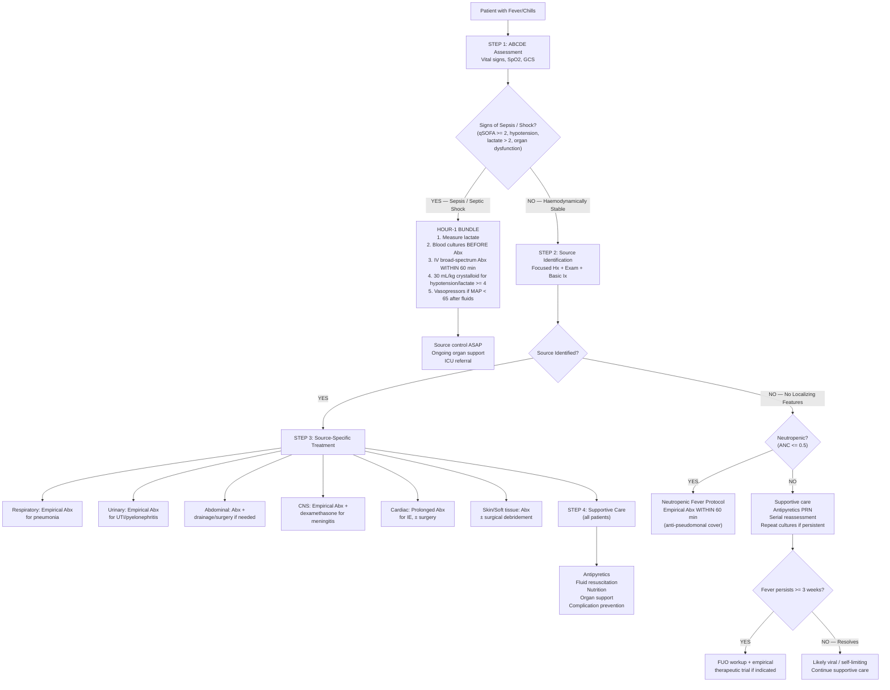

## Management of Fever/Chills

### Core Principles — The Philosophy of Treatment

Before we get into specific therapies, understand the **three pillars** of managing a febrile patient:

1. **Resuscitate** — Stabilize the patient (ABCDE, fluids, oxygen, vasopressors if shock)
2. **Find and treat the source** — This is the definitive therapy. Antibiotics, drainage, surgery — whatever it takes to eradicate the cause
3. **Supportive care** — Antipyretics, fluids, nutrition, organ support, prevention of complications

The single most important concept: **treating the fever itself is secondary to treating the cause**. Fever is a symptom, not the enemy. An isolated focus on bringing the temperature down while missing a drainable abscess or an unrecognized sepsis is a catastrophic error.

---

### Management Algorithm

---

### PILLAR 1: Resuscitation — Management of Sepsis and Septic Shock

This is the most critical management scenario for fever/chills. Delay kills — ***each hour delay over the first hour of antibiotics leads to 7.6% decrease in survival*** [14].

#### The Surviving Sepsis Campaign Hour-1 Bundle (Updated 2021)

All elements should be initiated **within the first hour** of recognition:

| Element | Detail | Rationale |
|---------|--------|-----------|
| **1. Measure lactate** | STAT arterial or venous blood gas | ***Lactate > 2 mmol/L = septic shock criterion*** [14]. Serial lactate guides resuscitation — aim for lactate clearance ≥ 20% per 2 hours |
| **2. Blood cultures** | ***≥ 2 sets from different sites, BEFORE antibiotics*** [9][14] | Identifies organism for targeted therapy. Starting antibiotics first dramatically ↓yield |
| **3. Broad-spectrum IV antibiotics** | ***Within 60 minutes of recognition*** [14] | ***Wrong Abx → need for escalation → ↑mortality*** [14]. Choice depends on suspected source (see below) |
| **4. Rapid IV crystalloid** | ***≥ 30 mL/kg within first 3 hours*** if hypotension or lactate ≥ 4 mmol/L [14] | Restores intravascular volume depleted by vasodilation and third-spacing. ***Crystalloid as initial fluid of choice ± albumin. Do NOT use starch-based colloids → associated with ↑renal failure without survival benefit*** [14]. ***Balanced solutions preferred*** (↓risk of kidney injury vs 0.9% NaCl) [14] |
| **5. Vasopressors** | If ***MAP remains < 65 mmHg after adequate fluid resuscitation*** | ***Norepinephrine as 1st choice*** ± vasopressin or epinephrine [14] |

#### Airway and Breathing [1]

- ***Supplemental O₂ should be supplied to all patients*** — target SpO₂ > 94% [1]
- ***Intubation and mechanical ventilation may be required*** for: ***increased work of breathing*** that accompanies sepsis, and ***airway protection*** since encephalopathy and depressed consciousness frequently complicate sepsis [1]
- ***CXR and ABG should be obtained following initial stabilization*** to evaluate for ARDS [1]

#### Circulation [1]

- ***Assessment of perfusion***: measure BP for hypotension, look for signs of end-organ hypoperfusion, elevated serum LDH [1]
- ***Establishment of venous access***: peripheral may suffice initially, but ***majority will eventually require central venous access*** for haemodynamic monitoring (CVP, ScvO₂) [1]

#### Resuscitation Targets (Early Goal-Directed Therapy) [1]

| Target | Value | Why |
|--------|-------|-----|
| ***Urine output*** | ***≥ 0.5 mL/kg/hour*** | Surrogate for renal perfusion |
| ***MAP*** | ***≥ 65 mmHg*** | Minimum for organ perfusion |
| ***CVP*** | ***8–12 mmHg*** (if central access) | Static predictor of fluid responsiveness (though dynamic predictors like pulse pressure variation are now preferred) |
| ***ScvO₂*** | ***≥ 70%*** (if central access) | Central venous oxygen saturation — if low, it means tissues are extracting more O₂ than normal → inadequate delivery → need ↑CO or ↑Hb |

#### Vasopressor and Inotrope Selection

Understanding why we choose specific agents requires knowing their receptor pharmacology [1]:

| Drug | Receptors | HR | Contractility | Vasoconstriction | When to Use |
|------|-----------|----|--------------|--------------------|-------------|
| ***Norepinephrine*** | α₁ +++ / β₁ ++ | ++ | ++ | ***+++*** | ***1st-line vasopressor in septic shock*** — potent vasoconstrictor with some inotropic effect [14] |
| ***Vasopressin*** | V₁ receptor | 0 | 0 | ++ | ***2nd-line*** added to norepinephrine — acts via non-adrenergic pathway, useful when catecholamine resistance develops (sepsis depletes endogenous vasopressin) |
| ***Epinephrine*** | α₁ ++ / β₁/β₂ +++ | +++ | +++ | ++ | ***Alternative to norepinephrine*** or added when additional inotropic support needed |
| ***Dobutamine*** | β₁ +++ | + | ***+++*** | ***— (not a vasopressor)*** | ***Added when cardiac output remains low despite adequate filling pressure*** — pure inotrope for sepsis-induced myocardial depression [14] |
| ***Phenylephrine*** | α₁ +++ | 0 | 0 | +++ | Pure vasoconstrictor — use when tachyarrhythmia limits other agents. Not first-line |
| ***Dopamine*** | α/β/dopaminergic | ++ | ++ | ++ | ***No longer recommended as first-line*** — higher arrhythmia risk than norepinephrine. "Renal-dose dopamine" is a myth with no proven benefit |

> **Why norepinephrine first?** In septic shock, the dominant haemodynamic problem is **vasodilation** (↓SVR from NO, vasodilatory prostaglandins, and cytokine-mediated smooth muscle dysfunction). You need a potent **vasoconstrictor** to restore SVR and MAP. Norepinephrine provides strong α₁ vasoconstriction with enough β₁ effect to maintain cardiac output — the best balance for distributive shock.

#### Adjuvant Therapies in Sepsis

| Therapy | Indication | Detail |
|---------|-----------|--------|
| ***Glucocorticoids*** | ***Septic shock refractory to fluids and vasopressors*** | IV hydrocortisone 200 mg/day (50 mg Q6H or continuous infusion). Rationale: sepsis causes relative adrenal insufficiency (↓cortisol response). Steroids restore vascular sensitivity to catecholamines. ***NOT for all sepsis — only for refractory shock*** [1] |
| **Glucose control** | Hyperglycaemia in sepsis | Target blood glucose 7.8–10.0 mmol/L. Stress hyperglycaemia worsens outcomes. Avoid tight control (< 6.1) → ↑risk of hypoglycaemia [31] |
| **VTE prophylaxis** | All critically ill patients | LMWH or UFH unless contraindicated (active bleeding, severe thrombocytopenia). Mechanical prophylaxis if pharmacological C/I |
| **Stress ulcer prophylaxis** | ICU patients on vasopressors or mechanical ventilation | PPI or H₂ blocker — prevents stress-related mucosal disease |
| **Transfusion** | Hb < 7 g/dL (restrictive) | Trigger Hb 7 g/dL for most ICU patients (liberal transfusion strategy shows no benefit and may worsen outcomes) |

<Callout title="Infection Source Control" type="error">
***Prompt identification and treatment of primary sites of infection are the primary therapeutic intervention — most other interventions are supportive only*** [1]. Source control means:
- **Drain** abscesses (percutaneous or surgical)
- **Remove** infected foreign bodies (lines, catheters, prostheses)
- **Debride** necrotic tissue (necrotising fasciitis)
- **Decompress** obstructed systems (biliary, urinary)

***15% of cholangitis patients will NOT respond to antibiotics and require emergency biliary decompression*** [13] — ERCP → PTBD → ECBD
</Callout>

---

### PILLAR 2: Source-Specific Treatment

This is the definitive treatment. The antibiotic choice depends on the suspected source, likely organisms, and local resistance patterns.

#### Empirical Antibiotic Selection for Sepsis [1]

**When the source is unknown:**

| Scenario | Empirical Regimen | Rationale |
|----------|------------------|-----------|
| ***P. aeruginosa unlikely*** | ***Vancomycin + ONE of: piperacillin-tazobactam (Tazocin), ceftriaxone/cefotaxime, or carbapenem (imipenem/meropenem)*** [1] | Vancomycin covers MRSA. The second agent covers Gram-negatives and anaerobes |
| ***P. aeruginosa likely*** (hospital-acquired, ICU, immunocompromised, recent Abx) | ***Vancomycin + TWO of: anti-pseudomonal β-lactam (piperacillin-tazobactam), anti-pseudomonal cephalosporin (ceftazidime/cefepime), anti-pseudomonal carbapenem (imipenem/meropenem), fluoroquinolone (ciprofloxacin), aminoglycoside (gentamicin/amikacin), or monobactam (aztreonam)*** [1] | Double anti-pseudomonal coverage because Pseudomonas has high intrinsic resistance and rapidly develops further resistance |

> **Why vancomycin empirically?** ***S. aureus infection is associated with significant morbidity if not treated early. Increasing causes of sepsis are due to MRSA, so vancomycin is used until the possibility of MRSA sepsis has been excluded*** [1]. Once cultures show a susceptible organism, de-escalate.

#### Source-Specific Antibiotic Regimens

| Source | Empirical Regimen | Duration | Key Principles |
|--------|------------------|----------|----------------|
| **CAP — Outpatient** | ***PO augmentin ± macrolide or doxycycline*** [5] | 5–7 days | Cover S. pneumoniae (most common) ± atypicals |
| **CAP — Hospitalized, mild-moderate** | ***IV augmentin ± macrolide/doxycycline*** [5] | 7–10 days | ***In all CAP, cover S. pneumoniae. In severe CAP, cover Legionella*** [5]. Severity guided by CURB-65 |
| **CAP — Severe/ICU** | ***IV ceftriaxone/cefotaxime + macrolide/fluoroquinolone*** | 7–14 days | Broader cover including Legionella (macrolide or fluoroquinolone), severe Gram-negatives |
| **Uncomplicated cystitis — Female** | Nitrofurantoin 100 mg BD × 5 days OR trimethoprim 200 mg BD × 3 days | 3–5 days | First-line agents with narrow spectrum to minimize resistance |
| **Acute pyelonephritis** | ***IV augmentin → tazocin if suspect Pseudomonas → imipenem/meropenem if severe/rapidly deteriorating. IV until afebrile 24–48h → complete 14 days with oral*** [19] | 14 days | ***Hospitalize if severe or suspicious of obstruction*** [19]. ***CT abdomen if no improvement > 72h*** |
| ***Acute prostatitis*** | ***Quinolone (e.g. ciprofloxacin/levofloxacin) for 2–6 weeks*** [6] | 2–6 weeks | Quinolones preferred for ***excellent prostatic penetration*** [6] — most other antibiotics penetrate the prostate poorly due to the blood-prostate barrier |
| **Cholangitis** | IV augmentin or ceftriaxone + metronidazole → adjust based on bile/blood culture | Until drainage achieved + 5–7 days | ***Biliary decompression is essential***: ERCP (1st line) → PTBD → surgical ECBD [13]. ***Continuous monitoring of vitals for signs of failure: ↑temperature/pulse, ↓BP/consciousness/urine output, increased abdominal tenderness*** [13] |
| **Liver abscess — Pyogenic** | ***IV augmentin or ceftriaxone + metronidazole for at least 4–6 weeks*** (IV for first 2 weeks → oral for 4 weeks) [4][7] | ***4–6 weeks total*** [4] | ***Percutaneous drainage***: USG/CT-guided, diagnostic + therapeutic. ***Needle aspiration if < 5 cm, catheter placement if > 5 cm*** [4]. For ***Klebsiella liver abscess: meningitic dose ceftriaxone (2g Q12H)*** [4] |
| **Liver abscess — Amoebic** | Metronidazole 750 mg TDS × 7–10 days → followed by luminal agent (paromomycin or diloxanide furoate) | 7–10 days + luminal | ***Usually not needed for percutaneous drainage*** — antimicrobials alone are sufficient for amoebic abscess [4]. Luminal agent kills cysts in the gut to prevent relapse |
| **Meningitis — Empirical** | ***Empirical Abx ≤ 6h ± dexamethasone → should NOT be delayed for CT brain*** [8]. IV ceftriaxone 2g Q12H + IV ampicillin (if Listeria risk: elderly, immunocompromised, neonates) + IV dexamethasone 0.15 mg/kg Q6H × 4 days (started before or with first dose of antibiotics) | 7–21 days depending on organism | Dexamethasone ↓mortality in pneumococcal meningitis by reducing inflammation. Must be given before or with first Abx dose — if given later, benefit lost |
| **TB meningitis** | ***Standard anti-TB: RHZE for 2 months → RH for 10 months (total 12 months for TBM)*** + adjunctive dexamethasone | 12 months | Steroids reduce mortality in TBM by ↓cerebral oedema and inflammation |
| **IE — Native valve** | Empirical: IV flucloxacillin + gentamicin (if acute, suspect S. aureus). IV benzylpenicillin + gentamicin (if subacute, suspect viridans strep) → adjust to organism | 4–6 weeks IV | ***Blood cultures × 3 before antibiotics*** [9]. Prolonged IV therapy because bacteria in vegetations are in a "biofilm" state with slow metabolic activity — need sustained bactericidal drug levels |
| **Cellulitis / Erysipelas** | ***IV penicillin/ampicillin + IV cloxacillin*** (1st line). Alternative: ***augmentin/unasyn***. If CA-MRSA suspected: ***PO septrin or IV vancomycin*** [10] | 5–14 days | ***In HK, 50–80% of GAS are resistant to clindamycin*** [10] — avoid as first-line |
| ***Neutropenic fever — Low risk*** | ***PO ciprofloxacin 750 mg BD + augmentin 1g BD*** [2] | Until ANC recovery and afebrile ≥ 48h | Low risk: neutropenia ≤ 7 days + no or few comorbidities |
| ***Neutropenic fever — High risk*** | ***IV ceftazidime 1–2g Q8H or cefepime 2g Q12H, or tazocin 4.5g Q6–8H, or imipenem/meropenem*** [2] | Minimum until afebrile ≥ 48h + ANC > 0.5 | ***Add aminoglycoside for ill cases; vancomycin if MRSA/skin/catheter infection suspected; amphotericin B if no response after 5 days and culture negative*** [2]. ***G-CSF: controversial, not routinely recommended but may be considered in septic shock, fungal infection, or severe pneumonia*** [2] |

<Callout title="Antibiotic Timing Is Everything">
***Antibiotics should be administered within the first 6 hours of presentation or earlier, after obtaining blood culture*** [1]. In septic shock, the target is even tighter — ***within 60 minutes***. Each hour of delay increases mortality. However: **always take blood cultures FIRST**. The brief delay to draw cultures (2–5 minutes) is vastly offset by the benefit of identifying the organism.
</Callout>

---

### PILLAR 3: Supportive Care and Symptomatic Treatment

#### Antipyretic Therapy

**Should you treat fever?** This is nuanced:

| Situation | Recommendation | Rationale |
|-----------|---------------|-----------|
| **Most febrile patients** | Antipyretics for **comfort** (not mandatory to normalize temperature) | Fever is adaptive. No evidence that routine antipyretic therapy improves outcomes in most infections. Treat for patient comfort and to reduce metabolic demand |
| **Limited cardiorespiratory reserve** (CHF, COPD, elderly) | Actively treat fever | Each 1°C ↑ raises O₂ consumption by 10–12.5% and HR by 8–10 bpm → may precipitate cardiac ischaemia or decompensation |
| **Febrile seizure history** (paediatric) | Antipyretics ± tepid sponging | Evidence that antipyretics prevent febrile seizures is weak, but standard practice |
| **Neurological injury** (stroke, TBI) | ***Antipyretic medications should be administered to lower temperature in hyperthermic patients with stroke*** [31] | Fever worsens neurological outcomes by ↑metabolic demand on ischaemic penumbra. ***Source of hyperthermia should be identified and treated*** [31] |
| **Hyperthermia** (heat stroke, MH, NMS) | **Physical cooling** is essential — antipyretics do NOT work | No pyrogen-mediated set-point elevation → NSAIDs/paracetamol target COX/PGE₂ pathway which is not activated. Active cooling: ice packs, evaporative cooling, cold IV fluids, dantrolene for MH |

**Antipyretic agents:**

| Agent | Mechanism | Dose | Key Points |
|-------|-----------|------|-----------|
| **Paracetamol (acetaminophen)** | Inhibits COX in the CNS (predominantly COX-2) → ↓PGE₂ synthesis in hypothalamus → ↓set-point. Also activates descending serotonergic pathways. Weak peripheral anti-inflammatory effect | 500 mg–1g PO/IV Q4–6H, max 4g/day | First-line antipyretic. **C/I**: severe hepatic impairment (paracetamol is hepatotoxic in overdose via NAPQI accumulation when glutathione is depleted). ↓Max dose to 2g/day in liver disease |
| **NSAIDs (ibuprofen, naproxen)** | Inhibit COX-1 and COX-2 → ↓PGE₂ synthesis both centrally and peripherally → antipyretic + anti-inflammatory + analgesic | Ibuprofen 200–400 mg PO Q6–8H | Anti-inflammatory as well as antipyretic. **C/I**: peptic ulcer disease, GI bleeding, CKD, heart failure, aspirin-exacerbated respiratory disease. ***DO NOT give NSAIDs in myocarditis*** (↓PG production may worsen myocardial function + ↑myocardial necrosis) [32]. Avoid in dengue (↑bleeding risk from thrombocytopenia) |
| **Aspirin** | COX-1/2 inhibitor | 300–600 mg PO Q4–6H | Used for antipyresis in specific situations (e.g. rheumatic fever, Kawasaki disease). **C/I in children < 16 years**: Reye syndrome (aspirin + viral illness → hepatic mitochondrial dysfunction → acute liver failure + encephalopathy) |

<Callout title="Physical Cooling Measures" type="idea">
Physical methods work by directly removing heat from the body surface without affecting the hypothalamic set-point:
- **Tepid sponging** (lukewarm water, NOT cold — cold causes vasoconstriction and shivering, which paradoxically ↑heat generation)
- **Fanning**
- **Cooling blankets**
- **Ice packs** to groin and axillae (where large vessels are superficial)
- **IV cold crystalloid** (4°C) for severe hyperthermia

These are **essential in hyperthermia** (where antipyretics don't work) and adjunctive in fever.
</Callout>

#### Fluid Management

| Situation | Approach | Rationale |
|-----------|----------|-----------|
| **All febrile patients** | Encourage oral fluids; IV fluids if unable to tolerate oral | Insensible losses ↑ ~200–500 mL/day per °C above normal (sweating + respiratory water loss). Dehydration → pre-renal AKI, ↓perfusion |
| **Sepsis/septic shock** | ***≥ 30 mL/kg IV crystalloid within first 3 hours*** [14] → then guided by haemodynamic status | Vasodilation and capillary leak → intravascular depletion despite total body fluid excess. Balanced crystalloids (Ringer's lactate/Plasmalyte) preferred over 0.9% NaCl (↓hyperchloraemic acidosis and renal injury) [14] |
| **Dehydration from GI losses** | Oral rehydration solution (ORS) if mild-moderate; IV if severe/unable to tolerate oral | Replace established deficits + ongoing losses + daily maintenance |

#### Management of Specific Non-Infectious Fever Scenarios

| Scenario | Management | Key Points |
|----------|-----------|------------|
| ***Drug fever*** | ***Stop the offending drug*** — temperature typically resolves within 48–72 hours [3] | No specific treatment needed beyond drug cessation. If essential medication, consider desensitization or alternative agent. Drug fever from anti-TB drugs: ***exclude superinfection or worsening TB → suspend treatment and re-introduce drugs sequentially to identify offending agent ± oral steroids*** [33] |
| ***Thyrotoxic crisis (thyroid storm)*** | ***Close monitoring (CVP ± ICU). Supportive: paracetamol + physical cooling (NOT aspirin — displaces T₄ from TBG → ↑free T₄). Non-selective β-blocker (propranolol 40–80 mg Q4–6H PO). Thionamide (PTU preferred — blocks T₄→T₃ conversion). Glucocorticoids (IV hydrocortisone 200 mg stat, then 100 mg Q6–8H). Iodine after ≥ 1h of thionamide*** [34] | ***PTU preferred over methimazole in storm*** because it blocks both synthesis AND peripheral T₄→T₃ conversion. ***Iodine must be given ≥ 1h AFTER thionamide*** to prevent iodine from being used as substrate for new hormone synthesis [34] |
| ***Adrenal crisis*** | IV hydrocortisone 100 mg bolus → 50 mg Q6–8H. Aggressive IV fluid resuscitation (0.9% NaCl). Treat precipitating cause (infection, surgery). ***Do NOT wait for lab results to treat — treat on clinical suspicion*** [34] | Cortisol is essential for vascular tone. Without it → profound vasodilation → refractory hypotension. Hydrocortisone provides both glucocorticoid and mineralocorticoid activity |
| ***Alcohol withdrawal + fever*** | ***R/o alternative diagnosis (CNS infection, drug OD, metabolic derangement, liver failure). Supportive: NPO, correct volume deficits. Correct metabolic derangements (hypoGly, hypoK, hypoMg, hypoPO₄). Thiamine + glucose. Benzodiazepines (diazepam, lorazepam, chlordiazepoxide) for psychomotor agitation. Barbiturates or propofol for refractory DT*** [35][36] | ***Thiamine BEFORE glucose*** — glucose metabolism requires thiamine as cofactor. Giving glucose without thiamine in a thiamine-depleted alcoholic can precipitate Wernicke's encephalopathy |
| **Transfusion reaction (febrile non-haemolytic)** | Stop transfusion. Paracetamol. Exclude acute haemolytic reaction (check for haemoglobinuria, repeat crossmatch, DAT). Resume if FNHTR confirmed and symptoms resolve | FNHTR is caused by cytokines accumulated in stored blood products and recipient Ab against donor leukocyte antigens. Pre-medication with paracetamol and using leukodepleted products reduces recurrence |
| ***Fever in SLE*** | ***NSAIDs, paracetamol ± low-to-moderate dose steroids. MUST rule out underlying infective or drug-related causes if unresponsive*** [37] | SLE patients are immunocompromised (disease + treatment) → infection is the most common cause of death in early SLE. Never assume fever is "just a flare" without excluding infection |
| ***Factitious fever*** | Compassionate, non-confrontational approach. Psychiatric evaluation. Avoid unnecessary invasive investigations | Confrontation often drives the patient away. Address underlying psychiatric pathology (personality disorder, factitious disorder, Munchausen syndrome) |

#### Management of Fever in Stroke [31]

***Source of hyperthermia should be identified and treated. Antipyretic medications should be administered to lower temperature in hyperthermic patients with stroke. Antibiotics should be started as required for possible infections such as pneumonia or urinary tract infections. Routine use of prophylactic antibiotics has NOT shown to be beneficial*** [31].

---

### Special Management Situations

#### Post-Operative Fever

Management follows the **diagnostic timing** (5 W's) already described:

| Source | Management |
|--------|-----------|
| **Wind (atelectasis)** | Incentive spirometry, deep breathing exercises, early mobilization, chest physiotherapy. Antibiotics NOT indicated for atelectasis alone |
| **Water (UTI)** | Remove catheter ASAP if still in situ. Empirical antibiotics if symptomatic. ***Recommend 1 week treatment for cystitis in elderly*** [6] |
| **Water (anastomotic leak)** | Surgical emergency → urgent CT abdomen, NPO, IV antibiotics, reoperation for repair or diversion |
| **Wound (SSI)** | Open wound, drain pus, irrigate. Antibiotics ± VAC therapy. Consider re-exploration if deep infection |
| **Walking (DVT/PE)** | Anticoagulation (LMWH → warfarin or DOAC). ***Prevention: early mobilisation, compression stockings/SCD, LMWH*** [12] |
| **Wonder drugs** | Stop offending drug. Observe for 48–72h. For ***malignant hyperthermia: dantrolene IV (specific antidote — blocks ryanodine receptor → ↓intracellular Ca²⁺ release from sarcoplasmic reticulum → ↓sustained muscle contraction and thermogenesis). For NMS: stop offending agent (antipsychotic/antiemetic) + dantrolene + bromocriptine (D₂ agonist)*** |

#### Neutropenic Fever — Detailed Approach [2]

***A medical emergency as unchecked proliferation of bacteria can lead to rapid progression into septic shock, especially in Gram-negative sepsis*** [2]

**Principle**: ***Timely (< 1–2h) administration of broad-spectrum, bactericidal antibiotics with minimal toxicity, covering most pathogens especially P. aeruginosa*** [2]

| Risk Category | Criteria | Empirical Regimen |
|--------------|----------|------------------|
| ***Low risk*** | Neutropenia ≤ 7 days, no or few comorbidities | ***PO ciprofloxacin 750 mg BD + augmentin 1g BD. Levofloxacin 750 mg QD PO if penicillin allergy*** [2] |
| ***High risk*** | ***ANC ≤ 0.1 for > 7 days, shock, pneumonia, new abdominal pain or CNS signs*** [2] | ***IV monotherapy: ceftazidime 1–2g Q8H or cefepime 2g Q12H or tazocin 4.5g Q6–8H or imipenem/meropenem*** [2] |

**Add-on therapy for selected cases** [2]:
- ***Aminoglycoside (amikacin 15 mg/kg Q24H IV) for ill patients***
- ***Vancomycin 500 mg Q6H or 1g Q12H if culture positive or highly suggestive of MRSA, skin or catheter infection***
- ***Amphotericin B 0.5–1 mg/kg/day if no response after 5 days and culture negative*** (empirical antifungal cover — prolonged neutropenia ↑risk of invasive fungal infection)

**Specific antibiotic therapy** after C/ST results [2]

**G-CSF** [2]: ***Controversial and not recommended in latest guidelines (but often given). Some evidence of increasing inflammatory response. Can be considered if septic shock, fungal infection, or severe pneumonia. If given, stop when neutrophil count returns to 1*** [2]

**Buffy coat (WBC) transfusion** [2]: ***Must be irradiated to prevent TA-GVHD. Indication: neutropenic fever (ANC < 0.5) PLUS documented infection not responding to broad-spectrum Abx + antifungal for ≥ 48h. Dose: 10U/day for ≥ 4 days until fever subsides*** [2]

#### Cholangitis — Stepped Approach [13]

***Continuous monitoring of vitals to look for signs of failure of conservative treatment*** [13]:
- ***↑Temperature/Pulse***
- ***↓BP/Consciousness level/Urine output***
- ***Increased abdominal tenderness and guarding*** [13]

***Management of sepsis: recognize signs of shock. Supportive treatment such as fluid resuscitation to prevent multiorgan failure*** [13]

***Biliary decompression and drainage***: ***15% of patients will NOT respond to antibiotics*** [13]:
- ***Endoscopic = ERCP*** (1st line)
- ***Radiologic (percutaneous) = PTBD / percutaneous cholecystostomy***
- ***Surgical = ECBD / bypass / resection***
- ***QMH practice: ERCP → PTBD → ECBD*** [13]

***Definitive treatment should be deferred until cholangitis has been treated and the proper diagnosis is established*** [13]

---

### Summary of Drug Contraindications

| Drug | Key Contraindications | Why |
|------|----------------------|-----|
| **Paracetamol** | Severe liver disease, active liver failure | Hepatotoxic via NAPQI metabolite; depleted glutathione in liver disease → ↑toxicity |
| **NSAIDs** | Peptic ulcer, GI bleeding, CKD, CHF, ***myocarditis*** [32], dengue, pregnancy (3rd trimester) | ↓Renal PG → ↓GFR, ↓gastric mucosal protection, fluid retention, platelet dysfunction, ↑myocardial necrosis |
| **Aspirin** | Children < 16 years (Reye syndrome), dengue, active bleeding | Irreversible COX-1 inhibition → platelet dysfunction; Reye syndrome in children with viral illness |
| **Starch-based colloids** | Sepsis resuscitation | ***Associated with ↑renal failure without survival benefit*** [14] |
| **Dopamine** | No longer 1st line for septic shock | Higher arrhythmia risk than norepinephrine |
| **G-CSF** | Not routinely in neutropenic fever | May ↑inflammatory response; reserve for specific indications [2] |
| ***PTU (propylthiouracil)*** | Prior agranulocytosis from thionamide | Use ***lithium*** as alternative [34] |
| ***Aspirin in thyroid storm*** | Displaces T₄ from TBG → ↑free T₄ | Use paracetamol instead [34] |

---

<Callout title="High Yield Summary — Management of Fever/Chills">

**Three pillars**: (1) Resuscitate, (2) Find and treat the source, (3) Supportive care.

**Sepsis Hour-1 Bundle**: Lactate, blood cultures BEFORE Abx, broad-spectrum IV Abx within 60 min, 30 mL/kg crystalloid if hypotension/lactate ≥ 4, vasopressors if MAP < 65 after fluids.

**Vasopressor**: Norepinephrine 1st line. Vasopressin or epinephrine added if needed. Dobutamine for low CO with adequate filling. Crystalloid (balanced preferred), NO starch colloids.

**Empirical Abx for unknown source**: Vancomycin + piperacillin-tazobactam/ceftriaxone/carbapenem. Add double anti-pseudomonal if Pseudomonas likely.

**Neutropenic fever**: Medical emergency. Low risk: PO cipro + augmentin. High risk: IV ceftazidime/cefepime/tazocin/carbapenem. Add vanco for MRSA, amphotericin B if no response after 5 days.

**Cholangitis**: Abx + biliary decompression (ERCP → PTBD → ECBD). 15% fail antibiotics alone.

**Liver abscess**: Abx 4–6 weeks + percutaneous drainage (< 5cm needle, > 5cm catheter). Klebsiella: meningitic-dose ceftriaxone + eye consult. Amoebic: metronidazole alone usually sufficient.

**Antipyretics**: Paracetamol 1st line. NSAIDs C/I in myocarditis, dengue, CKD, GI bleeding. Aspirin C/I in children (Reye) and thyroid storm (↑free T₄). Physical cooling essential in hyperthermia.

**Do NOT delay Abx for investigations. Blood cultures BEFORE antibiotics → give antibiotics → then LP/imaging.**

</Callout>

---

<ActiveRecallQuiz
  title="Active Recall - Management of Fever/Chills"
  items={[
    {
      question: "List the 5 components of the Surviving Sepsis Campaign Hour-1 Bundle and explain the rationale for each.",
      markscheme: "1. Measure lactate (guides resuscitation, >2 = septic shock criterion). 2. Blood cultures before Abx (identify organism for targeted therapy). 3. Broad-spectrum IV Abx within 60 min (each hour delay = 7.6% decrease in survival). 4. 30 mL/kg IV crystalloid within 3h if hypotension or lactate >= 4 (restore intravascular volume from vasodilation/third-spacing). 5. Vasopressors if MAP < 65 after fluids (restore SVR in distributive shock).",
    },
    {
      question: "Why is norepinephrine the first-line vasopressor in septic shock? What are the second-line options?",
      markscheme: "Septic shock is primarily distributive (vasodilation from NO, cytokines). Norepinephrine provides strong alpha-1 vasoconstriction (restores SVR) with sufficient beta-1 inotropic effect to maintain CO - best balance for distributive shock. Second-line: vasopressin (non-adrenergic pathway, useful when catecholamine resistance develops) or epinephrine (additional inotropic support). Dobutamine added if low CO despite adequate filling.",
    },
    {
      question: "A patient with neutropenic fever (ANC 0.2, temperature 39C, on chemotherapy for AML) has been on IV ceftazidime for 5 days but remains febrile with negative cultures. What is your next step and why?",
      markscheme: "Add empirical antifungal therapy - amphotericin B 0.5-1 mg/kg/day. Rationale: prolonged neutropenia >7 days increases risk of invasive fungal infection (Candida, Aspergillus). Negative bacterial cultures after 5 days of broad-spectrum Abx with persistent fever raises high suspicion for fungal aetiology. Also consider CT chest for pulmonary aspergillosis (halo sign).",
    },
    {
      question: "Why are NSAIDs contraindicated in myocarditis? What about in dengue fever?",
      markscheme: "Myocarditis: NSAIDs decrease PG production which may worsen myocardial function and increase myocardial necrosis (PGs are cardioprotective in inflamed myocardium). Dengue: NSAIDs inhibit platelet function (COX-1 inhibition) in a patient already at risk of thrombocytopenia and haemorrhagic complications from dengue - increases bleeding risk. Use paracetamol instead for both conditions.",
    },
    {
      question: "In thyroid storm, why must iodine be given at least 1 hour AFTER the first dose of thionamide? Why is aspirin contraindicated?",
      markscheme: "Iodine after thionamide: Iodine is a substrate for thyroid hormone synthesis. If given before thionamide blocks the synthesis pathway, the iodine will be incorporated into new T3/T4, paradoxically worsening thyrotoxicosis. Thionamide first blocks organification, then iodine is given to rapidly inhibit hormone release via Wolff-Chaikoff effect. Aspirin is contraindicated because it displaces T4 from thyroid-binding globulin (TBG), increasing free T4 levels and worsening the crisis. Use paracetamol instead.",
    },
    {
      question: "Describe the stepwise approach to biliary decompression in acute cholangitis that fails to respond to antibiotics. What percentage of patients require decompression?",
      markscheme: "15% of cholangitis patients will NOT respond to antibiotics alone and require emergency biliary decompression. Stepwise approach (QMH practice): (1) Endoscopic: ERCP (first line - allows stone removal, stent placement, bile culture). (2) Radiological/percutaneous: PTBD if ERCP fails or not available. (3) Surgical: Exploration of CBD (ECBD) with T-tube placement if both ERCP and PTBD fail. Definitive treatment of underlying cause deferred until acute cholangitis is resolved.",
    },
  ]}
/>

---

## References

[1] Senior notes: felixlai.md (Sepsis treatment, pp. 37–41)
[2] Senior notes: Ryan Ho Haemtology.pdf (Neutropenic fever management, pp. 71)
[3] Lecture slides: murtagh merge.pdf (Fever that is prolonged — drug idiosyncrasies, p. 53)
[4] Senior notes: maxim.md (Liver abscess management, p. 258)
[5] Senior notes: Ryan Ho Respiratory.pdf (CAP management and empirical Abx, p. 64)
[6] Senior notes: Ryan Ho Urogenital.pdf (Prostatitis and UTI in elderly, p. 128)
[7] Senior notes: felixlai.md (Liver abscess treatment, p. 438)
[8] Senior notes: Ryan Ho Neurology.pdf (Meningitis management — empirical Abx timing, p. 145)
[9] Senior notes: Ryan Ho Cardiology.pdf (IE approach — blood cultures, p. 149)
[10] Senior notes: Ryan Ho Rheumatology.pdf (Cellulitis management, p. 136)
[12] Senior notes: maxim.md (Post-op fever — DVT prevention, p. 64)
[13] Senior notes: felixlai.md (Cholangitis treatment, pp. 522)
[14] Senior notes: Ryan Ho Critical Care.pdf (Septic shock management — Surviving Sepsis, pp. 22–23)
[19] Senior notes: Ryan Ho Urogenital.pdf (Pyelonephritis management, p. 127)
[31] Senior notes: felixlai.md (Fever management in stroke, pp. 1150, 1156)
[32] Senior notes: Ryan Ho Cardiology.pdf (Myocarditis — NSAIDs contraindicated, p. 165)
[33] Senior notes: Ryan Ho Respiratory.pdf (Anti-TB drug fever, p. 88)
[34] Senior notes: Ryan Ho Endocrine.pdf (Thyrotoxic crisis management, p. 14)
[35] Senior notes: Ryan Ho GI.pdf (Alcohol withdrawal management, p. 303)
[36] Senior notes: Ryan Ho Psychiatry.pdf (Alcohol withdrawal management, p. 106)
[37] Senior notes: Ryan Ho Rheumatology.pdf (SLE fever management, p. 77)
