## Differential Diagnosis of Foot/Toe Pain

The differential diagnosis of foot and toe pain is **wide** — but manageable when you approach it systematically. Think of it as a two-step exercise: first, **localise** (where is the pain?), then **categorise** (what type of pathology?). A 70-year-old smoker with forefoot pain at rest is a completely different clinical problem from a 25-year-old runner with plantar heel pain. Context is everything.

I will present the DDx using the **Murtagh diagnostic strategy framework** (probability diagnosis → serious disorders not to be missed → pitfalls → masquerades → "is the patient telling me something?") and then organise by anatomical region for rapid clinical application.

---

### 1. Murtagh's Diagnostic Strategy for Foot/Toe Pain

This framework is gold for clinical reasoning — it forces you to think beyond the obvious.

<Callout title="Murtagh's Framework — Why Use It?">
Murtagh's strategy is not just a list; it is a **risk-stratification tool**. You start with what is *most likely* (probability diagnosis), then systematically exclude what is *most dangerous* (serious disorders), account for commonly *missed* conditions (pitfalls), consider *systemic disease masquerading* as foot pain, and finally ask whether there is a *psychosocial* component. This ensures you never miss a limb- or life-threatening diagnosis while efficiently working up the common conditions.
</Callout>

#### A. ***Probability Diagnosis*** (most common causes) [1]

These are the conditions you will see day-in, day-out:

| Condition | Why It's Common |
|-----------|----------------|
| ***Acute or chronic foot strain*** | Overuse, poor footwear, occupational standing — the foot bears the entire body weight and is subjected to enormous repetitive mechanical stress |
| ***Sprained ankle*** | The most common musculoskeletal injury globally; lateral ligament complex (ATFL → CFL → PTFL) is vulnerable during inversion injuries |
| ***Osteoarthritis (especially great toe — hallux rigidus)*** | 1st MTPJ endures massive loads during push-off; cartilage degeneration → pain and stiffness with dorsiflexion [1] |
| ***Plantar fasciitis*** | ***MC cause of infracalcaneal pain (80%)*** — repetitive strain at the calcaneal origin of the plantar fascia [6][8] |
| ***Achilles tendonopathy*** | Watershed zone 2–6 cm above insertion has poor blood supply → vulnerable to degenerative microtears [8] |
| ***Tibialis posterior tendonopathy*** | Main dynamic stabiliser of the medial longitudinal arch; degeneration → progressive flat foot with medial ankle pain [8] |
| ***Wart, corn or callus*** | Plantar warts (HPV type 1), corns and calluses from chronic friction/pressure — extremely common, especially with ill-fitting shoes [1][9] |
| ***Ingrowing toenail / paronychia*** | Improper nail trimming + tight footwear → nail edge penetrates periungual tissue → inflammation ± secondary infection [1] |

> ***"Foot strain is probably the commonest cause of podalgia"*** [1]. "Podalgia" — from Greek *pous* (foot) + *algos* (pain). Don't overthink it — sometimes the foot just hurts because it has been overworked.

#### B. ***Serious Disorders Not to Be Missed*** [1]

These are the ones that keep you up at night. Miss them and the patient loses a limb, or worse.

| Category | Conditions | Why Serious |
|----------|-----------|-------------|
| ***Vascular insufficiency*** | ***Small vessel disease*** (PAD, diabetic angiopathy, Buerger's disease) → critical limb ischaemia → rest pain → gangrene [1][5] | Limb loss if not revascularised; DM accelerates disease by 2× and each 1% ↑ HbA₁c raises PAD risk by 26% [5] |
| ***Neoplasia / Cancer*** | ***Osteoid osteoma***, ***osteosarcoma***, ***synovial sarcoma***, ***acral lentiginous melanoma*** [1] | Osteoid osteoma: benign but causes severe nocturnal pain; osteosarcoma: aggressive primary bone tumour; acral melanoma: ***most common melanoma subtype in Asians*** — easily missed on soles/nails |
| ***Infection (rare but devastating)*** | ***Septic arthritis***, ***actinomycosis***, ***osteomyelitis*** [1] | Septic arthritis destroys cartilage within days if untreated [3]; osteomyelitis in diabetic foot = major amputation risk |
| ***Rheumatoid arthritis*** | Symmetric MTPJ synovitis → erosions → forefoot destruction [1] | Progressive joint destruction if not treated with DMARDs early |
| ***Peripheral neuropathy*** | Diabetic, alcoholic, B₁₂ deficiency [1] | Loss of protective sensation → unrecognised injury → ulceration → infection → amputation (the "diabetic foot cascade") |
| ***Complex regional pain syndrome (CRPS)*** | Type I (no nerve injury) or Type II (with nerve injury) [1] | Chronic, severe, disproportionate pain with autonomic/trophic changes → severe disability if not recognised early |
| ***Ruptured Achilles tendon*** | Missed rupture → chronic weakness, abnormal gait [1] | ***Thompson test positive (no plantarflexion on calf squeeze)*** — if missed acutely, surgical outcomes are inferior [8] |

<Callout title="Never Miss" type="error">
***A hot, swollen joint = septic arthritis until proven otherwise, even without fever, ↑WBC, or ↑ESR/CRP*** [3]. Joint aspiration is mandatory. The distinction between gout and septic arthritis cannot be made clinically alone — they can look identical. And they can **coexist** (gout is itself a risk factor for septic arthritis because crystal-damaged cartilage is more vulnerable to bacterial seeding).
</Callout>

#### C. ***Pitfalls (Often Missed)*** [1]

These are the conditions that are frequently misdiagnosed or overlooked:

| Condition | Why It's Missed |
|-----------|----------------|
| ***Ruptured tibialis posterior tendon*** | Insidious onset, patients often attribute it to "getting old"; the progressive flat foot and hindfoot valgus develop gradually. Look for ***"too many toes" sign*** from behind, inability to single-leg heel raise, flexible hindfoot valgus [1][8] |
| ***Foreign body (especially children)*** | Children may not give a clear history; a glass shard or thorn in the sole causes persistent pain. ***Always X-ray*** (glass is radiopaque!) [1] |
| ***Gout*** | Can mimic cellulitis or septic arthritis; serum urate may be ***normal or low during an acute flare (12–43% of cases)*** — so a normal uric acid does NOT rule out gout [1][3] |
| ***Morton neuroma*** | Burning interdigital pain often attributed to "metatarsalgia" or "neuritis" without specific diagnosis. Mulder's click is specific but not always performed [1] |
| ***Tarsal tunnel syndrome*** | Analogous to carpal tunnel but far less recognised; medial ankle/sole burning/tingling misattributed to plantar fasciitis or neuropathy [1] |
| ***Deep peroneal nerve*** (entrapment/injury) | Numbness in 1st web space + weakness of EDB; can occur from tight shoes or anterior tarsal tunnel compression [1] |
| ***Chilblains (pernio)*** | Cold-induced inflammatory lesions on toes — red/purple, itchy, painful papules. Common in HK winters (damp cold). Missed because clinicians don't think of it in a subtropical city, but HK's damp winters and lack of central heating make it surprisingly common [1] |
| ***Stress fracture (e.g. navicular)*** | Navicular stress fracture is notoriously occult on plain XR; needs MRI or bone scan. Common in running athletes. Delay in diagnosis → non-union because the navicular has poor central blood supply (analogous to scaphoid in the wrist) [1] |
| ***Erythema nodosum*** | Tender, red subcutaneous nodules on shins/feet. It is a **reactive process** (not a primary skin disease) — search for underlying cause: sarcoidosis, TB, IBD, Strep infection, drugs (OCP, sulfonamides) [1] |

**Rarities** (uncommon but examinable) [1]:
- ***Spondyloarthropathies*** (ankylosing spondylitis, psoriatic arthritis, reactive arthritis) — enthesitis at Achilles/plantar fascia insertions, dactylitis of toes [1][3]
- ***Osteochondritis***: ***navicular (Köhler disease)*** in children 3–7y, ***metatarsal head (Freiberg disease)*** in adolescents (typically 2nd MT head), ***calcaneum (Sever disease)*** in 8–14y [1]
- ***Glomus tumour (under nail)*** — rare benign vascular tumour of glomus body; exquisitely tender subungual nodule with classic triad: pain, point tenderness, cold sensitivity. The pain is ***disproportionate to the tiny lesion*** [1]
- ***Paget disease*** — excessive disorganised bone remodelling; can affect calcaneus or metatarsals → bone pain, deformity, pathological fracture, elevated ALP [1]

#### D. ***Masquerades Checklist*** [1]

These are systemic diseases that can present with foot pain as a primary complaint:

| Masquerade | How It Presents as Foot Pain |
|-----------|------------------------------|
| ***Diabetes*** | Peripheral neuropathy (burning/tingling feet, "glove and stocking"), diabetic foot ulcers, Charcot arthropathy, increased infection risk [1][4] |
| ***Drugs*** | Fluoroquinolones → Achilles tendinopathy/rupture; statins → myalgia; thiazides/loop diuretics → gout; colchicine → neuropathy/myopathy; isoniazid → peripheral neuropathy (B₆ depletion) [1] |
| ***Spinal dysfunction*** | L5 radiculopathy → foot drop + dorsal foot numbness; S1 radiculopathy → lateral foot pain + diminished ankle reflex + weakness of plantarflexion. ***Sciatica*** — pain radiating down posterior/lateral leg to foot/ankle from L5–S1 nerve root compression [1][7] |

#### E. ***"Is the Patient Trying to Tell Me Something?"*** [1]

> ***"A non-organic cause warrants consideration with any painful condition"*** [1]

- Chronic foot pain without clear organic cause may reflect depression, anxiety, somatisation, secondary gain (compensation claims, work avoidance), or simply inadequate footwear education.
- Always screen for psychosocial factors — especially in chronic pain presentations.

---

### 2. Differential Diagnosis by Anatomical Region

This is the approach you'll use at the bedside. Once you've localised the pain, use this table to generate your differential:

```mermaid
graph TD
    A["Foot/Toe Pain: Anatomical DDx"] --> B["Forefoot Pain"]
    A --> C["Midfoot Pain"]
    A --> D["Hindfoot / Heel Pain"]
    A --> E["Toe-Specific Pain"]
    A --> F["Diffuse / Whole Foot"]

    B --> B1["1st MTPJ: Gout, Hallux valgus, Hallux rigidus, Sesamoiditis, Turf toe"]
    B --> B2["Lesser MTPJs: Metatarsalgia, Freiberg disease, Plantar plate tear, RA synovitis"]
    B --> B3["Interdigital: Morton neuroma"]
    B --> B4["Dorsal forefoot: Stress fracture (2nd/3rd MT), Jones fracture (5th MT base)"]

    C --> C1["Lisfranc injury"]
    C --> C2["Midfoot OA"]
    C --> C3["Navicular stress fracture"]
    C --> C4["Kohler disease (children)"]
    C --> C5["Charcot arthropathy (tarsal/TMT)"]
    C --> C6["Tarsal coalition"]

    D --> D1["Plantar: Plantar fasciitis (MC), Baxter nerve, Fat pad atrophy, Calcaneal fracture"]
    D --> D2["Posterior: Achilles tendinopathy/rupture, Retrocalcaneal bursitis, Haglund deformity"]
    D --> D3["Medial: Tarsal tunnel syndrome, Tibialis posterior tendonopathy"]
    D --> D4["Lateral: Peroneal tendonopathy, Sinus tarsi syndrome"]

    E --> E1["Great toe: Gout, Ingrown nail, Subungual exostosis, Glomus tumour, Melanoma"]
    E --> E2["Lesser toes: Hammer/claw/mallet, Corn, Chilblains, Dactylitis"]

    F --> F1["Vascular: PAD, CVI, Buerger disease"]
    F --> F2["Neuropathic: DM neuropathy, CRPS, B12 deficiency"]
    F --> F3["Inflammatory: RA, PsA, Reactive arthritis"]
    F --> F4["Infectious: Cellulitis, Osteomyelitis"]
```

---

### 3. Differentiating Key Conditions: Clinical Reasoning

#### 3.1 The Acutely Swollen 1st MTPJ — Gout vs. Septic Arthritis vs. Pseudogout

This is a **classic exam scenario**. All three present with a hot, swollen, exquisitely tender joint. Here's how to tell them apart:

| Feature | ***Gout*** | ***Pseudogout (CPPD)*** | ***Septic Arthritis*** |
|---------|---------|--------------|---------------------|
| **Typical site** | ***1st MTPJ (podagra) > knee > ankle*** [3] | ***Knee (MC) > wrist > ankle; less commonly foot*** [3] | ***Knee > hip > ankle > wrist; 1st MTPJ less common*** [3] |
| **Typical patient** | ***M >> F, 4th–5th decade (M), 6th–7th decade (F)*** [3] | ***↑ with age (rare < 55y), M ≈ F*** [3] | Any age; RF: ***IVDU, prosthetic joint, I/C, chronic arthritis, DM*** [3] |
| **Crystal morphology** | ***Needle-shaped, negative birefringent (yellow parallel to axis on polarised microscopy)*** [3] | ***Rhomboid, weakly positive birefringent (blue parallel to axis)*** [3] | No crystals (but gout + sepsis can coexist!) |
| **Serum urate** | Often elevated, but ***can be normal/low during acute flare (12–43%)*** [3] | Normal | Normal |
| **Synovial fluid WBC** | 2–100 × 10³/mL, > 90% neutrophils [3] | 15–30 × 10³/mm³, 90% neutrophils [3] | Usually > 50 × 10³/mL, > 90% neutrophils |
| **Gram stain/culture** | Negative | Negative | Positive (~50–70% sensitivity for Gram stain) |
| **XR** | ***Normal acutely; chronic: "rat-bite" erosions with overhanging edges, tophi*** [3] | ***Chondrocalcinosis (punctate/linear radiodensities in cartilage)*** [3] | Soft tissue swelling; late: joint space loss, erosion |

<Callout title="The Rule" type="error">
***Joint aspiration is the single most important test for an acutely swollen joint.*** You **cannot** reliably distinguish gout from septic arthritis clinically. Always send for Gram stain, culture, AND polarised microscopy. Remember that gout and septic arthritis can **coexist** — the presence of crystals does NOT exclude infection [3].
</Callout>

#### 3.2 Heel Pain DDx [8]

***DDx of heel pain*** [8]:
- ***Plantar fasciitis (MC)*** — first-step morning pain, tenderness at medial calcaneal tuberosity
- ***Achilles tendinopathy / rupture*** — posterior heel, worse with activity, tenderness 2–6 cm above insertion
- ***Retrocalcaneal bursitis*** — pain deep to Achilles at its calcaneal insertion, pain with squeezing either side of Achilles ("squeeze test")
- ***Posterior ankle impingement (especially FHL)*** — posterior ankle pain in plantarflexion (dancers, ballet), flexor hallucis longus tenosynovitis
- ***Arthritis of ankle joint / subtalar joint*** — stiffness, reduced ROM, crepitus

Other differentials for heel pain not listed above:
- **Calcaneal stress fracture** — diffuse heel pain with "squeeze test" (mediolateral compression of calcaneus), common in runners, military recruits
- **Fat pad atrophy** — central plantar heel pain (not medial like plantar fasciitis), common in elderly; the calcaneal fat pad normally acts as a shock absorber, and atrophy exposes the calcaneus to direct ground-reaction forces
- **Baxter's nerve entrapment** — medial heel pain that is more posterior/lateral than plantar fasciitis; chronic, not typically "first-step" pattern
- ***Sever disease (calcaneal apophysitis)*** — in children 8–14y, pain at Achilles insertion onto the calcaneal apophysis; the apophysis is the last centre to fuse, and traction from the Achilles on the growing bone causes inflammation [1]
- **Tarsal tunnel syndrome** — burning/tingling on the sole ± medial heel, Tinel's positive behind medial malleolus

#### 3.3 Intermittent Claudication — Vascular vs. Neurogenic [5]

Already detailed in the previous section, but this is so **high yield** it bears repeating in the DDx context:

| Feature | ***Vascular Claudication*** | ***Neurogenic Claudication (Spinal Stenosis)*** |
|---------|---------------------------|------------------------------------------------|
| ***Cause*** | ***Chronic arterial insufficiency → exercise-induced muscle ischaemia*** | ***Spinal stenosis → compression of spinal arteries → lumbosacral root ischaemia*** |
| ***Claudication distance*** | ***Constant*** | ***Variable*** |
| ***Relief*** | ***"Shop window to shop window" — standing still*** | ***"Park bench to park bench" — flexion of spine (sitting/bending forward); going downstairs > upstairs*** |
| ***Rest pain*** | ***None (unless critical ischaemia)*** | ***May be present (prefer slight spinal flexion)*** |
| ***Other symptoms*** | ***Nil*** | ***Paraesthesia, numbness, weakness*** |
| ***Pulses*** | Absent/diminished distally | Normal |

> Why does spinal flexion relieve neurogenic claudication? Because flexing the lumbar spine ***opens*** the spinal canal and neural foramina (the canal is narrowest in extension), decompressing the cauda equina [5].

#### 3.4 ***Rest Pain*** — ***D/dx: Peripheral Neuropathy*** [5]

***Rest pain of critical limb ischaemia*** must be distinguished from ***peripheral neuropathy*** [5]:

| Feature | Rest Pain (CLI) | Peripheral Neuropathy |
|---------|----------------|----------------------|
| **Distribution** | ***Toes and forefoot (least perfused area)*** | ***Bilateral, glove-and-stocking pattern*** |
| **Character** | ***Continuous, severe aching*** | ***Burning, neuropathic (shooting, electric)*** |
| **Positional** | ***↑ lying flat, ↓ dependent*** | Not positional |
| **Pulses** | Absent/diminished | Usually present |
| **Skin** | Pale, atrophic, hair loss, gangrene | May be normal or with trophic changes |

#### 3.5 Acute Limb Ischaemia — ***Embolism vs. Thrombosis-in-situ*** [5][7]

| Feature | ***Embolism*** | ***Thrombosis-in-situ*** |
|---------|-------------|------------------------|
| ***Common causes*** | ***Cardiac origin (80%): AF, MI (LV mural thrombus), valvular heart disease / prosthesis; AAA (blue toe / trash foot)*** | ***Atherosclerosis (acute plaque rupture in PVD), aortic dissection, hypercoagulability (malignancy, APLS, sepsis), Buerger disease*** |
| ***Severity*** | ***Complete ischaemia (no collaterals)*** | ***Incomplete ischaemia (collaterals)*** |
| ***Onset*** | ***Hyperacute (seconds to minutes)*** | ***Acute (hours or days)*** |
| ***History/PE*** | ***Embolic source identifiable (e.g. AF); contralateral limb pulses present; absent bruits*** | ***Previous claudication; PVD in contralateral limb (e.g. absent pulse); present bruits*** |
| ***Angiography*** | ***Minimal atherosclerosis; sharp cut-off with few collaterals*** | ***Diffuse atherosclerosis; irregular cut-off with well-developed collaterals*** |

Clinical features of acute limb ischaemia — the ***6 Ps*** [7]:
1. ***Pain*** (early — nerves are most sensitive to ischaemia)
2. ***Pallor*** (limb colour progresses: 0–6 h = ***"marble white" pallor*** → 6–12 h = ***blanchable mottling*** → > 12 h = ***fixed mottling*** = irreversible)
3. ***Perishingly cold***
4. ***Pulseless***
5. ***Paraesthesia***
6. ***Paralysis*** (late — indicates ***muscle infarction, poor prognosis***)

***DDx of acute limb ischaemia*** [7]:
- ***Acute extremity compartment syndrome***
- ***DVT with superficial vein thrombosis (phlegmasia cerulea dolens)***

#### 3.6 Plantar Wart vs. Corn — A Common Exam Question [1][9]

| Feature | ***Plantar Wart (Verruca Plantaris)*** | **Corn / Callus** |
|---------|-------------------------------------|-------------------|
| **Cause** | ***HPV type 1 infection*** [9] | Chronic friction / pressure |
| **Appearance** | ***Slightly protruding, rough surface, horny rim*** [9]; obscures normal skin lines (dermatoglyphics) | Well-demarcated thickening; corn has central conical core |
| **Pain pattern** | ***Pain with lateral squeeze*** (compressing blood vessels within the lesion) | ***Pain with direct pressure*** (central core presses on dermis) |
| **On paring** | ***Thrombosed capillaries visible (black/red dots)*** — pinpoint bleeding [9] | No thrombosed capillaries; translucent core |
| **Skin lines** | Disrupted/obscured | May be preserved or obscured, but no capillary dots |

#### 3.7 Warm, Swollen Foot in a Diabetic Patient — Charcot vs. Cellulitis vs. Osteomyelitis vs. DVT vs. Gout

| Feature | ***Charcot Arthropathy*** | **Cellulitis** | **Osteomyelitis** | **DVT** | **Gout** |
|---------|-------------------------|---------------|-------------------|--------|---------|
| **Pain** | ***Painless or minimal*** (neuropathy!) [4] | Painful | Variable (may be reduced in DM) | Calf pain/tenderness | Exquisite pain |
| **Warmth** | +++ | +++ | + | + | +++ |
| **Swelling** | +++ (midfoot/ankle) | Diffuse | Localised | Unilateral pitting | Joint/periarticular |
| **Systemic signs** | None | Fever, ↑WBC | Fever (may be absent) | Low-grade fever | Fever possible |
| **Sensation** | Impaired (insensate foot) | Normal | May be impaired in DM | Normal | Normal |
| **Key investigation** | ***XR (degenerative changes, subluxation); MRI or bone scan if XR inconclusive; joint aspiration to rule out DDx*** [4][8] | Clinical | Probe-to-bone test, MRI, biopsy | Duplex USG | Joint aspiration (crystals) |

---

### 4. ***Key History and Examination for DDx*** [1]

#### ***Key History*** [1]
> ***"Ask about the quality of the pain, its distribution, mode of onset, periodicity, relationship to weight-bearing and associated features such as swelling or colour change. Enquire about pain in other joints including sacroiliac joints."*** [1]

- **Quality**: Burning (neuropathic), cramping (vascular), sharp/stabbing (mechanical), deep/boring (bone), aching (inflammatory)
- **Distribution**: Localised (fracture, OA, gout) vs. diffuse (neuropathy, PAD, inflammatory arthritis)
- **Mode of onset**: Acute (fracture, gout, septic arthritis, acute ischaemia) vs. gradual (plantar fasciitis, OA, PAD, neuropathy)
- **Periodicity**: Morning stiffness > 30 min (inflammatory arthritis); first-step pain (plantar fasciitis); nocturnal (gout, osteoid osteoma, rest pain)
- **Relationship to weight-bearing**: Worse with (mechanical, stress fracture, plantar fasciitis); not related (rest pain, neuropathy, gout at rest)
- **Colour change**: White → blue → red (Raynaud's); black (gangrene); red/erythematous (gout, cellulitis, Charcot)
- **Sacroiliac / other joints**: screening for spondyloarthropathy if young patient with enthesitis or dactylitis [1]

#### ***Key Examination*** [1]
> ***"Follow the inspection, palpation, movement and test function approach. Test active and passive movements of the ankle (talar) joint, hindfoot (subtalar) joint and mid-foot (midtarsal) joint."*** [1]

> ***"Check the peripheral circulation and perform a neurological examination including sensation, motor strength and reflexes."*** [1]

#### ***Key Investigations*** [1]
> ***Consider: FBE, ESR/CRP, rheumatoid arthritis tests, blood glucose, uric acid, nerve conduction studies and imaging (e.g. plain X-ray — compare both sides), ultrasound, MRI, radionuclide scans.*** [1]

#### ***Diagnostic Tips*** [1]
> ***"Good quality plain X-rays are important if there is doubt about the diagnosis of a painful foot."*** [1]
> ***"All the distal joints of the foot may be involved in arthritic disorders."*** [1]

---

### 5. Summary DDx Table by Clinical Scenario

| Scenario | Top DDx |
|----------|---------|
| Young athlete with gradual forefoot pain worsening with running | Metatarsal stress fracture, Morton neuroma, sesamoiditis |
| Middle-aged man waking at night with explosive 1st MTPJ pain | Gout (podagra) |
| Elderly diabetic with painless midfoot swelling and deformity | Charcot arthropathy |
| Elderly smoker with forefoot pain at rest, relieved by dangling leg | Critical limb ischaemia (rest pain) |
| Runner with plantar heel pain worst with first morning steps | Plantar fasciitis |
| Child 8–14y with posterior heel pain after sports | Sever disease (calcaneal apophysitis) |
| Young woman with progressive flat foot and medial ankle pain | Tibialis posterior tendon dysfunction |
| Post-menopausal woman with painful, stiff great toe | Hallux rigidus (OA 1st MTPJ) |
| Young man with Achilles heel pain + dactylitis + low back stiffness | Spondyloarthropathy (enthesitis) |
| Diabetic with foot ulcer, probe touches bone | Osteomyelitis |
| Pigmented lesion under toenail in Chinese patient | Acral lentiginous melanoma (until proven otherwise) |
| Sudden pale, pulseless, cold leg in patient with AF | Acute arterial embolism |

---

<Callout title="High Yield Summary">

**Murtagh's framework** for foot pain:
- **Probability**: Foot strain, sprained ankle, OA (hallux rigidus), plantar fasciitis, Achilles tendonopathy, tibialis posterior tendonopathy, warts/corns/calluses, ingrown toenail
- **Serious**: Vascular insufficiency (PAD/Buerger), neoplasia (osteoid osteoma, osteosarcoma, acral melanoma), infection (septic arthritis, osteomyelitis), RA, peripheral neuropathy, CRPS, ruptured Achilles
- **Pitfalls**: Ruptured tibialis posterior, foreign body, gout, Morton neuroma, tarsal tunnel syndrome, chilblains, stress fracture (navicular), erythema nodosum
- **Rarities**: Spondyloarthropathies, osteochondritis (Köhler, Freiberg, Sever), glomus tumour, Paget disease
- **Masquerades**: Diabetes, drugs (fluoroquinolones, diuretics), spinal dysfunction (L5/S1 radiculopathy)
- **Non-organic**: Always consider psychosocial factors in chronic foot pain

**Key DDx principles**:
- Hot swollen joint → aspirate → crystals (gout/pseudogout) vs. bacteria (septic arthritis) — they can coexist
- Heel pain → plantar fasciitis is MC (80%) but don't forget Achilles, calcaneal fracture, Sever disease, tarsal tunnel, Baxter's nerve
- Rest pain in foot → critical limb ischaemia vs. peripheral neuropathy (bilateral + glove-stocking vs. unilateral + positional)
- Acute limb ischaemia → 6 Ps; differentiate embolism (AF, acute, complete) vs. thrombosis (chronic PVD, subacute, incomplete)
- Wart vs. corn → lateral squeeze (wart) vs. direct pressure (corn); thrombosed capillaries on paring (wart)
- Warm swollen painless foot in diabetic → Charcot arthropathy (not cellulitis!)
</Callout>

---

<ActiveRecallQuiz
  title="Active Recall - Differential Diagnosis of Foot/Toe Pain"
  items={[
    {
      question: "Using Murtagh's framework, list 4 'serious disorders not to be missed' in foot/toe pain.",
      markscheme: "Any 4 of: Vascular insufficiency (PAD / critical limb ischaemia / Buerger disease), neoplasia (osteoid osteoma, osteosarcoma, synovial sarcoma, acral lentiginous melanoma), infection (septic arthritis, osteomyelitis, actinomycosis), rheumatoid arthritis, peripheral neuropathy, complex regional pain syndrome, ruptured Achilles tendon."
    },
    {
      question: "A 60-year-old man presents with an acutely swollen, red, exquisitely tender 1st MTPJ. How do you differentiate gout from septic arthritis? What is the single most important investigation?",
      markscheme: "Cannot reliably differentiate clinically - they can look identical and can coexist. Single most important test: joint aspiration (arthrocentesis) for Gram stain, culture AND polarised microscopy. Gout: needle-shaped, negatively birefringent MSU crystals. Septic arthritis: positive Gram stain/culture, WBC usually > 50,000. Serum urate is unreliable in acute gout (12-43% normal or low during flare)."
    },
    {
      question: "How do you distinguish a plantar wart from a corn on clinical examination?",
      markscheme: "Plantar wart: caused by HPV; pain with LATERAL squeeze; paring reveals thrombosed capillaries (black/red pinpoint dots and pinpoint bleeding); disrupts normal skin lines (dermatoglyphics). Corn: caused by chronic friction/pressure; pain with DIRECT pressure; no thrombosed capillaries on paring; central translucent conical core."
    },
    {
      question: "List the 6 Ps of acute limb ischaemia and state which feature indicates the worst prognosis.",
      markscheme: "Pain (earliest - nerves most sensitive), Pallor, Perishingly cold, Pulseless, Paraesthesia, Paralysis. Paralysis indicates the WORST prognosis as it signifies muscle infarction (late sign). Limb colour progression: 0-6h marble white pallor, 6-12h blanchable mottling, > 12h fixed mottling (irreversible)."
    },
    {
      question: "A diabetic patient has a warm, swollen, erythematous foot that is surprisingly painless. What is the most likely diagnosis and why is it painless?",
      markscheme: "Charcot arthropathy (neuropathic arthropathy). Painless because diabetic peripheral neuropathy causes loss of pain sensation and proprioception. The warmth and swelling result from autonomic neuropathy causing vasomotor dysregulation with exaggerated local inflammatory response, plus unrecognised repetitive microtrauma due to insensate foot. Must differentiate from cellulitis (painful, systemic signs) and DVT (calf tenderness, pitting oedema)."
    },
    {
      question: "Name the 3 masquerade conditions in Murtagh's checklist for foot pain and give one mechanism for each.",
      markscheme: "1. Diabetes: peripheral neuropathy from metabolic/osmotic neurotoxicity of chronic hyperglycaemia causing burning feet, loss of sensation, ulcers, Charcot joint. 2. Drugs: e.g. fluoroquinolones cause Achilles tendinopathy/rupture by impairing collagen synthesis; thiazide/loop diuretics precipitate gout by reducing renal urate excretion. 3. Spinal dysfunction: L5/S1 radiculopathy from disc prolapse or spinal stenosis causes referred pain, numbness, or weakness in the foot distribution of affected nerve root."
    }
  ]}
/>

## References

[1] Lecture slides: murtagh merge.pdf (p55–57, Foot and ankle pain)
[3] Senior notes: Ryan Ho Rheumatology.pdf (p28, Approach to Acute Monoarthritis; p35–37, Gout; p41–42, CPPD; p63, Peripheral SpA; p67, Septic Arthritis; p138, Viral Warts)
[4] Senior notes: Ryan Ho Endocrine.pdf (p98–99, Diabetic Foot, Diabetic Neuropathy, Charcot Arthropathy)
[5] Senior notes: Ryan Ho Cardiology.pdf (p205–207, Intermittent Claudication, Rest Pain; p210, Acute Limb Ischaemia)
[6] Senior notes: felixlai.md (Chronic arterial insufficiency, Acute arterial insufficiency, Gangrene)
[7] Senior notes: maxim.md (Acute limb ischaemia, Approach to spine diseases)
[8] Senior notes: maxim.md (Achilles tendinopathy and rupture, Plantar fasciitis, DDx of heel pain, Diabetic foot ulcers, Charcot arthropathy, Hallux valgus, Pes planus, Pes cavus)
[9] Senior notes: felixlai.md (Warts/verruca section)
