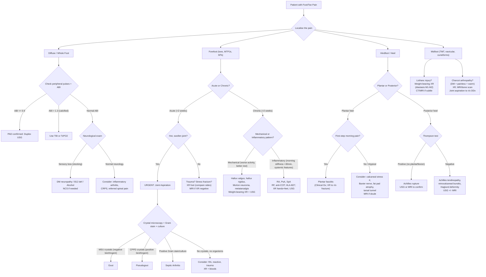

## Diagnostic Criteria, Algorithm, and Investigations for Foot/Toe Pain

Foot and toe pain is not a single disease — it is a **localisation-and-categorisation problem**. There is no single "diagnostic criterion" for "foot pain" the way there is for, say, rheumatoid arthritis. Instead, your diagnostic approach must be **condition-specific**, driven by the clinical picture you have built from history and examination. What I will give you here is: (1) the formal diagnostic criteria for the **key conditions** that present as foot/toe pain, (2) a **master diagnostic algorithm** you can apply at the bedside, and (3) a comprehensive run-through of every investigation modality with its key findings and interpretation.

---

### 1. Diagnostic Criteria for Key Conditions Causing Foot/Toe Pain

#### 1.1 Acute Gout — 2015 ACR/EULAR Classification Criteria [3]

This is the most important set of diagnostic criteria you need to know for a painful 1st MTPJ. The 2015 criteria use a **scoring system** (out of a possible 23 points); a score ≥ 8 classifies gout.

**Entry criterion (mandatory):** At least 1 episode of swelling, pain, or tenderness in a peripheral joint or bursa.

**Sufficient criterion (if met, no further scoring needed):** ***Detection of MSU crystals in a symptomatic joint/bursa or tophus*** → this is **definitive** — if you aspirate and find crystals, the diagnosis is made [3][10].

If crystal analysis is not available, use the **scoring domains:**

| Domain | Category | Score |
|--------|----------|-------|
| **Pattern of joint involvement** | Ankle or midfoot (monoarticular) | +1 |
| | ***1st MTPJ involvement*** | ***+2*** |
| **Characteristics of episode** | Erythema over joint | +1 |
| | Cannot bear touch/pressure | +1 |
| | Great difficulty walking/unable to use joint | +1 |
| | Time to maximal pain < 24 hours | ≥ 2 of 3 typical features: +3 |
| | Resolution ≤ 14 days | ≥ 2 of 3: +3 |
| | Complete resolution between episodes | |
| **Clinical evidence of tophi** | Draining or chalk-like subcutaneous nodule under transparent skin, often with overlying vascularity | +4 |
| **Serum urate** | < 4 mg/dL ( < 0.24 mmol/L) | −4 |
| | 6– < 8 mg/dL (0.36– < 0.48) | +2 |
| | 8– < 10 mg/dL (0.48– < 0.60) | +3 |
| | ≥ 10 mg/dL (≥ 0.60) | +4 |
| **Imaging** | ***USG double contour sign or DECT urate deposition*** | ***+4*** |
| | ***XR: ≥ 1 erosion (hands/feet)*** with characteristic "rat-bite" overhanging margins | ***+4*** |

**Score ≥ 8 = classified as gout** [3].

<Callout title="Crucial Nuance" type="error">
***Serum urate can be normal or low during an acute flare (12–43% of cases)*** [3]. A normal urate does NOT rule out gout. Serum urate should ideally be ***deferred to ≥ 2 weeks after resolution*** of the acute episode for accuracy [3]. The single most important test remains ***joint fluid analysis with polarised microscopy*** showing ***needle-shaped, negatively birefringent MSU crystals***.
</Callout>

#### 1.2 CPPD Disease (Pseudogout) — Diagnostic Criteria [3]

There is no formal points-based classification like gout. Diagnosis is based on **arthrocentesis + imaging** [3]:

- ***Definite CPPD disease***: ***Positively birefringent crystals on polarised light microscopy + cartilage/joint capsule calcification (chondrocalcinosis) on XR***; OR CPP crystals identified by definitive analytical means [3]
- ***Probable CPPD disease***: Either ***positive birefringent crystals on polarised LM*** alone; OR ***chondrocalcinosis on XR*** alone [3]

**Crystal morphology** — why does birefringence differ?
- "Birefringence" = the ability of a crystal to split polarised light into two rays. MSU crystals are **strongly negatively birefringent** (yellow when parallel to the compensator axis); CPPD crystals are **weakly positively birefringent** (blue when parallel). The physical basis is the molecular arrangement of the crystal lattice — the elongated needle shape of urate vs. the rhomboid shape of pyrophosphate creates different optical properties.

#### 1.3 Septic Arthritis — Diagnostic Approach [3]

There are no formal "classification criteria" — this is a **clinical and microbiological diagnosis**:

- ***"A hot, swollen tender joint = septic arthritis until proven otherwise, even without fever, ↑WBC, ↑ESR/CRP"*** [3]
- **Gold standard**: ***Joint aspiration*** → Gram stain (urgent), culture, cell count
  - Synovial WBC > 50,000/mm³ (with > 90% neutrophils) is highly suggestive
  - Gram stain sensitivity ~50–70%; culture is more sensitive but takes time
- Blood cultures: positive in ~50% of non-gonococcal cases

#### 1.4 Peripheral Arterial Disease — Diagnostic Criteria [5][7]

- ***ABI ≤ 0.9 is diagnostic of arterial occlusive disease*** [5]
  - ***0.40–0.90 → claudication***
  - *** < 0.4 → rest pain, tissue loss (critical limb ischaemia)***
  - ***> 1.30 → calcified arteries*** (DM, ESRD) → ***use toe-brachial index (TBI) instead*** [5][7]
- **Exercise ABI testing**: if ABI normal at rest but patient symptomatic → treadmill exercise → ***> 0.2 ↓ in ABI is equivalent to claudication*** [5]

#### 1.5 Acute Limb Ischaemia — Rutherford Classification of Severity [5]

| Category | Sensory Loss | Muscle Weakness | Arterial Signal | Venous Signal | Treatment |
|----------|-------------|-----------------|-----------------|---------------|-----------|
| ***Viable (I)*** | ***None*** | ***None*** | ***Audible*** | ***Audible*** | ***Imaging*** |
| ***Marginally threatened (IIa)*** | ***Minimal (toes)*** | ***None*** | ***Inaudible*** | ***Audible*** | ***Urgent revascularisation*** |
| ***Immediately threatened (IIb)*** | ***Beyond toes*** | ***Partial*** | ***Inaudible*** | ***Audible*** | ***Emergency revascularisation*** |
| ***Non-viable (III)*** | ***Completely anaesthetic*** | ***Completely paralysed*** | ***Inaudible*** | ***Inaudible*** | ***Amputation*** |

> Why is this classification based on sensory loss, motor function, and Doppler signals? Because these reflect the **progressive ischaemic cascade**: nerves are most sensitive to ischaemia (sensory loss first), then muscle (weakness/paralysis late = irreversible damage), and arterial/venous Doppler signals indicate the degree of perfusion compromise [5].

#### 1.6 Plantar Fasciitis — Clinical Diagnosis [8]

There are no formal "classification criteria." ***Plantar fasciitis is a clinical diagnosis*** [8]:
- ***Plantar heel pain with weight-bearing, radiating down the arch***
- ***Pain worsens with first few steps in the morning (after inactivity) and with toe dorsiflexion***
- ***Tenderness over plantar fascia up to calcaneal tuberosity***
- ***Investigations***: ***clinical diagnosis; XR to rule out fracture + may show plantar heel spur*** (but note: the heel spur itself is an incidental finding in ~15–25% of the asymptomatic population and is NOT the cause of pain — it merely indicates chronic traction at the fascia origin) [8]

#### 1.7 Diabetic Foot — Brodsky Classification [8]

Already detailed in the prior section. Key diagnostic thresholds for workup:
- ***TcPO₂ > 30 mmHg***: adequate wound-healing potential [8]
- ***ABPI not useful in DM*** due to vessel calcification [8]
- **Probe-to-bone test**: a sterile blunt metal probe inserted into the ulcer — if it reaches bone, specificity for osteomyelitis is ~89%

#### 1.8 Hallux Valgus — Radiographic Classification [8]

Measured on ***AP weight-bearing XR*** [8]:
- ***Hallux valgus angle (normal < 15°)***: angle between 1st MT shaft and proximal phalanx
  - ***Mild: 15–20°***
  - ***Moderate: 21–39°***
  - ***Severe: > 40°***
- ***Intermetatarsal angle (normal < 9°)***: angle between 1st and 2nd MT shafts
- Also assess for OA of the 1st MTPJ (joint space narrowing, osteophytes)

#### 1.9 Pes Planus — Radiographic Diagnosis [8]

- ***XR foot and ankle for Meary's angle*** (talo-1st metatarsal angle) [8]
  - Normal: 0° (the talus axis and 1st MT axis are co-linear)
  - ***> 4° = pes planus (flat foot)*** — the angle is convex plantarward, indicating arch collapse

---

### 2. Master Diagnostic Algorithm

Here is a practical bedside algorithm. The key decision points are: **localise → temporality → vascular check → inflammatory vs. mechanical → specific investigations**.

<Callout title="Key Decision Points in the Algorithm">
1. **Always check pulses and ABI first** in any diffuse or forefoot pain — you cannot afford to miss PAD.
2. **Any hot, swollen joint must be aspirated** — you cannot distinguish gout from septic arthritis without synovial fluid analysis.
3. **Plain XR is the first-line imaging** for most foot conditions — it is readily available, has the highest spatial resolution for bony detail, and can reveal fractures, arthritic changes, and chondrocalcinosis.
4. **MRI is the problem-solver** when XR is negative but clinical suspicion remains high (stress fracture, early osteomyelitis, soft tissue pathology, Lisfranc injury).
</Callout>

---

### 3. Investigation Modalities — Comprehensive Guide

I will organise investigations by modality, explaining **what each test actually measures**, **when to use it**, and **how to interpret** the findings.

#### 3.1 Bedside / Clinical Tests

| Test | What It Measures | Key Findings | When to Use |
|------|-----------------|--------------|-------------|
| ***Ankle-Brachial Index (ABI)*** | Ratio of ipsilateral ankle systolic BP (higher of dorsalis pedis or posterior tibial) to higher arm systolic BP [5][7] | ***Normal: 0.90–1.30; Claudication: 0.40–0.90; Rest pain/tissue loss: < 0.4; Calcified: > 1.30*** [5] | ***Any suspected PAD. DM patients should be screened every 5 years*** [5] |
| ***Toe-Brachial Index (TBI)*** | Ratio of toe systolic pressure to arm systolic pressure, using a small cuff on the great toe | Normal ≥ 0.7; < 0.7 suggests PAD | ***When ABI > 1.30 (calcified vessels in DM/ESRD)*** — digital arteries are less frequently calcified, so TBI is more reliable [5][7] |
| ***Transcutaneous oxygen pressure (TcPO₂)*** | Measures partial pressure of oxygen diffusing through the skin — reflects local tissue perfusion and oxygenation | ***> 30 mmHg: adequate wound-healing potential; < 30 mmHg: poor healing*** [8] | ***Diabetic foot ulcers*** — assesses whether there is sufficient perfusion for wound healing before deciding on conservative vs. surgical management [8] |
| ***Exercise ABI*** | ABI measured after treadmill exercise (standardised: 3.2 km/h, 12% incline for 5 min or until symptoms) | ***> 0.2 drop in ABI from baseline = significant arterial disease equivalent to claudication*** [5] | ***ABI normal at rest but patient is symptomatic*** — exercise unmasks flow-limiting stenosis that is compensated at rest [5] |
| **Monofilament test (Semmes-Weinstein 10g)** | Tests small-fibre sensation — the 10g monofilament is pressed against the plantar surface until it buckles; patient reports if they feel it | Loss of sensation = neuropathy; inability to feel 10g monofilament = loss of protective sensation | ***Diabetic foot screening*** — loss of monofilament sensation is a key risk factor for ulceration [4] |
| **Tuning fork test (128 Hz)** | Tests large-fibre (vibration) sensation | Loss of vibration sense distally in a "stocking" pattern | Diabetic neuropathy screening — ***monofilament (small fibre) + tuning fork (large fibre) together*** [4] |
| **Probe-to-bone test** | Sterile blunt metal probe inserted into a diabetic foot ulcer | If probe reaches bone → ***specificity ~89% for osteomyelitis*** | Any diabetic foot ulcer — simple, bedside, cheap, and highly informative |

> ***Why is ABPI not useful in DM?*** Because chronic hyperglycaemia promotes **Mönckeberg medial arterial calcification** — calcium deposits in the tunica media make the vessel wall incompressible. When you inflate the cuff, you need higher pressure to occlude a calcified artery, giving a falsely high reading. The digital arteries (measured by TBI) are usually spared from this calcification because they are small and less susceptible to Mönckeberg sclerosis [5][7][8].

#### 3.2 Blood Investigations

***"Consider: FBE, ESR/CRP, rheumatoid arthritis tests, blood glucose, uric acid"*** [1]

| Test | What It Tells You | Key Findings / Interpretation |
|------|-------------------|-------------------------------|
| ***FBE (Full Blood Examination / CBC)*** | Infection, inflammation, malignancy | ***Leukocytosis (neutrophil predominant)***: septic arthritis, gout flare, cellulitis, osteomyelitis. Anaemia: chronic disease (RA, malignancy). Thrombocytosis: reactive in chronic inflammation |
| ***ESR / CRP*** | Non-specific markers of inflammation | ***↑↑ in inflammatory/infective conditions*** (septic arthritis, gout flare, RA flare, osteomyelitis, cellulitis) [10]. CRP rises and falls faster than ESR — useful for monitoring acute response. ***CRP usually normal/mildly ↑ in SLE*** [10] |
| ***Serum urate (uric acid)*** | Serum urate level | ***Hyperuricaemia supports gout diagnosis BUT normal/low levels do not exclude it*** (12–43% normal/low during acute flare). ***Should be deferred to ≥ 2 weeks after resolution*** for accuracy [3] |
| ***Blood glucose / HbA₁c*** | DM screening / glycaemic control | ***DM is a masquerade*** — causes neuropathy, PAD, foot ulcers, Charcot arthropathy, increased infection risk [1][4]. HbA₁c also predicts PAD risk (26% ↑ risk per 1% ↑ HbA₁c) [5] |
| ***RF (Rheumatoid Factor)*** | Anti-IgG IgM antibody | ***+ve in ~70% RA*** but not specific (also +ve in Sjögren's, SLE, infections, hepatitis C, healthy elderly). A negative RF does not exclude RA [10] |
| ***Anti-CCP (anti-citrullinated peptide antibody)*** | Specific marker for RA | More specific than RF (~95% specificity). If both RF and anti-CCP are positive → very high specificity for RA [10] |
| ***HLA-B27*** | Genetic marker associated with spondyloarthropathies | Positive in ~90% AS, ~50% PsA with axial disease, ~50–80% reactive arthritis. NOT diagnostic alone — used to support clinical picture |
| **Calcium, phosphate, Mg, ALP, ferritin** | Screen for metabolic causes of CPPD | ***CPPD disease associated with hyperparathyroidism (3.35×), hypomagnesaemia, hypophosphatasia, haemochromatosis (ferritin)*** — should be screened after diagnosis of CPPD [3] |
| **CK, LDH** | Muscle damage | ↑ in compartment syndrome, rhabdomyolysis (reperfusion injury after acute ischaemia) |

#### 3.3 Synovial Fluid Analysis — ***THE MOST IMPORTANT TEST for an acutely swollen joint*** [10]

***"Joint fluid analysis: MOST IMPORTANT TEST"*** [10]

**Indications** [10]:
- ***Suspicious of septic arthritis***
- ***Suspicious of crystal-induced arthritis***
- ***Suspicious of haemarthrosis***
- ***Differentiating inflammatory vs. non-inflammatory arthritis***

**Send for** [10]:
1. ***Macroscopic***: colour, viscosity, turbidity
2. ***Microscopy***: wet films, WBC count/differential, ***crystal microscopy***
3. ***Microbiology*** (if suspect septic arthritis): ***Gram stain (URGENT)***, bacterial culture, AFB smear and culture, fungal stain if indicated

**Interpretation of synovial fluid:**

| Parameter | Normal | Non-inflammatory (e.g. OA) | Inflammatory (Gout, RA) | Septic |
|-----------|--------|---------------------------|------------------------|--------|
| **Colour** | Clear, colourless | Clear, yellow | Cloudy, yellow-green | Turbid, purulent |
| **Viscosity** | High | High | Low (enzymes degrade hyaluronic acid) | Very low |
| **WBC/mm³** | < 200 | ***< 2,000*** | ***2,000–100,000*** | ***> 50,000*** (often > 100,000) |
| **% Neutrophils** | < 25% | < 25% | > 50% (often > 90%) | > 90% |
| **Crystals** | None | None | ***MSU: needle-shaped, −ve birefringent; CPPD: rhomboid, +ve birefringent*** [3][10] | None (unless co-existing crystal disease) |
| **Gram stain** | −ve | −ve | −ve | ***+ve in ~50–70%*** |
| **Culture** | −ve | −ve | −ve | +ve |

> ***Why is viscosity LOW in inflammatory effusions?*** Because the intense neutrophilic inflammation releases lysosomal enzymes (including hyaluronidase) that degrade hyaluronic acid — the glycosaminoglycan that gives synovial fluid its normal high viscosity and "stringy" consistency. In OA (non-inflammatory), the synovium is not heavily infiltrated, so hyaluronic acid is preserved.

<Callout title="Crystal Microscopy Memory Aid" type="idea">
**MSU (gout)**: ***Needle-shaped, Negatively birefringent*** → Yellow when parallel to the compensator. Mnemonic: ***"Needles are Negative"*** (both start with N).

**CPPD (pseudogout)**: ***Rhomboid, weakly Positively birefringent*** → Blue when parallel. Mnemonic: ***"Pseudogout is Positive and has P-shape (Pleomorphic/rhomboid)"***.
</Callout>

#### 3.4 Imaging Modalities

##### A. ***Plain X-Ray (Radiography)***

***"Good quality plain X-rays are important if there is doubt about the diagnosis of a painful foot"*** [1].

**Why is XR the first-line imaging?** It has the ***highest spatial resolution*** of any imaging modality — excellent for fine bony detail (fracture lines, erosions, osteophytes, calcifications). It distinguishes the **four basic densities**: calcium (white), water/soft tissue (grey), fat (dark grey), air (black) [11]. It is also fast, cheap, and universally available.

**Key principle**: ***Always get ≥ 2 views*** (most fractures may only be detected in one view due to the 2D representation of 3D structures) [11]. For the foot: **AP and lateral** (± oblique for midfoot/forefoot).

| Condition | Key XR Findings | Why |
|-----------|----------------|-----|
| **Hallux valgus** | ***HV angle > 15°, intermetatarsal angle > 9° on AP weight-bearing view*** [8]; OA changes at 1st MTPJ | Weight-bearing is essential because it loads the arch and reveals the true degree of deformity |
| **Hallux rigidus** | Dorsal osteophytes at 1st MTPJ, joint space narrowing, subchondral sclerosis | OA changes from chronic cartilage wear |
| **Gout (chronic)** | ***"Rat-bite" erosions with overhanging edges*** (the tophus erodes bone from outside the joint margin, leaving a characteristic overhanging lip of cortex); soft tissue swelling; preserved joint space until late (unlike RA) | MSU crystals deposit in periarticular soft tissue → granulomatous inflammatory response → external pressure erosion. Joint space is preserved because the inflammatory pannus is less destructive to cartilage than in RA [3] |
| **CPPD** | ***Chondrocalcinosis: irregular faint punctate/linear radiodensities in articular cartilage*** ± ***degenerative changes (subchondral cysts, osteophytes, ↓ joint space)*** [3] | CPP crystals deposit within hyaline cartilage and fibrocartilage → calcification visible on XR |
| **RA** | Periarticular osteopenia, symmetric joint space narrowing, marginal erosions at MTPJs (especially 5th MTPJ — the earliest site); no osteophytes (inflammatory arthritis lacks the repair response that produces osteophytes in OA) | Pannus formation → synovial hypertrophy → enzymatic destruction of cartilage and bone |
| **Plantar fasciitis** | ***Plantar heel spur (calcaneal enthesophyte)*** — but NOT diagnostic (present in 15–25% of asymptomatic population). Main role: ***rule out calcaneal fracture*** [8] | The spur represents chronic traction calcification at the plantar fascia origin — it is a marker of chronic stress, not the cause of pain |
| ***Pes planus*** | ***Meary's angle (talo-1st MT angle) > 4°*** [8]; talar uncovering at talonavicular joint | Arch collapse changes the alignment of talus relative to 1st MT — the co-linear relationship is lost |
| **Stress fracture** | ***May be normal on initial XR*** (callus/periosteal reaction takes 2–3 weeks to appear). Late: periosteal reaction, callus, fracture line | Repetitive microtrauma → microfractures → repair with callus. Early on, the damage is too microscopic for XR resolution |
| **Lisfranc injury** | ***Diastasis between 1st and 2nd MT bases*** on AP weight-bearing view (> 2 mm); fleck sign (small avulsion fracture at Lisfranc ligament attachment) | Disruption of the Lisfranc ligament (medial cuneiform → 2nd MT base) → loss of the rigid linkage → bones splay apart under body weight |
| ***Charcot arthropathy*** | ***Early: soft tissue swelling, loss in joint spaces. Late: forefoot bone resorption, disappearance in MT heads, pencil-pointing of phalangeal/MT shafts, subluxation/dislocations, stress fractures*** [4][8] | Progressive unrecognised joint destruction from absent pain feedback. "Pencil-pointing" = resorption of the articular ends |
| **Calcaneal fracture** | Böhler's angle (normally 25–40°) flattened or reversed; intra-articular extension into subtalar joint | Axial load compresses the posterior tuberosity and primary fracture line drives into the subtalar joint |
| **Osteoid osteoma** | Central radiolucent nidus ( < 2 cm) surrounded by dense reactive sclerosis | Prostaglandin-producing nidus induces surrounding reactive bone formation |
| **5th MT base fracture** | Avulsion fracture at base (transverse orientation) vs. Jones fracture at metadiaphyseal junction (transverse, may show sclerosis in chronic cases) | Avulsion: peroneus brevis pulls off the base during inversion. Jones: stress at the watershed zone of blood supply → prone to non-union |

##### B. ***Ultrasound (USG)***

**Advantages**: Non-invasive, no radiation, real-time, dynamic assessment, can guide interventions (aspirations, injections). **Disadvantages**: Operator-dependent, limited bone visualisation, poor for deep structures.

| Condition | Key USG Findings |
|-----------|-----------------|
| **Morton's neuroma** | Hypoechoic ovoid mass in the intermetatarsal space; positive Mulder's click under dynamic scanning |
| **Plantar fasciitis** | Thickened plantar fascia (> 4 mm at calcaneal insertion); hypoechoic echotexture; perifascial fluid |
| **Achilles tendinopathy** | Tendon thickening; hypoechoic areas (degeneration); neovascularisation on Doppler (colour Doppler shows increased flow in the degenerate tendon) |
| **Achilles rupture** | Discontinuity of tendon fibres; haematoma in the gap |
| **Gout** | ***Double contour sign: hyperechoic irregular band on the surface of articular cartilage*** (MSU crystal deposition on cartilage surface) — distinct from the subchondral bone echo [3]. Also: tophi (hyperechoic aggregates), erosions |
| **CPPD** | ***Thin hyperechoic band WITHIN the cartilage*** (paralleling the bone cortex, separated by hypoechoic cartilage) [3] — vs. gout double contour which is ON the cartilage surface |
| **Joint effusion** | Anechoic fluid distending the joint capsule — guides aspiration |
| **Cellulitis / abscess** | Cellulitis: diffuse subcutaneous oedema (cobblestone pattern). Abscess: hypoechoic collection with rim enhancement — ***guides I&D*** [3] |
| **Tibialis posterior tendon** | Tenosynovitis (fluid around tendon sheath); tendon thickening, tears, or complete rupture |
| ***Duplex USG (for PAD)*** | ***First-line imaging for all PAD patients*** [5]. B-mode locates occlusion; Doppler detects flow abnormalities. ***Normal arterial flow = triphasic*** (forward systolic + reverse early diastolic + forward late diastolic). ***Biphasic = single-level occlusion. Monophasic = multi-level occlusion*** [5] |

> ***Why is normal arterial flow triphasic?*** The three phases reflect the physiology of peripheral arterial flow: (1) **systolic forward flow** driven by ventricular contraction, (2) **brief early diastolic reverse flow** due to elastic recoil of the arterial wall and high peripheral resistance in resting muscle, and (3) **late diastolic forward flow** as the elastic recoil propels blood forward again. Disease stiffens the artery and reduces compliance → loss of the reverse component → biphasic; severe disease reduces all pulsatility → monophasic [5].

##### C. ***MRI (Magnetic Resonance Imaging)***

**Advantages**: Best soft tissue contrast of any imaging modality; no ionising radiation; multiplanar. **Disadvantages**: Expensive, time-consuming, contraindicated with certain metallic implants, claustrophobia.

MRI is the **problem-solver** — used when XR is non-diagnostic but clinical suspicion is high.

| Condition | Key MRI Findings | Why MRI? |
|-----------|-----------------|----------|
| **Stress fracture (esp. navicular)** | Bone marrow oedema (hypointense T1, hyperintense T2/STIR) along the fracture line | XR is often normal in the first 2–3 weeks; MRI detects early bone oedema with > 95% sensitivity |
| **Plantar fasciitis (refractory)** | Thickened plantar fascia with increased T2 signal at the calcaneal insertion; peri-fascial oedema | Usually not needed (clinical diagnosis), but useful if refractory to treatment to rule out plantar fascia tear, plantar fibromatosis |
| **Osteomyelitis** | Bone marrow oedema (T1 low, T2/STIR high); cortical destruction; soft tissue abscess; contrast enhancement | ***MRI is the best imaging modality to differentiate cellulitis from osteomyelitis*** [3]. Sensitivity and specificity both ~90% |
| **Charcot arthropathy** | Bone marrow oedema, joint effusions, ligamentous disruption, subluxation | ***XR may be inconclusive early; MRI or bone scan if XR inconclusive*** [4][8] |
| **Lisfranc injury (subtle)** | Disruption of the Lisfranc ligament (normally a dark band connecting medial cuneiform to 2nd MT base on T1); bone bruising pattern | Weight-bearing XR may miss purely ligamentous injuries — MRI detects soft tissue disruption |
| **Morton's neuroma** | T1 low signal, T2 low-intermediate signal mass in the intermetatarsal space (the fibrous tissue is dense, so it is LOW signal even on T2 — unusual for a "mass") | USG is usually sufficient; MRI reserved for equivocal cases or pre-surgical planning |
| **Achilles tendinopathy/partial tear** | Tendon thickening; intratendinous signal change (increased T2 in partial tear); intact posterior margin in tendinosis | Differentiates tendinosis (degenerative) from partial tear (requires different management) |
| **Tarsal tunnel syndrome** | Space-occupying lesion within the tarsal tunnel (ganglion, accessory muscle, varicosities); tibial nerve oedema | Identifies the cause of compression when clinical diagnosis is confirmed by NCS |
| **Tumours (osteoid osteoma, sarcoma, melanoma)** | Nidus of osteoid osteoma (small enhancing focus); soft tissue mass extent; bone marrow involvement | Essential for staging and surgical planning |

##### D. ***CT Scan***

| Indication | Key Findings |
|-----------|-------------|
| **Calcaneal fracture** | CT is the **gold standard** for calcaneal fractures — axial and coronal reformats show the fracture pattern, subtalar joint involvement, and guide surgical planning (Sanders classification) |
| **Lisfranc injury (bony detail)** | Subtle fracture-dislocations missed on XR; CT provides excellent bony detail |
| **Tarsal coalition** | Calcaneonavicular or talocalcaneal coalition (bony bar or fibrous bridge) |
| ***CT angiography (CTA)*** | ***Less invasive alternative to DSA*** for PAD; shows vessel stenosis/occlusion, collateral pathways. ***Risks: contrast allergy, nephropathy, radiation*** [7] |

##### E. ***Digital Subtraction Angiography (DSA)***

***"Gold standard"*** for arterial imaging [7]:
- ***Indicated only for patients with planned intervention (angioplasty/stenting)*** — it is both diagnostic AND therapeutic
- ***Inject radio-opaque dye into the arterial tree (usually via femoral artery) → imaging digitised by computer*** [7]
- ***Can be done intra-operatively to guide endovascular intervention*** [7]
- ***Risks: contrast allergy, contrast nephropathy, arterial injury (dissection, embolism, pseudoaneurysm)*** [7]

For ***Buerger's disease***: ***angiogram shows corkscrew appearance of arteries*** (vascular damage) and ***tree root appearance of collaterals*** (vascular occlusion) [5]

##### F. ***Nuclear Medicine / Bone Scan (Technetium-99m MDP)***

| Indication | Findings |
|-----------|---------|
| **Occult stress fracture** | Focal increased uptake at fracture site (high sensitivity but low specificity) |
| **Osteomyelitis vs. Charcot** | ***Three-phase bone scan***: Charcot and osteomyelitis both show increased uptake in all three phases, so differentiation is difficult. ***Labelled WBC scan (In-111 or Tc-99m HMPAO)*** is more specific for infection (WBCs accumulate at infection site) |
| ***Charcot arthropathy*** | ***MRI or bone scan if XR inconclusive*** [4][8] |

##### G. ***Nerve Conduction Studies (NCS) and Electromyography (EMG)***

***"Consider: nerve conduction studies"*** [1]

| Test | What It Measures | When to Use | Key Findings |
|------|-----------------|-------------|-------------|
| ***NCS*** | ***Large fibre conduction function*** by electrical stimulation of peripheral nerve and recording of response [12] | ***Tarsal tunnel syndrome, Morton's neuroma (controversial), diabetic neuropathy, peripheral neuropathy of any cause*** [1][12] | Slowed conduction velocity (demyelination) or reduced amplitude (axonal loss). In tarsal tunnel: prolonged distal motor/sensory latency of tibial nerve |
| ***EMG*** | Bioelectric activity of muscles — detects denervation | Myopathy vs. neuropathy; severity assessment | Fibrillation potentials, positive sharp waves (denervation); reduced recruitment (neuropathy); early recruitment with small polyphasic MUAPs (myopathy) |

> ***NCS is useful for*** [12]: ***differentiation between focal and multifocal neuropathy; demyelinating vs. axonal neuropathy; assessment of severity; monitoring progress and treatment response.***
> ***NCS is NOT useful for*** [12]: ***excluding neuropathy (clinical findings should suffice); defining the aetiology of neuropathy; cervical myelopathy (does not assess CNS function).***

##### H. ***Special Imaging: Dual-Energy CT (DECT)***

- A newer modality that can **directly visualise MSU crystal deposits** in tissues without joint aspiration
- Indicated in the ACR/EULAR gout criteria as imaging evidence of urate deposition [3]
- Not widely available but increasingly used in HK tertiary centres

##### I. Other Tests

| Test | Indication | Finding |
|------|-----------|---------|
| ***Wood's lamp*** | ***Erythrasma*** (toe webs) [3] | ***Coral-red fluorescence*** — Corynebacterium minutissimum produces porphyrins that fluoresce under UV |
| **Dermoscopy** | Plantar warts vs. corns | Thrombosed capillaries appear as homogeneous black/red dots in warts; no such finding in corns |
| **Compartment pressure measurement** | Suspected foot compartment syndrome | ***Pressure ≥ 30 mmHg or within 30 mmHg of diastolic BP → fasciotomy indicated*** [5] |

---

### 4. Condition-Specific Investigation Pathways — Quick Reference

| Condition | First-Line Investigation | Second-Line / Confirmatory | Key Diagnostic Finding |
|-----------|------------------------|---------------------------|----------------------|
| ***Gout*** | ***Joint aspiration + polarised microscopy*** | USG (double contour), DECT, serum urate (after 2 weeks) | ***Needle-shaped, negatively birefringent MSU crystals*** |
| ***Pseudogout*** | Joint aspiration + XR | USG | ***Rhomboid, positively birefringent CPPD crystals + chondrocalcinosis on XR*** |
| ***Septic arthritis*** | ***Joint aspiration (Gram stain URGENT + culture) + blood cultures*** | MRI (if concern for osteomyelitis) | ***Positive Gram stain/culture; WBC > 50,000*** |
| ***PAD*** | ***ABI (≤ 0.9 diagnostic)*** | ***Duplex USG (first-line imaging)***; CTA; DSA (for intervention) | ***ABI < 0.9; loss of triphasic waveform*** |
| ***Diabetic foot ulcer*** | ***TcPO₂ (> 30 mmHg good); probe-to-bone test*** | XR foot/ankle; MRI (osteomyelitis) | ***Probe-to-bone +ve = osteomyelitis likely; TcPO₂ < 30 = poor healing*** |
| ***Plantar fasciitis*** | ***Clinical diagnosis; XR to r/o fracture*** | USG (fascia > 4 mm); MRI if refractory | ***Heel spur on XR (incidental; not diagnostic)*** |
| ***Achilles rupture*** | ***Thompson test (clinical)*** | USG or MRI | ***Tendon discontinuity on USG/MRI*** |
| ***Stress fracture*** | XR (may be negative early) | ***MRI (gold standard for early detection)*** | ***Bone marrow oedema on T2/STIR*** |
| ***Hallux valgus*** | ***AP weight-bearing XR*** | CT (pre-operative planning) | ***HV angle > 15°, IM angle > 9°*** |
| ***Lisfranc injury*** | ***Weight-bearing XR*** | CT (bony detail); MRI (ligamentous) | ***Diastasis M1–M2 > 2 mm; fleck sign*** |
| ***Charcot arthropathy*** | ***XR*** | ***MRI or bone scan if XR inconclusive***; joint aspiration to rule out DDx | ***Bony destruction, subluxation, pencil-pointing*** |
| ***Tarsal tunnel syndrome*** | Clinical (Tinel's) + NCS | MRI (cause of compression) | ***Prolonged distal latency of tibial nerve on NCS*** |
| ***Morton's neuroma*** | Clinical (Mulder's click) + USG | MRI if equivocal | ***Hypoechoic intermetatarsal mass on USG*** |

---

<Callout title="High Yield Summary">

**Key diagnostic principles for foot/toe pain:**

1. ***Joint aspiration is the MOST IMPORTANT TEST for any acutely swollen joint*** — send for Gram stain (urgent), culture, crystal microscopy, and cell count. It distinguishes gout (MSU: needle, −ve birefringent) from pseudogout (CPPD: rhomboid, +ve birefringent) from septic arthritis (positive Gram/culture, WBC > 50k).

2. ***ABI ≤ 0.9 = diagnostic of PAD***; < 0.4 = critical ischaemia. ***ABI > 1.30 = calcified → use TBI instead (especially in DM/ESRD)***.

3. ***TcPO₂ > 30 mmHg = adequate wound-healing potential*** in diabetic foot.

4. ***Plain XR is first-line*** for most bony pathology. Always weight-bearing for hallux valgus, pes planus, and Lisfranc.

5. ***MRI is the problem-solver*** when XR is negative: stress fracture, early osteomyelitis, soft tissue pathology, subtle Lisfranc injury, Charcot (early).

6. ***Duplex USG is the first-line imaging for PAD*** — look for triphasic (normal) → biphasic (single-level) → monophasic (multi-level) waveform changes.

7. ***Serum urate can be normal during acute gout*** (12–43%) — defer to 2 weeks post-resolution.

8. ***Plantar fasciitis is a clinical diagnosis.*** XR is only to rule out fracture — the heel spur is incidental, not diagnostic.

9. ***Probe-to-bone test***: if probe reaches bone in a diabetic foot ulcer, specificity ~89% for osteomyelitis.

10. ***NCS useful for***: tarsal tunnel syndrome, differentiating axonal vs. demyelinating neuropathy, severity assessment. ***Not useful for***: excluding neuropathy, defining aetiology, CNS pathology.
</Callout>

---

<ActiveRecallQuiz
  title="Active Recall - Diagnosis and Investigations for Foot/Toe Pain"
  items={[
    {
      question: "What are the ABI thresholds for normal, claudication, critical ischaemia, and calcified vessels? What alternative test should you use in a diabetic patient with ABI > 1.3?",
      markscheme: "Normal: 0.90-1.30. Claudication: 0.40-0.90. Critical ischaemia (rest pain/tissue loss): < 0.4. Calcified vessels: > 1.30. In diabetic patients with ABI > 1.3, use toe-brachial index (TBI) because digital arteries are less frequently affected by Monckeberg medial calcification. TBI < 0.7 suggests PAD. Alternative: TcPO2 (> 30 mmHg = adequate wound healing)."
    },
    {
      question: "A patient has an acutely swollen 1st MTPJ. You aspirate the joint. Describe the crystal findings under polarised light microscopy that would diagnose gout vs. pseudogout.",
      markscheme: "Gout: needle-shaped crystals, strongly negatively birefringent (yellow when parallel to compensator axis). Pseudogout (CPPD): rhomboid-shaped crystals, weakly positively birefringent (blue when parallel to compensator axis). Mnemonic: Needles are Negative (both N). Also: gout synovial WBC 2,000-100,000 with > 90% neutrophils; CPPD WBC 15,000-30,000 with 90% neutrophils."
    },
    {
      question: "What are the three phases of normal arterial Doppler waveform, and what does a monophasic waveform indicate?",
      markscheme: "Triphasic (normal): (1) forward systolic flow, (2) brief early diastolic reverse flow (due to elastic recoil and high peripheral resistance), (3) late diastolic forward flow. Biphasic = single-level arterial occlusion (loss of reverse flow component). Monophasic = forward flow only = multi-level arterial occlusion (severe PAD)."
    },
    {
      question: "Why might a plain XR be normal in a patient with a navicular stress fracture? What is the investigation of choice and what would it show?",
      markscheme: "Plain XR can be normal in the first 2-3 weeks because the microfracture damage is too small for XR spatial resolution to detect; callus/periosteal reaction takes time to develop. Investigation of choice: MRI (> 95% sensitivity for early stress fracture). Findings: bone marrow oedema (low T1 signal, high T2/STIR signal) along the fracture line, even before any cortical break is visible."
    },
    {
      question: "What is the probe-to-bone test, and what is its significance in a diabetic foot ulcer?",
      markscheme: "A sterile blunt metal probe is inserted into the diabetic foot ulcer. If the probe directly contacts bone through the ulcer, it is positive and has approximately 89% specificity for underlying osteomyelitis. It is a simple, bedside test that helps determine whether MRI and/or bone biopsy is needed. Positive test should prompt XR foot and ankle + MRI for confirmation."
    },
    {
      question: "In the Rutherford classification of acute limb ischaemia, what findings differentiate a 'marginally threatened' (IIa) from an 'immediately threatened' (IIb) limb?",
      markscheme: "Marginally threatened (IIa): minimal sensory loss (toes only), NO muscle weakness, inaudible arterial signal but audible venous signal. Treatment: urgent revascularisation. Immediately threatened (IIb): sensory loss BEYOND toes, PARTIAL muscle weakness, inaudible arterial signal but audible venous signal. Treatment: emergency revascularisation. The key differentiator is the extent of sensory loss and presence of motor deficit, reflecting progression of ischaemic nerve/muscle damage."
    }
  ]}
/>

## References

[1] Lecture slides: murtagh merge.pdf (p55–57, Foot and ankle pain)
[3] Senior notes: Ryan Ho Rheumatology.pdf (p32, Physical Examination and Investigations; p37–38, Gout diagnosis and flare; p42, CPPD workup and diagnosis; p67, Septic arthritis; p136, Cellulitis diagnosis)
[4] Senior notes: Ryan Ho Endocrine.pdf (p98–99, Diabetic Foot, Diabetic Neuropathy, Charcot Arthropathy)
[5] Senior notes: Ryan Ho Cardiology.pdf (p207, Rest Pain; p214, Assessment of Lower Limb Ischaemia including ABI and Duplex USG)
[7] Senior notes: maxim.md (p350, Investigations for PVD including ABPI, Duplex USG, CTA, DSA)
[8] Senior notes: maxim.md (p548, Plantar fasciitis investigations; p550, Diabetic foot ulcers investigations and Charcot arthropathy; p539, Pes planus Meary's angle; p538, Hallux valgus XR)
[10] Senior notes: Ryan Ho Fundamentals.pdf (p407–410, Approach to joint disease: physical examination, initial investigations, joint fluid analysis)
[11] Senior notes: Ryan Ho Diagnostic Radiology.pdf (p13, Plain Film Radiography characteristics and indications)
[12] Senior notes: Ryan Ho Neurology.pdf (p38, Electrodiagnostic Studies; p178–179, Approach to peripheral nerve disease)
