# Foot and Toe Pain

## 1. Definition and Overview

Foot and toe pain is an extraordinarily common presenting complaint encompassing any discomfort localised to the anatomical structures distal to the ankle joint — including bones, joints, tendons, ligaments, fascia, nerves, blood vessels, and skin of the foot and toes. It is **not** a single diagnosis but rather a **clinical syndrome** that demands a systematic approach to identify the underlying aetiology, which can range from the trivially mechanical (a poorly fitting shoe) to the limb-threatening (critical limb ischaemia) or even life-threatening (septic arthritis, necrotising fasciitis).

The clinical approach is best framed around **anatomical location** (forefoot, midfoot, hindfoot, plantar, dorsal, specific toes), **temporal pattern** (acute vs. chronic), **mechanism** (traumatic vs. atraumatic), and **patient context** (age, comorbidities such as diabetes mellitus or peripheral arterial disease, occupation, footwear, activity level).

> Think of foot pain as a "localisation exercise." Once you know *where* the pain is, you can dramatically narrow your differential. A podiatrist's mantra: *"Location, location, location."*

---

## 2. Epidemiology

- Foot pain affects approximately **17–24%** of the adult population at any given time [1][2].
- Prevalence increases with age: up to **36%** in those > 65 years.
- In Hong Kong specifically:
  - High prevalence of **gout** (the most common crystal arthropathy) due to dietary habits (purine-rich seafood, shellfish, organ meats) and rising metabolic syndrome prevalence [3].
  - **Diabetic foot** is a major burden — Hong Kong has ~700,000 people with diabetes (~10% of the population), and **25% lifetime risk** of developing a foot ulcer [4].
  - ***Peripheral arterial disease (PAD)*** is increasingly prevalent with an ageing population and high smoking rates among older males [3][5].
  - Hallux valgus is extremely common in the Chinese population, particularly among women wearing narrow-toed shoes.

---

## 3. Anatomy and Function

Understanding foot pain demands solid knowledge of the foot's anatomy. Let me walk you through it systematically.

### 3.1 Bony Architecture

The foot has **26 bones** (plus 2 sesamoids) organised into three functional segments:

| Segment | Bones | Key Function |
|---------|-------|-------------|
| **Hindfoot** | Calcaneus, Talus | Weight-bearing transmission from tibia → ground; shock absorption |
| **Midfoot** | Navicular, Cuboid, 3 Cuneiforms (medial, intermediate, lateral) | Structural bridge; forms the rigid "keystone" of the arches |
| **Forefoot** | 5 Metatarsals, 14 Phalanges (2 for hallux, 3 for each lesser toe), 2 Sesamoids (under 1st MT head) | Push-off during gait; fine balance adjustments |

**Arches of the foot** — these are critical for load distribution and shock absorption:
- **Medial longitudinal arch** (MLA): calcaneus → talus → navicular → medial cuneiform → 1st metatarsal. Highest point at the navicular. Supported by the **plantar fascia** (static) and **tibialis posterior** tendon (dynamic). Collapse = **pes planus** (flat foot).
- **Lateral longitudinal arch**: calcaneus → cuboid → 4th & 5th metatarsals. Flatter, more rigid.
- **Transverse arch**: across the cuneiforms and metatarsal bases.

### 3.2 Joints

| Joint | Type | Clinical Relevance |
|-------|------|--------------------|
| **Ankle (talocrural)** | Hinge (synovial) | Dorsiflexion/plantarflexion |
| **Subtalar** | Synovial (talus on calcaneus) | Inversion/eversion; critical in pes planus |
| **Talonavicular + calcaneocuboid = Chopart's joint** | Transverse tarsal | Midfoot mobility |
| **Tarsometatarsal (TMT) = Lisfranc joint** | Synovial | Lisfranc injury; stabilised by Lisfranc ligament (medial cuneiform to 2nd MT base) |
| **Metatarsophalangeal (MTP)** | Condyloid | Hallux valgus (1st MTPJ), gout, sesamoiditis |
| **Interphalangeal (IP)** | Hinge | Hammer toe, claw toe, mallet toe |

### 3.3 Key Soft Tissue Structures

- **Plantar fascia (plantar aponeurosis)**: thick fibrous band from calcaneal tuberosity to proximal phalanges. Functions as a "windlass mechanism" — when toes dorsiflex (especially the great toe), the plantar fascia tightens and elevates the MLA, converting the foot into a rigid lever for push-off [6].
- **Achilles tendon**: the strongest tendon in the body; composed of gastrocnemius + soleus + plantaris inserting into the calcaneus. Vulnerable zone: **2–6 cm above insertion** (watershed area of relatively poor blood supply).
- **Tibialis posterior tendon**: primary dynamic stabiliser of the MLA. Dysfunction → progressive pes planus [6].
- **Peroneal tendons** (peroneus longus and brevis): evert the foot, stabilise the lateral ankle.
- **Flexor hallucis longus (FHL)**: runs behind the medial malleolus, through a groove in the talus — prone to tenosynovitis, especially in dancers (posterior ankle impingement).
- **Plantar plate**: fibrocartilaginous structure on the plantar aspect of the MTPJs that resists hyperextension. Disruption → metatarsalgia, crossover toe deformity.

### 3.4 Neurovascular Supply

**Arterial supply:**
- **Posterior tibial artery** → passes behind the medial malleolus → bifurcates into **medial and lateral plantar arteries** (supplies the sole). ***The lateral plantar artery forms the plantar arch*** [5].
- **Anterior tibial artery** → continues as the **dorsalis pedis artery** on the dorsum of the foot (palpable between extensor hallucis longus and extensor digitorum longus tendons).
- **Peroneal (fibular) artery** → gives branches to the lateral ankle and heel.

**Nerve supply:**
- **Tibial nerve** → passes through the **tarsal tunnel** (behind medial malleolus, under flexor retinaculum) → divides into medial and lateral plantar nerves. Compression here = **tarsal tunnel syndrome**.
- **Deep peroneal nerve** → innervates dorsum of 1st web space and extensor digitorum brevis.
- **Superficial peroneal nerve** → sensory to dorsum of foot.
- **Sural nerve** → lateral border of foot.
- **Common digital nerves** (from lateral and medial plantar nerves) → pass between metatarsal heads. Compression/neuroma formation between the metatarsal heads = **Morton's neuroma** (most commonly between 3rd and 4th metatarsal heads).
- **Medial plantar nerve, 1st branch of lateral plantar nerve (Baxter's nerve)** → innervates abductor digiti minimi; entrapment → chronic medial heel pain (often confused with plantar fasciitis).

<Callout title="Clinical Pearl">
When examining the foot, always palpate both the **dorsalis pedis** and **posterior tibial** pulses. Absence of both suggests significant peripheral arterial disease. In diabetic patients, the ABPI may be falsely elevated due to medial arterial calcification (Mönckeberg sclerosis), so a **toe-brachial index (TBI)** or **transcutaneous oxygen pressure (TcPO₂)** is more reliable [4][5].
</Callout>

### 3.5 Compartments of the Foot

The foot has **9 compartments** (medial, lateral, central superficial, central deep [calcaneal], 4 interossei compartments, and adductor). This is clinically relevant because **crush injuries** or severe fractures can cause **foot compartment syndrome** — missed diagnosis leads to contracture, chronic pain, and potential amputation.

---

## 4. Aetiology and Pathophysiology (Hong Kong Focus)

I'll organise aetiologies by **anatomical region** and then by the major **pathophysiological categories**. For each, I'll explain the "why" — the mechanism that leads to pain.

### 4.1 By Pathophysiological Category

#### 4.1.1 Mechanical / Degenerative

| Condition | Pathophysiology | HK Relevance |
|-----------|----------------|--------------|
| ***Plantar fasciitis*** | Repetitive microtrauma → microtears at calcaneal origin of plantar fascia → chronic inflammatory and degenerative changes (actually more "fasciosis" than "fasciitis" histologically, as inflammatory cells are sparse — it is a degenerative process with failed healing) [6] | Very common in HK: prolonged standing (service industry), running on hard surfaces, obesity epidemic |
| **Hallux valgus** ("bunion") | Lateral deviation of the great toe at the 1st MTPJ + medial deviation of the 1st metatarsal. Intrinsic muscle imbalance (adductor hallucis overpowers abductor hallucis) → progressive deformity → bunion pain (friction over medial eminence), 1st MTPJ arthritis, transfer metatarsalgia (2nd/3rd MTPJs overloaded) [6] | Extremely common in Chinese women; narrow footwear, high heels; family history strong |
| **Hallux rigidus** | OA of the 1st MTPJ → loss of dorsiflexion → painful stiff great toe, especially during push-off phase of gait | Increases with age |
| **Metatarsalgia** | Overload of lesser metatarsal heads (often from transfer due to hallux valgus, Morton's neuroma, or plantar plate insufficiency) → pain under MT heads on weight-bearing | |
| ***Pes planus (flat foot)*** | Collapse of MLA, most commonly from ***tibialis posterior tendon dysfunction (TPTD)*** — the tendon degenerates → cannot support the arch → progressive valgus hindfoot + forefoot abduction [6] | Common; associated with obesity, middle-aged women |
| ***Pes cavus (high-arched foot)*** | Often **neuromuscular** in origin (e.g., Charcot-Marie-Tooth disease — weakening of tibialis anterior and peroneus brevis → unopposed plantarflexion of 1st ray + hindfoot varus). Leads to overload of MT heads → callosities, claw toes, lateral ankle instability [6] | Always think neurological cause — examine for CMT, muscular dystrophy |
| **Hammer/claw/mallet toe** | Imbalance of intrinsic vs. extrinsic toe muscles → fixed flexion deformities at PIP (hammer), DIP (mallet), or both (claw) → pain from shoe friction over dorsal prominences + metatarsalgia | Common with hallux valgus, pes cavus, RA, DM neuropathy |

#### 4.1.2 Traumatic

| Condition | Mechanism |
|-----------|-----------|
| **Metatarsal fracture** | Direct trauma or stress fracture (2nd/3rd MT most common stress fracture site — "march fracture" in military recruits). The 5th MT base avulsion fracture ("dancer's fracture") occurs with ankle inversion (peroneus brevis avulses the base). Differentiate from **Jones fracture** (5th MT metaphyseal-diaphyseal junction) — prone to non-union due to watershed blood supply |
| ***Lisfranc injury*** | Disruption of the TMT joint complex. Can be subtle on X-ray. Mechanism: axial load on a plantarflexed foot (e.g., car pedal injury, misstep). Hallmark: diastasis between 1st and 2nd MT bases on weight-bearing XR. Missed diagnosis → chronic pain, arthritis [6] |
| **Turf toe** | Hyperextension sprain of the 1st MTPJ → plantar plate injury. Common in athletes on artificial turf |
| **Calcaneal fracture** | High-energy axial load (fall from height). Often bilateral. Associated with **lumbar spine burst fracture** (10%) — always examine the spine! Böhler's angle (normally 25–40°) is flattened |
| **Toe fractures** | Stubbing injuries; usually managed conservatively with buddy taping unless great toe or significantly displaced/rotated |

#### 4.1.3 Inflammatory / Crystal Arthropathy

| Condition | Pathophysiology | HK Relevance |
|-----------|----------------|--------------|
| ***Gout*** | Hyperuricaemia → monosodium urate (MSU) crystal deposition in joints (preferentially 1st MTPJ — "podagra" = "foot trap" from Greek). Why the 1st MTPJ? — it is the coolest peripheral joint, lowest pH locally, and subject to microtrauma, all favouring crystal nucleation. Crystals trigger NLRP3 inflammasome → IL-1β release → intense neutrophilic inflammation → exquisitely painful, red, hot, swollen joint [3] | ***Very high prevalence in HK*** — dietary purine intake (seafood, organ meats, beer), metabolic syndrome, diuretic use in elderly; prevalence ~2.9% in men [3] |
| **Calcium pyrophosphate deposition (CPPD) / pseudogout** | CPP crystal deposition in cartilage → acute inflammatory arthritis. Less commonly affects the foot (knee is classical), but can involve midfoot, 1st MTPJ | ↑ with age [3] |
| **Rheumatoid arthritis** | Autoimmune synovitis → pannus formation → erosion of MTPJ cartilage/bone. Characteristically affects MTPJs symmetrically → forefoot pain, hallux valgus, claw toes, subluxation of MT heads through plantar skin ("walking on pebbles") | |
| **Psoriatic arthritis** | Enthesitis (inflammation at tendon/ligament insertions) + dactylitis ("sausage digit") + distal IP joint arthritis. Achilles enthesitis and plantar fasciitis common | |
| **Reactive arthritis / seronegative spondyloarthropathy** | Post-infectious immune-mediated arthritis, often affecting lower limb joints including ankle and foot; enthesitis at Achilles insertion or plantar fascia origin | |

#### 4.1.4 Infectious

| Condition | Pathophysiology |
|-----------|----------------|
| **Septic arthritis** | Haematogenous spread or direct inoculation → bacteria in joint space → neutrophilic inflammation → rapid cartilage destruction. In foot: 1st MTPJ, midfoot joints. Must be differentiated from gout (joint aspiration is essential) |
| **Osteomyelitis** | Direct spread from diabetic foot ulcer or haematogenous seeding → infection of bone. In the foot, often involves MT heads or calcaneus in diabetic patients. ***Probe-to-bone test has high specificity (~89%) for osteomyelitis in diabetic foot ulcers*** [4] |
| **Cellulitis / erysipelas** | Bacterial infection of skin and subcutaneous tissue; foot is common site especially with tinea pedis (provides portal of entry), venous insufficiency, or lymphoedema |
| ***Pitted keratolysis*** | Superficial infection with ***Corynebacterium spp*** → multiple asymptomatic circular 'punched-out' pits, ***usually bilaterally at pressure-bearing areas of foot*** [3] |

#### 4.1.5 Vascular

This is a **high-yield** category for exams.

##### A. Arterial

***Chronic limb ischaemia (CLI)*** [5]:
- **Cause**: ***Atherosclerosis*** is the ***most common cause*** of chronic arterial insufficiency [5].
- **Risk factors**: ***Current or previous smoking*** (***strongest RF, 3–6× risk for intermittent claudication***), ***DM*** (***2× ↑ risk, 26% ↑ risk of PAD for every 1% ↑ HbA₁c***), ***hyperlipidaemia***, ***pre-existing arterial disease*** (CAD, stroke/TIA, carotid disease), ***family history of vascular disease*** [5].
- **Pathophysiology**: Progressive atherosclerotic narrowing of arteries → reduced perfusion. Initially compensated by collateral development. When demand exceeds supply during exercise → **intermittent claudication**. When supply cannot meet even resting metabolic demand → **rest pain, ulceration, gangrene** (= critical limb ischaemia).
- ***Fontaine classification*** [5]:
  - ***Stage 1*** = ***Asymptomatic***
  - ***Stage 2*** = ***Intermittent claudication*** (2a: claudication distance > 200m; 2b: < 200m)
  - ***Stage 3*** = ***Ischaemic rest pain***
  - ***Stage 4*** = ***Ulceration or gangrene***

- ***Intermittent claudication*** — "claudicare" = "to limp" [5]:
  - ***A reproducible discomfort of a defined group of muscles, induced by exercise and relieved by rest***
  - ***"Shop window to shop window"*** pattern: not present at first step (cf. OA), appears after walking a fixed distance (claudication distance), and is relieved by ≤ 10 minutes of standing still
  - ***The obstruction is one joint above the claudicating muscle*** [5]:
    - ***Aortoiliac occlusion***: bilateral buttock/thigh/calf claudication ± ***impotence*** (= ***Leriche's syndrome***: triad of ***buttock claudication, absent/diminished femoral pulses, erectile dysfunction*** [5])
    - ***Femoropopliteal occlusion***: ***unilateral calf claudication*** — ***commonest site (70% of PAD affects the superficial femoral artery)*** [5]
    - ***Tibial-peroneal occlusion***: unilateral calf/foot claudication

| | Vascular Claudication | Neurogenic Claudication |
|---|---|---|
| **Cause** | ***Chronic arterial insufficiency → exercise-induced muscle ischaemia*** | ***Prolapsed IVD or OA spine → spinal stenosis → compression on spinal arteries → lumbosacral root ischaemia*** |
| **Nature** | ***LL discomfort on exertion*** | ***LL discomfort on exertion*** |
| **Precipitation** | ***Claudication distance constant*** | ***Claudication distance variable*** |
| **Relief** | ***"Shop window to shop window" (relief upon standing still)*** | ***"Park bench to park bench" (relief upon flexion of spine)***. ***Going downstairs > upstairs*** |
| **Pain at rest** | ***None*** | ***May be present (prefer to stand in slight flexion)*** |
| **Other complaints** | ***Nil*** | ***Paraesthesia, numbness, weakness*** |

- ***Rest pain*** [5]:
  - ***Continuous, severe unremitting pain*** caused by severe ischaemia
  - ***NOT a severe form of claudication (different nature)*** — claudication is muscle pain from exercise; rest pain is skin/subcutaneous ischaemia when even ***basal metabolic need is not met***
  - ***Region***: usually the ***least perfused area — toes and forefoot*** (cf. claudication felt in muscle groups)
  - ***Severity***: ***very severe, wakes patient from sleep***, ***requires opioid analgesics***
  - ***↑ with raising limb or lying flat*** (gravity no longer assists perfusion); ***↓ by putting limb in dependent position*** (e.g., hanging foot over edge of bed) — this is why patients with rest pain often sleep sitting up or with the leg dangling
  - ***If gangrene present, pain felt at junction of living and dead tissues***

- **Gangrene** [5]:
  - ***Dry gangrene***: hard, dry, shrunken; ***non-infected***; ***clear line of demarcation*** between viable and necrotic tissue; ***safe to allow self-amputation*** after demarcation with precautions against infection
  - ***Wet gangrene***: soft, moist, swollen; ***infected***; ***no clear line of demarcation***; ***emergency requiring surgical debridement or amputation***

***Buerger's disease (thromboangiitis obliterans)*** [5]:
- ***Recurrent progressive inflammation of small/medium vessels of hands and feet***
- ***Usually young (30–40s) males who are smokers***
- ***Pathophysiology***: unknown; ***histology shows acute inflammation of the wall with luminal thrombosis of small and medium arteries and veins of hands and feet***
- ***Affects LL > UL***
- ***Clinical features***: ***arterial occlusive disease (rest pain, digital ulcers, gangrene)***, ***superficial thrombophlebitis***, ***Raynaud's phenomenon***

##### B. Venous

***Chronic venous insufficiency (CVI)*** can cause foot pain/discomfort [5]:
- Mechanism: ***ambulatory venous hypertension*** → interstitial oedema → tissue hypoxia → skin changes → ulceration (typically around the **medial malleolus/gaiter area**, NOT the forefoot — this distinguishes venous from arterial ulcers)
- ***Venous claudication***: LL discomfort that ***↑ upon standing and walking, ↓ by raising leg*** (opposite pattern to arterial claudication) [5]

#### 4.1.6 Neuropathic

| Condition | Pathophysiology |
|-----------|----------------|
| ***Morton's neuroma*** (interdigital neuroma) | Not a true neuroma but **perineural fibrosis** of the common digital nerve, most often in the **3rd intermetatarsal space** (between 3rd and 4th MT heads). Compression by transverse metatarsal ligament + repetitive weight-bearing → nerve irritation → burning forefoot pain radiating to toes, relieved by removing shoes. "Morton" = Thomas Morton, who described it in 1876 |
| ***Tarsal tunnel syndrome*** | Compression of the **tibial nerve** in the tarsal tunnel (behind medial malleolus, under flexor retinaculum). Analogous to carpal tunnel syndrome in the wrist. Causes burning, tingling, numbness on the sole. Exacerbated by prolonged standing, dorsiflexion, eversion |
| ***Diabetic peripheral neuropathy*** | ***Metabolic or osmotic neurotoxicity due to chronic hyperglycaemia*** → polyol pathway activation (glucose → sorbitol → fructose via aldose reductase; sorbitol accumulates in Schwann cells → osmotic damage) + advanced glycation end-products (AGEs) → microvascular damage → nerve ischaemia. ***Symmetrical, distal, usually begins in LL*** → ***"glove-and-stocking" sensory loss*** + ***loss of protective sensation*** → ***foot ulcers, deformities, Charcot arthropathy*** [4] |
| ***Charcot arthropathy (neuropathic arthropathy)*** | ***Chronic progressive destructive arthropathy due to loss of pain or proprioception*** [4][6]. Lack of proprioception → ***ligament laxity → joint instability + deformity → prone to damage by minor trauma*** + ***vasomotor changes due to autonomic neuropathy lead to exaggerated local inflammatory response → arthropathy***. ***Classically DM and syphilis (tabes dorsalis)***. ***Joint involved: tarsal/TMTJ > MTPJ/ankle***. ***Clinical: painless foot/ankle deformities with warmth, redness, and oedema*** [4][6] |
| **Baxter's nerve entrapment** | Entrapment of the 1st branch of the lateral plantar nerve → chronic medial heel pain (mimics plantar fasciitis; key differentiator: tenderness more posterior and lateral than classic plantar fasciitis) |

<Callout title="Common Exam Pitfall" type="error">
Do NOT confuse Charcot arthropathy (painless destructive joint disease from neuropathy) with cellulitis or DVT — all three can present with a warm, swollen, red foot. The key distinguishing feature: Charcot is **painless** (or disproportionately painless relative to the dramatic physical findings), while cellulitis is painful with systemic signs, and DVT causes calf tenderness with unilateral pitting oedema.
</Callout>

#### 4.1.7 Dermatological (causes of foot/toe pain often overlooked!)

| Condition | Details |
|-----------|---------|
| **Ingrown toenail (onychocryptosis)** | Lateral nail edge penetrates the nail fold → inflammation → secondary infection → granulation tissue. Most common in the great toe. Causes: improper nail trimming, tight shoes, hyperhidrosis. Very common in HK |
| **Subungual exostosis** | Bony outgrowth under the toenail (usually great toe) → nail lifting + pain. Diagnosed on XR |
| **Plantar wart (verruca plantaris)** | HPV infection of plantar skin → inwardly growing verrucous lesion at pressure points. Painful because it grows inward (pushed by body weight), compressing dermal nerve endings. Key sign: pinpoint bleeding when pared (thrombosed capillaries) — pain with **lateral compression** (vs. callus: pain with direct pressure) |
| **Corns and calluses** | Hyperkeratosis from chronic friction/pressure. Callus = diffuse thickening; corn = focal conical thickening with a central core pressing on dermis → pain |
| ***Erythrasma*** | ***Mild, chronic, localised superficial skin infection by Corynebacterium minutissimum***. ***Commonest at moist areas, e.g. toe webs***. ***Coral-red fluorescence under Wood's lamp*** [3] |
| **Tinea pedis** | Dermatophyte infection; interdigital type most common (maceration between toes, especially 4th web space). Relevant as portal of entry for cellulitis |

#### 4.1.8 Neoplastic (rare but must not miss)

- **Osteoid osteoma** of metatarsals/phalanges: nocturnal pain relieved by NSAIDs; XR shows nidus with surrounding sclerosis.
- **Ewing sarcoma / osteosarcoma**: rare in foot but consider in young patients with progressive bony pain and swelling.
- **Plantar fibromatosis (Ledderhose disease)**: benign fibrous nodules in the plantar fascia — analogous to Dupuytren's contracture in the hand. Usually painless but can become painful if large.
- **Malignant melanoma** (acral lentiginous subtype): ***important in Asian populations including Hong Kong Chinese*** — occurs on palms, soles, nail beds. A pigmented lesion on the sole or subungual melanonychia (dark streak under the nail) must be taken seriously.

<Callout title="High Yield for HK Exams" type="idea">
Acral lentiginous melanoma is the **most common subtype of melanoma in Asians and darker-skinned populations**. Always examine the sole and nails! Apply the **ABCDE** criteria and Hutchinson's sign (periungual pigmentation extending to the nail fold).
</Callout>

---

## 5. Classification

Foot/toe pain can be classified in several ways. A practical clinical classification:

### 5.1 By Anatomical Region

```mermaid
graph TD
    A["Foot/Toe Pain"] --> B["Forefoot"]
    A --> C["Midfoot"]
    A --> D["Hindfoot"]
    A --> E["Whole Foot / Diffuse"]
    
    B --> B1["Hallux valgus"]
    B --> B2["Hallux rigidus"]
    B --> B3["Gout (1st MTPJ)"]
    B --> B4["Morton's neuroma"]
    B --> B5["Metatarsalgia"]
    B --> B6["Stress fracture"]
    B --> B7["Sesamoiditis"]
    B --> B8["Freiberg's disease"]
    B --> B9["Hammer/claw/mallet toe"]
    
    C --> C1["Lisfranc injury"]
    C --> C2["Midfoot OA"]
    C --> C3["Tarsal coalition"]
    C --> C4["Charcot arthropathy"]
    C --> C5["Navicular stress fracture"]
    
    D --> D1["Plantar fasciitis"]
    D --> D2["Achilles tendinopathy/rupture"]
    D --> D3["Calcaneal fracture"]
    D --> D4["Retrocalcaneal bursitis"]
    D --> D5["Haglund's deformity"]
    D --> D6["Posterior ankle impingement"]
    D --> D7["Tarsal tunnel syndrome"]
    D --> D8["Baxter's nerve entrapment"]
    
    E --> E1["PAD / Critical limb ischaemia"]
    E --> E2["Diabetic neuropathy"]
    E --> E3["Inflammatory arthritis (RA, PsA)"]
    E --> E4["Complex regional pain syndrome"]
```

### 5.2 By Urgency / "Must Not Miss"

| Must not miss | Why |
|---------------|-----|
| **Critical limb ischaemia** | Limb loss if not revascularised |
| **Acute arterial occlusion** (6 Ps) | Irreversible muscle damage in 4–6 hours |
| **Compartment syndrome** (foot) | Muscle necrosis → contracture if fasciotomy delayed |
| **Septic arthritis** | Joint destruction within hours |
| **Osteomyelitis** | Progressive bone destruction, systemic sepsis |
| **Necrotising fasciitis** | Rapidly fatal soft tissue infection |
| **Diabetic foot infection** | Risk of sepsis and amputation |
| **Acral lentiginous melanoma** | Late diagnosis → metastasis |
| **Lisfranc injury** (subtle) | Missed → chronic midfoot arthritis/pain |

### 5.3 Fontaine Classification (Chronic Arterial Insufficiency) [5]

Already detailed above:
- ***Stage 1: Asymptomatic***
- ***Stage 2: Intermittent claudication (2a: > 200m; 2b: < 200m)***
- ***Stage 3: Ischaemic rest pain***
- ***Stage 4: Ulceration or gangrene***

### 5.4 Brodsky Classification (Diabetic Foot Ulcers) [6]

**Depth classification:**
- ***Grade 0: No break in skin***
- ***Grade 1: Superficial ulcer***
- ***Grade 2: Exposed tendons, joints***
- ***Grade 3: Exposed bone and/or abscess/osteomyelitis***

**Ischaemia classification:**
- ***Grade A: No ischaemia***
- ***Grade B: Ischaemia, not gangrenous***
- ***Grade C: Partial foot gangrene***
- ***Grade D: Complete gangrene***

---

## 6. Clinical Features

### 6.1 Symptoms (with pathophysiological basis)

I'll organise by the **major conditions** that present with foot/toe pain, explaining *why* each symptom occurs.

#### A. Pain Characteristics

| Symptom | Conditions | Pathophysiological Basis |
|---------|-----------|-------------------------|
| **Sharp forefoot pain localised to 1st MTPJ**, exquisitely tender, worst at night or early morning, sudden onset | **Gout (podagra)** | MSU crystal deposition triggers NLRP3 inflammasome → IL-1β → intense neutrophilic inflammation. Urate solubility decreases at cooler temperatures (foot is peripherally cooled) and lower pH (tissue acidosis at rest). Nocturnal exacerbation: mild dehydration during sleep → relative hyperuricaemia; also, cortisol nadir at night reduces endogenous anti-inflammatory effect [3] |
| **Burning pain in forefoot**, radiating to 3rd/4th toes, worse with tight shoes, relieved by removing shoes and massaging the forefoot | **Morton's neuroma** | Perineural fibrosis of common digital nerve (3rd interspace) between MT heads → nerve compression during weight-bearing → neuropathic burning/shooting pain. Tight shoes compress the transverse arch further |
| ***Plantar heel pain, worst with first few steps in the morning*** (after inactivity) ***and toe dorsiflexion*** | ***Plantar fasciitis*** | During sleep/rest, the plantar fascia contracts in a slightly shortened position. First steps after rest re-stretch the damaged fascia → tearing of newly forming repair tissue → acute pain. After walking (warm-up), pain may improve as the fascia "loosens." Dorsiflexion of the great toe tightens the fascia via the windlass mechanism → pain [6] |
| **Posterior heel/ankle pain**, worse with activity, especially running/jumping | **Achilles tendinopathy** | Repetitive eccentric loading → microtears in the tendon within the watershed zone (2–6 cm above insertion) → failed healing → tendinosis. Pain is worse with activity because eccentric loading (e.g., pushing off, going downstairs) stresses the damaged fibres [6] |
| **Sudden "pop" at the back of ankle** during activity, followed by severe pain and inability to push off | **Achilles tendon rupture** | Acute failure of the previously degenerated or normal tendon under sudden eccentric load. "Pop" = audible snap of tendon. Cannot plantarflex against resistance (though weak plantarflexion may persist via tibialis posterior, peroneus longus/brevis) [6] |
| ***Intermittent cramping pain in calf/foot with walking***, relieved by rest, ***reproducible at a fixed distance*** | ***Intermittent claudication (PAD)*** | Exercise ↑ metabolic demand in muscle → atherosclerotic narrowing limits blood flow → supply-demand mismatch → anaerobic metabolism → lactic acid accumulation → muscle pain. Rest ↓ demand → supply becomes adequate again → pain resolves [5] |
| ***Severe, continuous aching pain in toes/forefoot at rest, worse at night/when lying flat, relieved by dangling leg over bed*** | ***Ischaemic rest pain (critical limb ischaemia)*** | Basal perfusion inadequate for skin/subcutaneous tissue metabolic needs. Lying flat removes gravitational assistance to perfusion (normally ~30 mmHg boost from gravity in dependent position) → pain worsens. Dangling leg restores gravitational assist → pain improves [5] |
| **Deep, boring bone pain**, worse at night, relieved by NSAIDs | **Osteoid osteoma** | Benign bone tumour with nidus producing prostaglandins (PGE₂) → local vasodilation + nerve sensitisation → pain. NSAIDs inhibit COX → ↓PGE₂ → pain relief (pathognomonic response) |
| **Pain under 2nd/3rd MT heads**, worse with weight-bearing, "walking on a pebble" | **Metatarsalgia / Freiberg's disease** | Metatarsalgia: overload of lesser MT heads (often from 1st ray insufficiency in hallux valgus). Freiberg's disease: osteochondrosis (AVN) of the 2nd MT head in adolescents → subchondral collapse → pain |
| **Midfoot pain and swelling** after twisting/stepping off a curb, difficulty bearing weight | **Lisfranc injury** | Disruption of the strong plantar Lisfranc ligament (C1 → M2 base) + TMT joint complex → structural instability → weight-bearing transmits force through an unstable joint → pain |
| **"Sausage toe" / diffuse toe swelling** with pain | **Dactylitis (psoriatic arthritis, reactive arthritis, sarcoidosis)** | Inflammation of the entire digit (joint + tendon sheath + soft tissue) rather than just the joint → fusiform swelling of the entire toe |
| ***Painless foot/ankle with warmth, redness, swelling*** ± progressive deformity | ***Charcot arthropathy*** | ***Loss of proprioception → unrecognised microtrauma → progressive joint destruction; autonomic neuropathy → vasomotor dysregulation → exaggerated inflammatory response → bony resorption and collapse*** [4][6] |

#### B. Associated Symptoms

| Symptom | Conditions | Why |
|---------|-----------|-----|
| **Numbness / tingling (paraesthesia) in stocking distribution** | Diabetic neuropathy, B₁₂ deficiency, alcoholic neuropathy | Damage to small sensory fibres → positive symptoms (paraesthesia = spontaneous firing of damaged nerve fibres) or negative symptoms (numbness = loss of sensory transduction) |
| **Numbness specifically in the sole** | Tarsal tunnel syndrome | Tibial nerve compressed in tarsal tunnel → distal sensory territory (sole) affected |
| **Cold, pale foot that becomes blue then red** (triphasic colour change) | **Raynaud's phenomenon** (seen in Buerger's disease, CTD) | Vasospasm → pallor (white) → deoxygenation (blue/cyanosis) → reactive hyperaemia (red) upon rewarming |
| ***Superficial thrombophlebitis*** | ***Buerger's disease*** | ***Inflammation of small/medium veins*** as part of the pan-vascular inflammatory process [5] |
| **Skin changes: hair loss, shiny/atrophic skin, nail dystrophy** | Chronic limb ischaemia | Chronic reduced perfusion → inadequate nutrition to skin appendages → atrophy of hair follicles, nail matrix, skin |
| **Venous eczema, haemosiderin pigmentation, lipodermatosclerosis** | Chronic venous insufficiency | Ambulatory venous hypertension → red cell extravasation → haemosiderin deposition (brown pigmentation); chronic inflammation → fibrosis (lipodermatosclerosis) [5] |
| **Systemic features (fever, malaise, weight loss)** | Septic arthritis, osteomyelitis, inflammatory arthritis (RA, gout), vasculitis, malignancy | Systemic inflammatory response / infection / paraneoplastic |

### 6.2 Signs (with pathophysiological basis)

#### A. Inspection

| Sign | Conditions | Why |
|------|-----------|-----|
| **Hallux valgus angle** (lateral deviation of great toe with medial prominence/bunion) | Hallux valgus | Imbalance of forces across 1st MTPJ → medial capsule stretches, lateral structures contract → progressive deviation. ***Measured on AP weight-bearing XR: HV angle (normal < 15°) and intermetatarsal angle (normal < 9°)*** [6] |
| **Claw toes** (MTP hyperextension + PIP & DIP flexion) | Intrinsic muscle weakness (DM neuropathy, RA, pes cavus) | Loss of intrinsic muscle function (lumbricals/interossei) → unchecked pull of long flexors and extensors → hyperextension at MTP, flexion at IP joints |
| ***Ulcer at forefoot/toe tip*** (arterial ulcer) vs. ***medial malleolar region*** (venous ulcer) | PAD vs. CVI | Arterial: ischaemia most severe distally → tissue necrosis at tips/pressure points; well-defined, "punched out," pale/necrotic base, painful. Venous: ambulatory venous HTN highest at gaiter region (medial malleolus) → shallow, irregular edges, sloughy base, relatively painless |
| ***Dry gangrene (black, dry, shrunken, clear demarcation)*** vs. ***wet gangrene (swollen, infected, no clear demarcation)*** | Critical limb ischaemia | Dry: coagulative necrosis from gradual arterial occlusion without superimposed infection. Wet: infected necrotic tissue → liquefactive necrosis → surgical emergency [5] |
| ***Rocker-bottom foot deformity*** | ***Charcot arthropathy*** | ***Collapse of midfoot arch → reversed arch*** (the bony prominences create the "rocker-bottom" shape) [4] |
| **Swollen, red, hot 1st MTPJ** | Acute gout | Intense neutrophilic inflammatory response to MSU crystals → vasodilation (red), increased vascular permeability (swollen), inflammatory mediators (hot, tender) |
| **Tophi** (white/yellowish chalky deposits under skin) | Chronic tophaceous gout | MSU crystal deposits in soft tissues, visible through skin; commonly at 1st MTPJ, Achilles tendon, olecranon bursa |
| **"Too many toes" sign** (viewing from behind, more lateral toes visible than normal) | Pes planus / TPTD | Forefoot abduction due to loss of tibialis posterior support → when viewed posteriorly, the forefoot splays laterally |
| ***Coleman block test*** | ***Pes cavus*** | ***Stand on a 1-inch wood block under lateral foot to offload the 1st MT. Corrected hindfoot varus = forefoot-driven cavus; uncorrected = both forefoot and hindfoot deformity*** [6] |

#### B. Palpation

| Sign | Conditions | Why |
|------|-----------|-----|
| **Tenderness over plantar fascia origin** (medial calcaneal tuberosity) | Plantar fasciitis | Maximal degeneration/microtearing at the calcaneal origin where tensile stress is highest [6] |
| ***Tenderness at Achilles tendon 2–6 cm above insertion*** | ***Achilles tendinopathy*** | ***Watershed zone of blood supply*** → most vulnerable to degeneration [6] |
| **Mulder's click** (lateral compression of MT heads while pushing up between 3rd/4th MT from plantar side → palpable/audible click + pain reproduction) | Morton's neuroma | Squeezing MT heads compresses the neuroma between them → painful click as the fibrosed nerve snaps past the transverse metatarsal ligament |
| **Tinel's sign** (tapping behind medial malleolus → tingling/pain radiating to sole) | Tarsal tunnel syndrome | Tapping a compressed/damaged nerve generates ectopic action potentials → shooting paraesthesia distally |
| ***Absent/diminished dorsalis pedis and/or posterior tibial pulses*** | PAD | Atherosclerotic narrowing/occlusion → reduced pulse transmission distally [5] |
| **Warmth and swelling without proportionate pain** | Charcot arthropathy | Neuropathy masks pain; autonomic dysfunction causes local hyperaemia → warmth |
| **Squeeze test** (compressing midfoot from medial/lateral → pain) | Lisfranc injury | Displaces the TMT joints → provokes pain from ligamentous disruption |
| **Ankle-brachial index (ABI)** < 0.9 | PAD | Lower ankle pressure relative to brachial pressure indicates arterial insufficiency proximal to the ankle. ***ABI ≤ 0.5 suggests critical limb ischaemia*** [5]. ***In DM, ABPI may be falsely elevated due to vessel calcification → use TcPO₂ (good wound healing potential if > 30 mmHg) or toe-brachial index instead*** [4][6] |

#### C. Special Tests

| Test | How to Perform | What It Tests | Positive Finding |
|------|---------------|---------------|-----------------|
| ***Thompson (Simmonds) test*** | Patient prone, squeeze calf | Achilles tendon integrity | ***Positive if no plantar flexion of foot when calf squeezed = rupture*** [6] |
| **Jack's test** | Passive dorsiflexion of great toe | Plantar fascia/windlass mechanism | Accentuation of MLA (arch rises); failure = rigid flat foot [6] |
| **Tip-toe test** | Stand on tiptoes | Tibialis posterior function + flexible vs. rigid flat foot | ***Rigid flat foot: medial arch still not formed and hindfoot valgus still present on tiptoe*** [6] |
| ***Single-leg heel raise*** | Stand on one leg, raise onto tiptoes x10 | Achilles tendon + tibialis posterior | ***Inability to do single-leg heel raise = significant Achilles or tibialis posterior pathology*** [6] |
| **Buerger's test** | Raise legs 45° for 1–2 min → hang legs off bed | Arterial sufficiency | Positive: pallor on elevation (Buerger's angle < 20° = severe ischaemia), then reactive hyperaemia/rubor on dependency (dependent rubor) |
| **Silfverskiöld test** | Assess ankle dorsiflexion with knee extended vs. flexed | Gastrocnemius vs. Achilles contracture | If dorsiflexion improves with knee flexion → isolated gastrocnemius tightness (because gastrocnemius crosses the knee) |

<Callout title="Exam Key" type="idea">
A systematic foot examination should include: **Look** (skin, deformity, ulcers, nails, interdigital spaces), **Feel** (pulses, temperature, tenderness, sensation — monofilament + tuning fork), **Move** (active and passive ROM of ankle, subtalar, midfoot, MTPJs), **Special tests** (Thompson, tip-toe, Jack's, Mulder's, Tinel's, ABI), and **Gait** (antalgic gait, Trendelenburg, foot drop).
</Callout>

### 6.3 Summary: Clinical Features by Condition (Quick-Reference)

| Condition | Key Symptoms | Key Signs |
|-----------|-------------|-----------|
| **Plantar fasciitis** | First-step heel pain in morning | Tenderness at medial calcaneal tuberosity; ↑ pain with great toe dorsiflexion |
| **Achilles tendinopathy** | Posterior heel pain with activity | Tenderness 2–6 cm above insertion; thickened tendon; ↓ single-leg heel raise |
| **Morton's neuroma** | Burning forefoot pain → 3rd/4th toes; relieved by shoe removal | Mulder's click positive |
| **Hallux valgus** | Bunion pain, 1st MTPJ pain, transfer metatarsalgia | Lateral toe deviation, medial prominence, HV angle > 15° on XR |
| **Gout** | Excruciating 1st MTPJ pain, acute onset, nocturnal | Red, hot, swollen 1st MTPJ; tophi in chronic |
| **PAD - Claudication** | Calf/foot cramping on walking, fixed distance, relieved by rest | Absent pulses, hair loss, atrophic skin, ABI < 0.9 |
| **PAD - Rest pain** | Continuous forefoot/toe pain, ↑lying flat, ↓dangling leg | Pallor on elevation, dependent rubor, absent pulses |
| **Diabetic foot** | May be painless (neuropathy!) | Ulcers at pressure points, loss of sensation (monofilament), deformity, Charcot changes |
| **Tarsal tunnel syndrome** | Burning/tingling sole | Tinel's sign behind medial malleolus |
| **Stress fracture (MT)** | Gradual onset forefoot pain with activity, focal tenderness | Point tenderness over MT shaft; may be normal on initial XR (positive at 2–3 weeks) |

---

## 7. Key Concepts — Pathophysiology Deep Dive

### 7.1 Why Does Gout Preferentially Affect the 1st MTPJ?

Three factors converge at the 1st MTPJ:
1. **Temperature**: The foot is the coolest part of the body; MSU crystal solubility decreases at lower temperatures → preferential crystal nucleation.
2. **pH**: Local tissue pH is slightly lower in peripheral, poorly vascularised regions → further reduces urate solubility.
3. **Microtrauma**: The 1st MTPJ bears significant load during gait → repetitive mechanical stress → crystal shedding from cartilage surface into joint space → inflammation.

### 7.2 Why Is Rest Pain Worse Lying Down?

When the patient lies flat, the foot loses the **gravitational component** of perfusion pressure. In a standing/sitting position, the column of blood from the heart to the foot adds approximately **90–100 mmHg of hydrostatic pressure** at the ankle. In severe PAD where perfusion pressure is critically marginal, losing this gravitational boost tips the balance from barely adequate to inadequate → ischaemic pain. This is why patients with critical limb ischaemia instinctively hang their leg off the bed or sleep in a chair [5].

### 7.3 Why Does Plantar Fasciitis Hurt Most With First Steps in the Morning?

During sleep, the foot naturally adopts a **plantarflexed position**, allowing the plantar fascia to rest in a shortened, contracted state. The degenerative micro-tears undergo partial healing/fibrosis overnight in this shortened position. Upon standing and bearing weight, the fascia is suddenly stretched → micro-tears in the newly forming repair tissue → acute pain. After a few minutes of walking, the fascia "warms up" and becomes more pliable, and pain diminishes (but may return with prolonged standing) [6].

---

<Callout title="High Yield Summary">

**Definition**: Foot/toe pain is a syndromic presentation requiring localisation (forefoot/midfoot/hindfoot) and categorisation (traumatic/mechanical/inflammatory/vascular/neuropathic/infectious/neoplastic) to reach a diagnosis.

**Epidemiology**: Affects 17–24% of adults; higher in elderly, diabetics, obese. In HK: gout, diabetic foot, hallux valgus, PAD are especially prevalent.

**Anatomy**: 26 bones, 3 arches (medial longitudinal most clinically important), key structures: plantar fascia (windlass mechanism), Achilles tendon (watershed zone 2–6 cm), tibialis posterior (MLA stabiliser), tarsal tunnel (tibial nerve), intermetatarsal space (Morton's neuroma).

**Key aetiologies by location**:
- *Forefoot*: Gout (1st MTPJ), hallux valgus, Morton's neuroma, metatarsalgia, stress fracture, sesamoiditis
- *Midfoot*: Lisfranc injury, Charcot arthropathy, tarsal coalition
- *Hindfoot*: Plantar fasciitis (MC cause of heel pain), Achilles tendinopathy/rupture, calcaneal fracture, tarsal tunnel syndrome, retrocalcaneal bursitis

**Vascular**: PAD from atherosclerosis — Fontaine stages 1–4; intermittent claudication ("shop window to shop window," obstruction one joint above); rest pain (forefoot/toes, ↑lying flat, ↓dependent, requires opioids); gangrene (dry vs. wet). Buerger's disease in young male smokers.

**Neuropathic**: Diabetic neuropathy → loss of protective sensation → ulcers + Charcot arthropathy (painless joint destruction). ABPI unreliable in DM (calcified vessels) → use TcPO₂ or TBI.

**Key clinical features**:
- Plantar fasciitis: first-step heel pain, tender medial calcaneal tuberosity
- Achilles: pain 2–6 cm above insertion, Thompson test for rupture
- Gout: acute red-hot-swollen 1st MTPJ, nocturnal, MSU crystals
- PAD: claudication distance, absent pulses, ABI < 0.9, rest pain relieved by dependency
- Morton's neuroma: Mulder's click, 3rd interspace burning pain
- Charcot: warm swollen painless foot in diabetic patient

**Must not miss**: Critical limb ischaemia, acute arterial occlusion, septic arthritis, osteomyelitis, necrotising fasciitis, Lisfranc injury, acral melanoma.
</Callout>

---

<ActiveRecallQuiz
  title="Active Recall - Foot/Toe Pain: Etiology, Pathophysiology, and Clinical Features"
  items={[
    {
      question: "A 55-year-old diabetic man presents with a warm, swollen, erythematous foot that is remarkably painless. What is the most likely diagnosis, and what is the underlying pathophysiology?",
      markscheme: "Charcot arthropathy (neuropathic arthropathy). Pathophysiology: Diabetic peripheral neuropathy leads to loss of proprioception and pain sensation, resulting in ligament laxity, joint instability, and unrecognised repetitive microtrauma. Autonomic neuropathy causes vasomotor dysregulation with exaggerated local inflammatory response, leading to progressive bony destruction and deformity."
    },
    {
      question: "Explain why ischaemic rest pain in critical limb ischaemia worsens when the patient lies flat and improves when the leg is hung over the edge of the bed.",
      markscheme: "When lying flat, the hydrostatic pressure contribution of gravity (approximately 90-100 mmHg at the ankle when standing) is lost. In critical ischaemia, perfusion pressure is already marginal, so losing this gravitational component means basal metabolic needs of skin and subcutaneous tissue cannot be met, causing pain. Dangling the leg restores gravitational assist, improving perfusion."
    },
    {
      question: "What is the Fontaine classification? List all four stages.",
      markscheme: "Classification of chronic limb ischaemia severity. Stage 1: Asymptomatic. Stage 2: Intermittent claudication (2a: claudication distance > 200m; 2b: claudication distance < 200m). Stage 3: Ischaemic rest pain. Stage 4: Ulceration or gangrene."
    },
    {
      question: "A patient has burning pain between the 3rd and 4th toes, worse in tight shoes and relieved by shoe removal. What is the diagnosis, what is the pathophysiology, and what clinical sign would you elicit?",
      markscheme: "Morton's neuroma (interdigital neuroma). Pathophysiology: Perineural fibrosis of the common digital nerve in the 3rd intermetatarsal space due to compression between metatarsal heads and the transverse metatarsal ligament. Clinical sign: Mulder's click — lateral compression of metatarsal heads while pushing up between 3rd/4th MT heads from the plantar side produces a palpable/audible click with pain reproduction."
    },
    {
      question: "Why does plantar fasciitis characteristically cause pain with the first few steps in the morning?",
      markscheme: "During sleep, the foot rests in plantarflexion, allowing the plantar fascia to contract in a shortened position. Overnight, partial healing of microtears occurs in this shortened state. Upon bearing weight in the morning, sudden stretching of the fascia disrupts the newly formed repair tissue, causing acute pain. After a few minutes of walking, the fascia warms up and becomes more pliable, reducing pain."
    },
    {
      question: "Why is ABPI unreliable in diabetic patients for assessing peripheral arterial disease, and what alternative investigations should be used?",
      markscheme: "In diabetes, medial arterial calcification (Monckeberg sclerosis) makes the vessel walls incompressible, leading to falsely elevated ABPI readings even in the presence of significant arterial disease. Alternative investigations: Toe-brachial index (TBI, digital arteries are less prone to calcification), or transcutaneous oxygen pressure (TcPO2) — values > 30 mmHg indicate adequate wound healing potential."
    }
  ]}
/>

---

## References

[1] Lecture slides: murtagh merge.pdf
[2] Thomas MJ et al. The population prevalence of foot and ankle pain. *Pain*. 2011;152(12):2870–2880.
[3] Senior notes: Ryan Ho Rheumatology.pdf (Section 2.4 Crystal-Induced Arthritis; Section 4.3.1.4 Other Bacterial Infections)
[4] Senior notes: Ryan Ho Endocrine.pdf (p98–99, Diabetic Foot, Diabetic Neuropathy, Charcot Arthropathy)
[5] Senior notes: Ryan Ho Cardiology.pdf (p205–218, Peripheral Arterial Disease, Intermittent Claudication, Rest Pain, Buerger's Disease; p233–235 Chronic Venous Insufficiency)
[6] Senior notes: maxim.md (Sections 8.3–8.4, Hallux Valgus, Pes Planus, Pes Cavus, Achilles tendinopathy, Plantar fasciitis, Diabetic foot ulcers, Charcot arthropathy); felixlai.md (Chronic arterial insufficiency, Acute arterial insufficiency)
