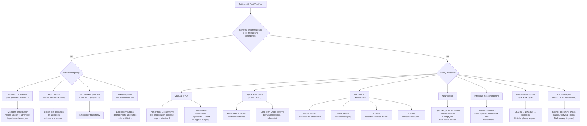

## Management of Foot/Toe Pain

Management of foot/toe pain is **condition-specific** — there is no "one-size-fits-all" treatment plan. What follows is a master management algorithm, then a systematic, condition-by-condition treatment guide covering conservative, pharmacological, interventional, and surgical modalities. I will explain *why* each treatment works from first principles.

---

### 1. Master Management Algorithm

The overarching logic: **Identify and treat the cause, not just the symptom.** The algorithm branches by urgency and aetiology.

---

### 2. Emergency Management

#### 2.1 Acute Limb Ischaemia [5][6][7]

This is a **surgical emergency**. Irreversible muscle damage begins at **4–6 hours** [6].

**Immediate supportive measures** [6]:
- ***Keep the feet dependent*** — gravity augments perfusion to the ischaemic limb
- ***O₂ supplementation*** — maximise tissue oxygenation
- ***Correction of hypotension*** — hypotension can precipitate acute thrombosis by low flow (stasis)

**Medical treatment** [6]:
- ***Analgesics*** — opioids often required
- ***Anticoagulation with IV heparin*** — ***ALL patients should be anticoagulated once the diagnosis of acute arterial ischaemia due to emboli or thrombi is made, in the absence of contraindications*** [6]
  - ***IV heparin bolus followed by continuous heparin infusion***
  - ***Aims for APTT 2–2.5× normal***
  - ***Rationale***: (1) ***prevents further propagation of thrombus*** into unaffected vascular beds; (2) ***inhibits thrombosis distally*** in arterial and venous systems due to low-flow stasis [6]

**Definitive treatment** — depends on ***Rutherford classification and aetiology*** [5][6]:

| Approach | Modalities | Indications |
|----------|-----------|-------------|
| ***Surgical revascularisation*** | ***Embolectomy (open)***; ***bypass grafting*** (for long-segment occlusion); ***± prophylactic fasciotomy*** (for compartment syndrome risk) [6] | ***Immediately threatened extremities (IIb)***; ***recent occlusion < 2 weeks***; ***complete ischaemia suggesting embolism*** [6] |
| ***Endovascular revascularisation*** | ***Intra-arterial thrombolysis***; ***angioplasty and stenting*** [6] | ***Viable or marginally threatened extremities (I, IIa)***; ***prolonged occlusion > 2 weeks*** (more likely thrombotic with collaterals); ***incomplete ischaemia*** [6] |
| ***Amputation*** | Below-knee or above-knee | ***Non-viable limb (Rutherford III)*** — completely anaesthetic + paralysed, inaudible arterial AND venous Doppler signals [5] |

> ***Why embolectomy for embolic causes and thrombolysis for thrombotic?*** Embolectomy (Fogarty catheter — a balloon catheter passed beyond the clot then inflated and pulled back to extract the embolus) works best for **discrete, fresh** emboli lodged at bifurcation points without surrounding atherosclerotic disease. Thrombolysis (catheter-directed tPA/urokinase infused directly at the thrombus) works better for **chronic, organised thrombus** superimposed on atherosclerosis, where the thrombus is adherent to the diseased vessel wall and cannot be easily mechanically extracted [5][6].

***Below knee*** [7]: ***local thrombolysis / bypass***
- ***Complete ischaemia: proceed to LA open embolectomy***
- ***Incomplete ischaemia: obtain pre-op imaging if possible → endovascular treatments***
- ***Non-viable limb: amputation***

<Callout title="Post-Revascularisation Complications" type="error">
After revascularisation, be vigilant for ***reperfusion injury***:

1. ***Compartment syndrome***: prolonged ischaemia → cell lysis → fluid leaks into interstitium → ***intracompartmental pressure > 30 mmHg*** → ***pain out of proportion to clinical signs, tense compartment, numbness in nerve distribution***. ***Pulses can still be present*** (SBP >> compartmental pressure). ***Treatment: urgent fasciotomy*** [5][7].

2. ***Rhabdomyolysis***: reperfusion releases ***K⁺, H⁺, myoglobin*** from damaged muscle → ***arrhythmia, AKI***. ***Management: aggressive hydration, IV bicarbonate (↓ acidosis, ↓ myoglobin cast formation), ± mannitol diuresis, ± dialysis*** [5][7].
</Callout>

#### 2.2 Septic Arthritis [3]

- **Joint aspiration** — both diagnostic AND therapeutic (decompresses the joint)
- **IV antibiotics** — empiric Gram-positive cover initially (flucloxacillin / cloxacillin ± gentamicin for Gram-negative cover); adjust based on Gram stain and culture
  - In sexually active young adults: cover for *N. gonorrhoeae* (ceftriaxone)
  - In IVDU: cover for *P. aeruginosa* and MRSA
- **Arthroscopic washout / surgical drainage** — serial joint aspirations or arthroscopic lavage to remove purulent material and prevent cartilage destruction
- Prompt treatment is critical: ***bacterial infection can destroy joint cartilage in a few days*** [3]

#### 2.3 Wet Gangrene / Necrotising Fasciitis [6]

- ***Wet gangrene: emergency requiring surgical debridement or amputation*** [6]
- Necrotising fasciitis: emergency wide debridement + IV broad-spectrum antibiotics (e.g., meropenem + clindamycin + vancomycin) + ICU care
- ***Dry gangrene: safe to allow self-amputation after demarcation with precautions against infection*** [6]

---

### 3. Condition-Specific Management

#### 3.1 Peripheral Arterial Disease — Chronic Limb Ischaemia [5][7]

The management approach is dictated by severity: ***conservative if non-disabling claudication alone; surgery if disabling claudication or critical limb ischaemia*** [5].

##### A. Conservative Management [5][7]

> ***"Claudication won't kill but is associated with ↑↑ risk of stroke and MI (CHD risk equivalent in ATP-III). Should be viewed as a warning sign of CVS disease instead of a condition in itself"*** [5].

**CVS risk factor management to improve survival** [5]:
- ***Risk factor modification: smoking cessation, DM control, HTN control, lipid control***
- ***Lifelong antiplatelets: aspirin*** (75–325 mg) ***and/or clopidogrel*** — secondary prevention of coronary heart disease and stroke [5][7]
- ***Statin regardless of lipid level*** — for overall CVS protection [7]

**Symptomatic management** — ***50% of patients improve; < 5% develop critical limb ischaemia*** [5]:
- ***Supervised exercise training***: ***walk until pain comes → stop and rest → walk again*** [5]
  - Why does this work? Exercise training increases muscle oxygen extraction efficiency, promotes collateral vessel development, and improves anaerobic metabolism tolerance. The supervised component is key — compliance with unsupervised programs is poor.
- ***Cilostazol*** (100 mg BD) — ***most commonly used drug; PDE3 inhibitor with antiplatelet and vasodilatory effect*** [5][7]
  - Mechanism: inhibits PDE3 → ↑ cAMP in platelets and vascular smooth muscle → platelet aggregation inhibited + vasodilation → improved blood flow
  - ***Contraindicated in CHF*** (PDE3 inhibitors increase mortality in CHF — learned from milrinone) [7]
  - ***Alternatives: naftidrofuryl (5-HT₂ antagonist: reduces platelet aggregation), pentoxifylline / Trental (PDE inhibitor), prostaglandins*** [5][7]

##### B. Surgical / Interventional Management [5]

***Indications*** [5]:
- ***Disabling claudication in non-critical ischaemia*** → ***at least one trial of conservative treatment unless severe impact on lifestyle*** → ***NOT first-line to treat intermittent claudication!***
- ***Limb salvage in critical ischaemia***

> ***"Rationale for not going for surgery in IC patients: (1) failed surgery has poorer outcome than no surgery; (2) second surgery is less likely to succeed"*** [5].

***General principles in choosing treatment*** [5]:
- ***Treat inflow before outflow disease*** — treat aortoiliac disease first, then reassess distal disease
- ***Short stenosis → endovascular; long, complete occlusion → surgical bypass***
- ***Consider venous graft availability*** (need > 3–4 mm diameter, no varicosities, intact valves or reversed)
- ***Life expectancy ≤ 2 years → endovascular*** (better short-term outcome; unlikely to benefit from long-term patency of bypass)
- ***Rest pain → prefer bypass*** (durable effect on pain) [5]

***TASC II Classification*** guides the choice [5]:
- ***Type A***: short, focal → ***excellent result with endovascular therapy***
- ***Type B***: still prefer endovascular, can perform surgery
- ***Type C***: ***better results with open revascularisation*** but endovascular Tx can be used if high surgical risk
- ***Type D***: ***usually prefer surgery as primary treatment for low-to-moderate risk patients***

| Modality | Description | Best For |
|----------|------------|----------|
| ***Percutaneous transluminal balloon angioplasty (PTA) ± stenting*** | Balloon inflated for ~30 seconds → dilates stenosis. Stent placed to maintain patency. ***Stenting NOT used below the knee*** [7] | ***TASC A/B, aortoiliac disease, short-segment occlusion < 10 cm, life expectancy < 2 years*** [7] |
| ***Arterial bypass*** | Autologous vein graft (great saphenous vein preferred) or synthetic graft (Dacron/PTFE). Creates alternative conduit around the occlusion | ***TASC C/D, failed angioplasty, long-segment occlusion, complete occlusion*** (no lumen for guidewire) [7] |
| ***Endarterectomy*** | Open artery, evacuate atheromatous plaque | ***Uncommon now except at carotid and femoral bifurcation (profundoplasty)*** [7] |
| ***Amputation*** | Below-knee (preferable — preserves knee for prosthetic fitting) or above-knee | ***Non-viable limb after failed revascularisation*** |

**Post-PTA/stent**: ***antiplatelet + anticoagulation*** to prevent stent thrombosis [7].

**Specific complications of PTA** [7]:
- ***Arterial dissection / rupture***
- ***Distal embolisation***
- ***Re-stenosis***

***Prognosis for chronic limb ischaemia*** [5]:
- ***Non-critical CLI at 5 years***: stable claudication (70–80%), worsening (10–20%), critical CLI (1–2%). CVS: non-fatal MI/stroke (20%), death (15–30%)
- ***Critical CLI at 1 year***: alive with two limbs (50%), amputation (25%), CVS mortality (25%)

<Callout title="Key Exam Point">
PAD management is primarily about **cardiovascular risk reduction** — the biggest killer of claudicants is MI and stroke, not limb loss. Antiplatelets, statins, smoking cessation, and exercise are the cornerstones. Surgery is reserved for disabling symptoms or critical ischaemia.
</Callout>

#### 3.2 Gout [3]

##### A. Acute Gout Flare

Three first-line options — choice depends on patient comorbidities:

| Agent | Mechanism | Dosing | Key Points |
|-------|-----------|--------|------------|
| ***NSAIDs*** (e.g., naproxen 500 mg BD, indomethacin 50 mg TDS) | COX inhibition → ↓ prostaglandin synthesis → ↓ inflammation and pain | Full dose for 5–7 days, then taper | ***Avoid in CKD, heart failure, GI bleed history, concomitant anticoagulation.*** First-line in young, otherwise healthy patients |
| ***Colchicine*** | Binds tubulin → inhibits microtubule polymerisation → ↓ neutrophil migration/phagocytosis + ↓ NLRP3 inflammasome activation → ↓ IL-1β release | Low-dose regimen: 0.5 mg TDS (first day), then 0.5 mg BD until resolution | ***Must be started within 12–36 hours of flare onset for best efficacy***. GI side effects (diarrhoea, nausea) dose-dependent. ***Avoid in severe CKD/hepatic impairment*** |
| ***Corticosteroids*** | Broad anti-inflammatory — suppress NF-κB → ↓ cytokine production | ***Intra-articular: triamcinolone acetonide 10–40 mg*** (after aspirating to rule out sepsis) [3]; Oral: prednisolone 30–35 mg/day × 5 days then taper; IM/IV if cannot take oral | ***Preferred in CKD, elderly, multiple comorbidities***. Intra-articular steroid ***highly effective, resolves attack ≤ 24 hours*** [3]. ***Slow taper if chronic gout (shorter intercritical period → ↑ chance of rebound flare)*** [3] |

> ***Important***: Do NOT start or stop urate-lowering therapy (ULT) during an acute flare — changing serum urate acutely can trigger or prolong the flare by causing crystal dissolution or precipitation. If the patient is already on ULT, continue it at the same dose.

##### B. Long-Term Urate-Lowering Therapy (ULT)

**Indications for ULT** (2020 ACR guidelines):
- ≥ 2 flares per year
- Tophi on clinical examination or imaging
- Urate nephropathy / uric acid nephrolithiasis
- Consider after even first flare if: CKD stage ≥ 3, serum urate > 9 mg/dL, or urolithiasis

**Target**: serum urate < 6 mg/dL (< 0.36 mmol/L); < 5 mg/dL if tophaceous gout (to dissolve existing deposits).

| Agent | Mechanism | Dosing | Key Points |
|-------|-----------|--------|------------|
| ***Allopurinol*** | Xanthine oxidase inhibitor → ↓ uric acid production ("allo" = other + "purinol" = purine metabolism) | Start low (100 mg/day; 50 mg in CKD), titrate by 100 mg every 2–4 weeks to target | ***First-line ULT***. Rare but serious: ***allopurinol hypersensitivity syndrome (AHS)*** — SJS/TEN, DRESS. ***HLA-B*5801 screening MANDATORY before starting in Southeast Asian/Chinese populations*** (prevalence ~6–8% in HK Chinese) |
| ***Febuxostat*** | Non-purine selective xanthine oxidase inhibitor | 40–80 mg daily | Alternative if allopurinol intolerant/contraindicated. Concerns about ↑ CV mortality (CARES trial) — use with caution in CVD |
| **Probenecid** | Uricosuric — blocks URAT1 transporter in proximal tubule → ↑ renal urate excretion | 500 mg BD | ***Contraindicated in CKD (eGFR < 30), nephrolithiasis***. Requires adequate urine output and alkalinisation |
| **Pegloticase** | Recombinant PEG-uricase — converts uric acid to allantoin (which is more soluble) | IV infusion every 2 weeks | Reserved for severe refractory tophaceous gout. Risk of anaphylaxis, infusion reactions |

**Flare prophylaxis during ULT initiation**: Low-dose colchicine (0.5 mg daily) or low-dose NSAID for ≥ 3–6 months (or 6 months after achieving target urate). Why? Starting ULT changes serum urate levels → crystal dissolution from cartilage surface → "naked" crystals shed into joint space → inflammatory response → paradoxical flare.

<Callout title="HLA-B*5801 Screening" type="error">
***In Hong Kong Chinese, HLA-B*5801 prevalence is approximately 6–8%***. Allopurinol hypersensitivity syndrome is strongly associated with this allele and can be fatal (SJS/TEN). ***Screening is MANDATORY before starting allopurinol in all patients of Southeast Asian, Chinese, Korean, Thai, and African American descent.*** If positive → use febuxostat instead.
</Callout>

#### 3.3 CPPD Disease (Pseudogout) [3]

| Setting | Treatment | Notes |
|---------|-----------|-------|
| ***Acute pseudogout (1–2 joints)*** | ***Thorough joint aspiration + intra-articular glucocorticoid injection*** [3]. ***Regimen: triamcinolone acetonide (1 mL, 40 mg) mixed with 1–2 mL 1% lidocaine for large joints*** [3]. ***Effect: usually provides relief of pain/swelling ≤ 8–24 hours*** [3] | ***Must rule out septic arthritis before steroid injection*** [3]. Also: ice pack, immobilisation, joint rest for 48–72 hours |
| ***Acute pseudogout ( > 2 joints)*** | ***Systemic anti-inflammatory drug*** (NSAIDs, colchicine, or oral steroids) [3] | Same agents as gout flare |
| Chronic CPPD arthropathy | Low-dose colchicine; NSAIDs as needed; methotrexate or hydroxychloroquine in refractory cases | No therapy dissolves existing CPPD crystals |
| Underlying cause | ***Correction of underlying cause, e.g., hyperparathyroidism*** [3]; screen for haemochromatosis, hypomagnesaemia | |

> There is ***no equivalent of allopurinol for CPPD*** — we cannot dissolve or prevent CPPD crystal formation pharmacologically. Management is entirely symptomatic and directed at treating the underlying metabolic abnormality.

#### 3.4 Plantar Fasciitis [8]

A stepwise approach over 6–12 months — the vast majority resolve with conservative treatment.

| Step | Treatment | Mechanism / Rationale |
|------|----------|----------------------|
| 1. ***Non-operative (first-line)*** | ***Pain control*** (NSAIDs, paracetamol) [8] | Reduce inflammation and pain |
| | ***Footwear adjustment*** — supportive shoes with arch support, cushioned heel [8] | Offloads the calcaneal origin; reduces tensile stress on the fascia |
| | ***Physiotherapy*** — calf stretching, plantar fascia-specific stretching, eccentric exercises [8] | Stretching the gastrocnemius-soleus complex reduces tension transmitted to the fascia via the Achilles-calcaneal-plantar system (the gastrocnemius and plantar fascia are functionally linked through the calcaneus) |
| | Night splint (keeps foot in dorsiflexion overnight) | Prevents fascia from contracting overnight → reduces first-step morning pain |
| 2. If refractory (3–6 months) | ***Extracorporeal shockwave therapy (ESWT)*** [8] | Delivers focused acoustic energy → stimulates neovascularisation and tissue remodelling in the degenerate fascia; also provides analgesic effect through hyperstimulation of nociceptors |
| | ***Corticosteroid injection*** (ultrasound-guided) [8] | Potent local anti-inflammatory. ***Risks: plantar fascia rupture (weakens collagen), fat pad atrophy***. Limit to 1–3 injections |
| 3. ***Operative (last resort)*** | ***Plantar fasciotomy*** — partial release of the plantar fascia from the calcaneus [8] | Relieves tension at the origin. Risk: destabilisation of the medial longitudinal arch |

#### 3.5 Achilles Tendinopathy and Rupture [8]

##### A. Tendinopathy [8]

- ***Avoid precipitating exercise*** [8] — relative rest, activity modification
- ***NSAIDs*** — short course for pain; avoid long-term (may impair tendon healing)
- ***Physiotherapy*** — **eccentric exercises** (Alfredson protocol: heavy-load eccentric calf exercises — slowly lowering the heel over the edge of a step). Why eccentric? Eccentric loading preferentially stimulates collagen remodelling and tenocyte activity in the degenerative tendon [8]
- GTN patches (topical nitric oxide donors) — stimulate collagen synthesis; evidence mixed
- ***Avoid corticosteroid injection*** into or around the Achilles — significant risk of tendon rupture

##### B. Rupture [8]

| Scenario | Management | Details |
|----------|-----------|---------|
| ***Early presentation ( < 2 weeks)*** | ***Plaster immobilisation in full equinus*** (foot plantarflexion + toe extension) ***× 2 weeks → semi-equinus × 4 weeks → neutral position × 4 weeks*** [8] | Non-operative functional rehabilitation; similar outcomes to surgery in some studies if applied early and patient is compliant |
| ***Late presentation ( > 2 weeks) / Relatively active patient*** | ***End-to-end tendon repair ± FHL graft*** (if no pre-existing tendinopathy) [8]; ***Achilles tendon reconstruction*** (if tendinopathy) [8] | Surgical repair indicated for late or active patients because the tendon ends retract and scar tissue fills the gap, preventing apposition |

> ***Why can active ankle plantarflexion still occur after Achilles rupture?*** Because other muscles — ***tibialis posterior, peroneus longus and brevis*** — also contribute to plantarflexion, though much weaker than the gastrocnemius-soleus complex [8]. This is why a missed rupture is possible if only active motion is tested without the Thompson test.

#### 3.6 Hallux Valgus [8]

| Approach | Details | Indications |
|----------|---------|-------------|
| ***Conservative*** | ***Footwear: wide and deep toe boxes***, avoid high heels and narrow shoes; ***orthosis for flatfoot***; ***physiotherapy: intrinsic muscle strengthening*** [8] | Mild symptoms, patient not wanting surgery |
| ***Surgical (only EBM recommendation)*** | Depends on severity and whether the joint is arthritic [8] | Significant pain, functional limitation, progressive deformity |

***Surgical options*** [8]:

| Joint Status | Procedure | Description |
|-------------|-----------|-------------|
| ***Non-arthritic joint*** | ***Chevron osteotomy*** (mild HV) | V-shaped osteotomy of distal 1st MT → translate the metatarsal head laterally |
| | ***Scarf osteotomy*** (moderate/severe HV) | Z-shaped osteotomy of 1st MT shaft → allows multiplanar correction |
| | ***Soft tissue rebalancing (e.g., McBride)*** | Release of tight lateral structures (adductor hallucis) + medial capsule plication |
| ***Arthritic joint*** | ***Arthrodesis (e.g., Lapidus procedure)*** — 1st TMT joint fusion [8] | Fuses the hypermobile joint — addresses the root cause in many cases |
| | ***Keller's procedure*** (excision arthroplasty + hemiphalangectomy) [8] | Removes the proximal portion of the proximal phalanx — shortens the toe, suitable for elderly/low-demand patients |

***Complications of hallux valgus surgery*** [8]: ***avascular necrosis, non-union, displacement, reduced ROM***.

#### 3.7 Pes Planus (Flat Foot) [8]

- ***Identify and treat / refer early*** [8]
- ***Insole: medial heel wedge*** [8] — supports the medial longitudinal arch by tilting the hindfoot out of valgus
- Tibialis posterior tendon dysfunction: activity modification, supportive footwear, physiotherapy → if failed, surgical options include tendon transfer (FDL transfer), calcaneal osteotomy, subtalar fusion

#### 3.8 Pes Cavus (High-Arched Foot) [8]

- ***Conservative: extra-depth shoes, physiotherapy*** [8]
- ***Surgery: plantar fascia release*** (in severe cases) [8]
- Always investigate and treat the underlying **neuromuscular cause** (CMT disease, muscular dystrophy, etc.)

#### 3.9 Diabetic Foot [4][8]

***"Multidisciplinary approach (refer podiatry) for those at high risk or with Hx of foot ulcers"*** [4].

| Component | Management |
|-----------|-----------|
| **Prevention** | ***Annual comprehensive foot examination*** including ***inspection + palpation of pulses*** [4]; ***examine at every visit for insensate feet, foot deformities, and ulcers*** [4]; ***refer vascular surgery for patients with significant claudication or positive ABI*** [4]; ***general foot self-care for all DM patients*** [4] |
| ***Neuropathic component*** | ***Customised insole*** — offloads pressure from high-risk areas (MT heads, bony prominences) [8]; total contact casting for neuropathic ulcers |
| ***Vascular component*** | ***Angioplasty*** if significant PAD contributing to ischaemia [8]; optimise cardiovascular risk factors |
| **Glycaemic control** | ***Optimise glycaemic control as mainstay*** for neuropathy progression [4]; ***gabapentinoids (gabapentin/pregabalin) and antidepressants (amitriptyline) for neuropathic pain*** [4] |
| **Infection** | Empiric antibiotics for cellulitis (amoxicillin + cloxacillin); long-course antibiotics (6–8 weeks) for osteomyelitis; ***surgical debridement*** of necrotic tissue [8] |
| **Surgical** | ***Debridement, below-knee amputation*** (if non-viable) [8] |

##### Charcot Arthropathy [4][8]

- ***Short-term immobilisation (3–6 months)***: ***proven to ↓ long-term joint damage and progression*** [4] — total contact cast or removable cast walker to offload the affected foot
- ***Walking aid to offload foot*** [8]
- ***Consider antiresorptive agents (bisphosphonates, calcitonin) as adjunct*** (evidence uncertain) [4]
- ***Consider orthopaedic referral for surgical correction in severe cases*** [4]
- ***Surgical correction best avoided: high failure rate*** [8] — only when conservative management fails and the deformity causes recurrent ulceration

#### 3.10 Ankle Sprain [8]

- ***Conservative***: ***RICE*** (Rest, Ice, Compression, Elevation), then ***early mobilisation*** [8]
- ***Ankle instability***: ***physiotherapy for peroneal muscle strengthening, braces*** to prevent recurrent sprains [8]
- ***Surgery for ankle instability***: if ***pain and instability despite conservative management*** [8]
  - ***Arthroscopic debridement*** of impinging lesions [8]
  - ***Reconstruction of lateral ligaments (Brostrom-Gould procedure)*** [8]

**Ottawa Ankle Rules** determine need for XR [8]: bone tenderness at posterior malleoli/tips OR inability to bear weight for 4 steps → XR indicated.

#### 3.11 Ankle Fracture [8]

| Setting | Management |
|---------|-----------|
| ***Non-operative*** | ***Non-displaced fracture, Weber A, Weber B without talar shift***: ***closed reduction, below-knee back slab***, repeat neurovascular exam + XR [8] |
| ***Operative*** | ***Bimalleolar/trimalleolar fracture, Weber B with talar shift, Weber C, open fracture***: ***ORIF ± syndesmotic screw / tightrope fixation*** [8] |

#### 3.12 Spondyloarthropathy-Related Foot Pain (Enthesitis, Dactylitis) [3]

- ***NSAIDs or COX-2 inhibitor as first line*** [3] — ~70–80% report substantial symptom relief
- ***Anti-TNF or anti-IL-17A as second line*** if persistent high disease activity despite NSAIDs [3]
- ***Local glucocorticoid injections for enthesitis and dactylitis*** [3]
- ***DMARDs (e.g., sulphasalazine)*** may be useful in persistent peripheral arthritis [3]
- ***General measures: patient education, stretching exercise/physiotherapy, smoking cessation*** [3]

#### 3.13 Warts, Corns, and Calluses [1][9]

| Condition | Management |
|-----------|-----------|
| ***Plantar warts*** | ***Conservative: spontaneous resolution in majority but may take years*** [9]. ***Destructive: topical salicylic acid*** (exfoliates affected epidermis, stimulates local immunity); ***cryotherapy with liquid nitrogen*** (risk: scarring, pain); ***surgical removal*** (shave, curettage, paring) [9]. Refractory: intralesional bleomycin, imiquimod, pulsed laser |
| **Corns/calluses** | Paring of hyperkeratotic tissue; offloading with padding/orthotics; footwear modification; salicylic acid plasters |
| **Ingrown toenail** | Mild: conservative (proper cutting technique, cotton wool/dental floss under nail edge); moderate/recurrent: partial nail avulsion + phenolisation (chemical matrixectomy — phenol destroys the germinal matrix to prevent regrowth of the offending nail edge); severe/infected: antibiotics + surgical excision (Zadik procedure — total nail bed ablation if recurrent) |

#### 3.14 Morton's Neuroma [1]

- **Conservative**: wider footwear, metatarsal pad (placed proximal to the affected interspace to splay the MT heads and decompress the nerve), activity modification, NSAIDs
- **Injection**: ultrasound-guided corticosteroid injection into the intermetatarsal space — provides temporary relief in ~50%
- **Surgical**: neurectomy (excision of the neuroma) if failed conservative treatment > 3–6 months. Risk: permanent numbness in the affected web space (expected — you are removing the nerve)

#### 3.15 Stress Fractures [1]

- **Low-risk** stress fractures (2nd/3rd MT shaft): relative rest, protected weight-bearing with stiff-soled shoe/walking boot for 4–6 weeks; graduated return to activity
- **High-risk** stress fractures (navicular, 5th MT Jones fracture, sesamoid): ***non-weight-bearing cast*** for 6–8 weeks; surgical fixation (percutaneous screw) if delayed union or complete fracture

> ***Why is the navicular stress fracture high-risk?*** The central portion of the navicular has a relatively avascular zone (blood supply enters from the periphery), analogous to the waist of the scaphoid. Fractures through this zone are prone to non-union and avascular necrosis if not aggressively immobilised.

---

### 4. Summary Table — Treatment by Condition

| Condition | Conservative | Pharmacological | Interventional / Surgical |
|-----------|-------------|----------------|--------------------------|
| **PAD — claudication** | Exercise, RF modification | Aspirin, statin, cilostazol | PTA ± stent, bypass (if disabling) |
| **PAD — critical ischaemia** | Keep leg dependent, O₂ | Heparin, opioids | Urgent PTA/bypass or amputation |
| **Acute gout** | Rest, ice | NSAIDs / colchicine / steroids | IA steroid injection |
| **Chronic gout** | Diet, lifestyle | Allopurinol (screen HLA-B*5801!) / febuxostat | Tophus excision (rare) |
| **Plantar fasciitis** | Footwear, PT, stretching, night splint | NSAIDs; steroid injection if refractory | ESWT; plantar fasciotomy (last resort) |
| **Achilles tendinopathy** | Relative rest, eccentric exercises | NSAIDs (short course) | Avoid steroid injection |
| **Achilles rupture** | Equinus casting ( < 2 weeks) | — | Surgical repair (late/ active) |
| **Hallux valgus** | Wide shoes, orthotics, PT | — | Osteotomy (Chevron/Scarf), Keller's, Lapidus |
| **Diabetic foot** | Insoles, education, multidisciplinary | Glycaemic control, gabapentinoids | Angioplasty, debridement, amputation |
| **Charcot arthropathy** | Immobilisation 3–6 months, walking aid | Bisphosphonates (uncertain) | Surgery avoided; referral if severe |
| **Ankle sprain** | RICE, early mobilisation, PT | NSAIDs | Brostrom-Gould (if instability) |
| **Morton's neuroma** | Wider shoes, metatarsal pad | NSAIDs; steroid injection | Neurectomy |
| **Ingrown toenail** | Proper nail care | Antibiotics if infected | Partial nail avulsion + phenolisation |

---

<Callout title="High Yield Summary">

**Emergency management priorities:**
- Acute limb ischaemia: IV heparin immediately → assess viability → embolectomy / thrombolysis / amputation. Watch for compartment syndrome and rhabdomyolysis post-revascularisation.
- Septic arthritis: aspirate → IV antibiotics → washout. Cartilage destroyed in days if untreated.
- Wet gangrene: emergency debridement/amputation. Dry gangrene can self-amputate.

**PAD management:**
- Conservative first: smoking cessation, supervised exercise, aspirin, statin, cilostazol (C/I in CHF).
- Surgery only for disabling claudication or critical ischaemia. TASC A/B → endovascular; TASC C/D → surgery. Treat inflow before outflow.

**Gout management:**
- Acute: NSAIDs / colchicine / steroids (choose based on comorbidities).
- Long-term ULT: allopurinol first-line (HLA-B*5801 screening mandatory in HK Chinese!), target urate < 6 mg/dL. Flare prophylaxis with low-dose colchicine × 3–6 months.

**Plantar fasciitis**: stepwise — footwear + PT + stretching → ESWT / steroid injection → fasciotomy. Clinical diagnosis; heel spur is incidental.

**Achilles**: eccentric exercises for tendinopathy (NO steroids!). Rupture < 2 weeks → equinus cast; > 2 weeks/active → surgical repair.

**Diabetic foot**: multidisciplinary — prevention (annual foot exam, education), insoles (neuropathic), angioplasty (vascular), debridement/amputation (surgical). Charcot: immobilise 3–6 months.

**Hallux valgus surgery**: Chevron (mild), Scarf (moderate/severe), Lapidus/Keller's (arthritic).
</Callout>

---

<ActiveRecallQuiz
  title="Active Recall - Management of Foot/Toe Pain"
  items={[
    {
      question: "A 65-year-old smoker with ABI 0.6 and a claudication distance of 300 metres presents to clinic. Outline the conservative management of his intermittent claudication.",
      markscheme: "1. CVS risk factor modification: smoking cessation (strongest RF), DM control, HTN control, lipid control. 2. Lifelong antiplatelets: aspirin 75-325mg and/or clopidogrel. 3. Statin regardless of lipid level. 4. Supervised exercise training: walk until pain, rest, repeat (increases O2 extraction, collateral development, anaerobic tolerance). 5. Cilostazol 100mg BD (PDE3 inhibitor with antiplatelet and vasodilatory effect; C/I in CHF). Surgery not first-line for non-disabling claudication."
    },
    {
      question: "What are the indications for surgical intervention in chronic limb ischaemia, and how does the TASC II classification guide the choice between endovascular and open surgery?",
      markscheme: "Indications: (1) Disabling claudication after failed conservative treatment (at least one trial); (2) Limb salvage in critical limb ischaemia (rest pain, ulcers, gangrene). TASC II: Type A (short focal) = excellent endovascular results; Type B = prefer endovascular; Type C = better with open surgery but endovascular if high surgical risk; Type D = prefer surgery for low/moderate risk. Also consider: treat inflow before outflow, short stenosis prefer endovascular, complete occlusion prefer bypass, life expectancy less than 2y prefer endovascular."
    },
    {
      question: "A 50-year-old HK Chinese man is diagnosed with gout and you plan to start allopurinol. What essential screening test must be done before starting, and why?",
      markscheme: "HLA-B*5801 screening is MANDATORY. Prevalence in HK Chinese is approximately 6-8%. HLA-B*5801 is strongly associated with allopurinol hypersensitivity syndrome (AHS), which can manifest as SJS/TEN or DRESS syndrome, potentially fatal. If HLA-B*5801 positive, use febuxostat (non-purine xanthine oxidase inhibitor) instead. Also need flare prophylaxis with low-dose colchicine for 3-6 months when starting ULT."
    },
    {
      question: "Outline the stepwise management of plantar fasciitis from first-line to last resort.",
      markscheme: "Step 1 (first-line conservative): supportive footwear with arch support and cushioned heel, physiotherapy (calf stretching, plantar fascia-specific stretching, eccentric exercises), NSAIDs for pain, night splint to maintain dorsiflexion. Step 2 (refractory 3-6 months): extracorporeal shockwave therapy (ESWT), ultrasound-guided corticosteroid injection (limit 1-3; risk of fascia rupture and fat pad atrophy). Step 3 (last resort): surgical plantar fasciotomy (partial release from calcaneus). Clinical diagnosis; XR only to rule out fracture."
    },
    {
      question: "A patient presents 3 weeks after feeling a 'pop' in the back of their ankle during basketball. Thompson test is positive. What is the diagnosis and management?",
      markscheme: "Diagnosis: Achilles tendon rupture (late presentation > 2 weeks). Thompson test positive = no plantarflexion when calf is squeezed, confirming disruption of Achilles tendon. Management: Surgical repair because late presentation means tendon ends have retracted and gap filled with scar tissue, preventing conservative apposition. Options: (1) End-to-end tendon repair +/- FHL graft if no pre-existing tendinopathy; (2) Achilles tendon reconstruction if tendinopathy present. Early presentation (< 2 weeks) could have been managed with equinus plaster immobilisation."
    },
    {
      question: "What are the two major complications to watch for after revascularisation of an acutely ischaemic limb, and how is each managed?",
      markscheme: "1. Compartment syndrome: Prolonged ischaemia causes cell lysis, reperfusion causes fluid leak into interstitium, intracompartmental pressure rises above 30 mmHg. S/S: pain out of proportion, tense compartment, numbness. Pulses may still be present. Management: emergency fasciotomy. 2. Rhabdomyolysis: Reperfusion releases K+, H+, myoglobin from damaged muscle. Consequences: arrhythmia, AKI (myoglobin nephrotoxicity). Management: aggressive IV hydration, IV bicarbonate (reduces acidosis and myoglobin cast formation), mannitol diuresis, dialysis if needed. Monitor BP, UO, APTT, RFT, cardiac monitor post-operatively."
    }
  ]}
/>

## References

[1] Lecture slides: murtagh merge.pdf (p55–57, Foot and ankle pain)
[3] Senior notes: Ryan Ho Rheumatology.pdf (p23, Ankle and Foot examination; p38, Acute gout management; p42, CPPD management; p62, SpA management; p67, Septic arthritis)
[4] Senior notes: Ryan Ho Endocrine.pdf (p97–99, Diabetic Nephropathy, Diabetic Neuropathy, Diabetic Foot, Charcot Arthropathy management)
[5] Senior notes: Ryan Ho Cardiology.pdf (p207, Rest Pain; p215–216, Assessment and Management of Lower Limb Ischaemia; p238, CVI Management)
[6] Senior notes: felixlai.md (p923–924, Acute arterial insufficiency supportive and medical treatment, surgical modalities; p932, Gangrene; p947–948, CVI treatment)
[7] Senior notes: maxim.md (p354, PAD conservative and definitive management; p361, Below-knee management, complications including compartment syndrome and rhabdomyolysis)
[8] Senior notes: maxim.md (p541–542, Ankle sprain and fracture management; p547–548, Achilles tendinopathy/rupture and Plantar fasciitis management; p538–540, Hallux valgus, Pes planus, Pes cavus management; p550, Diabetic foot ulcers and Charcot management)
[9] Senior notes: Ryan Ho Rheumatology.pdf (p138, Viral warts management)
