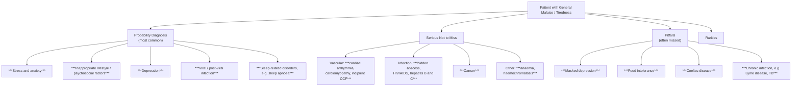
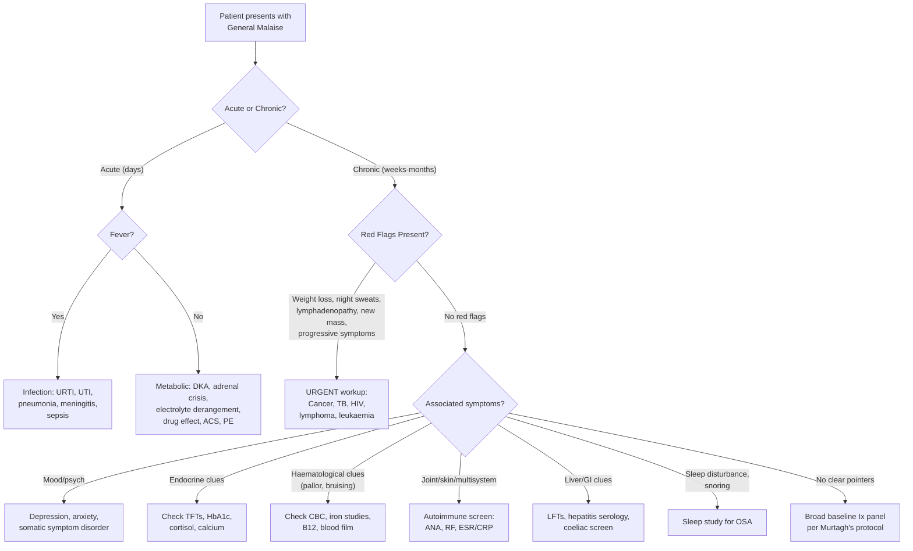

## Differential Diagnosis of General Malaise

The differential diagnosis of general malaise is enormous — arguably the broadest in all of medicine — because malaise is a **non-specific constitutional symptom** that can accompany virtually any systemic disease. The key challenge for the clinician is **not** to list every possible disease, but to **structure your thinking** so you move efficiently from "I feel generally unwell" to a working diagnosis.

The approach here uses **three complementary frameworks** layered together:

1. **Murtagh's Diagnostic Strategy** — a primary-care probability framework (probability → serious → pitfalls → rarities) [1]
2. **Systems-based differential** — to ensure nothing is missed organ-by-organ
3. **Tempo-based differential** — acute vs. subacute vs. chronic, because timing alone eliminates huge chunks of the DDx

---

### Framework 1: Murtagh's Diagnostic Strategy for Tiredness / Chronic Fatigue

This is essentially a **pre-test probability triage** — what is the most likely, what must you not miss, and what do people often overlook?

<Callout title="Murtagh's Rule for Fatigue/Malaise" type="idea">
In general practice, the probability diagnoses (***stress/anxiety, lifestyle factors, depression, viral/post-viral, sleep disorders***) [1] account for the **vast majority** of cases. But you must always actively exclude the "serious not to miss" category — particularly ***anaemia, cancer, cardiac failure, and chronic infection*** — before settling on a benign explanation.
</Callout>

---

### Framework 2: Systems-Based Differential Diagnosis

Below is a comprehensive systems-based DDx. For each system, I explain **why** that disease produces malaise, tying back to the cytokine–brain axis and metabolic pathophysiology discussed in Part 1.

#### A. Psychiatric / Psychological

| Condition | Why It Causes Malaise | Key Distinguishing Features |
|-----------|----------------------|----------------------------|
| ***Depression*** [1][6] | ↓Serotonin/NE → overlapping neural circuits with sickness behaviour; chronic HPA axis activation → neuroinflammation, ↑IL-6/TNF-α | ***Low mood, anhedonia, sleep disturbance, appetite change, guilt, ↓concentration; "masked" depression if somatic features dominate*** [1]. Prevalence ***2.9% in HK*** [6] |
| ***Anxiety / GAD*** [1][7] | Chronic hyperarousal → muscular tension, sleep disruption, exhaustion; hyperventilation → respiratory alkalosis → paraesthesia, dizziness, fatigue | Free-floating persistent anxiety, ***somatic features (palpitations, sweating, muscle tension, sleep disturbance)***; tiredness is a common accompaniment but ***never the most prominent feature*** [7] |
| ***Somatic symptom disorder*** [8] | Amplification of normal bodily sensations via dysfunctional cognitive-emotional processing; comorbid depression/anxiety contribute | ≥1 somatic symptom causing distress + ***excessive thoughts/worry/behaviours about symptoms; high healthcare utilization, doctor-shopping*** [8]; symptoms often include ***fatigue, pain, GI, CVS/resp, neurological complaints*** [8] |
| Adjustment disorder | Acute psychological stress → HPA dysregulation, sleep disruption | Onset ≤3 months of identifiable stressor; symptoms do not meet full criteria for depression; resolves when stressor is removed [6] |
| Substance use disorders | Alcohol → disrupted sleep architecture, hepatotoxicity, nutritional deficiency; opioids → central sedation; stimulant withdrawal → fatigue | Detailed drug/alcohol history essential; collateral history |

<Callout title="Key Pitfall" type="error">
***"Masked" depression*** [1] is listed as a **pitfall** because patients present with somatic complaints (fatigue, pain, GI symptoms) without volunteering mood symptoms. If you do not actively ask about anhedonia and low mood, you will miss it. Similarly, ***somatic symptom disorder*** [8] requires you to recognize disproportionate health concern — but remember, under DSM-5, a coexistent medical condition does NOT exclude this diagnosis.
</Callout>

#### B. Infections

| Condition | Why It Causes Malaise | Key Distinguishing Features |
|-----------|----------------------|----------------------------|
| ***Viral / post-viral infection*** [1][9] | Acute: cytokine storm (IL-1β, IL-6, TNF-α, IFN) → sickness behaviour. Post-viral: persistent immune activation, mitochondrial dysfunction | ***Acute coryza: malaise, low-grade fever, rhinitis, pharyngitis, self-limiting in ~10 days*** [9]. Post-viral: fatigue persisting weeks–months after resolution |
| ***HIV/AIDS*** [1] | Seroconversion: massive viraemia → cytokine release → flu-like illness. Chronic: persistent immune activation, opportunistic infections, wasting | Risk factors (MSM, IVDU, unprotected sex), seroconversion illness (fever, rash, pharyngitis, lymphadenopathy), later: weight loss, recurrent infections |
| ***Hepatitis B and C*** [1][3] | Chronic hepatic inflammation → circulating cytokines, impaired hepatic detoxification → central fatigue | HK HBV carrier rate ~7–8%. May have RUQ discomfort, ***jaundice***, hepatomegaly. ***Generalized malaise*** is a prominent feature of liver failure [3] |
| ***Tuberculosis*** [1][10] | Chronic granulomatous inflammation → TNF-α, IFN-γ, IL-12 → sustained sickness behaviour; tissue destruction | ***Insidious onset of non-specific symptoms including fever, malaise, weight loss, chronic ill-health*** [10]; ***cryptic TB: may be erroneously attributed to other co-existent chronic disease*** [10]; HK intermediate burden area |
| ***Infectious mononucleosis (EBV)*** [9] | Massive T-cell expansion + cytokine release (especially IFN-γ) → profound fatigue | ***Prodrome: low-grade fever, malaise, headache → then severe malaise, pharyngitis, lymphadenopathy, hepatosplenomegaly***; ***fatigue may persist for up to 6 months in 10%*** [9] |
| ***Hidden abscess*** [1] | Walled-off infection → continuous low-grade cytokine release → smouldering malaise, low-grade fever | Think intra-abdominal (subphrenic, pelvic, hepatic), dental, cerebral; often FUO presentation |
| Endocarditis | Persistent bacteraemia → immune complex deposition, cytokine release → constitutional symptoms | New/changing murmur, splinter haemorrhages, Osler nodes, Janeway lesions, splenomegaly, embolic phenomena; positive blood cultures |
| ***Chronic infection (e.g. Lyme disease)*** [1] | Post-treatment immune dysregulation, ?persistent infection → chronic fatigue state | Travel history important; erythema migrans rash (early), arthritis, neuropathy (late) |

> **Why is TB a "pitfall"?** Because ***elderly TB often presents atypically with ↑non-specific S/S as presenting symptoms, e.g. ↑weight loss, dyspnoea, malaise*** [10], and ***cryptic TB diagnosis is often delayed or missed → TB should be considered in ALL cases of pyrexia of unknown origin*** [10].

#### C. Endocrine / Metabolic

| Condition | Why It Causes Malaise | Key Distinguishing Features |
|-----------|----------------------|----------------------------|
| **Hypothyroidism** | ↓T3/T4 → ↓basal metabolic rate → ↓ATP production in all cells → fatigue, cold intolerance, constipation, weight gain, cognitive slowing | TFTs: ↑TSH, ↓fT4. Common in women (Hashimoto's). Slow relaxing reflexes, dry skin, myxoedema |
| **Diabetes mellitus** [2] | Insulin resistance → impaired cellular glucose uptake → energy deficit despite hyperglycaemia; osmotic diuresis → dehydration; chronic inflammation | ***T2DM: usually asymptomatic at presentation with non-specific S/S, e.g. chronic fatigue and malaise*** [2]; polyuria/polydipsia; ***prevalence ~10% in HK*** |
| ***Adrenal insufficiency*** [4] | ↓Cortisol → inability to mount stress response, ↓gluconeogenesis → hypoglycaemia, ↓vascular tone → hypotension; ↓aldosterone → hypoNa, hyperK | ***Chronic adrenal insufficiency: chronic fatigue, malaise, weakness, (depression), anorexia and weight loss, hyperpigmentation (in primary only)*** [4]; diagnosed by short Synacthen test |
| **Hypercalcaemia** | ↑Ca²⁺ → ↓neuronal membrane excitability → fatigue, confusion, constipation; renal effects → dehydration | "Stones, bones, groans, moans, psychic overtones"; check corrected Ca |
| **Hyponatraemia** | ↓Na⁺ → ↓extracellular osmolarity → cellular swelling → cerebral oedema → lethargy, confusion, nausea | Check paired serum and urine osmolality; common in elderly (SIADH, diuretics) |
| **Uraemia (CKD)** | Accumulation of uraemic toxins → central neurotoxicity, nausea, anorexia; also ↓EPO → anaemia → tissue hypoxia | ↑Creatinine/urea, oedema, pruritus, nocturia; very common in HK (diabetic nephropathy) |
| ***Haemochromatosis*** [1] | Iron deposition in liver (hepatic dysfunction), pancreas (DM), heart (cardiomyopathy), joints (arthropathy) → multi-organ fatigue | Fatigue, arthralgia, hepatomegaly, skin pigmentation ("bronze diabetes"). ↑Ferritin, ↑transferrin saturation. HFE gene testing |

#### D. Haematological

| Condition | Why It Causes Malaise | Key Distinguishing Features |
|-----------|----------------------|----------------------------|
| ***Anaemia*** [1] (any cause) | ↓Hb → ↓O₂ carrying capacity → tissue hypoxia → compensatory ↑HR/CO → eventual exhaustion | Pallor, tachycardia, exertional dyspnoea; iron studies, B12, folate, haemoglobin electrophoresis |
| **Iron deficiency anaemia** | As above + iron needed for mitochondrial enzymes → fatigue even before frank anaemia | Koilonychia, angular stomatitis, pica; microcytic hypochromic anaemia, ↓ferritin |
| **B12/folate deficiency** | Megaloblastic anaemia → tissue hypoxia; also ↓methylation of myelin → neuropathy → neurological fatigue | ***Glossitis, oral ulcers, angular stomatitis*** [11]; subacute combined degeneration in B12 def |
| ***Leukaemia (acute)*** [5] | BM failure → anaemia (fatigue), neutropenia (infections → sickness behaviour), thrombocytopenia | ***General fatigue in majority of patients, often precedes diagnosis for months*** [5]; pallor, bruising, infections, hepatosplenomegaly |
| ***Primary myelofibrosis*** [5] | BM fibrosis → pancytopenia → anaemia + infections; massive splenomegaly → abdominal discomfort, early satiety, further cytopenia | ***Severe fatigue as most common presenting symptom*** [5]; leucoerythroblastic blood film, tear-drop cells |
| **Lymphoma** | Cytokine production by tumour cells (IL-6, TNF-α) → constitutional symptoms; BM infiltration → cytopenias | B symptoms (fever, night sweats, weight loss > 10%), lymphadenopathy ± hepatosplenomegaly |

#### E. Cardiovascular

| Condition | Why It Causes Malaise | Key Distinguishing Features |
|-----------|----------------------|----------------------------|
| ***Cardiac arrhythmia*** [1] | ↓Effective CO due to loss of coordinated contraction or rate extremes → tissue hypoperfusion → fatigue | Palpitations, presyncope, irregular pulse; ECG, Holter monitor |
| ***Cardiomyopathy*** [1] | ↓Contractility → ↓CO → poor tissue perfusion → fatigue; neurohormonal activation (RAAS, SNS) → exhaustion | Exercise intolerance, dyspnoea; displaced apex beat, S3 gallop; Echo shows ↓EF |
| ***Incipient CCF*** [1] | As above — early HF presents with fatigue/malaise BEFORE classical oedema/dyspnoea because ↓CO initially compensated by neurohormonal activation (SNS/RAAS) but this compensation itself is metabolically costly | Exertional fatigue, subtle SOBOE; ↑BNP/NT-proBNP is sensitive early marker |
| **Myocarditis** | Viral-mediated myocardial inflammation → ↓contractility + systemic cytokine release → fatigue/malaise | ***Viral prodrome: recent flu-like illness with fever, arthralgia and malaise*** → then cardiac symptoms [12] |

#### F. Respiratory

| Condition | Why It Causes Malaise | Key Distinguishing Features |
|-----------|----------------------|----------------------------|
| **COPD** | Chronic hypoxia + systemic inflammation (↑CRP, IL-6, TNF-α) → skeletal muscle wasting + central fatigue | Smoking history, chronic productive cough, progressive dyspnoea; spirometry: FEV₁/FVC < 0.7 |
| ***Sleep apnoea*** [1] | Repeated hypoxia-reoxygenation → oxidative stress → systemic inflammation; sleep fragmentation → ↓restorative sleep | Snoring, witnessed apnoeas, daytime somnolence, morning headache; Epworth Sleepiness Scale; polysomnography |

#### G. Gastrointestinal / Hepatic

| Condition | Why It Causes Malaise | Key Distinguishing Features |
|-----------|----------------------|----------------------------|
| ***Coeliac disease*** [1] | Villous atrophy → malabsorption → iron/folate/B12 deficiency → anaemia → fatigue; also chronic inflammation | May have GI symptoms (diarrhoea, bloating) or be "silent" with only fatigue + anaemia; anti-tTG IgA |
| ***Food intolerance*** [1] | Chronic GI distress (bloating, diarrhoea) → disrupted nutrition, sleep, well-being | Lactose intolerance (80–90% East Asians), FODMAP sensitivity; temporal relationship with food |
| **NAFLD / NASH** [3] | Hepatic inflammation → cytokine release → fatigue; also associated metabolic syndrome (obesity, DM) → multiple contributors to fatigue | ***NASH: may present with fatigue, malaise and vague RUQ discomfort*** [3]; mild ↑AST/ALT |
| **Chronic liver disease** [3] | Progressive hepatic dysfunction → impaired detoxification, altered amino acid metabolism, ↑ammonia → central fatigue; also anaemia, coagulopathy | Stigmata of CLD (spider naevi, palmar erythema, gynaecomastia), jaundice, ascites |
| **IBD** | Chronic mucosal inflammation → cytokine-mediated fatigue; also → iron deficiency (blood loss), malabsorption, B12 deficiency (terminal ileum Crohn's) | Bloody diarrhoea (UC), abdominal pain, weight loss, extraintestinal manifestations |

#### H. Autoimmune / Connective Tissue Diseases

| Condition | Why It Causes Malaise | Key Distinguishing Features |
|-----------|----------------------|----------------------------|
| **SLE** | Immune complex deposition → complement activation → multi-organ inflammation → profound cytokine release → fatigue; also → anaemia (haemolytic or ACD), nephritis | ***Non-specific systemic upset early on, e.g. general malaise, arthralgia, myalgia, low-grade fever*** [13]; malar rash, photosensitivity; ANA, anti-dsDNA |
| ***MCTD*** [13] | Overlap of SLE/SSc/PM pathology → multi-system inflammation | ***Non-specific systemic upset early on → makes early dx difficult*** [13]; Raynaud, swollen digits; +ve anti-U1 RNP |
| **RA** | Chronic synovial inflammation → systemic cytokine release (TNF-α, IL-6) → fatigue, malaise; ***constitutional symptoms: fever, weight loss, anorexia, fatigue*** [14] | Symmetrical polyarthritis (MCP, PIP, wrist), morning stiffness > 30 min; +ve RF, ACPA |
| **PMR** | Large vessel/proximal joint inflammation → systemic IL-6 release → fatigue, malaise, anorexia | Elderly, bilateral proximal shoulder/hip stiffness ± girdle pain, ↑↑ESR/CRP; dramatic response to low-dose steroids |
| **Sjogren's** | Chronic lymphocytic infiltration of exocrine glands + systemic inflammation → fatigue in > 70% | Sicca syndrome (dry eyes, dry mouth), parotid enlargement, arthralgia |

#### I. Malignancy

| Condition | Why It Causes Malaise | Key Distinguishing Features |
|-----------|----------------------|----------------------------|
| ***Cancer*** [1] (any) | Tumour-derived cytokines (TNF-α = "cachectin", IL-6) → cancer-related fatigue and cachexia; paraneoplastic syndromes; anaemia of chronic disease | Weight loss, night sweats, new mass, lymphadenopathy; age/risk-factor appropriate |
| **HCC** | Especially relevant in HK (HBV-related) → hepatic dysfunction + tumour cytokine production | RUQ pain, weight loss, known HBV/cirrhosis; AFP, imaging |
| **NPC** | Southern Chinese predilection (EBV-related) | Neck mass (cervical LN metastasis), nasal symptoms, cranial nerve palsies |
| **Lung cancer** | Most common cancer death in HK; may present with non-specific malaise before respiratory symptoms | Cough, haemoptysis, weight loss, smoking history |

#### J. Nutritional

| Condition | Why It Causes Malaise | Key Distinguishing Features |
|-----------|----------------------|----------------------------|
| ***Malnutrition*** [15] | ↓Energy substrates → ↓ATP production; ↓protein → hypoalbuminaemia → oedema; ↓micronutrients → enzymatic dysfunction | ***General body habitus: muscle wasting (intercostals, thenar, temporal), depletion of subcutaneous fat, peripheral oedema, vitamin deficiency signs*** [15]; BMI < 18.5, weight loss ≥10% in 3 months |
| **Vitamin D deficiency** | Widespread in HK (indoor lifestyle, limited sun exposure); → proximal myopathy, bone pain, fatigue; also immunomodulatory effects | ↓25-OH vitamin D; proximal weakness, bone tenderness |

#### K. Drug-Related

Always take a thorough ***drug history including self-medication, OTCs, alcohol, antianxiety, antipsychotics, antidepressants*** [1]:

| Drug Class | Mechanism of Fatigue/Malaise |
|-----------|------------------------------|
| **Beta-blockers** | ↓HR → ↓CO → fatigue; lipophilic agents (propranolol) cross BBB → central fatigue, depression |
| **Statins** | Mitochondrial dysfunction (↓CoQ10) → myalgia, myopathy → fatigue |
| **Antihistamines (1st-gen)** | Cross BBB → H1 blockade in CNS → sedation |
| **Antihypertensives** | ↓BP → ↓cerebral perfusion → lightheadedness, fatigue |
| **Psychotropics** | SSRIs (initial activation then potential fatigue), benzodiazepines (GABA potentiation → sedation), antipsychotics (D2/H1 blockade → sedation) |
| **Chemotherapy** | Directly cytotoxic → BM suppression (anaemia), mucosal inflammation, systemic cytokine release |
| **Opioids** | μ-receptor agonism in CNS → sedation, respiratory depression |

#### L. Other / Functional

| Condition | Why It Causes Malaise | Key Distinguishing Features |
|-----------|----------------------|----------------------------|
| **Chronic fatigue syndrome (CFS) / ME** | Immune dysregulation, autonomic dysfunction, mitochondrial dysfunction, neuroinflammation → post-exertional malaise is pathognomonic | Fatigue ≥6 months, not explained by other conditions, unrefreshing sleep, cognitive dysfunction, **post-exertional malaise** (worsening after minimal effort) — diagnosis of exclusion |
| **Post-COVID condition** | Viral persistence, autoimmunity, endothelial dysfunction, microthrombi → multisystem symptoms | Fatigue, brain fog, exertional intolerance ≥3 months after SARS-CoV-2; overlaps with CFS/ME |
| **Fibromyalgia** | Central sensitization → ↓pain threshold, ↑fatigue; overlapping neuroimmune dysfunction | Widespread pain (≥ 3 months), fatigue, unrefreshing sleep, cognitive disturbance; tender points |

---

### Framework 3: Tempo-Based Differential

This is crucial for **narrowing the DDx** at the bedside:

| Tempo | Key Differentials |
|-------|-------------------|
| **Acute (days)** | Viral infection (URTI, flu, COVID-19), acute medical illness (ACS, PE, DKA, adrenal crisis), drug side-effect, sepsis, electrolyte derangement |
| **Subacute (weeks)** | Post-viral, occult infection (TB, abscess, endocarditis), newly diagnosed DM/hypothyroidism, early depression, new medication, acute leukaemia |
| **Chronic (months–years)** | Depression, anxiety, CFS/ME, hypothyroidism, CKD, chronic liver disease, malignancy, autoimmune disease, sleep apnoea, lifestyle factors, anaemia |

---

### Neurological DDx Framework for Malaise

When malaise accompanies **neurological features**, consider the nature-of-lesion framework [16]:

| Nature | Features | Example |
|--------|----------|---------|
| ***Inflammatory*** | ***Fever (acute or chronic), generalized malaise, signs of infection or inflammation, e.g. LNs, skin rash, joint pain*** [16] | Encephalitis, meningitis, CNS vasculitis |
| ***Neoplastic / paraneoplastic*** | ***Insidious onset, progressive course, constitutional symptoms, e.g. loss of weight and appetite*** [16] | Brain tumour, paraneoplastic syndrome |
| ***Metabolic / toxic*** | ***Precipitating cause, e.g. drugs, exacerbation of previous systemic disorder, encephalopathy*** [16] | Hepatic encephalopathy, uraemic encephalopathy, Wernicke's |
| ***Degenerative*** | ***Older age group, gradual onset, progressive course*** [16] | Dementia (note: ***depression is most important mimic of dementia — "pseudodementia"*** [17]) |

---

### Structured Clinical Approach to DDx: Decision Algorithm

---

### Key Investigations for DDx (Murtagh's Protocol)

When the history and examination do not clearly point to a diagnosis, ***Murtagh's key investigations*** [1] provide a systematic baseline screen:

| Investigation | What It Screens For |
|--------------|-------------------|
| ***FBE (CBC)*** [1] | Anaemia, leukaemia/lymphoma (abnormal WBC, blasts), infection (↑WBC), thrombocytopenia |
| ***ESR/CRP*** [1] | Inflammation (infection, autoimmune, malignancy); very non-specific but useful as a screening tool |
| ***Blood sugar*** [1] | Diabetes mellitus |
| ***Serum electrolytes, calcium, magnesium*** [1] | Hyponatraemia, hypokalaemia, hypercalcaemia, hypomagnesaemia |
| ***Kidney function tests*** [1] | CKD, uraemia |
| ***Liver function tests*** [1] | Hepatitis, NAFLD, chronic liver disease, biliary obstruction |
| ***Iron studies*** [1] | Iron deficiency anaemia, haemochromatosis (↑ferritin, ↑transferrin saturation) |
| ***Faecal occult blood*** [1] | Occult GI bleeding (colorectal cancer, peptic ulcer, IBD) |
| ***Thyroid function tests*** [1] | Hypothyroidism, hyperthyroidism |
| ***CXR*** [1] | Lung cancer, TB, heart failure, sarcoidosis |

<Callout title="The Murtagh Baseline Panel is Your Safety Net">
When a patient presents with chronic malaise and you have no clear clinical pointer after history and examination, this panel (***FBE, ESR/CRP, blood sugar, electrolytes/Ca/Mg, RFT, LFTs, iron studies, FOB, TFTs, CXR***) [1] will pick up the vast majority of serious organic causes. If this is all normal **and** you have screened for depression/anxiety, you can be reasonably confident that nothing dangerous is being missed — and you can then consider CFS/ME, functional disorders, or lifestyle factors.
</Callout>

Also from lecture slides — additional ***key examination*** points to guide DDx [1]:

- ***General inspection noting facial features, skin appearance and colour, hyperpigmentation, conjunctivae*** [1]
- ***Vital signs*** [1]
- ***Anthropometric measurements*** [1]
- ***Basic respiratory and cardiovascular*** [1]
- ***Abdominal examination with focus on masses and inguinal lymphadenopathy*** [1]
- ***Urinalysis*** [1]

And ***key history*** pointers [1]:

- ***General questions covering red flags, weight change, general discomfort, aches or pains, fever, unusual lumps or bumps (lymph nodes), bleeding, rashes or pruritus, sleep patterns including snoring, apnoea*** [1]
- ***Symptoms review especially gastrointestinal, cardiovascular and neurological*** [1]
- ***Drug history including self-medication, OTCs, alcohol, antianxiety, antipsychotics, antidepressants*** [1]
- ***Psychological: stresses, anxiety, depression, sexual problems*** [1]
- ***Social including relationships, abuse or bullying*** [1]
- ***Diet and exercise*** [1]

---

### High-Yield Differentiating Table: "Malaise Plus One Feature"

This is the most practical exam-oriented approach — when the patient has malaise **plus** one additional prominent feature, what should you think of?

| Malaise + ... | Top Differential |
|---------------|-----------------|
| + Low mood / anhedonia | Depression (most common), hypothyroidism, ***adrenal insufficiency (chronic fatigue, malaise, weakness, depression)*** [4] |
| + Fever | Infection (acute viral, TB, abscess, endocarditis), lymphoma, autoimmune (SLE, adult-onset Still's), drug fever |
| + Weight loss | Malignancy, TB, hyperthyroidism, DM, Addison's, depression, CFS/ME |
| + Night sweats | TB, lymphoma, endocarditis, brucellosis, HIV |
| + Pallor | Anaemia (iron deficiency, B12/folate, haemolysis, leukaemia), CKD |
| + Joint pain | RA, SLE, ***MCTD*** [13], viral arthritis, reactive arthritis, PMR |
| + Lymphadenopathy | ***EBV*** [9] (lymphadenopathy 100%), lymphoma, HIV, TB, SLE |
| + Jaundice | Hepatitis (viral, autoimmune), haemolysis, biliary obstruction, acute liver failure |
| + Skin hyperpigmentation | Addison's, haemochromatosis |
| + Hepatosplenomegaly | EBV, leukaemia/lymphoma, cirrhosis with portal HTN, myelofibrosis |
| + Snoring / daytime sleepiness | ***Sleep apnoea*** [1] |
| + Post-exertional worsening | CFS/ME, cardiac failure |
| + Multiple somatic complaints | ***Somatic symptom disorder*** [8], masked depression |

---

<Callout title="High Yield Summary — DDx of General Malaise">

1. **Most Common**: Depression, anxiety, lifestyle factors, viral infection, sleep disorders [1]
2. **Must Not Miss**: Cancer, leukaemia, HIV, TB, cardiac failure, anaemia, adrenal insufficiency, haemochromatosis [1]
3. **Often Missed**: Masked depression, coeliac disease, food intolerance, chronic infection (TB, Lyme), hypothyroidism, CKD [1]
4. **HK-Specific**: HBV (7–8%), TB (intermediate burden), thalassaemia, NPC, T2DM/metabolic syndrome, NAFLD
5. **Framework**: Use Murtagh's probability → serious → pitfalls → rarities **plus** systems-based and tempo-based approaches
6. **Baseline Panel**: FBE, ESR/CRP, blood sugar, electrolytes/Ca/Mg, RFT, LFTs, iron studies, FOB, TFTs, CXR [1]
7. **Always screen for depression** — "masked depression" is the most commonly missed diagnosis in chronic malaise/fatigue
</Callout>

---

<ActiveRecallQuiz
  title="Active Recall - DDx of General Malaise"
  items={[
    {
      question: "A 60-year-old man presents with 3 months of malaise, fatigue, and 8 kg unintentional weight loss. He has night sweats. What are your top 3 differential diagnoses and what initial investigations would you order?",
      markscheme: "Top 3 DDx: (1) Malignancy (lymphoma, lung cancer, HCC), (2) TB (intermediate burden in HK, night sweats), (3) HIV. Investigations: FBE, ESR/CRP, LFTs, RFT, CXR, LDH, blood cultures, HIV combo test, hepatitis serology, CT thorax-abdomen-pelvis, sputum for AFB."
    },
    {
      question: "List Murtagh's key investigations for evaluating tiredness/chronic fatigue.",
      markscheme: "FBE (CBC), ESR/CRP, blood sugar, serum electrolytes/calcium/magnesium, kidney function tests, liver function tests, iron studies, faecal occult blood, thyroid function tests, CXR."
    },
    {
      question: "A 35-year-old woman presents with chronic fatigue, joint pain, and low-grade fever. ANA is positive. Name 3 autoimmune conditions in the differential and one key distinguishing feature for each.",
      markscheme: "(1) SLE: malar rash, photosensitivity, anti-dsDNA, multi-system involvement. (2) MCTD: Raynaud phenomenon, swollen digits, positive anti-U1 RNP. (3) RA: symmetrical small joint polyarthritis (MCP, PIP), morning stiffness greater than 30 min, positive RF/ACPA. (Other acceptable: Sjogren's — sicca symptoms; dermatomyositis — proximal weakness, heliotrope rash.)"
    },
    {
      question: "Why does incipient heart failure present with malaise and fatigue BEFORE the classical symptoms of dyspnoea and oedema?",
      markscheme: "In early heart failure, reduced cardiac output is initially compensated by neurohormonal activation (SNS and RAAS). This maintains BP and organ perfusion at rest but at a metabolic cost (chronic catecholamine excess, sodium/water retention). The patient perceives this as fatigue and reduced exercise tolerance. Classical symptoms of dyspnoea and oedema only appear later when compensatory mechanisms are overwhelmed and frank fluid overload develops."
    },
    {
      question: "Explain why cryptic TB is a diagnostic pitfall in elderly patients presenting with malaise.",
      markscheme: "Cryptic TB occurs mainly in elderly and those with underlying disease. It presents with insidious non-specific symptoms (fever, malaise, weight loss) without classical respiratory features. Investigations may not show typical features (CXR may lack miliary shadowing, sputum AFB may be negative, TST may be negative). Symptoms may be erroneously attributed to co-existent chronic disease or occult tumour, leading to delayed or missed diagnosis with very poor outcome (80% mortality)."
    }
  ]}
/>

## References

[1] Lecture slides: murtagh merge.pdf (p99, p101 — Tiredness/chronic fatigue)
[2] Senior notes: Ryan Ho Endocrine.pdf (p80 — Workup for Newly Diagnosed DM)
[3] Senior notes: Ryan Ho GI.pdf (p206 — Acute Liver Failure; p309 — NAFLD)
[4] Senior notes: Ryan Ho Endocrine.pdf (p71 — Adrenal Insufficiency)
[5] Senior notes: Ryan Ho Haemtology.pdf (p51 — Leukaemia; p78 — Primary Myelofibrosis)
[6] Senior notes: Ryan Ho Psychiatry.pdf (p140 — Approach to Low Mood; p155 — Depressive Disorders)
[7] Senior notes: Ryan Ho Psychiatry.pdf (p170, p173 — Anxiety Disorders, GAD)
[8] Senior notes: Ryan Ho Psychiatry.pdf (p199, p203 — Somatoform Disorders)
[9] Senior notes: Ryan Ho Respiratory.pdf (p49 — Acute Coryza; p53 — Infectious Mononucleosis)
[10] Senior notes: Ryan Ho Respiratory.pdf (p81 — TB, Cryptic TB)
[11] Senior notes: Ryan Ho Haemtology.pdf (p29 — B12/Folate Deficiency)
[12] Senior notes: Ryan Ho Cardiology.pdf (p165 — Myocarditis)
[13] Senior notes: Ryan Ho Rheumatology.pdf (p86 — MCTD)
[14] Senior notes: Ryan Ho Rheumatology.pdf (p48 — RA systemic features)
[15] Senior notes: Ryan Ho Fluids and Nutrition.pdf (p6 — Malnutrition)
[16] Senior notes: Ryan Ho Neurology.pdf (p55 — What is the lesion?)
[17] Senior notes: Ryan Ho Psychiatry.pdf (p88 — DDx of dementia including pseudodementia)
