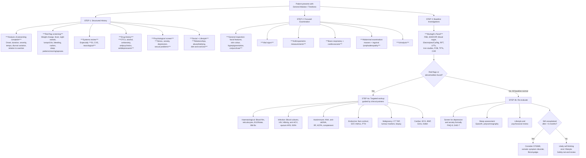

## Diagnostic Approach to General Malaise

### Why There Are No "Diagnostic Criteria" for Malaise Itself

Let's be clear from first principles: **general malaise is a symptom, not a disease**. It has no diagnostic criteria of its own — the diagnostic task is to identify the **underlying cause**. This is fundamentally different from, say, diagnosing SLE (where you apply SLICC/ACR criteria) or depression (where you apply DSM-5 criteria). Instead, the approach to malaise is one of **systematic exclusion**: you use a structured clinical algorithm plus a baseline investigation panel to either (a) identify an organic cause, (b) identify a psychiatric cause, or (c) arrive at a diagnosis of exclusion (e.g. CFS/ME, functional disorder).

That said, several of the conditions that *cause* malaise do have formal diagnostic criteria — and you need to know the key ones. We will cover:

1. **The diagnostic algorithm** — how to move from symptom to diagnosis
2. **The baseline investigation panel** and interpretation of key findings
3. **Specific diagnostic criteria** for the most important conditions presenting as malaise

---

### Diagnostic Algorithm

The algorithm below integrates ***Murtagh's Key History, Key Examination, and Key Investigations*** [1] with a systematic clinical reasoning approach.

<Callout title="The 4-Step Approach">
**Step 1**: Structured history (including ***psychological screen*** and ***drug history*** [1] — these are the most commonly skipped steps and catch the most commonly missed diagnoses: depression, anxiety, drug-related fatigue).

**Step 2**: Focused examination (***hyperpigmentation*** → Addison's; ***conjunctival pallor*** → anaemia; ***abdominal masses*** → malignancy; ***inguinal lymphadenopathy*** → lymphoma, STI [1]).

**Step 3**: Baseline investigation panel (***Murtagh's panel*** [1]).

**Step 4**: Either targeted workup if pointers exist, or formal psychiatric/sleep/lifestyle assessment if baseline is normal.
</Callout>

---

### Baseline Investigation Panel: Detailed Interpretation

This is the ***key investigations*** panel from ***Murtagh's Diagnostic Strategies*** [1]. Each test is chosen to screen for a specific subset of serious causes. Let's go through every single one and explain *why* it is included and *how* to interpret the results.

#### 1. ***FBE (Full Blood Examination / CBC)*** [1]

**Why**: The single most information-dense screening test. It interrogates three cell lineages (red cells, white cells, platelets) simultaneously.

| Parameter | Abnormality | What It Suggests | Pathophysiological Basis |
|-----------|-------------|-----------------|-------------------------|
| **Haemoglobin** | ↓ (anaemia) | Iron deficiency, B12/folate def, chronic disease, haemolysis, BM failure, thalassaemia | ↓Hb → ↓O₂ carrying capacity → tissue hypoxia → fatigue |
| **MCV** | ↓ (microcytic) | Iron deficiency, thalassaemia, chronic disease | ↓Iron → ↓haem synthesis → small RBCs with ↓Hb content |
| **MCV** | ↑ (macrocytic) | B12/folate deficiency, hypothyroidism, alcohol excess, MDS, liver disease, drugs (e.g. methotrexate) | Impaired DNA synthesis → delayed nuclear maturation → large precursors released |
| **WBC** | ↑ (leukocytosis) | Infection, inflammation, stress response, leukaemia | Marrow response to infection (neutrophilia) or uncontrolled proliferation (leukaemia) |
| **WBC** | ↓ (leukopenia) | BM failure, SLE, HIV, drugs, severe sepsis | ↓Production or ↑destruction/consumption |
| **Differential** | ↑Eosinophils | Allergy, parasites, Addison's, drug reaction, eosinophilic disorders | Loss of cortisol suppression of eosinophils (Addison's); Th2-driven production |
| **Platelets** | ↓ (thrombocytopenia) | BM failure, DIC, SLE, hypersplenism, ITP | ↓Production or ↑destruction/sequestration |
| **Blood film** | Blasts | Acute leukaemia | Immature cells released from failing marrow; ***>20% blasts in BM = diagnostic*** [5] |
| **Blood film** | Tear-drop cells | Myelofibrosis | RBCs deformed by squeezing through fibrosed marrow sinusoids [5] |
| **Blood film** | Leucoerythroblastic | Myelofibrosis, BM infiltration | Immature cells pushed out of replaced marrow into peripheral blood [5] |

<Callout title="Must-Know" type="idea">
If the FBE shows **pancytopenia** (↓Hb, ↓WBC, ↓platelets simultaneously), this narrows the DDx dramatically: think **BM failure** (aplastic anaemia, leukaemia, myelofibrosis, MDS), **BM infiltration** (metastatic cancer), **hypersplenism**, or **severe B12/folate deficiency**. Always request a blood film and consider bone marrow biopsy.
</Callout>

#### 2. ***ESR / CRP*** [1]

**Why**: Non-specific markers of systemic inflammation. They do not tell you *what* is inflamed, but they tell you *something* is.

| Marker | Mechanism | Interpretation |
|--------|-----------|----------------|
| **ESR** (erythrocyte sedimentation rate) | ↑Fibrinogen and immunoglobulins → ↑rouleaux formation → RBCs sediment faster | Slow to rise, slow to fall. Useful for chronic conditions. Very ↑ ( > 100 mm/hr) → myeloma, GCA/PMR, malignancy, TB, endocarditis |
| **CRP** (C-reactive protein) | Acute phase reactant synthesized by hepatocytes in response to IL-6 | Rises within 6–8 hours, falls rapidly. Better for acute infections and monitoring treatment response. Very ↑ ( > 100 mg/L) → bacterial infection, major surgery, active vasculitis |

> **Pearl**: A markedly elevated ESR ( > 100) with malaise in an elderly patient should make you think of **GCA/PMR**, **myeloma**, or **metastatic cancer** until proven otherwise. ***GCA diagnostic criteria require ESR > 50 mm/h*** [18].

#### 3. ***Blood Sugar*** [1]

**Why**: Screens for diabetes mellitus — an extremely common cause of chronic fatigue, especially in HK.

| Test | Cut-off | Interpretation |
|------|---------|----------------|
| Fasting glucose | ≥ 7.0 mmol/L (two occasions) | Diagnostic of DM |
| Random glucose | ≥ 11.1 mmol/L + symptoms | Diagnostic of DM |
| HbA1c | ≥ 48 mmol/mol (6.5%) | Diagnostic of DM |
| HbA1c | 42–47 mmol/mol (6.0–6.4%) | Pre-diabetes → ↑risk progression |

***T2DM is usually asymptomatic at diagnosis, with non-specific S/S e.g. chronic fatigue and malaise*** [2] — this is precisely why screening is so important.

#### 4. ***Serum Electrolytes, Calcium, Magnesium*** [1]

**Why**: Electrolyte derangements are common, easily treatable causes of malaise, and can also indicate serious underlying disease.

| Abnormality | Key Causes | Symptoms/Signs |
|-------------|-----------|----------------|
| **Hyponatraemia** ( < 135 mmol/L) | SIADH (cancer, drugs, CNS disease), diuretics, adrenal insufficiency, heart failure, cirrhosis | Nausea, malaise, confusion, seizures (if severe/rapid). Why? → ↓ECF osmolality → water shifts into cells → cerebral oedema |
| **Hypokalaemia** ( < 3.5 mmol/L) | Diuretics, vomiting, diarrhoea, Conn's | Fatigue, weakness, arrhythmia. Why? → ↑resting membrane potential → muscle cell cannot depolarize normally |
| ***Hyperkalaemia*** ( > 5.0 mmol/L plasma) [19] | Renal failure, K-sparing diuretics, Addison's, DKA | ***Non-specific (malaise, vomiting, nausea), vague muscle weakness*** [19], arrhythmia. Why? → ↓resting membrane potential → prolonged depolarization → ↓excitability |
| **Hypercalcaemia** ( > 2.6 mmol/L corrected) | Primary hyperparathyroidism, malignancy (PTHrP, myeloma, bone mets) | Fatigue, confusion, constipation, polyuria, abdominal pain. "Stones, bones, groans, moans, psychic overtones" |
| **Hypomagnesaemia** ( < 0.7 mmol/L) | Alcohol, diuretics, PPI, diarrhoea | Fatigue, weakness, tremor, arrhythmia; often co-exists with hypokalaemia (Mg needed for Na/K-ATPase) |

#### 5. ***Kidney Function Tests (RFT)*** [1]

**Why**: CKD is extremely common (especially in HK — high DM, HTN burden) and insidious. Uraemia causes fatigue well before the patient becomes symptomatic from fluid overload.

| Parameter | Abnormality | What It Indicates |
|-----------|-------------|-------------------|
| **Creatinine** | ↑ | ↓GFR → CKD or AKI. Creatinine is freely filtered at glomerulus; as GFR falls, creatinine rises |
| **Urea** | ↑ | Can be raised by dehydration, GI bleed, high protein intake, or renal failure. Less specific than creatinine |
| **eGFR** | < 60 mL/min for > 3 months | CKD Stage 3+. Progressive accumulation of uraemic toxins → fatigue, nausea, anorexia |

#### 6. ***Liver Function Tests (LFTs)*** [1]

**Why**: Screens for hepatitis, NAFLD, cirrhosis, biliary disease — all of which cause malaise.

| Pattern | Findings | Suggests |
|---------|----------|----------|
| **Hepatocellular** | ↑↑ALT/AST, mildly ↑ALP/GGT | Hepatitis (viral, autoimmune, drug), NAFLD/NASH [3] |
| **Cholestatic** | ↑↑ALP/GGT, mildly ↑ALT/AST | Biliary obstruction, PBC, drug-induced cholestasis |
| **Mixed** | ↑ALT/AST + ↑ALP/GGT | Drug reaction, infiltrative disease |
| **Synthetic failure** | ↓Albumin, ↑PT/INR | Cirrhosis, ALF. ***ALF defined by INR ≥ 1.5*** [3] |

> **De Ritis ratio** (AST:ALT): > 2 suggests alcoholic liver disease; < 1 in NAFLD (but reversal occurs as fibrosis develops) [3].

#### 7. ***Iron Studies*** [1]

**Why**: Iron deficiency is the **most common nutritional deficiency worldwide** and common cause of fatigue. Also screens for haemochromatosis.

| Parameter | Iron Deficiency | Anaemia of Chronic Disease | ***Haemochromatosis*** [1] |
|-----------|----------------|---------------------------|--------------------------|
| **Serum iron** | ↓ | ↓ | ↑ |
| **Ferritin** | ↓↓ ( < 15 μg/L diagnostic) | N or ↑ (acute phase reactant) | ↑↑ ( > 300 men, > 200 women) |
| **Transferrin / TIBC** | ↑ | ↓ or N | ↓ |
| **Transferrin saturation** | ↓ ( < 20%) | ↓ or N | ↑↑ ( > 45% — screening threshold) |

<Callout title="Ferritin Pitfall" type="error">
Ferritin is both an iron storage protein AND an acute phase reactant. In a patient with chronic inflammation (e.g. RA, malignancy), ferritin can be normal or elevated even if the patient is truly iron-deficient. In this setting, a ferritin < 100 μg/L (rather than the usual < 15) suggests concurrent iron deficiency. If in doubt, check soluble transferrin receptor (↑ in true iron deficiency, normal in ACD).
</Callout>

#### 8. ***Faecal Occult Blood (FOB)*** [1]

**Why**: Screens for occult GI bleeding — a common cause of iron deficiency anaemia in patients presenting with fatigue, and importantly a red flag for **colorectal cancer**.

- **Positive FOB** → warrants further investigation with colonoscopy
- **False positives**: NSAIDs, red meat, aspirin, upper GI bleeding
- **False negatives**: intermittent bleeding, vitamin C (interferes with guaiac test)
- **FIT (faecal immunochemical test)**: preferred over guaiac-based FOB — specific for human haemoglobin, not affected by diet

#### 9. ***Thyroid Function Tests (TFTs)*** [1]

**Why**: Thyroid dysfunction is extremely common (especially hypothyroidism in women) and eminently treatable. Fatigue is the most common symptom of both hypo- and hyperthyroidism.

| Pattern | TSH | fT4 | Diagnosis |
|---------|-----|-----|-----------|
| Primary hypothyroidism | ↑ | ↓ | Hashimoto's (anti-TPO+), post-thyroidectomy, post-RAI |
| Subclinical hypothyroidism | ↑ | Normal | Very common; may cause fatigue; treat if TSH > 10 or symptomatic |
| Hyperthyroidism | ↓ | ↑ | Graves' (TRAb+), toxic nodular goitre, thyroiditis |
| Central hypothyroidism | N or ↓ | ↓ | Pituitary/hypothalamic disease (rare); TSH alone would miss this |

#### 10. ***CXR*** [1]

**Why**: A single, cheap, widely available test that screens for multiple serious conditions simultaneously.

| Finding | What It Suggests |
|---------|-----------------|
| **Hilar lymphadenopathy** | Sarcoidosis, lymphoma, TB, lung cancer |
| **Pulmonary infiltrates** | TB (apical), pneumonia, ILD |
| **Cardiomegaly** | Heart failure, cardiomyopathy, pericardial effusion |
| **Pleural effusion** | Heart failure, malignancy, TB, PE |
| **Mass lesion** | Lung cancer, metastasis |
| **Miliary pattern** | Miliary TB (***diffuse fine micronodular shadows ~1–2 mm***) [10] |

---

### Additional Targeted Investigations (When Baseline Is Abnormal or Red Flags Present)

These are ordered based on **clinical pointers** from Steps 1–3. Never shotgun all of these — let the history and baseline results guide you.

#### A. Haematological Workup

| Investigation | When to Order | Key Findings |
|--------------|---------------|-------------|
| **Reticulocyte count** | Anaemia identified on FBE | ↑ = appropriate marrow response (haemolysis, acute blood loss); ↓ = marrow failure/nutritional deficiency |
| **Serum B12 and folate** | Macrocytosis, neurological symptoms, glossitis | ↓B12: pernicious anaemia, veganism, terminal ileum disease; ↓folate: malnutrition, malabsorption, drugs |
| **Haemoglobin electrophoresis** | Microcytic anaemia in Chinese/SE Asian patient | Thalassaemia trait (very common in HK: α-thal ~3–4%, β-thal ~2–3%) |
| **Blood film** | Abnormal FBE, suspected haematological malignancy | Blasts (leukaemia), tear-drop cells (myelofibrosis), hypersegmented neutrophils (B12/folate def), rouleaux (myeloma) |
| ***Bone marrow aspirate/biopsy*** [5] | Suspected leukaemia, myelofibrosis, MDS, unexplained cytopenias | ***>20% blasts = acute leukaemia*** [5]; fibrosis (myelofibrosis); dysplastic changes (MDS). ***5-step approach: Morphology, Cytochemistry, Immunophenotyping, Cytogenetics, Molecular genetics (MCICM)*** [5] |
| **Serum protein electrophoresis** | Unexplained ↑ESR, back pain, renal impairment, suspected myeloma | M-band/paraprotein → myeloma, Waldenström's |
| **LDH, haptoglobin, DCT** | Suspected haemolysis | ↑LDH, ↓haptoglobin, +ve DCT → autoimmune haemolytic anaemia |

#### B. Infection Workup

| Investigation | When to Order | Key Findings |
|--------------|---------------|-------------|
| **Blood cultures** | Fever, suspected endocarditis, sepsis | Positive with specific organism → guide antibiotic therapy |
| **HIV Ag/Ab combo test** | Risk factors, unexplained lymphadenopathy, recurrent infections | 4th-gen test detects both p24 antigen and HIV-1/2 antibodies; window period ~2 weeks |
| **HBsAg, anti-HCV** | Abnormal LFTs, risk factors, HK patient | HBsAg+ → chronic HBV; anti-HCV+ → confirm with HCV RNA |
| **Monospot / EBV serology** | Young patient, pharyngitis, lymphadenopathy, atypical lymphocytes | Monospot (heterophile Ab) — rapid but ~25% false negative in first week; VCA IgM confirmatory [9] |
| **Sputum AFB smear/culture** | Chronic cough, night sweats, weight loss, abnormal CXR | AFB smear: rapid but ↓sensitivity (needs ≥10,000 organisms/mL); culture: gold standard (takes 2–8 weeks); ***TB-PCR: rapid molecular test*** [10] |
| **IGRA / Mantoux test** | Suspected latent TB, pre-immunosuppression screening | IGRA preferred (not affected by BCG vaccination; single visit). Does NOT distinguish latent from active TB |

#### C. Endocrine Workup

| Investigation | When to Order | Key Findings |
|--------------|---------------|-------------|
| **9 am cortisol** | Hyperpigmentation, postural hypotension, hypoNa + hyperK | < 100 nmol/L = adrenal insufficiency likely; > 500 nmol/L = essentially rules out; 100–500 = indeterminate → proceed to SST |
| ***Short Synacthen test (SST)*** [4] | Indeterminate 9am cortisol or high clinical suspicion of adrenal insufficiency | ***Procedure: 250 μg synacthen IV/IM bolus → serum cortisol at 0, 30, 60 min. Normal: peak cortisol > 550 nmol/L. Abnormal: peak < 400 nmol/L*** [4]. Does NOT distinguish 1° from 2° — need paired ACTH |
| ***Basal ACTH + cortisol*** [4] | To distinguish primary vs secondary adrenal insufficiency | ***Primary: ↑ACTH ↓cortisol. Secondary/tertiary: ↓ACTH ↓cortisol*** [4] |
| **HbA1c** | Screening for DM in chronic fatigue | ≥ 48 mmol/mol (6.5%) = DM; 42–47 = pre-diabetes |
| **PTH + corrected Ca** | Hypercalcaemia identified | ↑Ca + ↑PTH = primary hyperparathyroidism; ↑Ca + ↓PTH = malignancy (PTHrP), granulomatous disease (↑1,25-OH vit D) |
| **Vitamin D** | Proximal myopathy, bone pain, ↑risk groups | < 25 nmol/L = deficient; 25–50 = insufficient. Very common in HK (indoor lifestyle) |

#### D. Autoimmune Workup

| Investigation | When to Order | Key Findings |
|--------------|---------------|-------------|
| **ANA** | Joint pain, rash, multi-system features | +ve in SLE ( > 95%), MCTD, Sjögren's, scleroderma. Low specificity (~5% healthy pop also +ve) |
| **Anti-dsDNA** | ANA positive, suspected SLE | Highly specific for SLE; titre correlates with disease activity (especially lupus nephritis) |
| ***Anti-U1 RNP*** [13] | Suspected MCTD | ***Positive by definition in MCTD; powerful predictor for subsequent evolution into MCTD*** [13] |
| **RF, ACPA** | Suspected RA | RF: sensitive but not specific; ACPA: highly specific for RA (~95%) |
| **Complement C3/C4** | Suspected SLE | ↓C3/C4 = complement consumption → active immune complex disease |
| **ESR + CRP** | Suspected PMR/GCA | ***GCA: ESR > 50 mm/h is diagnostic criterion*** [18]; PMR: typically ↑↑ESR/CRP with dramatic steroid response |
| **Anti-tTG IgA** | Suspected coeliac disease | Highly sensitive and specific (must check total IgA — if IgA-deficient, use anti-tTG IgG or anti-DGP) |

#### E. Cardiac Workup

| Investigation | When to Order | Key Findings |
|--------------|---------------|-------------|
| **ECG** | Palpitations, exertional fatigue, syncope | AF, heart block, ST changes (ischaemia/myocarditis), long QT |
| **BNP / NT-proBNP** | Suspected heart failure | ↑ = ventricular stretch → heart failure. BNP > 100 pg/mL or NT-proBNP > 300 pg/mL highly suggestive. Very useful as **rule-out** test (high NPV) |
| **Echocardiogram** | Abnormal ECG, ↑BNP, new murmur | LV systolic/diastolic dysfunction, valvular disease, pericardial effusion, cardiomyopathy |
| **Holter monitor** | Intermittent palpitations, presyncope | Paroxysmal AF, intermittent heart block, VT — may explain episodes of fatigue |

#### F. Malignancy Workup

| Investigation | When to Order | Key Findings |
|--------------|---------------|-------------|
| **CT thorax-abdomen-pelvis** | Weight loss, lymphadenopathy, abnormal CXR/bloods, suspected malignancy | Mass lesion, lymphadenopathy, hepatosplenomegaly, effusions |
| **AFP** | Suspected HCC (known HBV/cirrhosis in HK) | ↑ > 400 ng/mL + compatible imaging = diagnostic of HCC |
| **LDH** | Suspected lymphoma, germ cell tumour | Elevated → non-specific but supports diagnosis of lymphoproliferative disease |
| **Tissue biopsy** | Lymph node enlargement, mass lesion | Histological diagnosis = gold standard for any malignancy |

#### G. Sleep and Psychiatric Assessment

| Assessment | When to Use | Key Findings |
|-----------|-------------|-------------|
| **PHQ-9** (Patient Health Questionnaire-9) | Screening for depression in all patients with chronic malaise | Score ≥ 10 = moderate depression; ≥ 15 = moderately severe; ≥ 20 = severe. Sensitivity ~88%, specificity ~88% |
| **GAD-7** (Generalized Anxiety Disorder-7) | Screening for anxiety | Score ≥ 10 = moderate anxiety |
| **Epworth Sleepiness Scale** | Daytime somnolence, snoring | Score ≥ 10 = excessive daytime sleepiness → investigate for OSA |
| **Polysomnography** | Suspected OSA, narcolepsy, PLMD | AHI ≥ 5 with symptoms = OSA diagnosis |

---

### Specific Diagnostic Criteria for Key Conditions Presenting as Malaise

#### 1. Major Depressive Disorder (DSM-5)

Since depression is the single most common serious cause of chronic malaise that is frequently missed:

≥ 5 of the following symptoms present during the same 2-week period (at least one must be **depressed mood** OR **loss of interest/pleasure**):

| Criterion | Mnemonic (SIG E CAPS) |
|-----------|-----------------------|
| **S**leep disturbance (insomnia or hypersomnia) | |
| **I**nterest loss (anhedonia) | ★ Must have at least one of the two core symptoms |
| **G**uilt (excessive or inappropriate) | |
| **E**nergy loss / fatigue | ← The symptom that brings them in with "malaise" |
| **C**oncentration difficulty | |
| **A**ppetite change (↑ or ↓) ± weight change | |
| **P**sychomotor agitation or retardation | |
| **S**uicidal ideation | |

Plus: causes clinically significant distress or impairment; not attributable to substance or medical condition [6].

#### 2. Chronic Fatigue Syndrome / ME (IOM 2015 / NICE 2021 criteria)

Diagnosis requires **all** of the following:

1. Substantial reduction in ability to engage in pre-illness activities, lasting ≥ 6 months, with fatigue that is:
   - Of new/definite onset (not lifelong)
   - Not explained by excessive exertion
   - Not substantially relieved by rest
2. **Post-exertional malaise** (pathognomonic — worsening of symptoms after physical/cognitive/emotional effort)
3. **Unrefreshing sleep**
4. Plus at least ONE of: cognitive impairment ("brain fog") OR orthostatic intolerance

> **Key principle**: CFS/ME is a **diagnosis of exclusion**. All organic and psychiatric causes must be systematically ruled out first. This is why the baseline panel [1] must be completed before considering this diagnosis.

#### 3. Somatic Symptom Disorder (DSM-5) [8]

| Criterion | Detail |
|-----------|--------|
| A | ***≥1 somatic symptom that is distressing or results in significant disruption of daily life*** [8] |
| B | ***Excessive thoughts, feelings, or behaviours related to somatic symptoms: (1) Disproportionate and persistent thoughts about seriousness; (2) Persistently high anxiety about health; (3) Excessive time and energy devoted to symptoms*** [8] |
| C | ***State of being symptomatic is persistent (typically > 6 months)*** [8] |

Note: ***Under DSM-5, medically unexplained symptoms alone do not qualify; nor does an underlying organic explanation disqualify the diagnosis*** [8].

#### 4. Giant Cell Arteritis (ACR 1990 Criteria) [18]

Relevant when malaise + headache + elderly:

***≥3 of the following 5 criteria*** [18]:
1. ***Onset ≥ 50 years***
2. ***New headache***
3. ***Abnormalities of temporal artery on clinical examination***
4. ***↑ESR ( > 50 mm/h)***
5. ***Abnormal findings on biopsy of temporal artery***

Sensitivity 93.5%, specificity 91.2%.

#### 5. Adrenal Insufficiency [4]

Not formal "criteria" but the diagnostic pathway:

1. **Clinical suspicion**: ***chronic fatigue, malaise, weakness, hyperpigmentation (primary), hypoNa + hyperK*** [4]
2. **Screening**: 9 am cortisol
3. **Confirmation**: ***Short Synacthen test: peak cortisol > 550 nmol/L = normal; < 400 nmol/L = abnormal*** [4]
4. **Differentiation**: ***Paired ACTH: ↑ACTH = primary; ↓ACTH = secondary/tertiary*** [4]
5. **Aetiological workup (primary)**: ***21-hydroxylase Ab (autoimmune), CT adrenals, VLCFA (adrenoleukodystrophy)*** [4]

---

### Integration: What to Do When "Everything Is Normal"

This is a common and challenging clinical scenario. After completing the ***Murtagh baseline panel*** [1] and a thorough history/examination:

1. **Re-examine the history**: Did you adequately screen for ***psychological factors (stress, anxiety, depression, sexual problems)***, ***social factors (relationships, abuse/bullying)***, ***diet and exercise*** [1]?
2. **Formally screen for depression** (PHQ-9) and **anxiety** (GAD-7)
3. **Assess sleep**: Epworth Sleepiness Scale; consider polysomnography if OSA suspected
4. **Consider medication review**: ***Drug history including self-medication, OTCs, alcohol, antianxiety, antipsychotics, antidepressants*** [1]
5. **Safety-net**: If symptoms are < 6 months, arrange follow-up in 4–6 weeks with repeat basic bloods — some conditions (e.g. early hypothyroidism, early leukaemia) may not be detectable on first testing
6. **If persistent > 6 months with all investigations normal**: Consider CFS/ME, somatic symptom disorder, fibromyalgia — but only after genuine exhaustive exclusion

<Callout title="Diagnostic Pitfall" type="error">
***Insidious multisystem diseases must be ruled out*** before diagnosing a somatoform disorder — ***e.g. AIDS, SLE, MS, hyperparathyroidism, occult malignancy, chronic infections*** [8]. The consequence of missing an organic disease is far greater than the consequence of delayed psychiatric diagnosis. ***Investigations should be judicious — false-positive results may lead to unnecessary invasive investigations and risks*** [8].
</Callout>

---

<Callout title="High Yield Summary — Diagnosis of General Malaise">

1. **There are no diagnostic criteria for malaise itself** — the task is to identify the cause via a structured algorithm.

2. **4-Step Approach**: Structured history → Focused examination → Baseline investigations → Targeted workup or psychiatric/sleep assessment.

3. **Murtagh's Baseline Panel** [1]: ***FBE, ESR/CRP, blood sugar, electrolytes/Ca/Mg, RFT, LFTs, iron studies, FOB, TFTs, CXR*** — this catches the vast majority of serious organic causes.

4. **Key targeted investigations by system**: Haematological (blood film, B12, BM biopsy), Infection (HIV, HBsAg, sputum AFB), Endocrine (9 am cortisol → SST, HbA1c, PTH), Autoimmune (ANA, anti-dsDNA, RF/ACPA, anti-tTG), Cardiac (ECG, BNP, Echo), Malignancy (CT TAP, biopsy).

5. **Always formally screen for depression** (PHQ-9) and anxiety (GAD-7) — these are the most common causes and the most commonly missed.

6. **Diagnostic criteria to know**: MDD (SIG E CAPS, ≥ 5/9 for ≥ 2 weeks), CFS/ME (fatigue > 6 months + PEM + unrefreshing sleep), Somatic symptom disorder (DSM-5 criteria A–C), GCA (ACR ≥ 3/5), Adrenal insufficiency (SST pathway).

7. **If everything is normal**: Re-evaluate history, screen psych/sleep, review drugs, safety-net, consider CFS/ME only after genuine exclusion.
</Callout>

---

<ActiveRecallQuiz
  title="Active Recall - Diagnosis of General Malaise"
  items={[
    {
      question: "List the 10 baseline investigations recommended by Murtagh for evaluating tiredness/chronic fatigue, and for each, name the single most important condition it is screening for.",
      markscheme: "1. FBE — anaemia/leukaemia. 2. ESR/CRP — chronic inflammation (GCA, myeloma, infection). 3. Blood sugar — diabetes mellitus. 4. Electrolytes/Ca/Mg — hypercalcaemia, hyponatraemia. 5. RFT — CKD/uraemia. 6. LFTs — chronic liver disease/hepatitis. 7. Iron studies — iron deficiency anaemia / haemochromatosis. 8. FOB — occult GI bleeding/colorectal cancer. 9. TFTs — hypothyroidism. 10. CXR — lung cancer, TB, heart failure."
    },
    {
      question: "Describe the Short Synacthen Test: indication, procedure, and interpretation of results.",
      markscheme: "Indication: suspected adrenal insufficiency with indeterminate 9 am cortisol. Procedure: 250 microg synacthen IV/IM bolus, measure serum cortisol at 0, 30, 60 minutes. Interpretation: peak cortisol greater than 550 nmol/L is normal; less than 400 nmol/L is abnormal (adrenal insufficiency confirmed). Borderline 400-550 needs further testing. Does NOT distinguish primary from secondary — need paired ACTH level."
    },
    {
      question: "A patient has chronic fatigue for 8 months. All baseline investigations are normal. PHQ-9 is 4 (minimal). What diagnoses should you now consider, and what is the pathognomonic feature of CFS/ME?",
      markscheme: "Consider: CFS/ME, fibromyalgia, somatic symptom disorder, subclinical sleep disorder, lifestyle factors. Pathognomonic feature of CFS/ME is post-exertional malaise (PEM) — worsening of symptoms disproportionate to the effort, lasting hours to days after physical, cognitive, or emotional exertion."
    },
    {
      question: "Explain why ferritin can be misleading in a patient with rheumatoid arthritis who is also iron-deficient. How would you confirm true iron deficiency in this setting?",
      markscheme: "Ferritin is an acute phase reactant — in chronic inflammation (e.g. RA), hepatocyte synthesis of ferritin is upregulated by IL-6, so ferritin may be normal or elevated even with true iron deficiency. In this setting, use: (1) a higher ferritin cut-off (less than 100 microg/L suggests coexisting iron deficiency); (2) soluble transferrin receptor (sTfR) — elevated in true iron deficiency but normal in anaemia of chronic disease; (3) transferrin saturation less than 20% supports iron deficiency."
    },
    {
      question: "Name the DSM-5 diagnostic criteria for Somatic Symptom Disorder.",
      markscheme: "A: One or more somatic symptoms that are distressing or result in significant disruption of daily life. B: Excessive thoughts, feelings, or behaviours related to somatic symptoms, manifested by at least one of: (1) disproportionate and persistent thoughts about seriousness; (2) persistently high health anxiety; (3) excessive time and energy devoted to symptoms. C: State of being symptomatic is persistent, typically more than 6 months. Note: medically unexplained symptoms alone do not qualify; underlying organic explanation does not disqualify."
    },
    {
      question: "An elderly patient presents with malaise, new-onset temporal headache, and jaw claudication. ESR is 85 mm/h. What is the likely diagnosis, what are the formal diagnostic criteria, and what is the most urgent next step?",
      markscheme: "Likely diagnosis: Giant Cell Arteritis (GCA). ACR 1990 criteria: 3 or more of (1) age at onset 50 or older, (2) new headache, (3) temporal artery abnormality on examination, (4) ESR greater than 50, (5) abnormal temporal artery biopsy. This patient meets at least 4 criteria. Most urgent next step: start high-dose prednisolone 60 mg daily IMMEDIATELY (do not wait for biopsy) to prevent irreversible blindness from arteritic anterior ischaemic optic neuropathy; arrange urgent temporal artery biopsy within 1-2 weeks (steroids do not significantly affect biopsy histology if done within 2 weeks)."
    }
  ]}
/>

## References

[1] Lecture slides: murtagh merge.pdf (p99, p101 — Tiredness/chronic fatigue: Key history, Key examination, Key investigations)
[2] Senior notes: Ryan Ho Endocrine.pdf (p80 — Workup for Newly Diagnosed DM)
[3] Senior notes: Ryan Ho GI.pdf (p206 — Acute Liver Failure; p309 — NAFLD)
[4] Senior notes: Ryan Ho Endocrine.pdf (p71 — Adrenal Insufficiency: diagnosis and workup)
[5] Senior notes: Ryan Ho Haemtology.pdf (p51 — Leukaemia: approach and diagnostic criteria)
[6] Senior notes: Ryan Ho Psychiatry.pdf (p140, p143, p155 — Depressive Disorders: criteria and assessment)
[8] Senior notes: Ryan Ho Psychiatry.pdf (p199, p200, p203 — Somatoform Disorders: criteria and DDx)
[9] Senior notes: Ryan Ho Respiratory.pdf (p53 — Infectious Mononucleosis)
[10] Senior notes: Ryan Ho Respiratory.pdf (p75, p81 — TB: diagnosis, cryptic TB)
[13] Senior notes: Ryan Ho Rheumatology.pdf (p86 — MCTD: anti-U1 RNP)
[18] Senior notes: Ryan Ho Neurology.pdf (p65 — Giant Cell Arteritis: diagnostic criteria)
[19] Senior notes: Ryan Ho Chemical Path.pdf (p14 — Hyperkalaemia)
