# General Malaise

## Definition and Conceptual Framework

**General malaise** is a subjective, non-specific symptom defined as a feeling of overall discomfort, unease, lack of well-being, or "not feeling right" that is difficult for the patient to localize or describe precisely. The term derives from the Old French *mal* (= bad) + *aise* (= ease), literally meaning "bad ease" or ill-at-ease.

It is **not a diagnosis** but rather a **symptom** — and more importantly, it is a **constitutional symptom**, meaning it reflects a systemic process affecting the whole body rather than any single organ. It sits in the same family as fatigue, lethargy, weakness, and tiredness, though these terms are not identical:

| Term | Key Distinction |
|------|----------------|
| **Malaise** | A vague sense of feeling unwell; qualitative — "I just don't feel right" |
| **Fatigue / Tiredness** | A quantitative lack of energy or endurance; "I'm exhausted" |
| **Lethargy** | Drowsiness or sluggishness with reduced arousal |
| **Weakness** | Actual loss of muscle power (objective vs. subjective) |
| **Asthenia** | *a-* (without) + *sthenos* (strength) — generalized weakness/debility |

In practice, patients use these terms interchangeably, so the clinician's job is to **clarify what the patient actually means** — are they tired (fatigue)? Sleepy (somnolence)? Weak (myopathy, neuropathy)? Or just feeling generally unwell (malaise)? [1][2]

<Callout title="Why Malaise Matters">
Malaise is the body's "check engine light." It is a non-specific alarm signal indicating that *something* systemic is going on — from a simple viral upper respiratory infection to occult malignancy, autoimmune disease, or chronic organ failure. The broad differential is precisely what makes it a high-yield exam topic: you need a **systematic framework** to approach it.
</Callout>

---

## Epidemiology

- Malaise is one of the **most common presenting complaints** in primary care and general practice
- In Hong Kong, it is frequently encountered in General Out-Patient Clinics (GOPCs) and emergency departments, particularly among:
  - **Middle-aged and elderly** patients (due to accumulation of comorbidities)
  - **Young adults** (psychosocial stressors, viral illness, mood disorders)
- *"Tiredness"* or *"fatigue"* (which overlaps substantially with malaise) accounts for **5–10% of all primary care consultations** in Western studies; similar figures are seen in HK
- **Women > men** in most epidemiological studies (~2:1), possibly due to higher rates of depression, anaemia (menstrual losses), thyroid disease, and functional somatic syndromes
- Many cases are **self-limiting** (viral illnesses), but a proportion will have serious underlying pathology — hence the need for a structured approach

---

## Risk Factors for Pathological Malaise

Rather than risk factors for malaise itself (since nearly any illness can cause it), think of risk factors that increase the probability of **serious underlying cause**:

| Category | Risk Factors |
|----------|-------------|
| **Age** | Extremes of age — elderly (occult malignancy, organ failure), neonates (sepsis) |
| **Comorbidities** | Diabetes, CKD, chronic liver disease, heart failure, HIV, autoimmune disease |
| **Medications** | Polypharmacy, beta-blockers, sedatives, chemotherapy, statins |
| **Lifestyle** | ***Inappropriate lifestyle and psychosocial factors*** [1], sedentary behaviour, poor sleep hygiene, shift work |
| **Psychosocial** | ***Stress and anxiety***, social isolation, bereavement, occupational burnout |
| **Nutritional** | Iron-deficient diet, veganism (B12), alcohol excess, eating disorders |
| **Infections** | Recent travel (tropics), IV drug use, sexual history, animal contact, immunosuppression |
| **Family history** | Haemochromatosis, autoimmune diseases, hereditary anaemias |

---

## Anatomy and Physiology of the "Feeling Unwell" Response

To understand malaise from first principles, you need to understand **sickness behaviour** — an evolutionary conserved, coordinated neurobiological response to infection and inflammation.

### The Cytokine–Brain Axis

1. **Peripheral trigger**: Infection, tissue injury, malignancy, or autoimmune activation triggers innate immune cells (macrophages, dendritic cells) to release **pro-inflammatory cytokines**: IL-1β, IL-6, TNF-α, IFN-α/γ.

2. **Signal to brain**: These cytokines reach the CNS via:
   - **Circumventricular organs** (areas lacking a blood–brain barrier, e.g. organum vasculosum of the lamina terminalis)
   - **Vagal afferents** (abdominal vagal paraganglia sense local cytokines and relay signals to the nucleus tractus solitarius → hypothalamus)
   - **Active transport** across the BBB
   - **Endothelial activation** — brain endothelial cells produce prostaglandins (PGE₂) in response to circulating cytokines

3. **Central processing**: In the hypothalamus and brainstem, cytokine signalling:
   - **Alters thermoregulation** → fever (via PGE₂ resetting the hypothalamic set-point)
   - **Reduces motivation and reward** → anhedonia, apathy (via ↓dopaminergic signalling in nucleus accumbens)
   - **Promotes sleep and inactivity** → lethargy (↑NREM sleep drive)
   - **Suppresses appetite** → anorexia
   - **Activates the HPA axis** → cortisol release → further modulates immune and metabolic activity
   - **Activates the sympathetic nervous system** → tachycardia, sweating

4. **Subjective experience**: The patient reports "malaise" — that vague, uncomfortable feeling of being unwell. It is the **conscious perception of sickness behaviour**.

> **Why does malaise occur?** It is an adaptive response: by making you feel terrible, the body forces you to rest, conserve energy for the immune response, and withdraw from social interaction (reducing spread of infection). It is a feature, not a bug.

### Beyond Infection: Non-Inflammatory Causes

Malaise also occurs without overt inflammation through:

- **Metabolic derangement**: Electrolyte imbalances (↓Na⁺, ↓K⁺, ↑Ca²⁺, uraemia) directly impair cellular function and CNS neurotransmission → subjective malaise
- **Hormonal deficiency**: Hypothyroidism (↓metabolic rate → fatigue), adrenal insufficiency (↓cortisol → inability to mount stress response → profound malaise), hypogonadism
- **Tissue hypoxia**: Anaemia (↓O₂ carrying capacity), heart failure (↓cardiac output), respiratory failure → insufficient O₂ delivery to tissues → fatigue, malaise
- **Psychological mechanisms**: Depression involves serotonin/norepinephrine dysfunction → overlap with sickness behaviour pathways; chronic stress → HPA axis dysregulation → cortisol resistance → chronic low-grade inflammation
- **Sleep disruption**: Fragmented or insufficient sleep → ↑IL-6, TNF-α (yes, sleep deprivation itself is pro-inflammatory!) → malaise

---

## Etiology (Focus on Hong Kong Context)

The causes of general malaise are vast. A practical framework from ***Murtagh's Diagnostic Strategies*** [1] categorizes them into:

1. **Probability diagnoses** (common)
2. **Serious disorders not to be missed**
3. **Pitfalls (often missed)**
4. **Rarities**

### A. Probability Diagnoses (Most Common Causes)

These are the diagnoses you should think of **first** when a patient presents with tiredness/malaise:

#### 1. ***Stress and Anxiety*** [1]

- **Pathophysiology**: Chronic psychological stress → sustained HPA axis activation → cortisol dysregulation → central fatigue, sleep disruption, and sickness behaviour-like state. Anxiety also → hyperventilation, muscle tension, hypervigilance → exhaustion.
- Very common in HK given high work pressures, competitive academic environment, housing stress
- Often co-exists with insomnia, which compounds fatigue

#### 2. ***Inappropriate Lifestyle and Psychosocial Factors*** [1]

- Sedentary lifestyle → deconditioning → reduced exercise tolerance perceived as fatigue
- Poor sleep hygiene, excessive screen time, shift work
- **Dietary factors**: skipped meals, excess refined carbohydrates → reactive hypoglycaemia → postprandial fatigue
- Excess caffeine → disrupted sleep → daytime malaise
- Alcohol: even moderate intake disrupts sleep architecture (↓REM) → unrefreshing sleep

#### 3. ***Depression*** [1]

- **Pathophysiology**: ↓serotonin, ↓norepinephrine, ↑inflammatory cytokines → overlapping neural circuits with sickness behaviour → fatigue, anhedonia, psychomotor retardation
- ***Prevalence 2.9% in HK*** [3], but underdiagnosed — particularly ***"masked" depression*** [1] where somatic complaints (fatigue, malaise, pain) dominate the presentation without overt sadness
- **Key**: always screen for mood symptoms when evaluating malaise — ***"masked" depression is often missed*** [1]

#### 4. ***Viral / Post-viral Infection*** [1]

- The **most common acute cause** of malaise — virtually any viral infection (URTI, gastroenteritis, etc.) causes cytokine-mediated sickness behaviour
- In HK: seasonal influenza, COVID-19, EBV (infectious mononucleosis in young adults), hepatitis viruses are important
- ***Post-viral fatigue***: malaise persisting weeks to months after resolution of acute infection; if > 6 months → consider chronic fatigue syndrome
- **Pathophysiology**: persistent immune activation, ↑IL-6, mitochondrial dysfunction, autonomic dysregulation

#### 5. ***Sleep-related Disorders (e.g. sleep apnoea)*** [1]

- **Obstructive sleep apnoea (OSA)**: very common in HK, especially with rising obesity rates. Repeated upper airway collapse during sleep → fragmented sleep → daytime somnolence, unrefreshing sleep, malaise
- **Pathophysiology**: recurrent hypoxia-reoxygenation → oxidative stress → systemic inflammation → fatigue; plus sleep fragmentation → ↓slow-wave sleep → impaired physical recovery
- Other sleep disorders: insomnia (often comorbid with depression/anxiety [4]), periodic limb movement disorder, circadian rhythm disorders (shift workers)

### B. Serious Disorders Not to Be Missed

These are the **red flag** diagnoses — less common but potentially life-threatening:

#### 1. ***Cardiovascular*** [1]

- ***Cardiac arrhythmia***: AF, sick sinus syndrome, heart block → ↓effective cardiac output → fatigue, malaise, presyncope. Often insidious in elderly
- ***Cardiomyopathy***: Dilated cardiomyopathy → ↓CO → tissue hypoperfusion → fatigue. May present with malaise long before overt heart failure symptoms [5]
- ***Incipient congestive cardiac failure (CCF)***: Early heart failure often presents with exertional fatigue and malaise *before* classical dyspnoea, oedema. **Pathophysiology**: ↓CO → activation of RAAS and SNS → sodium/water retention, but initially just reduced exercise capacity and malaise [5]

#### 2. ***Infection*** [1]

- ***Hidden abscess***: Intra-abdominal (subphrenic, pelvic, hepatic), dental, cerebral — can smoulder with malaise and low-grade fever for weeks
- ***HIV/AIDS***: Seroconversion illness causes malaise, fever, rash, lymphadenopathy; later stages → chronic malaise from immunodeficiency and chronic inflammation. Must be considered in HK (rising MSM transmission rates)
- ***Hepatitis B and C / others***: Extremely relevant in HK (HBV carrier rate ~7–8%). Chronic hepatitis → low-grade liver inflammation → fatigue, malaise. HCV also important but less prevalent in HK [6]
- ***Tuberculosis***: HK is an **intermediate TB burden** area (incidence ~60/100,000). Chronic malaise, night sweats, low-grade fever, weight loss are classic constitutional symptoms [7]

#### 3. ***Cancer*** [1]

- **Any malignancy** can present with malaise as the initial symptom — due to:
  - Cytokine production by tumour (TNF-α, IL-6, IFN-γ → "cancer cachexia")
  - Paraneoplastic syndromes
  - Anaemia of chronic disease
  - Direct organ dysfunction
- **In HK context**: lung cancer (commonest cancer death), colorectal cancer, hepatocellular carcinoma (HBV-related), nasopharyngeal carcinoma (especially in Southern Chinese), haematological malignancies [8]
- ***Constitutional symptoms*** (malaise, weight loss, night sweats, fever) in a haematological malignancy context are called **"B symptoms"** and indicate advanced disease [8]

#### 4. ***Other Serious Conditions*** [1]

- ***Anaemia***: Multiple causes — iron deficiency (menstrual loss, GI bleeding), B12/folate deficiency, anaemia of chronic disease, thalassaemia (very common in HK — α-thal carrier rate ~3–4%, β-thal ~2–3%). ↓Hb → ↓O₂ delivery → fatigue, malaise, exertional dyspnoea [8]
- ***Haemochromatosis***: Hereditary (HFE gene) or secondary iron overload → deposition in liver, pancreas, heart, joints. Early symptoms: fatigue, malaise, arthralgia. More common in Caucasians but not absent in HK Chinese. Classic triad: liver disease, diabetes, skin pigmentation ("bronze diabetes") [1]

### C. Pitfalls (Often Missed)

These are causes that clinicians frequently overlook:

#### 1. ***"Masked" Depression*** [1]

- As above — patients present with somatic complaints (malaise, pain, GI symptoms) without volunteering mood symptoms. The clinician must actively screen.

#### 2. ***Food Intolerance*** [1]

- **Lactose intolerance**: Very common in East Asians (~80–90% prevalence of lactase non-persistence) → bloating, abdominal discomfort, diarrhoea → chronic GI distress → fatigue and malaise
- **Other food intolerances**: FODMAPs, histamine intolerance
- Not to be confused with food allergy (IgE-mediated)

#### 3. ***Coeliac Disease*** [1]

- **Pathophysiology**: Autoimmune reaction to gliadin (component of gluten) → villous atrophy in small intestine → malabsorption → iron/folate/B12 deficiency → anaemia → fatigue, malaise
- Traditionally considered rare in Asia but increasingly recognized
- Extra-intestinal manifestations (fatigue, anaemia, osteoporosis) may dominate over GI symptoms ("silent coeliac disease")

#### 4. ***Chronic Infection*** [1]

- ***Lyme disease***: Caused by *Borrelia burgdorferi*, transmitted by *Ixodes* ticks. Rare in HK but important to consider in returned travellers. Post-treatment Lyme disease syndrome → chronic fatigue, malaise, arthralgia
- ***Tuberculosis***: Already mentioned — a pitfall because chronic malaise may be the only presenting feature before classical respiratory symptoms develop

### D. Additional Important Causes (Hong Kong Context)

Beyond Murtagh's framework, the following deserve emphasis:

#### Endocrine Disorders

| Condition | Pathophysiology of Malaise | HK Relevance |
|-----------|---------------------------|--------------|
| **Hypothyroidism** | ↓T3/T4 → ↓basal metabolic rate → ↓energy production → fatigue, cold intolerance, weight gain, constipation. Most common endocrine cause of fatigue | Common, especially autoimmune (Hashimoto's) in women |
| **Hyperthyroidism** | ↑metabolic rate → ↑energy expenditure → exhaustion despite hyperactivity; also → weight loss, tremor, anxiety | Graves' disease common in young Asian women |
| **Adrenal insufficiency** | ↓cortisol → inability to mount stress response → profound fatigue, hypotension, hypoglycaemia; ↓aldosterone → hyponatraemia, hyperkalaemia | Rare but must not miss; secondary AI from chronic steroid use more common |
| **Diabetes mellitus** | T2DM: insulin resistance → impaired glucose utilization → fatigue; also → osmotic symptoms (polyuria, polydipsia), dehydration. ***Often asymptomatic at dx with long Hx of fatigue*** [9] | ***Prevalence ~10% in HK*** [9], massive burden |
| **Hypercalcaemia** | ↑Ca²⁺ → ↓neuronal excitability → fatigue, malaise, confusion, constipation. Causes: primary hyperparathyroidism, malignancy | "Stones, bones, groans, moans, and psychic overtones" |
| **Hypogonadism** | ↓testosterone (men) or ↓oestrogen (women) → fatigue, ↓libido, mood changes | Consider in men with metabolic syndrome, women with premature ovarian failure |

#### Renal Disease

- **Chronic kidney disease (CKD)**: Uraemia → accumulation of uraemic toxins → central fatigue, nausea, anorexia, malaise. Also → anaemia (↓EPO) → tissue hypoxia. Very common in HK (high rates of diabetic nephropathy, hypertensive nephrosclerosis)
- Electrolyte derangements: hyponatraemia, hypokalaemia, hypermagnesaemia can all cause malaise

#### Hepatic Disease

- **Chronic liver disease**: Regardless of cause (HBV, HCV, NAFLD, alcohol) → hepatic dysfunction → impaired detoxification, altered amino acid metabolism, accumulation of ammonia → fatigue, malaise. ***NAFLD is the hepatic manifestation of metabolic syndrome*** [6] — increasingly common in HK with rising obesity rates
- ***NASH: may present with fatigue, malaise and vague RUQ discomfort*** [6]

#### Autoimmune and Connective Tissue Diseases

- **SLE**: ***Non-specific systemic upset early on, e.g. general malaise, arthralgia, myalgia, low-grade fever*** [10]. Very important in HK (Orientals have higher prevalence than Caucasians) [11]
- **Rheumatoid arthritis**: Chronic systemic inflammation → fatigue, malaise alongside joint symptoms
- **Sjogren's syndrome**: Fatigue is reported by >70% of patients
- **Mixed connective tissue disease (MCTD)**: ***Non-specific systemic upset early on, e.g. general malaise, arthralgia, myalgia, low-grade fever → these symptoms make early diagnosis difficult*** [10]
- **Polymyalgia rheumatica (PMR)**: Elderly patients with proximal muscle pain/stiffness, fatigue, malaise, ↑ESR. Important — responds dramatically to steroids

#### Haematological Malignancies

- **Acute leukaemia**: ***General fatigue in majority of patients, often precedes diagnosis for months*** [8]. Malaise + pallor + infections + bruising → think bone marrow failure
- **Lymphoma**: B symptoms (fever, night sweats, weight loss) + lymphadenopathy + malaise
- **Myeloproliferative neoplasms**: ***Primary myelofibrosis — severe fatigue as most common presenting symptom*** [8]; PV, ET also present with fatigue
- **Chronic leukaemia (CLL/CML)**: Insidious fatigue, malaise, weight loss

#### Drug-Related Causes

Many medications cause malaise/fatigue as a side effect:
- **Beta-blockers**: ↓heart rate → ↓CO → fatigue; also cross BBB → central fatigue, depression
- **Statins**: myalgia/myopathy → fatigue (due to mitochondrial CoQ10 depletion)
- **Antihypertensives**: ACE inhibitors, CCBs, diuretics
- **Psychotropics**: SSRIs, benzodiazepines, antipsychotics (sedation)
- **Chemotherapy**: nearly universal fatigue
- **Antihistamines**: especially first-generation (cross BBB → sedation)
- **Opioids**: central sedation

#### Chronic Fatigue Syndrome (CFS) / Myalgic Encephalomyelitis (ME)

- Defined as **persistent or relapsing unexplained fatigue lasting ≥ 6 months**, not due to ongoing exertion, not substantially relieved by rest, resulting in substantial reduction in activities
- **Pathophysiology**: poorly understood — likely involves immune dysregulation, autonomic dysfunction, mitochondrial dysfunction, neuroinflammation
- Post-infectious trigger recognized (EBV, COVID-19 → "long COVID" overlaps substantially with CFS/ME)
- **Diagnosis of exclusion** — must rule out all other organic and psychiatric causes first

#### Post-COVID Condition (Long COVID)

- Highly relevant in 2025–2026 HK context
- Persistent fatigue, malaise, cognitive dysfunction ("brain fog"), exertional intolerance lasting ≥ 3 months after SARS-CoV-2 infection
- Pathophysiology: viral persistence, autoimmunity, endothelial dysfunction, microthrombi, autonomic dysregulation

---

## Classification of Causes

A useful clinical classification uses a **systems-based approach** cross-referenced with Murtagh's framework:

```mermaid
graph TD
    A["General Malaise"] --> B["Infections"]
    A --> C["Endocrine / Metabolic"]
    A --> D["Haematological"]
    A --> E["Psychiatric / Psychological"]
    A --> F["Cardiac"]
    A --> G["Hepatic"]
    A --> H["Renal"]
    A --> I["Autoimmune / Connective Tissue"]
    A --> J["Malignancy"]
    A --> K["Drug-related"]
    A --> L["Sleep Disorders"]
    A --> M["Nutritional Deficiency"]
    A --> N["Chronic Fatigue Syndrome"]
    
    B --> B1["Acute viral (URTI, flu)"]
    B --> B2["Chronic (HIV, HBV, TB)"]
    B --> B3["Hidden abscess"]
    
    C --> C1["Hypothyroidism"]
    C --> C2["DM"]
    C --> C3["Adrenal insufficiency"]
    C --> C4["Hypercalcaemia"]
    
    D --> D1["Iron deficiency anaemia"]
    D --> D2["B12/folate deficiency"]
    D --> D3["Leukaemia / lymphoma"]
    D --> D4["Myeloproliferative neoplasm"]
    
    E --> E1["Depression"]
    E --> E2["Anxiety"]
    E --> E3["Somatization"]
```

Another practical classification by **tempo of onset**:

| Tempo | Duration | Likely Causes |
|-------|----------|---------------|
| **Acute** (days) | < 2 weeks | Viral infection, acute medical illness (ACS, PE), acute drug effect, sepsis, electrolyte derangement |
| **Subacute** (weeks) | 2–12 weeks | Post-viral, occult infection (TB, abscess), new medication, early depression, undiagnosed diabetes |
| **Chronic** (months–years) | > 12 weeks | Depression, hypothyroidism, CKD, chronic liver disease, CFS/ME, malignancy, autoimmune disease, sleep disorders |

---

## Clinical Features

### A. Symptoms (with Pathophysiological Basis)

The symptom of malaise itself is non-specific, so the clinical approach focuses on **associated symptoms** that point toward the underlying cause. When taking history, systematically ask about:

#### 1. Constitutional Symptoms Complex

- **Fever**: Indicates infection or inflammatory process → cytokine-mediated thermogenesis (PGE₂ → ↑hypothalamic set-point)
  - Pattern matters: intermittent (abscess, lymphoma), continuous (TB), relapsing (malaria, brucellosis)
- **Night sweats**: Drenching sweats requiring change of bedclothes → TB, lymphoma, endocarditis, brucellosis, HIV
  - **Pathophysiology**: Cytokine-driven thermoregulatory resetting — fever peaks and then the set-point resets downward → compensatory sweating to dissipate heat, often during sleep
- **Weight loss**: Unintentional > 5% body weight over 6–12 months → malignancy, hyperthyroidism, TB, DM, malabsorption, depression, adrenal insufficiency
  - **Pathophysiology**: ↑catabolic state (TNF-α → "cachectin"), ↓appetite, ↑metabolic rate, malabsorption
- **Anorexia**: Loss of appetite → liver disease, CKD (uraemia), malignancy, depression, adrenal insufficiency
  - **Pathophysiology**: Cytokines (IL-1β, TNF-α) act on hypothalamic feeding centres → ↓appetite

#### 2. System-Specific Associated Symptoms

**Cardiovascular:**
- Exertional dyspnoea, orthopnoea, PND → heart failure (why? ↓CO → pulmonary congestion → ↑hydrostatic pressure → interstitial oedema → impaired gas exchange → dyspnoea)
- Palpitations → arrhythmia
- Peripheral oedema → right heart failure, nephrotic syndrome
- Chest pain → ACS, pericarditis, myocarditis

**Respiratory:**
- Cough → infection, malignancy, ILD
- Haemoptysis → TB, lung cancer, PE
- Progressive dyspnoea → ILD, COPD, anaemia

**GI:**
- Nausea/vomiting → uraemia, hepatitis, hypercalcaemia, adrenal crisis
- Diarrhoea → infection, IBD, coeliac disease, hyperthyroidism
- Abdominal pain → hepatitis, pancreatitis, abscess
- Jaundice → hepatitis, haemolysis, biliary obstruction

**Neurological:**
- Headache → intracranial infection, space-occupying lesion, giant cell arteritis (elderly + malaise + temporal headache → urgent ESR)
- Cognitive changes → hypothyroidism, B12 deficiency, uraemia, hepatic encephalopathy, delirium [2]
- Paraesthesia → B12 deficiency (subacute combined degeneration), DM neuropathy

**Musculoskeletal:**
- Joint pain/stiffness → autoimmune (RA, SLE, MCTD), reactive arthritis, viral arthritis
  - ***Arthralgia with malaise → think connective tissue disease, viral infection*** [10]
- Proximal myalgia → PMR, dermatomyositis, statin-related myopathy, hypothyroidism

**Skin:**
- Rash → viral exanthem, SLE (malar rash), drug reaction, erythema nodosum (***prodrome: fatigue, fever, malaise, arthralgia*** [12])
- Pallor → anaemia
- Jaundice → liver disease, haemolysis
- Skin hyperpigmentation → Addison's disease (↑ACTH → ↑MSH → melanocyte stimulation), haemochromatosis

**Urogenital:**
- Polyuria/polydipsia → DM, hypercalcaemia, diabetes insipidus
- Dysuria/frequency → UTI
- Menorrhagia → iron deficiency anaemia

**Psychological:**
- Low mood, anhedonia, guilt → depression
- Worry, restlessness, poor concentration → anxiety
- Multiple somatic complaints disproportionate to findings → ***somatic symptom disorder*** [3] (***non-specific: fatigue, syncope, dizziness; pain: joint pain, back pain, headache, chest pain, abdominal pain*** [3])

#### 3. Temporal Characteristics

- **Onset**: Acute (infection, drug), gradual (endocrine, malignancy, CKD)
- **Duration**: Days (self-limiting viral), weeks-months (chronic disease)
- **Diurnal variation**: Worse in morning (depression — classically worse in early morning with early morning waking); worse as day progresses (physical deconditioning, adrenal insufficiency)
- **Intermittent vs. continuous**: Intermittent (relapsing-remitting autoimmune), continuous progressive (malignancy, organ failure)
- **Relationship to exertion**: Exacerbated by exertion (cardiac, respiratory, anaemia); no clear relationship (depression, hypothyroidism); worsened by post-exertional malaise (CFS/ME — pathognomonic feature)

#### 4. Relevant History Taking Framework

Following the standard HPC structure [2]:

- **Associating symptoms**: Constitutional symptoms (fever, chills, night sweats, weight loss, malaise itself)
- **Systemic enquiry**: Screen ALL systems as above
- **Risk factors**: 
  - ***Travel history, occupation, sexual history, IV drug use, animal contact, medication*** [1]
  - Dietary history, alcohol/substance use
  - Sun exposure (vitamin D if deficient)
- **Functioning**: Exercise tolerance, ADLs, sleep quality, mood
- **Treatment**: Previous investigations, treatments tried, response

### B. Signs (with Pathophysiological Basis)

Physical examination in a patient with malaise should be **thorough and systematic**, looking for clues to underlying cause:

#### General Inspection

| Sign | What It Suggests | Pathophysiology |
|------|-----------------|-----------------|
| **Pallor** | Anaemia | ↓Hb → ↓red colour of blood perfusing skin/mucous membranes |
| **Jaundice** | Liver disease, haemolysis | ↑unconjugated bilirubin (haemolysis) or ↑conjugated bilirubin (hepatic/obstructive) deposited in sclera and skin |
| **Cachexia** | Malignancy, chronic disease | TNF-α (cachectin) → ↑protein catabolism, ↑lipolysis, ↓appetite |
| **Skin hyperpigmentation** | Addison's disease, haemochromatosis | Addison's: ↓cortisol → ↓negative feedback → ↑ACTH (cleaved from POMC which also yields MSH) → melanocyte stimulation. Haemochromatosis: iron deposition in skin |
| **Moon face, central obesity, striae** | Cushing's syndrome | ↑cortisol → ↑gluconeogenesis, ↑lipolysis (limbs) + ↑lipogenesis (trunk/face), protein catabolism (striae) |
| **Dry skin, coarse hair, periorbital oedema** | Hypothyroidism | ↓T3/T4 → ↓metabolic rate → accumulation of glycosaminoglycans in dermis → myxoedema |
| **Tremor, lid lag, exophthalmos** | Hyperthyroidism | ↑sympathetic activation; exophthalmos = retro-orbital inflammation (Graves'-specific) |

#### Vital Signs

- **Fever**: Infection, malignancy, autoimmune (always check temperature!)
- **Tachycardia at rest**: Anaemia (compensatory ↑CO to maintain O₂ delivery), thyrotoxicosis, dehydration, sepsis, heart failure
- **Bradycardia**: Hypothyroidism (↓metabolic demand → ↓HR), heart block, drugs (beta-blockers)
- **Hypotension**: Adrenal insufficiency (↓cortisol → ↓vascular tone; ↓aldosterone → volume depletion), sepsis, dehydration, heart failure
- **Postural hypotension**: Autonomic neuropathy (DM), adrenal insufficiency, dehydration, Parkinson's

#### Head and Neck

| Sign | What It Suggests | Pathophysiology |
|------|-----------------|-----------------|
| **Lymphadenopathy** | Infection, lymphoma, metastatic cancer, autoimmune | Reactive hyperplasia (infection/autoimmune) or neoplastic infiltration |
| **Glossitis / angular stomatitis** | B12/folate/iron deficiency | ↓nutrients needed for rapidly dividing mucosal epithelial cells → atrophy [8] |
| **Oral ulcers** | SLE, Behçet's, Crohn's, B12 deficiency | Autoimmune mucosal inflammation, nutritional deficiency |
| **Thyroid enlargement** | Thyroid disease | Goitre (hypo- or hyperthyroidism, thyroiditis, malignancy) |
| **Dental caries / abscess** | Occult infection source | Dental infection → bacteraemia → endocarditis, abscess |
| **Temporal artery tenderness** | Giant cell arteritis | Granulomatous vasculitis of medium/large arteries → tenderness, ischaemia |

#### Cardiovascular

| Sign | What It Suggests | Pathophysiology |
|------|-----------------|-----------------|
| **Displaced apex beat** | Cardiomyopathy, LV dilatation | Ventricular remodelling → enlarged LV displaces apex laterally/inferiorly |
| **Gallop rhythm (S3/S4)** | Heart failure | S3: rapid ventricular filling into volume-overloaded ventricle; S4: atrial contraction against stiff ventricle |
| **New murmur** | Endocarditis, valvular disease | Turbulent flow across damaged/vegetated valve |
| **Peripheral oedema** | Heart failure, nephrotic, hepatic failure | ↑hydrostatic pressure (HF), ↓oncotic pressure (hypoalbuminaemia) |
| **Raised JVP** | Right heart failure, PE, pericardial tamponade | ↑right atrial pressure → transmitted back to jugular veins |

#### Abdominal

| Sign | What It Suggests | Pathophysiology |
|------|-----------------|-----------------|
| **Hepatomegaly** | Hepatitis, malignancy (metastasis/HCC), heart failure, haemochromatosis, NAFLD | Inflammatory swelling, neoplastic infiltration, congestion (RHF → ↑hepatic venous pressure) |
| **Splenomegaly** | Infection (EBV, malaria), haematological malignancy, portal hypertension, autoimmune haemolysis | Reticuloendothelial hyperplasia, extramedullary haematopoiesis, congestion |
| **Ascites** | Cirrhosis, malignancy, heart failure | Portal hypertension → ↑splanchnic hydrostatic pressure; hypoalbuminaemia → ↓oncotic pressure |
| **Abdominal mass** | Malignancy, abscess | Tumour growth, pus collection |

#### Skin and Extremities

| Sign | What It Suggests | Pathophysiology |
|------|-----------------|-----------------|
| **Malar rash** | SLE | Immune complex deposition in dermis → complement activation → inflammation |
| **Erythema nodosum** | Sarcoidosis, TB, IBD, streptococcal infection, drug reaction | ***Delayed-type hypersensitivity reaction*** [12] → septal panniculitis |
| **Petechiae / purpura** | Thrombocytopenia, DIC, leukaemia | ↓platelet count or function → failure to plug microvascular breaches → extravasation of RBCs into skin |
| **Koilonychia** | Iron deficiency | ↓iron → abnormal nail matrix keratinization → thin, concave nails |
| **Clubbing** | Lung cancer, ILD, IE, IBD, cirrhosis, cyanotic heart disease | Mechanism debated — VEGF, platelet-derived growth factor deposited in nail bed; digital vasodilation |
| **Splinter haemorrhages** | Infective endocarditis, vasculitis | Microemboli/immune complex deposition in nail-bed capillaries |
| **Raynaud's** | CTD (scleroderma, MCTD, SLE) | Vasospasm of digital arteries → episodic digital ischaemia |

#### Neurological

- **Slow-relaxing reflexes**: Hypothyroidism (↓metabolic rate → slowed muscle relaxation)
- **Peripheral neuropathy**: DM, B12 deficiency, uraemia, alcohol
- **Proximal myopathy**: Cushing's, hypothyroidism, vitamin D deficiency, dermatomyositis, statin-related
- **Altered mental status / confusion**: ***Delirium*** [2] — consider if malaise accompanies acute confusion in elderly (precipitated by infection, drugs, metabolic derangement, dehydration)

<Callout title="The Malaise 'Deep Dive' Rule" type="idea">
When a patient says "I just feel generally unwell" and you find nothing on initial assessment, resist the urge to dismiss it. Go back and re-examine: check temperature, look at the conjunctivae for pallor, palpate for lymphadenopathy, examine the abdomen carefully (hepatosplenomegaly?), check skin for rashes, and do a rectal examination if indicated. Many serious diagnoses (leukaemia, endocarditis, Addison's) were discovered only because someone did a thorough exam on a patient with "just malaise."
</Callout>

<Callout title="Common Exam Trap" type="error">
Do not forget ***"masked" depression*** [1] — a patient presenting with fatigue, malaise, multiple somatic complaints, and no overt sadness. If you do not actively screen for depression (PHQ-9, ask about anhedonia and low mood), you will miss this extremely common diagnosis. Similarly, ***hypothyroidism*** in an elderly patient can perfectly mimic depression — always check TFTs.
</Callout>

---

## Summary Table: Key Etiologies of General Malaise with Distinguishing Features

| Category | Condition | Key Distinguishing Features | Key Investigation |
|----------|-----------|----------------------------|-------------------|
| **Psychiatric** | Depression | Low mood, anhedonia, sleep/appetite disturbance, diurnal variation | PHQ-9, clinical assessment |
| **Psychiatric** | Anxiety | Worry, restlessness, palpitations, hyperventilation | GAD-7, clinical assessment |
| **Lifestyle** | Poor sleep/lifestyle | Identifiable lifestyle factors, normal investigations | Sleep diary, clinical Hx |
| **Infection** | Acute viral | Acute onset, fever, rhinitis/pharyngitis, self-limiting | Usually clinical |
| **Infection** | Post-viral | Following acute infection, lasting weeks-months | Diagnosis of exclusion |
| **Infection** | TB | Chronic cough, night sweats, weight loss, contact Hx | CXR, sputum AFB/culture |
| **Infection** | HIV | Risk factors, lymphadenopathy, recurrent infections | HIV Ag/Ab combo test |
| **Infection** | HBV/HCV | RUQ discomfort, jaundice, risk factors | HBsAg, anti-HCV |
| **Endocrine** | Hypothyroidism | Cold intolerance, weight gain, constipation, dry skin | TSH, fT4 |
| **Endocrine** | DM | Polyuria, polydipsia, weight loss, recurrent infections | Fasting glucose, HbA1c |
| **Endocrine** | Adrenal insufficiency | Hypotension, hyperpigmentation, hyponatraemia | Short Synacthen test, 9am cortisol |
| **Haematological** | Iron deficiency anaemia | Pallor, koilonychia, menorrhagia/GI bleeding | CBC, iron studies |
| **Haematological** | B12/folate deficiency | Glossitis, neuropathy, macrocytosis | Serum B12, folate, MCV |
| **Haematological** | Leukaemia | Pallor, bruising, infections, hepatosplenomegaly | CBC with differential, blood film |
| **Cardiac** | Heart failure | Dyspnoea, oedema, orthopnoea, ↑JVP | BNP/NT-proBNP, Echo |
| **Cardiac** | Arrhythmia | Palpitations, presyncope, irregular pulse | ECG, Holter monitor |
| **Hepatic** | Chronic liver disease | Jaundice, spider naevi, palmar erythema, ascites | LFTs, hepatitis serology |
| **Renal** | CKD | Nausea, pruritus, nocturia, oedema | RFT (↑creatinine, ↑urea) |
| **Autoimmune** | SLE | Malar rash, arthralgia, photosensitivity, serositis | ANA, anti-dsDNA, C3/C4 |
| **Malignancy** | Any | Weight loss, night sweats, lymphadenopathy, mass | CT, biopsy, tumour markers |
| **Other** | Haemochromatosis | Liver disease, DM, skin pigmentation, arthropathy | Ferritin, transferrin sat, HFE gene |
| **Other** | CFS/ME | Post-exertional malaise, unrefreshing sleep, > 6 months | Diagnosis of exclusion |

---

<Callout title="High Yield Summary">

**Definition**: General malaise = non-specific constitutional symptom of feeling unwell; reflects systemic process (cytokine-mediated sickness behaviour).

**Top Causes (Murtagh's Probability Diagnoses)** [1]:
1. ***Stress and anxiety***
2. ***Inappropriate lifestyle and psychosocial factors***
3. ***Depression***
4. ***Viral / post-viral infection***
5. ***Sleep-related disorders (e.g. sleep apnoea)***

**Serious Not to Miss** [1]: ***Cardiac (arrhythmia, cardiomyopathy, incipient CCF)***, ***Infection (hidden abscess, HIV/AIDS, hepatitis B and C, TB)***, ***Cancer***, ***Anaemia***, ***Haemochromatosis***

**Pitfalls** [1]: ***Masked depression***, ***Food intolerance***, ***Coeliac disease***, ***Chronic infection (Lyme disease, TB)***

**HK-Relevant Priorities**: HBV (7–8% carrier), TB (intermediate burden), thalassaemia trait, NPC, rising T2DM/metabolic syndrome/NAFLD, depression

**Pathophysiology**: Pro-inflammatory cytokines (IL-1β, IL-6, TNF-α) → brain via circumventricular organs/vagal afferents → hypothalamic sickness behaviour (fever, fatigue, anorexia, malaise) = adaptive response to conserve energy for immune response

**Clinical Approach**: Clarify symptom → systematic associated symptoms → constitutional review → systems review → thorough exam (don't skip lymph nodes, abdomen, skin) → targeted investigations based on clinical pointers

**Red Flags**: Unintentional weight loss, night sweats, persistent fever, lymphadenopathy, new mass, progressive symptoms, abnormal blood counts, age > 50 with new fatigue
</Callout>

---

<ActiveRecallQuiz
  title="Active Recall - General Malaise"
  items={[
    {
      question: "List the 5 probability diagnoses for tiredness/chronic fatigue according to Murtagh's framework.",
      markscheme: "1. Stress and anxiety. 2. Inappropriate lifestyle and psychosocial factors. 3. Depression. 4. Viral/post-viral infection. 5. Sleep-related disorders (e.g. sleep apnoea)."
    },
    {
      question: "Explain the pathophysiology of how a peripheral infection leads to the subjective feeling of malaise.",
      markscheme: "Infection triggers innate immune cells to release pro-inflammatory cytokines (IL-1-beta, IL-6, TNF-alpha). These reach CNS via circumventricular organs, vagal afferents, and active BBB transport. In hypothalamus, they alter thermoregulation (fever), reduce motivation/reward (anhedonia via decreased dopamine), promote sleep/inactivity, suppress appetite, and activate HPA axis. The subjective perception of these coordinated changes is malaise (sickness behaviour)."
    },
    {
      question: "A 55-year-old man presents with chronic malaise, skin hyperpigmentation, and postural hypotension. His sodium is low and potassium is high. What is the most likely diagnosis and explain the pathophysiology of the hyperpigmentation.",
      markscheme: "Addison disease (primary adrenal insufficiency). Hyperpigmentation occurs because decreased cortisol removes negative feedback on the hypothalamus/pituitary, leading to increased ACTH secretion. ACTH is cleaved from POMC, which also yields MSH (melanocyte-stimulating hormone). Excess MSH stimulates melanocytes, causing diffuse skin and mucosal hyperpigmentation."
    },
    {
      question: "Name 4 serious disorders not to be missed in a patient presenting with general malaise, as per Murtagh's framework.",
      markscheme: "Cardiac (arrhythmia, cardiomyopathy, incipient CCF), Infection (hidden abscess, HIV/AIDS, hepatitis B and C), Cancer, Anaemia, Haemochromatosis. (Any 4 accepted.)"
    },
    {
      question: "What is masked depression and why is it a pitfall in the evaluation of malaise?",
      markscheme: "Masked depression is a presentation of depression where somatic complaints (fatigue, malaise, pain, GI symptoms) dominate the clinical picture without overt sadness or low mood being volunteered by the patient. It is a pitfall because clinicians may pursue extensive physical investigations without screening for depression, leading to missed diagnosis. Must actively screen with mood questions or PHQ-9."
    },
    {
      question: "In the Hong Kong context, name 3 infections particularly relevant as causes of chronic malaise and explain why each is significant locally.",
      markscheme: "1. Hepatitis B: HK has 7-8% chronic HBV carrier rate, chronic hepatitis causes low-grade inflammation and fatigue. 2. Tuberculosis: HK is intermediate TB burden area (approximately 60 per 100,000 incidence), can present with chronic malaise before respiratory symptoms. 3. HIV: rising transmission rates especially among MSM in HK, seroconversion illness and chronic HIV cause persistent malaise."
    }
  ]}
/>

---

## References

[1] Lecture slides: murtagh merge.pdf (p99 — Tiredness/chronic fatigue)
[2] Senior notes: Ryan Ho Fundamentals.pdf (p5 — History taking; p325 — Delirium)
[3] Senior notes: Ryan Ho Psychiatry.pdf (p155 — Depressive Disorders; p202 — Somatic Symptom Disorder)
[4] Senior notes: Ryan Ho Psychiatry.pdf (p222 — Insomnia)
[5] Senior notes: Ryan Ho Cardiology.pdf (p165 — Myocarditis); Ryan Ho Critical Care.pdf (p22 — Cardiogenic Shock)
[6] Senior notes: Ryan Ho GI.pdf (p206 — Acute Liver Failure; p309 — NAFLD)
[7] Lecture slides: murtagh merge.pdf (p53 — Prolonged fever)
[8] Senior notes: Ryan Ho Haemtology.pdf (p29 — B12 deficiency; p53 — AML; p60 — ALL; p78 — Primary Myelofibrosis)
[9] Senior notes: Ryan Ho Endocrine.pdf (p77 — Type 2 DM; p117 — Obesity)
[10] Senior notes: Ryan Ho Rheumatology.pdf (p86 — MCTD; p69 — SLE)
[11] Senior notes: Ryan Ho Rheumatology.pdf (p69 — SLE epidemiology)
[12] Senior notes: Ryan Ho Rheumatology.pdf (p157 — Erythema Nodosum)
