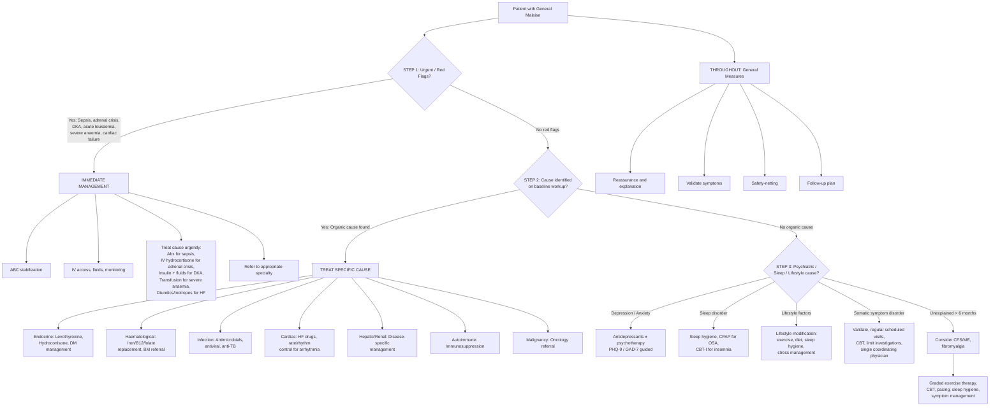

## Management of General Malaise

### Core Principle: Treat the Cause, Not the Symptom

Let's establish this from first principles: **malaise is a symptom, not a disease**. There is no "anti-malaise pill." The management of general malaise is fundamentally the management of the **underlying cause**. Once you identify and treat the cause, the malaise resolves. This means the diagnostic workup (covered in the previous section) and the management are inseparable — you cannot treat what you have not diagnosed.

That said, there are important **general management principles** that apply to every patient presenting with malaise regardless of cause, and there are **specific management strategies** for the most common and serious underlying conditions. We will cover both.

---

### Management Algorithm

---

### General Management Principles (All Patients)

These apply to **every** patient presenting with malaise, regardless of whether a specific cause has been identified. They come from ***Murtagh's Diagnostic Tips*** [1]:

#### 1. Validate the Symptom

***"Believe the patient's symptoms"*** [1]. Malaise is subjective and invisible — patients often feel dismissed. Acknowledge their experience explicitly: "I understand you're feeling generally unwell and that this is affecting your life. Let's work together to find out why."

> **Why this matters**: Therapeutic alliance is the foundation. If the patient does not feel believed, they will doctor-shop (common in somatization), not comply with treatment, and not return for follow-up. Moreover, ***"Ask the patient what they believe is the cause of their tiredness"*** [1] — this elicits their illness model and may reveal important clues (e.g. a patient who says "I think it's because I was diagnosed with cancer last year" tells you about cancer-related fatigue AND possible depression).

#### 2. Provide Reassurance Where Appropriate

***"Investigations are likely to be therapeutic and reassuring rather than diagnostic"*** [1]. In many cases where the baseline panel is normal, the very act of performing and explaining normal results provides reassurance that nothing serious has been missed.

- **But**: reassurance must be paired with a clear follow-up plan ("Your blood tests are normal, which is good news. I'd like to see you again in 4 weeks to check how you're doing") — not dismissive ("Your tests are fine, there's nothing wrong").

#### 3. Address Lifestyle Factors

***"Diet and exercise"*** [1] should be discussed in every consultation:

| Factor | Intervention | Why It Works |
|--------|-------------|-------------|
| **Physical activity** | Structured graduated exercise programme (30 min moderate activity, 5 days/week) | Exercise ↑mitochondrial biogenesis, ↑endorphins, ↑serotonin, ↓systemic inflammation (↓IL-6, TNF-α over time), ↑sleep quality. Paradoxically, the most fatigued patients benefit the most |
| **Sleep hygiene** | Regular sleep-wake times, avoid screens 1 hr before bed, limit caffeine after noon, dark/cool bedroom | Consolidates circadian rhythm, ↑slow-wave sleep, ↓cortisol dysregulation |
| **Diet** | Balanced meals at regular intervals, adequate hydration, limit refined sugars and excessive alcohol | Prevents reactive hypoglycaemia, ensures micronutrient sufficiency, reduces alcohol-mediated sleep disruption |
| **Stress management** | Relaxation techniques, mindfulness, cognitive restructuring | ↓Chronic HPA axis activation → ↓cortisol → ↓neuroinflammation → ↓fatigue |

#### 4. Medication Review

***"Drug history including self-medication, OTCs, alcohol, antianxiety, antipsychotics, antidepressants"*** [1] — consider whether any current medication could be causing or worsening fatigue:

- **Beta-blockers**: Can you switch to a less lipophilic agent (e.g. atenolol instead of propranolol)?
- **Statins**: Is the patient symptomatic? Consider dose reduction, switch to alternate statin, or CoQ10 supplementation
- **Sedating medications**: Antihistamines, gabapentinoids, benzodiazepines, older antidepressants — can the dose be reduced or the drug changed?
- **Alcohol**: Even "moderate" drinking disrupts sleep architecture (↓REM) → advise reduction

#### 5. Safety-Netting

- Schedule follow-up (typically 4–6 weeks)
- Advise patient to return sooner if new symptoms develop (weight loss, fever, lumps, bleeding, worsening fatigue)
- Repeat baseline investigations in 3–6 months if initial workup was negative but symptoms persist — some conditions (early leukaemia, evolving hypothyroidism, early malignancy) may only become apparent on repeat testing

<Callout title="Murtagh's Clinical Wisdom" type="idea">

***"Be alert to depression including masked depression"*** [1]

***"Be alert for the classic endocrine traps: hypothyroidism and Addison disease"*** [1]

***"Tiredness in absence of red flags is unlikely to have an organic cause"*** [1]

***"Do not overlook a sleep disorder"*** [1]

***"Learn how to undertake a brief, good physical examination and practise effective time management"*** [1]

These aphorisms from Murtagh capture the essence of managing malaise in primary care. The most commonly missed diagnoses are depression, hypothyroidism, sleep apnoea, and Addison's — all of which are treatable.
</Callout>

---

### Specific Management by Cause

Below we cover the management of the **most important and common** conditions presenting as malaise, organized by system. For each, we explain the treatment rationale from first principles, key drug indications/contraindications, and important HK-specific considerations.

---

#### A. Psychiatric Causes

##### 1. Major Depressive Disorder

Depression is the most common serious cause of chronic malaise. Management follows a **stepped-care model**:

| Severity (PHQ-9) | Management |
|-------------------|-----------|
| **Mild (5–9)** | Active monitoring, lifestyle modification (exercise, sleep hygiene, stress management), guided self-help, brief psychological intervention |
| **Moderate (10–19)** | Antidepressant medication OR psychological therapy (CBT, interpersonal therapy); combination preferred if poor response |
| **Severe (≥ 20)** | Antidepressant + psychological therapy (combination recommended from outset); consider psychiatry referral; ECT if treatment-resistant or acutely suicidal |

**First-line antidepressants**: SSRIs (selective serotonin reuptake inhibitors)

| Drug | Mechanism | Key Points |
|------|-----------|-----------|
| **Sertraline** | Blocks SERT (serotonin transporter) → ↑synaptic 5-HT → downstream neuroplasticity and normalization of HPA axis | First choice in primary care: fewest drug interactions, safe in cardiac disease. Onset of action 2–4 weeks |
| **Fluoxetine** | As above, but long half-life (4–6 days) | Useful in adolescents; can cause activation early on; potent CYP2D6 inhibitor (drug interactions) |
| **Escitalopram** | S-enantiomer of citalopram, highly selective SERT blockade | Well tolerated, ↓drug interactions. QTc prolongation at high doses (max 20 mg) |

**Contraindications/Cautions for SSRIs**:
- Concurrent MAOIs (serotonin syndrome risk — wait ≥ 2 weeks washout)
- Hyponatraemia risk (especially in elderly — SSRIs → SIADH → ↓Na⁺)
- GI bleeding risk (↓platelet serotonin → ↓platelet aggregation; caution with NSAIDs/anticoagulants)
- QTc prolongation (citalopram, escitalopram at high doses)

**Second-line options**: SNRIs (venlafaxine, duloxetine), mirtazapine (useful if insomnia dominant — H1 blockade → sedation, also ↑appetite via 5-HT2C/H1 blockade)

> **Key concept**: Antidepressants take 2–4 weeks to work because they need to induce neuroplastic changes (↑BDNF, dendritic remodelling) — not just ↑serotonin acutely. Always warn patients: "You may feel side effects before benefits. Stick with it for at least 4 weeks before we reassess."

##### 2. Generalized Anxiety Disorder

| Treatment | Mechanism | Indications |
|-----------|-----------|-------------|
| **CBT** | Cognitive restructuring + behavioural exposure → breaks cycle of worry → ↓anxiety → ↓somatic symptoms (including fatigue) | First-line for mild-moderate GAD |
| **SSRIs/SNRIs** | As above for depression; also effective in anxiety (serotonin modulates amygdala reactivity) | First-line pharmacotherapy; sertraline, escitalopram, or venlafaxine |
| **Pregabalin** | Binds α2δ subunit of VGCC → ↓excitatory neurotransmitter release → ↓neuronal hyperexcitability | Second-line; licensed for GAD; useful if comorbid pain. Caution: sedation, dizziness, dependence potential |
| **Benzodiazepines** | GABA-A potentiation → ↑Cl⁻ influx → neuronal inhibition | Short-term ONLY ( < 2–4 weeks) for acute crises; NOT for long-term use (tolerance, dependence, cognitive impairment) |

##### 3. Somatic Symptom Disorder [8]

Management principles are fundamentally different from standard medical management:

| Principle | Rationale |
|-----------|-----------|
| **Single coordinating physician** | Prevents doctor-shopping, contradictory advice, unnecessary investigations |
| **Regular scheduled visits** | Shifts dynamic from symptom-contingent to time-contingent → patient feels supported without needing to generate new symptoms for attention |
| ***Validate symptoms*** | ***"Believe the patient's symptoms"*** [1] — even if no organic cause found, the suffering is real |
| **Limit investigations** | ***Ix should be judicious — false-positive results may lead to unnecessary invasive investigations and risks*** [8]. Each normal test provides temporary reassurance but fuels the cycle if investigations are ordered reactively |
| **CBT** | Core therapy: identifies and modifies catastrophic health cognitions, reduces somatic hypervigilance, develops adaptive coping |
| **Treat comorbid depression/anxiety** | ***Comorbid anxiety/depression in 30–60%*** [8] — SSRIs can reduce both mood symptoms and somatic complaint severity |
| **Gradual functional rehabilitation** | Goal is improvement in functioning, not complete symptom resolution |

<Callout title="Management Error" type="error">
A common mistake is to tell the patient "There's nothing wrong with you" or "It's all in your head." This invalidates their experience, destroys therapeutic alliance, and often drives them to another doctor. Instead: "Your tests have confirmed that there is no dangerous disease. I believe your symptoms are real — they arise from the way your nervous system is processing signals from your body, and we can work on this together."
</Callout>

---

#### B. Sleep Disorders

##### Obstructive Sleep Apnoea (OSA)

| Treatment | Mechanism | Indications |
|-----------|-----------|-------------|
| **CPAP** (Continuous Positive Airway Pressure) | Pneumatic splinting of the upper airway → prevents pharyngeal collapse during sleep → eliminates apnoeas/hypopnoeas → ↓sleep fragmentation → ↓daytime fatigue | First-line for moderate-severe OSA (AHI ≥ 15) or symptomatic mild OSA |
| **Weight loss** | ↓Parapharyngeal fat → ↓airway collapsibility | Recommended for ALL overweight/obese OSA patients. Weight reduction of 10–15% can ↓AHI by ~50% |
| **Mandibular advancement device** | Protrudes mandible → ↑retroglossal space → ↓airway obstruction | Alternative for mild-moderate OSA or CPAP-intolerant patients |
| **Positional therapy** | Lateral sleeping prevents gravitational tongue base collapse | For positional OSA (predominantly supine events) |
| **Avoid alcohol/sedatives** | These ↓pharyngeal muscle tone → ↑airway collapsibility | Universal advice |

##### Insomnia

| Treatment | Mechanism | Indications |
|-----------|-----------|-------------|
| **CBT for insomnia (CBT-I)** | Sleep restriction + stimulus control + cognitive restructuring + relaxation + sleep hygiene → breaks conditioned arousal cycle | **First-line** for chronic insomnia (superior to drugs long-term) |
| **Sleep hygiene education** | Addresses modifiable behavioural factors that perpetuate insomnia | Universal adjunct |
| **Melatonin** | Exogenous agonist of MT1/MT2 receptors → advances circadian phase → ↓sleep onset latency | Useful for circadian rhythm disorders, jet lag, elderly insomnia (sustained-release). Low side-effect profile |
| **Z-drugs** (zopiclone, zolpidem) | GABA-A agonist → sedation (more selective than benzodiazepines) | Short-term ( < 4 weeks) for acute insomnia; tolerance develops |
| **Benzodiazepines** | GABA-A potentiation | Last resort, short-term only; avoid in elderly (fall risk, cognitive impairment) |

---

#### C. Endocrine Causes

##### 1. Hypothyroidism

| Treatment | Mechanism | Key Points |
|-----------|-----------|-----------|
| **Levothyroxine** (T4) | Synthetic thyroxine → deiodinated peripherally to T3 (active hormone) → restores metabolic rate in all tissues | Start low, go slow in elderly/cardiac patients (e.g. 25 μg daily, ↑by 25 μg every 4–6 weeks); younger patients can start 50–100 μg. **Take on empty stomach** 30 min before food (otherwise absorption ↓ by ~20%). Monitor TSH at 6–8 weeks (T4 half-life ~7 days, so need ≥5 half-lives for steady state) |
| **CI/Caution** | Untreated adrenal insufficiency — must replace cortisol BEFORE starting T4 (otherwise T4 ↑metabolic rate → ↑cortisol demand → adrenal crisis) | Also caution in ischaemic heart disease (↑metabolic rate → ↑myocardial O₂ demand → angina) |

##### 2. Adrenal Insufficiency [4]

| Scenario | Treatment | Mechanism |
|----------|-----------|-----------|
| ***Acute adrenal crisis*** [4] | ***Treat on clinical suspicion BEFORE investigations*** [4]: IV hydrocortisone 100 mg stat, then 50 mg q6–8h + aggressive IV saline (0.9% NaCl) + dextrose if hypoglycaemic | Hydrocortisone = synthetic cortisol → restores vascular tone (cortisol → ↑vascular sensitivity to catecholamines → ↑BP), restores gluconeogenesis → corrects hypoglycaemia, ↓immune dysregulation |
| ***Chronic adrenal insufficiency*** [4] | Oral hydrocortisone 15–25 mg/day in 2–3 divided doses (e.g. 10 mg AM, 5 mg noon, 5 mg PM — mimicking diurnal cortisol rhythm) + fludrocortisone 50–200 μg daily (if primary — for mineralocorticoid replacement) | Fludrocortisone ("fludro" = fluorinated → ↑mineralocorticoid activity) → Na⁺ retention, K⁺ excretion → restores volume and electrolytes. Not needed in secondary AI (aldosterone is regulated by RAAS, not ACTH, so preserved) |
| **Sick-day rules** | Double or triple hydrocortisone dose during intercurrent illness, surgery, trauma | Normally cortisol ↑↑ during stress; adrenal-insufficient patients cannot mount this response → risk of adrenal crisis without ↑dose |
| **Medic-alert bracelet** | Advise ALL patients with adrenal insufficiency to wear identification | In emergencies, paramedics must know to give IV hydrocortisone immediately |

##### 3. Diabetes Mellitus [2]

Management of DM-associated fatigue centres on **optimizing glycaemic control**:

| Modality | Key Points |
|----------|-----------|
| **Lifestyle modification** | First-line for all: diet (↓refined carbs, Mediterranean pattern), exercise (↑GLUT4 translocation → ↑glucose uptake), weight loss (↓insulin resistance) |
| **Metformin** | First-line pharmacotherapy for T2DM. Mechanism: ↓hepatic gluconeogenesis, ↑peripheral insulin sensitivity (via AMPK activation). CI: eGFR < 30 (lactic acidosis risk); caution eGFR 30–45 |
| **SGLT2 inhibitors** (empagliflozin, dapagliflozin) | Block glucose reabsorption in PCT → glycosuria → ↓glucose + ↓weight + cardiorenal benefits. Now first-line in T2DM with CVD or CKD. CI: recurrent genital infections, T1DM (euglycaemic DKA risk) |
| **Insulin** | Required in T1DM (always), late T2DM (β-cell failure), DKA, perioperative |

---

#### D. Haematological Causes

##### 1. Iron Deficiency Anaemia

| Treatment | Mechanism | Key Points |
|-----------|-----------|-----------|
| **Oral iron** (ferrous sulphate 200 mg BD–TDS) | Provides elemental Fe²⁺ → absorbed in duodenum → incorporated into transferrin → delivered to erythroid marrow → haem synthesis | Side effects: nausea, constipation, black stools. Take on empty stomach with vitamin C (acid environment ↑Fe²⁺ absorption). Reticulocyte response in ~1 week, Hb ↑ ~10 g/L per 2 weeks. Continue 3 months after Hb normalizes to replenish stores |
| **IV iron** (ferric carboxymaltose) | IV bypasses GI absorption → rapid replenishment | Indications: intolerance of oral, malabsorption (coeliac, IBD), CKD, severe anaemia, need for rapid repletion. CI: active infection (iron feeds bacteria); anaphylaxis risk (small) |
| **Treat the cause** | Most important step — finding and fixing the source of blood loss/malabsorption | Pre-menopausal women: menorrhagia; post-menopausal/men: GI bleeding → colonoscopy + OGD mandatory to exclude malignancy |

##### 2. B12 Deficiency

| Treatment | Mechanism | Key Points |
|-----------|-----------|-----------|
| **IM hydroxocobalamin** | 1 mg IM every other day for 2 weeks (loading), then 1 mg every 3 months (maintenance) | Required for pernicious anaemia (intrinsic factor deficient → cannot absorb oral B12). IM bypasses GI absorption |
| **Oral B12** (1–2 mg daily) | High-dose oral can achieve ~1% passive absorption even without IF | Suitable for dietary deficiency (vegans), mild deficiency. Not for pernicious anaemia or neurological involvement |

> **Critical**: If B12 and folate are both deficient, **replace B12 FIRST** — giving folate alone can correct the anaemia but will NOT halt neurological progression (subacute combined degeneration) and may even worsen it (folate drives cell division using B12-dependent methionine synthase → ↑B12 consumption → ↑neurological deficit).

##### 3. Suspected Haematological Malignancy [5]

***Approach: 5 steps to diagnosis of haematological malignancy (MCICM)*** [5]:
1. ***Morphology***: peripheral blood smear, BM aspirate and trephine
2. ***Cytochemistry***: MPO/Sudan black B for myeloid
3. ***Immunophenotyping***: flow cytometry
4. ***Cytogenetics***: karyotyping, FISH
5. ***Molecular genetics***: PCR, sequencing

**Management**: Urgent referral to haematology. Treatment depends on subtype:
- **AML**: Induction chemotherapy (daunorubicin + cytarabine "7+3"), then consolidation ± allogeneic stem cell transplant
- **ALL**: Multi-agent chemotherapy (vincristine, dexamethasone, L-asparaginase), CNS prophylaxis, ± transplant
- **Myelofibrosis** [5]: JAK2 inhibitors (ruxolitinib) for symptomatic splenomegaly and constitutional symptoms; transplant for eligible patients

---

#### E. Infection-Related Causes

##### 1. Viral / Post-Viral

| Scenario | Management |
|----------|-----------|
| **Acute viral URTI** | ***Symptomatic relief***: rest, adequate hydration, paracetamol for fever/myalgia, nasal decongestants. Antibiotics NOT indicated. Self-limiting ~7–10 days [9] |
| **Post-viral fatigue** | Reassurance that post-viral fatigue is common and usually self-limiting (weeks to months); graded return to activity; adequate sleep; consider psychology referral if prolonged |
| ***Infectious mononucleosis (EBV)*** [9] | Supportive: rest, analgesia, hydration. **Avoid contact sports for ≥ 3 weeks** (splenic rupture risk — splenomegaly in 50–60%). ***Fatigue may persist for up to 6 months in 10%*** [9] — reassure. Steroids only if airway obstruction from tonsillar hypertrophy |

##### 2. Tuberculosis [10]

| Phase | Treatment | Duration |
|-------|-----------|----------|
| ***Intensive*** | ***RIPE: Rifampicin + Isoniazid + Pyrazinamide + Ethambutol*** | 2 months |
| ***Continuation*** | ***Rifampicin + Isoniazid*** | 4 months |

| Drug | Mechanism | Key Side Effects |
|------|-----------|-----------------|
| **R**ifampicin | "Rif" = rifamycin family → inhibits bacterial DNA-dependent RNA polymerase → ↓mRNA synthesis | Hepatotoxicity, orange discolouration of secretions, CYP450 inducer (↓effect of OCP, warfarin, antiretrovirals) |
| **I**soniazid | Prodrug activated by KatG → inhibits mycolic acid synthesis (cell wall component unique to mycobacteria) | Peripheral neuropathy (↓pyridoxine/B6 → always co-prescribe B6), hepatotoxicity |
| **P**yrazinamide | Converted to pyrazinoic acid in acidic environment (macrophage phagolysosome) → disrupts membrane function | Hepatotoxicity, hyperuricaemia (↓renal urate excretion → gout flare) |
| **E**thambutol | "Etham" → inhibits arabinosyl transferase → ↓arabinogalactan synthesis (cell wall) | **Optic neuritis** (↓visual acuity, colour vision → always check baseline acuity before starting) |

> ***Cryptic TB in elderly: anti-TB treatment even in absence of definite evidence can be life-saving*** [10] — the 80% mortality without treatment justifies empirical therapy in high-suspicion cases.

##### 3. HIV

- **Antiretroviral therapy (ART)**: Start immediately upon diagnosis regardless of CD4 count (current WHO/DHHS guidelines 2025–2026)
- ART reduces viral load → ↓chronic immune activation → resolution of fatigue/malaise
- Typically: 2 NRTIs + 1 INSTI (e.g. tenofovir alafenamide + emtricitabine + bictegravir — single-tablet regimen)

##### 4. Chronic Hepatitis B

Relevant in HK (HBV carrier rate ~7–8%):

| Indication for Treatment | Treatment | Mechanism |
|-------------------------|-----------|-----------|
| Active CHB (↑ALT, HBV DNA > 2000 IU/mL, ± significant fibrosis) | **Entecavir** or **Tenofovir** (oral NUC) | Nucleos(t)ide analogues → inhibit HBV DNA polymerase/reverse transcriptase → ↓viral replication → ↓hepatic inflammation → ↓fatigue |
| Selected patients | **Pegylated IFN-α** (finite course 48 weeks) | Immunomodulation + direct antiviral → chance of HBsAg seroconversion. CI: decompensated cirrhosis, autoimmune disease, psychiatric illness |

---

#### F. Cardiac Causes

##### Heart Failure

| Drug Class | Mechanism | Why It Helps Malaise | Key CI |
|-----------|-----------|---------------------|--------|
| **ACEi/ARB** (ramipril, losartan) | ↓Angiotensin II → ↓afterload + ↓aldosterone → ↓Na/H₂O retention → ↓cardiac workload | ↓Neurohormonal overdrive → ↓chronic fatigue | Bilateral renal artery stenosis, pregnancy, angioedema (ACEi) |
| **Beta-blocker** (bisoprolol, carvedilol) | ↓HR → ↑diastolic filling time → ↑CO; ↓sympathetic overdrive → ↓myocardial O₂ demand | Paradox: beta-blockers can cause fatigue initially but ↓mortality and ↑exercise tolerance long-term (reverse remodelling) | Acute decompensation, severe bradycardia, asthma (non-selective) |
| **MRA** (spironolactone, eplerenone) | ↓Aldosterone → ↓fibrosis, ↓Na/H₂O retention | ↓Congestion and ↓cardiac remodelling → ↑functional capacity | Hyperkalaemia (K > 5.0), severe renal impairment |
| **SGLT2i** (dapagliflozin, empagliflozin) | Multiple mechanisms: natriuresis, ↓preload, ↓inflammation, ↑ketone body utilization by myocardium | Now standard of care in HFrEF AND HFpEF — ↓hospitalizations, ↑symptoms | Recurrent genital infections; caution in very low BP |
| **Diuretics** (furosemide) | Loop diuretic → ↓fluid overload | Symptomatic relief of congestion → ↓dyspnoea → ↑functional capacity. Does not improve mortality |

##### Arrhythmia

- **Rate control for AF**: Beta-blocker or rate-limiting CCB (diltiazem, verapamil) or digoxin → ↓ventricular rate → ↑diastolic filling → ↑effective CO → ↓fatigue
- **Rhythm control**: Consider if symptomatic despite rate control — flecainide, amiodarone, or catheter ablation
- **Bradycardia/heart block**: Pacemaker if symptomatic (fatigue, presyncope, syncope)

---

#### G. Autoimmune / Connective Tissue Diseases

##### SLE, MCTD, RA

| Treatment | Mechanism | Key Points |
|-----------|-----------|-----------|
| **Hydroxychloroquine** | Immunomodulator: ↓TLR signalling, ↓antigen presentation, ↓cytokine production | First-line for SLE (reduces flares, fatigue, skin disease); recommended for ALL SLE patients unless CI. CI: retinal toxicity (annual eye screening required), G6PD deficiency |
| **Corticosteroids** | ↓NF-κB → global immunosuppression → rapid ↓inflammation → rapid symptom relief | Used for flares (high dose, then taper). Long-term side effects: Cushing's, osteoporosis, DM, infections → always steroid-sparing strategy |
| **DMARDs** (methotrexate, azathioprine, mycophenolate) | Various: MTX inhibits DHFR → ↓purine synthesis → ↓lymphocyte proliferation; AZA → purine analogue; MMF → ↓inosine monophosphate dehydrogenase | Steroid-sparing agents; slow onset (weeks-months). MTX CI: pregnancy (teratogenic), significant renal/hepatic impairment. Monitor FBE, LFTs |
| **Biologics** (rituximab, belimumab) | Rituximab: anti-CD20 → B-cell depletion; Belimumab: anti-BLyS → ↓B-cell survival | For refractory disease. Pre-screen for HBV (rituximab → HBV reactivation risk) |

##### Polymyalgia Rheumatica

- **Prednisolone 15 mg daily**: Dramatic response (within 24–72 hours) is essentially diagnostic. Failure to respond should prompt reconsideration of diagnosis
- Gradual taper over 12–18 months guided by symptoms + ESR/CRP
- Always check for concurrent GCA symptoms (headache, jaw claudication, visual symptoms) → if present, escalate to 40–60 mg

---

#### H. Malignancy-Related Fatigue

Cancer-related fatigue (CRF) is multifactorial and requires multimodal management:

| Intervention | Mechanism |
|-------------|-----------|
| **Treat the cancer** | ↓Tumour burden → ↓cytokine production → ↓sickness behaviour |
| **Treat anaemia** | ↑Hb → ↑O₂ delivery. Transfusion if Hb < 70 g/L (or symptomatic at higher levels); EPO for chemotherapy-induced anaemia |
| **Exercise** | Even in cancer patients, structured exercise programmes ↓fatigue (strongest evidence base of any CRF intervention) |
| **Psychosocial support** | CBT, mindfulness-based stress reduction → ↓distress → ↓fatigue |
| **Pharmacotherapy** | Methylphenidate/dexamfetamine (psychostimulants) — limited evidence, sometimes used in palliative care; corticosteroids (short-term benefit for terminally ill) |

---

#### I. CFS/ME and Functional Fatigue Syndromes

This is the management when **all organic and psychiatric causes have been excluded** and fatigue persists > 6 months:

| Intervention | Rationale | Notes |
|-------------|-----------|-------|
| **Patient education** | Understanding the condition ↓helplessness → ↑self-efficacy | Explain that CFS/ME is a real, recognized condition with neurobiological underpinnings — not laziness or "imaginary" |
| **Pacing** | Activity management to stay within "energy envelope" → ↓post-exertional malaise | Patient learns to recognize limits and alternate activity/rest. Avoid boom-bust cycle |
| **Graded exercise therapy (GET)** | Very gradual ↑physical activity from a very low baseline → ↑deconditioning tolerance | Controversial — must be patient-led, not rigid. NICE 2021 moved away from GET as structured programme but supports individually tailored physical activity increases |
| **CBT** | Addresses unhelpful illness cognitions (catastrophizing, fear-avoidance), ↑adaptive coping | Does NOT imply illness is psychological; targets coping strategies and functional outcomes |
| **Sleep management** | Sleep hygiene, melatonin, treat comorbid sleep disorders | Unrefreshing sleep is a core feature — improving sleep quality ↑overall function |
| **Symptom management** | Paracetamol/NSAIDs for pain; low-dose amitriptyline for sleep + pain (H1/muscarinic blockade → sedation; ↓reuptake NE/5-HT → pain modulation); gabapentin for neuropathic-type pain | Avoid opioids (tolerance, dependence, cognitive effects → worsen fatigue) |

---

### Summary Table: Management by Cause at a Glance

| Cause | Key Treatment | Critical Don't-Miss Point |
|-------|--------------|--------------------------|
| **Depression** | SSRI + CBT | Screen with PHQ-9; warn about 2–4 week onset lag |
| **Anxiety** | SSRI/SNRI + CBT | Benzodiazepines SHORT-TERM only |
| **Somatic symptom disorder** | Single physician, scheduled visits, CBT, limit Ix [8] | Validate, do not dismiss |
| **OSA** | CPAP + weight loss | Ask about snoring in EVERY fatigued patient [1] |
| **Hypothyroidism** | Levothyroxine | Replace cortisol first if adrenal insufficiency coexists |
| **Adrenal insufficiency** [4] | Hydrocortisone ± fludrocortisone | Acute crisis: treat BEFORE Ix [4]; sick-day rules |
| **DM** | Lifestyle + metformin ± SGLT2i | Fatigue improves with glycaemic optimization |
| **Iron deficiency** | Oral/IV iron + investigate cause | Men/post-menopausal women → exclude GI malignancy |
| **B12 deficiency** | IM hydroxocobalamin | Replace B12 before folate |
| **Leukaemia** [5] | Urgent haematology referral | MCICM 5-step diagnostic workup [5] |
| **Viral infection** | Supportive, symptomatic | Antibiotics NOT indicated for viral URTI [9] |
| **TB** [10] | RIPE regimen 2+4 months | Co-prescribe pyridoxine with isoniazid |
| **HIV** | ART regardless of CD4 | Single-tablet regimens improve compliance |
| **CHB** | Entecavir/tenofovir if indicated | HK high prevalence — always screen |
| **Heart failure** | ACEi + BB + MRA + SGLT2i + diuretics | Quadruple therapy is now standard for HFrEF |
| **SLE/CTD** | HCQ for all SLE + steroids + DMARDs | Annual retinal screening for HCQ |
| **PMR** | Prednisolone 15 mg | Dramatic response expected — if not, reconsider dx |
| **CFS/ME** | Pacing, CBT, sleep management, graded activity | Diagnosis of exclusion only |
| **Malignancy** | Treat cancer + exercise + anaemia management | Referral to oncology |

---

<Callout title="High Yield Summary — Management of General Malaise">

1. **Core principle**: Treat the cause, not the symptom. There is no "anti-malaise" drug.

2. **General measures for ALL patients**: ***Validate symptoms ("believe the patient")*** [1], ***lifestyle advice (diet and exercise)*** [1], medication review, sleep assessment (***"do not overlook a sleep disorder"*** [1]), safety-netting.

3. ***"Investigations are likely to be therapeutic and reassuring rather than diagnostic"*** [1] — a normal baseline workup itself is part of the management.

4. ***"Be alert to depression including masked depression"*** [1] — screen every patient with PHQ-9. SSRIs are first-line pharmacotherapy.

5. ***"Be alert for the classic endocrine traps: hypothyroidism and Addison disease"*** [1] — levothyroxine for hypothyroidism (start low, go slow); hydrocortisone ± fludrocortisone for adrenal insufficiency (***treat acute crisis before investigations*** [4]).

6. ***"Tiredness in absence of red flags is unlikely to have an organic cause"*** [1] — but still do the baseline panel, review in 4–6 weeks, and repeat tests if symptoms persist.

7. **Iron deficiency**: Oral iron + identify and treat the source of loss. Men/postmenopausal women → investigate for GI malignancy.

8. **TB in HK**: RIPE 2+4 months. ***Empirical anti-TB treatment can be life-saving in cryptic TB*** [10].

9. **CFS/ME**: Diagnosis of exclusion. Pacing, CBT, sleep management, gradually increasing activity. No specific drug treatment.

10. **Somatic symptom disorder**: Single physician, scheduled visits, ***limit investigations (false positives cause harm)*** [8], CBT, treat comorbid depression/anxiety.
</Callout>

---

<ActiveRecallQuiz
  title="Active Recall - Management of General Malaise"
  items={[
    {
      question: "List 5 general management principles that apply to ALL patients presenting with malaise, drawing from Murtagh's diagnostic tips.",
      markscheme: "(1) Validate/believe symptoms. (2) Screen for depression including masked depression. (3) Review medications (OTCs, alcohol, psychotropics). (4) Address lifestyle factors (diet, exercise, sleep hygiene). (5) Do not overlook sleep disorders. (6) Be alert for endocrine traps (hypothyroidism, Addison's). (7) Safety-net with follow-up plan. (Any 5 accepted.)"
    },
    {
      question: "A patient is found to have both adrenal insufficiency and hypothyroidism. Which condition must you treat first and why?",
      markscheme: "Treat adrenal insufficiency (hydrocortisone) FIRST before starting levothyroxine. Reason: levothyroxine increases metabolic rate, which increases cortisol demand. If the adrenals cannot meet this increased demand (adrenal insufficiency), starting T4 first can precipitate an acute adrenal crisis. Replace cortisol first, then start T4 once cortisol levels are adequate."
    },
    {
      question: "Outline the management of somatic symptom disorder. Why should investigations be limited?",
      markscheme: "Management: (1) Single coordinating physician to prevent doctor-shopping. (2) Regular scheduled (not symptom-contingent) visits. (3) Validate symptoms — do not dismiss. (4) CBT to address catastrophic health cognitions. (5) Treat comorbid depression/anxiety with SSRIs. (6) Gradual functional rehabilitation. Investigations should be limited because false-positive results lead to unnecessary invasive investigations and risks, provide only temporary reassurance, and fuel the cycle of health anxiety."
    },
    {
      question: "A 65-year-old man presents with chronic fatigue and is found to have iron deficiency anaemia. What is the single most important management step beyond iron replacement, and why?",
      markscheme: "Investigate the source of iron loss — specifically, arrange both upper GI endoscopy (OGD) and colonoscopy to exclude GI malignancy. In men and post-menopausal women, iron deficiency anaemia is GI blood loss until proven otherwise. Colorectal cancer is the critical diagnosis not to miss. Iron replacement alone without identifying the cause is incomplete and potentially dangerous management."
    },
    {
      question: "Name the 4 drugs in the standard anti-TB RIPE regimen, their key mechanisms, and one important side effect for each.",
      markscheme: "R: Rifampicin — inhibits RNA polymerase — hepatotoxicity, CYP inducer (drug interactions, orange secretions). I: Isoniazid — inhibits mycolic acid synthesis — peripheral neuropathy (co-prescribe pyridoxine B6), hepatotoxicity. P: Pyrazinamide — disrupts membrane in acidic environment — hepatotoxicity, hyperuricaemia. E: Ethambutol — inhibits arabinosyl transferase — optic neuritis (check baseline visual acuity)."
    }
  ]}
/>

## References

[1] Lecture slides: murtagh merge.pdf (p99, p101, p102 — Tiredness/chronic fatigue: Key history, Key examination, Key investigations, Diagnostic tips)
[2] Senior notes: Ryan Ho Endocrine.pdf (p80 — Workup for Newly Diagnosed DM)
[4] Senior notes: Ryan Ho Endocrine.pdf (p71 — Adrenal Insufficiency: management)
[5] Senior notes: Ryan Ho Haemtology.pdf (p51 — Leukaemia: MCICM approach)
[8] Senior notes: Ryan Ho Psychiatry.pdf (p199, p200, p202, p203 — Somatoform Disorders: management and criteria)
[9] Senior notes: Ryan Ho Respiratory.pdf (p49, p53 — Acute Coryza, Infectious Mononucleosis)
[10] Senior notes: Ryan Ho Respiratory.pdf (p75, p81 — TB: treatment, Cryptic TB)
