## Differential Diagnosis of Hand / Wrist / Elbow Pain

The differential diagnosis (DDx) for hand/wrist/elbow pain is broad because three anatomical segments, multiple tissue types (bone, joint, tendon, nerve, vessel), and several pathological processes (mechanical, inflammatory, compressive, infective, vascular, neoplastic, referred) all converge in one presenting complaint. The clinical task is to **localise** (where?) and **characterise** (what process?) — then the DDx narrows dramatically.

---

### 1. Organising Framework — Murtagh's Diagnostic Strategy

***Murtagh's Diagnostic Strategies*** [1] provide the single best exam-oriented framework. Every cause of arm/hand pain slots into one of five tiers:

| Tier | Meaning | Examples |
|---|---|---|
| ***Probability diagnosis*** | Common, high-prevalence conditions you'll see most days | ***Dysfunction of the cervical spine (lower); Disorders of the shoulder; Medial or lateral epicondylitis; Overuse tendonopathy of the wrist; Carpal tunnel syndrome; Osteoarthritis of the thumb and DIP joints*** |
| ***Serious disorders not to be missed*** | Low-prevalence but high-mortality/morbidity; must be actively excluded | ***Cardiovascular: angina (referred), myocardial infarction, axillary vein thrombosis, arm claudication (left arm)***; ***Infection: septic arthritis (shoulder/elbow), osteomyelitis, infections of tendon sheath and fascial spaces of hand, sporotrichosis ("gardener's arm")***; ***Neoplasia: Pancoast tumour, bone tumours (rare)*** |
| ***Pitfalls (often missed)*** | Conditions commonly overlooked that cause diagnostic delay | ***Entrapment neuropathies (e.g. median nerve, ulnar nerve); Pulled elbow (children)*** |
| Seven masquerades | Common systemic diseases mimicking MSK pain | Depression, diabetes, drugs, anaemia, thyroid disease, spinal dysfunction, UTI |
| Is the patient trying to tell me something? | Psychogenic / functional overlay | Chronic pain syndrome, secondary gain |

<Callout title="Exam Tip — Murtagh's Tiers" type="idea">
For any OSCE or written question that asks "Give the differential diagnosis of arm/hand pain", structuring your answer by Murtagh's five tiers (probability → serious → pitfalls → masquerades → psychogenic) demonstrates systematic thinking and scores well. Always mention the serious disorders explicitly — examiners want to hear that you won't miss an MI or septic arthritis.
</Callout>

---

### 2. DDx by Anatomical Region

The mermaid diagram below maps the major differentials to their anatomical site, then further separates them by pathological process. Use this as a mental scaffold.

```mermaid
graph TD
    A["Hand / Wrist / Elbow Pain"] --> B["ELBOW region"]
    A --> C["WRIST region"]
    A --> D["HAND / FINGER region"]
    A --> E["REFERRED / SYSTEMIC"]

    B --> B1["Mechanical / Degenerative"]
    B --> B2["Inflammatory"]
    B --> B3["Compressive / Neural"]
    B --> B4["Infective"]
    B --> B5["Other"]

    B1 --> B1a["Lateral epicondylitis"]
    B1 --> B1b["Medial epicondylitis"]
    B1 --> B1c["Olecranon bursitis"]
    B1 --> B1d["OA elbow"]
    B2 --> B2a["Gout / CPPD of elbow"]
    B2 --> B2b["RA elbow"]
    B3 --> B3a["Cubital tunnel syndrome"]
    B3 --> B3b["PIN compression"]
    B3 --> B3c["Pronator teres syndrome"]
    B4 --> B4a["Septic arthritis"]
    B4 --> B4b["Osteomyelitis"]
    B5 --> B5a["Pulled elbow - children"]

    C --> C1["Mechanical / Degenerative"]
    C --> C2["Inflammatory"]
    C --> C3["Compressive / Neural"]
    C --> C4["Infective"]
    C --> C5["Vascular"]
    C --> C6["SOL / Tumour"]

    C1 --> C1a["De Quervain's tenosynovitis"]
    C1 --> C1b["Intersection syndrome"]
    C1 --> C1c["ECU tendinopathy"]
    C1 --> C1d["Scaphoid fracture / non-union"]
    C1 --> C1e["Kienbock's disease"]
    C1 --> C1f["DRUJ / TFCC injury"]
    C2 --> C2a["RA wrist"]
    C2 --> C2b["Gout / CPPD of wrist"]
    C3 --> C3a["Carpal tunnel syndrome"]
    C3 --> C3b["Guyon's canal syndrome"]
    C3 --> C3c["Wartenberg's syndrome"]
    C4 --> C4a["Septic arthritis of wrist"]
    C5 --> C5a["Buerger's disease"]
    C5 --> C5b["Raynaud's phenomenon"]
    C6 --> C6a["Ganglion cyst"]
    C6 --> C6b["Bone tumour"]

    D --> D1["Mechanical / Degenerative"]
    D --> D2["Inflammatory"]
    D --> D3["Compressive / Neural"]
    D --> D4["Infective"]
    D --> D5["Connective Tissue"]

    D1 --> D1a["Trigger finger"]
    D1 --> D1b["OA - 1st CMC, DIP, PIP"]
    D1 --> D1c["Dupuytren's contracture"]
    D2 --> D2a["RA - MCP, PIP"]
    D2 --> D2b["Gout - hand joints"]
    D2 --> D2c["Psoriatic arthritis - DIP"]
    D3 --> D3a["Digital nerve entrapment"]
    D4 --> D4a["Flexor sheath infection"]
    D4 --> D4b["Herpetic whitlow"]
    D4 --> D4c["Paronychia / Felon"]
    D5 --> D5a["Dermatomyositis - Gottron's"]
    D5 --> D5b["Systemic sclerosis"]

    E --> E1["Cervical radiculopathy C5-T1"]
    E --> E2["MI / Angina - left arm"]
    E --> E3["Thoracic outlet syndrome"]
    E --> E4["Pancoast tumour"]
    E --> E5["Shoulder pathology"]
```

---

### 3. Detailed Differential Diagnosis — Distinguishing Features

The real clinical question isn't just "what are the differentials?" but "how do I tell them apart?" Below is a condition-by-condition breakdown, grouped by region, with the key discriminating features.

#### 3.1 Elbow Region

| Condition | Key discriminating features | Why this pattern? (Pathophysiological basis) |
|---|---|---|
| ***Lateral epicondylitis (tennis elbow)*** | Lateral elbow pain radiating down extensor forearm; worse with gripping/wrist extension; ***Cozen's test +, Mill's test +*** [2] | Micro-tears at ECRB origin on lateral epicondyle; resisted wrist extension reproduces the load on damaged tendon |
| ***Medial epicondylitis (golfer's elbow)*** | Medial elbow pain; worse with wrist flexion/pronation; may have associated ulnar paraesthesia [2] | Micro-tears at common flexor origin on medial epicondyle; proximity of ulnar nerve → concurrent neuropathy |
| Olecranon bursitis | Discrete, fluctuant swelling over olecranon; may be warm if infected or gouty | The olecranon bursa is superficial and prone to friction, trauma, or crystal/bacterial inflammation |
| OA elbow | Stiffness, loss of terminal extension, crepitus; XR: osteophytes, joint space narrowing | Cartilage wear → mechanical block from osteophytes → loss of ROM |
| ***Cubital tunnel syndrome*** | Medial 1.5-digit paraesthesia (palmar AND ***dorsal***); ***less prominent claw hand***; ***cubital valgus***, Tinel sign at elbow, elbow flexion test + [2] | High ulnar nerve lesion → dorsal cutaneous branch affected (branches proximal to wrist); FDP 4/5 paralysed → less clawing (ulnar paradox) |
| PIN compression (radial tunnel syndrome) | Deep aching in proximal extensor forearm; weakness of finger/thumb extension WITHOUT wrist drop (ECRL spared — branches above arcade of Frohse); no sensory loss | PIN is purely motor after it dives through the supinator; compression at arcade of Frohse → motor deficit only |
| ***Pulled elbow (children)*** [1] | Toddler (1–4 y) refuses to use arm after being pulled; arm held pronated and slightly flexed; no swelling, no XR abnormality | Sudden longitudinal traction on extended elbow → radial head subluxes out of the annular ligament (which is relatively lax in toddlers) |
| ***Septic arthritis*** [1][3] | Hot, swollen, extremely painful elbow with restricted ROM in ALL directions; fever; ↑WBC/CRP; joint aspiration shows purulent fluid | Bacterial invasion → synovitis → purulent effusion → ***cartilage destruction in days*** if untreated |
| Gout/CPPD of elbow | Acute monoarthritis; olecranon bursitis common in gout (tophaceous deposits); ***gout: negatively birefringent needle crystals; CPPD: weakly positively birefringent rhomboid crystals*** [4] | Crystal deposition → NLRP3 inflammasome → IL-1β → neutrophilic inflammation |

<Callout title="Lateral vs. Medial Epicondylitis — Quick Rule">
- **Lateral** = extensors = "tennis" = pain on resisted wrist **extension** (Cozen's)
- **Medial** = flexors = "golfer's" = pain on resisted wrist **flexion** (reverse Cozen's)
The side of the epicondyle tells you which muscle group is involved.
</Callout>

#### 3.2 Wrist Region

| Condition | Key discriminating features | Pathophysiological basis |
|---|---|---|
| ***De Quervain's tenosynovitis*** | Radial wrist pain at 1st extensor compartment; swelling over radial styloid; ***Finkelstein's test +*** [2] | Stenosing tenosynovitis of APL/EPB → pain reproduced by stretching these tendons (ulnar deviation with thumb tucked) |
| ***1st CMC joint OA*** (DDx for De Quervain's) | Pain at base of thumb; ***Grind test + (axial load + rotation of thumb against trapezium)*** [2]; XR: joint space narrowing at CMC | Cartilage loss at trapeziometacarpal articulation; the grind test bypasses the tendons and directly loads the joint surfaces |
| ***Wartenberg's syndrome*** (DDx for De Quervain's) | Paraesthesia over radial dorsal hand; common in those wearing ***tight watch/jewellery*** [2]; no tendon tenderness | Neuritis of the superficial branch of the radial nerve — compressed by external pressure, NOT a tendon problem |
| ***Intersection syndrome*** (DDx for De Quervain's) | Pain/swelling ~4 cm proximal to Lister's tubercle on dorsal forearm; crepitus | ***APL & EPB cross over 2nd compartment (ECRL & ECRB) tendons*** [2] → frictional peritendinitis at the intersection point |
| ***Carpal tunnel syndrome*** | Nocturnal paraesthesia in lateral 3.5 digits; flick sign; thenar wasting (late); Phalen's +, Tinel's + [2] | Median nerve compression under flexor retinaculum → ischaemia → sensory then motor loss |
| ***Guyon's canal syndrome*** | Medial 1.5-digit paraesthesia (palmar only, ***dorsal spared***); more prominent claw; hypothenar wasting; cyclist/handlebar use | Ulnar nerve compressed between pisiform and hook of hamate; dorsal branch already departed proximally → dorsal sensation intact |
| Scaphoid fracture/non-union | History of FOOSH; anatomical snuffbox tenderness; pain on axial loading of thumb [2] | Blood supply enters distally and runs retrograde → proximal pole fractures have highest AVN risk; non-union → SNAC wrist (progressive arthritis) |
| Kienbock's disease | Dorsal wrist pain over lunate; ↓grip strength; occurs in young adults with negative ulnar variance | AVN of the lunate → collapse → altered carpal mechanics → secondary OA |
| TFCC injury | Ulnar-sided wrist pain; ↑ with pronation/supination and ulnar deviation; "fovea sign" (tenderness in soft spot between FCU and ulnar styloid) | Triangular fibrocartilage complex acts as cushion/stabiliser between ulna and carpus; tear disrupts load transmission |
| ***RA wrist*** | Symmetrical synovitis of wrists; dorsal tenosynovitis; radial deviation of wrist (with ulnar deviation of fingers); morning stiffness > 30 min [3][5] | Pannus erodes cartilage and ligaments; the extensor tendons in compartments 4–6 are commonly involved |
| ***Ganglion cyst*** | ***Dorsal wrist (70%)***, painless, spherical, smooth, firm, ***transilluminable***; no malignant potential [6][7] | ***Periarticular mucoid degeneration → herniation of connective tissue → cyst filled with synovial/mucinous fluid*** [6] |
| ***Gout / CPPD of wrist*** | Acute monoarthritis; ***wrist is the 2nd most common site for CPPD after knee*** [4]; chondrocalcinosis on XR in CPPD | Crystal deposition in wrist cartilage (especially TFCC for CPPD) → acute inflammatory flare |

<Callout title="De Quervain's vs. 1st CMC OA vs. Intersection Syndrome vs. Wartenberg's" type="idea">
All four cause radial-sided wrist/thumb pain. The distinguishing tests are:
- **De Quervain's** → Finkelstein's test (tendon stretch)
- **1st CMC OA** → Grind test (joint compression)
- **Intersection syndrome** → tenderness is more proximal (~4 cm above Lister's tubercle), with crepitus
- **Wartenberg's** → sensory symptoms, no tendon findings; history of external compression
</Callout>

#### 3.3 Hand / Finger Region

| Condition | Key discriminating features | Pathophysiological basis |
|---|---|---|
| ***Trigger finger*** | Clicking/locking in flexion; tenderness at A1 pulley (MCP palm side); ***Green's grading I–IV*** [2] | Flexor tenosynovitis → nodule cannot pass through stenosed A1 pulley on extension |
| ***OA hand*** | ***Heberden's nodes (DIP), Bouchard's nodes (PIP)***; 1st CMC squaring; bony hard swelling; < 30 min morning stiffness [5] | Cartilage degeneration → osteophyte formation; mechanical process → symptoms improve with rest |
| ***RA hand*** | Symmetrical MCP/PIP swelling (***spares DIP***); ***ulnar deviation, swan-neck, boutonnière, Z-thumb***; morning stiffness > 30 min; pannus on USG [3][5] | Autoimmune synovitis → pannus → cartilage/bone erosion → ligament laxity → deformities |
| ***Psoriatic arthritis (DIP pattern)*** | DIP arthritis with nail changes (pitting, onycholysis, oil-drop sign); dactylitis ("sausage digit"); may be asymmetric | Enthesitis-driven inflammation with predilection for DIP (close to nail matrix); distal periostitis |
| ***Gout of hand*** | Acute monoarthritis of small hand joints; tophi on fingers/olecranon; ***also affects small hand joints, wrist, elbow*** [4] | MSU crystal deposition → NLRP3 → IL-1β → acute neutrophilic inflammation |
| Dupuytren's contracture | Painless progressive flexion contracture of MCP/PIP (ring > little finger); palpable palmar cord/nodule; cannot lay hand flat | Fibroblastic proliferation in palmar fascia → contracture; associated with alcohol, DM, epilepsy, N. European ancestry |
| ***Flexor tendon sheath infection*** [1] | ***Kanavel's signs***: fusiform swelling, flexed posture, tenderness along sheath, pain on passive extension | Bacteria within the closed tendon sheath → pus under pressure; distension causes the finger to rest in flexion |
| Herpetic whitlow | Painful vesicles on fingertip; healthcare workers; Tzanck smear shows multinucleated giant cells | HSV-1/2 direct inoculation → epidermal vesicle formation |
| Felon (pulp space infection) | Tense, throbbing fingertip; no fluctuation (septa prevent free drainage) | Infection in the closed pulp space compartment → ↑ pressure → ischaemia → can progress to osteomyelitis of distal phalanx |
| Paronychia | Red, swollen, tender nail fold; may have pus at nail margin | Disruption of the eponychium (cuticle) → bacterial/candidal entry into the periungual space |
| ***Dermatomyositis (Gottron's papules)*** | ***Red, sometimes scaly papules erupting on any of the finger joints*** [5]; proximal muscle weakness; heliotrope rash | Autoimmune vasculopathy affecting skin over joints (high-shear areas) + inflammatory myopathy |
| Systemic sclerosis (scleroderma) | Skin tightening, sclerodactyly, digital ulcers, Raynaud's, calcinosis | Fibrosis of skin and microvasculature → ischaemic ulcers at fingertips |

#### 3.4 Referred / Systemic Causes

| Condition | Key discriminating features | Why the pain is "felt" in the hand/arm |
|---|---|---|
| ***Cervical radiculopathy (C5–T1)*** | Neck pain radiating in dermatomal distribution; ↑ with neck movement, Valsalva; Spurling's test +; ± segmental LMN weakness/reflex loss [1][8] | Disc herniation/osteophyte compresses nerve root → pain referred along the affected dermatome (C6 → thumb, C7 → middle finger, C8 → little finger) |
| ***Cervical myelopathy*** | Clumsy hands (myelopathic hand signs: 10-second test, finger escape sign, Hoffman's); UMN signs in legs; Lhermitte's [8] | Cord compression → disruption of corticospinal and dorsal column tracts → upper limb LMN at level + lower limb UMN below level |
| ***MI / Angina*** [1] | Constricting central chest pain radiating to left arm/jaw; diaphoresis; cardiac risk factors; ECG changes, ↑troponin | Cardiac visceral afferents converge with C8–T2 somatic afferents at the dorsal horn of the spinal cord → the brain misattributes the pain to the arm (viscero-somatic convergence) |
| ***Axillary vein thrombosis*** [1] | Acute UL swelling, pain, warmth; usually young athletic male with strenuous UL activity (effort thrombosis / Paget-Schroetter syndrome) [9] | Subclavian/axillary vein thrombosis → venous outflow obstruction → oedema + pain |
| ***Thoracic outlet syndrome*** | Variable: ***nTOS → lower brachial plexus (ulnar distribution paraesthesia/weakness)***; vTOS → arm DVT; aTOS → arm claudication [2] | Compression of neurovascular bundle at the thoracic outlet (between scalenes, clavicle, and first rib) |
| ***Pancoast tumour*** [1] | Shoulder/arm pain (C8–T1 distribution); Horner's syndrome (ptosis, miosis, anhidrosis); apical lung mass on CXR | Apical SCC invades the lower trunk of the brachial plexus and paravertebral sympathetic chain |
| ***Shoulder pathology*** [1] | Pain localised to shoulder/deltoid area; positive impingement/rotator cuff tests; full elbow/wrist/hand ROM preserved | Shoulder pain radiates to the upper arm because the deep somatic afferents from the glenohumeral capsule travel via the C5–C6 roots, which also supply the lateral arm |
| ***Acromegaly*** | Large hands with broad palms, spatulate fingers; CTS symptoms; sweaty palms; coarsened facial features [10] | GH/IGF-1 excess → soft tissue and periosteal overgrowth → carpal tunnel narrowing + joint hypertrophy |

<Callout title="Don't Forget Referred Causes" type="error">
A common exam pitfall is to focus entirely on local MSK causes and forget that arm/hand pain can be **referred from the neck (cervical radiculopathy) or the heart (angina/MI)**. ***Murtagh specifically lists angina/MI and cervical spine dysfunction in the top-tier differentials*** [1]. Always screen for neck symptoms and cardiac risk factors.
</Callout>

---

### 4. DDx by Pathological Process — A Complementary Lens

Sometimes it helps to flip the approach and think by **process** rather than location, especially when the history is vague.

| Process | Clues in History/Exam | DDx to consider |
|---|---|---|
| **Degenerative / Mechanical** | Insidious onset; worse with activity, better with rest; < 30 min morning stiffness; bony swelling | OA (hand, elbow), epicondylitis, De Quervain's, trigger finger, scaphoid non-union, Kienbock's |
| **Inflammatory / Autoimmune** | Morning stiffness > 30 min; symmetric joint swelling; extra-articular features; ↑ESR/CRP | RA, SLE, PsA, crystal arthritis (gout, CPPD), dermatomyositis, systemic sclerosis |
| **Crystal** | Acute onset, exquisitely painful, red-hot joint; history of hyperuricaemia/diuretics; joint aspiration diagnostic | Gout (MSU crystals — needle, negatively birefringent), CPPD (CPP crystals — rhomboid, weakly positively birefringent) |
| **Infective** | Fever (may be absent in elderly); monoarticular hot swollen joint; penetrating wound; immunosuppressed | Septic arthritis, osteomyelitis, flexor sheath infection, herpetic whitlow, sporotrichosis |
| **Compressive / Entrapment** | Paraesthesia/numbness in a specific nerve territory; worsened by sustained postures (flexion, extension); night symptoms; muscle wasting | CTS, cubital tunnel, Guyon's canal, PIN syndrome, Wartenberg's, pronator teres syndrome, TOS |
| **Vascular** | Colour changes (pallor → cyanosis → rubor); digital ulcers; rest pain; claudication; pulse changes | Raynaud's, Buerger's disease, arterial embolism, axillary vein thrombosis |
| **Neoplastic** | Insidious progressive pain; night pain/rest pain not relieved by position change; weight loss; bony swelling | Pancoast tumour, enchondroma, osteosarcoma (rare), metastasis |
| **Referred** | Pain distribution doesn't match a single nerve; neck pain; cardiac risk factors; Spurling's test + | Cervical radiculopathy, MI/angina, shoulder pathology |

---

### 5. DDx Specific to Key Presentations — Pattern Recognition

For exams, you'll often be given a clinical vignette. Here are the most common **patterns** and what to think about:

#### Pattern A: Radial-sided wrist pain
- ***De Quervain's tenosynovitis*** (Finkelstein's +)
- ***1st CMC OA*** (Grind test +)
- ***Wartenberg's syndrome*** (sensory, tight band history)
- ***Intersection syndrome*** (more proximal, crepitus)
- ***Scaphoid fracture*** (FOOSH, snuffbox tenderness)

#### Pattern B: Ulnar-sided wrist pain
- ***TFCC injury*** (fovea sign, pronation/supination pain)
- ***ECU tendinopathy*** (6th compartment tenderness)
- ***Guyon's canal syndrome*** (ulnar sensory palmar only, dorsal spared)
- ***DRUJ instability*** (piano-key sign)
- ***CPPD of wrist*** (chondrocalcinosis on XR)
- Triquetrum fracture (dorsal cortical chip on lateral XR)

#### Pattern C: Diffuse wrist swelling + pain
- ***RA*** (symmetric, morning stiffness, MCP/PIP involvement)
- ***Septic arthritis*** (acute, hot, ↑WBC/CRP)
- ***Gout / CPPD*** (acute, crystal analysis diagnostic)
- ***Gonococcal arthritis*** (young, sexually active, dermatitis-arthritis syndrome)

#### Pattern D: Finger locking/triggering
- ***Trigger finger*** (A1 pulley, Green's I–IV)
- Dupuytren's contracture (palmar cord, not at the pulley)
- Flexor tendon nodule (post-traumatic)

#### Pattern E: Finger joint pain + deformity
| RA | OA | PsA |
|---|---|---|
| MCP + PIP; ***spares DIP*** | DIP + PIP + 1st CMC; spares MCP | ***DIP*** (+ nail changes) |
| Symmetric | May be asymmetric | Asymmetric |
| Soft, boggy synovial swelling | Hard, bony nodes | Dactylitis ("sausage digit") |
| Morning stiffness > 30 min | < 30 min | Variable |
| Erosions on XR | Osteophytes on XR | Pencil-in-cup on XR |

#### Pattern F: Nocturnal hand paraesthesia
- ***CTS*** (lateral 3.5 digits, Phalen's/Tinel's +)
- ***Cubital tunnel*** (medial 1.5 digits, elbow flexion test +)
- C6/C7 radiculopathy (neck pain, Spurling's +, dermatomal)
- Peripheral neuropathy (glove distribution, DM/alcohol)
- ***TOS (nTOS)*** (lower trunk — ulnar distribution; Adson's/Roos +)

<Callout title="CTS vs. C6 Radiculopathy — The Classic Dilemma">
Both cause thumb/index/middle finger paraesthesia. How to distinguish:
- **CTS**: palmar sensation affected, dorsal tips spared; thenar wasting; worse at night/with wrist flexion; Phalen's +; **no neck pain**; NCS shows prolonged distal latency.
- **C6 radiculopathy**: dermatomal pattern (lateral forearm → thumb/index); biceps reflex ↓; neck pain ↑ with Spurling's; dorsal AND palmar sensation affected; **NCS normal** at wrist.
Think of it as: CTS = problem at the "gate" (wrist); radiculopathy = problem at the "root" (spine).
</Callout>

---

### 6. DDx for Special Populations

| Population | Specific DDx to consider | Why? |
|---|---|---|
| **Children** | ***Pulled elbow*** [1]; osteomyelitis; juvenile idiopathic arthritis; fractures (supracondylar) | Immature annular ligament → subluxation; growing bone metaphysis is highly vascular → bacterial seeding |
| **Pregnant women** | ***CTS (physiological)*** [2]; De Quervain's (post-partum) | Fluid retention → carpal tunnel pressure ↑; repetitive lifting of newborn → 1st compartment tendinopathy |
| **Diabetics** | ***CTS, trigger finger, Dupuytren's, adhesive capsulitis ("diabetic hand syndrome")*** | Glycosylation of collagen → thickened tendon sheaths/joint capsules; diabetic neuropathy → entrapment susceptibility [2] |
| **Young male smokers** | ***Buerger's disease*** | Thromboangiitis obliterans → small/medium vessel thrombosis of hands/feet; virtually exclusive to smokers [9] |
| **Elderly** | OA, CPPD, CTS, cervical spondylosis, gout | Degenerative processes accumulate; CPPD prevalence ↑ with age (30–60% in > 85 y) [4] |
| **Athletes / manual workers** | Epicondylitis, De Quervain's, intersection syndrome, stress fractures, TOS | Repetitive loading → tendon overuse → degeneration |

---

### 7. Approach to Narrowing the DDx — Clinical Algorithm

A practical bedside approach for any patient with hand/wrist/elbow pain:

**Step 1 — Is this an emergency?**
- Hot, red, swollen single joint + fever → ***Septic arthritis until proven otherwise*** [3]
- Kanavel's signs → flexor sheath infection → **surgical emergency**
- Chest pain / cardiac risk factors / left arm pain → rule out ***MI***
- Acute limb ischaemia (6 Ps) → vascular emergency

**Step 2 — Localise the pain**
- Ask the patient to point with one finger → this narrows to the region (elbow / wrist / hand).
- "Does the pain come from your neck or shoulder?" → consider referred.

**Step 3 — Characterise the process**
- Acute ( < 6 weeks) vs. chronic ( > 6 weeks)?
- Inflammatory (morning stiffness > 30 min, swelling, warmth) vs. mechanical (worse with use, < 30 min stiffness)?
- Neuropathic (burning, tingling, specific nerve territory) vs. nociceptive (aching, positional)?

**Step 4 — Special tests to confirm**
- Each condition has a specific clinical test (Finkelstein's, Cozen's, Phalen's, grind test, etc.) — use these to confirm the top 2–3 differentials from your shortlist.

**Step 5 — Investigate to exclude serious causes**
- XR (fracture, OA, chondrocalcinosis, erosions, Pancoast)
- Bloods (WCC/CRP for infection; urate for gout; RF/anti-CCP for RA; HbA1c for DM; TFTs)
- Joint aspiration (crystal analysis + gram stain/culture) → **mandatory if septic arthritis suspected**
- NCS/EMG (entrapment neuropathy vs. radiculopathy)

---

### 8. Comprehensive DDx Summary Table

| Category | Condition | Typical patient | Location | Character | Key discriminating test/feature |
|---|---|---|---|---|---|
| **Probability** | Cervical radiculopathy | Middle-aged, sedentary | Arm/hand (dermatomal) | Shooting/burning | Spurling's test; MRI cervical spine |
| **Probability** | Lateral epicondylitis | 35–55 y, tennis/manual | Lateral elbow | Aching | ***Cozen's test, Mill's test*** [2] |
| **Probability** | Medial epicondylitis | Golfer, manual worker | Medial elbow | Aching | Reverse Cozen's; check ulnar nerve |
| **Probability** | De Quervain's | ***F 30–50, pregnancy*** | Radial wrist | Sharp with thumb use | ***Finkelstein's test*** [2] |
| **Probability** | CTS | ***Aging F; DM; pregnancy*** | Lateral 3.5 digits | Tingling/burning, nocturnal | Phalen's, Tinel's; NCS [2] |
| **Probability** | OA hand | Elderly F | DIP, PIP, 1st CMC | Aching, stiffness | Heberden's/Bouchard's nodes; grind test |
| **Probability** | Trigger finger | Elderly F; DM; gripping | MCP palm | Clicking/locking | Palpable nodule; Green's grading [2] |
| **Serious** | ***MI/Angina*** | Cardiac risk factors | Left arm (± chest) | Constricting | ECG, troponin; ↑ with exertion |
| **Serious** | ***Septic arthritis*** | Immunocompromised; RA | Any joint | Hot, constant | Joint aspiration: WBC > 50k, +ve culture |
| **Serious** | ***Flexor sheath infection*** | Penetrating wound | Finger | Throbbing | ***Kanavel's signs*** |
| **Serious** | ***Pancoast tumour*** | Smoker | Shoulder → C8/T1 arm | Constant, progressive | CXR: apical mass; Horner's syndrome |
| **Serious** | ***Osteomyelitis*** | Children; DM; IVDU | Near joint/bone | Deep, constant | MRI; blood cultures; ↑CRP |
| **Pitfall** | ***Cubital tunnel*** | Elbow flexion occupation | Medial 1.5 digits | Tingling | Tinel's at elbow; NCS [2] |
| **Pitfall** | ***Pulled elbow*** | Toddler 1–4 y | Whole arm (won't use) | Refusal to use arm | History of arm traction; reduces with supination-flexion |
| **Other** | RA hand | F 35–55; FHx | MCP, PIP, wrist | Stiffness, swelling | RF, anti-CCP; symmetrical; ***spares DIP*** [3] |
| **Other** | Gout | M; hyperuricaemia | 1st MTP > wrist/hand | Excruciating, acute | Crystal analysis: MSU neg birefringent [4] |
| **Other** | CPPD | Elderly; OA | Knee > wrist | Acute or chronic | Chondrocalcinosis on XR; CPP weakly +ve birefringent [4] |
| **Other** | Ganglion cyst | F 20–40 | ***Dorsal wrist 70%*** | Painless lump | ***Transillumination +***; USG [6][7] |
| **Other** | Dupuytren's | Elderly M; alcohol; N. European | Palmar MCP/PIP | Contracture (not pain) | Palmar cord; inability to lay hand flat |
| **Other** | TOS | Young; cervical rib | C8/T1 + vascular | Variable | Adson's, Roos; ***CXR, Doppler USG*** [2] |
| **Other** | Buerger's disease | ***Young male smoker*** | Digital arteries | Rest pain, ulcers | Angiogram: corkscrew collaterals; no atherosclerosis [9] |

---

<Callout title="High Yield Summary">

1. **Structure your DDx by Murtagh's tiers**: probability → serious (don't miss) → pitfalls → masquerades → psychogenic [1].

2. **Top probability diagnoses**: cervical radiculopathy, shoulder disorders, epicondylitis, overuse tendinopathy (De Quervain's), CTS, OA of thumb/DIP [1].

3. **Emergencies to exclude first**: septic arthritis (hot joint = septic until proven otherwise), flexor sheath infection (Kanavel's signs), MI (left arm pain + cardiac risk factors), Pancoast tumour (smoker + Horner's) [1].

4. **Key DDx for radial wrist pain**: De Quervain's (Finkelstein's +) vs. 1st CMC OA (Grind test +) vs. Wartenberg's (sensory, external compression) vs. intersection syndrome (proximal, crepitus) [2].

5. **Key DDx for finger joint deformity**: RA = MCP/PIP, spares DIP, symmetric [3]; OA = DIP/PIP, Heberden's/Bouchard's nodes [5]; PsA = DIP + nail changes, dactylitis.

6. **Nocturnal hand paraesthesia DDx**: CTS (lateral 3.5, Phalen's +) vs. cubital tunnel (medial 1.5, dorsal affected) vs. C6/C7 radiculopathy (Spurling's +, NCS normal at wrist) vs. TOS (lower trunk symptoms) [2].

7. **Ganglion cyst**: most common soft tissue tumour of hand, dorsal wrist 70%, transilluminable, never malignant [6][7].

8. **Crystal arthritis at wrist/hand**: gout (MSU, neg birefringent) vs. CPPD (CPP, weakly pos birefringent); CPPD — wrist is 2nd most common site after knee [4].

</Callout>

---

<ActiveRecallQuiz
  title="Active Recall - DDx of Hand/Wrist/Elbow Pain"
  items={[
    {
      question: "A 35-year-old woman presents with pain at the radial styloid. Finkelstein's test is positive but grind test is negative. What is your diagnosis, and what three other conditions must you differentiate from?",
      markscheme: "Diagnosis: De Quervain's tenosynovitis. DDx: 1st CMC OA (grind test positive), Wartenberg's syndrome (radial nerve neuritis from tight watch/jewellery), intersection syndrome (tenderness 4 cm proximal to Lister's tubercle with crepitus)."
    },
    {
      question: "List the five tiers of Murtagh's diagnostic strategy for arm and hand pain. For the 'serious disorders not to be missed' tier, name one cardiovascular, one infective, and one neoplastic cause.",
      markscheme: "Five tiers: 1. Probability diagnosis, 2. Serious disorders not to be missed, 3. Pitfalls (often missed), 4. Seven masquerades, 5. Is the patient trying to tell me something. Cardiovascular: MI or angina (referred). Infective: septic arthritis or tendon sheath infection. Neoplastic: Pancoast tumour."
    },
    {
      question: "A patient has numbness in the medial 1.5 digits affecting both palmar and dorsal surfaces, with mild clawing. Where is the ulnar nerve lesion and why is the claw less prominent than a wrist-level lesion?",
      markscheme: "Lesion is at the cubital tunnel (elbow). Dorsal hand sensation is affected because the dorsal cutaneous branch arises proximal to Guyon's canal. Claw is less prominent because FDP to ring and little fingers is also paralysed (ulnar paradox) so IP joints cannot flex into a claw position."
    },
    {
      question: "How do you differentiate CTS from C6 cervical radiculopathy at the bedside? Name three distinguishing features.",
      markscheme: "1. CTS: no neck pain; C6: neck pain worsened by Spurling's test. 2. CTS: dorsal fingertip sensation intact; C6: whole dermatome (dorsal and palmar) affected. 3. CTS: Phalen's/Tinel's positive at wrist; C6: negative at wrist, NCS normal at carpal tunnel. 4. CTS: no reflex change; C6: biceps reflex may be diminished."
    },
    {
      question: "A 2-year-old child is brought in after being swung by the arms. He refuses to use his right arm and holds it pronated and slightly flexed. XR is normal. What is the diagnosis and how would you manage it?",
      markscheme: "Pulled elbow (nursemaid's elbow) — subluxation of the radial head from the annular ligament. Management: reduction by supination-flexion manoeuvre (supinate the forearm while flexing the elbow). A palpable click confirms reduction. No immobilisation needed. Educate parents to avoid longitudinal traction on the child's arm."
    },
    {
      question: "Name three conditions in the 'diabetic hand syndrome' spectrum and explain the shared pathophysiological mechanism.",
      markscheme: "Conditions: carpal tunnel syndrome, trigger finger, Dupuytren's contracture (also adhesive capsulitis). Shared mechanism: chronic hyperglycaemia leads to non-enzymatic glycosylation of collagen in tendon sheaths, joint capsules, and palmar fascia, causing thickening, reduced gliding, and increased susceptibility to entrapment/contracture."
    }
  ]}
/>

---

## References

[1] Lecture slides: murtagh merge.pdf (p19, Arm and hand pain)
[2] Senior notes: maxim.md (Sections on epicondylitis, De Quervain's, trigger finger, carpal tunnel syndrome, cubital tunnel syndrome, thoracic outlet syndrome, hand anatomy, compression neuropathy)
[3] Senior notes: Ryan Ho Rheumatology.pdf (Sections 2.6 RA, 2.8 Septic arthritis, 2.1 Approach to acute monoarthritis)
[4] Senior notes: Ryan Ho Rheumatology.pdf (Sections 2.4.1 Gout, 2.4.2 CPPD)
[5] Senior notes: Ryan Ho Fundamentals.pdf (p17 Hands and Upper Limbs; p130 Rheumatoid Hands; p406-408 Monoarthritis/Polyarthritis)
[6] Senior notes: maxim.md (Ganglion cyst section)
[7] Senior notes: felixlai.md (Ganglion cyst section)
[8] Senior notes: Ryan Ho Neurology.pdf (p45 Where is the Lesion; p54 Roots/Plexuses/Peripheral Nerves; p173 Cervical myelopathy/spondylosis)
[9] Senior notes: Ryan Ho Cardiology.pdf (p218 Buerger's Disease; Ryan Ho Haematology.pdf p131 VTE/Axillary vein thrombosis)
[10] Senior notes: Ryan Ho Endocrine.pdf (p111 Acromegaly)
