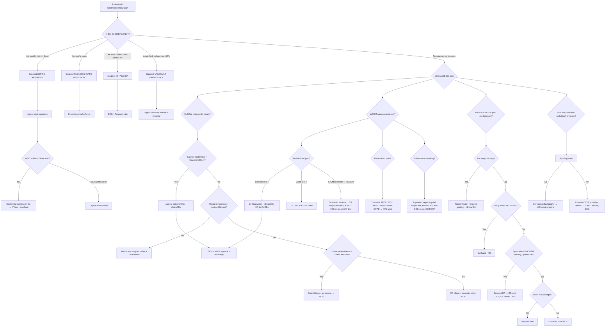

## Diagnostic Criteria, Algorithm and Investigation Modalities

### 1. General Principles — Why We Investigate

Most conditions causing hand/wrist/elbow pain are **clinical diagnoses** — that is, history and examination alone are sufficient to make a working diagnosis. Investigations serve three purposes:

1. **Confirm** the clinical impression (e.g. NCS for CTS).
2. **Exclude serious mimics** (e.g. XR to rule out fracture or malignancy; joint aspiration to rule out septic arthritis).
3. **Guide management** (e.g. severity grading on NCS determines surgical vs. conservative approach; crystal analysis dictates gout vs. CPPD treatment).

The ***key investigations*** recommended by Murtagh for arm/hand pain [1] are:

> ***FBE (full blood examination)***
> ***ESR/CRP***
> ***Consider ECG, nerve conduction studies, plain X-ray according to the rule "if in doubt, X-ray and compare both sides", ultrasound for soft tissue injuries (e.g. tendonopathy)*** [1]

---

### 2. Diagnostic Criteria for Key Conditions

Most hand/wrist/elbow conditions lack formal "criteria" the way RA or gout do — they are diagnosed clinically. However, several important conditions **do** have established diagnostic or classification criteria. Here they are:

#### 2.1 Carpal Tunnel Syndrome (CTS)

CTS is a ***clinical diagnosis*** [2], but nerve conduction studies provide objective confirmation.

**Clinical diagnostic features** (a combination of):
- ***Pain and numbness in the distribution of the median nerve (first 3½ digits)*** [2]
- ***Thenar area spared*** — because the palmar cutaneous branch of the median nerve branches **proximal** to the flexor retinaculum [2]
- ***Worse at night, relieved by hanging over the side of bed or shaking*** [2]
- ***Thenar muscle wasting*** and weakness of thumb abduction (late) [2]
- Positive provocative tests: **Phalen's test**, **Tinel's sign**, **Durkin's compression test**

**NCS criteria for CTS** (electrophysiological confirmation):
| Parameter | Finding in CTS | Why? |
|---|---|---|
| Distal motor latency (median nerve) | Prolonged ( > 4.2 ms) | Demyelination at the carpal tunnel slows conduction across the compressed segment |
| Sensory nerve conduction velocity | Slowed across the wrist | Same reason — focal demyelination at the tunnel |
| Compound muscle action potential (CMAP) amplitude | Reduced (late) | Axonal loss → fewer motor units firing |
| Comparison with ulnar nerve | Median delayed relative to ulnar | The ulnar nerve does NOT pass through the carpal tunnel, so serves as an internal control |

<Callout title="NCS in CTS — The Nuance" type="error">
***Normal conduction does not rule out CTS*** [2]. Early or mild CTS may have normal NCS because demyelination hasn't progressed enough to affect conduction velocities measurably. Always treat the **patient**, not the NCS result. However, ***NCS demonstrating axonal loss is an indication for surgery*** [2].
</Callout>

**Indications for surgery based on NCS/clinical findings** [2]:
- CTS ***unresponsive to conservative treatment for 6 weeks***
- Associated ***sensory/motor deficit***
- ***Axonal loss on NCS***

#### 2.2 Rheumatoid Arthritis (2010 ACR/EULAR Classification Criteria)

RA commonly presents in the hands/wrists. The 2010 criteria are scored (≥ 6/10 = classified as RA):

| Domain | Score |
|---|---|
| **Joint involvement**: 1 large joint (0); 2–10 large joints (1); 1–3 small joints (2); 4–10 small joints (3); > 10 joints incl ≥ 1 small (5) | 0–5 |
| **Serology**: RF and anti-CCP both negative (0); low-positive RF or anti-CCP (2); high-positive RF or anti-CCP (3) | 0–3 |
| **Acute phase reactants**: normal CRP and ESR (0); abnormal CRP or ESR (1) | 0–1 |
| **Duration of symptoms**: < 6 weeks (0); ≥ 6 weeks (1) | 0–1 |

*Requires ≥ 1 joint with definite clinical synovitis not better explained by another disease.*

**Key hand/wrist features** [3][5]:
- ***Classically starts in MCP, PIP, wrists and MTP joints and spares DIP*** [5]
- ***Symmetrical*** involvement
- Morning stiffness > 30 minutes

#### 2.3 Gout (2015 ACR/EULAR Classification Criteria)

Applicable when septic arthritis has been excluded and MSU crystals have not been demonstrated (if crystals are found, the diagnosis is confirmed without needing the criteria).

**Sufficient criterion**: Detection of MSU crystals in a symptomatic joint/bursa → **diagnostic, score not needed**.

**Classification criteria** (≥ 8 points = classified as gout) [4]:

| Domain | Finding | Score |
|---|---|---|
| **Pattern of joint involvement** | Ankle or midfoot (1); 1st MTP (2) | 0–2 |
| **Characteristics of episode** | Erythema, can't bear touch, great difficulty walking (each present = +1, max 3) | 0–3 |
| **Time course** | Max pain < 24h (0.5); resolution ≤ 14 days (0.5); complete resolution between episodes (1) | 0–2 |
| **Clinical evidence of tophi** | Present (4) | 0–4 |
| **Serum urate** | < 4 mg/dL (−4); 4– < 6 (0); 6– < 8 (2); 8– < 10 (3); ≥ 10 (4) | −4 to 4 |
| **Imaging: urate deposition** | ***USG: double contour sign or DECT demonstrating urate deposition*** (4) | 0–4 |
| **Imaging: gout-related damage** | ***XR hands/feet showing ≥ 1 erosion*** (4) | 0–4 |

Note: gout ***also affects small hand joints, wrist, elbow*** — not just the 1st MTP [4].

**Joint fluid analysis — the gold standard**:
- ***MSU crystals: elongated needle-shaped, negative birefringent crystals ± engulfment by PMN*** [4][5]
- CPPD crystals: ***pleomorphic or rhomboid shaped, weakly positive birefringence*** [5]

#### 2.4 Lateral and Medial Epicondylitis

These are purely ***clinical diagnoses*** [2]. No formal criteria exist, but the diagnosis rests on:

**Lateral epicondylitis** [2]:
- ***Elbow pain radiating down the forearm, worsens over weeks to months***
- ***Local tenderness on palpation of the lateral epicondyle***
- ***Cozen's test positive***: pronate + radially deviate forearm → extend wrist against resistance → pain at lateral epicondyle
- ***Mill's test positive***: pronate forearm, flex wrist, and extend elbow → pain at lateral epicondyle
- ***Investigations: clinical diagnosis; USG or MRI to detect any structural abnormalities*** [2]

**Medial epicondylitis**: Similar — tenderness at medial epicondyle, pain on resisted wrist flexion; check for ***associated ulnar nerve neuropathy*** [2].

#### 2.5 De Quervain's Tenosynovitis

***Clinical diagnosis; plain hand XR to r/o DDx*** [2].

Diagnostic triad:
1. ***Pain near the base of thumb + swelling*** [2]
2. ***Finkelstein's test positive: acute pain at the radial styloid process and along EPB/APL tendons when thumb is grasped and sharply deviated towards the ulnar side*** [2]
3. Tenderness specifically over the 1st extensor compartment

#### 2.6 Trigger Finger — Green's Classification

Clinical diagnosis graded by severity [2]:

| Grade | Description | Implication |
|---|---|---|
| ***I*** | ***Palm pain and tenderness at A1 pulley*** | Conservative management |
| ***II*** | ***Catching of digit, can actively extend*** | Steroid injection |
| ***III*** | ***Locking of digit, passively correctable*** | Steroid injection; consider surgery |
| ***IV*** | ***Fixed flexion deformities*** | Surgical release required |

#### 2.7 Septic Arthritis

No formal "scoring criteria" but the clinical rule is:

> ***Hot, swollen, tender joint = septic arthritis until proven otherwise, even without fever, ↑WBC, ↑ESR/CRP*** [3]

**Joint fluid analysis** is **mandatory** if septic arthritis is suspected [5]:

| Parameter | Non-inflammatory | Inflammatory | Septic |
|---|---|---|---|
| Appearance | Clear, yellow | Translucent, yellow-green | Opaque, purulent |
| Viscosity | High | Low | Very low |
| WBC count (/mL) | < 2,000 | 2,000–50,000 | > 50,000 (often > 100,000) |
| Neutrophils | < 25% | > 50% | > 90% |
| Gram stain | Negative | Negative | Positive (60–80%) |
| Culture | Negative | Negative | Positive (if not pre-treated) |

---

### 3. Diagnostic Algorithm

The algorithm below represents the step-by-step approach to a patient presenting with hand/wrist/elbow pain. It integrates the Murtagh framework [1] with condition-specific investigations.

<Callout title="The Diagnostic Rule for Night Pain — A Murtagh Pearl" type="idea">

***The working rule for arm pain causing sleep disturbance*** [1]:
- ***Thoracic outlet syndrome: patient cannot fall asleep*** (because lying down compresses the thoracic outlet)
- ***Carpal tunnel syndrome: wakes in the middle of the night then settles*** (wrist flexion during sleep ↑ tunnel pressure; waking + shaking relieves it)
- ***Cervical spondylosis: wakes patient with pain that persists*** (nerve root compression from positional changes during sleep; no positional relief)

This simple rule can help you differentiate three common causes of nocturnal arm pain before ordering a single investigation.
</Callout>

---

### 4. Investigation Modalities — Detailed Breakdown

#### 4.1 Blood Tests

| Test | When to order | Key findings and interpretation |
|---|---|---|
| ***FBE (CBC)*** [1] | Any suspected inflammatory, infective, or systemic cause | ↑WBC (neutrophilia) → infection/gout flare; ↓Hb → chronic disease (RA, malignancy); ↑platelets → reactive (inflammatory arthritis) |
| ***ESR/CRP*** [1][5] | Any inflammatory or infective condition | ↑ESR/CRP → inflammatory (RA, crystal, septic) vs. normal → mechanical (OA, tendinopathy). **CRP usually normal/mildly ↑ in SLE** [5]. CRP is more specific for active inflammation; ESR is affected by age, anaemia, pregnancy |
| Serum urate | Suspected gout | Elevated in chronic gout BUT ***can be normal or low during an acute flare (12–43% normal/↓)*** → ***should be deferred to ≥ 2 weeks after resolution*** [4] |
| RF + anti-CCP | Suspected RA | ***RF: anti-IgG IgM antibody, positive in ~70% RA*** (not sensitive, not specific — also positive in infections, other autoimmune disease, elderly). ***Anti-CCP: more specific (~95%) for RA*** [5] |
| ANA, anti-ENA, C3/C4 | Suspected SLE | ANA screening; anti-dsDNA, anti-Sm for SLE; complement consumption (↓C3/C4) in active disease |
| HbA1c | CTS, trigger finger, frozen shoulder, Dupuytren's | Screen for ***DM*** — a common underlying cause of soft-tissue entrapment syndromes [2] |
| TFTs | CTS | Screen for ***hypothyroidism*** → myxoedematous soft tissue swelling → carpal tunnel pressure ↑ [2] |
| Blood cultures | Suspected septic arthritis | Positive in ~50% of non-gonococcal septic arthritis; essential before starting antibiotics |
| Cardiac enzymes (Troponin) | Left arm pain + cardiac risk factors | ***Elevated troponin*** = myocardial injury. Rule out MI before attributing arm pain to MSK [1] |

#### 4.2 Plain Radiography (X-ray)

> ***Plain X-ray: if in doubt, X-ray and compare both sides*** [1]

**Why XR first?** XR has the ***highest spatial resolution*** of all imaging modalities [11] — excellent for detecting bony pathology (fractures, erosions, osteophytes, calcifications). It is readily available, inexpensive, and usually the first-line imaging study.

**Limitations**: XR ***can only distinguish four densities — calcium, water (soft tissue), fat, and air*** [11]. Therefore it is ***poor for soft tissue lesions*** (tendons, ligaments, nerves, cartilage).

| Condition | XR views | Key findings |
|---|---|---|
| **OA hand** | PA hand | Joint space narrowing (JSN), subchondral sclerosis, osteophytes (Heberden's/Bouchard's), subchondral cysts. 1st CMC: "squared" trapezium |
| **RA hand/wrist** | PA + lateral hand | Soft tissue swelling (early), periarticular osteopaenia (early), ***joint space narrowing, periarticular erosions*** (late), subluxations, ankylosis. ***Typically MCP/PIP/wrist; spares DIP*** |
| **Gout** | PA hand/foot | ***XR hands/feet showing ≥ 1 erosion*** [4]: "rat-bite" / punched-out erosions with overhanging edges and sclerotic borders; periarticular soft tissue tophi; joint space preserved until late. Typically normal in acute flare |
| **CPPD** | PA wrist/knee | ***Chondrocalcinosis***: linear calcification in hyaline cartilage (parallel to bone) and fibrocartilage (e.g. TFCC at wrist, menisci at knee) [4]. May also see OA-like changes |
| **Scaphoid fracture** | AP, lateral, ***scaphoid view (30° wrist extension, 20° ulnar deviation)*** [2] | Fracture line across scaphoid waist (may be subtle initially). If ***high clinical suspicion but negative XR → thumb splint + repeat XR in 14 days*** or ***MRI wrist*** [2] |
| **Epicondylitis** | AP + lateral elbow | Usually **normal**. May show calcification at tendon insertion or loose bodies in chronic cases. Mainly used to rule out OA elbow, fracture |
| **Pancoast tumour** | ***CXR*** [1] | Apical lung mass ± rib erosion ± mediastinal widening |
| **Cervical spondylosis** | Lateral + AP C-spine | Disc space narrowing, osteophytes, neural foraminal narrowing. Not sensitive for disc herniation (need MRI) |
| **Kienbock's disease** | PA + lateral wrist | Sclerosis → fragmentation → collapse of the lunate (Lichtman staging) |

<Callout title="Special XR Views You Must Know">
- ***Scaphoid view*** (30° extension, 20° ulnar deviation): elongates the scaphoid to reveal fracture lines hidden by foreshortening on standard views [2][11].
- **Ball-catcher's view** (Nørgaard view, semi-supinated oblique): for early erosions in RA — shows the radial margins of the MCP joints which are the first sites of erosion.
- **Carpal tunnel view** (tangential): shows the carpal tunnel contents projected en face — useful for hook of hamate fracture or calcification within the tunnel.
</Callout>

#### 4.3 Ultrasound (USG)

> ***Ultrasound for soft tissue injuries (e.g. tendonopathy)*** [1]

**Why USG?** It is dynamic (can assess tendons during movement), radiation-free, inexpensive, and widely available. It is **excellent for soft tissue** — tendons, tendon sheaths, effusions, cysts, nerve thickening.

| Condition | USG findings |
|---|---|
| **Epicondylitis** | Tendon thickening, hypoechoic areas (degeneration), increased Doppler signal (neovascularisation), calcification, partial/full-thickness tears |
| **De Quervain's** | Thickened 1st extensor compartment retinaculum, tendon sheath fluid, thickened APL/EPB tendons |
| **Trigger finger** | Thickened A1 pulley ( > 1 mm), tendon nodule, restricted tendon gliding on dynamic assessment |
| **CTS** | ***Swollen median nerve (cross-sectional area > 10 mm² at tunnel inlet)***, flattening at tunnel, flexor retinaculum bowing |
| **RA** | Synovial hypertrophy (pannus), joint effusion, ***power Doppler signal = active synovitis***, erosions (more sensitive than XR for early erosions) |
| **Gout** | ***Double contour sign: hyperechoic irregular band overlying the surface of joint cartilage*** [4] — represents MSU crystal deposition on the articular cartilage surface |
| **Ganglion cyst** | ***Well-defined margins, thick wall with acoustic enhancement*** [2] — the cyst contents are fluid → posterior acoustic enhancement is expected |
| **Tendon rupture** | Discontinuity of tendon fibres, retracted tendon stump, haematoma |
| **Septic arthritis** | Joint effusion ± synovial thickening; can guide aspiration |

#### 4.4 Nerve Conduction Studies (NCS) and Electromyography (EMG)

> ***Consider nerve conduction studies*** [1]

NCS/EMG are the key investigations for ***entrapment neuropathies*** — the "pitfalls often missed" in Murtagh's framework [1].

**Principle** [8]:
- **NCS**: percutaneous electrical stimulation of a peripheral nerve → record the generated impulse distally. Measures conduction velocity, distal latency, and amplitude.
- **EMG**: needle recording of bioelectric activity in muscles. Detects denervation (fibrillations, positive sharp waves) and reinnervation (polyphasic units).

**NCS is useful for** [8]:
- ***Differentiation between focal and multifocal neuropathy***
- ***Differentiation between demyelinating and axonal neuropathy***
- ***Assessment of severity***
- ***Monitor progress and response to treatment***
- ***Prognostication after nerve trauma***

**NCS is NOT useful for** [8]:
- ***Exclude or confirm neuropathy/myopathy (clinical findings should suffice)***
- ***Cervical myelopathy (does NOT assess CNS function)***
- ***Define aetiology of peripheral neuropathy***

| Condition | NCS/EMG findings | Clinical significance |
|---|---|---|
| **CTS** | Prolonged distal motor latency; slowed sensory conduction across wrist; ↓CMAP amplitude if axonal loss | Severity grading: mild (sensory only) → moderate (motor + sensory) → severe (axonal loss). ***Axonal loss = surgical indication*** [2] |
| **Cubital tunnel** | Slowed motor conduction across the elbow segment; ↓CMAP amplitude of ADM/FDI; fibrillations in ulnar-innervated muscles on EMG | Localises the lesion to the elbow (vs. Guyon's canal, vs. C8/T1 root) |
| **Cervical radiculopathy** | ***NCS often normal*** (the lesion is proximal to the dorsal root ganglion, so sensory NCS is preserved); EMG shows denervation in a myotomal distribution | This is the key differentiator: in CTS, NCS is abnormal at the wrist; in radiculopathy, NCS is normal but EMG shows segmental denervation |
| **TOS (nTOS)** | May show ↓SNAP of medial antebrachial cutaneous nerve; ↓CMAP of ulnar nerve | Often normal or equivocal — nTOS remains a clinical diagnosis in many cases |

<Callout title="CTS vs. Radiculopathy on NCS">
The single most important NCS finding to differentiate CTS from C6/C7 radiculopathy:
- **CTS**: median sensory NCS abnormal at the wrist (prolonged latency, reduced amplitude) — the lesion is at the wrist.
- **C6/C7 radiculopathy**: sensory NCS normal at the wrist — the lesion is proximal to the dorsal root ganglion (DRG), so the peripheral sensory axon remains intact (Wallerian degeneration does not occur because the cell body in the DRG is still connected to the distal axon).
</Callout>

#### 4.5 MRI

**When to order**: MRI is the investigation of choice for **soft tissue detail** (tendons, ligaments, cartilage, nerves, spinal cord) and when initial XR is non-diagnostic.

| Condition | MRI indication | Key findings |
|---|---|---|
| **Scaphoid fracture (occult)** | ***High clinical suspicion but negative initial XR*** [2] | Bone marrow oedema (T1 low, T2/STIR high) at fracture site — MRI sensitivity ~100% |
| **Cervical radiculopathy/myelopathy** | Persistent radicular symptoms, myelopathic signs, pre-surgical planning | Disc herniation, foraminal stenosis, cord compression, cord signal change (T2 high = myelomalacia) |
| **Kienbock's disease** | Early detection before XR changes | AVN of lunate: T1 low signal (loss of marrow fat), T2 variable |
| **TFCC injury** | Ulnar wrist pain with equivocal clinical exam | Tear seen as high signal within the normally low-signal TFCC on T2/PD sequences |
| **Epicondylitis (refractory)** | Failure of conservative treatment > 6 months | Tendon thickening, intrasubstance signal change, partial/complete tear |
| **Soft tissue mass** | Atypical ganglion or suspected malignancy | Characterise mass: cystic (ganglion) vs. solid (tumour); gadolinium enhancement suggests malignancy |
| **Frozen shoulder** | Rule out other pathology (rotator cuff, SAIS) | ***Thickened joint capsule*** [2], particularly at the rotator interval; axillary pouch thickening |

#### 4.6 CT and DECT (Dual-Energy CT)

| Modality | Indication | Key findings |
|---|---|---|
| CT (with 3D reconstruction) | Complex fractures (distal radius, carpal), pre-operative planning | Precise fracture geometry, fragment displacement, comminution |
| ***DECT*** | ***Demonstrating urate deposition in gout*** [4] | Colour-coded urate crystal deposits around joints/tendons — highly specific; used in 2015 ACR/EULAR gout criteria |
| CT angiogram | ***TOS (arterial/venous)*** [2] | Subclavian artery/vein compression during provocative positioning; thrombus visualisation |

#### 4.7 Joint Aspiration and Synovial Fluid Analysis

> ***Joint fluid analysis: MOST IMPORTANT TEST*** when septic or crystal arthritis is suspected [5]

**Indications** [5]:
- ***Suspicious of septic arthritis***
- ***Suspicious of crystal-induced arthritis***
- ***Suspicious of haemarthrosis***
- ***Differentiating inflammatory vs. non-inflammatory arthritis***

**What to send** [5]:
- ***Macroscopic: colour, viscosity, turbidity***
- ***Microscopy: wet films, WBC count/differential, crystal microscopy***
- ***Microbiology: Gram stain (urgent), bacterial culture, AFB smear/culture if indicated***

**Interpretation table** [5]:

| Parameter | Normal | Non-inflammatory (e.g. OA) | Inflammatory (e.g. RA, gout) | Septic |
|---|---|---|---|---|
| Colour | Clear, colourless | Clear, straw/yellow | Translucent, yellow-green | Opaque, yellow-green, purulent |
| Viscosity | High | High | Low (enzymes degrade hyaluronic acid) | Very low |
| WBC (/mL) | < 200 | < 2,000 | 2,000–50,000 | > 50,000 (often > 100k) |
| PMN % | < 25% | < 25% | > 50% | > 90% |
| Crystal microscopy | None | None | ***Gout: needle-shaped, strongly negative birefringent; CPPD: rhomboid, weakly positive birefringent*** [5] | Usually none (but crystals + infection can coexist) |
| Gram stain | Negative | Negative | Negative | Positive in 60–80% |
| Culture | Negative | Negative | Negative | Positive (diagnostic) |

<Callout title="Crystals + Infection Can Coexist" type="error">
Finding crystals in joint fluid does **NOT** exclude septic arthritis. Up to 1–2% of patients with gout have concurrent infection. ***Always send Gram stain and culture even if crystals are identified***, especially if the clinical picture is atypical (e.g. prolonged fever, lack of improvement with anti-inflammatory treatment).
</Callout>

#### 4.8 Other Investigations

| Investigation | When | Findings |
|---|---|---|
| ***ECG*** [1] | Left arm pain, cardiac risk factors | ST elevation/depression, T-wave inversion, new LBBB → ACS. Normal ECG does not exclude ACS — serial ECGs needed |
| ***CXR*** [1][2] | Suspected Pancoast tumour; TOS (cervical rib); shoulder pathology | Apical mass (Pancoast); cervical rib (TOS); calcific tendinopathy of shoulder |
| ***Doppler USG*** [2] | TOS (vascular); axillary vein thrombosis | Non-compressible vein (DVT); absent/reduced flow in subclavian artery (aTOS); vein distension (vTOS) |
| Bone scan (99mTc) | Occult fracture, osteomyelitis, metastasis, CRPS | Increased uptake at fracture/infection/tumour sites; three-phase positive in CRPS |
| Arthroscopy | Diagnostic when imaging equivocal; therapeutic | ***Direct vision: assess cartilage damage, synovial biopsy, debridement, removal of loose bodies*** [5] |

---

### 5. Summary — Which Investigation for Which Condition?

| Condition | First-line investigation | Confirmatory / Second-line |
|---|---|---|
| Lateral/medial epicondylitis | ***Clinical diagnosis*** [2] | USG or MRI if refractory |
| De Quervain's | ***Clinical diagnosis; plain XR to r/o DDx*** [2] | USG for tendon detail |
| Trigger finger | ***Clinical diagnosis*** [2] | USG (dynamic) if equivocal |
| CTS | ***Clinical diagnosis*** [2]; ***NCS*** | USG (nerve swelling); MRI (mass lesion) |
| Cubital tunnel | Clinical + NCS | MRI elbow if mass suspected |
| Scaphoid fracture | ***XR: AP, lateral, scaphoid view*** [2] | ***MRI if XR negative + high suspicion*** [2] |
| OA hand | XR hand (PA) | N/A — clinical + XR sufficient |
| RA | Bloods (RF, anti-CCP, ESR/CRP) + XR hands/feet | USG (early erosions, synovitis); MRI |
| Gout (acute) | Joint aspiration (crystal analysis) | Bloods (urate deferred 2 weeks); USG (double contour); DECT |
| CPPD | XR (chondrocalcinosis); joint aspiration | Bloods to screen for metabolic causes (Ca, PO4, Mg, Fe studies, PTH) |
| Septic arthritis | ***Urgent joint aspiration + Gram stain + culture*** | Blood cultures; bloods (WCC, CRP); XR to rule out osteomyelitis |
| TOS | ***CXR, Doppler USG*** [2], NCS | CT angiogram; MRI |
| Pancoast tumour | ***CXR*** [1] | CT thorax with contrast; biopsy |
| MI/Angina | ***ECG + Troponin*** [1] | Coronary angiography |

---

<Callout title="High Yield Summary">

1. Most hand/wrist/elbow conditions are **clinical diagnoses**. Investigations are to confirm, exclude serious mimics, or guide management.

2. ***Key investigations (Murtagh)***: FBE, ESR/CRP, ECG, NCS, plain XR ("if in doubt, X-ray and compare both sides"), USG for soft tissue [1].

3. ***CTS***: clinical diagnosis + NCS for confirmation. Normal NCS does not rule it out. Axonal loss on NCS = surgical indication [2].

4. ***Joint aspiration = MOST IMPORTANT TEST*** for acute monoarthritis [5]. Must send crystal microscopy + Gram stain + culture. Gout: needle-shaped, negative birefringent. CPPD: rhomboid, weakly positive birefringent.

5. ***Scaphoid fracture***: XR (incl. scaphoid view) first → if negative but clinically suspected → thumb splint + repeat XR 14 days OR MRI [2].

6. ***Gout imaging criteria***: USG double contour sign or DECT urate deposition; XR erosion with overhanging edges [4].

7. ***Murtagh's nocturnal pain rule***: TOS = can't fall asleep; CTS = wakes mid-night then settles; cervical spondylosis = wakes and persists [1].

8. ***RA***: XR hands/feet (erosions, JSN, periarticular osteopaenia); bloods (RF, anti-CCP, ESR/CRP); USG (early erosions, active synovitis with power Doppler). 2010 ACR/EULAR criteria ≥ 6/10 [3][5].

9. ***NCS localises entrapment***: CTS → prolonged distal latency at wrist; cubital tunnel → slowed across elbow; radiculopathy → NCS normal at wrist, EMG shows myotomal denervation [8].

10. ***Crystals + infection can coexist*** — always send culture even if crystals found.

</Callout>

---

<ActiveRecallQuiz
  title="Active Recall - Diagnosis and Investigations for Hand/Wrist/Elbow Pain"
  items={[
    {
      question: "A patient with suspected CTS has a normal NCS. Does this exclude the diagnosis? What NCS finding would make you recommend surgery?",
      markscheme: "Normal NCS does not rule out CTS (early/mild disease may have normal NCS). Axonal loss on NCS (reduced CMAP amplitude) is an indication for surgical carpal tunnel release, along with failure of conservative treatment for 6 weeks or associated sensory/motor deficit."
    },
    {
      question: "Name the crystal microscopy findings that distinguish gout from CPPD on joint fluid analysis.",
      markscheme: "Gout: elongated needle-shaped crystals, strongly negatively birefringent under polarised light. CPPD: pleomorphic or rhomboid-shaped crystals, weakly positively birefringent. Both may show PMN engulfment."
    },
    {
      question: "State Murtagh's working rule for nocturnal arm pain: what sleep disturbance pattern suggests TOS, CTS, and cervical spondylosis respectively?",
      markscheme: "TOS: patient cannot fall asleep. CTS: wakes in the middle of the night then settles. Cervical spondylosis: wakes with pain that persists."
    },
    {
      question: "A patient with high clinical suspicion for scaphoid fracture has a normal initial XR. What two options do you have?",
      markscheme: "Option 1: Apply thumb spica splint and repeat XR in 14 days (bone resorption at fracture line makes it more visible). Option 2: MRI wrist (sensitivity approaches 100% for occult scaphoid fracture with bone marrow oedema on STIR sequences)."
    },
    {
      question: "What is the single MOST IMPORTANT test when acute monoarthritis presents with a hot swollen joint? What three things must you send the fluid for?",
      markscheme: "Joint aspiration and synovial fluid analysis. Send for: 1. Macroscopic appearance (colour, viscosity, turbidity), 2. Microscopy (WBC count, differential, crystal microscopy under polarised light), 3. Microbiology (Gram stain urgently, bacterial culture, AFB if indicated)."
    },
    {
      question: "How does NCS differentiate CTS from C6/C7 cervical radiculopathy?",
      markscheme: "CTS: median sensory NCS is abnormal at the wrist (prolonged distal latency, reduced amplitude) because the lesion is at the carpal tunnel. C6/C7 radiculopathy: sensory NCS is normal at the wrist because the lesion is proximal to the dorsal root ganglion (the DRG cell body maintains the distal axon intact). EMG in radiculopathy shows denervation in a myotomal distribution."
    }
  ]}
/>

---

## References

[1] Lecture slides: murtagh merge.pdf (p19–20, Arm and hand pain)
[2] Senior notes: maxim.md (Sections on epicondylitis, De Quervain's, trigger finger, CTS, cubital tunnel, scaphoid fracture, frozen shoulder, ganglion cyst)
[3] Senior notes: Ryan Ho Rheumatology.pdf (Section 2.6 RA, Section 2.8 Septic arthritis)
[4] Senior notes: Ryan Ho Rheumatology.pdf (Sections 2.4.1 Gout, 2.4.2 CPPD — including 2015 ACR/EULAR criteria)
[5] Senior notes: Ryan Ho Fundamentals.pdf (p407–410, Approach to monoarthritis/polyarthritis — joint fluid analysis, physical examination, initial investigations)
[8] Senior notes: Ryan Ho Neurology.pdf (p38, Electrodiagnostic Studies; p178, Approach to generalised weakness)
[11] Senior notes: Ryan Ho Diagnostic Radiology.pdf (p13, Plain Film Radiography)
