# Hand / Wrist / Elbow Pain

## 1. Definition and Scope

"Hand/wrist/elbow pain" is not a single disease — it is a **presenting complaint** that encompasses a broad differential of musculoskeletal, neurological, vascular, and referred conditions affecting the upper limb from the elbow to the fingertips. The clinical task is to localise the anatomical source, determine the pathological process (mechanical, inflammatory, compressive, vascular, infective, or neoplastic), and arrive at the correct diagnosis.

> The breakdown of the term is intuitive: we are dealing with pain ("algos" in Greek) in three linked kinetic segments — the **elbow** (a hinge–pivot joint), the **wrist** (an ellipsoid joint complex), and the **hand** (a series of condyloid and hinge joints). Because they share continuous tendon units, nerve trunks, and vascular channels, pathology in one segment frequently radiates to or mimics pathology in another.

---

## 2. Epidemiology and Risk Factors

### 2.1 Epidemiology

| Condition | Prevalence / Incidence | Key demographics |
|---|---|---|
| ***Carpal tunnel syndrome*** | Most common entrapment neuropathy; prevalence ~3–5% in general population | ***Aging, female*** predominance [1][2] |
| ***Lateral epicondylitis (tennis elbow)*** | Point prevalence 1–3%; ***more common*** than medial epicondylitis | Peak age 35–55 y; dominant arm [2] |
| ***Medial epicondylitis (golfer's elbow)*** | ~0.4% general population | Similar age range; ***less common*** [2] |
| ***De Quervain's tenosynovitis*** | Incidence ~0.5/1000 person-years | ***Female 30–50 y, pregnancy*** [2] |
| ***Trigger finger*** | Lifetime prevalence 2–3% | ***Elderly female***, occupation with ***prolonged gripping*** [2] |
| Osteoarthritis of hand | Radiographic OA in >50% over age 55 | F > M; 1st CMC, DIP, PIP joints |
| Rheumatoid arthritis (hand) | 0.3–0.4% in Chinese, 1–2% in Caucasians | F:M ≈ 3:1; peak onset 35–55 y [3] |
| Gout (wrist/hand/elbow) | ~1–2% overall prevalence | M >> F; 4th–5th decade in men [4] |
| Cubital tunnel syndrome | 2nd most common entrapment neuropathy | More in males, occupations with prolonged elbow flexion [2] |

### 2.2 Risk Factors — General Framework

Think of risk factors by **mechanism**:

1. **Repetitive mechanical loading** — occupational overuse (typists, housewives, manual labourers, gamers, golfers, tennis players).
2. **Inflammatory / Autoimmune** — RA, gout, CPPD, psoriatic arthritis, SLE.
3. **Endocrine / Metabolic** — ***DM, hypothyroidism***, acromegaly, ***pregnancy***, ***obesity*** (all promote soft-tissue swelling → nerve entrapment or tenosynovitis) [2][5].
4. **Anatomical / Congenital** — cervical rib (thoracic outlet syndrome), accessory muscles, anomalous fibrous bands.
5. **Post-traumatic** — prior fractures (Colles', scaphoid), dislocations, surgical scarring.
6. **Infective** — septic arthritis, tendon sheath infection, osteomyelitis.
7. **Neoplastic** — Pancoast tumour (referred), bone tumours (rare), ganglion cyst (SOL effect).

---

## 3. Relevant Anatomy and Function

Understanding the anatomy is the **key** to localising the pain. Let's build it from proximal to distal.

### 3.1 Elbow Joint

- **Type**: Modified hinge joint (flexion/extension) + pivot (pronation/supination).
- **Articulations**:
  - *Humeroulnar* (trochlea–trochlear notch of olecranon) — main hinge.
  - *Humeroradial* (capitulum–radial head) — assists flexion; transmits load.
  - *Proximal radioulnar joint (PRUJ)* — pivot for pronation/supination; radial head rotates within the annular ligament.
- **Carrying angle**: ***8–12° (male), 10–14° (female)*** — deviation from normal (cubitus valgus) predisposes to ulnar nerve stretch [2].
- **Ligaments**:
  - *Medial (ulnar) collateral ligament (MCL/UCL)*: main stabiliser against valgus stress; anterior band most important.
  - *Lateral collateral ligament (LCL)*: resists varus and posterolateral rotatory instability; includes the annular ligament.
- **Bursae**:
  - *Olecranon bursa*: superficial, prone to bursitis ("student's elbow") from repetitive trauma or gout/RA.
- **Nerves around elbow**:
  - *Ulnar nerve*: passes through the ***cubital tunnel*** (posterior to medial epicondyle, between two heads of FCU) — the most superficial major nerve at any joint, hence vulnerable.
  - *Posterior interosseous nerve (PIN)*: deep branch of radial nerve, passes through the arcade of Frohse (supinator muscle) — can be compressed here.
  - *Median nerve*: passes through the two heads of pronator teres — pronator syndrome.

### 3.2 Forearm

- **Radius and ulna** are connected by the interosseous membrane.
- **Muscles**: grouped into anterior (flexor) and posterior (extensor) compartments.
  - Anterior: flexor-pronator group arises largely from the **medial epicondyle** (common flexor origin — relevant to ***medial epicondylitis***).
  - Posterior: extensor-supinator group arises largely from the **lateral epicondyle** (common extensor origin — relevant to ***lateral epicondylitis***).

### 3.3 Wrist Joint

- **Type**: Ellipsoid (biaxial) — flexion/extension and radial/ulnar deviation.
- **Articulations**:
  - *Radiocarpal joint*: distal radius + scaphoid, lunate, triquetrum.
  - *Distal radioulnar joint (DRUJ)*: allows pronation/supination at the distal forearm.
  - *Midcarpal joint*: between proximal and distal carpal rows.
- **Carpal bones** (mnemonic: ***She Looks Too Pretty, Try To Catch Her***):
  - Proximal row (radial to ulnar): **S**caphoid, **L**unate, **T**riquetrum, **P**isiform.
  - Distal row: **T**rapezium, **T**rapezoid, **C**apitate, **H**amate [2].
- **Carpal tunnel**: fibro-osseous tunnel on the palmar side.
  - *Roof*: flexor retinaculum (transverse carpal ligament).
  - *Floor*: carpal bones (concavity formed by scaphoid tubercle, trapezium laterally; hook of hamate, pisiform medially).
  - *Contents*: median nerve + 4 FDS tendons + 4 FDP tendons + FPL tendon (9 tendons + 1 nerve). The ***median nerve is the most superficial structure*** and therefore the first to be compressed.
- **Guyon's canal** (ulnar tunnel): between pisiform and hook of hamate.
  - Contains: ulnar nerve + ulnar artery.
  - Compression here → ulnar nerve palsy (handlebars palsy in cyclists).

### 3.4 Dorsal Extensor Compartments of the Wrist

***Six extensor compartments on the dorsal aspect of the wrist, separated by fibrous septa*** [2]:

| Compartment | Tendons | Clinical relevance |
|---|---|---|
| **1st** | ***APL (abductor pollicis longus) & EPB (extensor pollicis brevis)*** | ***De Quervain's tenosynovitis*** |
| **2nd** | ECRL & ECRB | Intersection syndrome |
| **3rd** | EPL (extensor pollicis longus) | Rupture after Colles' fracture (Lister's tubercle) |
| **4th** | EDC & EIP | Extensor tenosynovitis (RA) |
| **5th** | EDM (extensor digiti minimi) | |
| **6th** | ECU (extensor carpi ulnaris) | ECU tendinopathy |

### 3.5 Hand — The Flexor Pulley System

The pulley system is critical for understanding **trigger finger**:

- **Function**: Pulleys hold the flexor tendons close to the phalanges, preventing "bowstringing" during finger flexion.
- **Structure**: 5 annular pulleys (A1–A5) and 3 cruciate pulleys (C1–C3).
  - ***A1 pulley overlies the MCP joint*** — this is the most common site of stenosis in trigger finger [2].
  - A2 and A4 are the most biomechanically important for preventing bowstringing.

### 3.6 Nerve Supply of the Hand

| Nerve | Motor | Sensory | Clinical test |
|---|---|---|---|
| Median | Thenar muscles (LOAF = Lumbricals 1&2, Opponens pollicis, Abductor pollicis brevis, Flexor pollicis brevis superficial head) | Palmar: lateral 3.5 digits; Dorsal: tips of same | Abductor pollicis brevis strength; pen-touching test |
| Ulnar | Hypothenar muscles, interossei, medial 2 lumbricals, adductor pollicis | Medial 1.5 digits (palmar and dorsal) | Froment's sign (tests adductor pollicis) |
| Radial (superficial) | Nil intrinsic hand muscles | Dorsum of hand (1st web space) — "anatomical snuffbox" area | Sensory only in hand |

<Callout title="Why does median nerve compression cause thenar wasting but not hypothenar?">
Because the median nerve supplies LOAF muscles (all in the thenar eminence and radial lumbricals). The ulnar nerve supplies everything else intrinsic to the hand. In carpal tunnel syndrome, the median nerve is compressed under the flexor retinaculum, so only its territory is affected.
</Callout>

---

## 4. Etiology (Focused on Hong Kong Context) and Pathophysiology

***Murtagh's diagnostic strategy*** for arm and hand pain organises causes by clinical likelihood [1]:

### 4.1 Probability Diagnoses (Common — the ones you'll see most in clinic)

| Diagnosis | Pathophysiology |
|---|---|
| ***Dysfunction of the cervical spine (lower)*** | C5–C8 radiculopathy → referred pain to arm/hand via dermatomal distribution. Disc herniation or spondylosis compresses nerve roots in the neural foramen. |
| ***Disorders of the shoulder*** | Rotator cuff pathology or adhesive capsulitis → pain radiates distally. The brain poorly localises deep somatic pain, so shoulder pathology is "felt" in the upper arm/elbow. |
| ***Medial or lateral epicondylitis*** | Repetitive overuse → micro-tears at tendon origin → ***chronic inflammation*** → angiofibroblastic degeneration (actually a tendinopathy more than a true "-itis") [2]. |
| ***Overuse tendonopathy of the wrist*** | De Quervain's, intersection syndrome, ECU tendinopathy — repetitive motion causes frictional inflammation within tendon sheaths. |
| ***Carpal tunnel syndrome*** | Anything that ↑ pressure within the carpal tunnel (oedema, tenosynovitis, mass) → median nerve compression → ischaemia of nerve → paraesthesia, pain, then motor loss. |
| ***Osteoarthritis of the thumb (1st CMC) and DIP joints*** | Mechanical wear → cartilage loss → subchondral sclerosis → osteophyte formation. Heberden's (DIP) and Bouchard's (PIP) nodes are bony osteophytes [5]. |

### 4.2 Serious Disorders Not To Be Missed

| Category | Diagnoses | Why it matters |
|---|---|---|
| ***Cardiovascular*** | ***Angina (referred), myocardial infarction, axillary vein thrombosis, arm claudication (left arm)*** | MI can present as isolated left arm pain. Visceral afferents from the heart enter the spinal cord at T1–T4, converging with somatic afferents from the left arm → referred pain. |
| ***Infection*** | ***Septic arthritis (shoulder/elbow), osteomyelitis, infections of tendon sheath and fascial spaces of hand, sporotrichosis ("gardener's arm")*** | Tendon sheath infections (esp. flexor tenosynovitis) can destroy the flexor tendon and spread along the Parona space. ***Kanavel's signs*** are cardinal: fusiform swelling, flexed posture, tenderness along sheath, pain on passive extension. |
| ***Neoplasia*** | ***Pancoast tumour, bone tumours (rare)*** | A Pancoast tumour (apical lung SCC) invades the brachial plexus (C8–T1) → shoulder/arm/hand pain with Horner's syndrome. Always do a CXR if pain is atypical. |

<Callout title="Don't Miss This" type="error">
***Left arm pain + jaw pain + diaphoresis → think MI first***, even in a young patient. In Hong Kong, where ischaemic heart disease is a leading cause of mortality, always rule out cardiac causes of arm pain before attributing it to MSK pathology.
</Callout>

### 4.3 Pitfalls (Often Missed)

| Diagnosis | Why it's missed |
|---|---|
| ***Entrapment neuropathies (e.g. median nerve, ulnar nerve)*** | Symptoms mimic cervical radiculopathy. Always do Tinel's/Phalen's and nerve conduction studies to localise the lesion. |
| ***Pulled elbow (children)*** | "Nursemaid's elbow" — subluxation of the radial head from the annular ligament when a child is pulled by the forearm. The child holds the arm pronated and slightly flexed, refuses to use it. Easily reduced by supination-flexion manoeuvre. |

---

## 5. Detailed Etiology and Pathophysiology by Condition

### 5.1 Lateral Epicondylitis ("Tennis Elbow")

> ***Lateral epicondylitis (tennis elbow): more common*** [2]

**Etymology**: "epi" = upon, "condyle" = knuckle-like projection, "-itis" = inflammation. Literally: inflammation upon the lateral condyle of the humerus.

**Anatomy**: The ***common extensor tendon attaches superficial extensor muscles to the lateral epicondyle***. The ECRB (extensor carpi radialis brevis) is the most commonly affected tendon — its deep fibres rub against the lateral epicondyle and capitulum during wrist extension with the elbow extended [2].

**Pathophysiology**:
1. Repetitive wrist extension and forearm supination → micro-tears at the ECRB origin.
2. Failed healing → angiofibroblastic degeneration (disorganised collagen, fibroblastic proliferation, neovascularisation without significant inflammatory cells).
3. This is actually a **tendinosis** (degenerative) rather than a true tendinitis (inflammatory) — but the name persists.

**Risk factors**: ***Occupations / hobbies that require excessive use of forearm muscles, e.g. tennis, golf*** [2]. Also: plumbers, painters, carpenters, computer mouse users.

### 5.2 Medial Epicondylitis ("Golfer's Elbow")

> ***Medial epicondylitis (golfer's elbow): less common*** [2]

**Anatomy**: ***Pronator teres and FCR most commonly affected*** [2]. The common flexor-pronator origin is at the medial epicondyle.

**Pathophysiology**: Same degenerative process as lateral epicondylitis but on the flexor-pronator side. Repetitive wrist flexion, forearm pronation, and grip loading cause micro-tears at the common flexor origin.

**Important association**: ***Associated ulnar nerve neuropathy*** [2] — the ulnar nerve passes just posterior to the medial epicondyle, so inflammation or swelling here can stretch or compress it. Always check ulnar nerve function in medial epicondylitis.

### 5.3 De Quervain's Tenosynovitis ("Gamer's Thumb")

> ***De Quervain's disease: stenosing tenovaginitis/tenosynovitis within the first extensor compartment of wrist (contain APL & EPB)*** [2]

**Etymology**: "teno" = tendon, "synovitis" = inflammation of synovial sheath, "stenosing" = narrowing. The tendon sheath of compartment 1 thickens and narrows, constricting the APL and EPB tendons.

**Pathophysiology**:
1. Repetitive thumb abduction/extension (e.g. texting, gaming, lifting a baby) → friction between APL/EPB tendons and their retinacular sheath.
2. Chronic irritation → fibrous thickening of the sheath ("stenosing tenovaginitis").
3. Tendons swell and cannot glide smoothly → pain and crepitus at the radial styloid.

**Risk factors** [2]:
- ***Female aged 30–50 y***
- ***Pregnancy*** (hormonal changes cause fluid retention → tendon sheath swelling)
- ***Occupation that involves repetitive movement of hand & wrist, e.g. housewife***

### 5.4 Trigger Finger

> ***Stenosing tenovaginitis of A1 pulley causing finger clicked/locked in flexion, preventing a return to extension*** [2]

**Etymology**: The finger "triggers" — it catches and then suddenly releases, like pulling a trigger.

**Pathophysiology** [2]:
1. ***Flexor tenosynovitis causes local nodal formation distal to pulley, most common A1 pulley (overlie MCP joint)***.
2. During flexion, the nodule is pulled proximal to the A1 pulley.
3. When the patient tries to extend, the swollen nodule cannot pass back through the constricted A1 pulley → finger stays flexed (***locked***).
4. With enough force, the nodule "pops" through → the characteristic click/trigger.

**Most common fingers**: ***Ring finger, middle finger, thumb*** [2].

**Risk factors** [2]:
- ***Prolonged gripping*** (e.g. golfer, mechanic, cyclist)
- ***Elderly female***
- ***Inflammation: DM, RA, gout***

**Why DM?** Diabetic patients have glycosylation of collagen in tendon sheaths → thickening and reduced gliding → higher rates of trigger finger and other stenosing tenosynovitis.

### 5.5 Carpal Tunnel Syndrome (CTS)

**Etymology**: BPPV-style breakdown: "carpal" = wrist (Greek: "karpos"), "tunnel" = the fibro-osseous channel, "syndrome" = collection of signs and symptoms.

**Risk factors** [2]:
- ***Primary (MC): aging, female***
- ***Secondary:***
  - ***Endocrine: DM, hypothyroid,*** acromegaly
  - ***Inflammatory: RA***, gout
  - ***SOL: ganglion***
  - ***Post-traumatic: wrist fracture***
  - ***Physiological: obesity, pregnancy***

**Pathophysiology**:
1. The carpal tunnel is a fixed-volume space. Anything that ↑ the volume of its contents or ↓ the tunnel size raises pressure.
2. ↑ Pressure → compression of the median nerve (the most superficial structure).
3. Compression → demyelination (early) → axonal loss (late).
4. **Sensory fibres are affected first** (they are larger myelinated fibres more susceptible to ischaemia) → paraesthesia/numbness in the lateral 3.5 digits.
5. **Motor fibres affected later** → thenar muscle weakness and wasting (APB, opponens pollicis).

**Why does hypothyroidism cause CTS?** Hypothyroidism → accumulation of glycosaminoglycans (mucopolysaccharides) in soft tissues → tendon sheath swelling within the carpal tunnel → ↑ pressure.

**Why does pregnancy cause CTS?** Fluid retention (↑ oestrogen/progesterone) → generalised soft-tissue oedema → ↑ carpal tunnel pressure. Usually resolves post-partum.

### 5.6 Cubital Tunnel Syndrome

**Etymology**: "cubital" = pertaining to the elbow (Latin: "cubitus" = elbow). The cubital tunnel is a fibro-osseous space behind the medial epicondyle where the ulnar nerve passes between the two heads of flexor carpi ulnaris.

**Pathophysiology**:
1. Elbow flexion narrows the cubital tunnel (the roof — Osborne's ligament — tightens, and the medial epicondyle moves away from the olecranon, stretching the nerve).
2. Prolonged flexion, direct pressure ("leaning on elbow"), or ***cubital valgus*** deformity → chronic compression/traction of the ulnar nerve.
3. Compression → demyelination of ulnar nerve → paraesthesia in medial 1.5 digits, weakness of intrinsic hand muscles.

**Differentiating from distal ulnar compression (Guyon's canal)** [2]:
- In cubital tunnel: ***less prominent claw hand*** (because FDP to 4th/5th fingers is also affected → can't flex DIP → less "clawing"), and ***dorsal hand sensory also affected*** (dorsal branch of ulnar nerve arises proximal to Guyon's canal).
- In Guyon's canal compression: dorsal hand sensation preserved, clawing more prominent.

<Callout title="Ulnar Paradox">
A **higher** ulnar nerve lesion (e.g. cubital tunnel) produces a **less severe** claw hand than a lower lesion (e.g. Guyon's canal). Why? Because in a high lesion, FDP to the ring and little fingers is also paralysed, so the IP joints cannot flex into the "claw" position. This is the "ulnar paradox" — the more proximal the lesion, the less the claw.
</Callout>

### 5.7 Thoracic Outlet Syndrome (TOS)

**Etymology**: "thoracic outlet" = the space between the clavicle and first rib through which the brachial plexus, subclavian artery, and subclavian vein pass.

**Risk factors**: cervical rib, fibrous bands, scalene muscle hypertrophy, repetitive microtrauma (athletes), poor posture [2].

**Classification** [2]:

| Type | Structure compressed | Signs | Treatment |
|---|---|---|---|
| ***Neurological (nTOS)*** | Lower brachial plexus | ***Lower brachial plexus injury*** (paraesthesia/weakness along ulnar distribution) | Physiotherapy ± Botox injection to relax scalene muscles |
| ***Venous (vTOS)*** | Subclavian vein | Deep vein thrombosis (Paget-Schroetter syndrome) | Thrombolysis, anticoagulation, surgical decompression |
| ***Arterial (aTOS)*** | Subclavian artery | Claudication, acute limb ischaemia | Embolectomy, surgical decompression |

**Special tests**: Adson's manoeuvre, Roos test, Elvey's test [2].

**Investigations**: ***CXR*** (cervical rib?), ***Doppler USG***, nerve conduction studies, MRI, CT angiogram [2].

### 5.8 Osteoarthritis of the Hand

- **Joints affected**: 1st CMC (base of thumb), DIP, PIP.
- ***Heberden's nodes (DIP)*** and ***Bouchard's nodes (PIP)*** = bony osteophytes [5].
- **Pathophysiology**: Mechanical wear + genetic predisposition → cartilage matrix degradation (loss of type II collagen and proteoglycans) → subchondral bone exposed → reactive new bone formation (osteophytes) → joint deformity and stiffness.
- **Grind test** (for 1st CMC OA): axially load and rotate the thumb against the trapezium → pain = positive [2].

### 5.9 Rheumatoid Arthritis — Hand Involvement

RA has a predilection for the hands and wrists. The ***pathogenesis involves a two-hit theory*** [3]:
1. **Pre-RA**: citrullination of self-proteins → production of ACPA and RF.
2. **Immune activation**: cytokine storm (TNF-α, IL-1, IL-6) → synovitis → pannus formation → joint destruction.

**Classic hand deformities in RA** [5]:
- ***Ulnar deviation and volar subluxation at MCP joints*** — due to synovitis stretching the collateral ligaments and extensor tendons drift ulnarly.
- ***Swan-neck deformity (PIP hyperextension + DIP flexion)*** — volar plate laxity at PIP + FDS weakness.
- ***Boutonnière deformity (PIP flexion + DIP hyperextension)*** — central slip rupture of extensor tendon at PIP → lateral bands slip volarly.
- ***Z-deformity of thumb*** — MCP flexion + IP hyperextension.
- ***Typically spares the DIP*** — unlike OA which loves the DIP [5].

### 5.10 Crystal Arthropathies Affecting the Hand/Wrist/Elbow

**Gout** [4]:
- Can affect ***small hand joints, wrist, elbow*** (though >50% affect the 1st MTP).
- Monosodium urate crystals deposit in joints when serum urate is supersaturated ( > 6.8 mg/dL).
- Crystals → neutrophil phagocytosis → NLRP3 inflammasome activation → IL-1β release → acute inflammation.
- **Olecranon bursa** is a classic site for gouty tophi.

**CPPD / Pseudogout** [4]:
- Wrist is the **second most common site** after the knee.
- Calcium pyrophosphate crystals deposit in cartilage (chondrocalcinosis on XR) → acute inflammation mimicking gout or septic arthritis.

### 5.11 Septic Arthritis of Hand/Wrist/Elbow

- ***Most common organisms***: S. aureus (adults), N. gonorrhoeae (sexually active young adults) [3].
- ***Wrist is one of the common sites (after knee)*** [3].
- **Risk factors**: extremes of age, DM, RA, prosthetic joints, IVDU, immunosuppression [3].
- **Pathophysiology**: bacteria enter the joint (haematogenous, direct inoculation, or spread from adjacent infection) → synovial inflammation → proteolytic enzyme release → ***cartilage destruction within days*** → permanent joint damage.

### 5.12 Flexor Tendon Sheath Infections

- ***Infections of tendon sheath and fascial spaces of hand*** [1].
- Usually from a penetrating wound (e.g. thorn prick, bite wound).
- ***Kanavel's signs*** (4 cardinal signs):
  1. Fusiform (sausage-like) swelling of the finger.
  2. Flexed posture of the digit.
  3. Tenderness along the flexor tendon sheath.
  4. Pain on passive extension of the finger.
- **Danger**: the synovial sheaths of the thumb (radial bursa) and little finger (ulnar bursa) communicate in the "Parona space" at the wrist → infection can spread from thumb to little finger ("horseshoe abscess") and vice versa.

### 5.13 Referred Pain

**Cervical spine**: C5–C8 radiculopathy is the ***most common cause of referred arm/hand pain***. Lower cervical disc herniation or spondylosis → nerve root compression → pain radiating in a dermatomal distribution:
- C5: lateral arm (deltoid area)
- C6: lateral forearm, thumb, index finger
- C7: posterior forearm, middle finger
- C8: medial forearm, ring and little fingers

**Cardiac**: Angina/MI → referred pain via T1–T4 spinal segments converging with C8–T1 somatic afferents → left arm/hand pain.

---

## 6. Classification

### 6.1 By Anatomical Location

```mermaid
graph TD
    A["Hand/Wrist/Elbow Pain"] --> B["Elbow"]
    A --> C["Wrist"]
    A --> D["Hand/Fingers"]
    A --> E["Referred"]
    B --> B1["Lateral epicondylitis"]
    B --> B2["Medial epicondylitis"]
    B --> B3["Cubital tunnel syndrome"]
    B --> B4["Olecranon bursitis"]
    B --> B5["Pulled elbow (children)"]
    C --> C1["Carpal tunnel syndrome"]
    C --> C2["De Quervain's tenosynovitis"]
    C --> C3["DRUJ pathology"]
    C --> C4["Scaphoid fracture"]
    C --> C5["Kienbock's disease"]
    D --> D1["Trigger finger"]
    D --> D2["OA (1st CMC, DIP, PIP)"]
    D --> D3["RA deformities"]
    D --> D4["Dupuytren's contracture"]
    D --> D5["Ganglion cyst"]
    E --> E1["Cervical radiculopathy"]
    E --> E2["Angina / MI"]
    E --> E3["Pancoast tumour"]
    E --> E4["Thoracic outlet syndrome"]
```

### 6.2 By Pathological Process

| Process | Examples |
|---|---|
| **Mechanical/Degenerative** | OA, epicondylitis, De Quervain's, trigger finger |
| **Inflammatory/Autoimmune** | RA, gout, CPPD, psoriatic arthritis, SLE |
| **Compressive/Entrapment** | CTS, cubital tunnel, TOS, Guyon's canal |
| **Infective** | Septic arthritis, tendon sheath infection, osteomyelitis |
| **Vascular** | Buerger's disease, Raynaud's, DVT, arterial embolism |
| **Neoplastic** | Pancoast tumour, bone tumours, enchondroma |
| **Referred** | Cervical radiculopathy, cardiac |

### 6.3 Key Condition-Specific Classifications

**Green's Classification of Trigger Finger** [2]:
| Grade | Description |
|---|---|
| ***I*** | Palm pain and tenderness at A1 pulley |
| ***II*** | Catching of digit, can actively extend |
| ***III*** | Locking of digit, passively correctable |
| ***IV*** | Fixed flexion deformities |

**Frozen Shoulder Phases** [2] (relevant because shoulder pathology can present as "arm pain"):
| Phase | Duration | Features |
|---|---|---|
| ***Freezing (pain)*** | 2–9 months | Progressive pain, especially at night |
| ***Frozen (pain + stiffness)*** | 4–12 months | Marked loss of ROM, especially ***ER/IR*** |
| ***Thawing (stiffness)*** | 5–24 months | Gradual improvement, may not fully resolve |

---

## 7. Clinical Features — Symptoms and Signs (with Pathophysiological Basis)

### 7.1 Symptom Analysis Framework

When a patient presents with hand/wrist/elbow pain, think through these axes:

1. **Location** → narrows the anatomy.
2. **Character** → burning/tingling (neuropathic) vs. aching/dull (mechanical) vs. sharp/throbbing (inflammatory/infective).
3. **Onset and duration** → acute (gout, septic, fracture) vs. chronic (OA, tendinopathy).
4. **Aggravating/relieving factors** → worse with use (tendinopathy, OA) vs. worse at rest/night (inflammatory, CTS, cancer).
5. **Associated features** → numbness (nerve), swelling (inflammatory/infective), stiffness (RA), constitutional symptoms (infection, malignancy).
6. **Morning stiffness duration** → >30 min = inflammatory; &lt;30 min = mechanical.

### 7.2 Condition-Specific Symptoms

#### Carpal Tunnel Syndrome
- **Paraesthesia and numbness in the lateral 3.5 digits** (median nerve territory) — because sensory fibres are affected first by compression-induced ischaemia; the median nerve supplies sensation to the palmar aspect of thumb, index, middle, and radial half of ring finger.
- **Pain worse at night / waking from sleep** — during sleep, wrist flexion ↑ carpal tunnel pressure; also loss of the "muscle pump" effect reduces venous drainage, worsening oedema.
- **"Flick sign"** — patients shake their hands to relieve symptoms; this redistributes fluid and transiently reduces tunnel pressure.
- **Difficulty with fine motor tasks** (late) — buttons, holding cups; due to thenar muscle weakness (APB, opponens pollicis).
- **Dropping objects** — loss of grip strength from thenar wasting.

#### Lateral Epicondylitis
- ***Elbow pain radiating down the forearm, worsen over weeks to months*** [2] — because the ECRB has poor vascularity at its insertion, degenerative changes accumulate and pain gradually builds.
- Pain with **gripping, lifting, turning doorknobs** — these actions require wrist extension against resistance, loading the common extensor origin.
- Pain is **localised to the lateral elbow** but may radiate along the dorsal forearm.

#### Medial Epicondylitis
- Medial elbow pain with wrist flexion/forearm pronation.
- **Weakness of grip**.
- **May have concurrent medial 1.5-digit paraesthesia** — due to ***associated ulnar nerve neuropathy*** [2].

#### De Quervain's Tenosynovitis
- ***Pain near the base of thumb + swelling*** [2] — the inflamed sheath of compartment 1 lies directly over the radial styloid.
- Pain with **thumb movements** (pinching, gripping) — because APL abducts the thumb and EPB extends it; both are inflamed.

#### Trigger Finger
- **Clicking or locking of the finger in flexion** — the thickened nodule catches at the A1 pulley (see pathophysiology above).
- **Morning stiffness** of the affected finger — overnight immobility allows further oedema accumulation.
- **Pain at the base of the finger (palm side)** — tenderness directly over the A1 pulley at the level of the MCP joint.

#### Cubital Tunnel Syndrome
- Paraesthesia in **medial 1.5 digits** (ring finger ulnar half + little finger) — ulnar nerve sensory territory.
- **Worse with prolonged elbow flexion** — elbow flexion stretches and compresses the nerve in the cubital tunnel.
- **Weakness of intrinsic hand muscles** (interossei, lumbricals 3 & 4, hypothenar muscles) → difficulty with fine motor tasks, key-turning weakness.
- **Clumsiness** — loss of interosseous function means finger abduction/adduction is impaired.

### 7.3 Key Clinical Signs (Examination Findings)

#### Inspection
| Finding | Condition | Mechanism |
|---|---|---|
| ***Heberden's nodes (DIP)*** | OA | Osteophyte formation at DIP margins |
| ***Bouchard's nodes (PIP)*** | OA | Osteophyte formation at PIP margins |
| ***Ulnar deviation at MCPs*** | RA | Synovitis → ligament/tendon laxity → ulnar drift |
| ***Swan-neck deformity*** | RA | PIP hyperextension + DIP flexion from extensor mechanism disruption |
| ***Boutonnière deformity*** | RA | Central slip rupture → PIP flexion + DIP hyperextension |
| ***Z-deformity of thumb*** | RA | MCP flexion + IP hyperextension |
| ***Gottron's papules*** | Dermatomyositis | Autoimmune → scaly papules over finger joints |
| Thenar wasting | CTS (advanced) | Chronic median nerve compression → denervation atrophy of APB |
| Hypothenar/intrinsic wasting | Ulnar neuropathy | Ulnar nerve compression → denervation of intrinsic muscles |
| ***Fusiform swelling of finger*** | Flexor tenosynovitis (Kanavel) | Pus distends the tendon sheath uniformly |
| Dupuytren's contracture | Fibromatosis | Palmar fascia thickening → progressive MCP/PIP flexion contracture |

#### Special Tests

| Test | Condition | Technique | Positive finding | Mechanism |
|---|---|---|---|---|
| **Phalen's test** | CTS | Wrist held in full flexion for 60 s | Paraesthesia in median nerve distribution | Flexion ↑ carpal tunnel pressure → reproduces nerve compression |
| **Tinel's sign (wrist)** | CTS | Tap over flexor retinaculum at wrist | Tingling in median nerve territory | Percussing a compressed nerve produces distal dysaesthesia |
| ***Finkelstein's test*** | De Quervain's | ***Thumb grasped in fist, sharply deviate wrist ulnarly*** | ***Acute pain at radial styloid and along EPB/APL tendons*** [2] | Ulnar deviation stretches the inflamed APL/EPB tendons over the narrowed first compartment |
| ***Cozen's test*** | Lateral epicondylitis | ***Pronate + radially deviate forearm → extend wrist against resistance*** [2] | Pain at lateral epicondyle | Resisted wrist extension loads the ECRB at its origin on the lateral epicondyle |
| ***Mill's test*** | Lateral epicondylitis | ***Pronate forearm, flex wrist, and extend elbow*** [2] | Pain at lateral epicondyle | Passively stretching the extensor origin by fully flexing the wrist with the elbow extended |
| **Reverse Cozen's/Golfer's test** | Medial epicondylitis | Resist wrist flexion with forearm supinated | Pain at medial epicondyle | Loads the common flexor origin |
| **Tinel's sign (elbow)** | Cubital tunnel | Tap over cubital tunnel (posterior to medial epicondyle) | Tingling in ulnar distribution | Percussion of compressed ulnar nerve |
| **Elbow flexion test** | Cubital tunnel | Hold elbow in full flexion for 60 s | Paraesthesia in ulnar distribution | Flexion narrows the cubital tunnel, compressing the nerve |
| **Froment's sign** | Ulnar neuropathy | Ask patient to hold paper between thumb and index finger; pull paper away | Thumb IP flexes (uses FPL — median nerve) instead of adducting | Adductor pollicis (ulnar nerve) is weak; patient compensates with FPL |
| ***Grind test*** | 1st CMC OA | ***Forcefully push thumb against CMC joint with rotation*** [2] | Pain and crepitus | Axial loading of arthritic joint surfaces |
| **Phalen-like for Guyon's** | Guyon's canal | Sustained wrist extension | Ulnar paraesthesia | Extension compresses ulnar nerve/artery in the canal |
| **Adson's manoeuvre** | TOS | Extend neck, rotate head to affected side, deep breath; palpate radial pulse | Loss/diminution of radial pulse | Scalene muscle contraction compresses the subclavian artery |

<Callout title="Finkelstein's vs. Eichhoff's Test" type="idea">
Strictly, **Finkelstein's original test** involves the examiner passively deviating the wrist ulnarly while the patient grips the thumb. The commonly performed version (patient makes a fist over the thumb, then actively deviates) is actually **Eichhoff's test**. Both are acceptable clinically, but Eichhoff's has a higher false-positive rate because it also stretches the 1st CMC joint. If Eichhoff's is positive, consider checking the **grind test** to exclude 1st CMC OA.
</Callout>

### 7.4 Nerve Examination Pearls

| Finding | Nerve | Lesion site | Why? |
|---|---|---|---|
| Loss of sensation in palmar lateral 3.5 digits + thenar wasting | Median | Carpal tunnel | Median nerve compressed under flexor retinaculum |
| Loss of sensation in medial 1.5 digits (palmar AND dorsal) + intrinsic wasting + less claw | Ulnar | Cubital tunnel (elbow) | High lesion: dorsal branch affected (branches proximal to Guyon's canal); FDP 4/5 paralysed → less clawing |
| Loss of sensation in medial 1.5 digits (palmar only) + more prominent claw | Ulnar | Guyon's canal (wrist) | Low lesion: dorsal sensation spared; FDP 4/5 intact → IP flexion preserved → more clawing |
| Wrist drop + loss of sensation in 1st dorsal web space | Radial | Spiral groove (humerus) | Radial nerve compressed against humerus (Saturday night palsy) |

---

## 8. Approach to the Patient — Putting It All Together

A systematic approach for the clinical exam:

**History**:
1. Pain characteristics (SOCRATES).
2. Functional impact (grip strength, fine motor, ADLs).
3. Occupational history (repetitive tasks?).
4. Systemic review (constitutional symptoms → infection/malignancy; other joint involvement → RA/gout; cardiac symptoms → angina).
5. Past medical history (DM, thyroid, RA, pregnancy).
6. Drug history (diuretics → gout).

**Examination** — the "LOOK, FEEL, MOVE, SPECIAL TESTS" approach:
1. **Look**: Deformities, swelling, wasting, skin changes, nodules.
2. **Feel**: Tenderness (localise!), warmth, crepitus, pulses.
3. **Move**: Active and passive ROM of each joint; compare sides.
4. **Special tests**: As per table above, guided by clinical suspicion.
5. **Neurovascular assessment**: Sensory (light touch, pinprick), motor (intrinsic hand muscles), reflexes, pulses.

---

<Callout title="High Yield Summary">

**Top-line take-aways for exams:**

1. ***Probability diagnoses*** for arm/hand pain (Murtagh): cervical spine dysfunction, shoulder disorders, epicondylitis, overuse tendinopathy of wrist, CTS, OA of thumb/DIP [1].

2. ***Serious conditions not to miss***: MI/angina (referred left arm pain), septic arthritis, tendon sheath infection, Pancoast tumour [1].

3. ***CTS risk factors*** = aging, female, DM, hypothyroid, RA, obesity, pregnancy. Night pain + flick sign + Phalen's/Tinel's = classic presentation [2].

4. ***Lateral epicondylitis*** > medial epicondylitis. Tests: Cozen's and Mill's (lateral); reverse Cozen's (medial) [2].

5. ***De Quervain's*** = 1st extensor compartment (APL + EPB). Finkelstein's test. DDx: 1st CMC OA (grind test), Wartenberg's syndrome, intersection syndrome [2].

6. ***Trigger finger*** = A1 pulley stenosis. Green's grading (I–IV). Risk: DM, prolonged gripping, elderly female [2].

7. ***Cubital tunnel*** = ulnar nerve at elbow. High lesion → LESS claw (ulnar paradox). Distinguish from Guyon's canal by dorsal sensation [2].

8. ***RA hand*** = MCP ulnar deviation, swan-neck, boutonnière, Z-thumb. SPARES DIP. OA = Heberden's (DIP) + Bouchard's (PIP) [3][5].

9. ***Kanavel's signs*** (flexor tenosynovitis): fusiform swelling, flexed posture, sheath tenderness, pain on passive extension — a surgical emergency.

10. Always consider **referred pain** (cervical spine, cardiac) before attributing to local MSK pathology.

</Callout>

---

<ActiveRecallQuiz
  title="Active Recall - Hand/Wrist/Elbow Pain"
  items={[
    {
      question: "Name the six dorsal extensor compartments of the wrist and the tendons each contains. Which compartment is involved in De Quervain's tenosynovitis?",
      markscheme: "1st: APL + EPB (De Quervain's); 2nd: ECRL + ECRB; 3rd: EPL; 4th: EDC + EIP; 5th: EDM; 6th: ECU. De Quervain's affects the 1st compartment."
    },
    {
      question: "Explain the 'ulnar paradox': why does a higher ulnar nerve lesion produce a less severe claw hand than a lower lesion?",
      markscheme: "In a high lesion (e.g. cubital tunnel), FDP to ring and little fingers is also paralysed. This means the IP joints cannot flex, so the claw deformity is less pronounced. In a low lesion (e.g. Guyon's canal), FDP is intact, so IP flexion is preserved and the claw is more obvious."
    },
    {
      question: "A 45-year-old woman presents with nocturnal paraesthesia in her thumb, index, and middle fingers, and she shakes her hands to relieve symptoms. What is the most likely diagnosis, and what two bedside tests would you perform?",
      markscheme: "Carpal tunnel syndrome. Phalen's test (wrist flexion for 60s reproduces symptoms) and Tinel's sign (tapping over flexor retinaculum produces tingling in median nerve distribution)."
    },
    {
      question: "List Green's classification for trigger finger (Grades I-IV).",
      markscheme: "Grade I: palm pain and tenderness at A1 pulley. Grade II: catching of digit, can actively extend. Grade III: locking of digit, passively correctable. Grade IV: fixed flexion deformity."
    },
    {
      question: "A patient presents with acute left arm pain. What serious cardiovascular diagnoses must you rule out according to Murtagh's framework?",
      markscheme: "Angina (referred), myocardial infarction, axillary vein thrombosis, arm claudication (left arm). MI is the most critical to exclude."
    },
    {
      question: "Describe Cozen's test and Mill's test for lateral epicondylitis, including the biomechanical rationale for each.",
      markscheme: "Cozen's test: pronate and radially deviate forearm, then extend wrist against resistance — resisted wrist extension loads the ECRB at its origin on the lateral epicondyle, reproducing pain. Mill's test: pronate forearm, flex wrist, and extend elbow — passively stretches the common extensor origin, reproducing pain at the lateral epicondyle."
    }
  ]}
/>

---

## References

[1] Lecture slides: murtagh merge.pdf (p19, Arm and hand pain)
[2] Senior notes: maxim.md (Sections on epicondylitis, De Quervain's, trigger finger, carpal tunnel syndrome, cubital tunnel syndrome, thoracic outlet syndrome, forearm fractures, frozen shoulder, hand anatomy)
[3] Senior notes: Ryan Ho Rheumatology.pdf (Sections 2.6 RA, 2.4 Crystal arthritis, 2.8 Septic arthritis)
[4] Senior notes: Ryan Ho Rheumatology.pdf (Sections 2.4.1 Gout, 2.4.2 CPPD)
[5] Senior notes: Ryan Ho Fundamentals.pdf (p17, Hands and Upper Limbs examination)
