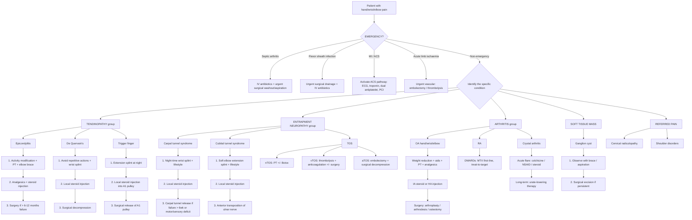

## Management Algorithm and Treatment Modalities

### 1. General Management Principles

The management of hand/wrist/elbow pain follows a **universal stepwise ladder** regardless of the specific condition:

1. **Treat emergencies first** — septic arthritis, flexor sheath infection, MI, acute limb ischaemia.
2. **Address the underlying cause** — e.g. treat DM/hypothyroidism in CTS, stop offending drugs in gout, smoking cessation in Buerger's.
3. **Conservative** (always first-line for most MSK conditions): activity modification, splinting, physiotherapy.
4. **Pharmacological**: analgesics (systemic or local), corticosteroid injections, disease-modifying agents.
5. **Surgical**: reserved for failure of conservative/pharmacological management, or specific indications (e.g. axonal loss, fixed deformity, infection).

The rationale is simple: most conditions causing hand/wrist/elbow pain are **self-limiting or degenerative**, not life-threatening. You start with the least invasive option and escalate only when needed. Surgery is the final step because it carries irreversible risks (nerve injury, stiffness, infection).

---

### 2. Overall Management Algorithm

---

### 3. Condition-Specific Management — Detailed

#### 3.1 Lateral Epicondylitis (Tennis Elbow)

***Management*** [2]:

**Step 1 — Conservative (first-line)**:
- ***Activity modification*** — identify and reduce the aggravating activity (e.g. adjust racket grip, ergonomic mouse, change technique). This is the single most important intervention because the pathology is driven by repetitive overloading of the ECRB tendon origin.
- ***PT (physiotherapy)***: ***stretching, strengthening exercise*** [2] — eccentric loading exercises (slowly lowering a weight with the wrist extended) stimulate tendon remodelling by promoting aligned collagen synthesis. This is the most evidence-based conservative treatment.
- ***Orthoses, e.g. elbow brace*** [2] — a counterforce brace applied ~2 cm distal to the lateral epicondyle reduces the load transmitted through the common extensor origin by redistributing force to the brace.

**Step 2 — Pharmacological**:
- ***Analgesics*** — oral NSAIDs (short course, ≤ 2 weeks) for pain relief; topical NSAIDs are preferred for localised pain.
- ***Local steroid injection*** [2] — corticosteroid (e.g. methylprednisolone 40 mg + lignocaine) injected at the point of maximal tenderness over the lateral epicondyle. Provides rapid short-term relief (weeks) but **no long-term benefit** and may actually weaken the tendon if repeated. Limit to ≤ 3 injections per site.
  - **Why does it work short-term?** Steroids suppress local inflammation and oedema, reducing nociceptor stimulation.
  - **Why no long-term benefit?** The pathology is primarily degenerative (angiofibroblastic), not inflammatory; steroids don't reverse tendinosis and may inhibit collagen synthesis.

**Step 3 — Surgical (if refractory > 6–12 months)**:
- ***Open/arthroscopic debridement of tendinosis, repair of damaged tendon insertions, tendon transfer if > 50% damage*** [2].
- Surgery removes the degenerated tendon tissue and stimulates a healing response. Tendon transfer (e.g. using anconeus muscle) is reserved for massive defects.

**Medial epicondylitis**: ***Similar management as tennis elbow*** [2]. Additionally, always assess and address ***associated ulnar nerve neuropathy*** — may require concurrent ulnar nerve decompression if symptomatic [2].

#### 3.2 De Quervain's Tenosynovitis

***Management*** [2]:

| Step | Modality | Details and rationale |
|---|---|---|
| **1. Conservative** | ***Lifestyle (avoid repetitive actions)*** | Remove the mechanical trigger — the tendon sheath thickening is driven by friction |
| | ***Wrist splint*** (thumb spica) | Immobilises the 1st extensor compartment, preventing APL/EPB gliding and allowing inflammation to resolve |
| **2. Pharmacological** | ***Local steroid injection*** | Injected into the 1st extensor compartment sheath → reduces inflammation and sheath thickening. Cure rate ~60–80% with a single injection |
| **3. Surgical** | ***Surgical decompression: percutaneous/endoscopic release → widen the tunnel roof for tendons to move*** [2] | Division of the fibrous septum overlying the 1st compartment. Takes pressure off APL/EPB. Cure rate > 90% |

**Surgical complication to know**: injury to the superficial branch of the radial nerve (Wartenberg's syndrome iatrogenically!) — it runs directly over the 1st compartment.

#### 3.3 Trigger Finger

***Management*** [2] — guided by Green's classification:

| Green's Grade | Recommended treatment | Rationale |
|---|---|---|
| ***I (pain/tenderness only)*** | ***Splint that holds the finger in extension position at night*** [2] | Prevents the flexor tendon nodule from being pulled through the A1 pulley during nocturnal finger flexion; allows oedema to settle |
| ***II (catching, can actively extend)*** | ***Local steroid injection (into A1 pulley)*** [2] | Steroid reduces the tenosynovitis and nodule size, allowing freer tendon gliding. Success rate ~60–70% after 1 injection, up to 90% after 2 |
| ***III (locking, passively correctable)*** | Steroid injection (1–2 attempts); if fails → ***surgical release of A1 pulley*** [2] | The nodule is now large enough to regularly catch; if steroids don't shrink it, mechanical release is needed |
| ***IV (fixed flexion deformity)*** | ***Surgical release of A1 pulley*** [2] | Fixed deformity means the tendon/nodule is physically trapped; no injection will resolve a structural problem |

**Steroid injection technique**: Inject into the tendon sheath (NOT the tendon itself) at the level of the A1 pulley (MCP joint crease, palm side). Use a 25G needle; inject 0.5 mL triamcinolone + 0.5 mL lignocaine.

**Surgical release**: Can be done percutaneously (with a needle/blade) or open. Division of the A1 pulley allows the tendon to glide freely. Key risk is digital nerve injury (the digital nerves run immediately lateral to the sheath).

<Callout title="Why Not Just Operate on Everyone?">
Steroid injections are tried first in Grades I–III because they are effective in most cases and avoid surgical risks (digital nerve injury, flexor tendon bowstringing if the wrong pulley is cut, wound infection). Surgery is reserved for failures and Grade IV because the structural problem is too severe for pharmacological resolution.
</Callout>

#### 3.4 Carpal Tunnel Syndrome (CTS)

***Management*** [2]:

**Step 1 — Conservative**:
- ***Night-time wrist splint*** [2] — a rigid splint holds the wrist in neutral position (0–15° extension). **Why night-time?** During sleep, people tend to flex their wrists, which ↑ carpal tunnel pressure. Neutral positioning minimises pressure and allows the oedema to resolve overnight.
- ***Physiotherapy*** — nerve gliding exercises, tendon gliding exercises, stretching. These mobilise the median nerve within the tunnel and prevent adhesion formation.
- ***Lifestyle modification*** — ergonomic adjustments (e.g. keyboard height, mouse position); treat underlying cause (***control DM, replace thyroxine in hypothyroidism, weight loss in obesity***) [2].

**Step 2 — Pharmacological**:
- ***Local steroid injection*** [2] — injected into the carpal tunnel (typically ulnar to palmaris longus tendon at the wrist crease). ***Reduces swelling*** within the tunnel → ↓ pressure on median nerve. Provides temporary relief; useful as a diagnostic/therapeutic test.
- ***Pyridoxine (vitamin B6)*** [2] — mechanism unclear; may have a mild neuroprotective effect. Evidence is weak.
- ***Diuretics*** [2] — may help in CTS related to fluid retention (e.g. pregnancy). Rarely used in practice.

**Step 3 — Surgical**:
- ***Indications*** [2]:
  - CTS ***unresponsive to conservative treatment for 6 weeks***
  - Associated ***sensory/motor deficit*** (thenar wasting, weakness of APB)
  - ***Axonal loss on NCS***
- Procedure: ***Carpal tunnel release (division of flexor retinaculum): open vs endoscopic*** [2]
  - **Open release**: 2–3 cm incision over the carpal tunnel; direct visualisation of the flexor retinaculum which is divided longitudinally. Gold standard.
  - **Endoscopic release**: smaller incision, faster recovery, but slightly higher risk of incomplete release.
  - **Why does cutting the retinaculum work?** The flexor retinaculum is the "roof" of the carpal tunnel. Dividing it decompresses the tunnel, immediately reducing pressure on the median nerve. The retinaculum eventually heals in a lengthened position.
- ***Specific complications*** [2]:
  - ***Persistent CTS symptoms (inadequate release)*** — incomplete division of the retinaculum
  - ***Nerve injury: palmar cutaneous branch*** — sensory loss/painful neuroma over thenar eminence
  - ***Vascular injury: superficial palmar arch*** — lies just deep to the retinaculum
  - Wound infection, scar tenderness ("pillar pain")

<Callout title="Surgical Timing in CTS" type="error">
Do NOT delay surgery in a patient with **thenar wasting or axonal loss on NCS**. Prolonged denervation leads to irreversible motor endplate degeneration — even if the nerve is later decompressed, the muscle may not recover. The window for reversible damage is approximately 6–12 months.
</Callout>

#### 3.5 Cubital Tunnel Syndrome

***Management*** [2]:

| Step | Modality | Details |
|---|---|---|
| **1. Conservative** | ***Soft elbow extension splint*** [2] | Worn at night. Prevents elbow flexion during sleep, which narrows the cubital tunnel and compresses the ulnar nerve. The splint keeps the elbow at ~30° flexion (not full extension, which can also stretch the nerve) |
| | ***Physiotherapy, lifestyle modification*** [2] | Avoid prolonged elbow flexion (e.g. holding phone), avoid leaning on elbow; nerve gliding exercises |
| **2. Pharmacological** | ***Local steroid injection, pyridoxine*** [2] | Less effective than in CTS because the cubital tunnel is not a "closed box" in the same way; steroid reduces local inflammation around the nerve |
| **3. Surgical** | ***Decompression in-situ, medial epicondylectomy, anterior transposition of ulnar nerve*** [2] | See below |

**Surgical options** [2]:
- **Simple decompression in-situ**: release of Osborne's ligament (roof of cubital tunnel) without moving the nerve. Simplest; suitable for mild-moderate cases without subluxation.
- **Medial epicondylectomy**: remove a portion of the medial epicondyle to widen the tunnel. Less commonly performed.
- ***Anterior transposition of ulnar nerve*** [2]: the nerve is moved from behind the medial epicondyle to a new position anterior to it (subcutaneous, intramuscular, or submuscular). This eliminates the stretch placed on the nerve during elbow flexion. Preferred when there is ulnar nerve subluxation or cubital valgus deformity.

#### 3.6 Thoracic Outlet Syndrome (TOS)

***Management varies by type*** [2]:

| Type | Treatment | Rationale |
|---|---|---|
| ***Neurological (nTOS)*** | ***Physiotherapy ± Botox injection to relax scalene muscles*** [2] | Most cases are due to scalene muscle hypertrophy/spasm compressing the lower trunk. PT stretches the scalenes; Botox chemically denervates them → ↓ compression |
| ***Venous (vTOS)*** | ***Thrombolysis, anticoagulation; surgical decompression*** [2] | The subclavian vein is thrombosed → catheter-directed thrombolysis to restore flow; anticoagulation to prevent propagation; 1st rib resection removes the structural cause |
| ***Arterial (aTOS)*** | ***Embolectomy; surgical decompression*** [2] | The subclavian artery is compressed/thrombosed → embolectomy for acute ischaemia; 1st rib/cervical rib excision to decompress |

***Surgical procedures to decompress thoracic outlet*** [2]:
- ***Supraclavicular/transaxillary excision of 1st rib/cervical rib***
- ***Scalenectomy***

These are ***seldom required*** [2] — most nTOS cases respond to conservative management.

#### 3.7 Osteoarthritis of Hand/Wrist

***Management*** [12]:

**Conservative**:
- ***Relief of weight-bearing/load: weight reduction, walking aids*** (for lower limb OA); for hand OA → ergonomic aids (jar openers, built-up grip pens), hand therapy
- ***Muscle strengthening*** — thenar and grip strengthening exercises maintain function and protect the joint
- ***Pain relief: analgesics*** — paracetamol first-line; oral NSAIDs (short course) if paracetamol insufficient
- ***Intra-articular steroid*** — for acute flares of OA (e.g. inflamed 1st CMC joint)
- ***Intra-articular hyaluronic acid/platelet-rich plasma*** — ***?evidence*** [12]; may provide short-term symptom relief by restoring joint lubrication, but guidelines are equivocal

**Operative** [12]:
- ***Indications***: severe impairment to ADL, pain despite conservative treatment
- ***Options***:
  - ***Arthroplasty for big joints*** (hip, knee, shoulder, ankle) [12]
  - ***Arthrodesis for small joints*** (e.g. wrist fusion, DIP fusion) [12] — sacrifices motion for stability and pain relief; appropriate for DIP (where motion is less critical) and wrist
  - ***Realignment surgery, e.g. osteotomy*** [12]
  - ***Arthroscopic debridement, e.g. remove osteophytes*** [12]
  - For **1st CMC OA** specifically: **trapeziectomy** (removal of the trapezium) ± ligament reconstruction and tendon interposition (LRTI). This is the workhorse operation for end-stage thumb base OA.

#### 3.8 Rheumatoid Arthritis — Hand/Wrist

The management of RA is a topic in its own right, but here we focus on the **hand/wrist-specific surgical principles** [3]:

**Medical (systemic)**:
- Treat-to-target strategy: early aggressive DMARD therapy (methotrexate as first-line → add hydroxychloroquine/sulphasalazine → escalate to biologics/JAK inhibitors if target not met).
- Flare management: short courses of oral prednisolone or intra-articular steroid.

***Role of surgery in RA*** [3]:
- ***Aim: to achieve a joint that is (1) pain free (2) stable (3) mobile*** [3]
- ***Indication for emergency/early surgery*** [3]:
  - ***Septic arthritis***
  - ***C1/2 instability with neurological deficit***
  - ***Tendon rupture or pending rupture***
  - ***Infected rheumatoid nodule***
  - ***Compressive neuropathy (e.g. CTS)*** [3]
- ***Surgical options for chronic arthritis*** [3]:
  - ***Synovectomy***: removal of inflamed synovium for pain relief, prevention of tendon rupture. Used in early disease. ***RARELY done nowadays with multiple DMARDs available*** [3]
  - ***Arthrodesis***: artificial induction of joint ossification. Used for wrist (gives pain-free, stable but NOT mobile joint) and DIP joints
  - ***Re-alignment osteotomy***: removal of parts of bone to restore alignment. For young patients to delay arthroplasty
  - ***Joint replacement***: most reliable method for pain-free, stable and mobile joint. ***Limited lifespan (usually > 15 years)*** due to ***aseptic loosening*** [3]
- ***Priority of surgical treatment*** [3]:
  - ***LL before UL*** (affects mobility)
  - ***Shoulder then elbow then hand*** (proximal to distal)
  - ***Winner operation first***: start with easier surgery with higher success rate to gain patient confidence, e.g. ***carpal tunnel decompression, tenosynovectomy, wrist fusion, forefoot reconstruction*** [3]

#### 3.9 Crystal Arthropathies (Gout/CPPD) at Hand/Wrist/Elbow

**Acute gout flare**:
- ***NSAIDs*** (e.g. indomethacin 50 mg TDS) — first-line unless contraindicated. Inhibit COX → ↓ prostaglandin synthesis → ↓ inflammation.
- ***Colchicine*** — inhibits neutrophil microtubule polymerisation → ↓ neutrophil migration and phagocytosis of MSU crystals → ↓ inflammasome activation. Most effective if started within 12 hours of onset. C/I: severe renal/hepatic impairment.
- ***Corticosteroids*** — oral prednisolone or intra-articular injection (after excluding infection). Used when NSAIDs and colchicine are contraindicated (e.g. CKD, peptic ulcer).
- ***Therapeutic aspiration + intra-articular steroids***: for monoarticular flare after septic arthritis has been ruled out [4].

**Chronic gout — urate-lowering therapy (ULT)**:
- Target serum urate < 360 μmol/L ( < 6 mg/dL); < 300 μmol/L if tophaceous.
- **Allopurinol** (xanthine oxidase inhibitor) — first-line; start low (100 mg/day), titrate up. C/I: acute flare (do NOT start during a flare; but do NOT stop if already on it).
- **Febuxostat** — alternative xanthine oxidase inhibitor; useful in allopurinol intolerance/HLA-B*5801 carriers (common in Southeast Asian/Chinese populations — important for Hong Kong).
- **Probenecid** — uricosuric; increases renal urate excretion. C/I: renal stones, CKD.
- **Prophylaxis during ULT initiation**: low-dose colchicine 0.5 mg daily for ≥ 6 months to prevent flares triggered by urate mobilisation.

**CPPD**: No specific disease-modifying therapy exists. Acute pseudogout is managed similarly to gout (NSAIDs, colchicine, steroids). Treat underlying metabolic causes (e.g. hyperparathyroidism, haemochromatosis).

#### 3.10 Ganglion Cyst

***Treatment*** [6][13]:

| Step | Modality | Details |
|---|---|---|
| ***1. Non-surgical (1st line)*** | ***Observation with brace → ~50% spontaneous resolution*** [6][13] | Many ganglions are asymptomatic and self-limiting |
| | ***Needle aspiration → up to 50% recurrence within a year*** [6][13] | Aspiration decompresses the cyst and provides immediate relief, but the stalk/connection to the joint capsule remains → recurrence |
| ***2. Surgical*** | ***Surgical excision of cyst and stalk if persistent or recurrent*** [6][13] | Complete excision of the cyst **and its stalk/pedicle** reduces recurrence (still up to 5–20% recurrence). Complications: wound complications, recurrence (up to 50% in some series), injury to neighbouring structures [13] |

**Important**: The old practice of "Bible therapy" (smashing the cyst with a heavy book) is **NOT recommended** — it causes tissue damage, pain, and high recurrence.

#### 3.11 Septic Arthritis

This is a ***rheumatological emergency*** [3][5]:

1. **Joint aspiration** — both diagnostic AND therapeutic (decompresses the joint, reduces intra-articular pressure that damages cartilage).
2. **Empirical IV antibiotics** — started immediately after aspiration:
   - Adults: IV flucloxacillin 2 g QDS (covers S. aureus) ± gentamicin if Gram-negative suspected.
   - Sexually active young adult: add IV ceftriaxone 1 g daily (covers N. gonorrhoeae).
   - MRSA risk: IV vancomycin.
   - Adjust based on culture and sensitivity.
3. **Surgical washout** — arthroscopic or open lavage if:
   - No improvement within 48 hours of antibiotics.
   - Hip joint (difficult to aspirate/drain adequately).
   - Large joint with significant purulent effusion.
4. **Duration**: typically 2 weeks IV → 4 weeks oral (total 6 weeks); guided by clinical response and CRP.

**Why is urgency critical?** Bacterial proteases and the host neutrophilic response destroy articular cartilage within **days**. Cartilage has no blood supply and cannot regenerate — once destroyed, it's permanent.

#### 3.12 Flexor Tendon Sheath Infection

***Infections of tendon sheath and fascial spaces of hand*** [1] — this is a **surgical emergency**.

1. **IV antibiotics** — broad-spectrum (e.g. IV co-amoxiclav or flucloxacillin + metronidazole for polymicrobial/bite wounds).
2. **Surgical drainage** — incision and irrigation of the tendon sheath under anaesthesia. A catheter may be left in situ for continuous irrigation.
3. **Post-operative hand therapy** — early mobilisation to prevent adhesions and stiffness.

If left untreated → tendon necrosis, spread to deep spaces (Parona space → horseshoe abscess), digital ischaemia, amputation.

#### 3.13 Cervical Radiculopathy (Referred Arm Pain)

- **Conservative** (most patients improve): analgesia (NSAIDs ± neuropathic agents such as pregabalin/gabapentin), physiotherapy (cervical traction, postural correction, neck strengthening), cervical collar (short-term).
- **Interventional**: cervical epidural steroid injection — for persistent radicular pain.
- **Surgical**: anterior cervical discectomy and fusion (ACDF) or posterior foraminotomy — indicated for progressive neurological deficit or intractable pain despite ≥ 6 weeks of conservative management.

#### 3.14 Scaphoid Fracture

***Management*** [2]:

| Scenario | Treatment |
|---|---|
| **Undisplaced fracture** | ***Non-operative: immobilisation in thumb spica cast*** [2] for 6–12 weeks (waist fractures ~8 weeks; proximal fractures ~12 weeks) |
| **High clinical suspicion, normal XR** | ***Thumb splint + repeat XR in 14 days*** or ***MRI wrist*** [2] |
| **Displaced/proximal fracture** | ***Operative: percutaneous screw fixation*** [2] (e.g. Herbert screw). Allows earlier mobilisation and reduces non-union/AVN risk |

**Why prolonged immobilisation?** The scaphoid has a retrograde blood supply (enters distally, flows proximally) and is mainly surrounded by articular cartilage → limited periosteal blood supply → relies on **primary bone healing** without callus → requires absolute immobilisation for union [2].

#### 3.15 Pulled Elbow (Children)

- **Closed reduction**: supination–flexion manoeuvre (supinate the forearm while flexing the elbow) OR hyperpronation manoeuvre.
- A **palpable click** at the radial head confirms reduction.
- No immobilisation needed; the child typically uses the arm within minutes.
- **Parental education**: avoid pulling the child by the forearm/hand.

---

### 4. Pharmacological Agents — Summary Table

| Agent | Mechanism | Indication in hand/wrist/elbow pain | Key contraindications / side effects |
|---|---|---|---|
| **Paracetamol** | Central COX inhibition + serotonergic pathways | First-line analgesic for OA, mild MSK pain | Hepatotoxicity in overdose; avoid in liver disease |
| **Oral NSAIDs** (ibuprofen, naproxen, diclofenac) | COX-1/2 inhibition → ↓ prostaglandin → ↓ pain/inflammation | Epicondylitis, OA, acute gout, CPPD | GI ulceration, renal impairment, CVS risk (especially with prolonged use). Avoid in CKD, active PUD, heart failure |
| **Topical NSAIDs** (diclofenac gel) | Same but local delivery → lower systemic exposure | Epicondylitis, OA hand, De Quervain's | Skin irritation; preferred over oral for localised conditions to minimise systemic SE |
| **COX-2 selective inhibitors** (celecoxib, etoricoxib) | Selective COX-2 inhibition → less GI SE | Gout flare, inflammatory arthritis in patients with GI risk | ↑ CVS risk; avoid post-CABG; still renal risks |
| **Colchicine** | Inhibits microtubule polymerisation → ↓ neutrophil migration/NLRP3 inflammasome | Acute gout, CPPD flare; gout prophylaxis during ULT initiation | Diarrhoea (most common), marrow suppression. C/I: severe renal/hepatic impairment. Drug interaction: clarithromycin, cyclosporin (↑ toxicity) |
| **Corticosteroid (local injection)** | Potent anti-inflammatory → ↓ oedema, ↓ cytokine release | CTS, epicondylitis, trigger finger, De Quervain's, OA (IA), acute gout (IA) | Tendon weakening/rupture if injected into tendon; skin depigmentation; infection risk; hyperglycaemia in DM patients. Limit to ~3 injections per site |
| **Oral corticosteroid** (prednisolone) | Systemic anti-inflammatory | Acute gout (when NSAIDs/colchicine C/I); RA flare; CPPD flare | DM control disruption, osteoporosis, immunosuppression, peptic ulcer. Short courses preferred |
| **Allopurinol** | Xanthine oxidase inhibitor → ↓ urate production | Chronic gout — ULT | Allopurinol hypersensitivity syndrome (HLA-B*5801 — screen in Chinese/Southeast Asian patients); start low, go slow |
| **Febuxostat** | Selective xanthine oxidase inhibitor | Gout — ULT in allopurinol intolerance/HLA-B*5801 + | ↑ CVS mortality in CARES trial (controversial); avoid in severe CVD |
| **Methotrexate** | Folate antagonist → ↓ lymphocyte proliferation | RA — first-line DMARD | Hepatotoxicity, marrow suppression, pneumonitis. C/I: pregnancy, severe hepatic/renal disease. Supplement with folic acid 5 mg weekly |
| **Pyridoxine (B6)** | ?Neuroprotective | Adjunct in CTS, cubital tunnel [2] | Generally safe; mega-doses can paradoxically cause neuropathy |
| **Pregabalin / Gabapentin** | α2δ Ca²⁺ channel ligand → ↓ excitatory neurotransmitter release | Neuropathic pain (cervical radiculopathy, post-surgical neuropathic pain) | Drowsiness, dizziness, weight gain, oedema |

<Callout title="HLA-B*5801 Screening Before Allopurinol" type="error">
In **Hong Kong's Chinese population**, the prevalence of HLA-B*5801 is ~6–8%. This allele confers a high risk of **allopurinol hypersensitivity syndrome** (DRESS/SJS/TEN — mortality ~25%). ***Always screen for HLA-B*5801 before starting allopurinol in Chinese patients.*** If positive, use febuxostat instead.
</Callout>

---

### 5. Splinting — A Key Conservative Modality

Splinting is the **workhorse of conservative management** for hand/wrist/elbow conditions. Different conditions require different splint types:

| Condition | Splint type | Position | Rationale |
|---|---|---|---|
| ***CTS*** | ***Night-time wrist splint*** [2] | Wrist neutral (0–15° extension) | Minimises carpal tunnel pressure by avoiding flexion |
| ***Cubital tunnel*** | ***Soft elbow extension splint*** [2] | Elbow ~30° flexion | Prevents full elbow flexion which narrows the cubital tunnel |
| ***De Quervain's*** | Thumb spica splint | Wrist neutral, thumb immobilised | Prevents APL/EPB gliding through inflamed 1st compartment |
| ***Trigger finger*** | Extension splint at night [2] | MCP in extension (PIP/DIP free) | Prevents flexion → stops nodule from catching on A1 pulley |
| ***Scaphoid fracture*** | ***Thumb spica cast*** [2] | Wrist neutral, thumb immobilised | Absolute immobilisation for primary bone healing |
| ***Mallet finger*** | Stack splint | DIP in full extension | Allows extensor tendon healing at DIP |

---

### 6. Steroid Injection — Practical Points

Steroid injection is used across multiple conditions. Here is a summary of injection sites and considerations:

| Condition | Injection site | Agent | Notes |
|---|---|---|---|
| Lateral epicondylitis | Point of maximal tenderness at lateral epicondyle | Methylprednisolone 40 mg + lignocaine 1% | Do NOT inject into the tendon substance; peritendinous injection |
| De Quervain's | Into the 1st extensor compartment sheath | Triamcinolone 10 mg + lignocaine | Confirm placement: syringe should flow easily if within the sheath |
| Trigger finger | Into the flexor tendon sheath at A1 pulley | Triamcinolone 10–20 mg + lignocaine | Inject at MCP crease; resistance = tendon (withdraw slightly) |
| CTS | Into carpal tunnel, ulnar to palmaris longus | Methylprednisolone 40 mg + lignocaine | Avoid injecting directly into the median nerve (paraesthesia = stop) |
| OA 1st CMC | Into the 1st CMC joint under USG guidance | Triamcinolone 10 mg | Small joint → USG guidance improves accuracy |

**General contraindications to local steroid injection**:
- Septic arthritis or local skin infection (would worsen infection)
- Overlying cellulitis or broken skin
- Poorly controlled diabetes (steroid → hyperglycaemia for 1–2 weeks)
- Coagulopathy (↑ bleeding risk)
- Previous tendon rupture at the site
- More than 3 injections in the same site within 12 months

---

### 7. Surgical Indications — When to Refer

A quick-reference for when conservative management should be abandoned and surgery considered:

| Condition | Surgical indication |
|---|---|
| ***CTS*** | ***Unresponsive to conservative treatment for 6 weeks; sensory/motor deficit; axonal loss on NCS*** [2] |
| ***Cubital tunnel*** | Failure of splinting/PT for 3–6 months; progressive weakness/wasting; ulnar nerve subluxation |
| ***Lateral epicondylitis*** | Refractory symptoms > 6–12 months despite PT, bracing, injection |
| ***De Quervain's*** | Failure of splinting + ≥ 1 steroid injection |
| ***Trigger finger Grade IV*** | Fixed flexion deformity — surgery is first-line [2] |
| ***Septic arthritis*** | All cases — urgent aspiration/washout |
| ***Flexor sheath infection*** | All cases — urgent surgical drainage [1] |
| ***Scaphoid fracture (displaced/proximal)*** | ***Percutaneous screw fixation*** [2] |
| ***RA (emergency)*** | ***Septic arthritis, C1/2 instability, tendon rupture, CTS*** [3] |
| ***Ganglion cyst*** | Persistent/recurrent despite aspiration; symptomatic (nerve compression) [13] |
| ***OA hand*** | Severe ADL impairment; pain despite conservative Rx → trapeziectomy (1st CMC), arthrodesis (DIP) [12] |

---

<Callout title="High Yield Summary">

1. **Universal ladder**: conservative (activity modification, splinting, PT) → pharmacological (analgesics, steroid injection) → surgical.

2. ***CTS management***: night-time wrist splint → steroid injection → ***carpal tunnel release (division of flexor retinaculum)*** if failure > 6 weeks, motor/sensory deficit, or axonal loss on NCS [2].

3. ***Lateral epicondylitis***: activity modification + ***PT (stretching, strengthening, elbow brace)*** → analgesics/steroid injection → surgery (debridement, tendon repair/transfer if > 50% damage) [2].

4. ***De Quervain's***: avoid repetitive actions + wrist splint → ***local steroid injection*** → ***surgical decompression (widen tunnel roof)*** [2].

5. ***Trigger finger***: guided by ***Green's classification***. Extension splint (I) → steroid injection (II–III) → ***surgical release of A1 pulley*** (III–IV) [2].

6. ***Cubital tunnel***: ***soft elbow extension splint*** → steroid/pyridoxine → ***anterior transposition of ulnar nerve*** [2].

7. ***TOS***: nTOS = PT ± Botox; vTOS = thrombolysis + anticoagulation + surgical decompression; aTOS = embolectomy + surgical decompression [2].

8. ***Septic arthritis***: urgent aspiration + IV antibiotics + surgical washout — delay = permanent cartilage destruction.

9. ***Gout***: acute flare (NSAIDs/colchicine/steroids) → chronic ULT (allopurinol first-line; screen HLA-B*5801 in Chinese patients). Never start/stop ULT during a flare.

10. ***RA surgical priority***: LL before UL; proximal before distal; ***winner operation first*** (e.g. CTR, tenosynovectomy) [3].

11. ***Ganglion***: observe/aspirate (1st line, ~50% spontaneous resolution) → excision if persistent [13].

</Callout>

---

<ActiveRecallQuiz
  title="Active Recall - Management of Hand/Wrist/Elbow Pain"
  items={[
    {
      question: "A patient with CTS has thenar wasting and NCS showing axonal loss. What is the appropriate management and why is timing critical?",
      markscheme: "Proceed to carpal tunnel release (division of flexor retinaculum) — open or endoscopic. Timing is critical because prolonged denervation causes irreversible motor endplate degeneration; even if the nerve is later decompressed, the thenar muscles may not recover. The window for reversibility is approximately 6-12 months."
    },
    {
      question: "List the three indications for surgical carpal tunnel release according to the senior notes.",
      markscheme: "1. CTS unresponsive to conservative treatment for 6 weeks. 2. Associated sensory or motor deficit (thenar wasting, weakness of thumb abduction). 3. Axonal loss on nerve conduction studies."
    },
    {
      question: "A patient with trigger finger Grade III fails two steroid injections. What is the next step, and what is the key surgical risk?",
      markscheme: "Surgical release of the A1 pulley. The key surgical risk is digital nerve injury (the digital nerves run immediately lateral to the flexor tendon sheath at the level of the A1 pulley)."
    },
    {
      question: "Why is a night-time wrist splint effective for CTS, and what position should the wrist be held in?",
      markscheme: "Wrist neutral (0-15 degrees extension). During sleep, patients flex their wrists, which increases carpal tunnel pressure. A neutral-position splint minimises tunnel pressure and allows oedema to resolve overnight."
    },
    {
      question: "In RA, what is the priority order for surgical management and what is meant by a 'winner operation'?",
      markscheme: "Priority: LL before UL (affects mobility), then proximal to distal in UL (shoulder, elbow, hand). A 'winner operation' means starting with an easier surgery with a higher success rate to gain patient confidence, e.g. carpal tunnel decompression, tenosynovectomy, wrist fusion, forefoot reconstruction."
    },
    {
      question: "Before starting allopurinol in a Hong Kong Chinese patient with gout, what must you do and why?",
      markscheme: "Screen for HLA-B*5801 (prevalence 6-8% in Chinese). This allele confers high risk of allopurinol hypersensitivity syndrome (DRESS/SJS/TEN, mortality approximately 25%). If positive, use febuxostat instead."
    }
  ]}
/>

---

## References

[1] Lecture slides: murtagh merge.pdf (p19–20, Arm and hand pain)
[2] Senior notes: maxim.md (Sections on epicondylitis, De Quervain's, trigger finger, CTS, cubital tunnel syndrome, TOS, scaphoid fracture management)
[3] Senior notes: Ryan Ho Rheumatology.pdf (p56, Role of surgery in RA; p62, SpA management — NSAIDs/biologics principles)
[4] Senior notes: Ryan Ho Rheumatology.pdf (Sections 2.4.1 Gout — acute flare management, intercritical/tophaceous gout, ULT)
[5] Senior notes: Ryan Ho Fundamentals.pdf (p407, Joint fluid analysis and initial investigations for monoarthritis)
[6] Senior notes: maxim.md (Ganglion cyst management)
[12] Senior notes: maxim.md (OA management — conservative and operative options)
[13] Senior notes: Ryan Ho Rheumatology.pdf (p173, Ganglion — treatment)
