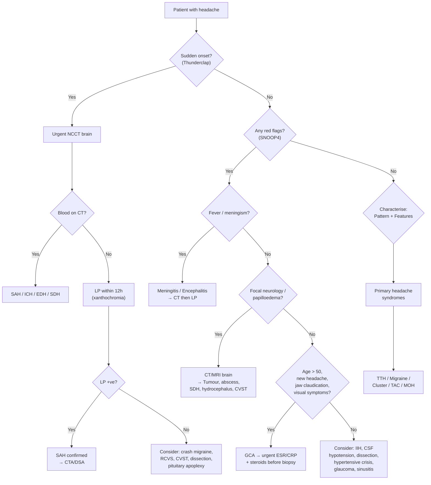

## Differential Diagnosis of Headache

The differential diagnosis of headache is one of the broadest in medicine. The clinical approach is to **first stratify by tempo** (sudden / acute / subacute / chronic), then systematically consider primary versus secondary causes, and finally use clinical features to narrow the list. The overriding goal is always: **can I safely attribute this headache to a benign primary cause, or must I investigate for something life-threatening?**

---

### Organising Framework — Murtagh's Diagnostic Strategy

John Murtagh's framework is an excellent bedside structure. It forces you to think beyond the obvious [9].

#### ***Probability Diagnosis*** [9]
| Tempo | Most Likely Cause |
|---|---|
| ***Acute*** | ***Respiratory infection*** |
| ***Chronic*** | ***Tension-type headache, combination headache, migraine, transformed migraine*** |

> Why respiratory infection for acute? Upper respiratory tract infections produce headache via mucosal congestion in the paranasal sinuses → ↑sinus cavity pressure → stimulation of V1/V2 nociceptors in sinus mucosa. This is the headache you get with every common cold.

#### ***Serious Disorders Not to Be Missed*** [9]
| Category | Conditions |
|---|---|
| ***Cardiovascular*** | ***Subarachnoid haemorrhage, intracranial haemorrhage, carotid or vertebral artery dissection, temporal arteritis, cerebral venous thrombosis*** |
| ***Neoplasia*** | ***Cerebral tumour, pituitary tumour*** |
| ***Infection*** | ***Meningitis (esp. fungal), encephalitis, intracranial abscess*** |
| ***Haematoma*** | ***Extradural / subdural*** |
| ***Other*** | ***Glaucoma, benign intracranial hypertension*** |

#### ***Pitfalls (Often Missed)*** [9]
- ***Cervical spondylosis / dysfunction***
- ***Dental disorders***
- ***Refractive errors of eye***
- ***Sinusitis***
- ***Ophthalmic herpes zoster (pre-eruption)*** — pain precedes the rash by days; if you don't think of it, you'll miss it until vesicles appear in V1 territory
- ***Exertional headache***
- ***Hypoglycaemia***
- ***Post-traumatic headache (e.g. post-concussion)***
- ***Post-spinal procedure (e.g. epidural, lumbar puncture)***
- ***Sleep apnoea*** — morning headaches from nocturnal hypercapnia → cerebral vasodilation → ↑ICP
- ***Rarities: Paget disease, post-sexual intercourse, cluster headache, Cushing syndrome, Conn syndrome, Addison disease, dysautonomic cephalgia***

<Callout title="Exertional and Sexual Headache — Don't Forget SAH" type="error">
***Headaches associated with specific activities***: sudden severe headache with exertion, especially sexual activity, lasting < 10–15 minutes. ***The critical differential is subarachnoid haemorrhage (which can also occur during coitus)*** [2]. Always investigate the first episode of thunderclap headache during exertion/sex — you cannot assume it is benign until SAH has been excluded.
</Callout>

#### ***Masquerades Checklist*** [9]
- ***Depression*** — chronic daily headache may be the presenting complaint of underlying depressive illness
- ***Diabetes*** — hypoglycaemia can present as headache; diabetic ketoacidosis causes headache from cerebral oedema
- ***Drugs (see list)*** — alcohol, analgesics (rebound), caffeine, antihypertensives, COCP, corticosteroids, NSAIDs (esp. indomethacin), vasodilators esp. nitrates, sildenafil [9]
- ***Anaemia*** — severe anaemia → compensatory ↑cerebral blood flow → vessel distension → headache
- ***Thyroid disorder and other endocrine (Cushing, Conn, Addison)*** — hypothyroidism a/w headache via ↑CSF pressure; phaeochromocytoma: ***classic triad of paroxysmal headache, sweating, palpitations*** [20]
- ***Spinal dysfunction (cervicogenic)***
- ***UTI*** — systemic infection → febrile headache

#### ***Is the Patient Trying to Tell Me Something?*** [9]
***Quite likely if there is an underlying psychogenic disorder*** [9]. Always consider whether the headache is the patient's "ticket" to discuss stress, anxiety, depression, domestic violence, or substance abuse.

---

### Differential Diagnosis by Temporal Profile

This is the most practical way to approach headache in an exam or at the bedside. The table below integrates multiple sources [1][2][3][21].

#### ACUTE Headache (Minutes to Hours)

| D/dx | Distinguishing Features | Why These Features Occur |
|---|---|---|
| ***Sinusitis*** | ***Preceding 'cold', nasal discharge*** [3][21] | Mucosal inflammation + sinus obstruction → ↑pressure in closed sinus cavity → V1/V2 nociceptor activation |
| ***Migraine*** | ***Visual/neurological aura, nausea, vomiting*** [3][21]; unilateral, throbbing, 4–72h, debilitating | Cortical spreading depression → trigeminovascular activation → CGRP release → neurogenic inflammation |
| ***Cluster headache*** | ***Lacrimation, rhinorrhoea*** [3][21]; severe periorbital, 15–180min, same time daily, agitation | Hypothalamic activation → trigeminal-autonomic reflex |
| ***Glaucoma*** | ***'Misting' of vision, 'haloes' around objects*** [3][21]; severe eye pain, red eye, fixed mid-dilated pupil, rock-hard globe | Acute ↑intraocular pressure → corneal oedema (haloes) + direct stimulation of ciliary/trigeminal nociceptors |
| ***Arterial dissection (carotid)*** | ***Unilateral pain, Horner's syndrome*** [3][21]; ipsilateral neck pain, may have TIA/stroke | Intimal tear → intramural haematoma stretches vessel wall nociceptors; haematoma compresses pericarotid sympathetic → Horner's |
| ***Arterial dissection (vertebral)*** | ***Symptoms of cerebral ischaemia*** [3][21]; occipital/posterior neck pain | Vertebral artery supplies posterior circulation → dissection → posterior stroke risk |
| ***Retrobulbar neuritis*** | ***Loss of vision (unilateral)*** [3][21]; pain on eye movement | Inflammation of posterior optic nerve → pain from traction on inflamed nerve sheath by extraocular muscles [22] |
| ***Post-traumatic*** | ***Following head injury*** [3][21] | Direct trauma to pain-sensitive structures ± evolving intracranial haematoma |
| ***Drugs/toxins*** | ***On vasodilator drugs*** [3][21] | Vasodilation → ↑pulsatile stretch of intracranial arterial nociceptors |
| ***Haemorrhage (SAH, ICH)*** | ***Instantaneous onset, vomiting, neck stiffness, impaired conscious level*** [3][21] | SAH: blood in subarachnoid space → meningeal irritation; ICH: rapid mass effect → traction on dura/vessels |
| ***Infection (meningitis, encephalitis)*** | ***As above but more gradual onset with pyrexia*** [3][21] | Infectious exudate in subarachnoid space → meningeal nociceptor stimulation + systemic inflammatory response → fever |
| ***Hydrocephalus*** | ***Impaired conscious levels, leg weakness, impaired upward gaze*** [3][21] | Acute CSF outflow obstruction → rapid ↑ICP → traction on dura; upward gaze palsy from pressure on tectal plate (Parinaud's) |
| **Pituitary apoplexy** | Sudden excruciating headache, diplopia (CN III), hypopituitarism (esp. adrenal crisis) [17] | Acute haemorrhage into pituitary → rapid stretching of diaphragma sellae (dural fold) → headache; lateral extension compresses CN III in cavernous sinus |
| ***Hypertensive crisis*** | ***Severe headache, vomiting, visual disturbances, transient paralyses, convulsions*** [8] | Acute ↑↑BP → failure of cerebral autoregulation → cerebral oedema → ↑ICP |
| **Cerebral venous sinus thrombosis** | ↑ICP (headache, papilloedema, ↓GCS), seizure, focal neurological deficit [13] | Venous outflow obstruction → ↑venous pressure → ↑ICP + venous infarction |

#### SUBACUTE Headache (Days to Weeks)

| D/dx | Distinguishing Features | Why These Features Occur |
|---|---|---|
| ***Infection (subacute/chronic meningitis, e.g. TB; cerebral abscess)*** | ***Impaired conscious level, pyrexia, neck stiffness, focal neurological signs*** [3][21] | Chronic granulomatous basal meningitis (TB) → basal cistern exudate → CN palsies (esp. II, VI), hydrocephalus [23]; abscess → focal mass effect + surrounding oedema |
| ***Intracranial tumour*** | ***Vomiting, papilloedema, impaired conscious level + focal neurological signs*** [3][21] | Growing mass → ↑ICP → traction on dura/vessels → headache; focal signs reflect location of tumour |
| ***Chronic subdural haematoma*** | ***As above (vomiting, papilloedema, ↓conscious level, focal signs)*** [3][21] | Slow venous bleeding from torn bridging veins → gradually expanding collection → progressive mass effect over weeks [11] |
| ***Hydrocephalus*** | ***Impaired conscious levels, leg weakness, impaired upward gaze*** [3][21] | Progressive CSF accumulation → ventriculomegaly → compression of periventricular white matter |
| ***Idiopathic intracranial hypertension (IIH)*** | ***Papilloedema, visual obscurations, CN6 palsy*** [3][5][21] | ↑ICP without mass lesion; obese young woman; mechanism: ↓CSF reabsorption + ↑CSF outflow resistance |
| ***Temporal arteritis (GCA)*** | ***Thickened, tender scalp arteries*** [3][10][21]; new headache > 50yo, jaw claudication, visual symptoms, ↑↑ESR | Granulomatous arteritis of superficial temporal artery → vessel wall inflammation → nociceptor stimulation; luminal narrowing → ischaemia (jaw claudication, AAION) |
| ***Intracranial hypotension*** | ***Worse on standing*** [3][5][21]; orthostatic headache that promptly resolves when supine | CSF leak → ↓CSF volume → brain sags → traction on dura, bridging veins, CN [5] |

#### CHRONIC/RECURRENT Headache (Weeks to Months)

| D/dx | Distinguishing Features | Why These Features Occur |
|---|---|---|
| ***Tension-type headache*** | ***Anxiety, depression*** [3][21]; bilateral band-like, no associated symptoms, can carry on with activities | Chronic muscular tension + central sensitization in pericranial muscles |
| ***Transformed migraine*** | ***Previous history of episodic migraine*** [3][21]; gradual ↑frequency over months–years | Repeated trigeminovascular activation → central sensitization → chronification; often MOH contributes |
| ***Medication overuse headache (MOH)*** | ***Regular analgesic > 15 days a month*** [3][21]; headache worsens despite ↑medication | Chronic analgesic use → downregulation of endogenous pain-inhibitory pathways → rebound headache when drug wears off |
| ***Ocular 'eye strain'*** | ***Impaired visual acuity*** [3][21] | Uncorrected refractive error → sustained contraction of ciliary and extraocular muscles → frontal headache |
| ***Cervical spondylosis (referred)*** | Commonly over occipital region; neck stiffness/pain [2] | Degenerative cervical spine disease → nociceptor activation of C1–C3 nerve roots → referred pain to occiput (trigeminocervical convergence) |

---

### Differentiating Primary Headache Syndromes

This is a high-yield comparison that comes up repeatedly in exams [2][3].

| Feature | **Migraine** | **Tension-type** | **Cluster** |
|---|---|---|---|
| ***Onset*** | ***Gradual onset, crescendo*** | ***Gradual onset, wax-and-wane*** | ***Rapid onset*** |
| ***Triggers*** | ***Premenstrual, stress, exercise*** | ***Emotions, stress*** | ***Alcohol, GTN; periodicity and clustering*** |
| ***Quality*** | ***Unilateral pulsating, moderate-severe, debilitating (↑by movement)*** | ***Bilateral band-like tightness*** | ***Severe unilateral periorbital deep, piercing pain; restlessness*** |
| ***Duration*** | ***4–72h*** | ***30min–7d*** | ***15min–3h*** |
| ***Associated*** | ***Nausea/vomiting, photophobia, phonophobia; preceded by aura*** | ***None*** | ***Ipsilateral autonomic features (lacrimation, nasal congestion, conjunctival injection, Horner's)*** |
| **Behaviour during attack** | Lies still in dark, quiet room | Can carry on with activities | Paces, rocks, restless — cannot keep still |

> **Mnemonic for migraine = POUND**: ***P***ounding, lasting 4–72 h***O***urs, ***U***nilateral, ***N***ausea/vomiting, ***D***ebilitating [2].

---

### Differential Diagnosis by Red Flag Features

This is the approach to use when something doesn't feel right [2][3].

| ***Red Flag*** | ***Differential to Consider*** | Why |
|---|---|---|
| ***Systemic upset (constitutional symptoms, fever, cancer, immunodeficiency)*** | ***CNS infections, neoplastic (lymphoma/metastasis), vasculitis*** [3] | Systemic inflammation or immunosuppression → ↑risk of opportunistic CNS infection, haematogenous spread of tumour, or systemic vasculitis |
| ***Neurological symptoms (confusion, focal symptoms, LOC, seizures, meningism)*** | ***Intracranial pathologies (vascular, neoplastic, infection)*** [3] | Focal neurological deficit implies structural lesion disrupting specific neural pathways |
| ***Onset is new and sudden*** | ***Temporal arteritis if new onset > 60yo*** [3]; ***Sudden onset: Primary — crash migraine, cluster, benign exertional/orgasmic; Secondary vascular — unruptured saccular aneurysm, SAH, ICA dissection, CVST, hypertensive crises; Secondary non-vascular — intermittent hydrocephalus, benign intracranial HTN, pituitary apoplexy, infections, acute mountain sickness, acute optic neuritis, acute glaucoma*** [3] | Sudden onset implies a "vascular" mechanism (rupture, occlusion, dissection) until proven otherwise |
| ***Other associating symptoms*** | ***Trauma → intracranial haematoma; Worse when supine + vomiting + ↑with exertion/cough → ↑ICP; Meningococcemic rash → DIC from systemic N. meningitidis; Visual symptoms → glaucoma*** [3] | Each associated symptom narrows the differential by pointing to a specific pain-generating mechanism |
| ***Progression or persistence despite treatment*** | **Evolving secondary cause or MOH** | Primary headaches should respond to appropriate treatment; failure suggests misdiagnosis or medication overuse |

---

### Approach to the Differential — Clinical Decision Flowchart

---

### Special Differential Considerations

#### Thunderclap Headache — The "Can't Miss" Differential

A thunderclap headache (peak intensity within 60 seconds) has a broad secondary differential [2][3]:

| Cause | Key Differentiating Feature |
|---|---|
| **SAH** (most dangerous) | Meningism, LOC, blood on CT or xanthochromia on LP |
| **ICH** | Focal neurological deficit, hypertension |
| **CVST** | Seizures, papilloedema, young woman on OCP/pregnant |
| **Arterial dissection** | Neck/face pain, Horner's, TIA symptoms |
| **Pituitary apoplexy** | Sudden headache + diplopia (CN III) + hypopituitarism [17] |
| **Reversible cerebral vasoconstriction syndrome (RCVS)** | Recurrent thunderclap headaches over days, triggered by exertion/Valsalva/sex, segmental vasoconstriction on angiography |
| **Hypertensive crisis** | BP > 180/120 + target organ damage [8] |
| **Primary thunderclap headache** | Diagnosis of exclusion after all secondary causes ruled out |

<Callout title="SAH Rule" type="error">
Every thunderclap headache is SAH until proven otherwise. A normal CT brain within 6 hours has > 98% sensitivity for SAH, but after 6 hours sensitivity drops rapidly — you MUST do an LP if CT is negative and clinical suspicion remains. Look for xanthochromia (yellow CSF from bilirubin, present 12h–12d after bleed) [13].
</Callout>

#### Headache in the Elderly — Think Secondary

***A patient > 55 years presenting with unaccustomed headache probably has an organic cause*** [9]. The differential shifts:
- **GCA** (must exclude — visual loss is preventable with steroids)
- **Chronic SDH** (elderly with atrophy; may have trivial/forgotten trauma)
- **Cerebral tumour** (primary or metastatic)
- **Cervical spondylosis**
- **Medication-related** (polypharmacy common)

#### Headache with Endocrine "Masquerades"

Several endocrine conditions present with headache as a prominent symptom [9][17][20]:

| Condition | Mechanism of Headache |
|---|---|
| **Phaeochromocytoma** | Paroxysmal catecholamine surges → acute ↑BP → headache; ***classic triad: paroxysmal headache, sweating, palpitations*** [20] |
| **Pituitary adenoma** | Mass effect stretching diaphragma sellae → headache; + VF defects, CN palsies, hypopituitarism [17] |
| **Acromegaly** | Pituitary adenoma local effects (headache, VF defects) + GH excess → soft tissue/bone overgrowth [17] |
| ***Cushing syndrome*** | Cortisol excess → ↑BP → headache; + IIH association [9] |
| ***Conn syndrome*** | Aldosterone excess → ↑BP → headache [9] |
| ***Addison disease*** | Cortisol deficiency → headache (mechanism unclear; possibly ↑vasopressin/↓cortisol modulation of nociception) [9] |
| **Hypoglycaemia** | ↓glucose → cerebral energy crisis → compensatory cerebral vasodilation → headache [9] |

---

### Summary: Master Differential Table

| Category | Conditions |
|---|---|
| **Primary** | TTH, migraine (± aura), cluster headache, paroxysmal hemicrania, SUNCT, hemicrania continua, primary exertional/cough/sexual/thunderclap headache |
| **Vascular** | SAH, ICH, EDH, SDH, carotid/vertebral dissection, CVST, GCA, malignant HTN, RCVS |
| **Neoplastic** | Cerebral tumour (primary/metastatic), pituitary adenoma/apoplexy, skull base tumour |
| **Infective** | Bacterial/viral/TB/fungal meningitis, encephalitis, cerebral abscess |
| **CSF pressure** | IIH (↑ICP), intracranial hypotension (↓ICP), hydrocephalus |
| **Structural** | Cervical spondylosis, Chiari malformation |
| **Ocular** | Acute angle-closure glaucoma, refractive error, optic neuritis |
| **ENT/Dental** | Sinusitis, otitis, dental infection, TMJ dysfunction |
| **Cranial neuralgia** | Trigeminal neuralgia, glossopharyngeal neuralgia, occipital neuralgia, post-herpetic neuralgia, herpes zoster (pre-eruption) |
| **Medication/substance** | MOH, nitrate headache, caffeine withdrawal, COCP, alcohol |
| **Endocrine/metabolic** | Phaeochromocytoma, hypoglycaemia, hypothyroidism, Cushing/Conn/Addison, OSA (CO₂ retention) |
| **Systemic** | URTI, anaemia, carbon monoxide poisoning, altitude sickness |
| **Psychiatric** | Depression, anxiety, somatisation |
| **Trauma** | Post-concussion syndrome, post-spinal procedure headache |
| **Other rare** | Paget disease, spontaneous CSF leak, reversible posterior leucoencephalopathy syndrome |

---

<Callout title="High Yield Summary — Differential Diagnosis of Headache">

1. **Always stratify by tempo**: sudden (think vascular emergency) → acute → subacute → chronic.
2. **Murtagh's probability diagnosis**: acute = URTI; chronic = TTH, combination headache, migraine, transformed migraine.
3. **Serious disorders not to be missed**: SAH, ICH, dissection, GCA, CVST, tumour, meningitis, EDH/SDH, glaucoma, IIH.
4. **Primary headache differentiation**: Migraine = POUND (Pounding, 4-72 hOurs, Unilateral, Nausea, Debilitating); TTH = bilateral band, no associated symptoms; Cluster = unilateral periorbital + autonomic features + clockwork periodicity + agitation.
5. **Thunderclap headache** = SAH until proven otherwise (CT → LP if CT normal).
6. **New headache in > 55yo** = likely organic (GCA, tumour, SDH).
7. **Don't forget masquerades**: depression, drugs, anaemia, thyroid, diabetes (hypoglycaemia), phaeochromocytoma.
8. **Pitfalls**: cervical spondylosis, dental disease, refractive error, pre-eruption herpes zoster, sleep apnoea, post-LP headache.

</Callout>

---

<ActiveRecallQuiz
  title="Active Recall - Differential Diagnosis of Headache"
  items={[
    {
      question: "A 28-year-old obese woman presents with progressive headache, transient visual obscurations, pulsatile tinnitus, and papilloedema. MRI brain is normal. What is the most likely diagnosis and what investigation would you perform next?",
      markscheme: "Idiopathic intracranial hypertension (IIH). Next investigation: LP showing raised opening pressure with normal CSF constituents. Also consider MR venogram to exclude CVST which can mimic IIH.",
    },
    {
      question: "List the Murtagh serious disorders not to be missed for headache.",
      markscheme: "Cardiovascular: SAH, ICH, carotid or vertebral artery dissection, temporal arteritis, cerebral venous thrombosis. Neoplasia: cerebral tumour, pituitary tumour. Infection: meningitis (esp. fungal), encephalitis, intracranial abscess. Haematoma: extradural and subdural. Glaucoma. Benign intracranial hypertension.",
    },
    {
      question: "A 72-year-old woman presents with new-onset temporal headache, jaw claudication, and blurred vision in one eye. ESR is 95 mm/h. What is the diagnosis, and why must you start treatment before biopsy results?",
      markscheme: "Giant cell arteritis (GCA). Treatment (high-dose corticosteroids) must start immediately because delay risks permanent visual loss from anterior arteritic ischaemic optic neuropathy (AAION) due to posterior ciliary artery occlusion causing optic nerve head infarction. Biopsy can be done within 1-2 weeks without losing diagnostic sensitivity.",
    },
    {
      question: "What is the POUND mnemonic for migraine and how does it help differentiate from tension-type headache?",
      markscheme: "POUND: Pounding quality, 4-72 hOurs duration, Unilateral, Nausea and vomiting, Debilitating (aggravated by movement). TTH by contrast is bilateral, band-like, no associated nausea or photophobia or phonophobia, and the patient can carry on with activities.",
    },
    {
      question: "Name three endocrine conditions that can present with headache as a prominent symptom, and explain the mechanism for each.",
      markscheme: "1. Phaeochromocytoma: paroxysmal catecholamine surge causes acute hypertension leading to headache. 2. Pituitary adenoma or apoplexy: mass effect stretching the diaphragma sellae (dural fold) causes headache. 3. Hypoglycaemia: low glucose causes cerebral energy crisis and compensatory cerebral vasodilation leading to headache.",
    },
  ]}
/>

## References

[1] Senior notes: Ryan Ho Fundamentals.pdf (Section 3.4.1 Headache)
[2] Senior notes: Ryan Ho Neurology.pdf (Section 2.1 Approach to Headache, pp. 56–58)
[3] Senior notes: Ryan Ho Neurology.pdf (D/dx table pp. 57–58, 60; Primary headache differentiation p. 58)
[5] Senior notes: Ryan Ho Neurology.pdf (Section 4 Miscellaneous ICP-related Disorders — IIH and Intracranial Hypotension, p. 158)
[8] Senior notes: Ryan Ho Cardiology.pdf (Section Malignant Hypertension, p. 182)
[9] Lecture slides: murtagh merge.pdf (pp. 58–60, Headache — Probability diagnosis, Serious disorders, Pitfalls, Masquerades)
[10] Senior notes: Ryan Ho Rheumatology.pdf (Section 3.6.1 GCA and PMR, p. 95)
[11] Senior notes: felixlai.md (Sections II–V: EDH and SDH Etiology, Pathogenesis, Clinical Manifestation)
[13] Senior notes: maxim.md (Section 5.2 Cerebrovascular disease — SAH, CVST)
[17] Senior notes: Ryan Ho Endocrine.pdf (Pituitary adenoma p. 107, Pituitary apoplexy p. 107, Acromegaly p. 111)
[20] Senior notes: maxim.md (Phaeochromocytoma); Senior notes: Ryan Ho Endocrine.pdf (Phaeochromocytoma p. 66)
[21] Senior notes: Ryan Ho Neurology.pdf (D/dx table by temporal course, p. 60)
[22] Senior notes: Ryan Ho Opthalmology.pdf (Optic neuritis, p. 92)
[23] Senior notes: Ryan Ho Respiratory.pdf (TB meningitis, p. 79)
