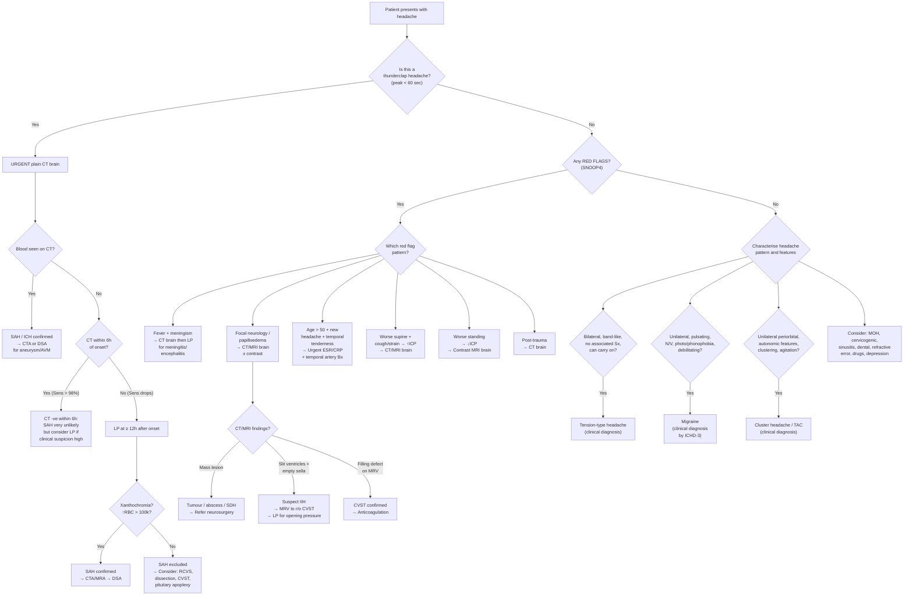

## Diagnostic Criteria for Primary Headache Syndromes

The **International Classification of Headache Disorders, 3rd edition (ICHD-3, 2018)** provides the gold-standard diagnostic criteria for all headache types. Primary headaches are clinical diagnoses — there is no blood test or imaging study that "confirms" them. The criteria exist to ensure diagnostic consistency and, crucially, to ensure that secondary causes have been appropriately considered.

---

### A. Tension-Type Headache (TTH) — ICHD-3 Criteria [3][4]

TTH is divided into **episodic** (infrequent or frequent) and **chronic** forms.

**Episodic TTH** (the most common):
1. At least **10 episodes** of headache occurring on < 15 days/month for ≥ 3 months
2. Lasting **30 minutes to 7 days**
3. At least **2 of the following 4** characteristics:
   - Bilateral location
   - Pressing / tightening (non-pulsating) quality — "band-like"
   - Mild or moderate intensity
   - **Not aggravated** by routine physical activity (walking, climbing stairs)
4. **Both** of the following:
   - No nausea or vomiting
   - No more than one of photophobia or phonophobia
5. Not better accounted for by another ICHD-3 diagnosis

> **Why these criteria work from first principles**: TTH arises from pericranial muscle tension, NOT trigeminovascular activation. So there is no pulsating quality (no vascular component), no worsening with physical activity (no meningeal sensitization), and no nausea/photophobia/phonophobia (no brainstem sensitization). These "negative" features distinguish it from migraine.

**Chronic TTH**: ≥ 15 days/month for > 3 months. Mild nausea is permitted but not moderate/severe nausea or vomiting.

---

### B. Migraine — ICHD-3 Criteria [3][4]

***Migraine patient defined as: ≥ 2 attacks with aura OR ≥ 5 attacks without aura*** [4].

#### Migraine Without Aura (80%)
1. At least **5 attacks** fulfilling criteria 2–4
2. Headache attacks lasting **4–72 hours** (untreated or unsuccessfully treated)
3. Headache has at least **2 of the following 4**:
   - Unilateral location
   - Pulsating quality
   - Moderate or severe pain intensity
   - Aggravation by or causing avoidance of routine physical activity
4. During headache, at least **1 of the following**:
   - Nausea and/or vomiting
   - Photophobia AND phonophobia
5. Not better accounted for by another ICHD-3 diagnosis

> ***Mnemonic: POUND*** — **P**ulsating, 4–72 h**O**urs, **U**nilateral, **N**ausea, **D**ebilitating [2].

#### Migraine With Aura (20%)
1. At least **2 attacks** fulfilling criteria 2 and 3
2. One or more fully reversible aura symptoms:
   - Visual (most common — 99%), sensory (31%), speech/language (18%), motor (6%), brainstem, retinal
3. At least **3 of the following 6**:
   - ≥ 1 aura symptom spreads gradually over ≥ 5 minutes
   - ≥ 2 aura symptoms occur in succession
   - Each individual aura symptom lasts 5–60 minutes
   - ≥ 1 aura symptom is unilateral
   - ≥ 1 aura symptom is positive (scintillations, pins and needles)
   - Aura accompanied or followed within 60 minutes by headache
4. Not better accounted for by another ICHD-3 diagnosis

> **Why must aura spread gradually?** Cortical spreading depression (CSD) propagates at 3–5 mm/min across the cortex. This slow march produces a visual aura that "builds" over minutes — unlike a vascular event (stroke/TIA) where onset is maximal within seconds. If a patient describes instantaneous onset of visual symptoms, think vascular, not migraine.

---

### C. Cluster Headache — ICHD-3 Criteria [4][6]

1. At least **5 attacks** fulfilling criteria 2–4
2. Severe or very severe **unilateral orbital, supraorbital and/or temporal pain** lasting **15–180 minutes** (untreated)
3. Either or both of the following:
   - **At least 1 ipsilateral autonomic sign**: conjunctival injection/lacrimation, nasal congestion/rhinorrhoea, eyelid oedema, forehead/facial sweating, miosis/ptosis (Horner's)
   - A sense of **restlessness or agitation**
4. Occurring with a frequency between one every other day and 8 per day
5. Not better accounted for by another ICHD-3 diagnosis

> **Key distinguisher from migraine**: cluster headache patients are **restless and agitated** (pacing, rocking); migraine patients **lie still** in a dark room. This reflects the different underlying neurobiology — in cluster headache, hypothalamic activation produces an "arousal" state, whereas in migraine, central sensitization makes all stimulation painful.

---

### D. Giant Cell Arteritis (GCA) — ACR 1990 Classification Criteria [10][24]

Diagnosis requires **≥ 3 of the following 5 criteria**:

| Criterion | Rationale |
|---|---|
| ***1. Age of onset ≥ 50 years*** | GCA virtually never occurs < 50yo — the granulomatous process targets age-degenerated arterial walls |
| ***2. New headache*** | New-onset or new-type headache in a previously headache-free elderly patient |
| ***3. Temporal artery abnormality on clinical examination*** | Tender, thickened, or reduced pulsation reflects vessel wall inflammation and possible thrombosis |
| ***4. Elevated ESR ( > 50 mm/h)*** | Systemic inflammation; IL-6 mediated acute phase response |
| ***5. Abnormal findings on biopsy of temporal artery*** | Panarteritis with granulomatous inflammation, giant cells, intimal thickening, fragmentation of internal elastic lamina [10][24] |

<Callout title="Start Steroids Before Biopsy!" type="error">
***Treatment is started upon presumed clinical diagnosis even despite negative initial investigations*** [10]. Biopsy should be performed within 1–2 weeks but must NOT delay corticosteroids — delay risks permanent blindness from AAION. Biopsy remains positive for at least 2 weeks after steroid initiation because granulomatous inflammation resolves slowly.
</Callout>

---

### E. Idiopathic Intracranial Hypertension (IIH) — Modified Dandy Criteria [5]

1. Signs and symptoms of ↑ICP (headache, papilloedema, TVOs, CN6 palsy, pulsatile tinnitus)
2. No localizing neurological signs (except CN6 palsy — a false localizing sign)
3. ***Normal brain parenchyma on neuroimaging*** with:
   - ***Small or normal ventricles ('slit' ventricles)***
   - ***Enlarged sella filled with CSF (empty sella sign)***
   - ***± MRV to rule out secondary ↑ICP due to CVST*** [5]
4. ***LP: ↑ opening pressure ( > 25 cmH₂O in adults) but normal CSF constituents*** [5]
5. No other identifiable cause of ↑ICP

> **Why MR venography is essential**: CVST can perfectly mimic IIH (headache + papilloedema + ↑ICP with "normal" brain parenchyma). The ONLY way to distinguish them is to look at the venous sinuses. Always order MRV before labelling someone with IIH.

---

## Diagnostic Algorithm for Headache

The algorithm below integrates the clinical history, examination, and investigation sequence used in practice [1][2][3][9][12].

---

## Investigation Modalities — Key Findings and Interpretations

### Guiding Principles [12][25]

- ***Plain CT is the imaging of choice in most acute settings*** [12]
- ***IV contrast for abscess, metastases, tumour, venous sinus thrombosis and angiography*** [12]
- ***MRI as a problem-solving tool for delineating tumours, epilepsy and demyelinating diseases*** [12]

---

### 1. History and Examination (The Most Important "Investigation")

***Key history*** [9]:
- ***A full description of the pain including a pain analysis should be obtained, especially associated symptoms***
- ***It is useful to get the patient to prepare a diary with a grid plotting the relative pain intensity with time of day***
- ***Family history, psychosocial history and drug history***

***Key examination*** [9]:
- ***Use the basic tools of trade: thermometer, sphygmomanometer, pen torch, diagnostic set with ophthalmoscope and stethoscope***
- ***Inspect the head, temporal arteries and eyes***
- ***Areas to palpate include the temporal arteries, the facial and neck muscles, the cervical spine and sinusitis, teeth and TMJs***
- ***Look for signs of meningeal irritation and papilloedema***
- ***A mental state examination is advisable***
- ***Perform a basic neurological examination***

> A thorough history and focused neurological examination will correctly classify ~95% of headache presentations. Investigations are reserved for red-flag features or diagnostic uncertainty.

---

### 2. Blood Tests

| Test | When to Order | Key Findings | Interpretation |
|---|---|---|---|
| ***FBE (Full Blood Examination)*** [9] | Baseline screening; suspected infection, anaemia, haematological malignancy | ↑WCC → infection; ↓Hb → anaemia; ↑platelets → reactive thrombocytosis (GCA) or essential thrombocythaemia | Anaemia itself can cause headache (↑cerebral blood flow for O₂ delivery compensation) |
| ***ESR / CRP*** [9][10][24] | Suspected GCA, infection, vasculitis | ***GCA: characteristically very high ESR (reaching 100 mm/h) with ↑CRP*** [10]; NcNc anaemia, reactive thrombocytosis | ESR > 50 is one of the ACR criteria for GCA; CRP rises and falls faster than ESR → useful for monitoring treatment response |
| **Glucose** | Suspected hypoglycaemia, DM | ↓glucose → hypoglycaemia headache; ↑glucose → DM (risk factor for stroke) | Hypoglycaemia causes headache via compensatory cerebral vasodilation |
| **Coagulation screen (PT/aPTT/INR)** | On anticoagulation, suspected coagulopathy, pre-LP | Prolonged → ↑bleeding risk; must correct before LP | Coagulopathy predisposes to ICH and SDH [14] |
| **TFT** | Suspected hypothyroidism | ↑TSH, ↓fT4 → hypothyroidism | Hypothyroidism a/w headache (possibly via ↑CSF pressure) |
| **24h urine fractionated metanephrines / plasma metanephrines** | Suspected phaeochromocytoma (paroxysmal headache + sweating + palpitations + HTN) | ***24h urine fractionated metanephrines: Sens 98% Spec 98%*** [20] | Elevated metanephrines confirm catecholamine-secreting tumour |

---

### 3. Neuroimaging

This is the workhorse investigation for secondary headache.

#### A. Non-Contrast CT Brain (NCCT) [12][25][26]

**When**: ***First-line imaging for acute headache*** [12]. Specifically:
- ***Thunderclap headache*** [12]
- ***Red flags: new-onset, Hx of CA/immunodeficiency, coagulopathy or on anticoagulation, with mental status changes, with meningitic features, with focal neurology, progressive deterioration*** [12]
- Head trauma with indications (Canadian CT Head Rule or New Orleans Criteria) [27]

**Why CT first?** CT is fast (~1 minute scan time), widely available, excellent at detecting acute blood (which appears hyperdense/white) and bony pathology. It is the most time-efficient way to answer the critical question: "Is there blood?"

| Condition | CT Findings | Why It Looks That Way |
|---|---|---|
| ***SAH*** | ***Hyperdensity in basal cisterns around circle of Willis (65%) or Sylvian fissure (30%)*** [13] | Fresh blood is hyperdense due to high protein content of haemoglobin; blood pools in dependent cisterns by gravity |
| **ICH** | Hyperdense lesion within brain parenchyma; ***common sites: pons, cerebellum, putamen, thalamus*** (hypertensive) or lobar (CAA) [14] | Acute blood = hyperdense; oedema surrounding = hypodense; ***attenuation changes with time: acute = hyperdense → subacute = isodense → chronic = hypodense*** [26] |
| **EDH** | ***Biconvex (lentiform) extra-axial hyperdensity that does not cross sutures*** [12][25] | Arterial blood strips dura from inner skull table; extent limited by suture attachments because dura (endosteal layer) crosses through sutures; shape is biconvex because high-pressure arterial blood pushes the dura inward |
| **SDH** | Crescent-shaped extra-axial collection that crosses sutures but not the midline falx | Venous blood spreads freely in the subdural space (no dural attachments to sutures); crescent-shaped because it conforms to brain surface; acute = hyperdense, subacute = isodense (the dangerous "invisible" SDH), chronic = hypodense |
| **Hydrocephalus** | Dilated ventricles ± periventricular hypodensity (transependymal CSF seepage) | CSF accumulation distends ventricles; pressure forces CSF across ependyma into periventricular white matter |
| **Mass lesion** | Hypodense/isodense/mixed density lesion ± surrounding oedema ± midline shift | Tumour tissue may be of varying density; oedema is vasogenic (from BBB disruption) → hypodense |

**Sensitivity of CT for SAH** is time-dependent:
- **Within 6 hours**: > 98% (nearly 100% with modern scanners) — if CT is truly negative at < 6h, some guidelines now allow discharge without LP in low-risk patients
- **At 12 hours**: ~93%
- **At 24 hours**: ~86%
- **At 1 week**: ~50%
- **After 2 weeks**: may be completely normal

> This is why LP remains essential when CT is negative but clinical suspicion for SAH persists — especially if presentation > 6h from onset.

#### B. Contrast CT Brain [12][25][28]

**When**: Suspected intracranial infection, tumour, inflammatory lesion, vascular pathologies.

| Condition | Findings | Interpretation |
|---|---|---|
| **Brain abscess** | Ring-enhancing lesion with surrounding oedema | Contrast enhancement indicates BBB disruption; ring = capsule wall of abscess which is highly vascularized |
| **Tumour** | ***Normal brain tissue does not enhance (due to BBB). Enhancement indicates: (1) outside BBB (e.g. meningioma — homogeneously enhancing) or (2) disruption of BBB (e.g. high-grade tumours, inflammation)*** [28] | Low-grade tumours may not enhance; high-grade gliomas and metastases typically show avid ring or heterogeneous enhancement |
| **CTA** | Opacified vessels showing aneurysm, dissection, stenosis, or thrombus | ***CT angiography: use of rapid injection of large IV bolus of contrast to opacify vessels*** [26]; identifies aneurysm location for SAH surgical planning |

#### C. MRI Brain [12][25][29]

**When**: MRI is a ***problem-solving tool*** — used for clinically stable patients when CT is non-diagnostic or when greater soft tissue detail is needed.

***MRI is more sensitive than CT except in acute haemorrhage, bony lesions, and calcific lesions*** [12].

| Sequence | What It Shows Best | Clinical Use in Headache |
|---|---|---|
| **T1-weighted** | Anatomy (CSF = dark, fat = bright). **T1 + gadolinium contrast**: enhancing lesions | Tumour delineation, meningeal enhancement (meningitis, leptomeningeal carcinomatosis, intracranial hypotension) |
| **T2-weighted / FLAIR** | Oedema, gliosis, demyelination (bright). CSF is bright on T2, dark on FLAIR | White matter lesions, MS plaques, vasogenic oedema around tumours |
| ***DWI (Diffusion-Weighted Imaging)*** | ***Restricted diffusion = bright on DWI, dark on ADC*** | ***Early ischaemic stroke (within minutes!)*** [29] — DWI is the most sensitive early indicator; also bright in abscess (restricted diffusion of pus) |
| **SWI / GRE** | Microbleeds, old blood products (dark "blooming") | Cerebral amyloid angiopathy (lobar microbleeds), chronic hypertensive microbleeds (deep), cavernomas |
| ***MRV (MR venography)*** | Venous sinus patency | ***CVST: filling defect in venous sinus; empty delta sign (superior sagittal sinus involvement)*** [13]; essential to exclude before diagnosing IIH [5] |
| **MRA** | Arterial anatomy without iodinated contrast | Aneurysm detection, arterial dissection (intramural haematoma), stenosis |

**MRI in intracranial hypotension** [5]:
- ***Diffuse pachymeningeal enhancement (due to ↑blood volume as compensatory mechanism via Monro-Kellie doctrine)***
- ***Dilated veins, sagging brain*** (brain "droops" from loss of CSF buoyancy)
- ***± pocket of CSF at site of leakage***

**MRI in IIH** [5]:
- ***Normal brain parenchyma with small/normal ventricles ('slit' ventricles)***
- ***Enlarged sella filled with CSF (empty sella sign)***
- Flattening of posterior globe, distension of optic nerve sheaths

**Comparison: CT vs MRI in stroke** [26][29]:

| Feature | CT | MRI |
|---|---|---|
| Radiation | Yes | No |
| Examination time | ~1 minute | ~20 minutes |
| Availability | Good | Fair |
| ***Sensitivity for infarct*** | ***Poor*** (especially < 24h; ~48% < 1 day) | ***Good*** (DWI positive within minutes) |
| ***Sensitivity for haemorrhage*** | ***Good*** | ***Good*** (SWI/GRE) |

> **Why is CT poor for early infarct?** Cytotoxic oedema in early ischaemia causes only subtle density changes — mild hypodensity with loss of grey-white junction. These changes take hours to become apparent on CT. MRI DWI detects restricted water diffusion from cellular swelling within minutes.

---

### 4. Lumbar Puncture (LP) and CSF Analysis

LP is performed when you need to analyze CSF directly. **Always do CT before LP if raised ICP is suspected** — LP in the presence of a mass lesion risks transtentorial herniation (removing CSF from below creates a pressure gradient that "sucks" brain tissue downward through the tentorium).

| Indication in Headache | Key CSF Findings | Interpretation |
|---|---|---|
| **SAH (CT-negative)** | ***Bloody CSF, xanthochromia (12h to 12d), persistent ↑RBC > 100,000, ↑protein*** [13] | Xanthochromia = yellow discoloration from bilirubin (formed by in-vivo breakdown of haemoglobin in CSF — takes ≥ 12h). This distinguishes true SAH from traumatic tap (where RBC count drops between tubes and there is no xanthochromia) |
| **Meningitis / encephalitis** | ↑WCC (neutrophilic in bacterial, lymphocytic in viral/TB), ↑protein, ↓glucose (bacterial/TB), +ve culture/PCR | Bacterial: turbid, WCC > 1000, protein > 1g/L, glucose < 40% serum. TB: ***↑OP 18–30cmH₂O, ↑protein 1–5g/L, ↓glucose < 2.5mmol/L, lymphocytic pleocytosis 100–500/μL, AFB smear Sens 30–60%*** [23] |
| ***IIH*** | ***↑ opening pressure ( > 25 cmH₂O) but normal constituents*** [5] | Confirms ↑ICP; normal protein, glucose and cells exclude infection and malignancy |
| **Intracranial hypotension** | ↓ opening pressure ( < 6 cmH₂O) | Low pressure confirms CSF leak |
| **Carcinomatous meningitis** | ↑protein, ↓glucose, lymphocytic pleocytosis, +ve cytology for malignant cells | CSF cytology has ~50% sensitivity on first sample → repeat if suspicious |

> **LP timing for SAH**: Must wait ≥ 12 hours after symptom onset before performing LP for SAH workup. This allows enough time for bilirubin to form (xanthochromia), which is the distinguishing feature from a traumatic tap.

---

### 5. Vascular Imaging

| Modality | Indication | Key Findings |
|---|---|---|
| **CTA (CT Angiography)** | SAH (identify aneurysm), suspected dissection, suspected CVST | Aneurysm seen as contrast-filled outpouching at arterial bifurcation; dissection shows intimal flap or tapered occlusion; CVST shows filling defect |
| **MRA (MR Angiography)** | Non-invasive alternative to CTA; aneurysm screening, dissection | Intramural haematoma in dissection appears as crescent-shaped bright signal on T1 fat-sat |
| ***DSA (Digital Subtraction Angiography)*** | Gold standard for cerebral aneurysms; when CTA/MRA equivocal | Definitive identification of aneurysm morphology and vascular anatomy for surgical planning. ***Now mainly therapeutic rather than purely diagnostic*** (coiling of aneurysms) [26] |
| ***Colour Doppler USG of head and neck*** | Suspected GCA when biopsy not immediately available; carotid stenosis | ***Halo sign*** in GCA — hypoechoic ring around temporal artery representing vessel wall oedema |

---

### 6. Temporal Artery Biopsy [10][24]

- **When**: Suspected GCA (new headache in > 50yo + ↑ESR + temporal artery abnormalities)
- **What it shows**: ***Panarteritis with mixed infiltrates with fragmentation of intima and necrosis of media ± giant cells*** [10]
- **Pitfall**: May be **falsely negative** due to **patchy ("skip") inflammation** — a 2cm or longer biopsy segment is recommended; contralateral biopsy if first is negative but suspicion remains high
- **Timing**: Should be done within 1–2 weeks of starting steroids (histological changes persist for at least 2–4 weeks after steroid initiation)

---

### 7. Ophthalmological Assessment

| Finding | Technique | Significance |
|---|---|---|
| ***Papilloedema*** | ***Fundoscopy with direct ophthalmoscope*** — swollen disc with blurred edges, dilated superficial capillaries, NO spontaneous venous pulsation of CRV [16] | Indicates ↑ICP → immediate CT/MRI to r/o SOL and hydrocephalus → LP if imaging normal |
| **Visual fields (VF)** | Confrontation VF, formal perimetry | Enlarged blind spot (acute papilloedema), bitemporal hemianopia (pituitary adenoma compressing chiasm [17]), altitudinal defect (AAION [10]) |
| **Intraocular pressure (IOP)** | Tonometry | ↑IOP > 21mmHg → acute angle-closure glaucoma |
| **RAPD (Relative Afferent Pupillary Defect)** | Swinging flashlight test | Present in optic neuritis (the affected eye has ↓pupillary constriction when light swung to it); absent in papilloedema (bilateral equal involvement) |

---

### 8. Condition-Specific Investigations — Summary by Diagnosis

| Suspected Diagnosis | Key Investigations | Findings |
|---|---|---|
| ***SAH*** | ***CT brain → LP (if CT -ve) → CTA/MRA → DSA*** [13] | CT: hyperdensity in basal cisterns; LP: xanthochromia; CTA/DSA: aneurysm |
| ***ICH*** | ***Urgent NCCT brain*** [14]; vascular imaging if non-hypertensive aetiology suspected (***no HT, age < 40–45, atypical location, CT abnormality***) [14] | CT: parenchymal hyperdensity ± IVH/hydrocephalus ± mass effect |
| ***EDH*** | ***CT brain*** [11][25] | Biconvex hyperdensity not crossing sutures ± skull fracture |
| ***SDH*** | ***CT brain*** [11][25] | Crescent hyperdensity (acute) or hypodensity (chronic) crossing sutures |
| ***Meningitis*** | CT brain → LP (CSF analysis, Gram stain, culture, PCR) [21][23] | Turbid CSF, ↑WCC, ↑protein, ↓glucose, +organism |
| ***CVST*** | ***CT brain (can be normal!) → MRI brain + MR venogram*** [13] | ***Empty delta sign on contrast CT; filling defect on MRV*** |
| ***GCA*** | ***Urgent ESR/CRP, FBE → temporal artery biopsy*** [10][24] | ***Very high ESR; biopsy: granulomatous arteritis ± giant cells*** |
| ***IIH*** | ***MRI brain (normal parenchyma, slit ventricles, empty sella) + MRV (r/o CVST) → LP (↑OP, normal CSF)*** [5] | Diagnosis of exclusion after CVST ruled out |
| ***Intracranial hypotension*** | ***Contrast MRI brain*** [5]; ± CSF flow study/MR myelogram | ***Diffuse pachymeningeal enhancement, dilated veins, sagging brain*** |
| **Pituitary adenoma/apoplexy** | ***Contrast MRI (modality of choice)*** [17]; pituitary hormone profile; visual field assessment | MRI: sellar mass ± haemorrhage; hormone panel: hyper- or hypo-secretion |
| **Cerebral tumour** | CT brain ± contrast → MRI with contrast [28] | Mass lesion ± oedema ± enhancement ± midline shift |
| **Dissection (carotid/vertebral)** | ***Vascular imaging: Doppler, MR or CT angiogram*** [21] | CTA: intimal flap, tapered occlusion; MRI T1 fat-sat: crescent intramural haematoma |
| **Sinusitis** | ***Imaging of nasal sinuses*** (CT sinuses) [21] | Mucosal thickening, air-fluid levels, opacification of sinuses |

---

<Callout title="High Yield — Investigation Priorities for Headache">

1. **Most headaches need NO investigations** — primary headaches (TTH, migraine, cluster) are clinical diagnoses based on ICHD-3 criteria.
2. ***Key investigations to consider: FBE, ESR/CRP, selective radiography (skull XR, sinus XR, CT scan or MRI scan)*** [9].
3. **Thunderclap headache**: urgent NCCT → LP (if CT -ve, at ≥ 12h) → CTA/DSA.
4. **CT is king in acute setting**: fast, detects blood and fractures. MRI is the problem-solver for subacute/chronic.
5. **Never LP without CT first** if raised ICP suspected — risk of herniation.
6. **GCA**: start steroids → then biopsy. Do not delay treatment for histology.
7. **IIH**: MRI + MRV (to exclude CVST) → LP for opening pressure. Diagnosis of exclusion.
8. **EDH vs SDH on CT**: Biconvex (lentiform), doesn't cross sutures = EDH; Crescent, crosses sutures = SDH.

</Callout>

---

<ActiveRecallQuiz
  title="Active Recall - Diagnosis of Headache"
  items={[
    {
      question: "State the ICHD-3 criteria for migraine without aura.",
      markscheme: "At least 5 attacks lasting 4-72h. At least 2 of: unilateral, pulsating, moderate-severe, aggravated by routine activity. At least 1 of: nausea/vomiting OR photophobia AND phonophobia. Not attributable to another disorder.",
    },
    {
      question: "A patient presents with thunderclap headache. CT brain at 3 hours is normal. What is the next step and why?",
      markscheme: "CT within 6h has greater than 98% sensitivity for SAH. Some centres accept negative CT at under 6 hours to exclude SAH, but if clinical suspicion remains high, perform LP at at least 12 hours post-onset looking for xanthochromia, which distinguishes SAH from traumatic tap by confirming in-vivo bilirubin formation from haemoglobin breakdown.",
    },
    {
      question: "On CT brain, how do you distinguish an epidural haematoma from a subdural haematoma? Explain the anatomical basis.",
      markscheme: "EDH: biconvex or lentiform shape, does not cross sutures because the dura (endosteal layer) attaches firmly at suture lines limiting spread. Usually arterial (MMA), high pressure pushes dura inward. SDH: crescent-shaped, crosses sutures because blood spreads freely in the subdural space (no suture attachments). Usually venous (bridging veins).",
    },
    {
      question: "What investigations are needed before diagnosing idiopathic intracranial hypertension and why?",
      markscheme: "MRI brain showing normal parenchyma with slit ventricles and empty sella sign, PLUS MR venography to exclude CVST (which can mimic IIH perfectly), PLUS LP showing raised opening pressure greater than 25 cmH2O with normal CSF constituents. CVST must be excluded because it is a treatable secondary cause of raised ICP that looks identical on non-venographic MRI.",
    },
    {
      question: "List the ACR 1990 classification criteria for giant cell arteritis. How many are needed for diagnosis?",
      markscheme: "Need 3 or more of 5: (1) Age onset 50 years or over, (2) New headache, (3) Temporal artery abnormality on examination (tender, thickened, reduced pulsation), (4) ESR greater than 50, (5) Abnormal temporal artery biopsy (granulomatous inflammation with giant cells). Treatment must not be delayed for biopsy if clinical suspicion high.",
    },
    {
      question: "Why is DWI MRI superior to CT for early ischaemic stroke detection? What does restricted diffusion mean?",
      markscheme: "DWI detects restricted diffusion within minutes of ischaemia onset, while CT shows only subtle hypodensity that takes hours to develop (sensitivity less than 50 percent on day 1). Restricted diffusion means cytotoxic oedema: ischaemic neurons swell, reducing extracellular water space, so water molecules cannot move freely. This appears bright on DWI and dark on ADC map.",
    },
  ]}
/>

## References

[1] Senior notes: Ryan Ho Fundamentals.pdf (Section 3.4.1 Headache)
[2] Senior notes: Ryan Ho Neurology.pdf (Section 2.1 Approach to Headache, pp. 56–58)
[3] Senior notes: Ryan Ho Neurology.pdf (D/dx table pp. 57–58, 60; Primary headache differentiation p. 58)
[4] Senior notes: Ryan Ho Neurology.pdf (Section 2.2 Primary Headache Syndromes — TTH p. 61, Migraine pp. 61–63, Cluster p. 64)
[5] Senior notes: Ryan Ho Neurology.pdf (Section 4 IIH and Intracranial Hypotension, p. 158)
[9] Lecture slides: murtagh merge.pdf (pp. 58–60, Headache — Key history, Key examination, Key investigations, Diagnostic tips)
[10] Senior notes: Ryan Ho Rheumatology.pdf (Section 3.6.1 GCA and PMR, p. 95)
[11] Senior notes: felixlai.md (Sections II–V: EDH and SDH)
[12] Senior notes: Ryan Ho Radiology.pdf (Section 2.2 Choice of Modality, p. 17)
[13] Senior notes: maxim.md (Section 5.2 SAH and CVST)
[14] Senior notes: maxim.md (Intracerebral haemorrhage)
[16] Senior notes: Ryan Ho Opthalmology.pdf (Papilloedema, p. 90)
[17] Senior notes: Ryan Ho Endocrine.pdf (Pituitary tumour pp. 106–107)
[20] Senior notes: Ryan Ho Endocrine.pdf (Phaeochromocytoma p. 66)
[21] Senior notes: Ryan Ho Neurology.pdf (Investigation table by cause, p. 60)
[23] Senior notes: Ryan Ho Respiratory.pdf (Diagnosis of TBM, p. 79)
[24] Senior notes: Ryan Ho Neurology.pdf (GCA diagnostic criteria, p. 65)
[25] Senior notes: Ryan Ho Radiology.pdf (EDH and SAH imaging, p. 20)
[26] Senior notes: Ryan Ho Diagnostic Radiology.pdf (CT in stroke pp. 40–43)
[27] Senior notes: felixlai.md (Canadian CT Head Rule and New Orleans Criteria, p. 1661)
[28] Senior notes: Ryan Ho Neurology.pdf (Brain tumour investigations, p. 162)
[29] Senior notes: Ryan Ho Diagnostic Radiology.pdf (MRI in acute stroke, p. 50)
