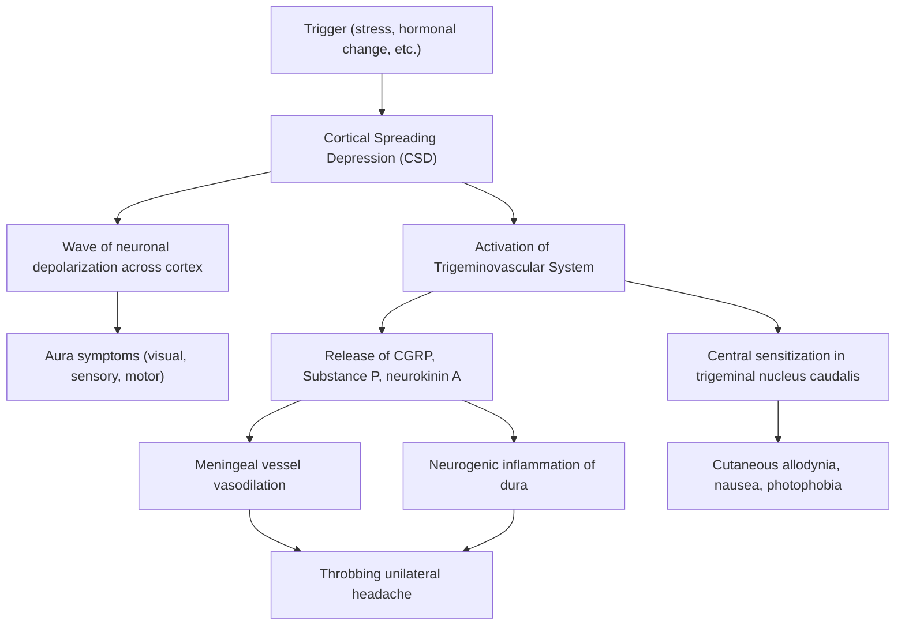

## Definition

**Headache (cephalalgia)** — from Greek *kephalē* (head) + *algos* (pain) — is **pain or discomfort felt over the head or face** [1][2].

- It is the **most common type of pain experienced** by humans [1][2].
- It **causes considerable worry but rarely represents sinister disease** [1][2] — roughly 90% of headaches presenting to primary care are benign primary headaches.
- The clinical challenge is to efficiently identify the dangerous minority (~10%) who harbour a serious secondary cause.

> **Key concept:** The brain parenchyma itself has NO pain receptors. Headache arises from stimulation of nociceptors in pain-sensitive structures *around* the brain — vessels, meninges, scalp, orbit, sinuses and ears. Understanding which structures are pain-sensitive is the foundation for understanding every headache syndrome.

---

## Epidemiology

### Global Burden
- Tension-type headache (TTH) is the **most frequent cause of headache** globally [1][2], with a lifetime prevalence of **70% in males and 90% in females** [3].
- Migraine affects roughly **15% of women and 6% of men** worldwide [3].
- Cluster headache is uncommon: **0.1% lifetime risk**, M:F = 4.3:1 [4].
- Medication-overuse headache (MOH) affects ~1–2% of the general population but up to 50% of chronic headache referrals.

### Hong Kong Context
- Stroke (a secondary cause of headache) is the **2nd–3rd leading cause of death in China and Hong Kong** [6].
- Hypertension prevalence ~20% in HK [7] — relevant because **malignant hypertension** (BP ≥ 220/120 + Grade 3–4 fundal changes) can present with severe headache and is a medical emergency [8].
- ***Drugs that may cause headache: alcohol, analgesics (rebound), caffeine, antihypertensives (several), COCP, corticosteroids, NSAIDs (esp. indomethacin), vasodilators esp. nitrates, sildenafil*** [9].
- ***Hypertension is an uncommon cause of headache*** — a point often over-estimated by students [9].

### Age and Sex Patterns
- ***A patient > 55 years presenting with unaccustomed headache probably has an organic cause*** [9].
- Giant cell arteritis (GCA) — the commonest primary vasculitis — has an incidence of ~20/100k/year in those > 50 years, F:M = 2:1, and **rarely occurs before age 50** [10].
- Idiopathic intracranial hypertension (IIH) tends to occur in **obese women of child-bearing age**, incidence 1–2/100k/year [5].

---

## Anatomy and Pain-Sensitive Structures

Understanding headache requires knowing what can actually *hurt* inside and outside the skull.

### Intracranial Pain-Sensitive Structures [1][2]
| Structure | Innervation | Clinical Relevance |
|---|---|---|
| **Venous sinuses** (superior sagittal, transverse, sigmoid) | CN V (ophthalmic division V1), upper cervical nerves | Cerebral venous sinus thrombosis → headache |
| **Cortical veins** | CN V | Cerebral venous infarction |
| **Basal arteries** (circle of Willis, proximal segments) | CN V, IX, X | SAH → thunderclap headache because blood irritates these arterial walls |
| **Dura mater** (especially basal dura) | CN V (V1 = anterior fossa & tentorium; V2/V3 = middle fossa); C1–C3 = posterior fossa dura | Mass effect, meningitis, intracranial hypotension |

> The **brain parenchyma** itself and the **ependymal lining** of ventricles are **NOT pain-sensitive**. A slowly growing tumour can become massive before headache develops — headache only occurs when it stretches the dura, displaces vessels, or raises ICP.

### Extracranial Pain-Sensitive Structures [1][2]
- **Scalp**: vessels (superficial temporal artery — palpated in GCA) and muscles (frontalis, temporalis, occipitalis — spasm in TTH)
- **Orbit**: globe, extraocular muscles, periorbita (acute glaucoma headache)
- **Cavities**: oral (dental), nasal, paranasal sinuses (sinusitis)
- **Ear**: external and middle ear (otitis)

### Dural Innervation — Why Location Matters

The dura in different cranial fossae is innervated by different nerves:
- **Anterior cranial fossa**: V1 (ophthalmic) → referred pain to forehead/eye
- **Middle cranial fossa**: V2/V3 (maxillary/mandibular) → referred pain to temple/cheek
- **Posterior cranial fossa**: C1–C3 (upper cervical) → referred pain to occiput/neck

This is why a posterior fossa tumour causes occipital headache, while a frontal mass causes frontal headache.

### Vascular Anatomy Relevant to Headache

**Meningeal arteries:**
- The **middle meningeal artery (MMA)** runs through the foramen spinosum and along the inner skull table of the temporal bone. Temporal bone fracture → MMA laceration → **epidural haematoma (EDH)** [11][12].
- EDH bleeds are **arterial (85%)**, explaining why they progress rapidly (the "lucid interval" — patient initially compensates, then deteriorates as arterial bleeding accumulates).

**Bridging veins:**
- Drain from cerebral cortex across the subdural space to the dural venous sinuses.
- Stretched in cerebral atrophy (elderly, alcoholics) → vulnerable to shearing during acceleration/deceleration → **subdural haematoma (SDH)** [11][12].
- SDH bleeds are **venous (majority)**, explaining their slower accumulation and chronic presentations.

**Circle of Willis:**
- Berry aneurysms form at bifurcation points (particularly anterior communicating artery, posterior communicating artery, MCA bifurcation).
- Rupture → **subarachnoid haemorrhage (SAH)** with blood in the basal cisterns irritating pain-sensitive basal arteries → thunderclap headache [13][14].

---

## Risk Factors

### For Primary Headaches
| Risk Factor | Mechanism |
|---|---|
| **Family history** (especially migraine — +ve in 70%) | Genetic predisposition to cortical hyperexcitability and trigeminovascular activation [3] |
| **Female sex** | Oestrogen fluctuations trigger migraine (perimenstrual, OCP-related); IIH more common in women [3][5] |
| **Stress, anxiety, depression** | Drives chronic muscular tension and central sensitisation → TTH [3] |
| **Obesity** | Major risk factor for IIH (mechanism: ↑intra-abdominal pressure → ↑intrathoracic pressure → ↑central venous pressure → ↓CSF reabsorption) [5] |
| **Dietary triggers** | ***Alcohol, chocolate, tyramine-containing foods (dairy), starvation, caffeine*** [15] |
| ***Hormonal factors*** | ***Premenstrual or related to OCP (fluctuation in oestrogen)*** [15] |
| **Medication overuse** | Analgesics > 15 days/month or triptans/ergotamine > 10 days/month → MOH [15] |

### For Secondary Headaches
| Risk Factor | Associated Condition |
|---|---|
| **Hypertension** | Hypertensive encephalopathy, ICH, malignant HTN [7][8] |
| **Anticoagulation / coagulopathy** | ICH, SDH, EDH [11][14] |
| **Age > 50** | GCA, cerebral tumour, SDH [9][10] |
| **Cerebral atrophy (elderly, chronic alcoholism)** | SDH (stretched bridging veins) [11] |
| **Immunodeficiency** | Intracranial abscess, fungal meningitis, CNS lymphoma |
| **Pregnancy / OCP / COC use** | Cerebral venous thrombosis (F > M), IIH, eclampsia [5][13] |
| ***Drugs: OCP, tetracycline, nalidixic acid, vitamin A, systemic steroid withdrawal*** | IIH [5] |
| **Smoking** | Stroke (dose-response); cluster headache |
| **Recent head trauma** | EDH, SDH, SAH, post-concussion syndrome [11][12] |

---

## Pathophysiology

### General Mechanism of Headache [1][2]

**Headache results from pressure, traction, displacement, or inflammation of nociceptors in pain-sensitive structures of the head.**

These nociceptors are found on:
1. **Blood vessels** (intracranial and extracranial)
2. **Meninges** (particularly the dura)
3. **Muscles and periosteum** of the scalp
4. **Cranial nerves** (especially V, IX, X) and upper cervical nerve roots (C1–C3)

The signal travels via:
- **Trigeminal nerve (CN V)** for pain above the tentorium cerebelli (forehead, temples, vertex)
- **Upper cervical nerves (C1–C3)** for pain from the posterior fossa and occiput
- The **trigeminocervical complex** in the upper spinal cord is where these converge — this is why neck stiffness and occipital pain so commonly accompany headache

### Pathophysiology by Headache Type

#### 1. Tension-Type Headache (TTH) [3]
- **Incompletely understood** but thought to be **muscular in origin**
- Likely represents a **misinterpretation of sensory afferents from epicranial muscles as pain** — peripheral sensitization of myofascial nociceptors + central sensitization
- Associated with stress, anxiety, and underlying depression
- Chronic TTH involves **central sensitization** — the brain's pain-processing system becomes "turned up," so normal muscle signals are perceived as painful

#### 2. Migraine [3]
The pathophysiology of migraine is a multi-step process:

- **Cortical spreading depression (CSD)**: a wave of neuronal and glial depolarization that spreads across the cortex at 3–5mm/min. This explains the **visual aura** — the wave crosses the occipital cortex, producing a scintillating scotoma that "marches" across the visual field over ~20 minutes.
- **Trigeminovascular activation**: CSD activates trigeminal afferents on meningeal blood vessels → release of **CGRP (calcitonin gene-related peptide)** → vasodilation + neurogenic inflammation → throbbing pain.
- CGRP is the key mediator — this is why **CGRP antagonists (e.g., erenumab, fremanezumab, galcanezumab)** are effective prophylactics [15].
- **Central sensitization** explains photophobia, phonophobia, nausea (activation of brainstem nuclei including the nucleus tractus solitarius for vomiting).

#### 3. Cluster Headache [4]
- **Pathophysiology: unknown, associated with abnormal hypothalamic or thalamic activity** and **paroxysmal discharges of central trigeminal and parasympathetic pathways** [4]
- The **hypothalamus** is the "biological clock" of the body — this explains the **clockwork regularity** of attacks (same time daily) and the **seasonal clustering**.
- Activation of the **trigeminal-autonomic reflex** → parasympathetic outflow via CN VII → lacrimation, nasal congestion, conjunctival injection
- Sympathetic dysfunction (due to carotid periarteriolar inflammation) → transient **Horner's syndrome** (~30–50%) [4]

#### 4. Raised Intracranial Pressure (ICP) [5][16]
- ICP is determined by the Monro-Kellie doctrine: **Brain + Blood + CSF = constant volume** within the rigid skull
- If any one component increases (tumour, haemorrhage, hydrocephalus, cerebral oedema), the others must decrease or ICP rises
- **↑ICP → traction on pain-sensitive dura and basal vessels → headache**
- Classic features: headache **worse in the morning** (because recumbency ↑venous return to brain → ↑ICP), **worse with coughing/straining/bending** (↑intrathoracic pressure → ↑jugular venous pressure → ↑ICP), associated with nausea/vomiting (pressure on area postrema in floor of 4th ventricle)
- **Papilloedema**: ↑ICP → transmitted along subarachnoid space of optic nerve sheath → "tourniquet" effect on optic nerve → ↓axoplasmic outflow from optic disc → axonal swelling = disc oedema [16]

#### 5. Subarachnoid Haemorrhage (SAH) [13][14]
- **85% due to ruptured cerebral aneurysm** (berry aneurysm) among non-traumatic causes
- Blood at high pressure enters the subarachnoid space → directly irritates nociceptors on basal arteries and meninges → **sudden-onset "thunderclap" / worst headache ever** [13]
- Blood in CSF → meningeal irritation → neck stiffness, photophobia
- Subsequent vasospasm (peak days 4–14) due to blood breakdown products irritating arterial walls → delayed cerebral ischaemia

#### 6. Intracranial Hypotension [5]
- Cause: CSF leak (post-LP, spontaneous arachnoid tear)
- **Pathophysiology: brain no longer floats in CSF → traction on anchoring/supporting structures** (dura, bridging veins, cranial nerves) [5]
- Classic feature: **orthostatic headache that promptly resolves upon lying down** — when upright, gravity pulls the brain down, increasing traction; when supine, the brain is supported again

#### 7. Giant Cell Arteritis (GCA) [10]
- Granulomatous inflammation of medium-large arteries (especially superficial temporal artery)
- Intimal thickening + inflammatory infiltrate → **luminal narrowing → ischaemia** of supplied tissues
- Temporal headache: inflamed, swollen temporal artery wall stretches periarteriolar nociceptors
- **Jaw claudication**: ischaemia of the masseter muscle (supplied by branches of the external carotid) during chewing
- **AAION (anterior arteritic ischaemic optic neuropathy)**: posterior ciliary artery occlusion → optic nerve head infarction → sudden visual loss

#### 8. Meningitis
- Infection → inflammatory exudate in subarachnoid space → direct stimulation of meningeal nociceptors → headache
- Inflammation of meninges → reflex protective muscle spasm → neck stiffness (Kernig's and Brudzinski's signs)

---

## Classification

### Primary vs Secondary — The Fundamental Division [1][2]

| Category | Definition | Examples |
|---|---|---|
| ***Primary headache (~90%)*** | ***Benign headaches that do NOT arise from structural brain lesions*** [1][2] | TTH, migraine, cluster headache, other TACs |
| ***Secondary headache*** | ***Headache occurs as a symptom of an underlying disease*** [1][2] | SAH, ICH, meningitis, GCA, tumour, IIH, etc. |

### International Classification of Headache Disorders (ICHD-3, 2018)

The ICHD-3 is the gold-standard classification:

**Part 1: Primary Headaches**
1. Migraine
2. Tension-type headache
3. Trigeminal autonomic cephalalgias (TACs) — cluster headache, paroxysmal hemicrania, SUNCT/SUNA, hemicrania continua
4. Other primary headaches (cough headache, exercise headache, sexual headache, thunderclap headache, cold-stimulus headache, etc.)

**Part 2: Secondary Headaches**
5. Headache attributed to trauma or injury to the head and/or neck
6. Headache attributed to cranial or cervical vascular disorder (SAH, ICH, dissection, GCA, CVST)
7. Headache attributed to non-vascular intracranial disorder (↑ICP, ↓ICP, neoplasm)
8. Headache attributed to a substance or its withdrawal (MOH, nitrate headache, caffeine withdrawal)
9. Headache attributed to infection (meningitis, encephalitis, abscess)
10. Headache attributed to disorder of homeostasis (hypoxia, hypertension, hypothyroidism)
11. Headache attributed to disorder of cranium, neck, eyes, ears, nose, sinuses, teeth, mouth, or other facial/cervical structure
12. Headache attributed to psychiatric disorder

**Part 3: Painful Cranial Neuropathies and Other Facial Pains**
13. Trigeminal neuralgia, glossopharyngeal neuralgia, occipital neuralgia
14. Other headache disorders

### By Temporal Profile (Clinically Useful)

| Pattern | Examples | Key Feature |
|---|---|---|
| **Sudden onset (seconds)** | SAH, ICH, cerebral venous thrombosis, pituitary apoplexy, arterial dissection | Thunderclap — must rule out SAH |
| **Acute (hours–days)** | Meningitis, acute glaucoma, first migraine, sinusitis, acute respiratory infection | Febrile illness, focal signs, eye pain |
| **Subacute (days–weeks)** | GCA, IIH, subdural haematoma, cerebral tumour | Progressive, new in elderly |
| **Chronic/recurrent** | TTH, migraine, cluster headache, MOH | Pattern recognition key |

### ***Murtagh's Probability Diagnosis*** [9]
***Acute: respiratory infection***
***Chronic: tension-type headache, combination headache, migraine, transformed migraine***

### ***Murtagh's Serious Disorders Not to Be Missed*** [9]
- ***Cardiovascular: subarachnoid haemorrhage, intracranial haemorrhage, carotid or vertebral artery dissection, temporal arteritis, cerebral venous thrombosis***
- ***Neoplasia: cerebral tumour, pituitary tumour***
- ***Infection: meningitis (esp. fungal), encephalitis, intracranial abscess***
- ***Haematoma: extradural/subdural***
- ***Glaucoma***
- ***Benign intracranial hypertension***

<Callout title="Important" type="error">
***'Combination headaches', which can last for days, have a mix of components such as tension, depression, vascular headache and drug dependence*** [9]. Don't force every headache into a single diagnostic box — many patients have overlapping features.
</Callout>

---

## Etiology (Focus on Hong Kong)

### Primary Headaches (~90%)

| Etiology | Prevalence | Notes |
|---|---|---|
| **Tension-type headache** | ***Most frequent cause*** [1][2] | Lifetime prevalence 70% M, 90% F |
| **Migraine** | 2nd most common | 15% F, 6% M globally; family Hx +ve in 70% |
| **Cluster headache** | Uncommon (0.1%) | Predominantly male smokers |
| **MOH (medication overuse headache)** | 1–2% general population | ***Gradual ↑headache frequency and drug consumption, change in headache characteristics*** [15] |

### Secondary Headaches (~10%)

#### Vascular
| Cause | Key Pathophysiology | HK Relevance |
|---|---|---|
| **SAH** | Ruptured berry aneurysm (85% of spontaneous SAH) → blood in subarachnoid space → meningeal irritation [13][14] | Acute neurosurgical emergency; mortality 50% at 1 month [6] |
| **Intracerebral haemorrhage (ICH)** | **Hypertensive arteriopathy** (MC — rupture of Charcot-Bouchard microaneurysms in deep perforating arteries); **cerebral amyloid angiopathy (CAA)** for lobar ICH [14] | Common sites: ***pons, cerebellum, putamen, thalamus*** [14]; high HTN prevalence in HK |
| **Epidural haematoma (EDH)** | ***Head trauma (most common)*** → MMA laceration → arterial bleed between skull and dura [11][12] | RTA, falls, assaults; lucid interval is classic |
| **Subdural haematoma (SDH)** | ***Head trauma (most common)*** → bridging vein tear → venous bleed between dura and arachnoid [11][12] | Elderly with atrophy, chronic alcoholism — both common in HK |
| **Carotid/vertebral artery dissection** | Intimal tear → intramural haematoma → vessel narrowing/occlusion; can be spontaneous or post-trauma | Young stroke — important in HK ED presentations |
| **Cerebral venous sinus thrombosis (CVST)** | Venous outflow obstruction → ↑ICP, venous infarction [13] | F > M; pregnancy, COC use; 1% of stroke |
| **GCA** | Granulomatous arteritis → vessel wall inflammation + luminal narrowing [10] | Commonest primary vasculitis; rare in Chinese populations but must not be missed |
| **Malignant hypertension** | BP ≥ 220/120 + fibrinoid necrosis of small vessels → encephalopathy [8] | ***Severe headache, vomiting, visual disturbances, transient paralyses, convulsions, stupor and coma*** [8] |

#### Neoplastic
| Cause | Pathophysiology |
|---|---|
| **Cerebral tumour** | Mass effect → ↑ICP → traction on dura/vessels |
| **Pituitary tumour** | ***Local symptoms: headache, VF defects, CN palsies, hypopituitarism*** [17]; headache from stretching of diaphragma sellae |
| **Skull base tumour** | Anterior fossa: anosmia, Foster-Kennedy syndrome; Middle fossa: CN III–VI involvement; Posterior fossa: hydrocephalus [18] |

#### Infective
| Cause | Pathophysiology |
|---|---|
| **Bacterial meningitis** | Inflammation of leptomeninges → meningeal nociceptor stimulation |
| ***Fungal meningitis*** | ***Especially in immunocompromised*** [9]; insidious onset |
| **Encephalitis** | Parenchymal inflammation + ↑ICP |
| **Intracranial abscess** | Mass effect + surrounding oedema + meningeal irritation |

#### CSF Pressure Disorders
| Cause | Pathophysiology |
|---|---|
| **IIH** | ***↑ICP with related S/S but no identifiable cause; RFs: female, obesity, OCP, tetracycline, nalidixic acid, vitamin A, systemic steroid withdrawal*** [5] |
| **Intracranial hypotension** | CSF leak → brain sags → traction on dura, vessels, cranial nerves → **orthostatic headache** [5] |

#### Other
| Cause | Notes |
|---|---|
| **Acute glaucoma** | Sudden ↑intraocular pressure → pain in/around eye, may be perceived as headache |
| **Sinusitis** | Mucosal inflammation + ↑pressure in sinus cavity |
| **Cervicogenic headache** | Referred pain from C1–C3 facet joints or muscles |
| **Post-concussion syndrome** | Persistent headache after head injury; multifactorial |

<Callout title="Think Structured" type="idea">
***Is the cause something that should not be missed?*** Use Murtagh's framework: Cardiovascular → Neoplasia → Infection → Haematoma → Glaucoma → Benign intracranial hypertension [9]. Screen for these "can't miss" diagnoses before attributing to a benign primary headache.
</Callout>

---

## Clinical Features

### Symptoms — With Pathophysiological Basis

The key to headache diagnosis is a thorough **pain analysis** — ***a full description of the pain including a pain analysis should be obtained, especially associated symptoms. It is useful to get the patient to prepare a diary with a grid plotting the relative pain intensity with time of day. Family history, psychosocial history and drug history*** [9].

#### A. Tension-Type Headache (TTH) [1][2][3]
| Symptom | Pathophysiological Basis |
|---|---|
| ***Bilateral, generalized but often radiates forwards from occipital region*** | Epicranial muscle tension → nociceptor activation in temporalis, frontalis, occipitalis |
| ***Generalized band-like tightness*** | Sustained contraction of pericranial muscles creating circumferential pressure sensation |
| ***Lasting for hours to weeks, recur often*** | Peripheral and central sensitization maintain chronic pain |
| ***No associated symptoms (no photophobia/phonophobia)*** | Unlike migraine, there is no significant trigeminovascular activation or brainstem sensitization [3] |
| ***Patient can carry on with activities*** | Pain is mild-moderate; no central sensitization severe enough to impair function |
| ***May be worse in later part of the day*** | Muscle tension accumulates over the day with sustained posture/stress [1][2][3] |
| ***Can be associated with anxiety/depression*** | Shared central serotonergic dysregulation; depression lowers pain thresholds [1][2][3] |

#### B. Migraine [3][15]
| Symptom | Pathophysiological Basis |
|---|---|
| **Unilateral throbbing/pulsating headache** | Trigeminovascular activation → meningeal vessel vasodilation → pulsatile arterial pain transmitted with each heartbeat |
| **Aura (20% of migraineurs)**: scintillating scotoma, fortification spectra, paraesthesia, rarely motor | **Cortical spreading depression**: wave of neuronal depolarization across cortex → transient visual/sensory/motor dysfunction; visual cortex is most commonly affected |
| **Nausea and vomiting** | Activation of nucleus tractus solitarius in medulla (vomiting centre) via trigeminal afferents |
| **Photophobia and phonophobia** | Central sensitization in trigeminal nucleus caudalis → enhanced sensitivity to visual and auditory stimuli |
| **Duration 4–72 hours** | Self-limiting trigeminovascular inflammatory cascade |
| **Aggravated by routine physical activity** | Movement ↑intracranial pulsation → ↑mechanical stimulation of sensitized meningeal nociceptors |
| **Prodrome (hours before)**: yawning, mood change, food cravings | Hypothalamic and limbic activation preceding CSD |
| **Postdrome**: fatigue, cognitive difficulty | Residual neuronal exhaustion after CSD |
| ***Precipitants: dietary (alcohol, chocolate, tyramine, starvation, caffeine), hormonal (premenstrual, OCP), emotional (stress, anger), change in sleep, smoking, weather*** [15] | Various triggers lower the threshold for CSD initiation in genetically susceptible individuals |

#### C. Cluster Headache [4]
| Symptom | Pathophysiological Basis |
|---|---|
| ***Extreme unilateral periorbital piercing/throbbing pain*** | Trigeminovascular activation centred on V1 (ophthalmic) territory |
| ***Unilateral autonomic features: lacrimation, nasal congestion, conjunctival injection, ↑sweating*** | **Trigeminal-autonomic reflex**: trigeminal afferent activation → parasympathetic efferent outflow via CN VII (greater superficial petrosal nerve → pterygopalatine ganglion) → vasodilation of lacrimal/nasal glands |
| ***± Transient Horner's syndrome (~30–50%)*** | Pericarotid sympathetic plexus inflammation/compression → sympathetic dysfunction → miosis, ptosis, ± anhidrosis [4] |
| ***Agitation during attacks*** | So severe that patients pace, rock, bang head — cf. migraine where patients lie still in dark room |
| ***Periodicity: identical headache beginning at same hour daily*** | **Hypothalamic "clock" dysfunction** — the suprachiasmatic nucleus drives circadian rhythms; hypothalamic hyperactivation seen on functional imaging [4] |
| ***Clustering: 6–12 weeks of daily attacks then months of remission*** | Seasonal variation in hypothalamic activity |
| ***Duration 15–180min, 1–8 episodes/day*** | Brief but intense trigeminal-autonomic discharges |
| ***Precipitants: alcohol, glyceryl trinitrate (GTN)*** | Vasodilators provoke attacks during cluster periods (can be used as a diagnostic test) [4] |

#### D. Raised ICP (Tumour, Hydrocephalus, IIH) [5][16][18]
| Symptom | Pathophysiological Basis |
|---|---|
| **Headache worse in morning** | Recumbency during sleep → ↑venous return to brain → ↑intracranial blood volume → ↑ICP |
| **Worse with coughing, straining, bending** | ↑intrathoracic/intra-abdominal pressure → ↑jugular venous pressure → impaired venous drainage → ↑ICP |
| **Nausea and vomiting (may be projectile)** | Direct pressure on area postrema (chemoreceptor trigger zone) in floor of 4th ventricle |
| ***Transient visual obscurations (TVOs)*** | ***Fleeting monocular visual disturbance that clears completely within seconds*** — transient fluctuations in optic nerve head perfusion due to ICP fluctuations [16] |
| ***Binocular horizontal diplopia*** | CN VI has the longest intracranial course → vulnerable to stretch with ↑ICP → false localizing sign → lateral rectus palsy → incomitant esotropia [16] |
| ***Pulsatile tinnitus*** | Transmitted intracranial pulsations through CSF to cochlear apparatus [5] |
| **Progressive personality change, cognitive decline** | Frontal lobe compression by mass |

#### E. Subarachnoid Haemorrhage (SAH) [13][14]
| Symptom | Pathophysiological Basis |
|---|---|
| ***Sudden onset, severe "thunderclap" / worst headache ever had*** | Acute ↑↑ICP + direct meningeal nociceptor irritation by subarachnoid blood [13] |
| ***Brief loss of consciousness*** | Transient global cerebral hypoperfusion from acute ↑ICP |
| ***Meningism: neck stiffness, photophobia, nausea/vomiting*** | Blood breakdown products irritate meninges → reflex protective paravertebral muscle spasm [13] |
| **Seizures** | Cortical irritation by subarachnoid blood |

#### F. Intracranial Haemorrhage (ICH, EDH, SDH) [11][12][14]
| Symptom | Pathophysiological Basis |
|---|---|
| ***Headache*** | Mass effect → traction on dura and vessels |
| ***Nausea and vomiting*** | ↑ICP → pressure on vomiting centre |
| ***Drowsiness/confusion*** | ↑ICP → ↓cerebral perfusion → diffuse cortical dysfunction |
| ***Aphasia/ataxia*** | Focal cortical/cerebellar compression depending on haematoma location |
| ***Seizure*** | Direct cortical irritation by blood products |
| **EDH "lucid interval"** | Initial concussion → brief LOC → recovery as compensatory mechanisms cope → deterioration as arterial bleeding overwhelms compliance |
| **Chronic SDH** — insidious progressive confusion in elderly | Slow venous bleeding → gradual accumulation → progressive mass effect over weeks–months |

#### G. Giant Cell Arteritis (GCA) [10]
| Symptom | Pathophysiological Basis |
|---|---|
| ***New temporal headache (2/3)*** | Inflammation of temporal artery wall → periarteriolar nociceptor stimulation [10] |
| ***Jaw claudication (1/2)*** | Ischaemia of masseter muscle due to inflamed/narrowed maxillary artery branches [10] |
| ***Amaurosis fugax → permanent visual loss (15–20%)*** | Posterior ciliary artery inflammation → optic nerve head ischaemia (AAION) [10] |
| ***Constitutional symptoms: fever (50%), fatigue, weight loss*** | Systemic inflammatory response; IL-6 mediated |
| ***± PMR symptoms (40–50%): proximal polyarthralgia and myalgia*** | Shared disease process affecting proximal limb girdle musculature [10] |

#### H. Intracranial Hypotension [5]
| Symptom | Pathophysiological Basis |
|---|---|
| ***Orthostatic headache that promptly ↓↓ upon lying down*** | ***Brain no longer floats in CSF → traction on anchoring/supporting structures*** when upright [5] |
| ***Neck pain/stiffness*** | Traction on cervical meninges |
| ***Nausea/vomiting, tinnitus, altered hearing, horizontal diplopia*** | Traction on cranial nerves and brainstem structures [5] |

#### I. Medication Overuse Headache (MOH) [15]
| Symptom | Pathophysiological Basis |
|---|---|
| ***Gradual ↑headache frequency and drug consumption*** | Chronic analgesic use → downregulation of endogenous pain inhibition pathways → rebound pain when drug wears off → escalating consumption [15] |
| ***Change in headache characteristics*** | Transformation from episodic migraine/TTH to chronic daily headache |
| ***Large amounts of caffeine-containing beverages*** | Caffeine withdrawal → cerebral vasodilation → headache [15] |

---

### Signs — With Pathophysiological Basis

***Key examination: Use the basic tools of trade: thermometer, sphygmomanometer, pen torch, diagnostic set with ophthalmoscope and stethoscope*** [9].

***Areas to examine*** [9]:
- ***Inspect the head, temporal arteries and eyes***
- ***Palpate temporal arteries, facial and neck muscles, cervical spine, sinuses, teeth and TMJs***
- ***Look for signs of meningeal irritation and papilloedema***
- ***A mental state examination is advisable***
- ***Perform a basic neurological examination***

| Sign | Found In | Pathophysiological Basis |
|---|---|---|
| **Papilloedema** (swollen optic disc, blurred margins, absent spontaneous venous pulsation) | ↑ICP (tumour, IIH, CVST, ICH) | ↑ICP transmitted along optic nerve sheath → ↓axoplasmic flow → disc swelling [16] |
| **Neck stiffness / meningism** (Kernig's, Brudzinski's signs) | SAH, meningitis | Meningeal irritation → reflex paravertebral muscle spasm to splint inflamed meninges |
| **Focal neurological deficit** (hemiparesis, aphasia, visual field defect) | Stroke, tumour, abscess | Localizing sign indicating structural lesion in corresponding brain region |
| ***CN palsy*** | EDH/SDH (CN III uncal herniation), tumour, raised ICP | CN III: uncal herniation → ipsilateral pupil dilation; CN VI: ↑ICP → false localizing sign [11] |
| ***Ipsilateral dilated pupil (anisocoria)*** | ***Uncal herniation with compression of CN III*** [11] | Parasympathetic fibres run on outside of CN III → first to be compressed → loss of pupillary constriction → mydriasis |
| ***Contralateral hemiparesis*** | ***Direct compression of cortex by haematoma*** [11] | Motor cortex or corticospinal tract compression on same side as lesion → contralateral weakness |
| ***Ipsilateral hemiparesis ("false localizing sign")*** | ***Lateral displacement of midbrain by mass effect → contralateral cerebral peduncle compressed against free edge of tentorium*** [11] | Known as **Kernohan's notch phenomenon** |
| ***Cushing's reflex: Hypertension + Bradycardia + Respiratory depression/irregularity*** | Severely ↑ICP (imminent herniation) | ↑ICP → brainstem ischaemia → sympathetic surge (hypertension) → baroreceptor reflex (bradycardia) → medullary respiratory centre compression (irregular breathing) [11] |
| **Temporal artery: prominent, tender, non-pulsatile** | GCA | Inflamed vessel wall → thickened, tender to palpation; thrombosis → loss of pulsation [10] |
| ***Scalp tenderness*** | GCA | Scalp artery ischaemia from temporal artery inflammation [10] |
| ***Fundus: chalky white, swollen optic disc with haemorrhage*** | GCA (AAION) | Posterior ciliary artery occlusion → optic nerve head infarction [10] |
| **Horner's syndrome** (miosis, ptosis, anhidrosis) | Cluster headache, carotid dissection | Sympathetic chain disruption — in cluster: pericarotid inflammation; in dissection: intramural haematoma compresses sympathetic fibres running along ICA [4] |
| **Fever** | Meningitis, encephalitis, abscess, GCA | Pyrogens (infective or inflammatory) act on hypothalamic thermoregulatory centre |
| **Hypertensive retinopathy** (copper/silver wiring, AV nicking, flame haemorrhages, hard exudates, cotton-wool spots, papilloedema) | Malignant hypertension | ***Fibrinoid necrosis → endothelial damage → leakage → haemorrhages and exudates; endothelial dysfunction → retinal ischaemia → cotton wool spots; papilloedema from hypertensive encephalopathy*** [19] |
| ***Decreased pulse/discrepant BP/bruits*** | ***GCA with large vessel involvement*** [10] | Vasculitis of aortic branches → stenosis → flow murmur and reduced distal perfusion |
| **Scalp/forehead laceration, battle sign, raccoon eyes, CSF rhinorrhoea/otorrhoea** | Skull base fracture (risk of EDH/SDH) | Direct trauma signs indicating high-energy injury |

<Callout title="Cushing's Reflex — A Late and Ominous Sign" type="error">
Cushing's reflex (hypertension + bradycardia + irregular respirations) indicates critically raised ICP with impending brainstem herniation. If you see this, the patient needs immediate neurosurgical assessment. Do NOT wait for imaging — stabilize and call neurosurgery.
</Callout>

---

## Red Flags ("Can't Miss" Features)

The mnemonic **SNOOP4** is widely used for headache red flags:

| Letter | Red Flag | Concern |
|---|---|---|
| **S** | **S**ystemic symptoms (fever, weight loss) or disease (immunocompromised, cancer) | Meningitis, abscess, metastases, GCA |
| **N** | **N**eurological deficit or dysfunction | Tumour, stroke, abscess |
| **O** | **O**nset sudden (thunderclap) | SAH, ICH, dissection, CVST, pituitary apoplexy |
| **O** | **O**nset after age 50 (new headache) | GCA, tumour, SDH |
| **P** | **P**attern change or progressive headache | Tumour, MOH, CVST |
| **P** | **P**ositional headache | IIH (worse lying down), intracranial hypotension (worse standing) |
| **P** | **P**recipitated by Valsalva | Posterior fossa lesion, Chiari malformation |
| **P** | **P**apilloedema | ↑ICP from any cause |

---

<Callout title="High Yield Summary">

**Definition**: Headache = pain/discomfort over head or face; most common pain experienced; brain parenchyma has no nociceptors — pain arises from vessels, dura, scalp, orbit, sinuses, ears.

**Classification**: Primary (~90%: TTH, migraine, cluster) vs Secondary (~10%: vascular, neoplastic, infective, CSF pressure disorders).

**Pathophysiology**:
- TTH: muscular — misinterpretation of epicranial muscle afferents as pain; a/w stress, anxiety, depression
- Migraine: cortical spreading depression → trigeminovascular activation → CGRP release → meningeal vasodilation + neurogenic inflammation
- Cluster: hypothalamic dysfunction → trigeminal-autonomic reflex → unilateral pain + autonomic features
- ↑ICP: Monro-Kellie doctrine; headache from traction on dura/vessels; worse AM and with Valsalva
- SAH: blood in subarachnoid space → meningeal nociceptor irritation → thunderclap headache

**Key clinical discriminators**:
- TTH: bilateral, band-like, no associated symptoms, can carry on activities
- Migraine: unilateral, throbbing, ± aura, photophobia/phonophobia/nausea, debilitating
- Cluster: unilateral periorbital, extreme severity, autonomic features, clockwork regularity, agitation
- SAH: sudden-onset worst-ever headache, meningism, LOC
- GCA: new temporal headache in > 50yo, jaw claudication, visual symptoms, tender temporal artery
- IIH: headache + TVOs + papilloedema in obese young woman
- Intracranial hypotension: orthostatic headache relieved by lying down

**Red flags**: SNOOP4. Any thunderclap headache = SAH until proven otherwise.

**Murtagh's serious disorders not to be missed**: SAH, ICH, dissection, GCA, CVST, tumour, meningitis, encephalitis, abscess, EDH/SDH, glaucoma, IIH.

</Callout>

---

<ActiveRecallQuiz
  title="Active Recall - Headache (Part 1)"
  items={[
    {
      question: "Name the intracranial pain-sensitive structures that can generate headache.",
      markscheme: "Venous sinuses, cortical veins, basal arteries (circle of Willis), dura mater. Brain parenchyma itself is NOT pain-sensitive.",
    },
    {
      question: "What is cortical spreading depression and how does it explain the migraine aura?",
      markscheme: "Wave of neuronal depolarization spreading across cortex at 3-5mm/min. When it crosses the occipital cortex, it produces a scintillating scotoma or fortification spectra that marches across the visual field over approximately 20 minutes.",
    },
    {
      question: "Why does cluster headache cause unilateral lacrimation and nasal congestion? Why may there be ipsilateral Horner syndrome?",
      markscheme: "Trigeminal-autonomic reflex: trigeminal afferent activation leads to parasympathetic efferent outflow via CN VII to pterygopalatine ganglion causing lacrimation and nasal congestion. Horner syndrome from pericarotid sympathetic plexus inflammation or compression causing miosis, ptosis, and anhidrosis.",
    },
    {
      question: "Explain the pathophysiology of papilloedema from first principles.",
      markscheme: "Raised ICP is transmitted along the subarachnoid space surrounding the optic nerve sheath. This creates a tourniquet effect on the optic nerve, blocking axoplasmic outflow from the optic disc, leading to axonal swelling and disc oedema. Fundoscopy shows blurred disc margins, dilated superficial capillaries, and absent spontaneous venous pulsation.",
    },
    {
      question: "A patient presents with ipsilateral hemiparesis on the same side as an epidural haematoma. Explain this false localizing sign.",
      markscheme: "This is Kernohan notch phenomenon. The mass effect of the haematoma displaces the midbrain laterally, compressing the contralateral cerebral peduncle against the free edge of the tentorium. Since the contralateral peduncle carries corticospinal fibres that have already decussated, compression produces ipsilateral (same side as the lesion) hemiparesis.",
    },
    {
      question: "List the components of Cushing's reflex and explain the mechanism.",
      markscheme: "Hypertension plus bradycardia plus respiratory depression or irregularity. Critically raised ICP causes brainstem ischaemia, triggering a sympathetic surge (causing hypertension), which in turn activates the baroreceptor reflex (causing reflex bradycardia). Compression of the medullary respiratory centre causes irregular breathing. It is a late ominous sign of impending herniation.",
    },
  ]}
/>

## References

[1] Senior notes: Ryan Ho Fundamentals.pdf (Section 3.4.1 Headache)
[2] Senior notes: Ryan Ho Neurology.pdf (Section 2.1 Approach to Headache)
[3] Senior notes: Ryan Ho Neurology.pdf (Section 2.2.1 Tension-type Headache; Section 2.2.2 Migraine)
[4] Senior notes: Ryan Ho Neurology.pdf (Section 2.2.3 Cluster Headache and TACs)
[5] Senior notes: Ryan Ho Neurology.pdf (Section 4 Miscellaneous ICP-related Disorders — IIH and Intracranial Hypotension)
[6] Senior notes: Ryan Ho Neurology.pdf (Section 3.2 Cerebrovascular Diseases)
[7] Senior notes: Ryan Ho Cardiology.pdf (Section 3.6 Hypertension, p175)
[8] Senior notes: Ryan Ho Cardiology.pdf (Section Malignant Hypertension, p182)
[9] Lecture slides: murtagh merge.pdf (p58–60, Headache)
[10] Senior notes: Ryan Ho Rheumatology.pdf (Section 3.6.1 GCA and PMR)
[11] Senior notes: felixlai.md (Sections II–V: EDH and SDH Etiology, Pathogenesis, Clinical Manifestation)
[12] Senior notes: Ryan Ho Radiology.pdf (p20, EDH and SAH imaging)
[13] Senior notes: maxim.md (Section 5.2 Cerebrovascular disease — SAH, CVST)
[14] Senior notes: maxim.md (Intracerebral haemorrhage)
[15] Senior notes: Ryan Ho Neurology.pdf (Migraine Treatment and MOH, p63)
[16] Senior notes: Ryan Ho Opthalmology.pdf (Papilloedema, p90)
[17] Senior notes: Ryan Ho Endocrine.pdf (Section 5.2.3 Acromegaly — local symptoms)
[18] Senior notes: maxim.md (Skull base tumours table)
[19] Senior notes: Ryan Ho Opthalmology.pdf (Hypertensive retinopathy pathophysiology, p72)
