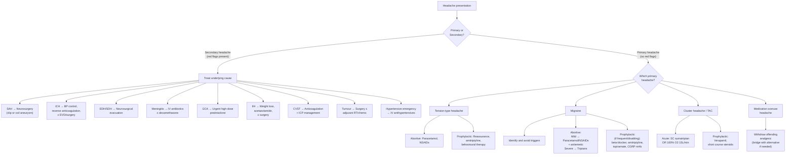

## Management Overview — General Principles

The management of headache follows the same logical structure as any condition: **identify the cause → treat the cause → relieve symptoms → prevent recurrence**. The critical first branch is always: *Is this a primary headache or a secondary headache?* If secondary, you treat the underlying pathology. If primary, you use a combination of trigger avoidance, abortive therapy, and prophylactic therapy [2][30].

***Management: simple or specific analgesics depending on pathology*** [2][30]:
- ***Avoidance of triggers***
- ***Preventive (prophylactic) Tx: regular Rx, indicated if frequent or disabling attacks***
- ***Symptomatic (abortive) Tx: for acute attacks***

***Indications for referral*** [2][30]:
1. ***Features of potentially serious disease (SNOOP)***
2. ***Refractory to appropriate Rx***
3. ***Problems with drug treatment, e.g. comorbid disease, medication abuse***
4. ***Possibility of psychiatric disease***

---

## Management Algorithm

---

## Management of Primary Headaches

### A. Tension-Type Headache (TTH) [4][30]

The key goal is to ***prevent TTH from becoming chronic*** [4]. Once chronic, it becomes much harder to treat and overlaps significantly with MOH.

#### Abortive (Acute) Treatment

| Drug | Mechanism | Notes |
|---|---|---|
| ***Paracetamol*** [4][30] | Central COX inhibition + serotonergic descending pain pathway modulation; exact mechanism debated | First-line for mild-moderate episodes; safe if < 15 days/month use |
| ***NSAIDs (e.g. ibuprofen, naproxen) or COX-2 inhibitors*** [4][30] | Inhibit cyclooxygenase → ↓prostaglandin synthesis → ↓peripheral and central sensitization | Effective; GI side effects limit chronic use; avoid if peptic ulcer disease, renal impairment, aspirin-exacerbated respiratory disease |
| **Combination analgesics** (e.g. paracetamol + caffeine) | Caffeine enhances analgesic absorption and has intrinsic mild analgesic effect via adenosine receptor antagonism → cerebral vasoconstriction | Risk of MOH if used frequently — caffeine withdrawal itself causes headache |

<Callout title="Avoid Opioids and Barbiturates" type="error">
Opioids and barbiturate-containing analgesics should NOT be used for TTH. They carry high addiction potential, rapidly induce medication overuse headache, and do not address the underlying muscular/central sensitization mechanism.
</Callout>

#### Prophylactic Treatment

| Modality | Mechanism | Indication |
|---|---|---|
| ***REASSURANCE*** [4] — ***most important*** | Patients often fear brain tumour or stroke; explaining the benign nature reduces anxiety → breaks the stress-tension-headache cycle | All patients with TTH |
| ***Amitriptyline*** [4][30] | Tricyclic antidepressant ("ami" = friend, "trip" = three [tricyclic]): blocks serotonin and noradrenaline reuptake → enhances descending pain inhibition pathways; also has direct analgesic effect independent of antidepressant action | Chronic TTH (≥ 15 days/month); start at low dose (10–25mg nocte), titrate up |
| ***Behavioural therapy*** [4] — ***stress management, relaxation therapy, EMG biofeedback*** | Directly addresses the muscular tension component; reduces central sensitization through stress reduction | Chronic TTH, especially if a/w significant psychological stressors |
| ***Avoidance of likely precipitants*** [4] | Removes the trigger for muscle tension | All patients |

---

### B. Migraine [4][15][30]

#### Step 1: Identify and Avoid Precipitating Factors [15]

***Triggers*** to identify and modify:
- ***Dietary: alcohol, chocolate, tyramine-containing foods (e.g. dairy products), starvation, caffeine***
- ***Hormonal: often premenstrual or related to OCP (fluctuation in oestrogen)***
- ***Emotional: stress, anger, excitement***
- ***Others: change in sleep, irregular meals, certain drugs, smoking, fluorescent lights, weather***

> **Why trigger avoidance works from first principles**: Each trigger independently lowers the threshold for cortical spreading depression (CSD) in a genetically susceptible brain. Removing triggers keeps the brain below the CSD threshold → fewer attacks.

#### Step 2: Abortive (Acute) Treatment [15][30]

The principle is **stratified care** — match treatment intensity to attack severity.

##### For Mild Attacks

| Drug | Mechanism | Key Points |
|---|---|---|
| ***Aspirin, paracetamol, NSAIDs*** [15][30] | COX inhibition → ↓prostaglandin-mediated peripheral and central sensitization; aspirin also has anti-platelet and anti-inflammatory effects on meningeal vessels | Should be taken early in the attack before central sensitization develops (the "window of opportunity"); if taken too late, oral absorption is impaired by gastric stasis |
| ***D2-blocker antiemetics: metoclopramide, domperidone*** [15][30] | D2 receptor antagonism in chemoreceptor trigger zone → ↓nausea/vomiting; ALSO prokinetic → ↑gastric emptying → ↑absorption of oral analgesics; ALSO intrinsic anti-headache effect (unclear mechanism, possibly via central dopamine pathway modulation) | Give as adjunct to simple analgesics; domperidone preferred over metoclopramide in young patients (lower risk of extrapyramidal side effects because domperidone does not cross BBB well) |

##### For Severe Attacks

| Drug | Mechanism | Examples | Side Effects | Contraindications |
|---|---|---|---|---|
| ***Triptans — treatment of choice for severe headache*** [15] | ***5HT₁B/₁D agonist → (1) vasoconstriction of dilated meningeal vessels, (2) peripheral neuronal inhibition on trigeminal terminals, (3) ↓CN V neurotransmission in trigeminal nucleus caudalis*** [15] | ***Sumatriptan (oral, subcutaneous, nasal), naratriptan (PO), zolmitriptan (PO)*** [15] | ***Dizziness, somnolence, asthenia, nausea***; chest tightness (usually benign "triptan sensation" but concerning in CAD patients) [15] | ***IHD, stroke, CAD, uncontrolled HTN*** [15] — because vasoconstriction can worsen coronary/cerebral ischaemia |
| ***Ergotamine*** [15] | ***5HT₁ agonist → vasoconstriction, ↓trigeminal neurotransmission*** [15]; also acts on dopamine and adrenergic receptors (hence more side effects than triptans) | Ergotamine (PO, PR), dihydroergotamine (IV, IN) | ***Vascular events (sustained generalized vasoconstriction), high risk of overuse syndrome and rebound headache*** [15]; nausea, peripheral vasospasm (Raynaud-like) | ***IHD, thyrotoxic heart disease, PVD, uncontrolled HTN*** [15]; pregnancy (oxytocic effect) |

> **Why triptans are preferred over ergotamine**: Triptans are selective 5HT₁B/₁D agonists — they only constrict the specific meningeal vessels involved in migraine. Ergotamine is a "dirty drug" that hits multiple receptor types → widespread vasoconstriction → more side effects and higher risk of MOH. Modern practice reserves ergotamine for refractory cases.

##### Anti-CGRP Acute Therapies (Newer Agents — "Gepants")

| Drug | Mechanism | Key Points |
|---|---|---|
| **Rimegepant, ubrogepant** | Small molecule CGRP receptor antagonist → blocks the final common mediator of trigeminovascular pain without vasoconstriction | No cardiovascular contraindications (unlike triptans) — safe in patients with IHD/CAD; can also be used for prophylaxis (rimegepant every other day); approved since 2019–2020 |

#### Step 3: Prophylactic Treatment [15][30]

***Indications for prophylaxis*** [15]:
- ***Attacks weekly or > 2 times a month***
- ***Attacks less often but very prolonged and debilitating***

| Drug Class | Examples | Mechanism | Notes |
|---|---|---|---|
| ***Antihypertensives*** | ***β-blockers (propranolol, metoprolol), CCB (flunarizine)*** [15][30] | β-blockers: ↓sympathetic tone → modulates cortical excitability and trigeminovascular reactivity; exact mechanism uncertain; CCB: ↓cortical spreading depression propagation | Propranolol is the most evidence-based β-blocker; C/I in asthma (β₂ blockade → bronchospasm), bradycardia, heart block |
| ***Antidepressants*** | ***Amitriptyline, venlafaxine*** [15][30] | Amitriptyline: TCA → ↑serotonin and noradrenaline in descending pain inhibition pathways; also blocks sodium channels (direct analgesic); Venlafaxine: SNRI → similar mechanism | Amitriptyline is the most versatile prophylactic — also covers coexisting TTH and depression; sedating → give nocte; C/I in cardiac arrhythmias (QT prolongation) |
| ***Anticonvulsants*** | ***Topiramate, valproate*** [15][30] | Topiramate: blocks voltage-gated Na channels + enhances GABA + inhibits glutamate + carbonic anhydrase inhibition; Valproate: enhances GABA, modulates ion channels | Topiramate: causes weight loss (useful in obese patients, also beneficial if comorbid IIH), cognitive dulling ("dopamax"), nephrolithiasis, paraesthesia; C/I in pregnancy (teratogenic). Valproate: C/I in women of childbearing age (highly teratogenic — neural tube defects) |
| ***CGRP monoclonal antibodies*** | ***Erenumab, fremanezumab, galcanezumab*** [15] | Monoclonal antibodies targeting CGRP or its receptor → block the final common mediator of migraine pain; "erenumab" = anti-CGRP receptor, "fremanezumab"/"galcanezumab" = anti-CGRP ligand | ***New drugs approved since 2018*** [15]; monthly SC injection; well tolerated; no hepatotoxicity, no CNS side effects (large molecules don't cross BBB); expensive |
| ***Others*** | ***Pizotifen (5HT₂ blocker)*** [15]; ***Botox injections around head and neck every 12 weeks (if refractory)*** [15] | Pizotifen: blocks 5HT₂C receptors → ↓vascular reactivity; weight gain is major limitation. Botox (onabotulinumtoxinA): ↓release of CGRP and substance P from trigeminal terminals; also ↓peripheral muscle tension | Botox is specifically licensed for **chronic migraine** (≥ 15 headache days/month for ≥ 3 months); pizotifen rarely used now due to weight gain and sedation |
| **Prophylactic NSAIDs** | Naproxen, mefenamic acid | COX inhibition → ↓prostaglandin-mediated sensitization | ***Specifically for menstrual or orgasmic migraine*** [15] — started 2 days before expected menses and continued through the period |

---

### C. Cluster Headache [6][30]

Cluster headache management is divided into acute attack treatment and prophylaxis during cluster periods.

#### Acute Attacks [6][30]

| Treatment | Mechanism | Key Points |
|---|---|---|
| ***Subcutaneous sumatriptan*** [6][30] — 1st line | 5HT₁B/₁D agonist → rapid vasoconstriction of dilated meningeal vessels + ↓trigeminal neurotransmission | SC route is critical — oral triptans are too slow for the brief, intense attacks of cluster headache (attack may last only 15–45 min, but oral absorption takes 30+ min); onset of SC sumatriptan ~10 min |
| ***100% O₂ at 15 L/min*** [6][30] — 1st line | Mechanism debated: likely causes vasoconstriction of meningeal vessels + modulates parasympathetic outflow from pterygopalatine ganglion + may inhibit trigeminal nociceptive firing | Via non-rebreather mask for ≥ 15 min; safe, no drug interactions, can be used in patients with CVD (unlike triptans); patients should be upright and leaning slightly forward |
| ***Intranasal lidocaine*** [6][30] | Local anaesthetic blocks signal transmission in sphenopalatine ganglion (located behind middle turbinate in nasal cavity); the ganglion is a relay station for the trigeminal-autonomic reflex | Administered ipsilaterally — the head is tilted back and rotated 30° toward the affected side to allow lidocaine to reach the sphenopalatine fossa |
| ***PO ergotamine or IV dihydroergotamine*** [6] | 5HT₁ agonist → vasoconstriction + ↓trigeminal neurotransmission | Reserved for refractory cases; same contraindications as for migraine |

#### Prophylaxis During Cluster Periods [6][30]

***Prophylaxis should be started during cluster periods*** [6]:

| Drug | Mechanism | Key Points |
|---|---|---|
| ***Verapamil*** [6][30] — 1st line ***for long-lasting cluster periods*** | L-type calcium channel blocker → ↓hypothalamic neuronal excitability (the "clock" driving cluster periodicity) + ↓vascular smooth muscle tone | Requires ECG monitoring before and after dose titration (risk of heart block — PR prolongation); doses used in cluster headache (240–960mg/day) are much higher than for cardiovascular indications |
| ***Short course oral corticosteroids*** [6][30] — ***for shorter-lasting cluster periods*** | ↓neurogenic inflammation via multiple anti-inflammatory pathways; rapidly effective (often within 24–48h) | Typically prednisolone 60–80mg/day tapered over 2–3 weeks; used as a "bridge" while verapamil is titrated up; cannot be used long-term (Cushingoid effects, osteoporosis, adrenal suppression) |
| ***Topiramate, methysergide*** [6] | Topiramate: as for migraine; Methysergide: 5HT₂ antagonist → ↓vascular reactivity; must have a 1-month drug holiday every 6 months to prevent retroperitoneal/cardiac fibrosis | Second-line agents |
| ***Lithium*** [6][30] — ***if severe debilitating clusters*** | Modulates circadian rhythm via effects on hypothalamic circadian pacemaker neurons (suprachiasmatic nucleus); also modulates serotonergic and dopaminergic transmission | ***Requires monitoring of serum level, TFT, RFT*** [6]; narrow therapeutic index (0.6–1.2 mmol/L); toxicity causes tremor, ataxia, renal impairment, hypothyroidism |
| ***Gabapentin*** [6] | Binds α2δ subunit of voltage-gated calcium channels → ↓excitatory neurotransmitter release | Third-line; generally well-tolerated; sedation is main side effect |

---

### D. Medication Overuse Headache (MOH) [15]

***Medication overuse (analgesic) headache*** [15]:
- ***Can complicate any kind of headache syndrome but especially a/w migraine and TTH***
- ***Characterized by: gradual ↑headache frequency and drug consumption, change in headache characteristics***
- ***Ultimately take analgesics and large amounts of caffeine-containing beverages***

**Diagnostic threshold (ICHD-3)**:
- Simple analgesics ≥ 15 days/month for > 3 months
- Triptans, ergotamine, opioids, or combination analgesics ≥ 10 days/month for > 3 months

#### Management Approach

| Step | Action | Rationale |
|---|---|---|
| **1. Education** | Explain the paradox: the medication meant to relieve headache is perpetuating it | Patient understanding is essential for compliance with withdrawal |
| **2. Withdrawal of offending analgesic** | Abrupt withdrawal if simple analgesics or triptans; gradual taper if opioids or barbiturates (to avoid withdrawal seizures) | Removing the drug allows endogenous pain-inhibition pathways to recover; expect a transient worsening ("rebound") lasting 2–10 days |
| **3. Bridge therapy during withdrawal** | Naproxen 500mg BD for 2–4 weeks (different class from the overused drug); or short course prednisolone; adequate hydration | Provides analgesia during the difficult withdrawal period without perpetuating the MOH cycle |
| **4. Start appropriate prophylaxis** | Begin prophylactic medication for the underlying primary headache (e.g. topiramate, amitriptyline, CGRP mAb for migraine) | Prophylaxis reduces attack frequency → reduces the "need" for acute analgesics → prevents relapse into MOH |
| **5. Follow-up and headache diary** | Limit acute medication to < 2 days/week; regular review | Ongoing monitoring prevents relapse; diary identifies remaining triggers |

<Callout title="MOH — The Vicious Cycle">
Frequent analgesic use → downregulation of endogenous opioid and serotonin pathways → ↓pain threshold → headache recurs sooner → patient takes MORE analgesics → further downregulation. Breaking this cycle requires withdrawing the offending drug AND simultaneously starting prophylaxis so the patient can tolerate the withdrawal period.
</Callout>

---

## Management of Secondary Headaches

### A. Subarachnoid Haemorrhage (SAH) [13]

| Phase | Management | Rationale |
|---|---|---|
| **Resuscitation** | ABC, stabilize airway, IV access, monitor GCS | Airway at risk if ↓consciousness |
| **Secure the aneurysm** | ***Endovascular coiling (preferred)*** or ***surgical clipping*** — within 24–72h of diagnosis | Prevents catastrophic re-bleeding (4% risk in first 24h, 20% in first 2 weeks); coiling involves threading a catheter from the femoral artery and packing the aneurysm with platinum coils; clipping involves craniotomy and placing a metal clip across the aneurysm neck |
| **Prevent vasospasm** | ***Nimodipine 60mg PO q4h for 21 days*** (dihydropyridine CCB) | Nimodipine crosses the BBB and ↓calcium influx into vascular smooth muscle → ↓cerebral vasospasm; the only intervention proven to ↓delayed cerebral ischaemia (DCI) in SAH. NOT for BP lowering — the effect is neuroprotective |
| **Prevent re-bleeding** | Bed rest, analgesia, stool softeners (avoid straining), target SBP < 160 before aneurysm secured | ↓transmural pressure across aneurysm wall; straining → ↑intrathoracic pressure → ↑ICP → ↑risk of re-bleed |
| **Manage hydrocephalus** | External ventricular drain (EVD) if acute obstructive hydrocephalus; VP shunt if chronic | Blood products block CSF reabsorption at arachnoid granulations → communicating hydrocephalus; or blood in ventricles obstructs foramina |
| **Monitor for DCI** | Daily neurological examination, transcranial Doppler (↑MCA velocities > 120cm/s suggest vasospasm), CT perfusion if deterioration | DCI peaks days 4–14 post-bleed |
| **Triple-H therapy (historical)** | Hypertension, hypervolaemia, haemodilution → now largely replaced by **euvolaemia and induced hypertension** if DCI suspected | Maintaining cerebral perfusion through the vasospastic segment; hypervolaemia actually increases complications so current practice favours euvolaemia |

### B. Intracerebral Haemorrhage (ICH) [14]

| Intervention | Details | Rationale |
|---|---|---|
| **Resuscitation** | ***ABC; watch out for cervical spine injury*** [14]; NPOEM, IV fluids, monitor vitals + ***neuro-obs*** [14] | Haemorrhagic stroke often follows trauma or occurs with severe HTN |
| **Blood pressure control** | ***IV labetalol*** [14]; ***treat if SBP > 150 (unless evidence of increased ICP); target SBP < 140, but avoid rapid BP reduction*** [14] | ↓BP reduces ongoing bleeding and haematoma expansion, but excessive ↓BP risks ischaemia in the penumbra around the haematoma. Labetalol is ideal: combined α₁ + β blockade → smooth ↓BP without reflex tachycardia |
| **Reversal of anticoagulation** | Warfarin → IV vitamin K + 4-factor PCC; DOACs → specific reversal agents (idarucizumab for dabigatran, andexanet alfa for factor Xa inhibitors); antiplatelet → platelet transfusion (controversial) [14] | Coagulopathy promotes haematoma expansion; rapid reversal limits secondary injury |
| **Acute hydrocephalus** | ***Burr hole + EVD*** [14] | Intraventricular extension of blood → obstructive hydrocephalus → ↑ICP → EVD provides immediate CSF drainage |
| **Surgical evacuation** | Consider for superficial lobar ICH with ↓GCS, cerebellar haemorrhage > 3cm, or signs of brainstem compression | Cerebellar haemorrhage is a neurosurgical emergency — posterior fossa is a small, enclosed space → rapid brainstem compression |

### C. Epidural and Subdural Haematoma [11]

| Condition | Management | Why |
|---|---|---|
| **Acute EDH** | Emergency craniotomy + haematoma evacuation | Arterial bleed → rapid expansion → uncal herniation within hours if untreated |
| **Acute SDH** | Craniotomy + evacuation if ≥ 10mm thickness or midline shift ≥ 5mm or GCS deterioration | Large acute SDH causes significant mass effect |
| **Chronic SDH** | Burr hole drainage (1 or 2 holes) + subdural drain | Chronic SDH is liquefied (venous blood has broken down) → easily drained through small holes; craniotomy usually unnecessary |
| **Small/asymptomatic SDH** | Conservative: observation with serial imaging | Small collections may reabsorb spontaneously; surgery carries its own risks |

### D. Giant Cell Arteritis (GCA) [10][24]

| Step | Action | Details |
|---|---|---|
| **Immediate** | ***Urgent high-dose systemic corticosteroids: prednisolone 1–2 mg/kg/day*** [10] or 60mg/day [24] | ***Treatment is started upon presumed clinical diagnosis even despite negative initial Ix*** [10]; ***urgent Tx prevents blindness and brainstem stroke and ↓headache*** [24] |
| **If visual symptoms already present** | ***Parenteral high-dose steroids*** [24] (IV methylprednisolone 1g/day for 3 days → oral) | Intravenous route achieves faster therapeutic levels; visual loss may still be irreversible but treats the fellow eye |
| **Steroid taper** | ***Gradual ↓dosage to maintenance level according to ESR level*** [24]; typically over 1–2 years [10] | Too-rapid taper → relapse; monitor ESR/CRP to guide tapering |
| **Steroid-sparing agents** | ***Tocilizumab (anti-IL6), methotrexate upon relapsing disease*** [10] | IL-6 drives the acute-phase response in GCA; tocilizumab (GiACTA trial) allows faster steroid taper and ↓relapse rate |
| ***Prognosis*** | ***Usually dramatic response to steroid (complete resolution of S/S ≤ 48–72h of treatment)*** [10] | If no response to steroids within 48–72h → reconsider the diagnosis |

### E. Idiopathic Intracranial Hypertension (IIH) [5][16]

***25% at risk of severe permanent vision loss*** [5] — this drives the urgency of treatment.

| Treatment | Mechanism | Details |
|---|---|---|
| ***Dietary changes to ↓weight*** [5][16] | Obesity → ↑intra-abdominal pressure → ↑central venous pressure → ↓CSF reabsorption; weight loss reverses this chain | Even 5–10% weight loss can dramatically ↓ICP; bariatric surgery considered if BMI very high |
| ***Carbonic anhydrase inhibitor (1st-line): acetazolamide (Diamox), topiramate*** [5][16] | Acetazolamide inhibits carbonic anhydrase in choroid plexus → ↓CSF production (choroid plexus produces ~500mL CSF/day; blocking CA can ↓production by ~50%) | Typical dose: acetazolamide 250mg BD → titrate up to 1–2g/day; side effects: paraesthesia (acral), metabolic acidosis, nephrolithiasis, taste disturbance. Topiramate has dual benefit: CA inhibition + appetite suppression (weight loss) |
| ***± Diuretics, e.g. furosemide (if refractory)*** [5][16] | ↓CSF production via uncertain mechanism (possibly ↓Na/K transport at choroid plexus) | Second-line add-on therapy |
| ***Short-course corticosteroids, e.g. prednisolone*** [5] | Anti-inflammatory → may ↓CSF outflow resistance; but can cause weight gain → paradoxically worsen IIH long-term | Used only as a bridge (e.g. while waiting for acetazolamide to take effect or before surgery); NOT for long-term use |
| ***Serial LPs to ↓ICP*** [5] | Directly removes CSF → immediate ↓ICP → symptom relief | Temporary measure; useful in acute setting or pregnancy when drugs are limited |
| ***Optic nerve fenestration (ONSF)*** [5][16] | Surgical slits cut in the optic nerve sheath → creates a "safety valve" allowing CSF to drain away from the optic nerve → ↓pressure on optic nerve | Specifically for progressive visual loss; protects vision but may not relieve headache |
| ***CSF shunting*** [5][16] (***lumboperitoneal shunt***) | Diverts CSF from lumbar thecal sac to peritoneal cavity → continuous CSF drainage → sustained ↓ICP | For refractory cases with both headache and visual loss; complications include shunt obstruction, over-drainage, infection |
| **Venous sinus stenting** | Stents placed in stenotic transverse sinuses → improves venous outflow → ↓ICP | Emerging treatment for selected patients with documented venous sinus stenosis on MRV; increasingly used in refractory IIH |

### F. Cerebral Venous Sinus Thrombosis (CVST) [13]

| Treatment | Details | Rationale |
|---|---|---|
| ***Anticoagulation: LMWH (acute) → warfarin or dabigatran for 3 months (chronic)*** [13] | LMWH (e.g. enoxaparin) → immediate anticoagulation; transition to oral anticoagulant for maintenance | Even in the presence of haemorrhagic venous infarction, anticoagulation is indicated — the haemorrhage is a consequence of venous congestion, and the treatment is to relieve the venous obstruction; anticoagulation prevents thrombus propagation and allows the body's fibrinolytic system to resolve the existing clot |
| ***Endovascular thrombolysis in selected patients*** [13] | Direct catheter-based lysis of thrombus | For severe/deteriorating cases despite anticoagulation |
| ***ICP management*** [13] | Acetazolamide, head elevation, ± EVD if acute hydrocephalus | Venous outflow obstruction → ↑ICP; same principles as IIH |
| ***Treat seizures*** [13] | Antiepileptic drugs (levetiracetam preferred) | Seizures occur in up to 40% of CVST; cortical venous infarction is epileptogenic |

### G. Hypertensive Emergency with Encephalopathy [8]

***Hypertensive emergency: BP > 180/120 + worsening/new TOD*** [8]:

| Phase | BP Target | Agent |
|---|---|---|
| ***1st hour*** | ***≤ 25% ↓BP*** [8] | IV labetalol, IV nicardipine, or IV sodium nitroprusside (ICU with IABP monitoring) |
| ***Next 2–6 hours*** | ***To 160/110*** [8] | Continue IV infusion, titrate carefully |
| ***Next 24–48 hours*** | ***Cautiously to normal*** [8] | Transition to oral agents |

> ***Aim SBP < 140 in 1st hour and < 120 in aortic dissection for those with compelling indications for acute BP control*** [8].

<Callout title="Why Not Drop BP Too Fast?">
Cerebral autoregulation in chronic hypertensives is "reset" to higher pressures. The autoregulatory curve shifts right — meaning the brain can only maintain perfusion above a certain (higher than normal) MAP. If you drop BP too rapidly, you fall below the autoregulatory threshold → cerebral hypoperfusion → watershed infarction. The ≤ 25% rule in the first hour is designed to lower BP enough to stop target organ damage without causing ischaemic injury.
</Callout>

### H. Meningitis (Brief Overview)

| Type | Treatment | Key Points |
|---|---|---|
| **Bacterial** | Empirical IV ceftriaxone 2g q12h + ampicillin (if Listeria risk — age > 50, immunosuppressed) + dexamethasone (before or with first antibiotic dose) | Dexamethasone ↓inflammatory response → ↓cerebral oedema → improved outcomes (proven for S. pneumoniae); must be given before/with antibiotics, not after |
| **TB** | RIPE regimen (rifampicin + isoniazid + pyrazinamide + ethambutol) × 2 months → RI × 10 months (total 12 months) + adjunctive dexamethasone | TB meningitis treatment is longer than pulmonary TB; dexamethasone ↓mortality in TB meningitis |
| **Viral** | Supportive; IV aciclovir if HSV suspected (do NOT wait for PCR results) | HSV encephalitis has 70% mortality if untreated → empirical treatment is life-saving |

### I. Intracranial Hypotension [5]

| Treatment | Mechanism | Details |
|---|---|---|
| **Conservative** | Flat bed rest, hydration, caffeine (adenosine receptor antagonist → cerebral vasoconstriction → ↑ICP slightly) | Most post-LP headaches resolve spontaneously within 1–2 weeks |
| **Epidural blood patch** | Patient's own blood (15–20mL) injected into epidural space at or near the site of the dural puncture → clot seals the leak + mass effect of blood ↑epidural pressure → ↑CSF pressure | Gold standard for post-LP headache; ~90% success rate with single patch; may need repeat if recurrent |
| **Surgical dural repair** | Direct suture or patching of identified dural tear | For refractory spontaneous intracranial hypotension with identified leak site on MR myelography |

---

## Drug Summary Table — Key Contraindications at a Glance

| Drug | Major Contraindications | Why |
|---|---|---|
| ***Triptans*** | ***IHD, stroke, CAD, uncontrolled HTN*** [15] | Vasoconstriction worsens coronary/cerebral ischaemia |
| ***Ergotamine*** | ***IHD, thyrotoxic heart disease, PVD, uncontrolled HTN*** [15]; pregnancy | Sustained generalized vasoconstriction; oxytocic |
| **Propranolol** | Asthma, COPD, bradycardia, heart block, Raynaud's | β₂ blockade → bronchospasm; β₁ blockade → ↓HR |
| **Valproate** | Women of childbearing age (teratogenic — NTDs), hepatic disease | Highly teratogenic; hepatotoxic |
| **Topiramate** | Pregnancy, nephrolithiasis, metabolic acidosis | Teratogenic (cleft palate); CA inhibition → acidosis/stones |
| **Verapamil** (high-dose for cluster) | Heart block, severe LV dysfunction | ↓AV conduction → requires ECG monitoring |
| **Lithium** | Renal impairment, thyroid disease, pregnancy | Narrow therapeutic index; nephrotoxic, causes hypothyroidism, Ebstein's anomaly in fetus |
| **Amitriptyline** | Cardiac arrhythmia (long QT), recent MI, urinary retention, narrow-angle glaucoma | Anticholinergic effects; QT prolongation → torsades |
| **Acetazolamide** | Severe hepatic/renal impairment, sulfonamide allergy, hypokalemia | ↓K⁺ (CA inhibition → bicarbonaturia → K⁺ loss); cross-reactivity with sulfonamide allergy |

---

<Callout title="High Yield Summary — Management of Headache">

**Primary headaches — three pillars**: (1) Trigger avoidance, (2) Abortive treatment, (3) Prophylactic treatment.

**TTH**: Abortive = paracetamol/NSAIDs. Prophylactic = REASSURANCE (most important!) + amitriptyline + behavioural therapy.

**Migraine**: Mild → paracetamol/NSAIDs + antiemetic. Severe → triptans (5HT₁ agonist; C/I in IHD/stroke/CAD). Prophylaxis (if ≥ 2/month or disabling) → propranolol, amitriptyline, topiramate, or CGRP monoclonal antibodies.

**Cluster**: Acute → SC sumatriptan OR 100% O₂ 15L/min. Prophylaxis → verapamil (1st line, needs ECG monitoring), short-course steroids (bridge), lithium (severe).

**MOH**: Withdraw offending drug + bridge therapy (naproxen or short-course prednisolone) + start appropriate prophylaxis.

**SAH**: Secure aneurysm (coil or clip) + nimodipine 21 days + manage hydrocephalus.

**ICH**: BP control (IV labetalol, target SBP < 140) + reverse anticoagulation + EVD if hydrocephalus.

**GCA**: Urgent prednisolone 60mg (or IV methylprednisolone if visual loss) → slow taper over 1–2 years ± tocilizumab.

**IIH**: Weight loss + acetazolamide (1st line) ± surgery (ONSF, shunt) if progressive visual loss.

**CVST**: Anticoagulation (even if haemorrhagic infarct!) + ICP management.

**Hypertensive emergency**: ≤ 25% ↓BP in 1st hour → 160/110 over next 2–6h → normal over 24–48h.

</Callout>

---

<ActiveRecallQuiz
  title="Active Recall - Management of Headache"
  items={[
    {
      question: "What is the mechanism of action of triptans and why are they contraindicated in IHD?",
      markscheme: "Triptans are 5HT1B/1D agonists causing (1) meningeal vasoconstriction, (2) peripheral trigeminal neuronal inhibition, (3) decreased CN V neurotransmission in trigeminal nucleus caudalis. Contraindicated in IHD because vasoconstriction can worsen coronary ischaemia causing MI or coronary vasospasm.",
    },
    {
      question: "A patient with chronic migraine is using paracetamol-codeine 20 days per month and headaches are worsening. What is the diagnosis and outline the management steps.",
      markscheme: "Medication overuse headache (MOH). Management: (1) Educate patient about the paradox, (2) Withdraw offending analgesic (gradual taper for opioid-containing drugs to avoid withdrawal), (3) Bridge therapy with naproxen or short-course prednisolone, (4) Start migraine prophylaxis (e.g. topiramate, amitriptyline or CGRP mAb), (5) Limit acute medication to less than 2 days per week with headache diary follow-up.",
    },
    {
      question: "Why is nimodipine given after SAH and for how long? Is it for blood pressure control?",
      markscheme: "Nimodipine is a dihydropyridine CCB that crosses the BBB and reduces calcium influx into cerebral vascular smooth muscle, decreasing cerebral vasospasm. Given for 21 days (the period of peak vasospasm risk, days 4-14). It is NOT primarily for blood pressure control but is neuroprotective, being the only intervention proven to reduce delayed cerebral ischaemia after SAH.",
    },
    {
      question: "In a hypertensive emergency with encephalopathy, what is the BP reduction target for the first hour and why should you not drop it faster?",
      markscheme: "Target is 25 percent or less reduction of BP in the first hour. Chronic hypertensives have rightward shift of cerebral autoregulation curve, meaning the brain requires higher MAP to maintain perfusion. Rapid excessive BP drop falls below the autoregulatory threshold causing cerebral hypoperfusion and watershed infarction.",
    },
    {
      question: "What is the first-line medical treatment for IIH and how does it work? What are two surgical options for refractory cases?",
      markscheme: "First-line: acetazolamide (carbonic anhydrase inhibitor) which inhibits CSF production at the choroid plexus. Surgical options: (1) Optic nerve sheath fenestration (ONSF) which creates slits in the optic nerve sheath to decompress the optic nerve and protect vision, and (2) CSF shunting such as lumboperitoneal shunt which diverts CSF to the peritoneal cavity for sustained ICP reduction.",
    },
    {
      question: "For cluster headache prophylaxis, what is the first-line drug, what monitoring is required, and what is the mechanism?",
      markscheme: "Verapamil is first-line for long-lasting cluster periods. It is an L-type calcium channel blocker that reduces hypothalamic neuronal excitability (the circadian pacemaker driving cluster periodicity). Requires ECG monitoring before and after dose titration because high doses (240-960 mg/day) used in cluster headache can cause heart block (PR prolongation).",
    },
  ]}
/>

## References

[2] Senior notes: Ryan Ho Neurology.pdf (Section 2.1 Approach to Headache, management summary p. 59)
[4] Senior notes: Ryan Ho Neurology.pdf (Section 2.2.1 TTH treatment p. 61)
[5] Senior notes: Ryan Ho Neurology.pdf (Section 4 IIH and Intracranial Hypotension, p. 158)
[6] Senior notes: Ryan Ho Neurology.pdf (Section 2.2.3 Cluster Headache management, p. 64)
[8] Senior notes: Ryan Ho Cardiology.pdf (Section Malignant Hypertension and hypertensive emergency, p. 182)
[9] Lecture slides: murtagh merge.pdf (pp. 58–60, Headache)
[10] Senior notes: Ryan Ho Rheumatology.pdf (Section 3.6.1 GCA and PMR, p. 95)
[11] Senior notes: felixlai.md (Sections II–V: EDH and SDH)
[13] Senior notes: maxim.md (Section 5.2 SAH and CVST management)
[14] Senior notes: maxim.md (Intracerebral haemorrhage management)
[15] Senior notes: Ryan Ho Neurology.pdf (Section 2.2.2 Migraine treatment pp. 63; MOH p. 63)
[16] Senior notes: Ryan Ho Opthalmology.pdf (Papilloedema and IIH management, p. 90)
[24] Senior notes: Ryan Ho Neurology.pdf (Section 2.3 GCA treatment, p. 65)
[30] Senior notes: Ryan Ho Fundamentals.pdf (Headache management summary table, p. 314)
