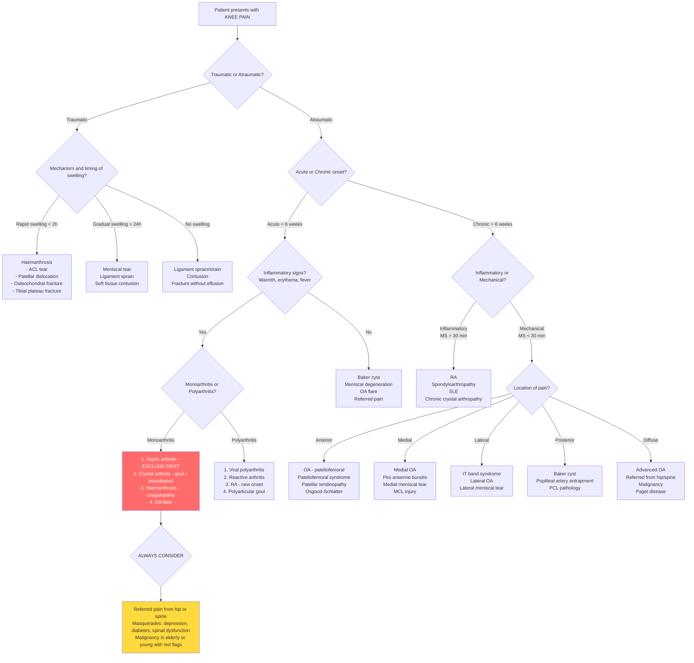

## Differential Diagnosis of Knee Pain

The differential diagnosis of knee pain is vast, but a structured approach prevents you from missing dangerous diagnoses while keeping the common things common. The classic framework used in clinical practice — and the one Murtagh's diagnostic strategy is built on — organises differentials by **probability**, **seriousness**, and **pitfalls** [1].

> Think of it like a triage system for your differential list: What is the **most likely** diagnosis? What is the **most dangerous** diagnosis I must not miss? What are the **sneaky** diagnoses that get overlooked?

---

### Murtagh's Diagnostic Strategy for Knee Pain

***Probability diagnosis*** [1]:
- ***Ligament strains and sprains ± traumatic synovitis***
- ***Osteoarthritis***
- ***Patellofemoral syndrome***
- ***Prepatellar bursitis***

***Serious disorders not to be missed*** [1]:
- ***Vascular disorders: deep venous thrombosis, superficial thrombophlebitis***
- ***Neoplasia/cancer: primary in bone, metastases***
- ***Infection: septic arthritis, tuberculosis***
- ***Rheumatic fever***
- ***Rheumatoid arthritis***
- ***Acute cruciate ligament tear***
- ***Juvenile chronic arthritis***

***Pitfalls (often missed)*** [1]:
- ***Referred pain: back or hip disease***
- ***Foreign bodies***
- ***Intra-articular loose bodies***
- ***Osteochondritis dissecans***
- ***Osteonecrosis***
- ***Synovial chondromatosis***
- ***Osgood–Schlatter disorder***
- ***Meniscal tears***
- ***Fractures around knee***
- ***Pseudogout (chondrocalcinosis)***
- ***Gout → patellar bursitis***
- ***Ruptured popliteal (Baker's) cyst***

***Rarities*** [1]:
- ***Sarcoidosis***
- ***Paget disease***
- ***Spondyloarthropathy***

***Masquerades checklist*** [1]:
- ***Depression***
- ***Diabetes***
- ***Spinal dysfunction (referred)***

***Is the patient trying to tell me something?*** [1]:
- ***Psychogenic factors relevant, especially with possible injury compensation***

---

### Structured Differential by Clinical Presentation

The single most useful bedside approach is to categorise the presentation first, then narrow the differential within that category. Let me walk you through how a senior clinician thinks.

#### Step 1: Is it Monoarthritis or Polyarthritis?

This is the first fork in the road. Monoarthritis ( = 1 joint) and polyarthritis ( ≥ 5 joints, with 2–4 being oligoarthritis) have fundamentally different differential lists [11][12].

**Acute Monoarthritis** (the knee is the most common joint affected) [11]:

| Category | Differential | Key Distinguishing Features |
|---|---|---|
| ***Septic arthritis*** | ***Bacterial (S. aureus most common in adults)***, ***mycobacterial***, ***Lyme*** | ***Hot, swollen, tender joint = septic arthritis until proven otherwise*** [9]. Fever, ↑WBC, ↑ESR/CRP. ***Gonococcal: purulent mono/oligoarthritis in distal joints in sexually active young adults ± dermatitis*** [11]. ***Non-gonococcal: large joints, occurs in immunocompromised, IVDU, prosthetic joint*** [11]. ***Mycobacterial: indolent progressive monoarthritis, immunocompromised or TB contact*** [11]. |
| ***Crystal-induced arthritis*** | ***Gout, pseudogout***, hydroxyapatite, calcium oxalate | ***Gout: single joint in LL (1st MTP > knee), severe pain, redness, swelling, onset often at night, rapid to max severity ≤ 12–24h*** [5][13]. ***Pseudogout: most commonly affects knee, acute presentation mimics gout, most common in elderly women*** [6][11]. |
| ***Trauma*** | Fracture, internal derangement, haemarthrosis | ***Usually with trauma Hx +ve, typically occurs seconds to minutes after trauma*** [11]. Haemarthrosis: rapid swelling within 2h (ACL tear in 70%). |
| ***Osteoarthritis*** | Flare of chronic OA | ***Weight-bearing joint, Hx of overuse, can present with acutely painful synovitis mimicking other d/dx*** [11]. |
| ***Haemarthrosis*** | Traumatic or coagulopathic | ***May be a/w trauma (intra-articular fractures, dislocations, ligamentous sprain/tear, meniscal injury). May be a/w coagulopathies and intra-articular tumours*** [11]. |
| ***Spondyloarthritis*** | Reactive arthritis, PsA | ***Classically asymmetrical oligoarthritis, usually in men < 45y*** [11]. Look for enthesitis, dactylitis, preceding infection, psoriasis. |
| Uncommon | ***PVNS, AVN, erythema nodosum, osteomyelitis, leukaemia, synovial metastasis*** | ***Joint foreign body reaction, coagulopathy with haemarthrosis*** [11]. |

**Polyarthritis involving the knee** [12]:

| Differential | Discerning Features |
|---|---|
| ***Rheumatoid arthritis*** | ***Symmetrical arthritis involving small and large joints. Starts in MCP, PIP, wrists, MTP. Spares DIP. Morning stiffness > 30 min. May have swan neck/Boutonnière deformity, rheumatoid nodules in chronic cases*** [12]. |
| ***Viral polyarthritis*** | ***Common associations: Hep B/C, EBV, Parvovirus B19, Dengue, Rubella, HIV. Symmetrical small joint arthritis ± rash, usually self-limiting ≤ 6 weeks*** [12]. |
| ***SLE-associated arthritis*** | ***Symmetrical small joint polyarthritis but usually NOT a/w evidence of synovitis. Migratory pattern with predilection for knee, wrist, PIPJ. Non-deforming, non-erosive*** [12]. |
| ***Spondyloarthritis (peripheral)*** | ***Asymmetrical oligoarthritis, predominantly LL (esp knee, ankles). Enthesitis, dactylitis, anterior uveitis*** [14]. ***Chronic arthritis, asymmetric in ~70%, usually oligoarthritis*** [14]. |
| ***OA (polyarticular)*** | ***Symmetrical polyarthralgia affecting DIP, PIP, 1st CMCJ, weight-bearing joints and neck. Heberden's/Bouchard's nodes. Pain a/w movement, relieved by rest*** [12]. |
| ***Polyarticular gout*** | ***Occurs in < 20% of gout patients, more common in later untreated flares. Distal > proximal joints, migratory/simultaneous pattern. Usually a/w palpable tophi*** [12]. |

---

#### Step 2: Acute vs. Chronic?

| Timeframe | Differential | Why? |
|---|---|---|
| **Acute ( < 6 weeks)** | Crystal arthritis, reactive arthritis, septic arthritis, viral arthritis, trauma | Acute inflammation or acute mechanical disruption [12] |
| **Chronic ( > 6 weeks)** | RA, spondyloarthritis, OA, connective tissue disease | Chronic immune-mediated or degenerative processes [12] |

---

#### Step 3: Inflammatory vs. Non-Inflammatory (Mechanical)?

This is a critical distinction because it determines both the urgency and the type of investigation.

***Features suggestive of inflammatory joint pain*** [12]:
- ***Early morning stiffness > 30 min after waking (classical in RA)***
- ***Swelling, heat, redness in joints***
- ***Better with gentle exercise and worse with rest***

| Feature | Inflammatory | Non-inflammatory (Mechanical) |
|---|---|---|
| Morning stiffness | > 30–60 min | ***< 30 min*** [3] |
| Effect of rest | Worse (stiffness accumulates) | Better |
| Effect of activity | Improves initially | Worsens |
| Systemic features | Fever, malaise, weight loss | Absent |
| Synovial fluid WBC | > 2,000/mm³ (often > 50,000 in septic) | < 2,000/mm³ |
| Examples | Septic arthritis, RA, gout, pseudogout | OA, meniscal tear, ligament injury |

---

#### Step 4: Pattern of Joint Involvement

***The pattern tells the story*** [12][15]:

| Pattern | Think of... |
|---|---|
| ***Monoarthritis in gout and septic arthritis*** | Gout, septic arthritis, trauma [15] |
| ***Oligoarthritis (≤ 4 joints) in ankylosing spondylitis and enteropathic arthritis*** | Spondyloarthropathy, reactive arthritis [15] |
| ***Polyarthritis (≥ 5 joints) in RA and SLE*** | RA, SLE, viral arthritis [15] |
| ***RA: symmetrical, proximal joints and MCP/PIP in hands*** | RA [15] |
| ***Seronegative spondyloarthritis: asymmetrical, axial joints and PIP/DIP in hands*** | PsA, reactive arthritis, AS [15] |
| ***OA: large joints (knees), CMC/PIP/DIP in hands*** | OA [15] |

***Temporal pattern*** [12]:
- ***Migratory pattern*** (symptoms present in certain joints for a few days then remit, reappearing in other joints): ***rheumatic fever, gonococcal arthritis, SLE-associated arthritis***
- ***Additive pattern*** (symptoms begin in some joints and persist with subsequent involvement of others): ***RA, SLE***
- ***Intermittent pattern*** (repetitive attacks with complete remission between attacks): ***RA, polyarticular gout, palindromic rheumatism***

---

#### Step 5: Location-Based Differential

Anatomical location is extremely helpful, especially for soft-tissue and periarticular causes:

| Location | Differential | Distinguishing Clue |
|---|---|---|
| **Anterior** | Patellofemoral syndrome, patellar tendinopathy, prepatellar bursitis, Osgood-Schlatter, patellar fracture/dislocation, fat pad impingement | PFS: worse going downstairs; bursitis: localised swelling anterior to patella; Osgood-Schlatter: adolescent + tibial tuberosity tenderness |
| **Medial** | Medial meniscal tear, MCL injury, pes anserine bursitis, medial OA, medial plica | Joint-line tenderness = meniscus; below joint line = pes anserine; valgus stress = MCL |
| **Lateral** | ***ITBS (most common cause of lateral knee pain)*** [3], lateral meniscal tear, LCL injury, lateral OA, proximal tibiofibular joint | ITBS: ***pain over lateral femoral condyle at 30° flexion*** [3]; runners/cyclists |
| **Posterior** | ***Baker's cyst*** [2], PCL injury, popliteal artery entrapment, DVT, posterior meniscal horn tear | Baker's cyst: ***posterior knee pain, stiffness, mass behind knee, a/w underlying joint disease*** [2]. ***Ruptured Baker's cyst mimics DVT*** [1][7]. |
| **Diffuse / Generalised** | OA, RA, septic arthritis, crystal arthritis, fracture | Hot + swollen + systemic = think septic/crystal first |

---

#### Step 6: Age-Based Differential

| Age Group | Key Differentials | Why This Age? |
|---|---|---|
| **Children < 5** | Septic arthritis, transient synovitis, JIA, NAI | Immature immune system, haematogenous spread to metaphysis |
| **5–10** | Perthes disease, transient synovitis, JIA | AVN at the vulnerable developing femoral epiphysis |
| **10–16** | SCFE, ***Osgood–Schlatter*** [1], osteochondritis dissecans, bone tumours | Growth spurt stresses apophyses and physes; peak age for osteosarcoma |
| **Young adults 16–35** | ACL/meniscal tears, patellofemoral syndrome, patellar dislocation, stress fracture, reactive arthritis | High activity → trauma and overuse; sexual activity → gonococcal arthritis |
| **Middle-aged 35–55** | Degenerative meniscal tears, early OA, gout, CPPD | Cartilage senescence begins; metabolic diseases accumulate |
| **Elderly > 55** | ***OA*** (by far most common), crystal arthritis, insufficiency fractures, ***referred pain from hip/spine*** [1], malignancy (primary or metastatic) | Accumulated wear; osteoporotic bone; increasing cancer incidence |

---

### The "Must Not Miss" Differentials — Explained from First Principles

#### 1. Septic Arthritis

***Why must you not miss it?*** Because ***bacterial infection can destroy joint cartilage in a few days*** [9]. Articular cartilage is avascular — it depends on synovial fluid for nutrition. Bacteria in the joint trigger an intense neutrophilic response → neutrophil-derived proteases (MMP, elastase) + bacterial toxins directly degrade the cartilage matrix → irreversible damage within 24–48 hours. The synovial membrane has no basement membrane, so haematogenous bacteria enter easily. Once in the joint, the enclosed synovial space cannot "drain" the infection → pus accumulates → further pressure necrosis.

***Key rule: A hot, swollen, tender joint = septic arthritis until proven otherwise, even without fever, ↑WBC, ↑ESR/CRP*** [9].

#### 2. DVT

***Why is DVT a serious disorder in the context of knee pain?*** [1] Because posterior knee/calf pain and swelling can be the presenting complaint. A ruptured Baker's cyst (pseudothrombophlebitis) can mimic DVT and vice versa. Missing a DVT risks pulmonary embolism. Key differential: ***DVT = unilateral leg swelling, pain, heat, dilated superficial veins*** [7]. ***Baker's cyst rupture only occurs in pre-existing arthritis*** [7].

#### 3. Malignancy

***Why is the knee area a hotspot for primary bone tumours?*** Because the distal femur and proximal tibia are the fastest-growing regions of bone during adolescence (highest osteoblastic activity) → the highest risk for malignant transformation. ***Osteosarcoma*** peaks age 10–25 and classically occurs around the knee. ***Ewing's sarcoma*** also peaks in adolescence. Metastatic disease in the elderly can present as pathological fractures or non-mechanical rest pain.

Red flags for malignancy: Night pain, rest pain, unintentional weight loss, progressive pain unresponsive to simple analgesics, palpable mass, pathological fracture.

#### 4. Referred Pain from Hip or Spine

***This is one of the most commonly missed diagnoses*** [1]. The mechanism is straightforward:
- **Hip → knee**: The obturator nerve (L2–L4) innervates both the hip joint capsule and the medial aspect of the knee. Deep hip pathology (OA hip, SCFE, Perthes disease, femoral neck fracture) sends afferent pain signals along L2–L4 → the brain "misinterprets" this as knee pain because of convergent innervation.
- **Spine → knee**: ***Lumbar canal stenosis causes neurogenic claudication*** — ***root pain, paraesthesia, weakness occurring upon standing or walking, relieved by sitting or flexing back ("park bench to park bench")*** [16]. L3/L4 radiculopathy → anterior knee pain. L5/S1 → posterior/lateral.

<Callout title="Clinical Pearl" type="error">
In a child with knee pain and a normal knee examination, always examine the hip. You will miss SCFE or Perthes disease otherwise. In an adult with knee pain and no convincing knee pathology, check hip ROM and do a straight leg raise / femoral stretch test for referred spinal pain.
</Callout>

---

### Differential Diagnosis Decision Flowchart

---

### Differentiating Key Conditions — Side-by-Side Comparison

#### Crystal Arthritis: Gout vs. Pseudogout

| Feature | Gout | Pseudogout |
|---|---|---|
| Crystal | MSU (monosodium urate) | CPPD (calcium pyrophosphate dihydrate) |
| Shape | ***Needle-shaped*** [13] | ***Pleomorphic or rhomboid-shaped*** [13] |
| Birefringence | ***Strongly negative*** [13] | ***Weakly positive*** [13] |
| Joint predilection | 1st MTP (podagra) > knee > ankle | ***Most commonly knee*** [6][11] |
| Demographics | M >> F, 4th–5th decade | ***↑ with age (rare < 55y), M:F ≈ 1:1*** [6] |
| X-ray | Punched-out erosions with overhanging edges, tophi [13] | ***Chondrocalcinosis: irregular punctate/linear radiodensities in articular cartilage*** [6] |
| Secondary causes | Diuretics, CKD, alcohol, myeloproliferative | ***Haemochromatosis, hyperPTH, Wilson's, hypoMg*** [6] |

#### Septic vs. Crystal Arthritis

Both present as an acutely hot, swollen, painful joint — and they can coexist! The only definitive way to distinguish them is **joint aspiration** [13]:

| Feature | Septic Arthritis | Crystal Arthritis |
|---|---|---|
| Fever | Common (may be absent in elderly) | May be present (especially gout) |
| Synovial fluid WBC | Typically > 50,000/mm³ (but can be lower) | Typically 2,000–100,000/mm³ |
| Gram stain/culture | Positive (but Gram stain only ~50% sensitive) | Negative |
| Crystals | Absent (unless coexisting crystal disease) | Present — MSU or CPPD |
| **Key principle** | ***Must always aspirate the joint to exclude infection before giving steroids*** [6] | Can coexist with infection → always send for culture even if crystals seen |

<Callout title="Coexisting Infection and Crystals" type="error">
Finding crystals does NOT exclude septic arthritis. Up to 5% of patients with septic arthritis also have crystals in the joint fluid. Always send joint fluid for Gram stain and culture regardless of crystal findings. Never give intra-articular steroids without first ruling out infection.
</Callout>

#### OA vs. RA at the Knee

| Feature | OA | RA |
|---|---|---|
| Stiffness | ***< 30 min*** [3] | > 30–60 min |
| Joint distribution | ***Weight-bearing: knee, hip, spine. 1st CMC and IPJ in hands*** [3] | Symmetrical: MCP, PIP, wrist, MTP. Spares DIP |
| Swelling | Bony (osteophytes), hard | Soft, boggy (synovitis) |
| X-ray | ***LOSS: Loss of joint space, Osteophytes, Subchondral cysts, Subchondral sclerosis*** [3] | Periarticular osteopenia, erosions, uniform joint space loss |
| Systemic features | None | Rheumatoid nodules, extra-articular manifestations |

#### Vascular vs. Neurogenic Claudication (as differentials of exertional knee/leg pain)

Both can present as leg pain with exertion, but the mechanisms are entirely different [16][17]:

| Feature | ***Vascular claudication*** | ***Neurogenic claudication*** |
|---|---|---|
| ***Cause*** | ***Chronic arterial insufficiency → exercise-induced muscle ischaemia*** [17] | ***Prolapsed IVD or OA spine → spinal stenosis → compression on spinal arteries → lumbosacral root ischaemia*** [17] |
| ***Precipitation*** | ***Claudication distance constant*** | ***Claudication distance variable*** |
| ***Relief*** | ***Shop window to shop window (relief upon standing still)*** | ***Park bench to park bench (relief upon flexion of spine)*** [16][17] |
| ***Pain at rest*** | ***None*** | ***May be present (prefer to stand in slight flexion)*** [17] |
| ***Other complaints*** | ***Nil*** | ***Paraesthesia, numbness, weakness*** [17] |
| ***Going downstairs*** | Not a factor | ***Going downstairs > upstairs*** (extension narrows canal) [17] |

---

### Extra-Articular Clues Pointing to Specific Diagnoses

When evaluating knee pain, always look beyond the joint itself. ***Extra-articular features and associated symptoms*** [12] can clinch the diagnosis:

| Finding | Suggests |
|---|---|
| Psoriatic plaques / nail pitting | Psoriatic arthritis |
| Preceding urethritis / conjunctivitis / diarrhoea | Reactive arthritis (spondyloarthropathy spectrum) |
| Tophi on ears, olecranon, 1st MTP | Chronic tophaceous gout |
| Erythema migrans (target lesion) | Lyme arthritis |
| Malar rash, oral ulcers, photosensitivity | SLE |
| Subcutaneous nodules, erythema marginatum, chorea | Rheumatic fever |
| Uveitis, enthesitis, dactylitis | Spondyloarthropathy |
| Fever + new murmur | Infective endocarditis → septic embolism to joint |
| Weight loss + night sweats + chronic cough | TB arthritis / malignancy |

---

### Source of Joint Pain: Intra-Articular vs. Extra-Articular

This is a fundamental clinical distinction made at the bedside [15]:

***Joint diseases → ROM limited in all directions and both active and passive*** [15].

***Extra-articular diseases → ROM with variable limitation and more in active than passive*** [15].

> **Why?** If the joint itself is the problem (e.g., effusion, synovitis, cartilage destruction), moving it in any direction hurts because the pathology is inside the capsule. If the problem is periarticular (e.g., bursitis, tendinopathy), the pain is direction-specific — only the movements that stress that particular structure will hurt, and passive motion is often less painful because the tendon/muscle is not actively contracting.

---

### Synovial Fluid Analysis — The Key Discriminator

***Joint aspiration is the single most important investigation in the acutely swollen knee*** [13]. Here's a summary:

| Parameter | Normal | Non-inflammatory | Inflammatory | Septic |
|---|---|---|---|---|
| Appearance | Clear, colourless | Clear, yellow | Translucent-opaque, yellow | Opaque, purulent |
| Viscosity | High | High | Low | Very low |
| WBC (/mm³) | < 200 | < 2,000 | 2,000–100,000 | > 50,000 (often > 100,000) |
| Neutrophils | < 25% | < 25% | > 50% | > 75% |
| Crystals | None | None | MSU or CPPD | None (unless coexisting) |
| Culture | Negative | Negative | Negative | Positive |
| **Example** | — | OA, trauma | Gout, pseudogout, RA | Bacterial arthritis |

---

<Callout title="High Yield Summary - Differential Diagnosis">

1. **Murtagh's framework**: Probability (OA, ligament sprains, patellofemoral syndrome, bursitis) → Serious (septic arthritis, DVT, malignancy, RA, ACL tear) → Pitfalls (referred pain from hip/spine, osteochondritis dissecans, meniscal tears, pseudogout, Baker's cyst) → Masquerades (depression, diabetes, spinal dysfunction).

2. **Septic arthritis**: Always the #1 diagnosis to exclude in a hot, swollen joint. Aspirate first, ask questions later. Can coexist with crystals.

3. **Crystal arthritis**: Gout = needle-shaped, negative birefringence; Pseudogout = rhomboid, positive birefringence. Pseudogout favours the knee. Always screen for metabolic causes of CPPD in young patients.

4. **Inflammatory vs. mechanical**: Morning stiffness > 30 min, improvement with activity, systemic features → inflammatory. Morning stiffness < 30 min, worsens with activity, no systemic features → mechanical/degenerative.

5. **Referred pain**: Hip pathology (via obturator nerve L2–L4) and lumbar spine pathology (radiculopathy, neurogenic claudication) are the most commonly missed causes of knee pain. Always examine the hip and spine.

6. **Age-specific**: Children — septic arthritis, Perthes, SCFE, Osgood-Schlatter, bone tumours. Young adults — ligament injuries, patellofemoral syndrome. Middle-aged — degenerative meniscal tears, early OA, gout. Elderly — OA, crystal arthritis, insufficiency fractures, malignancy.

7. **Joint aspiration** is the definitive investigation in acute monoarthritis — analyse for cell count, crystals, Gram stain, and culture.

</Callout>

---

<ActiveRecallQuiz
  title="Active Recall - Differential Diagnosis of Knee Pain"
  items={[
    {
      question: "List the 4 probability diagnoses for knee pain according to Murtagh's diagnostic strategy.",
      markscheme: "1. Ligament strains and sprains with or without traumatic synovitis. 2. Osteoarthritis. 3. Patellofemoral syndrome. 4. Prepatellar bursitis."
    },
    {
      question: "A 25-year-old presents with an acutely hot, swollen, painful knee and fever. Joint aspirate shows WBC 80,000/mm3 with 90% neutrophils but also shows needle-shaped negatively birefringent crystals. What is the most important management principle?",
      markscheme: "Must treat as septic arthritis despite crystal findings. Crystals do NOT exclude infection, as up to 5% of septic joints can contain crystals. Send for Gram stain and culture, start empirical IV antibiotics, do not give intra-articular steroids until infection is excluded."
    },
    {
      question: "How do you differentiate neurogenic claudication from vascular claudication clinically? Give 3 distinguishing features.",
      markscheme: "1. Claudication distance: constant in vascular vs variable in neurogenic. 2. Relief: standing still in vascular (shop window to shop window) vs flexion of spine/sitting in neurogenic (park bench to park bench). 3. Other symptoms: nil in vascular vs paraesthesia, numbness, weakness in neurogenic. Also: neurogenic worse going downstairs (extension narrows canal), pain at rest may be present in neurogenic."
    },
    {
      question: "A child presents with knee pain but knee examination is normal. What must you examine and why?",
      markscheme: "Must examine the hip. Hip pathology (SCFE, Perthes disease, septic hip) commonly refers pain to the knee via the obturator nerve (L2-L4), which innervates both the hip joint capsule and the medial aspect of the knee."
    },
    {
      question: "On synovial fluid analysis, how do you distinguish gout from pseudogout crystals?",
      markscheme: "Gout: needle-shaped, strongly negatively birefringent MSU crystals. Pseudogout: pleomorphic or rhomboid-shaped, weakly positively birefringent CPPD crystals."
    },
    {
      question: "Why is the distal femur and proximal tibia a common site for primary bone tumours like osteosarcoma in adolescents?",
      markscheme: "The distal femur and proximal tibia are the fastest-growing regions of bone during adolescence with the highest osteoblastic activity and cell turnover. This high proliferative rate increases the risk of malignant transformation."
    }
  ]}
/>

---

## References

[1] Lecture slides: murtagh merge.pdf (Knee pain, p64–65)
[2] Senior notes: felixlai.md (Baker's cyst, sciatica, popliteal artery entrapment)
[3] Senior notes: maxim.md (Osteoarthritis, IT band syndrome, meniscal tears)
[5] Senior notes: Ryan Ho Rheumatology.pdf (p35, Gout)
[6] Senior notes: Ryan Ho Rheumatology.pdf (p41–42, CPPD Crystal Deposition Disease)
[7] Senior notes: Ryan Ho Haemtology.pdf (p131, DVT and Baker's cyst rupture as differential)
[9] Senior notes: Ryan Ho Rheumatology.pdf (p67, Septic arthritis)
[11] Senior notes: Ryan Ho Rheumatology.pdf (p28, Approach to Acute Monoarthritis) and Senior notes: Ryan Ho Fundamentals.pdf (p406, Acute Monoarthritis)
[12] Senior notes: Ryan Ho Rheumatology.pdf (p30–31, Approach to Polyarthritis) and Senior notes: Ryan Ho Fundamentals.pdf (p408–409, Polyarthritis)
[13] Senior notes: Ryan Ho Rheumatology.pdf (p30, Synovial fluid analysis; p37, Acute Gout Flare; p39, Chronic Gout)
[14] Senior notes: Ryan Ho Rheumatology.pdf (p63, Peripheral SpA)
[15] Senior notes: Ryan Ho Rheumatology.pdf (p4, Examination of Rheumatological System) and Senior notes: Ryan Ho Fundamentals.pdf (p125, Examination of Rheumatological System)
[16] Senior notes: Ryan Ho Neurology.pdf (p174, Lumbar canal stenosis and neurogenic claudication)
[17] Senior notes: Ryan Ho Cardiology.pdf (p205, Vascular vs neurogenic claudication comparison table)
