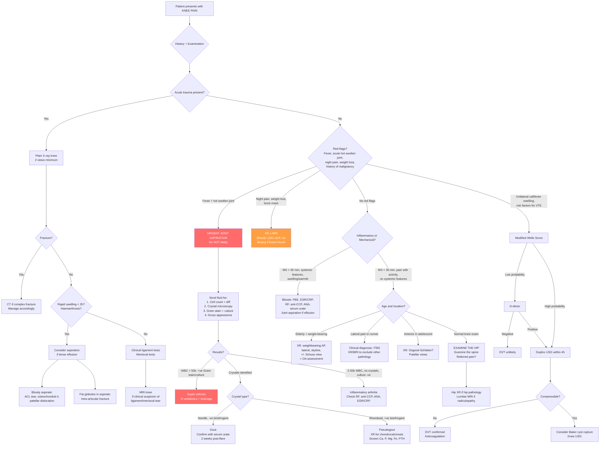

## Diagnostic Criteria, Diagnostic Algorithm, and Investigation Modalities

The diagnosis of knee pain is fundamentally a **clinical exercise** — the history and examination narrow the differential, and investigations are targeted to **confirm** the working diagnosis and **exclude** the dangerous ones. As Murtagh puts it: ***"The provisional diagnosis may be evident from a combination of the history and simple inspection of the joint but the process of testing palpation, movements (active and passive) and specific structures of the knee joint helps pinpoint the disorder"*** [1].

The golden rule: **Don't order investigations in a vacuum.** Every test must be driven by a clinical question. That said, certain conditions have formal diagnostic criteria, and there is a logical algorithm for working through the undifferentiated knee.

---

## Diagnostic Criteria for Key Conditions Causing Knee Pain

### 1. Osteoarthritis — Clinical + Radiological Diagnosis

OA does **not** have formal laboratory diagnostic criteria because it is fundamentally a clinical-radiological diagnosis. The ACR clinical classification criteria for OA knee (1986, still widely used) combine clinical features ± laboratory ± radiology:

**ACR Clinical Classification Criteria for OA Knee** (sensitivity 95%, specificity 69% for clinical alone):

- Knee pain **plus** at least 3 of the following 6:
  1. Age > 50
  2. Morning stiffness < 30 minutes
  3. Crepitus on active motion
  4. Bony tenderness
  5. Bony enlargement
  6. No palpable warmth

> **Why these criteria?** Each item captures the pathophysiology: age reflects cumulative cartilage wear; brief stiffness reflects mild non-inflammatory synovial thickening (not the intense synovitis of RA); crepitus = roughened cartilage surfaces; bony tenderness = exposed subchondral bone; bony enlargement = osteophytes; no warmth = lack of significant inflammation.

***Radiological severity is graded by the Kellgren-Lawrence (KL) classification*** [3]:

| Grade | Description |
|---|---|
| ***Grade 0*** | ***No joint space narrowing (JSN)*** |
| ***Grade 1*** | ***Possible osteophytes, doubtful JSN*** |
| ***Grade 2*** | ***Definite osteophytes*** |
| ***Grade 3*** | ***Definite JSN*** |
| ***Grade 4*** | ***Bone-on-bone deformity*** |

***Radiographic views*** [3]:
- ***Weightbearing AP***: ***medial vs lateral compartment***
- ***Lateral***: ***anteromedial vs posteromedial (e.g., posterior osteophytes)***
- ***Skyline***: ***patellofemoral joint space***
- ***Valgus stress / Varus stress***: ***assess medial / lateral joint space***
- ***Standing scanogram of bilateral LL***: ***alignment — tibiofemoral angle (TFA), mechanical axis***
- ***+/- Schuss view (30° flexion)***: ***more sensitive for early OA***

***Radiological features — the LOSS mnemonic*** [3]:
- ***Loss of joint space*** (earliest)
- ***Osteophytes***
- ***Subchondral cysts***
- ***Subchondral sclerosis***

<Callout title="OA is a Clinical-Radiological Diagnosis" type="idea">
There is no blood test for OA. Inflammatory markers (ESR, CRP) are typically normal or minimally elevated. Radiographs may be normal in early OA (clinical symptoms precede X-ray changes). The Schuss view at 30° flexion is more sensitive for detecting early cartilage loss because it loads the posterior femoral condyle where early wear often begins.
</Callout>

---

### 2. Septic Arthritis — Clinical + Synovial Fluid Diagnosis

There is no validated scoring system for definitively diagnosing septic arthritis. Diagnosis is based on **clinical suspicion + joint aspiration**:

***"Hot, swollen tender joint = septic arthritis until proven otherwise, even without fever, ↑WBC, ↑ESR/CRP"*** [9].

**Diagnostic standard**: **Arthrocentesis** (joint aspiration) with synovial fluid analysis:
- Gross: turbid/purulent
- WBC > 50,000/mm³ with > 75% neutrophils (highly suggestive, though lower counts don't exclude)
- **Gram stain**: Positive in ~50% of non-gonococcal cases (sensitivity is imperfect — a negative Gram stain does NOT exclude infection)
- **Culture**: Gold standard — positive in ~80–90% of non-gonococcal bacterial arthritis
- **Always** send for crystals simultaneously (gout/pseudogout can coexist with infection)

**The Kocher criteria** (validated for paediatric septic hip, frequently applied to knee):
1. Non-weight-bearing
2. Fever > 38.5°C
3. WBC > 12,000/mm³
4. ESR > 40 mm/hr

Meeting all 4 gives >99% probability of septic arthritis. But these are **screening** criteria — definitive diagnosis still requires aspiration.

---

### 3. Gout — 2015 ACR/EULAR Classification Criteria

**Entry criterion**: At least 1 episode of swelling, pain, or tenderness in a peripheral joint or bursa.

**Sufficient criterion** (if met, classify as gout without scoring): **MSU crystals** in a symptomatic joint/bursa (fluid or tophus).

If no crystal confirmation, use a scoring system (threshold ≥ 8 points out of 23):

| Domain | Category | Score |
|---|---|---|
| Pattern of joint involvement | Ankle or midfoot (mono/oligoarthritis) | 1 |
| | 1st MTP | 2 |
| Characteristics of episode | Erythema, cannot bear touch/pressure, great difficulty walking | 1 per feature (max 3) |
| Time course | Maximum within < 24h, resolution ≤ 14d, complete resolution between episodes | 1 per feature (max 3) if ≥ 2 typical episodes |
| Clinical tophi | Present | 4 |
| ***Serum urate*** | < 4 mg/dL | -4 |
| | 6– < 8 mg/dL | 2 |
| | 8– < 10 mg/dL | 3 |
| | ≥ 10 mg/dL | 4 |
| ***Imaging: urate deposition*** | ***USG double contour sign or DECT demonstrating urate deposition*** | 4 |
| ***Imaging: gout-related joint damage*** | ***XR hands/feet showing ≥ 1 erosion*** | 4 |

**Key investigations for gout** [5][13]:
- ***Serum urate: can be high, normal, or low (12–43% normal/low during acute flare)*** → ***should be deferred to ≥ 2 weeks after resolution*** [13]
- ***Joint fluid analysis — most important test*** [13]:
  - ***MSU crystals: elongated needle-shaped, negative birefringent crystals ± engulfment by PMN*** [13]
  - ***WBC 2–100 × 10³/mL, > 90% neutrophils*** [13]
- ***Plain XR: typically normal in acute gout ± features of chronic gout (punched-out erosions with overhanging edges, tophi, chronic joint destruction)*** [13]
- ***USG: double contour sign overlying surface of joint cartilage*** [13]
- ***DECT: can specifically identify urate deposits*** [13]

---

### 4. Pseudogout (CPPD Disease) — Synovial Fluid + Radiological Diagnosis

***Diagnosis: NOT based on clinical features alone, based on arthrocentesis and XR*** [6]:

- ***Definite CPPD disease*** [6]:
  - ***Positive birefringent crystals on polarised light microscopy + cartilage/joint capsule calcification on XR***; or
  - ***CPP crystals demonstrated in tissue/synovial fluid by definitive means (rarely done)***
- ***Probable CPPD disease*** [6]:
  - ***Positive birefringent crystals on polarised light microscopy alone***; or
  - ***Cartilage/joint capsule calcification on XR alone***

***Crystal microscopy*** [13]:
- ***Pseudogout: pleomorphic or rhomboid shaped, weakly positive birefringence***

***XR features*** [6]:
- ***Chondrocalcinosis: irregular faint punctate/linear radiodensities in articular cartilage*** (± ligaments, tendons, synovium, bursa, joint capsules)
- ***Degenerative changes: subchondral cysts, osteophytes, ↓joint space***
- ***Specific joints: MCPJ — squared off bone ends and hook-like MCPJ; Wrist — isolated/unusually extensive radiocarpal joint narrowing; PFJ — severe space degeneration***

***After diagnosis, screen for secondary metabolic causes: Ca, P, Mg, ALP, ferritin*** [6].

---

### 5. Rheumatoid Arthritis — 2010 ACR/EULAR Classification Criteria

While RA is typically a polyarthritis, it can present as **monoarthritis with monoarticular onset** [11]. The criteria (threshold ≥ 6/10) include:

| Domain | Score |
|---|---|
| Joint involvement: 1 large joint | 0 |
| 2–10 large joints | 1 |
| 1–3 small joints | 2 |
| 4–10 small joints | 3 |
| > 10 joints (≥ 1 small) | 5 |
| Serology: Low-positive RF or anti-CCP | 2 |
| High-positive RF or anti-CCP | 3 |
| Acute phase: Normal ESR and CRP | 0 |
| Abnormal ESR or CRP | 1 |
| Duration: < 6 weeks | 0 |
| ≥ 6 weeks | 1 |

---

### 6. DVT — Modified Wells Score + D-dimer / Duplex USG

***Diagnostic evaluation (NICE 2015)*** [7]:
- ***Clinical triad of pain + heat + swelling***
- ***Modified Wells score: stratifies pre-test probability***
- ***D-dimer: in low pre-test probability*** → ***Sensitive but not specific*** → ***If +ve, offer duplex USG in 4h (or else start anticoagulant first)***
- ***Duplex USG: in high pre-test probability*** → ***Finding: non-compressibility***

---

### 7. Meniscal Tear — Clinical + MRI Diagnosis

***Investigations*** [3]:
- ***XR knee: rule out fracture***
- ***MRI knee: diagnostic + grading***

Clinical diagnosis relies on mechanism (***twist of knee while flexed and weight-bearing*** [3]), delayed swelling (6–12h due to poor vascularity), ***locked knee in flexion*** (bucket-handle tear), and positive ***McMurray test, Apley's grinding test*** [3]. MRI confirms the diagnosis, characterises tear pattern, and guides surgical planning (repair vs. meniscectomy based on zone and pattern).

---

### 8. Ligament Injuries — Clinical + MRI Diagnosis

***Investigations*** [3]:
- ***XR knee: exclude fracture*** (may show Segond fracture — a small avulsion off the lateral tibial plateau, pathognomonic for ACL tear)
- ***MRI: diagnostic + grading of injury*** [3]

***MCL grading*** [3]:
- ***Grade I (no loss of MCL integrity): medial joint line pain***
- ***Grade II (incomplete tear): valgus stress test +ve in 30° flexion***
- ***Grade III (complete tear + capsule injury): valgus stress test +ve in both 30° flexion and full extension***

---

## Master Diagnostic Algorithm

The algorithm below integrates the clinical approach with targeted investigations. The first priority is always to **exclude the dangerous diagnoses** (septic arthritis, fracture, DVT, malignancy) before attributing pain to a benign cause.

---

## Investigation Modalities — Detailed Guide

### A. Blood Tests

***Key investigations to consider*** [1]:
- ***FBE/ESR***
- ***Connective tissue antibodies***
- ***Blood culture***

| Test | What It Tells You | When to Order | Key Findings |
|---|---|---|---|
| **FBE (CBC)** | Infection (↑WBC with neutrophilia), malignancy (anaemia, cytopenias), haemophilia | Any suspected inflammatory/infectious/haematological cause | ↑WBC + left shift → infection; anaemia + thrombocytopenia → marrow disease |
| ***ESR/CRP*** | Acute phase response — indicates inflammation but NOT specific [18] | ***Useful if joint fluid examination equivocal*** [18]; to assess treatment response | ↑ in infection, crystal arthritis, RA. **CRP usually normal/mildly ↑ in SLE** [18]. OA = normal or mildly elevated |
| ***Serum urate*** | Hyperuricaemia supports gout diagnosis | ***If suspicious of gout — taken 2 weeks after resolution*** [18] as urate may be paradoxically normal/low during acute flare [13] | > 0.42 mmol/L (7 mg/dL) in men, > 0.36 mmol/L (6 mg/dL) in women |
| ***RF (Rheumatoid Factor)*** | Anti-IgG IgM antibody | ***If suspicious for RA*** [18] | ***+ve in 70% RA (not sensitive)*** and also positive in many other conditions (Sjögren's, SLE, infections, elderly). Specificity ~80% |
| ***Anti-CCP*** | Anti-citrullinated peptide antibody | ***If suspicious for RA*** [18] | More specific than RF (~95% specificity). High titres predict erosive disease |
| ***ANA*** | Antinuclear antibody screen | ***If suspicious for SLE*** [18] | Sensitive (~95%) but not specific. If positive, request anti-dsDNA, anti-ENA panel |
| **Blood culture** | Bacteraemia | Suspected septic arthritis with systemic sepsis | Positive in ~50% of septic arthritis cases (haematogenous spread) |
| **Ca, P, Mg, ALP, ferritin** | Screen for metabolic causes of CPPD | After confirming CPPD disease, especially if age < 55 | ↑Ca/PTH → hyperparathyroidism; ↑ferritin → haemochromatosis; ↓Mg → hypomagnesaemia; ↓ALP → hypophosphatasia [6] |
| **LDH, ALP** | Bone turnover markers | Suspected malignancy, Paget's disease | ↑ALP → Paget's disease or bony metastases; ↑LDH → lymphoma, Ewing's sarcoma |
| **Coagulation screen** | Bleeding disorder | Haemarthrosis without trauma | Prolonged aPTT → haemophilia |

---

### B. Synovial Fluid Analysis — ***MOST IMPORTANT TEST*** [18]

This is the single most important investigation in the acutely swollen knee. I cannot overstate this. If you can only do one test, aspirate the joint.

***Indications*** [18]:
- ***Suspicious of septic arthritis***
- ***Suspicious of crystal-induced arthritis***
- ***Suspicious of haemarthrosis***
- ***Differentiating inflammatory vs non-inflammatory arthritis***

***Send for*** [18]:
- ***Macroscopic: colour, viscosity, turbidity***
- ***Microscopy: wet films, WBC count/diff, crystal microscopy***
- ***Microbiology (if suspect septic arthritis): Gram stain (urgent if septic arthritis suspected), bacterial culture, AFB smear and culture, fungal stain (if indicated)***

#### Synovial Fluid Interpretation Table

| Parameter | Normal | Non-inflammatory | Inflammatory | Septic |
|---|---|---|---|---|
| **Appearance** | Clear, colourless | Clear, yellow (straw) | Translucent → opaque, yellow | Opaque, purulent (yellow-green) |
| **Viscosity** | High (long string) | High | Low (short string) | Very low |
| **WBC (/mm³)** | < 200 | < 2,000 | 2,000–100,000 | > 50,000 (often > 100,000) |
| **Neutrophils** | < 25% | < 25% | > 50% | > 75% |
| **Crystals** | None | None | MSU or CPPD | None (unless coexisting) |
| **Gram stain** | Negative | Negative | Negative | Positive ~50% |
| **Culture** | Negative | Negative | Negative | Positive ~80–90% |
| **Examples** | — | OA, trauma, early AVN | Gout, pseudogout, RA, reactive | Bacterial septic arthritis |

> **Why is viscosity low in inflammatory fluid?** Viscosity of synovial fluid depends on hyaluronic acid concentration. Inflamed synovium produces dilute fluid with lower hyaluronic acid → reduced viscosity → the classic "short string" test (normal fluid strings out > 3 cm between fingers; inflammatory fluid breaks quickly).

***Crystal microscopy — the definitive differentiator*** [13][18]:
- ***Gout: slender and needle-shaped, strongly negative birefringence under polarised light***
- ***Pseudogout: pleomorphic or rhomboid shaped, weakly positive birefringence***

> **What does birefringence mean?** Birefringence is the ability of a crystal to split light into two rays travelling at different speeds. Under **compensated polarised light microscopy**: **Negative birefringence** = crystal appears **yellow when parallel** to the slow axis of the red compensator (mnemonic: "**N**egative = **N**eedle = yellow when **N**orth-south / parallel"). **Positive birefringence** = crystal appears **blue when parallel** (opposite direction).

**Special findings**:
- **Bloody aspirate with fat globules** (lipid droplets on surface) = **intra-articular fracture** (fat from bone marrow mixes with blood)
- **Bloody aspirate without fat** = haemarthrosis from soft tissue injury (ACL tear, synovial injury)
- **Milky-white fluid** = crystal arthritis or rarely chylous effusion

***Arthroscopy*** [18]:
- ***Diagnostic: assess degree of cartilage damage, synovial biopsy for equivocal cases***
- ***Therapeutic: debridement of damaged cartilage, removal of loose bodies, drainage for pain relief***

<Callout title="Joint Aspiration Before Steroids — Always!" type="error">
Never inject intra-articular steroids without first aspirating and sending fluid for Gram stain and culture. Injecting steroid into a septic joint is catastrophic — it suppresses the local immune response and allows bacterial proliferation. Even if crystals are found, send cultures — coexistence of crystals and infection occurs in up to 5% of cases.
</Callout>

---

### C. Imaging

***"The best modality is the one which can answer the clinical question in the clearest, fastest, safest and cheapest way."*** [19]

#### 1. Plain Radiography (X-ray)

***First-line imaging investigation*** for knee pain [19][20].

***Main indications: evaluation of musculoskeletal system, especially in trauma and joint-based diseases*** [20]. ***Most films have ≥ 2 views because fractures may be detected only in one view*** [20].

***Characteristics*** [20]:
- ***Most useful for structures with high-density contrasts between tissue types***
- ***Highest spatial resolution → good for fine details (e.g., fractures)***
- ***Poor contrast → poor in examining soft tissues***
- ***Plain X-ray can only tell between four densities: calcium, water (soft tissues), fat, and air***
- ***2-D representation of 3-D structures → overlapping may be present → use different angles to remedy***

**Standard knee views**:
- **AP** (anteroposterior): Assess alignment, joint space (medial vs lateral), bony lesions
- **Lateral**: Assess patella position (alta/baja), posterior osteophytes, effusion (suprapatellar fat pad sign), tibial plateau
- **Skyline / Merchant view**: Patellofemoral joint — assess patellar tilt, subluxation, patellofemoral OA
- ***Weightbearing AP***: More sensitive than supine AP for joint space narrowing (true functional loading) [3]
- ***Schuss view (30° flexion weightbearing)***: ***More sensitive for early OA*** [3] — loads the posterior condylar surface where early cartilage loss occurs
- ***Standing scanogram of bilateral LL***: Full-length film for alignment assessment (mechanical axis, TFA) [3]
- **Stress views** (valgus/varus): Assess collateral ligament integrity and compartmental joint space

**Key X-ray findings and their meaning**:

| Finding | Diagnosis | Pathophysiological Basis |
|---|---|---|
| ***Loss of joint space*** | ***OA (earliest sign)*** [3] | Cartilage loss → bones approximate |
| ***Osteophytes*** | ***OA*** [3] | Reactive new bone at joint margins to redistribute load |
| ***Subchondral sclerosis*** | ***OA*** [3] | Increased stress → reactive bone thickening |
| ***Subchondral cysts*** | ***OA*** [3] | Microfractures in sclerotic bone → synovial fluid intrusion |
| ***Chondrocalcinosis*** | ***CPPD disease*** [6] | ***Irregular faint punctate/linear radiodensities in articular cartilage*** |
| Punched-out erosions with overhanging edges | Chronic tophaceous gout | Tophi erode bone from the outside; overhanging edge = preserved cortex overlying the erosion |
| Periarticular osteopenia + erosions + uniform JSN | RA | Pannus erodes bone; osteopenia from disuse + cytokine-driven bone resorption |
| Aggressive periosteal reaction + soft tissue mass | Malignancy (osteosarcoma) | Rapid bone destruction → sunburst pattern / Codman's triangle |
| Segond fracture | ACL tear (pathognomonic) | Avulsion of lateral capsular ligament off lateral tibial plateau during internal rotation + valgus |
| Lipohemarthrosis on lateral view | Intra-articular fracture | Fat from marrow + blood layer in suprapatellar pouch (fat-fluid level) |

#### 2. Ultrasound (USG)

***No radiation, cheap, excellent spatial resolution if superficial, real-time*** [19]. ***Operator dependent, limited penetration, cannot see through air and bone*** [19].

**Applications in knee pain**:

| Use | Finding | Significance |
|---|---|---|
| **Joint effusion** | Anechoic or hypoechoic fluid in suprapatellar recess | Quantify effusion, guide aspiration |
| **Baker's cyst** | Well-defined fluid-filled structure in popliteal fossa between medial head of gastrocnemius and semimembranosus | Distinguish from DVT; look for underlying joint pathology |
| **Gout** | ***Double contour sign***: hyperechoic line overlying the hypoechoic cartilage surface [13] | MSU crystal deposition on cartilage surface |
| **CPPD** | ***Thin hyperechoic band paralleling bone cortex, separated from it by hypoechoic cartilage*** [6] | CPPD crystal deposition within cartilage (cf. gout which is ON cartilage surface) |
| **Tendinopathy** | Thickened, hypoechoic tendon ± neovascularisation on Power Doppler | Patellar tendinopathy, quadriceps tendinopathy |
| **Bursitis** | Fluid-filled bursa with thickened walls | Prepatellar, infrapatellar, pes anserine |
| **Soft tissue mass** | Solid vs cystic, vascularity | Differentiate cyst from solid tumour |
| **DVT** | Non-compressibility of deep veins on compression USG (= duplex USG) [7] | Thrombus prevents vein from collapsing under probe pressure |

***Duplex USG is the first-line imaging for DVT*** [7][17].

#### 3. MRI

***Excellent anatomical differentiation especially soft tissues, no radiation*** [19]. ***Not readily available, very expensive, C/I pacemaker and metallic implants*** [19].

**MRI is the gold standard for soft tissue evaluation of the knee** — it is the investigation of choice for:

| Structure | MRI Findings | Clinical Scenario |
|---|---|---|
| **Meniscal tear** | Intrameniscal signal reaching the articular surface (grade 3 signal) on T2-weighted or PD-weighted images | ***MRI knee: diagnostic + grading*** [3]. Determines tear pattern, location (zone), and guides surgical approach |
| **ACL tear** | Discontinuity, abnormal signal, abnormal orientation of ACL fibres; secondary signs include bone bruising (lateral femoral condyle + posterolateral tibial plateau kissing pattern), anterior tibial translation, uncovered posterior horn lateral meniscus | Suspected ACL tear after trauma with haemarthrosis |
| **PCL tear** | Loss of normal dark signal, thickening, discontinuity | Dashboard injury mechanism |
| **MCL/LCL injury** | Periligamentous oedema (grade I), partial disruption (grade II), complete disruption (grade III) | ***MRI: diagnostic + grading of injury*** [3] |
| **Bone marrow oedema** | High signal on T2/STIR, low on T1 | Stress fracture, AVN, bone bruise, early OA |
| **AVN/Osteonecrosis** | Subchondral low signal line ("double line sign" on T2 = pathognomonic) | Suspected SONK, steroid use, SLE |
| **Tumour** | Soft tissue mass with or without bony involvement, marrow replacement | Staging, biopsy planning |
| **Chondral damage** | Focal thinning, fissuring, or defect in articular cartilage | Osteochondritis dissecans, early chondral lesions not visible on X-ray |
| **Baker's cyst** | Well-defined fluid signal collection between gastrocnemius and semimembranosus | Look for underlying meniscal/cartilage pathology |

> **Why is MRI better than X-ray for soft tissues?** MRI exploits the magnetic properties of hydrogen atoms (abundant in water and fat) to generate contrast between different soft tissue types. Ligaments, menisci, cartilage, and synovium all have different water content and produce distinct signals. X-rays only differentiate four densities (calcium, water, fat, air) and cannot distinguish between these soft tissue structures.

#### 4. CT Scan

***Excellent anatomical differentiation, allow 3D reconstruction*** [19]. ***Substantial radiation, not as good as MRI in soft tissues, high cost*** [19].

**Applications in knee pain**:

| Use | Why CT Over Other Modalities? |
|---|---|
| **Complex fractures** (tibial plateau, distal femur) | 3D reconstruction helps surgical planning; better bone detail than MRI |
| **Loose bodies** | CT detects calcified bodies that may be missed on X-ray |
| **Pre-operative planning** (total knee arthroplasty) | Rotational alignment assessment |
| **DECT for gout** | ***Dual energy CT can specifically identify urate deposits*** [13] — colour-codes urate crystals vs calcium |

#### 5. Nuclear Medicine

***Gives specific functional information, very sensitive for certain diseases*** [19]. ***Radiation, poor anatomical differentiation, quite expensive*** [19].

| Test | Application | Finding |
|---|---|---|
| **Bone scintigraphy (Tc-99m)** | Suspected stress fracture (negative X-ray), metastatic bone survey, infection, Paget's disease | Focal increased uptake ("hot spot") at area of ↑bone turnover |
| **PET-CT** | Staging malignancy, assessing infection extent in complex cases | FDG-avid lesions indicate high metabolic activity |

> **Why is bone scan so sensitive?** It detects areas of increased osteoblastic activity (new bone formation). Stress fractures stimulate intense bone remodeling weeks before a fracture line becomes visible on X-ray. However, it is non-specific — infection, tumour, and fracture all appear as "hot spots."

---

### D. Special Investigations

| Investigation | Indication | What It Shows |
|---|---|---|
| **Ankle-Brachial Index (ABI)** [17] | Suspected peripheral arterial disease as cause of exertional leg/knee pain | ***Normal = 0.90–1.30; ≤ 0.9 = arterial occlusive disease (diagnostic); 0.40–0.90 = claudication; < 0.4 = rest pain, tissue loss; > 1.30 = calcified arteries (use TBI instead)*** |
| **Nerve conduction studies / EMG** | Suspected peripheral neuropathy, peroneal nerve palsy, radiculopathy | Distinguish neuropathic from musculoskeletal pain; localise nerve lesion |
| **Lumbar MRI** | Suspected referred pain from spine, neurogenic claudication | Disc herniation, spinal stenosis with "trefoil" appearance [16] |
| **Hip X-ray** | Suspected referred pain from hip (especially children — SCFE, Perthes) | Frog-leg lateral view for SCFE; AP pelvis for Perthes |
| **Bone biopsy** | Suspected primary bone tumour, uncertain bone lesion | Histological diagnosis; must be done at the definitive surgical centre to avoid contaminating surgical fields |

---

### Systematic Approach to Investigations — By Clinical Scenario

| Scenario | First-Line | Second-Line | Definitive |
|---|---|---|---|
| **Acute hot swollen knee + fever** | FBE, ESR/CRP, blood culture, **urgent joint aspiration** | X-ray (r/o fracture, chondrocalcinosis) | Synovial fluid: cell count, crystals, Gram stain, culture |
| **Acute traumatic knee** | X-ray (AP + lateral ± skyline) | MRI (if ligament/meniscal injury suspected clinically) | Arthroscopy (if MRI equivocal or for therapeutic intervention) |
| **Chronic mechanical knee pain in elderly** | Weightbearing AP + lateral + skyline X-ray ± Schuss view | Standing scanogram (if surgical planning) | Clinical diagnosis of OA (no blood test needed) |
| **Suspected gout** | Joint aspiration (crystals), serum urate (2 weeks post-flare) | X-ray (chronic changes), USG (double contour sign) | DECT if equivocal |
| **Knee pain in a child** | X-ray knee + **X-ray hip** (always!) | MRI if suspected AVN, osteochondritis dissecans | Bone biopsy if tumour suspected |
| **Suspected DVT** | Modified Wells score → D-dimer (if low probability) | Duplex USG | CT venography (if USG equivocal) |
| **Night pain, weight loss, bone mass** | X-ray, FBE, ALP, LDH, Ca | MRI (staging), CT chest/abdomen (metastatic workup) | Biopsy |

---

<Callout title="High Yield Summary - Diagnosis and Investigations">

1. **Joint aspiration is the MOST IMPORTANT test** in an acutely swollen knee. It differentiates septic from crystal from inflammatory from non-inflammatory causes. Always send for cell count, crystals, Gram stain, and culture simultaneously.

2. **Crystal identification**: Gout = needle-shaped, strongly negative birefringent. Pseudogout = rhomboid, weakly positive birefringent. Finding crystals does NOT exclude coexisting infection — always send cultures.

3. **OA is a clinical-radiological diagnosis**: LOSS on X-ray (Loss of joint space, Osteophytes, Subchondral cysts, Subchondral sclerosis). Kellgren-Lawrence grades 0–4. Weightbearing AP and Schuss view are more sensitive than supine films.

4. **CPPD diagnosis = arthrocentesis + X-ray**: Definite = positive birefringent crystals + chondrocalcinosis on X-ray. Always screen metabolic causes (Ca, P, Mg, ALP, ferritin) afterwards.

5. **MRI is the gold standard for soft tissue evaluation** — meniscal tears, ligament injuries, AVN, bone marrow oedema, tumours. X-ray is first-line for bony pathology and fractures.

6. **Serum urate in gout**: Check 2 weeks AFTER resolution of acute flare (12–43% are normal/low during flare).

7. **DVT workup**: Modified Wells score → D-dimer if low probability; duplex USG if high probability or positive D-dimer.

8. **Always X-ray the hip** in a child with knee pain — SCFE and Perthes refer to the knee.

</Callout>

---

<ActiveRecallQuiz
  title="Active Recall - Diagnostic Criteria, Algorithm and Investigations for Knee Pain"
  items={[
    {
      question: "A patient presents with an acutely hot, swollen knee. What is the single most important investigation and what 4 things must you send the fluid for?",
      markscheme: "Joint aspiration (arthrocentesis). Send for: 1. Macroscopic appearance (colour, viscosity, turbidity), 2. Microscopy including WBC count and differential plus crystal microscopy under polarised light, 3. Gram stain (urgent), 4. Bacterial culture (plus AFB/fungal if indicated)."
    },
    {
      question: "On polarised light microscopy, you see rhomboid-shaped crystals with weakly positive birefringence. What is the diagnosis, and what X-ray finding supports it? Name 3 metabolic conditions you must screen for.",
      markscheme: "Pseudogout (CPPD crystal deposition disease). X-ray shows chondrocalcinosis (punctate/linear radiodensities in articular cartilage). Screen for: haemochromatosis (ferritin), hyperparathyroidism (calcium, PTH), and hypomagnesaemia (magnesium). Also consider Wilson disease and hypophosphatasia."
    },
    {
      question: "List the 4 radiological features of OA using the LOSS mnemonic and explain why the Schuss view at 30 degrees flexion is more sensitive for early OA than a standard AP view.",
      markscheme: "LOSS: Loss of joint space (earliest), Osteophytes, Subchondral cysts, Subchondral sclerosis. The Schuss view at 30 degrees loads the posterior femoral condyle where early cartilage loss typically begins. A standard AP in extension does not adequately assess this area because the contact point shifts anteriorly."
    },
    {
      question: "Why might serum urate be normal or even low during an acute gout flare? When should you measure it?",
      markscheme: "During an acute flare, urate is being consumed by crystal formation and cleared by the inflammatory response, with uricosuric effects of acute phase cytokines. 12-43% of patients have normal or low urate during a flare. Serum urate should be deferred to at least 2 weeks after resolution of the acute flare."
    },
    {
      question: "A 14-year-old presents with knee pain. Knee examination is normal. What must you do and why? What specific X-ray view should you request?",
      markscheme: "Must examine the hip, as hip pathology (SCFE, Perthes disease) commonly refers pain to the knee via the obturator nerve (L2-L4). Request a frog-leg lateral view of the hip (most sensitive for SCFE) in addition to AP pelvis."
    },
    {
      question: "What is the pathognomonic X-ray finding for an ACL tear, and what is its mechanism?",
      markscheme: "Segond fracture: a small avulsion fracture off the lateral tibial plateau. Mechanism: avulsion of the lateral capsular ligament (anterolateral ligament) during internal rotation plus valgus force, which is the same mechanism that tears the ACL."
    }
  ]}
/>

---

## References

[1] Lecture slides: murtagh merge.pdf (Knee pain, p64–65)
[3] Senior notes: maxim.md (Osteoarthritis radiological features and classification, meniscal tear investigations, MCL grading, IT band syndrome)
[5] Senior notes: Ryan Ho Rheumatology.pdf (p35, Gout epidemiology and causes)
[6] Senior notes: Ryan Ho Rheumatology.pdf (p41–42, CPPD disease workup, diagnosis, XR features, screening)
[7] Senior notes: Ryan Ho Haemtology.pdf (p131, DVT diagnostic evaluation)
[9] Senior notes: Ryan Ho Rheumatology.pdf (p67, Septic arthritis)
[11] Senior notes: Ryan Ho Rheumatology.pdf (p28, Approach to Acute Monoarthritis) and Senior notes: Ryan Ho Fundamentals.pdf (p406, Acute Monoarthritis)
[13] Senior notes: Ryan Ho Rheumatology.pdf (p30 and p37, Synovial fluid analysis and crystal microscopy; p39, Chronic gout imaging)
[16] Senior notes: Ryan Ho Neurology.pdf (p174, Lumbar canal stenosis)
[17] Senior notes: Ryan Ho Cardiology.pdf (p214, ABI and duplex USG for PAD)
[18] Senior notes: Ryan Ho Fundamentals.pdf (p407 and p410, Initial investigations for monoarthritis and polyarthritis)
[19] Senior notes: Ryan Ho Diagnostic Radiology.pdf (p5, Imaging modalities comparison table)
[20] Senior notes: Ryan Ho Diagnostic Radiology.pdf (p13, Plain film radiography)
