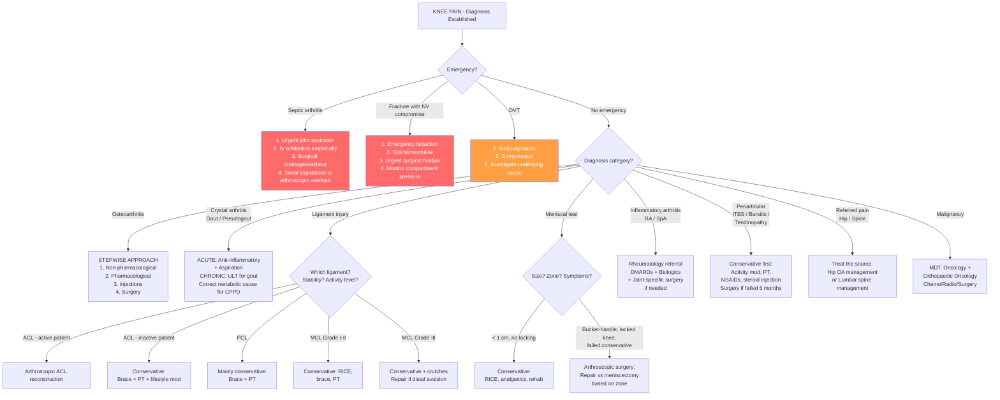

## Management of Knee Pain

Management of knee pain is **diagnosis-driven** — there is no single "management of knee pain." Instead, you identify the underlying condition and treat it specifically. However, there are overarching principles and a logical algorithm that applies across conditions. Let me walk you through this as you would on a ward round: first the big picture, then the specifics.

---

## Overarching Principles

1. **Exclude the emergencies first**: Septic arthritis → urgent aspiration + IV antibiotics. Fracture with neurovascular compromise → emergency reduction. DVT → anticoagulation. Malignancy → biopsy and staging.
2. **Treat the underlying cause**, not just the symptom.
3. **Conservative before operative** in most non-emergency situations — but do not delay surgery when clearly indicated.
4. **Multidisciplinary approach**: Orthopaedics, Rheumatology, Physiotherapy, Pain medicine, and sometimes Vascular Surgery or Oncology.

---

## Master Management Algorithm

---

## Condition-Specific Management

### A. Osteoarthritis of the Knee

OA management follows a **stepwise escalation** from non-pharmacological to pharmacological to interventional to surgical. The key insight is that **no treatment reverses OA** — the goals are pain relief, functional improvement, and slowing progression.

#### Step 1: Non-Pharmacological (Foundation — Always)

***Conservative management*** [3]:
- ***Relief of weight-bearing: weight reduction, walking aids, muscle strengthening***

| Modality | Mechanism | Evidence |
|---|---|---|
| **Weight loss** | Every 1 kg lost reduces ~4 kg load across the knee. Adipose tissue also produces pro-inflammatory cytokines (adipokines) that accelerate cartilage degradation. | 5% body weight loss → clinically meaningful pain reduction |
| **Physiotherapy / Exercise** | Quadriceps strengthening provides dynamic stability, compensating for lost cartilage cushioning. Aerobic exercise improves joint nutrition (synovial fluid circulation depends on movement) and reduces systemic inflammation. | Strong evidence for land-based exercise; aquatic therapy also beneficial |
| **Walking aids** | A contralateral cane reduces ipsilateral knee load by ~20–30%. | Simple, effective, underutilised |
| **Orthotics / Bracing** | Lateral wedge insoles for medial compartment OA (shift load laterally); unloader braces for unicompartmental OA | Modest evidence; patient compliance is the limiting factor |
| **Patient education** | Understanding the disease reduces catastrophising, improves self-management, and improves adherence to exercise | Foundation of all OA management |

> **Why is quadriceps strengthening so important?** The quadriceps acts as a "dynamic shock absorber" for the knee. In OA, pain causes reflex quadriceps inhibition (arthrogenic muscle inhibition) → atrophy → loss of dynamic stability → increased stress on cartilage → more pain → more inhibition. Breaking this vicious cycle with targeted strengthening is the single most effective non-pharmacological intervention.

#### Step 2: Pharmacological

***Pain relief: analgesics, intra-articular steroid*** [3].

| Drug | Mechanism | Indication | Key Points |
|---|---|---|---|
| **Paracetamol** | Central inhibition of COX enzymes + serotonergic descending inhibitory pathway activation | First-line analgesic for mild-moderate OA pain | Max 4g/day in adults. Hepatotoxic in overdose. Recent evidence suggests modest efficacy vs placebo — increasingly questioned as sole analgesic [21] |
| **Topical NSAIDs** (e.g., diclofenac gel) | Local COX-1/2 inhibition → ↓prostaglandin synthesis at the joint → ↓inflammation and pain | Mild-moderate knee OA; preferred over oral NSAIDs in elderly | Minimal systemic absorption → fewer GI/renal/CV side effects. Apply directly over the affected joint |
| **Oral NSAIDs** (e.g., naproxen, ibuprofen, diclofenac) | Systemic COX-1/2 inhibition → ↓prostaglandin synthesis | Moderate-severe OA pain not controlled by paracetamol ± topical NSAIDs | Use lowest effective dose for shortest duration. **Contraindications**: active PUD, CKD (GFR < 30), heart failure, aspirin-exacerbated respiratory disease. Co-prescribe PPI for GI protection if > 65y or history of PUD |
| **COX-2 selective inhibitors** (e.g., celecoxib, etoricoxib) | Selective COX-2 inhibition → anti-inflammatory effect with less GI toxicity (COX-1 protects gastric mucosa) | Patients with GI risk factors who need oral NSAIDs | Lower GI risk but **equivalent or higher CV risk** compared to non-selective NSAIDs. Still need PPI in high-risk patients |
| **Weak opioids** (e.g., tramadol, codeine) | μ-opioid receptor agonism in CNS → ↓pain perception | Moderate-severe pain not responding to NSAIDs, or NSAIDs contraindicated | Risk of dependence, constipation, drowsiness. Tramadol also has serotonin/noradrenaline reuptake inhibition → risk of serotonin syndrome with SSRIs |
| **Duloxetine** | SNRI → enhances descending inhibitory pain pathways | Chronic OA pain with central sensitisation component | OARSI-recommended adjunct for patients with widespread pain or depressive comorbidity |

<Callout title="NSAID Prescribing — The Risk Triangle" type="error">
Every NSAID prescription requires you to consider three risks: **GI** (PUD, bleeding → co-prescribe PPI), **Renal** (prostaglandin-mediated afferent arteriolar dilatation maintains GFR → NSAIDs block this → AKI risk, especially in elderly, dehydrated, or CKD patients), and **CV** (prostaglandin I2 in endothelium is antithrombotic → COX-2 inhibition tips the balance towards thrombosis → ↑MI/stroke risk). Always check renal function before prescribing and avoid in patients with established CV disease.
</Callout>

#### Step 3: Injections

| Injection | Mechanism | Indication | Key Points |
|---|---|---|---|
| ***Intra-articular corticosteroid*** (e.g., triamcinolone acetonide 40 mg + 1–2 mL 1% lidocaine) [6] | Potent local anti-inflammatory → ↓synovitis, ↓effusion, ↓pain. Corticosteroids suppress NF-κB → ↓cytokine production → ↓neutrophil recruitment | Acute flare of OA with significant effusion; moderate-severe pain not controlled by oral medications | ***Effect: usually provides relief of pain/swelling ≤ 8–24h*** [6]. Duration: typically 4–12 weeks. Limit to 3–4 injections per joint per year (repeated steroid → accelerated cartilage loss). ***Caution: must r/o septic arthritis before injection of steroid*** [6] |
| ***Intra-articular hyaluronic acid (viscosupplementation)*** [3] | Exogenous hyaluronic acid restores synovial fluid viscosity and shock-absorbing properties. May also have anti-inflammatory and analgesic effects via CD44 receptor signalling on chondrocytes | Mild-moderate OA; patients who cannot tolerate NSAIDs or are not surgical candidates | ***Intra-articular hyaluronic acid / platelet-rich plasma (?evidence)*** [3]. Evidence is mixed — OARSI 2025 conditionally recommends against routine use but acknowledges some patients benefit. Effect is slow (takes 4–6 weeks) but may last 6–12 months |
| **Platelet-rich plasma (PRP)** | Concentrated growth factors (PDGF, TGF-β, VEGF) from autologous blood → promote tissue healing and modulate inflammation | Mild-moderate OA; increasingly offered in sports medicine clinics | ***?evidence*** [3]. RCTs show variable results. Not recommended in most international guidelines as standard of care. Not covered by public healthcare in HK |

#### Step 4: Surgical

***Operative management*** [3]:
- ***Indications***:
  - ***Patient factor: age, functional status***
  - ***Disease factor: severe impairment to ADL, pain despite conservative treatment***

| Procedure | Indication | Mechanism | Key Details |
|---|---|---|---|
| ***Osteotomy*** | ***Young ( < 60y) with preservation of articular cartilage. Pre-requisite: single compartment disease*** [3] | Realigns the mechanical axis to shift load from the damaged compartment to the healthy one → reduces pain and delays need for arthroplasty | ***High tibial osteotomy*** for medial compartment OA with varus malalignment [3]. ***C/I: severe articular damage, ligament laxity, severe varus deformities*** [3]. Buys time in younger patients — bridge to eventual arthroplasty |
| ***Total knee replacement (TKR)*** | ***Older patients with progressive joint destruction*** [3]. Failed conservative management. Severe pain limiting daily activities. Radiographic KL grade 3–4 | Replaces all three compartments with metal and polyethylene components → eliminates bone-on-bone contact → pain relief | ***Old preferred: reduced chance of revision surgery*** [3]. Prosthesis lifespan typically > 15–20 years with modern implants. 90–95% patient satisfaction |
| **Unicompartmental knee arthroplasty (UKA)** | Isolated medial or lateral compartment OA with intact ACL, correctable deformity, adequate ROM | Replaces only the affected compartment → preserves more native bone and ligaments → more physiological kinematics | ***Unicompartmental knee arthroplasty for medial compartment OA, higher revision rate compared to TKR*** [3]. Less invasive, faster recovery, but stricter patient selection |
| ***Arthroscopic debridement*** | ***Remove osteophytes*** [3], loose bodies | Removes mechanical irritants | Evidence for isolated debridement in OA is poor (the Moseley RCT showed no benefit over sham surgery). Primarily indicated for specific mechanical symptoms (loose bodies, locked knee) |
| ***Arthrodesis*** | ***Small joints (e.g., MCP)*** [3]. Rarely used for the knee (last resort after failed arthroplasty + infection) | Fuses the joint → eliminates pain but also eliminates movement | Gives a ***pain-free, stable but not mobile joint*** [21]. Functionally very limiting for the knee — patients cannot bend the knee at all |

***Role of surgery in joint disease*** [21]:
- ***Aim: to achieve a joint that is (1) pain free (2) stable (3) mobile***
- ***Priority of surgical Tx: LL before UL (affects mobility); Forefoot/ankle then knee then hip (affects stability for rehab)*** [21]
- ***Re-alignment osteotomy: used for young patients with OA knee and genu varum → ↓stress on diseased joint and delay arthroplasty. Gives pain-free, stable, and mobile joint*** [21]
- ***Joint replacement: most reliable method to give a pain-free, stable, and mobile joint. Limited lifespan (usually > 15y) due to aseptic loosening (due to periarticular foreign body reaction resulting in osteolysis and loosening)*** [21]

---

### B. Septic Arthritis — ***A Rheumatological Emergency***

This is the one condition where delay is unacceptable. ***Bacterial infection can destroy joint cartilage in a few days*** [9].

**Management principles**:
1. **Urgent joint aspiration** — both diagnostic AND therapeutic (decompresses the joint, reduces bacterial load)
2. **Empirical IV antibiotics** — immediately after aspiration (do NOT wait for culture results)
3. **Surgical drainage / washout** — arthroscopic or open, especially if no improvement in 48–72h
4. **Serial monitoring** — repeat aspirations, inflammatory markers, clinical assessment

| Step | Detail |
|---|---|
| **1. Aspirate** | Send for Gram stain, culture + sensitivity, cell count, crystals. Decompress the joint — reduces intra-articular pressure and pain |
| **2. Empirical IV antibiotics** | **Flucloxacillin 2g QDS IV** (covers S. aureus, the most common organism). Add gentamicin if Gram-negative suspected (elderly, immunocompromised, IVDU). Switch to targeted therapy once culture + sensitivity available. Duration: typically 2 weeks IV then 4 weeks oral (total 6 weeks, adjusted by clinical response) |
| **3. Surgical drainage** | Arthroscopic washout is preferred for the knee — allows thorough lavage + debridement of infected tissue while preserving the joint. Open arthrotomy if arthroscopic drainage fails or is technically difficult |
| **4. Supportive** | Analgesia, splinting for comfort (short-term only — prolonged immobilisation leads to stiffness), early mobilisation once infection controlled |
| **5. Monitor** | Serial CRP/ESR (should trend downward), repeat aspiration if effusion re-accumulates, clinical assessment of fever + joint |

> **Why IV then oral?** The joint space is relatively avascular (synovial membrane has no basement membrane but cartilage is avascular). High-dose IV antibiotics achieve adequate penetration into the synovial fluid. Once clinical improvement is established and the bacteraemia is cleared, oral bioavailable antibiotics (e.g., oral flucloxacillin, clindamycin) can maintain adequate joint levels. The OVIVA trial (2019) demonstrated that oral antibiotics are non-inferior to IV for bone and joint infections after initial IV loading — early oral switch (at 1 week rather than 2) is now acceptable in stable patients.

---

### C. Crystal Arthritis

#### 1. Acute Gout Flare

**Goals**: Rapid pain relief + resolution of inflammation. Do NOT start urate-lowering therapy (ULT) during an acute flare (it can paradoxically worsen the attack by shifting the urate equilibrium and triggering further crystal shedding).

| Treatment | Mechanism | Regimen | Key Points |
|---|---|---|---|
| **Colchicine** | Binds tubulin → inhibits microtubule polymerisation → impairs neutrophil chemotaxis, adhesion, and NLRP3 inflammasome activation → ↓IL-1β release | Low-dose: 0.5 mg TDS for 2–4 days (AGREE trial showed low-dose is as effective as high-dose with far fewer GI side effects) | Must start within 12–36h of onset for best effect. Side effects: diarrhoea, nausea, vomiting (dose-dependent). **C/I**: severe renal impairment (accumulates), concurrent strong CYP3A4 or P-gp inhibitors (macrolides, cyclosporine — risk of fatal toxicity) |
| **NSAIDs** | COX inhibition → ↓prostaglandin-mediated inflammation | Naproxen 500 mg BD, indomethacin 50 mg TDS. Full dose, short course (until flare resolves) | First-line if no contraindication. Co-prescribe PPI. Avoid in CKD, heart failure, PUD |
| **Systemic corticosteroids** | Broadly suppress inflammatory gene transcription via glucocorticoid receptor → ↓cytokines, ↓neutrophil recruitment | Prednisolone 30–35 mg/day for 5 days (OARSI/BSR) or equivalent methylprednisolone | Used when NSAIDs and colchicine are contraindicated (e.g., CKD + concurrent CYP3A4 inhibitor). No taper needed for short courses |
| ***Intra-articular corticosteroid injection*** | Same as systemic but localised → avoids systemic side effects | ***Triamcinolone acetonide (1 mL, 40 mg) mixed with 1–2 mL 1% lidocaine for large joints*** [6] | ***Thorough joint aspiration + intra-articular glucocorticoid injection if only 1–2 joints involved*** [6]. ***Must r/o septic arthritis before injection*** [6]. ***Effect: usually provides relief of pain/swelling ≤ 8–24h*** [6] |
| **IL-1 inhibitors** (e.g., anakinra, canakinumab) | Directly block IL-1β → the key cytokine in gouty inflammation | Anakinra 100 mg SC daily × 3–5 days | Third-line — reserved for refractory flares or patients who cannot take any of the above |

#### 2. Chronic Gout — Urate-Lowering Therapy (ULT)

**Goal**: Reduce serum urate to < 360 μmol/L ( < 6 mg/dL), or < 300 μmol/L ( < 5 mg/dL) if tophi present → dissolve existing crystals → prevent flares.

| Drug | Mechanism | Indication | Key Points |
|---|---|---|---|
| **Allopurinol** | Xanthine oxidase inhibitor → blocks conversion of hypoxanthine → xanthine → uric acid | First-line ULT | Start low (100 mg/day, 50 mg if CKD), titrate slowly (every 2–4 weeks) to target. **Must** co-prescribe flare prophylaxis (colchicine 0.5 mg OD–BD or NSAID) for first 3–6 months. Serious S/E: allopurinol hypersensitivity syndrome (DRESS/SJS) — strongly associated with **HLA-B*5801** (prevalent in ~6–8% HK Chinese — **screen before starting!**) |
| **Febuxostat** | Non-purine selective xanthine oxidase inhibitor | Second-line if allopurinol intolerant/ineffective | More potent than allopurinol at equivalent doses. CARES trial raised concerns about CV mortality — use with caution in patients with established CVD. Does NOT require HLA-B*5801 screening |
| **Probenecid / Benzbromarone** | Uricosuric agents → block urate reabsorption in proximal tubule (URAT1 transporter) → ↑renal urate excretion | Alternative/adjunct in patients with inadequate response to xanthine oxidase inhibitors | C/I in CKD (probenecid ineffective at GFR < 50), history of urolithiasis. Ensure adequate hydration to prevent uric acid stone formation |
| **Pegloticase** | Pegylated recombinant uricase → converts uric acid to allantoin (highly soluble) | Severe refractory tophaceous gout | IV infusion Q2 weeks. Very expensive. Risk of infusion reactions and anti-drug antibodies |

<Callout title="HLA-B*5801 Screening — Essential in HK!" type="error">
In Hong Kong, HLA-B*5801 prevalence is approximately 6–8% in ethnic Chinese. This allele is strongly associated with allopurinol hypersensitivity syndrome (DRESS, SJS/TEN) — a potentially fatal drug reaction. **All patients must be screened for HLA-B*5801 before starting allopurinol.** If positive, do NOT prescribe allopurinol — use febuxostat instead.
</Callout>

#### 3. Acute Pseudogout (CPPD)

***Management*** [6]:
- ***Correction of underlying cause, e.g., hyperparathyroidism***
- ***Acute pseudogout***:
  - ***Supportive measures: ice pack, immobilisation, joint rest for 48–72h***
  - ***Thorough joint aspiration + intra-articular glucocorticoid injection if only 1–2 joints involved***
  - ***Systemic anti-inflammatory drug if > 2 joints involved***

> **Why is there no "urate-lowering therapy equivalent" for pseudogout?** There is no drug that effectively dissolves CPPD crystals once deposited. Unlike gout (where reducing serum urate dissolves MSU crystals), pyrophosphate metabolism cannot be pharmacologically targeted in a practical way. Management is therefore purely symptomatic (anti-inflammatory) plus correcting any identifiable metabolic cause.

| Treatment | Detail |
|---|---|
| **Joint aspiration** | Both diagnostic and therapeutic — removing inflammatory fluid and crystals reduces pain |
| **Intra-articular steroid** | As for gout — triamcinolone acetonide for 1–2 joints |
| **NSAIDs / Colchicine** | Oral anti-inflammatory options for multi-joint involvement; low-dose colchicine (0.5 mg BD) effective as prophylaxis in recurrent pseudogout |
| **Systemic corticosteroids** | If NSAIDs and colchicine contraindicated |
| **Treat underlying metabolic cause** | Haemochromatosis (phlebotomy), hyperparathyroidism (parathyroidectomy), hypomagnesaemia (Mg supplementation) |

---

### D. Ligament Injuries

#### ACL Tear

***Management*** [3]:
- ***Immediate: RICE***

***Conservative for inactive patients*** [3]:
- ***Knee brace: provide stability, but have no effect on reducing risk of OA***
- ***Physiotherapy: quadriceps strengthening***
- ***Lifestyle modification, e.g., avoid contact sports***
- ***Risk: early OA knee, new cartilage/meniscus injury***

***Operative for active patients — Arthroscopic ACL reconstruction (NOT repair)*** [3]:
- ***Indications***:
  - ***Concomitant rupture of collateral ligaments***
  - ***Knee instability***
  - ***ADL and functional demands, e.g., professional sports player (that require pivoting motions)***
- ***Timing: after haemarthrosis resolves (risk of arthrofibrosis) and regaining ROM — require PT "prehab"***
- ***Graft choice*** [3]:
  - ***Autograft***:
    - ***Patellar tendon graft (harvest at central 1/3 of patella): early healing (bone-tendon-bone graft), anterior knee pain***
    - ***Hamstring graft (harvest at pes anserinus: gracilis + semitendinosus): high tensile strength if use quadrupled stranded graft, but poor initial healing***
    - ***Quadriceps tendon: avoid injury to infrapatellar branch of saphenous nerve (in patellar tendon graft), highest tensile strength***
  - ***Allograft: risk of infection and immunologic reaction***
- ***Complications: graft failure, OA knee, arthrofibrosis***

> **Why reconstruction and NOT repair?** The ACL exists in an intra-articular, synovial fluid environment. When torn, the haematoma (which is the scaffold for healing) gets washed away by synovial fluid → the torn ends cannot bridge → the ACL does not heal. Therefore, the native ligament is replaced (reconstructed) with a graft, rather than simply sutured back together (repaired). Recent research into ACL repair with internal bracing is promising but not yet standard of care.

#### PCL Tear

***Management: mainly conservative (knee brace + PT) → surgery if recurrent instability / associated multi-ligament tears*** [3].

> **Why conservative for PCL but operative for ACL?** The PCL has some intrinsic healing capacity (better blood supply than ACL, partially extra-synovial). Additionally, secondary stabilisers (hamstrings, posterolateral corner) compensate well for PCL deficiency in most patients. Most PCL-deficient knees function acceptably for daily activities, unlike ACL-deficient knees which give way during pivoting.

#### MCL Injury

***Management*** [3]:
- ***Mild (grade I–II): conservative (RICE, analgesics, strengthening exercise, hinged knee brace)***
- ***Severe (grade III): conservative as above, crutches***
  - ***Ligament repair indicated if distal avulsion seen on MRI***
- ***Complications: knee instability, saphenous nerve injury (MCL)*** [3]

> **Why does MCL heal but ACL does not?** The MCL is extra-articular — surrounded by well-vascularised tissue. When it tears, a haematoma forms and is retained → organised into granulation tissue → scar tissue → healed ligament. The intra-articular ACL cannot do this.

---

### E. Meniscal Tears

***Management*** [3]:
- ***Conservative: preferred for < 1 cm meniscal tear***
  - ***RICE***
  - ***Analgesics***
  - ***Rehabilitation: encourage ROM, muscle strengthening***
- ***Operative: arthroscopic surgery***
  - ***Indications: failed conservative treatment, bucket-handle tear, associated ligament injury, locked knee***
  - ***Meniscal repair with suture: indicated if outer 1/3 (good vascular supply), vertical tear*** [3]
  - ***Partial meniscectomy: indicated if inner 1/3 (e.g., radial tear, horizontal tear)*** [3]
  - ***Either one if middle 1/3*** [3]

***Complications of knee arthroscopy: damage to saphenous nerve and vein, peroneal nerve, popliteal vessels*** [3].

| Surgical Decision | Zone | Rationale |
|---|---|---|
| **Meniscal repair** (suture) | Outer 1/3 (red-red zone) | This zone has blood supply from the perimeniscal capillary plexus → the sutured tear receives nutrients and inflammatory mediators necessary for healing |
| **Partial meniscectomy** | Inner 2/3 (white-white zone) | This zone is avascular → sutured tissue cannot heal → must excise the torn fragment. Preserve as much meniscus as possible (total meniscectomy → accelerated OA) |
| **Either** | Middle 1/3 (red-white zone) | Variable vascularity → surgeon judges intra-operatively based on tissue quality |

> **Why preserve meniscal tissue?** The meniscus absorbs ~50% of load in extension and ~85% in flexion. Total meniscectomy dramatically increases contact stress on the tibial plateau → accelerated cartilage wear → secondary OA within 10–20 years. This is why partial meniscectomy (removing only the torn fragment) and repair (whenever possible) are preferred.

---

### F. Inflammatory Arthritis (RA, Spondyloarthropathy)

Management of RA and SpA at the knee is part of systemic disease management. The knee-specific principles are:

#### RA

| Component | Detail |
|---|---|
| **Pharmacological — systemic** | DMARDs (methotrexate as anchor drug), biologics (anti-TNF, anti-IL-6, anti-CD20), JAK inhibitors. Treat-to-target strategy: aim for remission or low disease activity |
| **Joint-specific** | Intra-articular steroid injection for isolated knee flare (triamcinolone). Physiotherapy to maintain ROM and strength |
| ***Surgery*** [21] | ***Aim: pain-free, stable, mobile joint. Options: Synovectomy (early disease), re-alignment osteotomy (young OA knee + genu varum), joint replacement (progressive joint destruction)*** |

#### Spondyloarthropathy (including Reactive Arthritis, PsA)

***Approach to management*** [21]:
- ***General measures: patient education, stretching exercise and physiotherapy, smoking cessation***
- ***Pharmacological: NSAIDs or COX-2 inhibitor as first line*** [21]
- ***Anti-TNF or anti-IL-17A as second line*** (for persistent high disease activity despite adequate NSAID trial) [21]
- ***Adjunctive: analgesics if NSAIDs insufficient; DMARDs (e.g., sulphasalazine) for persistent peripheral arthritis; local glucocorticoid injections for enthesitis and dactylitis*** [21]

---

### G. Periarticular Conditions

#### IT Band Syndrome

***Management*** [3]:
- ***Conservative: lifestyle modifications, analgesics, local steroid injections, physiotherapy***
- ***Operative: indicated if failed conservative treatment for 6 months***
  - ***Percutaneous / open release of iliotibial band*** [3]

> **Why does physiotherapy work for ITBS?** The underlying problem is often hip abductor weakness (especially gluteus medius) → the ITB compensates by becoming overloaded → friction against the lateral femoral epicondyle. Strengthening the hip abductors reduces the compensatory load on the ITB. Stretching the ITB itself and the TFL addresses tightness. Activity modification (reducing running volume, adjusting cycling setup) reduces repetitive irritation.

#### Prepatellar Bursitis

| Scenario | Management |
|---|---|
| **Non-septic** | Conservative: activity modification (stop kneeling), ice, compression, NSAIDs. Aspiration if tense. Steroid injection if refractory (but risk of skin atrophy over patella) |
| **Septic** | Aspiration + culture. Antibiotics (oral flucloxacillin if mild; IV if systemic toxicity). Surgical drainage (incision and drainage or bursectomy) if refractory |

#### Patellar Tendinopathy

| Step | Treatment |
|---|---|
| 1 | Activity modification (reduce jumping/loading), relative rest |
| 2 | Eccentric decline squat protocol (the gold standard exercise) — progressively loading the tendon eccentrically promotes collagen remodeling and alignment |
| 3 | Extracorporeal shock wave therapy (ESWT) for refractory cases |
| 4 | PRP injection (emerging evidence, not standard) |
| 5 | Surgery (debridement of degenerate tissue) — last resort |

---

### H. Baker's Cyst

- **Treat the underlying cause** (OA, RA, meniscal tear) — the cyst is a consequence, not the primary problem.
- Cysts often resolve spontaneously once the underlying effusion is controlled.
- **Aspiration** under ultrasound guidance ± corticosteroid injection for symptomatic relief.
- **Surgical excision** for persistent, symptomatic cysts failing conservative management.
- ***Ruptured Baker's cyst*** [1]: Supportive management (elevation, analgesia, compression). Must differentiate from DVT (duplex USG). If DVT is excluded, the ruptured cyst is self-limiting.

---

### I. Fractures Around the Knee

| Fracture | Management |
|---|---|
| **Patella fracture — non-displaced, intact extensor mechanism** | Conservative: Cylinder cast or knee brace in extension × 4–6 weeks. Progressive ROM exercises |
| **Patella fracture — displaced ( > 2 mm step/gap) or disrupted extensor mechanism** | Operative: ORIF (tension band wiring — converts the distractive quadriceps force into a compressive force at the fracture site, promoting healing) |
| **Tibial plateau fracture — non-displaced** | Conservative: Non-weight-bearing, hinged knee brace, early ROM |
| **Tibial plateau fracture — displaced/depressed** | Operative: ORIF with plates and screws ± bone grafting. Goals: restore articular congruity, alignment, and stability |

---

### J. Referred Pain

- ***Spinal dysfunction (referred)*** [1]: Treat the source (lumbar disc disease → conservative with physiotherapy, analgesics, epidural steroid injection; surgery if intractable or neurological deficit)
- **Hip pathology**: Treat the hip (OA hip → stepwise as for OA knee; SCFE → surgical fixation; Perthes → observation vs osteotomy)

---

### K. Paediatric-Specific

| Condition | Management |
|---|---|
| ***Osgood–Schlatter disorder*** [1] | Self-limiting — resolves when tibial apophysis fuses. Activity modification, ice after exercise, patellar tendon strap, hamstring/quadriceps stretching. Very rarely needs surgery |
| **Perthes disease** | ***Non-operative for age < 8y (do not benefit from surgery): PT (ROM exercise), activity restriction (non-weight-bearing). Operative for age > 8y: femoral/pelvic osteotomy*** |
| **SCFE** | ***Operative: percutaneous in situ fixation ± prophylactic contralateral hip fixation*** |

---

## Summary Comparison Table — Management by Condition

| Condition | First-Line | Second-Line | When to Operate |
|---|---|---|---|
| **OA** | Weight loss + exercise + PT | Paracetamol → topical NSAID → oral NSAID → IA steroid | Pain despite maximal conservative Rx; severe functional limitation; KL 3–4 |
| **Septic arthritis** | **Urgent aspiration + IV antibiotics** | Arthroscopic washout | Immediately if suspected — no delay |
| **Gout (acute)** | Colchicine / NSAID / steroid | IA steroid for 1–2 joints | Not applicable (medical management) |
| **Gout (chronic)** | Allopurinol (screen HLA-B*5801 first) | Febuxostat → uricosurics → pegloticase | Not applicable |
| **Pseudogout** | Aspiration + IA steroid / NSAID | Correct metabolic cause | Not applicable |
| **ACL tear** | RICE → PT for low-demand patients | — | Active patient, instability, combined ligament injury → ACL reconstruction |
| **Meniscal tear** | RICE → PT for < 1 cm, no locking | — | Locked knee, bucket-handle, failed conservative → arthroscopic repair/meniscectomy |
| **MCL** | RICE → brace → PT | — | Grade III with distal avulsion on MRI |
| **ITBS** | Activity modification → PT → steroid injection | — | Failed conservative for 6 months → IT band release |
| **Bursitis** | Activity modification → aspiration → antibiotics if septic | — | Septic bursitis failing antibiotics → bursectomy |

---

<Callout title="High Yield Summary - Management">

1. **OA management is stepwise**: Non-pharmacological (weight loss, exercise, PT) → Pharmacological (paracetamol → topical NSAID → oral NSAID → weak opioid) → Injections (IA steroid, viscosupplementation) → Surgery (osteotomy for young/unicompartmental; TKR for elderly/end-stage).

2. **Septic arthritis**: Urgent aspiration + IV antibiotics + surgical drainage. Never delay. Flucloxacillin covers S. aureus. Total treatment ~6 weeks.

3. **Gout flare**: Colchicine (low-dose), NSAIDs, or corticosteroids. ULT (allopurinol) started after flare with flare prophylaxis for 3–6 months. **Screen HLA-B*5801 before allopurinol in HK Chinese patients.**

4. **ACL**: Reconstruction (NOT repair) for active patients. Conservative for low-demand patients. Timing: after haemarthrosis resolves.

5. **Meniscal tears**: Outer 1/3 = repair; inner 2/3 = partial meniscectomy. Preserve as much meniscus as possible. Surgery for locked knee, bucket-handle tear, or failed conservative management.

6. **Osteotomy vs TKR**: Osteotomy for young patients ( < 60) with single-compartment disease and preserved cartilage. TKR for older patients with end-stage multi-compartment disease.

7. **Always rule out septic arthritis before injecting steroid into any joint.**

8. **Joint replacement lifespan ~15+ years** — limited by aseptic loosening from periarticular foreign body reaction causing osteolysis.

</Callout>

---

<ActiveRecallQuiz
  title="Active Recall - Management of Knee Pain"
  items={[
    {
      question: "Outline the stepwise management of OA knee from non-pharmacological to surgical, giving one example at each step.",
      markscheme: "1. Non-pharmacological: weight loss, exercise, physiotherapy, walking aids. 2. Pharmacological: paracetamol, topical NSAIDs, oral NSAIDs (with PPI), weak opioids. 3. Injections: intra-articular corticosteroid (triamcinolone), viscosupplementation (hyaluronic acid). 4. Surgery: osteotomy (young, single compartment) or total knee replacement (elderly, end-stage)."
    },
    {
      question: "A patient with suspected septic arthritis of the knee is seen in the emergency department. Describe the immediate management steps in order.",
      markscheme: "1. Urgent joint aspiration (send for cell count, crystals, Gram stain, culture). 2. Start empirical IV antibiotics immediately after aspiration (flucloxacillin 2g QDS for S. aureus). 3. Analgesia and splinting for comfort. 4. Arrange arthroscopic washout (especially if no improvement in 48-72h). 5. Serial monitoring with CRP/ESR and clinical assessment. Total antibiotic duration approximately 6 weeks (2 weeks IV then 4 weeks oral)."
    },
    {
      question: "Why must you screen for HLA-B*5801 before prescribing allopurinol in Hong Kong, and what alternative do you use if positive?",
      markscheme: "HLA-B*5801 prevalence is approximately 6-8% in ethnic Chinese. This allele is strongly associated with allopurinol hypersensitivity syndrome (DRESS, SJS/TEN), which is potentially fatal. If HLA-B*5801 positive, use febuxostat (non-purine xanthine oxidase inhibitor that does not require HLA screening) instead."
    },
    {
      question: "Explain why the ACL is reconstructed rather than repaired, relating your answer to the anatomy of the ACL.",
      markscheme: "The ACL is intra-articular and bathed in synovial fluid. When torn, the haematoma (which serves as the scaffold for healing) is washed away by synovial fluid, so the torn ends cannot bridge and heal. Therefore, the native ligament is replaced with a graft (reconstruction) rather than sutured back together (repair)."
    },
    {
      question: "A 55-year-old man with medial compartment OA knee and genu varum is otherwise active. What surgical option would you consider and what are the prerequisites and contraindications?",
      markscheme: "High tibial osteotomy. Prerequisites: age under 60, single compartment disease, preserved articular cartilage. Contraindications: severe articular damage, ligament laxity, severe varus deformities. The osteotomy realigns the mechanical axis to shift load from the damaged medial compartment to the healthy lateral compartment, delaying the need for total knee replacement."
    },
    {
      question: "For a meniscal tear, what determines whether you perform repair versus partial meniscectomy? Why is it important to preserve meniscal tissue?",
      markscheme: "Decision depends on the zone of tear: outer 1/3 (red-red zone with blood supply) = meniscal repair with suture; inner 2/3 (white-white zone, avascular) = partial meniscectomy; middle 1/3 = either. Preserving meniscal tissue is critical because the meniscus absorbs 50% of load in extension and 85% in flexion. Total meniscectomy dramatically increases tibial plateau contact stress, leading to accelerated cartilage wear and secondary OA within 10-20 years."
    }
  ]}
/>

---

## References

[1] Lecture slides: murtagh merge.pdf (Knee pain, p64–65)
[3] Senior notes: maxim.md (OA management, meniscal tear management, IT band management, ACL management, MCL management, PCL management, osteotomy vs arthroplasty table)
[6] Senior notes: Ryan Ho Rheumatology.pdf (p42, CPPD management — aspiration, IA steroid, correction of underlying cause)
[9] Senior notes: Ryan Ho Rheumatology.pdf (p67, Septic arthritis — emergency management)
[21] Senior notes: Ryan Ho Rheumatology.pdf (p56, Role of surgery in RA/joint disease — aims, priority, surgical options) and Senior notes: Ryan Ho Rheumatology.pdf (p62, SpA management approach)
