## Differential Diagnosis of Limb Pain

The differential diagnosis of limb pain is vast, and the key to mastering it is having a **systematic framework** rather than memorising a random list. Think of it as peeling an onion: first decide which *system* is responsible, then narrow down within that system.

The overarching principle from Murtagh's diagnostic strategy is to categorise differentials into [15]:
1. **Probability diagnoses** — the common, everyday causes
2. **Serious disorders not to be missed** — the ones that kill or maim if delayed
3. **Pitfalls (often missed)** — conditions that mimic common causes and trip you up
4. **Masquerades** — systemic diseases presenting as limb pain (e.g. diabetes, drugs, spinal dysfunction)

I'll organise this by anatomical region first, then provide a unifying system-based framework.

---

### A. Region-Specific Differential Diagnoses

#### 1. Lower Limb Pain — Vascular Differential

This is the most critical differential to get right because vascular causes are time-sensitive emergencies.

***DDx of acute limb ischaemia*** [2][11]:
- ***Acute extremity compartment syndrome*** — can cause extrinsic compression of arteries leading to ischaemic symptoms [2]
- ***DVT with superficial vein thrombosis — known as phlegmasia cerulea dolens (i.e. = painful blue oedema) — venous pressure is increased to an extent that extremity perfusion is impaired*** [2][11]

Why are these the key differentials? Because all three (acute arterial ischaemia, compartment syndrome, phlegmasia cerulea dolens) can present with a painful, pale/dusky, swollen limb — but the management is radically different:
- Acute arterial ischaemia → revascularisation (embolectomy or thrombolysis)
- Compartment syndrome → fasciotomy
- Phlegmasia cerulea dolens → anticoagulation ± venous thrombectomy

**DVT itself** has important differentials [7]:

| ***DVT Clinical Feature*** | ***Major Differentials*** |
|---|---|
| ***Leg vein DVT: Unilateral leg swelling, pain, heat*** | ***Cellulitis (look for predisposing factors), Lymphoedema / other oedema, Haematoma from trauma, Ruptured Baker's cyst (only in pre-existing arthritis)*** |
| ***Axillary vein DVT: Acute onset UL pain, swelling, heat in young athletic male*** | ***UL oedema of other causes (e.g. lymphoedema), Arterial or neurogenic thoracic outlet syndrome*** |

Why does a ruptured Baker's cyst mimic DVT? A Baker's cyst is a popliteal synovial cyst (a distension of the gastrocnemius-semimembranosus bursa, usually secondary to knee joint pathology like OA or RA). When it ruptures, synovial fluid dissects into the calf → acute calf swelling, pain, and tenderness — exactly like a DVT. You need Doppler ultrasound to differentiate.

#### 2. Lower Limb Pain — Claudication Differential

When a patient complains of leg pain on walking, the differential is not just arterial disease:

| Cause | Nature | Claudication Distance | Relief | Other Features |
|---|---|---|---|---|
| ***Vascular claudication*** [1] | Cramping muscle pain | ***Constant*** | ***Standing still (shop window to shop window)*** | Absent pulses, reduced ABI |
| ***Neurogenic claudication*** [1] | Aching, heaviness, numbness | ***Variable*** | ***Bending forward / sitting (park bench to park bench)*** | ***Paraesthesia, numbness, weakness; going downstairs > upstairs*** |
| ***Venous claudication*** [1] | Bursting, heavy sensation | Relatively constant | ***Raising leg*** | History of DVT, signs of CVI |
| Hip/knee OA | Aching joint pain | Variable | Rest | Localised to joint, crepitus, reduced ROM |

<Callout title="Exam Pearl: Venous vs Arterial Claudication">
The key distinguishing feature is the effect of limb position: ***arterial claudication is relieved by standing still*** (reducing demand), ***venous claudication is relieved by raising the leg*** (reducing venous congestion). Neurogenic claudication requires spinal flexion. If you remember nothing else, remember: **shop window (arterial) vs park bench (neurogenic) vs leg up (venous)**.
</Callout>

#### 3. Knee Pain [15]

***Probability diagnoses*** [15]:
- ***Ligament strains and sprains ± traumatic synovitis***
- ***Osteoarthritis***
- ***Patellofemoral syndrome***
- ***Prepatellar bursitis***

***Serious disorders not to be missed*** [15]:
- ***Vascular: deep venous thrombosis, superficial thrombophlebitis***
- ***Neoplasia: primary in bone, metastases***
- ***Infection: septic arthritis, tuberculosis***
- ***Rheumatic fever***
- ***Rheumatoid arthritis***
- ***Acute cruciate ligament tear***
- ***Juvenile chronic arthritis***

***Pitfalls (often missed)*** [15]:
- ***Referred pain: back or hip disease*** — this is critical. Hip pathology (e.g. slipped capital femoral epiphysis in children, hip OA in adults) commonly refers to the knee via the obturator nerve (L2-L4), which supplies both the hip joint and the medial aspect of the knee. Always examine the hip when a patient presents with knee pain.
- ***Foreign bodies***
- ***Intra-articular loose bodies***
- ***Osteochondritis dissecans***

#### 4. Foot and Ankle Pain [15]

***Pitfalls (often missed)*** [15]:
- ***Foreign body (especially children)***
- ***Gout***
- ***Nerve syndromes: Morton neuroma, tarsal tunnel syndrome, deep peroneal nerve***
- ***Chilblains***
- ***Stress fracture (e.g. navicular)***
- ***Erythema nodosum***

***Rarities*** [15]:
- ***Spondyloarthropathies***
- ***Osteochondritis: navicular (Köhler), metatarsal head (Freiberg), calcaneum (Sever)***
- ***Glomus tumour (under nail)***
- ***Paget disease***

***Masquerades checklist*** [15]:
- ***Diabetes***
- ***Drugs***
- ***Spinal dysfunction***

***DDx of heel pain*** [13]:
- ***Plantar fasciitis (most common)***
- ***Achilles tendinopathy / rupture***
- ***Retrocalcaneal bursitis***
- ***Posterior ankle impingements (especially FHL)***
- ***Arthritis of ankle joint / subtalar joint***

#### 5. Arm and Hand Pain [15]

***Probability diagnoses*** [15]:
- ***Dysfunction of the cervical spine (lower)***
- ***Disorders of the shoulder***
- ***Medial or lateral epicondylitis***
- ***Overuse tendonopathy of the wrist***
- ***Carpal tunnel syndrome***
- ***Osteoarthritis of the thumb and DIP joints***

***Serious disorders not to be missed*** [15]:
- ***Cardiovascular: angina (referred), myocardial infarction, axillary vein thrombosis, arm claudication (left arm)***
- ***Infection: septic arthritis (shoulder/elbow), osteomyelitis, infections of tendon sheath and fascial spaces of hand, sporotrichosis ('gardener's arm')***
- ***Neoplasia: Pancoast tumour, bone tumours (rare)***

***Pitfalls (often missed)*** [15]:
- ***Entrapment neuropathies (e.g. median nerve, ulnar nerve)***
- ***Pulled elbow (children)***

<Callout title="Referred Arm Pain from Cardiac Origin" type="error">
Never forget that ***angina and myocardial infarction*** can present as left arm pain. This is referred pain via the T1-T4 dermatomes — the heart's afferent pain fibres converge on the same spinal cord segments as the upper limb sensory nerves. If an older patient presents with left arm pain + exertional dyspnoea + risk factors, think cardiac first, arm second.
</Callout>

#### 6. Shoulder Pain [13]

- ***Rotator cuff syndrome (most common)***: pain during activity only, passive ROM > active ROM, external rotation spared (infraspinatus + teres minor)
- ***Frozen shoulder***: ***DM as risk factor***, symptoms change over time (pain → pain + stiffness → stiffness → resolution), night pain/rest pain (inflamed capsule); limited active + passive ROM
- ***AC joint arthritis***: more localised tenderness
- ***Biceps tendonitis***: more localised tenderness
- ***Cervical radiculopathy***: neck pain, radiating pain, weakness

#### 7. Neck Pain [15]

***Probability diagnoses*** [15]:
- ***Vertebral dysfunction, including acute torticollis***
- ***Traumatic 'strain' or 'sprain', including 'whiplash'***
- ***Cervical spondylosis***

***Serious disorders not to be missed*** [15]:
- ***Cardiovascular: angina, subarachnoid haemorrhage, arterial dissection***
- ***Neoplasia: primary tumour, metastasis, Pancoast tumour***
- ***Infection: osteomyelitis, meningitis, atypical infection (e.g. tetanus, leptospirosis)***
- ***Vertebral fractures or dislocation***

***Pitfalls*** [15]:
- ***Disc prolapse***
- ***Myelopathy***
- ***Cervical lymphadenitis***
- ***Fibromyalgia syndrome***
- ***Outlet compression syndrome (e.g. cervical rib)***

#### 8. Lower Back Pain [15]

***Probability diagnoses*** [15]:
- ***Vertebral dysfunction especially facet joint and disc (mechanical pain)***
- ***Musculoligamentous strain/sprain***
- ***Spondylosis (degenerative OA)***

***Serious disorders not to be missed*** [15]:
- ***Cardiovascular: ruptured aortic aneurysm, retroperitoneal haemorrhage (anticoagulants)***
- ***Neoplasia: myeloma, pancreas, metastases (e.g. lung, breast, prostate)***
- ***Infection: vertebral osteomyelitis, epidural/subdural abscess, septic discitis, tuberculosis, pelvic abscess/PID, pyelonephritis***
- ***Osteoporotic compression fracture***
- ***Cauda equina compression***

***Pitfalls*** [15]:
- ***Spondyloarthropathies***

***Diagnostic tips from Murtagh*** [15]:
- ***Continuous pain (day and night) points to neoplasm (especially malignancy) or infection***
- ***Pain (and stiffness) at rest, relief with activity indicates inflammation (e.g. spondyloarthropathy)***
- ***Pain provoked by activity with relief at rest indicates mechanical (vertebral) dysfunction***
- ***Pain in the periphery of the limb can be discogenic causing radicular pain or spinal cord stenosis causing neurogenic claudication or vascular causing intermittent claudication***

<Callout title="Murtagh's Diagnostic Tips for Back Pain" type="idea">
These four rules are gold for differentiating back/limb pain on the ward:
1. **Continuous day-and-night pain** → cancer or infection (red flag!)
2. **Rest pain relieved by activity** → inflammatory (SpA, RA)
3. **Activity pain relieved by rest** → mechanical (disc, facet)
4. **Peripheral limb pain** → discogenic radiculopathy vs neurogenic claudication vs vascular claudication
</Callout>

---

### B. System-Based Unifying Framework

Now let's step back and see the whole picture. Here is a systematic way to think about the differential diagnosis of limb pain by system:

```mermaid
graph TD
    A["Limb Pain"] --> B["Vascular"]
    A --> C["Neurological"]
    A --> D["Musculoskeletal"]
    A --> E["Referred / Systemic"]

    B --> B1["Arterial"]
    B --> B2["Venous"]
    B1 --> B1a["Acute: Embolism, Thrombosis, Trauma, Dissection"]
    B1 --> B1b["Chronic: Atherosclerosis, Buerger's, Vasculitis, Entrapment"]
    B2 --> B2a["Acute: DVT, Phlegmasia cerulea dolens"]
    B2 --> B2b["Chronic: CVI, Varicose veins"]

    C --> C1["Peripheral Neuropathy"]
    C --> C2["Entrapment Neuropathy"]
    C --> C3["Radiculopathy / Spinal Stenosis"]
    C --> C4["Plexopathy"]
    C1 --> C1a["DM, Alcohol, B12 def, Drugs, Uraemia"]
    C2 --> C2a["CTS, Cubital tunnel, TOS, Tarsal tunnel"]
    C3 --> C3a["Disc prolapse, Spondylosis, Cauda equina"]

    D --> D1["Joint"]
    D --> D2["Bone"]
    D --> D3["Soft Tissue"]
    D1 --> D1a["OA, RA, Gout, Pseudogout, Septic arthritis, SpA"]
    D2 --> D2a["Fracture, Osteomyelitis, Tumour, Paget's, AVN"]
    D3 --> D3a["Tendinopathy, Bursitis, Fasciitis, Muscle strain"]

    E --> E1["Cardiac: Angina, MI"]
    E --> E2["Aortic: Dissection, AAA"]
    E --> E3["Systemic: PM/DM, Fibromyalgia, CRPS"]
    E --> E4["Spinal: Referred from spine"]
```

---

### C. Acute Monoarthritis — A Critical Differential

Acute monoarthritis deserves special emphasis because it includes a **rheumatological emergency** (septic arthritis) [12][16].

***Common causes*** [16]:
- ***Septic arthritis: bacterial, mycobacterial, Lyme***
- ***Crystal-induced arthritis: gout, pseudogout, hydroxyapatite deposition, Ca oxalate deposition***
- ***Trauma: fracture, internal derangement, haemarthrosis***
- ***Osteoarthritis***
- ***Polyarthritis with monoarticular onset: RA, JRA, viral arthritis, spondyloarthritis***

***Uncommon causes*** [16]:
- ***Erythema nodosum, PVNS, avascular necrosis, coagulopathy with haemarthrosis, joint foreign body reaction, leukaemia, osteomyelitis, synovial metastasis***

| ***Cause*** | ***Distinguishing Features*** |
|---|---|
| ***Septic arthritis*** | ***Hot, swollen tender joint = septic arthritis until proven otherwise*** [12]. Fever (may be absent in elderly). ***S. aureus most common in adults.*** Joint aspirate: WBC > 50,000/μL, > 75% neutrophils, +ve Gram stain/culture |
| ***Gout*** | ***> 50% affects 1st MTP (podagra)***, rapid onset (peak ≤ 12–24h), ***often at night/early morning***, severe pain, erythema, resolves spontaneously 5–14 days [5]. Joint aspirate: ***needle-shaped, negatively birefringent MSU crystals*** [16] |
| ***Pseudogout*** | ***Most commonly affects knee***, acute presentation mimics gout, ***most commonly in elderly women*** [16]. Joint aspirate: ***pleomorphic/rhomboid-shaped, weakly positively birefringent CPP crystals*** [16] |
| ***Trauma*** | History of trauma, typically seconds to minutes after injury |
| ***Haemarthrosis*** | Trauma or coagulopathy (e.g. haemophilia), bloody aspirate |
| ***Spondyloarthritis*** | ***Classically asymmetrical oligoarthritis, usually in men < 45 years*** [17]. Look for: ***enthesitis, dactylitis, anterior uveitis, psoriasis, IBD, HLA-B27*** [17] |

<Callout title="Gout vs Pseudogout vs Septic Arthritis" type="error">
These three are the classic "hot joint" mimics. All can present with fever, raised WBC, and raised CRP. The **only way to definitively differentiate** is **joint aspiration and synovial fluid analysis** — this is why every acute monoarthritis should be aspirated before treatment (unless overlying cellulitis makes it unsafe). Remember:
- MSU crystals = ***needle-shaped, strong negative birefringence*** (Yellow when parallel to polariser — mnemonic: **Yellow = Negative = Urate**)
- CPP crystals = ***rhomboid, weak positive birefringence*** (Blue when parallel — **Blue = Positive = Pseudogout**)
- Septic = organisms on Gram stain ± culture, WBC typically > 50,000 with > 75% neutrophils
</Callout>

---

### D. Polyarthritis — Differential

When limb pain involves multiple joints [16][17]:

***Common causes*** [16]:
- ***Rheumatoid arthritis***
- ***SLE-associated arthritis***
- ***Viral polyarthritis***
- ***Spondyloarthritis: AS, IBD-associated SpA, PsA***
- ***Osteoarthritis***

***Uncommon causes*** [16]:
- ***Other CTD: polymyalgia rheumatica, systemic vasculitis, systemic sclerosis, polymyositis/dermatomyositis***
- ***Juvenile idiopathic arthritis and Adult-onset Still's disease***
- ***Crystal-induced: polyarticular gout, pseudogout***
- ***Infection-related: bacterial endocarditis, rheumatic fever, Lyme***

Key distinguishing features [16]:

| ***Diagnosis*** | ***Pattern*** |
|---|---|
| ***RA*** | Symmetrical small joint polyarthritis (MCPJs, PIPJs, wrists, MTPJs), morning stiffness > 30 min, ***spares DIPs*** |
| ***SLE arthritis*** | ***Symmetrical small joint polyarthritis but usually NOT associated with evidence of synovitis***, non-deforming, non-erosive |
| ***OA*** | ***Usually symmetrical polyarthralgia affecting DIP, PIP, 1st CMCJ, weight-bearing joints and neck***, Heberden's (DIP) and Bouchard's (PIP) nodes |
| ***SpA*** | ***Asymmetrical oligoarthritis (LL > UL)***, does not spare DIPJ, ***enthesitis, dactylitis, anterior uveitis*** [17] |
| ***Polyarticular gout*** | Distal > proximal joints, migratory/simultaneous, usually with palpable tophi in later disease |

---

### E. Spinal/Radicular Causes [13][15]

***Differential diagnoses of back pain presenting as limb pain*** [13]:
- ***Degeneration (spondylosis)***: OA spine, facet joint arthritis
- ***Prolapsed intervertebral disc***: radiculopathy with dermatomal pain
- ***Spinal stenosis***: neurogenic claudication
- ***Cauda equina syndrome***: ***faecal incontinence, painless urinary retention ± incontinence, saddle anaesthesia*** — a **surgical emergency** [13]
- ***Muscle/ligamentous injury: muscle strain***
- ***Fractures: compression fractures, spondylolysis/spondylolisthesis***
- ***Infection: TB spine, epidural abscess***
- ***Tumour: primary, metastases (e.g. lung, breast, prostate)***
- ***Inflammation: AS, PsA, RA***
- ***Extra-spinal/referred: pancreatitis, AAA, uro/gynae causes, zoster***

***Red flags for radiculopathy*** [13]:
- ***Cauda equina syndrome (most important to rule out!): faecal incontinence, painless urinary retention ± incontinence, saddle anaesthesia***
- ***Infection: fever, immunosuppression***
- ***Fracture: chronic steroid use, osteoporosis / metabolic bone disease***

---

### F. Neurological Differential — Patterns of Limb Pain/Weakness [9]

Understanding the neurological differential requires recognising the **pattern** of involvement [9]:

| ***Pattern*** | ***Likely Site*** | ***Key Features*** |
|---|---|---|
| ***Polyneuropathy*** | Peripheral nerves (diffuse) | ***Generalised glove-and-stocking sensory loss + distal weakness*** |
| ***Mononeuropathy*** | Single peripheral nerve | Single nerve territory sensory/motor loss (e.g. median = CTS, ulnar = cubital tunnel) |
| ***Mononeuritis multiplex*** | Multiple non-contiguous nerves | ***Sequential sensory/motor loss*** in different nerve territories → think vasculitis (PAN, RA), DM, leprosy |
| ***Radiculopathy*** | Nerve root | ***Segmental LMN weakness + sensory loss***, severe shooting/burning dermatomal pain, ***increased by movement, straining or coughing*** [9] |
| ***Plexopathy*** | Brachial or lumbosacral plexus | Multi-segmental LMN weakness + sensory loss |
| ***Spinal cord lesion*** | Spinal cord | UMN signs below level, sensory level, sphincter disturbance |

<Callout title="Mononeuritis Multiplex — Think Vasculitis">
***Mononeuritis multiplex is caused by nerve infarction from small-to-medium arterial disease*** [9]. The classic causes are: **W**egener's (GPA), **A**myloidosis, **R**heumatoid arthritis, **D**iabetes mellitus, **S**LE, **P**olyarteritis nodosa, **L**eprosy, **C**arcinomatosis, **C**hurg-Strauss (EGPA). When you see sequential, asymmetric neuropathies, always check vasculitic screen (ANCA, ANA, complement, cryoglobulins).
</Callout>

---

### G. Masquerades and Systemic Causes [15]

***Murtagh's masquerades checklist for limb pain*** [15]:
- ***Diabetes*** — peripheral neuropathy, diabetic foot, Charcot arthropathy, diabetic amyotrophy (acute proximal weakness from lumbosacral plexopathy)
- ***Drugs*** — statins (myalgia/rhabdomyolysis), fluoroquinolones (tendinopathy/rupture), diuretics (gout), isoniazid (neuropathy), vincristine (neuropathy)
- ***Spinal dysfunction*** — referred pain from any spinal level

Additional systemic masquerades:
- **Malignancy**: bone metastases (lung, breast, prostate, kidney, thyroid are the classic five), paraneoplastic neuropathy
- **Metabolic**: hypothyroidism (myopathy, CTS, neuropathy), hyperparathyroidism (bone pain, CPPD)
- **Haematological**: sickle cell vaso-occlusive crisis, leukaemia (bone pain in children)
- **Paget's disease of bone**: ***predilection for skull, thoracolumbar spine, pelvis, LL long bones; mild-moderate deep persistent rest pain, increased with weightbearing and at night*** [18]

---

### H. Summary Differential Diagnosis Table — "Is It Serious?"

| **Category** | **Condition** | **Why it must not be missed** |
|---|---|---|
| **Vascular emergency** | Acute limb ischaemia | Irreversible damage in 6 hours |
| **Vascular emergency** | Aortic dissection | Mortality increases 1–2% per hour untreated |
| **Vascular emergency** | DVT / PE | PE is fatal in massive embolism |
| **Surgical emergency** | Compartment syndrome | Fasciotomy needed within hours |
| **Surgical emergency** | Cauda equina syndrome | Permanent bladder/bowel dysfunction if delayed |
| **Rheumatological emergency** | Septic arthritis | Joint destruction in days |
| **Oncological** | Bone metastases / primary bone tumour | Pathological fracture, cord compression |
| **Cardiac** | MI presenting as arm pain | Myocardial death if untreated |
| **Infectious** | Necrotising fasciitis | Rapidly fatal soft tissue infection |

---

<Callout title="High Yield Summary — Differential Diagnosis of Limb Pain">

1. **System-based approach**: Vascular → Neurological → Musculoskeletal → Referred/Systemic
2. **Acute limb ischaemia DDx**: compartment syndrome and phlegmasia cerulea dolens
3. **DVT DDx**: cellulitis, lymphoedema, haematoma, ruptured Baker's cyst
4. **Claudication DDx**: vascular (constant distance, standing relief) vs neurogenic (variable distance, flexion relief) vs venous (leg elevation relief)
5. **Hot joint DDx**: septic arthritis, gout, pseudogout — always aspirate the joint!
6. **Joint aspirate crystals**: MSU = needle, strong negative birefringence; CPP = rhomboid, weak positive birefringence
7. **Polyarthritis pattern**: RA = symmetrical small joints (spares DIP); OA = DIP/PIP/weight-bearing; SpA = asymmetrical oligoarthritis LL > UL + enthesitis/dactylitis
8. **Neuropathy pattern**: polyneuropathy = glove-and-stocking; mononeuritis multiplex = vasculitis; radiculopathy = dermatomal
9. **Red flags in back/limb pain**: continuous day-and-night pain (cancer/infection); cauda equina signs; fever + immunosuppression; chronic steroids (fracture)
10. **Masquerades**: diabetes, drugs (statins, fluoroquinolones), spinal dysfunction, malignancy
11. **Referred pain traps**: hip → knee (obturator nerve); cardiac → left arm (T1-T4); spine → limb (radiculopathy)
12. **Murtagh's rules**: Continuous pain = cancer/infection; Rest pain relieved by activity = inflammatory; Activity pain relieved by rest = mechanical

</Callout>

---

<ActiveRecallQuiz
  title="Active Recall - Differential Diagnosis of Limb Pain"
  items={[
    {
      question: "A 70-year-old woman presents with an acutely hot, swollen, painful right knee. Temperature 38.2C. List the top 3 differential diagnoses and the single most important investigation to differentiate them.",
      markscheme: "Top 3: Septic arthritis, gout, pseudogout (CPPD). The single most important investigation is joint aspiration with synovial fluid analysis — send for cell count, crystal microscopy under polarised light, Gram stain and culture. Septic arthritis shows WBC >50,000 with >75% neutrophils and possible positive Gram stain. Gout shows needle-shaped negatively birefringent MSU crystals. Pseudogout shows rhomboid weakly positively birefringent CPP crystals."
    },
    {
      question: "Name three differentials for DVT presenting as a unilateral painful swollen leg and explain one key distinguishing feature for each.",
      markscheme: "1) Cellulitis — look for skin erythema with defined border, warmth, and predisposing skin break or tinea pedis (infection source). 2) Ruptured Baker's cyst — history of pre-existing knee arthritis (OA or RA), sudden onset after knee flexion, popliteal fossa tenderness. 3) Haematoma from trauma — clear history of trauma, bruising/ecchymosis, no venous distension. Other acceptable answers: lymphoedema (bilateral/chronic, non-tender, non-pitting)."
    },
    {
      question: "List the two key differentials for acute limb ischaemia and explain why each can mimic it.",
      markscheme: "1) Acute compartment syndrome — can cause extrinsic compression of arteries leading to ischaemic symptoms (pallor, pulselessness, pain) but the primary pathology is raised intra-compartmental pressure. 2) Phlegmasia cerulea dolens — massive DVT where venous pressure rises so high that arterial inflow is impaired, causing a limb that is blue, swollen AND ischaemic. Key difference from arterial ischaemia: the limb is massively swollen (venous congestion) rather than empty/pale."
    },
    {
      question: "A patient presents with lower back pain radiating down the posterior thigh to the foot with numbness. What red flag symptoms must you specifically ask about and why?",
      markscheme: "Must ask about cauda equina syndrome features: faecal incontinence, painless urinary retention or incontinence, saddle anaesthesia (perineal numbness), bilateral leg weakness, sexual dysfunction. This is a surgical emergency because compression of the cauda equina causes irreversible damage to sacral nerve roots controlling bladder, bowel and sexual function if not decompressed within 24-48 hours. Also ask about red flags for infection (fever, immunosuppression, IVDU) and fracture (osteoporosis, steroid use, trauma)."
    },
    {
      question: "State Murtagh's four diagnostic tips for differentiating causes of lower back/limb pain based on pain pattern.",
      markscheme: "1) Continuous pain day and night = neoplasm or infection. 2) Pain and stiffness at rest, relief with activity = inflammatory (e.g. spondyloarthropathy). 3) Pain provoked by activity with relief at rest = mechanical (vertebral dysfunction). 4) Pain in the periphery of the limb = discogenic radiculopathy, neurogenic claudication, or vascular intermittent claudication."
    }
  ]}
/>

---

## References

[1] Senior notes: Ryan Ho Cardiology.pdf (pages 205–207, 212)
[2] Senior notes: felixlai.md (Acute arterial insufficiency, Chronic arterial insufficiency sections)
[5] Senior notes: Ryan Ho Rheumatology.pdf (pages 35–37, Crystal-Induced Arthritis / Gout)
[7] Senior notes: Ryan Ho Haemtology.pdf (page 131, VTE)
[9] Senior notes: Ryan Ho Neurology.pdf (pages 45, 54, 72, 179–180)
[11] Senior notes: maxim.md (Acute limb ischaemia section)
[12] Senior notes: Ryan Ho Rheumatology.pdf (page 67, Septic arthritis)
[13] Senior notes: maxim.md (Shoulder pain, Achilles tendinopathy, Plantar fasciitis, Approach to spine diseases sections)
[15] Lecture slides: murtagh merge.pdf (Knee pain p64, Foot and ankle pain p56, Arm and hand pain p19, Back pain lower p22–24, Neck pain p69)
[16] Senior notes: Ryan Ho Rheumatology.pdf (pages 28–31, Approach to Acute Monoarthritis / Polyarthritis); Senior notes: Ryan Ho Fundamentals.pdf (page 406)
[17] Senior notes: Ryan Ho Rheumatology.pdf (pages 57, 63, Spondyloarthritis)
[18] Senior notes: Ryan Ho Endocrine.pdf (page 53, Paget's Disease of Bone)
