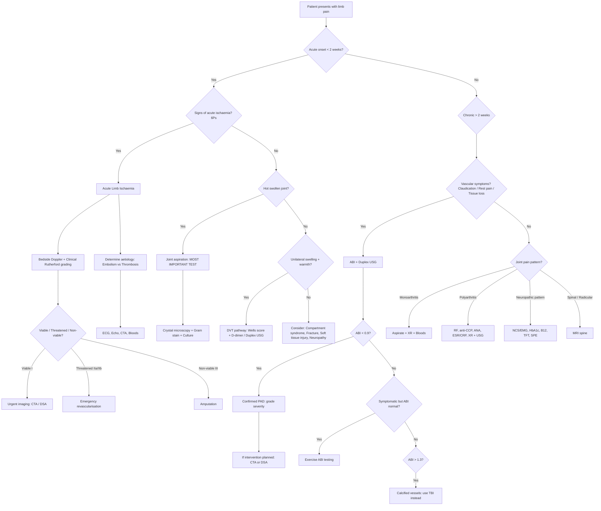
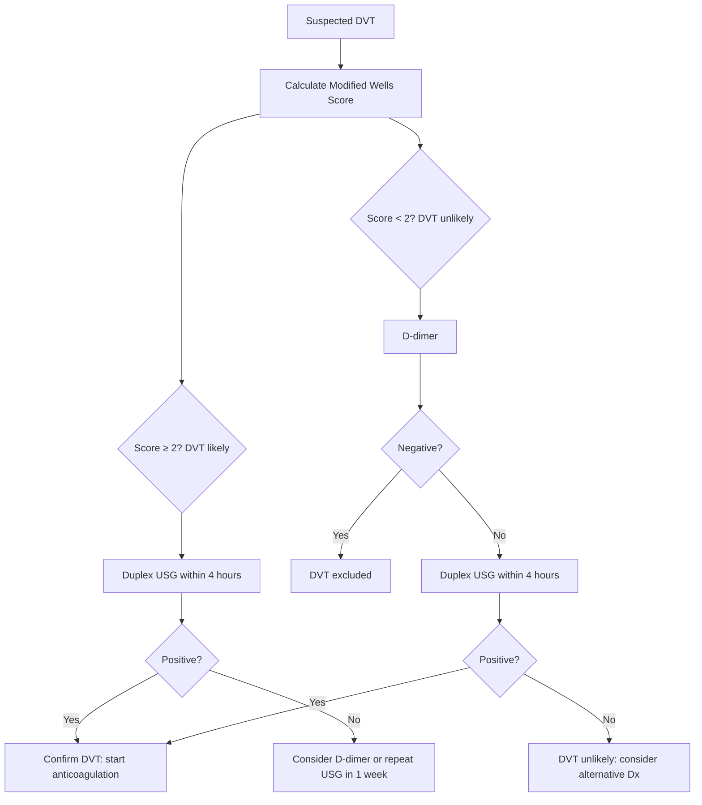

## Diagnostic Criteria, Algorithm and Investigations for Limb Pain

Because "limb pain" is a symptom complex rather than a single disease, there is no single diagnostic criterion. Instead, we apply **condition-specific diagnostic criteria** depending on which differential we are pursuing, and use a **systematic algorithmic approach** to narrow down the aetiology. This section covers the diagnostic framework, the key investigations, and how to interpret them — all from first principles.

---

### A. Overarching Diagnostic Algorithm

The approach to limb pain follows a logical cascade: **History → Examination → Bedside tests → Targeted investigations → Definitive diagnosis**. The first branch point is always: *Is this an emergency?*

---

### B. Vascular Investigations

#### 1. Ankle-Brachial Index (ABI)

***ABI: to confirm diagnosis and quantify severity*** [1][11]

**Definition** [1]:

$$\text{ABI} = \frac{\text{Higher ipsilateral ankle systolic BP (PT or DP)}}{\text{Higher arm systolic BP (left or right)}}$$

***Note*** [1]:
- ***Brachial pressure taken as the higher reading among two arms***
- ***Ankle pressure taken as the higher reading among dorsalis pedis and posterior tibial***
- ***Doppler probe used instead of stethoscope***

**Interpretation** [1][11]:

| ***ABI Value*** | ***Interpretation*** | ***Clinical Correlate*** |
|---|---|---|
| ***0.90–1.30*** | ***Normal*** | No significant PAD |
| ***≤ 0.9*** | ***Arterial occlusive disease (diagnostic)*** | Confirms PAD |
| ***0.40–0.90*** | ***Claudication*** | Non-critical limb ischaemia |
| ***< 0.4*** | ***Rest pain, tissue loss*** | Critical limb ischaemia [1]; Maxim notes use < 0.4 as "severe" [11] |
| ***> 1.30*** | ***Calcified arteries*** | ***May occur in DM or ESRD. Should use toe-brachial index (TBI) instead*** [1] |

Why does ABI work? In a normal person, ankle systolic pressure is slightly higher than brachial pressure (due to pulse wave amplification in the periphery). Any arterial stenosis proximal to the ankle cuff reduces the downstream pressure → ABI falls below 0.9. The worse the stenosis, the lower the ABI.

***Exercise testing*** [1]:
- ***Indication: ABI normal but symptomatic***
- ***Process: ask patient to exercise on treadmill → stop when experience pain → > 0.2 decrease in ABI equivalent to claudication***
- Why? At rest, collateral blood flow may maintain adequate ankle pressure. Exercise increases demand, and the stenotic artery cannot keep up → post-exercise ABI drops. This unmasks significant disease that is subclinical at rest.

<Callout title="TBI in Diabetics" type="error">
***TBI allows assessment of small vessel disease which is a more reliable indicator of limb perfusion in DM patients. Small vessels are also less frequently calcified and thus avoid a factitiously high value as in ABI*** [1]. A TBI < 0.7 is considered abnormal.
</Callout>

#### 2. Duplex Ultrasound

***First-line imaging for all PAD patients*** [1]

**Duplex USG = B-mode USG + Doppler** [11]

**Use** [1]:
- ***Detect flow abnormalities (e.g. turbulence) by Doppler***
- ***Locate level of occlusion by B-mode***

**Advantages** [11]: ***Non-invasive, no radiation***
**Limitations** [11]: ***Operator-dependent, poor image for aortoiliac segment***

***Arterial flow waveform*** [1]:
| ***Waveform*** | ***Description*** | ***Interpretation*** |
|---|---|---|
| ***Triphasic (normal)*** | ***Forward flow (systole) + reverse then forward flow (diastole)*** | ***Normal arterial flow*** |
| ***Biphasic*** | ***Forward flow (systole) + reverse flow (diastole)*** | ***Single-level arterial occlusion*** |
| ***Monophasic*** | ***Forward flow alone*** | ***Multi-level occlusion*** |

Why triphasic? In a normal high-resistance arterial bed (like the resting lower limb), systolic forward flow is followed by brief diastolic reversal (due to elastic recoil of vessel walls against the closed aortic valve) and then a small forward wave (from elastic recoil of the distended aorta). Stenosis eliminates the high-resistance pattern — the vessel distal to a stenosis is maximally dilated, creating a low-resistance bed that only allows forward flow (monophasic).

#### 3. CT Angiography (CTA)

- ***Less invasive alternative to DSA*** [11]
- Provides excellent anatomical detail of the arterial tree
- **Limitations** [11]: ***Contrast allergy / nephropathy, radiation dose***
- Commonly used for pre-operative planning in both acute and chronic limb ischaemia

#### 4. MR Angiography (MRA)

- ***Rarely done*** [11]
- No ionising radiation, no iodinated contrast (uses gadolinium)
- Limited by availability, longer scan time, contraindicated with some metallic implants
- Useful in patients with contrast allergy or severe renal impairment

#### 5. Digital Subtraction Angiography (DSA)

***DSA: gold standard*** [11]

- ***Indicated only for patients with planned intervention (angioplasty / stenting)*** [11]
- ***Inject radio-opaque dye into arterial tree (usually via femoral artery) → imaging and digitalized by computer*** [11]
- ***Can be done intra-operatively: guide endovascular intervention*** [11]
- **Risks** [11]: ***allergy, contrast nephropathy, arterial injury (e.g. dissection, embolism, pseudoaneurysm)***

**Key angiographic findings** [1]:

| Finding | Significance |
|---|---|
| ***Sharp cut-off with few collaterals*** | ***Embolism*** |
| ***Irregular cut-off with well-developed collaterals*** | ***Thrombosis (chronic)*** |
| Diffuse atherosclerosis | Chronic PAD |
| Corkscrew arteries, tree-root collaterals | Buerger's disease |

#### 6. Acute Limb Ischaemia — Severity Assessment

***Rutherford (SVS/ISCVS) classification*** [1] — this is both a diagnostic classification AND a management guide:

| ***Category*** | ***Sensory loss*** | ***Muscle weakness*** | ***Arterial signal*** | ***Venous signal*** | ***Treatment*** |
|---|---|---|---|---|---|
| ***Viable (I)*** | ***None*** | ***None*** | ***Audible*** | ***Audible*** | ***Imaging*** |
| ***Marginally threatened (IIa)*** | ***Minimal (toes)*** | ***None*** | ***Inaudible*** | ***Audible*** | ***Urgent revascularisation*** |
| ***Immediately threatened (IIb)*** | ***Beyond toes*** | ***Partial*** | ***Inaudible*** | ***Audible*** | ***Emergency revascularisation*** |
| ***Non-viable (III)*** | ***Completely anaesthetic*** | ***Completely paralysed*** | ***Inaudible*** | ***Inaudible*** | ***Amputation*** |

<Callout title="Bedside Doppler is Essential in Acute Ischaemia">
The handheld Doppler is your most valuable bedside tool. The presence or absence of arterial and venous Doppler signals directly determines the Rutherford category and therefore the urgency and type of intervention. ***A pulse that is not palpable may still have detectable flow on Doppler*** [2] — so always use the Doppler before concluding "pulseless."
</Callout>

#### 7. Investigations for Embolic Source

When acute limb ischaemia is suspected to be embolic [1]:
- ***ECG***: look for AF (most common cardiac source)
- ***Echocardiography***: look for mural thrombus (post-MI), valvular vegetations, atrial myxoma
- ***CT aorta***: look for aortic dissection, AAA as embolic source
- Bloods: FBC, coagulation screen, group and save (for potential surgery)

#### 8. DVT Investigation Pathway

***Diagnostic evaluation (NICE 2015)*** [7]:
- ***Clinical triad of pain + heat + swelling***
- ***Modified Wells score: stratifies pre-test probability***
- ***D-dimer: in low pre-test probability***
  - ***Sensitive but not specific***
  - ***If positive, offer duplex USG in 4 hours (or else start anticoagulant first)***
- ***Duplex USG: in high pre-test probability***
  - ***Finding: non-compressibility*** of the vein (the diagnostic criterion — a normal vein collapses completely under probe pressure; a thrombosed vein does not)

Why is D-dimer only used in low pre-test probability? Because D-dimer has high sensitivity (~95%) but poor specificity (~50%). In a high-probability patient, a negative D-dimer is not reliable enough to exclude DVT (false negatives exist), so you go straight to imaging. In a low-probability patient, a negative D-dimer has a high negative predictive value — you can safely exclude DVT.

---

### C. Venous Investigations

#### Handheld Continuous Wave Doppler for Venous Disease [1]

***Principle: emits sound when blood flows past the probe*** [1]

***Sites*** [1]:
- ***Saphenofemoral junction (2.5 cm inferolateral to pubic tubercle)***
- ***Saphenopopliteal junction (in popliteal fossa)***

***Procedure: place probe at SFJ/SPJ → squeeze calf and release*** [1]

***Findings*** [1]:
- ***Uniphasic: 'whooshing' sound on squeezing calf alone → normal*** (blood flows proximally, valve prevents reflux)
- ***Biphasic: 'whooshing' sound on both squeezing and releasing calf → incompetence*** (blood refluxes back through incompetent valve on release)
- ***May miss up to 30% of valvular incompetence***

**Duplex USG** is the definitive non-invasive test for mapping venous reflux and identifying the pattern of disease (superficial vs deep vs perforator incompetence).

---

### D. Musculoskeletal and Joint Investigations

#### 1. Joint Fluid Analysis — MOST IMPORTANT TEST for Acute Monoarthritis [16]

***Indications*** [16]:
- ***Suspicious of septic arthritis***
- ***Suspicious of crystal-induced arthritis***
- ***Suspicious of haemarthrosis***
- ***Differentiating inflammatory vs non-inflammatory arthritis***

***Send for*** [16]:
- ***Macroscopic: colour, viscosity, turbidity***
- ***Microscopy: wet films, WBC count/differential, crystal microscopy***
- ***Microbiology (if suspect septic arthritis): Gram stain (urgent if septic arthritis suspected), bacterial culture, AFB smear and culture, fungal stain (if indicated)***

***Joint fluid WBC count interpretation*** [16]:

| Category | WBC Count (/μL) | Appearance | Examples |
|---|---|---|---|
| Normal | < 200 | Clear, straw-coloured, high viscosity | — |
| Non-inflammatory | 200–2,000 | Clear, yellow, high viscosity | OA, trauma |
| Inflammatory | 2,000–50,000 | Translucent–opaque, yellow-green, low viscosity | RA, gout, pseudogout, SpA |
| Septic | > 50,000 (often > 100,000) | Opaque, purulent, very low viscosity | Bacterial septic arthritis |
| Haemorrhagic | Variable (RBCs dominant) | Red/bloody | Trauma, coagulopathy, tumour |

***Crystal microscopy*** [16]:
- ***Gout: slender and needle-shaped, strongly negative birefringence under polarised light***
- ***Pseudogout: pleomorphic or rhomboid-shaped, weakly positive birefringence***

Why does birefringence matter? A polarising microscope has two filters. Birefringent crystals rotate the plane of polarised light, so they appear bright against a dark background. The type of birefringence (positive or negative) depends on how the crystal aligns relative to the polariser's axis. Negative birefringence means the crystal appears **yellow when parallel** to the compensator axis (mnemonic: Yellow = Negative = Urate). Positive birefringence means **blue when parallel** (Blue = Positive = Pseudogout/CPPD).

<Callout title="Exam Pearl: Always Aspirate a Hot Joint">
***Hot, swollen tender joint = septic arthritis until proven otherwise, even without fever, increased WBC, increased ESR/CRP*** [12]. The only exception to aspiration is overlying cellulitis (risk of introducing bacteria into a sterile joint). Gout and septic arthritis can coexist — finding crystals does NOT rule out infection. Always send for both crystal microscopy AND Gram stain/culture.
</Callout>

#### 2. Blood Tests for Arthritis [16][19]

***Initial bloods*** [16]:
- ***ESR/CRP***: raised in inflammatory conditions (***but CRP usually normal/mildly raised in SLE*** [16])
  - Also useful to monitor treatment response
- ***Serum urate***: if suspicious of gout (***taken 2 weeks after resolution*** — why? During an acute flare, urate may be paradoxically normal or low because inflammatory cytokines increase renal urate excretion [16])
- ***ANA, anti-ENA, C3/4***: if suspicious for SLE
- ***RF, anti-CCP***: if suspicious for RA
  - RF (rheumatoid factor) = anti-IgG IgM antibody. Present in ~70% RA (not very sensitive) and many other conditions
  - Anti-CCP = anti-cyclic citrullinated peptide antibody. More specific for RA (~95% specificity)
- ***HLA-B27***: if suspicious for spondyloarthropathy — ***present in 77–78% of axSpA/AS*** [17], useful for increasing diagnostic confidence but NOT diagnostic on its own

#### 3. Plain X-ray

***Plain XR ± USG/MRI of affected joint*** [16]:
- ***Traumatic origin: fractures, loose body in joint***
- ***Joint effusion: fat pad sign in elbow/knee***
- ***Arthritic changes: joint space narrowing, periarticular erosion, chondrocalcinosis (pseudogout), tophaceous erosion***

Specific XR features by condition:
| Condition | XR Findings |
|---|---|
| OA | Joint space narrowing, subchondral sclerosis, osteophytes, subchondral cysts |
| RA | Periarticular erosions, periarticular osteopenia, joint space narrowing, soft tissue swelling |
| Gout | Punched-out erosions with overhanging edges ("rat-bite"), preserved joint space (initially), tophi |
| Pseudogout | ***Chondrocalcinosis*** (calcification of cartilage, especially menisci and triangular fibrocartilage of wrist) |
| Septic arthritis | Soft tissue swelling, joint effusion (early); joint destruction, periosteal reaction (late) |
| SpA | Sacroiliitis (erosion → sclerosis → fusion), syndesmophytes, "bamboo spine" (late AS) |

***Useful plain XR findings in spinal cord lesions*** [9]:
- ***Pedicle erosion → extradural metastases***
- ***Vertebral body collapse***
- ***Narrow disc space, osteophytes, hypertrophic facet joints → spondylosis***
- ***Expansion of intervertebral foramina → neurofibroma***

---

### E. Neurological Investigations

#### 1. Nerve Conduction Studies (NCS) and Electromyography (EMG)

***Electrodiagnostic studies (EDx): use of electrophysiological techniques to assess function of peripheral nervous system*** [9]

***NCS: assessment of large fibre conduction function by analysis of neuronal signals generated by electrical activation*** [9]
***EMG: analysis of bioelectric activities of muscles*** [9]

***Useful for*** [9]:
- ***Differentiation between focal and multifocal neuropathy***
- ***Differentiation between demyelinating and axonal neuropathy***
- ***Assessment of severity of neuropathy***
- ***Monitor progress of neuropathy or myopathy***
- ***Prognostication after nerve trauma and guidance of treatment***

***NOT useful for*** [9]:
- ***Exclude or confirm neuropathy or myopathy (clinical findings should suffice)***
- ***Define aetiology of peripheral neuropathy (cannot identify aetiology)***
- ***Cervical myelopathy (does NOT assess CNS function)***

| NCS Finding | Demyelinating | Axonal |
|---|---|---|
| Conduction velocity | ***Markedly reduced*** | Normal or mildly reduced |
| Amplitude | Normal (early) | ***Reduced*** |
| Distal latency | Prolonged | Normal |
| Conduction block | Present | Absent |

Why does this distinction matter? ***Usually only demyelinating neuropathies are susceptible to treatment*** [9] (e.g. GBS, CIDP respond to IVIg/plasmapheresis). Axonal damage generally implies permanent structural loss.

#### 2. Blood Tests for Neuropathy [15][19]

***Key investigations for paraesthesia and numbness*** [15]:
- ***First line: urinalysis, blood sugar, FBE, ESR/CRP***
- ***Consider: serum calcium, B12 and folate, LFTs (γGT), U&E, TFTs, KFTs***
- ***Nerve conduction studies***
- ***According to clinical findings: imaging (spine, carotid vessels, CT or MRI), specific blood tests for infection, lumbar puncture (CSF protein, oligoclonal IgG)***

This panel is designed to screen for the common treatable causes: diabetes (blood sugar/HbA1c), B12 deficiency (B12/folate), thyroid disease (TFT), renal failure (U&E/KFT), alcohol (LFT/γGT), myeloma/paraprotein (ESR, serum protein electrophoresis).

#### 3. MRI Spine

***MRI spine*** is the investigation of choice for [9]:
- Spinal cord compression (myelopathy)
- Radiculopathy (disc prolapse)
- Spinal stenosis (neurogenic claudication)
- Intrinsic spinal cord lesions (demyelination, tumour, syrinx)
- Cauda equina syndrome — ***urgent MRI to confirm or exclude acute cord compression*** [9]

---

### F. General Screening Investigations for Limb Pain

***Key investigations from Murtagh*** [15]:

**For lower back pain / limb pain:**
- ***FBE***
- ***ESR/CRP***
- ***Urinalysis***
- ***Serum alkaline phosphatase*** (elevated in Paget's disease, bone metastases, hepatobiliary disease)
- ***PSA in males 50–75 years*** (screen for prostate cancer metastases)
- ***Plain X-ray if chronic pain and red flags***
- ***Reserve CT scan, MRI or radionuclide scan for suspected serious disease (malignancy and infection)*** [15]

**For foot/ankle pain** [15]:
- ***FBE, ESR/CRP***
- ***Rheumatoid arthritis tests***
- ***Blood glucose***
- ***Uric acid***
- ***Nerve conduction studies and imaging (plain X-ray — compare both sides)***
- ***Ultrasound, MRI, radionuclide scans***

**For arm/hand pain** [15]:
- ***FBE, ESR/CRP***
- ***Consider ECG, nerve conduction studies***
- ***Plain X-ray: if in doubt, X-ray and compare both sides***
- ***Ultrasound for soft tissue injuries (e.g. tendinopathy)***

<Callout title="Murtagh's Diagnostic Tips for Arm Pain and Sleep" type="idea">
***The working rule for arm pain causing sleep disturbance*** [15]:
- ***Thoracic outlet: patient cannot fall asleep*** (compression worsens in recumbent position)
- ***Carpal tunnel syndrome: wakes in middle of night then settles*** (oedema accumulates during sleep → median nerve compression → paraesthesia wakes patient → shaking hand relieves it)
- ***Cervical spondylosis: wakes patient with pain that persists*** (inflammatory component of degenerative disease)
</Callout>

---

### G. Compartment Pressure Measurement

When compartment syndrome is suspected clinically [1]:
- ***Check compartment pressure ( < 20 mmHg of diastolic BP) if in doubt*** [1]
- **Normal compartment pressure**: < 10 mmHg
- **Diagnostic threshold**: absolute pressure ≥ 30 mmHg, **OR** delta pressure (diastolic BP minus compartment pressure) ≤ 30 mmHg
- ***Mechanism: prolonged ischaemia (≥ 6h) + delayed revascularisation → fluid leaks out via damaged cell membrane → oedema → secondary ischaemia when pressure ≥ 30 mmHg or within 30 mmHg of diastolic BP*** [1]
- If clinical picture is classic (pain out of proportion, pain with passive stretch), **do not delay fasciotomy for pressure measurement**

---

### H. Condition-Specific Diagnostic Criteria

#### 1. PAD / Chronic Limb Ischaemia

There is no formal "diagnostic criteria" per se — PAD is diagnosed by:
- ***Clinical picture***: claudication ± rest pain ± tissue loss
- ***ABI ≤ 0.9***: diagnostic [1]
- ***Duplex USG***: localise and quantify
- ***Fontaine / Rutherford classification***: stage severity

#### 2. Acute Limb Ischaemia

- ***Clinical diagnosis based on 6Ps*** [1]
- ***Rutherford classification determines viability and management*** [1]
- ***Differentiate embolism vs thrombosis*** (see table from earlier sections)

#### 3. Giant Cell Arteritis (relevant for temporal/limb pain in elderly)

***Diagnostic criteria: ≥ 3 of the following 5 criteria*** [9]:
1. ***Onset ≥ 50 years***
2. ***New headache***
3. ***Abnormalities of temporal artery at clinical examination***
4. ***↑ESR ( > 50 mm/h)***
5. ***Abnormal findings on biopsy of temporal artery***

#### 4. Gout — ACR/EULAR Classification Criteria (2015)

Entry criterion: ≥ 1 episode of joint swelling, pain, or tenderness in a peripheral joint or bursa
- Sufficient criterion: MSU crystals in symptomatic joint/bursa fluid or tophus (diagnosis confirmed, no further scoring needed)
- If no crystals identified, scoring system (clinical, laboratory, imaging domains — score ≥ 8 out of 23 classifies as gout)

#### 5. RA — ACR/EULAR Classification Criteria (2010)

≥ 6/10 points across four domains:
- Joint involvement (0–5)
- Serology: RF and anti-CCP (0–3)
- Acute phase reactants: ESR/CRP (0–1)
- Duration of symptoms ≥ 6 weeks (0–1)

#### 6. Spondyloarthritis — ASAS Criteria (2009/2011)

Axial SpA: chronic back pain ≥ 3 months in patient < 45y + sacroiliitis on imaging + ≥ 1 SpA feature, OR HLA-B27 + ≥ 2 SpA features
Peripheral SpA: arthritis OR enthesitis OR dactylitis + ≥ 1 Group A feature (uveitis, psoriasis, IBD, preceding infection, HLA-B27, sacroiliitis) or ≥ 2 Group B features [17]

---

### I. Summary: Matching Investigation to Clinical Scenario

| Clinical Scenario | First-Line Investigation | Key Finding |
|---|---|---|
| Suspected PAD / claudication | ***ABI + Duplex USG*** | ABI ≤ 0.9; triphasic → biphasic/monophasic waveform |
| ABI normal but symptomatic | ***Exercise ABI testing*** | > 0.2 drop post-exercise |
| Diabetic with ABI > 1.3 | ***Toe-brachial index*** | TBI < 0.7 |
| Acute limb ischaemia | ***Bedside Doppler + Rutherford grading*** | Arterial/venous signal presence |
| Pre-operative PAD planning | ***CTA or DSA (gold standard)*** | Anatomical mapping for intervention |
| Suspected DVT | ***Wells score → D-dimer / Duplex USG*** | Non-compressible vein |
| Hot swollen joint | ***Joint aspiration (MOST IMPORTANT)*** | Crystals, WBC count, Gram stain |
| Suspected neuropathy | ***NCS/EMG + bloods (HbA1c, B12, TFT, SPE)*** | Axonal vs demyelinating pattern |
| Radiculopathy / cord compression | ***MRI spine (urgent if cauda equina)*** | Disc prolapse, stenosis, cord compression |
| Back/limb pain with red flags | ***FBE, ESR/CRP, ALP, PSA, plain XR*** | Screen for cancer, infection, Paget's |
| Suspected compartment syndrome | ***Clinical diagnosis ± compartment pressure*** | Pressure ≥ 30 mmHg or within 30 mmHg of diastolic BP |
| Venous incompetence | ***Handheld Doppler → Duplex USG*** | Biphasic signal = reflux |

---

<Callout title="High Yield Summary — Diagnostics for Limb Pain">

1. **ABI ≤ 0.9 = diagnostic for PAD**. Use exercise testing if ABI normal but symptomatic. Use TBI if ABI > 1.3 (calcified/diabetic).
2. **Duplex USG = first-line imaging** for all PAD. Normal flow is **triphasic**; single-level disease → biphasic; multi-level → monophasic.
3. **DSA = gold standard** for arterial imaging but reserved for planned intervention only (invasive + risks).
4. **Acute limb ischaemia is a clinical diagnosis** graded by Rutherford classification using clinical exam + bedside Doppler.
5. **Joint aspiration = MOST IMPORTANT TEST** for acute monoarthritis. Always send crystals + Gram stain + culture.
6. **Gout crystals**: needle-shaped, strong negative birefringence (yellow parallel). **CPPD crystals**: rhomboid, weak positive birefringence (blue parallel).
7. **DVT diagnosis**: Wells score → D-dimer (low probability) or Duplex USG (high probability). D-dimer: sensitive but not specific.
8. **NCS/EMG**: differentiates axonal (reduced amplitude) from demyelinating (reduced velocity) neuropathy — only demyelinating is typically treatable.
9. **MRI spine**: investigation of choice for cord compression, radiculopathy, cauda equina — order urgently for cauda equina!
10. **Murtagh's screening bloods**: FBE, ESR/CRP, urinalysis, ALP, PSA (males 50–75). XR if red flags. CT/MRI reserved for serious disease.
11. **Compartment syndrome**: clinical diagnosis. Pressure measurement if in doubt (delta P ≤ 30 mmHg of diastolic BP). Do NOT delay fasciotomy for measurement if clinically obvious.

</Callout>

---

<ActiveRecallQuiz
  title="Active Recall - Diagnostics for Limb Pain"
  items={[
    {
      question: "A patient has an ABI of 0.65 on the right and 1.45 on the left. The patient is diabetic. Interpret both values and state what additional test you would request for the left leg.",
      markscheme: "Right ABI 0.65 = arterial occlusive disease in the claudication range (0.4-0.9), consistent with PAD. Left ABI 1.45 = greater than 1.3, indicating calcified, non-compressible arteries (common in diabetes and ESRD), making ABI unreliable. Request toe-brachial index (TBI) for the left leg because digital arteries are less prone to calcification. TBI less than 0.7 suggests PAD."
    },
    {
      question: "Describe the three types of arterial Doppler waveforms seen on duplex USG and what each indicates about the severity of arterial disease.",
      markscheme: "Triphasic = normal (forward flow in systole, brief reverse flow in diastole, then small forward flow from elastic recoil). Biphasic = forward flow in systole + reverse flow in diastole only, indicating single-level arterial occlusion. Monophasic = forward flow alone throughout, indicating multi-level arterial occlusion (severe disease, loss of high-resistance pattern due to maximal distal vasodilatation)."
    },
    {
      question: "A 55-year-old man presents with acute right knee pain and swelling. Temperature 38.5C. Joint aspiration reveals WBC 75,000/microL with 90% neutrophils. Crystal microscopy shows needle-shaped crystals with strong negative birefringence. Gram stain is negative. What is the diagnosis and what is the critical next step?",
      markscheme: "The crystal findings confirm gout (needle-shaped, strong negative birefringence = MSU crystals). However, the very high WBC count (above 50,000) with neutrophil predominance raises concern for concurrent septic arthritis. Gout and septic arthritis can coexist. The critical next step is to send the fluid for bacterial culture and treat empirically for septic arthritis (IV antibiotics) until culture results return negative. A negative Gram stain does NOT exclude septic arthritis (sensitivity only ~50-75%)."
    },
    {
      question: "What is the diagnostic pathway for suspected DVT according to the NICE guidelines? State what investigation to use for low vs high pre-test probability and explain why D-dimer is not used as first-line in high probability.",
      markscheme: "Calculate Modified Wells score. If score less than 2 (DVT unlikely) = D-dimer first; if negative, DVT excluded; if positive, proceed to duplex USG within 4 hours. If score 2 or more (DVT likely) = duplex USG directly within 4 hours (start anticoagulation if delay). D-dimer is not used first-line in high probability because it has high sensitivity (~95%) but poor specificity (~50%). In high-probability patients, the negative predictive value of D-dimer is insufficient to safely exclude DVT, so imaging is needed regardless."
    },
    {
      question: "List five blood tests you would order to screen for the cause of a chronic peripheral polyneuropathy and explain what each test is looking for.",
      markscheme: "1) HbA1c or fasting glucose = diabetes mellitus (most common cause). 2) Vitamin B12 and folate = nutritional deficiency (subacute combined degeneration). 3) TFT = hypothyroidism (causes neuropathy and myopathy). 4) U and E / KFT = uraemia (uraemic neuropathy). 5) Serum protein electrophoresis (SPE) = paraproteinaemia / myeloma (paraproteinaemic neuropathy). Additional: LFTs / gamma-GT for alcohol, ESR/CRP for vasculitis/inflammation."
    }
  ]}
/>

---

## References

[1] Senior notes: Ryan Ho Cardiology.pdf (pages 206–207, 210, 214, 237)
[2] Senior notes: felixlai.md (Acute arterial insufficiency section)
[7] Senior notes: Ryan Ho Haemtology.pdf (page 131, VTE diagnostic evaluation)
[9] Senior notes: Ryan Ho Neurology.pdf (pages 38, 65, 169, 178, 183)
[11] Senior notes: maxim.md (Chronic limb ischaemia investigations, Acute limb ischaemia, Spinal stenosis)
[12] Senior notes: Ryan Ho Rheumatology.pdf (page 67, Septic arthritis)
[15] Lecture slides: murtagh merge.pdf (Back pain p24, Foot and ankle pain p57, Arm and hand pain p20, Paraesthesia p77)
[16] Senior notes: Ryan Ho Fundamentals.pdf (pages 407, 410); Senior notes: Ryan Ho Rheumatology.pdf (pages 29–30)
[17] Senior notes: Ryan Ho Rheumatology.pdf (pages 57, 60, Spondyloarthritis)
[19] Senior notes: Ryan Ho Neurology.pdf (page 178, Approach to generalised weakness investigations)
