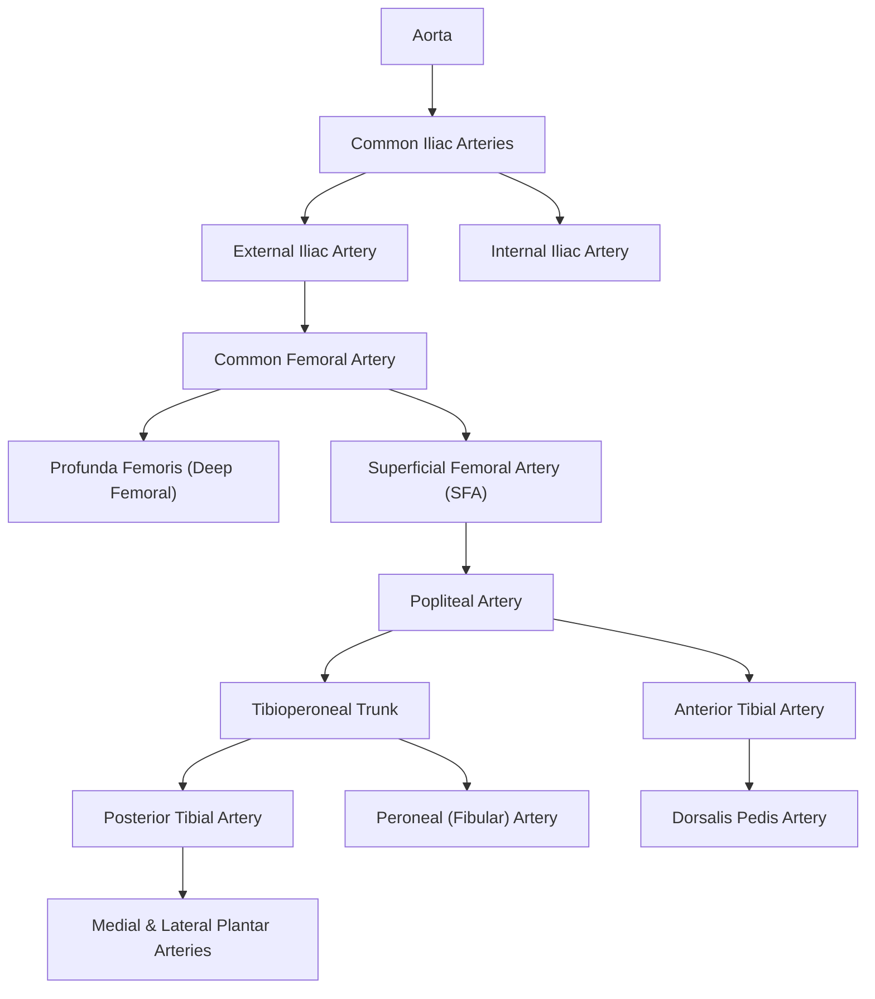

# Limb Pain

## Definition

Limb pain is a broad clinical presentation encompassing any painful sensation affecting the upper or lower extremities. It is not a diagnosis in itself but a symptom that demands a systematic approach to identify the underlying cause — which can range from benign musculoskeletal strain to limb-threatening vascular emergencies.

The word "limb" derives from Old English *lim* = extremity. Pain derives from Latin *poena* = penalty/suffering. In clinical practice, we approach limb pain by asking: **Is this vascular, neurological, musculoskeletal, or referred?** — because the management for each is radically different.

<Callout title="Clinical Approach Framework" type="idea">
When a patient presents with limb pain, always think through these key questions systematically [1][2]:
1. **Does the patient have arterial disease?** — claudication, rest pain, tissue loss
2. **Acute or chronic?** — 2 weeks as the cutoff
3. **How severe?** — clinical signs of critical limb ischaemia (tissue loss, ABI ≤ 0.5)
4. **Where is the obstruction?** — aortoiliac, femoropopliteal, tibioperoneal
5. **Why?** — risk factors
6. **Is this vascular, neurological, musculoskeletal, or referred pain?**
</Callout>

---

## Epidemiology

### Peripheral Arterial Disease (PAD) — the major vascular cause of limb pain
- Global prevalence of PAD: approximately 230 million people worldwide (2025 GBD estimates)
- In Hong Kong, PAD prevalence is estimated at 3–5% in the general population aged > 50, rising to > 15% in those aged > 70, driven by high rates of diabetes mellitus and smoking [1][2]
- ***Current or previous smoking: strongest risk factor, 3–6× risk for intermittent claudication*** [1]
- ***DM: 2× increased risk, 26% increased risk of PAD for every 1% increase in HbA1c*** [1]
- PAD is strongly associated with concurrent coronary artery disease (up to 60%) and cerebrovascular disease (up to 30%) — it is a systemic atherosclerotic disease, not an isolated leg problem

### Musculoskeletal causes
- Osteoarthritis (OA) affects ~10–15% of Hong Kong adults aged > 60 (knee OA is the most common form)
- Gout: prevalence ~1–2% globally; ***M >> F ≈ 5:1, increasing incidence from 4th–5th decade (M) vs 6th–7th decade (F)*** [5]
- Rheumatoid arthritis: ***1–2% in Caucasians, 0.3–0.4% in Chinese*** [6]

### Neurological causes
- Diabetic peripheral neuropathy: affects 30–50% of diabetic patients, the single most common neuropathy worldwide [3]
- Carpal tunnel syndrome: ***aging, female*** are the primary risk factors [4]

### Venous causes
- Deep vein thrombosis (DVT): incidence ~1/1,000/year in Western populations (lower in Asians), with 1–3% case mortality [7]

---

## Risk Factors

### For Arterial Limb Pain (PAD/Chronic Limb Ischaemia)
| Risk Factor | Mechanism / Details |
|---|---|
| ***Smoking*** | ***Strongest RF, 3–6× risk for IC*** [1]. Endothelial damage → accelerated atherosclerosis, platelet activation, vasoconstriction |
| ***Diabetes mellitus*** | ***2× increased risk, 26% increased risk of PAD for every 1% increase in HbA1c*** [1]. Hyperglycaemia → advanced glycation end products (AGEs) → endothelial dysfunction + small vessel disease. Should be ***screened for PAD (by ABI) every 5 years*** [1] |
| Hypertension | Shear stress → intimal damage → atherosclerosis |
| Hyperlipidaemia | LDL oxidation → foam cell formation → plaque |
| ***Pre-existing arterial disease*** | ***Coronary artery disease, stroke/TIA, carotid disease*** [1] — these all share the same atherosclerotic pathology |
| ***Family history of vascular disease*** [1] | Genetic predisposition to dyslipidaemia, endothelial dysfunction |
| Age > 65 [2] | Cumulative vascular damage over time |

### For Venous Limb Pain (DVT/VTE)
- Virchow's triad: stasis, endothelial injury, hypercoagulability
- Congenital thrombophilia (protein C/S deficiency, antithrombin III deficiency, Factor V Leiden)
- Prolonged immobilisation, surgery (especially orthopaedic/vascular), malignancy, OCP use, pregnancy, obesity, age > 40 [7][8]

### For Neurogenic Limb Pain
- Diabetes (most common cause of polyneuropathy)
- Alcohol excess
- B12 deficiency
- Entrapment: ***acromegaly, myxedema, pregnancy*** (all cause generalised soft tissue swelling → nerve compression) [9]
- ***RA, DM, hypothyroid, obesity*** for carpal tunnel syndrome [4]

### For Musculoskeletal Limb Pain
- Age, obesity, previous joint injury, repetitive use, inflammatory arthritis, crystal deposition

---

## Anatomy and Function

Understanding the anatomy is absolutely essential because **the site of pathology determines the clinical presentation**, and the obstruction is typically "one joint above the claudicating muscle" [1].

### Arterial Anatomy of the Lower Limb

**Key clinical correlations:**

| Arterial Segment Occluded | Claudication Site | Key Clinical Feature |
|---|---|---|
| ***Aortoiliac (30%)*** | ***Bilateral buttocks, thighs, calves*** | ***Impotence (LeRiche's syndrome)*** [1] |
| ***Iliac*** | ***Unilateral thigh, calf ± buttock*** | Absent femoral pulse on that side |
| ***Femoropopliteal (70% of PAD)*** | ***Unilateral calf*** | ***Commonest — 70% of PAD affects the superficial femoral artery*** [1] |
| ***Tibioperoneal*** | ***Unilateral calf/foot*** | Often seen in diabetics (preferentially affects distal small vessels) |

<Callout title="LeRiche's Syndrome" type="idea">
***Triad of LeRiche syndrome: (1) Buttock claudication, (2) Absent or diminished femoral pulses, (3) Erectile dysfunction*** [1]. This occurs because the aortic bifurcation is occluded, cutting off blood supply to both lower limbs AND the internal iliac arteries (which supply the pelvic organs including the corpus cavernosum via the internal pudendal artery).
</Callout>

### Vessel Wall Anatomy [2]
The arterial wall has three layers:
- **Tunica intima** — endothelial cells lining the lumen; site of atherosclerotic plaque initiation
- **Tunica media** — smooth muscle and elastic fibres; provides structural strength and vasoregulation
- **Tunica adventitia** — outermost connective tissue layer containing vasa vasorum (vessels that supply the vessel wall itself) and nervi vasorum

### Peripheral Nerve Anatomy
- **Brachial plexus** (C5–T1): supplies the upper limb. Thoracic outlet syndrome compresses the ***lower brachial plexus*** → paraesthesia/weakness along ulnar distribution [4]
- **Lumbosacral plexus** (L1–S3): supplies the lower limb
- **Key entrapment sites**: carpal tunnel (median nerve at wrist), cubital tunnel (ulnar nerve at elbow), tarsal tunnel (tibial nerve at ankle)

### Venous Anatomy of the Lower Limb
- **Deep veins**: follow the arteries (femoral vein, popliteal vein, tibial veins)
- **Superficial veins**: great saphenous vein (medial), small saphenous vein (posterior)
- **Perforating veins**: connect superficial to deep veins
- ***Normal venous pressure in foot ≈ 100 mmHg*** (column of blood from heart); ***muscle pump required to return venous blood to heart; ambulatory venous BP ≈ 20–30 mmHg*** [10]
- ***Ambulatory venous hypertension is the defining abnormality in CVI*** [10]

### Compartments of the Lower Leg
The leg has four fascial compartments:
1. **Anterior** — tibialis anterior, extensor digitorum longus, EHL, deep peroneal nerve, anterior tibial artery
2. **Lateral** — peroneus longus and brevis, superficial peroneal nerve
3. **Deep posterior** — tibialis posterior, FDL, FHL, posterior tibial artery, tibial nerve
4. **Superficial posterior** — gastrocnemius, soleus, sural nerve

Why does this matter? Because **compartment syndrome** most commonly affects the ***anterior tibial compartment*** [1], and you need to know which structures are at risk.

---

## Etiology (Focus on Hong Kong)

The aetiology of limb pain is vast. I'll organise it by system, with emphasis on what is common and clinically important in Hong Kong.

### A. Vascular Causes

#### 1. Arterial — Acute Limb Ischaemia
**Definition**: ***A sudden decrease in limb perfusion that threatens the viability of the limb, presenting within 2 weeks of the acute event*** [2][11]

***Irreversible damage occurs 4–6 hours after onset if adequate collateral circulation is absent*** — skeletal muscles can only withstand up to 6 hours of ischaemia [2]. ***Patients with pre-existing peripheral vascular disease can tolerate longer due to establishment of collaterals*** [2].

**Causes** [2][11]:

| Cause | Frequency | Details |
|---|---|---|
| ***Acute thrombotic occlusion of pre-existing stenotic arterial segment (acute-on-chronic PVD)*** | ***60% (most common)*** | Acute plaque rupture in a patient with background atherosclerotic PVD |
| ***Embolism*** | ***30%*** | ***Usually lodge at branching points — femoral bifurcation (most common), popliteal trifurcation (2nd most common)*** [11] |
| ***Arterial trauma*** | ~10% | Iatrogenic (catheterisation), penetrating, blunt |

**Sources of emboli** [11]:
- ***Cardiac origin (80%)*** — atrial fibrillation (most common), LV mural thrombus post-MI, valvular heart disease/prosthetic valves
- AAA (→ ***blue toe syndrome / trash foot***)
- Aortic dissection

<Callout title="Acute Limb + Chest Pain" type="error">
***Acute limb pain combined with chest pain should make you think of [11]:***
- ***MI → mural thrombus / new-onset AF → embolism***
- ***Aortic dissection → direct arterial occlusion***
This is an emergency combination — don't treat the limb in isolation!
</Callout>

***Distinguishing embolism vs thrombosis-in-situ is critically important because the investigations and management differ*** [1][11]:

| Feature | ***Embolism*** | ***Thrombosis-in-situ*** |
|---|---|---|
| ***Common causes*** | ***Cardiac origin (80%) — AF, MI (LV mural thrombus), VHD/prosthesis; AAA*** | ***Atherosclerosis (acute plaque rupture in PVD), aortic dissection, hypercoagulability (malignancy, APLS, sepsis), Buerger's disease*** |
| ***Severity*** | ***Complete ischaemia (no collaterals)*** | ***Incomplete ischaemia (collaterals)*** |
| ***Onset*** | ***Hyperacute (seconds to minutes)*** | ***Acute (hours or days)*** |
| ***History and PE*** | ***Embolic source identifiable (e.g. AF); contralateral limb pulses present; absent bruits*** | ***Previous claudication; PVD in contralateral limb (absent pulse); present bruits*** |
| ***Angiography*** | ***Minimal atherosclerosis; sharp cut-off with few collaterals*** | ***Diffuse atherosclerosis; irregular cut-off with well-developed collaterals*** |
| ***Management*** | ***Embolectomy, anticoagulation*** | ***Medical, bypass, thrombolysis*** |

#### 2. Arterial — Chronic Limb Ischaemia

**Definition**: ***Gradual onset ( > 2 weeks) symptomatic limb ischaemia*** [2][11]. The progressive narrowing of vessels allows time to develop collaterals, which is why these patients can tolerate more disease before becoming symptomatic.

***Most common cause: atherosclerosis*** [2][11]

Other causes [1]:
- ***Vasculitis***: Takayasu arteritis, Behçet's disease
- ***Buerger's disease (thromboangiitis obliterans)*** [1]
- ***Entrapment syndrome*** (e.g. popliteal entrapment) [1]

**Pathophysiology of atherosclerosis:**
Endothelial injury (from smoking, hypertension, diabetes, etc.) → LDL infiltration into intima → oxidation of LDL → monocyte recruitment → foam cell formation → fatty streak → smooth muscle proliferation → fibrous cap with lipid core (atherosclerotic plaque) → progressive luminal narrowing → exercise-induced muscle ischaemia (claudication) → if severe, resting ischaemia → tissue death

#### 3. Buerger's Disease (Thromboangiitis Obliterans) [1]
- ***Buerger's disease: recurrent progressive inflammation of small/medium vessels of hands and feet***
- ***Epidemiology: usually young (30–40s) male smokers***
- ***Pathology: usually affects LL > UL***
- ***Histology: acute inflammation of the wall with luminal thrombosis of small and medium arteries and veins***
- ***S/S: arterial occlusive disease (rest pain, digital ulcers, gangrene), superficial thrombophlebitis, Raynaud's phenomenon***
- ***Angiogram: corkscrew appearance of arteries; tree root appearance of collaterals***

This is particularly relevant in Hong Kong given smoking prevalence in middle-aged men, though it is less common than atherosclerotic PAD.

#### 4. Venous — Deep Vein Thrombosis (DVT)
- ***Unilateral leg swelling, pain, heat*** [7]
- Pathophysiology: Virchow's triad → thrombus formation in deep veins → venous obstruction → pain, swelling, warmth
- Risk of pulmonary embolism (PE): thrombus dislodges → travels through IVC → right heart → pulmonary arteries

#### 5. Venous — Chronic Venous Insufficiency (CVI) [10]
- ***Ambulatory venous hypertension*** from reflux (valvular incompetence) or obstruction (post-thrombotic)
- Leads to: oedema, skin changes (lipodermatosclerosis, haemosiderin deposition), venous ulcers (typically above medial malleolus)

### B. Neurological Causes

#### 1. Peripheral Neuropathy [3][9]
**Classification** [9]:
- ***Radiculopathy*** — involving nerve roots
- ***Plexopathy*** — involving nerve plexus
- ***Neuropathy*** — involving peripheral nerves:
  - ***Mononeuropathy***: only one nerve affected
  - ***Mononeuritis multiplex***: multiple sequential mononeuropathies affecting non-contiguous nerve trunks
  - ***Polyneuropathy***: symmetrical involvement of all/most peripheral nerves

**By pathology** [9]:
- ***Axonal***: damage to the nerve cell itself → early wasting is characteristic
- ***Demyelinating***: damage to Schwann cells → ***usually only demyelinating neuropathies are susceptible to treatment***

**Common causes of polyneuropathy** [9]: (Mnemonic: **DARD-UM** = **D**iabetes, **A**lcohol, **R**heumatoid arthritis, **D**rug history, **U**raemia, **M**alignancy)

#### 2. Diabetic Peripheral Neuropathy [3]
- ***Cause: metabolic or osmotic neurotoxicity due to chronic hyperglycaemia***
- Mechanism: hyperglycaemia → polyol pathway activation (glucose → sorbitol via aldose reductase) → osmotic damage to Schwann cells + AGE accumulation → microvascular damage to vasa nervorum → nerve ischaemia
- ***Site: symmetrical, distal, usually begins in LL***
- ***Most common presentation: sensory polyneuropathy with glove-and-stocking sensory loss***

#### 3. Entrapment Neuropathies [4][9]
- ***Carpal tunnel syndrome***: median nerve at the wrist
  - RFs: ***aging, female, DM, hypothyroid, RA, obesity, pregnancy*** [4]
- ***Cubital tunnel syndrome***: ulnar nerve at the elbow
  - ***Examine: cubital valgus deformity, Tinel sign, ulnar nerve subluxability, elbow flexion test*** [4]
- ***Thoracic outlet syndrome***: compression at the thoracic outlet
  - ***Neurological type (nTOS): lower brachial plexus injury → paraesthesia/weakness along ulnar distribution*** [4]
  - ***Venous type (VTOS): DVT (Paget-Schroetter syndrome)***
  - ***Arterial type (aTOS): claudication, acute limb ischaemia***

#### 4. Neurogenic (Spinal) Claudication [1][2]
This is a critical differential for vascular claudication:

| Feature | ***Vascular claudication*** | ***Neurogenic claudication*** |
|---|---|---|
| ***Cause*** | ***Chronic arterial insufficiency → exercise-induced muscle ischaemia*** | ***Prolapsed IVD or OA spine → spinal stenosis → compression on spinal arteries → lumbosacral root ischaemia*** |
| ***Nature*** | ***LL discomfort on exertion*** | ***LL discomfort on exertion*** |
| ***Precipitation*** | ***Claudication distance constant*** | ***Claudication distance variable*** |
| ***Relief*** | ***Shop window to shop window (relief upon standing still)*** | ***Park bench to park bench (relief upon flexion of spine)*** |
| ***Going downstairs*** | — | ***Going downstairs > upstairs*** |
| ***Pain at rest*** | ***None*** | ***May be present (prefer to stand in slight flexion)*** |
| ***Other complaints*** | ***Nil*** | ***Paraesthesia, numbness, weakness*** |

### C. Musculoskeletal Causes

#### 1. Osteoarthritis (OA)
- Degenerative joint disease — most common form of arthritis in Hong Kong
- Pathophysiology: cartilage breakdown → subchondral bone exposure → osteophyte formation → pain + stiffness
- Commonly affects weight-bearing joints: knees, hips

#### 2. Crystal-Induced Arthritis [5]
- ***Gout***: monosodium urate crystal deposition → acute inflammatory monoarthritis (classically 1st MTPJ)
- ***Pseudogout (CPPD)***: calcium pyrophosphate crystal deposition → ***prevalence 4–7% (10–15% in 65–75y, 30–60% in > 85y)*** [5]
- In Hong Kong, gout prevalence is rising due to dietary factors (seafood, beer, organ meats) and increasing obesity

#### 3. Rheumatoid Arthritis [6]
- ***Commonest cause of autoimmune inflammatory polyarthritis***
- Symmetrical, small joint polyarthritis of hands and feet (MCPJs, PIPJs, wrists, MTPJs)
- ***Prevalence 0.3–0.4% in Chinese*** [6]

#### 4. Septic Arthritis [12]
- ***Rheumatological emergency: bacterial infection can destroy joint cartilage in a few days***
- ***Most common organism in adults: S. aureus***
- ***Hot, swollen tender joint = septic arthritis until proven otherwise, even without fever, increased WBC, increased ESR/CRP*** [12]

#### 5. Soft Tissue Injuries
- **Achilles tendinopathy/rupture** [13]: repetitive microtears → inflammation → fibrosis ± rupture. ***RFs: stop-and-go sports, fluoroquinolone use, obese male***
- **Plantar fasciitis** [13]: inflammation of plantar fascia at calcaneal origin
- Muscle strains, ligament sprains, bursitis

#### 6. Bone Pathology
- Fractures (traumatic, stress, pathological)
- Osteomyelitis
- Bone tumours (primary or metastatic)
- Paget's disease

### D. Referred Pain
- Lumbar radiculopathy (sciatica): ***back pain with radiation, not relieved by resting*** [2]
- Hip pathology referring to knee
- Aortic dissection → limb ischaemia + back/chest pain

### E. Other Systemic Causes
- ***Polymyositis/Dermatomyositis***: ***subacute/chronic progressive painless proximal weakness*** [14]
- Fibromyalgia: widespread musculoskeletal pain with characteristic tender points
- Complex regional pain syndrome (CRPS)
- Sickle cell disease (vaso-occlusive crises) — rare in Hong Kong

---

## Classification

### A. Chronic Limb Ischaemia — Fontaine Classification [2]

| ***Fontaine Stage*** | ***Description*** |
|---|---|
| ***Stage I*** | ***Asymptomatic*** |
| ***Stage IIa*** | ***Intermittent claudication, claudication distance > 200 m*** |
| ***Stage IIb*** | ***Intermittent claudication, claudication distance < 200 m*** |
| ***Stage III*** | ***Ischaemic rest pain / nocturnal pain*** |
| ***Stage IV*** | ***Ulceration (necrosis/tissue death) or gangrene*** |

Stages III and IV = **Critical limb ischaemia** (CLI) — limb viability is threatened.

### B. Chronic Limb Ischaemia — Rutherford Classification [11]

| ***Rutherford Grade*** | ***Category*** | ***Description*** |
|---|---|---|
| 0 | 0 | ***Asymptomatic*** |
| I | 1 | ***Mild claudication*** |
| I | 2 | ***Moderate claudication*** |
| I | 3 | ***Severe claudication*** |
| II | 4 | ***Ischaemic rest pain*** |
| III | 5 | ***Minor tissue loss*** |
| III | 6 | ***Major tissue loss*** |

### C. Acute Limb Ischaemia — Rutherford (SVS/ISCVS) Classification [1]

| ***Category*** | ***Sensory loss*** | ***Muscle weakness*** | ***Arterial signal*** | ***Venous signal*** | ***Treatment*** |
|---|---|---|---|---|---|
| ***Viable (I)*** | ***None*** | ***None*** | ***Audible*** | ***Audible*** | ***Imaging*** |
| ***Marginally threatened (IIa)*** | ***Minimal (toes)*** | ***None*** | ***Inaudible*** | ***Audible*** | ***Urgent revascularisation*** |
| ***Immediately threatened (IIb)*** | ***Beyond toes*** | ***Partial*** | ***Inaudible*** | ***Audible*** | ***Emergency revascularisation*** |
| ***Non-viable (III)*** | ***Completely anaesthetic*** | ***Completely paralysed*** | ***Inaudible*** | ***Inaudible*** | ***Amputation*** |

<Callout title="Understanding the Rutherford Acute Ischaemia Classification">
The logic is simple: nerves are the most sensitive structure to ischaemia (pain/paraesthesia appear first), then muscles (weakness/paralysis appear later). As ischaemia worsens, you lose Doppler signals — first arterial (because the arterial flow is blocked), then venous (because there is no inflow to generate outflow). Once both arterial AND venous signals are inaudible and the limb is completely anaesthetic and paralysed = non-viable = amputation territory.
</Callout>

### D. Limb Pain by Temporal Pattern

| Pattern | Examples |
|---|---|
| Hyperacute (seconds–minutes) | Arterial embolism, fracture, compartment syndrome |
| Acute (hours–days) | Arterial thrombosis, DVT, septic arthritis, gout |
| Subacute (days–weeks) | Cellulitis, osteomyelitis, inflammatory arthritis |
| Chronic (weeks–months) | PAD/claudication, OA, neuropathy, CVI |

---

## Clinical Features

### A. Symptoms

#### 1. Intermittent Claudication (Non-Critical Chronic Limb Ischaemia)

***"Claudicare" = Latin "to limp"*** [1]

- ***A reproducible discomfort of a defined group of muscles that is induced by exercise and relieved by rest*** [1]
- **Pathophysiological basis**: During exercise, muscle metabolic demand increases → the stenotic artery cannot deliver sufficient blood → anaerobic metabolism → lactic acid accumulation → ischaemic pain in the muscle group supplied by that artery. At rest, basal metabolic demand can be met → pain resolves.

**Characteristic features** [1]:
- ***Usually a cramping, aching pain felt in muscles***
- ***"Shop window to shop window"***:
  - ***Not present on first step*** (cf. OA which hurts immediately)
  - ***Appears reproducibly after walking a certain distance*** (***claudication distance***)
  - ***Relieved by ≤ 10 minutes of standing still*** (cf. neurogenic claudication which requires sitting/bending over)
- ***A very specific complaint!*** [1]

**Localising the obstruction** [1]:
- ***The obstruction is one joint above the claudicating muscle***
- ***Buttock/thigh claudication*** → aortoiliac disease
- ***Calf claudication*** → femoropopliteal disease (most common)
- ***Foot claudication*** → tibial/peroneal disease

**History to take** [1][2]:
- ***Claudication distance*** (flat surface vs slope) [2]
- ***How long they have to rest (usually ~5 min)*** [2]
- ***Whether they can then walk the same distance again*** [2]
- Progression: worsening pain? Increasing area affected? Decreasing claudication distance? Development of rest pain?
- ***Any tissue loss: ulcer, gangrene ± infection*** [2]

#### 2. Rest Pain (Critical Limb Ischaemia)

***Rest pain: continuous, severe unremitting pain caused by severe ischaemia*** [1]

- ***NOT a severe form of claudication (different nature)*** [1] — this is crucial to understand. Claudication is exercise-induced muscle ischaemia. Rest pain is ischaemia of skin and subcutaneous tissues at rest because the basal metabolic need cannot be met.
- ***Indicates critical limb ischaemia*** [1]

**Characteristics** [1]:
- ***Quality: continuous, severe aching pain***
- ***Region: usually least perfused area, i.e. most distal areas — toes and forefoot***
  - Cf. intermittent claudication which is felt in muscles
  - ***If gangrene present, pain felt at junction of living and dead tissues***
- ***Severity: very severe, wakes patient from sleep, requires opioid analgesics***
- ***Timing: unremitting, getting steadily worse***
  - ***Increased with raising limb or lying flat on bed (usually worse when sleeping than standing)*** — Why? Because gravity normally helps arterial perfusion to the feet. Elevating the limb removes this gravitational assist, further reducing perfusion pressure to already ischaemic tissues.
  - ***Increased with movement or pressure***
  - ***Decreased by putting limb in a dependent position*** (e.g. ***getting up to walk, hanging foot over edge of bed***) — patients classically sleep in a chair or dangle their legs off the bed

<Callout title="Rest Pain vs Peripheral Neuropathy" type="error">
***D/dx of rest pain: peripheral neuropathy (bilateral, glove-and-stocking pattern, neuropathic pain)*** [1]. Students often confuse the two:
- Rest pain: **unilateral**, worst at toes/forefoot, **relieved by dependency**, associated with tissue loss
- Neuropathic pain: **bilateral**, glove-and-stocking distribution, **not position-dependent**, burning/shooting character
</Callout>

#### 3. Acute Limb Ischaemia — The 6 Ps [11]

***Clinical features (6Ps)*** [11]:
- ***Pain*** (***early: nerves are most sensitive to ischaemia***) — Why? Peripheral nerves have the highest metabolic rate per unit mass and are most vulnerable to oxygen deprivation
- ***Pallor***
- ***Perishingly cold***
- ***Pulseless***: can assess with handheld Doppler
- ***Paraesthesia***
- ***Paralysis*** (***late: poor prognosis, indicating muscle infarction***)

***Limb colour progression*** [11]:
- ***0–6 hours: "Marble white" pallor*** — arterial inflow completely blocked
- ***6–12 hours: Blanchable mottling*** — some blood trapped in capillaries begins to deoxygenate
- ***> 12 hours: Fixed mottling*** — ***irreversible: revascularisation might cause significant reperfusion injury***

<Callout title="Why Fixed Mottling = Irreversible" type="error">
Once mottling becomes non-blanchable ("fixed"), it means capillary bed thrombosis has occurred. At this point, even if you restore arterial inflow, the capillaries cannot deliver blood to tissues. Worse, reperfusion of dead tissue releases potassium, myoglobin, and lactic acid → systemic toxicity (hyperkalaemia → cardiac arrest, myoglobin → renal failure). This is why ***Rutherford class III (non-viable) is treated with amputation, not revascularisation*** [1].
</Callout>

#### 4. Venous Pain (DVT)
- ***Unilateral leg swelling, pain, heat*** [7]
- Pain is typically a dull aching sensation, worse with standing/walking, improved with elevation
- Why? Venous obstruction → increased hydrostatic pressure → tissue oedema → stretching of fascial planes → pain

#### 5. Venous Claudication [1]
- ***Increased upon standing, walking; decreased by raising leg***
- Mechanism: post-thrombotic venous obstruction → venous outflow cannot keep pace with arterial inflow during exercise → venous congestion → "bursting" sensation

#### 6. Neurogenic Pain
- ***Peripheral neuropathy: bilateral, glove-and-stocking, neuropathic pain*** — burning, tingling, "pins and needles", electric shock-like
- Why glove-and-stocking? The longest axons are affected first (dying-back neuropathy) — feet before hands
- ***Radiculopathy (sciatica): back pain with radiation, not relieved by resting*** [2]
- ***Neurogenic claudication: variable claudication distance, relieved by bending forward*** [2]

#### 7. Musculoskeletal Pain
- OA: use-related pain, worse at end of day, stiffness < 30 minutes in morning
- Inflammatory arthritis (RA, gout): early morning stiffness > 30 min, joint swelling/warmth
- ***Septic arthritis: monoarthritis (80–90%), joint pain, swelling, warmth, restricted ROM, effusion + high fever*** [12]
- ***Achilles rupture: audible popping sound, sudden onset severe pain, Thompson test positive*** [13]

#### 8. Compartment Syndrome [1]
- ***Pain out of proportion to clinical situation (earliest symptom)***
- ***Pain with passive stretch (most sensitive sign)***
- Why? Ischaemic muscle within a closed fascial compartment becomes ischaemic → tissue oedema → pressure rises → further ischaemia (vicious cycle). Passive stretching of the ischaemic muscle group causes intense pain because it increases the metabolic demand of already ischaemic tissue.

### B. Signs

#### 1. Signs of Chronic Limb Ischaemia

**Inspection:**
- Trophic changes: hair loss, shiny thin skin, thickened dystrophic nails, muscle wasting — all due to chronic tissue hypoperfusion
- Colour changes: pallor (ischaemia), cyanosis (deoxygenated blood in sluggish capillary beds)
- Tissue loss: non-healing ulcers (typically at pressure points — toes, heel, lateral malleolus), gangrene (dry = mummified dead tissue; wet = infected dead tissue)
- Dependent rubor: when the leg is dependent, gravity pools deoxygenated blood in maximally dilated (due to chronic ischaemia) capillary beds → the foot looks deceptively red/purple

**Palpation:**
- Temperature: cool/cold limb compared to contralateral side
- Pulses: diminished or absent at and distal to the level of obstruction
  - Femoral, popliteal, dorsalis pedis, posterior tibial
- Capillary refill time: prolonged ( > 2 seconds)

**Special tests:**
- ***Buerger's test: lift both legs slowly for pallor (Buerger's angle) → swing legs down for reactive hyperaemia*** [2]
  - **Buerger's angle**: the angle at which the elevated leg becomes pale. Normal > 90°. In severe ischaemia it can be as low as 20°. The lower the angle, the worse the disease.
  - **Reactive hyperaemia**: on lowering the leg, blood rushes into dilated capillary beds → red/purple colour. The time to refill and the intensity of redness correlates with severity.
  - Why does this work? Elevating the limb removes the gravitational assist. In a normal limb, arterial pressure is more than enough to perfuse the foot even when raised. In a severely ischaemic limb, the already low perfusion pressure cannot overcome gravity → pallor.

- ***Bedside Doppler for pulses, measure ABI on both sides*** [2]
- ***Examine abdomen for AAA / RAS*** [2]
- ***Cardiovascular examination for other CV risk factors (e.g. BP/P, AF)*** [2]
- ***Urine multistix for glucose*** [2]

**Ankle-Brachial Pressure Index (ABPI/ABI)** [2]:
- ***To confirm diagnosis and quantify severity***
- ABI = highest ankle systolic pressure ÷ highest brachial systolic pressure
- Interpretation:

| ABI | Interpretation |
|---|---|
| > 1.3 | Non-compressible (calcified) — common in diabetics. Unreliable. |
| 0.9–1.3 | Normal |
| 0.5–0.9 | Intermittent claudication |
| < 0.5 | Critical limb ischaemia |
| < 0.3 | Severe, rest pain/tissue loss likely |

<Callout title="ABI in Diabetics" type="error">
In diabetic patients, medial arterial calcification (Mönckeberg sclerosis) makes arteries non-compressible → falsely elevated ABI ( > 1.3). In these patients, use **toe-brachial index (TBI)** instead, because digital arteries are less prone to calcification. A TBI < 0.7 suggests PAD.
</Callout>

#### 2. Signs of Acute Limb Ischaemia
- The 6 Ps on examination (pallor, perishingly cold, pulseless, paraesthesia, paralysis — pain is a symptom)
- Colour changes as described above (marble white → blanchable mottling → fixed mottling)
- Empty superficial veins (no arterial inflow → no venous outflow)
- Absent Doppler signal (arterial ± venous depending on severity)

#### 3. Signs of DVT [7]
- ***Unilateral leg swelling*** — measure bilateral calf girth (a difference of > 3 cm is significant)
- ***Dilated superficial veins*** — compensatory: deep veins are blocked, so blood diverts through superficial system
- Warmth, erythema
- ***Homans' sign: calf pain on passive dorsiflexion of foot → unreliable*** [7] (only ~50% sensitivity)
- Pitting oedema

#### 4. Signs of Chronic Venous Insufficiency
- Varicose veins
- Oedema (pitting, worse at end of day)
- Skin changes: haemosiderin deposition (brown discoloration, especially medial gaiter area), lipodermatosclerosis (woody induration), atrophie blanche (white scarring), venous eczema
- Venous ulcer: typically above medial malleolus, shallow, irregular borders, in an area of skin changes

#### 5. Signs of Peripheral Neuropathy [3][9]
- ***Sensory: glove-and-stocking sensory loss***
  - ***Large, myelinated fibres: loss of touch/proprioception (−ve) or pins-and-needle (+ve)***
  - ***Small, unmyelinated fibres: loss of pain/temperature (−ve) or pain (+ve)***
- ***Motor: weakness, wasting, fasciculation, hyporeflexia (LMN signs)***
  - ***Distal: difficulty in tip-toeing, foot drop, decreased manual dexterity***
  - ***Proximal: difficulty climbing stairs, combing hair, standing up from sitting***
- ***Autonomic: postural hypotension, disturbance in sweating, cardiac rhythm, GI/bladder functions***
- ***Skeletal deformity: claw hand, pes cavus, kyphoscoliosis***
- ***Trophic changes: disuse atrophy, hair loss, brittle nails, trophic ulcers, Charcot's joints*** [9]

#### 6. Signs of Entrapment Neuropathy
- ***Carpal tunnel syndrome***: thenar wasting, weakness of thumb abduction/opposition, sensory loss in median nerve distribution (lateral 3½ digits), Tinel's sign and Phalen's test positive
- ***Cubital tunnel syndrome: cubital valgus deformity, limited ROM, Tinel sign, ulnar nerve subluxability, elbow flexion test*** [4]. Hypothenar wasting, clawing of ring and little fingers, sensory loss in ulnar 1½ digits
- ***Thoracic outlet syndrome: Adson's maneuver, Roo's test, Elvey's test*** [4]

#### 7. Signs of Septic Arthritis [12]
- Hot, red, swollen, tender joint with restricted ROM
- Joint effusion
- Fever (may be absent in elderly)
- Inability to weight-bear

#### 8. Signs of Compartment Syndrome [1]
- Tense, swollen compartment
- ***Pain with passive stretch (most sensitive sign)*** — stretching the muscles in the affected compartment causes severe pain
- Paraesthesia → motor weakness → pulselessness (late — by the time you lose pulses, irreversible damage has occurred)
- ***Commonly calf, especially anterior tibial compartment*** [1]

<Callout title="Don't Wait for Pulselessness in Compartment Syndrome" type="error">
A common exam mistake: students think compartment syndrome requires absent pulses. **Pulses are often preserved** because compartment pressure needs to exceed systolic arterial pressure to obliterate pulses. Tissue ischaemia occurs when compartment pressure exceeds capillary perfusion pressure (much lower). ***Secondary ischaemia occurs when pressure ≥ 30 mmHg or within 30 mmHg of diastolic BP*** [1].
</Callout>

---

## Summary of Pathophysiological Mechanisms Linking to Clinical Features

| Clinical Feature | Pathophysiological Mechanism |
|---|---|
| Intermittent claudication | Exercise-induced demand exceeds supply through stenotic artery → anaerobic metabolism → lactic acid → muscle pain |
| Rest pain | Basal metabolic demand of skin/subcutaneous tissue not met → tissue ischaemia at rest |
| Rest pain relieved by dependency | Gravity augments arterial perfusion pressure to foot |
| Pallor (acute ischaemia) | No arterial inflow → empty capillary bed |
| Fixed mottling | Capillary bed thrombosis → irreversible tissue death |
| Dependent rubor | Chronic ischaemia → maximal capillary dilatation → pooling of deoxygenated blood when dependent |
| Hair loss/thin skin/dystrophic nails | Chronic hypoperfusion → insufficient nutrient delivery for skin appendage maintenance |
| DVT pain + swelling | Venous obstruction → elevated hydrostatic pressure → transudation of fluid → oedema → fascial stretching |
| Neuropathic pain (burning) | Damaged small unmyelinated C-fibres → ectopic discharge → perceived as burning/tingling |
| Glove-and-stocking pattern | Longest axons affected first (dying-back neuropathy) |
| Compartment syndrome pain with passive stretch | Stretching ischaemic muscle increases its metabolic demand → worsens mismatch |
| Venous ulcer at medial malleolus | Highest venous pressure at medial ankle (site of perforating veins) → skin breakdown |

---

<Callout title="High Yield Summary">

**Key Concepts for Limb Pain:**
1. **Acute vs Chronic** arterial ischaemia: 2-week cutoff. Acute = limb-threatening emergency (6-hour window). Chronic = progressive atherosclerosis with collateral formation.
2. **Fontaine classification**: I (asymptomatic) → IIa/b (claudication) → III (rest pain) → IV (tissue loss). Stages III–IV = critical limb ischaemia.
3. **6 Ps of acute limb ischaemia**: Pain, Pallor, Perishingly cold, Pulseless, Paraesthesia, Paralysis. Pain = early (nerves first), Paralysis = late (muscle infarction).
4. **Embolism vs Thrombosis**: Different history, different examination, different management. Emboli = acute/complete/cardiac source. Thrombus = subacute/incomplete/background PVD.
5. **Vascular vs Neurogenic claudication**: Constant distance + relief by standing = vascular. Variable distance + relief by bending = neurogenic.
6. **Rest pain vs Neuropathic pain**: Rest pain = unilateral, toes/forefoot, relieved by dependency. Neuropathic = bilateral, glove-and-stocking, position-independent.
7. **ABI**: 0.9–1.3 = normal, < 0.9 = PAD, < 0.5 = critical ischaemia. Falsely elevated in diabetics (calcification).
8. **Buerger's test**: Elevation pallor (Buerger's angle) + dependent reactive hyperaemia.
9. **Compartment syndrome**: Pain out of proportion + pain with passive stretch. Don't wait for absent pulses!
10. **Risk factors**: Smoking (strongest for PAD), DM (26% risk per 1% HbA1c), plus standard CV risk factors.
11. **LeRiche's syndrome triad**: Buttock claudication + absent femoral pulses + erectile dysfunction (aortoiliac occlusion).
12. **Hot, swollen joint = septic arthritis until proven otherwise** — rheumatological emergency.

</Callout>

---

<ActiveRecallQuiz
  title="Active Recall - Limb Pain: Definition to Clinical Features"
  items={[
    {
      question: "A 65-year-old male smoker presents with reproducible right calf pain after walking 150 metres that resolves within 5 minutes of rest. What is the most likely diagnosis, the Fontaine stage, and where is the likely arterial obstruction?",
      markscheme: "Intermittent claudication due to chronic limb ischaemia. Fontaine Stage IIb (claudication distance less than 200m). The obstruction is in the femoropopliteal segment (most common site, 70% of PAD affects the SFA) because the obstruction is one joint above the claudicating muscle group."
    },
    {
      question: "Explain the pathophysiological difference between intermittent claudication and ischaemic rest pain. Why does hanging the foot off the bed relieve rest pain but not claudication?",
      markscheme: "Claudication is exercise-induced muscle ischaemia where demand exceeds supply only during exercise. Rest pain is ischaemia of skin and subcutaneous tissues at rest because even basal metabolic needs are not met. Hanging the foot off the bed uses gravity to augment perfusion pressure to the foot, which helps meet basal metabolic needs (relieving rest pain) but cannot provide enough additional flow to meet the much higher exercise demand (so has no effect on claudication)."
    },
    {
      question: "A patient presents with acute onset right leg pain, pallor, and absent pulses. State the 6 Ps and explain why paralysis carries a worse prognosis than paraesthesia.",
      markscheme: "6 Ps: Pain, Pallor, Perishingly cold, Pulseless, Paraesthesia, Paralysis. Nerves are most sensitive to ischaemia so paraesthesia appears early, while muscle is more resistant. Paralysis indicates muscle infarction has begun, which means ischaemia has progressed to the point of irreversible damage, carrying a poor prognosis for limb salvage."
    },
    {
      question: "List four features that distinguish arterial embolism from thrombosis-in-situ in acute limb ischaemia.",
      markscheme: "1) Embolism has identifiable cardiac source (AF, MI) vs thrombosis has background PVD/claudication history. 2) Embolism has hyperacute onset (seconds to minutes) vs thrombosis has acute onset (hours to days). 3) Embolism causes complete ischaemia (no collaterals, white limb) vs thrombosis causes incomplete ischaemia (collaterals present, dusky limb). 4) Embolism shows contralateral pulses present vs thrombosis shows absent contralateral pulses (bilateral PVD). 5) Angiography shows sharp cutoff with few collaterals in embolism vs irregular cutoff with well-developed collaterals in thrombosis."
    },
    {
      question: "How does vascular claudication differ from neurogenic claudication in terms of claudication distance, position of relief, and associated symptoms?",
      markscheme: "Vascular claudication: constant claudication distance, relieved by standing still (shop window to shop window), no neurological symptoms. Neurogenic claudication: variable claudication distance, relieved by bending forward or sitting (park bench to park bench), may have paraesthesia/numbness/weakness, going downstairs worse than upstairs, may have pain at rest."
    },
    {
      question: "A diabetic patient has an ABI of 1.4. Can you rely on this value? Explain why and state the alternative test.",
      markscheme: "No. Diabetic patients develop Monckeberg medial arterial calcification, which makes arteries non-compressible and gives falsely elevated ABI values (greater than 1.3). The alternative is the toe-brachial index (TBI), as digital arteries are less prone to calcification. A TBI less than 0.7 suggests PAD."
    }
  ]}
/>

---

## References

[1] Senior notes: Ryan Ho Cardiology.pdf (pages 205–218)
[2] Senior notes: felixlai.md (Chronic arterial insufficiency, Acute arterial insufficiency sections)
[3] Senior notes: Ryan Ho Endocrine.pdf (pages 98–99, Diabetic peripheral neuropathy)
[4] Senior notes: maxim.md (Thoracic outlet syndrome, Cubital tunnel syndrome, Carpal tunnel syndrome sections)
[5] Senior notes: Ryan Ho Rheumatology.pdf (pages 35–41, Crystal-Induced Arthritis)
[6] Senior notes: Ryan Ho Rheumatology.pdf (page 44, Rheumatoid Arthritis)
[7] Senior notes: Ryan Ho Haemtology.pdf (page 131, VTE)
[8] Senior notes: Ryan Ho Respiratory.pdf (page 134, Pulmonary Embolism)
[9] Senior notes: Ryan Ho Neurology.pdf (pages 179–180, Peripheral Nerves)
[10] Senior notes: Ryan Ho Cardiology.pdf (page 235, CVI pathophysiology)
[11] Senior notes: maxim.md (Acute limb ischaemia, Chronic limb ischaemia sections)
[12] Senior notes: Ryan Ho Rheumatology.pdf (page 67, Septic arthritis)
[13] Senior notes: maxim.md (Achilles tendinopathy, Plantar fasciitis sections)
[14] Senior notes: Ryan Ho Rheumatology.pdf (page 90, Polymyositis and Dermatomyositis)
