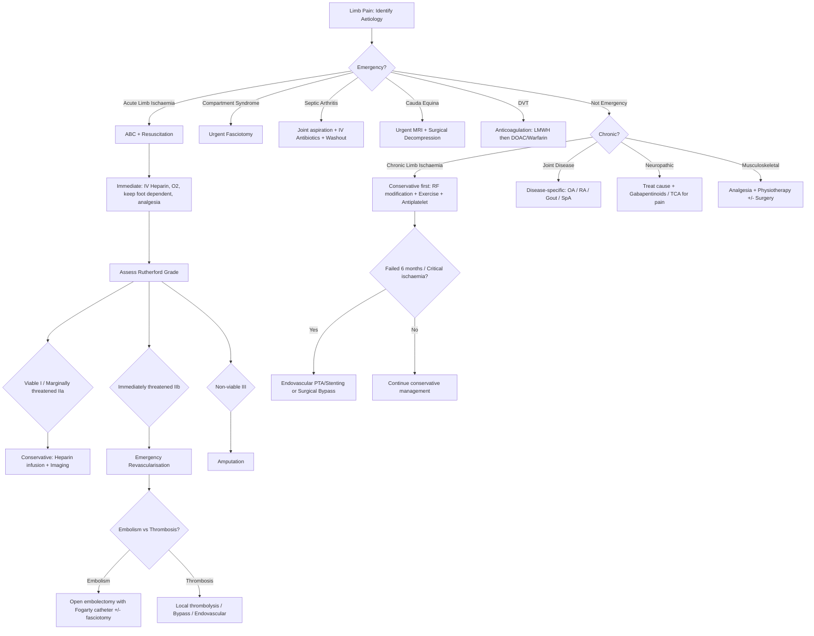

## Management of Limb Pain

The management of limb pain is entirely dictated by the underlying aetiology. There is no "one-size-fits-all" approach. What I'll do here is walk through the management of the major causes systematically — starting with the time-critical emergencies, then moving to chronic conditions. The guiding principle: **treat the cause, not just the symptom**.

---

### Overarching Management Algorithm

---

### A. Management of Acute Limb Ischaemia

This is a **surgical emergency**. Irreversible damage begins at 6 hours without collateral circulation [2].

#### 1. Initial Management [11]

- ***NPO, IV fluids, monitor BP/P, SpO2, Foley for I/O*** [11]
- ***Anticoagulation: therapeutic dose of heparin (heparin 5000 IU bolus)*** [11]
  - ***ALL patients should be anticoagulated once the diagnosis of acute arterial ischaemia due to emboli or thrombi is made in the absence of contraindications*** [2]
  - ***IV heparin bolus followed by continuous heparin infusion*** [2]
  - ***Aims for APTT 2–2.5× of normal value*** [2]
  - ***Rationale of early anticoagulation: prevents further propagation of thrombus into unaffected vascular bed; inhibits thrombosis distally in arterial and venous systems due to low flow (stasis)*** [2]
  - ***Must rule out aortic dissection before giving heparin*** [11]
- ***Improving perfusion: high-flow O2, keep foot dependent*** [11]
- ***O2 supplementation to maximise tissue oxygenation*** [2]
- ***Correction of hypotension since it can precipitate acute thrombosis by low flow (stasis)*** [2]

#### 2. Urgent Investigations [11]

- ***CBC D/C, clotting, LRFT, T&S, CK (muscle injury)***
- ***ECG and CXR: rule out aortic dissection (especially if chest pain)***
- ***Urgent CT angiogram to confirm level of occlusion and determine any run-off (2–3 patent lower leg arteries to the foot / 1 patent artery with intact anterior or posterior foot arch)***

#### 3. Management by Rutherford Grade

| ***Rutherford Grade*** | ***Management*** |
|---|---|
| ***Viable (I) and Marginally threatened (IIa)*** | ***Conservative: heparin IV bolus 3000–5000 U + continuous infusion (limit propagation of thrombus and protect collaterals). Monitor APTT (60–80s)*** [11] |
| ***Immediately threatened (IIb) or IIa failing conservative*** | ***Surgical / endovascular revascularisation*** [11] |
| ***Non-viable (III)*** | ***Amputation*** [2][11] |

<Callout title="Why Not Revascularise a Non-Viable Limb?" type="error">
***Delays in amputation of a non-viable extremity can result in infection, myoglobinuria, acute renal failure and hyperkalaemia*** [2]. Reperfusing dead muscle releases potassium (→ cardiac arrest), myoglobin (→ renal tubular necrosis), and lactic acid (→ metabolic acidosis). ***Arteriography is NOT necessary since level of amputation is determined by clinical findings and by viability of tissues at time of surgery*** [2].
</Callout>

#### 4. Revascularisation Strategies — Embolism vs Thrombosis

| ***Embolic Cause*** | ***Thrombotic Cause*** |
|---|---|
| ***Above knee: open embolectomy with Fogarty catheter ± prophylactic fasciotomy (if ischaemia > 6h)*** [11] | ***Urgent CT angiogram for pre-op planning*** |
| The Fogarty catheter is a balloon-tipped catheter passed through an arteriotomy beyond the embolus, inflated, then withdrawn — pulling the clot out | ***Local thrombolysis / bypass*** [11] |
| ***Below knee: local thrombolysis / bypass*** [11] | ***Blue toe syndrome: manage medically e.g. statins*** [11] |

***Overview of treatment modalities*** [2]:

| | ***Surgical Revascularisation*** | ***Endovascular Revascularisation*** |
|---|---|---|
| ***Modalities*** | ***Embolectomy (OR), Bypass grafting, ± Prophylactic fasciotomy*** | ***IA Thrombolysis, Angioplasty and stenting*** |
| ***Indications*** | ***Immediately threatened extremities; Recent occlusion < 2 weeks*** | ***Viable or marginally threatened extremities; Prolonged occlusion > 2 weeks*** |

#### 5. Intra-Arterial Thrombolysis [2]

***Procedures*** [2]:
- ***Angiography is performed before thrombolysis to locate occlusion and after thrombolysis to check for residual clot***
- ***Intra-arterial catheter-directed thrombolysis with thrombolysis catheter inserted into the clot***
- ***Thrombolytic agents such as recombinant tissue plasminogen activator (tPA) (e.g. alteplase/reteplase) is infused***
- ***Balloon angioplasty and stenting can be performed after complete lysis of the clot***

***Advantages*** [2]:
- ***More gradual and complete clot lysis in branch vessels too small to access by embolectomy balloons***
- ***More gradual clot dissolution with thrombolysis decreases incidence of reperfusion syndrome that is encountered after open surgical procedures where rapid return of blood flow may precipitate compartment syndrome***

***Disadvantages*** [2]: ***Higher risk of haemorrhagic stroke and major haemorrhage***

***Contraindications to thrombolysis*** [2]:
- ***Cerebrovascular accident within past 2 months***
- ***Intracranial haemorrhage within past 3 months***
- ***Intracranial malignancy or brain metastasis***
- ***Active bleeding within past 10 days***
- ***Major surgery or trauma past 10 days***
- ***Uncontrolled hypertension***

Also from Maxim [11]: ***C/I: previous stroke/TIA, recent GI bleed, bleeding tendency, pregnancy***

#### 6. Amputation [11]

***Indications (3D)***: Dead limb (non-viable), Dangerous (life-threatening sepsis/reperfusion), Damn nuisance (non-functional painful limb)

---

### B. Management of Chronic Limb Ischaemia

The management of chronic limb ischaemia follows a stepwise approach: **conservative first → intervention if fails or critical**.

#### 1. Conservative Management [11]

***CV risk factor modification*** [11]:
- ***Lifestyle: smoking cessation, weight reduction, supervised exercise programme*** (to increase O2 extraction, collateral circulation and improve muscle metabolism)
- ***DM / HT / HL control (statin — regardless of lipid level for overall CVS protection)*** [11]

Why supervised exercise? During exercise, muscles that are ischaemic activate anaerobic pathways. With regular training, several adaptations occur: (1) increased mitochondrial density → better O2 extraction; (2) angiogenesis → new collateral vessels; (3) improved endothelial function → better nitric oxide-mediated vasodilation; (4) improved walking biomechanics → reduced metabolic demand per step. Evidence shows supervised programmes increase pain-free walking distance by 50–200%.

***Pharmacological*** [11]:
- ***Low dose aspirin (72–325 mg): secondary prevention of coronary heart disease and stroke*** — aspirin irreversibly inhibits cyclooxygenase-1 (COX-1) in platelets → blocks thromboxane A2 synthesis → reduces platelet aggregation
- ***Cilostazol*** (PDE3 inhibitor with antiplatelet and vasodilatory effect) — phosphodiesterase 3 ("phospho-di-esterase" = enzyme that breaks down cyclic nucleotides) inhibition → increased intracellular cAMP → vasodilation + platelet inhibition. ***C/I: CHF*** (because PDE3 inhibitors can worsen heart failure — historical precedent from milrinone trials) [11]
  - ***Alternatives: naftidrofuryl (5-HT2 antagonist: reduce platelet aggregation), pentoxifylline / Trental (PDE inhibitor), prostaglandins*** [11]

<Callout title="Why NOT Surgery First for Intermittent Claudication?">
***Rationale of not going for surgery in IC patients: (1) Failed surgery has a poorer outcome than no surgery; (2) Second surgery is less likely to succeed*** [1]. The natural history of intermittent claudication is actually relatively benign — ***at 5 years: stable claudication (70–80%), worsening claudication (10–20%), critical CLI (1–2%)*** [1]. Conservative management addresses the much bigger killer: cardiovascular mortality (***non-fatal MI/stroke 20%, death 15–30% at 5 years*** [1]).
</Callout>

#### 2. Definitive / Interventional Treatment

***Indications*** [11]:
- ***Failed conservative management (6 months)***
- ***Disabling claudication***
- ***Critical limb ischaemia***

***Indication for surgery in non-critical ischaemia*** [1]:
- ***At least one trial of conservative Tx unless severe impact on lifestyle***
- ***NOT first-line to treat intermittent claudication!***

***Choices*** [1]:
- ***Balloon angioplasty + stenting***
- ***Arterial bypass***
- ***Endarterectomy if large vessels, short segment and no complete occlusion***
- ***Amputation after revascularisation if non-viable***

#### 3. Endovascular Treatment [11]

***Percutaneous transluminal balloon angioplasty (PTA) ± stenting*** [11]:
- ***Preferred if TASC Types A and B, aortoiliac diseases, short segment occlusion < 10 cm long, life expectancy < 2 years (better short-term outcome)***
- ***Angioplasty: balloon inflated for ~30 seconds, dilation confirmed by angiogram***
- ***Stenting (± drug-eluting): improve patency and reduce distal embolism, NOT used below knee*** [11]
- ***Post-op: antiplatelet + anticoagulation to prevent stent thrombosis***

***Specific complications*** [11]:
- ***Arterial dissection / rupture***
- ***Distal embolisation***
- ***Re-stenosis***

#### 4. Surgical Treatment [11]

- ***Endarterectomy: open up artery to evacuate atheromatous plaque (uncommon now except at carotid and femoral bifurcation — profundoplasty)*** [11]
- ***Bypass surgery: preferred if TASC Types C and D, failed angioplasty, long-segment occlusion, complete occlusion (no lumen for angioplasty guidewire to pass through)*** [11]
  - Conduit: reversed saphenous vein graft (best long-term patency for infrainguinal bypass) or synthetic graft (PTFE/Dacron for aortoiliac/aortofemoral bypass)
  - ***Requirement for venous grafts: > 3–4 mm diameter, no varicosities, destruction of valves/reversal of direction*** [1]

#### 5. General Principles in Choosing Treatment [1]

- ***Treat inflow before outflow disease, i.e. treat aortoiliac disease first → reassess distal disease***
- ***Consider length and degree of occlusion: short stenoses are better treated by endovascular Tx compared to long, complete occlusion that are multilevel***
- ***Consider availability of venous grafts: normal, healthy veins are required for arterial bypass***
- ***Consider life expectancy of patient: those with ≤ 2y life expectancy are unlikely to benefit from long-term patency advantages of surgical bypass***
- ***Consider presenting symptom: prefer bypass for patient with rest pain (durable effect on pain)***

#### 6. TASC II Classification [1]

***Based on overall success rates of treating the lesion using endovascular/surgical means based on the anatomy of occlusion/stenosis*** [1]:
| ***TASC Type*** | ***Lesion*** | ***Preferred Treatment*** |
|---|---|---|
| ***A*** | ***Short and focal*** | ***Excellent result with endovascular therapy*** |
| ***B*** | ***Moderate*** | ***Prefer endovascular Tx but can perform surgery*** |
| ***C*** | ***Extensive*** | ***Better results with open revascularisation but endovascular Tx can be used if high risk*** |
| ***D*** | ***Diffuse/complex*** | ***Usually prefer surgery as primary Tx for low-to-moderate risk patients*** |

---

### C. Management of DVT

***Management principles (NICE 2015)*** [7]:
- ***Indications for anticoagulation: only in proximal DVT and PE***
  - ***Distal DVT: low sensitivity on duplex USG, low embolic risk, usually asymptomatic → often opt not to treat***

***Anticoagulation therapy*** [7]:
- **Standard regimen**: LMWH (e.g. enoxaparin) or fondaparinux as initial treatment → bridge to oral anticoagulant (warfarin with target INR 2–3) or use DOAC (rivaroxaban, apixaban) from the start
- ***Cancer patients: prefer LMWH (or DOAC) over warfarin, continue > 6 months if active cancer*** [7]
- ***Pregnancy: switch to LMWH when 1st trimester (decreased teratogenicity) and > 36 weeks (avoid PPH) → cover up to 6 weeks postpartum (highest risk as blood returns from uterus)*** [7]
  - ***Problem: warfarin crosses placenta → risk of fetal ICH and teratogenicity*** [7]
- ***HIT: heparin C/I → start parenteral non-heparin anticoagulants → bridge to warfarin*** [7]
- ***Antiphospholipid syndrome: heparin followed by indefinite warfarin*** [7]

Duration of anticoagulation:
| Scenario | Duration |
|---|---|
| First provoked DVT (clear trigger: surgery, immobilisation) | 3 months |
| First unprovoked DVT | ≥ 3 months, consider extended if low bleeding risk |
| Recurrent VTE / permanent RF (e.g. APS, cancer) | Indefinite |

Additional measures:
- Early mobilisation (bed rest is NOT recommended)
- Graduated compression stockings (now controversial; NICE 2020 does not recommend routinely for post-thrombotic syndrome prevention, though still used in practice)
- IVC filter: only if anticoagulation absolutely contraindicated (e.g. active bleeding)

---

### D. Management of Compartment Syndrome

- ***Mx: emergent fasciotomy → lay open for oedema to resolve, then close after a few days*** [1]
- ***Consider prophylactic fasciotomy in OT if drastic ischaemia*** [1]
- ***Check compartment pressure ( < 20 mmHg of diastolic BP) if in doubt*** [1]

The fasciotomy must decompress ALL compartments. In the lower leg, this is done via two incisions: ***medial + lateral incisions*** [11] — the lateral incision decompresses the anterior and lateral compartments; the medial incision decompresses the superficial and deep posterior compartments.

Wound management: the fasciotomy wounds are left open (with negative pressure wound therapy if available), then re-inspected at 48–72 hours. If oedema has resolved, delayed primary closure or split-thickness skin grafting is performed.

---

### E. Management of Septic Arthritis

***Rheumatological emergency: requires quick diagnosis and aggressive treatment*** [12]

1. **Joint aspiration**: diagnostic (send Gram stain, culture, crystals, cell count) AND therapeutic (decompression)
2. **IV antibiotics**: start empirically immediately after aspiration, do not wait for culture results
   - Empiric: IV flucloxacillin (covers S. aureus) ± gentamicin. Vancomycin if MRSA risk.
   - Adjust based on culture and sensitivity
   - Duration: typically 2 weeks IV → 4 weeks oral (total 6 weeks)
3. **Joint washout/drainage**:
   - Repeated needle aspiration (small joints) or arthroscopic washout (large joints like knee, hip)
   - Open surgical drainage if failed closed methods
4. **Splinting** in position of function for comfort, then early mobilisation to prevent stiffness

---

### F. Management of Neuropathic Limb Pain

#### 1. Treat the Underlying Cause
- ***Diabetic neuropathy: optimise glycaemic control as mainstay*** [3]
- B12 deficiency: intramuscular hydroxocobalamin replacement
- Hypothyroid: levothyroxine
- Uraemic: optimise dialysis
- Drug-induced: stop offending agent
- ***Demyelinating neuropathies: usually immunosuppressive Tx (e.g. IVIg, pulse steroids, plasmapheresis)*** [9]
- ***Axonal neuropathies: majority not directly treatable → Mx largely by reducing exposure to toxins and treatment of underlying disease process*** [9]

#### 2. Symptomatic Treatment of Neuropathic Pain [9][20]

***Gabapentinoids (gabapentin/pregabalin) and antidepressants (amitriptyline) for pain*** [3][9]

| Drug Class | Example | Mechanism | Notes |
|---|---|---|---|
| ***Gabapentinoids*** | ***Pregabalin (Lyrica), Gabapentin (Neurontin)*** | ***Binds α2δ subunit of presynaptic voltage-dependent Ca2+ channels → blocks release of excitatory neurotransmitters e.g. glutamate*** [20] | ***S/E: somnolence, dizziness, increased appetite, mood changes*** [20]. First-line for neuropathic pain |
| Tricyclic antidepressants | Amitriptyline | Blocks reuptake of noradrenaline and serotonin → enhances descending inhibitory pain pathways from periaqueductal grey → dorsal horn | Low doses (10–25 mg nocte). S/E: anticholinergic (dry mouth, constipation, urinary retention), sedation, cardiac conduction defects. C/I: recent MI, arrhythmia |
| SNRIs | Duloxetine | Serotonin + noradrenaline reuptake inhibition → similar mechanism to TCAs but cleaner S/E profile | 2nd line. S/E: nausea, insomnia |
| Topical | Capsaicin cream, Lidocaine patches | Capsaicin depletes substance P from C-fibres; lidocaine blocks Na+ channels locally | Adjunctive, useful for localised neuropathic pain |

---

### G. Management of Musculoskeletal Causes

#### 1. Osteoarthritis
- Conservative: weight loss, physiotherapy, exercise, walking aids
- Pharmacological: paracetamol (first-line), topical NSAIDs, oral NSAIDs (with PPI cover), intra-articular corticosteroid injections for flares
- Surgical: ***joint replacement — most reliable method to give a pain-free, stable and mobile joint; limited lifespan (usually > 15 years) due to aseptic loosening*** [17]

#### 2. Gout — Acute Flare
- First-line: NSAIDs (e.g. naproxen, indomethacin) or colchicine (inhibits microtubule polymerisation in neutrophils → impairs chemotaxis and phagocytosis → reduces inflammation)
- Second-line: systemic corticosteroids (oral prednisolone or intra-articular injection) if NSAIDs/colchicine contraindicated
- NOT: allopurinol during acute attack (can paradoxically worsen the flare by causing rapid urate fluctuation)

#### 3. Gout — Long-Term Urate-Lowering Therapy
- Indication: recurrent attacks (≥ 2/year), tophi, chronic gouty arthropathy, urate nephrolithiasis
- First-line: allopurinol (xanthine oxidase inhibitor → blocks conversion of hypoxanthine → xanthine → uric acid)
  - Start low (100 mg/day), titrate to target serum urate < 360 μmol/L
  - S/E: hypersensitivity (DRESS, SJS/TEN — check HLA-B*5801 before starting, especially in Han Chinese, Thai, Korean populations)
- Second-line: febuxostat (selective xanthine oxidase inhibitor) if allopurinol intolerant
- Uricosuric: probenecid (increases renal urate excretion) — requires adequate renal function and no history of nephrolithiasis

#### 4. Rheumatoid Arthritis [17]
- **Treat-to-target**: aim for remission or low disease activity
- ***NSAIDs/COX-2 inhibitors***: for symptomatic relief only
- **DMARDs** (disease-modifying anti-rheumatic drugs): **start early**, within 3 months of diagnosis
  - First-line: methotrexate (MTX) — folate antagonist that suppresses rapidly dividing immune cells. S/E: hepatotoxicity, myelosuppression, pneumonitis. C/I: pregnancy (teratogenic), severe hepatic/renal impairment
  - Others: sulfasalazine, leflunomide, hydroxychloroquine
- **Biologics**: if inadequate response to conventional DMARDs
  - Anti-TNFα (etanercept, infliximab, adalimumab). ***C/I: active infection, latent TB, demyelinating disease, heart failure, malignancy*** [17]
  - Anti-IL-6R (tocilizumab), anti-CD20 (rituximab), T-cell co-stimulation blocker (abatacept), JAK inhibitors (tofacitinib, baricitinib)
- ***Role of surgery: aim to achieve a joint that is (1) pain-free (2) stable (3) mobile*** [17]
  - ***Priority: LL before UL (affects mobility); forefoot/ankle then knee then hip (affects stability for rehab); shoulder then elbow then hand*** [17]

#### 5. Spondyloarthritis [17]

***Approach to management*** [17]:
- ***General measures: patient education, stretching exercise and physiotherapy, smoking cessation***
- ***Pharmacological: NSAIDs or COX-2 inhibitor as first line***
  - ***~70–80% report substantial relief of symptoms including back pain and stiffness*** [17]
  - ***Ideally continuous use (modest disease-modifying effect when taken while asymptomatic) but associated with risks (GI S/E, renal vasoconstriction, increased CVS risk)*** [17]
- ***Anti-TNF or anti-IL-17A as second line*** if ***persistent high disease activity (BASDAI ≥ 4) despite adequate trial of NSAIDs involving use of 2–3 NSAIDs with ≥ 2 months for each unless contraindicated*** [17]
- ***Adjunctive: analgesics (paracetamol, tramadol), DMARDs (sulfasalazine) for persistent peripheral arthritis, local glucocorticoid injections for enthesitis and dactylitis, steroid eyedrops for anterior uveitis, joint surgery if severe hip involvement*** [17]

---

### H. Management of Spinal/Radicular Limb Pain

#### 1. Disc Prolapse / Radiculopathy [13]
- ***Non-operative: encourage mobility, physiotherapy, NSAID, selective nerve root steroid injection*** [13]
- ***Operative indications: failed non-operative treatment, progressive neurological deficit, cauda equina syndrome*** [13]
- ***Approach: microdiscectomy (hemi-laminotomy + partial disc removal)*** [13]

#### 2. Cauda Equina Syndrome
- **Surgical emergency**: urgent MRI → urgent surgical decompression (wide laminectomy)
- Delay > 24–48 hours → risk of permanent bladder/bowel/sexual dysfunction

#### 3. Neurogenic Claudication (Spinal Stenosis)
- Conservative: physiotherapy (flexion-based exercises), NSAIDs, epidural steroid injections
- Surgical: decompressive laminectomy if failed conservative management or severe/progressive symptoms

---

### I. Management of Varicose Veins / Chronic Venous Insufficiency

#### 1. Conservative [11]
- Lifestyle: exercise, weight loss, leg elevation, avoid prolonged standing
- Compression stockings: graduated compression (class II, 18–24 mmHg)
  - ***C/I: peripheral arterial disease (check ABI first — compression on an ischaemic limb worsens ischaemia)***
- ***Venotonic drugs (e.g. Daflon, micronised diosmin): increase venous tone and lymphatic drainage; good for oedema (CEAP ≥ C3)*** [11]

#### 2. Surgical / Endovenous Treatment [1][11]

***Indications: documented superficial venous reflux (retrograde flow > 0.5 sec in duration)*** [11]:
- ***Symptomatic: bleeding, recurrent phlebitis***
- ***Complications: severe disease (C4 or above), thrombosis***

***Contraindications*** [1][11]:
- ***Pregnancy: varicosities usually self-limiting***
- ***Deep vein disease: treatment of superficial disease would not yield significant benefit***
- ***Immobility: increased risk of DVT***

***Endovenous treatment options*** [11]:
- ***Endovenous laser ablation (EVLA): preferred due to higher success rate***
- ***Radiofrequency ablation (RFA): quicker recovery and less post-operative pain***
- ***Cyanoacrylate glue / Venaseal: adhesive agent to seal off VV, post-op stockings NOT required***
- ***Foam sclerotherapy (e.g. 1% STS — sodium tetradecyl sulfate): destroy endothelium by detergent or osmotic action, post-op stockings for 2 weeks***

***Open surgical options*** [1]:
- ***GSV: Trendelenburg operation (high + flush ligation of SFJ) + stripping (should not strip below knee to avoid damaging saphenous nerve) + stab avulsion***
- ***SSV: SPJ ligation + stripping (rarely done — risk of sural nerve damage) + stab avulsion***

---

### J. Pain Management Principles

For any cause of limb pain, adequate analgesia is essential. Use the WHO analgesic ladder as a framework, but tailor to the specific condition:

| Step | Drugs | Notes |
|---|---|---|
| 1 | Paracetamol ± NSAIDs | First-line for mild-moderate pain. NSAIDs C/I: renal impairment, PUD, heart failure, aspirin-sensitive asthma |
| 2 | Weak opioids (codeine, tramadol) | Add to Step 1 if insufficient |
| 3 | Strong opioids (morphine, oxycodone) | For severe pain e.g. rest pain, post-operative. S/E: respiratory depression, constipation, nausea, dependence |
| Adjuvants | Gabapentinoids, TCAs, SNRIs | Specifically for neuropathic pain. Also useful: local anaesthetic blocks |

For **ischaemic rest pain** specifically: opioid analgesia is usually required, often IV morphine. The definitive treatment of rest pain is revascularisation — analgesia alone is insufficient.

---

### K. Condition-Specific Quick Reference Table

| Condition | First-Line | Second-Line | Surgery/Intervention |
|---|---|---|---|
| Intermittent claudication | Smoking cessation, supervised exercise, aspirin, statin, cilostazol | Endovascular PTA ± stenting | Bypass if TASC C/D or failed endovascular |
| Critical limb ischaemia | IV heparin, O2, analgesia | Endovascular or surgical revascularisation | Amputation if non-viable |
| Acute limb ischaemia (embolism) | IV heparin | — | Open embolectomy ± fasciotomy |
| Acute limb ischaemia (thrombosis) | IV heparin | IA thrombolysis | Bypass surgery |
| DVT | DOAC (rivaroxaban/apixaban) or LMWH → warfarin | — | IVC filter if anticoagulation C/I |
| Compartment syndrome | — | — | Emergency fasciotomy |
| Septic arthritis | IV antibiotics + joint aspiration | — | Arthroscopic washout / open drainage |
| Gout (acute) | NSAIDs or colchicine | Corticosteroids | — |
| Gout (chronic) | Allopurinol (check HLA-B*5801) | Febuxostat, probenecid | — |
| RA | Methotrexate + NSAIDs | Biologics (anti-TNF, etc.) | Joint replacement |
| SpA | NSAIDs (continuous) | Anti-TNF / anti-IL-17A | Joint surgery if severe |
| Neuropathic pain | Gabapentin / pregabalin / amitriptyline | Duloxetine | Treat underlying cause |
| Disc prolapse | Physiotherapy, NSAIDs | Nerve root injection | Microdiscectomy |
| Varicose veins | Compression stockings, venotonics | EVLA / RFA / sclerotherapy | Trendelenburg + stripping |

---

<Callout title="High Yield Summary — Management of Limb Pain">

1. **Acute limb ischaemia**: ABC → IV heparin (ALL patients) → assess Rutherford grade → revascularise (IIa/IIb) or amputate (III). Differentiate embolism (embolectomy) vs thrombosis (thrombolysis/bypass).
2. **Chronic limb ischaemia**: Conservative FIRST for intermittent claudication (smoking cessation, supervised exercise, aspirin, statin, cilostazol). Surgery only if failed 6 months conservative or critical ischaemia.
3. **TASC II**: A/B → endovascular preferred; C/D → surgery preferred.
4. **Thrombolysis C/I**: recent stroke, ICH, intracranial malignancy, active bleeding, major surgery/trauma, uncontrolled HTN.
5. **Cilostazol**: PDE3 inhibitor. C/I in CHF.
6. **DVT**: proximal DVT → anticoagulate (DOAC or LMWH → warfarin). Cancer → LMWH/DOAC > warfarin. Pregnancy → LMWH. HIT → non-heparin anticoagulant.
7. **Compartment syndrome**: emergency fasciotomy. Do not delay for pressure measurement if clinical picture is obvious.
8. **Septic arthritis**: aspirate → IV antibiotics → joint washout. Emergency!
9. **Neuropathic pain**: gabapentinoids (pregabalin/gabapentin) or amitriptyline first-line. Treat underlying cause.
10. **Gout**: NSAIDs/colchicine for acute flare; allopurinol for long-term ULT (check HLA-B*5801 in Chinese patients). Do NOT start allopurinol during acute flare.
11. **RA**: early DMARDs (methotrexate first-line); biologics if inadequate response. Surgery: LL before UL; forefoot → knee → hip.
12. **SpA**: NSAIDs first-line (continuous use); biologics if BASDAI ≥ 4 despite 2–3 NSAIDs tried.
13. **Surgery rationale for IC**: failed surgery is worse than no surgery; second surgery less likely to succeed. Conservative Mx addresses the bigger killer (cardiovascular mortality).

</Callout>

---

<ActiveRecallQuiz
  title="Active Recall - Management of Limb Pain"
  items={[
    {
      question: "A 72-year-old man with AF presents with acute right leg pallor, absent pulses, paraesthesia beyond toes and partial muscle weakness. Describe the initial management steps and the definitive treatment.",
      markscheme: "This is Rutherford IIb (immediately threatened): sensory loss beyond toes, partial muscle weakness, inaudible arterial signal. Initial: ABC, IV heparin bolus 5000 IU then continuous infusion (APTT 2-2.5x normal), high-flow O2, keep foot dependent, NPO, analgesia, Foley catheter, urgent bloods (CBC, clotting, LRFT, T&S, CK), ECG (confirm AF), CXR. Definitive: emergency revascularisation. Given embolic cause (AF, no prior claudication, contralateral pulses present) = open embolectomy with Fogarty catheter. Consider prophylactic fasciotomy if ischaemia duration is greater than 6 hours."
    },
    {
      question: "A 60-year-old diabetic smoker has stable intermittent claudication with a claudication distance of 250 metres. ABI is 0.7. Outline the initial management plan and state when you would consider intervention.",
      markscheme: "Conservative management first: (1) Smoking cessation (strongest modifiable RF), (2) Supervised exercise programme, (3) Aspirin 75-325 mg daily, (4) Statin regardless of lipid level, (5) Optimise DM control (target HbA1c < 7%, screen with ABI every 5 years), (6) BP control, (7) Cilostazol if not in CHF. Consider intervention only if: failed conservative management after 6 months, disabling claudication severely impacting quality of life, or progression to critical limb ischaemia (rest pain, tissue loss, ABI < 0.4)."
    },
    {
      question: "List three contraindications to intra-arterial thrombolysis for acute limb ischaemia and explain why each increases risk.",
      markscheme: "1) CVA within past 2 months - recent ischaemic brain tissue is vulnerable to haemorrhagic transformation when exposed to thrombolytics. 2) Intracranial haemorrhage within past 3 months - thrombolytics dissolve clots and would worsen or re-bleed an intracranial haemorrhage. 3) Active bleeding within past 10 days - thrombolytics are systemic fibrinolytics that impair clot formation everywhere, worsening any ongoing bleeding. Other acceptable answers: intracranial malignancy/metastasis, major surgery/trauma past 10 days, uncontrolled hypertension."
    },
    {
      question: "Compare the TASC II classification approach to endovascular vs surgical treatment of chronic limb ischaemia. When is endovascular preferred and when is surgery preferred?",
      markscheme: "TASC A (short focal lesion): endovascular gives excellent results - preferred. TASC B (moderate lesion): endovascular still preferred but surgery can be performed. TASC C (extensive lesion): surgery gives better results but endovascular can be used if patient is high surgical risk. TASC D (diffuse/complex lesion): surgery is usually preferred as primary treatment for low-to-moderate risk patients. Additional principles: treat inflow before outflow; consider life expectancy (endovascular if less than 2 years); consider venous graft availability; prefer bypass for rest pain (more durable)."
    },
    {
      question: "A patient with known gout presents with an acute flare of their first MTP joint. What are the first-line treatments for the acute flare, and what must you NOT do? When would you start allopurinol?",
      markscheme: "First-line for acute flare: NSAIDs (e.g. naproxen, indomethacin) OR colchicine (low-dose regimen preferred). Second-line: systemic corticosteroids (oral prednisolone or IA injection) if NSAIDs or colchicine are contraindicated. You must NOT start allopurinol during the acute flare because rapid changes in serum urate level can paradoxically prolong or worsen the attack. Start allopurinol after the acute flare has fully resolved (typically 2 weeks after), starting low dose (100 mg/day) and titrating to target serum urate less than 360 micromol/L. In Chinese patients, check HLA-B*5801 before starting (risk of severe hypersensitivity: SJS/TEN)."
    },
    {
      question: "State the management of compartment syndrome including the surgical approach and explain why you should not delay for pressure measurement if the clinical picture is classic.",
      markscheme: "Management: emergency fasciotomy of ALL compartments via medial and lateral incisions in the lower leg. Wounds left open, re-inspected at 48-72 hours, then delayed primary closure or skin grafting. Should not delay because: (1) compartment syndrome causes irreversible muscle and nerve death within 6-8 hours, (2) the clinical diagnosis (pain out of proportion, pain with passive stretch, tense compartment) is reliable in classic presentations, (3) pressure measurement takes time and may give false negatives if the needle is not in the correct compartment. Pressure measurement is reserved for equivocal cases (e.g. obtunded patient, unclear exam). Prophylactic fasciotomy should be considered intra-operatively for acute limb ischaemia with ischaemia duration greater than 6 hours."
    }
  ]}
/>

---

## References

[1] Senior notes: Ryan Ho Cardiology.pdf (pages 212, 216, 239)
[2] Senior notes: felixlai.md (Acute arterial insufficiency management sections)
[3] Senior notes: Ryan Ho Endocrine.pdf (pages 97–99, Diabetic neuropathy management)
[7] Senior notes: Ryan Ho Haemtology.pdf (page 132, DVT management)
[9] Senior notes: Ryan Ho Neurology.pdf (pages 82, 182–183, Neuropathy and GBS management)
[11] Senior notes: maxim.md (Acute limb ischaemia management, Chronic limb ischaemia management, Varicose veins management, Compartment syndrome, Fracture management)
[12] Senior notes: Ryan Ho Rheumatology.pdf (page 67, Septic arthritis)
[13] Senior notes: maxim.md (Disc prolapse management, Spinal stenosis)
[17] Senior notes: Ryan Ho Rheumatology.pdf (pages 56, 62, 77, 92, RA surgery, SpA management, SLE joint pain)
[20] Senior notes: Ryan Ho Psychiatry.pdf (page 60, Gabapentinoids)
