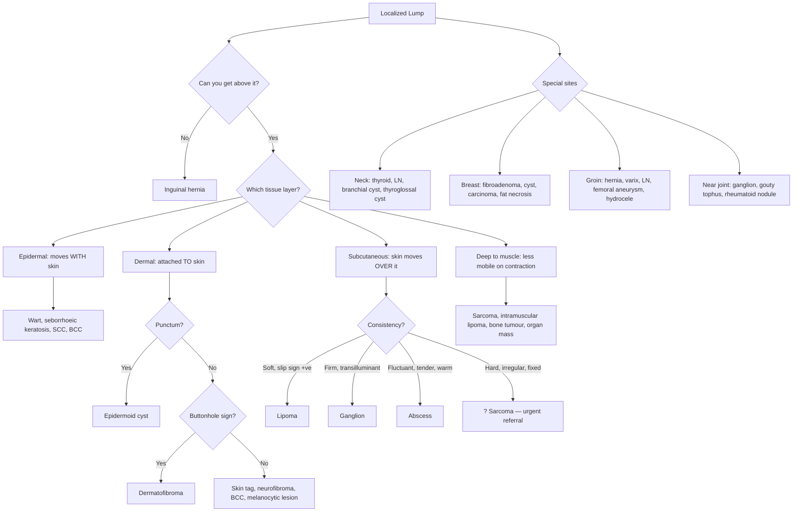

## Differential Diagnosis of a Localized Lump

The differential diagnosis (DDx) of a localized lump is arguably one of the broadest in all of surgery. The key to narrowing it down is a **structured, layered approach**: you use the **site**, the **tissue layer** of origin, and the **clinical characteristics** to whittle a huge list into a handful of likely diagnoses.

Think of it this way: the history and examination you performed in the previous section aren't just descriptive — they are **diagnostic tools**. Every feature you elicited (site, consistency, mobility, skin attachment, transillumination, cough impulse, etc.) is now used to differentiate one lump from another.

---

### Overarching Framework: The Layer-Based Differential

The single most useful framework is to think **"which tissue layer does this lump arise from?"** — because each layer has its own set of pathologies. The examination findings tell you the layer; the layer tells you the differential.

| Layer | Benign | Malignant |
|:---|:---|:---|
| ***Epidermis*** | ***Papilloma, viral warts, seborrhoeic keratosis, keratoacanthoma*** | ***Bowen's disease (SCC-in-situ), squamous cell carcinoma, basal cell carcinoma*** |
| ***Dermis*** | ***Sebaceous cyst (epidermoid cyst), acrochordon (skin tag), neurofibroma, dermatofibroma*** | ***Dermatofibrosarcoma protuberans*** |
| ***Subcutaneous tissue*** | ***Lipoma, angiolipoma, dermoid cyst, ganglion cyst*** | ***Liposarcoma*** |
| ***Bone*** | ***Osteoma*** | Osteosarcoma, bone metastasis |
| ***Melanocytes*** | ***Pigmented naevus (moles)*** | ***Malignant melanoma*** |
| ***Vascular*** | ***Pyogenic granuloma, cherry angioma (Campbell de Morgan spot)*** | Angiosarcoma, Kaposi sarcoma |
| ***Nerves*** | ***Glioma*** (peripheral), schwannoma | Malignant peripheral nerve sheath tumour |

[1][2]

This table is your **mental scaffold**. When you see a lump, ask yourself: "Is this epidermal, dermal, subcutaneous, or deeper?" — then run through the relevant column.

<Callout title="Why Layer Matters More Than Anything Else" type="idea">
A lipoma is subcutaneous → it is NOT attached to overlying skin and you can pinch the skin separately from it. An epidermoid cyst is dermal → it IS attached to the skin and moves with it. A dermatofibroma is dermal → it dimples when pinched (buttonhole sign) because it is tethered into the dermis. These are not random exam findings — they are direct consequences of which layer the lump arises from. **Always determine the layer first.**
</Callout>

---

### Site-Specific Differentials

While the layer-based approach works for any lump, certain anatomical sites have their own characteristic differential lists that you must know cold. Let's go through the high-yield ones.

---

#### A. Differential Diagnosis of an Anterior Neck Lump

***D/dx of anterior neck lump:*** [3]
- ***Thyroid enlargement*** (diffuse = Graves'/Hashimoto's/multinodular goitre; focal = solitary nodule/cyst/carcinoma)
- ***Lymphadenopathy*** (reactive, TB, lymphoma, metastatic — in HK always think NPC)
- ***Skin lumps and bumps*** (lipoma, sebaceous cyst, dermoid)
- ***Branchial cyst (if paediatric)*** — anterior to SCM, fluctuant, transilluminant
- ***Thyroglossal duct cyst (if paediatric)*** — midline, moves on swallowing AND tongue protrusion

**How do you differentiate?**

| Feature | Thyroid | Thyroglossal Cyst | Branchial Cyst | Lymph Node |
|:---|:---|:---|:---|:---|
| **Position** | Central/lateral neck, overlying thyroid | Midline, at or below hyoid | Anterior border of SCM | Variable; follows nodal stations |
| **Moves on swallowing** | Yes (pretracheal fascia) | Yes (attached to hyoid) | No | No |
| **Moves on tongue protrusion** | No | ***Yes*** (thyroglossal duct connects foramen caecum → hyoid → thyroid) | No | No |
| **Consistency** | Firm (nodule) or diffuse (goitre) | Smooth, cystic | Smooth, cystic | Rubbery (lymphoma), hard (metastatic), soft (reactive) |
| **Transillumination** | Negative (solid) | Positive (fluid) | Positive (fluid) | Negative |
| **Age** | Any age | Children/young adults | Late childhood/young adults | Any |

**Why does a thyroglossal cyst move on tongue protrusion?** The thyroglossal duct runs from the foramen caecum of the tongue → through or near the hyoid bone → to the thyroid's final position. Even after the duct obliterates, a cyst along this tract retains a fibrous attachment to the hyoid. When you protrude the tongue, the genioglossus and hyoglossus muscles pull the hyoid upward and forward → the cyst is dragged with it. A thyroid lump does NOT do this because it has no attachment to the hyoid.

---

#### B. Differential Diagnosis of a Groin Lump

This is a classic exam favourite. The key structures passing through the groin are: inguinal canal, femoral vessels, saphenous vein, lymph nodes, and the spermatic cord.

| Classification | Differential | Key Distinguishing Feature |
|:---|:---|:---|
| **Hernia** | ***Inguinal hernia*** | Cough impulse +ve, cannot get above it, reducible (if not incarcerated) |
| | ***Femoral hernia*** | Below and lateral to pubic tubercle, more common in females, cannot reduce easily |
| **Vascular** | ***Femoral artery aneurysm*** | Pulsatile AND expansile (expands in all directions with each pulse) |
| | ***Saphenous varix*** | Soft, compressible, disappears on lying down, blue tinge, ***thrill on cough*** (not just impulse) |
| **Lymphatics** | ***Inguinal lymph node*** | Discrete, firm/rubbery, non-pulsatile, non-reducible. Reactive (tender, soft) vs metastatic (hard, fixed) vs lymphoma (rubbery, non-tender) |
| | ***Lymphoma*** | Rubbery, non-tender, may be multiple, ± B symptoms |
| **Nerves** | ***Neuroma*** | Tender on palpation, Tinel sign +ve, along nerve distribution |
| **Soft tissues** | ***Lipoma*** | Soft, slip sign +ve, mobile, not attached to skin |
| | ***Abscess*** | Hot, tender, fluctuant, erythematous, ± cellulitis |
| **Others** | ***Undescended testis*** | Empty ipsilateral scrotum, lump in inguinal canal |
| | ***Communicating hydrocele (males)*** | Transilluminant, fluctuant, can get above it (cf. inguinal hernia you cannot) — but increases in size during the day |
| | ***Hydrocele of spermatic cord (males)*** | Encysted, transilluminant, within inguinal canal |
| | ***Hydrocele of canal of Nuck (females)*** | Female equivalent of encysted hydrocele of cord |

[1]

**Why can you "get above" a femoral hernia but not an inguinal hernia?** An inguinal hernia emerges from the deep inguinal ring, which is above the inguinal ligament, inside the abdominopelvic cavity — so you physically cannot place your examining fingers above the lump's origin. A femoral hernia emerges through the femoral canal, which is below the inguinal ligament — the inguinal ligament itself separates you from the abdominal cavity, so you CAN palpate above the lump. The same applies to lymph nodes, saphenous varix, etc.

**How do you tell a saphenous varix from a femoral hernia?** Both have a cough impulse. But a varix has a ***thrill*** on coughing (because of turbulent venous blood flow through the incompetent saphenofemoral junction), disappears completely on lying down (venous drainage empties it), and has a bluish colour. A hernia has an *impulse* on coughing but no thrill, may or may not reduce on lying down, and is not blue.

---

#### C. Differential Diagnosis of a Breast Lump

***Triple assessment (clinical + radiological + pathological)*** is the gold standard approach for any breast lump [4][5]. But clinically, the differential is narrowed by age and lump characteristics:

| Condition | Age | Consistency | Mobility | Pain | Key Feature |
|:---|:---|:---|:---|:---|:---|
| ***Fibroadenoma*** | ***Reproductive age*** | ***Rubbery*** | ***Highly mobile ("breast mouse")*** | Painless | ***Well-defined, can be multiple & bilateral*** [4] |
| ***Breast cyst*** | Young female (or perimenopausal) | ***Soft & fluctuant*** | Mobile | ***± tender*** | ***USG: fluid-filled. Aspiration diagnostic and therapeutic*** [4] |
| ***Fibrocystic changes (most common benign breast disorder)*** | ***Young female*** | Nodular | Variable | ***Cyclical painful mass/nodularity*** | ***Serosanguinous nipple discharge, related to menstrual cycle*** [4] |
| ***Fat necrosis*** | Any | Firm | May be tethered | Usually painless | ***History of trauma or breast reconstruction***. ***Mimics CA clinically & radiologically*** [4] |
| ***Breast carcinoma*** | Usually > 30y | ***Hard*** | ***Fixed*** (to skin or muscle) | ***Non-tender*** | ***Irregular/nodular surface, poorly-defined edge, dimpling, peau d'orange*** [5] |
| ***Intraductal papilloma*** | ***Perimenopausal*** | May not be palpable | — | — | ***Bloody nipple discharge*** [4] |
| ***Phyllodes tumour*** | ***Older age (> 40)*** | Smooth, firm | ***Mobile*** | Painless | ***Can be malignant (haematogenous spread, ALND not required)*** [4] |
| ***Mastitis / breast abscess*** | ***Lactational, 1st child*** | Induration / ***fluctuant (abscess)*** | — | ***Tender*** | ***S. aureus, erythema, fever, purulent discharge*** [4] |
| ***Mondor's disease*** | Any | Cord-like | — | ***Chest pain*** | ***Palpable subcutaneous cord*** (superficial ***sclerosing thrombophlebitis*** of ***thoraco-epigastric vein***) [4] |

**Why is the upper outer quadrant the most common site for breast carcinoma?** Because it contains the largest volume of breast tissue (~50% of glandular tissue) and the axillary tail of Spence. More glandular tissue = more epithelial cells at risk of malignant transformation = higher probability of carcinoma developing there.

<Callout title="Fat Necrosis: The Great Mimicker" type="error">
***Fat necrosis can mimic breast carcinoma clinically (painless lump, skin dimpling, nipple retraction) AND radiologically (spiculated mass on mammogram)*** [4][5]. Students often forget to ask about a ***history of trauma or previous breast procedures*** — this is the key distinguishing question. Always biopsy to rule out carcinoma.
</Callout>

---

#### D. Differential Diagnosis of a Skin Lump/Ulcer

This overlaps heavily with the layer-based approach above, but here we focus on clinical differentiation of the most commonly confused lesions:

##### BCC vs SCC vs Keratoacanthoma vs Melanoma

| Feature | ***BCC*** | ***SCC*** | ***Keratoacanthoma*** | ***Melanoma*** |
|:---|:---|:---|:---|:---|
| **Growth rate** | Slow (months-years) | ***More rapid growth*** [6] | ***Rapid (2–4 weeks growth, 2–3 months to regress)*** [2] | Variable; nodular melanoma can grow rapidly |
| **Edge** | ***Rolled (pearly) edge*** [6] | ***Everted edge*** [6] | Volcano-like with central crater | Irregular, asymmetric |
| **Surface** | ***Central ulceration (rodent ulcer)*** [6] | ***Hyperkeratotic or ulcerated, fleshy granulomatous base*** [6] | ***Central keratin-filled crater*** [2] | May be flat, raised, or ulcerated |
| **Colour** | ***Pigmented in Asians*** [6]; pearly/translucent in Caucasians | Red-brown | Skin-coloured, black necrotic core | Brown-black (or amelanotic — pink) |
| **Bleeding** | Less common | ***Contact bleeding (more common than BCC)*** [6] | Not typical | Can bleed if ulcerated |
| **LN involvement** | ***Almost never metastasizes*** | ***± LN*** [6] | No (benign, self-resolving) | Common in advanced disease |
| **Spontaneous regression** | No | No | ***Yes — characteristic*** [2] | No (except rare partial regression) |
| **Key ddx for BCC** | ***Keratoacanthoma, SCC, intradermal naevus, sebaceous cyst, melanoma (if pigmented)*** [6] | | | |
| **Key ddx for SCC** | | ***Keratoacanthoma, infected wart, actinic keratosis, pyogenic granuloma, amelanotic melanoma, BCC*** [6] | | |

[2][6]

**Why does a keratoacanthoma regress spontaneously?** It arises from the infundibulum of a hair follicle with rapid keratinocyte proliferation forming a dome with a central keratin plug. The leading theory is that immune recognition eventually triggers apoptosis and regression — the central keratin core separates and the lump collapses, leaving a depressed scar [2]. However, because ***clinical and histopathological features closely resemble SCC***, you should ***ALWAYS suspect malignancy in keratoacanthoma*** [2] and excise for definitive histology.

##### Epidermoid Cyst vs Lipoma vs Dermoid Cyst vs Dermatofibroma

| Feature | **Epidermoid Cyst** | ***Lipoma*** | ***Dermoid Cyst*** | ***Dermatofibroma*** |
|:---|:---|:---|:---|:---|
| **Layer** | Dermis | ***Subcutaneous*** | Subcutaneous (congenital) or dermis (implantation) | Dermis |
| **Attached to skin** | Yes — has a ***punctum*** | ***No — NOT attached to overlying skin*** [1] | ***Not attached to skin*** [7] | ***Fixed to subcutaneous tissue*** [8] |
| **Consistency** | Firm, slightly compressible | ***Soft*** | ***Rubbery, noncompressible*** [7] | ***Firm 'woody' consistency*** [8] |
| **Mobility** | Moves with skin | ***Mobile in all directions, +ve slip sign*** [9] | Limited | Limited (fixed deep) |
| **Special sign** | Punctum (blocked follicle ostium) | Slip sign | ***Dermal sinus (pit on overlying skin) ± tuft of hair*** [7] | ***Buttonhole sign (dimples when pinched)*** [8] |
| **Transillumination** | Negative | Negative | Negative | Negative |
| **Contents** | Keratin (cheesy, foul-smelling) | Mature fat cells | Mixed tissues (skin, hair, fat, teeth) | Fibroblastic tissue |

**Why does a dermatofibroma dimple when pinched (buttonhole sign)?** The dermatofibroma is a ***benign dermal proliferation of fibroblasts*** [8] that is tethered to the subcutaneous tissue below it. When you pinch the overlying skin, the skin is lifted but the tethered lesion cannot rise — so the skin dimples inward over the fixed lesion, creating the characteristic "buttonhole" or dimple sign.

---

#### E. Differential Diagnosis of a Subcutaneous Cystic/Soft Lump

| Feature | ***Lipoma*** | ***Ganglion*** | **Sebaceous Cyst** | ***Abscess*** |
|:---|:---|:---|:---|:---|
| **Site** | Shoulder, neck, trunk, UL [9] | ***Dorsal wrist (70%)*** [10] | Hair-bearing areas (scalp, face, trunk) | Anywhere, especially friction sites |
| **Consistency** | ***Soft*** | ***Firm, rubbery*** [10] | Firm | ***Fluctuant*** |
| **Transillumination** | Negative | ***Positive*** [10] (contains gelatinous fluid) | Negative | Negative (pus is opaque) |
| **Tenderness** | Non-tender | Usually non-tender (unless nerve compression) | Non-tender unless infected | ***Tender, warm, erythematous*** |
| **Mobility** | ***Mobile in all directions*** | Attached to ***joint capsule/tendon sheath*** → limited [10] | Attached to skin (punctum) | Fixed (surrounded by inflammation) |
| **Key feature** | Slip sign | Location near joint; ***never becomes malignant*** [10] | Punctum; cheesy discharge if ruptures | Fever, surrounding cellulitis |

---

#### F. Differential Diagnosis of Lymphadenopathy Presenting as a Lump

Lymph nodes can present as lumps anywhere along the lymphatic chain. The clinical features of the node itself help narrow the differential:

| Feature | Reactive/Infective | TB | Lymphoma | Metastatic Carcinoma |
|:---|:---|:---|:---|:---|
| **Consistency** | ***Soft*** [11] | Firm initially → caseous ("cold abscess") | ***Firm, rubbery*** [11] | ***Hard*** [11] |
| **Tenderness** | Tender | Non-tender (cold abscess) | Non-tender | Non-tender |
| **Matting** | No | Yes (perinodal caseation) | Sometimes | Sometimes (perinodal invasion) |
| **Fixation** | Mobile | May be fixed (matted) | Mobile or fixed | ***Fixed*** (invasion beyond capsule) |
| **Distribution** | Draining infection territory | Cervical (in HK — think TB); can be any | Generalised or localised | Draining the primary tumour site |
| **Systemic features** | Fever, local infection signs | Fever, night sweats, weight loss (TB constitutional symptoms) | ***B symptoms***: fever, drenching night sweats, > 10% weight loss in 6 months | Symptoms of primary malignancy |
| **Biopsy** | Not usually needed | Caseating granulomas, AFB on ZN stain | ***Excisional biopsy required*** (FNAC useless — architectural detail needed) [11] | FNAC/core biopsy often sufficient |

[11]

<Callout title="FNAC is Useless for Lymphoma!" type="error">
***FNAC provides cytological information only — it is useless in lymphoma*** because lymphoma diagnosis requires **architectural detail** (e.g., nodular vs diffuse pattern, Reed-Sternberg cells in Hodgkin's). ***Excisional biopsy is the mode of choice when suspecting lymphoma*** [11]. Core-needle or incisional biopsy is second-line (only if excision not feasible).
</Callout>

---

#### G. Differential Diagnosis of Vascular Lumps

| Feature | **Haemangioma (infantile)** | ***Pyogenic Granuloma*** | ***Cherry Angioma*** | **AV Malformation** | **Aneurysm** |
|:---|:---|:---|:---|:---|:---|
| **Age** | Infancy (grows, then involutes) | ***Any age (peak 20–30y or pregnancy)*** [12] | ***Usually > 30y, more common in elderly*** [12] | Congenital (may present later) | Older adults |
| **Growth** | Rapid in first year, then involutes | ***Rapidly developing over a few weeks then stabilises*** [12] | ***Slow*** [12] | Gradual | Gradual |
| **Appearance** | Bright red, well-demarcated, raised | ***Bright red, dome-shaped, moist, glistening surface*** [12] | ***Deep red, smooth papules (1–4mm)*** [12] | Pulsatile, may have bruit | Pulsatile, expansile |
| **Bleeding** | Rarely | ***Bleeds easily upon minor trauma (friable)*** [12] | ***Not as friable but profuse bleed if rupture*** [12] | If eroded | Not usually |
| **Compressibility** | Yes | — | ***Blanch with pressure*** [12] | Yes | Partially |
| **Number** | Usually solitary | ***Usually solitary*** [12] | ***Usually multiple*** [12] | Usually solitary | Usually solitary |
| **Key ddx of PG** | | ***SCC, BCC, amelanotic melanoma, bacillary angiomatosis*** [12] | | | |

---

### Diagnostic Decision-Making Flowchart

The following algorithm helps you logically work through the differential of any localized lump:

---

### Special Differentials Worth Remembering

#### Lumps That Can Mimic Carcinoma ("The Great Mimickers")

These conditions are high yield because misdiagnosis has serious consequences:

| Condition | What It Mimics | How to Differentiate |
|:---|:---|:---|
| ***Fat necrosis*** | ***Breast carcinoma*** (painless lump, dimpling, nipple retraction, spiculated mass on MMG) [4][5] | History of ***trauma or breast reconstruction*** [5]; biopsy to confirm |
| ***Keratoacanthoma*** | ***SCC*** (rapidly growing skin nodule) [2] | ***Spontaneous regression in 2–3 months, central keratin crater*** [2]; but always excise |
| ***Sclerosing adenosis / radial scars*** | ***Breast carcinoma*** [4] | Pathological diagnosis; ***can mimic CA*** [4] → core biopsy required |
| ***Fibrocystic changes*** | Breast carcinoma (nodularity) | ***Cyclical*** changes related to menstrual cycle [4]; usually bilateral, upper outer quadrant |
| ***Phyllodes tumour*** | Fibroadenoma | ***Older age (> 40)***, larger, more rapid growth; ***can be malignant*** [4] |
| ***Adenoma*** | Breast carcinoma | ***Older age; can mimic CA*** [4]; biopsy required |
| ***Tuberculosis (cold abscess)*** | Lymphoma or metastatic LN | Non-tender, matted LN, constitutional symptoms; AFB stain, culture, TB PCR |

---

### Approach Summary: The "5-Question" DDx Framework

When faced with any lump, systematically ask yourself:

1. **What site is it in?** → Narrows to site-specific differentials
2. **What layer does it arise from?** → Epidermal, dermal, subcutaneous, deep (use mobility tests)
3. **Is it solid or cystic?** → Fluctuance, transillumination
4. **Is it vascular?** → Pulsatility, compressibility, bruit
5. **Is it benign or malignant?** → Growth rate, consistency, edge, fixation, skin changes, LN

<Callout title="High Yield Summary">

**Differential Diagnosis of Localized Lump — Key Exam Points:**

1. **Use the layer-based approach**: the examination findings (mobility, skin attachment, buttonhole sign, slip sign, punctum) tell you which layer → which differential
2. ***Anterior neck lump DDx***: thyroid enlargement, lymphadenopathy, skin lumps, branchial cyst, thyroglossal duct cyst [3]
3. ***Groin lump DDx***: inguinal/femoral hernia, femoral artery aneurysm, saphenous varix, inguinal LN, lymphoma, lipoma, abscess, undescended testis, hydroceles [1]
4. ***Breast lump DDx***: fibroadenoma (mobile, rubbery), cyst (fluctuant), fibrocystic changes (cyclical), fat necrosis (mimics CA), carcinoma (hard, fixed), intraductal papilloma (bloody discharge), phyllodes (> 40y, can be malignant)
5. ***BCC vs SCC vs keratoacanthoma***: BCC = rolled edge, rodent ulcer, pigmented in Asians, rarely metastasises. SCC = everted edge, contact bleeding, ± LN. KA = volcano-like, central keratin crater, rapid growth then regression — but always excise to r/o SCC [6]
6. ***Fat necrosis and sclerosing adenosis mimic breast carcinoma*** clinically AND radiologically → must biopsy [4]
7. ***FNAC is useless for lymphoma*** — need excisional biopsy for architectural detail [11]
8. **Lymph node consistency**: ***Hard = solid malignancy. Firm/rubbery = lymphoma, chronic leukaemia. Soft = acute leukaemia, reactive*** [11]
9. ***Dermoid cyst DDx***: sebaceous cyst (punctum), lipoma (softer, mobile), and site-dependent (pilonidal, thyroglossal, craniopharyngioma) [7]
10. ***Ganglion***: most common soft tissue tumour of hands, ***dorsal wrist 70%***, transilluminant, ***never becomes malignant*** [10]

</Callout>

---

<ActiveRecallQuiz
  title="Active Recall - Differential Diagnosis of Localized Lump"
  items={[
    {
      question: "A patient presents with a firm nodule on the shin that dimples when you pinch the overlying skin. What is the diagnosis, what sign is this, and why does it occur?",
      markscheme: "Dermatofibroma. Buttonhole sign (dimple sign). It occurs because the dermatofibroma is a benign proliferation of fibroblasts tethered into the dermis and fixed to subcutaneous tissue. When you pinch the skin upward, the tethered lesion cannot rise with it, so the skin dimples inward over the fixed nodule."
    },
    {
      question: "Name 3 breast conditions that can clinically mimic breast carcinoma and explain how you would differentiate each from cancer.",
      markscheme: "1. Fat necrosis - ask about history of trauma or breast reconstruction; biopsy to confirm. 2. Fibrocystic changes - cyclical mastalgia related to menstrual cycle, bilateral, upper outer quadrant; USG shows cysts. 3. Phyllodes tumour - smooth, mobile mass in older female (more than 40y); core biopsy shows fibroepithelial tumour with stromal cellularity. Others acceptable: sclerosing adenosis, adenoma."
    },
    {
      question: "Why is FNAC inadequate for diagnosing lymphoma? What is the preferred biopsy method?",
      markscheme: "FNAC provides only cytological information (individual cell morphology) but cannot demonstrate the architectural pattern (nodular vs diffuse, presence of Reed-Sternberg cells, follicular pattern). Lymphoma diagnosis requires architectural detail. Preferred method is excisional biopsy. Core-needle biopsy is second-line if excision is not available."
    },
    {
      question: "A 25-year-old presents with a midline neck lump that moves on swallowing AND on tongue protrusion. What is the diagnosis and explain the mechanism for each movement.",
      markscheme: "Thyroglossal duct cyst. Moves on swallowing because it is in the midline anterior neck and the pretracheal structures (including the tract remnant near the hyoid) move with the larynx during swallowing. Moves on tongue protrusion because the thyroglossal duct remnant maintains a fibrous attachment from foramen caecum through the hyoid bone; tongue protrusion pulls the hyoid upward via genioglossus and hyoglossus muscles, dragging the cyst with it."
    },
    {
      question: "Describe 3 features that distinguish a saphenous varix from a femoral hernia on examination of a groin lump.",
      markscheme: "1. Saphenous varix has a THRILL on cough (turbulent venous flow through incompetent saphenofemoral junction), hernia has only an impulse. 2. Varix disappears completely on lying down (venous drainage empties), hernia may or may not reduce. 3. Varix has a blue/purple tinge (venous blood visible through thin walls), hernia is skin-coloured. Additional: varix is compressible and refills from below; auscultation may reveal venous hum."
    },
    {
      question: "List the clinical significance of lymph node consistency: what does hard, firm/rubbery, and soft suggest?",
      markscheme: "Hard: solid organ malignancy metastasis or previous inflammation with fibrosis. Firm/rubbery: lymphoma or chronic leukaemia. Soft: acute leukaemia or reactive (benign) lymphadenopathy."
    }
  ]}
/>

---

## References

[1] Senior notes: felixlai.md (Hernia section — DDx of groin mass)
[2] Senior notes: felixlai.md (Lipoma section — DDx table by layer; Keratoacanthoma section)
[3] Senior notes: Ryan Ho Endocrine.pdf (p18 — DDx of anterior neck lump)
[4] Senior notes: maxim.md (Sections 8.3–8.6 — Breast assessment, inflammatory and non-inflammatory breast conditions, benign breast tumours)
[5] Senior notes: Ryan Ho Urogenital.pdf (p200 — Fat necrosis; p205 — Carcinoma of breast)
[6] Senior notes: Ryan Ho Rheumatology.pdf (pp187, 190 — SCC examination and BCC examination, DDx)
[7] Senior notes: Ryan Ho Rheumatology.pdf (p168 — Dermoid cyst DDx)
[8] Senior notes: Ryan Ho Rheumatology.pdf (p166 — Dermatofibroma)
[9] Senior notes: Ryan Ho Rheumatology.pdf (p169 — Lipoma)
[10] Senior notes: maxim.md (Ganglion cyst section); Senior notes: Ryan Ho Rheumatology.pdf (p173 — Ganglion)
[11] Senior notes: Ryan Ho Haemtology.pdf (p87 — LN biopsy and consistency)
[12] Senior notes: Ryan Ho Rheumatology.pdf (p178 — Pyogenic granuloma vs cherry angioma)
