## Diagnostic Criteria, Diagnostic Algorithm, and Investigation Modalities for Localized Lumps

The investigation of a localized lump follows a fundamental principle: **you are trying to answer two questions — (1) What is this lump? and (2) If it is malignant, what is its stage?** The approach is not random; it is dictated by the site, the clinical suspicion from history and examination, and the pre-test probability of malignancy.

There is no single "diagnostic criterion" for "localized lump" as a whole — the criteria depend on the specific pathology you suspect. However, there are standardised **reporting and classification systems** that apply across many lump types, and there are well-established **investigation algorithms** that guide workup. Let's go through these systematically.

---

## Standardised Reporting and Classification Systems

These systems exist to provide a common language for clinicians and radiologists to communicate the probability of malignancy. They are structured so that each category has a defined cancer risk and a recommended next step.

### 1. BI-RADS (Breast Imaging Reporting And Data System)

***BI-RADS = Breast Imaging Reporting and Data System. Similar classifications exist for thyroid (TI-RADS), liver (LI-RADS), and prostate (PI-RADS)*** [13][14]

This is the most widely used classification for breast imaging and applies to **mammography, ultrasound, AND MRI** [13][14]:

| ***BI-RADS Category*** | ***Description*** | ***Malignancy Risk*** | ***Recommended Action*** |
|:---|:---|:---|:---|
| ***0*** | ***Needs additional imaging evaluation*** | — | Further imaging |
| ***1*** | ***Negative imaging (no finding at all)*** | 0% | Routine screening |
| ***2*** | ***Benign (0% risk)*** | 0% | ***Routine screening*** |
| ***3*** | ***Probably benign (≤2%)*** | ≤2% | ***F/U at 6/12*** |
| ***4*** | ***Suspicious (2–95%)*** | 2–95% | ***Biopsy*** |
| | ***4A: low suspicion (2–10%)*** | | |
| | ***4B: moderate suspicion (10–50%)*** | | |
| | ***4C: high suspicion (50–95%)*** | | |
| ***5*** | ***Highly suggestive of malignancy (≥95%)*** | ≥95% | ***Biopsy*** |
| ***6*** | ***Known (Bx-proven) malignancy*** | 100% | ***Surgical excision*** |

[13][14]

**Why does BI-RADS exist?** Because imaging findings exist on a spectrum — a well-circumscribed oval lesion on mammogram is almost certainly benign, while a spiculated mass with microcalcifications is almost certainly malignant. BI-RADS standardises this so that every radiologist uses the same categories, and every surgeon knows exactly what next step is recommended. Without it, one radiologist might call a lesion "probably fine" and another "a bit suspicious" — BI-RADS eliminates this ambiguity.

### 2. TI-RADS (Thyroid Imaging Reporting And Data System)

***USG of thyroid: look for features suggestive of malignancy (TI-RADS classification) → selective FNAC of those who have suspicious features*** [3][15]

The ACR TI-RADS (2017) assigns points for suspicious features on ultrasound. The total determines the TI-RADS category and whether FNAC is indicated:

| Feature Category | Suspicious Finding | Points |
|:---|:---|:---|
| **Composition** | Solid | 2 |
| **Echogenicity** | ***Hypoechoic, heterogeneous*** [3] | 2–3 |
| **Shape** | ***Taller than wide*** [3] | 3 |
| **Margin** | ***Irregular, lobulated, extrathyroidal extension*** | 2–3 |
| **Echogenic foci** | ***Microcalcification ( < 0.2 mm): represents the psammoma bodies of papillary CA*** [3] | 3 |

| TI-RADS Category | Description | FNAC Recommendation |
|:---|:---|:---|
| TR1 | Benign | No FNAC |
| TR2 | Not suspicious | No FNAC |
| TR3 | Mildly suspicious | FNAC if ≥ 2.5 cm (or follow-up if ≥ 1.5 cm) |
| TR4 | Moderately suspicious | FNAC if ≥ 1.5 cm (or follow-up if ≥ 1.0 cm) |
| TR5 | Highly suspicious | FNAC if ≥ 1.0 cm (or follow-up if ≥ 0.5 cm) |

### 3. Bethesda System for Reporting Thyroid Cytopathology

Once FNAC is performed on a thyroid nodule, the result is classified using the **Bethesda system** [16]:

| ***Class*** | ***Diagnostic Category*** | ***Cancer Risk*** | ***Management*** |
|:---|:---|:---|:---|
| ***I*** | ***Non-diagnostic*** | ***1–4%*** | ***Repeat FNA*** |
| ***II*** | ***Benign*** | ***0–3%*** | ***Clinical follow-up*** |
| ***III*** | ***Atypia of undetermined significance (AUS) OR follicular lesion of undetermined significance (FLUS)*** | ***5–15%*** | ***Repeat FNA*** (or molecular testing) |
| ***IV*** | ***Follicular neoplasm*** | ***15–30%*** | ***Surgical lobectomy*** |
| ***V*** | ***Suspicious for malignancy*** | ***60–75%*** | ***Surgical lobectomy ± frozen section with total thyroidectomy*** |
| ***VI*** | ***Malignant*** | ***97–99%*** | ***Total thyroidectomy*** |

[16]

**Why can't FNAC distinguish follicular adenoma from follicular carcinoma?** Because the defining feature of follicular carcinoma is **capsular or vascular invasion** — this is an architectural feature you can only see on histology (the relationship between the tumour and its capsule). FNAC gives you individual cells, not architecture. So Bethesda IV ("follicular neoplasm") means "the cells look follicular, but I can't tell you if the capsule is invaded" → you need a lobectomy to examine the whole specimen histologically.

### 4. ABCDE Criteria for Pigmented Lesions (Melanoma Screening)

***Apply the ABCDE system to a suspicious lesion: Asymmetry, Border, Colour, Diameter, Evolution and/or Elevation*** [17]

| Letter | Feature | What It Means | Pathophysiological Basis |
|:---|:---|:---|:---|
| **A** | ***Asymmetry*** | One half does not match the other | Uncontrolled, disordered growth of different clones |
| **B** | ***Border*** | Irregular, ragged, notched, or blurred edges | Infiltrative growth pattern at tumour periphery |
| **C** | ***Colour*** | Variegated — multiple shades of brown, black, red, white, blue | Different clones of melanocytes producing different amounts of melanin ± regression (white) ± inflammation (red) ± deep melanin (blue) |
| **D** | ***Diameter*** | > 6 mm (larger than a pencil eraser) | Larger lesions have had more time to accumulate mutations |
| **E** | ***Evolution and/or Elevation*** | Any change in size, shape, colour, or symptoms over time | Active neoplastic growth; the most important criterion |

[17]

<Callout title="Evolution (E) is the Most Important Criterion">
A lesion can be small, symmetric, and uniform in colour and still be a melanoma if it is **changing**. Conversely, many benign naevi are > 6 mm. The key question to ask patients is: "Has this mole changed recently?" — this single question captures the "E" and is the most sensitive clinical indicator. ***Key investigations for pigmented lesions include dermoscopy and excision biopsy*** [17].
</Callout>

---

## The Triple Assessment (Gold Standard for Breast Lumps)

***Triple assessment: gold-standard for breast lump workup*** [13][14]

This is the single most important diagnostic framework for a breast lump. It combines three independent modalities, each with its own sensitivity, such that the **overall sensitivity approaches 99.6% with a specificity of 93%** [13][14]:

| Component | Modality | Sensitivity |
|:---|:---|:---|
| ***Clinical*** | History + Physical Examination | ***50–85%*** |
| ***Radiological*** | Mammogram ± USG ± MRI | ***~90%*** |
| ***Histopathological*** | FNAC or Core Biopsy | ***~91%*** |

***Regarded positive when any one is positive*** [13][14]

**Why do we need all three?** Because no single modality is perfect. Clinical examination misses small, deep, or non-palpable lesions. Imaging can be normal in dense breasts or with certain subtypes (e.g., lobular carcinoma on mammogram). Biopsy can give a false negative if the needle misses the lesion. By requiring **concordance** between all three — or acting on a positive result from any one — you minimise the chance of missing a cancer.

---

## Investigation Modalities: Detailed Breakdown

### A. Imaging

#### i. Ultrasound (USG)

The workhorse of lump investigation. Cheap, non-invasive, no radiation, real-time, and can guide biopsy.

**Principle**: High-frequency sound waves (typically 7.5–15 MHz for superficial structures) are transmitted into tissue. Different tissues reflect sound differently → create an image based on echogenicity.

**General Indications for Any Lump**:
- First-line for superficial soft tissue lumps (subcutaneous lipoma, cyst, lymph node)
- ***First imaging study in young women or women who are pregnant or lactating*** [18] (avoids radiation, and dense young breast tissue makes mammogram less useful)
- ***Diagnostic in palpable breast mass: D/dx between cystic vs solid masses*** [19][14]
- ***Infected breast for any abscesses*** [19]
- ***Axillary USG for any lymphadenopathy*** [19]
- ***Image guidance for interventions: FNAB or core biopsy*** [19]
- ***For all patients with goitre/palpable thyroid nodules*** [3][15] — ***NOT for screening test for healthy subjects (high sensitivity but low specificity)*** [3][15]
- Lipoma: ***mainly by clinical exam ± USG to r/o other ddx*** [9]
- Ganglion: ***clinical ± USG (well-defined margins, thick wall with acoustic enhancement)*** [10]

**Breast USG — Key Findings**:

| Feature | ***Benign*** | ***Malignant*** |
|:---|:---|:---|
| ***Shape*** | ***Wider-than-taller (ellipsoid)*** | ***Taller-than-wide ("fir-tree")*** |
| ***Margin*** | ***Smooth margins, macrolobulation*** | ***Spiculated or angular margins, microlobulation*** |
| ***Echogenicity*** | ***Hyperechogenicity, thin echogenic capsule*** | ***Hypoechogenicity*** |
| ***Calcification*** | ***Absent*** | ***Internal calcification, posterior acoustic shadowing*** |
| ***Vascularity*** | ***Absent*** | ***Central vascularity*** |

[18]

**Why is "taller-than-wide" suspicious?** A benign lesion grows within the tissue plane → it is wider than tall (compressed by adjacent tissue). A malignant lesion invades across tissue planes → it grows vertically as well as horizontally → appears taller than wide. ***This is a recurrent theme in both thyroid and breast ultrasonography because a taller-than-wide lesion suggests fascial invasion and inability to be compressed under USG*** [14].

**Thyroid USG — Features Suggestive of Malignancy** [3][15]:

| The Nodule Itself | Surrounding Tissues |
|:---|:---|
| ***Echogenicity: hypoechoic, heterogeneous*** | ***Other nodules (likely MNG → reassuring)*** |
| ***Size/shape: taller than wide, irregular shape*** | ***Parenchymal abnormalities*** |
| ***Internal structure: solid or cystic with irregular septa*** | ***LNs: absent hilum, microcalcification, round, peripheral vascularity, hyperechoic — more likely to be malignant*** |
| ***Microcalcification ( < 0.2 mm): represents the psammoma bodies of papillary CA*** | |
| ***Perilesional halo: absent or incomplete (represents compression of surrounding tissues w/o invasion)*** | |
| ***Vascularity: intranodular vascularity*** | |
| ***Local invasion: esp into strap muscles*** | |

[3][15]

#### ii. Mammography

***Most sensitive of all breast imaging modalities*** [13][14]

**Principle**: Low-dose X-ray of compressed breast tissue. Compression reduces overlapping tissue artefacts and lowers radiation dose.

**Indications**: ***Insensitive for young women (esp in Asians)*** — ***breast tissue in young and Asian women too dense → prefer USG*** [13][14]
- ***> 40y if asymptomatic (for screening)***
- ***> 35y if symptomatic (for diagnosis)***
- ***Specimen mammogram for assessment of resection margin***

[13][14]

**Standard Views**:
- ***Mediolateral oblique (MLO)***: captures the ***axillary tail*** [13][14] — ***any abnormality in the oblique milky way (tissue next to pectoralis muscle) is highly suggestive of carcinoma*** [13]
- ***Craniocaudal (CC)***: ***note the upper lateral quadrant → > 50% of CA breast found there*** [13][14]
- ***Compression (cone) view***: focal compression onto suspicious areas → ***↓ overlapping shadow → ↓ overlapping artefacts*** [13]

**Reading a Mammogram** [14]:

| Finding | Benign Features | Malignant Features |
|:---|:---|:---|
| **Mass shape** | ***Oval, round, well-circumscribed*** | ***Spiculated (~90% malignant)*** |
| **Microcalcification** | ***Scattered, tea cup/milk of calcium (round on CC, crescent on MLO — intracystic), larger, smooth, round, "popcorn" calcifications*** | ***Pleomorphic, clustered, segmental, linear branching pattern (following ductal drainage → suggestive of DCIS)*** |
| **Other findings** | — | ***Architectural distortion, skin thickening, nipple changes, axillary mass on MLO*** |

[14]

**Why is a spiculated mass so suspicious?** Spiculations are radiating lines extending from the mass into surrounding tissue. They represent **desmoplastic reaction** — the tumour invades and elicits fibroblast proliferation in surrounding stroma, creating these characteristic radiating strands. This is an imaging hallmark of invasive carcinoma.

**Why does DCIS cause linear branching microcalcifications?** DCIS grows within the ductal system. As the malignant cells undergo necrosis (especially in the comedo subtype), dystrophic calcification occurs within the necrotic debris. Because the disease follows the ductal anatomy, the calcifications arrange themselves in a ***linear branching pattern following the ductal drainage*** [14].

#### iii. MRI

***Highly sensitive (88–100%) but low specificity (benign breast lesions often enhance)*** [14][20]

**Principle**: Uses magnetic fields and radiofrequency pulses to generate images. Gadolinium contrast enhancement reveals vascular/highly cellular lesions.

**Indications** — ***usually when ↑ sensitivity is needed*** [14][20]:
- ***Screening in high-risk women (e.g. BRCA1/2+)***
- ***As adjunct to MMG/USG in suspicious cases (e.g. assess chest wall extension)***
- ***Occult lesions with axillary LN +ve or Paget's disease of nipple but MMG/USG –ve***
- ***Identify extent of residual disease after excision if positive margins***
- ***Monitor result of neoadjuvant therapy (tumour may shrink → undetectable by USG/MMG)***

***Findings: an enhancing lesion with heterogeneous, irregular enhancement or type 2/3 enhancement curves suspicious for malignancy*** [14][20]

- Type 1 curve: progressive enhancement → usually benign
- Type 2 curve: plateau → indeterminate
- Type 3 curve: washout (rapid uptake then signal drops) → suspicious for malignancy

***Esp more sensitive for lobular carcinoma (than other modalities)*** [14][20] — because lobular carcinoma grows diffusely without forming a discrete mass, making it hard to see on mammogram or USG.

#### iv. CT Scan

**Principle**: Cross-sectional X-ray imaging with computer reconstruction. Excellent for staging (detecting distant metastases) but not first-line for characterising superficial lumps.

**Key Applications for Lumps**:

- **Staging of proven malignancy**: CT thorax/abdomen/pelvis (CT TAP) to detect metastatic disease
- **Thyroid**: ***CT/MRI for retrosternal extension and staging (NOT routine)*** [3][15]. ***Note that the use of iodinated contrast may affect post-op radioactive iodine body scan*** [3]
- **Liver masses**: ***Triphasic CT scan as 1st line for HCC diagnosis*** [21] — characteristic arterial enhancement → portal venous washout
- **Bone/soft tissue masses**: to evaluate bone destruction, calcification patterns, soft tissue extent

**CT Lesion Characteristics** (general principles) [22]:

| ***Shape*** | ***Significance*** |
|:---|:---|
| ***Round/oval*** | ***Slow, displacing growth pattern*** |
| ***Tubular*** | ***Vascular or neural*** |
| ***Wedge or triangular*** | ***Vascular territory (e.g. infarct)*** |
| ***Irregular or infiltrative*** | ***Malignancy*** |

[22]

#### v. Thyroid Scintigraphy (Nuclear Medicine)

***Thyroid scintigraphy if nodule + ↓ TSH*** [3][15]

**Principle**: Radioactive iodine (¹²³I) or technetium (⁹⁹ᵐTc-pertechnetate) is injected IV → taken up by functioning thyroid tissue → gamma camera images which areas are "hot" (hyperactive) or "cold" (hypoactive).

**Key Interpretation**:
- ***Hyperfunctioning ("hot") nodules (uptake is greater than surrounding thyroid tissue) are rarely cancer and hence does NOT require FNA*** [16]
- ***Hypofunctioning ("cold") nodules (uptake is less than surrounding thyroid tissue) has 10–20% chance of being cancer and hence requires FNA provided that sonographic criteria are met*** [16]

**Why are hot nodules rarely malignant?** A hot nodule is autonomously producing thyroid hormone — it is metabolically active and functioning. Cancer cells are generally poorly differentiated and have lost the specialised function of iodine uptake (except well-differentiated papillary and follicular cancers, which can still trap iodine post-operatively for radioiodine ablation, but in a diagnostic setting they are usually "cold" because they trap less efficiently than normal thyroid tissue).

#### vi. Sentinel Lymph Node Identification (Nuclear Medicine)

***Sentinel lymph node biopsy: minimally invasive procedure designed to accurately stage cancers, especially CA breast*** [23]

**Principle**: ***Cancer spreads in an orderly way through lymphatics*** [23]. The sentinel node is the ***first node/group of nodes that drain from breast to axilla*** [23].

**Technique**: ***Radiocolloid (⁹⁹ᵐTc) containing small radioactive particles*** [23] is injected near the tumour. The particles travel through lymphatics to the first draining node → detected intra-operatively with a gamma probe. Often combined with blue dye (patent blue V or indocyanine green).

**Interpretation**:
- ***–ve SLN → cancer has not spread to LNs*** [23]
- ***+ve SLN → cancer is present in SLN → may also be present in other LNs in the same area*** [23]
- ***Importance: less invasive than axillary dissection → ↓ post-op complications (wound pain, shoulder stiffness, seroma formation, lymphoedema)*** [23]

#### vii. Dermoscopy

***Key investigations for pigmented lesions: dermoscopy*** [17]

**Principle**: A handheld device with magnification (typically 10×) and polarised/non-polarised light that allows visualisation of subsurface structures of the skin (epidermis, dermo-epidermal junction, papillary dermis) not visible to the naked eye.

**Use**: Evaluate pigmented lesions to differentiate benign naevi from melanoma. Improves sensitivity of melanoma detection from ~65% (naked eye) to ~90% (with dermoscopy).

**Key Dermoscopic Features of Malignancy**: irregular pigment network, blue-white veil, irregular dots/globules, atypical vascular pattern, regression structures.

---

### B. Tissue Diagnosis (Biopsy)

The ultimate answer for any lump of uncertain nature is **histopathology**. The method of obtaining tissue depends on the clinical scenario.

#### i. Fine Needle Aspiration Cytology (FNAC)

**Technique**: 22–28G needle attached to syringe, multiple passes through the lump under suction. Yields individual cells (cytology), not tissue architecture.

***FNAC vs Core Biopsy: nowadays often prefer upfront core Bx if suspicious of malignancy → FNAC reserved for those w/ low suspicion for malignancy*** [14][20]

| | ***FNAC*** | ***Core Biopsy*** |
|:---|:---|:---|
| ***Pros*** | ***Safe, simple, inexpensive, no LA required. Immediately distinguishes cysts from solid masses. Therapeutic for breast cysts*** | ***Can distinguish DCIS from invasive cancer. Allows IHC for ER, PR, HER2*** |
| ***Cons*** | ***Cannot reliably distinguish DCIS from invasive cancer. ↑ rate of FN or inadequate sample. IHC for hormonal status can be done by a cell block (but less reliable)*** | ***Can only be done in large masses ( > 2 cm). More invasive (9–18G needle vs 26–28G) → require LA + larger wound. ↑ pain and risk of complications*** |
| ***Findings*** | ***Ductal cells and stromal cells. Malignancy: ↑ N:C ratio, nuclear pleomorphism. Fibroadenoma: naked nucleus. Cysts: cystic fluid (send cytology if bloody to r/o intracystic CA). Infectious: polymorphs present*** | Tissue cores → full histological architecture |

[14][20]

<Callout title="When is FNAC Useless?" type="error">
**Lymphoma**: FNAC provides only cytological information → ***useless in lymphoma*** [11] — need architectural detail (excisional biopsy).
**Follicular thyroid neoplasm**: Cannot distinguish adenoma from carcinoma (need to see capsular/vascular invasion on histology).
**Hepatic haemangioma**: ***FNAC contraindicated (risk of severe haemorrhage)*** [21].
</Callout>

#### ii. Core Needle Biopsy (CNB)

**Technique**: A larger gauge (9–18G) cutting needle obtains a cylinder ("core") of tissue. Preserves histological architecture. Often USG-guided or stereotactic-guided (for mammographic abnormalities).

**Indications**:
- ***BI-RADS category 4–5 on imaging*** [14][20]
- When FNAC is non-diagnostic or inadequate
- When histological architecture is needed (e.g., distinguish DCIS from invasive cancer, assess ER/PR/HER2 on IHC)

**Special Types**:
- ***Stereotactic-guided core Bx***: for mammographically detected lesions not visible on USG (e.g., microcalcifications → DCIS)
- ***Vacuum-assisted biopsy (VAB)***: larger tissue yield, used for small or difficult lesions

#### iii. Excisional / Incisional Biopsy

| Type | Description | Indication |
|:---|:---|:---|
| **Excisional Bx** | Complete removal of lesion with margin | Diagnostic + therapeutic. ***Preferred for: suspected lymphoma (excisional biopsy is mode of choice)*** [11], small skin lesions (BCC, SCC), suspicious moles |
| **Incisional Bx** | Partial removal of a portion of the lesion | Large masses where complete excision is not practical initially (e.g., large sarcoma — to confirm diagnosis before definitive surgery) |

***Excision biopsy is key for pigmented lesions*** [17] — a suspicious pigmented lesion should be excised completely with a narrow margin (2 mm) for histological assessment of Breslow thickness, which determines further management.

#### iv. Skin Punch Biopsy

**Technique**: A cylindrical blade (2–8 mm) punches through the full thickness of skin to obtain epidermis + dermis + subcutaneous fat.

**Indications**: ***Skin punch biopsy if skin lesion present, e.g., Paget's disease, ulceration*** [14][20]. Also for suspected BCC, SCC, inflammatory dermatoses.

**Why full thickness?** Because you need to see the entire depth of the lesion — BCC and SCC both invade the dermis, and their depth determines staging and treatment.

---

### C. Blood Tests

Blood tests are **adjunctive** — they do not diagnose lumps directly but provide important contextual information:

| Test | Indication | Interpretation |
|:---|:---|:---|
| ***TFT (ultrasensitive TSH ± fT4)*** | ***All thyroid lumps*** [3][15] | Low TSH → hyperthyroidism (toxic nodule, Graves') → consider scintigraphy. High TSH → hypothyroidism (Hashimoto's). |
| ***Calcitonin*** | ***If history or clinical suspicion of familial medullary carcinoma or MEN2*** [3][15] | Elevated → medullary thyroid carcinoma (C cell marker) |
| ***ESR, antithyroid antibodies (ATA)*** | ***Thyroiditis*** [3][15] | ↑ ESR → subacute thyroiditis or malignancy. +ve anti-TPO/anti-Tg → Hashimoto's. |
| **AFP** | Suspected HCC (liver mass) | ↑ in HCC (but also in cirrhosis, pregnancy, germ cell tumours) |
| **LDH** | Lymphoma, melanoma | Non-specific marker of tumour burden/cell turnover |
| **FBC, CRP** | Infectious causes (abscess, cellulitis) | Leucocytosis, raised CRP = active infection/inflammation |
| ***TPO, TSH receptor mRNA RT-PCR*** | ***As baseline tumour marker level if suspected or confirmed thyroid malignancy*** [3][15] | Baseline for post-op surveillance |

---

### D. Other Investigations

| Investigation | Indication | Key Findings |
|:---|:---|:---|
| ***Direct laryngoscopy*** | ***For RLN palsy*** [3][15] in thyroid lumps | Vocal cord paralysis → invasion of recurrent laryngeal nerve by thyroid malignancy |
| ***Flow-volume loop study*** | ***For airway obstruction in obstructive/retrosternal goitre*** [3][15] | ***UAO results in a blunted flow-volume loop*** [3][15] — flattening of the inspiratory limb (variable extrathoracic) or both limbs (fixed obstruction) |
| ***CXR/CT/MRI thorax*** | ***Assessment of extent of retrosternal goitre*** [3][15]; staging for any malignancy | Tracheal deviation, mediastinal mass, lung metastases |
| ***Photography*** | ***To monitor dysplastic naevi*** [17] | Serial comparison to detect evolution (ABCDE "E") |
| ***OGD*** | ***Oesophageal involvement by thyroid malignancy*** [3][15] | Extrinsic compression or direct invasion |
| ***PET-CT*** | Staging of certain malignancies (lymphoma, melanoma, lung cancer) | ↑ FDG uptake (SUVmax > 2.5) in metabolically active lesions [24] |

---

## Master Diagnostic Algorithm

The following flowchart integrates the approach to investigating a localized lump across all sites:

```mermaid
flowchart TD
    A["Localized Lump Identified\non History + Examination"] --> B{"Site?"}
    
    B -->|"Breast"| C["Triple Assessment"]
    C --> C1["Clinical: Hx + P/E"]
    C --> C2["Radiology"]
    C --> C3["Histopathology"]
    
    C2 --> C2a{"Age?"}
    C2a -->|"< 35y or pregnant"| C2b["USG breast 1st line"]
    C2a -->|"> 35y symptomatic"| C2c["Mammography + USG"]
    C2a -->|"> 40y asymptomatic"| C2d["Screening mammography"]
    
    C2b --> C2e["Apply BI-RADS"]
    C2c --> C2e
    C2d --> C2e
    
    C2e -->|"BI-RADS 1-2"| C2f["Routine screening / reassurance"]
    C2e -->|"BI-RADS 3"| C2g["Follow-up at 6 months"]
    C2e -->|"BI-RADS 4-5"| C2h["Core Biopsy or FNAC"]
    C2e -->|"BI-RADS 6"| C2i["Surgical excision"]
    
    C3 --> C3a{"Suspicion level?"}
    C3a -->|"Low"| C3b["FNAC"]
    C3a -->|"High"| C3c["Core biopsy"]
    
    B -->|"Thyroid / Neck"| D["TFT + USG thyroid"]
    D --> D1{"TSH?"}
    D1 -->|"Low TSH"| D2["Thyroid scintigraphy"]
    D2 -->|"Hot nodule"| D3["Unlikely CA — no FNA needed"]
    D2 -->|"Cold nodule"| D4["FNA if USG features meet TI-RADS criteria"]
    D1 -->|"Normal/High TSH"| D5["USG features: apply TI-RADS"]
    D5 -->|"Suspicious"| D6["FNA cytology"]
    D5 -->|"Not suspicious"| D7["Follow-up USG"]
    D6 --> D8["Apply Bethesda classification"]
    
    B -->|"Skin lesion"| E{"Pigmented?"}
    E -->|"Yes"| E1["Dermoscopy + ABCDE assessment"]
    E1 -->|"Suspicious"| E2["Excision biopsy with 2mm margin"]
    E1 -->|"Benign"| E3["Photography + surveillance"]
    E -->|"No"| E4{"Ulcerated / raised / suspicious?"}
    E4 -->|"Yes"| E5["Punch biopsy or incisional biopsy at ulcer edge"]
    E4 -->|"No"| E6["Clinical diagnosis ± USG"]
    
    B -->|"Soft tissue / subcutaneous"| F{"Clinical features?"}
    F -->|"Clearly benign: soft, mobile, slip sign"| F1["Clinical dx: lipoma\nUSG if uncertain"]
    F -->|"Firm, transilluminant, near joint"| F2["Clinical dx: ganglion\nUSG to confirm"]
    F -->|"Punctum present"| F3["Clinical dx: epidermoid cyst"]
    F -->|"Red flags: > 5cm, deep, hard, rapid growth"| F4["Urgent USG/MRI + core biopsy\nRefer sarcoma MDT"]
    
    B -->|"Lymph node"| G{"Features?"}
    G -->|"Tender, soft, obvious infection"| G1["Reactive — treat cause\nObserve for resolution"]
    G -->|"Hard, fixed, non-tender"| G2["FNAC or core biopsy\nCT staging if malignant"]
    G -->|"Rubbery, non-tender, ? lymphoma"| G3["Excisional biopsy\nNEVER FNAC alone"]
    G -->|"Matted, cold abscess, HK patient"| G4["TB workup: AFB, culture, PCR\nCXR, Mantoux/IGRA"]
    
    B -->|"Groin"| H["Determine: can you get above it?\nCough impulse? Pulsatile? Transilluminant?"]
    H --> H1["DDx: hernia, LN, varix, aneurysm, hydrocele\nInvestigate accordingly: USG, CT angiogram"]
```

---

## Site-Specific Investigation Summaries

### Breast Lump Investigation Algorithm

| Step | Investigation | Key Points |
|:---|:---|:---|
| 1 | Clinical examination | ***Sens 50–85%*** [13] |
| 2 | Imaging | ***If < 35y/pregnant → USG. If ≥ 35y → mammography + USG*** [13][14]. Apply BI-RADS. |
| 3 | MRI (if needed) | ***BRCA carriers, lobular CA, occult primary, neoadjuvant monitoring*** [14][20] |
| 4 | Biopsy | ***BI-RADS 4–5 → biopsy. Core Bx preferred if suspecting malignancy*** [14][20] |
| 5 | Staging (if malignant) | CT TAP, bone scan, PET-CT as indicated |

### Thyroid Nodule Investigation Algorithm

| Step | Investigation | Key Points |
|:---|:---|:---|
| 1 | ***TFT: ultrasensitive TSH ± fT4*** [3][15] | All patients |
| 2 | ***USG: routine for ALL goitre/nodules*** [3][15] | Apply TI-RADS |
| 3 | ***FNA cytology for suspicious nodules only*** [3][15] | Apply Bethesda system |
| 4 | ***Thyroid scintigraphy if nodule + ↓ TSH*** [3][15] | Hot = unlikely CA. Cold = consider FNA |
| 5 | ***Further Ix for obstructive/retrosternal goitre: CXR/CT/MRI thorax, flow-volume loop*** [3][15] | |
| 6 | ***Calcitonin if Hx/suspicion of medullary CA/MEN2*** [3][15] | |
| 7 | ***Direct laryngoscopy for RLN palsy*** [3][15] | |

### Skin Lump Investigation Algorithm

| Step | Investigation | Key Points |
|:---|:---|:---|
| 1 | ***Dermoscopy*** [17] | For all pigmented lesions |
| 2 | ***Photography*** [17] | ***To monitor dysplastic naevi*** |
| 3 | ***Excision biopsy*** [17] | For suspicious pigmented lesions — complete excision with margin |
| 4 | Punch/incisional biopsy | For non-pigmented skin cancers (BCC/SCC) — ***at ulcer edge*** [6] |
| 5 | Regional LN assessment | Palpation ± USG ± FNAC of enlarged nodes |

---

<Callout title="High Yield Summary">

**Diagnostic Criteria and Investigation — Key Exam Points:**

1. ***Triple assessment (clinical + radiological + histopathological) is the gold standard for breast lump workup — overall Sens 99.6%, Spec 93% — positive when ANY one is positive*** [13][14]
2. ***BI-RADS classification***: 0 = more imaging, 1 = negative, 2 = benign, 3 = probably benign (F/U 6 mo), 4 = suspicious (Bx), 5 = highly suspicious (Bx), 6 = proven malignancy
3. ***Mammography***: most sensitive breast imaging; use > 35–40y; insensitive in young/Asian dense breasts; spiculated mass (~90% malignant); linear branching microcalcifications suggest DCIS
4. ***Breast USG***: first-line for < 35y/pregnant; taller-than-wide = suspicious; central vascularity = suspicious
5. ***MRI breast***: highest sensitivity (88–100%) but low specificity; used for BRCA screening, lobular CA, occult primary, neoadjuvant monitoring
6. ***Core biopsy preferred over FNAC when suspecting malignancy*** — FNAC cannot distinguish DCIS from invasive CA, cannot do reliable IHC
7. ***Thyroid: TFT + USG for all → FNA of suspicious nodules (TI-RADS) → Bethesda classification → low TSH: scintigraphy first (hot = no FNA, cold = FNA)***
8. ***Bethesda system***: I = non-diagnostic (repeat), II = benign, III = AUS (repeat), IV = follicular neoplasm (lobectomy), V = suspicious (lobectomy ± total), VI = malignant (total thyroidectomy)
9. ***Pigmented lesions: ABCDE system + dermoscopy + excision biopsy***; Evolution (E) is the most important criterion
10. ***FNAC is contraindicated in hepatic haemangioma (haemorrhage risk) and useless for lymphoma (no architecture)***
11. ***Soft tissue mass red flags ( > 5 cm, deep to fascia, rapid growth) → urgent MRI + core biopsy → refer sarcoma MDT***

</Callout>

---

<ActiveRecallQuiz
  title="Active Recall - Diagnostic Criteria and Investigations for Localized Lump"
  items={[
    {
      question: "What are the three components of the triple assessment for breast lumps, what is the sensitivity of each, and what is the overall sensitivity when combined?",
      markscheme: "1. Clinical examination (Hx + P/E): Sens 50-85%. 2. Radiological assessment (mammogram, USG, MRI): Sens ~90%. 3. Histopathological assessment (FNAC or core Bx): Sens ~91%. Overall combined sensitivity 99.6%, specificity 93%. Regarded positive when any one component is positive."
    },
    {
      question: "A 28-year-old woman presents with a breast lump. What is the first-line imaging modality and why? What imaging would you choose instead for a 55-year-old woman?",
      markscheme: "28-year-old: USG breast is first-line because breast tissue in young women (and Asian women) is dense, making mammography insensitive. Also avoids radiation. 55-year-old: Mammography plus USG. Mammography is the most sensitive breast imaging modality and works well in fatty involuted breasts of older women."
    },
    {
      question: "Explain why a 'hot' nodule on thyroid scintigraphy is unlikely to be malignant and does not require FNA, while a 'cold' nodule does.",
      markscheme: "A hot nodule has high radiotracer uptake, meaning it is autonomously functioning thyroid tissue producing thyroid hormone. Cancer cells are generally poorly differentiated and have lost the specialised ability to efficiently trap iodine, so they typically appear as cold nodules. Hot nodules are rarely malignant (less than 1-3% risk), so FNA is not required. Cold nodules have 10-20% risk of malignancy and require FNA if sonographic criteria are met."
    },
    {
      question: "What is the Bethesda classification? State the 6 categories, their approximate cancer risk, and the management for each.",
      markscheme: "Bethesda system classifies thyroid FNA cytology. I: Non-diagnostic (1-4% risk) - repeat FNA. II: Benign (0-3%) - clinical follow-up. III: AUS/FLUS (5-15%) - repeat FNA or molecular testing. IV: Follicular neoplasm (15-30%) - surgical lobectomy. V: Suspicious for malignancy (60-75%) - lobectomy plus/minus frozen section with total thyroidectomy. VI: Malignant (97-99%) - total thyroidectomy."
    },
    {
      question: "List 4 mammographic features that suggest malignancy versus benign disease.",
      markscheme: "Malignant: (1) Spiculated mass (approximately 90% malignant). (2) Pleomorphic microcalcifications in clustered, segmental, or linear branching pattern (suggests DCIS). (3) Architectural distortion. (4) Skin thickening or nipple retraction. Benign: oval/round well-circumscribed mass; scattered tea-cup or popcorn calcifications; no distortion."
    },
    {
      question: "Why is core biopsy generally preferred over FNAC for a breast lump suspicious for malignancy? Give at least 3 reasons.",
      markscheme: "1. Core Bx can distinguish DCIS from invasive cancer (FNAC cannot - needs tissue architecture to see basement membrane invasion). 2. Core Bx allows IHC for ER, PR, HER2 status (essential for treatment planning). 3. Core Bx has lower rate of false negatives and inadequate samples compared to FNAC. 4. Core Bx provides histological architecture, not just cytology."
    }
  ]}
/>

---

## References

[3] Senior notes: Ryan Ho Endocrine.pdf (p18–19 — Thyroid Hx, USG, Ix)
[6] Senior notes: Ryan Ho Rheumatology.pdf (p187, p190 — SCC and BCC examination/biopsy approach)
[9] Senior notes: Ryan Ho Rheumatology.pdf (p169 — Lipoma diagnosis)
[10] Senior notes: maxim.md (Ganglion cyst section); Senior notes: Ryan Ho Rheumatology.pdf (p173 — Ganglion)
[11] Senior notes: Ryan Ho Haemtology.pdf (p87 — LN biopsy and FNAC in lymphoma)
[13] Senior notes: Ryan Ho Fundamentals.pdf (pp372–375 — Triple assessment, mammography, MRI breast, biopsy)
[14] Senior notes: Ryan Ho Urogenital.pdf (pp193–196 — Triple assessment, mammography, USG, MRI, biopsy, BI-RADS)
[15] Senior notes: Ryan Ho Fundamentals.pdf (p427 — Thyroid Ix, USG, TI-RADS)
[16] Senior notes: felixlai.md (Bethesda classification, thyroid scintigraphy)
[17] Lecture slides: murtagh merge.pdf (p87 — Pigmented lesions: ABCDE, dermoscopy, excision biopsy, photography)
[18] Senior notes: felixlai.md (Breast USG features, BI-RADS)
[19] Senior notes: Ryan Ho Radiology.pdf (p29 — Breast USG vs mammography indications and CA features)
[20] Senior notes: Ryan Ho Urogenital.pdf (p196 — MRI breast, breast biopsy FNAC vs core)
[21] Senior notes: Ryan Ho GI.pdf (pp259, 262 — Hepatic haemangioma FNAC contraindicated; HCC triphasic CT)
[22] Senior notes: Ryan Ho Diagnostic Radiology.pdf (p39 — CT lesion shape significance)
[23] Senior notes: Ryan Ho Diagnostic Radiology.pdf (p73 — Sentinel lymph node identification)
[24] Senior notes: Ryan Ho Respiratory.pdf (p144 — PET-CT principle and use in lung cancer staging)
