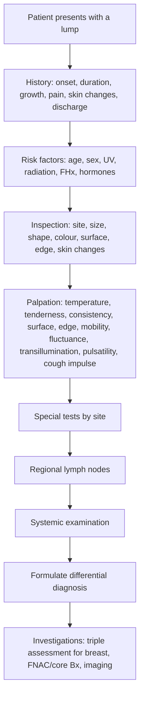

# Localized Lump

## Definition and Key Concepts

A **localized lump** (also called a mass, swelling, or nodule) refers to any discrete, palpable abnormality within the body tissues — whether it arises from skin, subcutaneous tissue, muscle, bone, or deeper organs. In clinical medicine, the assessment of a localized lump is one of the most fundamental skills, because the same systematic approach applies whether you're dealing with a lipoma on the forearm or a suspicious thyroid nodule.

The word "lump" itself is a lay term. Clinically, we refine it:
- **Nodule**: a solid lesion < 1 cm (some sources use < 2 cm)
- **Mass/lump**: a solid or cystic lesion ≥ 1–2 cm
- **Tumour** (from Latin *tumere* = "to swell"): technically means any swelling, but colloquially implies neoplasm

The critical clinical question is always: **Is this lump benign, malignant, or something else entirely (e.g., infective, vascular, congenital)?**

---

## Epidemiology and Risk Factors

The epidemiology of a localized lump depends entirely on the tissue of origin, site, and underlying pathology. However, some general principles apply:

### General Epidemiological Points
- **Lipoma** is the ***most common benign soft-tissue neoplasm*** [1][2] — occurs in ~2% of the population, most commonly ages 40–60 [2]
- **Sebaceous (epidermoid) cysts** are extremely common — the most common cutaneous cyst
- **Basal cell carcinoma (BCC)** is the ***most common skin cancer in Chinese*** [3]
- **Breast lumps** are the most common reason for referral to a surgical breast clinic — most are benign
- **Thyroid nodules** are palpable in ~5% of women and ~1% of men, but found incidentally on imaging in up to 50% [4]

### Risk Factors for Malignant Lumps (General Principles)

The risk factors vary by site and tissue, but key themes recur:

| Risk Factor Category | Examples | Mechanism |
|:---|:---|:---|
| **Age** | ↑ Age → ↑ risk of malignancy generally | Accumulation of somatic mutations over time |
| **Sex** | Male sex → thyroid nodules more likely malignant; Female → breast cancer | Hormonal and genetic differences |
| **UV/radiation** | Skin cancers (BCC, SCC, melanoma) | DNA damage (pyrimidine dimers), mutagenesis |
| **Chronic irritation/inflammation** | Marjolin's ulcer (SCC in chronic wound), scar cancer | Chronic regeneration → ↑ mitotic errors |
| **Immunosuppression** | Post-transplant → ↑ SCC, lymphoma, Kaposi sarcoma | Impaired immune surveillance |
| **Genetic syndromes** | Li-Fraumeni (TP53), FAP, MEN syndromes, BRCA1/2 | Loss of tumour suppressor or gain-of-function oncogene |
| **Chemical/toxin exposure** | Asbestos (mesothelioma), arsenic (skin cancers) | Direct carcinogenesis |
| **Hormonal** | Estrogen exposure → breast cancer | Mitogenic effect on breast epithelium |
| **Family history** | 1st-degree relative with same cancer → ↑ risk | Shared germline mutations + environment |

---

## Anatomy and Function Relevant to Localized Lumps

To properly assess a lump, you must understand the **layered anatomy** from superficial to deep. This dictates what the lump could be.

### Layers (Superficial to Deep)

```
Epidermis → Dermis → Subcutaneous fat → Deep fascia → Muscle → Bone/Periosteum → Body cavity
```

| Layer | Lumps Arising Here | Clinical Clue |
|:---|:---|:---|
| **Epidermis** | Wart (verruca), seborrhoeic keratosis, SCC-in-situ (Bowen's) | Moves with skin, cannot pinch skin separately from lump |
| **Dermis** | Dermatofibroma, BCC, SCC, melanoma, intradermal naevus | Attached to overlying skin, moves with skin pinch |
| **Subcutaneous** | Lipoma, epidermoid cyst, sebaceous cyst, neurofibroma | ***Not attached to overlying skin*** in most cases [1]; moves freely over deep structures |
| **Deep fascia** | Ganglion cyst (arises from joint capsule/tendon sheath) | Fixed to deep structures but skin moves over it |
| **Muscle** | Intramuscular lipoma, desmoid tumour, sarcoma | Becomes ***more prominent*** on muscle contraction (if superficial to muscle) or ***less mobile/harder to feel*** (if within muscle — the muscle "grips" it) |
| **Bone** | Osteochondroma, giant cell tumour, bone cyst | Rock-hard, immobile, attached to bone |
| **Vascular** | Haemangioma, AV malformation, aneurysm | Pulsatile, compressible, may have bruit/thrill |
| **Lymphatic** | Lymphadenopathy, lymphoma | Discrete, rubbery; distribution follows lymphatic drainage |

<Callout title="Why Does Muscle Contraction Help Localise a Lump?" type="idea">
If a lump is **superficial to muscle**, tensing the muscle pushes the lump forward → it becomes **more prominent and more mobile**. If the lump is **within or deep to muscle**, contraction of the muscle makes it **less mobile or disappear** — the muscle acts like a curtain being drawn over it. This is a classic examination trick.
</Callout>

### Site-Specific Anatomy

Different body regions have characteristic lumps because of the structures that pass through them:

- **Neck**: Thyroid, lymph nodes, branchial cyst, thyroglossal duct cyst, carotid body tumour [4]
- **Groin**: Inguinal/femoral hernia, lymph nodes, femoral artery aneurysm, saphenous varix, undescended testis [1]
- **Breast**: Fibroadenoma, cyst, carcinoma, fat necrosis, phyllodes tumour [5][6]
- **Axilla**: Lymph nodes, lipoma, abscess (hidradenitis suppurativa), accessory breast tissue

---

## Etiology

### Classification of Lumps by Pathological Nature

The causes of a localized lump can be systematized using a **surgical sieve** (the classic mnemonic for differential diagnosis). Here we focus on the *etiology* — i.e., what processes give rise to lumps:

#### A. Congenital / Developmental

| Condition | Pathophysiology |
|:---|:---|
| **Dermoid cyst** | ***Cystic teratoma formed in-utero during embryonic fusion*** — contains developmentally mature tissues (skin, hair, fat, sweat glands, teeth) [3]. Located along fusion lines (lateral eyebrow, anterior fontanelle, midline). Implantation dermoids arise from penetrating injury driving epidermal fragments into dermis. |
| **Thyroglossal duct cyst** | Failure of obliteration of the thyroglossal duct (which the thyroid gland descends through from the foramen caecum of the tongue to the anterior neck). Cyst forms anywhere along this tract. Classic sign: **moves upward on tongue protrusion** (because of attachment to hyoid bone via the tract). |
| **Branchial cyst** | Arises from remnants of the 2nd branchial cleft/arch. Typically presents as a painless lump at the anterior border of sternocleidomastoid in young adults. |
| **Preauricular sinus** | Failure of fusion of the auricular hillocks during ear development → small pit anterior to the tragus. |

#### B. Traumatic / Iatrogenic

| Condition | Pathophysiology |
|:---|:---|
| **Haematoma** | Blunt or penetrating trauma → vessel rupture → blood collection in tissues. Initially soft, later becomes firm as it organises. |
| ***Fat necrosis*** | ***Ischaemic necrosis of fat lobules*** — usually follows ***trauma or breast reconstruction*** (flap ischaemia) [5][7]. Saponification of fat triggers chronic low-grade inflammation. ***Can mimic carcinoma clinically (painless lump ± skin dimpling, nipple retraction)*** and ***radiologically*** [5][7]. |
| **Implantation dermoid** | Penetrating injury implants epidermal fragments into dermis → gradually forms a keratin-filled cyst [3] |
| **Foreign body granuloma** | Reaction to suture material, breast augmentation injections, splinters, etc. |

#### C. Infective / Inflammatory

| Condition | Pathophysiology |
|:---|:---|
| ***Abscess*** | ***Collection of pus within dermis or subcutaneous space*** [3]. Most commonly due to ***S. aureus (75%)*** [3]. Disruption of skin barrier allows bacterial entry → neutrophilic infiltration → tissue necrosis → walled-off pus collection. Clinically: ***painful, fluctuant, erythematous nodule ± surrounding cellulitis*** [3]. |
| ***Cellulitis*** | ***Inflammation of deeper dermis + subcutaneous fat*** due to bacterial infection (***β-haemolytic strep commonest, then S. aureus***) [3]. Not truly a "lump" but can present as a diffuse, tender, indurated swelling. |
| ***Mastitis*** | ***Infection of breast tissue, mostly due to S. aureus*** [5]. Commonest in ***lactational*** setting (***1st child***). Stasis of milk → bacterial colonisation → infection. Can progress to ***abscess (fluctuant mass, fever)*** [5]. |
| **Reactive lymphadenopathy** | Infection in drainage territory → antigen presentation in regional lymph node → follicular hyperplasia → palpable, tender, enlarged node. |
| **Tuberculous lymphadenitis** | *Particularly important in Hong Kong* — TB remains endemic. Presents as chronic, non-tender cervical lymphadenopathy ("cold abscess"), matted nodes, may form sinuses. |
| ***Pilonidal sinus*** | ***Infection & obstruction of hair follicle in intergluteal cleft → foreign body-type reaction → cavity formation*** [8]. RF: ***Caucasian male with coarse dark body hair (rare in HK)*, *prolonged sitting*, *increased sweating*** [8]. |

#### D. Neoplastic

This is the largest and most clinically important category. We subdivide into benign and malignant:

##### Benign Neoplasms

| Condition | Key Features | Pathophysiology |
|:---|:---|:---|
| ***Lipoma*** | ***Most common benign soft-tissue neoplasm*** [1][2]. Soft, mobile, ***+ve slip sign*** [2], ***not attached to overlying skin*** [1]. Slow growing, ***never regress***, ***rarely undergo malignant transformation into liposarcoma*** [2]. | ***Mature enlarged fat cells without atypia*** [2] enclosed by thin fibrous capsule that have become overactive and distended with fat [1]. |
| **Epidermoid cyst (sebaceous cyst)** | Most common cutaneous cyst. Has a ***punctum*** (tiny central pore). Contains keratin (cheesy, foul-smelling material). | Obstruction of hair follicle infundibulum → keratin accumulates within a cyst lined by stratified squamous epithelium. Despite the traditional name "sebaceous cyst," it does NOT arise from sebaceous glands. |
| ***Fibroadenoma*** | ***Most common*** benign breast tumour [5]. ***Well-defined rubbery mass, highly mobile*** ("breast mouse"), ***can be multiple & bilateral*** [5]. Reproductive age. | ***Proliferation of stromal & epithelial tissue of duct lobules*** [5]. Oestrogen-responsive — may enlarge during pregnancy and regress after menopause. |
| ***Intraductal papilloma*** | ***Benign breast lesion*** in ***perimenopausal*** women [5]. Presents with ***nipple discharge (bloody)*** [5]. | Papillary proliferation within a breast duct, usually in a major subareolar duct. Friable papillary fronds bleed easily → bloody nipple discharge. ***Multiple papillomas: increased risk of CA*** [5]. |
| **Neurofibroma** | Soft, pedunculated or sessile skin nodule. ***Button-hole sign*** (can be invaginated into subcutaneous tissue). Associated with NF1 (if multiple). | Proliferation of Schwann cells, fibroblasts, and perineural cells within peripheral nerve sheath. |
| ***Skin tag (acrochordon)*** | ***~50% of adults*** [3]. At ***sites of friction (axilla, neck, inframammary, inguinal)*** [3]. ***Pedunculated skin-colored lesions on narrow stalks*** [3]. | ***Outgrowth of normal skin*** [3]. Associated with ***obesity, diabetes mellitus, ↑ age, pregnancy*** [3]. |
| **Ganglion cyst** | Most common soft tissue tumour of the hand/wrist. Firm, transilluminant. Most commonly dorsal wrist (70%). | Mucinous degeneration of connective tissue adjacent to joint capsule or tendon sheath → accumulation of viscous fluid within a cyst. |
| ***Hepatic haemangioma*** | ***Most common benign liver tumour (3–20% population)*** [9]. Usually ***asymptomatic, found incidentally*** [9]. | ***Congenital vascular malformation, enlarges by ectasia (not hyperplastic)*** [9]. |

##### Malignant Neoplasms

| Condition | Key Features | Pathophysiology |
|:---|:---|:---|
| ***Basal cell carcinoma*** | ***Most common skin cancer in Chinese*** [3]. ***70% occur on the face*** (above earlobe–mouth corner line) [3]. ***Nodular (80%): pigmented nodule with telangiectasiae*** ± ***central ulceration → rodent ulcer*** [3]. ***Pigmented nodule common in Asians*** [3]. | Arises from basal layer keratinocytes. UV-induced mutations in the Hedgehog signalling pathway (PTCH1 tumour suppressor). Locally invasive but almost never metastasizes. |
| **Squamous cell carcinoma (SCC)** | More rapid growth, ***everted edge***, ***contact bleeding***, ***± lymph node involvement*** [3]. Can arise from premalignant lesions (actinic keratosis, Bowen's disease). | Malignant proliferation of keratinocytes. UV radiation → TP53 mutations → uncontrolled proliferation. Can metastasize to regional lymph nodes. |
| ***Melanoma*** | ***ABCDE criteria*** for suspicious moles. Subtypes: superficial spreading (most common overall), nodular, lentigo maligna, ***acral lentiginous (most common in dark-skinned individuals)*** [1]. | Malignant transformation of melanocytes. UV radiation → BRAF (V600E) or NRAS mutations → uncontrolled melanocyte proliferation. Vertical growth phase = capacity for metastasis. |
| ***Breast carcinoma*** | ***Breast mass: hard, irregular, fixed, non-tender, mostly at upper outer quadrant*** [5][6]. ***Nipple discharge (unilateral, single duct, bloody = ↑ risk)*** [5][6]. ***Skin: dimpling, peau d'orange, ulceration*** [5][6]. | Invasive ductal carcinoma (76% — most common) [5]. Malignant epithelial cells invade through basement membrane → spread via lymphatics (axillary nodes) and haematogenously. Peau d'orange = tumour invades dermal lymphatics → lymphatic obstruction → skin oedema tethered at hair follicle openings. |
| ***Thyroid carcinoma*** | ***Palpable neck lump, rapidly enlarging → pain, hoarseness, stridor*** [4][10]. ***Papillary (85%) — most common***, spreads via ***lymphatics (compartment VI first)*** [10]. | Depends on subtype. Papillary: RET/PTC rearrangements, BRAF V600E. Follicular: RAS mutations, PAX8-PPARγ. Medullary: ***RET proto-oncogene mutation*** [10], arises from ***parafollicular C cells*** [10]. |
| ***Phyllodes tumour*** | ***Fibroepithelial tumour*** in ***older age (>40)*** [5]. ***Smooth painless mass, mobile***. ***Can be malignant (metastasize via blood — ALND not required)*** [5]. | Stromal hypercellularity ± atypia. Classified as benign, borderline, or malignant based on stromal features. Unlike carcinoma, spreads haematogenously (not lymphatically). |
| **Soft tissue sarcoma** | Deep, firm, enlarging, painless mass. > 5 cm, deep to fascia, rapid growth = red flags. | Malignant mesenchymal cells. Multiple genetic drivers (e.g., MDM2 amplification in liposarcoma, SYT-SSX fusion in synovial sarcoma). |
| ***Lymphoma*** | Painless, rubbery lymphadenopathy. "B symptoms" (fever, night sweats, > 10% weight loss). | Malignant proliferation of lymphoid cells. Hodgkin: Reed-Sternberg cells. Non-Hodgkin: various B-cell or T-cell lineages. |

#### E. Vascular

| Condition | Pathophysiology |
|:---|:---|
| **Haemangioma (infantile)** | Benign endothelial cell proliferation → rapid growth phase (first year of life) → gradual involution. Most common tumour of infancy. |
| **Arteriovenous malformation** | Congenital abnormal connection between arteries and veins → high-flow lesion. Pulsatile, may have bruit/thrill. |
| **Femoral artery aneurysm** | Localised dilation of common femoral artery (> 1.5× normal diameter). Pulsatile, expansile mass in groin. |
| **Saphenous varix** | Dilation of the proximal long saphenous vein near the saphenofemoral junction. Soft, compressible, has a **cough impulse** (like hernia). Disappears on lying down. Blue tinge. Differentiating feature from hernia: **thrill on cough** rather than just an impulse. |

#### F. Degenerative / Metabolic

| Condition | Pathophysiology |
|:---|:---|
| **Ganglion** | Mucinous degeneration of periarticular connective tissue |
| **Gouty tophus** | Deposition of monosodium urate crystals in soft tissues (ear helix, fingers, toes, olecranon) in chronic gout |
| **Xanthoma** | Lipid-laden macrophage deposition in skin/tendons in hyperlipidaemia |
| **Calcinosis** | Calcium deposition in soft tissues (seen in scleroderma — CREST syndrome, dermatomyositis) |

#### G. Lymphatic Obstruction

| Condition | Pathophysiology |
|:---|:---|
| ***Lymphoedema*** | ***Obstruction of lymphatic drainage → oedema with high protein content*** [11]. Primary (Milroy's, Meige) or Secondary (***filariasis — MC worldwide; malignancy — MC in developed countries***) [11]. Clinically: ***pitting oedema initially → warty & thickened skin*** [11]. ***Stemmer sign: unable to lift skin of 2nd finger/toe*** [11]. |

<Callout title="Hong Kong Focus" type="idea">
In Hong Kong, pay special attention to:
- **Nasopharyngeal carcinoma (NPC)** presenting as a neck lump (cervical lymphadenopathy as first presentation in up to 40%)
- **TB lymphadenitis** — still prevalent
- **Hepatocellular carcinoma** — high hepatitis B prevalence → liver masses
- **Thyroid nodules/cancer** — thyroid cancer incidence is rising in HK, especially papillary type
- ***Breast carcinoma — 1st in incidence in HK females, median age 55 (younger than global data), lifetime risk 1:16*** [5][6]
- ***Lung cancer — 1st in mortality in HK*** [12]
</Callout>

---

## Relevant Classification Systems

### A. Classification by Nature (Surgical Sieve)

The **surgical sieve** is the standard framework — use the mnemonic **VITAMIN CD**:

| Letter | Category | Example |
|:---|:---|:---|
| **V** | Vascular | Aneurysm, haemangioma, varix |
| **I** | Infective/Inflammatory | Abscess, reactive LN, TB |
| **T** | Traumatic | Haematoma, fat necrosis |
| **A** | Autoimmune | Rheumatoid nodule, gouty tophus |
| **M** | Metabolic | Xanthoma, calcinosis |
| **I** | Iatrogenic | Post-surgical seroma, implant reaction |
| **N** | Neoplastic (benign/malignant) | Lipoma, carcinoma, sarcoma |
| **C** | Congenital | Dermoid cyst, branchial cyst |
| **D** | Degenerative | Ganglion, Baker's cyst |

### B. Classification by Layer/Depth

As discussed in the anatomy section — skin, subcutaneous, fascial, muscular, bony, or organ-related.

### C. Classification by Site

This is the most practical bedside approach:

| Site | Common Lumps |
|:---|:---|
| **Scalp** | Sebaceous cyst, lipoma, dermoid, BCC/SCC, pilar cyst |
| **Face** | BCC (medial canthus), SCC, sebaceous cyst, parotid tumour |
| ***Anterior neck*** | ***Thyroid enlargement, lymphadenopathy, skin lumps, branchial cyst, thyroglossal duct cyst*** [4] |
| **Posterior triangle of neck** | Lymph node (think NPC in HK!), cystic hygroma (children) |
| ***Breast*** | Fibroadenoma, cyst, carcinoma, phyllodes, fat necrosis [5] |
| **Axilla** | Lymph node, lipoma, hidradenitis suppurativa abscess |
| ***Groin*** | ***Inguinal hernia, femoral hernia, femoral artery aneurysm, saphenous varix, inguinal lymph node, lymphoma, lipoma, abscess, undescended testis, hydrocele*** [1] |
| **Limbs** | Lipoma, ganglion, neurofibroma, sarcoma |
| **Perianal** | Perianal abscess, skin tag, ***pilonidal sinus*** [8], haemorrhoids, ***anal carcinoma*** [8] |

### D. Benign vs. Malignant Features

This is the **most important clinical distinction** when assessing any lump:

| Feature | Benign | Malignant |
|:---|:---|:---|
| **Growth rate** | Slow, stable | Rapid or relentless |
| **Border** | Well-defined, smooth | Irregular, poorly defined |
| **Surface** | Smooth | Nodular, irregular |
| **Consistency** | Soft or rubbery | Hard ("stony hard") |
| **Tenderness** | May be tender | Usually non-tender (exception: inflammatory carcinoma) |
| **Mobility** | Freely mobile | Fixed to skin, muscle, or bone |
| **Skin changes** | None | Tethering, dimpling, peau d'orange, ulceration |
| **Lymph nodes** | Not involved | Regional lymphadenopathy |
| **Number** | Often solitary (but lipomas/neurofibromas can be multiple) | Solitary or multiple (metastatic) |

<Callout title="The 'Red Flag' Features of a Malignant Lump — Must Know!" type="error">
Remember these features that should raise suspicion for malignancy:
- **Rapid growth** (weeks to months)
- **Hard, irregular, non-tender**
- **Fixed** (to skin, deep structures, or both)
- **Overlying skin changes** (ulceration, dimpling, peau d'orange, satellite nodules)
- **Regional lymphadenopathy** (hard, non-tender, fixed nodes)
- **Size > 5 cm** (especially for soft tissue masses → think sarcoma)
- **Deep to deep fascia** (for limb lumps → sarcoma until proven otherwise)
- **Constitutional symptoms** (weight loss, fever, night sweats)
</Callout>

---

## Clinical Features

### A. History (Symptoms)

The history of a localized lump follows a systematic approach. Think of it as answering: **"What is this lump, and is it dangerous?"**

#### 1. Characteristics of the Lump Itself

| Question | Rationale / Pathophysiological Basis |
|:---|:---|
| **Onset**: When did you first notice it? Sudden or gradual? | Sudden onset → haematoma, abscess, cyst rupture. Gradual → neoplasm, cyst. ***Sudden ↑ size: anaplastic carcinoma, primary lymphoma, haemorrhage into necrotic nodule/cyst, subacute thyroiditis*** [4] |
| **Duration**: How long has it been there? | Long-standing (years) and stable → likely benign. Weeks to months and enlarging → concern for malignancy. |
| **Growth pattern**: Getting bigger, smaller, or staying the same? | Progressive growth over weeks-months, especially if ***firm/hard with fixation*** → malignant [4]. Fluctuating size → cyst (fills and empties) or inflammatory (waxes and wanes). |
| **Pain/tenderness** | Pain suggests inflammation, infection, nerve involvement, or haemorrhage into a lesion. Most malignant lumps are **painless** (exception: bone mets, inflammatory breast cancer). Pathophysiology: pain from stretching of capsule, pressure on nerves, or release of inflammatory mediators. |
| **Change in overlying skin** | Redness → inflammation/infection. Dimpling → tethering of Cooper's ligaments in breast (carcinoma pulling on ligamentous septae). Peau d'orange → dermal lymphatic obstruction by tumour. Ulceration → tumour outgrowing its blood supply or direct invasion through skin. |
| ***Cyclical changes*** | ***Important for breast lumps*** [6]: Cyclical mastalgia/nodularity → ***fibrocystic changes*** [5]. Non-cyclical, persistent mass → ↑ concern for carcinoma. |
| **Discharge** | ***Nipple discharge: colour? Consistency?*** [6]. ***Bloody, unilateral, single-duct → ↑ risk malignancy or intraductal papilloma*** [5][6]. Green/yellow → duct ectasia. Milky → galactorrhoea (prolactinoma, drugs). Wound discharge → infected cyst, abscess. |
| **Number**: Is this the only one? Any others? | Multiple lipomas → familial lipomatosis, Dercum's disease, Madelung's disease [1][2]. Multiple lymph nodes → lymphoma, metastatic disease, systemic infection. ***Contralateral breast lump: bilateral primary breast carcinoma common*** [6]. |

#### 2. Associated / Systemic Symptoms

| Symptom | Pathophysiological Basis |
|:---|:---|
| ***Constitutional symptoms: loss of appetite, loss of weight*** [6] | Malignancy → production of cytokines (TNF-α, IL-6) → cancer cachexia. ***Rarely found in early cancers*** [6]. |
| **Fever** | Infection (abscess, cellulitis). Lymphoma (B symptoms). Inflammatory breast cancer. |
| ***Metastatic symptoms: bone pain, SOB, epigastric discomfort*** [6] | Bone metastases → stretching of periosteum → pain. Lung/pleural mets → effusion → SOB. Liver mets → capsular stretch → RUQ/epigastric discomfort. ***Generally come earlier than constitutional symptoms*** [6]. |
| ***Compressive symptoms: dyspnoea, dysphagia, dysphonia*** [4] | For neck lumps — ***indicates rapid growth with invasion*** [4]. Dyspnoea = tracheal compression. Dysphagia = oesophageal compression. Dysphonia = ***recurrent laryngeal nerve (RLN) palsy*** [4]. |
| ***Thyrotoxic/hypothyroid symptoms*** [4] | If the lump is thyroid: ***Hyperthyroid: hyperactive, irritable, weight loss despite ↑ appetite, heat intolerance, ↑ sweating, diarrhoea, palpitations, tremor*** [4]. ***Hypothyroid: fatigue, weight gain but ↓ appetite, cold intolerance, constipation, bradycardia*** [4]. |
| **Skin-related symptoms** | Itch → dermatitis (Paget's disease of nipple), eczema. Pigment change → melanoma. |

#### 3. Risk Factor Enquiry (Site-Dependent)

***For breast lumps, specifically ask:*** [6]
- ***FHx: BRCA — any CA breast / ovary / prostate / pancreas*** [6]
- ***PMHx: breast disease (e.g. DCIS), breast RT*** [6]
- ***Estrogen exposure: age of menarche, age of menopause, parity, breastfeeding, use of COC/HRT*** [6]
- ***Previous breast augmentation by injection/surgery — symptoms may be sequelae*** [6]
- ***Smoking and alcohol intake*** [6]

***For thyroid lumps:*** [4]
- ***History of autoimmune diseases (T1DM, SLE, RA, pernicious anaemia)*** [4]
- ***History of cancer (metastasis, lymphoma, papillary CA a/w GI polyposis syndromes)*** [4]
- ***History of thyroid disease (longstanding MNG → lymphoma, previous Graves')*** [4]
- ***History of exposure to radiation (radiation thyroiditis and ↑ risk of papillary CA)*** [4] — ***ask about H&N cancer, esp NPC, thymoma*** [4]
- ***FHx of thyroid CA: ~20% of medullary CA (MEN II), ~5% of papillary CA*** [4]
- ***Smoking*** [4]

***For skin lumps:***
- UV exposure (BCC, SCC, melanoma)
- Immunosuppression (transplant, HIV)
- Previous skin cancer
- ***Xeroderma pigmentosum, Gorlin syndrome*** [3]
- ***Previous sebaceous naevus*** (precursor to BCC) [3]

---

### B. Physical Examination (Signs)

The examination of a lump is one of the most structured clinical skills in surgery. The approach is **inspection → palpation → special tests → regional examination → systemic examination**.

#### 1. Inspection

| Feature | What to Look For | Pathophysiological Basis |
|:---|:---|:---|
| **Site** | Anatomical region dictates differential | Structures present at that site (see anatomy section) |
| **Size** | Estimate in cm (two dimensions) | > 5 cm soft tissue mass = sarcoma until proven otherwise |
| **Shape** | Round, oval, multilobulated, irregular | Regular shape → benign (e.g. lipoma); Irregular → malignant |
| **Number** | Solitary vs multiple | Multiple → metastatic, syndromic (NF1, lipomatosis), lymphoma |
| **Colour** | Skin-coloured, red, blue/purple, pigmented | Red → inflamed/vascular. Blue → vascular (varix, haemangioma). Pigmented → melanocytic or BCC (in Asians) |
| ***Skin changes*** | ***Ulceration, dimpling, peau d'orange*** [6] | Ulcer: tumour outgrows blood supply. Dimpling: Cooper's ligament tethering. Peau d'orange: dermal lymphatic blockage. |
| **Surface** | Smooth, lobulated, irregular | Smooth → cyst or benign neoplasm. Irregular → malignancy |
| **Edge/margin** | Well-defined vs ill-defined | Well-defined → benign. Ill-defined → malignant (infiltrative growth) |
| ***Nipple changes (for breast)*** | ***5D: deviation, discolouration, dermatitis, depression (retraction), discharge*** [6] | Retraction: tumour pulls on subareolar ducts. Dermatitis: Paget's disease (intraepidermal spread of ductal carcinoma cells). |
| **Scars** | Previous surgery | Previous excision, lymph node biopsy [6] |
| **Special features** | ***Punctum*** (epidermoid cyst), ***sinus/pit*** (dermoid, pilonidal), pedunculated stalk (skin tag) | Punctum = blocked hair follicle infundibulum. Sinus = abnormal tract connecting cavity to surface. |

#### 2. Palpation

| Feature | Technique | Pathophysiological Basis |
|:---|:---|:---|
| **Temperature** | Dorsum of hand over lump | Warm → inflammation, infection, or highly vascular tumour |
| **Tenderness** | Gentle pressure | Tenderness → infection, inflammation, haemorrhage into cyst, nerve involvement |
| **Consistency** | Firm pressure, compare with known textures | **Soft** → lipoma (like normal fat), cyst. **Firm/rubbery** → fibroadenoma, lymph node. **Hard** → carcinoma, bone. **Stony hard** → calcified lesion, bone tumour. **Fluctuant** → fluid-filled (abscess, cyst). |
| **Surface** | Roll fingers over it | Smooth → benign. ***Nodular/irregular → malignant*** |
| **Edge/margin** | Try to get fingers around it | ***Well-defined → benign. Poorly-defined → malignant*** [4] |
| ***Mobility*** | Move lump in two planes; then tense underlying muscle and re-test | Freely mobile in all directions + ***slip sign*** → lipoma [2]. Mobile in all planes → subcutaneous. ***Fixed to skin: pinch skin — does it pucker?*** Carcinoma tethers to skin via Cooper's ligaments or direct invasion. ***Fixed to muscle: tense muscle — does mobility ↓?*** → deep invasion. |
| **Fluctuance** | Press on lump from one edge; feel at 90° for transmitted impulse | Positive = fluid-filled (cyst, abscess). Cross-fluctuance present in two perpendicular planes confirms fluid, not just soft tissue displacement. |
| **Transillumination** | Dark room, pen torch placed on one side | Positive (glowing red) → clear fluid (hydrocele, ganglion, cystic hygroma). Negative → solid or contains blood/pus. |
| **Pulsatility** | Palpate with fingertips | **Pulsatile + expansile** → aneurysm (true expansion in all directions). **Transmitted pulsation** → lump sits on a vessel but is not vascular itself. |
| **Compressibility** | Compress and release | Empties on compression, refills on release → vascular (venous malformation, varix, haemangioma). |
| ***Cough impulse*** | Ask patient to cough while palpating | Positive → hernia or saphenous varix. Cough → ↑ intra-abdominal pressure → impulse transmitted through defect (hernia) or incompetent valve (varix). |
| ***Reducibility*** | Gently press; does it go back? | Reducible → hernia (contents return to peritoneal cavity). Irreducible → incarcerated hernia, solid mass. |
| **Auscultation** | Stethoscope over lump | Bruit → AV malformation, aneurysm, vascular tumour. Bowel sounds → hernia containing bowel. |

<Callout title="The Slip Sign — Pathognomonic for Lipoma">
The **slip sign** (also called Cope's sign): when you press the edge of a lipoma, it slips away from under your fingers. This happens because the lipoma is ***a smooth, encapsulated mass of mature fat cells*** [2] sitting in loose subcutaneous tissue. It is freely mobile in all directions because it is not attached to surrounding structures by anything other than its thin fibrous capsule.
</Callout>

#### 3. Special Tests by Site

| Site | Test | What It Tells You |
|:---|:---|:---|
| **Neck lump** | **Move on swallowing** → thyroid or nearby structure moves with laryngeal elevator. **Move on tongue protrusion** → thyroglossal duct cyst (attached to hyoid via thyroglossal tract). | Swallowing → larynx moves up → pretracheal fascia encases thyroid → thyroid moves up. Tongue protrusion → hyoid is pulled up by geniohyoid/hyoglossus → thyroglossal cyst moves up. |
| ***Breast*** | ***Palpation: start from normal side. Comment on: site, size, shape, border, surface, consistency, tenderness, mobility (skin & muscle). Include axillary tail.*** [6] | Systematic approach ensures no pathology is missed. Testing fixation to pectoralis (tense the muscle by pressing hands on hips). |
| ***Axillary LN*** | ***Groups: anterior, posterior, medial, lateral, apical. Comment: number, site, size, consistency, tenderness, fixation*** [6] | Axillary lymph nodes drain the breast, upper limb, and chest wall. Matted/fixed nodes suggest malignant infiltration. |
| **Groin** | **Get above it** → can you get above the lump? No → inguinal hernia (extends from above inguinal canal). Yes → femoral hernia, lymph node, etc. | The inguinal canal passes through the abdominal wall above the inguinal ligament. A hernia emerges from within it → you cannot palpate above it. A lymph node or femoral hernia sits below the inguinal ligament → you can get above it. |
| **Limb** | Test mobility with joint in different positions. Tense overlying muscle. | Ganglion: less mobile when tendons taut. Sarcoma: less mobile when overlying muscle contracted (if intramuscular/deep). |

#### 4. Regional Examination

Always examine the **regional lymph nodes** draining the area of the lump — this is essential for cancer staging:

| Lump Site | Regional Lymph Nodes |
|:---|:---|
| Scalp/face | Pre-auricular, post-auricular, submental, submandibular, cervical chain |
| Neck/thyroid | Cervical nodes (levels I–VI), supraclavicular |
| Breast | Axillary (anterior, posterior, medial, lateral, apical), supraclavicular, internal mammary |
| Upper limb | Epitrochlear, axillary |
| Lower limb | Popliteal, inguinal |
| Groin | Inguinal, iliac |
| Perianal | Inguinal (below dentate line → superficial inguinal via pudendal drainage) |

#### 5. Systemic Examination

Complete the assessment with:
- **Other lumps elsewhere**: Ask and examine — multiple lumps may suggest metastatic disease, lymphoma, or a syndromic condition (NF1, lipomatosis)
- ***Metastatic disease workup***: For suspected malignancy — ***bone pain (bone mets), SOB (lung mets/pleural effusion), jaundice/abdominal pain (liver mets)*** [6]
- **General condition**: Cachexia, pallor, jaundice — signs of advanced malignancy

---

## Summary of Clinical Approach to a Localized Lump



<Callout title="High Yield Summary">

**Key Points for Exam:**

1. **Systematic approach** to any lump: History → Inspection → Palpation → Special tests → Regional LN → Systemic
2. ***Lipoma = most common benign soft tissue neoplasm*** — soft, mobile, slip sign positive, subcutaneous, not attached to skin
3. ***BCC = most common skin cancer in Chinese*** — face (medial canthus), pigmented in Asians, rodent ulcer, locally invasive but almost never metastasizes
4. ***Fibroadenoma = most common benign breast tumour*** — rubbery, highly mobile "breast mouse", reproductive age
5. **Benign vs malignant features**: Benign = well-defined, smooth, soft/rubbery, mobile, slow-growing. Malignant = hard, irregular, fixed, non-tender, rapid growth, skin changes, LN involvement
6. ***Red flags***: rapid growth, > 5 cm, deep to fascia, hard/irregular, fixed, skin changes (dimpling, peau d'orange, ulceration), LN, constitutional symptoms
7. ***Breast triple assessment***: clinical + radiological + pathological — ***must know*** for exam
8. ***Breast risk factors***: ↑ oestrogen (early menarche, late menopause, nulliparity, no breastfeeding, COC/HRT), FHx (BRCA), previous breast pathology, radiation, lifestyle
9. ***Thyroid lump red flags for malignancy***: male, age < 14 or > 70, solitary nodule, firm/hard, fixed, pressure symptoms/RLN palsy, cervical LN, neck irradiation, FHx thyroid CA
10. **Layer determines differential**: always think which tissue layer the lump arises from based on mobility testing
11. ***For neck lumps, DDx includes***: thyroid enlargement, lymphadenopathy, skin lumps, branchial cyst, thyroglossal duct cyst
12. ***Fat necrosis can mimic breast carcinoma clinically AND radiologically*** — always ask about trauma history or breast procedures

</Callout>

---

<ActiveRecallQuiz
  title="Active Recall - Localized Lump"
  items={[
    {
      question: "What is the most common benign soft tissue neoplasm? Describe its key clinical features on examination.",
      markscheme: "Lipoma. Key features: subcutaneous, NOT attached to overlying skin, soft, mobile in all directions, positive slip sign, lobulated surface, non-tender. Consists of mature fat cells enclosed by thin fibrous capsule. Rarely undergoes malignant transformation."
    },
    {
      question: "How do you determine whether a lump is superficial to or within/deep to a muscle? What is the clinical test and rationale?",
      markscheme: "Tense the underlying muscle (e.g. ask patient to press hands on hips for pectoralis). If lump is SUPERFICIAL to muscle, it becomes MORE prominent and MORE mobile on contraction. If lump is WITHIN or DEEP to muscle, it becomes LESS mobile or harder to feel because the contracting muscle grips or covers it."
    },
    {
      question: "Name 5 red flag features that suggest a localized lump is malignant rather than benign.",
      markscheme: "Any 5 of: rapid growth, hard consistency, irregular or poorly-defined borders, fixed to skin or deep structures, non-tender, overlying skin changes (ulceration, dimpling, peau d'orange), regional lymphadenopathy, size more than 5 cm, deep to fascia, constitutional symptoms (weight loss, night sweats)."
    },
    {
      question: "A 35-year-old woman presents with a painless breast lump with skin dimpling. She had breast reconstruction surgery 6 months ago. What diagnosis should you consider and why is it important?",
      markscheme: "Fat necrosis. Follows trauma or breast reconstruction (due to flap ischaemia). Causes ischaemic necrosis of fat lobules with saponification. Important because it can mimic breast carcinoma both clinically (painless lump with skin dimpling, nipple retraction) and radiologically. Must biopsy to rule out carcinoma."
    },
    {
      question: "List the clinical features suggesting increased risk of malignancy in a thyroid nodule (at least 5 features).",
      markscheme: "Male sex. Age less than 14 or more than 70. Solitary or dominant nodule. Slow progressive growth over weeks to months. Firm or hard consistency. Fixation to surrounding tissues. Pressure symptoms or RLN palsy (dysphagia, dyspnoea, hoarseness). Cervical lymphadenopathy especially level VI. History of neck irradiation. Family history of thyroid CA especially medullary and MEN2."
    },
    {
      question: "What is the significance of a positive cough impulse on examination of a groin lump? Name two conditions that can produce this sign.",
      markscheme: "A positive cough impulse means that raised intra-abdominal pressure (from coughing) is transmitted to the lump, causing it to expand or become more prominent. Two conditions: (1) Inguinal or femoral hernia - intra-abdominal contents pushed through the defect. (2) Saphenous varix - incompetent saphenofemoral valve allows retrograde transmission of pressure. Differentiate by presence of thrill on cough (varix) vs impulse only (hernia)."
    }
  ]}
/>

---

## References

[1] Senior notes: felixlai.md (Lipoma section, Hernia section)
[2] Senior notes: Ryan Ho Rheumatology.pdf (Section 5.5.1 Lipoma, p169)
[3] Senior notes: Ryan Ho Rheumatology.pdf (Sections 4.3.1.3 SSTIs p135, 5.4.2 Acrochordon p167, 5.4.3 Dermoid cyst p168, 6.2.2 BCC pp189-190, 6.1.2 Precursor of BCC p182)
[4] Senior notes: Ryan Ho Endocrine.pdf (pp18, 38 — Thyroid Hx, thyroid cancer)
[5] Senior notes: maxim.md (Sections 8.3–8.6 Breast assessment, benign and malignant breast disease)
[6] Senior notes: Ryan Ho Fundamentals.pdf (p371 — Breast lump history taking); Ryan Ho Urogenital.pdf (p205 — Carcinoma of breast)
[7] Senior notes: Ryan Ho Urogenital.pdf (p200 — Fat necrosis)
[8] Senior notes: maxim.md (Pilonidal sinus section)
[9] Senior notes: Ryan Ho GI.pdf (p259 — Hepatic haemangioma)
[10] Senior notes: maxim.md (Thyroid cancer section); Ryan Ho Endocrine.pdf (p38 — Other thyroid cancers)
[11] Senior notes: maxim.md (Section 4.6 Lymphoedema)
[12] Senior notes: Ryan Ho Respiratory.pdf (p141 — Lung cancer epidemiology)
