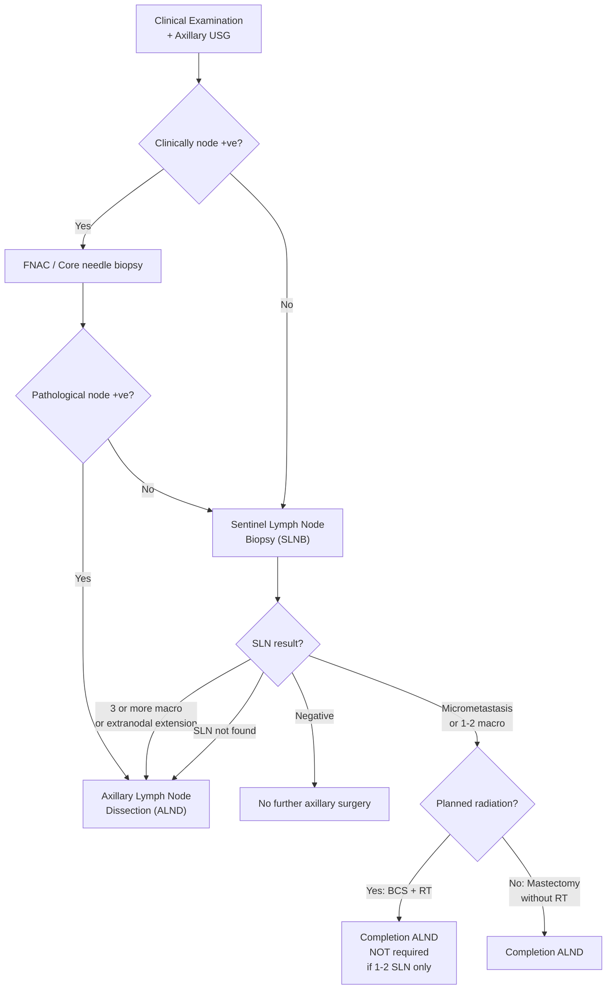
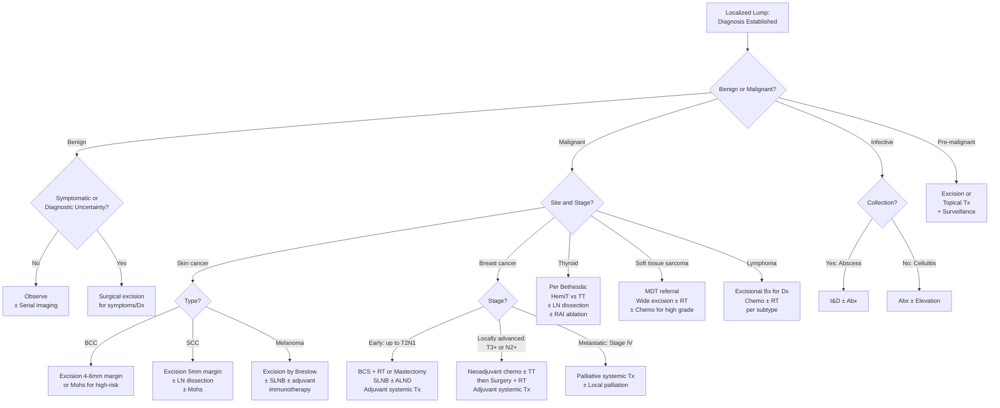

## Management of Localized Lumps

The management of a localized lump depends on three fundamental questions:

1. **What is it?** (Diagnosis — from the previous sections)
2. **Is it benign or malignant?**
3. **What does it need — observation, excision, or multimodal treatment?**

The guiding principle is: **benign lumps are treated for symptoms or diagnostic uncertainty; malignant lumps are treated for cure or palliation**. Let's walk through this systematically, organised by pathology type and then by site-specific algorithms.

---

## General Principles of Management

### A. Observation (Conservative / Watchful Waiting)

Not every lump needs excision. Many benign lumps can be safely observed if:
- The diagnosis is clinically confident (e.g., classic lipoma with slip sign, small fibroadenoma in a young woman)
- The patient is asymptomatic
- There are no features of concern (no red flags for malignancy)
- The patient understands the diagnosis and will return if changes occur

**Examples where observation is appropriate**:
- ***Asymptomatic lipoma can be observed*** [1][9]
- Small fibroadenoma ( < 2 cm) in a young woman with concordant triple assessment [4]
- ***Ganglion cyst: observe with brace → ~50% spontaneous resolution*** [10]
- BI-RADS 2–3 breast lesions (reassurance or 6-month follow-up) [14]
- Benign thyroid nodule (Bethesda II) — clinical follow-up [16]
- ***Seborrhoeic keratosis: usually not required since they are benign and slow-growing. Indicated when symptomatic or cosmetic reasons*** [2]

### B. Excision (Surgical Removal)

The most common definitive treatment for localised lumps. The key questions are:
- **Why?** Symptomatic relief, diagnostic confirmation, cosmesis, or oncological cure
- **How wide?** Depends on pathology — benign = enucleation/marginal excision; malignant = excision with defined margins
- **How urgent?** Malignant = urgent/soon; benign = elective

### C. Multimodal Treatment (Surgery + Adjuvant Therapies)

For malignant lumps, surgery alone is often insufficient. Adjuvant therapies (chemotherapy, radiotherapy, hormonal therapy, targeted therapy) address microscopic residual disease, regional/distant spread, and reduce recurrence risk. The specific regimen depends on the tumour type, stage, and molecular profile.

---

## Management by Pathology Type

### 1. Benign Soft Tissue Lumps

#### Lipoma

***Treatment*** [9]:
- ***Surgical excision of the fat cells and fibrous capsule***
  - ***Indications: pain, cosmesis or concerns over diagnosis*** [9]
  - ***Complications: scarring, seroma, haematoma*** [9]
- ***Alternatives: liposuction, injection with low concentration deoxycholate*** [9]
- Asymptomatic lipoma: observe
- ***Large in size > 5 cm or rapidly growing tumours*** → excise (sarcomatous change is more likely in ***size > 5 cm or rapidly growing mass***, ***intramuscular (thigh/shoulder) or retroperitoneal*** location) [1]

**Why excise large or intramuscular lipomas?** Because sarcomatous elements occur in < 1% of lipomas overall, but the risk is disproportionately concentrated in large ( > 5 cm), rapidly growing, or deep-seated (intramuscular/retroperitoneal) lesions [1]. You need the full specimen to histologically exclude liposarcoma.

#### Epidermoid Cyst (Sebaceous Cyst)

- **If asymptomatic**: can observe
- **If symptomatic** (recurrent infection, cosmesis, diagnostic uncertainty): surgical excision
  - Must excise the **entire cyst wall** including the punctum — if the wall is left behind, it will recur
  - If currently infected: either incise and drain first (let inflammation settle) then excise later, OR excise acutely with antibiotics
- **Why complete excision?** The cyst wall is lined by stratified squamous epithelium that continues to produce keratin. Incomplete removal leaves behind epithelial cells that will reform the cyst.

#### Ganglion Cyst

***Management*** [10]:
- ***Non-surgical (1st line)***:
  - ***Observation with brace → ~50% spontaneous resolution***
  - ***Needle aspiration → up to 50% recurrence within a year***
- ***Surgical excision of cyst and stalk if persistent or recurrent***
  - ***Complications: wound complications, recurrence (up to 50%), injury to neighbouring structures***

**Why does ganglion aspiration have high recurrence?** Because aspiration removes the gelatinous fluid but leaves the cyst wall and the stalk (the communication with the joint capsule/tendon sheath) intact. The cyst refills through the stalk. Complete excision of both the cyst and its stalk is needed to prevent recurrence.

#### Dermoid Cyst

- ***Treatment: surgical excision*** [7]
- ***Must do neuroimaging (MRI) to rule out CNS connections*** before excising nasal or midline dermoid cysts (***1/4 of nasal/midline dermoid cysts associated with CNS connection***) [7]

#### Skin Tags (Acrochordon)

- ***Treatment: mainly for cosmetic concerns*** [3]
  - ***Surgical removal ± local anaesthesia: removal by forceps and fine-grade scissors, cryosurgery with liquid nitrogen, electrodesiccation*** [3]

#### Pyogenic Granuloma

- ***Treatment is recommended due to ↑↑ bleeding risk despite tendency to regress spontaneously*** [12]
- ***Excision (1st line): surgery, electrocautery, laser therapy*** [12]
- ***Conservative: observe ± topical imiquimod, topical phenol (for periungual lesions)*** [12]

---

### 2. Benign Breast Lumps

| Condition | Management | Rationale |
|:---|:---|:---|
| ***Fibroadenoma*** | ***Observation. Surgical excision: if symptomatic or > 2 cm*** [4] | Benign, oestrogen-responsive. May regress post-menopause. Excise if large (to exclude phyllodes) or symptomatic. |
| ***Breast cyst*** | ***Reassurance. Aspiration. Surgery if recur or solid component present*** [4] | Aspiration is both diagnostic and therapeutic. ***Cytology only if: blood-stained aspirate, recur, radiologically suspicious*** [4] |
| ***Fibrocystic changes*** | ***Avoid caffeine. Evening primrose oil. Analgesics. COC*** [4] | Hormonal modulation to reduce oestrogen dominance. Caffeine may worsen breast pain (methyl-xanthine hypothesis). |
| ***Intraductal papilloma*** | ***Surgical excision (microdochectomy / major duct excision)*** [4] | Remove the affected duct to stop bloody discharge and rule out associated carcinoma. |
| ***Phyllodes tumour*** | ***Wide local excision with margin of at least 1 cm (mastectomy if adequate margin cannot be achieved)*** [4] | Margin of ≥ 1 cm required because phyllodes tumours have a leaf-like growth pattern with pseudopod-like extensions that can be missed with narrow margins. ***Can be malignant (metastasize via blood — ALND not required)*** [4] |
| ***Fat necrosis*** | ***Reassurance. Analgesics*** [4]. ***Should be biopsied to rule out carcinoma*** [5] | Self-limiting. But must biopsy because it mimics carcinoma clinically and radiologically. |
| ***Mastitis*** | ***Continue breastfeeding using the affected breast. Analgesics. Antibiotics (cloxacillin). Abscess: USG-guided aspiration or I&D (if necrotic skin)*** [4] | Continued breastfeeding prevents milk stasis → reduces bacterial growth medium. Cloxacillin covers ***S. aureus*** (most common cause). |
| ***Ductal ectasia*** | ***Conservative. Abscess: as above. Microdochectomy if persist*** [4] | Subareolar duct inflammation and fibrosis. Surgery only if persistent nipple discharge or abscess formation. |
| ***Mondor's disease*** | ***Reassurance. Analgesics (e.g. NSAID). Warm compression*** [4] | Self-limiting ***superficial sclerosing thrombophlebitis*** [4]. Resolves in weeks. |

***General indications for breast surgery for benign breast lumps*** [5]:
- ***Patient choice: symptomatic, large size (cosmesis)***
- ***Discordance in triple assessment, e.g. clinico-radiological discordance***

---

### 3. Skin Cancers

#### Basal Cell Carcinoma (BCC)

***Approach / treatment*** [6]:
- ***Take biopsy at ulcer edge (incisional / punch)*** [6]
- ***Excision with 0.5 cm margin ± reconstruction*** [6]

More detailed management:
- **Local treatment** [3]:
  - ***Surgical excision (1st line)***: ***simple excision with 4–6 mm margin (if low risk), with complete margin assessment (CCPDMA) (if high risk)*** [3]
  - ***Mohs micrographic surgery***: ***specimens cut in horizontal section to allow evaluation of entire peripheral + deep margins → done for higher risk lesions*** [3] — used for recurrent BCC, high-risk locations (periorbital, nose, ears), sclerosing/morphoeaform subtype
  - ***Non-surgical treatment if C/I to surgery***: ***Low-risk: curettage and electrodesiccation (C&E), cryotherapy. High-risk: RT*** [3]
- ***Locally advanced: excision + lymph node excision + adjuvant RT ± cisplatin-based chemo if +ve margin*** [3]
- ***Metastatic: chemoTx or targeted Tx (EGFR inhibitor)*** [3] — or Hedgehog pathway inhibitor (vismodegib/sonidegib) for locally advanced or metastatic BCC that is not amenable to surgery/RT

**Why is Mohs micrographic surgery superior for high-risk BCCs?** Standard excision with vertical sectioning only samples a fraction of the margin. Mohs cuts the specimen in horizontal sections, allowing the surgeon to map 100% of the peripheral and deep margins. If tumour is found at any margin, another layer is taken from that exact location. This achieves the highest cure rate (~99%) while preserving maximal tissue — critical in cosmetically sensitive areas like the face.

#### Squamous Cell Carcinoma (SCC)

***Approach / treatment*** [6]:
- ***Take biopsy at ulcer edge (incisional / punch)*** [6]
- ***Excision with 0.5 cm margin ± LN dissection*** [6]
- ***Mohs staged chemosurgery for high risk / delicate sites*** [6]

Locoregional and systemic workup:
- ***Locoregional evaluation: examine skin around tumour for additional papules or nodules, palpate along lymphatic drainage pathways ± FNAB of any enlarged LN, regional CT/MRI if +ve FNA*** [6]
- ***Systemic evaluation: CT, MRI, PET-CT*** [6] — for high-risk SCC with nodal involvement or distant metastatic risk

#### Melanoma

Management is stage-dependent:
1. **Excision with margin determined by Breslow thickness**:
   - In-situ: 5 mm margin
   - ≤ 1 mm: 1 cm margin
   - 1.01–2 mm: 1–2 cm margin
   - > 2 mm: 2 cm margin
2. **Sentinel lymph node biopsy (SLNB)**: for lesions > 0.8 mm Breslow thickness or with ulceration
3. **Completion lymph node dissection**: if SLNB positive (controversial — current trials suggest observation with USG surveillance may be equivalent)
4. **Adjuvant therapy**: checkpoint immunotherapy (anti-PD1: nivolumab/pembrolizumab) or targeted therapy (BRAF + MEK inhibitors: dabrafenib + trametinib for BRAF V600E mutant) for stage III–IV
5. **Metastatic disease**: immunotherapy ± targeted therapy ± palliative RT

**Why does Breslow thickness determine margin width?** Breslow thickness measures the vertical depth of tumour invasion from the granular layer to the deepest tumour cell. Thicker tumours have a higher probability of microscopic satellite lesions in the surrounding skin. Wider margins are needed to ensure these satellites are captured within the excision specimen.

#### Bowen's Disease (SCC-in-situ)

- ***Treatment*** [3]:
  - ***Non-surgical: topical 5FU/imiquimod, photodynamic therapy (PDT)***
  - ***Surgical excision with safety margin***
- ***Prognosis: ~3–5% progress to SCC. Excellent prognosis if treated*** [3]

---

### 4. Breast Carcinoma — The Major Algorithm

This is the highest-yield management algorithm for localized lumps in clinical exams.

#### Overview of Approach

***Approach to management of invasive breast cancer: multidisciplinary treatment (MDT) approach*** [5][25]:

| ***Stage*** | ***Local Therapy*** | ***Regional Therapy*** | ***Systemic Therapy*** |
|:---|:---|:---|:---|
| ***Early stage (≤ T2N1)*** | ***BCT or mastectomy ± RT*** | ***SLNB (if cN0) or ALND (if cN1 or SLNB+) ± adjuvant RT*** | ***Adjuvant chemo/TT/hormonal for most patients*** |
| ***Locally advanced (T3 or N2+)*** | ***BCT or mastectomy ± RT (after neoadjuvant)*** | ***ALND ± adjuvant RT*** | ***Neoadjuvant chemo ± TT then adjuvant*** |
| ***Metastatic (stage IV)*** | ***Palliative local Tx*** | — | ***Palliative systemic Tx*** |

[25]

#### A. Local Therapy: Breast Surgery

##### Breast-Conserving Therapy (BCT) = BCS + Adjuvant RT

***BCT = wide local excision / lumpectomy + post-operative irradiation*** [26]

***Requires complete surgical removal of tumour with negative surgical margins and adjuvant radiotherapy is COMPULSORY in BCT to eliminate subclinical foci of disease in ipsilateral breast*** [26]

***Negative margins defined by "no ink on tumour"*** [27] — ***wider margin does not reduce recurrence / survival since there will be breast RT*** [27]. ***Positive margin (ink on tumour): > 2× increase in ipsilateral breast tumour recurrence (IBTR)*** [27]

***Selection criteria*** [26]:
- ***< T2 stage (tumour size ≤ 5 cm) without chest wall or skin involvement***
- ***Appropriate tumour size-to-breast ratio***
- ***Tumour is not multicentric***
- ***Absence of metastasis***
- ***Patient MUST agree to post-operative radiotherapy***

***Contraindications (must know!)*** [27]:
- ***C/I to BCS***:
  - ***Multicentric disease (≥ 2 primary tumours in separate quadrants)***
  - ***High tumour-breast ratio > 20%*** (can be downstaged by neoadjuvant chemo)
  - ***Tumour too close to NAC***
  - ***Persistent +ve resection margin***
  - ***Presence of diffuse malignant-appearing calcifications on imaging***
  - ***Inflammatory breast cancer***
- ***C/I to RT***:
  - ***Hx of RT to affected chest wall / breast***
  - ***Pregnancy***
  - ***Connective tissue disease (e.g. scleroderma, Sjögren's disease — poor skin healing, causing fistula formation)***
- ***Patient choice (e.g. refuse adjuvant RT)***
- ***Prophylactic mastectomy (e.g. BRCA carrier)***

**Why is RT compulsory after BCS?** Because BCS deliberately leaves behind breast tissue to preserve cosmesis. Microscopic foci of carcinoma may remain in the residual breast tissue (up to 40% of cases have occult disease in the remaining breast). RT eliminates these subclinical deposits, reducing local recurrence from ~40% to ~5–10%.

##### Mastectomy

***Indications: C/I to BCS*** [27]

| ***Type*** | ***Features*** | ***Indications*** | ***Contraindications*** |
|:---|:---|:---|:---|
| ***Simple mastectomy*** | ***Removal of breast tissue, preservation of axillary contents and pectoral muscles*** [26] | ***Clinically node –ve → SLNB should be performed*** [26] | — |
| ***Skin-sparing mastectomy*** | ***Preservation of overlying skin and inframammary fold → more natural shape*** [26] | ***Therapeutic mastectomy with immediate reconstruction (DCIS, Stage I–III). Prophylactic mastectomy*** [26] | ***Inflammatory breast cancer (cancer cell invasion of dermal lymphatics)*** [26] |
| ***Nipple-areolar sparing mastectomy*** | ***Preservation of dermis and epidermis of nipple but removal of major ducts*** [26] | ***Small-to-moderate breasts with minimal ptosis. Tumour < 2 cm with tumour-to-NAC distance > 2 cm. Prophylactic*** [26] | ***Inflammatory breast cancer. Paget's disease of nipple. Nipple changes or discharge*** [26] |
| ***Modified radical mastectomy (MRM)*** | ***Whole breast + overlying skin + axillary LN (level I + II)*** [27] | ***Clinically +ve LN*** | — |

***Drains: Jackson-Pratt drain (closed suction) ± 2nd drain at axilla if MRM → remove drains if output < 30 mL/day × 2 days*** [27]

***Complications of mastectomy*** [27][25]:
- ***Seroma, haematoma, wound infection***
- ***Skin flap / NAC necrosis (if reconstruction)***
- ***Arm morbidities: arm or shoulder pain, numbness, frozen shoulder***
- ***Phantom breast syndrome: altered chest wall sensation, might persist years after surgery***
- ***Post-mastectomy pain syndrome: up to 50%, often neuropathic*** [25]

##### Breast Reconstruction

- ***Immediate vs delayed reconstruction*** [26]:
  - ***Immediate reconstruction: superior cosmetic results, reduced surgical costs, reduced psychosocial impact, spares patient from another surgery***
  - ***Delayed reconstruction: indicated in patients requiring post-operative radiotherapy*** (RT damages flap/implant → poorer cosmetic outcome)
- Options:
  - Implant-based (silicone/saline): one-stage or two-stage (tissue expander then implant)
  - Autologous tissue flap: TRAM flap, DIEP flap, latissimus dorsi flap

#### B. Regional Therapy: Axillary Management

[26][27][28]

##### Sentinel Lymph Node Biopsy (SLNB)

***SLNB: minimally invasive procedure designed to accurately stage cancers*** [23]

***Indications*** [26][28]:
- ***Early breast cancer with clinically –ve nodes (T1 or T2)***
- ***DCIS with planned mastectomy*** (because lymphatic drainage permanently altered after mastectomy → ***impossible to accurately perform SLNB later if invasive cancer found unexpectedly in mastectomy specimen***) [26]
- ***DCIS with suspicious features*** ( > 5 cm, palpable mass) [26]

***Contraindications*** [26]:
- ***Absolute: clinically +ve nodes (should be treated with ALND). Inflammatory breast cancer (T4d)***
- ***Relative: tumour size > 5 cm (T3). Tumour with chest wall or skin involvement (T4a–c). Previous breast or axillary procedures (disruption of lymphatic drainage → ↑ FN rate)***

***Technique*** [28]:
- ***Dual tracer injection***:
  - ***Technetium-99m-labelled albumin: injected day before OT, C/I in pregnancy***
  - ***Methylene blue: injected intra-op for direct visualisation***
- ***Remove max 3–4 sentinel LN*** [28]
- ***Injection should not be close to axilla (avoid interference), and lateral to previous scars (may block lymphatic drainage)*** [28]

***Results*** [28]:

| ***Finding*** | ***Action*** |
|:---|:---|
| ***No metastasis*** | ***NO NEED axillary dissection*** |
| ***Micrometastasis (≤ 2 mm)*** | ***NO NEED axillary dissection*** |
| ***Macrometastasis ( > 2 mm) × 1–2 LN*** | ***Controversial — if BCS + RT planned, completion ALND NOT required*** |
| ***Macrometastasis ( > 2 mm) × ≥ 3 LN*** | ***Axillary dissection*** |
| ***Extra-nodal extension*** | ***Axillary dissection*** |
| ***Sentinel LN not found*** | ***Axillary dissection*** |

##### Axillary Lymph Node Dissection (ALND)

***Indications*** [28][29]:
- ***Clinically +ve LN (by palpation / USG axilla)***
- ***+ve sentinel LN (per algorithm above)***
- ***Inflammatory CA breast (T4d)***

***Extent***: ***Routine: Level I (lateral to pec minor) + Level II (deep to pec minor)*** [29][28]
- ***Level III is NOT indicated unless grossly positive: ↑ morbidity without ↑ survival*** [28]

***Complications: 4 nerves*** [28]:
- ***Seroma (lymphatics)***
- ***Long thoracic nerve injury (winged scapula)*** — serratus anterior paralysis → scapula protrudes when pushing against wall
- ***Thoracodorsal nerve injury (latissimus dorsi: weak adduction & IR of shoulder)***
- ***Medial pectoral nerve injury (pec major)***
- ***Intercostobrachial nerve injury (paraesthesia of axilla, medial arm & lateral chest wall)***
- ***UL lymphoedema: Mx — pneumatic compression device***
- ***UL lymphangiosarcoma (Stewart-Treves syndrome)*** — rare late complication of chronic lymphoedema

<Callout title="ALND Nerve Injuries — Must-Know Mnemonic" type="idea">
**"LTIM"** — the 4 nerves at risk during ALND:
- **L**ong thoracic nerve → serratus anterior → winged scapula
- **T**horacodorsal nerve → latissimus dorsi → weak adduction/internal rotation
- **I**ntercostobrachial nerve → sensory → paraesthesia medial arm/axilla
- **M**edial pectoral nerve → pectoralis major → weak adduction/flexion of shoulder

The long thoracic nerve runs on the chest wall surface of serratus anterior → easily damaged if dissection goes too far posteriorly. The thoracodorsal nerve runs with its artery and vein as a bundle → should be identified and preserved.
</Callout>

#### C. Systemic Therapy

| ***Therapy Type*** | ***Target*** | ***Agents*** | ***Indication*** |
|:---|:---|:---|:---|
| ***Chemotherapy*** | Rapidly dividing cells | Anthracyclines (doxorubicin), taxanes (paclitaxel/docetaxel), cyclophosphamide | Most invasive cancers; neoadjuvant for locally advanced; adjuvant for high-risk early stage |
| ***Hormonal therapy*** | ER/PR+ tumours | ***SERMs (tamoxifen), aromatase inhibitors (AI), ovarian ablation*** [25] | ***ER/PR+ tumours*** — tamoxifen for pre-menopausal, AI for post-menopausal |
| ***Targeted therapy*** | HER2+ tumours | ***Herceptin (trastuzumab), Tykerb (lapatinib), pertuzumab*** [25] | ***HER2+ tumours*** |
| ***Novel agents*** | Various | ***PARP inhibitor (BRCA-mutant), mTOR inhibitor, CDK4/6 inhibitor*** [25] | Specific molecular subtypes; metastatic disease |

***Neoadjuvant therapy*** [25]:
- ***Indications***: ***Locally advanced (T3+ or N2+) — difficult upfront resection + ↑↑ risk of recurrence. Selected early stage if wish to undergo BCT but ineligible (for downstaging)***
- ***Not suitable for those with extensive microcalcifications as these lesions (extensive DCIS) respond poorly to chemo***
- ***Preparation: should place radio-opaque clip at site of tumour (for subsequent resection)***
- ***Consists of: 6–8 cycles of chemotherapy ± HER2 inhibitor (trastuzumab + pertuzumab) for HER2+ patients***
- ***Post-neoadjuvant restaging by P/E ± imaging (often require MRI) if helpful in planning surgery***
- ***Pathological complete response (pCR): predicts good prognosis, occurs in 22% of patients***

---

### 5. Thyroid Nodule / Cancer Management

| ***Bethesda*** | ***Cancer Risk*** | ***Management*** |
|:---|:---|:---|
| ***I (Non-diagnostic)*** | ***1–4%*** | ***Repeat FNA or OT if radiologically suspicious*** |
| ***II (Benign)*** | ***0–3%*** | ***Clinical F/U*** |
| ***III (AUS/FLUS)*** | ***5–15%*** | ***Repeat FNA, molecular testing, hemiT if AUS × 2*** |
| ***IV (Follicular neoplasm)*** | ***15–30%*** | ***Hemithyroidectomy. Molecular testing*** |
| ***V (Suspicious)*** | ***60–75%*** | ***Hemithyroidectomy + frozen section + total thyroidectomy*** |
| ***VI (Malignant)*** | ***97–99%*** | ***Total thyroidectomy*** |

[15][16]

***FNAC of thyroid: single most important Ix for thyroid nodule if TSH not depressed. Can proceed directly to total thyroidectomy if > 4 cm, gross invasion or LN +ve*** [15]

***Frozen section is NOT helpful in hemithyroidectomy for follicular neoplasm — only gives diagnostic information in 13%, modifies surgical procedure in 3.3% with misguided intervention in 5%. One should wait for histology report after lobectomy*** [15]

---

### 6. Lymph Node Lumps

| Diagnosis | Management |
|:---|:---|
| **Reactive lymphadenopathy** | Treat the underlying cause (e.g., antibiotics for infection). Observe for resolution. If persistent ( > 4–6 weeks), biopsy. |
| **TB lymphadenitis** | Anti-TB therapy (RIPE regimen: rifampicin, isoniazid, pyrazinamide, ethambutol for 2 months then RI for 4 months). Rarely surgical. |
| **Lymphoma** | Excisional biopsy for diagnosis → then staging → chemotherapy ± RT (Hodgkin: ABVD; NHL: R-CHOP for DLBCL). |
| **Metastatic carcinoma** | Treat primary; FNAC/core biopsy for diagnosis; staging CT/PET; management depends on primary tumour. |

---

### 7. Infectious Lumps

| Condition | Management | Rationale |
|:---|:---|:---|
| **Abscess** | ***I&D (incision and drainage)*** ± antibiotics ± packing. USG-guided aspiration for deep or breast abscesses. | Antibiotics alone cannot penetrate a walled-off pus collection. You must break the wall and drain the pus. |
| **Cellulitis** | Antibiotics (flucloxacillin/cloxacillin for staph; penicillin for strep). Elevation of affected limb. | Treat the infection; no collection to drain. |
| ***Pilonidal sinus*** | ***Conservative: shave affected region, pluck sinus free of embedded hair, washout, antibiotics*** [8]. ***Acute: I&D. Chronic: removal of sinus tract + heal by secondary intention*** [8]. | Remove hair and debris that perpetuate the foreign body reaction. |

---

## Master Management Algorithm

---

## Summary of Key Surgical Margins by Tumour Type

| Tumour | Margin | Rationale |
|:---|:---|:---|
| ***BCC (low risk)*** | ***4–6 mm*** [3] | Locally invasive but well-circumscribed; 95% cure with this margin |
| ***BCC (high risk / recurrent)*** | ***Mohs (100% margin assessment)*** [3] | Higher recurrence risk; tissue-sparing in cosmetically sensitive areas |
| ***SCC*** | ***5 mm (0.5 cm) ± LN dissection*** [6] | Can metastasize to LN → need wider margin and nodal assessment |
| **Melanoma in-situ** | 5 mm | Confined to epidermis |
| **Melanoma ≤ 1 mm** | 1 cm | |
| **Melanoma 1–2 mm** | 1–2 cm | |
| **Melanoma > 2 mm** | 2 cm | |
| ***Phyllodes tumour*** | ***≥ 1 cm*** [4] | Pseudopod-like extensions; narrow margins → high recurrence |
| ***Breast carcinoma (BCS)*** | ***"No ink on tumour"*** [27] | With adjuvant RT, wider margin not needed for survival benefit |
| ***DCIS*** | ***≥ 2 mm*** [26] | Multifocal skip lesions; needs wider margin than invasive CA |

---

<Callout title="High Yield Summary">

**Management of Localized Lumps — Key Exam Points:**

1. **Benign lumps**: observe if asymptomatic and diagnosis is confident. Excise for symptoms, cosmesis, diagnostic uncertainty, or concern for malignancy.
2. ***Lipoma***: excise if symptomatic, > 5 cm, or rapidly growing (r/o liposarcoma). ***Cx: scarring, seroma, haematoma*** [9]
3. ***Breast cancer management is an MDT approach***: local (BCS + RT or mastectomy) + regional (SLNB or ALND) + systemic (chemo, hormonal, targeted).
4. ***BCT = BCS + compulsory adjuvant RT***. ***C/I to BCS: multicentric disease, high tumour:breast ratio, persistent +ve margins, diffuse microcalcs, inflammatory CA***. ***C/I to RT: prior RT, pregnancy, connective tissue disease (scleroderma)*** [27].
5. ***Breast margin: "no ink on tumour"*** for invasive CA [27]; ***≥ 2 mm for DCIS*** [26]; ***≥ 1 cm for phyllodes*** [4].
6. ***SLNB for clinically node-negative early breast cancer***. ***C/I: clinically +ve nodes, inflammatory CA, T4***.
7. ***ALND: Level I + II clearance***. ***Level III NOT indicated unless grossly positive***. ***4 nerves at risk: long thoracic (winged scapula), thoracodorsal (lat dorsi weakness), intercostobrachial (paraesthesia medial arm), medial pectoral***.
8. ***BCC: excision with 4–6 mm margin (low risk) or Mohs (high risk)***. ***SCC: excision with 5 mm margin ± LN dissection***.
9. ***Melanoma: excision margin by Breslow thickness*** (in-situ = 5 mm, ≤ 1 mm = 1 cm, > 2 mm = 2 cm). SLNB if > 0.8 mm.
10. ***Thyroid: management per Bethesda*** — Bethesda IV (follicular neoplasm) → hemithyroidectomy; Bethesda VI (malignant) → total thyroidectomy.
11. ***Neoadjuvant therapy for breast cancer***: locally advanced (T3+, N2+); ***place radio-opaque clip before chemo***; consists of 6–8 cycles chemo ± anti-HER2.
12. **Abscess = I&D**. Antibiotics alone cannot penetrate walled-off pus.

</Callout>

---

<ActiveRecallQuiz
  title="Active Recall - Management of Localized Lumps"
  items={[
    {
      question: "List 5 contraindications to breast-conserving surgery (BCS) in breast carcinoma.",
      markscheme: "Any 5 of: (1) Multicentric disease (2 or more primary tumours in separate quadrants). (2) High tumour-to-breast ratio (> 20%). (3) Persistent positive resection margin after re-excision. (4) Diffuse malignant-appearing microcalcifications on imaging. (5) Inflammatory breast cancer (T4d). (6) Tumour too close to NAC. Also accept C/I to RT: prior RT to affected breast, pregnancy, connective tissue disease. Also accept patient refusal of adjuvant RT."
    },
    {
      question: "What are the indications for axillary lymph node dissection (ALND) in breast cancer? What is the standard extent of dissection and what structure defines the levels?",
      markscheme: "Indications: clinically positive LN, positive sentinel LN (3 or more macrometastases, or extranodal extension, or SLN not found), inflammatory breast cancer (T4d). Standard extent: Level I (lateral to pectoralis minor) + Level II (deep to pectoralis minor). Level III (medial to pec minor) is NOT indicated unless grossly positive — increased morbidity without increased survival."
    },
    {
      question: "Name the 4 nerves at risk during ALND, the muscle each supplies, and the clinical consequence of injury to each.",
      markscheme: "1. Long thoracic nerve: serratus anterior; winged scapula (inability to elevate arm above head, scapula protrudes when pushing against wall). 2. Thoracodorsal nerve: latissimus dorsi; weak shoulder adduction and internal rotation (difficulty climbing). 3. Intercostobrachial nerve: sensory to medial arm, axilla, and lateral chest wall; paraesthesia in these areas. 4. Medial pectoral nerve: pectoralis major; weak adduction and flexion of shoulder."
    },
    {
      question: "Why is adjuvant radiotherapy COMPULSORY after breast-conserving surgery? What happens to recurrence rates without it?",
      markscheme: "BCS deliberately leaves behind residual breast tissue to preserve cosmesis. Up to 40% of cases have microscopic foci of carcinoma in the remaining breast tissue. Without RT, local recurrence rate is approximately 40%. With adjuvant RT, this is reduced to approximately 5-10%. RT eliminates subclinical disease deposits in the ipsilateral breast."
    },
    {
      question: "A phyllodes tumour is excised with a 3mm margin and the histology shows borderline features. Is this adequate? Explain the recommended margin and why.",
      markscheme: "3mm margin is NOT adequate. Phyllodes tumours require a margin of at least 1 cm. This is because phyllodes tumours have a leaf-like (phyllodes = leaf in Greek) growth pattern with pseudopod-like stromal extensions that project beyond the macroscopic tumour boundary. Narrow margins result in high local recurrence rates. If adequate 1cm margin cannot be achieved, mastectomy is recommended. Notably, ALND is NOT required even if malignant because phyllodes metastasise haematogenously, not via lymphatics."
    },
    {
      question: "What is the definition of a negative margin in breast-conserving surgery for invasive carcinoma? How does this differ for DCIS?",
      markscheme: "Invasive carcinoma: negative margin defined as 'no ink on tumour' — any tumour cell touching the inked margin is considered positive. Wider margins do not further reduce recurrence when adjuvant RT is given. DCIS: requires margin of at least 2mm. This is wider because DCIS is famous for skip lesions (multifocal discontinuous involvement along ducts) and there is a higher risk of residual disease with very close margins."
    }
  ]}
/>

---

## References

[1] Senior notes: felixlai.md (Lipoma section — sarcomatous change risk factors)
[2] Senior notes: felixlai.md (Seborrhoeic keratosis treatment)
[3] Senior notes: Ryan Ho Rheumatology.pdf (pp167, 182, 187, 189–190 — Acrochordon treatment, Bowen's Mx, SCC Mx, BCC Mx including Mohs, CCPDMA)
[4] Senior notes: maxim.md (Sections 8.3–8.6 — Benign breast conditions and tumours management)
[5] Senior notes: Ryan Ho Urogenital.pdf (p204 — General indications for benign breast surgery; p200 — Fat necrosis Mx)
[6] Senior notes: Ryan Ho Rheumatology.pdf (p187 — SCC approach/treatment)
[7] Senior notes: Ryan Ho Rheumatology.pdf (p168 — Dermoid cyst Mx)
[8] Senior notes: maxim.md (Pilonidal sinus management)
[9] Senior notes: Ryan Ho Rheumatology.pdf (p169 — Lipoma treatment)
[10] Senior notes: maxim.md (Ganglion cyst management); Senior notes: Ryan Ho Rheumatology.pdf (p173 — Ganglion Mx)
[12] Senior notes: Ryan Ho Rheumatology.pdf (p178 — Pyogenic granuloma Mx)
[14] Senior notes: Ryan Ho Urogenital.pdf (pp193–196 — BI-RADS, triple assessment)
[15] Senior notes: Ryan Ho Fundamentals.pdf (p428 — Thyroid FNAC indications, Bethesda Mx, frozen section note)
[16] Senior notes: felixlai.md (Bethesda classification table)
[23] Senior notes: Ryan Ho Diagnostic Radiology.pdf (p73 — SLNB principle)
[25] Senior notes: Ryan Ho Urogenital.pdf (pp208, 210 — Approach to invasive breast CA, neoadjuvant, systemic therapy, mastectomy complications)
[26] Senior notes: felixlai.md (BCT, mastectomy types, SLNB indications/CI, DCIS margin, reconstruction)
[27] Senior notes: maxim.md (Sections on BCS margin "no ink on tumour", C/I to BCS, mastectomy types, drains)
[28] Senior notes: maxim.md (SLNB technique, results, ALND indications, complications — 4 nerves)
[29] Senior notes: felixlai.md (ALND indications, Level I+II clearance, Level III not routine)
