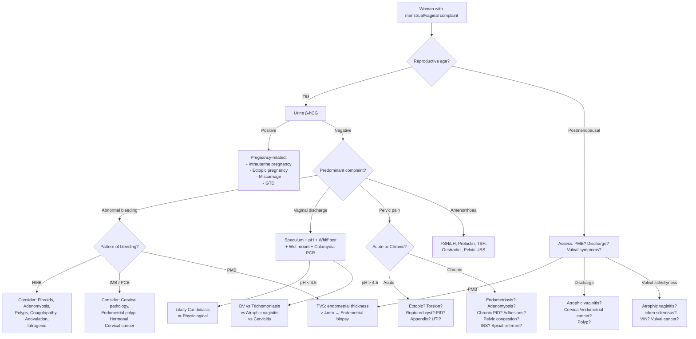
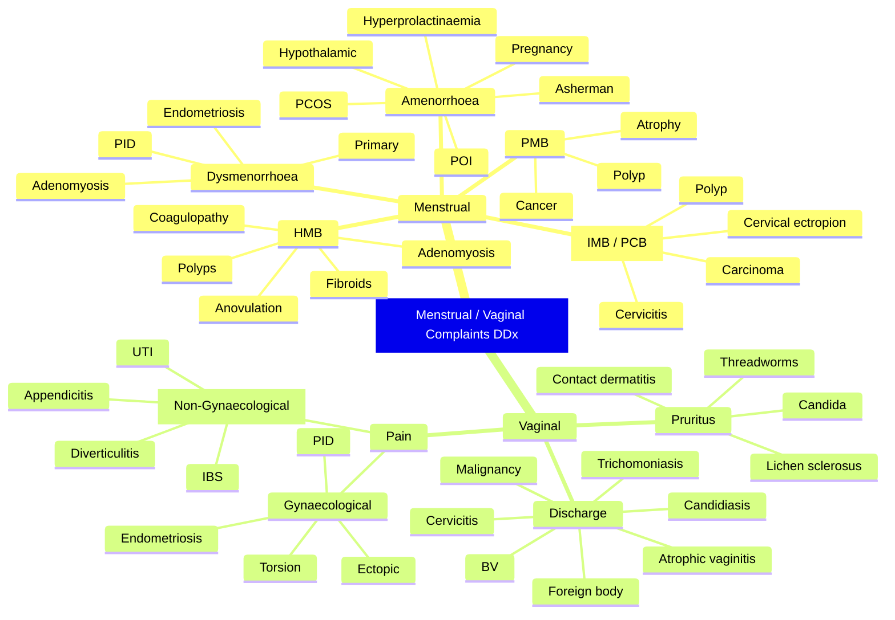

## Differential Diagnosis of Menstrual / Vaginal Complaints

The approach to differential diagnosis here requires you to think in parallel along two major presenting-complaint axes — **abnormal bleeding / menstrual disturbance** and **vaginal discharge / vulvovaginal symptoms** — because in real life patients often present with both simultaneously, and the underlying cause may produce either or both. I'll structure this exactly the way Murtagh's diagnostic strategy framework is laid out in the lecture slides, then give you a systematic clinical-reasoning algorithm.

---

### 1. Murtagh's Diagnostic Strategy — Vaginal Discharge

This is the framework from the lecture slides and is **high yield** [1].

| Category | Diagnoses |
|---|---|
| ***Probability diagnosis*** | ***Normal or excessive physiological discharge*** |
| | ***Vaginitis: bacterial vaginosis (40–50%), candidiasis (20–30%), Trichomonas (10–20%)*** [1] |
| ***Serious disorders not to be missed*** | ***Neoplasia: cancer (cervix, uterus, vagina)*** |
| | ***Fistulas*** |
| | ***STIs / PID (i.e. cervicitis): gonorrhoea, Chlamydia, herpes simplex types 1 and 2*** |
| | ***Sexual abuse, especially children*** |
| | ***Tampon toxic shock syndrome (staphylococcal infection)*** |
| | ***Streptococcal vaginosis (in pregnancy)*** [1] |
| ***Pitfalls (often missed)*** | ***Chemical vaginitis (e.g. perfumes)*** |
| | ***Retained foreign objects (e.g. tampons, IUCD)*** |
| | ***Endometriosis (brownish discharge)*** |
| | ***Ectopic pregnancy ("prune juice" discharge)*** |
| | ***Poor toilet hygiene*** |
| | ***Pelvic fistula*** [1] |
| ***Seven masquerades and pitfalls (continued)*** | ***Genital herpes (possible)*** |
| | ***Cervical polyp*** |
| | ***Bartholinitis*** |
| | ***Atrophic vaginitis*** |
| | ***Threadworms*** |
| | ***Latex allergy (e.g. condoms)*** [1] |
| ***Masquerades checklist*** | ***Diabetes*** |
| | ***Drugs*** |
| | ***UTI (association)*** [1] |
| ***Is the patient trying to tell me something?*** | ***Needs careful consideration; possible sexual dysfunction*** [1] |

<Callout title="Why This Framework Matters">
Murtagh's strategy forces you to think in tiers of **probability → danger → pitfalls → masquerades → psychosocial**. In an exam (and in clinic), you must demonstrate that you have considered the **serious diagnoses** (cancer, ectopic, PID) even when the most likely diagnosis is something benign (BV, Candida).
</Callout>

---

### 2. Murtagh's Diagnostic Strategy — Abdominal / Pelvic Pain in Women

| Category | Diagnoses |
|---|---|
| ***Probability diagnosis*** | ***Primary dysmenorrhoea*** |
| | ***Mittelschmerz*** |
| | ***Pelvic / abdominal adhesions*** |
| | ***Endometriosis*** [1] |
| ***Serious disorders not to be missed*** | ***Vascular: internal iliac claudication*** |
| | ***Neoplasms including cancer: ovary, uterus, other pelvic structures*** |
| | ***Infection: PID, pelvic abscess, appendicitis*** |
| | ***Other: ectopic pregnancy*** [1] |
| ***Pitfalls (often missed)*** | ***Endometriosis / adenomyosis*** |
| | ***Torsion of ovary or pedunculated fibroid*** |
| | ***Constipation / faecal impaction*** |
| | ***Pelvic congestion syndrome*** |
| | ***Misplaced IUCD*** [1] |
| ***Referred pain (to pelvis)*** | ***Appendicitis, cholecystitis, diverticulitis, UTI*** [1] |
| ***Masquerades checklist*** | ***Depression, Drugs, Spinal dysfunction (referred pain), UTI*** [1] |
| ***Is the patient trying to tell me something?*** | ***Can be very relevant. Consider various problems and sexual dysfunction*** [1] |

<Callout title="Exam Tip" type="error">
Students frequently forget **non-gynaecological** mimics of pelvic pain. ***Appendicitis***, ***UTI***, ***diverticulitis*** and ***spinal dysfunction*** must always be on your differential for lower abdominal pain in a woman [1][2]. A perforated appendix can present identically to ruptured ectopic or ovarian cyst torsion.
</Callout>

---

### 3. Systematic Differential Diagnosis by Presenting Complaint

#### 3A. Differential Diagnosis of Abnormal Uterine Bleeding (AUB)

Organised by PALM-COEIN (FIGO) — but now mapped to the specific bleeding pattern:

| Bleeding Pattern | Top Differentials | Key Distinguishing Features |
|---|---|---|
| **Heavy menstrual bleeding (HMB)** | Fibroids (submucosal), adenomyosis, endometrial polyps, coagulopathy (vWD), ovulatory dysfunction, endometrial causes (↑fibrinolysis), iatrogenic (Cu-IUD, anticoagulants) | Fibroids: irregular bulky uterus. Adenomyosis: uniformly enlarged boggy tender uterus, worsening dysmenorrhoea. Coagulopathy: HMB since menarche, easy bruising [3]. Cu-IUD: temporal association with insertion |
| **Intermenstrual bleeding (IMB)** | Cervical ectropion, cervical polyp, cervicitis (Chlamydia, gonorrhoea), endometrial polyp, hormonal contraception (breakthrough), cervical carcinoma, endometrial carcinoma | Ectropion: young, on OCP. Cervicitis: mucopurulent discharge, STI risk. Cancer: irregular mass on speculum |
| **Postcoital bleeding (PCB)** | Cervical ectropion, cervical polyp, cervicitis, cervical carcinoma, atrophic vaginitis, vaginal trauma | Always do speculum — cervical carcinoma is the must-not-miss diagnosis |
| **Postmenopausal bleeding (PMB)** | **Endometrial atrophy** (60–80%, most common), endometrial polyp, endometrial hyperplasia / carcinoma (~10%), cervical pathology, vaginal atrophy, HRT-related breakthrough | Endometrial atrophy: thin endometrium on TVS. Cancer: thickened endometrium ( > 4 mm on TVS post-menopause → requires biopsy) |
| **Amenorrhoea (secondary)** | ***Pregnancy (always first!)*** [4], hypothalamic (stress, weight loss, exercise), PCOS, hyperprolactinaemia, thyroid disease, premature ovarian insufficiency (POI), Asherman syndrome | PCOS: oligomenorrhoea + hyperandrogenism. POI: hot flushes + ↑FSH. Asherman: post-D&C history [4] |
| **Oligomenorrhoea** | PCOS, thyroid disease, hyperprolactinaemia, hypothalamic, pregnancy, perimenopause | PCOS is by far the commonest in reproductive-age women |
| **Dysmenorrhoea** | **Primary** (diagnosis of exclusion — no pathology), **Secondary**: endometriosis, adenomyosis, fibroids, PID, cervical stenosis, ***misplaced IUCD*** [1] | Primary: onset within 1–2 years of menarche, day 1–2 of cycle. Secondary: onset later, progressive, may have deep dyspareunia, dyschezia |

#### 3B. Differential Diagnosis of Vaginal Discharge

| Discharge Character | Most Likely Diagnosis | Why (Pathophysiology) | Key Differentiating Test |
|---|---|---|---|
| ***Thin, grey-white, fishy odour*** | ***Bacterial vaginosis (BV)*** [1] | Shift from lactobacilli-dominant flora → anaerobic overgrowth (Gardnerella, Prevotella, Mobiluncus) → amines produced → fishy odour. **Not a true infection** — no mucosal inflammation | ***pH > 4.5, positive amine ("whiff") test***, clue cells on wet mount [1] |
| ***Thick, white, curdy ("cottage cheese"), no odour, intense pruritus*** | ***Vulvovaginal candidiasis*** [1] | Candida overgrowth (usually *C. albicans*) → hyphae invade superficial epithelium → inflammatory response → itch, erythema. Favoured by ↑glycogen (pregnancy, DM), antibiotics, immunosuppression | pH < 4.5 (normal), KOH prep → pseudohyphae/budding yeast |
| ***Profuse, frothy, yellow-green, offensive*** | ***Trichomoniasis*** [1] | *T. vaginalis* (flagellated protozoan, STI) → colonises squamous epithelium → intense PMN response → purulent discharge. "Strawberry cervix" = punctate haemorrhages | pH > 4.5, wet mount → motile trichomonads. NAAT now gold standard |
| ***Mucopurulent, often subtle*** | ***Cervicitis (Chlamydia / gonorrhoea)*** [1] | Obligate intracellular (*C. trachomatis*) or Gram-negative diplococcus (*N. gonorrhoeae*) infects endocervical columnar epithelium → mucopurulent exudate | ***Chlamydia PCR*** [1], gonococcal culture/NAAT |
| Watery ± blood-stained (postmenopausal) | ***Atrophic vaginitis*** [1] | ↓Oestrogen → epithelial thinning → ↓glycogen → ↓lactobacilli → ↑pH → fragile epithelium → petechiae, bleeding | Clinical appearance (pale, thin, dry, ↓rugae), pH > 5 |
| ***Brownish discharge*** | ***Endometriosis*** [1] | Ectopic endometrial tissue undergoes cyclical bleeding → old blood (brown) may track through cervix | Cyclical pattern, associated dysmenorrhoea / deep dyspareunia |
| ***"Prune juice" discharge*** | ***Ectopic pregnancy*** [1] | Decidualised endometrium sheds irregularly due to falling β-hCG from failing ectopic → dark brown ("prune juice") vaginal bleeding | +ve urine β-hCG, empty uterus on TVS, adnexal mass ± free fluid |
| Foul-smelling, purulent | ***Retained foreign body (e.g. tampon, IUCD)*** [1], cervical/endometrial malignancy | Foreign body → bacterial overgrowth → necrosis → offensive discharge. Necrotic tumour → same mechanism | Speculum examination reveals foreign body or irregular mass |
| Purulent + systemic features | PID / tubo-ovarian abscess | Ascending infection from cervix → salpingitis → tubo-ovarian complex → pus | Cervical excitation, bilateral adnexal tenderness, fever [2][5] |
| Blood-stained, watery | Cervical / endometrial / vaginal carcinoma | Neoplastic tissue is friable and vascular → bleeds easily; necrotic areas produce watery exudate | Biopsy diagnostic |

#### 3C. Differential Diagnosis of Pelvic Pain in Women

This is where the **gynaecological** and **non-gynaecological** differentials interleave. I'll separate by acuity:

**Acute Pelvic Pain — Gynaecological** [2][5][6]

| Diagnosis | Key Clinical Pointers | Pathophysiology |
|---|---|---|
| ***Ectopic pregnancy*** | Missed period, +ve β-hCG, unilateral pain ± PV bleeding ("prune juice"), ***positive pregnancy test strongly suggests ectopic if intrauterine pregnancy cannot be visualized*** [2] | Implantation in fallopian tube (usually ampulla) → trophoblastic invasion → tubal distension/rupture → haemoperitoneum |
| ***Ruptured ovarian cyst*** | ***Pain often begins during strenuous physical activity such as exercise or intercourse*** [2], sudden onset, unilateral | Functional cyst (follicular/corpus luteum) ruptures → peritoneal irritation from follicular fluid ± blood |
| ***Ovarian / fallopian tube torsion*** | Sudden severe unilateral pain, nausea/vomiting (waves), ***refers to twisting of ovary on its ligamentous supports often resulting in impedance of its blood supply*** [2] | Torsion → venous then arterial occlusion → ischaemia → necrosis if not detorsed |
| ***PID*** | ***Sexually active F, < 40y; preceded by menstrual irregularities and dysmenorrhoea; gradual onset constant lower abdominal pain; purulent yellow-white vaginal discharge; often associated with dysuria, urinary frequency, dyspareunia; Hx of previous gyne procedures, IUD, or STDs*** [5] | Ascending infection (Chlamydia, gonorrhoea, anaerobes) from cervix → endometritis → salpingitis → peritonitis |
| ***Tubo-ovarian abscess*** | Extension of PID with persistent fever despite antibiotics, palpable adnexal mass [2] | Walled-off collection of pus involving tube and ovary |
| Threatened / incomplete miscarriage | Vaginal bleeding + crampy pain in early pregnancy, os open (incomplete) or closed (threatened) | Products of conception partially expelled → uterus contracts to expel remainder |
| Degenerating fibroid | Acute pain in patient with known fibroids, tender localised area on uterus | Fibroid outgrows blood supply → red (carneous) degeneration → acute pain and tenderness |

**Acute Pelvic Pain — Non-Gynaecological** [1][2][6]

| Diagnosis | Key Clinical Pointers |
|---|---|
| ***Appendicitis*** | Periumbilical pain migrating to RIF, anorexia, nausea/vomiting, fever. ***Should ALWAYS take a full gynaecological Hx*** to distinguish from gynaecological causes [5] |
| ***UTI / pyelonephritis*** | Dysuria, frequency, urgency ± loin pain, fever, rigors [7] |
| ***Ureteric colic*** | Colicky pain waxing and waning, loin to groin radiation, haematuria |
| ***Diverticulitis*** | LLQ pain (Western) / RLQ pain (Asian — ***right-sided diverticulitis is more common in Asian population*** [2]), fever, altered bowel habit |
| ***Constipation / faecal impaction*** [1] | Often overlooked; history of infrequent bowel movements, palpable faecal mass |
| IBS | Chronic/recurrent abdominal pain related to defecation, bloating, altered bowel habit; association with dysmenorrhoea [8] |

**Chronic Pelvic Pain — Gynaecological** [1]

| Diagnosis | Key Clinical Pointers | Pathophysiology |
|---|---|---|
| ***Endometriosis*** | Cyclical pelvic pain, deep dyspareunia, dysmenorrhoea, dyschezia, subfertility. ***Presence of endometrial glands and stroma at extrauterine sites*** [2] | Ectopic endometrial tissue responds to cyclical hormones → bleeding, inflammation, fibrosis, adhesions |
| ***Adenomyosis*** | Progressive dysmenorrhoea + HMB, boggy tender uterus | Endometrial tissue within myometrium → cyclical swelling |
| ***Pelvic congestion syndrome*** [1] | Dull aching pain worse with standing/end of day, relieved by lying down; associated with varicose veins of broad ligament and ovarian veins | Venous incompetence → pelvic venous engorgement → pain |
| Chronic PID / adhesions | History of prior PID or surgery, pain with movement | Post-inflammatory adhesions → traction on pelvic organs |
| ***Pelvic / abdominal adhesions*** [1] | History of prior surgery or infection | Fibrous bands → intermittent traction/obstruction |
| ***Misplaced IUCD*** [1] | Pain temporally related to IUCD insertion | Malposition → myometrial irritation, perforation |

---

### 4. Differential Diagnosis of Dysuria in Females (Overlap with Vaginal Complaints)

This is an extremely common clinical overlap — women with vaginal complaints often also have urinary symptoms, and vice versa [7][9].

| Diagnosis | Key Features | Distinguishing Point |
|---|---|---|
| **UTI (cystitis)** | Dysuria, frequency, urgency, suprapubic pain, turbid/foul urine | +ve MSU (≥10⁵ CFU/mL), **no vaginal discharge** [7] |
| **Vaginitis (BV, Candida, Trichomonas)** | "External" dysuria (urine hitting inflamed vulva), vaginal discharge, pruritus | Discharge present, MSU usually sterile, ***vaginal discharge is incompatible with simple cystitis*** [9] |
| **STD urethritis** | Urethral discharge especially morning void, +ve sexual history [7] | NAAT for Chlamydia/gonorrhoea positive |
| **PID** | Lower abdominal pain + vaginal discharge + cervical excitation [5] | Systemic features (fever), bilateral adnexal tenderness |
| **Interstitial cystitis** | Chronic suprapubic pain, frequency, urgency — ***diagnosis of exclusion → chronic, refractory bladder symptoms and pain*** [7] | No infection found on MSU, cystoscopy may show Hunner's ulcers |

---

### 5. Differential Diagnosis of Amenorrhoea (Special Section)

Because amenorrhoea has such a wide differential, it deserves its own structured approach. Think **anatomical level** [4]:

| Level | Primary Amenorrhoea | Secondary Amenorrhoea |
|---|---|---|
| **Physiological** | — | ***Pregnancy (always exclude first!)*** [4], lactation, menopause |
| **Hypothalamic** | Constitutional delay, Kallmann syndrome (anosmia + hypogonadotropic hypogonadism), chronic illness | Functional hypothalamic amenorrhoea (stress, weight loss, excessive exercise), tumours, TBI, cranial irradiation, inflammatory/infiltrative disease [4] |
| **Pituitary** | Hyperprolactinaemia (rare in primary) | ***Hyperprolactinaemia (drugs — DA antagonists, prolactinoma)***, pituitary adenoma, Sheehan syndrome (postpartum pituitary necrosis), pituitary apoplexy [4] |
| **Ovarian** | Turner syndrome (45,X), gonadal dysgenesis, 46,XY disorders of sex development (androgen insensitivity) | ***Premature ovarian insufficiency (AI, fragile X permutation, chemoRT, idiopathic)***, PCOS, ovarian tumour [4] |
| **Uterine / Outflow** | Müllerian agenesis (MRKH syndrome), imperforate hymen, transverse vaginal septum | ***Asherman syndrome (intrauterine adhesions post-D&C)***, cervical stenosis [4] |
| **Other endocrine** | Congenital adrenal hyperplasia | ***Thyroid disease (hyper/hypothyroidism), uncontrolled DM, Cushing syndrome, exogenous androgens*** [4] |

> **Why think by anatomical level?** Because the investigation pathway mirrors this — you test **β-hCG → FSH/LH → prolactin → TSH → oestradiol → progestogen challenge → imaging** to localise the lesion from "top" (hypothalamus) to "bottom" (uterus).

---

### 6. Clinical Reasoning Algorithm — Approach to Differential Diagnosis

The following algorithm integrates the above differentials into a practical bedside reasoning flow:

---

### 7. Key "Must-Not-Miss" Diagnoses — Red Flags

> These are the diagnoses that, if missed, lead to serious morbidity or mortality. **Always actively consider and exclude these:**

| Red Flag Presentation | Must-Not-Miss Diagnosis | Why Dangerous |
|---|---|---|
| Amenorrhoea + pelvic pain + PV bleeding + haemodynamic instability | ***Ruptured ectopic pregnancy*** [1][2] | Haemoperitoneum → hypovolaemic shock → death if not treated surgically |
| PMB (any amount) | ***Endometrial carcinoma*** [1] | ~10% of PMB is cancer; early detection dramatically improves prognosis |
| Irregular PCB/IMB in sexually active woman | ***Cervical carcinoma*** [1] | HPV-driven malignancy; treatable if caught early |
| Purulent discharge + fever + cervical excitation | ***PID / tubo-ovarian abscess*** [1][5] | Can lead to tubal damage → infertility, chronic pain, sepsis |
| Acute unilateral pelvic pain + nausea in young woman | ***Ovarian torsion*** [2] | Vascular compromise → ovarian necrosis if not detorsed within hours |
| ***Tampon-related illness with fever, rash, hypotension*** | ***Toxic shock syndrome*** [1] | Staphylococcal superantigen → massive cytokine release → multiorgan failure [10] |
| Vaginal discharge in a child | ***Sexual abuse*** [1] | Safeguarding emergency |

<Callout title="Golden Rule" type="error">
***In any woman of reproductive age with abnormal bleeding or pelvic pain: ALWAYS do a urine β-hCG first.*** Missing an ectopic pregnancy is a medicolegal disaster and can be fatal. It takes 5 minutes and costs almost nothing.
</Callout>

---

### 8. Differentiating the Three Commonest Causes of Vaginal Discharge (High Yield Table)

| Feature | BV | Candidiasis | Trichomoniasis |
|---|---|---|---|
| **Prevalence** | ***40–50%*** | ***20–30%*** | ***10–20%*** [1] |
| **Organism** | Gardnerella, Prevotella, Mobiluncus (anaerobic overgrowth) | *Candida albicans* (90%) | *Trichomonas vaginalis* (protozoan) |
| **Discharge** | Thin, grey-white, homogeneous | Thick, white, curdy ("cottage cheese") | Profuse, frothy, yellow-green |
| **Odour** | ***Fishy*** (amines) | None | Offensive |
| **Pruritus** | Minimal/none | ***Intense*** | Variable |
| **pH** | > 4.5 | < 4.5 (normal) | > 4.5 |
| ***Amine (whiff) test*** | ***Positive*** [1] | Negative | May be positive |
| **Wet mount** | Clue cells (epithelial cells studded with bacteria) | — | Motile flagellated organisms |
| **KOH prep** | — | Pseudohyphae/budding yeast | — |
| **Inflammation** | No (dysbiosis, not infection) | Yes (mucosal erythema) | Yes (purulent, "strawberry cervix") |
| **STI?** | No (not sexually transmitted per se, but sexual activity is a risk factor) | No | **Yes** |
| **Treatment** | Metronidazole (oral or vaginal) | Topical azoles or oral fluconazole | Metronidazole (oral) — **must treat partner** |

---

### 9. Summary Diagram — Differential Diagnosis Categories at a Glance

---

<Callout title="High Yield Summary — Differential Diagnosis">

1. ***Probability diagnoses*** for vaginal discharge: physiological, BV (40–50%), candidiasis (20–30%), trichomoniasis (10–20%) [1].

2. ***Probability diagnoses*** for abdominal/pelvic pain in women: primary dysmenorrhoea, Mittelschmerz, adhesions, endometriosis [1].

3. **Must-not-miss**: ectopic pregnancy, cervical/endometrial cancer, PID/TOA, ovarian torsion, ***toxic shock syndrome*** [1], ***sexual abuse in children*** [1].

4. ***Pitfalls often missed***: chemical vaginitis, retained foreign body, endometriosis (brownish discharge), ectopic pregnancy ("prune juice" discharge), ***pelvic congestion syndrome, misplaced IUCD, constipation*** [1].

5. ***Masquerades***: diabetes, drugs, UTI, depression, spinal dysfunction (referred pain) [1].

6. **Always exclude pregnancy** (β-hCG) first in any reproductive-age woman.

7. **pH paper** is your bedside friend: < 4.5 → Candida/physiological; > 4.5 → BV/Trichomonas/atrophic/cervicitis.

8. For **PID**: classically sexually active female < 40y, lower abdominal pain, vaginal discharge, cervical excitation ("chandelier sign"), fever [5].

9. ***For appendicitis ddx in adult females***: always take full gynaecological history, especially menstrual cycle, vaginal discharge and possible pregnancy [5].

10. For **secondary amenorrhoea**: think anatomical level — hypothalamus → pituitary → ovary → uterus/outflow — and investigate accordingly [4].

</Callout>

---

<ActiveRecallQuiz
  title="Active Recall - Differential Diagnosis of Menstrual/Vaginal Complaints"
  items={[
    {
      question: "List Murtagh's 'serious disorders not to be missed' for vaginal discharge (6 categories).",
      markscheme: "1. Neoplasia (cervix, uterus, vagina). 2. Fistulas. 3. STIs/PID (gonorrhoea, Chlamydia, herpes simplex). 4. Sexual abuse especially in children. 5. Tampon toxic shock syndrome (staphylococcal). 6. Streptococcal vaginosis in pregnancy.",
    },
    {
      question: "A 28-year-old sexually active woman presents with gradual-onset bilateral lower abdominal pain, purulent vaginal discharge, dyspareunia, and fever of 38.5C. What is the most likely diagnosis and what is the classic sign on bimanual examination?",
      markscheme: "PID (pelvic inflammatory disease). Classic sign: cervical excitation tenderness (chandelier sign) plus bilateral adnexal tenderness. Also look for purulent endocervical discharge on speculum.",
    },
    {
      question: "A 62-year-old woman presents with a single episode of vaginal bleeding 3 years after menopause. What is the must-not-miss diagnosis and what investigation must be performed?",
      markscheme: "Must-not-miss: endometrial carcinoma (approx 10% of PMB). Investigation: transvaginal ultrasound to measure endometrial thickness (threshold > 4mm) followed by endometrial biopsy (Pipelle or hysteroscopy-guided) if thickened or symptomatic despite thin endometrium.",
    },
    {
      question: "List the pitfalls (often missed diagnoses) for abdominal/pelvic pain in women according to Murtagh's strategy.",
      markscheme: "Endometriosis/adenomyosis, torsion of ovary or pedunculated fibroid, constipation/faecal impaction, pelvic congestion syndrome, misplaced IUCD.",
    },
    {
      question: "A woman presents with thin grey-white vaginal discharge and fishy odour. pH is 5.0, amine test positive, clue cells on wet mount. What is the diagnosis and is this an STI?",
      markscheme: "Bacterial vaginosis (BV). This is NOT a true STI nor a true infection - it is a vaginal dysbiosis (shift from lactobacilli to anaerobic overgrowth). Treatment is metronidazole. Partner treatment is not required.",
    },
    {
      question: "Explain why ectopic pregnancy can present with 'prune juice' vaginal discharge rather than bright red bleeding.",
      markscheme: "In ectopic pregnancy, the endometrium has undergone decidual transformation in response to early pregnancy hormones. As the ectopic fails and beta-hCG falls, the decidualised endometrium sheds irregularly. The old, dark blood that is passed appears as dark brown 'prune juice' discharge rather than fresh red bleeding.",
    },
  ]}
/>

---

## References

[1] Lecture slides: murtagh merge.pdf (p1 — Abdominal pain in women; p103–104 — Vaginal discharge)
[2] Senior notes: felixlai.md (sections on appendicitis differential diagnosis including O&G causes; diverticulitis differential diagnosis including gynaecological disorders)
[3] Senior notes: Ryan Ho Haemtology.pdf (p128 — von Willebrand disease, HMB prevalence)
[4] Senior notes: Ryan Ho Psychiatry.pdf (p214 — Differential diagnosis of secondary amenorrhoea)
[5] Senior notes: Ryan Ho GI.pdf (p99, p151 — PID clinical features, differential diagnosis of acute appendicitis in adult females)
[6] Senior notes: maxim.md (sections on acute abdomen differential diagnosis including O&G causes)
[7] Senior notes: Ryan Ho Urogenital.pdf (p121 — Approach to dysuria; p248 — Urethritis differential)
[8] Senior notes: Ryan Ho GI.pdf (p118 — IBS associations including dysmenorrhoea)
[9] Senior notes: Ryan Ho Urogenital.pdf (p125 — Acute cystitis differential, vaginal discharge incompatible with cystitis)
[10] Senior notes: Ryan Ho Rheumatology.pdf (p133 — Staphylococcal toxic shock syndrome)
