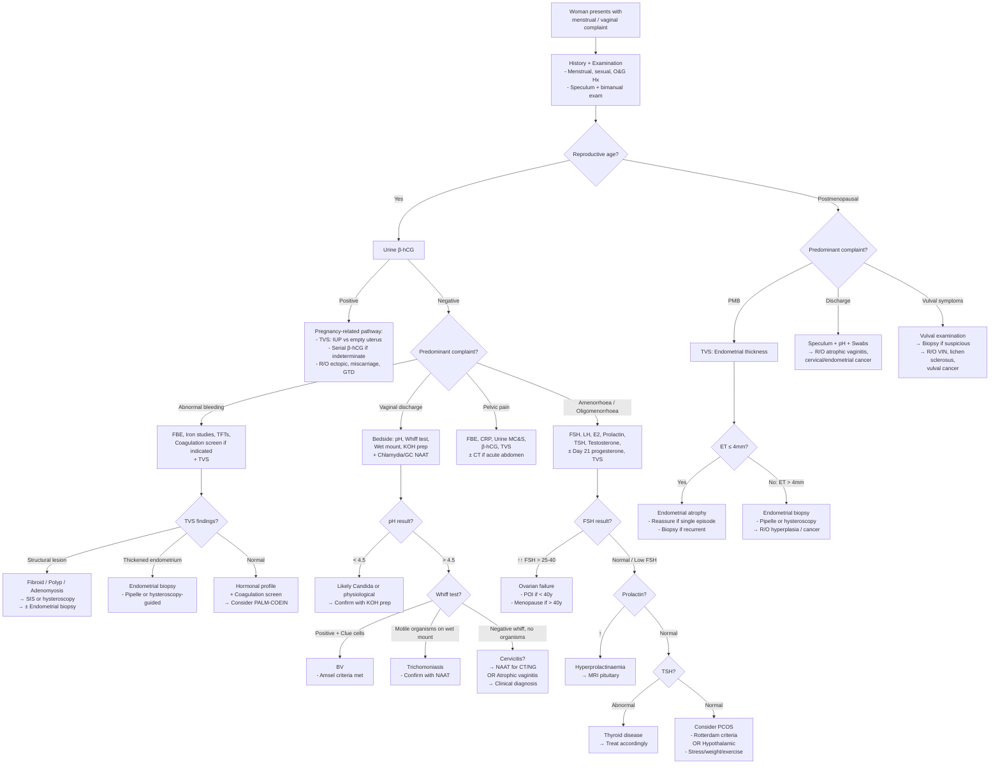

## Diagnostic Criteria, Diagnostic Algorithm and Investigation Modalities

The diagnostic approach to menstrual/vaginal complaints is not about a single test — it's about layering **bedside assessment → targeted investigations → definitive procedures** in a logical sequence driven by the clinical picture. Let me walk you through this the way you'd actually think on the ward.

---

### 1. Diagnostic Criteria for Key Conditions

Most menstrual/vaginal complaints don't have a single set of "diagnostic criteria" like the Jones criteria for rheumatic fever. Instead, diagnosis is made by **clinical assessment + supportive investigations**. However, several specific conditions within this domain do have defined criteria, and you need to know them.

#### 1A. Bacterial Vaginosis — Amsel Criteria

BV is diagnosed clinically when **≥ 3 of 4 Amsel criteria** are met:

| Criterion | What You're Looking For | Why (Pathophysiology) |
|---|---|---|
| 1. **Thin, homogeneous, greyish-white discharge** | Adherent discharge coating vaginal walls | Biofilm of anaerobes (Gardnerella, Prevotella) replaces normal lactobacilli → altered secretions |
| 2. ***pH > 4.5*** | Test with pH paper (range 4–6) at vaginal wall (NOT cervical mucus, which is always alkaline) [1] | Loss of lactobacilli → ↓lactic acid production → pH rises |
| 3. ***Positive amine ("whiff") test*** | Add 10% KOH to discharge → fishy odour released [1] | Anaerobes produce amines (putrescine, cadaverine, trimethylamine); KOH volatilises them |
| 4. **Clue cells on wet mount** | ≥ 20% of epithelial cells on saline wet mount have stippled, granular appearance with obscured borders | Vaginal epithelial cells become coated with adherent bacteria (Gardnerella biofilm) |

> **Alternative**: Nugent score on Gram stain of vaginal secretions (score 7–10 = BV). This is the research gold standard but less practical at the bedside. The score quantifies the shift from lactobacilli (large Gram-positive rods) to Gardnerella/Mobiluncus morphotypes (small Gram-variable rods/curved rods).

#### 1B. Vulvovaginal Candidiasis — Clinical + Microscopic Diagnosis

There are no formal "criteria" — diagnosis is made by:
- **Clinical features**: pruritus, thick white curdy ("cottage cheese") discharge, vulvar erythema/oedema, satellite lesions
- **pH < 4.5** (normal — Candida thrives in acid environment)
- **KOH preparation**: 10% KOH dissolves epithelial cells and debris, leaving behind **pseudohyphae and budding yeast** clearly visible under microscopy
- **Culture** (Sabouraud's agar): not routinely needed for uncomplicated cases; useful for recurrent or resistant candidiasis to identify species (non-albicans species like *C. glabrata* may be azole-resistant)

#### 1C. Trichomoniasis — Microscopic / NAAT Diagnosis

- **Saline wet mount**: motile, pear-shaped, flagellated organisms seen — sensitivity only ~60–70% (must be examined immediately as organisms die quickly)
- **NAAT (nucleic acid amplification test)**: now the **gold standard** — sensitivity > 95%
- **pH > 4.5**, may have positive amine test
- **"Strawberry cervix"** (colpitis macularis): punctate haemorrhages on cervix — seen in ~2% on naked eye examination but ~45% on colposcopy

#### 1D. PID — CDC Diagnostic Criteria (2021)

PID is a **clinical diagnosis** — you do NOT need laparoscopy to confirm it in practice. The threshold for starting treatment is deliberately low because the consequences of missed PID (infertility, chronic pain) are severe.

**Minimum criteria (all 3 should be present):**
1. Lower abdominal/pelvic tenderness
2. Adnexal tenderness (on bimanual examination)
3. ***Cervical excitation tenderness (chandelier sign)*** [5][12]

**Additional criteria that support the diagnosis:**
- Oral temperature > 38.3°C
- Abnormal cervical mucopurulent discharge or cervical friability
- Abundant WBCs on saline wet mount of vaginal fluid
- ↑ESR or ↑CRP
- Laboratory documentation of cervical infection with *N. gonorrhoeae* or *C. trachomatis* (***Chlamydia PCR*** [1])

**Specific criteria (definitive but not required for clinical diagnosis):**
- Endometrial biopsy showing endometritis
- Transvaginal USS or MRI showing thickened, fluid-filled tubes ± tubo-ovarian complex/abscess ± free pelvic fluid
- Laparoscopic findings consistent with PID (gold standard but invasive, rarely done for diagnosis alone)

<Callout title="Why Is the Diagnostic Threshold So Low?">
Because PID can cause **tubal scarring → infertility** even with subtle symptoms. The CDC deliberately sets a low bar — if a sexually active young woman has pelvic tenderness + cervical excitation tenderness, start empirical antibiotics while awaiting results. The cost of overtreatment is far less than the cost of missed diagnosis [12].
</Callout>

#### 1E. Abnormal Uterine Bleeding — No Formal "Criteria" but Key Thresholds

- **Heavy menstrual bleeding (HMB)**: Defined as excessive menstrual blood loss that interferes with quality of life (NICE definition). The old quantitative threshold (> 80 mL/cycle) is rarely measured clinically. In practice, rely on patient-reported impact (flooding, clots, pad changes, interference with daily life).
- **Postmenopausal bleeding (PMB)**: Any bleeding > 12 months after last menstrual period. **Endometrial thickness ≤ 4 mm on TVS** has a > 99% negative predictive value for endometrial cancer — this is the key threshold.
- **Endometrial hyperplasia / cancer**: Diagnosed histologically on endometrial biopsy — there are no clinical criteria alone.

#### 1F. PCOS — Rotterdam Criteria (2003, reaffirmed 2023)

Diagnosis requires **≥ 2 of 3** (after excluding other causes):

| Criterion | How to Assess |
|---|---|
| 1. **Oligo-ovulation or anovulation** | Oligomenorrhoea (cycle > 35 days) or amenorrhoea |
| 2. **Clinical and/or biochemical hyperandrogenism** | Clinical: hirsutism (Ferriman-Gallwey score ≥ 4–6), acne, androgenic alopecia. Biochemical: ↑free testosterone, ↑DHEA-S |
| 3. **Polycystic ovarian morphology on USS** | ≥ 12 follicles (2–9 mm) per ovary OR ovarian volume > 10 mL (on TVS). **Updated 2023**: ≥ 20 follicles per ovary (with modern USS transducers) OR AMH > 35 pmol/L as alternative |

> **Must exclude**: thyroid disease (TFTs), hyperprolactinaemia (prolactin), non-classical congenital adrenal hyperplasia (17-OH progesterone), Cushing syndrome, androgen-secreting tumour.

#### 1G. Ectopic Pregnancy — Diagnostic Triad + Investigations

- **Clinical triad**: amenorrhoea + PV bleeding + unilateral pelvic/abdominal pain (present in ~50% of cases — many present atypically)
- **Urine β-hCG**: positive
- **TVS**: empty uterus + adnexal mass ± free fluid in Pouch of Douglas
- **Serum β-hCG**: when indeterminate on USS — a "discriminatory level" of ~1500–2000 IU/L is used (above this level, an intrauterine pregnancy should be visible on TVS; if not → suspect ectopic)
- ***"Positive pregnancy test strongly suggests presence of an ectopic pregnancy if an intrauterine pregnancy cannot be visualized"*** [2]

---

### 2. Investigation Modalities — Systematic Approach

I'll present investigations in the order you would logically request them: **bedside → blood → microbiology → imaging → invasive/definitive**.

#### 2A. Bedside Investigations

| Investigation | What It Tests | Key Findings / Interpretation | When to Use |
|---|---|---|---|
| ***Urine β-hCG*** | Pregnancy | Positive → pregnancy-related cause (intrauterine, ectopic, miscarriage, GTD). **Must do first in ALL reproductive-age women** [12][13] | Every woman of reproductive age with abnormal bleeding, pelvic pain, or amenorrhoea |
| ***pH paper (range 4–6)*** [1] | Vaginal pH | < 4.5: normal, candidiasis. > 4.5: BV, trichomoniasis, atrophic vaginitis, cervicitis. **Take from vaginal wall, NOT cervix** (cervical mucus is alkaline and gives a false high reading) | Vaginal discharge |
| ***Amine ("whiff") test*** [1] | Volatile amines | Fishy odour when KOH added to discharge → positive in BV (amines from anaerobes volatilised by alkali) | Vaginal discharge |
| **Saline wet mount** | Clue cells, trichomonads, WBCs | Clue cells → BV. Motile flagellated organisms → trichomoniasis. ↑WBCs → inflammatory (candidiasis, cervicitis, trichomoniasis). WBCs with no organisms → consider Chlamydia | Vaginal discharge |
| **KOH (10%) preparation** | Fungal elements | Pseudohyphae / budding yeast → candidiasis. KOH dissolves epithelial cells, making fungi easier to see | Suspected candidiasis |
| ***Urinalysis (dipstick + microscopy)*** [1][13] | UTI, haematuria, proteinuria | Nitrites + leucocytes → UTI. RBCs → consider urological cause or contamination. **Repeat after menstruation if haematuria found during period** [11] | Dysuria, frequency, haematuria, pelvic pain |
| **Urine MC&S (midstream)** | Urinary infection | ≥ 10⁵ CFU/mL → significant bacteriuria. Common organisms: *E. coli* (80%), *Klebsiella*, *Proteus* | Suspected UTI |

<Callout title="pH Testing Pitfall" type="error">
Do NOT take the pH from the cervical os or from pooled discharge mixed with cervical mucus — cervical mucus is alkaline (pH ~7) and will give a falsely elevated reading. Swab the **lateral vaginal wall** for accurate pH assessment.
</Callout>

#### 2B. Blood Investigations

| Investigation | What It Tests | Key Findings / Interpretation | When to Use |
|---|---|---|---|
| ***FBE (Full Blood Examination / CBC)*** [1] | Haemoglobin, MCV, platelets, WCC | ↓Hb + ↓MCV + ↓ferritin → iron deficiency anaemia (from chronic HMB). ↑WCC → infection (PID, TOA). ↓Platelets → thrombocytopenia causing HMB | All abnormal bleeding, suspected infection |
| ***ESR / CRP*** [1] | Inflammatory markers | ↑ in PID, TOA, endometritis, malignancy. CRP more specific for acute infection | Suspected PID, chronic pelvic pain |
| **Iron studies** (ferritin, serum iron, TIBC, transferrin sat) | Iron status | ↓Ferritin (< 30 μg/L) is the single best test for iron deficiency. ↓Serum iron + ↑TIBC → IDA | HMB, anaemia |
| **Coagulation screen** (PT, APTT, fibrinogen) | Clotting pathway | Isolated ↑APTT → consider vWD (APTT can be normal in mild vWD). Normal PT + ↑APTT → intrinsic pathway defect | HMB since menarche, easy bruising, family history of bleeding [3] |
| **vWF panel** (vWF:Ag, vWF:Act/RiCof, Factor VIII activity) | von Willebrand disease | vWF:Ag < 30 IU/dL + ↓vWF:Act + ↓Factor VIII → consistent with vWD. ***aPTT can be normal in: (1) mild deficiency (2) stress-induced ↑vWF/F8 during phlebotomy (3) hormonal factors (menstrual cycle, pregnancy, OCP)*** [3] | HMB since menarche, bleeding history |
| **Hormonal profile** | HPO axis assessment | See dedicated table below | Amenorrhoea, oligomenorrhoea, suspected PCOS, perimenopause |
| **Serum β-hCG** (quantitative) | Pregnancy viability / ectopic monitoring | Doubling time ~48h in normal early pregnancy. Suboptimal rise or plateau → ectopic or failing pregnancy. Above discriminatory level (~1500–2000 IU/L) with empty uterus on TVS → ectopic | Suspected ectopic, pregnancy of unknown location |
| **TFTs (TSH, free T4)** | Thyroid function | ↑TSH → hypothyroidism (→ anovulation, HMB). ↓TSH → hyperthyroidism (→ oligomenorrhoea) | Menstrual irregularity, amenorrhoea |
| **Prolactin** | Hyperprolactinaemia | ↑Prolactin → suppresses GnRH → anovulation. Causes: prolactinoma, drugs (antipsychotics, metoclopramide) | Amenorrhoea, galactorrhoea, oligomenorrhoea |

**Hormonal Profile Interpretation:**

| Test | Timing | Interpretation |
|---|---|---|
| **FSH** | Day 2–5 (early follicular) | ↑↑FSH (> 25–40 IU/L) → ovarian failure (premature ovarian insufficiency if < 40y, menopause if > 40y). Normal/low FSH with anovulation → hypothalamic/pituitary cause |
| **LH** | Day 2–5 | LH:FSH ratio ≥ 2:1 suggests PCOS (though not required for Rotterdam criteria). ↓LH → hypothalamic cause |
| **Oestradiol (E2)** | Day 2–5 | ↓E2 + ↑FSH → ovarian failure. ↓E2 + low/normal FSH → hypothalamic/pituitary |
| **Day 21 progesterone** | Day 21 (or 7 days before expected period) | > 16 nmol/L (some use > 30 nmol/L) → confirms ovulation. Low → anovulatory cycle |
| **Testosterone, DHEA-S** | Any day | ↑ → hyperandrogenism (PCOS, adrenal, tumour). Markedly ↑testosterone (> 5 nmol/L) → suspect androgen-secreting tumour |
| **17-OH progesterone** | Early morning, follicular phase | ↑ → non-classical congenital adrenal hyperplasia (21-hydroxylase deficiency) |
| **AMH (anti-Müllerian hormone)** | Any day | Reflects ovarian reserve. ↑AMH → PCOS (> 35 pmol/L). ↓AMH → diminished ovarian reserve |

#### 2C. Microbiological Investigations

| Investigation | Specimen | Key Findings | When to Use |
|---|---|---|---|
| ***Chlamydia PCR (NAAT)*** [1] | Endocervical swab or first-void urine | Positive → *C. trachomatis* infection. **Gold standard** — sensitivity > 95%, specificity > 99% | Suspected cervicitis, PID, routine STI screening, abnormal discharge |
| **Gonorrhoea NAAT** | Endocervical swab or first-void urine | Positive → *N. gonorrhoeae*. Always test alongside Chlamydia (co-infection common) | Same as above |
| **Gonorrhoea culture** | Endocervical swab (special transport medium — must be plated quickly) [14] | Gram-negative intracellular diplococci. Culture allows **antibiotic sensitivity testing** — critical given rising resistance | Suspected gonorrhoea (always do culture in addition to NAAT for resistance testing) |
| **High vaginal swab (HVS)** | Posterior fornix | Culture for BV, Candida, Trichomonas, Group B Strep. Gram stain for Nugent scoring | Vaginal discharge, recurrent infections |
| **Endocervical swab — Gram stain** | Endocervix | ≥ 30 PMN/HPF → cervicitis. Intracellular Gram-negative diplococci → gonorrhoea [14] | Purulent cervical discharge |
| ***Urethral swab — Gram stain*** | Urethra | ***Urethritis diagnosed when ≥ 5 PMN per HPF ± intracellular G- diplococci (diagnostic of gonorrhoea)*** [14] | Urethral discharge |
| **Herpes PCR / viral culture** | Vesicle fluid or ulcer swab | Positive → HSV-1 or HSV-2. PCR preferred (more sensitive than culture) | Vulval vesicles/ulcers |
| **Syphilis serology** (RPR/VDRL + TPHA/FTA-Abs) | Blood | Screening + confirmatory tests | Genital ulcers, STI screen |
| **HPV testing** | Cervical sample (co-test with cytology) | High-risk HPV (16, 18, others) detected → ↑risk cervical dysplasia/cancer | Women ≥ 30 as primary screening or reflex test for ASCUS cytology |

#### 2D. Imaging

| Modality | What It Shows | Key Findings | When to Use |
|---|---|---|---|
| ***Transvaginal ultrasound (TVS)*** | Uterus, endometrium, ovaries, adnexa, Pouch of Douglas | **Endometrial thickness**: ≤ 4 mm postmenopausal → cancer very unlikely (NPV > 99%). > 4 mm → needs biopsy. **Fibroids**: well-circumscribed hypoechoic masses ± calcification. **Adenomyosis**: heterogeneous myometrium, asymmetric wall thickening, myometrial cysts. **Ovarian cyst**: simple (thin-walled, anechoic) vs complex (septations, solid components, irregular). **Ectopic**: empty uterus + adnexal mass ± free fluid. **PCOS morphology**: ≥ 20 follicles/ovary or volume > 10 mL | **First-line imaging** for virtually all menstrual/vaginal complaints. ***TVS is most appropriate for left adnexal mass detected on PV*** [15] |
| **Transabdominal ultrasound (TAS)** | Pelvic structures (less resolution than TVS) | Large masses better visualised (extends beyond TVS range). Useful when TVS not tolerated (virgo intacta, severe tenderness) | Large pelvic masses, young patients, adjunct to TVS |
| **Saline infusion sonography (SIS / sonohysterography)** | Endometrial cavity detail | Fluid distends cavity → polyps and submucosal fibroids seen as filling defects. Distinguishes diffuse endometrial thickening (hyperplasia) from focal lesion (polyp, fibroid) | AUB with thickened endometrium on TVS — to determine if focal or diffuse before deciding on biopsy vs hysteroscopy |
| **MRI pelvis** | Soft tissue detail of uterus, ovaries, parametrium | Best for **adenomyosis** (junctional zone thickening > 12 mm is diagnostic), **fibroid mapping** pre-surgery, **endometriosis** (deep infiltrating), **staging of cervical/endometrial cancer** | Indeterminate TVS findings, pre-surgical planning, suspected deep endometriosis, cancer staging |
| **CT abdomen-pelvis** | Broad overview; less soft tissue detail than MRI | Useful in acute abdomen (appendicitis, diverticulitis, ovarian torsion — "whirlpool sign"). Can show adnexal masses but poor endometrial detail | Acute abdomen, suspected non-gynaecological cause, emergency setting |
| **Hysterosalpingography (HSG)** | Uterine cavity + tubal patency (contrast injected via cervix under fluoroscopy) | Filling defects → polyps, submucosal fibroids, adhesions (Asherman). Tubal blockage → PID sequelae, for infertility workup | Infertility workup, suspected Asherman syndrome |

<Callout title="TVS vs TAS: When to Use Which" type="idea">
**TVS** (transvaginal) gives **superior resolution** of endometrium, ovaries, and adnexa because the probe is closer to the structures. It is first-line for almost all gynaecological imaging. **TAS** (transabdominal) is used when the mass is too large for TVS field, or when TVS is contraindicated/not tolerated. ***For a left adnexal mass detected on PV examination, TVS (transvaginal US) is the most appropriate investigation*** [15].
</Callout>

#### 2E. Invasive / Definitive Investigations

| Investigation | What It Does | Key Findings / Interpretation | When to Use |
|---|---|---|---|
| ***Speculum examination*** | Direct visualisation of vagina and cervix | ***Look for discharge, polyps, warts, ectropion, prolapses, fistulas*** [1]. ***Cervix: well-visualised with no gross lesions / polyp / ectropion / discharge / bleeding / irregular shape / flush to vaginal wall*** [7]. Mucopurulent discharge from cervical os → cervicitis (PID). Irregular friable mass → cervical carcinoma | **All women with vaginal complaints** [1][7] |
| ***Bimanual pelvic examination*** | Assess uterine size/shape/tenderness, adnexal masses, cervical excitation | Bulky irregular uterus → fibroids. Boggy tender uterus → adenomyosis. Cervical excitation + adnexal tenderness → PID/ectopic. Fixed retroverted uterus → endometriosis/adhesions | **All women with menstrual complaints or pelvic pain** |
| **Endometrial biopsy (Pipelle)** | Outpatient sampling of endometrium | Histology: normal secretory/proliferative endometrium, disordered proliferation, hyperplasia (± atypia), endometrial carcinoma, chronic endometritis (plasma cells in stroma) | **PMB** (after TVS shows ET > 4 mm or persistent symptoms despite thin endometrium), AUB in women ≥ 45, AUB + risk factors for endometrial hyperplasia/cancer at any age, failed medical therapy |
| **Hysteroscopy (+ directed biopsy)** | Direct visualisation of endometrial cavity via camera | Gold standard for **intracavitary pathology**: polyps (pedunculated glistening mass), submucosal fibroids (smooth bulge covered by endometrium), adhesions (Asherman — white bands bridging cavity), endometrial cancer (irregular friable mass) | Abnormal endometrial findings on TVS/SIS, inconclusive Pipelle biopsy, removal of polyps/submucosal fibroids (operative hysteroscopy), persistent AUB despite normal initial investigations |
| ***Cervical cytology (Pap smear / liquid-based cytology)*** | Screening for cervical dysplasia | Normal, ASCUS (atypical squamous cells of undetermined significance), LSIL, HSIL, AGC, malignant cells. ***Taking the smear: Cervex brush rotated clockwise ×5 at transformation zone*** [7] | Routine screening (age 25–64 per HK guidelines), PCB, suspicious cervix |
| **Colposcopy + cervical biopsy** | Magnified examination of cervix after acetic acid/Lugol's iodine application | Acetowhite areas → dysplasia (acetic acid denatures excess nuclear protein in dysplastic cells → white). Lugol's-negative areas → abnormal epithelium (normal squamous cells take up iodine → brown; dysplastic cells don't). Punch biopsy → histological grading (CIN 1/2/3 or carcinoma) | Abnormal Pap smear, suspicious cervical appearance, PCB with normal cytology |
| **Laparoscopy** | Direct visualisation of pelvic organs | Gold standard for **endometriosis** (powder-burn spots, chocolate cysts, adhesions), PID (tubal erythema, purulent exudate), ovarian pathology. Also therapeutic (excision/ablation of endometriosis, cystectomy, salpingectomy for ectopic) | Chronic pelvic pain not explained by non-invasive tests, suspected endometriosis, suspected ectopic (when USS indeterminate and clinical concern), PID with uncertain diagnosis |
| **Culdocentesis** | Aspiration from Pouch of Douglas via posterior fornix | Non-clotting blood → haemoperitoneum (ruptured ectopic, ruptured cyst). Pus → pelvic abscess. Largely replaced by TVS but may be useful in resource-limited settings | Suspected ruptured ectopic (now largely replaced by TVS + serial β-hCG) |
| **Urodynamic studies** | Detailed assessment of bladder function (filling cystometry, pressure-flow studies, leak point pressure) | Detrusor overactivity → urge incontinence. Low leak point pressure → stress incontinence. ***Gold standard, only if complicated*** [16] | Urinary incontinence not responding to initial management, pre-surgical assessment |

---

### 3. Diagnostic Algorithm — Master Flowchart

---

### 4. Specific Diagnostic Algorithms by Complaint

#### 4A. Postmenopausal Bleeding — Step-by-Step

This is the highest-yield algorithm because it is a **potential cancer pathway**.

| Step | Action | Rationale |
|---|---|---|
| 1 | **History + examination** (speculum + bimanual) | Identify obvious cervical/vaginal pathology (polyp, atrophic vaginitis, cancer) |
| 2 | **TVS — measure endometrial thickness** | Screening test to stratify risk. **ET ≤ 4 mm → NPV > 99% for endometrial cancer** |
| 3a | If ET ≤ 4 mm AND single episode → **reassure + safety-net** | Likely atrophy; recurrence warrants re-investigation |
| 3b | If ET > 4 mm OR recurrent PMB → **endometrial sampling** (Pipelle biopsy or hysteroscopy-guided biopsy) | To obtain histological diagnosis |
| 4 | **Hysteroscopy** if Pipelle is inadequate/insufficient, or if focal lesion suspected on SIS/TVS | Direct visualisation + targeted biopsy; allows removal of polyps |
| 5 | If cervical pathology suspected → **cervical cytology + colposcopy + biopsy** | R/O cervical cancer |

<Callout title="The 4mm Rule">
An endometrial thickness of **≤ 4 mm** on TVS in a postmenopausal woman has a **negative predictive value > 99%** for endometrial cancer. This is the cornerstone of the PMB investigation pathway. However, if bleeding recurs or persists despite thin endometrium, biopsy is still indicated — rare cancers (especially Type II serous carcinoma) can occur with a thin endometrium.
</Callout>

#### 4B. Vaginal Discharge — Bedside Diagnostic Algorithm

***Key investigations: pH test with paper of range 4–6, Amine or "whiff" test*** [1]

| Step | Action | Interpretation |
|---|---|---|
| 1 | **Speculum examination** — observe character of discharge, cervix | ***Look for discharge, polyps, warts, ectropion, prolapses, fistulas*** [1] |
| 2 | **pH paper** (lateral vaginal wall) | < 4.5 → Candida/physiological. > 4.5 → BV/Trichomonas/atrophic/cervicitis |
| 3 | **Whiff test** (KOH to discharge) | Positive → BV (or Trichomoniasis) |
| 4 | **Wet mount** (saline) | Clue cells → BV. Motile organisms → Trichomoniasis. ↑WBCs → inflammatory |
| 5 | **KOH prep** | Pseudohyphae → Candidiasis |
| 6 | **Endocervical swab** for NAAT (Chlamydia + Gonorrhoea) | If mucopurulent cervical discharge, STI risk factors, or PID suspected |
| 7 | **Culture** if recurrent/resistant | Sabouraud's for Candida species; GC culture for antibiotic sensitivity |

#### 4C. Dysuria in Women — Distinguishing UTI from Vaginitis/STD

***Diagnostic tips: Urethritis causes pain at the onset of micturition and cystitis at the end. Suprapubic discomfort is a feature of bladder infection (cystitis). Unexplained dysuria could be a pointer to chlamydia urethritis.*** [17]

| Feature | UTI (Cystitis) | Vaginitis | Urethritis (STD) |
|---|---|---|---|
| Dysuria location | "Internal" — burning felt inside urethra, **especially at end of micturition** | "External" — burning felt when urine contacts inflamed vulva | "Internal" — pain at **onset** of micturition [17] |
| Associated symptoms | Frequency, urgency, nocturia, suprapubic pain, cloudy/foul urine | Vaginal discharge, pruritus, dyspareunia | Urethral discharge (especially morning void), +ve sexual Hx [7][14] |
| Vaginal discharge | Absent (***vaginal discharge is incompatible with simple cystitis*** [9]) | Present | May be present (urethral) |
| Key test | ***Dipstick testing of urine; Microscopy or culture (MSU)*** [17] | pH, whiff test, wet mount, KOH | ***Urethral swab or first-pass urine for STIs*** [17], Chlamydia/GC NAAT |

---

### 5. Summary of Investigations by Clinical Scenario

| Scenario | First-Line Investigations | Second-Line / Definitive |
|---|---|---|
| **HMB (reproductive age)** | FBE + iron studies, TFTs, coag screen (if since menarche), TVS | Hysteroscopy ± endometrial biopsy, vWF panel, SIS |
| **IMB / PCB** | Speculum (cervical assessment), Chlamydia/GC NAAT, cervical cytology, TVS | Colposcopy + cervical biopsy, hysteroscopy |
| **PMB** | TVS (endometrial thickness), speculum | Pipelle biopsy, hysteroscopy ± directed biopsy, cervical cytology |
| **Amenorrhoea / Oligomenorrhoea** | β-hCG, FSH, LH, oestradiol, prolactin, TSH, testosterone, TVS | MRI pituitary (if ↑prolactin), karyotype (if primary amenorrhoea + ↑FSH), Day 21 progesterone, 17-OH progesterone, DHEA-S |
| **Vaginal discharge** | pH, whiff test, wet mount, KOH prep, Chlamydia/GC NAAT | HVS C&S, herpes PCR, cervical cytology if PCB |
| **Acute pelvic pain** | β-hCG, FBE, CRP, urine MC&S, TVS | CT (if non-gynae suspected), laparoscopy (if diagnosis uncertain), serial β-hCG (ectopic pathway) |
| **Dysuria** | Urinalysis (dipstick + microscopy), MSU C&S, ***urethral swabs or first-pass urine for STIs*** [17] | Chlamydia/GC NAAT, cystoscopy (if refractory → r/o interstitial cystitis) |
| **Vulval symptoms** | Inspection, biopsy if suspicious lesion | Patch testing (if contact dermatitis), vulval biopsy (if lichen sclerosus, VIN suspected) |

---

### 6. Special Investigations — Interpretation Pearls

> **Endometrial biopsy (Pipelle)**: Quick outpatient procedure — a thin plastic suction catheter is passed through the cervix and a strip of endometrium is aspirated. Sensitivity for endometrial cancer ~90–99% when adequate tissue obtained. However, it is a "blind" procedure — can miss focal lesions (polyps, small cancers). If inadequate or discordant with clinical picture → proceed to **hysteroscopy**.

> ***Speculum examination preparation: Cusco's bivalve speculum of appropriate size according to gravidity. Lubricate with sterile saline to minimise risk of contamination of Pap smear. If liquid-based cytology is used, KY jelly can be used.*** [7]

> ***Pap smear technique: Cervex brush rotated clockwise × 5 times at transformation zone → put into liquid-based medium and pushed into bottom of vial for 10 times → brush bent and broken with tip left inside vial → label immediately.*** [7]

> **Urinalysis in the context of menstrual complaints**: ***Contamination with menstrual blood should be ruled out by repeating urinalysis after the menstruation has ceased. Cyclic haematuria during and shortly after menstruation suggests endometriosis of the urinary tract*** [11].

---

<Callout title="High Yield Summary — Diagnostics">

1. **Always urine β-hCG first** in reproductive-age women — before any other investigation.

2. **Vaginal discharge bedside workup**: ***pH paper (range 4–6) + amine/whiff test*** [1] + wet mount + KOH prep + NAAT for Chlamydia/GC. pH < 4.5 → Candida; pH > 4.5 → BV/Trichomonas/atrophic/cervicitis.

3. **BV** is diagnosed by **Amsel criteria** (≥ 3 of 4): discharge character, pH > 4.5, positive whiff test, clue cells.

4. **PID** is a **clinical diagnosis** (CDC minimum criteria): lower abdominal tenderness + adnexal tenderness + cervical excitation tenderness. Low threshold to treat.

5. **PMB investigation**: TVS → endometrial thickness ≤ 4 mm → NPV > 99% for cancer. > 4 mm or recurrent → endometrial biopsy.

6. **PCOS**: Rotterdam criteria — ≥ 2 of 3: oligo/anovulation, clinical/biochemical hyperandrogenism, polycystic ovaries on USS (after excluding other causes).

7. **Ectopic pregnancy**: positive β-hCG + empty uterus on TVS + adnexal mass. Serial β-hCG with suboptimal rise confirms non-viable pregnancy.

8. **vWD screening** in HMB since menarche: APTT (may be normal!), vWF:Ag, vWF:Act, Factor VIII activity.

9. ***Dysuria tip: urethritis = pain at onset of micturition; cystitis = pain at end. Suprapubic discomfort → cystitis. Unexplained dysuria → Chlamydia urethritis*** [17].

10. ***Speculum + bimanual examination is essential for ALL menstrual/vaginal complaints*** — it is both diagnostic and guides further investigation [1][7].

</Callout>

---

<ActiveRecallQuiz
  title="Active Recall - Diagnostic Criteria, Algorithm and Investigations"
  items={[
    {
      question: "List the 4 Amsel criteria for diagnosing bacterial vaginosis. How many must be present?",
      markscheme: "Need 3 of 4: (1) Thin homogeneous greyish-white discharge, (2) Vaginal pH > 4.5, (3) Positive amine/whiff test with KOH, (4) Clue cells on saline wet mount (at least 20% of epithelial cells).",
    },
    {
      question: "A 58-year-old woman presents with a single episode of postmenopausal bleeding. TVS shows endometrial thickness of 3 mm. What is your next step and why?",
      markscheme: "Reassure and safety-net. ET 3mm is below the 4mm threshold which has NPV > 99% for endometrial cancer. Advise to return if bleeding recurs. If bleeding recurs despite thin endometrium, proceed to endometrial biopsy as rare cancers (e.g. Type II serous) can occur with thin endometrium.",
    },
    {
      question: "What are the CDC minimum criteria for diagnosing PID? Why is the diagnostic threshold set deliberately low?",
      markscheme: "Minimum criteria (all 3): lower abdominal tenderness, adnexal tenderness on bimanual, cervical excitation tenderness (chandelier sign). Threshold is low because missed PID can cause tubal scarring leading to infertility, ectopic pregnancy and chronic pelvic pain - the consequences of under-treatment far outweigh those of over-treatment.",
    },
    {
      question: "What is the discriminatory level for serum beta-hCG in the ectopic pregnancy pathway, and what does it mean?",
      markscheme: "Approximately 1500-2000 IU/L. Above this level, an intrauterine pregnancy should be visible on transvaginal ultrasound. If beta-hCG is above the discriminatory level but the uterus is empty on TVS, ectopic pregnancy must be strongly suspected.",
    },
    {
      question: "Explain why vaginal pH testing must be taken from the lateral vaginal wall and not the cervical os.",
      markscheme: "Cervical mucus is naturally alkaline (pH approximately 7) regardless of vaginal pathology. If you sample from the cervix, you will get a falsely elevated pH reading that could mislead you into diagnosing BV or trichomoniasis when in fact the vaginal pH is normal. The lateral vaginal wall reflects the true vaginal pH maintained by lactobacilli.",
    },
    {
      question: "State the Rotterdam criteria for PCOS and list three conditions that must be excluded before making the diagnosis.",
      markscheme: "Rotterdam: 2 of 3 required - (1) oligo/anovulation, (2) clinical or biochemical hyperandrogenism, (3) polycystic ovarian morphology on USS (20 or more follicles per ovary or volume > 10mL). Must exclude: thyroid disease, hyperprolactinaemia, non-classical congenital adrenal hyperplasia (21-hydroxylase deficiency), Cushing syndrome, androgen-secreting tumour.",
    },
  ]}
/>

---

## References

[1] Lecture slides: murtagh merge.pdf (p103–104 — Vaginal discharge: key investigations including pH test, amine test, key examination)
[2] Senior notes: felixlai.md (section on appendicitis differential diagnosis — ectopic pregnancy)
[3] Senior notes: Ryan Ho Haemtology.pdf (p128 — von Willebrand disease, aPTT caveats)
[5] Senior notes: Ryan Ho GI.pdf (p99, p151 — PID clinical features, appendicitis differential in females)
[7] Senior notes: Ryan Ho Fundamentals.pdf (p196 — Pelvic examination, speculum technique, Pap smear technique)
[9] Senior notes: Ryan Ho Urogenital.pdf (p125 — Acute cystitis differential, vaginal discharge incompatible with cystitis)
[11] Senior notes: felixlai.md (section on haematuria — menstrual contamination, cyclic haematuria and endometriosis)
[12] Senior notes: Ryan Ho Fundamentals.pdf (p273 — PID clinical features and diagnosis)
[13] Senior notes: Ryan Ho Fundamentals.pdf (p279 — Investigations for acute abdomen including urine pregnancy test, urinalysis)
[14] Senior notes: Ryan Ho Urogenital.pdf (p248 — Urethritis approach, Gram stain criteria, NAAT)
[15] Senior notes: Ryan Ho Radiology.pdf (p40 — TVS for adnexal mass)
[16] Senior notes: Ryan Ho Urogenital.pdf (p161 — Urodynamic studies, investigations for incontinence)
[17] Lecture slides: murtagh merge.pdf (p42 — Dysuria: key investigations, diagnostic tips)
