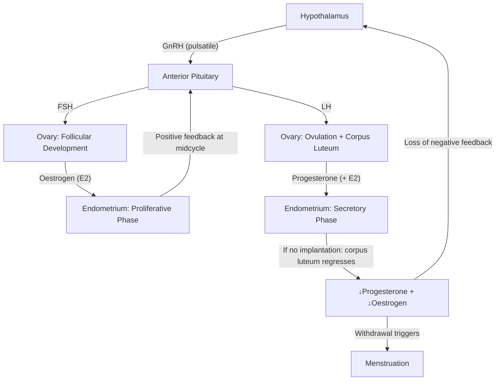

# Menstrual and Vaginal Complaints

## 1. Definition and Scope

**Menstrual and vaginal complaints** encompass a broad spectrum of presentations that bring women to the clinic. Let's break this into two overlapping domains:

- **Menstrual complaints**: Any abnormality in the **timing, duration, volume, or pattern** of menstrual bleeding, as well as **pain associated with menstruation** (dysmenorrhoea). This includes amenorrhoea (absent periods), oligomenorrhoea (infrequent), polymenorrhoea (too frequent), heavy menstrual bleeding (HMB, formerly "menorrhagia"), intermenstrual bleeding (IMB), and postmenopausal bleeding (PMB).
- **Vaginal complaints**: Symptoms referrable to the vagina and vulva — principally **vaginal discharge**, **vaginal/vulval pruritus**, **vaginal dryness**, **dyspareunia** (pain during intercourse), and **vaginal bleeding** outside normal menses (which overlaps with the menstrual category).

> The word **"menstrual"** derives from Latin *mensis* = month. **"Vaginal"** from Latin *vagina* = sheath. These terms literally tell you we are discussing the monthly cycle and the birth canal.

These complaints are extraordinarily common in primary care and gynaecology — they are among the top reasons women consult a doctor — and the clinical approach demands a systematic framework because the differential diagnosis spans benign physiological variation all the way to malignancy and life-threatening emergencies (e.g. ectopic pregnancy, endometrial carcinoma).

<Callout title="Core Principle">
Always think of menstrual and vaginal complaints as a **clinical syndrome**, not a diagnosis. Your job is to figure out **why** — is this structural, hormonal, infective, malignant, pregnancy-related, or iatrogenic?
</Callout>

---

## 2. Epidemiology and Burden

### Menstrual Complaints
- **Heavy menstrual bleeding (HMB)**: Affects approximately **25–30%** of reproductive-age women. In Hong Kong, it is one of the commonest gynaecological referrals [1][2].
- **Dysmenorrhoea**: Primary dysmenorrhoea affects up to **50–90%** of adolescent girls and young women; secondary dysmenorrhoea prevalence depends on the underlying cause (e.g. endometriosis prevalence ~6–10% of reproductive-age women, up to 50% of those with pelvic pain) [2].
- **Amenorrhoea**: Primary amenorrhoea is uncommon (~0.1–0.3%); secondary amenorrhoea affects ~3–5% of reproductive-age women.
- **Abnormal uterine bleeding (AUB)** overall accounts for roughly **one-third of all gynaecological outpatient visits** [2].
- **Postmenopausal bleeding (PMB)**: Affects ~4–11% of postmenopausal women; **~10%** of PMB is due to endometrial cancer — making it a red-flag symptom [2].

### Vaginal Complaints
- **Vaginal discharge**: Extremely common; vaginitis accounts for ~10 million clinic visits per year in the US. The three commonest infectious causes are **bacterial vaginosis (BV, ~40–50%)**, **vulvovaginal candidiasis (~20–25%)**, and **trichomoniasis (~15–20%)** [1].
- **Vulvovaginal pruritus**: Often accompanies discharge but can occur independently (e.g. lichen sclerosus, contact dermatitis).
- **Atrophic vaginitis**: Affects **up to 50%** of postmenopausal women due to oestrogen deficiency.

### Hong Kong–Specific Points
- In HK, sexually transmitted infections (STIs) including *Chlamydia trachomatis* and *Neisseria gonorrhoeae* are notifiable diseases. Chlamydia is the **commonest bacterial STI** in HK, particularly among women aged 15–29 [3].
- Cervical cancer screening (Pap smear / liquid-based cytology) is recommended for women aged 25–64 who have ever had sexual intercourse — relevant because cervical pathology (polyps, ectropion, carcinoma) can present as vaginal discharge or abnormal bleeding [3].
- Endometrial cancer incidence has been **rising** in Hong Kong, in part related to obesity and metabolic syndrome [3].

---

## 3. Risk Factors

### Risk Factors for Menstrual Complaints

| Category | Specific Risk Factors | Mechanism |
|---|---|---|
| **Age / Reproductive stage** | Extremes of reproductive life (perimenarchal, perimenopausal) | Anovulatory cycles → unopposed oestrogen → irregular/heavy bleeding |
| **Obesity** | BMI > 30 | Peripheral aromatisation of androgens → excess oestrogen; insulin resistance → ↑ androgen → anovulation (PCOS pathway) [4][5] |
| **PCOS** | Polycystic ovary syndrome | Chronic anovulation → unopposed oestrogen → endometrial hyperplasia → irregular/heavy bleeding |
| **Thyroid disease** | Hypothyroidism, hyperthyroidism | Hypothyroidism → ↑TRH → ↑prolactin → anovulation; also directly alters SHBG and clotting factors |
| **Coagulopathies** | von Willebrand disease (vWD), platelet disorders | Defective haemostasis → inability to stop endometrial bleeding; **vWD present in 10–15% of women with HMB** [6] |
| **Uterine pathology** | Fibroids, polyps, adenomyosis | Structural distortion of endometrium; ↑endometrial surface area; altered prostaglandin balance |
| ***Oestrogen exposure*** | ***Early menarche (< 12y), late menopause (> 55y), nulliparity, no breastfeeding, HRT, oestrogen-based OCP*** | ***Prolonged/excess oestrogen stimulation of endometrium*** [1][7] |
| **Iatrogenic** | Anticoagulants, IUDs (especially copper), tamoxifen | Anticoagulants impair clotting; copper IUD → local inflammatory reaction → HMB; tamoxifen acts as partial oestrogen agonist on endometrium |
| ***IUCD use*** | ***Intrauterine contraceptive device*** | ***↑Risk of salpingitis, ectopic pregnancy, and altered bleeding pattern*** [1] |
| ***Tubal surgery*** | ***Previous tubal ligation or surgery*** | ***↑Risk of ectopic pregnancy*** [1] |
| ***Infertility*** | ***History of infertility*** | ***Association with endometriosis, salpingitis*** [1] |
| **Drugs** | SSRIs, antipsychotics (↑prolactin), steroids | Hyperprolactinaemia → suppressed GnRH → anovulation |

### Risk Factors for Vaginal Complaints

| Category | Specific Risk Factors | Mechanism |
|---|---|---|
| **Sexual activity** | Multiple partners, new partner, unprotected intercourse | ↑Exposure to STI pathogens |
| **Altered vaginal flora** | Antibiotic use, vaginal douching, spermicides | Destruction of protective lactobacilli → ↑pH → overgrowth of pathogenic organisms (BV, Candida) [8] |
| **Immunosuppression** | Diabetes mellitus, HIV, corticosteroids | ↑Susceptibility to candidiasis (hyperglycaemia provides substrate for Candida) [1] |
| **Pregnancy** | Physiological ↑vaginal discharge; ↑Candida risk | ↑Oestrogen → ↑glycogen in vaginal epithelium → favours Candida |
| **Hypo-oestrogenic states** | Menopause, lactation, surgical oophorectomy | ↓Oestrogen → vaginal atrophy, ↓glycogen, ↓lactobacilli → ↑pH → susceptibility to infection; atrophic vaginitis |
| ***Diabetes*** | ***Known association with vulvovaginal candidiasis*** | ***Glycosuria and tissue hyperglycaemia provide substrate for yeast*** [1] |
| ***Drugs*** | ***Antibiotics, steroids, immunosuppressants*** | ***Alter vaginal microbiome*** [1] |
| **Foreign bodies** | Retained tampon, pessary | Direct irritation, bacterial overgrowth → foul discharge |
| **Chemical irritants** | ***Soaps, deodorants, pessaries, douches*** | ***Contact irritation / allergy → vulvovaginal pruritus and discharge*** [1] |
| ***Latex allergy*** | ***E.g. condoms*** | ***Allergic contact dermatitis of vulva/vagina*** [1] |

---

## 4. Anatomy and Physiology (Relevant Functional Anatomy)

To understand menstrual and vaginal complaints from first principles, you need a solid grasp of the relevant anatomy and the hormonal control of the menstrual cycle.

### 4.1 Pelvic Anatomy

**Uterus**
- A pear-shaped muscular organ (~7–8 cm in nullipara) composed of three layers:
  - **Endometrium** (inner mucosal lining) — the layer that cyclically proliferates and sheds during menstruation
  - **Myometrium** (thick smooth muscle) — provides contractile force for menstruation, labour; site of fibroids (leiomyomas)
  - **Perimetrium** (serosal covering) — continuous with peritoneum
- The **endometrium** has two zones:
  - *Functionalis*: the superficial layer that proliferates under oestrogen, becomes secretory under progesterone, and is shed during menstruation
  - *Basalis*: the deep layer that is NOT shed; it serves as the regenerative source for the functionalis after each cycle

**Cervix**
- The lower narrow portion of the uterus opening into the vagina
- **Transformation zone**: the junction between columnar epithelium (endocervix) and squamous epithelium (ectocervix) — the area most susceptible to HPV-related dysplasia
- **Cervical ectropion** (eversion of columnar epithelium onto ectocervix): common in young women and those on OCP; can cause mucoid discharge and postcoital bleeding — this is physiological, not pathological

**Vagina**
- A fibromuscular tube (~7–10 cm) lined by **non-keratinised stratified squamous epithelium**
- The epithelium is **oestrogen-dependent**: oestrogen stimulates maturation → accumulation of glycogen → Lactobacilli ferment glycogen to lactic acid → maintains **normal vaginal pH of 3.8–4.5**
- This low pH is the key defence against pathogenic organisms [8]
- **Vaginal fornices** (anterior, posterior, lateral) surround the cervix — the posterior fornix is deepest (overlies the Pouch of Douglas; culdocentesis is performed here)

**Ovaries**
- Paired organs responsible for **oogenesis** and **steroidogenesis** (oestrogen, progesterone, androgens)
- Contain follicles at various stages of development

**Fallopian Tubes**
- Transport ovum from ovary to uterus
- Site of fertilisation (ampulla)
- Site of ectopic pregnancy (most commonly in the ampulla, ~70%)

**Pelvic Floor**
- The **levator ani** muscle group (puborectalis, pubococcygeus, iliococcygeus) supports pelvic organs [9]
- Weakness → pelvic organ prolapse (cystocele, rectocele, uterine prolapse) — can present as vaginal complaints (discharge, sensation of "something coming down," urinary incontinence)

### 4.2 The Menstrual Cycle — Hormonal Axis

Understanding the menstrual cycle is absolutely fundamental — nearly every menstrual complaint can be traced back to a disruption somewhere in this axis.

**Phase-by-phase:**

| Phase | Days (typical 28-day cycle) | Hormonal Events | Endometrial Changes |
|---|---|---|---|
| **Menstrual** | Day 1–5 | ↓Oestrogen, ↓Progesterone (withdrawal) | Shedding of functionalis → bleeding |
| **Follicular (Proliferative)** | Day 1–13 | FSH → follicular development → ↑Oestrogen | Oestrogen drives endometrial proliferation (thickening, gland growth, ↑vascularity) |
| **Ovulation** | ~Day 14 | LH surge (triggered by +ve feedback from peak oestrogen) | — |
| **Luteal (Secretory)** | Day 15–28 | Corpus luteum → Progesterone (+ Oestrogen) | Progesterone converts proliferative endometrium to secretory (glands become tortuous, stroma decidualises, spiral arteries develop) |
| **Late Luteal** | Day 26–28 | Corpus luteum regression → ↓Progesterone, ↓Oestrogen | Spiral artery constriction → ischaemia → necrosis → menstruation |

**Key teaching points:**
- **Menstruation is a progesterone-withdrawal bleed**: it's the fall in progesterone (and oestrogen) after corpus luteum regression that triggers spiral artery vasoconstriction, ischaemic necrosis, and shedding of the functionalis.
- **Anovulatory bleeding** occurs when there is NO ovulation → NO corpus luteum → NO progesterone → the endometrium is exposed to **unopposed oestrogen** → it proliferates irregularly and eventually outgrows its blood supply → irregular, often heavy, breakthrough bleeding. This is NOT a true "period" (no prior secretory transformation).
- **Prostaglandins** (PGF₂α, PGE₂) are crucial mediators of menstruation: they promote myometrial contraction and vasoconstriction of spiral arteries. Excess PGF₂α → excessive cramping = primary dysmenorrhoea.

### 4.3 Normal Vaginal Discharge

It is critical to understand what constitutes **normal** discharge before labelling anything as pathological:
- **Composition**: Transudate through vaginal wall + cervical mucus + desquamated epithelial cells + lactobacilli + fluid from Bartholin's and Skene's glands
- **Character**: White or clear, non-offensive odour, does not cause pruritus
- **Volume varies with**: menstrual cycle phase (↑around ovulation due to ↑cervical mucus under oestrogen), pregnancy, sexual arousal, OCP use
- **Normal vaginal pH**: 3.8–4.5 (maintained by Lactobacilli fermenting glycogen → lactic acid)

### 4.4 Natural Defence Mechanisms of the Vagina

| Defence | Mechanism | When Disrupted |
|---|---|---|
| **Lactobacilli** | Ferment glycogen → lactic acid → low pH (3.8–4.5) → hostile to pathogens | Antibiotics, douching, hypo-oestrogen → ↑pH → BV, candidiasis |
| **Oestrogen** | Stimulates glycogen deposition in squamous epithelium → feeds lactobacilli | Menopause, lactation → atrophic vaginitis |
| **Cervical mucus** | Physical barrier + contains IgA, lysozyme, lactoferrin | Ectropion, cervical pathology |
| **Normal vaginal flora** | Competitive exclusion of pathogens | Altered by antibiotics, spermicides |
| ***Vaginal environment related to oestrogen and cervical IgA*** | ***Maintains hostile environment for uropathogens*** | ***Hypo-oestrogen state, spermicidal agents, antimicrobial use*** [8] |

---

## 5. Etiology (with Pathophysiology)

Now let's systematically cover the causes of menstrual and vaginal complaints. I'll organise this by the **PALM-COEIN** classification for abnormal uterine bleeding (AUB) — the FIGO system — and then separately address causes of vaginal discharge and other vaginal complaints.

### 5.1 Abnormal Uterine Bleeding (AUB): PALM-COEIN Classification

> **PALM-COEIN** is the internationally accepted FIGO classification for causes of AUB in non-pregnant reproductive-age women. **PALM** = structural causes (can be imaged/biopsied); **COEIN** = non-structural causes.

| Letter | Category | Key Points |
|---|---|---|
| **P** | **Polyp** | Endometrial or endocervical polyps — localised overgrowths of endometrial tissue with a vascular pedicle |
| **A** | **Adenomyosis** | Endometrial glands within myometrium → diffusely enlarged, boggy uterus |
| **L** | **Leiomyoma (Fibroid)** | Benign smooth muscle tumour; submucosal fibroids most likely to cause AUB |
| **M** | **Malignancy & hyperplasia** | Endometrial hyperplasia (± atypia) and endometrial carcinoma; also cervical carcinoma |
| **C** | **Coagulopathy** | vWD, platelet disorders, anticoagulant therapy |
| **O** | **Ovulatory dysfunction** | Anovulation (PCOS, hypothalamic, thyroid); most common cause of AUB at extremes of reproductive life |
| **E** | **Endometrial** | Primary disorders of endometrial haemostasis (e.g. deficient PGF₂α, ↑plasminogen activator) |
| **I** | **Iatrogenic** | Hormonal contraceptives, IUDs, anticoagulants, tamoxifen |
| **N** | **Not yet classified** | AV malformations, myometrial hypertrophy, others |

#### 5.1.1 P — Polyps
- **Pathophysiology**: Focal overgrowth of endometrial stroma and glands, often with a fibrous core and prominent vasculature. They protrude into the uterine cavity and are covered by endometrium that may be out of phase with the surrounding endometrium → prone to irregular bleeding.
- **Why bleeding?** The polyp's surface can erode/ulcerate, and the vasculature is fragile. Polyps may also interfere with normal endometrial shedding.
- **Risk factors**: Increasing age, obesity, tamoxifen use (tamoxifen is an oestrogen agonist on endometrium), hypertension.

#### 5.1.2 A — Adenomyosis
- **Pathophysiology**: Ectopic endometrial glands and stroma within the myometrium, surrounded by reactive smooth muscle hyperplasia. Think of it as "endometriosis of the uterine wall."
- **Why HMB?** The enlarged uterus has a greater endometrial surface area and the intramyometrial endometrial tissue bleeds during menstruation → the surrounding myometrium cannot contract effectively to compress the spiral arteries → prolonged, heavy bleeding.
- **Why dysmenorrhoea?** The intramyometrial endometrial tissue responds to hormonal cycling → swelling and bleeding within the myometrium → pain (typically worsens progressively throughout the period, distinguishing it from primary dysmenorrhoea which peaks on day 1–2).

#### 5.1.3 L — Leiomyoma (Fibroid)
- **Pathophysiology**: Benign monoclonal smooth muscle neoplasm; **oestrogen- and progesterone-dependent** (grow during reproductive years, shrink after menopause).
- **Classification by location (FIGO sub-classification)**:
  - *Submucosal* (types 0–2): protrude into uterine cavity → **most likely to cause AUB**
  - *Intramural* (types 3–5): within myometrium → may cause AUB if large
  - *Subserosal* (types 5–7): protrude outward → rarely cause bleeding but can cause pressure symptoms
- **Why HMB?** Submucosal fibroids distort the endometrial cavity → ↑surface area, disrupt endometrial vasculature, interfere with myometrial contraction, ↑local prostaglandin and VEGF production → neovascularisation → heavy bleeding.
- **Why dysmenorrhoea?** Uterus contracts against the fibroid (similar to the uterus trying to expel a foreign body).

#### 5.1.4 M — Malignancy & Hyperplasia
- **Endometrial hyperplasia**: Results from **unopposed oestrogen** (without progesterone) stimulation of endometrium → glandular proliferation without adequate secretory transformation. Can be:
  - *Without atypia*: low risk of progression to cancer (~1–3%)
  - *With atypia*: significant risk of progression (~30% if untreated → carcinoma)
- **Endometrial carcinoma**: Most common gynaecological malignancy. Predominantly **Type I** (endometrioid, oestrogen-driven, 80%) associated with obesity, PCOS, tamoxifen, late menopause; **Type II** (serous/clear cell, oestrogen-independent, 20%) more aggressive, occurs in older/thinner women.
- **Why PMB is a red flag**: Any bleeding after 12 months of amenorrhoea in a postmenopausal woman must be assumed to be endometrial cancer until proven otherwise (~10% of PMB is cancer).
- **Cervical carcinoma**: Usually presents as IMB, postcoital bleeding, or offensive discharge. Caused by high-risk HPV (16, 18).

#### 5.1.5 C — Coagulopathy
- **von Willebrand disease (vWD)**: The commonest inherited bleeding disorder; ***present in 10–15% of women with HMB*** [6]. vWF mediates platelet adhesion and carries factor VIII; deficiency → impaired primary haemostasis → mucocutaneous bleeding, including HMB.
- ***Heavy menstrual bleed (60–90%) in women with vWD*** [6].
- Other coagulopathies: platelet function disorders, factor deficiencies, anticoagulant therapy.
- **Always consider coagulopathy in**: HMB since menarche, family history of bleeding, easy bruising, post-surgical/dental bleeding.

#### 5.1.6 O — Ovulatory Dysfunction
- **Commonest cause of AUB at the extremes of reproductive life** (perimenarchal and perimenopausal).
- **Mechanism**: No ovulation → no corpus luteum → no progesterone → **unopposed oestrogen** → endometrial proliferation without secretory transformation → irregular shedding → unpredictable, often heavy bleeding.
- **Causes**:
  - ***PCOS***: Most common cause of anovulatory AUB in reproductive-age women. Insulin resistance → ↑androgens → anovulation [4][5].
  - **Hypothalamic amenorrhoea**: Stress, excessive exercise, low body weight → suppressed GnRH → ↓FSH/LH → anovulation.
  - **Hyperprolactinaemia**: ↑Prolactin → suppresses GnRH → anovulation. Causes: prolactinoma, drugs (antipsychotics, metoclopramide).
  - **Thyroid dysfunction**: Hypothyroidism → ↑TRH → ↑prolactin → anovulation + direct effects on SHBG and clotting factors → AUB.
  - **Perimenopausal**: Declining ovarian reserve → irregular folliculogenesis → erratic oestrogen/progesterone levels → AUB.

#### 5.1.7 E — Endometrial Causes
- Primary disorders of endometrial haemostasis mechanisms:
  - ↓Local endothelin-1 (vasoconstrictor)
  - ↓PGF₂α (promotes vasoconstriction and myometrial contraction)
  - ↑Plasminogen activators (↑fibrinolysis → prevents clot formation → continued bleeding)
  - This is why **tranexamic acid** (antifibrinolytic) works for HMB — it counteracts excessive endometrial fibrinolysis.

#### 5.1.8 I — Iatrogenic
- **Copper IUD**: Local inflammatory reaction in endometrium → ↑prostaglandins → HMB and dysmenorrhoea.
- **Hormonal contraceptives**: Breakthrough bleeding common in first 3 months; progestogen-only methods can cause irregular bleeding.
- **Anticoagulants**: Warfarin, DOACs → impaired clotting → HMB.
- **Tamoxifen**: Partial oestrogen agonist on endometrium → polyps, hyperplasia, cancer risk.
- ***IUCD → salpingitis, ectopic pregnancy*** [1].

#### 5.1.9 N — Not Yet Classified
- Arteriovenous malformations, myometrial hypertrophy, chronic endometritis.

### 5.2 Causes of Dysmenorrhoea

| Type | Definition | Pathophysiology |
|---|---|---|
| **Primary** | Pain with no identifiable pelvic pathology; begins within 1–2 years of menarche when ovulatory cycles establish | Excess **prostaglandins** (especially PGF₂α) released from secretory endometrium → myometrial hypercontractility → ischaemia → crampy pain. This is why **NSAIDs** (prostaglandin synthesis inhibitors) are first-line treatment. |
| **Secondary** | Pain due to underlying pelvic pathology; onset typically later in life or worsening over time | Depends on cause: endometriosis (ectopic endometrial tissue → cyclical inflammation), adenomyosis (intramyometrial bleeding), fibroids (uterine cramping against mass), PID (tubal/ovarian inflammation), cervical stenosis (obstructed outflow) |

### 5.3 Causes of Amenorrhoea

| Type | Definition | Major Causes |
|---|---|---|
| **Primary** | No menarche by age 15 (with secondary sexual characteristics) or by age 13 (without secondary sexual characteristics) | **Hypothalamic**: constitutional delay, Kallmann syndrome (anosmia + GnRH deficiency); **Gonadal**: Turner syndrome (45,X → streak gonads), gonadal dysgenesis; **Outflow obstruction**: imperforate hymen, transverse vaginal septum, Müllerian agenesis (Mayer-Rokitansky-Küster-Hauser syndrome) |
| **Secondary** | Absence of menstruation for ≥ 3 consecutive cycles (previously regular) or ≥ 6 months (previously irregular) | **Always exclude pregnancy first!** Hypothalamic (stress, weight loss, exercise), PCOS, hyperprolactinaemia, thyroid disease, premature ovarian insufficiency, Asherman syndrome (intrauterine adhesions), Sheehan syndrome (postpartum pituitary necrosis) |

### 5.4 Causes of Vaginal Discharge

***The history should include: nature of discharge (colour, odour, quantity, relation to menstrual cycle, associated symptoms), exact nature and location of irritation, sexual history (arousal, previous STIs, number of partners and any presence of irritation or discharge in them), use of chemicals such as soaps, deodorants, pessaries and douches, pregnancy possibility, drug therapy, associated medical conditions (e.g. diabetes).*** [1]

| Cause | Organism/Mechanism | Discharge Character | Pathophysiology |
|---|---|---|---|
| **Physiological** | Normal vaginal flora | White/clear, non-offensive, no itch | Oestrogen-driven transudate + cervical mucus; varies with cycle |
| ***Bacterial vaginosis (BV)*** | Overgrowth of anaerobes (Gardnerella, Prevotella, Mobiluncus) replacing lactobacilli | ***Thin, greyish-white, "fishy" odour*** (especially after coitus or with KOH = positive amine/"whiff" test) | Shift in vaginal microbiome → ↑pH (> 4.5) → anaerobes produce amines → characteristic odour. **NOT a true infection** (no inflammatory response) — more a "dysbiosis" |
| ***Vulvovaginal candidiasis*** | *Candida albicans* (90%) | ***Thick, white, "cottage cheese" curdy, no odour*** | Overgrowth of yeast (predisposed by antibiotics, DM, immunosuppression, pregnancy, OCP) → inflammatory reaction → pruritus + erythema. **pH is normal (< 4.5)** because Candida thrives in acidic environment |
| ***Trichomoniasis*** | *Trichomonas vaginalis* (flagellated protozoan; STI) | ***Profuse, frothy, yellow-green, offensive odour*** | Parasite colonises squamous epithelium → intense inflammatory response → purulent discharge; may cause "strawberry cervix" (punctate haemorrhages) on colposcopy |
| ***Chlamydia*** | *Chlamydia trachomatis* (obligate intracellular bacterium) | ***Mucopurulent, often subtle/asymptomatic*** | Infects columnar epithelium of endocervix → cervicitis → mucopurulent discharge ± IMB, postcoital bleeding. **Often asymptomatic** (up to 70% of women) — this is why screening is critical |
| ***Gonorrhoea*** | *Neisseria gonorrhoeae* | ***Purulent, yellow*** | Similar to Chlamydia but tends to be more symptomatic; can co-exist |
| ***Cervical polyp*** | Benign overgrowth of cervical mucosa | Mucoid or blood-stained | Friable polyp → contact bleeding, excess mucus production |
| ***Atrophic vaginitis*** | Oestrogen deficiency (postmenopausal) | ***Thin, watery, may be blood-stained*** | ↓Oestrogen → thin, dry vaginal epithelium → ↓glycogen → ↓lactobacilli → ↑pH → susceptibility to infection; fragile epithelium → petechiae/bleeding |
| ***Cervical ectropion*** | Eversion of columnar epithelium | Mucoid | Columnar epithelium produces more mucus than squamous → ↑discharge; friable → postcoital bleeding |
| **Foreign body** | Retained tampon, condom, pessary | Foul-smelling, purulent | Bacterial overgrowth on foreign material → secondary infection |
| ***Genital herpes*** | HSV-2 (or HSV-1) | Watery discharge ± vesicles/ulcers | Viral infection of genital mucosa → vesicle formation → ulceration → serous discharge |
| ***Bartholinitis*** | Usually polymicrobial ± gonorrhoea/chlamydia | Unilateral labial swelling ± discharge | Obstruction of Bartholin's gland duct → cyst → secondary infection → abscess |
| ***Threadworms*** | *Enterobius vermicularis* | Perianal/vulval pruritus (especially nocturnal) | Worms migrate from anus to vulva → itching; more common in children |

<Callout title="Exam Pearl — pH is Key!" type="idea">
A simple **pH test** (paper range 4–6) at bedside can help differentiate:
- **pH < 4.5**: Candidiasis (yeast thrives in acid) or physiological
- **pH > 4.5**: BV or Trichomoniasis (loss of lactobacilli → alkaline shift)

This is one of the ***key investigations*** mentioned in the lecture slides [1].
</Callout>

### 5.5 Causes of Pelvic Pain in Women (Overlapping with Menstrual/Vaginal Complaints)

***The pain should be linked with the menstrual history, coitus and the possibility of an early pregnancy.*** [1]

| Timing | Gynaecological | Non-Gynaecological |
|---|---|---|
| **Acute** | Ectopic pregnancy (ruptured/unruptured), ovarian torsion, ruptured ovarian cyst, acute PID, threatened/incomplete miscarriage | Appendicitis, UTI, renal colic, diverticulitis |
| **Cyclical/Chronic** | Endometriosis, adenomyosis, chronic PID, dysmenorrhoea (primary/secondary), ovarian cyst, uterine fibroid | IBS (very commonly coexists — ***dysmenorrhoea is a recognised association of IBS*** [10]), spinal dysfunction (referred pain), nerve entrapment, cholecystitis |
| **Coital** | Deep dyspareunia (endometriosis, PID, ovarian pathology), superficial dyspareunia (vaginismus, vulvodynia, atrophic vaginitis, vulval pathology) | — |

***Masquerades checklist: Depression, Drugs, Spinal dysfunction (referred pain), UTI*** [1]

***"Is the patient trying to tell me something?"*** — ***Can be very relevant. Consider various problems and sexual dysfunction.*** [1]

<Callout title="Don't Forget!" type="error">
**Always exclude pregnancy** in any woman of reproductive age with menstrual complaints, pelvic pain, or abnormal bleeding. A ruptured ectopic pregnancy is a life-threatening emergency. A simple **urine β-hCG** is quick and cheap.
</Callout>

---

## 6. Classification

### 6.1 Classification of Abnormal Uterine Bleeding (AUB)

**By pattern:**

| Term | Definition |
|---|---|
| **Heavy menstrual bleeding (HMB)** | Excessive menstrual blood loss that interferes with physical, social, or emotional quality of life (previously defined as > 80 mL/cycle, but now subjective definition preferred — NICE) |
| **Intermenstrual bleeding (IMB)** | Bleeding between expected periods |
| **Postcoital bleeding (PCB)** | Bleeding after sexual intercourse |
| **Postmenopausal bleeding (PMB)** | Bleeding > 12 months after last menstrual period |
| **Breakthrough bleeding** | Bleeding while on hormonal contraception |
| **Oligomenorrhoea** | Infrequent periods (cycle > 35 days) |
| **Polymenorrhoea** | Frequent periods (cycle < 21 days) |
| **Amenorrhoea** | Absence of menstruation (primary or secondary, as above) |
| **Dysmenorrhoea** | Painful menstruation |

**By aetiology** → PALM-COEIN (as above)

### 6.2 Classification of Vaginal Discharge

- **Physiological** vs **Pathological**
- **Infective** vs **Non-infective**
- **STI** vs **Non-STI**

| Infective | Non-Infective |
|---|---|
| BV, Candidiasis, Trichomoniasis, Chlamydia, Gonorrhoea, Genital herpes, HPV | Cervical ectropion, Polyps, Foreign body, Atrophic vaginitis, Chemical irritation, Malignancy (cervical/endometrial/vaginal) |

---

## 7. Clinical Features

### 7.1 Symptoms

I'll systematically cover the symptoms a patient may present with, along with the pathophysiological basis for each.

#### A. Menstrual Complaints

| Symptom | Clinical Description | Pathophysiological Basis |
|---|---|---|
| **Heavy menstrual bleeding** | "Flooding," passage of clots, needing to change pad/tampon every 1–2 hours, "double padding," soaking through clothing/bedding | Structural (fibroids ↑surface area; polyps have fragile vasculature), hormonal (anovulation → unopposed oestrogen → thick, irregularly shed endometrium), haemostatic (coagulopathy → inability to form/maintain clot in spiral arteries), endometrial (↑fibrinolysis) |
| **Prolonged bleeding** | Period lasting > 7 days | Same as HMB — often the endometrium sheds irregularly and incompletely |
| **Irregular bleeding / IMB** | Unpredictable spotting or bleeding between periods | Anovulatory cycles (no progesterone to stabilise endometrium), endometrial polyps, cervical pathology, hormonal contraceptives, endometritis |
| **Postcoital bleeding** | Bleeding triggered by intercourse | Cervical causes: ectropion (fragile columnar epithelium), polyp, cervicitis (Chlamydia/gonorrhoea), cervical carcinoma. Vaginal causes: atrophic vaginitis (thin fragile epithelium), trauma |
| **Postmenopausal bleeding** | Any bleeding > 12 months after menopause | Endometrial atrophy (most common, ~60–80%), endometrial polyp, endometrial hyperplasia/carcinoma (~10%), cervical pathology, HRT-related |
| **Dysmenorrhoea** | Crampy, suprapubic pain during menses; may radiate to back/thighs | **Primary**: excess PGF₂α → myometrial hypercontractility → ischaemia. **Secondary**: depends on cause — endometriosis (cyclical inflammation of ectopic tissue), adenomyosis (swelling within myometrium), fibroids (uterus contracts against mass) |
| **Amenorrhoea** | Absent periods | Hormonal axis disruption at any level (hypothalamus, pituitary, ovary, uterus, outflow tract); or physiological (pregnancy, lactation, menopause) |
| **Oligomenorrhoea** | Infrequent periods (> 35 days apart) | Usually anovulation or oligo-ovulation — insufficient hormonal drive to complete a cycle regularly (PCOS, hypothalamic, thyroid) |

#### B. Vaginal Complaints

| Symptom | Clinical Description | Pathophysiological Basis |
|---|---|---|
| **Vaginal discharge** | Abnormal in colour, consistency, volume, or odour compared to the patient's normal | Depends on cause (see Section 5.4). Infectious → inflammatory exudate; non-infectious → irritation, atrophy, structural |
| ***Pruritus vulvae*** | Itching of the vulva — can be maddening for patients | Candidiasis (inflammatory reaction to yeast), contact dermatitis (chemical irritants), lichen sclerosus/planus (autoimmune), threadworms, atrophic vaginitis, vulval intraepithelial neoplasia (VIN), ***latex allergy*** [1] |
| **Vaginal dryness** | Discomfort, difficulty with intercourse | ↓Oestrogen → ↓vaginal transudate, ↓glycogen, ↓epithelial thickness → dryness. Commonest in menopause, lactation, and with certain medications (antihistamines, antidepressants) |
| **Dyspareunia** | Pain during intercourse. **Superficial** (at introitus) vs **Deep** (with deep penetration) | **Superficial**: vulvar pathology (lichen sclerosus, vestibulodynia, atrophic vaginitis, Bartholin's cyst/abscess, episiotomy scar), vaginismus (involuntary pelvic floor spasm — often psychogenic). **Deep**: endometriosis (especially uterosacral ligaments), PID/tubo-ovarian abscess, adenomyosis, retroverted uterus, ovarian pathology |
| **Vulval/vaginal swelling** | Lump felt at vulva or vagina | Bartholin's cyst/abscess (posterolateral), prolapse (cystocele/rectocele/uterine), vulval varicosities (pregnancy), Gartner's duct cyst, vulval neoplasm |
| **Offensive odour** | Foul or fishy smell | BV (amines produced by anaerobes), retained foreign body (secondary bacterial overgrowth), trichomoniasis, cervical/endometrial malignancy (necrotic tissue), fistula (vesicovaginal/rectovaginal) |
| **Vaginal bleeding (non-menstrual)** | Spotting, staining, frank bleeding | Cervical pathology, endometrial pathology, vaginal trauma, atrophic vaginitis (see AUB section above) |

#### C. Associated Symptoms to Elicit

These help narrow the differential:

| Symptom | Significance |
|---|---|
| **Pelvic/abdominal pain** | PID, endometriosis, ectopic pregnancy, ovarian pathology, fibroids |
| **Urinary symptoms** (dysuria, frequency, urgency) | UTI (very commonly coexists), urethritis (Chlamydia/gonorrhoea), large fibroid compressing bladder |
| **Fever** | PID, tubo-ovarian abscess, septic abortion |
| **Weight changes** | Weight gain: PCOS, hypothyroidism, Cushing's. Weight loss: hypothalamic amenorrhoea, malignancy |
| **Hirsutism/acne** | PCOS, androgen-secreting tumour, ***acne often occurs in association with hyperandrogenic states, e.g. PCOS*** [11] |
| **Galactorrhoea** | Hyperprolactinaemia (prolactinoma, drugs) |
| **Hot flushes** | Premature ovarian insufficiency, menopause |
| **Bowel symptoms** | Endometriosis (cyclical rectal bleeding, dyschezia), IBS |
| **Fatigue/dizziness** | Iron deficiency anaemia secondary to chronic HMB |
| **Bone pain/SOB** | Metastatic disease (if cervical/endometrial malignancy) |

***For recurrent and chronic pain, instruct the patient to keep a diary over two menstrual cycles*** [1].

### 7.2 Signs (Physical Examination)

***Key examination: Use the traditional abdominal and pelvic examination to identify the site of tenderness and rebound tenderness, and any abdominal or pelvic masses. The pelvis should be examined by speculum (preferably bivalve type) and bimanual palpation.*** [1]

***Proper assessment can be difficult if the patient cannot relax or overreacts, if there is abdominal scarring or obesity, or if extreme tenderness is present. It is therefore important, especially in the younger and apprehensive patient, to conduct a gentle, caring vaginal examination with appropriate explanation and reassurance.*** [1]

#### A. General Inspection

| Sign | Significance | Pathophysiological Basis |
|---|---|---|
| **Pallor** | Anaemia from chronic blood loss (HMB) | Iron deficiency anaemia → ↓Hb → pale mucous membranes |
| **Obesity / central adiposity** | PCOS, metabolic syndrome, ↑oestrogen (peripheral aromatisation) | Adipocytes express aromatase → convert androgens to oestrogens |
| **Hirsutism, acne, androgenic alopecia** | Hyperandrogenism (PCOS, androgen-secreting tumour, CAH) | ↑Androgens → stimulate pilosebaceous unit |
| **Acanthosis nigricans** | Insulin resistance (PCOS, metabolic syndrome) | Hyperinsulinaemia → activates IGF-1 receptors in skin → keratinocyte proliferation |
| **Thyroid abnormalities** | Thyroid disease causing menstrual disturbance | Goitre, exophthalmos (Graves'), myxoedema |
| **Petechiae / bruising** | Coagulopathy (vWD, thrombocytopenia) | Defective haemostasis |
| **Galactorrhoea** | Hyperprolactinaemia | ↑Prolactin → stimulates breast milk production even outside lactation |
| **Signs of Turner syndrome** | Primary amenorrhoea (45,X) | Short stature, webbed neck, wide-spaced nipples, shield chest |
| **Cachexia** | Malignancy, hypothalamic amenorrhoea (anorexia nervosa) | Severe caloric deficit → suppressed GnRH → amenorrhoea |

#### B. Abdominal Examination

| Sign | Significance |
|---|---|
| **Distension** | Large fibroids, ovarian mass, ascites (advanced malignancy) |
| **Palpable mass** | Fibroid uterus (firm, irregular), ovarian mass (smooth or irregular) |
| **Tenderness / guarding / rebound** | PID, ectopic pregnancy, ovarian torsion, ruptured cyst |
| **Surgical scars** | Previous pelvic/abdominal surgery (adhesions → pain; hysterectomy → no menstruation expected) |

#### C. Speculum Examination (Cusco's Bivalve Speculum) [7]

***Inspection with good light includes viewing the vulva, introitus, urethra, vagina and cervix. Look for the discharge and specific problems such as polyps, warts, ectropion, prolapses and fistulas.*** [1]

| Finding | Possible Diagnosis | Why? |
|---|---|---|
| **Cervical ectropion** | Physiological (common in young women, OCP users) | Eversion of columnar epithelium; may cause mucoid discharge, postcoital bleeding |
| **Cervical polyp** | Endocervical polyp | Pedunculated growth visible at os; friable → contact bleeding |
| **Mucopurulent cervical discharge** | Cervicitis (Chlamydia, Gonorrhoea) | Infection of endocervical columnar epithelium → purulent exudate |
| **Cervical ulceration / irregular mass** | Cervical carcinoma | Neoplastic growth → tissue destruction |
| **"Strawberry cervix"** | Trichomoniasis | Punctate subepithelial haemorrhages from parasite-induced inflammation |
| **Vaginal wall prolapse** | Cystocele (anterior), rectocele (posterior), uterine prolapse | Pelvic floor weakness → descent of pelvic organs |
| **Atrophic vagina** | Postmenopausal atrophic vaginitis | Pale, thin, dry epithelium ± petechiae; ↓rugae |
| **Vaginal discharge character** | As per Section 5.4 | Colour, consistency, odour help differentiate |
| **Foreign body** | Retained tampon etc. | Often associated with very offensive discharge |
| **Vulval lesions** | Warts (HPV), ulcers (herpes, syphilis, Behçet's), lichen sclerosus/planus | Each has characteristic appearance |

#### D. Bimanual Pelvic Examination

| Finding | Possible Diagnosis | Pathophysiological Basis |
|---|---|---|
| **Bulky, irregularly enlarged uterus** | Fibroids | Multiple firm nodules within myometrium |
| **Uniformly enlarged, boggy/tender uterus** | Adenomyosis | Diffuse infiltration of endometrial tissue into myometrium → generalised enlargement |
| **Tender uterus with cervical excitation (chandelier sign)** | PID / ectopic pregnancy | Inflamed tubes/ovaries → pain on moving the cervix (transmitted to adnexa) |
| **Adnexal mass** | Ovarian cyst/tumour, ectopic pregnancy, tubo-ovarian abscess | Palpable mass in the adnexa (lateral to uterus) |
| **Fixed, retroverted uterus** | Endometriosis (adhesions), chronic PID | Adhesions tether uterus posteriorly; endometriotic nodules palpable on uterosacral ligaments |
| **Thickened or tender uterosacral ligaments** | Endometriosis | Ectopic endometrial implants on uterosacral ligaments → fibrosis and nodularity |

<Callout title="Clinical Pearl: Cervical Excitation Tenderness">
The **"chandelier sign"** refers to cervical motion tenderness so severe that the patient "reaches for the chandelier." It is classically associated with **PID** and **ectopic pregnancy**. The reason: the inflamed fallopian tubes and ovaries are attached to the uterus, so moving the cervix stretches the inflamed adnexa → severe pain.
</Callout>

---

## 8. Key History and Examination Framework (Summary)

***Key history: The pain should be linked with the menstrual history, coitus and the possibility of an early pregnancy.*** [1]

***Risk factors in the past history should be assessed, for example: IUCD (salpingitis, ectopic pregnancy), infertility (endometriosis, salpingitis), tubal surgery (ectopic).*** [1]

| Domain | Questions to Ask | Why It Matters |
|---|---|---|
| **Menstrual Hx** | LMP, cycle length, duration, regularity, volume (pads/tampons per day, clots, flooding), pain | Determines if the cycle is ovulatory, and characterises the bleeding pattern |
| **Pregnancy Hx** | Possibility of pregnancy? LMP? Contraception? Previous pregnancies (gravidity, parity)? | Rule out pregnancy — ectopic is life-threatening; miscarriage, GTD |
| **Sexual Hx** | Sexually active? Partners? STI history? Dyspareunia? Contraception? | STIs (Chlamydia, gonorrhoea, herpes), PID risk |
| **Discharge Hx** | ***Colour, odour, quantity, relation to menstrual cycle, associated symptoms*** [1] | Characterises the type of vaginitis/cervicitis |
| **O&G Hx** | ***Age at menarche and menopause, pregnancies, age at first pregnancy, breastfeeding, hormonal intake*** [7] | Oestrogen exposure duration → risk for endometrial/breast pathology |
| **Drug Hx** | Anticoagulants, hormonal therapy, antibiotics, antipsychotics, tamoxifen, ***chemicals (soaps, deodorants, pessaries, douches)*** [1] | Iatrogenic causes of AUB and vaginal symptoms |
| **PMHx** | ***Diabetes***, thyroid disease, coagulopathy, PCOS, previous pelvic surgery, ***previous STIs*** [1] | Predisposing conditions |
| **FHx** | Bleeding disorders, PCOS, gynaecological cancers, ***FHx of breast or gyne cancers*** [7] | Hereditary coagulopathy, BRCA, Lynch syndrome |
| **Social Hx** | Stress, exercise, weight changes, eating habits, sexual dysfunction, domestic violence | Hypothalamic amenorrhoea, psychosocial factors |

***"Is the patient trying to tell me something?" — Needs careful consideration; possible sexual dysfunction.*** [1]

---

## 9. Key Investigations (Overview — to be elaborated in Diagnosis section)

***Key investigations:*** [1]
- ***FBE/ESR/CRP***
- ***Urine MC*** (microscopy and culture — to exclude UTI)
- ***Chlamydia PCR***

Additional standard investigations:
- ***pH test with paper of range 4–6*** [1]
- ***Amine or "whiff" test*** [1]
- **Wet mount microscopy** (saline prep for clue cells/trichomonads; KOH prep for yeast hyphae)
- **Urine β-hCG** (always in reproductive-age women)
- **Pelvic ultrasound** (transvaginal preferred — assess endometrial thickness, fibroids, ovarian morphology)
- **Endometrial biopsy** (Pipelle) — indicated for PMB, AUB in women ≥ 45, or younger women with risk factors for endometrial hyperplasia/cancer
- **Cervical cytology / Pap smear** — if due for screening
- **Hormonal profile**: FSH, LH, oestradiol, progesterone (day 21), prolactin, TFTs, androgens (testosterone, DHEA-S) — as guided by clinical suspicion
- **Coagulation screen**: PT, APTT, fibrinogen — if suspected coagulopathy; **vWF panel** if HMB since menarche [6]

---

<Callout title="High Yield Summary">

**Menstrual/Vaginal Complaints — Key Takeaways:**

1. **Always exclude pregnancy** (urine β-hCG) in any reproductive-age woman with abnormal bleeding or pelvic pain.

2. **PALM-COEIN** is the FIGO classification for AUB: **P**olyp, **A**denomyosis, **L**eiomyoma, **M**alignancy/hyperplasia (structural) + **C**oagulopathy, **O**vulatory dysfunction, **E**ndometrial, **I**atrogenic, **N**ot classified (non-structural).

3. **Anovulatory bleeding** = no ovulation → no progesterone → unopposed oestrogen → irregular endometrial shedding. Most common at extremes of reproductive life and in PCOS.

4. **Menstruation is a progesterone-withdrawal bleed**. **Primary dysmenorrhoea** is caused by excess PGF₂α → myometrial ischaemia → NSAIDs are first-line.

5. **von Willebrand disease** is present in **10–15% of women with HMB** — always consider in HMB since menarche or with bleeding history.

6. **Vaginal discharge**: pH < 4.5 → think Candida; pH > 4.5 → think BV or Trichomoniasis. The **amine/whiff test** is positive in BV.

7. **Normal vaginal defence** depends on oestrogen → glycogen → Lactobacilli → lactic acid → low pH. Disruption at any step predisposes to infection.

8. **Postmenopausal bleeding** = endometrial cancer until proven otherwise (~10% of PMB is malignant).

9. ***Key examination***: speculum (bivalve) + bimanual palpation. ***Key investigations***: FBE/ESR/CRP, Urine MC, Chlamydia PCR, pH test, amine test.

10. ***Always ask***: "Is the patient trying to tell me something?" — consider sexual dysfunction, domestic violence, psychosocial factors.

</Callout>

---

<ActiveRecallQuiz
  title="Active Recall - Menstrual/Vaginal Complaints (Definition to Clinical Features)"
  items={[
    {
      question: "What is the FIGO PALM-COEIN classification for AUB? List all 9 categories.",
      markscheme: "PALM (structural): Polyp, Adenomyosis, Leiomyoma, Malignancy/hyperplasia. COEIN (non-structural): Coagulopathy, Ovulatory dysfunction, Endometrial, Iatrogenic, Not yet classified.",
    },
    {
      question: "Explain why anovulatory cycles lead to heavy, irregular bleeding from first principles.",
      markscheme: "No ovulation means no corpus luteum, therefore no progesterone. Endometrium exposed to unopposed oestrogen proliferates without secretory transformation. Eventually outgrows blood supply and sheds irregularly, causing unpredictable and often heavy breakthrough bleeding.",
    },
    {
      question: "A 22-year-old woman presents with HMB since menarche and easy bruising. What inherited condition should you consider and what is the initial screening test?",
      markscheme: "von Willebrand disease (commonest inherited bleeding disorder). Initial screening: CBC, APTT (may be prolonged or normal), followed by vWF antigen, vWF activity (ristocetin cofactor assay), and factor VIII activity.",
    },
    {
      question: "Differentiate bacterial vaginosis, vulvovaginal candidiasis, and trichomoniasis by discharge character, vaginal pH, and key diagnostic test.",
      markscheme: "BV: thin grey-white fishy discharge, pH more than 4.5, positive amine/whiff test with clue cells on wet mount. Candidiasis: thick white cottage-cheese curdy, pH less than 4.5, KOH prep shows hyphae/pseudohyphae. Trichomoniasis: frothy yellow-green offensive, pH more than 4.5, wet mount shows motile trichomonads.",
    },
    {
      question: "Why is postmenopausal bleeding a red-flag symptom and what is the approximate risk of endometrial cancer?",
      markscheme: "Any bleeding more than 12 months after menopause must be investigated to exclude endometrial cancer. Approximately 10 percent of PMB is due to endometrial cancer. Requires transvaginal ultrasound to assess endometrial thickness and endometrial sampling/biopsy.",
    },
    {
      question: "Explain the mechanism of primary dysmenorrhoea and why NSAIDs are first-line treatment.",
      markscheme: "Secretory endometrium produces excess prostaglandins, especially PGF2-alpha, which cause myometrial hypercontractility and vasoconstriction of spiral arteries leading to ischaemia and crampy pain. NSAIDs inhibit cyclooxygenase, reducing prostaglandin synthesis, thus reducing both contractions and pain.",
    },
  ]}
/>

---

## References

[1] Lecture slides: murtagh merge.pdf (pages 2 and 104 — Abdominal pain in women; Vaginal discharge)
[2] Senior notes: felixlai.md (sections on breast cancer risk factors, rectal prolapse, UTI)
[3] Hong Kong Department of Health — Cervical Screening Programme and STI surveillance reports (general knowledge, HK-specific epidemiology)
[4] Senior notes: Ryan Ho Endocrine.pdf (p77 — Type 2 DM, PCOS, metabolic syndrome)
[5] Senior notes: Ryan Ho Endocrine.pdf (p117 — Complications of obesity including PCOS)
[6] Senior notes: Ryan Ho Haemtology.pdf (p128 — von Willebrand disease, HMB prevalence)
[7] Senior notes: Ryan Ho Fundamentals.pdf (p371 — Breast cancer risk factors including O/G history; p196 — Pelvic examination)
[8] Senior notes: Ryan Ho Urogenital.pdf (p122 — UTI, natural defence of urinary tract, vaginal flora)
[9] Senior notes: felixlai.md (section on rectal prolapse — pelvic floor anatomy)
[10] Senior notes: Ryan Ho GI.pdf (p118 — IBS associations including dysmenorrhoea)
[11] Senior notes: Ryan Ho Rheumatology.pdf (p126 — Acne vulgaris, association with hyperandrogenic states e.g. PCOS)
