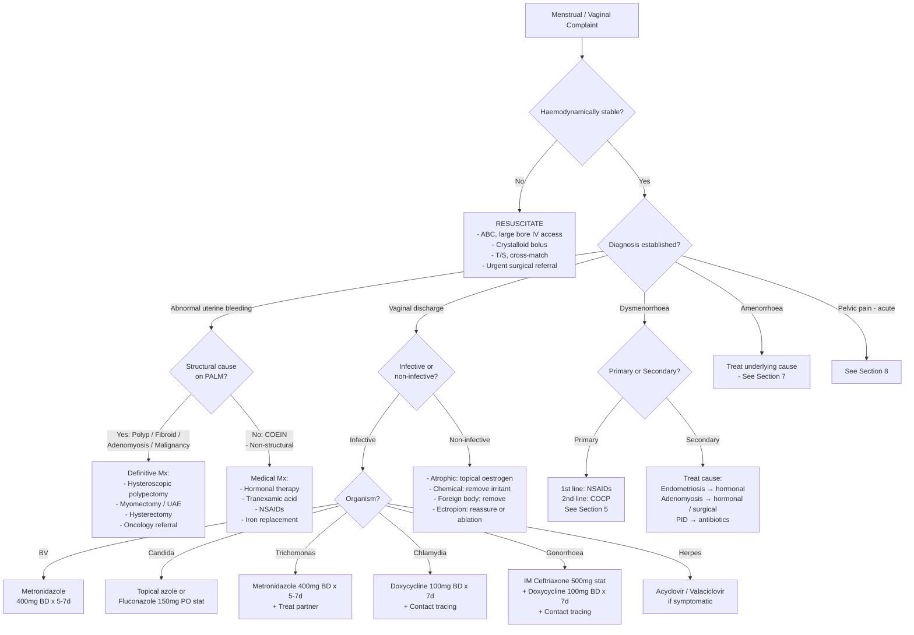

## Management of Menstrual / Vaginal Complaints

Management follows directly from diagnosis. The overarching principle is: **treat the underlying cause, not just the symptom**. But in practice you often need to provide symptomatic relief while working up the cause — and for many conditions (e.g. primary dysmenorrhoea, BV, candidiasis) the management IS the treatment. I'll organise this by clinical scenario, explain the pharmacology from first principles, and give you clear indications and contraindications for every modality.

---

### 1. Principles of Management — Framework

Every patient with menstrual/vaginal complaints needs management structured across four tiers:

1. **Emergency stabilisation** (if haemodynamically unstable — e.g. ruptured ectopic, massive HMB with shock)
2. **Treat the underlying cause** (definitive — e.g. excise polyp, treat PID with antibiotics, remove fibroid)
3. **Symptomatic / medical management** (hormonal therapy for AUB, analgesia for dysmenorrhoea, antifungals for candidiasis)
4. **Prevention and follow-up** (safe sex education, cervical screening, iron supplementation, contact tracing)

---

### 2. Emergency Management — Acute Gynaecological Haemorrhage / Ruptured Ectopic

Before anything else: if a woman presents with haemodynamic instability (tachycardia, hypotension, pallor, cold peripheries) from a gynaecological cause, you must resuscitate.

***Causes of haemorrhagic hypovolaemic shock include ruptured ectopic pregnancy, post-partum haemorrhage, uterine or vaginal haemorrhage*** [18]

***Management of hypovolaemic shock:*** [18]
- ***High flow O₂ with BVM with reservoir***
- ***Volume resuscitation:***
  - ***Obtain large bore IV access (14/16G at antecubital vein)***
  - ***Take blood for CBC, RFT, clotting, T/S***
  - ***Give rapid fluid challenge over 5–10 min (500 mL or 1000 mL crystalloid)***
  - ***Reassess BP/P every 5 min → repeat if not responding***
  - ***Consider Foley's catheter for UO monitoring***
  - ***Consider RBC transfusion depending on Hb if haemorrhagic shock***
- ***Treat underlying cause: may need urgent transferral to OT***
- ***Vasopressors and inotropes are generally unhelpful and are reserved as last resort***

For **ruptured ectopic pregnancy** specifically: immediate surgical management (laparoscopic salpingectomy preferred) once stabilised. This is a surgical emergency — do not delay for further investigations if the clinical picture is clear.

---

### 3. Master Management Algorithm

---

### 4. Management of Abnormal Uterine Bleeding (AUB)

This is the largest section because AUB is so common and encompasses many conditions.

#### 4A. Medical Management of HMB (Non-Structural / COEIN Causes)

The key principle: **medical therapy is first-line** for HMB without structural pathology (or with small intramural fibroids that don't distort the cavity). Choose based on whether the patient desires contraception.

| Agent | Mechanism of Action | Indication | Contraindications | Key Points |
|---|---|---|---|---|
| **LNG-IUS (Mirena)** — levonorgestrel-releasing intrauterine system | Releases levonorgestrel locally → profound endometrial suppression (thin, decidualised, atrophic endometrium) → markedly ↓menstrual blood loss (~96% reduction by 12 months). Also provides contraception. | **First-line for HMB** (NICE). Suitable whether or not contraception desired. Effective for 5 years (8 years per updated licence). | Distorted uterine cavity (submucosal fibroids distorting cavity, Müllerian anomalies), current PID, unexplained PV bleeding (until investigated), pregnancy, cervical/endometrial cancer. | Why it's first-line: most effective medical treatment, avoids systemic side effects, provides contraception, reduces dysmenorrhoea. **Breakthrough bleeding** is common in first 3–6 months → counsel patient. |
| **Tranexamic acid** | Antifibrinolytic — inhibits plasminogen activation → ↓fibrinolysis at the endometrial surface → allows clots to persist → ↓bleeding. Remember: HMB partly results from excess endometrial fibrinolysis (tissue plasminogen activator). Tranexamic acid counteracts this. | HMB (acute and chronic). Taken only during menstruation (1g TDS–QDS for up to 4 days). Can be combined with other agents. | Active thromboembolic disease, history of VTE (relative — use with caution), renal impairment (dose adjust). Commonly stated but evidence for VTE risk is weak. | Non-hormonal → good for women wanting to conceive. Reduces blood loss by ~40–50%. |
| **NSAIDs (mefenamic acid, ibuprofen, naproxen)** | Inhibit cyclooxygenase → ↓prostaglandin synthesis (especially PGF₂α and PGE₂). In the endometrium, prostaglandins mediate vasoconstriction, myometrial contraction, and inflammation. Excess PGE₂ promotes vasodilation → ↑bleeding; NSAIDs shift the balance towards vasoconstriction → ↓bleeding. Also ↓dysmenorrhoea. | HMB + dysmenorrhoea. Taken during menstruation. Particularly useful when dysmenorrhoea coexists. | PUD, aspirin-sensitive asthma, renal impairment, anticoagulant use, 3rd trimester pregnancy. | Reduces blood loss by ~20–30%. Mefenamic acid (Ponstan) 500 mg TDS is commonly used. Less effective than LNG-IUS or tranexamic acid but dual benefit for pain. |
| **Combined oral contraceptive pill (COCP)** | Exogenous oestrogen + progesterone → suppresses HPO axis → thin, stable endometrium → regular, lighter withdrawal bleeds. ***Downregulates HPG axis → ↓ovarian androgen secretion*** [19]. | HMB, especially in younger women desiring contraception. Also used for dysmenorrhoea, endometriosis, PCOS (cycle regulation + anti-androgen effect). | ***Must be balanced against risks: ↑CVS risk, ↑VTE, ↑CA breast, ↑CA cervix*** [19]. Absolute C/I: active/past VTE, known thrombophilia, migraine with aura, uncontrolled HTN, breast cancer, smoker > 35y, hepatic disease. | Reduces blood loss by ~40%. Extended or continuous cycling (skipping placebo week) can be used to ↓frequency of withdrawal bleeds. |
| **Oral progestogens (norethisterone, medroxyprogesterone acetate)** | Progesterone stabilises the endometrium → prevents irregular shedding in anovulatory cycles. In luteal-phase dosing: supports secretory transformation. In long-course dosing (day 5–26): suppresses endometrium. | Anovulatory HMB (e.g. perimenopause, PCOS). Acute HMB (norethisterone 5 mg TDS to stop acute bleeding, then taper). Also for endometrial hyperplasia without atypia. | Liver disease, active VTE, breast cancer, undiagnosed PV bleeding. | Short luteal-phase dosing (day 15–26 only) is LESS effective than LNG-IUS or tranexamic acid. Long-course (day 5–26) is more effective but more side effects (bloating, mood changes, breakthrough bleeding). |
| **Injectable progestogen (DMPA — depot medroxyprogesterone acetate)** | IM injection Q12 weeks → suppresses ovulation + thins endometrium → many women become amenorrhoeic. | HMB, contraception, endometriosis. | Same as oral progestogens. Additional concern: reversible ↓bone mineral density with prolonged use (> 2 years — review need). | Often used when compliance with oral medications is difficult. |
| **GnRH agonists (goserelin, leuprolide)** | Initially stimulate, then downregulate GnRH receptors → pituitary desensitisation → ↓FSH/LH → "medical menopause" → ↓oestrogen → endometrial atrophy. | Pre-operative shrinkage of fibroids, severe HMB as bridge to surgery, endometriosis. Usually max 6 months without add-back HRT. | Osteoporosis (prolonged use), pregnancy. | Not for long-term use alone (bone loss, menopausal symptoms). **Add-back therapy** (low-dose oestrogen + progestogen) required if used > 6 months to protect bone. |
| **GnRH antagonists (elagolix, relugolix, linzagolix)** | Competitively block GnRH receptors → immediate dose-dependent suppression of FSH/LH → ↓oestrogen. Oral administration. Partial suppression possible (avoids full menopausal state). | Fibroids (relugolix combination tablet approved), endometriosis (elagolix). Newer agents — increasingly used. | Osteoporosis risk with full-dose long-term use, pregnancy. | Advantage over GnRH agonists: no initial flare, oral route, dose-titratable partial suppression. |

***Unopposed oestrogen is dangerous in women without hysterectomy as it can ↑risk of CA endometrium*** [20]. This is why we ALWAYS give progesterone alongside oestrogen in HRT or hormonal management of AUB in women with an intact uterus.

<Callout title="Why LNG-IUS First and Not COCP?">
The LNG-IUS delivers progesterone **locally** to the endometrium with minimal systemic absorption → fewer systemic side effects (no VTE risk increase, no effect on BP). It reduces menstrual blood loss by ~96% vs ~40% for COCP. It also provides highly effective contraception (> 99%). The only downside: initial irregular bleeding for 3–6 months, and it requires insertion. But overall it outperforms every other medical option for HMB.
</Callout>

#### 4B. Medical Management of Acute Heavy Menstrual Bleeding

When a patient presents with **acute, heavy ongoing menstrual bleeding** (soaking through pads, Hb dropping):

| Step | Action | Rationale |
|---|---|---|
| 1 | **Assess haemodynamic stability** | If shocked → resuscitate as per hypovolaemic shock protocol [18] |
| 2 | **IV tranexamic acid** (1g IV slowly) if severe | Immediate antifibrinolytic effect |
| 3 | **High-dose oral norethisterone** (5 mg TDS) OR **high-dose IV conjugated oestrogen** (25 mg IV Q4–6H for 24h, then switch to oral progestogen) | Progestogen stabilises the endometrium. IV oestrogen rapidly promotes endometrial proliferation and stabilisation in severely denuded endometrium |
| 4 | **COCP** (monophasic pill, one tablet TDS for 7 days, then taper to one daily) | Alternative to norethisterone — "medical curettage" effect |
| 5 | **Iron replacement** + **check coagulation** | Treat/prevent IDA. Exclude coagulopathy (vWD, thrombocytopenia) |
| 6 | If unresponsive to medical therapy → **surgical intervention** (intrauterine balloon tamponade, D&C, emergency hysteroscopy, or hysterectomy if life-threatening) | Mechanical haemostasis or definitive surgery |

#### 4C. Surgical Management of AUB — Structural Causes

| Condition | Surgical Options | Indications | Key Points |
|---|---|---|---|
| **Endometrial polyp** | **Hysteroscopic polypectomy** (first-line) | Symptomatic polyps (AUB, IMB), large polyps, postmenopausal polyps (↑cancer risk) | Outpatient or day-case procedure. Send specimen for histology always. |
| **Submucosal fibroid** | **Hysteroscopic myomectomy** (FIGO types 0–2) | Symptomatic submucosal fibroids causing HMB or infertility | Can be done via resectoscope. Fibroid must protrude ≥ 50% into cavity for hysteroscopic approach. |
| **Intramural / subserosal fibroid** | **Laparoscopic / open myomectomy** | HMB, pressure symptoms, infertility. Wants to preserve uterus | Uterine scar → risk of uterine rupture in future pregnancy if myometrium breached |
| **Uterine artery embolisation (UAE)** | Interventional radiology — particulate embolisation of uterine arteries → fibroid ischaemia → shrinkage | ***Clinical indication for transcatheter embolisation: uterine fibroid embolisation*** [21] | Not suitable if future pregnancy desired (↑miscarriage risk). Also used for ***post-partum haemorrhage*** [21]. Advantage: uterus-sparing, minimally invasive. |
| **Endometrial ablation** | Destruction of endometrial lining (thermal balloon, radiofrequency, microwave, laser, resectoscopic) | HMB refractory to medical therapy, completed family, no desire for hysterectomy | Must ensure no endometrial cancer before performing. Contraception still required (pregnancy after ablation is dangerous). Not suitable if uterus > 10-week size. |
| **Hysterectomy** | Removal of uterus (total = including cervix; subtotal = retaining cervix). Routes: vaginal, laparoscopic, abdominal | Definitive treatment for HMB refractory to all other Mx, large fibroids, adenomyosis, endometrial hyperplasia with atypia (if childbearing complete), endometrial cancer | Only treatment that guarantees amenorrhoea. Major surgery with risks: VTE, infection, bladder/bowel injury, vaginal vault prolapse. Ovaries can be conserved in premenopausal women if no ovarian pathology. |
| **Adenomyosis** | LNG-IUS (first-line medical), GnRH agonists/antagonists (bridge). Hysterectomy is definitive. Conservative surgery (adenomyomectomy) is technically difficult. | Symptomatic adenomyosis | Adenomyosis is diffuse → you can't "excise" it like a fibroid. Hysterectomy is the only cure. |

#### 4D. Management of Postmenopausal Bleeding (PMB)

| Scenario | Management |
|---|---|
| ET ≤ 4 mm, single episode | Reassure, safety-net ("return if recurrent"). Consider topical vaginal oestrogen if atrophic vaginitis. |
| ET > 4 mm or recurrent PMB | Endometrial biopsy (Pipelle or hysteroscopy-guided). If hyperplasia without atypia → oral progestogen (medroxyprogesterone acetate or LNG-IUS) + surveillance. If hyperplasia WITH atypia → hysterectomy (risk of concurrent/progression to cancer ~30%). If endometrial cancer → refer to gynaecological oncology (staging, surgery ± adjuvant therapy). |
| Cervical cause found on speculum | Cervical polyp → polypectomy + histology. Cervical cancer → refer to oncology. |
| Atrophic vaginitis | Topical vaginal oestrogen (estriol cream or pessary). Very effective, minimal systemic absorption. |

---

### 5. Management of Dysmenorrhoea

#### 5A. Primary Dysmenorrhoea

Remember: primary dysmenorrhoea is caused by **excess prostaglandins (PGF₂α)** from secretory endometrium → myometrial hypercontractility → ischaemia → pain. Treatment targets this mechanism directly.

| Line | Treatment | Mechanism | Notes |
|---|---|---|---|
| **1st line** | **NSAIDs** (ibuprofen 400 mg TDS, mefenamic acid 500 mg TDS, naproxen 250–500 mg BD) | Inhibit COX → ↓PGF₂α + PGE₂ synthesis → ↓myometrial contraction + ↓ischaemia | Start at onset of menses (or 1–2 days before if predictable). Take for 2–3 days. Most effective if started early. |
| **2nd line** | **COCP** (any combined pill) or LNG-IUS | Suppresses ovulation → thin endometrium → ↓prostaglandin production. Also ↓amount of endometrium available to produce prostaglandins. | Good for women who also want contraception. Extended cycling (continuous COCP without breaks) can eliminate menstruation entirely. |
| **Adjuncts** | Heat therapy (hot water bottle), exercise, TENS, dietary supplements (vitamin B1, magnesium, omega-3) | Heat → local vasodilation + muscle relaxation. Exercise → ↑endorphins. TENS → gate control theory of pain modulation. | Evidence moderate but low risk. |

#### 5B. Secondary Dysmenorrhoea

Treat the underlying cause:

| Cause | Management |
|---|---|
| **Endometriosis** | **Medical**: COCP (continuous cycling), progestogens (norethisterone, dienogest, DMPA), LNG-IUS, GnRH agonists/antagonists. **Surgical**: laparoscopic excision/ablation of endometriotic implants, cystectomy for endometriomas. **Pain management**: NSAIDs + neuropathic pain agents (amitriptyline, gabapentin) for chronic pain. |
| **Adenomyosis** | LNG-IUS (first-line), GnRH agonists (short-term). Hysterectomy if refractory and family complete. |
| **PID** | Antibiotics (see Section 6). |
| **Cervical stenosis** | Cervical dilatation. |
| **Fibroids** | As per Section 4C. |

---

### 6. Management of Vaginal Discharge / Vulvovaginitis / Cervicitis

#### 6A. Bacterial Vaginosis (BV)

| Aspect | Detail |
|---|---|
| **1st line** | **Metronidazole 400 mg BD × 5–7 days** (oral) OR Metronidazole 0.75% gel intravaginally × 5 days |
| **Alternative** | Clindamycin 300 mg BD × 7 days (oral) OR Clindamycin 2% cream intravaginally × 7 days |
| **Partner treatment** | NOT required (BV is not an STI) |
| **Pregnancy** | Oral metronidazole preferred (avoid high single-dose regimen). Intravaginal clindamycin in first trimester as alternative. |
| **Recurrent BV** | Maintenance: metronidazole gel twice weekly × 4–6 months. Consider vaginal probiotics (Lactobacillus). |
| **Why metronidazole?** | "Metro" = *metra* (uterus) is a coincidence — actually named after its nitro-imidazole structure. It is selectively toxic to **anaerobes**: anaerobic bacteria reduce the nitro group → cytotoxic intermediates that damage DNA. Aerobic organisms cannot reduce it → spared. BV is an anaerobic overgrowth → metronidazole is targeted therapy. |
| **C/I** | Avoid alcohol during treatment and for 48h after (disulfiram-like reaction: inhibits aldehyde dehydrogenase → acetaldehyde accumulates → nausea, flushing, vomiting). |

#### 6B. Vulvovaginal Candidiasis

| Aspect | Detail |
|---|---|
| **Uncomplicated (occasional, mild-moderate, C. albicans, immunocompetent)** | **Topical intravaginal azole**: clotrimazole 500 mg pessary stat (or 200 mg × 3 nights, or 1% cream × 7 days). OR **Oral fluconazole 150 mg PO stat**. Both equally effective. |
| **Complicated (recurrent ≥ 4/year, severe, non-albicans, immunocompromised, pregnancy)** | Longer course: fluconazole 150 mg day 1 and day 4 (or topical × 7–14 days). For recurrent: fluconazole 150 mg weekly × 6 months (maintenance). Non-albicans (*C. glabrata*): intravaginal boric acid 600 mg daily × 14 days or topical nystatin. |
| **Pregnancy** | **Topical azoles only** (clotrimazole, miconazole). **Oral fluconazole is CONTRAINDICATED** in pregnancy (teratogenic — craniofacial and cardiac defects in high-dose animal studies, FDA Category D). |
| **Partner treatment** | Usually NOT required unless male partner has symptomatic balanitis. |
| **Why azoles work** | Azoles ("conazoles") inhibit **lanosterol 14α-demethylase** (CYP51), a fungal cytochrome P450 enzyme → blocks synthesis of ergosterol (the fungal equivalent of cholesterol in cell membranes) → membrane integrity compromised → fungal cell death. Human cell membranes use cholesterol, not ergosterol → selectivity. |

#### 6C. Trichomoniasis

| Aspect | Detail |
|---|---|
| **1st line** | **Metronidazole 400 mg BD × 5–7 days** (oral) OR Metronidazole 2 g PO stat (single dose — lower cure rate ~85% vs ~95% for 7-day course) |
| **Alternative** | Tinidazole 2 g PO stat |
| **Partner treatment** | **MANDATORY** — *T. vaginalis* is a sexually transmitted pathogen. Treat all sexual partners simultaneously to prevent "ping-pong infection" (***infected partner remains asymptomatic, especially female, and untreated → re-infect the patient after recovery*** [22]). |
| **Pregnancy** | Metronidazole is considered safe in pregnancy (no evidence of teratogenicity despite old concerns). Treat symptomatic trichomoniasis. |
| **Test of cure** | Not routinely required unless symptoms persist. If persistent → consider metronidazole resistance → higher-dose or longer-course metronidazole, or tinidazole. |

#### 6D. Chlamydia (*C. trachomatis*)

| Aspect | Detail |
|---|---|
| **1st line** | ***Doxycycline 100 mg BD × 7 days*** [22] |
| **Alternative** | ***Azithromycin 1 g PO stat*** [22] (previously first-line; now demoted because studies show doxycycline is more effective, especially for rectal Chlamydia) |
| **Pregnancy** | Azithromycin 1 g PO stat (doxycycline is **CONTRAINDICATED** in pregnancy — tetracyclines deposit in developing teeth and bones → dental discolouration and impaired bone growth) |
| **Partner treatment / contact tracing** | **Essential**. Test and treat all partners from preceding 60 days. ***Principles of STI management: secure follow-up for test of cure (treatment failure can be due to non-compliance or re-infection), health education on safe sex, advise cervical cancer screening for females, contact tracing*** [22] |
| **Follow-up** | Test of cure at 3–4 weeks (NAAT may remain positive for weeks post-treatment due to dead organisms → re-test by NAAT ≥ 3 weeks post-treatment). Re-test for re-infection at 3 months. |

#### 6E. Gonorrhoea (*N. gonorrhoeae*)

| Aspect | Detail |
|---|---|
| **1st line** | ***IM ceftriaxone 500 mg stat*** (updated from 250 mg in older guidelines, reflecting rising MIC values) [22]. Plus ***doxycycline 100 mg BD × 7 days*** (to cover likely co-infection with Chlamydia). |
| **Alternative** | ***Spectinomycin 2 g IM stat*** [22] (if cephalosporin allergy — but not effective for pharyngeal gonorrhoea). Gentamicin 240 mg IM + azithromycin 2 g PO as another alternative. |
| **Why ceftriaxone?** | *N. gonorrhoeae* has developed resistance to virtually every antibiotic ever used — penicillin, tetracycline, fluoroquinolones. Third-generation cephalosporins (ceftriaxone) are one of the last reliable agents. IM route ensures adequate single-dose bactericidal levels. |
| **Partner treatment** | Mandatory — as per Chlamydia principles. |
| **Test of cure** | Recommended at 2 weeks post-treatment (culture, or NAAT ≥ 2 weeks post-Rx). |
| ***Complications of untreated gonorrhoea in females***: | ***PID, Fitz-Hugh-Curtis syndrome, peritonitis, bartholinitis, infertility, ectopic pregnancy, prematurity, PROM, chorioamnionitis, septic abortion, post-abortal PID*** [22] |

<Callout title="Always Treat Both!">
When you find one STI, **always test for the other common STIs** (Chlamydia, gonorrhoea, syphilis, HIV, hepatitis B). Co-infection is common. The standard practice when treating gonorrhoea is to **add doxycycline** to cover presumptive Chlamydia co-infection even before results return [22].
</Callout>

#### 6F. Genital Herpes (HSV)

***Treatment:*** [23]
- ***Topical acyclovir is NOT effective!***
- ***Primary infection:***
  - ***Acyclovir 200 mg orally 5 times daily (or 400 mg TID) for 7–10 days; or***
  - ***Famciclovir 250 mg orally TID for 7–10 days; or***
  - ***Valaciclovir 1 g orally BID for 7–10 days***
- ***Episodic treatment:***
  - ***Acyclovir 800 mg TID for 2 days / 400 mg TID for 5 days***
  - ***Famciclovir 1000 mg BID for 1 day / 125 mg BID for 5 days***
  - ***Valaciclovir 500 mg BID for 3 days / 500 mg BID for 5 days***
- ***Prophylaxis for recurrence if > 6 significant relapses per year***
  - ***Acyclovir 400 mg BID***
  - ***Famciclovir 250 mg BID***
  - ***Valaciclovir 0.5–1 g orally once daily***

> **Why acyclovir?** Acyclovir is a guanosine analogue. It requires **viral thymidine kinase** (found in HSV-infected cells but not uninfected human cells) to be phosphorylated to its active triphosphate form → then incorporated into viral DNA by viral DNA polymerase → chain termination. This selectivity for virally-infected cells gives it a high therapeutic index.

- ***General care: topical antibiotics, analgesics, potassium permanganate baths*** [23]
- ***Educate to report HSV history to obstetricians*** (risk of neonatal herpes if active lesions at delivery) [23]

#### 6G. Atrophic Vaginitis (Postmenopausal)

| Aspect | Detail |
|---|---|
| **1st line** | **Topical vaginal oestrogen**: estriol cream (Ovestin) or oestradiol pessary/ring. Applied nightly for 2 weeks then twice weekly maintenance. |
| **Why topical oestrogen works** | Restores oestrogen to vaginal epithelium → ↑glycogen → ↑Lactobacilli → ↓pH → restores natural defence. Also ↑epithelial thickness, ↑vascularity, ↑lubrication. |
| **Systemic absorption** | Minimal with low-dose topical preparations → generally safe even in breast cancer survivors (controversial — discuss with oncologist). No need for endometrial protection with progestogen if using low-dose topical vaginal oestrogen. |
| **Non-hormonal alternatives** | Vaginal moisturisers (e.g. Replens) applied regularly, lubricants during intercourse. Ospemifene (selective oestrogen receptor modulator) orally — alternative if topical not tolerated. |
| **Additional role** | ***Topical oestrogen for postmenopausal women: ↓75% incidence of recurrent cystitis in RCTs*** [24] — relevant when recurrent UTI coexists with atrophic vaginitis. |

#### 6H. Other Specific Conditions

| Condition | Management |
|---|---|
| ***Cervical polyp*** [1] | Avulsion (twisting off at base) in clinic or hysteroscopic polypectomy. Always send for histology. |
| ***Bartholin's cyst / abscess*** | Cyst: observation if small and asymptomatic. Abscess: incision and drainage + Word catheter insertion (keeps tract open for 4–6 weeks to allow marsupialisation). Recurrent: marsupialisation (surgical creation of permanent opening). |
| ***Cervical ectropion*** | Reassurance (physiological). If symptomatic (persistent discharge, PCB): cryotherapy, electrocautery, or silver nitrate ablation. |
| ***Foreign body (retained tampon)*** | Remove under direct vision during speculum examination. Course of metronidazole if secondary infection. |
| ***Chemical / contact vaginitis*** | ***Remove irritant (soaps, deodorants, pessaries, douches)*** [1]. Emollient, barrier cream. Consider ***latex allergy (e.g. condoms)*** [1] → switch to non-latex alternatives. |
| ***Threadworms*** | Mebendazole 100 mg stat (repeat in 2 weeks). Treat entire household. Hygiene measures. |

---

### 7. Management of Amenorrhoea

Treat the underlying cause:

| Cause | Management |
|---|---|
| **PCOS** | Lifestyle (weight loss ↓insulin resistance → can restore ovulation), COCP (cycle regulation + anti-androgen), metformin (↓insulin resistance → may restore ovulation). If fertility desired: letrozole (first-line ovulation induction) or clomifene. ***Spironolactone: potent anti-androgen activity (↓testosterone production, AR antagonist) — limited to female due to risk of gynaecomastia in males; S/E: diuresis, menstrual irregularities, hyperK*** [19] |
| **Hypothalamic amenorrhoea** | Address underlying cause (restore weight, ↓exercise, stress management). If prolonged hypo-oestrogenism → HRT to protect bone. If fertility desired: pulsatile GnRH or gonadotropin therapy. |
| **Hyperprolactinaemia** | If drug-induced: switch/stop causative drug. If prolactinoma: dopamine agonist (cabergoline or bromocriptine) — shrinks tumour + normalises prolactin → restores ovulation. |
| **Premature ovarian insufficiency (POI)** | HRT (oestrogen + progesterone) until average age of menopause (~51y) — essential to protect bone, cardiovascular health, and neurocognition. ***Gonadotropin deficiency in F: oestrogen ± progestogen in the form of COCP. Gonadotropins for ovulation induction (HMG, hCG, recombinant FSH/LH)*** [20] |
| **Thyroid disease** | Levothyroxine for hypothyroidism, antithyroid drugs / RAI / surgery for hyperthyroidism. |
| **Asherman syndrome** | Hysteroscopic adhesiolysis (lysis of intrauterine adhesions) + post-operative oestrogen therapy to promote endometrial regrowth + IUD placement to prevent re-adhesion. |

---

### 8. Management of Acute Pelvic Pain (Gynaecological Emergencies)

| Condition | Management |
|---|---|
| **Ectopic pregnancy** | **Expectant**: if β-hCG < 1500, declining, asymptomatic, able to follow up closely. **Medical**: methotrexate IM (single or multi-dose) — inhibits dihydrofolate reductase → ↓DNA synthesis → destroys rapidly dividing trophoblast. Criteria: haemodynamically stable, β-hCG < 5000 (ideally < 3000), unruptured ectopic < 3.5 cm, no fetal heartbeat. **Surgical**: laparoscopic salpingectomy (preferred if completed family or tubal damage) or salpingotomy (if wants to preserve tube). Emergency laparotomy if ruptured + haemodynamic instability. |
| **Ovarian torsion** | Surgical emergency — **laparoscopic detorsion** (untwist the ovary). Ovarian viability often recovers even if cyanotic. Oophorectomy only if clearly necrotic or postmenopausal. |
| **Ruptured ovarian cyst** | Usually self-limiting — supportive care (analgesia, observation, serial Hb). Surgery if haemodynamically unstable or ongoing bleeding. |
| **PID** | ***Key investigations: FBE/ESR/CRP, Urine MC, Chlamydia PCR*** [1]. Empirical antibiotics — must cover Chlamydia, gonorrhoea, AND anaerobes. **Outpatient** (mild-moderate): IM ceftriaxone 500 mg stat + doxycycline 100 mg BD × 14 days + metronidazole 400 mg BD × 14 days. **Inpatient** (severe, TOA, pregnancy, failed outpatient): IV ceftriaxone + IV metronidazole → switch to oral when improved. **TOA not responding to antibiotics**: ultrasound-guided drainage or surgical drainage. |
| **Miscarriage (incomplete)** | Expectant (if stable, can wait for spontaneous passage), medical (misoprostol PV/PO to promote uterine evacuation), surgical (suction evacuation / D&C) — especially if heavy bleeding, infection, or failed expectant/medical management. |

---

### 9. Management of Recurrent UTI (Overlapping Complaint)

***Management of recurrent cystitis:*** [24]
- ***Behavioural changes:***
  - ***Avoid use of spermicides and diaphragms → use alternative methods***
  - ***Observe personal hygiene → wipe from front to back after voiding***
  - ***Post-coital voiding***
  - ***Hydration to maintain adequate urine output → aim 2–3 L/day fluid intake***
- ***Topical oestrogen for postmenopausal women: ↓75% incidence of recurrent cystitis in RCTs***
- ***Antimicrobial prophylaxis in selected cases:***
  - ***Indication: recurrent UTI-specific symptoms persisting despite non-Rx measures***
  - ***Continuous prophylaxis if no temporal relation to sexual activity***
  - ***Postcoital prophylaxis if temporally related to sexual activity***
  - ***Regimen: usually co-trimoxazole or nitrofurantoin***

---

### 10. Principles of STI Management — Summary

***General principles (FEST):*** [22]
- ***Secure Follow-up*** — for test of cure, re-testing at 90 days for syphilis and HIV serology
- ***Health Education on safe sex*** — proper and consistent condom use, prompt consultation after unsafe sex
- ***Advise cervical cancer Screening for females***
- ***Contact Tracing*** — arrange screening and management for partner
  - ***Ping-pong infection: infected partner remains asymptomatic (especially female) and untreated → re-infect the patient after recovery***
  - ***Epidemiological treatment of contacts: patient can pass a slip with a code to the partner, who can visit SHC to receive treatment*** [22]

***Two management approaches:*** [22]
- ***Syndromic management approach → treatment based on presenting syndrome*** (preferred as patients are often too symptomatic to wait)
- ***Etiological management approach → treatment based on diagnostic tests***

---

### 11. Key Drug Contraindications Summary Table

| Drug | Key Contraindications | Why |
|---|---|---|
| **COCP** | Active/past VTE, thrombophilia, migraine with aura, smoker > 35y, uncontrolled HTN, breast cancer, hepatic disease | Oestrogen → ↑hepatic clotting factor synthesis → ↑VTE risk. Oestrogen → ↑stroke risk in migraine with aura. |
| **Oral fluconazole** | Pregnancy (especially 1st trimester) | Teratogenic (craniofacial, cardiac defects) |
| **Doxycycline** | Pregnancy, children < 8y | Deposits in developing teeth/bones → permanent yellow-brown discolouration, enamel hypoplasia |
| **Metronidazole** | Relative: avoid alcohol during + 48h after | Disulfiram-like reaction (inhibits aldehyde dehydrogenase) |
| **Methotrexate** | Pregnancy (except therapeutic for ectopic), breastfeeding, immunodeficiency, hepatic/renal impairment, blood dyscrasias | Folic acid antagonist → teratogenic (neural tube defects, limb defects). Myelosuppressive. |
| **Isotretinoin** | ***MUST use contraception for female of childbearing potential. C/I in pregnancy*** [19] | Highly teratogenic (craniofacial, cardiac, CNS defects) |
| **GnRH agonists (prolonged)** | Osteoporosis, pregnancy | Hypo-oestrogenism → ↓bone mineral density |
| **Spironolactone** | ***Limited to female (gynaecomastia in males), pregnancy (anti-androgen → feminisation of male fetus)*** [19] | Anti-androgen effects |
| **Tamoxifen** | Pregnancy, concurrent anticoagulation (relative) | Oestrogenic on endometrium → ↑polyps, hyperplasia, cancer |

---

<Callout title="High Yield Summary — Management">

1. **LNG-IUS (Mirena) is first-line for HMB** — 96% reduction in blood loss, provides contraception, ↓dysmenorrhoea. Main limitation: initial irregular bleeding for 3–6 months.

2. **Tranexamic acid** (antifibrinolytic) is first-line **non-hormonal** option for HMB — taken only during menses.

3. **NSAIDs** are first-line for **primary dysmenorrhoea** — directly target excess PGF₂α production.

4. **BV**: metronidazole 400 mg BD × 5–7 days. No partner treatment needed.

5. **Candidiasis**: topical azole or fluconazole 150 mg stat. **Oral fluconazole CONTRAINDICATED in pregnancy.**

6. **Trichomoniasis**: metronidazole + **mandatory partner treatment**.

7. ***Chlamydia: doxycycline 100 mg BD × 7 days (1st line). Gonorrhoea: IM ceftriaxone 500 mg stat + doxycycline*** [22].

8. **PID**: low threshold to treat empirically. IM ceftriaxone + doxycycline + metronidazole × 14 days.

9. ***Genital herpes: oral acyclovir / valaciclovir / famciclovir. Topical acyclovir is NOT effective*** [23].

10. **PMB with ET > 4 mm** → endometrial biopsy to exclude cancer.

11. ***Unopposed oestrogen is dangerous in women without hysterectomy*** [20] — always add progesterone.

12. **STI management principles**: Follow-up, Education, Screening (cervical), Contact Tracing [22].

13. **Ruptured ectopic** → resuscitate + emergency surgery. **Unruptured ectopic** → methotrexate (if criteria met) or surgical salpingectomy/salpingotomy.

</Callout>

---

<ActiveRecallQuiz
  title="Active Recall - Management of Menstrual/Vaginal Complaints"
  items={[
    {
      question: "What is the first-line medical treatment for heavy menstrual bleeding according to NICE guidelines, and why is it preferred over COCP?",
      markscheme: "LNG-IUS (Mirena). Preferred because: delivers progesterone locally to endometrium with minimal systemic absorption, achieves 96% reduction in menstrual blood loss (vs 40% for COCP), fewer systemic side effects (no increase in VTE risk), provides highly effective contraception (more than 99%), and also reduces dysmenorrhoea.",
    },
    {
      question: "A woman with vulvovaginal candidiasis is 10 weeks pregnant. What treatment do you prescribe and what is contraindicated?",
      markscheme: "Prescribe topical intravaginal azole (e.g. clotrimazole pessary or cream for 7 days). Oral fluconazole is CONTRAINDICATED in pregnancy due to teratogenicity (craniofacial and cardiac defects).",
    },
    {
      question: "Outline the empirical antibiotic regimen for outpatient PID and explain why three different classes of antibiotic are needed.",
      markscheme: "IM ceftriaxone 500mg stat (covers N. gonorrhoeae) PLUS doxycycline 100mg BD for 14 days (covers C. trachomatis) PLUS metronidazole 400mg BD for 14 days (covers anaerobes including BV-associated organisms and provides additional coverage for tubo-ovarian abscess). Three drugs needed because PID is polymicrobial.",
    },
    {
      question: "Explain how tranexamic acid reduces heavy menstrual bleeding at the molecular level.",
      markscheme: "Tranexamic acid is an antifibrinolytic agent that inhibits plasminogen activation by blocking the lysine-binding sites on plasminogen. This prevents conversion of plasminogen to plasmin, thereby reducing fibrinolysis at the endometrial surface. HMB is partly caused by excessive endometrial tissue plasminogen activator activity - tranexamic acid counteracts this, allowing clots to persist in the spiral arteries and reducing blood loss by 40-50%.",
    },
    {
      question: "A patient is diagnosed with gonorrhoea. State the first-line treatment and the four principles of STI management.",
      markscheme: "Treatment: IM ceftriaxone 500mg stat PLUS doxycycline 100mg BD for 7 days (to cover presumptive Chlamydia co-infection). Four principles (FEST): Follow-up (test of cure, re-test syphilis/HIV at 90 days), Education (safe sex, condom use), cervical cancer Screening for females, contact Tracing (test and treat partners, epidemiological treatment).",
    },
    {
      question: "What are the criteria for medical management of ectopic pregnancy with methotrexate, and what is its mechanism of action?",
      markscheme: "Criteria: haemodynamically stable, unruptured ectopic less than 3.5cm, no fetal heartbeat, serum beta-hCG less than 5000 (ideally less than 3000), able to follow up for serial beta-hCG. Mechanism: methotrexate inhibits dihydrofolate reductase, blocking the conversion of dihydrofolate to tetrahydrofolate, which is essential for purine and thymidylate synthesis. This inhibits DNA synthesis and cell division, destroying the rapidly dividing trophoblastic tissue.",
    },
  ]}
/>

---

## References

[1] Lecture slides: murtagh merge.pdf (p2 — Abdominal pain in women: key investigations; p104 — Vaginal discharge: key examination, pitfalls, masquerades)
[18] Senior notes: Ryan Ho Critical Care.pdf (p21 — Management of hypovolaemic shock, causes including ruptured ectopic pregnancy)
[19] Senior notes: Ryan Ho Rheumatology.pdf (p128 — COCP mechanism, risks, spironolactone anti-androgen therapy, isotretinoin C/I in pregnancy)
[20] Senior notes: Ryan Ho Endocrine.pdf (p113 — Gonadotropin deficiency management, unopposed oestrogen danger, ovulation induction agents)
[21] Senior notes: Ryan Ho Diagnostic Radiology.pdf (p85 — Uterine fibroid embolisation, uterine artery embolisation for PPH)
[22] Senior notes: Ryan Ho Urogenital.pdf (p243, p249 — STI management principles, gonorrhoea treatment, Chlamydia treatment, contact tracing, ping-pong infection)
[23] Senior notes: Ryan Ho Urogenital.pdf (p247 — Genital herpes treatment: acyclovir, valaciclovir, famciclovir regimens, topical acyclovir ineffective)
[24] Senior notes: Ryan Ho Urogenital.pdf (p126 — Recurrent cystitis management, behavioural changes, topical oestrogen, antimicrobial prophylaxis)
